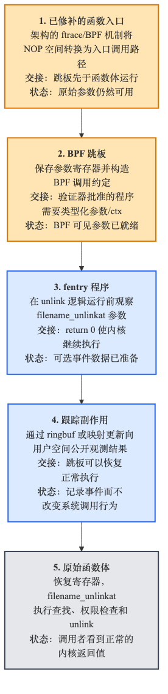
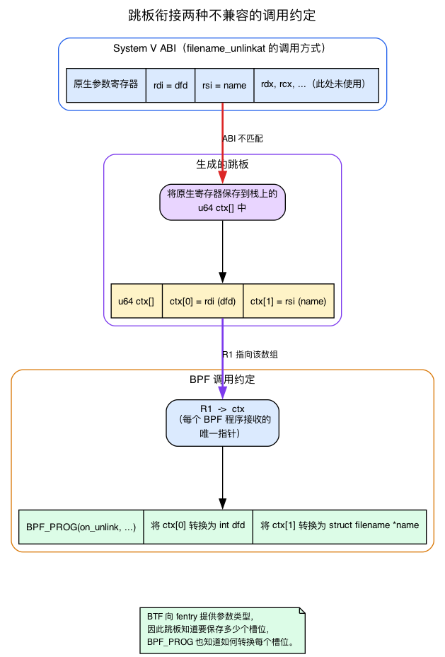
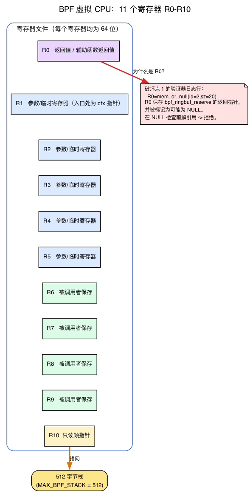
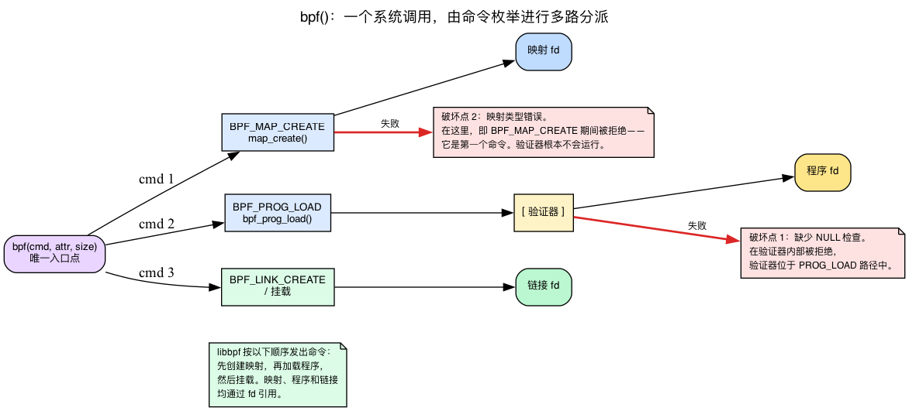
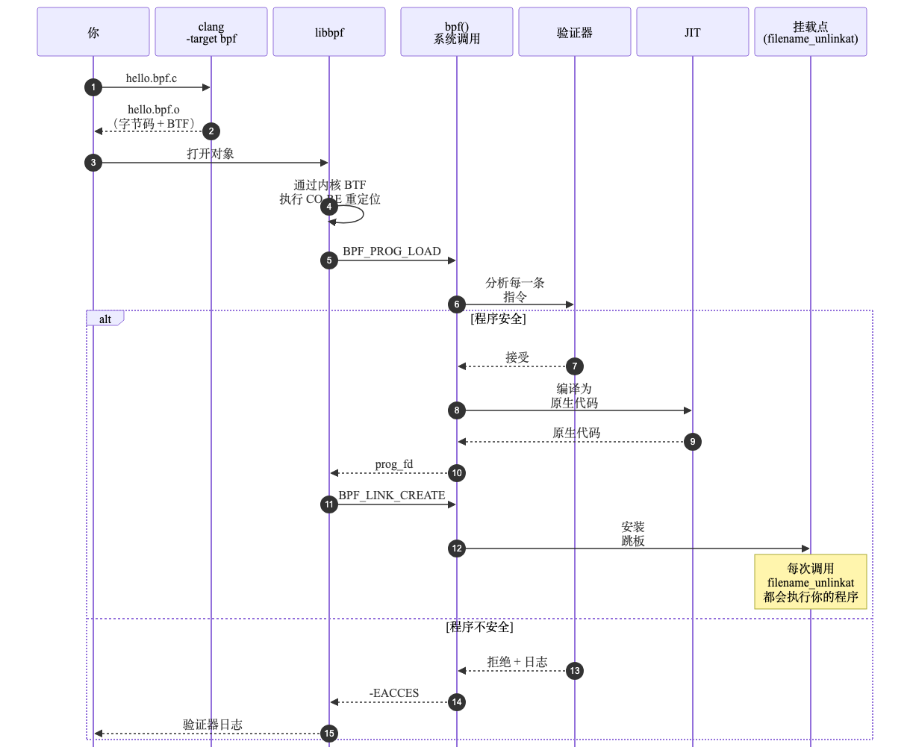
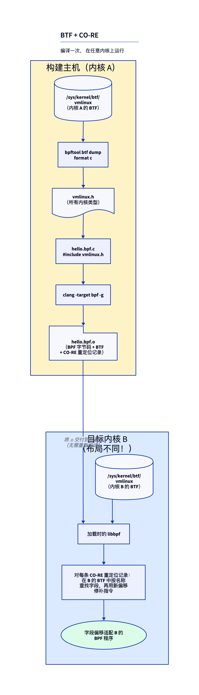
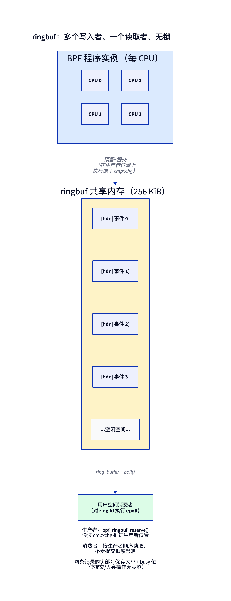

# 第1天 — 首个使用 ringbuf 的 fentry 程序

> **今日任务：** 实时监视系统中的每一次文件删除，所用程序运行在*内核内部*，却不会导致内核崩溃。在此过程中，你将认识支撑这一切的整套机制：BPF 虚拟 CPU、负责加载所有对象的唯一系统调用、即时编译器，以及无需中断内核运行便可挂接程序的代码修补技术。总耗时：约 120 分钟。

## 想监视内核函数，该怎么做？

你可能以为这会很难。内核很忙。它在数十个 CPU 上每秒运行数千个函数。它不知道你的存在。你怎么才能让它在每次有东西调用 `filename_unlinkat` 时拍拍你的肩膀呢？

**你装一个门铃。** 这就是 `fentry`。

对于启用了函数跟踪的 x86_64 内核，奥妙在于：可追踪的内核函数会预留一个入口补丁点，通常显示为一个 5 字节的 NOP 槽位。它平时不起任何作用，直到 ftrace/BPF 将其改造成入口调用路径。

```
filename_unlinkat:
    nop   nop   nop   nop   nop      ← these 5 bytes are reserved for you
    push  %rbp                       ← the actual function body starts here
    mov   %rsp, %rbp
    ...
```

### 那 5 个字节到底是谁的？

那个槽位不是 BPF 的，也不是 BPF 放上去的。它之所以存在，是因为内核在构建时带有**函数入口插桩**（`-pg` / `-mfentry`）：编译器在每个可追踪函数的顶部发出一条 `call __fentry__`（入口存根是 `SYM_FUNC_START(__fentry__)`，位于 `arch/x86/kernel/ftrace_64.S:148`）。在启动时，**ftrace**——内核内置的函数追踪器，自 2008 年就存在——把这些调用点中的每一个都覆写为一个 5 字节的 NOP。它写入的这个 NOP 字面上就是 `x86_nops[5]`（`ftrace_nop_replace()` 在 `arch/x86/kernel/ftrace.c:66` 返回它；表在 `arch/x86/kernel/alternative.c:91`）。

因此，这个补丁点归 *ftrace* 管理。fentry/BPF 并不拥有它——它通过注册一个 ftrace **“direct call（直接调用）”** 来**借用**它，把这个点重新指向*你的* 跳板。今天你不需要学 ftrace；只要记住这一行模型即可：编译器预留槽位，ftrace 拥有它，fentry 把你的程序挂在上面。

当你挂载一个 fentry 程序时，内核会原子地把那个预留的点打补丁成该架构的 ftrace/BPF 入口路径。那条路径通向一个生成的 **跳板**。跳板保存参数，用它们调用*你的* BPF 程序，恢复所有内容，然后让 `filename_unlinkat` 像什么都没发生过一样运行。确切的指令因架构和配置而异；重要的模型是：补丁点 → 跳板 → 原始函数体。



### 跳板究竟有何作用：充当 ABI 桥梁

“保存参数，再用这些参数调用你的程序”乍听之下有些神奇。但为什么必须保存参数？因为被跟踪函数和 BPF 程序采用了两种**互不兼容**的调用方式。

`filename_unlinkat` 是一个普通的 C 函数。在 x86-64 上，System V ABI 规定它的第一个参数到达寄存器 `rdi`，第二个到 `rsi`，以此类推：

```c
int filename_unlinkat(int dfd, struct filename *name)   /* fs/namei.c:5536 */
/*                        ↑ rdi          ↑ rsi                              */
```

相比之下，调用 BPF 程序时，参数**不会**分散在多个原生寄存器中。按照约定，每个 BPF 程序只接收一个指针：它指向 `u64[]` **上下文数组**，并存放在第一个 BPF 寄存器 `R1` 中。下文“认识各位主角”一节会完整介绍 BPF VM 的寄存器；现在只需记住 `R1 → ctx`，也就是“R1 保存程序收到的唯一指针”。程序通过读取 `ctx[0]`、`ctx[1]`、…… 获取输入。

这两种调用约定对不上。原生代码把 `dfd` 放在 `rdi` 里；BPF 代码期望它在 `ctx[0]` 里。**弥合这个鸿沟就是跳板的全部工作：**

1. 在进入时它把原生参数寄存器**溢出（spill）**到栈上的一个 `u64 ctx[]` 数组里：`ctx[0] = rdi (dfd)`、`ctx[1] = rsi (name)`。
2. 它用指向那个数组的 `R1` 调用你的 BPF 程序。
3. 在返回时它**恢复**寄存器并落入 `filename_unlinkat` 的真正函数体中。

那个 `ctx[]` 数组*就是* `BPF_PROG` 宏解包的那个“参数数组”。当你写下

```c
int BPF_PROG(on_unlink, int dfd, struct filename *name)
```

这个宏（位于 `tools/lib/bpf/bpf_tracing.h:672`）展开为把 `ctx[0]` 读为 `dfd`、把 `ctx[1]` 读为 `name`，并把每一个都转换为你声明的类型。这就是 BTF（见下文）的具体回报：**BTF 告诉 fentry 参数类型，于是跳板知道要溢出多少个槽位，而 `BPF_PROG` 知道如何转换它们。**



跳板也不是每个程序独占一个：**每个挂载目标只有一个跳板**。它带有引用计数，由挂载到该目标的所有程序共享。因此，内核使用哈希表按挂载目标索引跳板，后文“在内核里要读什么”一节会再次提到 `bpf_trampoline`。可以这样理解：跳板的首要任务是编排参数（marshalling）；哈希表只负责避免为同一目标重复创建跳板。

> ### 常见疑问
>
> **问：在内核代码运行时修改它，难道不危险吗？**
>
> 答：通常确实危险，但内核从 2008 年起便一直这样工作——`ftrace` 正是采用这种机制。这个 5-NOP 槽位由编译器在构建时*专门*预留，目的就是供内核日后修改。补丁通过内核基于 int3 的 text-poke 机制完成，可安全应对所有 CPU 并发取指；具体文件和行号见文末“在内核里要读什么”一节关于跳板的条目。即使内核正在运行浏览器、数据库和视频通话，也可以安装或移除 fentry 钩子，而不会造成明显卡顿。
>
> **问：为什么不用 kprobe？我在旧教程里一直看到 kprobe。**
>
> 答：kprobe 早于 fentry，工作方式也不同。它把函数的第一条指令覆写为一个软件断点（x86 上是 `int3`）。CPU 陷入（trap），一个处理程序运行你的代码，然后它模拟原始指令并继续。它能用于**任何**函数。这个 trap 很昂贵；fentry 的直接入口路径通常比一次 kprobe trap 便宜好几倍，不过确切数字因 CPU 和内核配置而异。只要 fentry 可用就用它；kprobe 只用于那些少数缺少 BTF 的函数。
>
> **问："BTF"是什么意思，你为什么一直提它？**
>
> 答：先记住这个问题——我们过一会儿就会正式认识 BTF。就第1天而言：相信 BTF 就是那个告诉 fentry `filename_unlinkat` 参数类型的东西，这样你的程序就能声明 `int dfd, struct filename *name` 并让内核以正确的类型把它们交出来。

> ### 动动脑筋
>
> 在 x86_64 上，编译器通常在一个可追踪函数的开头预留一个 **5 字节的 NOP 槽位**。为什么是 5？那是为了容纳多大尺寸的指令而设计的？
>
> .\
> .\
> .
>
> **答案：** x86_64 上的一条 near 相对 `call` 或 `jmp` 是 5 字节——1 个操作码字节加上一个 4 字节的有符号偏移量。这个预留的大小就是为了让 ftrace 能在不移动函数体的情况下给该点打补丁。其他架构使用它们自己的补丁点形状。

---

## 认识各位主角

在动手写代码之前，先来认识所有关键角色。

### 90 秒说清 eBPF

BPF 程序是编译为精简虚拟指令集（BPF）的 C 代码，通过 `bpf()` 系统调用加载到内核。程序运行前，名为**验证器**的静态分析器会证明它是安全的：程序必然终止，不会读取未初始化内存，不会解引用尚未证明有效的指针，而且执行的指令数有明确上限。通过验证后，内核将其 JIT 编译为原生指令，并在选定的**挂载点（attach point）**触发时运行。由于每次加载都要经过验证，程序既不会导致内核崩溃，也不能任意读取内存。程序通过**映射（map）**这种带类型的共享数据结构与用户空间通信。

那一段隐藏了三台值得正式认识的机器：你程序运行其上的虚拟 CPU、把它送进内核的系统调用，以及让它快起来的编译器。让我们一个一个来——一小时之内你就会在错误信息里读到它们的指纹。

### BPF 虚拟机：11 个寄存器和一条 8 字节指令

“精简的虚拟指令集”值得展开说明，因为今天的第一个错误（破坏实验 1）就会在日志中显示寄存器名称。具体来说，BPF 是一个 **64 位的类 RISC 虚拟 ISA**。它恰好有 **11 个寄存器，`R0` 到 `R10`**，每个 64 位宽（`BPF_REG_0 = 0` … `BPF_REG_10`，`__MAX_BPF_REG` 位于 `include/uapi/linux/bpf.h:74`）。每条指令都是固定的 **8 字节编码**——`struct bpf_insn` 位于 `include/uapi/linux/bpf.h:80`——打包了一个操作码、一个目标寄存器、一个源寄存器、一个偏移量和一个立即数。

这些寄存器并非可以互换的。它们有一套**调用约定**，你必须了解它才能读懂验证器的输出：

| 寄存器 | 作用 |
|---|---|
| `R0` | **返回值**——你程序的返回值，*以及*你调用的任何辅助函数的返回值 |
| `R1`–`R5` | **参数 / 临时（scratch）**寄存器，传入辅助函数（且在进入时 `R1` = ctx 指针） |
| `R6`–`R9` | **被调用者保存（callee-saved）**——跨辅助函数调用保持不变 |
| `R10` | **只读帧指针**，指向一个固定的 **512 字节**栈（`MAX_BPF_STACK = 512`、`include/linux/filter.h:98`） |



从这张表可以直接得出两点。第一，`R0 = helper return value`，因此破坏实验 1 中 `bpf_ringbuf_reserve` 的结果会落在 `R0` 中。第二，当验证器打印 `R0=mem_or_null` 时，它在告诉你：`R0` 保存着辅助函数返回的那个指针，而验证器已经把它标记为“可能为 NULL”。在不先检查 NULL 的情况下解引用它（写 `*(u32 *)(r0+0)`）就是它拒绝的那条指令。

验证器怎么*知道* `R0` 可能为 NULL？因为它一次一条指令地走过你的程序，并在走的过程中为**每个寄存器跟踪一个类型和值域范围**。这些状态记录保存在 `struct bpf_reg_state` 里，并由 `check_reg_arg` 之类的例程更新；该例程位于 `kernel/bpf/verifier.c`——正是它打印出破坏实验 1 中的 `R0=mem_or_null`。（第4天会把验证器作为一个角色正式介绍；今天你只需要在它抱怨时认出寄存器名字。）

还有一个能省去后面困惑的区分：这里有**两条不同的指令流**在起作用。**BPF 字节码**是验证器读取的、也是 `struct bpf_insn` 编码的东西。**原生机器码**是真正在 CPU 上运行的东西——而一个单独的阶段，即 JIT，生成它。别把它们混为一谈。

### `bpf()` 系统调用：一扇门，多条命令

一切——创建一个映射、加载一个程序、挂载它——都通过一个**单一的系统调用**进入内核：`bpf()`。恰好只有一个入口点，即 `SYSCALL_DEFINE3(bpf, int, cmd, union bpf_attr __user *, uattr, unsigned int, size)`，位于 `kernel/bpf/syscall.c:6385`，并且它由一个**命令枚举多路复用**（第一个参数，`cmd`）：

- **`BPF_MAP_CREATE`**——创建一个映射并返回一个文件描述符。分派到 `map_create()`（`kernel/bpf/syscall.c:1362`）。
- **`BPF_PROG_LOAD`**——提交一个程序的指令 + BTF，**运行验证器**，并返回一个文件描述符。分派到 `bpf_prog_load()`（`kernel/bpf/syscall.c:2864`）。
- **`BPF_LINK_CREATE`** / 各种挂载命令——把一个已加载的程序接到一个挂载点上。

libbpf 替你发出这些命令，**按顺序**：先创建映射，然后加载程序，然后挂载。（命令名称定义在 `include/uapi/linux/bpf.h` 里。）



破坏实验 2 之所以会出现那种结果，正是因为**创建映射和加载程序是两条独立命令**。当你给映射错误的类型时，内核在 `BPF_MAP_CREATE` 期间拒绝它——*早在* `BPF_PROG_LOAD` 被发出之前，所以验证器（它位于加载路径中）根本从来没运行过。“在加载器处失败，早于验证器”不是挥手带过；它字面上就是一条不同的 `cmd`。

还要注意一个反复出现的名词：**文件描述符。** 映射、程序和链接（link）*全都*通过 `bpf()` 返回的 fd 引用。这是用户空间中所有相关对象的底层表示：`hello.c` 里的 `skel->maps.rb` 和 `bpf_map__fd(skel->maps.rb)`，都只是映射 fd 的带类型包装。一般而言，**映射**是由 `BPF_MAP_CREATE` 创建、驻留在内核中的带类型键/值对象，并通过该 fd 在内核与用户空间之间共享。Ringbuf（见下文）是一种映射*类型*；`BPF_MAP_TYPE_ARRAY`（破坏实验 2 误用的那个）是另一种。

### JIT：BPF 字节码变成原生机器码

一旦验证器接受了你的字节码，内核不会逐事件地*解释*它——那会很慢。相反，**BPF JIT**（“just-in-time（即时）”编译器）把每条 BPF 指令重写成等价的**原生 CPU 指令**（这里是 x86-64）。翻译器是 `bpf_int_jit_compile()`，位于 `arch/x86/net/bpf_jit_comp.c:3718`；它在 `do_jit()` 中（大约在 `:1652`）走过程序，把原生代码发射进一个由 `struct jit_context` 描述的缓冲区（`:310`）。

三件要内化的事：

- JIT 在 `BPF_PROG_LOAD` 路径内**运行一次，在加载时**——*不是*在每个事件上。当挂载点触发时，它直接跳进已经编译好的原生代码。
- 在大多数生产内核上 JIT 是**默认开启**的，由 `bpf_jit_enable` sysctl 控制；把它设为 `2` 会额外为调试转储 JIT 镜像（`if (bpf_jit_enable > 1)` 位于 `arch/x86/net/bpf_jit_comp.c:3843`）。存在一个解释器兜底路径，但那是慢路径。
- 这就是为什么 fentry + JIT 便宜到可以在一台繁忙的机器上一直挂着——就是第一个愚蠢问题里的“不会卡顿”这一说法。在挂载点处，没有 trap 也没有解释器循环：只是原生代码调用原生代码。



*（在那张生命周期图里，**JIT** 阶段坐落在“验证器接受”和“在挂载点运行”之间：它把已验证的 **BPF 字节码**转成**原生 x86 指令**，那才是当 `filename_unlinkat` 被调用时真正执行的东西。）*

### 验证器（一个反复出现的角色）

> **验证器：** *嗨。我是守门人。在我证明它安全之前，内核里什么都别想运行。我一次一条指令地读你的程序。我跟踪每个寄存器的类型。我跟踪每个内存区域的边界。我跟踪你取的每一个引用。如果你做了什么我无法证明安全的事——碰一个可能为 NULL 的指针、跑一个我无法定界的循环、泄漏一个引用计数——我就拒绝你的程序。我的错误信息不总是好看，但每一条都告诉你我在哪一条确切的指令上失去了信心。仔细读。我们会经常一起工作。*

你会在第4天认识验证器。现在，只管写出让它满意而不必刻意去讨好它的代码。（而现在你已经字面地知道“跟踪每个寄存器的类型”是什么意思了——`R0` 到 `R10`，每个一个类型，一条指令一条指令地更新。）

### `SEC()`——段名约定

每个 BPF 程序都属于编译后目标文件里的一个段。段名告诉 **libbpf** 如何加载和挂载该程序。前缀是程序类型；后缀是挂载目标：

```c
SEC("fentry/filename_unlinkat")    // type=fentry, attach to kernel symbol filename_unlinkat
SEC("xdp")                    // type=xdp, attach point provided by userspace
SEC("tp/sched/sched_switch")  // type=tracepoint, on the sched_switch tracepoint
```

完整的表位于 `tools/lib/bpf/libbpf.c` 里——搜索 `static const struct bpf_sec_def section_defs[]`（`:9987`）。把它加进书签。每当一个 `SEC()` “不管用”时，那就是你要查的文件。

### BTF（BPF Type Format，BPF 类型格式）

BTF 是内核对外暴露的一种关于它自身的、类似调试信息的紧凑格式。运行中的内核在 `/sys/kernel/btf/vmlinux` 发布它完整的类型信息。BPF 对象发布关于它们自己类型的 BTF。BTF 为你会不断用到的四样东西提供动力：

1. 对带类型指针的**验证器类型检查**（`PTR_TO_BTF_ID`）。
2. 加载时的 **CO-RE** 字段偏移量重定位。
3. fentry/fexit/tp_btf 程序的**带类型参数解包**——就是前面那座 ABI 桥梁，落到实处：它就是让 `BPF_PROG(on_unlink, int dfd, struct filename *name)` 解析到正确的槽位和转换的东西。
4. **Kfunc 签名匹配**（第20天）。

源码：`kernel/bpf/btf.c`。

### vmlinux.h

一个从内核 BTF 生成的 C 头文件，包含 BPF 程序可以命名的内核类型。你可以用 `bpftool btf dump file /sys/kernel/btf/vmlinux format c` 从一台运行中的主机生成一个。

仓库自带的实验编译时针对的是随 libbpf-bootstrap 一起锁定版本的架构头文件，而不是每个读者机器上每次重新生成的一个文件。这给了 CI 和本地构建同一个稳定的类型宇宙；在加载时，CO-RE 仍会针对**运行中**内核的 `/sys/kernel/btf/vmlinux` 解析所访问的字段。如果你在这个脚手架之外开发，从一个已知参考内核生成 `vmlinux.h` 是等价的工作流。

### CO-RE——Compile Once, Run Everywhere（一次编译，处处运行）

正因如此，BPF 程序才不会因内核版本变化而轻易失效。你针对来自某个内核的 `vmlinux.h` 编译一次；libbpf 在加载时用*目标*内核的 BTF 重定位字段偏移量。同一个 `.bpf.o` 在内核 6.6 和内核 7.1 上都能运行，即使结构体布局变了。



### libbpf

位于 `tools/lib/bpf/` 的用户空间库。它打开你的 `.bpf.o`，用运行中内核的 BTF 应用 CO-RE 重定位（`bpf_object__relocate_core` 位于 `tools/lib/bpf/libbpf.c:6082`），调用 `bpf()` 系统调用来加载程序和创建映射——按那个顺序发出 `BPF_MAP_CREATE` 然后 `BPF_PROG_LOAD` 然后挂载命令——挂载它们，并返回句柄。它是权威的加载器。别自己写。

### 骨架文件（`*.skel.h`）

一个由 `bpftool gen skeleton hello.bpf.o > hello.skel.h` 生成的自动头文件。它为用户空间提供 BPF 对象中每个映射和程序的带类型访问器：`skel->maps.rb`、`skel->progs.on_unlink`。在底层每一个都是围绕 `bpf()` 所返回的 fd 的包装。这个生成的文件约 200 行直白的代码——打开看一次，它就不再显得神秘了。

### ringbuf——你今天要用的事件通道

一个内核→用户空间的事件通道，也是众多映射类型之一。**多生产者（任意 CPU），单消费者（一个用户空间读取者），保持跨 CPU 顺序。** 生产者并非完全无锁运行：在 `__bpf_ringbuf_reserve` 内部，它们通过一个内部的、每 ringbuf 一个的自旋锁（`raw_res_spin_lock_irqsave` 作用于 `rb->spinlock`，`kernel/bpf/ringbuf.c:478`）短暂地串行化，同时推进生产者位置，然后每个调用者写入它自己不相交的切片。



两套 API：

- `bpf_ringbuf_output(&rb, data, sz, 0)`——拷贝式。简单。
- `bpf_ringbuf_reserve(&rb, sz, 0)` → 直接写入 → `bpf_ringbuf_submit(ev, 0)`——零拷贝。首选。

在大多数用途上取代了 **perfbuf**（`BPF_MAP_TYPE_PERF_EVENT_ARRAY`）。Perfbuf 是每 CPU 的，需要 N 个用户空间消费者，跨 CPU 会丢失顺序。只有当每 CPU 峰值写入速率比顺序更重要时才用 perfbuf。源码：`kernel/bpf/ringbuf.c`。

---

## 实验

### 设置（一次性）

从 [Lab environment（实验环境）](lab-environment.md) 页开始，然后在 Linux 实验主机上的本书仓库中运行这些命令：

```bash
git submodule update --init --recursive
cd ebpf/labs
./scripts/preflight.sh
make hello
```

该仓库锁定了 libbpf-bootstrap 及其所有嵌套依赖。共享的 Makefile 构建那个确切的 libbpf 和 bpftool，为你的架构选择锁定版本的 `vmlinux.h`，编译 `day01/hello.bpf.c`，生成 `.output/day01/hello.skel.h`，并链接 `.output/day01/hello`。没有任何东西被系统级安装。

你仍然需要带 `-target bpf` 的 Clang 17 或更新版本、一个 C 编译器和 Make，外加 libelf 和 zlib 的开发头文件。`preflight.sh` 检查这些输入，但从不安装软件包或调用 `sudo`。

### `hello.h`——共享的事件记录

生产者和消费者包含同一个头文件，这样布局变化就不会悄悄地让两边失去同步：

```c
{{#include ../labs/day01/hello.h}}
```

### `hello.bpf.c`——内核侧

这份清单是从实验构建和 CI 编译的那个文件里引入的：

```c
{{#include ../labs/day01/hello.bpf.c:book}}
```

对每一行新内容的逐行讲解：

- `#include "vmlinux.h"`——拉入每一个内核类型，包括原型里用到的 `struct filename`。
- `char LICENSE[] SEC("license") = "GPL";`——一个加载时的门禁，不是法律建议。内核*只有*在一个非 GPL 程序调用一个仅限 GPL 的辅助函数时才拒绝它。许多最有用的辅助函数是仅限 GPL 的（`bpf_probe_read_kernel`、`bpf_get_current_task`、`bpf_get_stackid`、……），但这个实验用到的四个简单辅助函数*都不是*——所以这一行今天尚不起作用（见破坏实验3）。
- `#include "hello.h"`——通过 ringbuf 发送的共享 `struct hello_event`。Ringbuf 传输原始字节，所以两边必须就这个布局达成一致。
- `SEC(".maps")` 块——现代的映射声明语法。`__uint(...)` 宏（来自 `bpf_helpers.h`）产生 BTF，加载器用它来知道这是一个 256-KiB 的 ringbuf。（这就是驱动 libbpf 发出 `BPF_MAP_CREATE` 命令来创建 `rb` 的那份 BTF。）
- `SEC("fentry/filename_unlinkat")`——挂载点。`filename_unlinkat` 在 `fs/namei.c` 里，在每次 `unlink()` 和 `unlinkat()` 系统调用时被调用。
- `BPF_PROG(on_unlink, int dfd, struct filename *name)`——来自 `bpf_tracing.h` 的宏，将跳板的参数数组解包为带类型的参数 `dfd` 和 `name`（这正是前述 ABI 桥梁的具体体现）。
- `bpf_ringbuf_reserve` 返回一个有效指针或 NULL（当 ringbuf 满时）。返回值落在 `R0` 里，验证器把它标记为 `mem_or_null`，而它要求你在写穿它之前先做 null 检查。
- `bpf_get_current_pid_tgid()`——读取当前正在运行的任务（下文马上会进一步解释这里的“任务”）。结果被打包为 `(tgid << 32) | pid`；Linux 的用户空间"PID"就是内核的 TGID。`>> 32` 提取用户可见的 PID。
- `bpf_get_current_comm`——拷贝 task 的 `comm` 字段最多 16 个字节。总是 16，总是以 null 填充。
- `bpf_ringbuf_submit` 让预留的条目对消费者可见。

#### 一段话的复习：“任务”以及 16 是从哪来的

那些辅助函数里有两个读取“当前 task”，而那个魔数 `16` 出现时没有任何解释——所以，简短地说：内核里每个可调度的线程都由一个 `struct task_struct` 表示。BPF 所称的 **`current`** 就是此刻在这个 CPU 上运行的那个线程的 `task_struct`，而 `bpf_get_current_pid_tgid` / `bpf_get_current_comm` 都从它里面读取字段。`comm` 字段是一个固定大小、NUL 填充的**短线程名**——你会在实验输出里看到的那个 `rm`——声明为 `char comm[TASK_COMM_LEN]`，位于 `struct task_struct` 中（`include/linux/sched.h:1173`）。而 `TASK_COMM_LEN` 是 **16**（`include/linux/sched.h:325`）。所以那个 `16` 在 `sizeof(event->comm)` 中并不是随意的；它是内核在编译时那个字段的大小。这就是全部复习内容——我们改天再正经做一次 `task_struct` 之旅；今天你只需要让“总是 16”和“task 的 comm”不再是未经解释的常量。（上面 pid-vs-tgid 的拆分已经讲了为什么我们要右移 32。）

### `hello.c`——用户空间侧

加载器检查每一个 libbpf 步骤，验证 ringbuf 记录大小，处理 SIGINT/SIGTERM，并在每条退出路径上释放消费者和骨架：

```c
{{#include ../labs/day01/hello.c:book}}
```

`bpf_map__fd(skel->maps.rb)` 正是 `BPF_MAP_CREATE` 在加载期间返回的那个映射 fd——用户空间侧轮询该 fd，内核侧则向对应映射写入数据。

### 运行它

```bash
make hello
sudo ./.output/day01/hello
# in another terminal:
scratch=$(mktemp -d /tmp/ebpf-day01.XXXXXX)
touch "$scratch/one" "$scratch/two"
rm "$scratch/one" "$scratch/two"
rmdir "$scratch"
```

预期输出：

```
PID 13421 rm deleted a file
PID 13421 rm deleted a file
```

在一台繁忙的机器上你还会看到一些行，它们的 `comm` 是 `rm` 之外的其他东西——包管理器、编辑器把临时文件另存覆盖、`/tmp` 的搅动。那不是 bug；那正是关键所在。你的门铃在系统里*每一次* `unlink`/`unlinkat` 上都会响，而不只是你的那次。找到那两行 `comm` 为 `rm` 的记录。

恭喜。你刚刚在一个内核函数上装了一个门铃。

---

## 按顺序进行破坏实验

这是你不能跳过的部分。每一次破坏都教你一个概念。

### 破坏实验 1 — 去掉 NULL 检查

移除 `if (!event) return 0;`。重新构建。验证器会拒绝，输出类似这样：

```
0: (85) call bpf_ringbuf_reserve#131
1: R0=mem_or_null(id=2,sz=20)
2: (7b) *(u32 *)(r0 +0) = r1
R0 invalid mem access 'mem_or_null'
```

那是验证器在说：*你的寄存器 R0 是一个可能为 NULL 的指针；你在证明它不为 NULL 之前不能解引用它。* 你现在确切地知道了为什么是 `R0` 而不是别的寄存器——按照调用约定 `R0` 是辅助函数返回值所在的地方，所以当指令 2 试图写穿它时，`bpf_ringbuf_reserve` 的那个可能为 NULL 的指针正坐在 `R0` 里。

要以完整细节看到这一点，在你的加载器选项里设置 `kernel_log_level = 1`：

```c
LIBBPF_OPTS(bpf_object_open_opts, opts, .kernel_log_level = 1);
skel = hello_bpf__open_opts(&opts);
```

或者用 `bpftool prog load file.o /sys/fs/bpf/x` 并读取 stderr。

### 破坏实验 2 — 错误的映射类型

把 `BPF_MAP_TYPE_RINGBUF` 改成 `BPF_MAP_TYPE_ARRAY`。现在加载器在验证器甚至还没运行*之前*就失败：

```
libbpf: map 'rb': failed to create: Invalid argument
```

这就是系统调用那一节里 `BPF_MAP_CREATE`-vs-`BPF_PROG_LOAD` 的拆分，被显示了出来。一个 ARRAY 映射需要一个键大小和值大小，而一个裸的 `SEC(".maps")` ringbuf 式声明并不提供它，所以内核在 `BPF_MAP_CREATE` 期间拒绝它——那是 libbpf 发出的第一条命令。而验证器所住的 `BPF_PROG_LOAD` 从来没运行过。那就是**加载时**错误（映射配置错误）和**验证时**错误（程序逻辑不安全）之间的区别。不同的层，不同的命令，不同的失败模式。习惯于注意到究竟是哪一层报错。

### 破坏实验 3 — 移除 LICENSE

先试试最明显的事：删掉 `char LICENSE[] SEC("license") = "GPL";` 那一行并重新构建。程序**照旧加载并运行**。惊讶吗？GPL 门禁只有在你的程序*调用一个仅限 GPL 的辅助函数*时才触发，而 `hello.bpf.c` 里的四个辅助函数（`bpf_ringbuf_reserve`、`bpf_ringbuf_submit`、`bpf_get_current_pid_tgid`、`bpf_get_current_comm`）没有一个是仅限 GPL 的。

要让门禁真正生效，先先触发这道门禁。在 `on_unlink` 里加一个仅限 GPL 的辅助函数调用：

```c
(void)bpf_get_current_task();   // bpf_get_current_task is a GPL-only helper
```

现在再次删掉 LICENSE 那一行并重新构建。*这一次*加载失败了：

```
cannot call GPL-restricted function from non-GPL compatible program
```

教训：license 字符串是一个加载时门禁，**只有**对仅限 GPL 的辅助函数才会生效。在继续之前把 LICENSE 那一行放回去（并且你可以把那次 `bpf_get_current_task` 调用再去掉）。

### 破坏实验 4 — 预留得比你写入的多

> ### 动动脑筋
>
> 在你运行任何东西之前：`sizeof(struct hello_event)` 是多少？这个结构体是一个 4 字节的 `__u32 pid` 后面跟着一个 16 字节的 `char comm[16]`。把它们加起来——你过一会儿就会看到这个数字被打印为 `size=`。
>
> .
> .
> .
>
> **答案：** 20。这里没有填充要担心——一个 `__u32` 需要 4 字节对齐，而 `char[16]` 只需要 1，所以 4 + 16 的布局无缝地打包，没有间隙。把"20"记在心里；`20 → 21` 的偏移正是这次破坏的全部要点。

这里的教训是，**ringbuf 记录的大小是在 reserve 时确定的，而不是在 submit 时**。已签入的 `handle_event()` 故意拒绝 `sizeof(*event)` 之外的任何大小，所以把那个相等检查替换成一个下界检查，并打印交付的 `size`：

```c
if (size < sizeof(*event)) {
    fprintf(stderr, "short ringbuf record: %zu\n", size);
    return 0;
}
printf("PID %u %.*s deleted a file (size=%zu)\n", event->pid,
       (int)sizeof(event->comm), event->comm, size);
```

重新构建并运行**未经修改的**程序。现在每一行都以记录大小结尾：

```
PID 13421 rm deleted a file (size=20)
```

`sizeof(struct hello_event)` 是 20——一个 4 字节的 `pid` 加一个 16 字节的 `comm`。现在过度分配预留，同时仍然只写入 `sizeof(*event)` 字节：

```c
event = bpf_ringbuf_reserve(&rb, sizeof(*event) + 1, 0);
```

验证器接受它（你预留得够多）。重新构建，运行，再删一个文件：

```
PID 13421 rm deleted a file (size=21)
```

记录大了一个字节，即使你写入了相同的字节——长度是在你**reserve** 时固定的，而不是在你 **submit** 时。（那个尾随字节是未初始化的；我们不打印它，`20 → 21` 大小的差值就是可观察的信号。）在继续之前把原来的 `sizeof(*event)` 预留和精确大小的消费者检查恢复回去。

---

## 在内核里要读什么

在你的 `~/code/linux` 检出里打开这些文件。浏览，别去背。

- **`kernel/bpf/trampoline.c`**——查看文件顶部。找到 `arch_prepare_bpf_trampoline` 和 `bpf_trampoline_get`。跳板按（目标、程序列表）组合创建，带有引用计数，并在程序挂载或卸载时重建（`bpf_trampoline_update`，`kernel/bpf/trampoline.c:607`）。注意，`bpf_trampoline` 不只是单个桩，而是一个以挂载目标为键的哈希表。（参数暂存/恢复代码本身由 `arch_prepare_bpf_trampoline` 在 `arch/x86/net/bpf_jit_comp.c:3536` 处生成，实际工作由 `:3213` 处的 `__arch_prepare_bpf_trampoline` 完成——这就是跳板一节所说的 ABI 桥梁在源码中的具体实现。）重新指向该位置的补丁由基于 int3 的 text-poke 机制 `smp_text_poke_*` 安装（`smp_text_poke_int3_handler` 位于 `arch/x86/kernel/alternative.c:2838`，驱动 `:2781` 处成批的 `struct smp_text_poke_loc` 数组），可安全应对每个 CPU 上并发的指令取指。
- **`kernel/bpf/ringbuf.c`**——`bpf_ringbuf_reserve` 很短。注意每条记录的头部（`struct bpf_ringbuf_hdr`、`:88`）以及那个 `BUSY` 位（`BPF_RINGBUF_BUSY_BIT`，在 `:529` 处设置），它让 `submit` 和 `discard` 无竞争地完成收尾。
- **`tools/lib/bpf/libbpf.c`**——搜索 `find_sec_def`（`:10212`）。滚动那张 `section_defs[]` 表（`:9987`）。你现在知道存在的每一个前缀了。这个文件也是 CO-RE 重定位被启动的地方（`bpf_object__relocate_core`、`:6082`）。

### 可选：阅读生成的骨架

```bash
./.output/bpftool/bootstrap/bpftool gen skeleton .output/day01/hello.bpf.o
```

它会打印与 `.output/day01/hello.skel.h` 中相同的骨架代码。通读一次便会发现，其中只是调用 `bpf_object__find_map_by_name` 等函数的自动生成样板代码，并不神秘。

---

## 要点回顾

- BPF 是一个 **64 位虚拟 ISA**：11 个寄存器 `R0`–`R10`，固定 8 字节的 `struct bpf_insn`。`R0` = 返回/辅助函数返回值，`R1`–`R5` = 参数，`R6`–`R9` = 被调用者保存，`R10` = 指向 512 字节栈的只读帧指针。验证器为每个寄存器跟踪一个类型——那就是 `R0=mem_or_null` 的来源。
- **`bpf()` 是一个系统调用，由命令枚举多路复用：** `BPF_MAP_CREATE`（→ 映射 fd）、`BPF_PROG_LOAD`（运行验证器 → 程序 fd）、挂载命令。映射、程序和链接全都是 **fd**。libbpf 按顺序发出它们——这就是为什么一个坏映射会*早于*验证器就失败（破坏实验 2）。
- 在验证器接受字节码之后，**JIT** 在加载时把它一次性翻译成原生机器码；挂载点随后以原生速度运行原生代码。
- BPF 程序是编译成一个“先验证再 JIT”的指令集的 C 代码；它们不会让内核崩溃。
- **fentry** 修改由编译器 `-mfentry` 插桩预留、归 *ftrace* 管理的 5 字节 NOP 槽位；BPF 通过 ftrace “direct call” 借用该槽位，使其跳转到生成的跳板。**跳板负责衔接 ABI**：它把原生参数寄存器（`rdi`、`rsi`、……）溢出到 `u64 ctx[]` 数组中，以 `R1 → ctx` 调用你的程序，再由 `BPF_PROG` 将各槽位转换回带类型的参数。其开销通常仅为 kprobe trap 的几分之一。
- 补丁由内核基于 int3 的 text-poke 机制安装，`smp_text_poke_*`，对每个 CPU 上并发的指令取指是安全的。
- 尽可能使用 **fentry**。只在没有 BTF 的函数上使用 **kprobe**。
- **`SEC()`** 是 libbpf 用来加载和挂载的段名约定。前缀命名程序类型并告诉 libbpf 挂载到哪里。
- **vmlinux.h** 从内核 BTF 生成，按名字给你每一个内核类型；**BTF** 也告诉 fentry 参数类型，这样跳板和 `BPF_PROG` 就在槽位上达成一致。
- **CO-RE** 让你一次编译、在任何内核上运行；libbpf 在加载时重定位字段偏移量。
- **ringbuf** 是一种映射类型——多生产者单消费者、带跨 CPU 顺序——是你默认的内核→用户空间通道。
- **`current`** 是正在运行线程的 `struct task_struct`；`comm` 是它的 16 字节（`TASK_COMM_LEN`）NUL 填充名字——那就是“总是 16”的来源。
- 存在两个失败层：**加载时**（映射/对象配置错误）和**验证时**（程序逻辑不安全）。
- 总是检查 `bpf_ringbuf_reserve` 和 `bpf_map_lookup_elem` 的返回值——两者都可能返回 NULL（在 `R0` 里）而验证器知道这一点。

---

## 检查问题

如果两个 CPU 并发调用 `bpf_ringbuf_reserve(&rb, 64, 0)`，记录会重叠吗？

<details>
<summary>点击揭示答案</summary>

**答案：** 不会。在 `__bpf_ringbuf_reserve` 内部，生产者通过一个内部的、每 ringbuf 一个的自旋锁短暂地串行化，同时推进生产者位置，所以每个调用者都得到一个不相交的切片。Submit/discard 的顺序可能与 reserve 的顺序不同，消费者通过每条记录头部上的 `BUSY` 位来处理这一点。在 `BUSY` 被 `submit`/`discard` 清除之前，消费者看不到一条记录。

</details>

---

## 明天

第2天：加入哈希映射，实现每 PID 计数器，并学习**映射元素生命周期**。你还会看到，不清理映射的追踪器如何逐渐耗尽容量，最终持续触发 ENOSPC。
