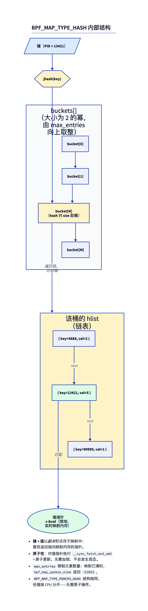
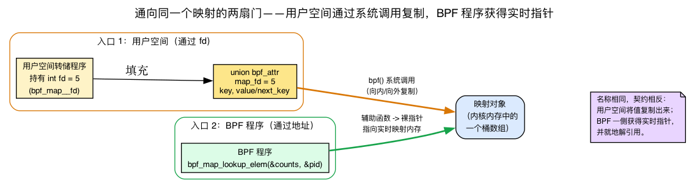
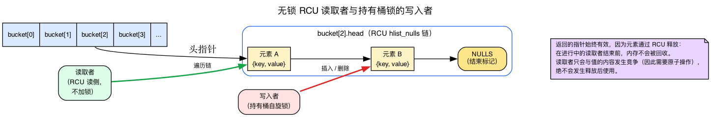
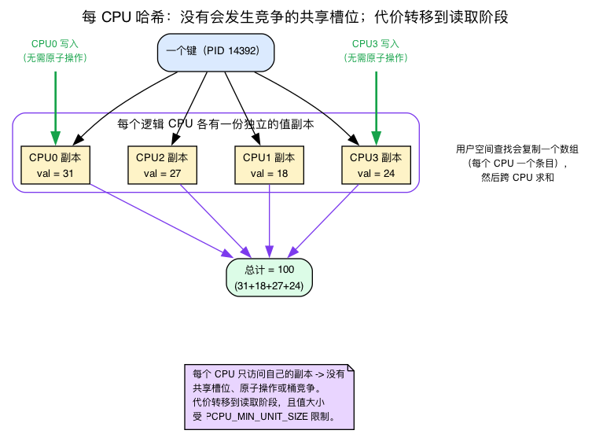
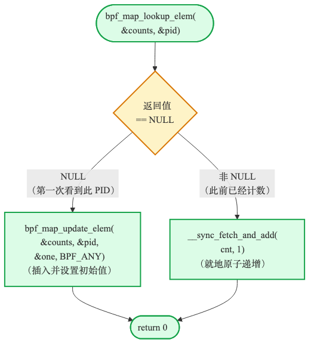

# 第2天 — 哈希映射与按 PID 计数

> **今日任务：** 按 PID 统计 `unlink()` 的调用次数，并按需输出不断累积的计数。你将理解哈希映射的内部结构，包括桶数组、无锁查找和每 CPU 变体；了解验证器掌握哪些查找信息、用户空间如何通过文件描述符访问内核中的映射，以及追踪器为何必须及时清理条目，否则最终将无法继续工作。总时长：约 110 分钟。

## 共享的笔记本

昨天你把事件一个接一个地发送到用户空间。这对流式传输有用，但当你想要一份*汇总*——“每个 PID 调用 `unlink` 多少次？”——时就帮不上忙了。

你需要一本内核与用户空间共享的**笔记本**：BPF 程序在其中写入计数，用户空间则随时读取。它位于内核内存中，在程序的多次调用之间持续存在，直到你将其销毁。

那就是**映射（map）**。今天使用的是 `BPF_MAP_TYPE_HASH`。

不过，“共享笔记本”这个比喻隐藏了三个容易出错的关键点。今天余下的内容会逐一讲清楚：

1. **用户空间究竟如何触及一个内核映射。** BPF 侧和用户空间侧通过两扇完全不同的门与*同一个*映射对话——而且令人困惑的是，通过两个*同名*的函数。
2. **为什么内核可以把指向映射内存的裸指针交给 BPF 程序，并允许程序直接解引用**，而无需加锁。（剧透：RCU。）
3. **为什么每 CPU 映射完全规避了竞态**——这意味着要知道“每 CPU 内存”究竟是什么。

我们会在遇到实验中依赖它的那一部分时，逐一讲解每一点。

---

## 认识各位主角

### `BPF_MAP_TYPE_HASH`——最常用的主力映射

一个内核驻留的哈希表。固定容量（`max_entries`），键/值大小在创建时声明，可从 BPF 和用户空间访问。它内部是一个**大小为 2 的幂的桶数组**，每个桶持有一条由 `{key, value}` 对组成的链式列表。查找会对键做哈希，把它掩码到一个桶索引，然后遍历该链。



这些词里的每一个你都能在源码里看到。在 `kernel/bpf/hashtab.c` 中：

```c
/* kernel/bpf/hashtab.c:80 */
struct bucket {
    struct hlist_nulls_head head;   /* the chain of elements */
    rqspinlock_t            raw_lock;
};
```

桶索引就是哈希掩码到数组大小——而由于数组是 2 的幂，那次掩码只是一个 `&`：

```c
/* kernel/bpf/hashtab.c:686 — select_bucket() */
return &__select_bucket(htab, hash)->head;   /* index = hash & (n_buckets - 1) */
```

今天值得记住的要点：

- **查找返回一个指向映射内存的指针**——不是拷贝。你可以读它。你可以原子地更新它。你不能做的，是假设它非 NULL。而且，尽管那个*元素*不会在你使用期间被释放（RCU 保证了这点——见下文），它的*内容*却可能被并发地改变，所以给计数器加一需要一个原子操作。
- **`max_entries` 是一个硬上限。** 一旦装满，插入就以 `-E2BIG` 失败（`is_map_full` → `ERR_PTR(-E2BIG)` 于 `hashtab.c:1108`）。没有自动驱逐。（如果你想要驱逐，存在 LRU 和 LRU-percpu 变体；见第11天。）
- **不用你来加锁。** 内核在内部处理桶级别的同步——我们稍后就会看到*具体如何*，因为那正是返回的指针可安全解引用的原因。至于值的原子更新，你要在值指针上使用 `__sync_fetch_and_add` 及其同类。
- **每 CPU 变体**（`BPF_MAP_TYPE_PERCPU_HASH`）：形状相同，但每个 CPU 拥有自己的值槽。不需要原子操作；用户空间必须跨 CPU 求和才能得到总量。当竞争重要时使用它（高频计数器，例如 XDP）。

源码位于 `kernel/bpf/hashtab.c`。查找函数是 `htab_map_lookup_elem`（`:752`），更新函数是 `htab_map_update_elem`（`:1171`）。通读一次这个文件，今天结束时你就会发现，其中真正关键的部分并不神秘。

### 一个映射的两扇门：映射 fd，以及两个都叫 `bpf_map_lookup_elem` 的函数

有件事教程从不告诉你，而当你*第一次*把 BPF 侧和用户空间侧放到同一个屏幕上时，它会让你困惑：**`bpf_map_lookup_elem` 是两个契约完全相反的、彻底不同的函数的名字。** 今天你会把两者都写出来，在两个不同的文件里。我们现在就把它们分开，这样你就永远不会绊在上面。

**首先：从每一侧看，映射是什么？** 一个已加载的映射是内核中的同一个对象——就是我们刚刚看过的那个桶数组。无论 BPF 程序还是你用户空间的转储器都不直接持有指向它的指针。它们以两种不同的方式触及它：

- **BPF 程序**通过其声明的*地址*来引用该映射（`&counts`）。在加载时，内核把它重写成对内核对象的直接引用。程序运行在内核*内部*，所以当它请求一个元素时，它得到的是一个**直指当前映射内存的裸指针**。
- **用户空间**无法持有内核指针。它通过一个**整数文件描述符**来引用映射——与打开文件时用的那种小整数是同一类东西。`bpf_map__fd(skel->maps.counts)` 从骨架（skeleton）中取出那个 fd。（昨天你为 ringbuf 用过完全相同的 `bpf_map__fd`，而我从没告诉你那个整数*是什么*——现在你知道了：它就是一个内核对象的句柄，仅此而已。）



**现在讲这两个函数。** 它们同名，做的却几乎是相反的事：

| | BPF 侧 `bpf_map_lookup_elem(&counts, &pid)` | 用户空间 `bpf_map_lookup_elem(fd, &key, &val)` |
|---|---|---|
| 它是什么 | 一个**BPF 辅助函数**，运行在内核内部 | 一个围绕 `bpf()` 系统调用的 **libbpf 包装** |
| 它接受映射的方式 | **地址**（`&counts`） | **文件描述符**（一个整数） |
| 你得到的返回 | 一个指向映射内存的**指向当前映射内存的指针**（`PTR_TO_MAP_VALUE`） | 什么都没有——它把值**拷贝出来**放进你的缓冲区 |
| 你读取结果的方式 | 解引用返回的指针 | 读取你传入的 `&val` |

用户空间侧是个*薄包装*。打开 `tools/lib/bpf/bpf.c`，你会发现它只做一件事：填一个结构体并发出一次系统调用：

```c
/* tools/lib/bpf/bpf.c:407 */
int bpf_map_lookup_elem(int fd, const void *key, void *value)
{
    union bpf_attr attr;
    memset(&attr, 0, attr_sz);
    attr.map_fd = fd;
    attr.key    = ptr_to_u64(key);
    attr.value  = ptr_to_u64(value);          /* a buffer to copy INTO */
    ret = sys_bpf(BPF_MAP_LOOKUP_ELEM, &attr, attr_sz);
    return libbpf_err_errno(ret);
}
```

每一个用户空间映射调用都遵循这个完全相同的模式——填一个 `union bpf_attr`，调用 `sys_bpf(...)`：

- `bpf_map_update_elem(fd, …)` → `sys_bpf(BPF_MAP_UPDATE_ELEM, …)`（`bpf.c:390`）
- `bpf_map_delete_elem(fd, …)` → `sys_bpf(BPF_MAP_DELETE_ELEM, …)`（`bpf.c:469`）
- `bpf_map_get_next_key(fd, …)` → `sys_bpf(BPF_MAP_GET_NEXT_KEY, …)`（`bpf.c:498`，系统调用在 `:509` 发出）

最后一个函数 `bpf_map_get_next_key` 用于在用户空间*迭代*映射：传入一个键，它便返回下一个键。`bpf_map_get_next_key` 背后并没有一次就能遍历完整映射的系统调用——每次调用只返回一个键，因此 `get_next_key` 循环必须在用户空间执行。（一个单独的批量 API，`BPF_MAP_LOOKUP_BATCH`，每次系统调用能拉取许多条目——那是 `bpftool map dump` 所用的——但那不是 `get_next_key` 所做的。）**这就是为什么下面 `count.c` 里的转储循环是一个普通的用户空间 `while` 循环，而不是 BPF 代码。**

所以当你看到 BPF 侧的 `bpf_map_lookup_elem` 返回一个你去解引用的指针，而用户空间侧的 `bpf_map_lookup_elem` 拷贝进一个你去读取的缓冲区时——同名，相反的契约。把它们分清楚，今天余下的部分就轻松了。

### 为什么内核信任你拿着一个裸指针：RCU 查找与一把每桶锁

回到前面暂时搁置的一个断言：*查找返回一个指向当前映射内存的指针，不需要锁，而且你可以解引用它。* 仔细想想，这原本应该非常危险。就在那一瞬间，另一个 CPU 可能正在同一个桶里插入或删除。你的程序遍历那条链并解引用一个元素，却**完全不加锁**，怎么会是安全的？

答案是针对两种不同工作的两种不同同步机制——而知道哪个是哪个，就能解释你今后关于哈希映射会问的每一个“我这里需要原子操作吗？”的问题。

**工作 1——读（查找）：RCU，无锁。** RCU（Read-Copy-Update）是一种内核同步方案，读者从不加锁也从不阻塞，而释放则被推迟，直到每一个进行中的读者都完成为止——这两个保证正是我们这里需要的全部。每个桶的链不是普通的链表；它是一条**受 RCU 保护的 `hlist_nulls`**（那个 `struct hlist_nulls_head head;` 里的 `struct bucket`）。两个性质使无锁遍历安全：

- **读者在 RCU 读侧临界区中运行，*不*获取任何锁。** 因此，辅助函数可以直接把裸指针交给程序：这里根本没有需要持有或释放的锁。源码甚至按是否需要锁给这两个遍历器打了标签：

  ```c
  /* hashtab.c:691 — needs the bucket lock */
  /* this lookup function can only be called with bucket lock taken */
  static struct htab_elem *lookup_elem_raw(...)

  /* hashtab.c:705 — the RCU read-side walk, used by the lookup helper */
  /* can be called without bucket lock. it will repeat the loop in
   * the unlikely event when elements moved from one bucket into another
   * while link list is being walked */
  static struct htab_elem *lookup_nulls_elem_raw(...)
  ```

- **元素是 RCU 释放的。** 当一个写者移除一个元素时，内存不会被回收，直到所有进行中的读者都完成。所以你程序正在查看的元素*在使用期间不可能被释放*。你的“先判空再解引用”只在与值的*内容*竞争（这就是你仍然需要原子操作来给计数器加一的原因），从不与释放后使用（use-after-free）竞争。这种 `_nulls` 变体的列表正是为了让无锁读者能检测到“这个元素在遍历中途跳到了另一个桶”并重启循环（`goto again` 里的 `lookup_nulls_elem_raw`）。

**工作 2——写（插入 / 替换 / 删除）：每桶自旋锁。** 桶里的第二个字段，`rqspinlock_t raw_lock`，只被写者拿取。`htab_map_update_elem` 在触碰链之前获取该锁：

```c
/* hashtab.c:1217, inside htab_map_update_elem */
ret = htab_lock_bucket(b, &flags);
```

这就是我提到的“桶级别同步”，也是底部那道检查问题所说的“桶锁”。有三点值得注意：

- 它是**每桶一把锁**，所以两个落在*不同*桶里的*不同*键的写从不争用。争用只发生在碰撞进同一个桶的键之间。
- 它把写者彼此之间*以及*与来自用户空间的 `sys_bpf()` 调用之间串行化——文件中 `struct bucket` 上方那个大块注释（`hashtab.c:35`）把两种范围都写明了（“串行化来自不同 CPU 上 BPF 程序的并发操作”以及“在 BPF 程序与 sys_bpf() 之间”）。
- 它是**故意选用的原始、有韧性的排队自旋锁**（`rqspinlock_t`）：BPF 程序运行在原子上下文中（perf、kprobes、tracing），在那里你不能拿一把会睡眠的锁。原始自旋锁在这种上下文中获取是安全的。那段注释块逐条讲清了为什么这个选择是被迫的。

**你会不断用到的关键结论：** 查找给你一个*未加锁*的指向当前映射内存的指针；桶锁保护的是*插入/删除*，而不是*你*对值的写。所以两个都查到了同一个槽、都想 `+= 1` 的 CPU，并没有被任何东西保护——这正是计数器自增必须是一个原子 `__sync_fetch_and_add` 的原因。不同的路径，不同的同步。



### `BPF_MAP_TYPE_PERCPU_HASH`——以及“每 CPU”究竟意味着什么

底部那道检查问题的答案推荐用一个每 CPU 哈希来彻底规避自增竞态。要理解它*为什么*规避了竞态，你需要知道“每 CPU 内存”意味着什么——本书前面没有教过它，所以就在这里讲。

**直觉。** 一个每 CPU 值不是所有人共享的一个槽。内核为**每个逻辑 CPU 分配一份独立的值拷贝**。当一个 BPF 程序读或写那个值时，它透明地只触碰**它当前所运行 CPU 所属的那份拷贝**。两个在处理“同一个键”的 CPU 物理上触碰的是*不同的内存*。没有共享可竞争。

那一个事实带来三个后果：

- **没有原子操作，值上也没有桶争用。** 每个 CPU 用一次普通的加载/存储给它私有的拷贝加一。你把*内核侧的争用*换成了*用户空间的工作量*。
- **读出的成本更高。** 当用户空间对一个每 CPU 映射调用 `bpf_map_lookup_elem(fd, &key, …)` 时，它拷贝出来的值是一个**数组——每个 CPU 一项**。要得到逻辑总量，你必须跨所有 CPU 求和。下面 `__u64` 里那个单 `count.c` 的转储器就得改成读一个数组再加起来。
- **值有大小上界。** 一个每 CPU 值是从一个特殊的每 CPU 分配器分配的（`pcpu_ma` 里的 `struct bpf_htab`），而向上取整后的值大小必须放得进 `PCPU_MIN_UNIT_SIZE`：

  ```c
  /* hashtab.c:458, in htab_map_alloc_check */
  /* percpu map value size is bound by PCPU_MIN_UNIT_SIZE */
  if (percpu && round_up(attr->value_size, 8) > PCPU_MIN_UNIT_SIZE)
      return -E2BIG;
  ```

  普通哈希值不受这种约束——所以如果你的值变大，每 CPU 确实存在上限。

**何时用哪个。** 当热路径是*被争用*的时候——高频计数器、XDP 每包统计——应选择 `BPF_MAP_TYPE_PERCPU_HASH`（`include/uapi/linux/bpf.h:1005`）。当争用低、而你想要**一个权威的槽**、能不用求和就读出来的时候，应选择一个普通的 `BPF_MAP_TYPE_HASH`（`:1001`）加上 `__sync_fetch_and_add`。（当你同时还想要驱逐时，`BPF_MAP_TYPE_LRU_HASH` 处的 `:1009` 是第三个选项；见第11天。）



### `PTR_TO_MAP_VALUE_OR_NULL`——初识验证器的类型系统

当你调用 `bpf_map_lookup_elem` 时，验证器把返回的寄存器标记为类型 `PTR_TO_MAP_VALUE_OR_NULL`。那个类型意味着：*可能是一个指向映射值的有效指针，也可能是 NULL——我还不知道*。

你不能解引用那个类型的指针。在你证明它非 NULL 之前，验证器会拒绝通过它进行的每一次加载。

你怎么证明？用一次判空：

```c
__u64 *cnt = bpf_map_lookup_elem(&counts, &pid);
if (!cnt)
    return 0;
*cnt += 1;   // ← now legal: cnt is PTR_TO_MAP_VALUE
```

在 `if (!cnt)` 分支内部，验证器知道 `cnt == NULL`，并由此判定“这段代码在此 return 之后不可达”。在分支外部，它知道 `cnt != NULL`——它把该寄存器的类型从 `PTR_TO_MAP_VALUE_OR_NULL` 转换为 `PTR_TO_MAP_VALUE`。解引用于是变得合法。

你会在第4天深化这一点。今天只需：**总是把查找结果与 NULL 比对检查。**（并注意回到 RCU 的联系：一个*非 NULL*的 `PTR_TO_MAP_VALUE` 之所以在任何情况下都能安全解引用，是因为元素是 RCU 释放的——验证器保证你检查过 NULL；RCU 保证内存不会在程序运行中途消失。）

> ### 常见疑问
>
> **问：为什么内核要我检查 NULL？为什么不直接返回一个哨兵值或者预分配？**
>
> 答：预分配意味着映射*保证*每个键都有一个值，而那正是 `BPF_MAP_TYPE_ARRAY` 所做的（用整数键）。对于哈希映射，“这个键不在映射里”这个答案是有意义的——你需要知道是该插入还是该更新。哨兵值会要求内核在运行时检查每一次解引用。验证器的静态检查把那个成本推到了编译期，在那里它在运行时不花任何成本。
>
> **问：我很想用一个全局变量代替映射。为什么不行？**
>
> 答：BPF 程序里的全局变量*确实*存在（底层由大小为 1 的 `BPF_MAP_TYPE_ARRAY` 支撑的 .bss/.data 段——见第7天）。它们对配置和单例很好用。但对于*按键的*状态（按 PID 的计数、按系统调用的延迟、IP 的黑名单），你需要一个哈希。全局变量不能按键查找。
>
> **问：内核如何挑选哈希函数？**
>
> 答：`htab_map_hash`（`kernel/bpf/hashtab.c:674`）计算那个*哈希*——当键大小是 4 字节的倍数时它调用 `jhash2`（`key_len % 4 == 0`），否则调用 `jhash`（两者都是 Jenkins 哈希的变体）。那个*桶索引*随后是 `hash & (n_buckets - 1)`，在 `__select_bucket` 中完成。哈希是固定的；你没得选。对于非常大的键这很重要；对于我们今天用的 4 字节 PID 则无所谓。

### `BPF_ANY` / `BPF_NOEXIST` / `BPF_EXIST`——更新标志

`bpf_map_update_elem` 接受一个标志：

- `BPF_ANY`——缺失则插入，存在则更新。
- `BPF_NOEXIST`——缺失则插入，存在则**以 -EEXIST 失败**。
- `BPF_EXIST`——存在则更新，缺失则**以 -ENOENT 失败**。

如果要确保不会覆盖已有条目，可以防御性地使用 `BPF_NOEXIST`。当你不在乎时，使用 `BPF_ANY`。其语义定义在 `check_flags`（`hashtab.c:1156`）中：使用 `BPF_NOEXIST` 而条目已存在时返回 `-EEXIST`；使用 `BPF_EXIST` 而条目不存在时返回 `-ENOENT`。标志值本身定义在 `include/uapi/linux/bpf.h:1392`（`BPF_ANY=0, BPF_NOEXIST=1, BPF_EXIST=2`）。

### `__sync_fetch_and_add`——BPF 中的原子操作

BPF 程序无法访问大多数 C 库设施，但它们*确实*拥有 GCC 风格的 sync 内建函数。`__sync_fetch_and_add(p, n)` 原子地把 `n` 加到 `*p` 上并返回旧值。编译为 `BPF_XADD`（原子加）或 `BPF_ATOMIC`（通用原子）指令——两者都是操作码 `0xc0`，其中 `BPF_XADD` 是旧称（`include/uapi/linux/bpf.h:23-24`）。JIT 依架构将这些编译为原生的 LL/SC 或 `lock xadd`。

为什么用它？因为（如 RCU 那一节刚展示的）查找指针是未加锁的，并发的 CPU 可以写同一个槽——没有原子操作你就会丢计数。

---

## 实验

从第1天在仓库的 `ebpf/labs` 目录里继续。下面的清单是从由 `make count` 和 CI 编译的源码中包含进来的。

### `count.bpf.c`——把昨天的 ringbuf 换成一个哈希映射

```c
{{#include ../labs/day02/count.bpf.c:book}}
```



新东西：

- 这个映射的声明和 ringbuf 一模一样：`SEC(".maps")` 里的一个结构体，其宏通过 BTF 设置类型/大小/键/值。
- `bpf_map_lookup_elem(&counts, &pid)`——上表中的**BPF 侧**函数。它按*地址*接受映射，并返回一个*指向当前映射内存的指针*。注意我们传的是 `pid` 的地址，而不是值。内核从那个地址开始读 `key_size` 字节。如果你不小心传了 `pid`（一个值），你就是在告诉内核把一个整数当作指针来解读。验证器会抓住这一点。
- 插入使用 `BPF_NOEXIST` 而非 `BPF_ANY`。如果两个 CPU 都观察到一次未命中，其中一个插入，另一个得到 `-EEXIST`；未能插入的那条路径接着查找那个新条目并原子地贡献它的自增。`BPF_ANY` 则会让未能插入的一方把胜者的计数覆盖回 1。在高争用场景下，每 CPU 哈希仍然是更好的设计，但这次重试在不改变今天的映射类型的前提下消除了首次插入时的竞态。

### `count.c`——用户空间转储器

和第1天相同的 `fentry` 挂钩，但输出通道从一个 ringbuf 变成了一个映射。加载器周期性地迭代该映射，以一个 NULL 的前一个键开始，把正常的 `ENOENT` 耗尽与迭代错误区分开，并在 SIGINT/SIGTERM 时销毁骨架：

```c
{{#include ../labs/day02/count.c:book}}
```

有三件事要联系回“两扇门”那一节：

- `bpf_map__fd(skel->maps.counts)` 从骨架中取出那个**整数 fd**——那是用户空间对内核映射的唯一句柄。
- `bpf_map_get_next_key(fd, previous, &next)` 用于遍历映射。将前一个键指针设为 NULL 时，它返回第一个键；传入前一个键时，它返回下一个键。迭代结束后，它返回 `-1`，且 `errno == ENOENT`；仓库中的加载器会将其他错误视为失败，而不是无限空转。每次调用只执行一次 `sys_bpf(BPF_MAP_GET_NEXT_KEY, …)`，因此循环必须位于用户空间。
- 这里的 `bpf_map_lookup_elem(fd, &next, &val)` 是**用户空间**函数——它把值拷贝进 `val`，然后我们再去读它。（对比 BPF 侧，它得到的是一个指向当前映射内存的指针。）

### 运行它

在终端 1：

```bash
make count
sudo ./.output/day02/count
```

在终端 2，在这个实验专用的目录里生成工作量。一个 `rm` 进程执行全部 100 次 unlink，所以它们聚合到一个 PID 下：

```bash
scratch=$(mktemp -d /tmp/ebpf-day02.XXXXXX)
for i in $(seq 1 100); do touch "$scratch/x$i"; done
rm "$scratch"/x*
rmdir "$scratch"
# wait 2s for the next snapshot, then Ctrl-C the loader in terminal 1
```

如果你在循环*内部* `rm`（`touch ... && rm ...`），shell 每次迭代都会 fork 一个全新的 `rm` 进程，所以每一次 `unlink` 都来自一个不同的 PID，映射就会填满约 100 个值为 1 的条目——与我们想演示的恰好相反。把删除批处理起来，就让一个进程发出全部 100 次 `unlinkat` 调用。

预期——这份快照也会列出来自无关后台 `unlink` 活动（systemd、systemd-logind 等）的其他 PID，所以要找那一行显示 `100` 的：

```
--- snapshot ---
PID 14392: 100 unlinks
```

你也可以从仓库锁定版本的 bpftool 转储，而无需编写用户空间迭代器：

```bash
sudo ./.output/bpftool/bootstrap/bpftool map dump name counts
```

Ctrl-C 设置加载器的退出标志；在 sleep 调用被打断后，它销毁骨架，这会分离 fentry 链接并关闭映射。那个临时目录已经消失了。

---

## 按顺序进行破坏实验

### 破坏实验 1 — 去掉判空（在真实上下文里重跑第1天）

改成：

```c
__u64 *cnt = bpf_map_lookup_elem(&counts, &pid);
*cnt += 1;
```

验证器拒绝：

```
; *cnt += 1;
R1 invalid mem access 'map_value_or_null'
```

那个 `*cnt += 1` 是通过一个 `PTR_TO_MAP_VALUE_OR_NULL` 寄存器进行的一次*直接*存储，所以验证器的 `check_mem_access` 落到它的兜底分支并打印 `invalid mem access 'map_value_or_null'`（`kernel/bpf/verifier.c`）。`type=... expected=...` 那种格式是另一条消息——它来自辅助函数参数类型检查器，那是当你把一个可能为 NULL 的指针交给一个*辅助函数*时，而不是当你自己解引用它时。具体的寄存器号取决于 clang 如何为查找结果分配寄存器，所以你的可能读作 `R0` 而不是 `R1`。

和第1天相同的教训，现在换成了哈希映射。验证器的类型系统并不区分“ringbuf reserve 可能失败”和“哈希查找可能未命中”——两者都产生 `PTR_TO_MAP_VALUE_OR_NULL`（或 `PTR_TO_MEM_OR_NULL`），两者都必须被检查。

### 破坏实验 2 — `max_entries = 0`

把 `max_entries` 改成 0 并重新构建。加载器失败：

```
libbpf: map 'counts': failed to create: Invalid argument
```

映射配置错误在验证器运行之前就失败了。读 `kernel/bpf/hashtab.c:htab_map_alloc_check`（`:407`）看那些校验规则——包括 `attr->max_entries == 0 || attr->key_size == 0 || attr->value_size == 0` 处那个显式的 `-EINVAL` → `hashtab.c:446` 检查，那就是你刚刚撞上的 `Invalid argument`。

### 破坏实验 3 — 错误的键大小

把 `__type(key, __u32)` 改成 `__type(key, __u64)`，但仍然传 `__u32 pid`（4 字节）作为查找键。查找会从 `&pid` 开始使用 8 个字节，读到 4 字节的栈垃圾。你会看到怪异的行为：许多键，每一个都与真实 PID 相差随机的若干字节。

验证器*可能*抓住这个（取决于 `pid` 在栈上如何布局）；也可能抓不住。教训：**映射的键/值类型必须与你如何调用它们完全匹配。** 不匹配不会可靠地在加载时失败。

### 破坏实验 4 — “不肯清理的追踪器”模式（第9天的预告）

这个破坏使用第1天的 fentry+ringbuf 程序，但带一个花招：

```c
SEC("fentry/vfs_read")
int BPF_PROG(on_read)
{
    __u64 tid = bpf_get_current_pid_tgid();
    __u64 ts = bpf_ktime_get_ns();
    bpf_map_update_elem(&counts, &tid, &ts, BPF_ANY);
    return 0;
}
```

运行一分钟。看着映射填满：

```bash
sudo ./.output/bpftool/bootstrap/bpftool map dump name counts | wc -l
```

如果不在某处 `bpf_map_delete_elem`，每一个曾经调用过 `vfs_read` 的 TID 都会得到一个永久条目。一旦你撞到 `max_entries`，新的 TID 就静默地插入失败。这是第9天要讲的那个 bug——但教训也在这里：**映射条目不会自己过期。如果你插入，就要计划删除。**

---

## 在内核里读什么

- **`kernel/bpf/hashtab.c`**——打开它，读 `htab_map_lookup_elem`（小）和 `htab_map_update_elem`（较长）。注意那把每桶锁（`htab_lock_bucket`，`:149`；在更新中于 `:1217` 处拿取）和两个链遍历器——`lookup_elem_raw`（“只能在拿着桶锁时调用”，`:691`）对比无锁的 RCU `lookup_nulls_elem_raw`（`:705`）。这个文件约 2700 行，但今天你只需要查找/更新那条路径。
- **`kernel/bpf/verifier.c`**——搜索 `mark_ptr_or_null_regs`（`:16060`；每寄存器的工作函数 `mark_ptr_or_null_reg` 在 `:16015`）。这就是在一次判空之后把一个寄存器的类型从 `PTR_TO_MAP_VALUE_OR_NULL` 翻转为 `PTR_TO_MAP_VALUE` 的那个函数。别试图读整个验证器——就读这个函数和它的调用者。大概 50 行。
- **`include/uapi/linux/bpf.h`**——搜索 `BPF_MAP_TYPE_`。把每一条都略读一遍。你现在不需要知道每一条；只需知道它们存在。在这 30 天里我们会用到其中大约一半。

---

## 要点回顾

- 一个**映射**是 BPF 与用户空间之间那个内核驻留的共享笔记本。`BPF_MAP_TYPE_HASH` 是主力——一个大小为 2 的幂的桶数组，索引 = `hash & (n_buckets-1)`。
- **一个映射的两扇门。** BPF 程序按地址命名映射并得到一个**指向当前映射内存的指针**；用户空间按**整数 fd**（`bpf_map__fd`）命名它，而 libbpf 的 `bpf_map_*` 调用是围绕 `sys_bpf()` 的**薄包装**，把值**拷贝**进/出。`bpf_map_lookup_elem` 是*两个*函数的名字，契约相反。
- **查找返回一个指向当前映射内存的指针**，不是拷贝。验证器把它标记为 `PTR_TO_MAP_VALUE_OR_NULL`，直到你检查为止。
- **无锁读，加锁写。** 查找遍历一条 RCU `hlist_nulls`，**不加锁**（元素是 RCU 释放的，所以返回的指针不会在你使用期间被释放）；插入/删除拿取一把**每桶原始自旋锁**。那个划分正是你为什么仍然需要一个原子操作来处理值的原因。
- **总是在解引用之前检查 `bpf_map_lookup_elem` 是否为 NULL。**
- **`max_entries` 是一个硬上限**，没有自动驱逐。向一个装满的哈希映射插入会返回 `-E2BIG`。
- **原子更新使用 `__sync_fetch_and_add`**——查找给了你一个*未加锁*的指针，所以并发的自增会竞争，没有它就会丢计数。
- **`BPF_MAP_TYPE_PERCPU_HASH`** 给每个 CPU 它自己的值拷贝：没有原子操作，没有争用，但用户空间必须**跨 CPU 求和**才能读出一个总量，而且每 CPU 的值大小以 `PCPU_MIN_UNIT_SIZE` 为界。当热路径被争用时使用它。
- **不要在没有删除计划的情况下插入。** 映射不会让条目过期；不清理的追踪器会静默地退化，直至直至无法正常工作。

---

## 检查问题

两个 CPU 同时为同一个 PID 执行该程序，两者都观察到 `cnt == NULL`，两者都尝试 `bpf_map_update_elem(..., BPF_NOEXIST)`。会发生什么？

<details>
<summary>点击揭晓答案</summary>

**答案：** 在 `htab_map_update_elem` 中率先获得桶锁的 CPU 成功插入条目。另一个 CPU 随后发现条目已经存在，并收到 `-EEXIST`。仓库中的实验会让后者重新查找，再对前者插入的条目执行 `__sync_fetch_and_add`，因此两次自增都不会丢失。若不重试，值将停留在 1，而不是 2。改用 `BPF_MAP_TYPE_PERCPU_HASH` 可以彻底消除这种跨 CPU 的热点槽位争用，代价是用户空间必须对每 CPU 值求和。

</details>

---

## 明天

第3天：真正用上 CO-RE。你将从 BPF 读取 `task->real_parent->tgid`，并确保程序在内核升级后仍能正常工作。这将是 `vmlinux.h` 和 CO-RE 重定位首次展现实际价值。
