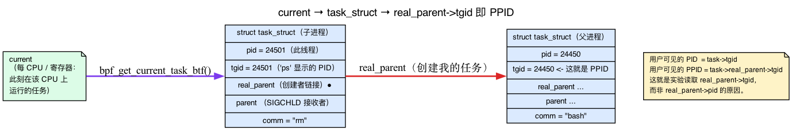
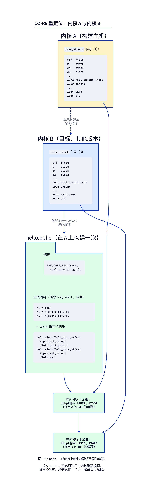
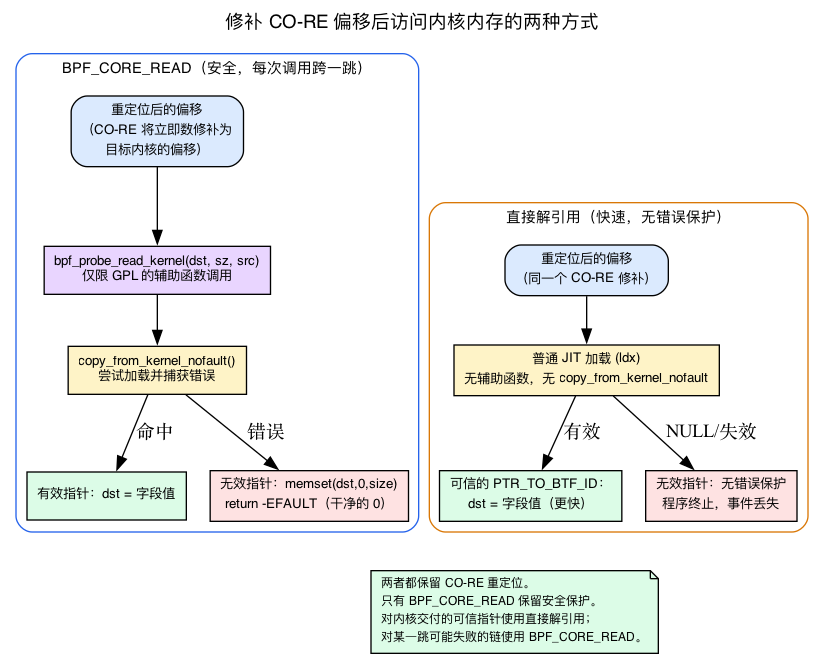
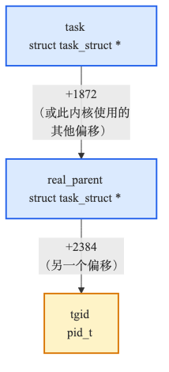

# 第3天 — CO-RE：读取 `task->real_parent->tgid`，跨内核升级仍能运行

> **今日任务：** 读取每个调用 `unlink` 的进程的父进程 PID，并确保同一程序既能在编译时所针对的内核上运行，*也*能适应未来内核中的布局变化。总用时约 95 分钟。

## CO-RE 出现之前那个脆弱的世界

在 CO-RE 出现之前，BPF 跟踪程序有两种丑陋的选择：

1. **bcc 风格的运行时编译。** 把 BPF 源码作为字符串分发。用户空间工具检测正在运行的内核，在运行时针对*当前*内核的头文件调用 Clang，当场编译程序，再加载它。启动很慢（Clang 要花好几秒），需要在每一台目标机器上都装有 Clang 和头文件，而且当头文件与一个用略有不同的配置构建出来的运行内核不匹配时，还会以微妙的方式出错。

2. **硬编码偏移量。** 用 `bpf_probe_read_kernel(&out, sizeof(out), (char *)task + 1872)` 读取内核结构体字段。它只在你据以推导出 `1872` 的那个内核上有效。一旦那个结构体增加了一个字段，它立刻失效。

这两种选择正是 2020 年之前的 BPF 工具链让人感觉脆弱的原因。CO-RE 把两者都终结了。

而最容易让硬编码偏移工具失效的那个结构体，正是我们今天要读取的这个：`struct task_struct`。所以在接触 CO-RE 之前，先来认识它——因为 CO-RE 存在的一半理由就是为了安全地读取这一个结构体。

## 驱动这一切的结构体：`task_struct`

内核中每一个可运行的线程——每一个进程、进程内的每一个线程、每一个内核工作线程——都恰好由一个 **`struct task_struct`** 来描述。它是内核的进程/线程*描述符*：调度器、信号代码、VFS 以及凭证机制统统挂靠在其上的那一整套庞大状态。它确实很大——数百个字段，远超一千字节——保存着调度状态、打开文件表、凭证、父/子链接，以及一个简短的、人类可读的名字。

今天我们只需要其中几个字段。在 v7.1 中（`include/linux/sched.h`）：

```c
pid_t pid;                              /* sched.h:1063 — per-thread ID      */
pid_t tgid;                             /* sched.h:1064 — thread-group ID    */
struct task_struct __rcu *real_parent;  /* sched.h:1077 — the (original) parent */
struct task_struct __rcu *parent;       /* sched.h:1080 — recipient of SIGCHLD  */
char comm[TASK_COMM_LEN];               /* sched.h:1173 — 16-byte thread name   */
```

### `current`：此刻正在运行的那个任务

你永远不会凭空得到一个 `task_struct`——你要问的是“此刻是谁在这个 CPU 上运行？”内核的答案是宏 **`current`**。它是一个按 CPU/架构区分的构造，会给出此刻正在执行的那个线程的 `task_struct *`（在 x86_64 上它是从一个每 CPU 变量读取的；其他架构则把它藏在一个寄存器里）。每当内核代码写 `current->pid` 时，它的意思就是“触发这条代码路径的那个线程的 PID”。

BPF 通过一个辅助函数拿到它。`bpf_get_current_task_btf()` *字面上就是返回 `current`*——它的内核实现只有一行：

```c
/* kernel/trace/bpf_trace.c:766 */
BPF_CALL_0(bpf_get_current_task_btf)
{
	return (unsigned long) current;   /* :768 */
}
```

所以当你的程序调用 `bpf_get_current_task_btf()`（在 `unlink` 钩子内部）时，你会得到 `task_struct`——即那个调用了 `unlink` 的进程的描述符。它就是今天其余一切的锚点。



### `pid` 与 `tgid`：内核的 PID 不是用户空间的 PID

这是一个每个人都会中招一次的陷阱。在内核里，**`pid` 是每*线程*的 ID**，而 **`tgid`（线程组 ID）是领头线程的 `pid`**。一个单线程进程满足 `pid == tgid`。一个有四个线程的进程有四个互不相同的 `pid`，但共享一个 `tgid`。

用户空间的 `getpid()` 返回的是 `tgid`。所以：

- 一个任务的、用户可见的 **PID** 就是它的 **`tgid`**。
- 用户可见的 **PPID** 是父进程的 **`tgid`**——也就是 `real_parent->tgid`。

（第1天在我们使用 `bpf_get_current_pid_tgid` 时已经顺带指出过“用户空间 PID = 内核 TGID”；原因就在这里。那个辅助函数把 `tgid` 打包在高 32 位、把 `pid` 打包在低 32 位——`>> 32` 就得到用户可见的 PID。）

正是这一个事实，决定了实验读取的是 `real_parent->tgid` 而不是 `real_parent->pid`：我们想要的是人从 `ps` 里认得出来的那个 PPID，也就是父进程的线程组 ID。

### `real_parent` 与 `parent`

有*两个*父指针，内核在 `sched.h:1071` 处的注释块解释了为什么：

- **`real_parent`**（`sched.h:1077`）——最初创建该进程的父进程。用于重新指定父进程（reparenting）和 ptrace 记账。这是那条“究竟是谁 fork 出了我”的链接。
- **`parent`**（`sched.h:1080`）——接收 `SIGCHLD` 以及 `wait4()` 报告的那个任务。通常与 `real_parent` 相同，但在 `ptrace`（调试器、`strace`）之下，`parent` 会变成跟踪者，而 `real_parent` 仍是真正的父进程。

实验刻意使用 `real_parent`，这样即便有什么东西正在跟踪该进程，*真正的*父进程也会显示出来。

### `comm[16]`：线程名

`comm` 是一个固定 **16 字节**（`TASK_COMM_LEN`，`sched.h:325`）、用 NUL 填充的线程名——`"bash"`、`"rm"`、`"sshd"`。它就是第1天 `bpf_get_current_comm` 辅助函数替你拷贝出来的那*同一个缓冲区*。而今天我们改为通过 CO-RE 直接读取它，这正是重点所在：我们要手动走进 `task_struct`。

而**这正是 CO-RE 之所以重要的原因。** `task_struct` 在不同内核版本之间不断增长和调整布局——这里加一个新的调度器字段，那里挪动一整块。每一处这样的改动都会移动 `comm`、`tgid`、`real_parent` 的字节偏移。一个硬编码了 `(char *)task + 1872` 的工具会被下一个 `-rc` 版本弄坏。CO-RE 就是解药。

## CO-RE 究竟做了什么

你按*名字*来写字段访问：

```c
__u32 ppid = BPF_CORE_READ(task, real_parent, tgid);
```

编译器会发出一条指令，在偏移 `0xC0RE0001` 处加载一个值（这是个占位符——Clang 会在那里填入实际的重定位索引）。在这条指令旁边，它还会发出一条 **CO-RE 重定位记录**，其内容是：*“我刚才用的那个偏移是假的；在加载时，去目标内核的 BTF 里查出 `task_struct.real_parent` 的字节偏移，并用真实值给这条指令打补丁。”*

当 libbpf 加载程序时，它会遍历每一条 CO-RE 重定位，在 `/sys/kernel/btf/vmlinux` 中按名字查找该字段，计算出偏移，并给指令打补丁。同一个 `.o` 文件，在每个内核上打补丁后得到不同的偏移。



这就是为什么你第1天那个 `BPF_PROG(on_unlink, int dfd, struct filename *name)` 程序无需你知道*任何东西*的字节偏移就能工作——每一次对内核类型的访问都走了这种基于名字的重定位。

> ### 常见疑问
>
> **问：为什么 C 语言不干脆就这么做呢？我的用户空间程序也包含内核头文件、按名字读取字段啊。**
>
> 答：用户空间的 `#include <linux/sched.h>` 读取的是*你编译时的那份头文件*。如果正在运行的内核布局不同，你就会崩溃或读到错误的字节——这正是人们警告不要使用来自 `/proc` 之外的内核头文件的原因。CO-RE 把这个模型反转了过来：你构建 BPF 程序时，就当作结构体布局在加载之前是*未知*的，然后由 libbpf 对照目标内核的实际类型信息把它们解析出来。
>
> **问：如果某个字段在目标内核上不存在会怎样？**
>
> 答：CO-RE 为此提供了一些原语：
> - `bpf_core_field_exists(task->real_parent)`——字段存在时返回 1，否则返回 0。
> - `bpf_core_type_exists(struct foo)`——对整个类型做同样的判断。
> - `bpf_core_enum_value_exists(...)`——对枚举成员做同样的判断。
>
> 如果你检查存在性并在缺失时跳过访问，那么当字段缺失时，libbpf *还*会把访问指令打补丁成一条空操作（no-op）。这样你就能发布一个能在不同内核版本间优雅降级的程序。
>
> **问：直接对带类型的指针解引用和 `BPF_CORE_READ` 是一回事吗？**
>
> 答：几乎是。在有 BTF 和正确程序类型的前提下，验证器会接受 `task->real_parent->tgid`，编译器也会发出经过 CO-RE 重定位的指令。两者都是内存安全的：`BPF_CORE_READ` 展开成 `bpf_probe_read_kernel`（一个在指针无效时会零填充的辅助函数调用），而对一个走指针得来的 `PTR_TO_BTF_ID` 做直接解引用，则会被验证器改写成一条受缺页保护的 `BPF_PROBE_MEM` 加载，它*同样*会零填充。真正的区别在于速度和适用范围：直接解引用是一条内联加载（没有调用），但需要一个经验证器定型的指针；而 `BPF_CORE_READ` 更慢，却即使在验证器无法为指针定型时也能工作（kprobe 的 `pt_regs` 转型、非 BTF 程序类型）。对于内核交到你手上的参数（fentry 参数、`bpf_get_current_task_btf()`），直接解引用是理想选择。（我们会在往下两节里剖析*究竟为什么*其中一个更快。）

> ### 动动脑筋
>
> 你第1天和第2天的程序读取 `bpf_get_current_pid_tgid() >> 32` 来取得 PID。这并不经过 CO-RE——其中不涉及任何结构体字段。但 BPF 程序仍然必须知道自己是运行在 Linux x86_64 上还是 ARM64 上。是什么处理了这层抽象？
>
> .\
> .\
> .
>
> **答案：** 是辅助函数本身。`bpf_get_current_pid_tgid` 在 `kernel/bpf/helpers.c` 中实现，无论什么架构，调用方式都一样。与架构相关的工作发生在内核实现的*内部*。CO-RE 是用来访问那些*布局*随内核版本变化的内核数据结构的，而不是用于跨架构可移植的辅助函数调用。

---

## 为什么 BPF 不能直接解引用一个指针：`bpf_probe_read_kernel`

我们一直在说“`BPF_CORE_READ` 对每一跳都做缺页处理”以及“直接解引用更快，但它假定指针是有效的”。要把这一点讲具体，你需要知道底层是什么——答案是一个叫 `bpf_probe_read_kernel` 的辅助函数。

问题在这里。一个 BPF 程序运行在内核上下文里。如果它盲目地解引用一个任意的内核指针，而那个指针是 NULL、失效的、或者干脆就是错的，它就会**在内核上下文里触发缺页**——而内核里的一次缺页可不是什么友好的段错误，它是一次 oops。BPF 本应是*在生产机器上加载也安全*的。所以内核**不会**让一个 BPF 程序去跟随任意指针。它恰好提供了两种受认可的方式来触碰内核内存。

**方式 1——`bpf_probe_read_kernel(dst, size, src)` 辅助函数。** 它把 `size` 个字节从 `src` 拷贝到 `dst`，但拷贝是通过 `copy_from_kernel_nofault` 完成的，那是内核的“试着做这次加载，但捕获缺页而不是崩溃”原语。如果读取触发缺页，这个辅助函数不会崩溃——它会**把 `dst` 零填充并返回 `-EFAULT`**：

```c
/* include/linux/bpf.h:3387 — bpf_probe_read_kernel_common, the plain kernel read path */
ret = copy_from_kernel_nofault(dst, unsafe_ptr, size);  /* :3392 */
if (unlikely(ret < 0))
	memset(dst, 0, size);     /* :3394 — the zero-fill-on-fault path */
return ret;
```

（字符串变体和用户变体位于 `kernel/trace/bpf_trace.c`，并使用另一个原语：`bpf_probe_read_user_common` 在 :179 处 memset，`bpf_probe_read_user_str_common` 在 :216，`bpf_probe_read_kernel_str_common` 在 :266。上面展示的这个非字符串的内核读取才是位于 `bpf.h` 里的。）

```c
/* kernel/trace/bpf_trace.c:235 */
BPF_CALL_3(bpf_probe_read_kernel, void *, dst, u32, size,
	   const void *, unsafe_ptr)
{
	return bpf_probe_read_kernel_common(dst, size, unsafe_ptr);   /* :238 */
}
```

**正是那句 `memset(dst, 0, size)`，才是本章所说“`BPF_CORE_READ` 在指针无效时返回默认值 0”这一行为的根源。** 这个零并不来自 CO-RE——它来自这个辅助函数的错误路径。一次坏的跳转给你的是一个干净的 `0`，而不是崩溃。

**方式 2——验证器信任的带类型指针。** 当验证器能够*证明*一个指针的类型和可信度时，它就允许 JIT 发出一条普通的硬件加载，完全不需要辅助函数调用。没有 `copy_from_kernel_nofault`，没有缺页保护机制——只有一条 `ldx`。这是快速路径，也是直接解引用（`task->real_parent->tgid`）胜过宏的原因。下一节我们会认识解锁它的那个寄存器类型。

于是现在这两种形式可以清晰地分解开来：

- **`BPF_CORE_READ`** =（用来给偏移打补丁的 CO-RE 重定位）**+**（用来对加载做缺页保护的 `bpf_probe_read_kernel`），每次指针跳转都会串联这样一组步骤。
- **直接解引用** =（用来给偏移打补丁的 CO-RE 重定位）**+**（普通的可信加载，没有缺页保护机制）。

两者都保留了重定位。只有 `BPF_CORE_READ` 保留了保护机制。你可以在头文件里直接看到重定位与 probe-read 的结合：

```c
/* tools/lib/bpf/bpf_core_read.h:312 */
bpf_probe_read_kernel(dst, sz, (const void *)__builtin_preserve_access_index(src))
```

其中的 `__builtin_preserve_access_index(src)` 就是 CO-RE 重定位（它记录下“这个偏移必须对照目标 BTF 打补丁”）；包裹在它外面的 `bpf_probe_read_kernel(...)` 则是缺页保护。一个宏，两件事都干了。



> **一个许可证方面的后果。** `bpf_probe_read_kernel` 的原型是**仅限 GPL**的：
>
> ```c
> /* kernel/trace/bpf_trace.c:241 */
> const struct bpf_func_proto bpf_probe_read_kernel_proto = {
> 	.func		= bpf_probe_read_kernel,
> 	.gpl_only	= true,        /* :243 */
> 	...
> };
> ```
>
> 这直接呼应了第1天的 LICENSE 关卡（第1天，破坏实验 3）：你的程序一旦使用 `BPF_CORE_READ`，就会走这个仅限 GPL 的辅助函数，所以它确实需要 `char LICENSE[] SEC("license") = "GPL";`。去掉这个 GPL 字符串，加载器就会以 "helper call is not allowed in non-GPL program" 为由拒绝该程序。这不是官僚主义——这是这个原型的 `.gpl_only` 标志在起作用。

---

## `PTR_TO_BTF_ID`：让你跳过保护机制的那个可信、带类型的指针

上面那条快速路径取决于一个验证器概念，那我们就给它起个名字。

**复习（第2天）：** 验证器给*每一个寄存器*都标注一个类型，并跟踪你对它可以合法地做什么。回忆昨天的 `PTR_TO_MAP_VALUE_OR_NULL`——`bpf_map_lookup_elem` 的结果在你对它做 NULL 检查之前所带有的那个类型。在你证明它非 NULL 之前，你无法解引用它。

**今天的新内容：** **`PTR_TO_BTF_ID`** 是一种寄存器类型，它表示“这个指针指向一个*特定的内核类型*，由一个 BTF 类型 id 标识”。由于寄存器携带了类型信息，验证器就能对照真实的结构体布局对字段访问做类型检查，并允许在重定位后的偏移处对某个字段做**直接加载**。无需辅助函数调用——这就是上一节讲的那条普通 `ldx`。

**`_TRUSTED`** 变体再多加一层保证：这个指针**非 NULL 且不会失效**。所以在解引用之前不需要 NULL 检查——这与映射值指针不同，后者总是有可能为 NULL。

这正是 `bpf_get_current_task_btf()` 之所以特殊的原因。看看它的原型：

```c
/* kernel/trace/bpf_trace.c:771 */
const struct bpf_func_proto bpf_get_current_task_btf_proto = {
	.func		= bpf_get_current_task_btf,
	.gpl_only	= true,
	.ret_type	= RET_PTR_TO_BTF_ID_TRUSTED,                  /* :774 */
	.ret_btf_id	= &btf_tracing_ids[BTF_TRACING_TYPE_TASK],    /* :775 */
};
```

`RET_PTR_TO_BTF_ID_TRUSTED` 加上一个 `ret_btf_id`（指向 `task_struct` 的 BTF id），意味着：验证器把返回的寄存器标记为一个**可信的、非 NULL 的 `PTR_TO_BTF_ID`，其类型为 `task_struct`**。这就是为什么实验可以写 `task->real_parent->tgid` 而**对 `task` 做零次 NULL 检查**——验证器已经知道它是一个有效的任务指针。

与之对照的是那个*更老*的辅助函数 `bpf_get_current_task`（`bpf_trace.c:755`），它的原型是 `.ret_type = RET_INTEGER`——它交回一个你必须自己转型的**不透明 u64**，对验证器没有任何类型信息。这就是转型说明里提到的那个“你必须转型的、返回不透明 u64 的更老变体”。`_btf` 版本的存在，正是为了向验证器提供类型信息。

这是第1天所说“BTF 支撑的四件事”中的第一件（第1天：*“对带类型指针的验证器类型检查（PTR_TO_BTF_ID）”*）在这里有了具体体现。**前向指引：** 第4天会把验证器完整的类型格（type lattice）形式化。今天，只需记住一句话：*`PTR_TO_BTF_ID` = 一个带类型的、可信的内核指针，验证器允许你对它直接解引用。*

---

## 认识各个角色

### `bpf_get_current_task_btf` — 对 `current` 的带类型访问

返回一个附带了 BTF 类型标记的 `struct task_struct *`（就是我们刚才看到的 `RET_PTR_TO_BTF_ID_TRUSTED`）。验证器知道它是一个有效的、非 NULL 的内核指针。你可以直接解引用它的字段。它比 `bpf_get_current_task`（那个返回你必须自己转型的不透明 `u64` 的更老变体）开销更低。

### `BPF_CORE_READ(task, a, b, c)` — 链式的、感知 CO-RE 的读取

展开成一系列 `bpf_probe_read_kernel` 调用，逐一走过每一个指针跳转，并在每一次字段访问上都带有 CO-RE 重定位。等价于：

```c
struct task_struct *p1 = task;
struct task_struct *p2;
__u32 result;
bpf_probe_read_kernel(&p2, sizeof(p2), &p1->real_parent);  // CO-RE: real_parent offset
bpf_probe_read_kernel(&result, sizeof(result), &p2->tgid); // CO-RE: tgid offset
```

这个宏替你省去了那些样板代码，并对每一跳都做缺页处理，正如 `bpf_probe_read_kernel` 那一节所展示的——链条中任何位置上的一个坏指针都会产生一个干净的 `0`，而不是崩溃。



### `BPF_CORE_READ_INTO(dst, src, a, b, c)`

同样的东西，但它把最终值写入 `*dst` 而不是返回它。当字段大于 8 字节时使用（例如把 `task->comm[16]` 读进一个缓冲区）。

### `BPF_CORE_READ_STR_INTO(dst, src, a, b, c)`

读取一个以 NUL 结尾的字符串。把读取限制在 `sizeof(dst)` 以内。返回实际拷贝的长度。

---

## 实验

在仓库的 `ebpf/labs` 目录里继续。`make parent` 会编译下面展示的那些带锚点的代码清单。

### `parent.h` — 共享的事件记录

```c
{{#include ../labs/day03/parent.h}}
```

### `parent.bpf.c`

```c
{{#include ../labs/day03/parent.bpf.c:book}}
```

有什么新东西：

- `bpf_get_current_task_btf()` 返回一个带类型的 `struct task_struct *`。它原型的返回类型是 `RET_PTR_TO_BTF_ID_TRUSTED`，所以验证器把这个寄存器标记为一个可信的、非 NULL 的 `PTR_TO_BTF_ID`——你可以不做 NULL 检查就直接解引用它的字段。
- `__builtin_memset(event, 0, sizeof(*event))` 在辅助函数读取之前，先把整个预留的记录初始化。如果一次容错的字符串读取失败了，用户空间收到的是一个空字符串，而不是 ringbuf 里的陈旧字节。
- `BPF_CORE_READ(task, real_parent, tgid)` 走过 `task → real_parent → tgid`（回忆：`tgid` 是用户可见的 PID，所以父进程的 `tgid` 就是 PPID）。每一跳都是一次经 CO-RE 重定位的 `bpf_probe_read_kernel`。
- `BPF_CORE_READ_STR_INTO(&event->comm, task, comm)` 读取 `task->comm`（一个 16 字节的 char 数组，不是指针）。注意 `comm` 是最后一个参数；对于非指针字段，你不需要最后那一跳 `*` 解引用。
- 与第1天不同，`BPF_PROG(on_unlink)` 不接收额外参数——今天我们不需要 unlink 的参数（`dfd`/`name`），因为 `bpf_get_current_task_btf()` 直接把任务交给了我们。

### 用户空间的 `parent.c`

加载器沿用了第1天那套带检查的错误处理和信号处理路径，校验共享的 `struct parent_event`，并在退出时同时释放 ringbuf 和骨架：

```c
{{#include ../labs/day03/parent.c:book}}
```

### 运行它

在终端 1 中：

```bash
make parent
sudo ./.output/day03/parent
```

在终端 2 中：

```bash
scratch=$(mktemp -d /tmp/ebpf-day03.XXXXXX)
touch "$scratch/x"
rm "$scratch/x"
rmdir "$scratch"
```

预期输出：

```
PID 24501 (rm) ppid 24450 (bash) deleted a file
```

那个父进程正是 `real_parent->tgid` 和 `real_parent->comm` 完全按照 `task_struct` 那一节所承诺的方式在工作：`rm` 的真正父进程就是那个 fork 出它的 shell，而它的 `tgid` 就是 `ps` 会显示的那个 PPID。

当事件出现时，在终端 1 中按 Ctrl-C。加载器会释放 ringbuf 并销毁骨架，卸载它的 fentry 链接，而无需用一个宽泛的 `pkill`。

---

## 查看 CO-RE 实际发出了什么

这是今天最重要的一步。你需要*亲眼看到*这些重定位，才会相信它们确实存在。

把目标文件反汇编出来，并让重定位交错显示其中（`-r` 标志正是让 CO-RE 记录显现出来的关键——单用 `-d` 永远不会打印它们）：

```bash
llvm-objdump -dr .output/day03/parent.bpf.o | grep CO-RE
```

（如果找不到 `llvm-objdump`，你的发行版可能只提供带版本号的可执行文件——试试 `llvm-objdump-21` 或 `llvm-objdump-18`。哪个都行；`-dr` 标志和输出都是一样的。）

较新的 LLVM 会用从目标文件的 `.BTF.ext` 节读出的 CO-RE 重定位记录来注解 BPF 反汇编。每一次对内核字段的访问你都会看到一行：

```
0000000000000060:  CO-RE <byte_off> [13] struct task_struct::real_parent
00000000000000a0:  CO-RE <byte_off> [13] struct task_struct::tgid
00000000000000e8:  CO-RE <byte_off> [13] struct task_struct::comm
```

（地址和类型索引 `[13]` 因构建而异）。去掉 `| grep CO-RE` 就能看到完整的反汇编：每条重定位正上方的那条加载指令携带着 Clang 烘焙进去的**编译期**字节偏移——例如 `r1 = 0xae0` 就对应 `real_parent`——而*不是*像 `0x0` 那样的占位符。如果正在运行的内核布局不同，libbpf 会在加载时改写那个立即数。CO-RE 重定位记录位于 ELF 节 `.BTF.ext` 中（该目标文件还有 `.BTF`、`.rel.BTF` 和 `.rel.BTF.ext`）；并不存在 `.relo.btf` 节。

如果想改为查看内嵌的类型：

```bash
./.output/bpftool/bootstrap/bpftool btf dump file .output/day03/parent.bpf.o
```

你会看到你的映射（`VAR 'rb'` 以及 `.maps` DATASEC）、你的 `on_unlink` 程序函数，以及对 `task_struct.real_parent` 这类内核类型的引用。（`struct parent_event` 只在函数代码内部使用，从映射、全局变量或函数原型都无法触及，所以编译器不会把它发出到目标文件的 BTF 里。）

> **补充说明——发布最小化 BTF。** `./.output/bpftool/bootstrap/bpftool gen min_core_btf /sys/kernel/btf/vmlinux min.btf .output/day03/parent.bpf.o` 会写出一个只包含你程序所引用类型的最小化 BTF 文件（它不向 stdout 打印任何东西）。那是为了*可移植性*——在你的 `.o` 旁边、为那些没有 `/sys/kernel/btf/vmlinux` 的内核一起发布一个很小的 BTF——而不是为了查看重定位。

要观察这些重定位在加载时被应用的过程，你需要的是 **libbpf 自己的调试日志**，而不是内核验证器日志。这两者不同：`.kernel_log_level` 喂给的是 `bpf_attr.log_level`，它控制的是内核内的*验证器*日志（一份反汇编的、重定位之后的指令转储，外加验证器状态）。CO-RE 打补丁发生在 libbpf 用户空间里，*早于* `BPF_PROG_LOAD` 系统调用，所以验证器日志里既没有 `CO-RE` 字符串，也没有任何重定位的来龙去脉——在其中 grep `CO-RE` 什么也找不到。

打补丁的消息是从 libbpf 的 print 回调函数以 `LIBBPF_DEBUG` 级别输出的。从 shell 里最省事——用 bpftool 的 `-d` 标志加载（它会把 libbpf 设为 `LIBBPF_DEBUG`），然后 grep 那些重定位行：

```bash
sudo ./.output/bpftool/bootstrap/bpftool -d prog load .output/day03/parent.bpf.o /sys/fs/bpf/parent 2>&1 | grep relo
sudo rm -f /sys/fs/bpf/parent   # clean up the pin
```

你会看到类似 `prog 'on_unlink': relo #N: ... patched insn ...` 这样的行。在 C 语言里，注册一个 print 回调函数，并在 open/load 之前提高级别：

```c
static int dbg(enum libbpf_print_level lvl, const char *fmt, va_list ap)
{
    return vfprintf(stderr, fmt, ap);
}
// in main(), before parent_bpf__open():
libbpf_set_print(dbg);
```

注意 libbpf 的*默认* print 回调函数只把 `WARN` 输出到 stderr；`INFO`/`DEBUG` 级别的重定位行会被抑制，除非你安装自己的回调函数或者使用一个启用了调试的加载器。

---

## 依次尝试破坏

### 破坏实验 1 — 使用一个不存在的字段

加上这一行：

```c
__u32 fake = BPF_CORE_READ(task, this_field_does_not_exist);
```

你可能以为这会通过编译，只在加载时才炸。并不会——构建会立即失败：

```
error: no member named 'this_field_does_not_exist' in 'struct task_struct'
```

原因在这里：`BPF_CORE_READ` 并不是用一个不透明的名字字符串来引用字段的。它展开成*真正的* C 成员访问表达式（`task->this_field_does_not_exist`），外面裹上 `__builtin_preserve_access_index`，然后 Clang 会把那个成员对照 `struct task_struct`（在你的 `vmlinux.h` 里）做类型检查。一个在任何 BTF 里都不存在的名字，就是一个普普通通的 C 错误。（`bpf_core_field_exists(task->this_field_does_not_exist)` 也以同样的方式失败——它同样会发出成员访问表达式。）

所以，要真正走一遍加载时的**重定位失败**路径——也就是会打印出下面这行的那条路径——

```
libbpf: prog 'on_unlink': relo #N: failed to relocate ...
```

你需要一个*在你构建所用的 BTF/`vmlinux.h` 里存在、却在**目标**内核上缺失*的字段。触发它的现实方法是：针对一个较新的 `vmlinux.h` 编译，再在一个缺少该字段的较老内核上加载。

要演示优雅降级，就用一个确实存在的字段（这样程序才能编译通过），并用 `bpf_core_field_exists` 来对它加以守卫：

```c
__u32 fake = 0;
if (bpf_core_field_exists(task->pid))
    fake = BPF_CORE_READ(task, pid);
```

`bpf_core_field_exists` 的用武之地是那些*随内核版本出现或消失*的字段：libbpf 在加载时对照目标内核的 BTF 求值这个检查，并在字段缺失时把分支打补丁成一条空操作，这样单个 `.o` 就能在有或没有该字段的内核上都运行。它**并不是**一种去引用一个在任何 BTF 里都不存在的名字的办法。

### 破坏实验 2 — 直接解引用与 `BPF_CORE_READ` 的对比

把宏形式替换为直接解引用：

```c
event->ppid = task->real_parent->tgid;
```

能编译。验证器接受。能运行。比 `BPF_CORE_READ` **更快**，因为没有 `bpf_probe_read_kernel` 调用——这就是我们前面剖析过的、可信 `PTR_TO_BTF_ID` 的普通加载快速路径。验证器已经知道 `task` 是一个非 NULL 的 `task_struct`，所以它允许 JIT 发出一条不带缺页保护机制的裸加载。

但这**并不是**安全性的降级，而这正是微妙之处。当验证器接受 `task->real_parent->tgid` 时，它并不会为那个*走指针得来的*跳转发出裸加载。`real_parent` 是通过跟随一个指针得到的，所以得到的寄存器是一个不可信的 `PTR_TO_BTF_ID`，于是验证器会把那条 `tgid` 加载改写成一条带异常表条目的 `BPF_LDX | BPF_PROBE_MEM`（`kernel/bpf/fixups.c`）。发生缺页时，该加载会被跳过，目标寄存器被零填充——就是那个 `0`，和你从 `BPF_CORE_READ` 得到的一样。所以，假如 `real_parent` 真的为 NULL，`ppid` 会返回 `0`，而事件**仍会触发**；它不会崩溃、终止，也不会丢失事件。只有通过真正*可信*指针（比如 `task` 本身）的加载才保持裸加载——而那些恰恰是验证器已经证明非 NULL 的指针，所以对它们而言根本不会出现 NULL 解引用的场景。

所以两种形式都是内存安全的，而且在指针无效时都会零填充。真正在两者之间做取舍的理由是：

- **`BPF_CORE_READ`** 会发出一个 `bpf_probe_read_kernel` 辅助函数**调用**（更慢），但即使在验证器无法交给你一个带类型的指针时也能工作——例如 kprobe 的 `pt_regs` 转型，或者一个非 BTF 程序类型。它还让整个链式的 `a, b, c` 表达式保持可移植。
- 对一个经验证器定型的 `PTR_TO_BTF_ID` 做**直接解引用**会发出一条**内联加载**（更快，没有调用）。验证器会自动把走指针得来的/不可信的跳转改写成 `BPF_PROBE_MEM`，这样它们同样会做缺页保护和零填充；只有那个被证明非 NULL 的可信跳转才保持裸加载。

### 破坏实验 3 — 忘记 `#include <bpf/bpf_core_read.h>`

`BPF_CORE_READ` 未定义；编译失败。虽然微不足道，但值得一提：BPF 辅助函数头文件被拆分到几个文件里——`bpf_helpers.h`（通用）、`bpf_tracing.h`（BPF_PROG、ctx 解包、PT_REGS_*）、`bpf_core_read.h`（CO-RE 宏）。任何一个忘了包含，其失败表现都是 "macro X not defined"。

---

## 内核代码阅读指引

- **`tools/lib/bpf/relo_core.c`**——用户空间里的 CO-RE 引擎。`bpf_core_calc_relo_insn`（relo_core.c:1297）根据目标内核的 BTF 计算重定位值，`bpf_core_patch_insn`（relo_core.c:1041）把它写入指令的偏移/立即数。约 300 行，只要你知道该找什么，就不难读。
- **`tools/lib/bpf/btf.c`**——阅读 `btf__find_by_name_kind`（btf.c:1166）。libbpf 就是这样在 BTF 中按名字查找类型的。CO-RE 正是建立在它之上的。
- **`tools/lib/bpf/bpf_core_read.h`**——搜索 `BPF_CORE_READ`。这些宏会展开为一系列 `bpf_core_read`（内核侧）调用；`bpf_core_field_exists` 位于 bpf_core_read.h:187-188。通读一次即可了解其工作原理。
- **`include/uapi/linux/btf.h`**——`BTF_KIND_*` 枚举。BTF 大约有 19 种 kind（int、ptr、array、struct、union、enum、fwd、typedef、volatile、const、restrict、func、func_proto、var、datasec、float、decl_tag、type_tag、enum64）。`BTF_KIND_ENUM64 = 19` 位于 uapi/btf.h:92，`NR_BTF_KINDS` 位于 :94，`BTF_KIND_MAX` 位于 :95。`struct btf_type` 也定义在这里（在 :43）；`include/linux/btf.h` 只是前向声明了它（在 :113）。略读即可。
- **`include/linux/sched.h`**——我们今天读取的那个 `struct task_struct`：`pid`（1063）、`tgid`（1064）、`real_parent`（1077）、`parent`（1080）、`comm`（1173）。略读一下这些字段的注释，感受一下有多少状态挂靠在一个任务上。

---

## 要点回顾

- **CO-RE = Compile Once, Run Everywhere（一次编译，到处运行）。** 字段偏移在加载时使用目标内核的 BTF 解析出来。
- **`task_struct` 是每线程的描述符**；`current` 是正在运行的那一个；`bpf_get_current_task_btf()` 返回它。用户可见的 **PID = `tgid`**，用户可见的 **PPID = `real_parent->tgid`**；`comm[16]` 是线程名。
- **BPF 不能盲目解引用内核指针。** `bpf_probe_read_kernel` 通过 `copy_from_kernel_nofault` 拷贝，并在**缺页时零填充**（“默认值 0”的来源）；它是**仅限 GPL**的，这就是为什么 CO-RE 程序需要 `SEC("license")="GPL"`。
- **`PTR_TO_BTF_ID`（_TRUSTED）** = 一个带类型的、非 NULL 的内核指针，验证器允许你不做 NULL 检查、不用辅助函数就直接解引用它——这就是直接解引用背后的快速路径。
- **用 `BPF_CORE_READ(a, b, c, d)`** 把字段访问串成一条穿过多个指针跳转的链，并对每一跳都做缺页处理。
- 当指针链是可信的、而你又想要速度时，**使用直接解引用**（`task->real_parent->tgid`）。
- **用 `bpf_core_field_exists` 处理缺失的字段**——当字段缺失时，libbpf 会把访问打补丁成一条空操作。
- 你会遇到的 BTF kind：`STRUCT`、`UNION`、`ENUM`、`INT`、`PTR`、`ARRAY`、`FUNC`、`TYPEDEF`。总共约 19 种。

---

## 检查问题

你针对内核 A 编译你的程序。字段 `task_struct.real_parent` 位于偏移 1872 处。你把这个 `.o` 分发到一台运行内核 B 的机器上，在那里同一个字段位于偏移 1920 处。你的程序执行 `BPF_CORE_READ(task, real_parent, tgid)`。请梳理一遍加载时会发生什么。

<details>
<summary>点击查看答案</summary>

**答案：** libbpf 在内核 B 上打开 `/sys/kernel/btf/vmlinux`，解析它，找到类型 `task_struct` 及其字段 `real_parent`，计算出字节偏移 1920。它会遍历你 `.o` 里的每一条 CO-RE 重定位。对于 `real_parent` 这次访问，它把占位偏移（编译器发出的那个 `0xC0RE...` 立即数）覆写为 `1920`。`tgid` 也是同样处理。然后带着打过补丁的指令调用 `BPF_PROG_LOAD`。验证器接受。程序运行，在内核 B 上读取到正确的字段。运行时每一跳都走 `bpf_probe_read_kernel`，所以即使某个指针是坏的，程序得到的也是一个 `0`，而不是崩溃。

</details>

---

## 明天

第4天：正式认识验证器。我们会用一整天刻意制造五种不同形式的 `PTR_TO_MAP_VALUE_OR_NULL` 拒绝——因为无论经验多么丰富，BPF 程序员都会经常遇到这个错误。目标是不再对这种拒绝感到意外，而是能够熟练阅读日志。（今天的 `PTR_TO_BTF_ID` 是对我们将在那里形式化的类型格的一次预览。）
