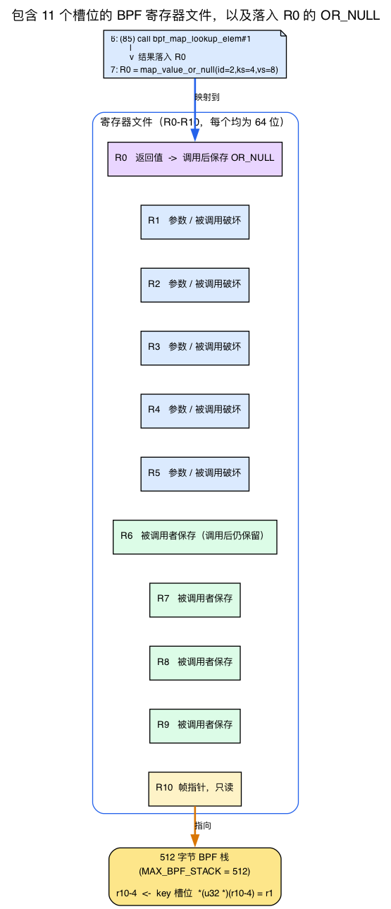
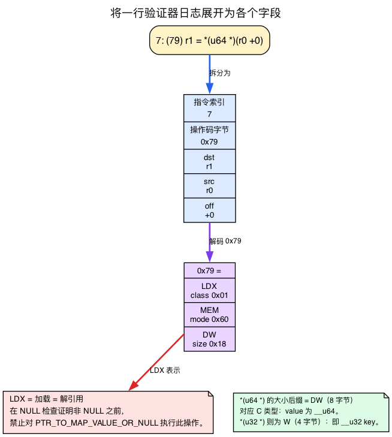
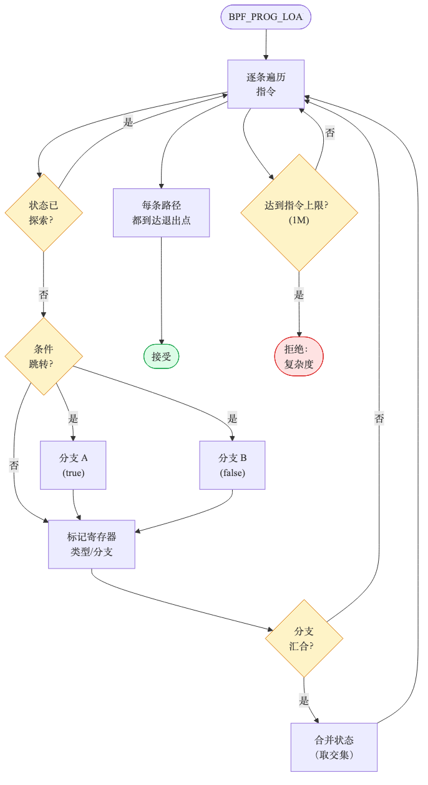
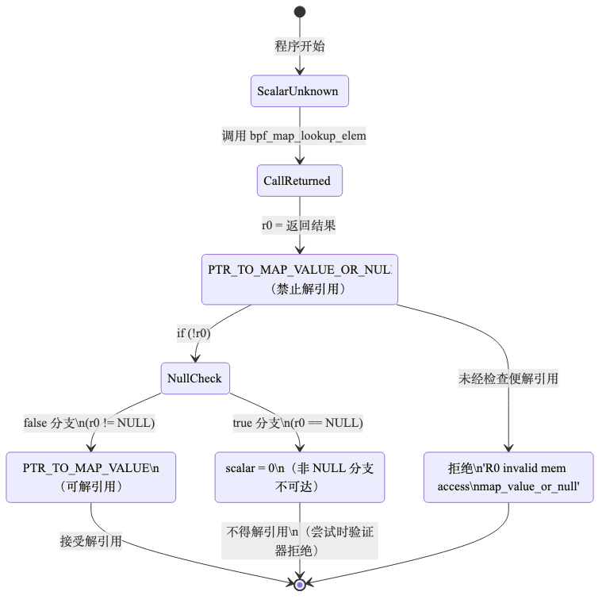
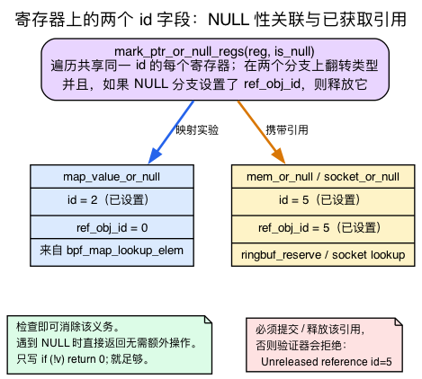

# 第4天 — 认识验证器（PTR_TO_MAP_VALUE_OR_NULL 新兵训练营）

> **今日任务：** 不再对最常见的 BPF 拒绝措手不及。你将用五种不同方式触发 `PTR_TO_MAP_VALUE_OR_NULL`，逐一阅读日志，并理解“寄存器状态”的确切含义，深入到构成日志的每个寄存器和操作码字节。总耗时：约 120 分钟。**今天不增加任何新功能，只训练验证器直觉。**

## 为什么要花一整天在一个错误上

因为你见到这个拒绝的次数会超过其他任何一个。第1–3天之所以能躲开它，是因为总是在查找之后立即写上 `if (!cnt) return 0;`。那是机械的条件反射。今天就是让这种反应转变为*理解*的时候。

验证器并不是随意行事的。它对你的程序运行一个抽象解释器——对每一条指令，它都跟踪每个寄存器的*类型*、*边界*、*引用状态*，以及你正处在哪个分支上。当它无法证明某次内存访问是安全的时，它就拒绝。错误日志会准确地告诉你是哪个寄存器、哪条指令；只要你能读懂寄存器状态，就能在一分钟内修复任何拒绝。

但有个陷阱。那份日志的每一行都充满 BPF 教程从不解释的记号：`R0`、`R10`、`(79)`、`*(u64 *)(r0 +0)`、`id=2`、`fp0`。今天既然叫“寄存器状态新兵训练营”，那么在弄坏任何东西之前，我们要先真正学会这套基本符号：**十一个寄存器**、**操作码字节**，以及**两种 id**。然后那五个拒绝就能一目了然。

## 十一个寄存器：BPF 的整个寄存器文件

验证器日志里的每一行都会提到名为 `R0` 到 `R10` 的寄存器。那不是抽样——那是*整个*寄存器文件。BPF 恰好只有**十一个** 64 位寄存器，不多不少：**十个通用**寄存器（R0–R9）加上**一个只读帧指针**（R10）：

```c
/* include/uapi/linux/bpf.h:62-74 */
enum {
    BPF_REG_0 = 0,
    BPF_REG_1,
    ...
    BPF_REG_10,
    __MAX_BPF_REG,
};
/* include/uapi/linux/bpf.h:77-78 */
/* BPF has 10 general purpose 64-bit registers and stack frame. */
#define MAX_BPF_REG  __MAX_BPF_REG   /* == 11 slots: R0-R9 + R10 */
```

验证器为这十一个槽位中的每一个都保存一个 `struct bpf_reg_state`，在每条指令、每条路径上。当日志打印 `R0=map_value_or_null(...) R10=fp0` 时，它正在转储那张按寄存器分列的状态表。

让这十一个寄存器*容易理解*的原因，是它们并非可互换的——它们遵循一套固定的**调用约定**，而验证器会强制执行这套约定。这套约定是今天最值得记住的一件事，因为它解释了你看到的几乎每一个寄存器名字：

| 寄存器 | 角色 |验证器强制执行什么 |
|---|---|---|
| **R0** | 返回值 | 辅助函数的结果*总是*落在这里。这就是为什么 `bpf_map_lookup_elem` 的 OR_NULL 指针总是在 R0 里。 |
| **R1–R5** | 参数 / 临时 | 调用者在此传递参数。**每次辅助函数调用后都会被破坏**——重置为不容易理解。 |
| **R6–R9** | 被调用者保存 | 状态**在调用间保留**。任何需要跨辅助函数调用保留的值都应放在这里。 |
| **R10** | 帧指针 | **只读。** 指向 512 字节 BPF 栈的顶部。你无法重新赋值它。 |

内核文档直截了当地陈述了调用规则：

> 内核函数调用后，R1-R5 被重置为不容易理解，R0 具有该函数的返回类型。由于 R6-R9 是被调用者保存的，它们的状态在调用间被保留。
> — `Documentation/bpf/verifier.rst:32-35`

以及 R10：

> 虽然 R10 是正确的只读寄存器且具有 PTR_TO_STACK 类型……
> — `Documentation/bpf/verifier.rst:81-85`

R10 的类型是 `PTR_TO_STACK`——"reg == frame_pointer + offset"（`include/linux/bpf.h:996`）。你可以通过它读写*栈槽*（`*(u32 *)(r10-4)`），但你永远无法重新赋值 R10 本身——验证器会拒绝对它的写入。它所指向的栈是有上限的：

```c
/* include/linux/filter.h:98 */
#define MAX_BPF_STACK 512
```

512 字节。这就是每个程序帧里你全部的自动存储预算。

为什么 R0 *必须*是返回寄存器？因为 ABI 就是这么规定的，没得商量：

> BPF 只允许使用寄存器 R0 作为返回值。
> — `Documentation/bpf/bpf_design_QA.rst:41`



请记住一个稍后会用到的结果：把查找结果从 `r0 → r6` 复制后，它可以**跨越**后续辅助函数调用而保留（R6 由被调用者保存）；复制到 `r0 → r1` 则**不能**保留（下一次调用会破坏 R1）。正因如此，验证器必须在值于寄存器之间传递时持续跟踪其 id；下文“两个不同的 `id`”会详细说明。

## 读懂伪汇编：`(hex)` 操作码与指令格式

每一行 trace 看起来都像 `7: (79) r1 = *(u64 *)(r0 +0)`。三个部分：**指令索引**（`7:`）、括号里的**原始操作码字节**（`(79)`），以及它所做之事的人类容易理解拼写。操作码字节是没人解释的部分——让我们把它解码出来，因为整个拒绝都取决于识别一个操作码。

一个 BPF 操作码是一个字节，由三个字段按位或构成：**指令类** | **模式/操作** | **源/大小**。你不需要完整的表；你需要的是这些实验中出现的少数几个：

| 字节 | 含义 | 在日志中的拼写 |
|---|---|---|
| `(b7)` | ALU64 MOV 立即数 | `r1 = 0` |
| `(bf)` | ALU64 MOV 寄存器 | `r2 = r10` |
| `(07)` | ALU64 ADD 立即数 | `r2 += -4` |
| `(63)` | STX MEM 字存储 | `*(u32 *)(r10-4) = r1` |
| `(18)` | LD IMM 双字（16 字节指令） | `r1 = 0xffff...`（加载一个 map 地址） |
| `(85)` | JMP CALL | `call bpf_map_lookup_elem#1` |
| `(15)` | JMP JEQ 立即数（`if r0 == 0 goto`） | `if r0 == 0 goto +N`——**NULL 检查** |
| `(55)` | JMP JNE 立即数（`if r0 != 0 goto`） | `if r0 != 0 goto +N`——**NULL 检查**的另一种形式 |
| `(79)` | **LDX MEM 双字加载** | `r1 = *(u64 *)(r0 +0)`——**解引用** |

`(15)`/`(55)` 跳转就是 `mark_ptr_or_null_regs` 所依据的那个与零比较：在 `(85)` 调用与 `(79)` 加载之间发现其中之一，就是你用肉眼判断 `OR_NULL → MAP_VALUE` 转换是否有机会触发的方法。

这些字节只是把头文件里的常量按位或起来。来自 `include/uapi/linux/bpf_common.h`（类 `BPF_LD 0x00`、`BPF_LDX 0x01`、`BPF_ST 0x02`、`BPF_STX 0x03`、`BPF_ALU 0x04`、`BPF_JMP 0x05`；模式 `BPF_IMM 0x00`、`BPF_MEM 0x60`；大小 `BPF_W 0x00`、`BPF_DW 0x18`）与 `include/uapi/linux/bpf.h`（`BPF_ALU64 0x07`、`BPF_MOV 0xb0`、`BPF_DW 0x18`、`BPF_CALL 0x80`）：

- `(79)` = `BPF_LDX(0x01) | BPF_MEM(0x60) | BPF_DW(0x18)`——一次加载。
- `(85)` = `BPF_JMP(0x05) | BPF_CALL(0x80)`——一次调用。
- `(b7)` = `BPF_ALU64(0x07) | BPF_MOV(0xb0)` 带 K（立即数）源。

你不必记住这张表。你需要的恰恰是一个条件反射：**任何 LDX 操作码（`0x61`/`0x69`/`0x71`/`0x79`）都是一次加载——一次解引用。** 而解引用正是 OR_NULL 规则在你检查 NULL 之前所禁止的。

`*(u64 *)` 与 `*(u32 *)` 中的大小后缀就是 size 字段：`BPF_W` = 字/4 字节，`BPF_DW` = 双字/8 字节。这不是噪声——它直接呼应你的 C 类型。key 存储是 `*(u32 *)`，因为 map key 是 `__u32`（4 字节）；value 解引用是 `*(u64 *)`，因为 value 是 `__u64`（8 字节）。日志里的宽度就是你的结构体，被反射回来。



**实用阅读规则：** 当一次拒绝点名了某个寄存器时，在操作码列里扫描触及它的那条 LDX/STX（`0x6x`/`0x7x`）指令。在今天全部五个拒绝里，那条指令都是同一个：`(79) r1 = *(u64 *)(r0 +0)`——通过 R0 进行的那唯一一次加载，正是缺失的检查未能保护的。

## 验证器如何遍历程序



验证器从指令 0 开始，带着默认寄存器状态。对每条指令：

1. 它根据操作（add、load、call 等）更新寄存器类型。
2. 在条件跳转时，它分叉：以相应的状态探索两个分支（例如，在 `if (!r0)` 上，假分支知道 `r0 != 0`；真分支知道 `r0 == 0`）。
3. 当两个分支重新汇合时，它合并寄存器状态（求交集）。
4. **状态剪枝。** 如果当前状态与之前在同一条指令处探索过的某个状态“兼容”，它就停止——它已经知道这会通向接受。（这是验证器关键的效率技巧——没有它，多分支程序会指数级爆炸。）
5. 如果它触及复杂度预算（跨所有路径探索的 100 万条指令），它就放弃：`BPF program is too large`。
6. 每条路径都必须安全地到达一条 `return`/exit 指令。

来源：`kernel/bpf/verifier.c`。函数 `do_check` 是主循环；`bpf_is_state_visited`（位于 `kernel/bpf/states.c:1202` 中，在 2025 年的重构中从 verifier.c 拆分出来）是剪枝检查；`mark_ptr_or_null_regs` 是我们今天要聚焦的。100 万预算是 `BPF_COMPLEXITY_LIMIT_INSNS`（`include/linux/bpf.h:2261`——`#define BPF_COMPLEXITY_LIMIT_INSNS 1000000 /* yes. 1M insns */`），在 `env->insn_processed` 中（`do_check`）与 `verifier.c:17705` 比对。

## `bpf_map_lookup_elem` 返回值的状态机



当你调用 `bpf_map_lookup_elem` 时，R0 被标记为 **`PTR_TO_MAP_VALUE_OR_NULL`**，并附带一个 *id*。这个 id 在所有流程路径上把这个指针的尚未解决 NULL 的性质关联起来（关于是*哪种* id，接下来会讲）。验证器这样处理：

- `PTR_TO_MAP_VALUE_OR_NULL`——禁止解引用。
- `PTR_TO_MAP_VALUE`——解引用可以，边界等于该 map 的 value 大小。
- `SCALAR_VALUE = 0`——寄存器在 `r == 0` 分支内变成的样子。

`PTR_TO_MAP_VALUE_OR_NULL → PTR_TO_MAP_VALUE` 这个转换在一次与零比较之后经由 `mark_ptr_or_null_regs` 发生——但**只在比较能够证明非 NULL 的那条分支上**。

在 v7.1 中，这些类型只是一个基础类型按位或上一个“可能为 NULL”的标志（`include/linux/bpf.h:1026-1034`）：

```c
PTR_TO_MAP_VALUE_OR_NULL = PTR_MAYBE_NULL | PTR_TO_MAP_VALUE,
PTR_TO_SOCKET_OR_NULL    = PTR_MAYBE_NULL | PTR_TO_SOCKET,
PTR_TO_BTF_ID_OR_NULL    = PTR_MAYBE_NULL | PTR_TO_BTF_ID,
```

生产我们这个 OR_NULL 的那个辅助函数在它的原型（`kernel/bpf/helpers.c:54`）里就是这么说的：`bpf_map_lookup_elem_proto` 有 `.ret_type = RET_PTR_TO_MAP_VALUE_OR_NULL`。R0 的类型就是从那里来的——`check_helper_call` 从 proto 上读取它。

### 两个不同的 `id`：NULL 关联性 vs 已获取引用

这里有一个日志把它们混为一谈的微妙之处。一个 `struct bpf_reg_state` 携带**两个**不同的 u32 字段（`include/linux/bpf_verifier.h:155` 和 `:195`）：

- **`id`**——通用关联。关联那些共享某个尚未解决属性的寄存器，例如相同的可能为 NULL 性质。
- **`ref_obj_id`**——对一个**已获取引用**的句柄，必须在程序退出前被显式*释放*。

对于 `bpf_map_lookup_elem`，这个 OR_NULL 指针**只**携带一个 `id`。它是免费的——不需要释放——所以一个裸的 `if (!v) return 0;` 就能完全解除这项约束。这就是为什么今天所有的实验都只需要一次 NULL 检查。你在日志里读到的那个 `id=2` 数字就是这个通用关联 id。

**这就是你今天需要的全部直觉。** 本节的其余部分——对*带引用*的 OR_NULL 类型来说释放机制是如何工作的——是可选的深入旁白。今天的 map-value 实验从不会触发它；你可以跳到“实验”，等到后面某一章因为一个 socket 或 ringbuf 程序出现"Unreleased reference"错误而拒绝它时再回来看。

> ### 深入了解（可选）：释放实际是如何触发的
>
> 现在看看 `mark_ptr_or_null_regs` 实际做了什么（`kernel/bpf/verifier.c:16060-16078`）：
>
> ```c
> static void mark_ptr_or_null_regs(struct bpf_verifier_state *vstate, u32 regno,
>                                   bool is_null)
> {
>     struct bpf_func_state *state = vstate->frame[vstate->curframe];
>     struct bpf_reg_state *regs = state->regs, *reg;
>     u32 ref_obj_id = regs[regno].ref_obj_id;
>     u32 id = regs[regno].id;
>
>     if (ref_obj_id && ref_obj_id == id && is_null)
>         /* regs[regno] is in the " == NULL" branch. */
>         WARN_ON_ONCE(release_reference_nomark(vstate, id));
>
>     bpf_for_each_reg_in_vstate(vstate, state, reg, ({
>         mark_ptr_or_null_reg(state, reg, id, is_null);
>     }));
> }
> ```

>
> 它会查看**两个**字段。`bpf_for_each_reg_in_vstate` 循环遍历共享此次比较 `id` 的*每一个*寄存器，并在两条分支上更新其类型——这是所有 OR_NULL 类型共有的处理。上方的 `if` 则检查 `ref_obj_id`：如果该 OR_NULL 寄存器持有真正获取的引用，而当前分支又证明它为 NULL，就*释放*该引用。map-value-or-null 不会分配 `ref_obj_id`（其 proto 不获取引用），因此会跳过这个分支。
>
> 这让本章后面“所有 OR_NULL 类型都遵循相同模式”的说法更加精确。NULL 检查的*转换*是通用的。但只有带引用的 OR_NULL 类型才携带一个你必须额外解决的 `ref_obj_id`：
>
> | 类型 | `id` | `ref_obj_id` | 义务 |
> |---|---|---|---|
> | `PTR_TO_MAP_VALUE_OR_NULL` | 已设置 | **0** | 检查即可处理掉；NULL 时返回是免费的 |
> | `PTR_TO_SOCKET_OR_NULL` | 已设置 | **已设置** | 必须释放，否则"Unreleased reference" |
> | `PTR_TO_MEM \| PTR_MAYBE_NULL`（ringbuf reserve） | 已设置 | **已设置** | 必须提交/丢弃，否则"Unreleased reference" |
>
> 所以如果未来某一章给你展示一个 `bpf_ringbuf_reserve` 或 socket 查找，它*加载干净却仍然被拒绝*并带有 unreleased-reference 错误，那就是 `ref_obj_id` 导致了这次拒绝——日志里同一个数字空间，义务却完全不同。今天的 map-value 实验从不会撞上它。



> ### 常见疑问
>
> **问：为什么验证器需要在指针上加一个"id"？类型还不够吗？**
>
> 答：id 关联多个共享相同尚未解决 NULL 状态的寄存器。如果你在检查之前把 `r0` 复制到 `r6`，然后检查 `r0`，验证器需要知道 `r6` 的 NULL 性质也被解决了。id 就是 `bpf_for_each_reg_in_vstate` 用来找到每个要翻转的寄存器的方式。（对映射值来说这是关联 `id`；带引用的类型额外携带一个 `ref_obj_id`——见上文。）
>
> **问：如果我检查 `r0 != NULL` 而不是 `!r0` 呢？**
>
> 答：效果相同。验证器跟踪这个比较，并在证明非 NULL 的那条分支上应用 `OR_NULL → not-OR-NULL` 转换，无论你用了哪种布尔形式。
>
> **问：`PTR_TO_MAP_VALUE_OR_NULL` 是唯一的"OR_NULL"类型吗？**
>
> 答：不——有好几个。`PTR_TO_SOCKET_OR_NULL`、`PTR_TO_SOCK_COMMON_OR_NULL`、`PTR_TO_TCP_SOCK_OR_NULL` 以及 `PTR_TO_BTF_ID_OR_NULL`（某些 kfunc）都是 `enum bpf_reg_type` 中显式的寄存器类型（`include/linux/bpf.h:1026-1034`）。Ringbuf-reserve 内存也是 OR_NULL，但是在*辅助函数原型*层面（`RET_PTR_TO_RINGBUF_MEM_OR_NULL`、`include/linux/bpf.h:908`）——没有 `PTR_TO_MEM_OR_NULL` 寄存器类型，只有 `PTR_TO_MEM | PTR_MAYBE_NULL`。它们全都遵循相同的 NULL 检查模式：在通过检查证明非 NULL 之前禁止解引用。带引用的那些（socket、ringbuf mem）*还*要求你释放该引用——解引用规则是共享的，释放义务不是。（包指针*不*属于这个家族：`skb->data` 从不是 `OR_NULL`；它的边界是通过经由 `PTR_TO_PACKET_END` 与 `find_good_pkt_pointers` 比较来证明的，那是一种不同的机制——没有 `PTR_TO_PACKET_OR_NULL` 类型。）

---

## 实验：五种形态的五个拒绝

今天你不需要一个能工作的程序。你需要的是一个你反复变异并重新加载的源文件。

### 准备工作

用昨天的任意一个程序作为基础。我们会就地修改它。

`reject.bpf.c`——可正常加载的基础程序，直接来自实验目录：
```c
{{#include ../labs/day04/reject.bpf.c:book}}
```

先构建它一次。它能加载。现在用五种方式弄坏它，每次都读一遍日志。

在你的 `reject.c` 里设置详细加载：

```c
LIBBPF_OPTS(bpf_object_open_opts, opts, .kernel_log_level = 1);
struct reject_bpf *skel = reject_bpf__open_opts(&opts);
if (reject_bpf__load(skel)) {
    fprintf(stderr, "load failed (this is expected)\n");
    return 1;
}
```

或者用 `bpftool prog load reject.bpf.o /sys/fs/bpf/x` 加载，日志会输出到 stderr。

> 成功加载会把程序**固定（pin）**在 `/sys/fs/bpf/x`。被拒绝的加载不会留下固定对象，但能够正常加载的版本（基础程序、拒绝 5 的第一个代码片段，以及在拒绝 3 中使用编译期常量 key 的版本）会留下。因此，再次向同一路径成功加载时会报 `Error: failed to pin program: File exists`；这*不是*验证器问题。重新加载前请移除固定对象：`sudo rm -f /sys/fs/bpf/x`。

---

### 拒绝 1 — 裸解引用

```c
__u64 *v = bpf_map_lookup_elem(&m, &key);
*v += 1;       // no null check
return 0;
```

预期日志（要点）：

```
0: (b7) r1 = 0           ; key = 0
1: (63) *(u32 *)(r10-4) = r1
2: (bf) r2 = r10
3: (07) r2 += -4
4: (18) r1 = 0xffff...   ; map fd
6: (85) call bpf_map_lookup_elem#1
7: R0=map_value_or_null(id=2,off=0,ks=4,vs=8) R10=fp0
7: (79) r1 = *(u64 *)(r0 +0)
R0 invalid mem access 'map_value_or_null'

processed 8 insns ...
```

**如何读它**——而现在你能读*每一个*记号了：
- 第 0–6 行是指令跟踪记录，你可以解码每个操作码：`(b7)` MOV-imm 设置 `key = 0`；`(63)` STX-word 把它存储到栈槽 `r10-4`（就是你将要传递的那个 `&key`）；`(bf)` MOV-reg 复制帧指针 `r2 = r10`；`(07)` ADD-imm 做 `r2 += -4`，所以 R2 现在持有 `&key`；`(18)` LD-imm-dw 把 map 地址加载进 R1；`(85)` CALL 调用 `bpf_map_lookup_elem`。调用约定就在那里：key 在 R2，map 在 R1，结果在 R0。
- 第 7 行显示调用后紧接着的寄存器状态：`R0` 是 `map_value_or_null`，带 `id=2`（关联 id——`ref_obj_id` 为 0，未打印），偏移 0，key 大小 4（`ks=4`，来自 `verbose_a("ks=%d,vs=%d", ...)` 处的 `kernel/bpf/log.c:675`），value 大小 8（`vs=8`）。`R10=fp0` 只是表示 R10 是偏移 0 处的帧指针——只读，一如既往。
- 下一行是 `(79)`——LDX-dw，一次**通过 R0 的加载**。那就是解引用。R0 仍然是 `map_value_or_null`。禁止。
- 违规行：`R0 invalid mem access 'map_value_or_null'`，由 `verbose(env, "R%d invalid mem access '%s'\n", ...)` 处的 `kernel/bpf/verifier.c:6408` 发出（在 `:6565` 处还有一个孪生的）。它点名了寄存器（`R0`）和失败的类型（`map_value_or_null`）。

验证器恰恰做了图里所示的事。你跳过了 `mark_ptr_or_null_regs` 转换。修复：加上 `if (!v) return 0;`。

---

### 拒绝 2 — 检查之前解引用

```c
__u64 *v = bpf_map_lookup_elem(&m, &key);
*v += 1;       // deref before check
if (!v) return 0;
```

与拒绝 1 相同的日志。验证器按顺序遍历指令；那个迟到的检查帮不了那个早到的解引用。`(79)` 加载仍然在 R0 是 `map_value_or_null` 时执行。教训：**NULL 检查必须在解引用*之前*。** 编译器式的“这个分支让前面那行不可达”在这里不适用——验证器按程序顺序求值指令。

---

### 拒绝 3 — 条件 NULL 检查（验证器路径跟踪）

```c
__u64 *v = bpf_map_lookup_elem(&m, &key);
if (key == 0) {
    if (!v) return 0;
}
*v += 1;       // is v guaranteed non-NULL here?
```

（要让这个能演示出点东西，`key` 必须是运行期未知的——把基础改成 `__u32 key = bpf_get_current_pid_tgid();`。如果 `key` 是准备工作里那个编译期的 `0`，Clang 会把 `if (key == 0)` 常量折叠成永远为真，程序实际上就能加载了。）

验证器拒绝。为什么？在 `if (key == 0)` 内部，你证明了 `v` 非 NULL。但验证器探索两条分支：
- `key == 0` 分支：`v` 被检查，然后 `*v += 1` 在 `v` 已被证明非 NULL 的情况下运行。可以。
- `key != 0` 分支：跳过内部的 `if`，穿透到 `*v += 1`。`v` 仍然是 `map_value_or_null`。**拒绝。**

错误信息指向解引用指令，其状态显示 R0 仍然是 or-null：

```
N: R0=map_value_or_null(id=2,off=0,ks=4,vs=8) ...
N: (79) r1 = *(u64 *)(r0 +0)
R0 invalid mem access 'map_value_or_null'
```

失败的指令编号 `N` 比拒绝 1 更高（额外的 `if (key == 0)` 分支增加了指令），但违规行是相同的：在 `key != 0` 穿透路径上，R0 从未做过 `OR_NULL → MAP_VALUE` 转换。（确切的指令编号和 `id=` 值因内核版本和路径而异。）验证器是对的——你的代码有 bug。修复：

```c
if (!v) return 0;
*v += 1;
```

或者在解引用之前无条件地检查。**始终让检查支配使用。**

---

### 拒绝 4 — 通过重新赋值重置 id

```c
__u64 *v = bpf_map_lookup_elem(&m, &key);
if (!v) return 0;
v = bpf_map_lookup_elem(&m, &key);  // re-lookup
*v += 1;                             // does the second result need a new check?
```

对。每次调用 `bpf_map_lookup_elem` 都返回一个带*新* id 的全新 `PTR_TO_MAP_VALUE_OR_NULL`。第一次检查解决的是*第一次*查找。第二次查找是不相关的。验证器拒绝对第二个结果的解引用：

```
N: R0=map_value_or_null(id=3,off=0,ks=4,vs=8) ...   ; note id=3 — a NEW id
N: (79) r1 = *(u64 *)(r0 +0)
R0 invalid mem access 'map_value_or_null'
```

把这个 `id=` 与拒绝 1 的 `id=2` 比较一下：第二个 `bpf_map_lookup_elem` 分配了一个第一个 `if (!v)` 从未解决的全新关联 id，而且它在比拒绝 1 的解引用更高的指令编号处失败。那个新的 id 就是“每次调用都需要新检查”的具体信号。回想寄存器文件那一节：第一次检查翻转了每个共享 `id=2` 的寄存器；没有任何东西共享那个新的 `id=3`。（确切的 id 值和指令编号因内核版本而异。）

教训：**null 状态是按调用的，不是按变量名的。** 每次查找之后都要重新检查，即便你写的是相同的代码。

---

### 拒绝 5 — 循环中丢失踪迹

```c
__u64 *v;
for (int i = 0; i < 3; i++) {
    v = bpf_map_lookup_elem(&m, &key);
    if (!v) continue;
    *v += 1;
}
return 0;
```

这在现代验证器上能加载：`v` 每次迭代赋值一次，且每次迭代在 `continue` 为 NULL 时都 `v` 跳过解引用，所以这唯一的检查支配循环体。现在移动这个守卫，让每次迭代都分配一个一次性检查无法覆盖的新鲜 `OR_NULL`：

```c
__u64 *v;
for (int i = 0; i < 3; i++) {
    v = bpf_map_lookup_elem(&m, &key);  // fresh OR_NULL each iteration
    if (i == 0 && !v) return 0;         // only checked on iteration 0
    *v += 1;                            // iterations 1, 2: v unchecked
}
return 0;
```

这被拒绝了。`if (i == 0 && !v)` 守卫只覆盖第一次迭代；在第 1 和第 2 次迭代中，重新查找返回新的 `PTR_TO_MAP_VALUE_OR_NULL`，而执行 `*v += 1` 前没有任何检查：

```
N: R0=map_value_or_null(id=N,off=0,ks=4,vs=8) ...
N: (79) r1 = *(u64 *)(r0 +0)
R0 invalid mem access 'map_value_or_null'
```

对比这两个片段：第一个能加载，因为 `v` 是先检查后使用、没有被跳过的检查，所以检查支配每个展开的迭代；第二个被拒绝，因为逐迭代的重新查找在 `OR_NULL` 路径上创建了一个未检查的 `i > 0`。（确切的指令编号和 `id=` 值因内核版本而异。）

教训：**检查必须在*每一条*执行路径上支配使用。** 循环、分支、重试——所有路径。

---

## 如何快速读懂验证器日志

详细日志看起来吓人。它们其实就是三样东西叠在一起：

1. **指令跟踪记录。** 每一行以伪汇编显示一条 BPF 指令：`index: (opcode) spelling`。你现在知道操作码字节了——扫描 `(xx)` 列找一个 LDX/STX（`0x6x`/`0x7x`）来定位加载和存储。
2. **寄存器状态。** 在有意思的指令（调用、跳转、退出）之后，验证器会打印按寄存器分列的表：`R0`、`R1`、……`R10`。回想上面“十一个寄存器”里的调用约定——R0 返回，R1–R5 是被破坏的临时，R6–R9 存活过调用，R10 是只读帧指针。
3. **最终错误。** 一行拒绝，点名出错的寄存器、类型和出错的指令。

战术：
- 在日志里搜索 "R0 invalid" 或 "R0 type="。违规就在那里。
- 从那里*向后*走几条指令看看验证器知道什么——找到产生 OR_NULL 的那个 `(85) call`，检查在它与失败的 `(79)` 加载之间是否出现了一次 NULL 比较跳转。
- 指令编号与你 `llvm-objdump-21 -d` 的 `.bpf.o` 输出相匹配——如果你用 `-g` 编译，就能关联到源代码。

如果你的加载器不捕获，完整日志会去到 `kern_log`；加载失败后 `sudo dmesg | tail -200` 通常有它（在 `kernel.dmesg_restrict=1` 时读取内核缓冲区需要 root，那在这台机器上是默认设置）。

---

## 在内核里读什么

- **`include/uapi/linux/bpf.h`**——寄存器枚举（`BPF_REG_0 .. BPF_REG_10`，第 62-78 行）和操作码常量（`BPF_ALU64`、`BPF_MOV`、`BPF_DW`、`BPF_CALL`）。指令的*类*和模式在 `include/uapi/linux/bpf_common.h` 里。把两者都略读一遍，这样 `(79)`/`(85)` 记号就不再晦涩了。
- **`kernel/bpf/verifier.c`**：
  - `do_check`——主循环。别全读；只看结构和那个 `BPF_COMPLEXITY_LIMIT_INSNS` 检查（`:17705`）。
  - `mark_ptr_or_null_regs`（`:16060`）——约 20 行。在比较之后翻转 `OR_NULL` 类型、并（对带引用的类型）释放 `ref_obj_id` 的那个函数。
  - `check_helper_call`——验证器如何得知辅助函数的返回类型。元数据来自每个辅助函数的 `bpf_func_proto`（例如 `bpf_map_lookup_elem_proto` 里的 `kernel/bpf/helpers.c:50`）。
- **`include/linux/bpf.h`**——见 `enum bpf_reg_type` 附近的 `PTR_TO_MAP_VALUE_OR_NULL`（`:1026`）。读一读那段注释。这是寄存器类型的权威清单——把它加书签。`MAX_BPF_STACK = 512` 在 `include/linux/filter.h:98` 里。
- **`include/linux/bpf_verifier.h`**——查看 `struct bpf_reg_state`，尤其是 `u32 id`（`:155`）和 `u32 ref_obj_id`（`:195`）。两个 id 的区别就体现在这里。
- **`tools/testing/selftests/bpf/progs/verifier_map_ret_val.c`**——每个测试都是一个*有意*被拒绝的 3 行程序，附带嵌入的预期错误。第 39 行有 `__failure __msg("R0 invalid mem access 'map_value_or_null'")`——就是你今天产生的那个确切拒绝。

---

## 实验：观察实际操作码

除了把 `reject.bpf.c` 修改五次之外，还要观察真实的操作码：

```bash
# Disassemble your compiled object and find the (79) load:
# (the binary is versioned — use the one matching your clang toolchain)
llvm-objdump-21 -d reject.bpf.o
```

那里的字节列与验证器日志里的 `(xx)` 一一对应。找到 LDX 双字加载，确认它就是拒绝所点名的那条指令。然后加上 `if (!v) return 0;`，重新编译，观察那次加载现在出现在一次 `(15)`/`(55)` JEQ/JNE-与零比较跳转*之后*——就是那个让 `mark_ptr_or_null_regs` 在解引用之前更新 R0 类型的比较。

---

## 要点回顾

- BPF 恰好有**十一个寄存器**，R0–R10，验证器为每一个跟踪一个 `bpf_reg_state`。**R0** = 返回值，**R1–R5** = 参数/临时（被调用破坏），**R6–R9** = 被调用者保存，**R10** = 覆盖 512 字节栈的只读帧指针。
- 一行验证器日志是 `index: (opcode) spelling`。`(xx)` 是原始操作码字节；**LDX 操作码（`0x6x`/`0x7x`）是加载 = 解引用**，正是 OR_NULL 所禁止的。`*(u64*)`/`*(u32*)` 宽度呼应你的 C 类型。
-验证器用抽象解释遍历你程序的每一条路径。
- 每个寄存器都有一个**类型**（例如 `SCALAR_VALUE`、`PTR_TO_MAP_VALUE_OR_NULL`、`PTR_TO_BTF_ID`）。
- **`PTR_TO_MAP_VALUE_OR_NULL`** 在一次 NULL 检查经由 `PTR_TO_MAP_VALUE` 把它转换成 `mark_ptr_or_null_regs` 之前不能被解引用。
- 一个寄存器携带**两个** id：**`id`**（NULL 关联，map-value 用的那个——免费即可处理掉）和 **`ref_obj_id`**（一个你必须释放的已获取引用，被 socket/mem-or-null 使用）。一个裸的 `if (!v) return 0;` 就能彻底解除这项约束一个映射值。
- 每次 `bpf_map_lookup_elem` 调用都返回一个带新 `id` 的全新 OR_NULL——每次都要重新检查。
- NULL 检查必须在每一条解引用路径上**支配**——分支、循环、重试。
-验证器日志 = 指令跟踪记录 + 寄存器状态 + 最终错误。在日志里搜索 "invalid mem access" 就能落在违规处。
- 所有这些规则都适用于**每一种** OR_NULL 类型：socket-or-null、sock-common-or-null、tcp-sock-or-null、ringbuf-mem-or-null、btf-id-or-null 等等。解引用规则是共享的；带引用的类型额外要求一次释放。（包指针不是 OR_NULL——它们被针对 `PTR_TO_PACKET_END` 做范围检查。）
-验证器的复杂度预算是探索 100 万条指令（`BPF_COMPLEXITY_LIMIT_INSNS`）。触及它你就会得到 "BPF program is too large"。（第5天讲这个。）

---

## 检查问题

验证器的 `mark_ptr_or_null_regs` 在每次将一个 OR_NULL 寄存器与零比较的条件跳转之后运行。为什么它必须在*两条*分支上运行，而不只是“非 NULL”那条？

<details>
<summary>点击以显示答案</summary>

**答案：** 因为“NULL 分支”需要把寄存器标记为标量零——否则验证器就不会知道那条分支上处理该寄存器的后续代码知道它是 NULL。具体来说，在 NULL 分支上，验证器想允许你比如做 `return 0`（它并不触及指针），甚至进一步做依赖于已证明 NULL 性质的条件逻辑。而对带引用的 OR_NULL 类型，NULL 分支正是已获取的 `ref_obj_id` 被释放的地方（`if (ref_obj_id && ref_obj_id == id && is_null)` 那一支）。两个转换都重要；函数名说 "regs"（复数）是因为 `bpf_for_each_reg_in_vstate` 在两条分支上标记每一个共享 `id` 的寄存器。

</details>

---

## 明天

第5天：有界循环（bounded loop），也就是验证器另一类常见的“我无法证明它会终止”拒绝。我们将认识 `bpf_loop`、`#pragma unroll` 和路径爆炸问题；届时，100 万条指令的 `BPF_COMPLEXITY_LIMIT_INSNS` 预算会真正生效，并产生 "BPF program is too large"。第 1 阶段至此结束：你已经掌握工作流并建立了验证器直觉。第 2 阶段将从第6天开始，专门学习跟踪技术。
