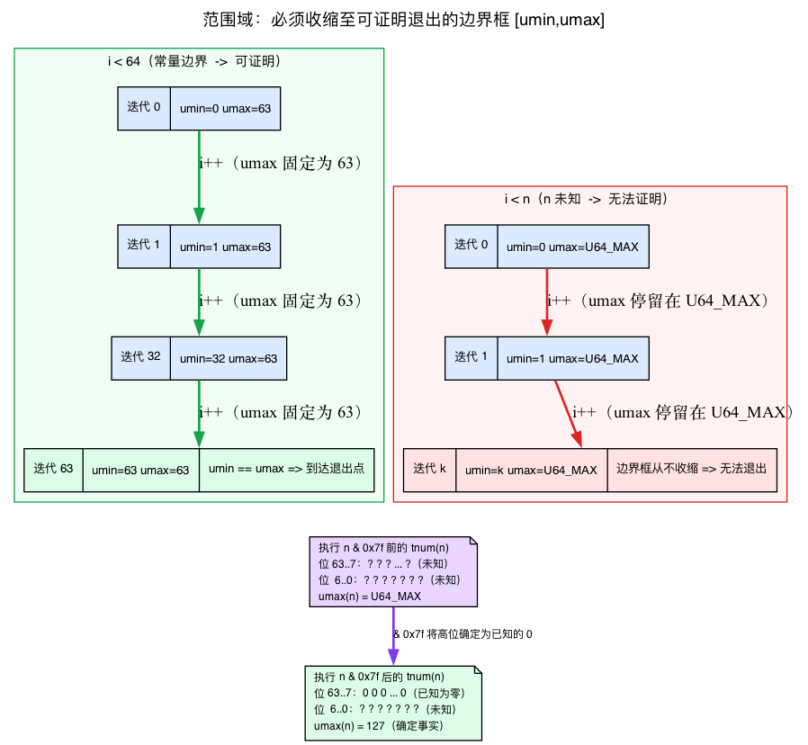
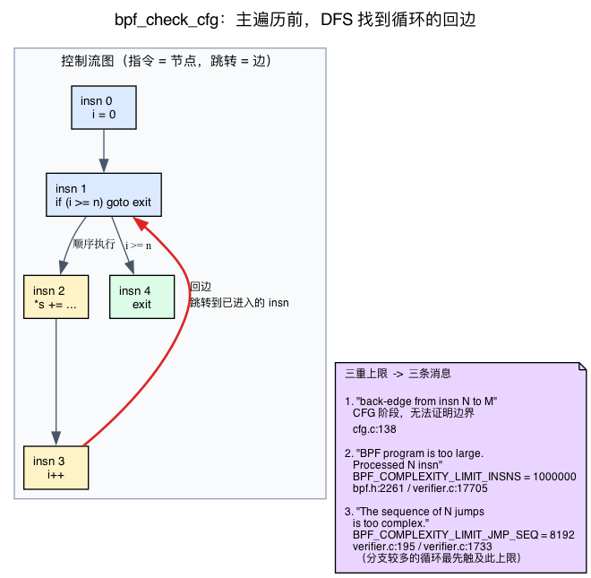
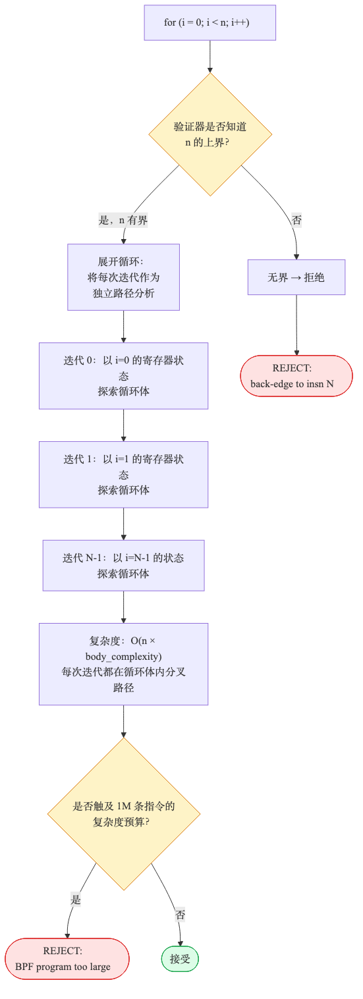
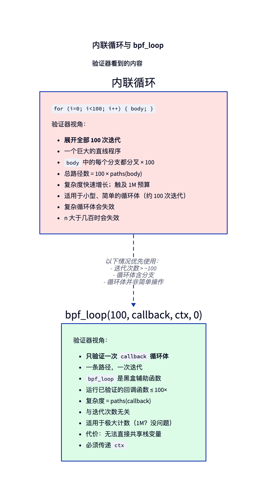
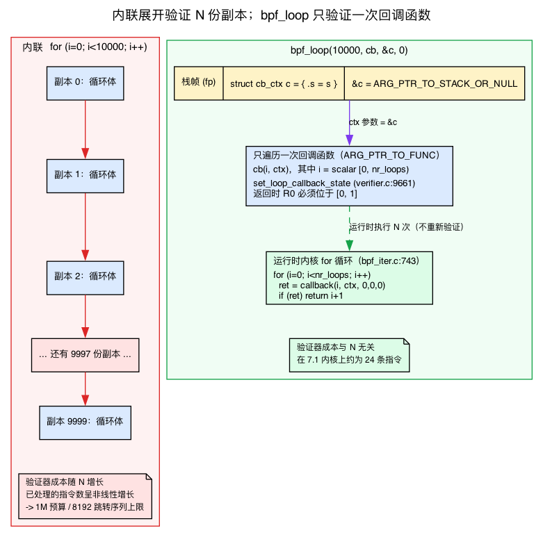

# 第5天 — 有界循环、`bpf_loop` 与路径爆炸问题

> **今日任务：** 理解“无限循环”拒绝真正表达的是“我无法证明它会终止”，了解验证器究竟会*追踪*循环计数器的哪些信息，并掌握四种可通过验证的循环写法，外加迭代器这一种类似循环的工具。本章结束第一阶段。总耗时：约 110 分钟。

## “我不过写了个 for 循环，为什么会报错？”

验证器的契约是*每个 BPF 程序都必须在有限的指令数内终止*。原因是操作层面的，而非哲学层面的：BPF 运行在内核上下文中，那里可能禁用了抢占、可能关闭了中断、可能不会发生调度。在这样的上下文里，一个永远运行的循环会卡死内核——没有任何看门狗能把你拽出来。所以验证器会静态地拒绝任何它无法证明会终止的程序。

那是*为什么*。而*怎么做*有三个活动部件，本章其余部分会不断依赖它们，所以我们在触碰任何一个循环之前先把三者都建立起来：

1. **每个寄存器的数值范围**——验证器用来*证明*某个计数器会到达其退出点的抽象域。（今天新引入。）
2. **控制流图遍历**——一个独立的阶段，在主遍历开始之前就找到回边（即循环）。（今天新引入。）
3. **不止一个复杂度上限**——第4天教了你 100 万指令预算；还有第二个、更小的上限，分支密集的循环会先撞上它。（今天新引入。）

第4天把验证器介绍为*抽象解释*：它符号化地遍历程序，每个寄存器都携带一个*类型*和一个*引用 id*。今天要讲的是 第4天只顺带提了一句叫“边界”的那部分——同一个寄存器状态里的**数值**部分。循环正是它体现价值的地方。

## 验证器对一个数字都知道些什么

这里是整章赖以成立的那个单一理念，而大多数教程从不明说：

> 对于每个保存 `SCALAR_VALUE` 的寄存器，验证器追踪的并非某个*确定值*，而是**一个可能的取值区间**；真实值必然落在其中。验证器通过判断这个区间是否朝退出条件收窄来证明循环终止，**而不是**阅读你的 C 源码。

具体地说，每个标量寄存器同时携带五样东西（`include/linux/bpf_verifier.h`）：

```c
struct tnum var_off;        /* line 117 — known-bits mask */
s64 smin_value;             /* line 123 — minimum possible (s64)value */
s64 smax_value;             /* line 124 — maximum possible (s64)value */
u64 umin_value;             /* line 125 — minimum possible (u64)value */
u64 umax_value;             /* line 126 — maximum possible (u64)value */
s32 s32_min_value;          /* line 127 — 32-bit sub-register bounds, too */
```

对“这个数字可能是什么”有两种互补的表示：

- **区间**——分别以 `smin/smax` 和 `umin/umax` 表示有符号、无符号的四个边界，即“该寄存器的值位于 `[umin_value, umax_value]` 之间”。全新的未知标量（例如 `bpf_get_prandom_u32()` 的返回值）从最宽区间开始：`umin=0, umax=U64_MAX`。此时验证器没有更多信息，因此区间覆盖全部可能值。
- **tnum（`var_off`）**——一个*已知位*掩码。对于每个位位置，它记录“这一位肯定是 0”“肯定是 1”或“未知”。它捕获区间无法表达的事实，比如“低 7 位未知但每个更高位都是零”——而这正是位掩码操作产生的结果。

对寄存器的每次操作都会同时更新两者。加一个常量，区间滑动。用 `& 0x7f` 做掩码，tnum 的高位就变成已知零。在分支里做比较，分支的每一侧都收窄范围。验证器逐条指令地向前传播这些信息——这*就是* 第4天里的“抽象解释”，数值化之后的样子。



### 为什么这对循环来说就是全部关键

循环表现为一条回边，也就是跳回较早的指令。验证器只有证明这条回边**最终不再执行**，才会接受程序；证明过程依赖范围域：

- **`for (i = 0; i < 64; i++)`**——比较 `i < 64` 会直接收窄验证器记录的 `i` 取值区间：在循环体分支中，`umax_value(i)` 变为 `63`。每次迭代都将计数器加 1；由于 `umax` 固定为 63，验证器可以证明程序最终到达退出条件。循环终止可证，而且边界 `64` 不依赖程序中的其他值。

- **`for (i = 0; i < n; i++)`**，其中 `n` 是未知标量——`n` 的取值区间为 `[0, U64_MAX]`，所以 `i < n` 只能让验证器得知 `i < U64_MAX`，`umax_value(i)` 仍为 `U64_MAX`。取值区间无法收窄到足以证明退出，循环终止**不可证**。程序被拒并不是因为“n 看起来像变量”这种表面规则，而是因为范围分析无法完成证明。

这就是为什么下面测验的答案 3 有效：`i < n && i < 64` 既保留了无界的 `n`，*又*加上了静态的 `i < 64`。无论 `n` 的 `umax_value(i)` 如何，`64` 都会为迭代次数设定上限，因此取值区间能够收窄，循环终止可证。所谓“min 技巧”，本质就是为范围追踪器提供可用的常量上限。

## 验证器如何处理循环：CFG 遍历与回边

在逐指令的主遍历开始之前，验证器会先运行一个*独立的*遍历，构建你程序的**控制流图**（CFG）并对每条跳转分类。这就是 `bpf_check_cfg`，作为它自己的一个阶段被调用：

```c
/* kernel/bpf/verifier.c:20033 */
ret = bpf_check_cfg(env);
```

CFG 无非就是把指令作为节点、跳转作为边。这个遍历做一次深度优先遍历并给每条边打标签。今天要紧的那一种是**回边**：跳转到一条 DFS 已经*进入但尚未完成*的指令——这恰好就是循环的定义。当遍历找到一条它不能允许的回边时，它会用行号和指令号说明：

```c
/* kernel/bpf/cfg.c:138 */
verbose(env, "back-edge from insn %d to %d\n", t, w);
```

在旧的或非特权的路径上，这里的一条回边就是硬性拒绝——验证器早于有界循环支持出现，它干脆拒绝任何循环。在现代的有界循环内核（5.3+）上，这条回边在此阶段是*被允许*的，而“它会终止吗？”这个问题被推迟到我们刚建立的范围追踪。所以 CFG 遍历是验证器*发现*循环的地方；范围域是它*裁决*循环的地方。



### 三类上限，三种不同的拒绝消息

第4天教了你 100 万指令预算。那**不是**唯一的上限，而这正是*为什么本章的各种失败并不都说同一句话*。一共有三个，而学会把一条消息映射到它的成因，是读懂验证器日志的一半功夫：

| 拒绝消息 | 触发原因 | 内核常量 |
|---|---|---|
| `back-edge from insn N to M` | CFG 遍历：一个无可证明边界的循环（或一条非特权/旧路径） | `cfg.c:138` |
| `BPF program is too large. Processed N insn` | *insns-processed* 预算：一个真正无界的循环被探索到耗尽 | `BPF_COMPLEXITY_LIMIT_INSNS = 1000000`（`include/linux/bpf.h:2261`） |
| `The sequence of N jumps is too complex.` | *explore-stack depth* 上限：一个有分支但有界的循环，其路径数溢出了 DFS 栈 | `BPF_COMPLEXITY_LIMIT_JMP_SEQ = 8192`（`verifier.c:195`） |

第三个才是意外。insns 预算统计的是验证器在所有路径上*处理过*多少条指令：

```c
/* kernel/bpf/verifier.c:17705 */
if (++env->insn_processed > BPF_COMPLEXITY_LIMIT_INSNS) {
        verbose(env, ...
                "BPF program is too large. Processed %d insn\n", ...
```

另外，探索栈的*深度*——DFS 正在同时处理的待定分支点有多少个——被封在低得多的水平：

```c
/* kernel/bpf/verifier.c:1733 */
if (env->stack_size > BPF_COMPLEXITY_LIMIT_JMP_SEQ) {
        verbose(env, "The sequence of %d jumps is too complex.\n", ...
```

一个分支密集的循环会**先**溢出那个 8192 的跳转序列栈，远在它处理完 100 万条指令之前——而这正是你稍后会看到的压力测试结果，约 114K 条指令，远低于 1M。当本章说“不是你可能预期的那条消息”时，*这张表就是答案*。



完整过程如下：CFG 遍历（1）找到回边，范围追踪（2）尝试证明计数器最终到达退出条件，而两项预算（3）限制验证器可为此进行多少探索。

> ### 常见疑问
>
> **问：100 万条指令听起来很多。程序实际上是怎么撞上它的？**
>
> 答：这 100 万是*横跨所有分支探索出的路径*，不是运行时执行的指令。一个 100 次迭代、循环体内有 5 个分支的循环会爆炸成约 100×2⁵ = 3200 条路径，每条也许 50 条指令，那就是 160K——已经很多了。加上嵌套循环或更长的循环体，你就会突破 1M。验证器会激进地剪枝，但路径爆炸是真实存在的。
>
> **问：为什么状态剪枝有时管用有时不管用？**
>
> 答：状态剪枝比较对同一条指令两次访问之间的寄存器状态。如果状态 A “弱于或等于”状态 B（A 里每个寄存器的类型都比 B 更宽），B 就能被剪掉：任何在 A 里安全的东西在 B 里也安全。诀窍在于标量值往往会*收窄*（循环计数器每次加 1），使得每次迭代的状态与前一次严格不同。现代验证器用标量加宽技巧把许多次迭代强制合并进一个状态。见 2025–2026 年新增的 `liveness.c` 和 `states.c` 文件。（这里的“收窄”精确地就是上面的范围域：每次迭代计数器的 `[umin,umax]` 都是不同的范围，所以除非验证器刻意把它们重新加宽到一起，否则状态不匹配。）
>
> **问：我在旧教程里看到 `#pragma unroll`。我应该用它吗？**
>
> 答：有时候。`#pragma unroll` 告诉 Clang 在*编译*时展开一个循环。验证器随后看到的是一条没有回边的直线程序——一定会终止。对小的固定计数有效。不可扩展：展开 1000 次迭代会产生 1000 倍的代码，撑爆指令限制。**迭代次数较多时，请使用 `bpf_loop`。**

> ### 动动脑筋
>
> 预测下面哪些会被验证器接受。
>
> 1. `for (int i = 0; i < 10; i++) sum += i;`
> 2. `for (int i = 0; i < n; i++) sum += i;`（其中 `n` 来自 `bpf_get_prandom_u32()`）
> 3. `for (int i = 0; i < n && i < 100; i++) sum += i;`（同一个 `n`）
> 4. `int i = 0; while (1) { if (i >= 10) break; sum += i; i++; }`
>
> .\
> .\
> .
>
> **答案：** 1 ✓（常量边界——`umax(i)` 被钉在 9，范围收缩，容易展开）。2 ✗（“无限循环”——`n` 的范围是 `[0,U64_MAX]`，所以 `umax(i)` 保持 `U64_MAX`，终止不可证）。3 ✓（那个 `i < 100` 就是范围一节里的静态封顶技巧——它无论 `umax(i)` 如何都把 `n` 封在 99）。4 ✓（在功能上与 1 相同——那个 `if (i >= 10) break` 给了范围追踪器同样的 `umax(i) <= 9` 事实）。

---

## 认识四种循环写法

### 1. 常量边界的 `for`（默认首选）

```c
for (int i = 0; i < 16; i++)
    process(i);
```

验证器会展开；对小边界有效。常量 `16` 立即给 `umax_value(i)` 封了顶，所以回边可证。当计数很小时（≤ 约 64）的默认首选。

### 2. 变量边界配静态封顶（"min"技巧）

```c
for (int i = 0; i < n && i < 64; i++)
    process(i);
```

即便 `n` 是动态的，`i < 64` 子句也把 `umax_value(i)` 钉在 63——一个独立于 `n` 的硬事实。验证器的取值范围每次迭代都收缩，所以它接受。当 n 是“以下两者中较小的一个：一个解析出来的长度，或我们的缓冲区大小”时很有用。

### 3. `#pragma unroll`（不适合较多迭代）

```c
#pragma unroll
for (int i = 0; i < 8; i++)
    out[i] = in[i] ^ 0xff;
```

编译成一条直线序列——没有回边，所以 CFG 遍历根本看不到循环，而范围追踪器也没有什么要证明的。对极小的计数没问题。对任何 ≥ 约 64 的都很糟糕，因为它会撑大程序体积。

### 4. `bpf_loop`（处理较多迭代的现代方案）

```c
static int my_cb(__u32 i, void *ctx) {
    /* ... */
    return 0;   /* return 1 to break early */
}

bpf_loop(1000000, my_cb, &ctx_struct, 0);
```

验证器把回调**验证一次**，作为单次迭代。然后它把 `bpf_loop` 当作一个黑盒辅助函数，它会把你验证过的回调运行最多 N 次。复杂度与 N 无关。

这是内核 5.17 带来的突破（提交 `e6f2dd0f8067`——"bpf: Add bpf_loop helper"）。在它之前，你只能靠展开。在它之后，BPF 里的循环感觉就像真正 C 里的循环。但它有自己的模型，而理解*它为什么有效*是值得的——那是下一节的内容。

### BPF 回调实际上是什么

> 下面的确切行号跟踪的是 7.1 树；符号名称（`bpf_loop_proto`、`set_loop_callback_state`、那些 `ARG_*` 类型标签）才是在任何内核上可以 grep 的稳定锚点。

`bpf_loop` 做了一件几乎没有其他 BPF 程序会做的事：它接受一个**函数指针**作为参数。为了处理它，验证器有一个专门的参数类型，你可以在辅助函数的原型里直接看到它（`kernel/bpf/bpf_iter.c:753-761`；下面引用的那两个参数类型在 `:758-759`）：

```c
const struct bpf_func_proto bpf_loop_proto = {
    ...
    .arg2_type  = ARG_PTR_TO_FUNC,            /* the callback function */
    .arg3_type  = ARG_PTR_TO_STACK_OR_NULL,   /* the ctx — must be stack */
    ...
};
```

这里有两点要拆解，它们解释了整个实验。

**`ARG_PTR_TO_FUNC`——把被调方验证一次，作为一次通用迭代。** 当验证器看到那个函数指针参数时，它把你的回调当作一个独立的*子程序*，并**符号化地遍历一次**，把索引 `i` 建模为一个完全*未知*的标量——`set_loop_callback_state`（`verifier.c:9661`）只是把 R1 标记为一个裸的 `SCALAR_VALUE`，使其取值区间保持为最宽的 `[0, U64_MAX]`。它**没有**被收窄到 `[0, nr_loops)`；验证器刻意把索引当作完全不透明，这样一次符号化遍历就能覆盖每一次迭代，无论 `nr_loops` 如何。它**不会**展开或生成 N 份循环体副本。正因只进行一次符号化遍历，验证成本才与 N 无关。负责设置这种状态的函数是：

```c
/* kernel/bpf/verifier.c:9661 */
static int set_loop_callback_state(struct bpf_verifier_env *env, ...
```

在验证器处理 `verifier.c:10447` 调用时于 `bpf_loop` 被调用。

**回调契约是被强制执行的，不是建议性的。** 你的回调必须返回 0（继续）或 1（停止）。在回调的返回点，验证器应用本章开头介绍的*同一套范围分析机制*，要求 `R0`（返回寄存器）落在 `[0, 1]` 里：

```c
/* kernel/bpf/verifier.c:9896 */
"At callback return", "R0"
```

越界错误本身使用的是通用范围消息：

```c
/* kernel/bpf/verifier.c:303 */
verbose(env, " should have been in [%d, %d]\n", range.minval, range.maxval);
```

这也串起了本章的内容：用于证明循环终止的标量范围域，同样负责检查回调返回值。“有界”和“在允许的范围内”是不同的问题，而下面的破坏实验 4 恰好展示了这种区别。

**为什么 ctx 必须是栈内存。** 第 3 个参数是 `ARG_PTR_TO_STACK_OR_NULL`——它必须指向*栈*内存（`fp` = 帧指针）。给它一个裸的 `PTR_TO_MAP_VALUE`（一个指向映射内部的指针，比如 `bpf_map_lookup_elem` 返回的那种），验证器就会拒绝它：

```
R3 type=map_value expected=fp
```

这就是为什么实验把它的映射指针包在一个小小的栈结构里，并传递*那个*结构的地址——它把映射指针通过一个栈槽“封装”以满足 `ARG_PTR_TO_STACK_OR_NULL`。这个包装不是风格选择；它是契约。

**运行时那一侧很普通。** 所有的关键机制都在验证那一侧。在运行时，`bpf_loop` 就是内核里一个普通的 C `for` 循环（`kernel/bpf/bpf_iter.c:743-751`）：

```c
for (i = 0; i < nr_loops; i++) {
        ret = callback((u64)i, (u64)(long)callback_ctx, 0, 0, 0);
        /* return value: 0 - continue, 1 - stop and return */
        if (ret)
                return i + 1;
}
```

它把你的回调调用最多 `nr_loops` 次，并在非零返回时提前停止。也有一个运行时上限：`nr_loops > BPF_MAX_LOOPS` 返回 `-E2BIG`（`bpf_iter.c:740-741`），其中 `BPF_MAX_LOOPS = 8 * 1024 * 1024`（`include/linux/bpf.h:2268`）。所以，关键在于验证器只检查一次；运行时执行的仍是普通循环。





要注意的是：回调不能直接访问调用函数的局部变量。你通过 `ctx` 指针（最后一个参数）传递状态——而正如我们刚看到的，它必须存在于栈上。

### 附赠：迭代器（第五种，循环形态的工具）

为了遍历内核数据结构（任务、套接字、cgroup、BTF），有专门的 **BPF 迭代器**——`task_iter`、`sock_iter`，等等。这些是*程序*，不是循环，所以它们处于上面那个四路框架之外。我们将在第17天认识它们。现在：只需知道它们作为一种循环形态的工具存在。

---

## 实验

### `loops.bpf.c`——试每一种形态

```c
{{#include ../labs/day05/loops.bpf.c:book}}
```

上面这两个程序共享一个 1 元素的数组映射（一个“全局计数器”模式——回想 第2天里的数组映射单例技巧）。构建并加载两者。注意 `cb_ctx`：它存在的原因只有一个——为了给 `bpf_loop` 一个*栈*地址（`&c`）而不是裸的映射指针 `s`，以满足 `ARG_PTR_TO_STACK_OR_NULL`。

### 查看验证器的工作量

上面两个程序都能成功*加载*，因此需要换一种方式衡量验证器的工作量。`bpftool prog load` 只在程序被**拒绝**时打印验证器日志；加载成功时不会提供有用信息。要查看成功加载所需的验证工作量，可以使用以下两种方法之一。

**路径 1——`veristat`（专门打造的工具）。** 它对一个目标文件里的每个程序做加载测试，并打印一张按程序的统计表：

```
sudo veristat loops.bpf.o
```

`Insns` 和 `States` 两列正是我们想要的比较——不需要挂载。（`veristat` 随内核树发布，位于 `tools/testing/selftests/bpf` 之下，可能需要构建/安装；它默认不在 `$PATH` 里。）

**路径 2——你自己的加载器。** 在加载前设置验证器日志级别，并读打印出的日志的最后一行：

```c
LIBBPF_OPTS(bpf_object_open_opts, opts, .kernel_log_level = 1);
```

`loop_helper` 的日志最后一行看起来像：

```
processed 24 insns (limit 1000000) ...
```

`processed N insns` 是路径探索的成本。确切的计数是**依赖于内核和编译器版本的**，所以要捕获你自己的，而不是相信这里打印的任何数字——但那个*关系*才是要点：

- `loop_const`（16 次迭代的内联）验证每一次展开的迭代，所以它的指令计数随迭代次数缩放。
- `loop_helper`（10K 次的 `bpf_loop`）把回调**验证一次**——那就是 `set_loop_callback_state` 单次遍历在起作用——所以它的成本很小且与 N 无关——在这个 7.1 内核上大约 24 条指令。

`bpf_loop` 对验证器来说*更便宜*，尽管它在运行时做*更多*工作，因为回调只验证一次。

### 压力测试：内联何时会失败？

试着把 `loop_const` 替换成一个分支密集、有界的内联循环：

```c
for (int i = 0; i < N; i++) {
    __u64 v = bpf_get_prandom_u32();
    if (v & 1) *s += v;
    else       *s -= v;
}
```

每个 `N` 都需要一次全新的构建，所以：编辑 `N`，重新构建（`make`，或重新运行你的 `clang` 命令），重新加载，重复。把 `N` 往上走：16、64、256、1024、10000，并看着 `processed insns` 非线性地增长。`N=1024` 仍然加载；在 7.x 内核上大约到 `N=10000` 时它被拒绝——但**不是**用你可能预期的"too large"消息。一个分支密集的循环体会溢出跳转序列栈（`BPF_COMPLEXITY_LIMIT_JMP_SEQ` = 8192，三个上限中的第二个），远在那个 1,000,000 指令预算之前：

```
The sequence of 8193 jumps is too complex.
processed 114705 insns (limit 1000000)
```

注意它在约 114K 条指令时失败——远低于 1M 限制。那就是先前那张表在起作用：这是*跳转序列深度*上限（`verifier.c:1733`），不是*insns-processed* 预算（`verifier.c:17705`）。那条扁平的 `BPF program is too large. Processed 1000001 insn` 消息来自一个真正*无界*的循环；见破坏实验 1。

把 `for` 换成 `bpf_loop`。几毫秒就加载。**循环体里的分支 × 10000 次迭代，如果验证器不剪枝就是 2¹⁰⁰⁰⁰ 条路径——`bpf_loop` 把它变成只是 paths(callback)，因为回调只验证一次，索引 `i` 被建模为一个完全未知（无界）的标量。**

---

## 按顺序进行破坏实验

### 破坏实验 1 — 无界循环

```c
__u32 n = bpf_get_prandom_u32();
for (__u32 i = 0; i < n; i++)
    *s += bpf_get_prandom_u32();   /* per-iteration helper call: cannot be folded */
```

> 注意循环体。如果你写 `*s += i;`，clang -O2 会识别出闭式
> `n*(n-1)/2` 并把它编译成没有回边的直线算术——
> 程序随后就正常加载，这个 break 永远不会触发。每次迭代的
> `bpf_get_prandom_u32()` 挫败了那种折叠，让一个真正的无界循环得以
> 保留到验证器阶段。

拒绝——`n` 是一个未知标量，所以它的取值范围是 `[0, U64_MAX]`，这就把 `umax_value(i)` 留在了 `U64_MAX`：验证器永远无法证明计数器到达退出，所以它一直探索直到耗尽复杂度预算：

```
BPF program is too large. Processed 1000001 insn
```

这是 *insns-processed* 上限（`BPF_COMPLEXITY_LIMIT_INSNS`，`verifier.c:17705`）。在更旧的内核上——5.3 之前，有界循环支持出现之前——CFG 遍历会更早地把这个拒绝为 `back-edge from insn N to M`，来自 `check_cfg` DAG 检查（`cfg.c:138`）；那种措辞在现代内核上不再对这种情况触发，现代内核允许回边并把裁决推迟到范围追踪。加上 `&& i < 1024`——范围一节里的静态封顶技巧给 `umax_value(i)` 一个 1023 的硬天花板。

### 破坏实验 2 — 看不见的边界

```c
__u32 n = bpf_get_prandom_u32() % 100;
for (__u32 i = 0; i < n; i++)
    *s += bpf_get_prandom_u32();   /* non-foldable body — keeps a real loop */
```

（和破坏实验 1 一样，循环体必须是 Clang 无法折叠的东西：用 `*s += i;` 整个循环会合并成 `n*(n-1)/2`，没有循环到达验证器，所以没有范围可追踪，教训也就丢失了。）

在现代内核上验证器*可能*接受这个（它能把 `n` 的范围追踪为 `[0, 99]` 从而 `umax_value(i) <= 98`）。在更旧的内核上它会拒绝，因为取模算术并不总能通过标量追踪器传播出一个紧的 `umax`——即便 `% 100` 在逻辑上给它设了界，范围仍可能保持很宽。把它与按位 AND 对比，后者被 tnum *立即*捕获：

```c
n = n & 0x7f;        // 0..127, verifier definitely sees the bound
```

`& 0x7f` 把 `n` 的 tnum 中所有高于第 6 位的位设为已知零（`var_off`），这就立即把 `umax_value(n)` 强制为 127。高位变成一个硬事实，所以 `i < n` 现在把 `umax_value(i)` 封在 126，循环可证。教训：**位掩码直接更新已知位域；取模可能不会——能明确的时候就明确。**

### 破坏实验 3 — 撞上复杂度预算

一个*看似*极端的模式：

```c
char buf[256];
bpf_get_current_comm(buf, sizeof(buf));
for (int i = 0; i < 256; i++) {
    if (buf[i] == '/') { /* do A */ }
    else if (buf[i] == ' ') { /* do B */ }
    else { /* do C */ }
}
```

出乎意料的是，它在现代（7.x）验证器上可以**正常加载**。分支体是空的，所以每条路径都不改变寄存器/标量状态，状态剪枝把它们全部合并——那 256 次迭代从不爆炸。要真正突破预算，你需要*同时*有一个高迭代次数（在 6.6+ 上远超 `N=10000`，如上面的压力测试）**以及**能让寄存器状态分叉从而路径无法被剪枝的分支体。给每个分支一个改变状态的副作用并提高计数：

```c
for (int i = 0; i < N; i++) {
    if      (buf[i] == '/') *s += i;
    else if (buf[i] == ' ') *s -= i;
    else                    *s ^= i;
}
```

现在路径分叉了（每个分支留下一个不同的寄存器状态范围，所以剪枝无法合并它们），而在足够大的 `N` 上，你溢出了跳转序列栈：`The sequence of NNNN jumps is too complex.`——就是压力测试里那个相同的 `BPF_COMPLEXITY_LIMIT_JMP_SEQ` 上限，*不是* 1M 的 insns 预算。修法：用 `bpf_loop` 重构，或把迭代次数减到最长合理的字符串长度。

### 破坏实验 4 — 回调返回错误的东西

把一个返回 0 或 1 以外东西的回调接到实验里那个（现在可加载的）`loop_helper` 里：

```c
static int cb(__u32 i, void *ctx) {
    return 2;     // valid returns: 0 (continue) or 1 (break)
}
```

验证器拒绝：

```
At callback return the register R0 has smin=2 smax=2 should have been in [0, 1]
```

请从范围域的角度理解这条消息。`smin=2 smax=2` 意味着 R0 是**精确常量 2**——一个完全*有界*的值，其取值区间是单点 `{2}`。它仍然被拒绝，因为回调返回的*范围检查*（`verifier.c:9896`，"At callback return"，"R0"）要求 R0 落在 `[0, 1]` 里，而 `should have been in [0, 1]` 是 `verifier.c:303` 处的通用范围错误消息。“有界”和“在允许的范围内”是不同的问题：这个值是有界的，只是被界在了*错误的*范围。这与证明循环终止使用的是同一套标量范围分析机制，只是应用在子程序出口。（确切的寄存器字段随内核版本而变。你只有在 `loop_helper` 的 ctx 被修好之后才能到达这个检查，否则 `R3 type=map_value expected=fp` 错误会先触发。）

---

## 在内核里读些什么

- **`kernel/bpf/bpf_iter.c`**——搜索 `BPF_CALL_4(bpf_loop`（第 727 行）。运行时实现是第 743–751 行那个紧凑的 `for` 循环，调用被验证过的回调；第 753–761 行的原型声明了 `ARG_PTR_TO_FUNC`（`:758`）和 `ARG_PTR_TO_STACK_OR_NULL`（`:759`）。验证器专门知道这个辅助函数，并通过 `set_loop_callback_state`（`verifier.c:9661`）把回调验证一次。
- **`include/linux/bpf_verifier.h`**——读 `struct bpf_reg_state` 第 117–127 行左右：`var_off`（tnum）加上 `smin/smax/umin/umax` 区间以及 32 位子寄存器边界。这*就是*那个抽象域。在这里花五分钟；它对未来每一份验证器日志都有回报。
- **`kernel/bpf/verifier.c`**：
  - 搜索 `bpf_is_state_visited`（定义在 `kernel/bpf/states.c`）——状态剪枝的核心。
  - 搜索 `process_bpf_exit_full`——状态如何在出口处跨路径传播。关于它依赖的活跃性机器，见 `kernel/bpf/liveness.c`。
  - 第 20033 行 `bpf_check_cfg(env)`——找回边的 CFG 遍历。
- **`kernel/bpf/cfg.c`**——第 138 行，那条 `back-edge from insn %d to %d` 消息，这样你就能看到循环实际上是在哪里被*发现*的。
- **`tools/testing/selftests/bpf/progs/bpf_loop.c`**——每一种循环形态的官方示例。
- **`Documentation/bpf/verifier.rst`**——内核自己关于验证器如何处理循环和值追踪的文档。值得读一遍。

---

## 要点回顾

- **验证器拒绝无界循环**，因为它必须静态地证明终止——没有内核看门狗能从无限的 BPF 中恢复。
- **每个标量寄存器都携带一个数值范围**，不只是一个类型：有符号/无符号 `min/max` 加上一个 tnum（`var_off`）已知位掩码。循环边界是通过观察这个范围朝退出收缩来证明的，*而不是*通过读 C 源码。
- 独立的 **CFG 遍历**（`bpf_check_cfg`）负责找到**回边**（循环），再由范围域判断循环能否终止。`i < 64` 将 `umax(i)=63` 固定下来；无界的 `i < n` 则让它停留在 `U64_MAX`，因而无法证明终止。
- **三类上限，三种消息：** `back-edge from insn N to M`（CFG 遍历）、`BPF program is too large`（1M insns-processed 预算）、`The sequence of N jumps is too complex`（8192 跳转序列栈——分支密集的循环先撞上它）。
- **常量边界的 `for`** 对小计数（≤ 约 64）没问题；**变量边界配静态封顶**（`i < n && i < CAP`）给范围追踪器一个常量天花板；**`#pragma unroll`** 完全移除回边（仅限极小计数）。
- **`bpf_loop(N, cb, ctx, 0)`** 是现代答案：回调（一个通过 `ARG_PTR_TO_FUNC` 传入的子程序）被**验证一次**，作为单次通用迭代，所以成本与 N 无关。在运行时它是一个普通的内核 `for` 循环。`ctx` 必须是**栈**内存（`ARG_PTR_TO_STACK_OR_NULL`）——因此有那个栈包装。
- **回调契约**（返回 0 或 1）由*相同的*范围分析机制强制执行：返回时 R0 必须在 `[0,1]` 里——“有界” ≠ “在允许的范围内”（见破坏实验 4）。
- 一个按位 **`& 0x7f`** 在 tnum 里设置已知零位并立即把 `umax` 收紧为 127；**取模**可能不会传播一个紧的 max——能明确的时候就明确。

---

## 检查问题

一个循环迭代 100 次。里面，你有一个 `if/else`，带 4 个条件（所以在某一点有 4 个分支）。在*没有*状态剪枝的情况下，验证器大约要探索多少条路径？而用 `bpf_loop` 代替内联循环又是多少？

<details>
<summary>点击揭晓答案</summary>

**答案：** 没有剪枝：4¹⁰⁰ ≈ 10⁶⁰——天文数字。有状态剪枝时，验证器会把寄存器状态（每个标量的数值取值范围）等价的迭代合并掉，往往把它拉回到可管理的水平。用 `bpf_loop` 时，回调（循环体的一次迭代）被验证一次，带它的 4 个分支 = 总共 4 条路径，索引 `i` 被建模为一个完全未知（无界）的标量。循环的 100 次迭代对验证器是不透明的——`bpf_loop` 只是一个带有界执行契约的辅助函数调用。

</details>

---

## 第一阶段总结

你现在拥有：
- 一套可用的 libbpf+CO-RE+环形缓冲区+哈希映射工作流。
- 在每次查找或 reserve 之后做空值检查的本能。
- 读懂验证器日志的词汇——包括三条不同的拒绝消息以及每一条意味着什么。
- 对验证器*做什么*的理解——验证器会在数值范围域上执行抽象解释，进行状态剪枝，并受多项复杂度预算约束。

那已经是做真正 BPF 工作足够的基础了。第二阶段（第6天–13）把你专门化到追踪：用 fentry/fexit 大规模地做带类型的函数追踪、跟踪点、栈追踪、uprobe，以及可睡眠程序。

## 明天

**第6天：用 fentry/fexit 大规模地做带类型的函数追踪。** 我们按名字挂载到内核函数，并读取它们的参数，带完整的类型信息——不再有 `PT_REGS_PARM` 式的瞎猜。你会看到 BTF 如何让 `fentry` 知道你钩住的那个函数的真实签名，以及为什么这让参数访问既比 kprobe 路径更安全也更快。
