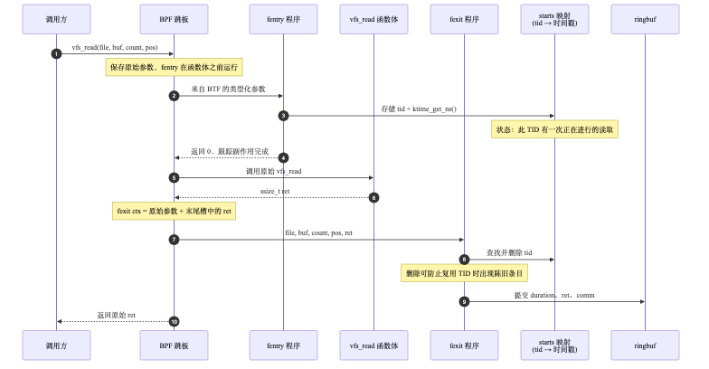
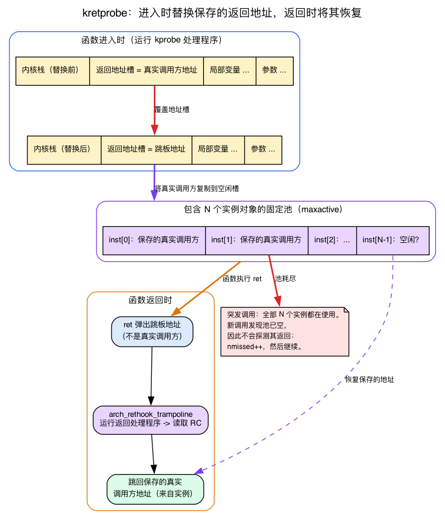
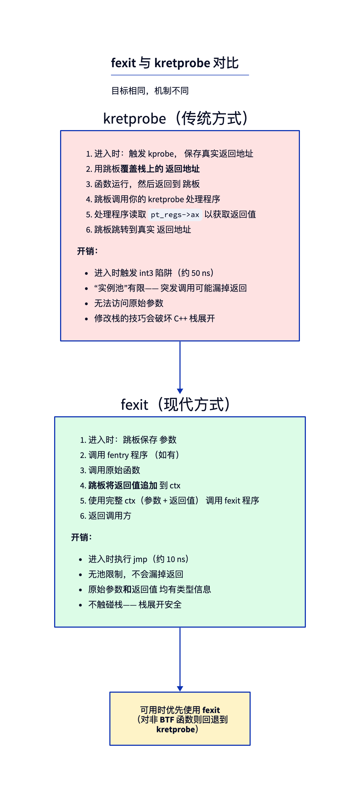
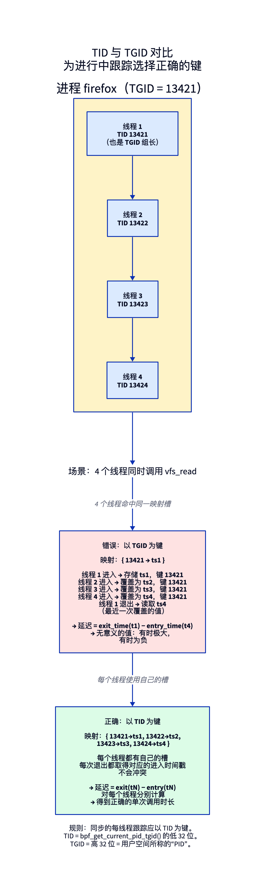
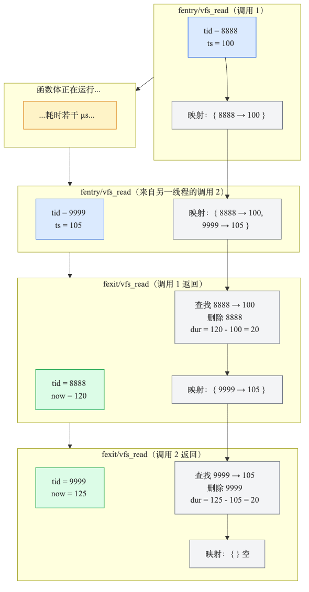

# 第6天 — fentry/fexit 与延迟测量模式

> **今日任务：** 测量系统上每一次 `vfs_read` 的延迟。建一个以线程为键的 map，在调用进入时存下进入时刻的时间戳，在调用返回时取回它，把时长发往用户空间。一路上你会：认识 `fexit`，并*精确*理解它与更老的 `kretprobe` 的差别（返回地址的替换、实例池、为什么突发会丢事件）；弄清 `vfs_read` 究竟是什么、它的返回值意味着什么；并挑对合适的每线程键。总时间：约 110 分钟。

> **第二阶段从这里开始。** 第1–5天让你熟练掌握了 libbpf、CO-RE、map 和验证器。第6–13天把这份熟练变成追踪能力：大规模的带类型内核函数追踪、tracepoint、栈回溯、uprobe 与可睡眠程序。到第13天，你就能写出生产级可观测性工具里那种追踪器了。

## 每个追踪器背后的共同模式

大多数追踪问题都可以归结为同一种模式：

> *“当事件 A 发生时，记住某个东西。当与之匹配的事件 B 发生时，取回它并据此行动。”*

对延迟而言：A = 函数进入，B = 函数退出。在 A 处记住时间戳；在 B 处计算 `now - remembered`。

昨天你见过 `fentry`。今天你将认识它的另一半——`fexit`——并把两者配合起来，实现 BPF 追踪中最常见的模式。



fentry 程序在函数体*之前*运行，fexit 程序在它*之后*运行。两者连接到同一个跳板；加载 BPF 对象时，内核会将它们作为一组相互配合的程序安装。在进入和退出之间，函数执行自身的工作——可能耗时 100 ns，也可能耗时 100 ms。

## `vfs_read` 是什么，它的返回值又意味着什么？

在挂钩任何东西之前，先了解你的目标。今天我们追踪 `vfs_read`，只有先了解它的两个关键事实，才能理解这个实验。

**其一：`vfs_read` 是内核为 `read(2)`/`pread(2)` 系列系统调用提供的唯一中央入口。** 每一次文件描述符读取 —— 无论那个 fd 指向普通文件、套接字、管道、`/dev/zero` 还是某个 procfs 节点 —— 都会先汇聚到 `vfs_read`，内核才据此分派给那个具体文件系统自己的读处理函数。这使它成为一个理想的汇聚点：挂一次 `vfs_read`，就能看到机器上的*所有*读取。（你在第2天的一个间隙里其实已经不加解释地用过 `fentry/vfs_read` —— 现在你知道它为什么是这么受欢迎的目标了。）

**其二：它的签名恰好就是我们 fentry 程序要声明的那四个带类型参数，它的返回类型恰好就是 fexit 捕获的东西。** 在 v7.1 中：

```c
/* fs/read_write.c:554 */
ssize_t vfs_read(struct file *file, char __user *buf, size_t count, loff_t *pos)
```

- `struct file *file` —— 该 fd 所指向的已打开文件（第1天提到 `struct file` 就在 `vmlinux.h` 里；这里了解这些就够了）。
- `char __user *buf` —— 用户空间的目标缓冲区。
- `size_t count` —— 调用方请求读取的字节数。
- `loff_t *pos` —— 指向文件偏移的指针。

返回类型 `ssize_t` 定义了 fexit 程序要读取的结果。成功时它是**实际读取的字节数** —— 可能*少于* `count`（短读，或 EOF 返回 0）。失败时它是一个**负的 errno**。你可以在函数最开头就看到全部三种失败返回：

```c
/* fs/read_write.c:558-563 */
if (!(file->f_mode & FMODE_READ))
    return -EBADF;
if (!(file->f_mode & FMODE_CAN_READ))
    return -EINVAL;
if (unlikely(!access_ok(buf, count)))
    return -EFAULT;
```

而成功值则直接来自文件系统自己的读操作：

```c
/* fs/read_write.c:571-573 */
if (file->f_op->read)
    ret = file->f_op->read(file, buf, count, pos);
else if (file->f_op->read_iter)
    ret = new_sync_read(file, buf, count, pos);
```

这就是为什么今天的实验把返回值当作一个标着“bytes”的*有符号*数打印：`vfs_read → 2543 bytes` 是一次成功的 2543 字节读取；负数则会是一个 errno。我们不需要完整的 VFS 读路径（`->read` 与 `->read_iter` 的分派）—— 只要记住“中央读咽喉点”和“返回值 = 字节数或负 errno”，这样就能理解输出的含义。

## 认识 `fexit`

`fexit` 是 `fentry` 的对应物：它挂在函数*返回*处。但与 `fentry` 不同，你还会拿到作为带类型参数递交给你的返回值。最后这个参数很关键 —— 正是它让 fexit 的能力严格强于较早的 `kretprobe`。

要体会*为什么* fexit 是更好的工具，你得先理解老的返回探针机制是怎么运作的 —— 因为本章接下来会反复拿它作对比，而 kretprobe 挂函数返回的方式，比你已经熟悉的入口 kprobe 要棘手得多。

### 复习：入口 kprobe（第1天）

第1天已经讲过**入口** kprobe：它用一个 `int3` 断点字节覆盖被探测函数的第一条指令。当 CPU 执行到那个字节时触发陷阱，kprobe 处理程序运行，然后原指令被单步执行或模拟执行，程序继续往下跑。在 x86 上，模拟辅助函数就在那儿 —— `int3_emulate_call`、`int3_emulate_ret`、`int3_emulate_jmp`（`arch/x86/kernel/kprobes/core.c:507-525`）。这里我们**不**重讲这些。*入口*钩子已经解决了。

新的问题是：你怎么在**返回**处运行代码？返回没有单独一条可供打断点的指令 —— 一个函数可以从很多地方 `ret`，而同一段代码会对每个调用方都运行。

### kretprobe 如何劫持返回地址

kretprobe 是*叠加在*入口 kprobe *之上*的，它会在栈上做如下处理：

1. 在函数**入口**处，kprobe 处理程序从内核栈上读出该函数真正的返回地址，并把它**保存**进一个每调用对象里。然后它把栈上那个保存的返回地址**覆盖**成一个内核跳板的地址。
2. 函数正常运行，最终执行 `ret`。但 `ret` 现在弹出的是*跳板*地址，而不是真正的调用方 —— 于是控制流落进跳板。
3. 跳板运行你的返回处理程序（它可以读到返回值），然后**跳到真正保存下来的调用方地址**，程序就像什么都没发生过一样继续执行。

在 x86 上，那个跳板是手写的汇编，被塞进栈里的正是它的地址：

```asm
/* arch/x86/kernel/rethook.c:26-38 */
"arch_rethook_trampoline:\n"
    ...
    "   pushq $arch_rethook_trampoline\n"   /* fake return addr for the unwinder */
    ...
    "   call arch_rethook_trampoline_callback\n"
```



**实例池。** 要保存那个真正的返回地址，你需要*每个在途调用一个对象*。递归、抢占以及多个 CPU 都意味着对同一函数的多个调用可能同时“在途”，每个都需要自己保存的地址。所以内核预先分配了一个**固定大小的对象池**，其大小由 `maxactive` 决定。这些字段定义在 `struct kretprobe` 中：

```c
/* include/linux/kprobes.h:150-154 */
int maxactive;
int nmissed;
...
struct rethook *rh;
```

而每调用的保存对象是：

```c
/* include/linux/kprobes.h:162-164 */
struct kretprobe_instance {
    ...
    struct rethook_node node;
    ...
};
```

内核树里的注释把这份大小契约写得很清楚：*“maxactive - The maximum number of instances of the probed function that can be active concurrently”*，以及 *“nmissed - tracks the number of times the probed function's return was ignored, due to maxactive being too low”*（`include/linux/kprobes.h:135-138`）。**如果同时在途的调用数超过池大小，多出来的那些返回就干脆不会被探测** —— 内核把 `nmissed` 加一然后继续往下走。这就是“突发会耗尽实例池”的具体含义：一股突然涌来的并发调用会悄无声息地丢掉返回事件。

**回溯器问题。** 因为 kretprobe 改写了保存的返回地址，任何*遍历内核栈*来重建调用方栈帧的东西，都会在本该是真正调用方的位置上看到跳板地址。在内核里，这指的是那些支撑 `dump_stack()`、`/proc/<pid>/stack`、perf/ftrace 回溯以及 `bpf_get_stack` 的内核栈回溯器（x86_64 上的 ORC、帧指针回溯）—— 内核里没有 C++ 异常机制，全是 C。（x86 跳板甚至压入一个假的 `$arch_rethook_trampoline` 栈帧来*告诉*回溯器“这是一个 rethook”，正是因为真正的返回地址被藏起来了。）这就是“修改栈的花招会破坏回溯”这句话的具体含义。

### 为什么 fexit 避开了这一切

`fexit` 是 fentry 所用的同一个*跳板*的一部分。跳板在入口处保存参数，调用 fentry 程序，调用原函数，拿到返回值，**把它追加到 ctx 数组末尾**，然后调用 fexit 程序。



把两种机制逐点对比：

- **kretprobe** 改写保存的返回地址，需要一个有限的每探针实例池，在突发时丢返回（`nmissed++`），并且会扰乱栈回溯器。这种方式有效，但侵入性较强。
- **fexit** 从不碰返回地址。原函数正常返回到它真正的调用方，跳板在旁边就把返回值捕获了，所以没有栈改写、没有有限的池、也没有突发丢事件这种失败模式。

结论很明确：**只要 fexit 可用就优先用它** —— 任何带 BTF 信息的函数（在现代构建上，基本上就是每一个非 `__attribute__((always_inline))` 的内核函数）。只有在 fexit 不可用时才用 `kretprobe`。

> ### 常见疑问
>
> **问：fentry 和 fexit 是两个独立的钩子，还是一个？**
>
> 答：概念上是一个钩子带两个回调函数。内核为每个挂载目标构建单独一个跳板，它按顺序调用所有已挂载的 fentry 程序*以及*所有已挂载的 fexit 程序。你可以只挂一个 fentry 而不挂 fexit，反之亦然。它们共享跳板基础设施（`kernel/bpf/trampoline.c`），但从你的视角看是彼此独立的 BPF 程序。
>
> **问：如果函数永不返回（panic、BUG_ON）会怎样？**
>
> 答：那 fexit 就不会运行。你的 map 条目会无限期留在哈希表里。今天的“要打破什么”里我们会见到这个确切的失败模式 —— 它是那些连跑数周的追踪器慢性泄漏的根源。
>
> **问：函数可以被递归调用吗？**
>
> 答：可以，而这正是以 TID 作键会失效的情形。今天结尾的检查问题会带你一步步走过它究竟为什么失效。对你追踪的大多数内核函数来说，递归不是问题。

## 认识 `bpf_ktime_get_ns`

```c
__u64 ts = bpf_ktime_get_ns();
```

返回**单调**时钟（`CLOCK_MONOTONIC`）上的纳秒数：时间稳步前进、从不倒退，但它*不包含*机器处于挂起状态的任何时段，所以它并不真是“自开机以来经过的时间”。而这恰恰是你测量延迟*差值*所需要的 —— 两次读取用的是同一个时钟，差值就有意义。它很便宜 —— 底层实现为 `ktime_get_mono_fast_ns`，无锁，只需一次读取内核计时缓存。一次调用约耗时 10 ns。它**不是**日历时间/挂钟时间，你也无法把它和用户空间的 `clock_gettime(CLOCK_REALTIME)` 时间戳关联起来。如果你需要连挂起时间也计入的经过实时时间，用 `bpf_ktime_get_boot_ns`（`CLOCK_BOOTTIME` —— 仍然是自开机以来的单调计数，只是把挂起也算进去，*不是*挂钟时间）。这里最接近挂钟时间的是 `bpf_ktime_get_tai_ns`（`CLOCK_TAI`，它跟踪 UTC，只差一个固定的闰秒偏移）。

## TID 与 TGID —— 挑对键

这是初次编写每线程追踪器时很容易遇到的问题。今天动手写代码前，请仔细读这一节。

`bpf_get_current_pid_tgid()` 返回一个打包的 `u64`：

```
+------------------+------------------+
| TGID (upper 32)  | TID (lower 32)   |
+------------------+------------------+
```

Linux 内核的术语和用户空间的术语对不上：

- 用户空间叫“PID”的东西，是内核的 **TGID**（线程组 ID —— 领头线程的 TID）。
- 内核叫 **TID** 的东西，是每线程的标识符。

一个多线程进程有许多共享同一个 TGID 的 TID。在 `bpf_get_current_pid_tgid` 内部：

```c
__u32 tgid = bpf_get_current_pid_tgid() >> 32;       // userspace "PID"
__u32 tid  = bpf_get_current_pid_tgid() & 0xffffffff; // unique per thread
```

要跟踪并发在途的调用，你需要每线程粒度：



如果你以 TGID 作键，同一进程的四个线程都会命中同一个 map 槽位，互相覆盖彼此的时间戳。得到的延迟数据将毫无意义。请使用 **TID**。

> ### 削尖你的铅笔
>
> 内核为什么不直接给你一个毫无歧义的单一“线程标识符”？为什么 `bpf_get_current_pid_tgid` 要把两个字段打包进一个返回值里？
>
> .\
> .\
> .
>
> **答案：** 因为一次 helper 调用比两次便宜。内核只曾暴露那个合并的 helper `bpf_get_current_pid_tgid`（helper id 14）—— UAPI 里从来就没有单独的 `bpf_get_current_pid` 或 `bpf_get_current_tgid`。单次调用把两个字段打包在一起返回，正好映照 `task_struct` 自身所携带的：既有 `pid`（内核含义），也有 `tgid`。函数体就字面写着 `return (u64) task->tgid << 32 | task->pid;`（`kernel/bpf/helpers.c:225-233`）。命名上的混乱是历史遗留 —— 用户空间在线程出现之前就把进程叫作“PID”了。

## 完整梳理生命周期

来看两个线程并发读取时，map 随时间是什么样子：



每个线程进入时，其 TID 获得一个槽位；线程退出时，对应 TID 的槽位会被读取并删除。当没有任何调用在途时，map 是空的。**删除是关键** —— 没有它，随着线程来来去去，map 会被填满。

---

## 实验

### `latency.h` —— 共享的事件记录

生产者和消费者通过一个头文件共享同一个 struct，和第1天、第3天做的一模一样：

```c
{{#include ../labs/day06/latency.h}}
```

### `latency.bpf.c`

```c
{{#include ../labs/day06/latency.bpf.c:book}}
```

fentry 的签名 `(struct file *f, char *buf, size_t n, loff_t *pos)` 恰好就是我们上面从 `fs/read_write.c:554` 读出来的 `vfs_read` 那四个参数。fexit 的签名是同样这四个参数，再加上捕获到的 `ssize_t ret` —— 也就是我们讨论过的字节数或负 errno，正是 `e->ret` 带往用户空间的东西。

### 相较第1–5天有什么新东西

- **一个对象里有两个程序**，共享 map。骨架把两者暴露为 `skel->progs.on_enter` 和 `skel->progs.on_exit`。当你调用 `latency_bpf__attach(skel)` 时，两者都会自动挂载。
- **`BPF_PROG(on_exit, ..., loff_t *pos, ssize_t ret)`** —— fexit 先收到所有函数参数，再把返回值作为*最后*一个参数收到。`BPF_PROG` 宏知道 fexit 程序会多收到一个 ctx 槽位。我们在第7天详细讲 `BPF_PROG` 的机制。
- **`bpf_map_update_elem(..., BPF_ANY)`** —— 插入或更新。注意这里我们用 `BPF_ANY` 而不是 `BPF_NOEXIST`，因为我们不在乎同一个 TID 是否还留着一个来自漏掉的 `fexit` 的陈旧条目（比如上一次调用 panic 了）。覆盖它才是正确的。
- **`bpf_map_lookup_elem` 返回一个指向映射中有效值的指针。** 你可以直接读取它。验证器要求做空指针检查。
- **`bpf_map_delete_elem`** —— *千万别跳过这一行。* 正是它防止 map 被永远填满。

### `latency.c`

标准的 ringbuf 消费者。打印：

```c
printf("PID %u TID %u vfs_read → %lld bytes in %llu µs (%s)\n",
       e->pid, e->tid, (long long)e->ret,
       e->dur_ns / 1000, e->comm);
```

（这个极简版本里我们不捕获请求的大小。把它作为一个练习加上去。）

### 运行

使用两个终端，避免追踪器和工作负载争用同一个 shell。

**终端 A** —— 在前台构建并运行追踪器，等它挂载完成后再去制造工作负载（在 `latency_bpf__attach()` 返回之前发出的 `vfs_read` 会被悄无声息地漏掉）：

```bash
make
sudo ./latency
```

**终端 B** —— 一旦追踪器上线，就制造一些读取：

```bash
cat /etc/passwd > /dev/null
dd if=/dev/zero of=/dev/null bs=1k count=100
```

预期输出（在终端 A 里）：

```
PID 14001 TID 14001 vfs_read → 2543 bytes in 12 µs (cat)
PID 14002 TID 14002 vfs_read → 1024 bytes in 8 µs (dd)
PID 14002 TID 14002 vfs_read → 1024 bytes in 6 µs (dd)
...
```

`→ N bytes` 那一列是 `vfs_read` 的返回值：`cat` 读了 2543 字节，`dd` 每块 1024 字节。那里出现负值就会是一个 errno（例如 `-EBADF` 对应 `-9`）—— 这正是我们从 `fs/read_write.c:558-573` 读出来的契约。

这会追踪机器上*每一次* `vfs_read`，而不只是 `cat`/`dd` —— sshd、systemd、journald 乃至 shell 自己都在不停地读，所以那两行会淹没在一大堆无关事件里。要把它们单独拎出来，把终端 A 的输出用管道接给 `grep -E 'cat|dd'`（或在消费者里按 `comm` 过滤）。**完成后在终端 A 中用 Ctrl-C 停止追踪器。**（如果你偏好用 `sudo ./latency &` 把它放到后台，记得在制造工作负载之前 `sleep 1` 让挂载完成，并用 `sudo pkill latency` 停掉它。）

你刚刚实时测量了系统上每一次内核侧的 `vfs_read`，带类型的参数访问，每次调用的开销只有几百纳秒。**这就是 eBPF 的用武之地。**

---

## 按顺序尝试破坏

### 破坏实验 1 —— 忘记 `bpf_map_delete_elem`

你在第2天（破坏实验 4，当时标为第9天的预告）已经看过它的预演；这里它是今天这个追踪器实实在在的失败模式，所以值得完整走一遍。第2天采用的是简便但不严谨的 `wc -l` 计数法——下面改用可靠的 `-j | jq length` 形式，这才是值得信赖的计数方式。

把它注释掉，然后 `make` 并重新启动一个全新的追踪器（`sudo pkill latency; make && sudo ./latency &`）—— `starts` 这个 map 只在已加载的程序运行时才存在，所以如果追踪器没起来，`bpftool map ... name starts` 什么也找不到。从另一个终端用 `find /usr -type f -exec cat {} + >/dev/null` 制造负载，然后周期性地读取活条目计数。可靠且与版本无关的办法是把 JSON 转储用管道接给 `jq length`：

```bash
sudo bpftool map dump -j name starts | jq length
```

```
21
```

（普通的 `bpftool map dump name starts` 会打印条目本身 —— 在这里 v7.x 的 bpftool 上是 `key: … value: …` 这样的行，末尾还有一行 `Found N elements` 页脚；只有 `-j` 标志才会输出一个 JSON 数组。格式在不同构建间各不相同，这正是上面那个 `-j | jq length` 形式才是可靠计数器的原因。别用 `bpftool map show name starts` 来干这个：它只报告静态的 `max_entries 10240` 上限以及键/值大小，从不报活计数。也别把 `map dump` 接给 `wc -l`：它数的是格式行/页脚行，不是元素。）

看着 *N* 往上爬。起初慢，然后稳步增长。当它逼近 `max_entries=10240` 而趋于平台期时，`bpf_map_update_elem` 会对每个新 TID 悄无声息地失败。你的追踪器覆盖范围退化到“只有在 map 填满时就已经在途的那些 TID”。

这是一种缓慢累积的失效模式。**永远在退出时删除。**

### 破坏实验 2 —— 用 TGID 代替 TID

在两个程序里都把 map 的键改成 TGID —— `bpf_get_current_pid_tgid() >> 32` —— 而不是 TID。（注意入口程序是直接计算 `tid` 的，没有 `id` 变量，所以你是在各自里改那个被掩码的表达式，而不是复用某个 `id`。）只有当一个进程的*若干线程*（共享一个 TGID、多个 TID）并发读取时，这种冲突才会显现 —— 不同的进程各有各的 TGID，所以它们永远不会冲突。用单个多线程读取器来驱动它：

```bash
python3 - <<'EOF'
import threading, time
def r():
    while True:
        with open('/etc/passwd') as f:
            f.read()
for _ in range(8):
    threading.Thread(target=r, daemon=True).start()
time.sleep(10)
EOF
```

8 个线程共享一个 TGID 且都调用 `vfs_read`，所以一个以 TGID 作键的 map 会在每次并发读取时冲突：当线程 B 的 `fentry` 用它自己（*更晚*）的时间戳覆盖了线程 A 的起始时间戳时，A 的 `fexit` 随后读到的是 B 的时间戳，算出一个荒唐的差值。观察你的输出。两种症状占主导。第一，**被低估的时长**：`bpf_ktime_get_ns` 是单调的，所以躺在槽位里的那个时间戳几乎总是*早于*某个更晚的 `fexit` 所读到的 `now` —— 减法结果依然为正但小得可怜（是 `now - ts_B` 而不是真正的 `now - ts_A`），于是延迟低到不可信。第二，**事件计数下降**：谁的 `fexit` 先跑，谁就删掉那个共享槽位，于是另一个线程的 `fexit` 找不到条目（`bpf_map_lookup_elem` 返回 NULL）便悄悄放弃。（一个巨大的 `~10^18` 的“下溢”时长*不是*单调时钟下的预期症状 —— 那需要存下的时间戳大于 `now`，而这只会在一个狭窄的竞态里发生：另一个 CPU 的 `fentry` 在这个 `fexit` 读时钟与解引用之间重写了槽位的值；那是罕见的偶发现象，不是主角。）拿 TID 作键来对比：每线程一个条目，于是差值保持正确，也不丢事件。

结论不变：**同步的每线程跟踪要用 TID。**

### 破坏实验 3 —— 在 fexit 中去掉空指针检查

```c
__u64 *ts = bpf_map_lookup_elem(&starts, &tid);
__u64 dur = bpf_ktime_get_ns() - *ts;   // no null check
```

验证器会用第4天那个一模一样的 `R0 type=map_value_or_null` 错误拒绝它。重读一遍日志；现在这个拒绝应该让你觉得毫不意外。

### 破坏实验 4 —— 改成 kretprobe

把 `SEC("fexit/vfs_read")` 改成 `SEC("kretprobe/vfs_read")`。重新构建。程序会出错：

1. `BPF_PROG` 宏不认识 kretprobe —— 改用 `BPF_KRETPROBE`。
2. 参数列表不对。kretprobe 的 ctx 是 `struct pt_regs *`，不是带类型的参数加返回值。你只能通过 `PT_REGS_RC(ctx)` 拿到返回值。
3. 你访问不到 `f`、`buf`、`n` 或 `pos` —— 它们是*入口*参数，此刻已经没了。

这就是 fexit 严格更优的操作层面的原因。有了 fexit，你既有入口参数又有返回值；用 kretprobe 你只有返回值（`PT_REGS_RC` 从跳板保存的寄存器里把它读出来）—— 而且，正如机制那节所展示的，你还继承了实例池、`nmissed` 的突发丢弃以及回溯器混乱。

完整的等价 kretprobe 版本：

```c
SEC("kretprobe/vfs_read")
int BPF_KRETPROBE(on_exit_kretprobe, ssize_t ret)
{
    /* same body, but only `ret` is available */
}
```

### 破坏实验 5 —— 一个并不总是返回的函数

试试 `kernel_clone`（实现 `fork` 的那个函数）。大多数调用会返回；少数可能不会（`do_exit` 路径、一些冷门的标志）。让它跑很长时间。检查 map 是否保持有界 —— `kernel_clone` 在这里表现良好。现在试着把 fexit 挂到 `do_exit` 本身：

```c
SEC("fentry/do_exit")
int BPF_PROG(on_exit_enter) {
    /* ... store ... */
}

SEC("fexit/do_exit")
int BPF_PROG(on_exit_exit) {
    /* do_exit never returns */
}
```

在 7.1 上这**根本就加载不了。** 验证器知道 `do_exit` 被标记为 `__noreturn`，它拒绝把 fexit 挂到一个永远不会返回的函数上：

```
Attaching fexit/fsession/fmod_ret to __noreturn function 'do_exit' is rejected.
```

内核维护着一个 `noreturn_deny` BTF 集合（`kernel/bpf/verifier.c`）—— `do_exit`、`do_group_exit`、`make_task_dead`、`__module_put_and_kthread_exit` 及同类 —— 并在加载时对它们中任何一个拒绝 fexit/fmod_ret。所以你在这里可能预期的那种泄漏根本不会发生：验证器提前把你保护住了。

不过泄漏的教训依旧成立 —— 它只适用于拒绝名单*无法覆盖*的函数。一个在大多数路径上会返回、却有条件地不返回的函数（一条 goto 跳进 `do_exit` 调用，一条调用 `panic` 的展开错误路径）并不是 `__noreturn`，所以验证器仍会允许挂载 fexit —— 然后在那条不返回的路径上悄无声息地永不触发，泄漏掉那个线程的 map 条目。**并非每个函数都有一个合理的 fexit 配对。** 对这些函数，你需要一种不同的清理策略（从用户空间做周期性清扫，或在任务终止处挂一个 tracepoint，比如 `sched_process_exit`）。

---

## 内核代码阅读指引

- **`kernel/bpf/trampoline.c`** —— 打开它。搜索 `arch_prepare_bpf_trampoline`。这个跳板是*生成出来的汇编*，它保存参数、调用 fentry 程序、调用原函数、把返回值捕获进 ctx 数组、再调用 fexit 程序。这段 ASM 是按架构划分的（x86_64、arm64 等），但结构是一致的。
- **`tools/lib/bpf/bpf_tracing.h`** —— 搜索 `BPF_PROG`。这个宏是约 30 行可变参数模板风格的 C 宏。读它一次。你会看到那个 `u64 *ctx` 数组是如何通过 `((__u64 *)ctx)[N]` 转换被解包成带类型参数的。看过之后，这个宏就不再显得神秘。
- **`kernel/trace/bpf_trace.c`** —— 搜索 `bpf_get_func_arg` 和 `bpf_get_func_ret`（`bpf_get_func_ret_proto` 在 `bpf_trace.c:1223`）。这些是访问同一份数据的基于 helper 的模式，在 `BPF_PROG` 的按位置参数套不上时使用（例如可变参数的内核函数）。
- **`arch/x86/kernel/rethook.c`** —— 那个手写的 `arch_rethook_trampoline`（`:26`），kretprobe 就是把它的地址替换到栈上的。今天之后再读它一次，返回地址那个花招就不再抽象了。
- **`Documentation/bpf/libbpf/program_types.rst`** —— 列出追踪类程序类型（`fentry`、`fexit`、`fsession`）的官方文档。读一遍，可选。

---

## 要点回顾

- **`vfs_read`** 是内核的中央读咽喉点（`fs/read_write.c:554`）；它的 `ssize_t` 返回值成功时是读到的字节数、失败时是负 errno —— 这就是你打印的那个 “→ N bytes”。
- **`fexit`** 挂在函数返回处；它把原始参数**以及**返回值都作为带类型参数收到。
- **kretprobe** 挂函数返回的方式是在入口处把栈上*保存的返回地址替换*成一个跳板，用一个有限的**实例池**（`maxactive`）；超出池的突发会被丢弃并计入 **`nmissed`**，而这次替换会扰乱栈回溯器。
- 只要 fexit 可用（任何带 BTF 的函数），就用 **fexit > kretprobe**：与 fentry 同一个跳板，不改写返回地址，无池，不会突发丢事件。kretprobe 是遗留方案。
- `bpf_ktime_get_ns()` 返回 `CLOCK_MONOTONIC` 纳秒（不含挂起，*不是*挂钟时间）；便宜，一次调用约耗时 10 ns。适合做延迟差值，用于日历时间则无用。
- **每线程追踪器要以 TID 作键，而不是 TGID。** 多线程进程会在以 TGID 作键的 map 上冲突。
- 延迟模式：`fentry` 以 TID 为键存下进入时刻的时间戳；`fexit` 取回它、算出时长、**删除**条目、发出事件。
- **别忘了 `bpf_map_delete_elem`。** 不做清理的追踪器会随着 map 被填满而悄悄退化。
- 有些内核函数不返回（例如 `do_exit`）；基于 fexit 的跟踪处理不了它们。验证器甚至会提前拒绝把 fexit 挂到 `__noreturn` 函数上。请换一种机制（tracepoint、周期性清扫）。
- `BPF_PROG` 宏把跳板那个 `u64 *ctx` 数组里的带类型参数解包出来 —— fentry 和 fexit 用同一个宏；fexit 只是末尾多一个参数（返回值）。

---

## 检查问题

你把一对 fentry+fexit 挂到一个函数上，而这个函数在某些路径上会递归调用自己。延迟 map 以 TID 作键。这个测量还能正常工作吗？

<details>
<summary>点击揭晓答案</summary>

**答案：** 不能。在递归调用时，第二次 `fentry` 会覆盖第一次的时间戳（同一个 TID）。当内层调用的 `fexit` 运行时，它读到的是*它自己*的时间戳并删除该条目。外层的 `fexit` 于是找不到任何条目 —— `bpf_map_lookup_elem` 返回 NULL，时长计算被跳过，事件被悄悄丢弃。要处理这种情况，你需要一个能感知递归的键，比如 `(tid, depth)`，其中 depth 在一个 percpu map 里跟踪；或者改用 `bpf_get_func_ip(ctx)` 加上栈上分配的计数器。大多数内核函数不会有意义地递归，所以这在实践中很少要紧 —— 但一旦要紧，你就发现了一个真实的微妙之处。

</details>

---

## 明天

第7天：揭开 `BPF_PROG` 宏的面纱。`ctx` 数组、kprobe 的 `PT_REGS_*`、函数参数访问模式，以及 helper 与 kfunc 的区别。动手构建更少，更多是“现在你理解这些宏在做什么了”。
