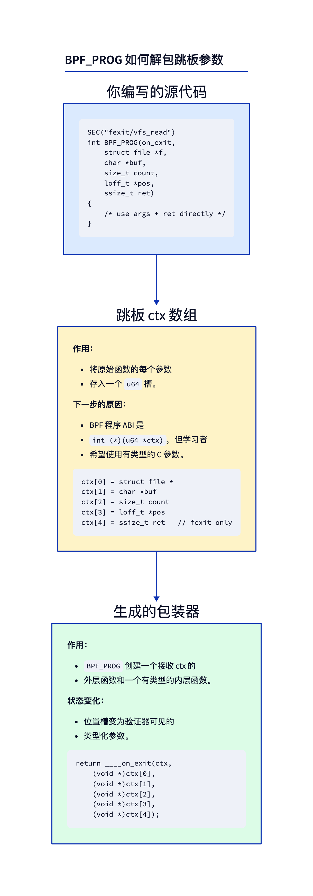
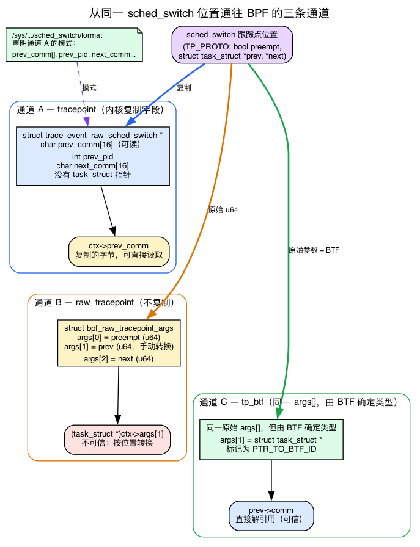
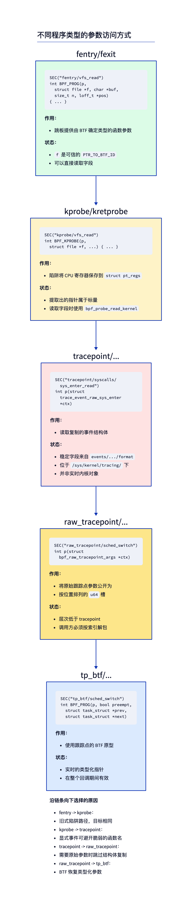
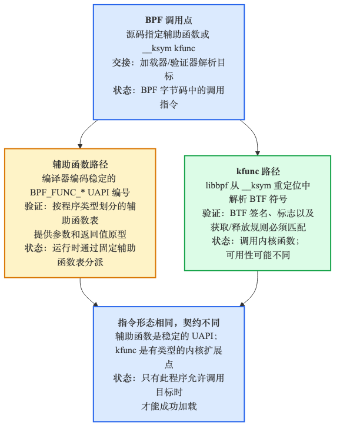
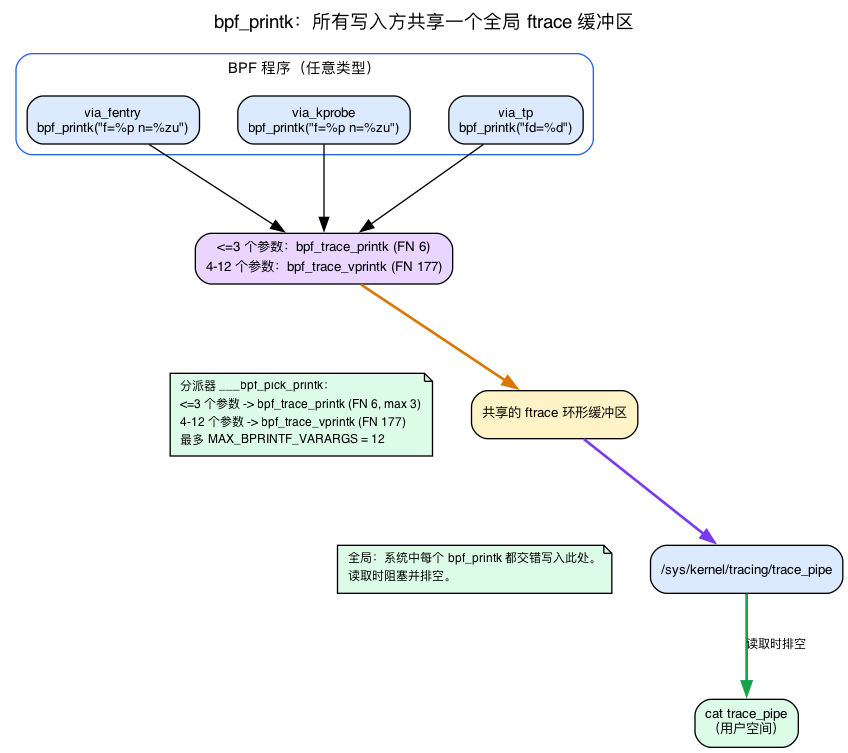

# 第7天 — 揭开 `BPF_PROG` 的面纱、ctx 布局、helper 与 kfunc

> **今日任务：** 不再把 `BPF_PROG`/`BPF_KPROBE`/`BPF_KRETPROBE` 当作难以理解的黑盒，而是查看它们究竟会展开成什么。理解为什么每种程序类型交给你的参数*形状各不相同*——可能是一个带类型的跳板数组、一份保存下来的寄存器快照，或是一个拷贝出来的事件结构体——以及为什么验证器信任其中一些形状而不信任另一些。总时间：约 120 分钟。写代码很少，重在理解。

## 为什么需要这一章

昨天你写下 `BPF_PROG(on_exit, struct file *f, char *buf, size_t n, loff_t *pos, ssize_t ret)`，它就那么直接跑通了。今天我们将深入了解它的内部机制。

这很重要，因为：
- 当你开始使用不那么简单的程序类型（kprobe、raw tracepoint、sk_msg、sock_ops）时，宏和 ctx 的访问方式各不相同。
- 当宏套不上你的场景（可变参数函数、奇特的签名）时，你需要手动访问 ctx。
- 当验证器抱怨某个寄存器的类型时，知道那个类型*出自* proto 中的哪里，往往就是几分钟和几小时调试之间的差别。

今天的每个示例都依赖三块从没有向你展示过的背景知识：

1. **`struct pt_regs`** —— kprobe 交给你的那份保存下来的寄存器快照，以及为什么它的偏移 0 处*并不是*第一个参数。
2. **`bpf_printk` 和 `trace_pipe`** —— 今天的实验读取的调试输出通道。第1–6天通过 ringbuf 和 map 把数据送出去；今天是你第一次直接打印到内核共享的 trace 缓冲区。
3. **tracepoint 到底是什么** —— `TRACE_EVENT` 宏、生成出来的 `trace_event_raw_*` 结构体、`format` 文件，以及 raw-args 数组。今天介绍的五种程序形式中有三种都挂在它上面。

我们会在遇到依赖它们的部分时逐一讲解。

## `BPF_PROG` 究竟做了什么

跳板调用你的 BPF 程序时只带一个参数 —— `unsigned long long *ctx` —— 指向一个 `u64` 值的数组，每个内核函数参数占一个（对 fexit 而言，末尾再加上返回值）。

你不想到处写 `(struct file *)ctx[0]`。于是就有了 `BPF_PROG`。



这个宏是可变参数模板风格的 C —— 它生成一个供 BPF 程序调用的外层函数（只接收 `ctx`），以及一个接收你声明的带类型参数的内层 `__always_inline` 函数。外层函数把每个 `ctx[N]` 槽位转换成正确的类型，再转发给内层。

你可以在 `tools/lib/bpf/bpf_tracing.h:672`（那行 `#define BPF_PROG(name, args...)`）读到真正的宏定义。它大约 30 行可变参数宏，值得打开看一次。看过之后，它就不再显得神秘 —— `BPF_PROG` 是一个替你省去手写按位置转换的代码生成器。真正起作用的那一行是它通过 `___bpf_ctx_cast` 完成的转发，后者展开成 `ctx[0]`、`ctx[1]`、`ctx[2]`…… —— 就是对那个 `u64` 数组的字面索引。

> ### 常见疑问
>
> **问：宏怎么知道我的函数有几个参数？**
>
> 答：靠 C 的可变参数宏（`__VA_ARGS__`）加上一个计数技巧（`___bpf_narg`），后者用预处理器递归算出参数个数。`bpf_tracing.h` 随后通过 `___bpf_ctx_cast` 分派到对应的 `___bpf_ctx_cast0`..`___bpf_ctx_cast12` 槽位转换器（最多支持 12 个参数）。实际实现由一组复杂的 C 宏组成，但基本概念很简单。
>
> **问：如果我的函数超过 12 个参数怎么办？**
>
> 答：那你用错了工具。大多数内核函数参数 ≤ 6 个（对应 System V 调用约定）。对于可变参数的内核函数，用 `bpf_get_func_arg(ctx, N, &out)` —— 一个按索引读取第 N 个参数并写入 `out` 的 helper（`BPF_FUNC_get_func_arg` = 183，`include/uapi/linux/bpf.h:6088`；实现在 `kernel/trace/bpf_trace.c:1194`）。今天我们不会用到它。
>
> **问：`BPF_PROG` 的语法为什么看着这么怪？为什么不是一个普通函数？**
>
> 答：因为 BPF 程序*真正的*签名必须是 `int (*)(unsigned long long *)` —— 那才是跳板调用的东西。没有这个宏，你就得写出那个签名并手动解包 `ctx[]`。宏假装你写的是一个普通 C 函数，却生成了解包的胶水代码。

## ctx 的两种形状：跳板数组 vs. 寄存器快照

在查看五种形式的对照图之前，你得先看清楚：根据程序类型的不同，“ctx”这个词指的是两种物理上完全不同的东西。搞懂这一点，今天一半的意外都会烟消云散。

**形状 A —— 跳板的 `u64 ctx[]`（fentry/fexit/tp_btf）。** 这就是你在第1天遇到的那个数组：跳板把被跟踪函数的参数存进一个小的 `u64[]`，再把指向它的指针交给你。`ctx[0]` *就是*第一个带类型的参数，`ctx[1]` 是第二个，依此类推。`BPF_PROG` 直接索引它（`___bpf_ctx_cast` → `ctx[0]`、`ctx[1]`……），这也是为什么 `BPF_PROG` 的转发逻辑就在 `bpf_tracing.h:672`。

**形状 B —— `struct pt_regs *` 快照（kprobe/kretprobe）。** kprobe 拿不到一个整齐的数组。回想第1天：kprobe 通过 **int3 陷阱**触发 —— 内核用一个断点覆盖被跟踪指令的第一个字节，当 CPU 命中它时陷阱处理程序就运行。此刻处理程序把**每一个通用寄存器**都捕获进一个 `struct pt_regs`，再把指向*那个结构体*的指针交给你的程序。所以 kprobe 的 ctx 是 CPU 寄存器的一张冻结快照，而不是一个按参数排列的数组。

正是这个差别，使得 `BPF_KPROBE` 成为一个和 `BPF_PROG` *分开的*宏。`BPF_KPROBE`（`tools/lib/bpf/bpf_tracing.h:816`）把 ctx 声明为 `struct pt_regs *`，并且不是去索引数组，而是通过 `PT_REGS_PARM1`、`PT_REGS_PARM2`……—— 一族从快照中读取**指定寄存器槽位**的宏 —— 来转发每个参数。

### 为什么 `pt_regs` 的偏移 0 是保存下来的 `r15`，而不是你的第一个参数

下面这个布局能让你今天看到的每一个“+112”“+0x70”“+0x60”都变得可读。x86-64 的 `struct pt_regs` 位于 `arch/x86/include/asm/ptrace.h:103`，其字段严格按照如下顺序排列：

```c
/* arch/x86/include/asm/ptrace.h:103 — x86-64 struct pt_regs */
unsigned long r15;   /* offset 0x00  ← FIRST member */
unsigned long r14;   /* 0x08 */
unsigned long r13;   /* 0x10 */
unsigned long r12;   /* 0x18 */
unsigned long bp;    /* 0x20 */
unsigned long bx;    /* 0x28 */
unsigned long r11;   /* 0x30 */
unsigned long r10;   /* 0x38 */
unsigned long r9;    /* 0x40 */
unsigned long r8;    /* 0x48 */
unsigned long ax;    /* 0x50 */
unsigned long cx;    /* 0x58 */
unsigned long dx;    /* 0x60  ← arg3 */
unsigned long si;    /* 0x68  ← arg2 */
unsigned long di;    /* 0x70  ← arg1 */
/* ... orig_ax, ip, cs, flags, sp, ss ... */
```

从这张图里直接得出两个事实：

- **字节偏移 0 是 `r15`** —— 一个被调用者保存（callee-saved）的寄存器，和你函数的参数*毫无关系*。这正是下面破坏实验 2 会产生错误结果的原因：当你（错误地）把 `BPF_PROG` 用在 kprobe 上时，宏把“`ctx[0]`” = 偏移 0 处的 8 个字节 = 保存的 `r15` 读出来，转换成 `struct file *`，得到的就会是完全错误的指针。
- **`di` 在结构体里排第 15 个 → 偏移 14 × 8 = 112 = `0x70`。** 这就是你会在验证器日志（`r1 +112`）和反汇编（`r1 + 0x70`）里看到 kprobe 程序从中加载的那个数字。`dx` 排第 13 个 → 偏移 96 = `0x60`（`arg3`）。

这个布局是刻意与架构相关的。有一个*单独的* 32 位 `struct pt_regs` 位于 `arch/x86/include/asm/ptrace.h:12`，它以 `bx, cx, dx, si, di, …` 开头 —— 顺序完全不同。这些偏移只有在你钉死架构之后才有意义，这也是为什么构建需要 `-D__TARGET_ARCH_x86`（实验部分会细讲）。

### 把 System V 参数映射到寄存器槽位

回想第1天：System V x86-64 调用约定把第一个整型/指针参数放在 **`rdi`**，第二个放在 **`rsi`**，第三个放在 **`rdx`**。`PT_REGS_PARM*` 宏不过是把这个约定写了下来。在 `tools/lib/bpf/bpf_tracing.h` 中：

```c
/* tools/lib/bpf/bpf_tracing.h:87 */
#define __PT_PARM1_REG di
#define __PT_PARM2_REG si
#define __PT_PARM3_REG dx
...
/* tools/lib/bpf/bpf_tracing.h:492 */
#define PT_REGS_PARM1(x) (__PT_REGS_CAST(x)->__PT_PARM1_REG)
```

所以 `PT_REGS_PARM1(ctx)` 读的是 `ctx->di`，`PT_REGS_PARM2(ctx)` 读 `ctx->si`，`PT_REGS_PARM3(ctx)` 读 `ctx->dx`。这就是让反汇编里那些“`+0x70 = di = PT_REGS_PARM1 = f`”和“`+0x60 = dx`”行变得可读的桥梁：`vfs_read` 的第 1 个参数是 `struct file *f`，它通过 `rdi` 传入，陷阱把 `rdi` 保存在偏移 `0x70` 处，kprobe 程序就从那里加载 `f`。

**再对比一次这两种形状：** fentry 交给你的是跳板的 `u64 ctx[]`，其中 `ctx[0]` 真真切切*就是*那个带类型的第一个参数；kprobe 交给你的是 `pt_regs`，你必须从指定的寄存器槽位中取出参数。这就是为什么 `BPF_PROG` 索引 `ctx[]` 而 `BPF_KPROBE` 包裹 `PT_REGS_PARM*`。同样的数据，两种不同的容器。

![并排对比 fentry 跳板 ctx[] 与 struct pt_regs 寄存器快照](diagrams/day07_ctx_vs_ptregs.png)

## tracepoint 到底是什么

今天介绍的五种程序形式中有三种（普通 tracepoint、raw tracepoint、tp_btf）挂的是 **tracepoint**，而你只是偶尔听过这个词。我们把它讲具体，因为这些形式所声明的结构体来自一个特定的宏，并定义在一个特定的文件中。

**tracepoint** 是一个编译进内核的*有名称的静态插桩点* —— `sched_switch`、`sys_enter`、`kfree_skb`，还有数百个。不像 fentry 或 kprobe 挂的是你指定的*任意*函数，tracepoint 是一个**特意放置、带有声明字段模式的稳定钩子**。内核开发者把它放在有用的地方，并承诺跨版本保持其字段有意义。

每个 tracepoint 都由 `TRACE_EVENT()` 宏声明：

```c
/* include/linux/tracepoint.h:671 */
#define TRACE_EVENT(name, proto, args, struct, assign, print) ...
```

这一个宏生成了*大量*代码。今天你要关心的那一块，是一个描述事件所拷贝载荷的 C 结构体：

```c
/* include/trace/trace_events.h:62 — generated for every tracepoint */
struct trace_event_raw_##name {
    ...
};
```

于是 `sched_switch` 得到一个 `struct trace_event_raw_sched_switch`，`sys_enter` 得到一个 `struct trace_event_raw_sys_enter`，依此类推。这些结构体被编译进内核，最终进入内核的 **BTF**，这也是为什么它们会出现在你的 `vmlinux.h` 里，以及为什么下面第3种形式的程序无需自行定义便可直接声明 `struct trace_event_raw_sys_enter *ctx`。

**关键性质：内核会把选定的字段*拷贝*进那个结构体。** tracepoint 触发时，它用选定的值填充一个 `trace_event_raw_*` 实例，再把指向这些**拷贝字节**的指针交给你的程序 —— 而不是指向活的内核对象。这一个事实就解释了底部的 Break 3：你*可以*直接读取 `ctx->prev_comm`（它是一个内嵌的 `char` 数组，已经替你拷进来了），但你*无法*访问父任务，因为从没有任何指向它的指针被拷贝进来。

### `format` 文件：tracepoint 的公开模式

因为 tracepoint 有一份声明的模式，内核会以人类可读的形式在 tracefs 下暴露它：

```bash
sudo cat /sys/kernel/tracing/events/raw_syscalls/sys_enter/format
```

对 `sys_enter` 你会看到包括 `long id` 和 `unsigned long args[6]` 在内的字段。（注意路径是 `raw_syscalls/` 而不是 `syscalls/`：`syscalls/` 目录只放每个系统调用的节点，比如 `sys_enter_read`，它的 `format` 列出的是*带类型*的字段 `fd`/`buf`/`count`。第3种形式的程序读取的那份通用 `id` + `args[6]` 模式，是 `raw_syscalls:sys_enter` 这个 tracepoint。）这并非巧合——它直接来自 `include/trace/events/syscalls.h:18` 中的声明：

```c
/* include/trace/events/syscalls.h:18 */
TRACE_EVENT_SYSCALL(sys_enter,
    TP_PROTO(struct pt_regs *regs, long id),
    ...
    TP_STRUCT__entry(
        __field( long,          id        )
        __array( unsigned long, args, 6   )
    ),
    ...
```

`__array(unsigned long, args, 6)` 正是第3种形式的程序读 `ctx->args[0]` 来获取系统调用第一个参数（`read()` 的 fd）的*原因*：内核已经把六个系统调用参数全部拷进了那个 `args[6]` 数组。`format` 文件是契约；`ctx->args[0]` 是你在读它。

### raw tracepoint：跳过拷贝，直接取得按位置排列的 u64

**raw tracepoint**（第 4 种形式）是同一个插桩点，只是没有拷贝这一步。内核交给你的不是一个带类型的 `trace_event_raw_*` 结构体，而是：

```c
/* include/uapi/linux/bpf.h:7286 */
struct bpf_raw_tracepoint_args {
    __u64 args[0];
};
```

就这些 —— 一个裸的 `__u64` 数组，每个 **`TP_PROTO` 参数**占一个槽位，未经修改。对 `sched_switch` 而言，`TP_PROTO` 是 `(bool preempt, struct task_struct *prev, struct task_struct *next, …)`，所以 `ctx->args[0]` 是 `preempt` 布尔值，`ctx->args[1]` 是一个你手动转换的 `task_struct *`，`ctx->args[2]` 是下一个。没有字段被拷贝，没有模式被套用；你需要按位置解包，并自行确保类型转换正确。

**tp_btf**（第 5 种形式，明天详解）是*同一个*裸参数数组，但带了 BTF 类型：验证器知道 `args[1]` 是一个 `struct task_struct *` 并把它标为 `PTR_TO_BTF_ID`（回想第1天：一个受信任、带类型、验证器允许你解引用的内核指针），所以你可以直接解引用它。裸参数，但可信。



## 按程序类型划分的参数访问——五种形式

不同程序类型以五种不同方式访问参数。每当验证器因“类型不对”而拒绝程序、令你感到困惑时，都会回到这张图 —— 而现在你已经有背景去读懂它的每一行。



### 1. `fentry`/`fexit` —— 来自 BTF 的带类型参数

```c
SEC("fentry/vfs_read")
int BPF_PROG(p, struct file *f, char *buf, size_t n, loff_t *pos) {
    loff_t cur = f->f_pos;   // direct deref allowed
}
```

跳板给你一个 `u64 *ctx`。`BPF_PROG` 把每个槽位转换成你声明的类型。因为 BTF 里有原函数的签名，这个转换是有意义的 —— `f` 确实是一个指向活内核对象的 `struct file *`。验证器把 `f` 标为 `PTR_TO_BTF_ID`（带类型内核指针），允许直接解引用字段。

优点是参数带类型、速度快且可以直接解引用；缺点是需要 BTF，不过现代内核基本都已提供。

### 2. `kprobe`/`kretprobe` —— 来自陷阱的 `pt_regs`

```c
SEC("kprobe/vfs_read")
int BPF_KPROBE(p, struct file *f, char *buf, size_t n, loff_t *pos) {
    /* f is pt_regs->di on x86_64 */
}
```

`BPF_KPROBE` 是另一个宏，它知道 ctx 是 `struct pt_regs *`（一份来自入口陷阱的保存寄存器快照）。它把第一个参数展开成 `((struct file *)PT_REGS_PARM1(ctx))`，依此类推。这些值是正确的 —— 就是 int3 触发时 `RDI`、`RSI` 等寄存器里的内容 —— 但这些指针*不会*被标为 `PTR_TO_BTF_ID`，因为验证器在 kprobe 上下文里无法信任它们（函数的 BTF 签名没有绑定到这些寄存器上）。

你通过 `bpf_probe_read_kernel` 访问字段：

```c
loff_t pos;
bpf_probe_read_kernel(&pos, sizeof(pos), &f->f_pos);
```

因此，kprobe 的使用方式比 fentry 更繁琐：访问同样的数据需要更多步骤。

### 3. `tracepoint/...` —— 拷贝出来的事件上下文

```c
SEC("tracepoint/syscalls/sys_enter_read")
int p(struct trace_event_raw_sys_enter *ctx) {
    int fd = (int)ctx->args[0];
}
```

普通 tracepoint 程序看到的是一个稳定的、内核定义的事件结构体。内核把相关字段拷进那个按 tracepoint 划分的结构体，`ctx` 指向这些拷贝字节。你拿不到活指针。当你想要 `/sys/kernel/tracing/events/.../format` 里那份稳定的事件格式时，它很有用。

### 4. `raw_tracepoint/...` —— raw tracepoint 参数数组

```c
SEC("raw_tracepoint/sched_switch")
int p(struct bpf_raw_tracepoint_args *ctx) {
    bool preempt = (bool)ctx->args[0];
    struct task_struct *prev = (void *)ctx->args[1];
    struct task_struct *next = (void *)ctx->args[2];
}
```

raw tracepoint 跳过拷贝出来的事件结构体，把 tracepoint 参数以裸 `u64` 槽位的形式暴露出来。你按位置解包。验证器不会给你和 `tp_btf` 一样的带类型参数便利，所以在有 BTF 可用时，新代码通常更偏爱 `tp_btf`。

### 5. `tp_btf` —— 来自 tracepoint 的带类型内核指针

```c
SEC("tp_btf/sched_switch")
int BPF_PROG(p, bool preempt, struct task_struct *prev, struct task_struct *next) {
    bpf_printk("%s -> %s", prev->comm, next->comm);  // direct deref
}
```

这是访问同一个 tracepoint 事件的现代化带类型接口。内核交给你的是带类型的指针（BTF 标注），而不是拷贝字节或裸的按位置槽位。可以直接解引用。**新代码在有 BTF 可用时用 `tp_btf` 而不是 raw tracepoint** —— 明天我们会详细看。

> ### 削尖你的铅笔
>
> 内核里有个函数 `int foo(struct file *f, void *data, size_t len)`。你挂了一个 fentry。你想读 `f->f_inode->i_ino`。有三种做法：
>
> 1. `__u64 ino = f->f_inode->i_ino;`
> 2. `__u64 ino = BPF_CORE_READ(f, f_inode, i_ino);`  *（CO-RE，来自第3天 —— 带重定位地走指针链，每一跳都经过 `bpf_probe_read_kernel`）*
> 3. `__u64 ino; bpf_probe_read_kernel(&ino, sizeof(ino), &f->f_inode->i_ino);`
>
> 哪个能用？哪个更好？
>
> .\
> .\
> .
>
> **答案：** 三个都能加载。(1) 和 (2) 都能干净地工作，因为 `f` 是 `PTR_TO_BTF_ID`，验证器能证明这条链。(1) 最快：它是一次*直接的、已验证的加载* —— 验证器允许这个解引用作为一次普通的 BPF 加载（LDX），并把它记入内核异常表以处理缺页，所以没有 helper 调用，也不会最终调用 `bpf_probe_read_kernel`。(2) 是默认安全的（指针无效时返回 0），也正是 (3) 的显式形式 —— `BPF_CORE_READ` 最终会调用 `bpf_probe_read_kernel`。**对可信的链优先用 (1)，对任何一跳都可能为 NULL 的链用 (2)。** (3) 如今很少有人手写了。

## helper 与 kfunc——两种扩展机制

昨天你用了 `bpf_get_current_pid_tgid`、`bpf_ktime_get_ns`、`bpf_map_lookup_elem`。这些是 **helper（辅助函数）** —— 一份冻结的 UAPI 列表，列出 BPF 程序可以调用的函数。你通过 `bpf_helpers.h` 声明它们，链接器把它们解析为枚举值（`BPF_FUNC_get_current_pid_tgid` = 14，等等），在加载时验证器/JIT 会针对一张按程序类型划分的 proto 表来解析这次调用。

但还有第二种、更新的机制：**kfunc**。它们是声明在任意内核 C 文件里、通过 `BTF_KFUNCS_START` 注册、BPF 程序可以按名字调用（加载时与内核 BTF 匹配）的函数。



为什么两者都存在：

- **helper 是冻结的 UAPI。** 添加一个 helper 是永久承诺；移除或改动一个会破坏用户程序。添加 helper 的流程很重。
- **kfunc 不是 UAPI。** 它们可以演进、增加、移除、改名。维护者可以在下一个版本里改变某个 kfunc 的签名；用旧名字的用户程序在新内核上会加载失败。承诺更低。

2022 年前后，内核社区决定**停止添加新的 helper**，转而把功能作为 kfunc 添加。这就是为什么你 2024 年以后的“用这个 BPF 特性”的文档里谈 kfunc 比谈 helper 多。

你会在第20天正式接触 kfunc。现在只要知道：当你看到 `extern struct task_struct *bpf_task_acquire(struct task_struct *) __ksym;`，那就是一个 kfunc。`__ksym` 属性告诉 libbpf“在加载时把这个名字匹配到内核 BTF 里的某个 kfunc”。

> ### 常见疑问
>
> **问：我怎么知道 `bpf_xxx` 是 helper 还是 kfunc？**
>
> 答：helper 列在 `include/uapi/linux/bpf.h` 里（即 `enum bpf_func_id` 表，以 `BPF_FUNC_unspec` 开头）。kfunc 不是 UAPI；它们的列表通过 `BTF_KFUNCS_START` 块存在于源文件中。`bpftool feature probe` 会显示你的内核上有哪些可用。或者干脆看一眼：它出现在 `<bpf/bpf_helpers.h>` 里吗？出现就是 helper。没出现但你看到 `__ksym`，就是 kfunc。
>
> **问：helper 会消失吗？**
>
> 答：不会。现有的 helper 永远稳定（UAPI）。新功能以 kfunc 形式出现。所以 helper 列表会继续可用，只是不再增长。

## `bpf_printk` 与 `trace_pipe` 调试通道

今天的实验是本书第一个用 `bpf_printk` 的，所以我们把它是什么讲精确 —— 因为它*不*经过你在第1–6天用过的 ringbuf 或 map。

**`bpf_printk` 不是一个函数 —— 它是一个 libbpf 宏。** 它构造一个格式字符串并分派给一个 helper：

```c
/* tools/lib/bpf/bpf_helpers.h:341 */
#define bpf_printk(fmt, args...) ___bpf_pick_printk(args)(fmt, ##args)
```

分发宏 `___bpf_pick_printk`（`bpf_helpers.h:334`）按参数个数选择展开路径。对 **≤3 个参数**，它选择 `__bpf_printk` 路径（`bpf_helpers.h:293`），其底层 helper 是 `bpf_trace_printk` —— UAPI 枚举里 `BPF_FUNC_trace_printk` = 6：

```c
/* include/uapi/linux/bpf.h:5911 */
FN(trace_printk, 6, ##ctx) \
```

对 **4 个或更多参数**，它选择另一条*不同的*路径 —— `__bpf_vprintk`（`bpf_helpers.h:304`）—— 它调用一个*单独的* helper，`bpf_trace_vprintk`（`BPF_FUNC_trace_vprintk` = 177，`include/uapi/linux/bpf.h:6082`）。所以两种情况下底层 helper 也不一样：短形式是 FN 6，宽形式是 FN 177。

**输出去了哪里？** 不是进你自己的 ringbuf 或 map —— 而是进内核的**共享 ftrace 环形缓冲区**，一个系统级的单一缓冲区，*每个* `bpf_printk` 使用者都往里写。你从用户空间通过一个 tracefs 文件读取它：

```bash
sudo cat /sys/kernel/tracing/trace_pipe
```

`trace_pipe` 是一个**阻塞的、读时清空（drain-on-read）**的管道：`cat` 它会阻塞直到有一行出现，读取一行就消费掉它。因为缓冲区是全局的，你会看到系统上*每个*调用 `bpf_printk` 的 BPF 程序的行，交错在一起。这正是为什么今天的“同时观察三者”实验可以简单地 `cat trace_pipe`，看着三个不同程序的输出落进同一条流里。

**能有多少个格式参数？最多 12 个。** 每条路径有各自的上限。`bpf_trace_printk` helper（≤3 那条路径）构造一个固定的三槽数组：

```c
/* kernel/trace/bpf_trace.c:359 */
#define MAX_TRACE_PRINTK_VARARGS 3
/* kernel/trace/bpf_trace.c:362 */
BPF_CALL_5(bpf_trace_printk, char *, fmt, u32, fmt_size, u64, arg1,
           u64, arg2, u64, arg3)
{
    u64 args[MAX_TRACE_PRINTK_VARARGS] = { arg1, arg2, arg3 };
    ...
}
```

但那个 `MAX_TRACE_PRINTK_VARARGS = 3` 只是*旧版* `bpf_trace_printk` helper 的限制 —— **不是** `bpf_printk` 宏的限制。传入第四个值，分派器就透明地把你切换到 `bpf_trace_vprintk`（FN 177），它把参数打包进一个 `u64[]`，允许最多 `MAX_BPRINTF_VARARGS` = 12（`include/linux/bpf.h:3875`；这个上限在 `bpf_trace.c:424` 处以 `data_len > MAX_BPRINTF_VARARGS * 8` 强制执行）。所以 `bpf_printk("%d %d %d %d", a, b, c, d)` 能正常编译和加载 —— 只有第 13 个参数会被拒绝。今天的实验每次调用只传两个值，是因为每行只需要这些，而不是因为有什么上限。

**定位：** `bpf_printk` 是一个*调试和教学*工具。它是全局的、低吞吐的，并让所有写入者串行化 —— 用来回答“我的程序触发了吗，它看到了什么？”很合适，用于生产则不对。真正的追踪器通过你已经学过的 ringbuf 和 map 来流式输出。这正是本书为什么等到一个“把玩宏”的日子才引入它。



## 实验——小而聚焦

今天我们不构建新的追踪器。我们将观察这些宏实际生成的内容。

### `inspect.bpf.c`

```c
{{#include ../labs/day07/inspect.bpf.c:book}}
```

注意每个 `bpf_printk` 最多传两个值（`f` 和 `n`，或只有 `fd`）—— 不是因为有什么上限（宏最多支持 12 个），而只是因为每行只需要这些。而 `via_tp` 通过 `ctx->args[0]` 取得 fd，正是那个 `args[6]` 槽位 —— 由 `sys_enter` 的 `format` 文件声明。

如果你还没有从第1天留下的类型头文件，就先生成它，然后构建对象。`-D__TARGET_ARCH_x86` 是必需的：`BPF_KPROBE` 展开为与架构相关的 `PT_REGS_PARM*` 宏（它为 x86-64 选择 `di`/`si`/`dx`），没有它编译会失败 —— 因为无从知道该用哪种寄存器顺序。

```bash
# once per kernel, if you don't already have vmlinux.h from Day 1:
sudo bpftool btf dump file /sys/kernel/btf/vmlinux format c > vmlinux.h

clang -g -O2 -D__TARGET_ARCH_x86 -target bpf -c inspect.bpf.c -o inspect.bpf.o
```

验证器只在程序被*加载*时运行，而详细的逐指令寄存器状态只在**日志级别 2** 才打印。把第6天的加载器拷成 `inspect.c`，指向 `inspect.bpf.o`，并在 open 选项里提高日志级别 —— 下面这行 `LIBBPF_OPTS` 接进了 object-open 调用，这才是让它生效的关键：

```c
LIBBPF_OPTS(bpf_object_open_opts, opts, .kernel_log_level = 2);
struct bpf_object *obj = bpf_object__open_file("inspect.bpf.o", &opts);
bpf_object__load(obj);   /* verifier runs here; its log prints to stderr */
```

```bash
make
sudo ./inspect 2>&1 | less
```

如果你有 `veristat`（它随内核树位于 `tools/testing/selftests/bpf/` 下，所以你可能需要自行构建），你可以完全跳过加载器，直接转储同一份逐指令日志：`sudo veristat -v -l 2 inspect.bpf.o 2>&1 | less` —— `-v` 是发出日志的开关，`-l 2` 是打印 `R1_w=...` 寄存器状态行的日志级别。

### 检查每个程序的验证器日志

对 `via_fentry`，你会看到早期的寄存器状态行，例如：

```
0: R1=ctx() R10=fp0
1: (79) r1 = *(u64 *)(r1 +0)
2: R1_w=trusted_ptr_file(off=0,...)
```

`R1_w=trusted_ptr_file` —— 验证器把 R1 看作一个受信任的（经 BTF 验证的）指向 `struct file` 的指针。这就是为什么 `f->f_pos` 能用。注意加载是从 `+0` 来的 —— `ctx[0]`，跳板数组的第一个槽位。

对 `via_kprobe`：

```
0: R1=ctx()
1: (79) r1 = *(u64 *)(r1 +112)   /* PT_REGS_PARM1: di on x86_64 */
2: R1_w=scalar()
```

`R1_w=scalar()` —— kprobe 的 ctx 访问产生一个不可信的标量，而不是带类型的指针。这就是为什么直接解引用 `f->f_pos` 被禁止。而那个 `+112` 来自 `pt_regs` 布局：偏移 112 是 `di`，即保存下来的 `rdi`，它当时装着 `f`。

对 `via_tp`：

```
0: R1=ctx()
1: (61) r2 = *(u32 *)(r1 +16)
2: R2_w=scalar(...)
```

tp 的 ctx 是一个带类型的结构体（由 `vmlinux.h` 提供）；读取的是从拷贝出来的事件缓冲区取得的标量值 —— 正是 tracepoint 那节里“内核把字段拷进来”的模型。

### 检查 `BPF_PROG` 究竟生成了什么

反汇编你上面构建的那个 `inspect.bpf.o`：

```bash
llvm-objdump -dr inspect.bpf.o | head -40
```

```
0000000000000000 <via_fentry>:
       0:	r4 = *(u64 *)(r1 + 0x10)
       1:	r3 = *(u64 *)(r1 + 0x0)
       2:	r1 = 0xa ll
       4:	w2 = 0x13
       5:	call 0x6
       6:	w0 = 0x0
       7:	exit
```

因为内层的 `____via_fentry` 是 `static __always_inline` 且我们以 `-O2` 编译，它被内联进了唯一发射出来的函数 `via_fentry` —— **没有**单独的内层函数，也**没有**对它的 `call`。唯一的 `call` 是 `bpf_trace_printk` helper（`call 0x6` —— 没错，那个 `0x6` 就是 UAPI 枚举里的 `BPF_FUNC_trace_printk` = 6）。你会看到 `via_fentry` 把 `f` 从 `*(u64 *)(r1 + 0x0)`（ctx[0]）加载进 r3，把 `n` 从 `*(u64 *)(r1 + 0x10)`（ctx[2]）加载进 r4 —— `buf`/ctx[1] 槽位在 +0x8 处是死代码，被省掉了。对 `via_kprobe` 跑同样的命令，你会看到它改从 `pt_regs` 偏移加载：`*(u64 *)(r1 + 0x70)` 是 `di` = `PT_REGS_PARM1` = `f`（而 +0x60 是 `dx`）。宏创造的双函数形状在对象里坍缩成一个函数 —— 宏纯粹是一个源码级的代码生成器。

### 观察三者如何捕获同一次读取

三个程序分别通过 `bpf_printk` 打印。挂载它们后，可以观察同一次 `vfs_read` 如何经过三条路径。自动挂载对象，然后在你触发一次读取时读取 trace 缓冲区 —— `trace_pipe` 就是上一节那个共享 ftrace 缓冲区，所以三个程序的输出都会出现在同一条流中：

```bash
sudo bpftool prog loadall inspect.bpf.o /sys/fs/bpf/insp autoattach
sudo cat /sys/kernel/tracing/trace_pipe &
dd if=/etc/hostname of=/dev/null bs=64 count=1
```

你会看到同一次调用的三行（地址在你的机器上会不同；重点是那两个 `f=` 值**相同**）：

```
             dd-20461   [001] ...21  9183.441: bpf_trace_printk: tp: fd=3
             dd-20461   [001] ...21  9183.441: bpf_trace_printk: fentry: f=ffff8e0c1a3b4500 n=64
             dd-20461   [001] ...21  9183.441: bpf_trace_printk: kprobe: f=ffff8e0c1a3b4500 n=64
```

`fentry` 和 `kprobe` 都挂在 `vfs_read` 上，所以同一次调用的 `f=` 指针相同 —— 即便 `fentry` 是从 BTF（ctx[0]）拿到的，而 `kprobe` 是从 `pt_regs->di` 拿到的。同样的数据，两条路径。tracepoint 位于上一层（`read()` 系统调用入口，它随后才调用 `vfs_read`），所以它打印的是 `fd` 而不是 `f`。清理：

```bash
sudo kill %1 2>/dev/null
sudo rm -rf /sys/fs/bpf/insp
```

---

## 按顺序尝试破坏

### 破坏实验 1 —— 在 kprobe 里尝试直接解引用

```c
SEC("kprobe/vfs_read")
int BPF_KPROBE(p, struct file *f) {
    loff_t pos = f->f_pos;          /* direct deref */
    bpf_printk("pos=%lld", pos);
    return 0;
}
```

把这段丢进 `inspect.bpf.c`，重新构建，试着加载它 —— `bpftool prog loadall` 会运行验证器，失败时把日志打到 stderr：

```bash
clang -g -O2 -D__TARGET_ARCH_x86 -target bpf -c inspect.bpf.c -o inspect.bpf.o
sudo bpftool prog loadall inspect.bpf.o /sys/fs/bpf/x
```

验证器拒绝它（失败时不会创建 pin，所以没有东西要清理）：

```
R1 invalid mem access 'scalar'
```

因为在 kprobe 上下文里，R1（从 `pt_regs->di` 转换来的）是一个标量，不是 `PTR_TO_BTF_ID`。修复：

```c
loff_t pos;
bpf_probe_read_kernel(&pos, sizeof(pos), &f->f_pos);
```

### 破坏实验 2 —— 在 kprobe 上用 BPF_PROG

```c
SEC("kprobe/vfs_read")
int BPF_PROG(p, struct file *f) { ... }
```

这一个能加载（用 `sudo bpftool prog loadall inspect.bpf.o /sys/fs/bpf/x` 验证 —— 没有验证器错误 —— 然后 `sudo rm -rf /sys/fs/bpf/x`），但参数访问是错的。`BPF_PROG` 读 `ctx[0]` —— 但 kprobe 的 ctx 是 `pt_regs *`，不是跳板 ctx 数组。正如 `pt_regs` 布局所示，x86-64 上 `struct pt_regs` 的偏移 0 是保存下来的 **`r15`**，一个和第一个函数参数毫无关系的被调用者保存寄存器。于是 `BPF_PROG` 把残留的 `r15` 转换成 `struct file *`：得到的是完全无关的值。对 kprobe 请用 `BPF_KPROBE` —— 它读 `PT_REGS_PARM1` = `di` = 偏移 112，`f` 真正所在的地方。

### 破坏实验 3 —— 在普通 tracepoint 里直接解引用

```c
SEC("tracepoint/sched/sched_switch")
int p(struct trace_event_raw_sched_switch *ctx) {
    bpf_printk("%s", ctx->prev_comm);   /* direct read of copied bytes */
}
```

能用 —— `sudo bpftool prog loadall inspect.bpf.o /sys/fs/bpf/x` 会报告程序已加载，没有验证器错误（用 `sudo rm -rf /sys/fs/bpf/x` 清理）。`ctx->prev_comm` 是一个内嵌在事件结构体里的拷贝 char 数组（内核通过 `TRACE_EVENT` 把它拷了进来），不是指针。无需解引用。

但是：

```c
SEC("tracepoint/sched/sched_switch")
int p(struct trace_event_raw_sched_switch *ctx) {
    /* try to read the parent task's comm */
    /* you can't! ctx doesn't have a task pointer, just the values */
}
```

普通 `tracepoint/...` 程序只给你内核选择拷贝的东西。`format` 文件为 `sched_switch` 列出了 `prev_comm`、`prev_pid`、`next_comm`…… —— 拷贝出来的标量和 char 数组，**没有 `task_struct` 指针**。既然没有指针被拷贝，就没有东西可以跟着走到父任务。想要更多，切到 `tp_btf`（第8天），那里你能拿到活的带类型指针；只有当你明确想要裸的按位置排列的 tracepoint 参数时才用 `raw_tracepoint/...`。

---

## 内核代码阅读指引

- **`tools/lib/bpf/bpf_tracing.h`** —— `BPF_PROG`（`:672`）、`BPF_KPROBE`（`:816`）、`BPF_KRETPROBE`、`BPF_KSYSCALL` 和 `PT_REGS_*` 家族（`PT_REGS_PARM1` 在 `:492`，`__PT_PARM1_REG di` 这类定义从 `:87` 开始）的权威参考。全读一遍。它约 930 行，但大部分是各架构的寄存器名宏。
- **`arch/x86/include/asm/ptrace.h`** —— 64 位 `struct pt_regs`（`:103`），它的字段顺序（`r15` 在最前、`di` 在偏移 112）正是让 `+0x70`/`+0x60` 加载可读的原因；外加 `:12` 处那个*单独的* 32 位结构体，证明布局与架构相关。
- **`include/uapi/linux/bpf.h`** —— 搜索 `enum bpf_func_id`。完整的 helper 列表，约 200 条。略读 —— 认识这些类别（skb 操作、map 操作、网络、tracing、时间、随机数等）。注意 `trace_printk` = 6（`:5911`）和 `get_func_arg` = 183（`:6088`），以及 `struct bpf_raw_tracepoint_args`（`:7286`）。
- **`include/linux/tracepoint.h`** 和 **`include/trace/trace_events.h`** —— `TRACE_EVENT()`（`tracepoint.h:671`）以及生成你的 tracepoint 程序所声明结构体的 `struct trace_event_raw_##name { … }` 生成点（`trace_events.h:62`）。
- **`include/trace/events/syscalls.h`** —— `sys_enter` 声明（`:18`），带 `__array(unsigned long, args, 6)`，证明为什么 `ctx->args[0..5]` 能用。
- **`kernel/bpf/helpers.c`** —— 搜索 `bpf_get_current_pid_tgid_proto`。每个 helper 都有一个 `bpf_func_proto` 结构体，声明它的参数类型、返回类型，以及哪些程序类型可以调用它。这就是验证器在给 helper 调用做类型检查时查阅的东西。
- **`kernel/trace/bpf_trace.c`** —— `MAX_TRACE_PRINTK_VARARGS`（`:359`）和 `bpf_trace_printk_proto`（`:386`），即 `bpf_printk` 底层使用的 helper；外加 `get_func_arg`（`:1194`）。
- **`net/core/filter.c`** —— 搜索 `bpf_helper_changes_pkt_data` 或 `xdp_func_proto`。按程序类型划分的 proto 表，用来把关某个程序能调用哪些 helper。
- **`Documentation/bpf/btf.rst`** 和 **`Documentation/bpf/kfuncs.rst`** —— 官方文档，各读一遍。

---

## 要点回顾

- `BPF_PROG` 是一个代码生成器，它把一个 `u64 *ctx` 数组通过转换（`ctx[0]`、`ctx[1]`……）解包成带类型的参数。
- `BPF_KPROBE`/`BPF_KRETPROBE` 是*另一个*宏：ctx 是 `struct pt_regs *`，一份来自 int3 陷阱的保存寄存器快照，通过 `PT_REGS_PARM*`（即指定的寄存器槽位）解包。
- 在 x86-64 上 `struct pt_regs` 以 **偏移 0** 处的 `r15` 开头，`dx`/`si`/`di` 在 `0x60`/`0x68`/`0x70` —— 所以 `PT_REGS_PARM1` 读偏移 112 处的 `di`，而误用在 kprobe 上的 `BPF_PROG` 读到的却是无关的 `r15` 值。
- **fentry/fexit** 给你 BTF 带类型的指针 —— 可直接解引用。
- **kprobe** 给你来自寄存器的标量 —— 必须用 `bpf_probe_read_kernel`。
- **tracepoint** 是一个由 `TRACE_EVENT` 声明的静态钩子；它生成一个 `struct trace_event_raw_<name>` 和一份 `/sys/.../format` 模式。内核把字段**拷贝**进来，所以你读到的是值，拿不到活的内核指针。
- **普通 tracepoint** 给你拷贝出来的事件字节（`ctx->args[N]`、内嵌 char 数组）。
- **raw tracepoint** 在 `struct bpf_raw_tracepoint_args { __u64 args[]; }` 里给你按位置排列的裸参数 —— 未经修改的 `TP_PROTO` 参数，需手动转换。
- **tp_btf** 给你同样的裸参数，但带 BTF 类型（`PTR_TO_BTF_ID`）—— 可直接解引用，兼具 tracepoint 稳定性 —— 现代首选。
- **`bpf_printk`** 是一个按参数个数分派的宏：≤3 个参数时调用 `bpf_trace_printk` helper（FN 6，最多 3 个），4–12 个参数时调用另一个 `bpf_trace_vprintk` helper（FN 177，最多 `MAX_BPRINTF_VARARGS` = 12）。输出落进共享的 ftrace 缓冲区，通过 `/sys/kernel/tracing/trace_pipe` 读取。仅用于调试、全局、串行化 —— 生产用 ringbuf/map。
- **helper** 是 `include/uapi/linux/bpf.h` 里一份冻结的 UAPI 列表。**kfunc** 是通过 BTF 暴露的非 UAPI 内核内函数；它们可以演进。新的 BPF 特性以 kfunc 而非 helper 的形式添加。helper 的可用性是**按程序类型**决定的。

---

## 检查问题

为什么你的 `fentry` 程序可以直接解引用 `f->f_pos`，而你的 `kprobe` 程序不行？

<details>
<summary>点击揭晓答案</summary>

**答案：** 在 `fentry` 里，跳板把参数存进一个 `u64 ctx[]`，`BPF_PROG` 把它们转换成你声明的类型。验证器把你声明的类型和函数的 BTF 签名比对，把每个参数标为 `PTR_TO_BTF_ID` —— 一个受信任、带类型、验证器知道可以安全解引用的内核指针。在 `kprobe` 里，ctx 是 `struct pt_regs *` —— 一份来自 int3 陷阱的保存寄存器快照。验证器不会把那些寄存器值绑定到函数的 BTF 签名上（kprobe 是通用的；它不像 fentry 那样在加载时就知道自己在跟踪哪个函数）。所以转换 `(struct file *)PT_REGS_PARM1(ctx)` —— 它其实是 `ctx->di`，即偏移 112 处保存的 `rdi` —— 在验证器看来产生的是一个*标量*（`SCALAR_VALUE`），而不是带类型的指针。标量不能解引用；你只能绕道 `bpf_probe_read_kernel`，它会做缺页处理。

</details>

---

## 明天

第8天：深入讲解 tp_btf vs raw tracepoint。我们跟踪 `sched_switch`，为 prev 和 next 都拿到带类型的 `task_struct *` 指针，并在不写任何 kprobe 胶水代码的情况下观察调度延迟。
