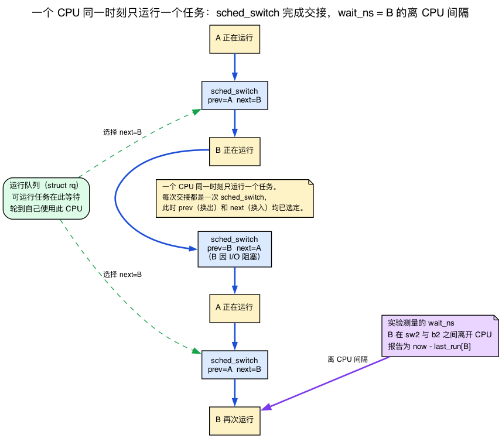
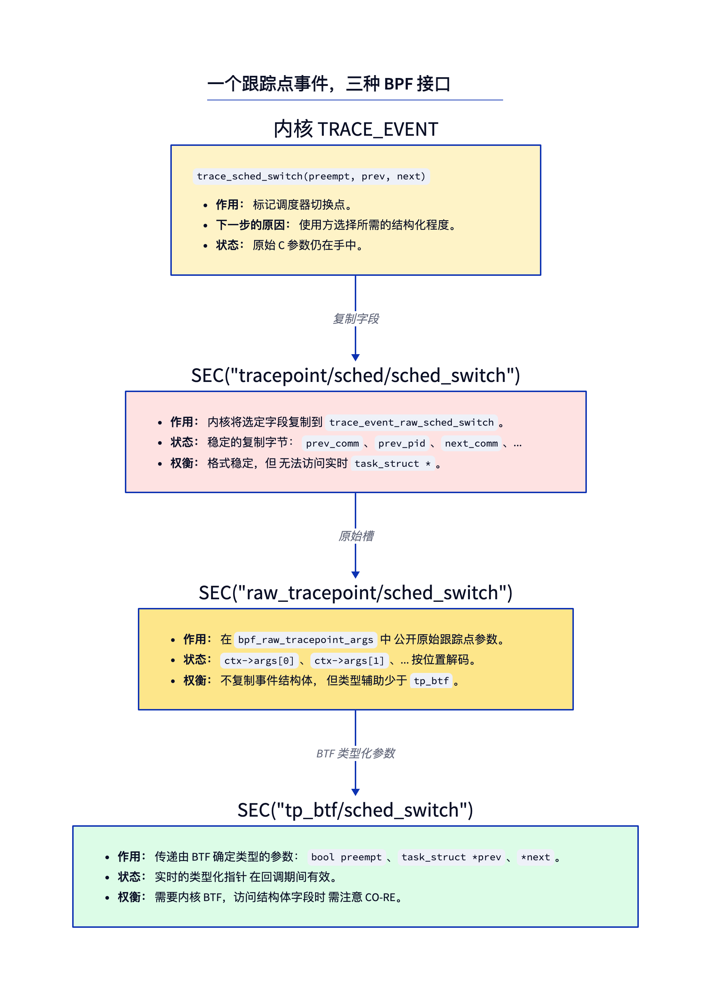
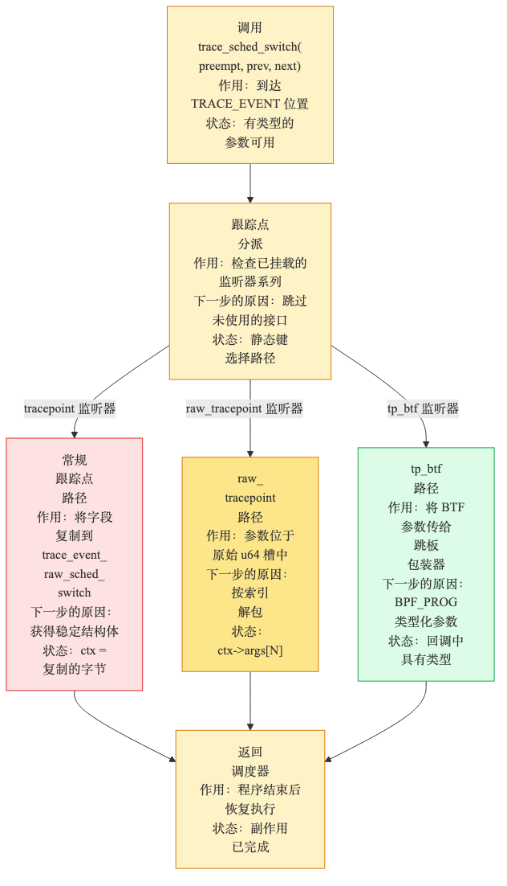
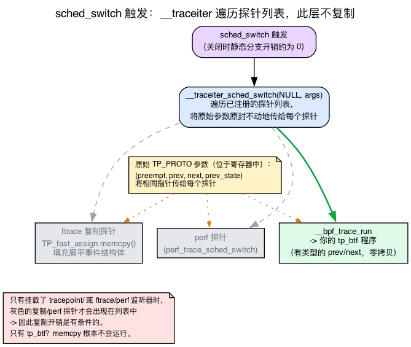
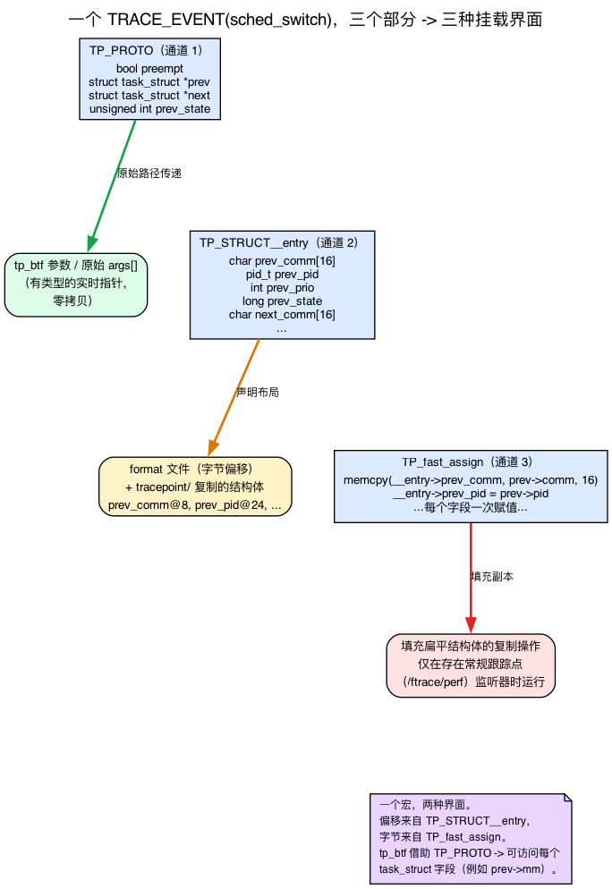
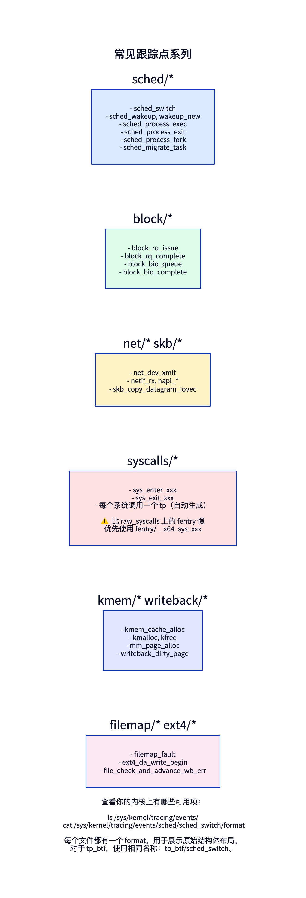

# 第8天 — 跟踪点、raw 与 tp_btf，以及如何找到它们

> **今日任务：** 通过挂钩 `sched_switch` 来测量调度延迟。但首先要理解这到底意味着什么——什么是上下文切换、任务为什么会“等待”，以及这个实验计算出来的究竟是什么数字。然后学习让跟踪点得以存在的 `TRACE_EVENT` 宏的构造、内核如何把一次触发的跟踪点分发给它的各个监听者，以及为什么 tp_btf 是那条既廉价又强大的路径。对比 raw 跟踪点与 tp_btf 两种挂载模式。学会如何发现你内核上的每一个跟踪点并读懂它的格式。总时间：约 110 分钟。

## 既然有 fentry，为什么还要跟踪点？

fentry 挂载到*函数入口*。当存在一个名字恰好描述了你关心的事件的函数时（`vfs_read`、`filename_unlinkat`），这样做很完美。但许多有意思的事件并不对应某个单一函数——或者它们是从一个做了很多事情的函数内部发出的。

**跟踪点是内核开发者通过 `TRACE_EVENT(...)` 宏添加的显式插桩点。** 它们为事件命名、指定数据字段，并作为内核 API 契约的一部分长期存在。

当你为“每一次上下文切换”编写跟踪器时，你并不想挂载到 `__schedule` 再去弄清楚它内部*哪些*路径对应着真正的切换。你想要的是 `sched_switch`——这个跟踪点在每次真正的切换时触发一次，且此时 `prev` 和 `next` 都已经确定。

跟踪点存在于：调度器事件、块 I/O、网络、内存分配、文件系统操作、系统调用，以及许多其他场景。

## 先理解：什么是上下文切换，“调度延迟”又意味着什么？

今天整个实验计算的是一个它称之为 `wait_ns` 的数字，并打印出类似 `firefox [4001] waited 152 µs` 的行。在挂钩任何东西之前，你需要知道这个数字*是什么*——否则它只是一个带单位的数字而已。所以让我们从头搭建调度器模型。你在第3天认识了 `task_struct`（内核的每进程描述符）；但此前没有任何内容教过你调度器是如何*运行*这些任务的。这就来了。

**一个 CPU 在任一时刻只能运行一个任务。** 这就是调度器要解决的全部问题。你有几百个可运行线程，却（比如说）只有 8 个逻辑 CPU，所以在任一瞬间最多只有 8 个线程在物理上执行。其余的都在等待轮到自己。

**运行队列就是等待执行的任务队列。** 每个 CPU 都有它自己的*运行队列*（`struct rq`）——即那些*可运行*（准备好执行，没有阻塞在 I/O 或锁上）但又不是当前正在 CPU 上运行的那个任务的集合。调度器的工作就是反复从该队列中挑选下一个要运行的任务。

**上下文切换就是任务之间的执行权交接。** 当调度器决定让任务 B 而不是任务 A 运行时，它执行一次*上下文切换*：保存 A 的 CPU 寄存器状态与栈指针，加载 B 的，并从 B 上次离开的地方恢复执行。对正在运行的代码来说，什么都没发生过——A 只是在指令流中途“暂停”，稍后再从暂停的确切位置恢复。执行实际寄存器/栈交换的函数是 `context_switch()`：

```c
/* kernel/sched/core.c:5329 */
context_switch(struct rq *rq, struct task_struct *prev,
               struct task_struct *next, struct rq_flags *rf)
```

注意那两个已经命名为 `prev` 和 `next` 的参数——即换出与换入的 `task_struct`。在切换发生时，调度器*已经选好*了接下来谁运行。

**`sched_switch` 在做出选择之后、每次切换时触发一次。** 一个单一的函数驱动着每一次自愿切换（任务阻塞在 I/O 上）和每一次抢占式切换（任务的时间片用尽，或有更高优先级的任务被唤醒）：`__schedule()`。

```c
/* kernel/sched/core.c:7017 */
static void __sched notrace __schedule(int sched_mode)
```

在它内部，就在交接给 `context_switch` 之前，内核带着已经决定好的 `prev` 和 `next` 发出这个跟踪点：

```c
/* kernel/sched/core.c:7186 */
trace_sched_switch(preempt, prev, next, prev_state);
```

那个 `trace_sched_switch(...)` 调用就是跟踪点的触发。那四个参数——`preempt`、`prev`、`next`、`prev_state`——*正是*你的 tp_btf 程序将会收到的参数。记住这一点；我们在下面会把它兑现。

**那么什么是“调度延迟”？** 通俗地说：从一个任务变得*可运行*（被放入运行队列）的那一刻，到 CPU 真正*挑中它*并开始运行它的那一刻，这两者之间的间隔。在这段间隔里，任务坐在运行队列中，而其他任务在使用 CPU。间隔越长，意味着任务已经就绪却拿不到执行机会——那就是调度延迟，也正是它让一个交互式应用在负载下感觉卡顿。

**要精确理解本实验测量的是什么。** 我们不会安装两个探针。我们在每次切换*出去*时（当一个任务成为 `prev` 时）为它记录一个时间戳，当同一个 tid 稍后作为 `next` 出现时（被切换*回来*），我们报告 `now - last_run`。这就是该任务在**自身两段 on-CPU 时段之间**处于 off-CPU 状态的实际经过时间——也就是它*没有运行*的时间。这是一个绝佳且廉价的调度延迟*代理指标*，但它不是教科书上的*唤醒到运行*延迟。教科书版本还需要 `sched_wakeup` 来标记任务变为可运行的确切瞬间（在那段 off-CPU 间隔里，它可能有很大一部分时间阻塞在磁盘上，那并不是调度器的错）。每次读输出时都对自己重申一遍：**`wait_ns` = 同一任务两次运行之间流逝的 off-CPU 时间。** 按它本来的含义来信任这个数字。



知道 `prev` 和 `next` 是完整的 `struct task_struct *`（第3天的描述符）还有一个额外的好处：tp_btf 把这些*活的、带类型的指针*交给你，于是你可以读取 `prev->mm`、`prev->cgroup`、`prev->real_parent`，以及任务里的任何其他东西。而一个常规跟踪点，正如我们即将看到的，只交给你少数几个*被拷贝出来*的字段。这个差异正是本章的核心。

## 挂载到跟踪点的三种面向 BPF 的方式

对于跟踪点事件，BPF 有三个相关的 section 家族：



**常规跟踪点**（`SEC("tracepoint/group/event")`）给你一个由*被拷贝字节*组成的结构体——即跟踪点定义所选择拷贝出来的那些字段。由于跟踪点格式是内核 API 的一部分，它跨内核版本保持稳定。

**Raw 跟踪点**（`SEC("raw_tracepoint/event")`）在 `struct bpf_raw_tracepoint_args` 中给你原始的位置参数。它避开了被拷贝的事件结构体，但你要按下标解包，从而失去了带类型参数的便利性。

**tp_btf**（`SEC("tp_btf/event")`）给你的是跟踪点作为参数收到的那些原始的*带类型的内核指针*。只要指针在回调中有效，你就可以直接解引用其字段。同一个钩子，更强的能力。

同一个事件，三种面向 BPF 的接口。内核会向所有已挂载的监听者类型进行分发：



当一个跟踪点触发时，常规 `tracepoint/...` 监听者拿到被拷贝的事件结构体，`raw_tracepoint/...` 监听者拿到原始参数槽，而 `tp_btf/...` 监听者拿到带类型的参数。成本是有界的：事件结构体的拷贝只在有常规跟踪点监听者时才发生。

“成本是有界的”是“tp_btf 开销更低”这一结论的重要依据，因此下面将通过具体机制加以说明，而不只停留在断言上。

### 一个触发的跟踪点实际上是如何抵达它的监听者的

跟踪点不是热路径里的一个 `if`。它是**一份注册好的探针回调列表，藏在一个开销接近于零的静态分支之后。** 当跟踪点*关闭*（没有监听者）时，一次静态键补丁把它变成一个直落（fall-through）——CPU 几乎无需付出额外开销。当至少有一个监听者挂载时，这个分支被实时打补丁，转而调用进分发机制。

那套分发机制是一个按事件生成的函数，`__traceiter_<event>`。每个 `TRACE_EVENT` 都通过一连串宏展开（`TRACE_EVENT` → `DECLARE_TRACE_EVENT` → `__DECLARE_TRACE` → `__DECLARE_TRACE_COMMON`），而正是 `__DECLARE_TRACE_COMMON` 生成了它：

```c
/* include/linux/tracepoint.h:267 */
extern int __traceiter_##name(data_proto);
```

而触发点通过一次静态调用抵达它（在启用了 `CONFIG_HAVE_STATIC_CALL` 的内核上——这是当今的常见情况）：

```c
/* include/linux/tracepoint.h:227 */
static_call(tp_func_##name)(__data, args);
```

（在没有 `CONFIG_HAVE_STATIC_CALL` 的内核上，第 231 行的 `#else` 分支用一次普通的间接调用抵达同一个迭代器：`__traceiter_##name(NULL, args)`。）

当 `sched_switch` 触发时，`__traceiter_sched_switch` **遍历已挂载的探针回调列表，并用原始的 `TP_PROTO` 参数逐一调用它们**——即 `(preempt, prev, next, prev_state)`。关键在于：**在这一层什么都没有被拷贝。** 迭代器只是把内核本就已经放在寄存器里的那些指针，传递给每个已注册的函数。

那么“被拷贝的事件结构体”从何而来？它*本身只是那份列表上的一个探针回调*。执行 `TP_fast_assign` 内存拷贝（那个扁平的 `prev_comm@8, prev_pid@24, …` 结构体）的探针，**只有在一个常规 `tracepoint/...`（或 ftrace/perf）监听者挂载时才会被注册。** 如果唯一的监听者是一个 tp_btf 或 raw 程序，那个拷贝探针就**根本不在列表上**，所以那次 memcpy **从不运行。** *这* 正是成本之所以“有界”的原因：当且仅当有人索要被拷贝的形式时，你才付出拷贝成本。



**BPF 在哪里接入。** BPF 的 raw 和 tp_btf 程序通过*同一条* raw-tracepoint 路径挂载。libbpf 打开一个 `BPF_TRACE_RAW_TP` 链接：

```c
/* kernel/bpf/syscall.c:4388 */
case BPF_TRACE_RAW_TP:
```

挂载过程把事件名解析为它的 raw 事件映射：

```c
/* kernel/trace/bpf_trace.c:2051 */
struct bpf_raw_event_map *bpf_get_raw_tracepoint(const char *name)
```

而当跟踪点触发时，迭代器列表上的那个 BPF 分发探针是 `__bpf_trace_run`，它用原始的参数槽调用你的程序：

```c
/* kernel/trace/bpf_trace.c:2073 */
void __bpf_trace_run(struct bpf_raw_tp_link *link, u64 *args)
```

**tp_btf 与 raw 恰好只在一个方面不同：** 验证器为那些原始参数槽标注了它们的 BTF 类型，于是你拿到的不是不透明的 `u64`，而是一个带类型的 `struct task_struct *prev`。同一条路径、同一个 `__bpf_trace_run`、同样的零拷贝交付——只是在其之上叠加了类型信息。因为 tp_btf 走的是这条 raw 路径，它**既不付出每事件的结构体拷贝，也不付出一次 tracefs `format` 查找**：它只是接收内核本就已经放在寄存器里的那些指针。这就是本章那句“tp_btf 走的是与 raw 跟踪点相同的路径”背后的具体依据。

> ### 常见疑问
>
> **问：如果 tp_btf 严格更好，为什么 raw 跟踪点还存在？**
>
> 答：三个原因。第一，历史——raw 跟踪点早于 BTF。第二，raw 跟踪点在没有 BTF 的内核上也能工作（如今罕见，但有可能）。第三，raw 跟踪点结构体是明确*稳定*的——`prev_comm` 永远是一个 16 字节的 char 数组；内核维护者对此作出承诺。tp_btf 给你活的 `task_struct *`，但 `task_struct` 本身跨版本并不稳定（任何字段访问都需要 CO-RE）。
>
> **问：跟踪点与 kprobe 有何不同？**
>
> 答：跟踪点是内核开发者作为内核 API 的一部分*显式放置*的。它们的格式是稳定的。kprobe 是*动态的*——你可以挂载到任何函数，但那个函数并不属于任何契约；它可能在下一个发行版里被重命名、移除，或改变签名。
>
> **问：那 `raw_tracepoint`（带下划线的那个）呢？**
>
> 答：那是原始位置参数模式：`ctx->args[0]`、`ctx->args[1]`，等等。它与 `SEC("tracepoint/...")` 不同，后者接收的是一个被拷贝的事件结构体。在启用 BTF 的内核上，对于大多数新代码，`tp_btf` 取代了 raw 跟踪点，因为它给的是带类型的参数而非位置槽。

## 如何在你的内核上找到跟踪点

```bash
# All tracepoints, grouped by subsystem:
sudo ls /sys/kernel/tracing/events/

# All sched events:
sudo ls /sys/kernel/tracing/events/sched/

# Format of a specific tracepoint (the struct you'd get from raw):
sudo cat /sys/kernel/tracing/events/sched/sched_switch/format
```

这些都需要 `sudo`：tracefs 根目录 `/sys/kernel/tracing` 以 `0700 root:root` 模式挂载，所以非特权用户甚至无法进入 `events/`。（它下面的事件子目录是 `0755`，每个 `format` 文件是 `0440 root:root`，但根目录把守着通往其下一切内容的入口。）你会看到结构体布局，例如：

```
name: sched_switch
ID: 310
format:
	field:char prev_comm[16];	offset:8;	size:16;	signed:0;
	field:pid_t prev_pid;	offset:24;	size:4;	signed:1;
	field:int prev_prio;	offset:28;	size:4;	signed:1;
	field:long prev_state;	offset:32;	size:8;	signed:1;
	field:char next_comm[16];	offset:40;	size:16;	signed:0;
	field:pid_t next_pid;	offset:56;	size:4;	signed:1;
	field:int next_prio;	offset:60;	size:4;	signed:1;
...
```

那些 `prev_*`/`next_*` 字段正是一个常规 `tracepoint/...` 程序所收到的*被拷贝*结构体。

### format 文件和被拷贝的字节究竟从何而来

你刚刚看到了同一个事件的两种看似无关的描述：一个带字节偏移量的扁平 `format` 文件，以及（更早时）一个 `TP_PROTO(...)` C 参数列表。一个跟踪点怎么会同时产生*两者*？答案就在 `TRACE_EVENT()` 宏的构造里，一旦你看清它，每一个“那个字段从哪来”的疑问都会烟消云散。

打开 `include/trace/events/sched.h`，看看 `sched_switch` 的宏。它有三部分，**直接**映射到三种挂载模式：

```c
/* include/trace/events/sched.h:220 */
TRACE_EVENT(sched_switch,

	/* include/trace/events/sched.h:222 — the C argument list */
	TP_PROTO(bool preempt,
		 struct task_struct *prev,
		 struct task_struct *next,
		 unsigned int prev_state),

	/* include/trace/events/sched.h:229 — the flat per-event struct layout */
	TP_STRUCT__entry(
		__array( char, prev_comm, TASK_COMM_LEN )
		__field( pid_t, prev_pid )
		__field( int, prev_prio )
		__field( long, prev_state )
		__array( char, next_comm, TASK_COMM_LEN )
		__field( pid_t, next_pid )
		__field( int, next_prio )
	),

	/* include/trace/events/sched.h:239 — code that fills the flat struct */
	TP_fast_assign(
		memcpy(__entry->prev_comm, prev->comm, TASK_COMM_LEN); /* :240 */
		__entry->prev_pid = prev->pid;
		/* ...one assignment per field... */
	),
	...
);
```

把这三部分当作三个答案来读：

- **`TP_PROTO`** 是 C 参数列表。它们成为你的 **tp_btf `BPF_PROG` 参数**以及 **raw `args[]` 槽**。这就是 raw 路径所交付的契约。
- **`TP_STRUCT__entry`** 声明了**扁平的每事件结构体**的布局。这*正是* `format` 文件所描述的——`prev_comm` 排在最前（在 8 字节的公共头部之后偏移量为 8），然后是 `prev_pid`，以此类推。一个常规 `tracepoint/...` 程序收到的是一个指向如此形状结构体的指针。
- **`TP_fast_assign`** 是事件触发时**把活数据拷贝进那个扁平结构体的代码**。第 240 行的 `memcpy(__entry->prev_comm, prev->comm, TASK_COMM_LEN)` 就是那次字面上的拷贝——我们说过只对常规跟踪点监听者才发生的“拷贝成本”。它就是迭代器列表上那个拷贝探针的主体。

所以你用 `cat` 从 `format` 文件里读出来的那些偏移量（`prev_comm@8, prev_pid@24, prev_state@32, …`）是*从* `TP_STRUCT__entry` *生成的*，而在运行时填充它们的字节是*从* `TP_fast_assign` *生成的*。两副面孔，同一个宏。

这也是**一个常规跟踪点永远无法抵达 `prev->mm`** 的无懈可击的理由：`TP_fast_assign` 只拷贝了内核作者选择放进 `TP_STRUCT__entry` 的那少数几个字段。里面没有 `mm`，所以根本没有东西可读。tp_btf 收到的则是*未被拷贝*的 `TP_PROTO` 指针 `prev`，于是 `task_struct` 的每一个字段都可达。

有一个你会依赖的小一致性：`TASK_COMM_LEN` 是 16：

```c
/* include/linux/sched.h:325 */
TASK_COMM_LEN = 16,
```

这就是为什么内核的 `__array(char, prev_comm, TASK_COMM_LEN)` 和你自己的 `struct event { char comm[16]; }` 会吻合，也是为什么 16 字节的 `__builtin_memcpy(dst, src, sizeof(dst))` 恰好正确。



若想从 BPF 视角看看你的内核暴露了什么，`perf` 会按名字列出每一个已注册的跟踪点：

```bash
sudo perf list 'sched:*'   # all sched tracepoints
```

```
  sched:sched_migrate_task                           [Tracepoint event]
  sched:sched_process_exec                           [Tracepoint event]
  sched:sched_process_fork                           [Tracepoint event]
  sched:sched_switch                                 [Tracepoint event]
  sched:sched_wakeup                                 [Tracepoint event]
  ...
```

（注意：`sudo bpftool perf list` *不是*发现跟踪点的方法——它列出的是当前挂载到 perf 事件上的 BPF 程序，所以在一台什么都没加载的空闲机器上，它根本什么都不打印。）

你应该了解的常见家族：



> ### 削尖你的铅笔
>
> 一个工作负载运行缓慢。你想看看调度器*正在抢占哪些任务*。你可以：
>
> 1. 在 `__schedule()` 上用 fentry。
> 2. 在 `sched_switch` 上用 raw 跟踪点。
> 3. 在 `sched_switch` 上用 tp_btf。
>
> 哪一个能以最小的阻力给你最干净的数据？
>
> .\
> .\
> .
>
> **答案：**（3）。`__schedule` 因许多原因而运行；你得弄清楚哪些调用是切换（而且正如我们所见，`__schedule` 是每一次自愿切换和抢占切换背后的那个*唯一*函数——一个函数，多种原因）。raw `sched_switch` 给你正确的事件，但只有被拷贝的字段（无法访问诸如 `prev->mm`）。tp_btf 给你活的 `task_struct *prev, *next`——想读什么就读什么。

## tp_btf 签名——如何得知参数

对于一个 fentry 程序，函数的签名在 BTF 里——直截了当。对于一个 tp_btf 程序，重要的是*跟踪点的*签名。跟踪点通过 `TRACE_EVENT()` 宏定义，参数就是 `TP_PROTO` 中声明的那些形参（你现在知道，这与 `__traceiter_sched_switch` 原封不动传给每个监听者的是同一个列表）。

看看 `include/trace/events/sched.h`：

```c
TRACE_EVENT(sched_switch,
    TP_PROTO(bool preempt,
             struct task_struct *prev,
             struct task_struct *next,
             unsigned int prev_state),
    ...
);
```

于是你的 tp_btf 程序是：

```c
SEC("tp_btf/sched_switch")
int BPF_PROG(on_switch, bool preempt, struct task_struct *prev, struct task_struct *next, unsigned int prev_state)
```

四个参数与 `TP_PROTO` 匹配（末尾的 `prev_state` 是在 5.18 中加入的——提交 9c2136be0878，“sched/tracing: Append prev_state to tp args instead”）。

对于那些你一时想不起 `TP_PROTO` 的跟踪点，`bpftool btf dump file /sys/kernel/btf/vmlinux | grep btf_trace_sched_switch` 会给你看那个 typedef。

---

## 实验

### `schedlat.h` — 共享的事件记录

```c
{{#include ../labs/day08/schedlat.h}}
```

### `schedlat.bpf.c` — 按任务测量调度延迟

```c
{{#include ../labs/day08/schedlat.bpf.c:book}}
```

### 有什么新东西

- **`SEC("tp_btf/sched_switch")`** — tp_btf 挂载。参数与 `TP_PROTO`（`sched_switch` 的参数原型）匹配。（`prev` 和 `next` 就是那两个 `task_struct *`，即内核传给 `trace_sched_switch`（`core.c:7186`）的实参。）
- **直接解引用 `prev->pid`、`next->pid`、`prev->comm`** — 之所以能行，是因为 `prev` 和 `next` 是 `PTR_TO_BTF_ID`（活的、带类型的内核指针）。`prev->pid` 读取的是 `include/linux/sched.h:1063` 处的字段；`prev->comm` 读取的是 `include/linux/sched.h:1173` 处那个 16 字节数组。一个常规跟踪点也能读这些（它们在被拷贝的结构体里）——但*只能*读这些。tp_btf 的胜出之处在于你*还能*读 `prev->mm`、`prev->cgroup` 等等，而这些没有一个是 `TP_fast_assign` 拷贝出来的。
- **这个模式比一个单函数跟踪器更有意思。** 我们在追踪*每一个*任务。这个映射填充到每个活跃 TID 一个条目，并自然地自我封顶（在大多数系统上，活跃 TID 数 ≪ max_entries）。
- **`if (wait < 1000) return 0;`** — 过滤掉亚微秒的噪声。内核切换得足够频繁，以至于如果不过滤，你会把 ringbuf 淹没。
- **记住 `wait_ns` 是什么。** 它是 `now - last_run[next_tid]`：该任务两段连续 on-CPU 时段之间的 off-CPU 间隔。是调度延迟的代理指标，而不是严格的唤醒到运行延迟。

### `schedlat.c` — 用户空间消费者

同样的模式。打印：

```c
printf("%s [%u] waited %llu µs after %s [%u]\n",
       e->next_comm, e->next_pid, e->wait_ns / 1000,
       e->prev_comm, e->prev_pid);
```

### 运行

```bash
make
sudo ./schedlat 2>&1 | head -50
```

预期：一连串带等待时间的切换，例如：

```
firefox [4001] waited 152 µs after kworker/u8:2 [42]
chromium [5002] waited 89 µs after firefox [4001]
...
```

尖峰（> 1ms）通常与工作负载、锁竞争、值得调查的调度决策相关。

---

## 按顺序尝试破坏

### 破坏实验 1 — 转成常规跟踪点

```c
SEC("tracepoint/sched/sched_switch")
int on_switch(struct trace_event_raw_sched_switch *ctx)
{
    __u32 prev_tid = ctx->prev_pid;
    __u32 next_tid = ctx->next_pid;
    /* ... no struct task_struct * available ... */
}
```

这能编译，并且对 `prev_pid`、`next_pid`、`prev_comm`、`next_comm`（全都在被拷贝的结构体里——正是 `TP_STRUCT__entry` 声明、`TP_fast_assign` 填充的那些字段）也能工作。但没有办法抵达 `prev->real_parent`、`prev->cgroup`、`prev->mm` 等——那些活在 `task_struct` 里，而一个常规跟踪点只交给你被拷贝的事件字段，而非活指针。（并且注意：挂载这个常规 `tracepoint/...` 程序，正是把 `TP_fast_assign` 拷贝探针放上迭代器列表的行为——所以现在那次每事件的 memcpy 真的会运行了。）

对大多数跟踪器而言，tp_btf 使用起来更顺手。只在以下情况才去用常规 `tracepoint/...`：
- 你明确想要稳定性（raw 结构体格式不会改变）。
- 内核没有 BTF（罕见；5.4 以前）。
- 你想在缺乏 BTF 感知的多种 BPF 运行时之间保持可移植。

### 破坏实验 2 — 挂载到一个不存在的跟踪点

```c
SEC("tp_btf/this_tracepoint_is_not_real")
```

加载失败：

```
libbpf: prog 'on_switch': failed to find kernel BTF type ID of 'this_tracepoint_is_not_real'
```

跟踪点名字会对照内核 BTF 进行校验。这样可以防止名称拼写错误。

### 破坏实验 3 — 错误的签名

```c
SEC("tp_btf/sched_switch")
int BPF_PROG(p, struct task_struct *prev, struct task_struct *next)
{ /* missing 'bool preempt' first arg */ }
```

能加载、能运行，但 `prev` 实际上是被强转为指针的 `bool preempt`——一个无效值。直接解引用会让 BPF 程序段错误（验证器会杀掉这次运行）。

如果你对着正确的 BTF 编译，验证器*本应*捕获这个问题——但如果它没捕获，症状就是“程序能加载但数据是错的”。始终检查 `TP_PROTO`。

### 破坏实验 4 — 在直接解引用就够用时却用了 BPF_CORE_READ

```c
__u32 next_tid = BPF_CORE_READ(next, pid);   /* helper-call-based */
```

能工作。比直接解引用慢（辅助函数调用多花约 50ns）。对于像这里的 `next` 这样可信、类型良好的指针，首选直接解引用。

但是：如果 `next` 可能为 NULL 或无效，`BPF_CORE_READ` 会返回 0 而不是崩溃。所以对于那些你在追一条链（`next->mm->start_brk`）的边界情形，首选 `BPF_CORE_READ`，这样任何一跳为 NULL 都会被静默地按零处理。

---

## 内核代码阅读指引

- **`include/trace/events/sched.h`** — 所有 sched/* 跟踪点的定义。搜索 `TRACE_EVENT(sched_switch`（第 220 行）。这个宏展开成*大量*代码，但要紧的三个部分是 `TP_PROTO`（第 222 行，你的 tp_btf 参数）、`TP_STRUCT__entry`（第 229 行，`format`/被拷贝结构体的布局）和 `TP_fast_assign`（第 239 行，拷贝代码——注意第 240 行的 `memcpy`）。
- **`include/linux/tracepoint.h`** — 宏机制。略读即可。注意 `__DECLARE_TRACE` 和 `__DECLARE_TRACE_COMMON`（`TRACE_EVENT` 借以展开的辅助宏）、生成的 `__traceiter_##name`（第 267 行），以及触发点如何经由 `__DO_TRACE_CALL` 抵达它（第 227/231 行：`static_call`（当 `CONFIG_HAVE_STATIC_CALL` 时），否则是一次普通的间接调用）。
- **`kernel/tracepoint.c`** — 跟踪点触发时会发生什么。生成的 `__traceiter_<event>` 迭代器遍历已注册的探针列表。
- **`kernel/trace/bpf_trace.c`** — 搜索 `bpf_get_raw_tracepoint`（第 2051 行）。这就是 BPF 程序挂载到 raw 跟踪点的方式；分发进你程序的每事件入口是 `__bpf_trace_run`（第 2073 行）。`tp_btf` 走的是同一条 raw-tracepoint 路径（`BPF_TRACE_RAW_TP`，`kernel/bpf/syscall.c:4388`）：链接经由 `bpf_raw_tracepoint_open` / `bpf_get_raw_tracepoint` 建立，只是带上了 BTF 类型的参数。
- **`kernel/sched/core.c`** — 调度器核心。看 `__schedule`（第 7017 行）、`context_switch`（第 5329 行），以及跟踪点触发点 `trace_sched_switch(preempt, prev, next, prev_state)`（第 7186 行）——今天实验测量的一切的源头。
- **`tools/testing/selftests/bpf/progs/cgrp_ls_tp_btf.c`** — 使用 tp_btf 的官方示例。

---

## 要点回顾

- 一个 CPU **一次运行一个任务**；可运行但正在等待的任务坐在每 CPU 的**运行队列**上。一次**上下文切换**（`context_switch`，`core.c:5329`）保存 `prev` 并加载 `next`；`__schedule`（`core.c:7017`）驱动每一次切换，并触发 `sched_switch`（`core.c:7186`），此时 `prev`/`next` 已经选好。
- 今天的 `wait_ns` 是**一个任务两次运行之间的 off-CPU 时间**（`now - last_run[next_tid]`）——是调度延迟的代理指标，而不是严格的唤醒到运行延迟（那需要 `sched_wakeup`）。
- 一个 **`TRACE_EVENT`** 有三部分：`TP_PROTO`（你的 tp_btf/raw 参数）、`TP_STRUCT__entry`（`format` 文件 + 被拷贝的结构体）和 `TP_fast_assign`（填充那份拷贝的 memcpy）。一个常规跟踪点只能看到 `TP_fast_assign` 拷贝出来的东西——这正是它无法抵达 `prev->mm` 的原因。
- 一个触发的跟踪点运行 `__traceiter_<event>`，它**遍历一份探针列表**并用原始的 `TP_PROTO` 参数调用每个监听者——在这一层没有拷贝。结构体拷贝是*一个可选探针*，只在有 `tracepoint/`/ftrace/perf 监听者挂载时才在场——这就是成本**有界**的原因。
- **跟踪点**是内核开发者放置的显式插桩钩子；它们的格式跨版本稳定。
- 跟踪点事件有三个 BPF section 家族：`tracepoint/...`（被拷贝的结构体）、`raw_tracepoint/...`（原始位置参数）和 `tp_btf/...`（带类型的 BTF 参数）。BPF 的 raw 与 tp_btf 共享经过 `bpf_get_raw_tracepoint`/`__bpf_trace_run` 的路径（`BPF_TRACE_RAW_TP`）；tp_btf 只是加上了 BTF 类型。
- **新代码用 tp_btf。** 同一个钩子，更低的开销（无拷贝、无 tracefs 查找），通过直接解引用可完整访问字段。
- 一个跟踪点的 `TP_PROTO(...)` 定义了你的 tp_btf BPF 程序的参数列表。
- 在 `/sys/kernel/tracing/events/` 里发现跟踪点。
- 常见家族：`sched/*`、`block/*`、`net/*`、`syscalls/*`、`kmem/*`、`filemap/*`。
- 相比 `tracepoint/syscalls/sys_enter_xxx` 更倾向于 fentry（在系统调用路径上更快）。
- 直接解引用在 tp_btf 参数上可行；对于任何一跳都可能为 NULL 的链，用 `BPF_CORE_READ`。

---

## 检查问题

你把一个 tp_btf 挂载到 `sched_switch`。在你的程序内部，你把 `prev`（一个 `task_struct *`）保存进一个哈希映射以备后用。稍后解引用它还能行吗？

<details>
<summary>点击揭晓答案</summary>

**答案：** 不行。那个指针在跟踪点回调期间是*可信的*，因为内核把它交给你时保证了该任务在回调期间是存活的。一旦回调返回，那份保证就没了——任务可能已被释放。把原始指针存起来以备后用是一种释放后使用（use-after-free）的风险，验证器会拒绝它。要安全地保存一个引用，你应该用 `bpf_task_acquire`（一个 kfunc——第20天），它会原子地取得一个引用计数，稍后再用 `bpf_task_release`。或者，更简单：存*字段*（pid、comm）而不是指针。

</details>

---

## 明天

第9天：栈跟踪。`BPF_MAP_TYPE_STACK_TRACE`、`bpf_get_stackid`、内核栈与用户栈，以及如何折叠输出以生成火焰图。
