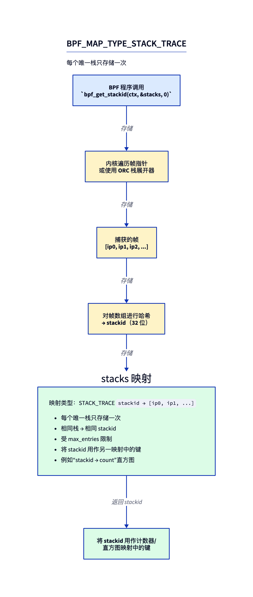
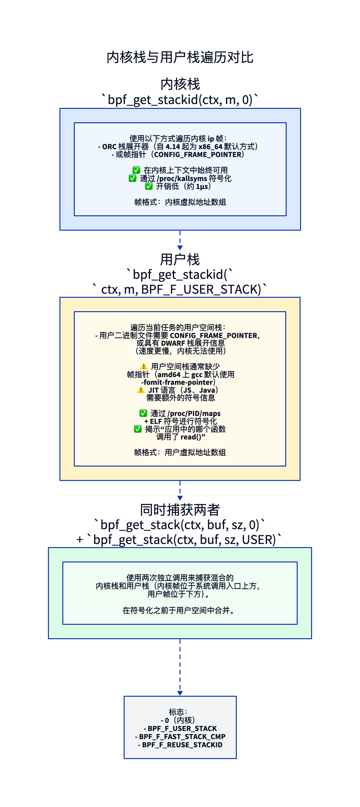
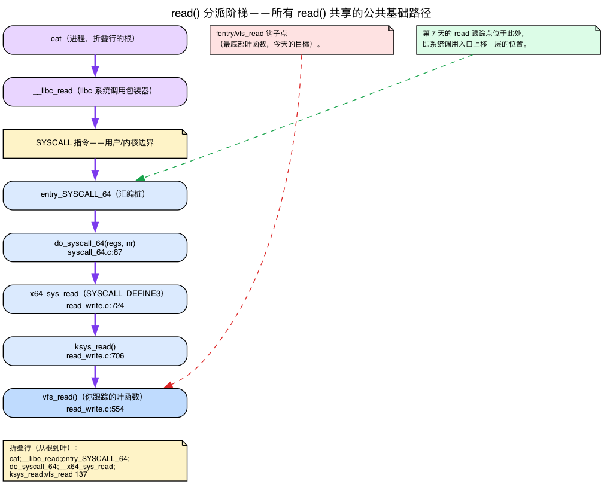
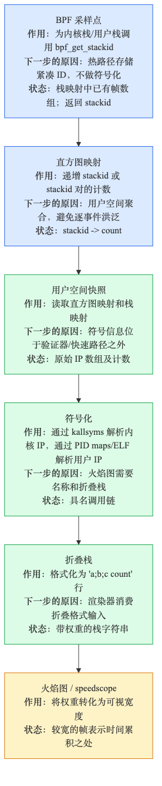
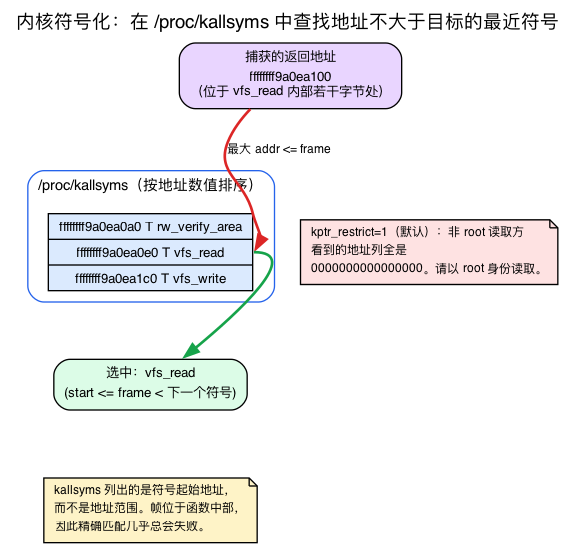
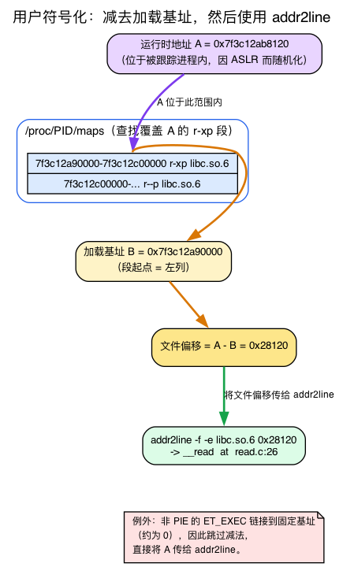

# 第9天 — 堆栈跟踪与通往火焰图之路

> **今日任务：** 在每一次 `vfs_read` 时捕获内核调用栈，按唯一栈聚合，并生成可直接用于火焰图（flame graph）的数据。在此过程中，你会了解原生调用栈究竟*是什么*、内核如何在没有帧指针的情况下展开它，以及为什么把一个原始返回地址还原成函数名是一件横跨 `/proc/kallsyms`、`/proc/PID/maps` 和一堆基址运算的用户空间工作。总时间：约 120 分钟。

## 为什么堆栈跟踪很重要

计数器告诉你“这件事发生了 1000 次”。堆栈跟踪则告诉你*是谁造成的*。再结合速率聚合，它们能揭示热点——是哪段用户代码、经由哪些内核路径，占据了某个事件绝大多数的发生次数。

`perf top`、`bpftrace` 以及大多数性能剖析工具的底层都是这样工作的。到今天结束时，你就会知道如何自己写一个。

但“捕获栈”这句话掩盖了四件事——一旦查看原始输出，这四个问题就会立即显现，而今天大部分内容就是要把它们讲清楚：

1. **原生调用栈究竟是什么**——以及内核如何反向遍历它（`bpf_get_stackid` 替你做的正是这件事）。
2. **系统调用入口帧是什么**——为什么每一次 `read()` 都共享一段完全相同的内核帧基座。
3. **一个原始内核返回地址如何变成函数名**——`/proc/kallsyms`，以及为什么精确匹配几乎从不奏效。
4. **一个原始用户返回地址如何变成函数名**——ASLR、加载基址与 `addr2line`。

每一点我们都会在实验中触及它所对应的环节时再讲解。

## 首先：调用栈究竟是什么，又该如何反向遍历？

在动任何 BPF 之前，我们得先把要捕获的东西说清楚。在 x86_64 上，当一个函数调用另一个函数时，`CALL` 指令只做一件具体的事：它把**返回地址**——即紧跟在调用之后那条指令的地址——**压入栈**，然后跳转。当被调用者执行 `RET` 时，它弹出该地址并从那里继续执行。所以在任意一刻，栈里都装着一条返回地址的链条：当前正在执行中的每个函数各占一个，最内层（叶子，即 CPU 此刻所在处）在栈顶。

**展开（Unwinding）**＝恢复那条有序的返回地址列表，从叶子开始。那份列表*就是*堆栈跟踪。展开产生的正是这个——一个返回地址数组（内部的 `trace->ip[]`），最内层在前；`bpf_get_stackid` 对该数组做哈希、存储它，并返回一个 `stackid`（见下文）。

> **别把它和第 1/4 天的 BPF 栈搞混。** 第1天讲的是 BPF 程序*自己的*那个通过寄存器 `R10` 寻址的 512 字节栈——那是验证器为你的 eBPF 代码把守的暂存空间。今天说的调用栈是 **CPU 的原生内核/用户栈**：由编译后的内核代码和用户空间代码中的 `CALL` 指令铺设下来的、真实的 x86 返回地址栈。不同的栈，不同的用途。`bpf_get_stackid` 遍历的是*原生*那一个。

那么如何反向遍历它？你有一个栈指针，也知道栈顶帧的指令指针——但栈只是一串字节。一帧到哪里结束、下一帧从哪里开始？有两种方法可以解决这个问题。

### 帧指针展开（较简单的方式）

在 `-fno-omit-frame-pointer` 下，编译器专门拿寄存器 `%rbp` 指向当前帧中的一个已知位置：保存的 `%rbp`／返回地址这一对。每个函数的序言（prologue）会压入调用者的 `%rbp` 并把 `%rbp` 设为新帧。结果就是一个**链表**：`%rbp` 指向 `[saved %rbp | return addr]`，而其中保存的 `%rbp` 又指向*上一个*帧的那一对，如此往复。遍历器只需顺着这条链走，从每个节点里读出一个返回地址。

便宜又简单——但它要付出一个通用寄存器的代价（`%rbp` 不能再作他用），因此多年来 amd64 发行版都用 `-fomit-frame-pointer` 编译一切，以便把该寄存器用于其他用途。正是这一个决定，导致老旧二进制文件上的**用户栈遍历会失败**：没有 `%rbp` 链可循。

### ORC 展开（x86_64 内核的做法）

内核承担不起丢掉 `%rbp` 的代价，却仍然需要可靠的栈。解决办法是：一张编译期构建的**带外表（out-of-band table）**。内核镜像携带两个数组——`__start_orc_unwind_ip[]` / `__start_orc_unwind[]`（声明为 `extern`，见 `arch/x86/kernel/unwind_orc.c:30`）——它们以*任意*指令指针为键，描述了如何在*没有*帧指针的情况下找到上一帧：“在这个 IP 处，栈指针位于某某偏移，返回地址就在那里。”`orc_find()`（`unwind_orc.c:209`）执行逐 IP 的查找，`unwind_get_return_address()`（`unwind_orc.c:380`）产出每一帧。它解析的常见帧类型是 `ORC_TYPE_CALL`（展开步骤里的 `case ORC_TYPE_CALL`，`unwind_orc.c:611`）。

这就是为什么内核栈“总能工作”而用户栈需要帧指针：内核自带展开表；用户空间二进制文件没有（它们的对应物，即 DWARF `.eh_frame`，对内核来说太昂贵，无法在 BPF 上下文中解析——下文详述）。

两种方法产生**相同**的结果：那个由返回地址组成的有序 `trace->ip[]` 数组，`bpf_get_stackid` 对它做哈希。捕获到的数组落入一个 `struct perf_callchain_entry { u64 nr; u64 ip[]; }`（`include/linux/perf_event.h:59`）——`nr` 个帧，随后是各个 IP。

![帧指针展开和 ORC 展开都会生成相同的 trace->ip[] 数组](diagrams/day09_callstack_unwind.png)

### 一个影响符号化的细节

再看一眼 `CALL` 压入的东西：调用*之后*那条指令的地址。所以每个被捕获的帧（叶子帧除外）都是一个指向**函数中部**的返回地址，正好在某个调用点之后一条指令处——*永远不会*落在函数的起始处。记住这一点；它就是我们稍后遇到的 kallsyms “最近前导符号”技巧的根本原因。

## 了解 `BPF_MAP_TYPE_STACK_TRACE`

这是一种专用的映射类型。你不直接往里存键/值对——你调用 `bpf_get_stackid(ctx, &stacks, flags)`，然后内核会：
1. 遍历当前栈（帧指针或 ORC，依上一节所述）。
2. 把帧数组哈希成一个 32 位的 `stackid`。
3. 以 `stackid` 为键存储这些帧（去重——相同的栈 → 相同的 id）。
4. 把 `stackid` 返回给你的程序。

然后你把 `stackid` 用作**普通映射里的键**（例如一个 `stackid → count` 的哈希映射）来做聚合。这个辅助函数本身是 `BPF_CALL_3(bpf_get_stackid, ...)`，位于 `kernel/bpf/stackmap.c:323`；它有意返回*未符号化*的帧——把地址变成名字是用户空间的事（下文会看到究竟为什么）。



去重很重要：如果一千万个事件都发生在同一个栈上，你只把帧数组存*一次*，然后针对同一个 `stackid` 计数一千万次。内存占用由*唯一*栈的数量决定，而非事件数。

## 内核栈与用户栈

传给 `bpf_get_stackid`（及其同类 `bpf_get_stack`）的 flag 参数决定你遍历哪个栈：



- **默认（flag=0）：** 内核栈。在 x86_64 上通过 **ORC 展开器**遍历（自 4.14 起默认）或使用帧指针——就是上一节的那两种机制。在任何跟踪上下文中总能工作，因为内核自带 ORC 表。
- **`BPF_F_USER_STACK`：** *当前任务*的用户空间栈。仅当用户二进制文件带帧指针编译时才有效。本可以救一个省略帧指针的二进制文件的 DWARF 展开信息（`.eh_frame`）对内核来说太昂贵，无法在 BPF 上下文中解析，所以**内核无法用 DWARF 展开用户空间**——没有帧指针，就没有用户栈。为了让这件事重新有用，现代 Linux 发行版从 2023 年的 Fedora 38、2024 年的 Ubuntu 24.04 开始默认使用 `-fno-omit-frame-pointer` 构建。
- **`BPF_F_FAST_STACK_CMP`：** 仅哈希比较（更快，去重时不做完整的帧遍历）。
- **`BPF_F_REUSE_STACKID`：** 允许跨捕获会话复用 stackid。

要拿到*合并的*内核+用户栈，你要调用 **`bpf_get_stack` 两次**（不是 `bpf_get_stackid`）——每个 flag 各一次——并在符号化之前于用户空间中合并。

> ### 常见疑问
>
> **问：内核栈有多准确？**
>
> 答：非常准确，99% 的情况下都是。ORC 展开器很精确。边缘情形：在函数序言/尾声*期间*发生的运行中 kprobe 可能产生偏差一帧（off-by-one）的结果。高度优化的叶子函数可能被尾调用（tail-call）掉，从而完全不出现在栈里。对大多数跟踪来说这没问题。
>
> **问：为什么用户栈遍历不像内核那边那样“开箱即用”？**
>
> 答：amd64 上的用户空间二进制文件多年来一直用 `-fomit-frame-pointer` 编译（在 2023 年的 Fedora 38 和 2024 年的 Ubuntu 24.04 把它翻转之前，一直是发行版的默认值）。没有帧指针，回溯栈帧就需要 DWARF 展开信息（`.eh_frame`）——它昂贵，而内核无法处理。现代发行版正在改弦更张（Fedora、Ubuntu 现在都发布启用帧指针的 libc 及相关库），但遗留的二进制文件缺少这些元数据。
>
> **问：我怎么给 JIT 语言（Java、Node.js）做符号化？**
>
> 答：它们会暴露运行时符号文件。`perf-PID.map` 是 `/tmp` 里的一个文本文件，把 JIT 地址映射到函数名。JIT 运行时（HotSpot、V8）会生成它们。你的用户空间符号化器会连同 ELF 表一起读取它们。

## 系统调用入口帧究竟是什么

下面的练习依赖于 `cat /etc/passwd` 的一段特定的 5 帧内核链条，而稍后的火焰图会把那段宽阔的基座称为“共同的系统调用入口帧”。在**第7天**你看到，`read` 跟踪点位于系统调用入口那一层，而 `fentry/vfs_read` 钩在最底部——但没有讲这两点*之间*的梯级。这里是完整的梯子——你不需要重新推导系统调用机制，只需看清这些梯级。

一次 `read()` **不会**直接跳进 `vfs_read`。在 x86_64 上它要走过一段固定的分派梯子：

1. 硬件 `SYSCALL` 指令落在汇编桩 **`entry_SYSCALL_64`**。
2. 它调用 C 分派器 **`do_syscall_64(regs, nr)`**（`arch/x86/entry/syscall_64.c:87`）。
3. 后者经由系统调用表分派到 **`__x64_sys_read`**——即 `SYSCALL_DEFINE3(read, ...)`（`fs/read_write.c:724`）展开出来的架构包装器。
4. 它调用瘦封装 **`ksys_read()`**（`fs/read_write.c:706`）。
5. 后者最终调用 **`vfs_read()`**（`fs/read_write.c:554`）——你正在跟踪的那个叶子。

这就是为什么每个采样在火焰图里都共享一段宽阔的公共基座：这台机器上*每一次* `read()` 都经过完全相同的 `entry_SYSCALL_64` → `do_syscall_64` 前缀；只有叶子路径才发生分叉。它也固定了折叠行（folded line）中的叶子顺序：进程（`cat`）在基座，然后是入口帧，你所跟踪的函数 `vfs_read` 位于最顶端。



> ### 削尖你的铅笔
>
> 你写了一个跟踪器，为每一次 `vfs_read` 捕获内核 + 用户栈。你的测试负载是从 bash 里执行 `cat /etc/passwd`。你预计会看到大约多少个唯一的 `stackid` 值？
>
> .\
> .\
> .
>
> **答案：** 屈指可数的几个。`cat` 对 `read()` 的调用总是走过大致相同的用户空间路径（libc `read` 包装器 → 系统调用指令）。bash 对 `cat` 的调用同样走过相同的路径。内核那边也很稳定：`entry_SYSCALL_64` → `do_syscall_64` → `__x64_sys_read` → `ksys_read` → `vfs_read`。总共或许 1–3 个唯一栈。现在换个复杂的负载（Firefox 加载一个页面）来跑，你会看到几百个——这正是去重发挥作用的地方。

## 一个栈能有多深？硬性的 127 帧上限

在给映射定尺寸之前，先了解天花板。当你创建一个 `BPF_MAP_TYPE_STACK_TRACE` 映射时，内核要求 `value_size / 8`（每个 `u64` 帧 8 字节）*一开始*就 `<=` `sysctl_perf_event_max_stack`。所以请求 256 帧并不会被悄悄地限制——映射创建会被以 `-EINVAL` 拒绝（`stack_map_alloc`，`stackmap.c:113`）。创建时 `value_size / 8` 必须 `<=` `sysctl_perf_event_max_stack`。

- `PERF_MAX_STACK_DEPTH` 默认是 **127**（`include/uapi/linux/perf_event.h:1285`），且 `int sysctl_perf_event_max_stack = PERF_MAX_STACK_DEPTH;`（`kernel/events/callchain.c:23`）。运行时旋钮是 `/proc/sys/kernel/perf_event_max_stack`（在 `callchain.c:306` 注册）。它与 perf 子系统共享，因为 `bpf_get_stackid` 复用了 perf 的 callchain 机制。
- `stack_map_calculate_max_depth()`（`kernel/bpf/stackmap.c:53`）从 `value_size / elem_size` 计算出*运行时*深度，并与 sysctl 相调和：`if (max_depth > curr_sysctl_max_stack) return curr_sysctl_max_stack;`。这个运行时限制只在映射创建*之后* sysctl 被调低时才起作用（或用于 `BPF_F_SKIP_FIELD` 调整）——它不是创建时的天花板。创建时的关卡是另一回事：`stack_map_alloc` 会直接**拒绝**那些 `value_size / 8 > sysctl_perf_event_max_stack` 的映射，返回 `-EINVAL`（`stackmap.c:113–114`）。

实际后果：实验里的 `MAX_STACK_DEPTH = 64` 远低于上限。在 64 与 127 之间选择，是在每个唯一栈的内存占用与深栈被截断的风险之间做权衡。超过 127 毫无好处，除非你同时抬高 sysctl。

## 端到端的火焰图流水线



在 BPF 中捕获，按 stackid 聚合，在用户空间读取，对每一帧做符号化，折叠成 flamegraph.pl 所期望的文本格式：

```
thread_or_pid;fn1;fn2;fn3;fn4 1234
```

然后通过管道送入 `flamegraph.pl`（Brendan Gregg 的工具），或者上传到 `speedscope.app`。

---

## 实验

### `stacks.bpf.c`

```c
{{#include ../labs/day09/stacks.bpf.c:book}}
```

### 哪些内容是新的，哪些沿用已有模式

- **挂载方式已经很熟悉。** `SEC("fentry/vfs_read")` 就是你在**第6天**用过的、挂在 `vfs_read` 上的那个 BTF 类型化入口跳板，而 `BPF_PROG(on_read)` 是**第7天**揭秘过的参数解包宏。挂载*方式*上没有任何新东西——`vfs_read`（`fs/read_write.c:554`）与第6天实验里的目标完全相同。今天的新内容全都在处理函数*内部*。
- **两次 `bpf_get_stackid` 调用**——一次内核（flag 0），一次用户（`BPF_F_USER_STACK`）。
- **负返回值检查。** 这两个辅助函数在失败时返回一个负的 errno（-EFAULT/-EEXIST/-ENOMEM）（例如，用户栈遍历撞上了缺失的帧指针，或者栈映射的槽位已被另一个栈占用）。
- **复合键**：把两个 stackid 打包进一个 `u64`，让完全相同的（kernel, user）对共享一个计数器。这个 `(kid << 32) | uid` 打包是这里唯一真正的新技巧——两个 stackid 合并成一个哈希映射键。
- **计数逻辑纯粹是第2天的内容。** 回忆第2天：一次哈希映射查找交还的是一个*未加锁*的活指针，所以并发的自增必须是 `__sync_fetch_and_add`；而 `BPF_NOEXIST` 插入可能丢掉一次竞争中的自增（一次无关紧要的漏计）。同样的 `count.c` 模式，同样的检查问题——无需再推导一遍。

### `stacks.c` — 用户空间转储器 + 符号化器

大纲（你可以用 `blazesym`，也可以写一个极简的 kallsyms 解析器）。这个迭代循环与第2天的用户空间 `bpf_map_get_next_key` 遍历相同——每次调用取一个键，循环位于用户空间：

```c
/* every 5s, dump top stacks by count: */
while (!exiting) {
    sleep(5);

    /* iterate counts map */
    __u64 key = 0, next;
    __u64 val;
    int cnt_fd = bpf_map__fd(skel->maps.counts);
    int stk_fd = bpf_map__fd(skel->maps.stacks);

    while (bpf_map_get_next_key(cnt_fd, &key, &next) == 0) {
        bpf_map_lookup_elem(cnt_fd, &next, &val);
        __u32 kid = next >> 32, uid = next & 0xffffffff;

        __u64 kframes[64] = {0}, uframes[64] = {0};
        bpf_map_lookup_elem(stk_fd, &kid, kframes);
        bpf_map_lookup_elem(stk_fd, &uid, uframes);

        /* Print folded: stack;...; count */
        printf("[count=%llu]\n", val);
        for (int i = 0; i < 64 && kframes[i]; i++)
            printf("  K %llx\n", kframes[i]);
        for (int i = 0; i < 64 && uframes[i]; i++)
            printf("  U %llx\n", uframes[i]);
        printf("\n");

        key = next;
    }
}
```

要做真正的符号化，请链接 `libblazesym`（现代、快速），或者写一个 `kallsyms` 解析器。我们今天不写——第9天讲的是*捕获*数据；符号化属于后续处理工作。但你仍应理解*这套处理流程做了什么*，因为接下来的两节会逐步演示。

### 运行它

```bash
make
sudo ./stacks &        # job %1; prints a dump every 5s
# Generate work, then wait for the next 5-second dump to see it:
find /usr -name "*.so" > /dev/null
cat /etc/passwd > /dev/null
sleep 5
```

输出由时间间隔驱动——在下一个 5 秒周期到来之前不会打印任何内容。完成后，停掉后台转储器（否则它会以 root 身份永远打印下去）：

```bash
kill %1        # or: sudo pkill stacks
```

你会看到帧被打印成原始的十六进制（`K <addr>` / `U <addr>`）。那些就是来自 `trace->ip[]` 的原始返回地址，与前文介绍调用栈时描述的内容完全一致。手工解析它们既琐碎又麻烦，而且两半（内核与用户）的做法完全不同。我们各手动做一次；这正是 `bpftool`／`libblazesym` 存在的全部理由。

### 符号化内核帧：`/proc/kallsyms`

一个运行中的内核没有磁盘上二进制文件那样的 ELF 符号表——镜像已经被加载并重定位了。作为替代，内核在 `/proc/kallsyms` 暴露它的**运行时符号表**：每个符号一行，`address type name`，例如 `ffffffff... T vfs_read`。用户空间符号化器通过在这里查找，把一个内核返回地址变成名字。这里有两个容易出错的地方：

- **`kptr_restrict` 会为非 root 把地址清零。** 这个 sysctl 掌管可见性；在默认值 `1` 下，非特权读取者看到的每个地址都是 `0000000000000000`。以普通用户身份 grep，你找到的是一堆零。你必须以 **root** 身份读取它。（这是一项加固措施：泄露内核地址会击破 KASLR。）
- **kallsyms 列出的是符号的*起始*地址，而非范围——而且在磁盘上并非按地址排序。** 回忆调用栈那一节的微妙之处：被捕获的帧是一个位于函数*中部*的返回地址，永远不在起始处。所以精确匹配几乎从不成功。修正办法是**最近前导符号（nearest-preceding-symbol）**：按字典序排序（对于定宽的 16 位十六进制内核地址，字典序等于数值序），然后取 `<=` 你的帧地址的最大符号地址。

```bash
# ADDR is one of the K <addr> values, e.g. ffffffff9a0ea100
sudo sort /proc/kallsyms | awk -v a=ADDR '$1 <= a {s=$0} END {print s}'
# ffffffff9a0ea0e0 T vfs_read
```

帧地址（`ffffffff9a0ea100`）大于 `vfs_read` 的起始（`ffffffff9a0ea0e0`）而小于下一个符号的起始，所以它解析为 `vfs_read`——一个在它内部几个字节处的返回地址。这正是 `bpftool`／`libblazesym` 自动化的那个查找。



### 符号化用户帧：加载基址与 ASLR

内核帧活在一个地址空间里；用户帧则是**被跟踪进程内部**的运行时虚拟地址，而这正是难处所在。`addr2line` 和二进制文件的 ELF 符号表说的是**文件偏移**——烘焙进 `.so`／可执行文件里的链接期地址。而被捕获的帧是一个**运行时地址**。两者相差一个**加载基址**：

```
file_offset = runtime_addr - load_base
```

为什么 `load_base` 不干脆就是零？因为**位置无关可执行文件（PIE）**以及*所有*共享库（libc 等）每次运行都被映射到一个**随机化的基址**——这就是 ASLR。要恢复文件偏移，你必须减去基址，而基址是该对象可执行段最低的被映射地址，可在 `/proc/PID/maps` 中匹配行的左列找到。

```bash
# A is a U <addr> runtime value; PID is the traced process.
# Find B = the base of the object that contains A:
sudo grep -i 'r-xp' /proc/PID/maps      # locate the segment whose range covers A; B is its start
addr2line -f -e /path/to/object $((A - B))
```

对 PIE 可执行文件和共享库来说，减去基址是**强制性的**。唯一的例外：经典的非 PIE `ET_EXEC` 链接在一个*固定*地址（其主 text 基址实际上为 0），所以你把运行时地址直接传给 `addr2line`——这就是你会在工具里看到的那个特例分支。有两个新手陷阱会产出 `??:0`：忘了 `-e <object>`（对象搞错）和忘了做减法（基址搞错）。跨多个被映射库的这种逐对象记账，正是 `libblazesym`／`bpftool` 替你完成的主要工作。

（还有一种可以提高健壮性的方案：`BPF_F_USER_BUILD_ID`（`include/uapi/linux/bpf.h:6174`）捕获的是 build-id + 偏移，而非一个裸地址，因此离线符号化能挺过 ASLR、甚至能在另一台机器上进行。我们今天不用它，但这就是那个模式存在的原因。）



这种手工解析——内核用 kallsyms 最近前导，用户用先减基址再 addr2line——正是 `libblazesym` / `bpftool` 自动化的处理流程，也是实验将符号化安排到后续步骤的原因。

### 管道送入火焰图

先弄一份 `flamegraph.pl`（任何发行版都没有打包它——去 Brendan Gregg 的仓库拿）：

```bash
git clone https://github.com/brendangregg/FlameGraph
export PATH="$PATH:$PWD/FlameGraph"
```

然后：

```bash
sudo ./stacks --folded > out.folded
flamegraph.pl < out.folded > out.svg
# Open out.svg in any browser. On a headless box, copy it to your laptop,
# or just drag out.folded onto https://speedscope.app (no local browser needed).
# firefox out.svg   # only if you actually have a desktop browser
```

`--folded` 是**必须由读者完成的工作**——实验里的 `stacks.c` 只打印上面那份 `%llx` 调试转储。你需要解析 `argv`、对每一帧做符号化（用你刚学到的 kallsyms 与 `addr2line` 机制），并按*根到叶*的顺序（进程在基座，叶子在顶端）为每个唯一栈输出一行，计数放在最后。在上面那个循环的基础上，大致是这样：

```c
printf("%s", comm);                       /* process name at the base */
for (int i = u_n - 1; i >= 0; i--)        /* user frames, outermost first */
    printf(";%s", sym_user(uframes[i]));
for (int i = k_n - 1; i >= 0; i--)        /* then kernel frames */
    printf(";%s", sym_kernel(kframes[i]));
printf(" %llu\n", val);                   /* count */
```

`cat /etc/passwd` 负载对应的一行正确折叠行长这样——就是“削尖你的铅笔”答案里那段内核调用链，叶子（`vfs_read`）在顶端：

```
cat;__libc_read;entry_SYSCALL_64;do_syscall_64;__x64_sys_read;ksys_read;vfs_read 137
```

在生成的 SVG 里：宽阔的基座是每个采样共享的公共进程／系统调用入口帧，狭窄的塔是各自分叉的调用路径，每一帧的宽度与其计数成正比，而 `vfs_read` 位于每座塔的近顶端（它就是你跟踪的那个函数）。

---

## 按顺序尝试破坏

### 破坏实验 1 — `BPF_F_USER_STACK` 上的用户栈遍历失败

如果你的二进制文件带有省略帧指针的库（多数较老的发行版如此），你会在很多调用上看到 `uid < 0`——没有 `%rbp` 链可循，也没有内核能用的 DWARF，正如讲展开那一节所预言的。变通办法：在一个启用帧指针的二进制文件里，对一个用户空间开销较重的函数下 `fentry`。或者，在 Fedora/Ubuntu 24+ 上，现代 libc *带有*帧指针，用户栈就能解析。

要调试，直接检查 `bpf_get_stackid` 的返回值：程序已经对 `uid < 0` 做了守卫（第 `__s64 uid = ...; if (kid < 0 && uid < 0)` 行），那个负值就是解释用户栈遍历失败的 errno。这里 `bpftool prog tracelog` 默认是空的——本实验不向 trace pipe 发任何东西——所以要用它，你必须在失败路径上加一条 printk，例如在 `on_read` 里：

```c
if (uid < 0)
    bpf_printk("user-stack walk failed: uid=%lld\n", uid);
```

然后盯着 `sudo bpftool prog tracelog`（或 `sudo cat /sys/kernel/debug/tracing/trace_pipe`），就能在一个省略帧指针的库让遍历失败时看到那个负 errno 触发。

### 破坏实验 2 — 忘记 `MAX_STACK_DEPTH`

把 `value_size` 设得太小（`16 * sizeof(__u64)`）。深于 16 帧的栈会被截断。你会看到看似合理但残缺的栈。除非有理由更小，否则默认用 64——并记住上限那一节说过的：超过 127 在不抬高 `perf_event_max_stack` 的情况下毫无好处。

### 破坏实验 3 — 用 `bpf_get_stack` 代替 `bpf_get_stackid`

```c
__u64 frames[64];
int n = bpf_get_stack(ctx, frames, sizeof(frames), 0);
```

这会把帧*直接拷贝进*你提供的缓冲区（`BPF_CALL_4(bpf_get_stack, ...)`，位于 `kernel/bpf/stackmap.c:514`），而不经过去重映射。当你要为每个事件发出一个栈（例如发到 ringbuf）而非聚合时很有用。代价：更多内存流量、没有去重；但你无需第二次映射查找就能立刻拿到帧。

### 破坏实验 4 — 提高栈的速率，把映射填满

在繁忙的服务器上跟踪像 `tcp_recvmsg` 这样的高速率事件。唯一栈一多，你就会填满 `max_entries=16384`。当一个新栈哈希到一个已被*不同*栈占用的槽位时，`bpf_get_stackid` 返回 `-EEXIST`，新栈被丢弃——那就是 `if (bucket && !(flags & BPF_F_REUSE_STACKID)) return -EEXIST;` 分支，位于 `stackmap.c:298`（build-id 路径）／`:305`（普通路径）。于是真正的新栈被悄悄丢失。传入 `BPF_F_REUSE_STACKID`，行为就翻转：被占用的槽位改为被**覆盖**（`xchg(&smap->buckets[id], new_bucket)`，位于 `stackmap.c:317`），于是你保住了最新的栈却丢了旧的（而任何以旧 stackid 为键的计数现在都指向了错误的帧）。

教训：把 `stacks` 和 `counts` 的尺寸定到预期的唯一栈基数。对多数生产服务器，16K–64K 就够了。性能剖析器常常上到 1M。

---

## 内核代码阅读指引

- **`kernel/bpf/stackmap.c`** — 实现所在。`stack_map_alloc` 构建映射自身的结构（一个 `buckets[]` 数组，外加一个每 CPU 的栈缓冲区 `pcpu_freelist`——*不是*通用的 `htab_map_alloc`；见 `struct bpf_stack_map`，位于 `:26`），而 `bpf_get_stackid`（`:323`）是那个辅助函数。注意 `stack_map_calculate_max_depth`（`:53`），127 上限的限制就在那里。把这个文件通读一遍；约 800 行。
- **`arch/x86/kernel/unwind_orc.c`** — x86_64 使用的 ORC 展开器。`orc_find`（`:209`）和 `unwind_get_return_address`（`:380`）是它的核心。不必深读；只需知道它存在，且比帧指针更快、更可靠。
- **`kernel/bpf/stackmap.c`** — 搜索 `bpf_get_stack`（`:514`）。直接拷贝帧的那个非 stackid 版本。
- **`tools/lib/bpf/btf.c` 和 `tools/perf/util/symbol.c`** — 符号化的灵感来源。selftests 里没有干净的示例。
- **`tools/testing/selftests/bpf/progs/stacktrace_map.c`** — 该模式的最小示例。

外部参考（浏览一次）：https://www.brendangregg.com/flamegraphs.html

---

## 要点回顾

- **原生调用栈**是由 `CALL` 指令压入的一条返回地址链。**展开**从叶子开始恢复它们；那份有序列表*就是*跟踪。（区别于第 1/4 天 BPF 程序自己的 R10 栈。）
- **两种展开方式：** 帧指针（`%rbp` 链表，便宜但要占一个寄存器——这就是用户栈失败的原因）和 **ORC**（x86_64 内核自带的一张带外 `.orc_unwind` 表——这就是内核栈总能工作的原因）。
- **`BPF_MAP_TYPE_STACK_TRACE`** 以哈希为键存储帧数组；相同的栈 → 相同的 `stackid`。内存占用由唯一栈的数量决定。
- **`bpf_get_stackid(ctx, &stacks, flags)`** 捕获当前栈并返回一个 stackid。把它用作另一个映射里的键来做聚合。**`BPF_F_USER_STACK`** 遍历用户空间——只在有帧指针时才有效。
- **系统调用梯子** `entry_SYSCALL_64 → do_syscall_64 → __x64_sys_read → ksys_read → vfs_read` 是每一次 `read()` 共享的公共基座——火焰图那段宽阔的基座。
- **127 帧上限：** 内核会把捕获深度限制到 `sysctl_perf_event_max_stack`（默认 `PERF_MAX_STACK_DEPTH = 127`），无论 `value_size` 多大。
- **符号化发生在用户空间。** 内核帧：`/proc/kallsyms`，仅 root（kptr_restrict=1 会把它清零），最近前导符号（返回地址在函数中部）。用户帧：从 `/proc/PID/maps` 减去加载基址（ASLR/PIE），再用 `addr2line`——非 PIE 的 `ET_EXEC` 除外。
- **`bpf_get_stack`**（不带 -id）把帧直接拷贝到缓冲区——适合逐事件发出，而非聚合。
- **火焰图格式**：每行 `thread;fn1;fn2;fn3 count`；`flamegraph.pl` 产出交互式 SVG。

---

## 检查问题

两个 CPU 同时以完全相同的栈调用 `bpf_get_stackid`。它们会得到相同的 stackid 吗？相同的映射槽位吗？会有竞态吗？

<details>
<summary>点击揭晓答案</summary>

**答案：** 它们会得到相同的 stackid（帧的哈希相同）。它们都指向同一个映射槽位。内核在栈映射内部使用桶级锁定——它用 `READ_ONCE(smap->buckets[id])` 比较桶，用 `xchg(&smap->buckets[id], ...)` 安装；其中一个 CPU 的插入胜出，另一个看到已存在的条目并返回相同的 stackid 而不再重复插入。从 BPF 视角看不到任何竞态。去重正是这种映射类型的全部意义所在。

</details>

---

## 明天

第10天：uprobes。从 BPF 跟踪用户空间二进制文件里的函数。我们会挂到 `bash` 的 `readline()`，看到每一条被键入的命令。
