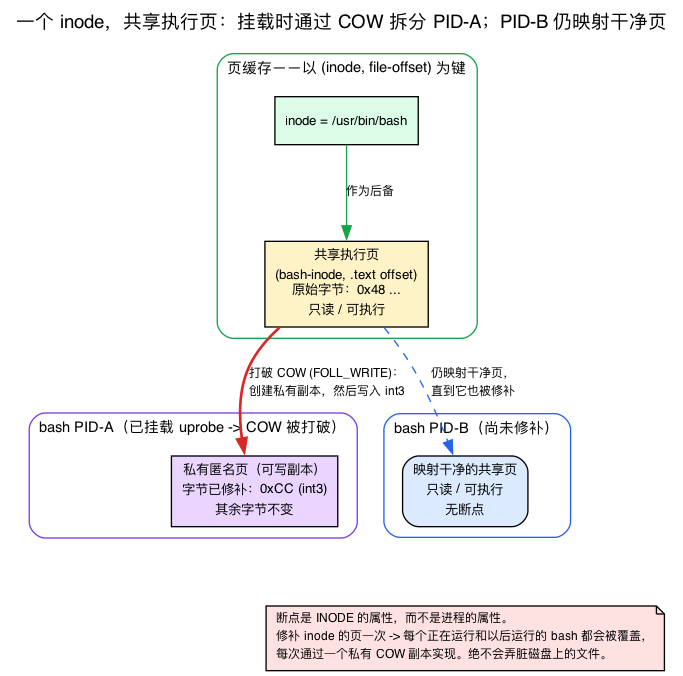
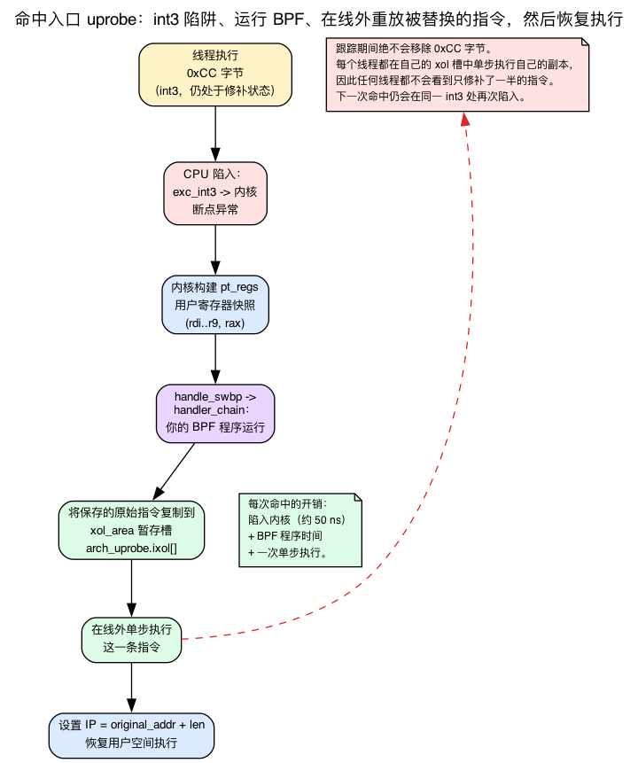
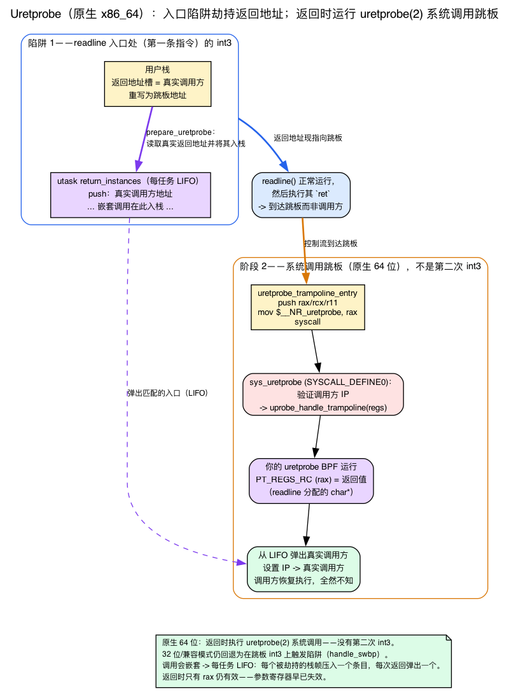
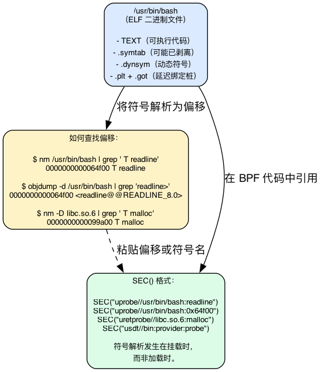
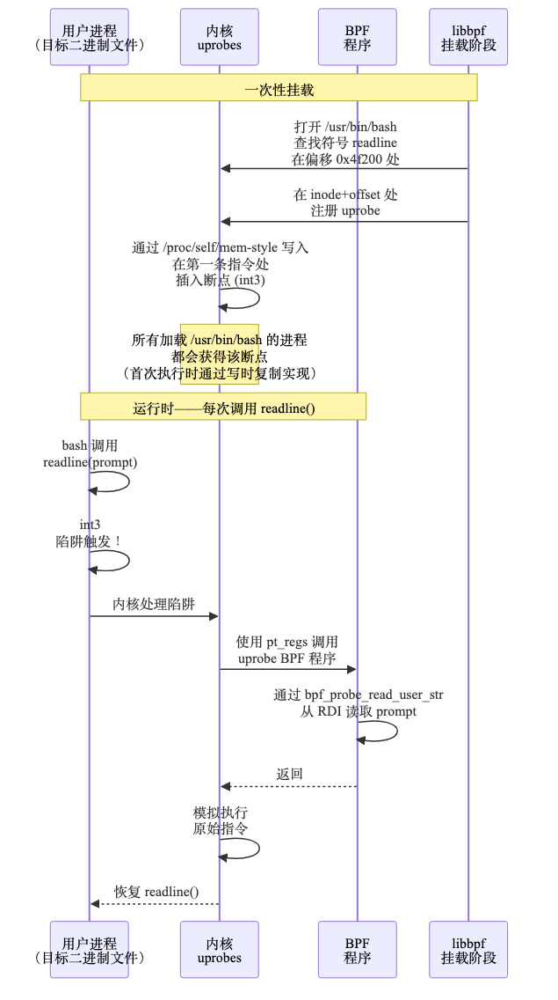
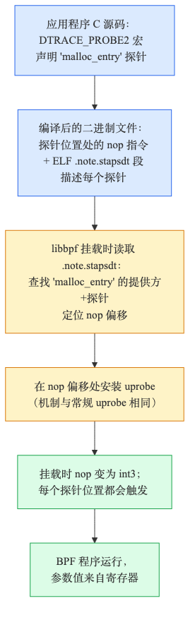

# 第10天 — Uprobe：从 BPF 跟踪用户空间

> **今日任务：** 跟踪某个用户空间二进制文件里的一个函数。通过挂钩 `readline()`，观察在 bash 中输入的每一条命令。但在此之前，先要理解底层真正全新的那套机制：一个可执行文件究竟是如何存在于内存中的、内核如何在不破坏一条*用户空间*指令的前提下给它打补丁，以及当一个函数*返回*时内核又如何重新夺回控制权。总用时约 110 分钟。

## “这台机器上跑着什么”的另一半

第6–9天跟踪的都是*内核*函数。但你的应用程序大多运行在用户空间——而且许多有意思的事件完全发生在用户代码里，根本不碰系统调用（想想 `malloc`、`g_object_unref`、`PQexec`、JIT 编译事件）。

**Uprobe** 让 BPF 程序能够挂载到用户空间函数上。内核会给目标二进制文件的可执行页打上断点补丁；当任何执行该二进制文件的进程到达被打补丁的指令时，陷阱触发，你的 BPF 程序随之运行。

它很像 kprobe——只不过目标是 `/usr/bin/bash`、`/usr/lib/libssl.so.3` 或你自己的 `myapp` 里的某个函数，而不是 `vfs_read`。

不过，这里有一件教程往往略过的事：从内核跟踪*用户空间*代码，和你在本系列前面见过的内核函数打补丁相比，是一套确实不同的机制。内核里最接近的近亲是**第7天的 kprobe**——也就是 `int3` 陷阱那条路径，而*不是*第1天的 `fentry`（它把一个 NOP 位置改写为跳板调用，运行时没有陷阱）。有三块背景知识造就了这种差异，而今天余下的内容只有在你掌握了它们之后才能讲通：

1. **一个可执行文件如何存在于内存中**——它并不会被拷贝进 RAM，而是从文件 `mmap` 出来的，而且它的页面在每一个运行它的进程之间是*共享*的。这就是为什么注册一次 uprobe 就能覆盖系统上的每一个 bash。
2. **内核如何安全地给一条*用户空间*指令打补丁**——它不能直接覆写一个共享的、只读的、以磁盘文件为后备的页面。它借助写时复制拿到一份私有拷贝，写入 1 字节的 `int3` 陷阱，再把被替换的那条指令挪到别处重放。
3. **当一个函数*返回*时内核如何重新夺回控制权**——返回点处没有一条固定的指令可供打补丁，所以内核会劫持返回地址。这正是 uretprobe 背后的全部把戏，而今天的实验就依赖于它。

我们会*在实验中遇到依赖某块知识的那一部分时*再逐一讲解它。第7天的 kprobe 在单一共享地址空间里的*内核*代码上用的是同一套 `int3` 陷阱原语；下面的一切都是它在用户空间中的对应物，而且区别不小。

## 可执行文件如何存在于内存中：文件后备的 mmap、页缓存与 COW

在给一条用户空间指令打补丁之前，我们必须知道那条指令在物理上*究竟在哪里*。大多数人抱持的那种直觉——“程序被加载进了 RAM”——在今天这个语境下错得很关键。

**二进制文件并不会被整体拷贝进 RAM。** 当你运行 `/usr/bin/bash` 时，加载器不会把整个文件一口气读进内存。它对文件执行 `mmap()`：它创建一个*文件后备的映射*，表示“这一段虚拟地址范围对应于这个文件的这些字节偏移”。真正的字节是惰性拉入的，每次 CPU 首次触及某个页面时才拉入这一页。

这些页面存在哪里？存在**页缓存**里——内核那个唯一的、共享的文件内容缓存。一页文件数据以 **(inode, 文件偏移)** 为键：inode 标识*是哪个文件*，偏移标识*文件里的哪一个 4 KB 块*。（回忆第1天讲的：物理 RAM 是以 `PAGE_SIZE` = 4 KB 的页帧为单位分配出去的。）关键性质在于：

**每一个运行同一个二进制文件的进程都映射*同一批*物理页面。** 两个 `bash` 进程并不会各自拿到一份 bash 可执行代码的拷贝。它们都以只读且可执行的方式映射 `(bash's inode, offset of .text)` 所对应的那些页缓存页面。RAM 里只有一份代码，被它们所有进程共享，外加磁盘上那个作为后盾的文件。

这个共享的页缓存*正是* uprobe 之所以是系统级的原因。断点不是某个进程的属性——它是 **inode** 的属性。因为探针的键是 `(bash-inode, readline's offset)`，内核会遍历每一个映射了这个 inode 的进程（以及未来每一次 `mmap`），逐个给它们打补丁。它*不会*向共享的页缓存页面里写一次就触及所有人——那样会弄脏一个共享的、文件后备的页面（正是下面 COW 一节说必须避免的事）。系统级的覆盖来自 inode 这个键，加上对所有映射的遍历，而不是来自一次共享写入。



你可以在内核自己的数据结构里看到这种以 inode 为身份的做法。一个 uprobe 由一个 inode 指针和一个文件偏移来标识——而不是虚拟地址：

```c
/* kernel/events/uprobes.c:62 — struct uprobe */
struct inode *inode;   /* the file the probe lives in (line ~69) */
loff_t        offset;  /* file-offset of the patched instruction (line ~74) */
```

而且 `uprobe_register` 会*拒绝*一个不是文件后备的目标——否则就没有页缓存可供读取原始指令了：

```c
/* kernel/events/uprobes.c:1402 */
/* copy_insn() uses read_mapping_page() or shmem_read_mapping_page() */
if (!inode->i_mapping->a_ops->read_folio &&
    !shmem_mapping(inode->i_mapping))
    return ERR_PTR(-EIO);
```

为了记住它即将覆写的那条指令（以便在卸载时恢复），内核会按偏移直接从页缓存里读出那个*原始*字节：

```c
/* kernel/events/uprobes.c:1058, inside __copy_insn() */
page = read_mapping_page(mapping, offset >> PAGE_SHIFT, filp);
```

`offset >> PAGE_SHIFT` 就是“文件的第几页”；`read_mapping_page` 拉取那一页页缓存页面（`__copy_insn` 在 `:1048`，`copy_insn` 在 `:1070`）。

### 在不破坏共享页面的前提下给它打补丁：写时复制

现在来看问题所在。我们想打补丁的这个页面是**在每一个进程之间只读共享的，*而且*以磁盘文件为后备的。** 如果内核直接往里写 `0xCC`，就会：（a）不受控制地同时波及每一个进程；（b）有弄脏文件后备页面的风险。这不是我们想要的——我们想一次只给*一个*进程的视图打补丁。

解决办法是**写时复制（copy-on-write，COW）**。COW 这个技巧让许多映射共享同一个物理页面，直到有人写入为止：在写入发生的那一刻，写入方会得到*仅这一页*的一份*私有可写拷贝*，其他所有人则保留原页面。内核在打补丁之前会刻意强制触发这种分裂：

```c
/* kernel/events/uprobes.c:518 — in uprobe_write() */
/*
 * When registering, we have to break COW to get an exclusive anonymous
 * page that we can safely modify. Use FOLL_WRITE to trigger a write
 * fault if required. ...
 */
if (is_register)
    gup_flags |= FOLL_WRITE | FOLL_SPLIT_PMD;   /* :526 */
```

接着，在写入之前，它会验证自己拿到的页面确实是一个私有的匿名 folio（`folio_test_anon` 检查，位于 `:552`）。所以对每个进程而言的顺序是：触发 COW 分离 → 目标进程现在拥有那一页的一份*私有、可写、匿名的拷贝* → 在那里写入 `int3`。其他进程仍会在那个干净的共享页面上触发缺页，直到它们也被打上补丁为止。

**这就是“COW 保护其他映射”的具体含义。** 第7天的 kprobe 用 `int3` 戳的是*内核*代码：一个地址空间、一份拷贝、就地打补丁。而这里的目标是通过文件后备映射访问的、每进程各一份的*用户空间*内存，所以内核必须先为该页面创建私有副本。确实是不同的机制。

## int3 陷阱与重放被覆盖的指令

我们已经打好了一个字节的补丁。还剩两个问题，其中第二个是每个教程都含糊带过的。

**是哪个字节，它又做了什么？** 在 x86_64 上，断点是一条 1 字节指令 `0xCC`（`int3`），它会引发断点异常：

```c
/* arch/x86/include/asm/uprobes.h:20 */
#define UPROBE_SWBP_INSN      0xcc
#define UPROBE_SWBP_INSN_SIZE 1
```

`set_swbp` 负责写入它；`set_orig_insn` 在卸载时恢复它——两者都走上面同一条 `uprobe_write_opcode` / COW 路径：

```c
/* kernel/events/uprobes.c:612 */
int set_swbp(...)      { return uprobe_write_opcode(..., UPROBE_SWBP_INSN, true); }
/* kernel/events/uprobes.c:627 */
int set_orig_insn(...) { return uprobe_write_opcode(..., *(uprobe_opcode_t *)&auprobe->insn, false); }
```

当某个线程执行到那个字节时，CPU 会陷入内核的 `int3` 异常入口（`DEFINE_IDTENTRY_RAW(exc_int3)`，位于 `arch/x86/kernel/traps.c:1004`），它会通知 uprobe 层（`uprobe_pre_sstep_notifier`，位于 `kernel/events/uprobes.c:2871`）。分发器 `handle_swbp`（`uprobes.c:2712`）按触发陷阱的地址查找处于活动状态的 uprobe（`find_active_uprobe_rcu`，`:2724`），并通过 `handler_chain` 运行你的 BPF 程序（`:2549`，消费者的处理函数在 `:2549–2566` 处被调用）。这个陷阱会构建一份用户寄存器的 `pt_regs` 快照——**和你在第7天读取的那个 `pt_regs` 是同一个，也就是你用 `PT_REGS_PARM*` 读取的那份**——然后把它交给你的程序。

**现在来看那个没人解释的谜题。** 原始指令*已经没了*——你用 `0xCC` 覆写了它的第一个字节。在你的 BPF 程序运行完之后，线程要如何执行它本应执行的那条指令，并继续往下跑呢？

答案是**异地执行（execute-out-of-line，XOL）**。在跟踪期间内核从不移除那个 `int3`；相反，它保留着已保存的原始指令，并在别处重放它：

1. 第一次命中时，内核会分配一个每进程各一份的可执行临时页面——即 **`xol_area`**（`struct xol_area`，位于 `kernel/events/uprobes.c:109`）。
2. 它把已保存的原始指令（如有需要会做架构相关的修正）拷贝到那里的一个槽位中（`xol_get_insn_slot`，位于 `:1871`；这些字节存放在 `arch_uprobe.ixol[]` 里，`arch/x86/include/asm/uprobes.h:33`）。
3. 它把用户指令指针指向那个槽位，**单步执行那一条指令**，然后架构相关的 XOL 后处理函数把 IP 重定位回原始代码流中——`default_post_xol_op` 会执行 `regs->ip += utask->vaddr - utask->xol_vaddr`（`arch/x86/kernel/uprobes.c:1240`），落到原始指令*之后*的位置。

整个过程中，`0xCC` 这个字节始终留在那个共享/COW 页面里没有动。所以一次 uprobe 命中的开销是：**陷入内核（约 50 ns）** + 你的 BPF 程序的耗时 + **对被替换指令的一次单步执行。** 卸载会把这一切逆转过来——`set_orig_insn` 把已保存的原始字节写回，覆盖那个 `int3`。

这为什么不会破坏其他线程？因为在跟踪期间 `int3` 从不被移除。各个线程通过这个陷阱串行化；每个线程都在*自己的* xol 槽位里单步执行那条指令的*自己那份拷贝*。没有哪个线程会看到一条打了一半补丁的指令。



把它和**第7天的 kprobe**联系起来：同一套 `int3` 陷阱原语——覆写第一个字节、陷入内核、运行你的程序。区别在于恢复方式：kprobe 就地单步执行原始指令；uprobe 则在一个*每进程各一份*的 XOL 槽位里异地重放它，因为目标是共享的、文件后备的用户空间内存。（第1天的 `fentry` 是另一套机制——把 NOP 补成跳板，运行时没有陷阱。）

> ### 常见疑问
>
> **问：我的 uprobe 会影响其他运行同一个二进制文件的进程吗？**
>
> 答：会——这是设计使然。断点是按二进制文件的 inode 划分的，而不是按进程（这正是上面页缓存那一节的要点：补丁的键是 inode，而每个进程都映射同一个 inode 的页面）。如果你对 `/usr/bin/bash:readline` 下 uprobe，那么每一个正在运行的 bash 以及未来每一个 bash 都会带上这个断点，直到你卸载为止。正是这一点让你能在不重启工作负载的情况下做系统级的可观测性。
>
> **问：如果在我挂载期间目标进程退出了会怎样？**
>
> 答：什么都不会坏。uprobe 仍然针对 inode 保持注册。新启动的进程仍会被挂钩。已经退出的旧进程就此消失。uprobe 一直存在，直到你卸载它（关闭链接的文件描述符）。
>
> **问：我能对一门 JIT 编译语言里的函数下 uprobe 吗（例如 Java 方法、V8 函数）？**
>
> 答：用常规 uprobe 不行——那些地址在挂载时并不存在，它们是在运行时生成的。运行时需要暴露 USDT 探针（我们在下面会看到）或者生成 `perf-PID.map` 文件以供符号化。对于 Java，可以配置 JVM 发出 USDT 事件；async-profiler 之类的工具就用这种方式。

## 捕获一次*返回*：返回地址劫持与跳板

上面讲的一切描述的都是一个**入口** uprobe：在一条固定指令上下陷阱。但今天的实验挂钩的是 `readline()` 的*返回*——因为用户输入的那一行是 `readline` 的*返回值*，而不是参数。而返回是个麻烦：返回点处并没有一条固定的指令可供打补丁。一个函数可能被上百个地方调用，从而 `ret` 到上百个不同的地址。

内核用**返回地址劫持**来解决这个问题。当你 uretprobe 的某个函数的*入口*断点触发时，内核会：

1. 从用户栈上读出真正的返回地址。
2. 把它保存在一个每任务各一份的待返回栈上。
3. 用内核安装在用户空间的**跳板**的地址覆写栈上的返回地址槽位（`prepare_uretprobe`，位于 `kernel/events/uprobes.c:2252`；跳板地址来自 `uprobe_get_trampoline_vaddr`，位于 `:2223`）。

当该函数随后执行它正常的 `ret` 时，控制权就落到跳板上。在本书固定采用的 v7.1 内核上，对于一个**原生 64 位进程**（本实验跟踪的是原生 x86_64 bash），这个跳板*不是*断点——`arch_uretprobe_trampoline()`（`arch/x86/kernel/uprobes.c:349`）会针对 `user_64bit_mode(regs)` 返回一小段**系统调用序列**：

```asm
/* arch/x86/kernel/uprobes.c:320–343 — uretprobe_trampoline_entry */
push %rax
push %rcx
push %r11
mov  $__NR_uretprobe, %rax
syscall
/* uretprobe_syscall_check: pop %r11; pop %rcx; ret; int3 */
```

所以当 `readline` 返回进入跳板时，它执行的是 `uretprobe(2)` 系统调用，而不是在 `int3` 上触发陷阱。`SYSCALL_DEFINE0(uretprobe)`（`uprobes.c:372`）校验调用方的 IP，然后调用 `uprobe_handle_trampoline(regs)`（`uprobes.c:401`；通用侧在 `kernel/events/uprobes.c:2635`）——这就是你的 uretprobe 消费者运行、真正的返回地址被恢复的地方。

更老的 **int3 跳板**仍留在代码树里，但它现在是 32 位/兼容进程的*回退方案*（那段汇编里甚至注明了“兼容进程仍使用标准断点”；那个尾随的 `int3`（跟在 `ret` 之后）只是个保护）。在那条路径上，`handle_swbp` 会特别地识别跳板地址：

```c
/* kernel/events/uprobes.c:2718, in handle_swbp() — compat/fallback path */
if (bp_vaddr == uprobe_get_trampoline_vaddr())
    return uprobe_handle_trampoline(regs);
```

到那一刻，你的 uretprobe BPF 程序运行，**`PT_REGS_RC` 中保存着返回值**（对 `readline` 而言，就是用户输入的、由 malloc 分配的那个 `char *`），随后内核恢复已保存的真正返回地址，于是调用方浑然不觉地继续往下执行。

由于调用会嵌套，内核为待返回项维护了一个**每任务各一份的 LIFO 栈**——`utask->return_instances`（在 `uprobes.c:2019`、`:2062` 处遍历；在 `:2307` 处压栈）。每一个被劫持的帧压入一个条目；每一次返回按后进先出的顺序弹出与之匹配的那个。这就是为什么 uretprobe 在深度递归和众多栈帧中都能正确触发。



这也*正是*为什么实验把返回值声明为“第一个参数”（下面会详述）：在返回陷阱处已经没有参数寄存器可读了——参数早就没了——只有返回寄存器还在。这与你在第6–7天见过的 kretprobe 的 `PT_REGS_RC` 是完全对应的。

## 挂载到何处：ELF 剖析

你的目标二进制文件是一个 ELF 文件。要按*名字*挂载，libbpf 必须把 `binary:symbol` 转换成内核针对 inode 注册所用的那个**文件偏移**。这个解析过程要走该二进制文件的符号表——而你需要知道符号表有*两张*，因为今天的“破坏实验 2”就依赖于这个区别。



一个 ELF 文件可以携带两张符号表：

- **`.symtab`**——*完整*的符号表：每一个函数，包括局部/静态的辅助函数。这正是 `strip` 为缩小二进制文件而删掉的东西。一个被 strip 过的 `/bin/bash` 的 `.symtab` 是空的。
- **`.dynsym`**——*动态*符号表：只包含动态链接所需的符号（共享库导出的函数、二进制文件导入的符号）。它**在 strip 后仍然保留**，因为动态加载器在运行时需要用它来完成共享库的符号绑定。

libbpf 先搜索 `.dynsym`，再搜索 `.symtab`——源码把为什么是这个顺序、以及为什么缺少某个节属于正常情况而非错误，讲得很清楚：

```c
/* tools/lib/bpf/elf.c:278 */
int i, sh_types[2] = { SHT_DYNSYM, SHT_SYMTAB };
/* ...:306 — comment:
 * Search SHT_DYNSYM, SHT_SYMTAB for symbol. This search order is used because
 * if a binary is stripped, it may only have SHT_DYNSYM, and a fully-statically
 * linked binary may not have SHT_DYNSYM, so absence of a section should not be
 * reported as a warning/error.
 */
```

所以常见路径其实就是：写 `SEC("uprobe//path/to/binary:symbol_name")`。libbpf 打开这个 ELF（`bpf_program__attach_uprobe` 在 `tools/lib/bpf/libbpf.c:12966` → `elf_find_func_offset_from_file` 在 `:12817` → `elf_find_func_offset` 在 `elf.c:277`），找到符号，再根据符号的值和 ELF 程序头的布局计算出它的**文件偏移**。内核最终注册的是 `(inode, offset)`——这个偏移必须可按页对齐，并且落在文件大小之内（`uprobe_register` 在 `kernel/events/uprobes.c:1407–1413` 处检查）。



有一个值得为“破坏实验 2”记住的微妙之处：符号*记录的值*是一个虚拟地址，而 libbpf 需要的那个*文件偏移*并不总是与之相同。对于常见的可执行代码段，两者通常一致，这就是为什么下面可以把 `nm -D` 得到的值直接交给内核。当一个符号在*两张*表里都不存在时（被 strip 的二进制里的某个私有静态符号），你就退回到自己提供文件偏移：

```c
SEC("uprobe//usr/bin/stripped_app:0x1234")
```

各种工具直接对应到这些表：`nm -D` / `objdump -T` 读取 `.dynsym`；`objdump -t` 读取 `.symtab`（在被 strip 的 `/bin/bash` 上是空的）；`objdump -d` 做反汇编，这样在根本没有符号时你也能靠肉眼找出一个偏移。

## uprobe 中的参数访问

这是你已经具备的前置知识。回忆**第7天**：对基于陷阱的探针来说，ctx 是一份 `struct pt_regs *` 寄存器快照，而 `BPF_KPROBE`/`BPF_KRETPROBE` 会把 `PT_REGS_PARM1..6` 展开成 System V AMD64 的参数寄存器（`rdi, rsi, rdx, rcx, r8, r9`），返回值则用 `PT_REGS_RC` = `rax`（这些宏位于 `tools/lib/bpf/bpf_tracing.h`；第7天验证过 `PT_REGS_PARM1` 映射到 `di`）。

唯一与 uprobe 相关的转折在于：**这些宏对用户空间目标同样原封不动地适用**，因为 `int3` 陷阱会把*用户*寄存器快照成完全相同形状的 `pt_regs`。所以：和 kprobe 一样——参数在 `rdi…r9`，返回值在 `rax`。

对于字符串参数，你需要用 `bpf_probe_read_user_str`（不是 `_kernel`）：

```c
char buf[64];
bpf_probe_read_user_str(buf, sizeof(buf), (void *)PT_REGS_PARM1(ctx));
```

“_user” 这个变体告诉内核“这个地址在*用户空间*；使用 `copy_from_user` 语义，而不是直接解引用”。在用户指针上误用 `_kernel` 并不会崩溃：kernel-nofault 辅助函数会先检查地址*范围*，并当场拒绝一个用户空间指针（在 x86 上，`copy_from_kernel_nofault_allowed` 对 `addr < TASK_SIZE_MAX` 返回 false，于是 `strncpy_from_kernel_nofault` 返回 `-ERANGE`——这是一次地址范围拒绝，而不是真正的缺页），随后 `bpf_probe_read_kernel_str` 在这个负返回值上把目标缓冲区清零。

## USDT：内建于二进制文件中的探针

如果你的应用程序*想要*可被观测呢？一些主流库（libc、libpthread、postgres、mysql、openssh）自带 **USDT 探针**——*用户空间静态定义跟踪*（user-space statically defined tracing）。它们是开发者在关注点处放置的 nop 指令，并附带描述参数的 ELF 元数据。



你用 `SEC("usdt//path:provider:probe")` 来挂载。libbpf 读取 `.note.stapsdt` 这个 ELF 节，找到匹配的 provider+probe，定位到那个 nop 的偏移，并在那里安装一个常规的 uprobe。

用下面的命令发现 USDT：

```bash
sudo bpftrace -l 'usdt:/usr/lib/x86_64-linux-gnu/libc.so.6:*'
```

libc 的 USDT 包括 `lll_lock_wait`、`lll_lock_wait_private`、`setjmp`、`longjmp`。Postgres 有 `query__start`、`query__done`。它们是应用程序提供的一种稳定契约。

> ### 削尖你的铅笔
>
> Bash 在每个终端会话中是单进程的。你对 `readline` 下了 uprobe 却什么都观测不到——但你确实在另一个终端里敲键盘。哪里出了问题？
>
> .\
> .\
> .
>
> **答案：** 原因很可能有以下几种：（a）bash 版本不匹配——如果当前 shell 是在系统升级前启动的，磁盘上的 bash 可能与正在运行的 bash 不同，此时应重启 shell；（b）bash 的 `readline` 可能是静态链接的，也可能位于 `libreadline.so.8` 而非 bash 二进制文件本身，可用 `nm /usr/bin/bash | grep readline` 确认，如果结果为空，就改为挂载到 libreadline；（c）PATH 有误——`which bash` 给出的路径可能不是当前 shell 的启动路径，例如二者对 `/bin/bash` 符号链接的解析结果不同。

---

## 实验

### `bashspy.h` — 共享的事件记录

```c
{{#include ../labs/day10/bashspy.h}}
```

### `bashspy.bpf.c`

输出通道是一个 **ringbuf**——回忆第1天讲过的：一个内核→用户空间的 MPSC 通道，你在其中 `reserve` 一个槽位、填充它、再 `submit`（零拷贝），由单个用户空间消费者通过一个回调函数把它排空。没有任何 uprobe 特有的东西；就是同一个模式。

```c
{{#include ../labs/day10/bashspy.bpf.c:book}}
```

### 有什么新东西

- **`SEC("uretprobe//bin/bash:readline")`**——对 bash 的 readline 下 uretprobe（返回）。正如返回那一节所述，内核会在入口处劫持 `readline` 的返回地址，并在跳板处重新夺回控制权。把路径调整为你自己的 bash（`which bash`）。
- **`BPF_KRETPROBE(on_readline_ret, const char *line)`**——对 uretprobe 而言，函数名之后声明的第一个参数是**返回值**，而不是参数。（原因正是如此：在返回陷阱处只有 `PT_REGS_RC`/`rax` 还在——参数寄存器早就没了。）和 kretprobe 一样。
- **`bpf_probe_read_user_str`**——是 *_user_*，不是 *_kernel_*。这个指针位于用户空间内存中。
- 参数声明中的 **`(const char *)` 转型**——宏会把返回值当作那个类型来确定大小。

### `bashspy.c` — 用户空间消费者

```c
static int handle(void *ctx, void *data, size_t sz) {
    struct event *e = data;
    printf("[bash %u (%s)] %s\n", e->pid, e->comm, e->line);
    return 0;
}
```

### 运行

```bash
make
sudo ./bashspy &

# In another terminal, start a bash and type:
bash
echo hello
ls /tmp
```

预期输出：

```
[bash 4001 (bash)] echo hello
[bash 4001 (bash)] ls /tmp
```

如果你的运行结果没能和这个代码块逐行对上，不必担心。探针是**系统级的**，所以你还会看到你为启动内层 shell 而键入的那行 `bash`（外层 shell 的 readline 在另一个 PID 下触发），再加上这台机器上任何其他交互式 bash 里键入的任何内容。PID 会与 `4001` 不同——它是任意的。而且只有*交互式的、经 readline 编辑的*行才会出现：通过脚本或管道喂进去的命令从不碰 readline，因此不会显示出来。这里多几行或少几行都属正常，并不表示挂载出了问题。

做完之后，停止这个监视程序并离开测试用的 shell：在第一个终端里运行 `sudo kill %1`（或 `sudo pkill -f bashspy`）以卸载 uprobe，并在第二个终端里 `exit` 掉你启动的那个 bash。让 `bashspy` 一直运行，会使那个 `int3` 断点一直打在系统上每一个 bash 里——同时还留着一个无人管理、以 root 身份运行的孤立守护进程。

你现在正在窥探系统上每一个 bash 里键入的每一条命令。**在你自己的系统上，把它当作一个强大的调试工具。在别人的系统上，这属于需要授权才能做的那类事情。**

---

## 按顺序尝试破坏

### 破坏实验 1 — 路径不匹配

```c
SEC("uprobe//bin/bash:readline")
```

如果你的 bash 在 `/usr/bin/bash`（而不是 `/bin/bash`），libbpf 就会挂载失败：

```
libbpf: prog 'on_readline_ret': failed to attach: -ENOENT
```

路径必须解析到*正确的 inode*——记住，uprobe 是针对 `(inode, offset)` 注册的，所以错误的路径意味着错误的（或不存在的）inode，注册也就永远不会发生。修复办法：`which bash`，然后用完整路径。

### 破坏实验 2 — 被 strip 的二进制，缺失的符号

试一个表里不存在的符号：

```c
SEC("uprobe//bin/bash:internal_static_helper")
```

解析失败——libbpf 找不到 `internal_static_helper`，无论在 `.dynsym` 还是 `.symtab` 里都没有。libbpf 通常替你做的工作是：搜索两张符号表（先 dynsym），查找名字，计算文件偏移。当名字不见了时（二进制被 strip 了，或者这个符号是一个从来就不在 `.dynsym` 里的私有静态符号），你就自己提供偏移。

为了看到这个回退方案奏效，挑一个*确实*存在的符号并取得它的偏移。`/bin/bash` 通常已经被 strip 掉了 `.symtab`，所以 `objdump -t` 是空的——改用**动态**符号表（`.dynsym`，它在 strip 后仍保留）：

```bash
nm -D /bin/bash | grep -w readline
# 0000000000105e20 T readline
```

（`objdump -T /bin/bash | grep -w readline` 显示的是同样的东西——两者都读取 `.dynsym`。）那个记录的值是一个虚拟地址；对于 bash 的代码段，它与文件偏移一致，所以你可以直接把它交给内核：

```c
SEC("uprobe//bin/bash:0x105e20")
```

libbpf 本可以按名字解析 `readline`——偏移形式正是当名字*不可用*时你所退回到的做法。（这个 `0x105e20` 与 bash 版本相关；始终用 `nm -D` 针对*你自己的*二进制文件重新读取它，而不要照抄。）

### 破坏实验 3 — 在用户指针上使用内核侧的 `_kernel_str`

```c
bpf_probe_read_kernel_str(&e->line, sizeof(e->line), line);  /* WRONG */
```

这个辅助函数返回负值，目标缓冲区被清零。在 x86 上，kernel-nofault 路径甚至不会触发缺页：`copy_from_kernel_nofault_allowed` 按范围拒绝一个用户空间地址（`addr < TASK_SIZE_MAX`），于是 `strncpy_from_kernel_nofault` 返回 `-ERANGE`，`bpf_probe_read_kernel_str` 把缓冲区清零。对于来自 uprobe 的指针，始终用 `_user`。

### 破坏实验 4 — 把 uretprobe 改成 uprobe

```c
SEC("uprobe//bin/bash:readline")
int BPF_KPROBE(on_call, const char *prompt)
{
    /* prompt is the *argument* — what bash is asking */
}
```

现在你处在*入口*，而不是返回——一个 `int3` 打在 `readline` 的第一条指令上，没有返回地址劫持。于是你看到的是提示符字符串（`"$ "`、`"PS1"` 等），它们是从 `rdi`/`PT_REGS_PARM1` 读出的，而不是键入的行。要拿到键入的行，你需要处在*返回*处，也就是函数在 `rax` 里交回其结果的地方。这正是 uretprobe 的用途。

### 破坏实验 5 — 混合类型的多个参数

```c
SEC("uprobe//usr/lib/libssl.so.3:SSL_write")
int BPF_KPROBE(on_ssl_write, void *ssl, const void *buf, int num)
{
    char preview[32] = {0};
    bpf_probe_read_user(preview, sizeof(preview) - 1, buf);
    bpf_printk("SSL_write %d bytes: %s", num, preview);
    return 0;
}
```

你现在读取的是即将被加密的明文——`ssl` 来自 `rdi`，`buf` 来自 `rsi`，`num` 来自 `rdx`，正是第7天讲的 System V 顺序。（不要把它部署到别人的系统上。）注意：libssl 的路径因发行版而异，甚至因进程而异。用 `cat /proc/<pid>/maps | grep -i ssl` 找出你的目标实际加载的那个库——在 Debian/Ubuntu 上通常是 `/usr/lib/x86_64-linux-gnu/libssl.so.3`，在 Arch 上是 `/usr/lib/libssl.so.3`，在 Fedora/RHEL 上是 `/usr/lib64/libssl.so.3`——因为一个进程也可能捆绑了它自己的 OpenSSL。把 SEC 字符串更新为你找到的路径。（因为 `libssl.so.3` 是共享库，即便被 strip，它的 `.dynsym` 也会导出 `SSL_write`——无需回退到偏移。）

---

## 内核代码阅读指引

- **`kernel/events/uprobes.c`**——总览。函数 `uprobe_register` 是入口点。留意 `find_uprobe_rcu` 以及 `set_swbp`/`set_orig_insn`，它们负责断点打补丁的机制。
- **`tools/lib/bpf/libbpf.c`**——搜索 `bpf_program__attach_uprobe`。这里就是 libbpf 打开 ELF、解析符号，并通过内核的 `perf_event_open` 注册 uprobe 的地方。
- **`tools/testing/selftests/bpf/progs/uprobe_multi.c`**——多重 uprobe（明天的主题）示例。
- **`Documentation/trace/uprobetracer.rst`**——内核从跟踪视角撰写的 uprobe 文档。
- **`tools/lib/bpf/usdt.c`**——libbpf 中的 USDT 支持。`.note.stapsdt` 解析器就在这里。

外部资料：**Brendan Gregg 的 USE 方法**系列文章，以及讲解 uprobe 使用模式的 `bpftrace` 示例。

---

## 要点回顾

- **可执行文件不会被拷贝进 RAM**——它是从文件 `mmap` 出来的，它的页面在**页缓存**里只存一份，以 **(inode, 文件偏移)** 为键，并以只读/可执行的方式在每一个运行它的进程之间共享。
- **一个 uprobe 由 `(inode, offset)` 标识，而不是虚拟地址。** 这就是它之所以是系统级的原因：内核遍历每一个映射了该 inode 的、正在运行的以及未来的进程，逐个打补丁——无需改动应用，无需重启。
- **给用户空间指令打补丁用的是写时复制。** 内核触发 COW 分离以拿到一个私有可写页面，然后写入 1 字节的 `int3`（`0xCC`）——它绝不会弄脏共享页面或磁盘上的文件。
- **被覆盖的指令会被异地重放（XOL）。** `int3` 始终保持打补丁的状态；每个线程都在自己的 xol 槽位里单步执行自己保存的那份拷贝，然后在原始指令之后恢复执行。
- **Uretprobe 劫持返回地址。** 在入口处，内核把真正的返回地址保存到一个每任务各一份的 LIFO 栈上，并把返回重定向到一个跳板 `int3`；在返回陷阱处，`PT_REGS_RC` 中保存着结果。
- 入口用 `SEC("uprobe//path:symbol")`；返回用 `SEC("uretprobe//...")`。
- **`BPF_KPROBE`/`BPF_KRETPROBE`** 宏对 uprobe 同样适用——同样的 `pt_regs` ctx，参数在 `rdi…r9`，返回值在 `rax`（第7天）。
- **字符串参数用 `bpf_probe_read_user_str`**（不是 `_kernel`）。
- **两张 ELF 符号表：** `.symtab`（完整，会被 `strip` 移除）和 `.dynsym`（动态，strip 后仍保留）。libbpf 按 dynsym→symtab 的顺序搜索；当一个符号两张表里都没有时，就回退到一个字面的**文件偏移**（`nm -D` / `objdump -d`）。
- **USDT** 探针是 nop 加 ELF 元数据，由应用作者有意放置。通过 `SEC("usdt//path:provider:probe")` 挂载。

---

## 检查问题

为什么必须使用 `bpf_probe_read_user_str`，而不能直接解引用那个用户空间字符串指针？

<details>
<summary>点击揭晓答案</summary>

**答案：** 有两个原因。**(1) 内存安全：** 用户指针可能是无效的（NULL、已释放、调用进程正在被撕毁的过程中）；直接解引用会让 BPF 程序 oops。`bpf_probe_read_user_str` 使用 `copy_from_user` 语义，能优雅地处理缺页，若内存不可访问则返回 `-EFAULT`。**(2) 地址空间感知：** uprobe 在进程上下文中触发，此时用户的 mm 处于活动状态，但 BPF 运行时把用户空间内存视为“不可信”，因而要求使用那个明确知道自己是在从用户页表读取的辅助函数。出于同样的原因，验证器会拒绝对来自 `pt_regs` 的指针做裸解引用。

</details>

---

## 明天

第11天：多重 {u,k}probe——一次性高效地挂载到许多函数上。这种较新的批量挂载机制能扩展到成千上万个探针，而无需成千上万次 `perf_event_open` 系统调用。
