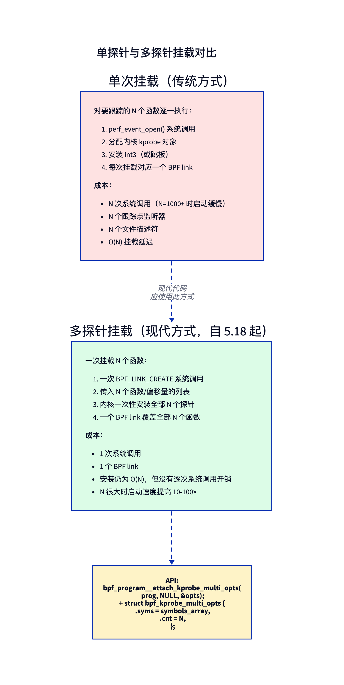
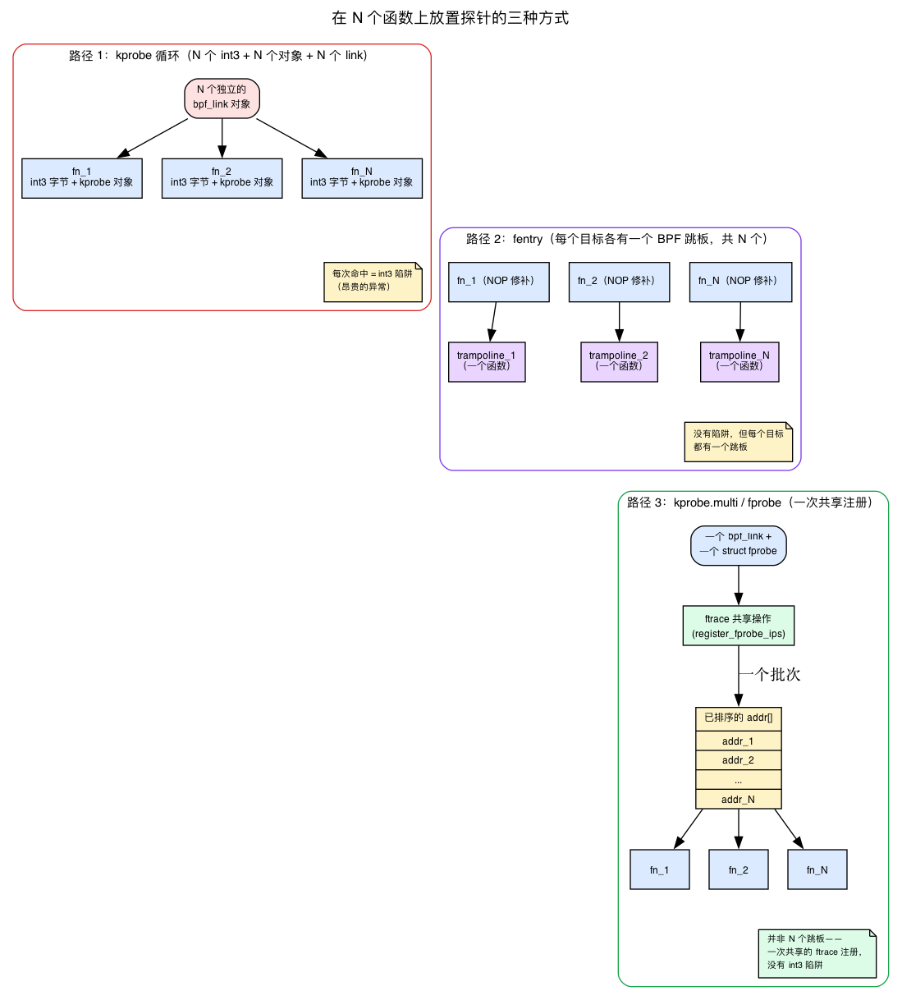
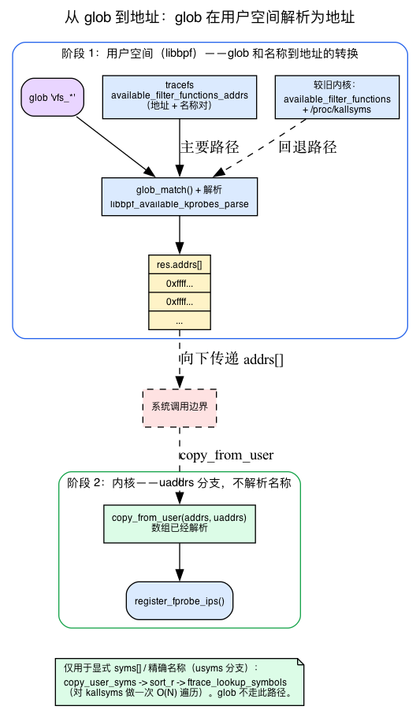
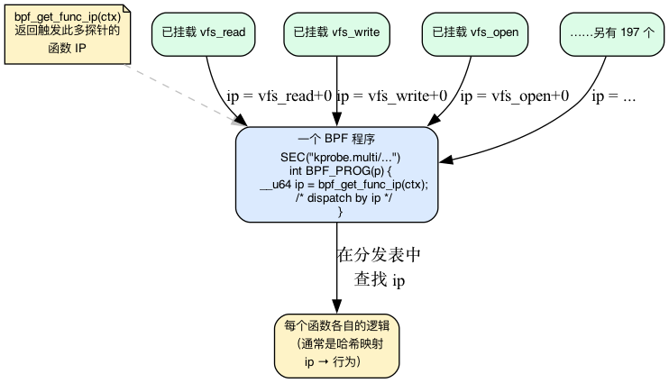
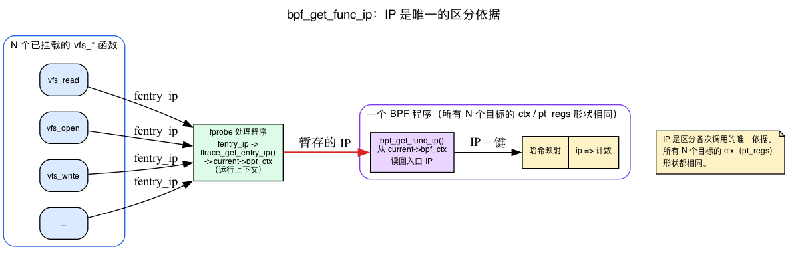
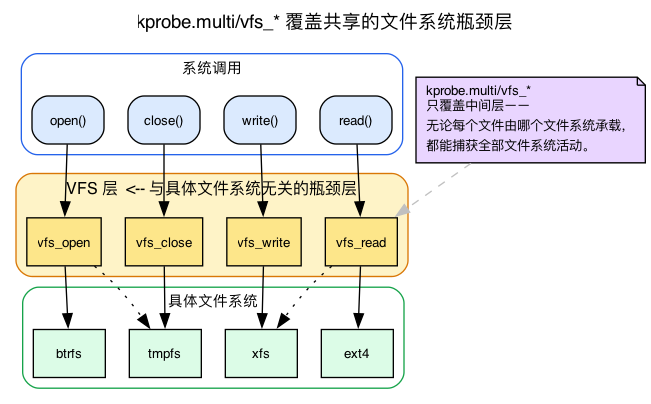

# 第11天 — 多探针：一次系统调用挂载到许多函数

> **今日任务：** 用一个 BPF 程序一次性挂载到*所有*文件系统系统调用（read、write、open、close、fsync……）上进行跟踪。在这个过程中，你会学到内核提供的第三种挂载机制——*fprobe*——它能以很低的成本批量挂载一千个函数；还会学到像 `vfs_*` 这样的通配符如何变成排好序的地址数组，以及一个程序如何区分自己的 N 个探针。总用时：约 95 分钟。

## 逐个挂载的问题

昨天的 uprobe 一次只能挂载一个函数。对少量探针来说这没问题。但如果你想跟踪*每一个*系统调用呢？VFS 层的每一个函数？每一个 TCP 入口点？

在旧模型下，你需要在用户空间循环：

```c
for (int i = 0; i < N; i++) {
    bpf_program__attach_kprobe(prog, false, names[i]);  /* one syscall each */
}
```

当 N=200 时，这就是 200 次 `perf_event_open` 系统调用、200 个内核 kprobe 对象、200 个 BPF 链接。启动要花几秒钟，内存随数量线性增长，卸载同样很慢。

**多探针（multi-probe）**（在内核 5.18 中加入，kprobe.multi 对应的提交是 `0dcac272540`）是现代化的解决方案。



一次系统调用、一个 BPF 链接，N 个探针在内核侧一次批量安装完成。

但“内核侧一次批量安装”这句话背后藏着大量工作，本章关于性能的整个故事都建立在*批量是如何安装并运行的*这一点上。第1天介绍了 fentry 的跳板路径，并将其与更老的 kprobe `int3` 陷阱做了对比；第6天又加入了 fexit。今天要介绍第三种挂载机制，它正是 kprobe.multi 所依赖的东西。在深入使用之前，我们先给它取个名字。

## “以 fprobe 为后盾”到底是什么意思

回忆一下第1天介绍的两种挂载机制（第6天又加入了 fexit）：

- **kprobe** 会把目标指令用 `int3` 软件断点覆盖。CPU 执行到这里时会*陷入*——这是一个相对昂贵的异常，会跳转到 kprobe 处理函数，最终调用你的 BPF 程序。一个函数对应一个断点。
- **fentry/fexit**（第1天和第6天）利用每个函数入口自带的 ftrace 5 字节 NOP 打桩位置，并通过一个**针对单个目标的 BPF 跳板**——一小段专门为*某一个*函数生成并接好线的代码——来路由。没有陷阱，执行流直接穿过去。单次调用的开销更低，但每个挂载目标都要有一个跳板。

kprobe.multi 建立在**第三种**东西之上，它同样基于 ftrace，叫做 **fprobe**。

**先建立直觉。** 想象你想在一千个函数上都下断点。kprobe 的做法是一千次独立的文本打补丁——一千个 `int3` 字节写入一千个调用点，一千个要跟踪的内核对象。fprobe 的做法则是一个客户端对 ftrace 说：*“这里有一个排好序的、包含一千个地址的数组；执行流到达其中任何一个地址时都通知我。”* ftrace 本身已经维护了一套把许多调用点复用到共享处理代码上的机制（`ftrace` 函数跟踪本身就是这么工作的）。一个 fprobe 就是这套机制的一个客户，一次性针对整个数组注册。

具体来说，一个 fprobe 就是一个很小的结构体：

```c
/* include/linux/fprobe.h:62 */
struct fprobe {
    unsigned long       nmissed;          /* counter for missed events */
    unsigned int        flags;
    size_t              entry_data_size;
    fprobe_entry_cb     entry_handler;    /* called on function entry */
    fprobe_exit_cb      exit_handler;     /* called on function return */
    struct fprobe_hlist *hlist_array;     /* hash of the IPs this fprobe covers */
};
```

一个 `struct fprobe`、一个 `entry_handler`、一个覆盖了它所管辖地址的 `hlist_array`。这就是为什么 N 个函数能在*一次*批量操作中安装完成，而不是 N 次独立的 `int3` 打补丁。



### fprobe 不是 fentry 的跳板

很容易想当然地以为 fprobe 复用了第1天描述的、针对单个目标的 BPF 跳板。事实并非如此，而这个区别很重要。fprobe 挂在 ftrace *共享*的 graph/ops 机制上。你可以在源码里看到这个分叉：

```c
/* kernel/trace/fprobe.c:982 — register_fprobe_ips() */
if (fprobe_is_ftrace(fp))
    ret = fprobe_ftrace_add_ips(addrs, num);
else
    ret = fprobe_graph_add_ips(addrs, num);
```

根据探针是否需要返回/退出处理函数，注册会被路由到 ftrace 的 `ftrace_ops` 路径或它的函数图（`fgraph`）路径。两者都不是针对单个函数的 BPF 跳板。诚实的一句话总结是：

> **fprobe 和 fentry 一样基于 ftrace——因此同样避开了 `int3` 陷阱——但它走的是 `ftrace_ops`/`fgraph`，而不是针对单个函数的 BPF 跳板。**

这个区别并没有削弱性能上的论点，反而让它更精确了。以下才是 kprobe.multi 在两个维度上都优于逐个 kprobe 循环的*真正*原因：

- **安装是针对一个排好序的地址数组的单次 ftrace 操作**，而不是 N 次独立的 `int3` 文本打补丁。内核只注册一个 fprobe，覆盖整个 `addrs[]` 数组（`register_fprobe_ips(&link->fp, addrs, cnt)`）。
- **运行时不存在 `int3` 陷阱。** 执行流直接到达共享的 ftrace 处理函数——这和第1天中 fentry 优于 kprobe 的原因完全一样。

### 上限，以及硬性要求

单次多重挂载是有上限的。内核定义了：

```c
/* kernel/trace/bpf_trace.c:44 */
#define MAX_KPROBE_MULTI_CNT (1U << 20)   /* ~1,048,576 */
```

并在 `bpf_kprobe_multi_link_attach` 中提前拒绝超出上限的请求：

```c
/* kernel/trace/bpf_trace.c — inside bpf_kprobe_multi_link_attach */
if (!cnt)
    return -EINVAL;
if (cnt > MAX_KPROBE_MULTI_CNT)
    return -E2BIG;
```

所以本章说的“1000 个函数”其实还有一个约 100 万地址的真实上限；超过这个数会得到 `-E2BIG`。（而零匹配会得到 `-EINVAL`——这一点先记住，破坏实验 4 会用到。）

最后，整个机制受一个配置选项控制。kprobe.multi 需要 `CONFIG_FPROBE=y`。没有它，整个挂载入口点会编译成一个桩函数：

```c
/* kernel/trace/bpf_trace.c:2890 — the #else /* !CONFIG_FPROBE */ branch */
int bpf_kprobe_multi_link_attach(const union bpf_attr *attr, struct bpf_prog *prog)
{
    return -EOPNOTSUPP;
}
```

这就是为什么没有 `CONFIG_FPROBE` 时，挂载会直接失败并返回 `-EOPNOTSUPP`，而不是悄悄退化成一个慢循环。（完整的前置条件检查见下面的“运行”一节。）

## 从通配符到地址：谁做了什么

`SEC("kprobe.multi/vfs_*")` 隐藏了一个很容易被误认为是单一步骤的两阶段流水线。真实的分工与直觉猜测的*恰好相反*：对于一个通配符，**用户空间（libbpf）同时完成通配符展开*和*名字到地址的解析；内核只是接收一个现成的地址数组并注册它。** 我们来分别看两侧。



**用户空间侧（libbpf）。** 第9天已经教过你 `/proc/kallsyms`：`kptr_restrict` 会为非 root 用户把地址清零，这个文件*不是*按地址排序的，你需要通过扫描找到最近的前驱条目来定位一个符号。（后面 `lookup_ksym` 的示意代码正是利用了这一点。）但对于 `SEC("kprobe.multi/glob")` 这种挂载方式，libbpf 可能根本不需要 `/proc/kallsyms`——这取决于 tracefs 暴露了什么。优先级如下：

```c
/* tools/lib/bpf/libbpf.c — inside bpf_program__attach_kprobe_multi_opts */
if (has_available_filter_functions_addrs())
    err = libbpf_available_kprobes_parse(&res);   /* modern: addr+name pairs */
else
    err = libbpf_available_kallsyms_parse(&res);   /* fallback: names + kallsyms */
```

在现代内核上，tracefs 会暴露 `available_filter_functions_addrs`——一个把每个可插桩函数列成“地址 + 名字”对的文件。`libbpf_available_kprobes_parse` 直接从这个文件里读取地址，对名字做通配符匹配，完全不会打开 `/proc/kallsyms`（本实验机上确实存在这个文件）。在缺少这个文件的旧内核上，libbpf 会退回到 `libbpf_available_kallsyms_parse`，它从 `available_filter_functions` 中对名字做通配符匹配，然后调用 `libbpf_kallsyms_parse`（会 `fopen` `/proc/kallsyms`）把这些名字转换成地址。无论走哪条路，结果都一样：**libbpf 在用户空间生成一个已经解析好的 `res.addrs` 数组。** 使用 `available_filter_functions`（而不是原始的 kallsyms）作为名字集合很重要：它已经排除了 `notrace` 和内联函数——这些你原本就不可能挂载上去——所以通配符不会返回一个注定失败的名字。

**内核侧。** libbpf 会设置 `lopts.kprobe_multi.addrs = addrs` 且 `syms = NULL`，于是内核走*地址*分支。它只验证两者恰好设置了一个，然后直接把数组拷贝进来，继续处理：

```c
/* kernel/trace/bpf_trace.c — inside bpf_kprobe_multi_link_attach */
if (!!uaddrs == !!usyms)
    return -EINVAL;            /* exactly one of addrs[] or syms[] */
...
if (uaddrs) {                  /* glob path: addresses already resolved */
    if (copy_from_user(addrs, uaddrs, size))
        return -EFAULT;
} else {                       /* explicit names path: resolve in-kernel */
    err = copy_user_syms(&us, usyms, cnt);
    sort_r(us.syms, cnt, ...);
    err = ftrace_lookup_symbols(us.syms, cnt, addrs);
}
```

对于一个通配符，内核根本看不到名字：它 `copy_from_user` 出地址数组，然后直接进入 `register_fprobe_ips`。内核内部的名字→地址解析（`copy_user_syms` → `sort_r` → `ftrace_lookup_symbols`）是*另一条*分支——只有当调用方传入显式的 `opts.syms[]` 列表，或者一个精确的（不含通配符的）单一名字时才会走这条路。本章“对 kallsyms 单次 O(N) 扫描”的故事，实际发生在这条路径上；见破坏实验 1。

**单次扫描的细节（仅限 `usyms` 分支）。** 很容易以为 `ftrace_lookup_symbols` 是 N 次独立的、log N 复杂度的 kallsyms 查找。实际上它是**单次 O(N) 扫描**：

```c
/* kernel/trace/ftrace.c:9262 — ftrace_lookup_symbols doc block */
/* ... kallsyms_on_each_symbol() with binary search into the sorted input
 * array.
 * Returns: 0 if all provided symbols are found, -ESRCH otherwise.
 */
```

内核只把 kallsyms 遍历*一次*（`kallsyms_on_each_symbol`），每遇到一个符号，就在你已经排好序的名字数组里做一次 `bsearch`。这就是为什么名字要先排序：这样单次扫描才能对它们做二分查找。是对 kallsyms 的一次扫过，而不是 N 次扫过。而且只要有一个名字解析不出来，整个挂载就会失败并返回 `-ESRCH`。同样，这只发生在显式名字这条路径上。

所以失败模式按路径不同而不同：

- **通配符，零匹配**（`vfs_xyz_nope*` 展开后什么都没有）：在**用户空间**就被捕获——`libbpf_available_kprobes_parse`/`libbpf_available_kallsyms_parse` 在 `res.cnt == 0` 时会返回 `-ENOENT`，根本不会走到系统调用这一步。内核的 `if (!cnt) return -EINVAL` 永远不会被触发（它只在调用方通过 opts API 显式传入 `cnt == 0` 时才会触发）。这就是破坏实验 4。
- **显式名字，其中一个解析不出来**：内核的 `ftrace_lookup_symbols` 返回 `-ESRCH`。只有 `usyms` 分支会遇到这种情况。

## 如何知道是哪个探针触发的

当 50 个函数都跑同一个 BPF 程序时，你需要一种方法来区分它们。`ctx`（保存的寄存器）对每个目标来说*形状相同*，无法用来区分——唯一不同的是*你正停在哪个函数的入口*。这正是 `bpf_get_func_ip(ctx)` 提供的信息，值得弄清楚这个 IP 到底从哪里来，因为它是本章全篇赖以分发的核心原语。



**IP 从哪里来。** 当一个目标触发时，fprobe 会用 `fentry_ip`——被插桩的调用点——去调用入口处理函数。kprobe.multi 的处理函数会把它转换成真正的函数*入口*地址，并存入本次调用的运行上下文中：

```c
/* kernel/trace/bpf_trace.c:2592 — kprobe_multi_link_handler */
err = kprobe_multi_link_prog_run(link, ftrace_get_entry_ip(fentry_ip),
                                 fregs, false, data);
```

```c
/* kernel/trace/bpf_trace.c:2319 — ftrace_get_entry_ip() */
unsigned long ip = ftrace_get_symaddr(fentry_ip);
return ip ? : fentry_ip;       /* resolved symbol address, or the call site */
```

所以当你的程序运行时，解析好的函数入口地址早已经在运行上下文中了。

**`bpf_get_func_ip` 并不只有一种辅助函数实现。** 验证器会根据你所使用的探针类型，换上一个针对该程序类型的具体实现。对 kprobe.multi 来说，它解析为 `bpf_get_func_ip_kprobe_multi`：

```c
/* kernel/trace/bpf_trace.c:1080 */
BPF_CALL_1(bpf_get_func_ip_kprobe_multi, struct pt_regs *, regs)
{
    return bpf_kprobe_multi_entry_ip(current->bpf_ctx);
}
```

它只是读取处理函数早已存入 `current->bpf_ctx` 的入口 IP。选择哪个实现的逻辑发生在验证器识别到 `is_kprobe_multi(prog)` 的时候：

```c
/* kernel/trace/bpf_trace.c:1327 */
case BPF_FUNC_get_func_ip:
    if (is_kprobe_multi(prog))
        return &bpf_get_func_ip_proto_kprobe_multi;
```

这就是为什么这个辅助函数的开销*很低*：它只读取一次上下文，而不在运行时查找符号。真正昂贵的地址解析工作，处理函数早已完成。



你通常会把返回的 IP 用作哈希映射的键：IP → 计数，或 IP → 行为。去掉 `bpf_get_func_ip`（破坏实验 3）之后，N 个探针中的每一个都会递增*同一个*计数器，因为程序里再没有其他东西能区分它们——归因信息就丢失了。

## 一个链接拥有全部 N 个挂载点

第1天介绍了 `bpf_link`（`BPF_LINK_CREATE` 把一个程序和一个挂载点连接起来）；第10天展示了探针会一直存活，直到你关闭该链接的文件描述符。这里没有新概念要教，只有一个新的点值得一句话说明。

*同一个链接对象*覆盖了全部 N 个函数：

```c
/* kernel/trace/bpf_trace.c:2291 */
struct bpf_kprobe_multi_link {
    struct bpf_link link;
    struct fprobe   fp;          /* the one fprobe covering all N */
    unsigned long  *addrs;       /* the N resolved addresses */
    u64            *cookies;
    u32             cnt;         /* N */
    ...
};
```

```c
/* kernel/trace/bpf_trace.c:2828 */
bpf_link_init(&link->link, BPF_LINK_TYPE_KPROBE_MULTI, ...);
```

一个 `struct bpf_kprobe_multi_link`，持有一个 `struct fprobe`、`addrs`/`cookies` 数组，以及计数值。**关闭它唯一的那个文件描述符就会卸载全部 N 个**——相比之下，逐个循环挂载会产生 N 个独立的链接。这就是“卸载是一次性操作”这个说法的具体体现。

## VFS 层是什么（以及为什么 `vfs_*` 是合适的通配符）

实验用的通配符是 `vfs_*`。第6天首次用 `vfs_read` 作为示例目标，第7天又用了一次，但一直没有哪一章说明 VFS *到底是什么*——你不应该只凭信任就接受“用 `vfs_*` 通配符就能捕获所有文件系统活动”这句话。

**虚拟文件系统（Virtual File System）是内核中与具体文件系统无关的一层。** 每一个 `read()`、`write()`、`open()`、`close()` 系统调用都会先经过一个 `vfs_*` 入口点——`vfs_read`（`fs/read_write.c:554`）、`vfs_write`（`fs/read_write.c:668`）、`vfs_open`（`fs/open.c:1074`）等等——然后内核才会分发到真正承载这个文件的具体文件系统驱动（ext4、xfs、btrfs……）。VFS 是共同的必经关卡；具体的文件系统位于它之下。



正是这一个事实*解释了*为什么用一个通配符挂钩 `vfs_*` 是正确的聚合点：无论文件位于哪个文件系统上，它都能在一个地方捕获所有文件系统活动。你不需要了解更多 VFS 内部细节——姊妹篇 *linux-net* 一书和一般的内核背景知识会讲得更深入；这里你只需要知道 `vfs_*` 是共享的文件系统入口点。

> ### 常见疑问
>
> **问：multi-kprobe 只是循环的语法糖吗？**
>
> 答：功能上类似，但运作方式很不一样。内核侧的安装路径是共享的（一个 fprobe 通过 ftrace 针对一个地址列表注册），BPF 链接是单一对象，运行时也没有 `int3` 陷阱。对 1000 个函数来说，multi-kprobe 大约 10 毫秒就能挂载完成；循环版本则要几秒钟。
>
> **问：多探针能用通配符模式吗？**
>
> 答：可以。libbpf 在 `attach_kprobe_multi_opts.syms` 中支持通配符模式。`tcp_*` 能匹配每一个 TCP 相关函数。libbpf 内部会读取 tracefs 的 `available_filter_functions_addrs`（在旧内核上则用 `available_filter_functions` 加 `/proc/kallsyms`），把通配符解析成*用户空间中的地址*，然后把一个现成的地址数组交给内核——内核只需 `copy_from_user` 并注册 fprobe。（内核内部的名字→地址解析只有在你传入显式的 `syms[]` 列表而不是通配符时才会运行。）
>
> **问：fentry 有多探针版本吗？**
>
> 答：没有——不存在 `fentry.multi`/`fexit.multi`。fentry/fexit 为每个挂载目标各建一个跳板，libbpf 和内核里都没有批量多重挂载的变体。如果你需要以较低的单次调用开销一次挂载许多函数，请用 `kprobe.multi`（它以 fprobe 为后盾，非常便宜），并通过 kprobe 的 ctx 读取返回值。
>
> **问：多重 uprobe 呢？**
>
> 答：有——在 6.6 中加入。`SEC("uprobe.multi/...")`。针对用户空间目标的思路是一样的。

## 实验

### `multi.bpf.c`

下面这段代码引用自实验构建和 CI 编译所用的文件：

{{#include ../labs/day11/multi.bpf.c:book}}

`SEC("kprobe.multi/vfs_*")`——`kprobe.multi/` 后面的部分是一个**通配符**。libbpf 会把它展开（如我们所见，是通过 tracefs 的 `available_filter_functions`）成大约 50 个以 `vfs_` 开头的函数名，内核把这些名字解析成地址，`bpf_get_func_ip(ctx)` 返回触发探针的那个函数的入口 IP——这就是哈希映射用来聚合的键。

### `multi.c` — 用户空间部分

```c
struct multi_bpf *skel = multi_bpf__open_and_load();
multi_bpf__attach(skel);

while (!exiting) {
    sleep(2);
    /* iterate hits map; resolve ip via /proc/kallsyms */
    int fd = bpf_map__fd(skel->maps.hits);
    __u64 key = 0, next, val;
    while (bpf_map_get_next_key(fd, &key, &next) == 0) {
        bpf_map_lookup_elem(fd, &next, &val);
        printf("%-30s %llu\n", lookup_ksym(next), val);
        key = next;
    }
}
```

`lookup_ksym(addr)` 是一个**示意函数，并非随书附带的代码**——它是一个只有几行的函数，需要你自己写，用来扫描 `/proc/kallsyms`，找到地址小于等于 `addr` 且最接近的符号：解析每一行 `addr type name`，保留地址 `<= addr` 中最大的那一条。（这正是第9天教过的“最近前驱符号”扫描方式——注意它读取的是 `/proc/kallsyms`，也就是*符号化*用的文件，而不是通配符用到的 `available_filter_functions` 文件。）不写这个函数程序就无法链接。如果想跳过编写符号化器，可以改用 `%llx` 打印原始 IP，再手动通过 `grep <hex> /proc/kallsyms` 逐个查找。注意 `/proc/kallsyms` 只对 root 暴露真实地址（否则 `kptr_restrict` 会把它们清零），所以要用 `sudo` 运行这个二进制文件。

### 运行

> **前置条件：** `kprobe.multi` 以 fprobe 为后盾，所以内核必须编译时带有 `CONFIG_FPROBE=y`（内核 >= 5.18），还需要 `CONFIG_DEBUG_INFO_BTF=y` 才能引入 `vmlinux.h`。可以用 `grep -E 'CONFIG_FPROBE|CONFIG_DEBUG_INFO_BTF' /boot/config-$(uname -r)`（或在 `/proc/config.gz` 上用 `zgrep`）检查。没有 `CONFIG_FPROBE` 的话，挂载会直接失败——正是上面看到的那个返回 `-EOPNOTSUPP` 的 `bpf_kprobe_multi_link_attach` 桩函数。

```bash
make
sudo ./multi &
# Generate work in another terminal:
find /etc -type f | xargs cat > /dev/null
```

预期输出（假设你已经按上面说明写好了 `lookup_ksym` 示意函数——否则左边一列会是原始的十六进制 IP）：

```
vfs_read       12453
vfs_open        2914
vfs_statx       1822
vfs_getattr_nosec  2914
...
```

行的顺序是**任意的**：用户空间的循环用 `bpf_map_get_next_key` 遍历映射，返回的键是按哈希顺序排列的，而不是按计数排名——所以你看到的行可能是打乱的（上面的计数也没有排序）。只有每个函数各自的计数才有意义；如果想按排名排序，可以通过 `sort -k2 -rn` 管道处理。

你在一次系统调用中挂载了约 50 个函数，全部监视，并按函数聚合——而不需要写 50 个独立的处理函数。

#### 用一行命令实现同样的效果

如果你不想搭建 C 语言的胶水代码（尤其是 `lookup_ksym` 符号化器），`bpftrace` 能让你用一个可以直接复制粘贴的程序体验同样的内容。`vfs_*` 通配符会被展开并通过 `kprobe.multi` 挂载——和 `multi.bpf.c` 中的 `SEC("kprobe.multi/vfs_*")` 走的是同一条路径——`func` 内建变量则扮演了 `bpf_get_func_ip` 的角色，告诉你是哪个 `vfs_*` 函数触发的：

```bash
# Terminal 1 — one program, many functions, attributed by func():
sudo bpftrace -e 'kprobe:vfs_* { @[func] = count(); } interval:s:5 { exit(); }'
# Terminal 2 — generate VFS load:
find /etc -type f | xargs cat > /dev/null
```

预期输出（每次运行计数都会不同；流量最高的 VFS 路径会占主导，且 `bpftrace` 打印 `@` 映射时是按值升序排列的）：

```
Attached 78 probes

@[vfs_write]: 524
@[vfs_fstatat]: 1744
@[vfs_statx]: 2823
@[vfs_open]: 4719
@[vfs_fstat]: 4897
@[vfs_getattr_nosec]: 7742
@[vfs_read]: 20960
```

`bpftrace` 通过 `func` 直接解析名字，所以这个版本完全绕开了 `lookup_ksym` 这段胶水代码。

---

## 依次尝试破坏

### 破坏实验 1 — 用具体列表代替通配符

```c
SEC("kprobe.multi")
int BPF_KPROBE(p) { ... }
```

在用户空间：

```c
LIBBPF_OPTS(bpf_kprobe_multi_opts, opts);
const char *syms[] = {"vfs_read", "vfs_write", "vfs_open"};
opts.syms = syms;
opts.cnt = 3;
bpf_program__attach_kprobe_multi_opts(skel->progs.p, NULL, &opts);
```

这样你就能精确控制要挂载哪些函数。适用于通配符会过度匹配的场景。（libbpf 仍然会把这些名字送入 `copy_user_syms` → `sort_r` → `ftrace_lookup_symbols`——内核侧的解析路径是同一条，你只是跳过了通配符展开这一步。）

### 破坏实验 2 — 混用偏移量

```c
const __u64 addrs[] = {0xffffffff812a4000, ...};
opts.addrs = addrs;     /* numeric addresses */
opts.cnt = N;
```

你也可以直接传入原始内核地址。当符号存在别名，或者你手头有来自其他来源（perf、自己解析的 kallsyms）的地址时，这很有用。使用 `opts.addrs` 时，内核会完全跳过名字解析——它只是把地址 `copy_from_user(addrs, uaddrs)` 到链接的数组中，然后直接进入 `register_fprobe_ips`。没有 `ftrace_lookup_symbols` 这一步。

### 破坏实验 3 — 忘记使用 `bpf_get_func_ip`

没有它，每个探针都只会递增同一个计数器——你会失去按函数区分的能力。运行之后你会发现自己无法判断到底调用的是哪个 `vfs_*`。原因正是分发那一节展示的内容：`ctx`（pt_regs）在所有 N 个目标上的形状都相同，因此入口 IP 是唯一能区分一次调用和另一次调用的东西。教训：**当一个程序服务于许多探针时，一定要识别来源**。

### 破坏实验 4 — 对不存在的函数做多重挂载

```c
SEC("kprobe.multi/this_function_does_not_exist*")
```

通配符展开后零匹配。libbpf 会以 `-ENOENT` 使挂载失败（内核那一侧本会以 `-EINVAL` 拒绝 `cnt == 0`；libbpf 把这个空解析结果表现为 `-ENOENT`）。这样很友好：如果零匹配还悄悄被接受，就会掩盖 bug。

---

## 内核代码阅读指引

- **`kernel/trace/bpf_trace.c`** — 搜索 `bpf_kprobe_multi_link_attach`。处理这种新链接类型的函数。
- **`kernel/bpf/syscall.c`** — 搜索 `BPF_TRACE_KPROBE_MULTI`。系统调用的分发逻辑。
- **`tools/lib/bpf/libbpf.c`** — 搜索 `bpf_program__attach_kprobe_multi_opts`。用户空间的 API。
- **`tools/testing/selftests/bpf/progs/kprobe_multi.c`** — 官方测试/示例代码。

---

## 要点回顾

- **多探针（Multi-probe）** 在一次系统调用中把一个 BPF 程序挂载到许多函数上（1000 个函数约 10 毫秒，而逐个挂载要花几秒）。
- 它**以 fprobe 为后盾**：通过 ftrace 针对一个排好序的 `addr[]` 数组注册一个 `struct fprobe`（`register_fprobe_ips`）。fprobe 和 fentry 一样基于 ftrace——所以没有 `int3` 陷阱——但它走的是 `ftrace_ops`/`fgraph`，**不是**针对单个函数的 BPF 跳板。安装便宜（一次 ftrace 操作，而不是 N 次文本打补丁），运行时也便宜（没有陷阱）。上限为 `MAX_KPROBE_MULTI_CNT = 1<<20`；需要 `CONFIG_FPROBE=y`，否则挂载返回 `-EOPNOTSUPP`。
- **通配符 → 地址，在用户空间解析。** 对于一个通配符，libbpf 同时完成展开*和*名字→地址的解析：它读取 tracefs 的 `available_filter_functions_addrs`（或旧内核上的 `available_filter_functions` + `/proc/kallsyms`），生成一个地址数组，内核只需 `copy_from_user` 并注册 fprobe——不做内核内部的名字解析。`sort_r` 排序名字加上 `ftrace_lookup_symbols` 对 kallsyms 做的**单次 O(N) 扫描**（对排好序的输入数组做 bsearch）只在传入显式 `syms[]` 列表或一个精确的、不含通配符的名字时才会运行。
- `SEC("kprobe.multi/glob")` 用于通配符挂载；也可以通过 `bpf_kprobe_multi_opts.syms` 传入显式列表，或通过 `.addrs` 传入原始地址（这样会跳过名字解析）。
- **`bpf_get_func_ip(ctx)`** 让程序知道是哪个函数触发的。它会根据程序类型选择具体的辅助函数实现（这里是 `bpf_get_func_ip_kprobe_multi`），只读取处理函数已经存入 `current->bpf_ctx` 的入口 IP，因此开销很低，也不需要在运行时查找符号。这个 IP 是*唯一*的区分依据；没有它，全部 N 个探针都会递增同一个计数器。
- **一个 `bpf_link`**（`struct bpf_kprobe_multi_link`，持有一个 `fp` 以及 `addrs`/`cookies`/`cnt`）拥有全部 N 个挂载点；关闭它的文件描述符就会卸载全部 N 个。
- **VFS** 是内核中与具体文件系统无关的一层；每一次 read/write/open/close 系统调用都会先经过一个 `vfs_*` 入口点，然后才分发到具体的文件系统——这正是为什么 `vfs_*` 是合适的一站式聚合通配符。
- 变体：`kprobe.multi`、`kretprobe.multi`、`uprobe.multi`（6.6+）。**没有** `fentry.multi`/`fexit.multi`。

---

## 自测题

你挂载了 `kprobe.multi/tcp_*`，却发现 `bpf_get_func_ip` 返回的一些 IP 和 `cat /proc/kallsyms | grep tcp_` 显示的对不上。这可能是什么原因造成的？

<details>
<summary>点击查看答案</summary>

**答案：** `bpf_get_func_ip` 返回的是解析好的函数**入口**地址——处理函数运行了 `ftrace_get_entry_ip(fentry_ip)`（也就是 `ftrace_get_symaddr(fentry_ip) ?: fentry_ip`），并把结果存入 `current->bpf_ctx`，辅助函数只是将它读出来。这个入口地址理应恰好等于 `/proc/kallsyms` 中某个符号的起始地址——但是：(a) KASLR 会在每次启动时让符号地址发生偏移，所以必须在跟踪时的同一次启动中做解析。(b) 有些函数存在别名——多个符号指向同一个 IP——所以这个 IP 可能匹配的是你 grep 到的名字之外的另一个名字。(c) 在较旧的内核上，`bpf_get_func_ip` 返回的是跳板的调用点，和符号地址相差几个字节。请在所有比较中始终使用 `bpf_get_func_ip`，不要把它和从 kallsyms 得到的地址混用。

</details>

---

## 明天

第12天：可睡眠 BPF 程序。你将了解一直在暗中限制程序的那项约束（不能使用可能触发缺页的辅助函数），以及如何放宽这一限制。
