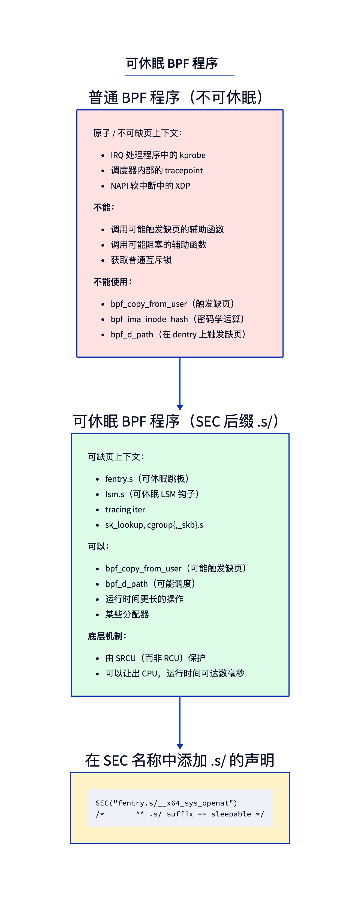
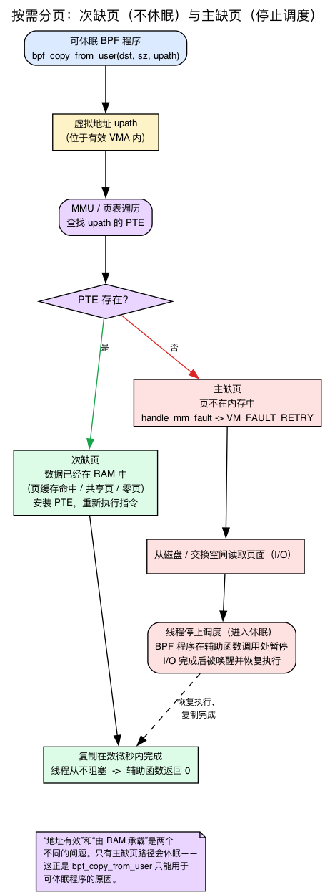
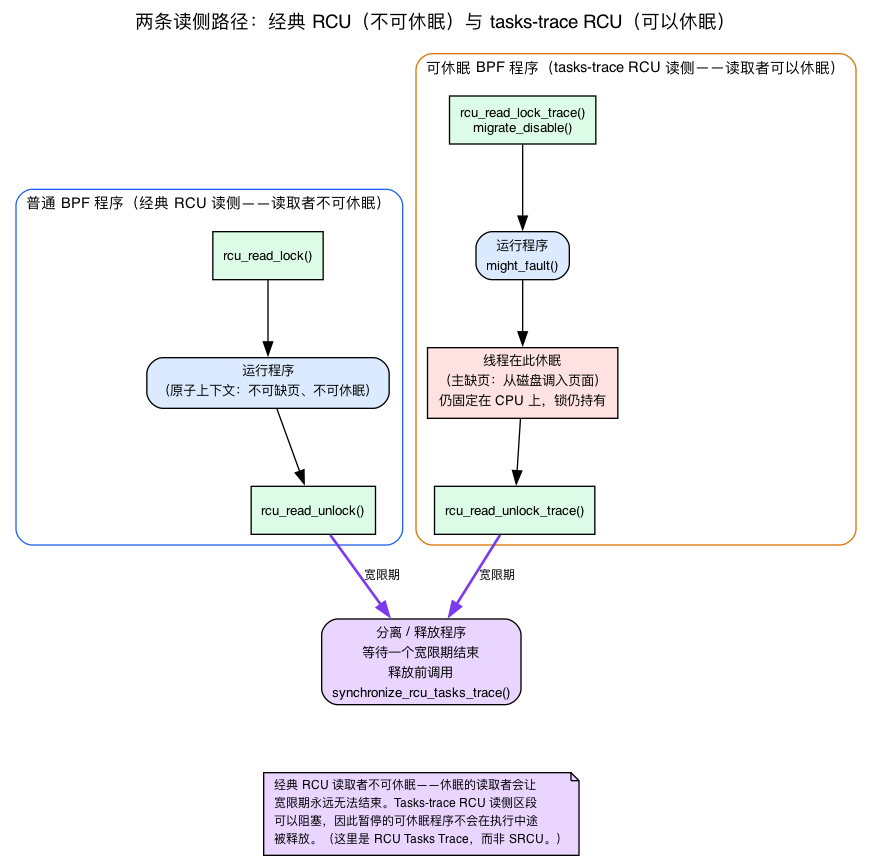

# 第12天 — 可睡眠 BPF：会发生缺页的程序

> **今日任务：** 跟踪 `openat`，并*从用户空间内存*中读取路径字符串——这是普通 BPF 程序完全做不到的事。在这个过程中，你会弄清缺页异常（page fault）究竟*是什么*（包括按需分页，以及次要缺页与主要缺页的区别）、内核代码“睡眠”意味着什么、哪些上下文禁止或允许睡眠，以及保护可睡眠程序的真正同步机制（**不是** SRCU——内核已经发生变化，许多文档都已过时）。总用时：约 100 分钟。

## 你一直生活在其中的约束

到目前为止，你写的每一个 BPF 程序都运行在**原子上下文（atomic context）**中。内核不能在程序执行中途将当前任务从 CPU 上换出；BPF 程序必须从头到尾连续运行，不能主动让出 CPU。正因如此，BPF 的运行开销才如此之低（没有上下文切换，也不发生调度），其他所有保证也都以此为前提。

你在之前的章节里已经见识过这个约束带来的*后果*，只是当时没有点破根本原因。第2天中，哈希映射的桶锁之所以必须是**raw** 自旋锁，正是“因为 BPF 程序运行在原子上下文中，无法获取会睡眠的锁”。第5天中，验证器坚持要求你的程序在有界时间内**终止**，正是因为它运行在可能关闭抢占和中断的地方。今天我们终于要把这个约束翻过来看个究竟——然后解除它。

原子上下文的一个直接推论是：任何*可能发生缺页*的辅助函数都被禁止使用。访问一个未映射的用户空间页面需要解决缺页问题——这可能需要把线程调度走，而原子上下文做不到这一点。

被列入禁止名单的辅助函数有：`bpf_copy_from_user`（以及它面向 task 的变体 `bpf_copy_from_user_task`）。在可睡眠 BPF 出现之前，答案就是“BPF 做不到这件事”。

**可睡眠 BPF 程序（Sleepable BPF programs）**解除了这个限制。



## 首先，内核中的“睡眠”到底是什么意思？

今天，“睡眠”是一个至关重要的概念，但它*并不*表示“等待定时器”或“延迟”。在内核术语中，**睡眠就是主动阻塞**：当前线程进入等待队列，调度器选择另一个可运行的任务并切换过去；等到原线程所等待的条件满足后，再恢复其执行。CPU 并*没有*空转，而是在这段时间执行其他有用的工作。

内核甚至内置了一个“这个函数可能阻塞”的注解：

```c
/* include/linux/kernel.h:79 — might_sleep() is an annotation, not an action */
/* might_sleep - annotation for functions that can sleep */
# define might_sleep() \
    do { __might_sleep(__FILE__, __LINE__); might_resched(); } while (0)
```

`might_sleep()`（`include/linux/kernel.h:90`，其中 `__might_sleep` 声明在 `:74`）是一个调试用的绊线：把它放进某个函数里，一旦这个函数在不允许睡眠的上下文中被调用，内核就会大声报警。先记住这一点——我们马上就会看到可睡眠 BPF 的跳板（trampoline）调用它那位会缺页的表亲 `might_fault()`。

### 可缺页上下文 vs 不可缺页上下文

那么为什么不是*所有*内核代码路径都能睡眠？因为在某些上下文中**没有可以安全阻塞的任务**，阻塞会导致死锁或者让 CPU 停摆：

- **中断处理程序和软中断（softirq）。** 软中断——像 XDP 这样的数据包处理程序类型所运行的延迟中断上下文——**不是一个可调度的实体**。调度器没有“线程”可以挂起再恢复——所以它不能睡眠。这正是 XDP 永远不能被做成可睡眠的原因。
- **持有自旋锁的代码**，或者**显式关闭了抢占的代码**。在这里睡眠要么会死锁（另一个 CPU 永远在你持有的锁上空转），要么会让 CPU 搁浅。

这些都是**不可缺页 / 原子**上下文。到目前为止你挂载过的一切——kprobe、XDP、tc、raw tracepoint——都生活在这里。

- **允许抢占的普通进程/线程上下文**是**可缺页的**。系统调用入口、大多数 LSM 钩子（Linux 安全模块回调）、BPF 迭代器都在这里。在这里，*当前线程*是一个真实的可调度任务：它可以被换出并恢复。因此主要缺页——或者任何可能睡眠的辅助函数——都是安全的。

后面这一类，恰好就是可以被做成可睡眠的挂载点集合。记住这幅简单的图景：**可睡眠 = 可缺页 = “这里有一个真实的线程，我们可以安全地让它睡眠，之后再唤醒它。”**

> 值得一句话说清楚的细节：即使是*可睡眠*的 BPF 程序，也运行在 `migrate_disable()` 之下，而不是完全的抢占状态——所以它可以睡眠，但仍然固定在它启动时所在的 CPU 上（这样每 CPU 映射的访问仍然是正确的）。你会在下面的跳板代码里看到这一点。

## “可睡眠”实际意味着什么

程序被允许出现在内核可以把当前线程调度走的上下文中。这意味着：
- 它运行在一条可缺页的代码路径上（通常是系统调用入口、LSM 钩子或者迭代器）。
- 它可以调用可能发生缺页的辅助函数。
- 它可以花更长的时间（微秒级——或者在真正发生缺页时是毫秒级——而不是纳秒级）而不破坏时序假设。
- 它由一种不同的 RCU 变体保护——**RCU Tasks Trace**——它允许读者（reader）睡眠。（旧的文章把它称为 SRCU。对于现代内核来说这是错的；我们下面会把它讲清楚。）

你通过在 SEC 名称后加 `.s/` 后缀来选择启用：

```c
SEC("fentry.s/__x64_sys_openat")    /* sleepable fentry */
SEC("lsm.s/file_open")               /* sleepable LSM hook */
SEC("iter.s/task")                   /* sleepable iterator */
```

验证器会追踪每个程序的可睡眠属性。可睡眠程序能访问更大的辅助函数集合；一个非可睡眠程序如果调用了仅限可睡眠使用的辅助函数，就会被拒绝。

## 缺页异常到底是什么

在讨论*为什么* `bpf_copy_from_user` 可能睡眠之前，你需要知道缺页异常是什么，以及为什么一个完全合法的指针会指向一块并不存在的内存。这是本章赖以建立的核心概念，我们会从头搭建起来。

### 按需分页：一个背后没有物理页面的有效指针

当一个进程分配内存时——通过 `malloc`、不断增长的栈或新 `mmap` 出来的区域——内核会记录一个 **VMA**（虚拟内存区域）：“地址 `X` 到 `Y` 合法地属于你。”但它**不会**立刻为其中的每个地址分配物理内存。那样太浪费了——大多数程序只会用到它们预留空间中的一小部分。相反，内核会等到程序*真正触碰*某个地址，才为它找一个物理页面。这种懒惰的做法叫做**按需分页（demand paging）**。

这样带来的后果，是每个人第一次遇到时都会感到惊讶的事情：一个指针可以是**有效的**——它落在一个已映射的 VMA 内，内核也认可你有权读取它——但它*现在*背后**没有常驻的物理页面**。“地址有效”和“地址有 RAM 支撑”是两个不同的问题。

硬件是如何分辨这两者的？通过**页表**。CPU 的 MMU 通过遍历页表项（PTE）把每个虚拟地址翻译成物理地址。如果某个地址对应的 PTE 标记为**“不存在（not present）”**，MMU 就无法完成翻译，于是触发一次**缺页异常（page fault）**——一次陷入内核缺页处理程序的 CPU 陷阱（trap）。

### 处理程序的判断，以及次要缺页与主要缺页

缺页处理程序的第一项工作是判断：这是对某个真实 VMA 的*合法*访问，还是一个 bug？

- **非法**（该地址不在任何 VMA 内——一个野指针）：发出 **SIGSEGV**。这就是你熟悉的段错误。
- **合法**（在某个 VMA 内，只是还没有实际支撑）：**修复它**——分配一个页面、清零、写时复制，或者从磁盘/交换区读回来——然后安装 PTE，让触发缺页的指令重新执行一次，就好像什么都没发生过。

当访问是合法的时候，这里存在两种非常不同的代价，而这个区别正是可睡眠 BPF 存在的全部理由：

- **次要缺页（minor fault）**——数据*已经在 RAM 中*了；内核只需要安装一个指向它的 PTE。这发生在共享页面、共享的零页，或者页面缓存命中（文件的字节已经被缓存）的情况下。**很快，线程也不会阻塞。**
- **主要缺页（major fault）**——页面必须**从磁盘或交换区取回**。这是 I/O，在 CPU 的时间尺度上基本相当于永远。触发缺页的线程会被**换出（放去睡眠）**，直到 I/O 完成，然后被唤醒并恢复。**这正是需要可睡眠上下文的情形。**



在 x86 上，用户空间的缺页入口是 `do_user_addr_fault`（`arch/x86/mm/fault.c:1207`）。读它里面的两行代码，次要/主要的分界就跳出来了：`if (fault & VM_FAULT_MAJOR)`（`fault.c:1343`）是磁盘/交换区分支，`if (unlikely(fault & VM_FAULT_RETRY))`（`fault.c:1408`）是“我们不得不放弃 mmap 锁，可能会阻塞”的分支。两者都会经过核心解析函数 `handle_mm_fault`（`mm/memory.c:6699`）。`VM_FAULT_RETRY`——“我们不得不放弃锁、可能阻塞”的信号——由更底层的缺页辅助函数返回，比如 `vmf_can_call_fault`（`mm/memory.c:3800`）和 `__vmf_anon_prepare`（`mm/memory.c:3827`），并通过 `handle_mm_fault` 向外传播。

### 把它和辅助函数联系起来

这就是为什么这一切对我们重要。`bpf_copy_from_user` 在底层其实就是一个普通的 `copy_from_user`：

```c
/* kernel/bpf/helpers.c:659 — bpf_copy_from_user body */
int ret = copy_from_user(dst, user_ptr, size);
if (unlikely(ret)) {
    memset(dst, 0, size);   /* on failure, zero the dst... */
    ret = -EFAULT;          /* ...and report EFAULT */
}
```

`copy_from_user` 会触碰用户地址——如果该页面不存在，它就会走上面那条完全一样的 `do_user_addr_fault → handle_mm_fault` 机制。如果这是一次次要缺页，拷贝在微秒级内完成，没有人睡眠。如果这是一次主要缺页，线程会阻塞，直到页面被读入为止。非可睡眠程序**绝不允许靠近第二条路径**，这正是这个辅助函数被限制使用的原因。这个辅助函数甚至向验证器主动声明了这个风险：

```c
/* kernel/bpf/helpers.c:675 — the per-helper flag the Verifier checks */
.might_sleep = true,
```

## 为什么可睡眠程序可以安全地被卸载：RCU Tasks Trace（不是 SRCU）

还有最后一块拼图。如果一个可睡眠 BPF 程序可能在一次主要缺页的过程中挂起数毫秒，当你把它卸载（detach）时，内核如何安全地**释放**这个程序？它必须保证没有任何一次调用还在执行中，才能回收该程序的内存——否则就是在释放一段还在执行中的代码。

你已经从 **第2天的 RCU 小节**中知道了这个答案的形状：读者（reader）运行在一个*读侧临界区（read-side critical section）*内，写者（writer）等待一个*宽限期（grace period）*（直到所有正在进行中的读者都结束），而释放动作会被*推迟*，这样内存就不会在读者眼皮底下消失。这里的想法完全一样——只是 RCU 的*变体*不同，因为经典 RCU 的读者是**不允许睡眠**的（睡眠中的读者会无限延长宽限期，使写者一直得不到执行机会）。可睡眠 BPF 程序显然*可以*睡眠，所以经典 RCU 行不通。

专为这种情况设计的变体是 **RCU Tasks Trace**（也叫 tasks-trace RCU）。它的读侧临界区*允许阻塞*；写侧宽限期则会等待，直到每个 CPU 都经过一个没有活动 tasks-trace 读者的时刻。



你可以在跳板（trampoline）代码里亲眼看到这一点。运行可睡眠程序的包装函数**没有**去获取 SRCU 锁——它获取的是 tasks-trace 读锁，并关闭迁移（这样即使它可能发生缺页，也依然固定在 CPU 上）：

```c
/* kernel/bpf/trampoline.c:1250 — __bpf_prog_enter_sleepable() */
rcu_read_lock_trace();
migrate_disable();
might_fault();          /* "I might take a fault / sleep here" */
```

具备递归感知能力的一对函数 `__bpf_prog_enter_sleepable_recur` / `__bpf_prog_exit_sleepable_recur`（`trampoline.c:1221`–`:1247`）以同样的方式用 `rcu_read_lock_trace()` / `rcu_read_unlock_trace()` 把程序括起来。内核在一段注释中明确点出了这种对比——可睡眠程序使用 trace RCU，普通程序使用经典 RCU：

```c
/* kernel/bpf/trampoline.c:518 */
/* rcu_read_lock_trace to protect sleepable bpf progs
 * rcu_read_lock to protect normal bpf progs
 */
```

在卸载时，内核会先等过一个 tasks-trace 宽限期再释放——调用的是 `synchronize_rcu_tasks_trace()`，这个名字在 syscall 一侧的注释中被明确点出（`kernel/bpf/syscall.c:157`：“对于可睡眠 BPF 程序，应该使用 `synchronize_rcu_tasks_trace()` 来等待这些程序执行完成”），fentry 跳板镜像会在经过一次 tasks-trace 宽限期后被释放，这是通过 `call_rcu_tasks_trace`（`kernel/bpf/trampoline.c:562`）完成的，随后它再串联 `call_rcu_tasks` 来排空跳板汇编代码和普通程序。所以你原本预期的那种直觉——“在释放之前等一个宽限期，确保没有正在执行中的调用”——完全正确。唯一不同的只是 RCU 的*变体名字*：它是 **RCU Tasks Trace**，不是 SRCU。

> ### 常见疑问
>
> **问：为什么不是每个 BPF 程序默认都是可睡眠的？**
>
> 答：成本和覆盖范围。非可睡眠程序使用廉价的经典 RCU（进入/退出大约几纳秒），可以挂载到*任何*上下文，包括中断处理程序和软中断。可睡眠程序使用 RCU Tasks Trace（成本更高），并且只能挂载到可缺页的上下文（基本上是系统调用入口、LSM 钩子、某些跳板）。大多数追踪器并不需要缺页，所以非可睡眠才是正确的默认选项。
>
> **问：我能把我的 XDP 程序做成可睡眠的吗？**
>
> 答：不能。XDP 运行在软中断上下文中——按设计这是一个不可缺页的上下文（软中断不是一个可调度的线程，所以根本没有东西可以拿去睡眠）。没有 `SEC("xdp.s/...")` 这种写法。如果你需要针对某个数据包做一些会缺页的操作，把元数据发送到用户空间，在那边完成这项工作。
>
> **问：我的 fentry 程序需要读取一个用户空间字符串。不用可睡眠的话，我有什么选择？**
>
> 答：改用 `bpf_probe_read_user_str`——它不会因为页面缺失而发生缺页，只会返回 `-EFAULT`。当页面恰好在内存中时你就能拿到数据，不在时就悄悄地拿不到。对于大多数可观测性场景来说这是可以接受的。对于正确性至关重要的读取，才使用可睡眠。

## 实验

### `openat_path.bpf.c`

生产者和消费者通过同一个头文件共享事件布局：

{{#include ../labs/day12/openat_path.h}}

可睡眠程序直接引入实验构建和 CI 所编译的源码（`__user` 在 BPF 目标上被定义为空——它是一个
sparse 注解，vmlinux.h 里没有携带）：

{{#include ../labs/day12/openat_path.bpf.c:book}}

### 为什么系统调用钩子只接受一个 `struct pt_regs *`

这里有个值得停下来说说的坑。**第7天** 中你学到，`fentry` 程序挂载在一个普通内核函数上时，会以**带类型的内核对象**形式拿到函数的参数——`BPF_PROG(on_x, struct file *f, int flags)` 之所以能直接用，是因为 BTF 签名就是这么说的。你也在那一天认识了 `pt_regs`，它是（为 kprobe 准备的）*保存下来的寄存器快照*，并且看到每种程序类型都有自己的 ctx 布局。那么为什么对 `__x64_sys_openat` 来说，我们突然又回到了一个裸的 `struct pt_regs *` 和 `PARM2` 宏，而不是带类型的参数？

因为现代 x86-64 系统调用并不具有你以为的那种签名。`SYSCALL_DEFINE4(openat, ...)`（在 `fs/open.c:1381` 得到确认，其中第 2 个逻辑参数 `filename` 确实是 `const char __user *`）会展开成一个薄薄的包装函数：

```c
long __x64_sys_openat(const struct pt_regs *regs);
```

这个包装函数的工作是从保存下来的寄存器帧中把各个系统调用参数取出来，再交给真正干活的函数（`__do_sys_openat`）。所以在 `fentry` 挂载点，`__x64_sys_openat` 的 BTF 签名确实**只有一个参数：一个 `struct pt_regs *`**——*不是*四个逻辑上的 `openat` 参数。你没法写 `BPF_PROG(on_openat, int dfd, const char *path, ...)`；类型信息根本不存在。你只能拿到 `regs`，自己去解码它。

`PT_REGS_PARM2_CORE_SYSCALL(regs)` 就是这种包装函数约定下“第 2 个系统调用参数”的访问器。`_CORE_` 变体是感知 CO-RE 的——它通过 `BPF_CORE_READ` 读取正确的寄存器字段，因此能在不同内核和架构间正确地重定位（`tools/lib/bpf/bpf_tracing.h:545`；纯粹直接读字段的 `PT_REGS_PARM2_SYSCALL` 在 `:544`）。`openat(dfd, path, flags, mode)` → `PARM2` 就是 `path`。在其他架构上，包装函数的前缀会变（`__arm64_sys_openat`），这正是你想使用 CO-RE 形式的原因。

### 回到程序——新出现的部分

- **`SEC("fentry.s/__x64_sys_openat")`** —— `.s/` 让它变成可睡眠的。
- **`__x64_sys_openat`** 是内核在 x86-64 上的系统调用入口。正如刚才解释的那样，它只接收一个 `struct pt_regs *`（包装函数从陷阱帧中解包出逻辑参数）。在其他架构上前缀不同（`__arm64_sys_openat`）。
- **`PT_REGS_PARM2_CORE_SYSCALL(regs)`** —— 这个感知 CO-RE 的宏，可以跨架构读取第二个系统调用参数。路径字符串是 `openat(dirfd, path, flags, mode)` 的第二个参数（在 dirfd 之后）。
- **`bpf_copy_from_user`** —— 可能发生缺页的辅助函数。成功时返回 0，失败时返回负的 errno。**只能从可睡眠程序中调用**——如果从非可睡眠程序中尝试调用，验证器会以 `sleepable helper bpf_copy_from_user#148 in <context>` 拒绝，其中 `<context>` 是它找到的那个非可睡眠上下文的名字。（Func id 148 是在 UAPI 中固定的：`include/uapi/linux/bpf.h:6053` 处的 `FN(copy_from_user, 148, ...)`。）

### `openat_path.c` —— 用户空间部分

沿用了第01天的环形缓冲区消费者骨架（`handle` 回调加上 `main` 中的 `ring_buffer__poll` 循环）。只有打印那一行发生了变化：它从事件中取出 `pid`、`comm` 和 `path`，让输出和下面运行小节中的一致：

```c
static int handle(void *ctx, void *data, size_t sz) {
    struct event *e = data;
    printf("PID %u (%s) opened %s\n", e->pid, e->comm, e->path);
    return 0;
}
```

### 运行

```bash
make
sudo ./openat_path &
# In another terminal:
ls /etc
cat /etc/passwd
```

预期输出：

```
PID 4001 (ls) opened /etc
PID 4002 (cat) opened /etc/passwd
```

你从内核里读取了用户空间内存，如果页面不常驻还可能发生缺页，但整个过程都不会崩溃。

一个诚实的提醒：在一台普通的机器上，调用者刚刚构造出来的那个路径字符串已经是常驻页面了（系统调用的调用者刚刚写入了这些字节——最坏情况下也只是一次有保证的次要缺页，通常根本不会发生缺页），所以每一次 `bpf_copy_from_user` 都会返回 0，而**这里实际上不会发生任何睡眠**。可睡眠性给你带来的好处是这样一种保证：*如果*页面缺失——也就是按需分页那一节说的主要缺页情形——这个辅助函数就能安全地睡眠并把它调入内存，而非可睡眠程序则根本无法调用这个辅助函数。要真正观察到缺页路径，你需要在系统调用之前把那个页面驱逐出去（比如对缓冲区调用 `madvise(MADV_DONTNEED)`）。如果你想确认成功还是 `-EFAULT`，可以让消费者把 `ret` 打印出来。

---

## 按顺序破坏它

### 破坏 1 —— 去掉 `.s/` 后缀

```c
SEC("fentry/__x64_sys_openat")
```

验证器拒绝：

```
sleepable helper bpf_copy_from_user#148 in <context>
```

（`<context>` 会填入验证器找到的非可睡眠上下文——比如程序类型或挂载点。）这正是 `kernel/bpf/verifier.c:10331` 处那句准确的 `verbose(env, "sleepable helper %s#%d in %s\n", ...)` 字符串，由 `:10330` 处的 `if (fn->might_sleep && !in_sleepable_context(env))` 检查发出。教训：`.s/` 才是解锁可睡眠辅助函数的关键。没有它，这次调用在验证阶段就会被禁止。

### 破坏 2 —— 在 XDP 程序中尝试 `bpf_copy_from_user`

```c
SEC("xdp")
int xdp_prog(struct xdp_md *ctx) {
    char buf[16];
    bpf_copy_from_user(buf, sizeof(buf), (void *)0x12345678);
    return XDP_PASS;
}
```

同样被拒绝——辅助函数不被允许。XDP 无法被做成可睡眠的；它运行在软中断上下文中，而（正如我们前面确认过的）这不是一个可调度的线程，因此根本上是不可缺页的。

### 破坏 3 —— 向环形缓冲区写入大量数据

一个挂在 `__x64_sys_openat` 上的可睡眠 fentry 程序会在每次 `open()` 时触发。在一台繁忙的机器上，每秒会有成千上万次。在高负载工作场景下运行（`find /usr | xargs cat > /dev/null`），消费者会跟不上——一些记录会被丢弃。

但你没法用最显而易见的命令*看到*这些丢弃。环形缓冲区是一个流，不是一个键/值存储——它没有遍历方式，也没有内置的每映射丢弃计数器——所以 `bpftool map dump` 根本没法把它导出来：

```bash
sudo bpftool map dump name rb
```

它只会打印一行没用的 `Found 0 elements`，并且**以非零状态退出**（在 bpftool v7.7.0 上是退出码 244；有些构建则完全不产生任何输出——无论哪种情况，你都得不到关于丢弃的任何信息）。真正的丢弃可见性需要你自己添加一个显式计数器：在一个单独的 `BPF_MAP_TYPE_ARRAY` 里放一个 `__u64`，每当 `bpf_ringbuf_reserve()` 返回 NULL 时就递增它，然后用 `bpftool map dump name <counter_map>` 读取它。你会在第13天里正好搭建出这样一套东西。

### 破坏 4 —— 改用 `bpf_probe_read_user_str`

```c
bpf_probe_read_user_str(e->path, sizeof(e->path), upath);
```

这在*非可睡眠*程序中同样有效。它不会发生缺页——如果页面不常驻，它会返回 `-EFAULT`。对于追踪场景来说，这种悄悄的漏掉通常是可以接受的；你用少量丢失的事件换来了不需要可睡眠这一整套配套设施。

那什么时候真的需要可睡眠呢？当丢事件是不可接受的时候（安全策略、审计日志），或者当你需要一个*只*以可睡眠形式存在的辅助函数时（`bpf_copy_from_user`、`bpf_copy_from_user_task`）。

有一个辅助函数值得和上面这些区分开来：`bpf_d_path`（把一个 `struct path` 解析成字符串）。它*不是*仅限可睡眠使用的——它的 proto 里没有携带 `.might_sleep` 标志。相反，它*纯粹*由一个**BTF 白名单**来限制：`.allowed` 回调（`kernel/trace/bpf_trace.c:947` 处的 `bpf_d_path_allowed`，接在 `bpf_d_path_proto` 的 `.allowed` 字段上，`:970`）只允许你挂载到固定集合中的某个函数上时才能使用（`security_file_open`、`vfs_getattr`、`filp_close`、`dentry_open`、……，都在 `btf_allowlist_d_path` 集合中），或者从一个 BPF 迭代器中使用。所以如果 `bpf_d_path` 被拒绝了，解决办法不是 `.s/`——而是改成挂载到一个在白名单里的函数上。

把它和 `bpf_ima_inode_hash` / `bpf_ima_file_hash` 对比一下，后者同时被**两种**机制限制：它们的 proto 携带了 `.might_sleep = true`（`kernel/bpf/bpf_lsm.c:181` 和 `:200`）**并且**有一个 `.allowed` 白名单回调（`bpf_ima_inode_hash_allowed`，`:187`）。所以它们既需要一个*可睡眠*程序（会被同一个拒绝 `bpf_copy_from_user` 的 `.might_sleep` 关卡拒绝），*又*需要挂载到一个在白名单里的目标上。只有 `bpf_d_path` 才是那个干净利落的“仅白名单、非可睡眠”的例子。

---

## 该在内核里读什么

- **`kernel/bpf/trampoline.c`** —— 搜索 `__bpf_prog_enter_sleepable`（`:1250`）。这个包装函数会获取**tasks-trace RCU** 读侧锁（`rcu_read_lock_trace()`）、执行 `migrate_disable()`，并在调用可睡眠程序前后调用 `might_fault()`。`:518` 处的注释明确阐述了 trace RCU 与经典 RCU 的对比。
- **`kernel/bpf/verifier.c`** —— 搜索 `in_sleepable_context`（`:10253`）。看验证器是如何判断一个程序可以调用哪些辅助函数的；`.might_sleep` 这道关卡在 `:10330`。
- **`kernel/bpf/helpers.c`** —— `bpf_copy_from_user` 的函数体（`:659`）以及它的 `.might_sleep = true` proto 标志（`:675`）。
- **`Documentation/RCU/Design/Requirements/Requirements.rst`** 以及 **Tasks RCU** 相关材料——相关的设计说明在 **Tasks-Trace RCU** 相关小节（承载核心逻辑的代码是 `trampoline.c` 中的 `__bpf_prog_enter_sleepable`）。忽略那些“SRCU 保护可睡眠 BPF”的老旧说法；那已经过时了。
- **`tools/testing/selftests/bpf/progs/lsm.c`** —— 可睡眠 LSM 的示例（参见 `:111` 处的 `SEC("lsm.s/bprm_committed_creds")`）。
- **`include/linux/bpf.h`** —— 搜索 `struct bpf_prog`，找到 `sleepable:1` 标志位（`:1794`）。

---

## 要点回顾

- **缺页异常**是当 MMU 发现一个“不存在”的 PTE 时所触发的 CPU 陷阱。用户空间内存是**按需分页**的：一个指针可以是*有效的*（在某个 VMA 内）却没有常驻页面。处理程序要么处理**次要缺页**（页面已经在 RAM 中 → 安装 PTE，不睡眠），要么处理**主要缺页**（从磁盘/交换区读取 → 线程被换出）。主要缺页正是可睡眠 BPF 存在的理由。
- **内核中的“睡眠” = 阻塞/换出**，不是延迟。它在**不可缺页/原子**上下文中（中断、软中断/XDP、持有自旋锁、关闭抢占）被禁止；在**可缺页**上下文中（系统调用入口、大多数 LSM 钩子、迭代器）被允许。
- **可睡眠 BPF 程序**可以运行在可缺页上下文中，并调用会发生缺页或调度的辅助函数。通过 **`.s/` 后缀**（`SEC("fentry.s/...")`、`SEC("lsm.s/...")`）来选择启用。
- 可睡眠程序可以使用标记了 `.might_sleep` 的辅助函数：`bpf_copy_from_user` / `bpf_copy_from_user_task`（以及 IMA 哈希函数 `bpf_ima_inode_hash` / `bpf_ima_file_hash`，它们*额外*要求一个挂载目标白名单）。（`bpf_d_path` 不是仅限可睡眠使用的——它纯粹由挂载目标的 BTF 白名单限制，没有 `.might_sleep` 标志。）
- **成本与保护：** 可睡眠程序运行在 **RCU Tasks Trace** 读侧（`rcu_read_lock_trace`）加上 `migrate_disable()` 之下——比经典 RCU 稍贵一点，但允许睡眠。卸载时会先等一个**tasks-trace 宽限期**（`synchronize_rcu_tasks_trace`）才释放。（不是 SRCU——那是一个过时的名字。）
- **限制：** 只有运行在可缺页上下文中的挂载类型才能是可睡眠的——系统调用上的 fentry、LSM 钩子、迭代器。**不包括** XDP、软中断或者中断处理程序。
- 现代 x86-64 的**系统调用钩子只接收一个 `struct pt_regs *`**（`SYSCALL_DEFINEn` 包装函数的约定），所以你要用 `PT_REGS_PARM*_CORE_SYSCALL` 来解码参数，而不是带类型的 `BPF_PROG` 参数。
- 对于偶尔漏掉也无所谓的追踪读取场景，优先在非可睡眠程序中使用**`bpf_probe_read_user_str`**——更便宜，也不需要可睡眠那一整套配套设施。

---

## 检查问题

你写了一个可睡眠的 fentry 程序，调用 `bpf_copy_from_user` 去读取一个 4 KB 的缓冲区。用户指针是有效的，但该页面当前不在内存中。BPF 程序的执行时间线会发生什么？

<details>
<summary>点击查看答案</summary>

**答案：** 这个辅助函数中的 `copy_from_user` 触碰用户地址，MMU 发现 PTE 不存在，内核由此触发一次缺页。因为该页面必须被取回（一次**主要缺页**），当前线程会在页面从磁盘/交换区调入的过程中被**换出**。BPF 程序在这次辅助函数调用处被*挂起*——仍然处于它的**tasks-trace RCU 读侧临界区**内（`rcu_read_lock_trace`），仍然 `migrate_disable()` 固定在它的 CPU 上。当页面变得可用时，线程恢复执行，拷贝完成，辅助函数返回。从 BPF 程序的角度看，这次辅助函数调用花了大约几毫秒（而不是几纳秒），但其他方面表现正常。从内核的角度看，这个可睡眠程序在调度期间正确地持有了它的 tasks-trace 读侧锁，而宽限期机制（卸载时的 `synchronize_rcu_tasks_trace`）保证了这个程序在挂起于此期间不会被释放。

</details>

---

## 明天

第13天：大规模场景下的环形缓冲区。你将看到追踪器的产出速度超过消费者时会发生什么，并学习丢弃计数器、强制唤醒，以及用于可变大小事件的 `bpf_dynptr`。这也是第二阶段的最后一天。
