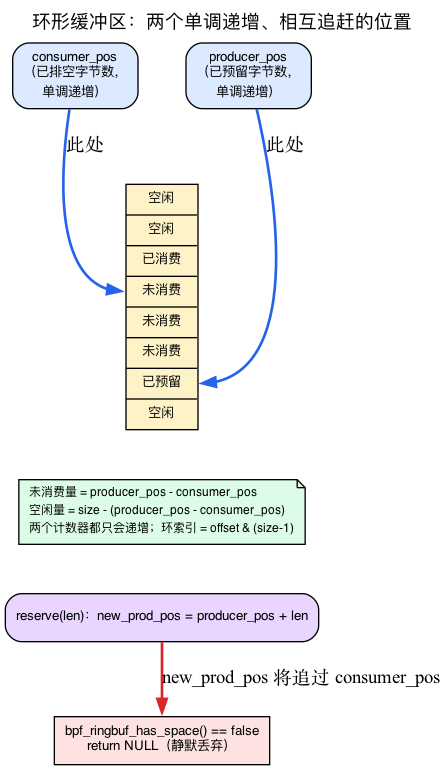
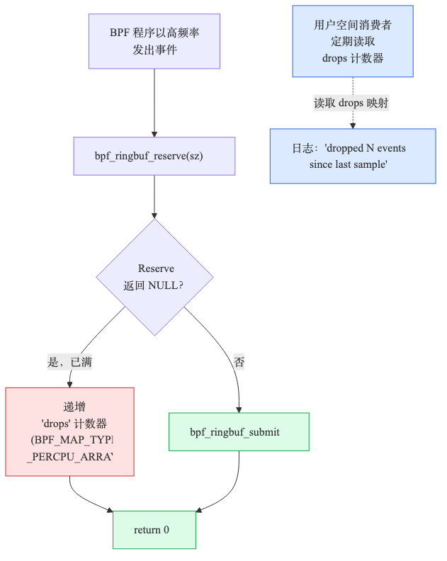
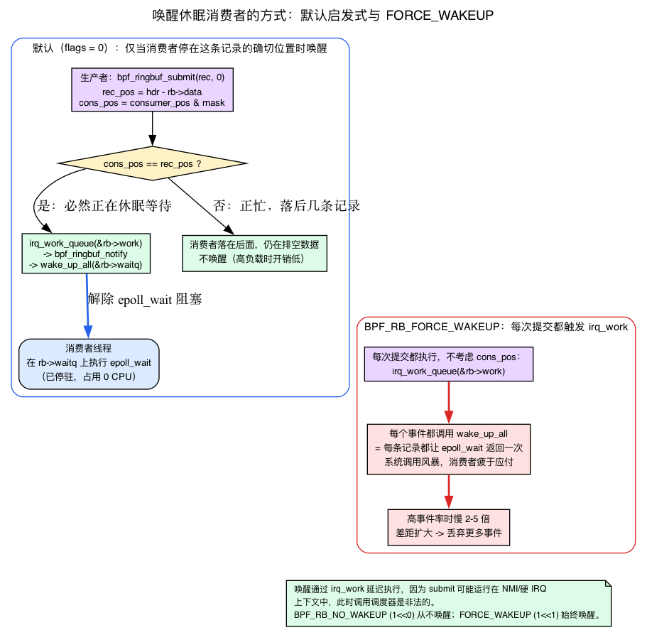
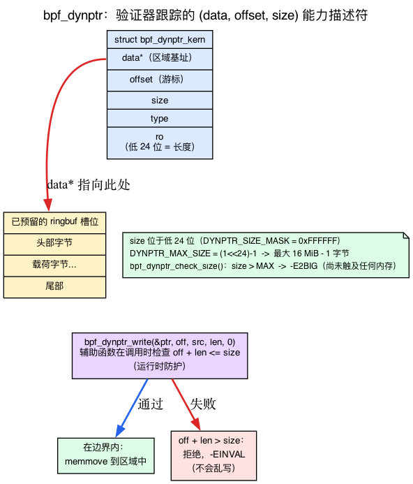

# 第13天 — 大规模场景下的环形缓冲区：丢失、背压与 dynptr

> **今日任务：** 为高速率追踪器加入监测机制，找出它何时丢失事件，再通过调整容量、过滤和 `bpf_dynptr` 来解决这一问题。在这个过程中，你终于会看清*为什么* `bpf_ringbuf_reserve` 会返回 NULL、睡眠中的消费者*如何*被唤醒，以及 `bpf_dynptr` 究竟*是什么*。本章是第二阶段的最后一章。总用时：约 110 分钟。

## 环形缓冲区并非毫无代价

第1天，你写了一个低速率追踪器，环形缓冲区“开箱即用”。你调用 `bpf_ringbuf_reserve` 取得一个槽位，填入数据，再调用 `bpf_ringbuf_submit`；用户空间则用 `ring_buffer__poll` 轮询。这就是完整的 MPSC（多生产者、单消费者）契约。在每秒只有几百个事件时，你从未见过它承受压力。

今天你要追踪一个高速率目标——繁忙服务器上的每一次 `vfs_read`——并亲眼观察环形缓冲区如何产生背压。

环形缓冲区的容量并非无限。默认情况下（本实验未设置 `BPF_F_RB_OVERWRITE` 标志），当生产者的速度超过消费者时，**`bpf_ringbuf_reserve` 会返回 NULL**，事件随即被静默丢弃——除非你专门监测这种情况。这句话概括了本章的核心，但它背后还有一个第1天未曾解释的机制：*“超过”具体意味着什么？固定大小的缓冲区为什么只能让预留失败？* 这是我们首先要弄清的问题。

## 环形缓冲区：两个互相追逐的位置

这是第1天略过的模型。BPF 环形缓冲区是**一段大小固定为 2 的幂次的字节区域**——创建映射时由你指定大小（`max_entries` 对环形缓冲区表示*字节数*，而不是条目数）。它永远不会增长。内核只跟踪与之相关的两个数字，而且它们只增不减：

- **`producer_pos`** — 到目前为止所有被预留过的内容的累计字节数。下一条记录从这里开始。
- **`consumer_pos`** — 用户空间已经消费完的内容的累计字节数。

两者都存放在 `struct bpf_ringbuf`（`kernel/bpf/ringbuf.c:28`）中。它们是*单调递增*的——永远不会回绕到零——内核用一个掩码就能把字节偏移映射到物理环形缓冲区上：`offset & rb->mask`，其中 `mask = size - 1`（这就是为什么大小必须是 2 的幂）。于是这两个计数器永远向前追逐，*它们之间的差距*才是关键：

> **未消费字节数 = `producer_pos − consumer_pos`。**
> **空闲空间 = 环形缓冲区大小 − (`producer_pos − consumer_pos`)。**

当消费者跟得上时，`consumer_pos` 会紧紧追着 `producer_pos`，空闲空间充裕。当消费者落后时，差距会不断扩大，直到等于整个环形缓冲区的大小——这时**已经没有地方放下一条记录了。**



### `reserve` 到底做了什么

打开 `__bpf_ringbuf_reserve`（`kernel/bpf/ringbuf.c:463`）。有几处检查都可能把 NULL 还给你；下面按内核实际运行的顺序列出：

**1. 拒绝异常大的记录。** 第一行就拒绝了任何超出一个外层安全上限的请求：

```c
/* kernel/bpf/ringbuf.c:469 */
if (unlikely(size > RINGBUF_MAX_RECORD_SZ))
    return NULL;
```

`RINGBUF_MAX_RECORD_SZ` 是 `UINT_MAX/4`（`ringbuf.c:26`）——大约 **1 GiB**。对于任何正常的事件你都不会碰到这个上限；它只是一个外层边界。

**2. 把请求向上取整，然后拒绝任何超过环形缓冲区大小的请求。** 你的事件不是被原样存储的——每条记录都带有 8 字节的头部（`BPF_RINGBUF_HDR_SZ = 8`，`include/uapi/linux/bpf.h:6275`），总长度会被取整到 8 的倍数。取整后的长度接下来会与*环形缓冲区自身的大小*进行比较：

```c
/* kernel/bpf/ringbuf.c:472 */
len = round_up(size + BPF_RINGBUF_HDR_SZ, 8);
if (len > ringbuf_total_data_sz(rb))   /* :473 — the realistic oversize path */
    return NULL;
```

所以一个整整齐齐 32 字节的 `struct event` 花费的不是 32 字节——而是 `round_up(32 + 8, 8) = 40` 字节的环形空间。（这个结构体是 `{ __u32 pid; __u64 dur; char comm[16]; }`；`__u64` 强制了 8 字节对齐，所以 `sizeof` 是 32，而不是各字段相加的 28 字节。）这一点比看上去更重要：我们的演示环形缓冲区故意设得很小，只有 **64 KiB**，所以它最多只能容纳约 1,600 条这样的记录。在每秒数十万次读取的速率下，那只是几毫秒的余量。再注意 `:473` 处的检查：单条记录大于**整个环形缓冲区**会在这里就被拒绝——这才是真正会发生的超大路径，远早于 1 GiB 的上限。

**3. 获取环形缓冲区的锁。** `raw_res_spin_lock_irqsave` 本身也可能失败并返回 NULL（`ringbuf.c:478`）——这是一条罕见路径，但确实也是一个 NULL 出口。

**4. 检查空间——这才是你遇到的丢弃。** 内核计算 `new_prod_pos = prod_pos + len`，并判断这是否会与尚未消费的区域发生冲突：

```c
/* kernel/bpf/ringbuf.c:494 */
if (!bpf_ringbuf_has_space(rb, new_prod_pos, cons_pos, pend_pos)) {
    raw_res_spin_unlock_irqrestore(&rb->spinlock, flags);
    return NULL;
}
```

**这个 `return NULL` 就代表一次静默丢弃。** 默认情况下——没有 `BPF_F_RB_OVERWRITE` 标志，这正是我们实验所用的配置——没有淘汰、没有阻塞、没有“腾地方”：如果把 `producer_pos` 前进 `len` 会覆盖消费者尚未读取的数据所在的区域，reserve 就直接失败。（v7.1 确实新增了一个可选的覆写模式，会淘汰最旧的记录——我们稍后会在“常见疑问”专栏里回到这个话题；本实验从不设置该标志。）成功时它会把该记录头部的长度打上 **BUSY 位**（`hdr->len = size | BPF_RINGBUF_BUSY_BIT`，`ringbuf.c:529`）——你在第1天见过的那个“已预留但尚未提交”的逐记录标记——然后把槽位交给你。

### 为什么更大的环形缓冲区救不了你

现在你可以回答我们前面提出的问题了：*如果会发生丢失，为什么解决办法不是干脆“用更大的环形缓冲区”？*

因为环形缓冲区的大小只决定了 reserve 开始失败前，生产者最多能将**差距**拉开到多大。增大环形缓冲区可以提供*更多余量*——允许消费者多落后几毫秒，差距才会饱和。但如果生产者**持续快于**消费者，差距仍会不断扩大，最终达到满载状态并*一直保持*；无论环形缓冲区多大，结果都一样。增大容量只能为*突发*流量提供更长的缓冲时间，对*持续性*的速率失衡毫无帮助。要解决持续压力，必须减少事件产量（在 BPF 中过滤），或只生成更小的摘要（在 BPF 中聚合）——这正是下面实验要做的事。

## 丢弃可见性

默认行为：丢弃是静默的。你的追踪器只会比它观察到的事件少发出一些事件。生产环境的追踪器永远都要统计丢弃数。



模式如下：用一个单独的**每 CPU 数组映射**来存放丢弃计数。每当 `bpf_ringbuf_reserve` 返回 NULL 时就递增它。用户空间定期采样这个映射并记录日志。下面的 `drops` 映射是一个 `BPF_MAP_TYPE_PERCPU_ARRAY`——回忆一下 **第2天** 里讲过的，为什么每 CPU 内存意味着 `inc_drops()` 不需要*任何原子操作*（每个 CPU 都只更新自己私有的那份副本），以及为什么 `sample_drops()` 必须读取一个**每 CPU 一个** `__u64` 的数组，并**把 `vals[i]` 在所有 CPU 上求和**才能得到真正的总数。

## 用户空间如何睡眠，生产者又如何唤醒它

人们很容易以为，只要环形缓冲区的填充度超过某个阈值，内核就会唤醒消费者。实际规则要简单得多——这也正是高速率追踪仍能保持低开销的原因。下面从基础机制讲起。

### 消费者正在 `epoll_wait` 中睡眠

`ring_buffer__poll(rb, timeout)`——你从第1天起就一直在用的这个循环——**底层其实就是 `epoll_wait`。**环形缓冲区的文件描述符实现了内核的 `.map_poll` 操作（`ringbuf_map_poll_kern`，在 `kernel/bpf/ringbuf.c:383` 处接入）。当你的消费者线程执行 poll 时，这个函数会把该线程注册到环形缓冲区的等待队列上，并报告是否有数据：

```c
/* kernel/bpf/ringbuf.c:342 */
poll_wait(filp, &rb_map->rb->waitq, pts);

if (ringbuf_avail_data_sz(rb_map->rb))
    return EPOLLIN | EPOLLRDNORM;   /* :345 — only if unconsumed data exists */
return 0;
```

所以当没有未消费的数据时，`epoll_wait` 会返回“无事可做”，并**把消费者线程阻塞在 `rb->waitq` 上**——在被唤醒之前不消耗任何 CPU。这个 `waitq` 就是 `struct bpf_ringbuf`（`ringbuf.c:28`）最顶部的一个 `wait_queue_head_t`。

### 生产者通过 `irq_work` 唤醒它

当生产者提交一条记录时，内核可能需要唤醒那个正在睡眠的线程。它*不会*直接从 `submit` 里调用调度器——因为 submit 可能运行在 NMI 或硬中断上下文中（比如挂在被中断处理程序调用的某个函数上的 `kprobe`），在这种上下文里碰调度器是非法的。取而代之，它会排队一个 **`irq_work`**：一个会在安全上下文中运行的微小延迟回调。那个回调就是 `bpf_ringbuf_notify`：

```c
/* kernel/bpf/ringbuf.c:154 */
static void bpf_ringbuf_notify(struct irq_work *work)
{
    struct bpf_ringbuf *rb = container_of(work, struct bpf_ringbuf, work);
    wake_up_all(&rb->waitq);   /* unblocks epoll_wait */
}
```

它在环形缓冲区创建时被挂接一次（`init_irq_work(&rb->work, bpf_ringbuf_notify)`，`ringbuf.c:183`）。让消费者的 `epoll_wait` 返回的正是 `wake_up_all`。



### 真正的默认启发式规则：“消费者是否已经追上了*我*？”

以下是 `bpf_ringbuf_commit`（submit/discard 共用的主体）中真正的判断逻辑：

```c
/* kernel/bpf/ringbuf.c:578 */
rec_pos = (void *)hdr - (void *)rb->data;
cons_pos = smp_load_acquire(&rb->consumer_pos) & rb->mask;

if (flags & BPF_RB_FORCE_WAKEUP)
    irq_work_queue(&rb->work);                                  /* :581 */
else if (cons_pos == rec_pos && !(flags & BPF_RB_NO_WAKEUP))
    irq_work_queue(&rb->work);                                  /* :583 */
```

仔细读这个 `else if`。默认情况**只有当 `cons_pos == rec_pos` 时**才会唤醒——也就是说，消费者已经一路排干消费到了*我们刚写下的这条记录*的精确位置。其直觉是：如果消费者恰好停在这条记录处，那它必然是**在睡眠等待它**，所以要唤醒它。但如果 `cons_pos` *落后于* `rec_pos`——意味着消费者前面还有已经存在但尚未消费的数据——那么消费者仍在忙着排干数据，会在下一轮自己走到这条记录。此时不需要唤醒。

这正是默认行为在高负载下仍能保持低开销的原因：**一个繁忙的消费者几乎从不会恰好停在最新那条记录上。** 在高速率下它总是落后几条记录，所以几乎每次 submit 都会跳过 `irq_work`。只有当环形缓冲区被排干到空、消费者真正进入睡眠时才会发生唤醒——而这恰好正是你*想要*唤醒的时刻。

### 两个标志位，以及它们的代价

`bpf_ringbuf_submit(rec, flags)` 接受以下值之一：

- **`0`**（默认）——上面那个 `cons_pos == rec_pos` 的启发式规则。对几乎所有场景都是正确的选择。
- **`BPF_RB_NO_WAKEUP`**（`= 1ULL << 0`，`include/uapi/linux/bpf.h:6258`）——**永不**排队唤醒，即便消费者正睡眠在这条记录上等待。只有在你*确定*另一个事件（或稍后一次强制的唤醒）很快会跟上来唤醒消费者时才安全——否则它会一直睡到你的 poll 超时才醒。用它来批量处理一波已知的突发流量，最后统一唤醒一次。
- **`BPF_RB_FORCE_WAKEUP`**（`= 1ULL << 1`，`:6259`）——在*每次* submit 时都**无条件**排队 `irq_work`。在高速率下，那就相当于每个事件都触发一次唤醒——实质上是每个事件一次消费者侧的系统调用返回。这正是破坏实验 4 展示的那 2–5 倍性能下降。

传入任何*其他*位就会被拒绝——`bpf_ringbuf_output` 会检查 `if (flags & ~(BPF_RB_NO_WAKEUP | BPF_RB_FORCE_WAKEUP)) return -EINVAL;`（`ringbuf.c:619`）。只有在有充分理由时才覆盖默认行为。

## `bpf_dynptr`：可变大小的事件

`bpf_ringbuf_reserve(rb, sz, 0)` 有一个不易察觉的约束：**`sz` 必须是编译期常量**。这不是一条风格上的规矩——它是被硬编码在这个辅助函数原型里的。大小参数的类型是 `ARG_CONST_ALLOC_SIZE_OR_ZERO`（`kernel/bpf/ringbuf.c:555`），这告诉验证器“这必须是一个编译期常量”。验证器需要这个常量来证明你所做的每一次写入都落在预留槽位内。一个运行时才算出来的大小完全没有可供其约束的东西，所以它会拒绝这个程序。

所以如果你的事件大小依赖于运行时的值——比如实际读取到的字节数——你有三种传统选项：

1. 按最坏情况的最大值预留；当事件较小时浪费掉尾部的字节。
2. 使用 `bpf_ringbuf_output`（总是会拷贝字节；跳过 reserve/submit 模式）。
3. 把你的最大事件大小限制得很小。

2022 年，内核加入了 **`bpf_dynptr`**（环形缓冲区对 dynptr 的支持在 5.19 中落地）。它表示一个运行时确定大小的缓冲区，由验证器通过一种携带边界信息的特殊指针类型进行跟踪。要正确使用它，必须先弄清它究竟*是什么*。

### dynptr 是一个由验证器帮你跟踪的 (指针，大小) 能力凭证

一个 `bpf_dynptr` **不是**一个裸指针。在内核一侧它是一个小小的描述符，`struct bpf_dynptr_kern`（`include/linux/bpf.h:1406`）：

```c
struct bpf_dynptr_kern {
    void *data;     /* base of the region */
    u32   size;     /* low 24 bits = length; bits 28-30 = type (DYNPTR_TYPE_SHIFT=28); bits 24-27 reserved; bit 31 = read-only */
    u32   offset;   /* current offset within the region */
} __aligned(8);
```

验证器把它当成一个**只能通过辅助函数触碰的不透明对象**——你永远不会直接解引用它。这种间接性正是整个巧妙之处：因为每一次访问都要经过辅助函数，一个**运行时才决定**的大小可以在*调用那一刻*被证明是安全的。当你调用 `bpf_dynptr_write(&ptr, off, src, len, 0)` 时，辅助函数会*当场*把 `off + len` 与所跟踪的 `size` 进行核对——所以验证器不再需要普通 `reserve` 所要求的那个编译期常量。边界检查从加载时移到了辅助函数在每次写入时执行的运行时守卫。



### 它并非没有限制：16 MiB 上限

因为长度只存放在那个 `size` 字段的**低 24 位**中（`DYNPTR_SIZE_MASK = 0xFFFFFF`，`kernel/bpf/helpers.c:1765`；由 `__bpf_dynptr_size` 提取，`:1788`/`:1796`），一个 dynptr 能描述的最大区域就是 `(1 << 24) − 1` = **16 MiB 减 1 字节**（`DYNPTR_MAX_SIZE = (1UL << 24) - 1`，`helpers.c:1763`）。请求更大的空间，预留会*在任何内存被触碰之前*就失败：

```c
/* kernel/bpf/helpers.c:1823 */
int bpf_dynptr_check_size(u64 size)
{
    return size > DYNPTR_MAX_SIZE ? -E2BIG : 0;
}
```

所以 dynptr 是一种*有界*的能力凭证，而不是无限的。

### 生命周期：与普通 reserve 相同的 reserve/release 约束

```c
struct bpf_dynptr ptr;
bpf_ringbuf_reserve_dynptr(&rb, sz, 0, &ptr);
bpf_dynptr_write(&ptr, 0, &header, sizeof(header), 0);
bpf_dynptr_write(&ptr, sizeof(header), payload, payload_len, 0);
bpf_ringbuf_submit_dynptr(&ptr, 0);
```

`bpf_ringbuf_reserve_dynptr`（`kernel/bpf/ringbuf.c:670`）用与普通 reserve 相同的方式预留一个槽位，成功后调用 `bpf_dynptr_init(ptr, sample, BPF_DYNPTR_TYPE_RINGBUF, 0, size)`（`ringbuf.c:696`；初始化辅助函数在 `helpers.c:1847`)，于是这个 dynptr 现在*就是*一个覆盖在已预留环形槽位上的带类型句柄。从这里开始，约束与第1天的 reserve/submit 完全一致：你**必须**紧接着调用恰好一次 `bpf_ringbuf_submit_dynptr` **或** `bpf_ringbuf_discard_dynptr`。已预留却始终未释放的槽位会造成严重后果——它的头部仍带有 **BUSY 位**，这会阻碍环形缓冲区回收空间（回想一下 reserve 对 pending 位置的扫描）。

有一个细节让失败路径的处理能够正确地写下去：当 reserve 失败时，辅助函数会返回一个负的错误码**并把 dynptr 置空**——`bpf_dynptr_set_null(ptr)`（`ringbuf.c:678`/`:684`/`:692`），它会把整个描述符 `memset` 为零（`helpers.c:1856`）。一个被置空的 dynptr 的 `data == NULL`，所以任何后续通过它进行的 `bpf_dynptr_write` 也会被拒绝。这就是为什么破坏实验 3 可以在失败路径上安全地调用 `discard` 而无需先检查——也是为什么一次通过失败预留发起的写入永远不可能乱写到某个坏地方。

`bpf_dynptr_write` 本身就是一次朴素的内核态 `memmove`，写入到被跟踪的区域（`__bpf_dynptr_write`，`helpers.c:1952`；辅助函数入口在 `:1994`）。它**不会**读取用户内存——这正是破坏实验 3 所依赖的、第12天讲过的那个区别。验证器静态地跟踪 dynptr 的边界，辅助函数在每次调用时强制执行这些边界，所以越界写入会被拒绝。性能与直接 reserve 相同。

> ### 常见疑问
>
> **问：环形缓冲区满时，丢弃的是*新*事件还是*最旧*的事件？**
>
> 答：对于**默认**的环形缓冲区（没有 `BPF_F_RB_OVERWRITE`）——也就是我们实验所用的配置——丢弃的是**新**事件：`bpf_ringbuf_reserve` 直接失败，`bpf_ringbuf_has_space()` 判定空间不足，`__bpf_ringbuf_reserve` 返回 NULL。那段未消费的区间永远不会被覆写。v7.1 增加了一个可选的**覆写模式**（`BPF_F_RB_OVERWRITE`，`1U<<19`）：在该模式下即便满了 `bpf_ringbuf_has_space()` 也会返回 true，`__bpf_ringbuf_reserve` 会让 `overwrite_pos` 越过最旧的记录来腾出空间——也就是说它淘汰的是*最旧*的未消费数据。我们的演示从不设置该标志，所以采用默认的丢弃新事件的行为。
>
> **问：应该按最坏情况的速率来设置环形缓冲区大小吗？**
>
> 答：不。最坏情况是无界的。将容量设为足以吸收典型速率下持续数秒的突发流量（常见取值为 256 KiB 到 4 MiB）。在持续的高速率下，你依然会丢事件。这时的解决办法不是加大环形缓冲区（见上文“为什么更大的环形缓冲区救不了你”）——而是在 BPF 里更激进地过滤，或者在 BPF 里聚合并发出摘要。
>
> **问：为什么普通 reserve 里的事件大小必须是常量？**
>
> 答：因为验证器需要静态地约束访问模式——`reserve` 的大小参数字面上就被打上了 `ARG_CONST_ALLOC_SIZE_OR_ZERO` 的类型。如果没有一个已知的大小，它就无法证明你的写入停留在预留槽位之内。`bpf_dynptr` 正是专门为在类型层面跟踪运行时大小、并在每次写入调用时核对而设计的新机制。

## 实验

### `dropviz.bpf.c`

这个程序采用的是 **第6天的入口/出口延迟模式**——一个按 TID 为键的 `starts` 哈希，在 `fentry` 处写入、在 `fexit` 处读取以计算耗时——这里只是把它当作生成*高事件速率*的一种方便手段重新使用。（回忆一下第6天里那个以 TID 为键的起始时间戳映射，以及它的递归/冲突注意事项；我们今天不需要用到那些。）

生产者和消费者通过一个头文件共享事件的布局：

{{#include ../labs/day13/dropviz.h}}

程序则是从编译好的源代码中包含进来的：

{{#include ../labs/day13/dropviz.bpf.c:book}}

注意 `inc_drops()` 的递增没有用任何原子操作——那是每 CPU 数组在做它第2天的本职工作：每个 CPU 只碰自己的那份副本，所以没有什么可竞争的。

### `dropviz.c` — 用户空间与丢弃监控

加载器位于代码仓库的 `ebpf/labs/day13` 目录中；构建过程会从
`dropviz.bpf.o` 生成 `dropviz.skel.h`（`skel->maps.rb`、`skel->maps.drops`
等的带类型访问器）。下面的清单摘自由 `make dropviz` 和 CI
编译出的源代码：

{{#include ../labs/day13/dropviz.c:book}}

`sample_drops` 读取器就是第2天那个每 CPU 读取模式的实际体现：对每 CPU 映射执行 `bpf_map_lookup_elem`，会把**每个 CPU 一个 `__u64`** 拷贝到 `vals[]` 中，循环把它们求和成逻辑上的总数。`ring_buffer__poll` 就是我们前面剖析过的那个 `epoll_wait`——当环形缓冲区为空时，这个线程会在环形缓冲区的 `waitq` 上睡眠最多 100 毫秒，不消耗任何 CPU，直到某次 submit 的 `irq_work` 把它唤醒。

### 在刻意施加压力的情况下运行

首先，**仅为本次演示禁用 5µs 过滤器**：`on_out` 中的 `dur` 是执行 `vfs_read` 实际经过的时间，而对 `/dev/zero` 以 `bs=512` 进行的读取会在远小于 1µs 的时间内完成，所以 `if (dur < 5000) return 0;` 这一行会在事件*到达* `bpf_ringbuf_reserve` 之前就过滤掉约 99.9% 的事件——导致丢弃计数一直停留在 `[total drops: 0]`。要让这股事件洪流真正到达环形缓冲区，**注释掉 `if (dur < 5000) return 0;` 这一行**（或者干脆把阈值降到 `0`）然后重新构建。不要把它改写成 `if (dur < 0)`：`dur` 是 `__u64`，所以无符号数的 `< 0` 比较永远为假——优化器会把它整个删掉，编译器可能还会警告 `-Wtype-limits`，这只会让重点变得混乱。（我们会在下面的“修复”部分把这个过滤器加回来。）

```bash
make
sudo ./dropviz &

# Generate massive read pressure: ~500k reads/sec straight through vfs_read
dd if=/dev/zero of=/dev/null bs=512 count=10000000 &
```

观察（这是有代表性的示例——具体数字会随 CPU 和消费者速度而变化）：

```
[total drops: 0]
[total drops: 0]
[total drops: 1452]
[total drops: 4031]
[total drops: 7821]
```

如果你看到 `[total drops: 0]` 一直没变，说明所有事件都被过滤掉了——请确认你确实降低了阈值并重新构建。之所以会出现丢弃，是因为每秒数十万次的快速读取使 `producer_pos` 的推进速度远超单线程轮询循环推进 `consumer_pos` 的速度，于是两者的差距达到 64 KiB 的容量上限，`bpf_ringbuf_has_space()` 开始返回 false。

让它运行约 10 秒钟以观察丢弃数累积，然后**停止这两个后台任务**：

```bash
kill %2 2>/dev/null   # the dd job
sudo pkill dropviz    # the tracer — it polls forever, so Ctrl-C won't reach a backgrounded job
```

`dd` 任务会读取约 5 GB 数据，最终会自行退出，但 `dropviz` 运行的是一个无限期的轮询循环，必须显式地把它杀掉。现在开始修复：

1. **把环形缓冲区大小加大**到 4 MiB（`64 * 1024 * 64`）。丢弃应该会停止或减少。（这*拓宽了*生产者能拉开的差距——对突发流量有用，对持续性的速率失衡没用。）
2. **提高过滤阈值**——把 5µs 的截止值（`dur < 5000`）改成 100µs（`dur < 100000`），这样更多的事件会在到达环形缓冲区之前就在 BPF 里被过滤掉。（这*降低了产生速率*——这才是真正的修复方式。）
3. **减少消费者处理每个事件时的工作量**（修改你的处理函数）。（减少打印，这样 `consumer_pos` 才能推进得更快。）

每一项调整你都可以通过重新运行负载并观察丢弃计数来验证。

---

## 按顺序尝试破坏

### 破坏 1 — 不递增丢弃计数

把 `inc_drops()` 注释掉。运行高负载。你会看到收到的事件比预期少——但没有任何信号表明事件正在缺失。**这正是生产环境的追踪器悄悄出错的方式。** 永远要统计丢弃数。

### 破坏 2 — 改用 `bpf_ringbuf_output`

```c
struct event ev = { ... fill in ... };
long ret = bpf_ringbuf_output(&rb, &ev, sizeof(ev), 0);
if (ret < 0) inc_drops();
```

功能上类似；使用拷贝语义而非 reserve/submit。每个事件大约慢 10%（它先做 reserve，然后把你栈上的结构体 `memcpy` 进槽位，再做 commit——相比之下你自己直接在槽位里填数据）。当事件存放在 BPF 栈上、而你不想同时维护本地指针和已预留指针这两个指针时，这个方式很有用。

### 破坏 3 — 用 dynptr 实现可变大小

有两件事让那个朴素版本是错的，两者都很关键：

- **在 `fexit` 而不是 `fentry` 处捕获。** 在入口处读取还没有发生，所以用户缓冲区 `buf` 还没有被填充——没有东西可拷贝。（这就是为什么本实验的钩子按第6天的方式分开设置。）
- **`bpf_dynptr_write` 做的是一次朴素的内核态 `memmove`；它*不会*读取用户内存。** 把 `char __user *buf` 直接当作 `src` 传进去会拷贝出垃圾数据，而且验证器会在它期望内核驻留的 `ARG_PTR_TO_MEM` 处拒绝一个裸的用户指针。你必须先用 `bpf_probe_read_user` 把用户字节暂存到一个有界的内核栈临时变量中——回忆一下 **第12天** 讲过的，为什么一个 `__user` 指针不能直接解引用而必须先拷贝进来（它存在于另一个地址空间，可能触发缺页）。

```c
SEC("fexit/vfs_read")
int BPF_PROG(on_out_dyn, struct file *f, char *buf, size_t n, loff_t *pos, ssize_t ret)
{
    if (ret <= 0) return 0;
    /* cap to a compile-time constant so the Verifier can bound the copy */
    __u32 to_emit = ret > 64 ? 64 : ret;
    char tmp[64];
    if (bpf_probe_read_user(tmp, to_emit, buf) < 0)
        return 0;

    struct bpf_dynptr ptr;
    if (bpf_ringbuf_reserve_dynptr(&rb, sizeof(struct event) + to_emit, 0, &ptr) < 0) {
        inc_drops();
        bpf_ringbuf_discard_dynptr(&ptr, 0);   /* every reserve needs a submit OR discard */
        return 0;
    }
    struct event hdr = {};
    hdr.pid = bpf_get_current_pid_tgid() >> 32;
    bpf_get_current_comm(&hdr.comm, sizeof(hdr.comm));
    bpf_dynptr_write(&ptr, 0, &hdr, sizeof(hdr), 0);
    bpf_dynptr_write(&ptr, sizeof(hdr), tmp, to_emit, 0);   /* kernel src, in-bounds */
    bpf_ringbuf_submit_dynptr(&ptr, 0);
    return 0;
}
```

`to_emit = ret > 64 ? 64 : ret` 这个上限正是让验证器能够证明 `bpf_probe_read_user` 和第二个 `bpf_dynptr_write` 都停留在 `tmp[64]` 范围内的关键。失败路径上的 `discard` 是安全的，尽管预留失败了——回忆一下失败的 `bpf_ringbuf_reserve_dynptr` 会把 dynptr 置空（`bpf_dynptr_set_null`），所以没有任何活跃的东西可供破坏。现在事件大小取决于实际读取到的字节数。试着把你原来的 reserve-and-submit 模式换成这个，写一个能捕获可变长度数据的追踪器。

### 破坏 4 — 强制唤醒轰炸

```c
bpf_ringbuf_submit(e, BPF_RB_FORCE_WAKEUP);
```

不管有没有待处理的数据，每个事件都这样做。重新构建，运行高负载。观察用户空间进程的 CPU 占用——每一次强制的 submit 都会排队那个调用 `wake_up_all` 的 `irq_work`，每个事件都会让消费者的 `epoll_wait` 返回一次。当默认的 `cons_pos == rec_pos` 启发式规则被禁用后，一个本来在高负载下*永远*不会被唤醒的繁忙消费者，现在每条记录都会被唤醒一次——高速率工作负载下性能会下降 2–5 倍。把它重置为 `0`。

---

## 需要在内核中阅读的内容

- **`kernel/bpf/ringbuf.c`** — 整个文件约 700 行。从头读到尾。留意 `struct bpf_ringbuf`（`:28`）及其 `producer_pos`/`consumer_pos`/`pending_pos`、`__bpf_ringbuf_reserve`（`:463`）以及 `bpf_ringbuf_has_space` 的 NULL 路径（`:494`）、`bpf_ringbuf_commit` 及围绕 `BPF_RB_FORCE_WAKEUP` 的唤醒逻辑（`:578`–`:583`），还有 `bpf_ringbuf_notify` → `wake_up_all`（`:158`）。
- **`include/uapi/linux/bpf.h`** — 搜索 `BPF_RB_FORCE_WAKEUP` / `BPF_RB_NO_WAKEUP`（`:6258`–`:6259`）以及 `BPF_RINGBUF_*` 标志（`:6273`–`:6275`）。
- **`kernel/bpf/helpers.c`** — 动态指针边界跟踪的实现。阅读 `bpf_dynptr_init`（`:1847`）、`bpf_dynptr_check_size`（`:1823`），以及 `_write`/`_read` 辅助函数（`__bpf_dynptr_write` 在 `:1952`）。`struct bpf_dynptr_kern` 在 `include/linux/bpf.h:1406`。
- **`tools/testing/selftests/bpf/progs/test_ringbuf.c`** 和 **`test_ringbuf_multi.c`** — 我们所讲模式的示例。

---

## 要点回顾

- 环形缓冲区是一段**大小固定为 2 的幂的字节环**，带有两个单调计数器：`producer_pos`（已预留）和 `consumer_pos`（已排干）。**空闲空间 = 大小 − (producer_pos − consumer_pos)**。
- 每条记录花费 `round_up(size + 8, 8)` 字节（8 字节头部）。当大小超过约 1 GiB（`RINGBUF_MAX_RECORD_SZ`）时 reserve 会返回 NULL，或者更常见的情况是，当 `bpf_ringbuf_has_space()` 判定新记录会覆盖未消费区间时。**返回 NULL 就代表一次静默丢弃。**
- **默认**情况下环形缓冲区满时会**丢弃新事件**（没有淘汰机制）；v7.1 的可选 `BPF_F_RB_OVERWRITE` 模式则会淘汰*最旧*的记录。不管哪种方式，**更大的环形缓冲区只会拓宽差距所能吸收的突发流量**——对持续性的生产者/消费者速率失衡毫无作用。应该改为在 BPF 里过滤或聚合。
- **始终**在每 CPU 数组中统计丢弃数（第2天：无需原子操作；在用户空间跨 CPU 求和）。
- 消费者睡眠在**环形缓冲区 `waitq` 上的 `epoll_wait`**（`.map_poll`）中，不消耗任何 CPU。生产者通过运行 `wake_up_all` 的 **`irq_work`** 来唤醒它（之所以延迟执行，是因为 submit 可能运行在 IRQ/NMI 上下文中）。
- **默认的唤醒启发式规则**是 `cons_pos == rec_pos`——只有当消费者已经一路追上了*这条*记录时才唤醒（因为它必然正在睡眠等待）。繁忙的消费者很少处于那个位置，因此默认行为在高负载下仍能保持低开销。
- `BPF_RB_FORCE_WAKEUP`（`1<<1`）会在**每个**事件上唤醒——高负载下会引发系统调用风暴（慢 2–5 倍）。`BPF_RB_NO_WAKEUP`（`1<<0`）永不唤醒。任何其他标志位 → `-EINVAL`。
- **`bpf_dynptr`** 用于可变大小的事件；吞吐量与直接 reserve 相同。普通 reserve 的大小是 `ARG_CONST_ALLOC_SIZE_OR_ZERO`（必须是常量）；dynptr 把边界检查移到了每次写入时的一个运行时守卫上。
- dynptr 是一种 **`(data, offset, size)` 能力凭证**（`struct bpf_dynptr_kern`）；验证器把它当作不透明对象来跟踪，辅助函数在每次访问时核对 `offset+len` 与 `size`。大小存放在**低 24 位 → 最大 16 MiB − 1**（超过则 `-E2BIG`）。一次失败的 reserve 会**把 dynptr 置空**，所以它的失败路径是安全的。

---

## 检查问题

你的追踪器在高负载下正在丢事件。你把环形缓冲区从 64 KiB 加大到 16 MiB，丢弃*短暂*消失，然后又在相同的持续速率下重新出现。另外，一位同事建议加上 `BPF_RB_FORCE_WAKEUP`，以“确保用户空间能跟得上”。请用 `producer_pos`/`consumer_pos` 和唤醒启发式规则来解释：为什么更大的环形缓冲区没能修复这个持续性的丢弃问题，以及为什么 `FORCE_WAKEUP` 只会让情况*变得更糟*，而不是更好。

<details>
<summary>点击查看答案</summary>

**答案：** 环形缓冲区的大小只是设定了 `bpf_ringbuf_has_space()` 开始让预留失败之前，`producer_pos − consumer_pos` 能达到的最大差距。更大的环形缓冲区能买到更长的跑道，所以一次*突发*能把积压排干，丢弃会暂时停止——但如果生产者**持续**快于消费者，差距会重新增长，直到达到环形缓冲区的容量上限，reserve 再次开始失败。空闲空间是 `size − (producer_pos − consumer_pos)`；当速率失衡是持续性的时候，不管 `size` 是多少，这一项都会趋向于零。真正的修复方法是降低生产速率（在 BPF 里过滤/聚合）或加快消费者的速度。

`BPF_RB_FORCE_WAKEUP` 会让情况更糟，因为默认的启发式规则只有在 `cons_pos == rec_pos` 时——也就是消费者真的正睡眠等待这条精确记录时——才会排队唤醒。在持续负载下，消费者*从来*不会处于那个位置（它总是落后的），所以默认行为几乎不发出任何唤醒，让消费者能够批量排干数据。`FORCE_WAKEUP` 会在*每次* submit 时都排队那个 `irq_work` → `wake_up_all`，让消费者的 `epoll_wait` 每个事件都返回一次。那是一场每事件一次系统调用的风暴，*会拖慢消费者*，拉大差距，导致**更多**而不是更少的丢弃。

</details>

---

## 第二阶段结束

你现在已经掌握了：
- 使用 fentry/fexit 及入口/出口映射模式进行延迟追踪（第6天）。
- 每种程序类型的参数访问——fentry、kprobe、raw tracepoint、tp_btf（第7天）。
- Tracepoint 发现，以及 tp_btf 与 raw 之间的取舍（第8天）。
- 栈追踪，以及通向火焰图的路径（第9天）。
- 通过 uprobe 和 USDT 进行用户空间追踪（第10天）。
- 一次挂载多个探针以同时追踪多个函数（第11天）。
- 用于可能触发缺页的辅助函数的可睡眠 BPF（第12天）。
- 环形缓冲区的容量调整、生产者/消费者位置模型、丢弃可见性、唤醒路径，以及 dynptr（第13天）。

这些已经足以让你写出能与 bpftrace 的追踪器相媲美的生产级可观测性工具。第三阶段（第14–19天）转向网络方向：XDP、tc、tcx、AF_XDP，以及 cgroup/sockops。

准备好后，我们继续。
