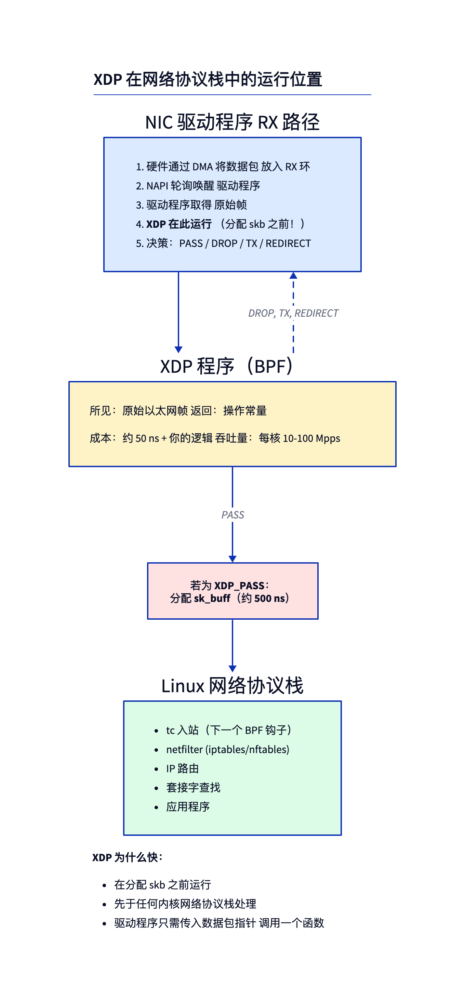
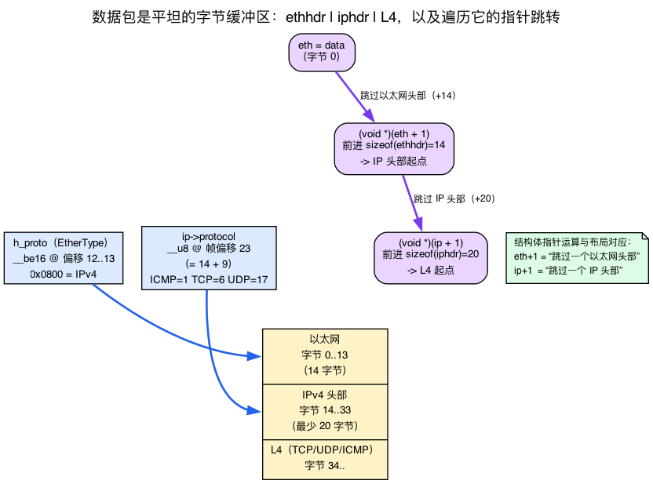
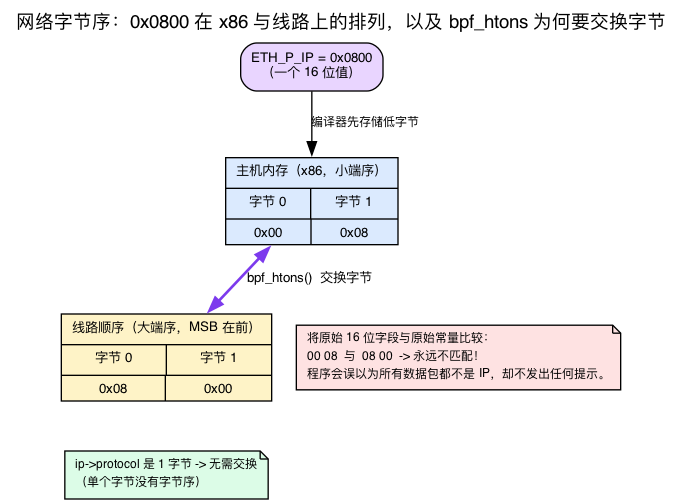
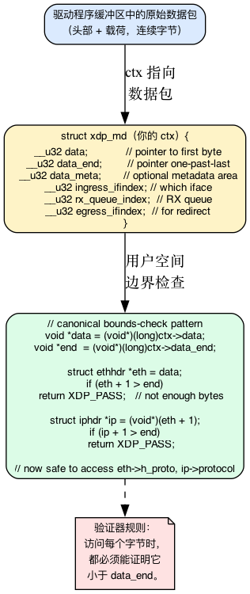
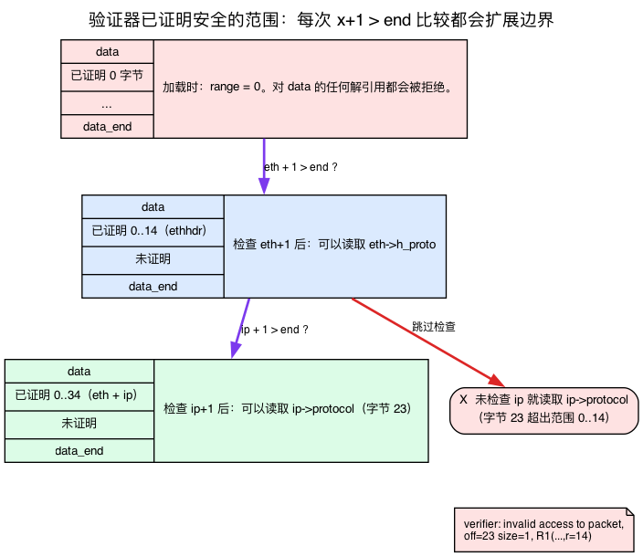
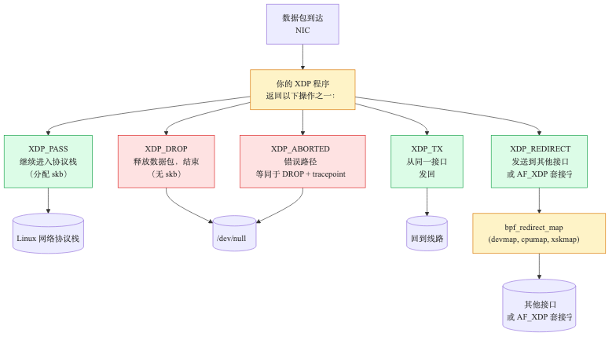
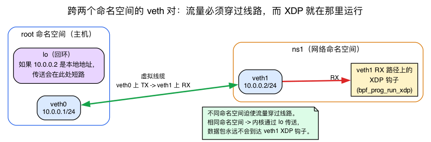

# 第14天 — XDP：统计一张网卡上的每一个数据包

> **今日任务：** 按协议统计某个网络接口上的数据包，处理速度要快于内核分配 sk_buff。在此过程中，你会学到前 13 天的跟踪内容从未涉及的四件事：数据包作为字节序列究竟是什么样子、为什么 2 字节字段需要 `bpf_htons` 而 1 字节字段不需要、`data`/`data_end` 配合一次边界比较如何使数据包读取变得*合法*，以及 `veth` 对与网络命名空间究竟是什么。总用时：约 110 分钟。

> **第 3 阶段从这里开始。** 第14–19天讲的是网络方向的 BPF。你会看到 XDP、tc、tcx、AF_XDP、cgroup、sockops。到第19天结束时，你将能够编写出支撑 Cilium 等项目的那种数据包路径 BPF 代码。

## XDP：内核中最早的钩子

昨天的跟踪程序是在某个已经存在的函数上*发生了有意思的事*时才运行的。XDP 不一样：**XDP 在数据包到达网卡的那一刻就运行，早于内核分配 `sk_buff`**，早于任何 iptables、路由或套接字查找发生。



### “数据包到达的那一刻”究竟是哪一刻？

你已经花了 13 天挂钩函数。XDP 不是你挂钩的一个函数——它是*驱动程序*在一个非常特定的点上发起的一次回调，而这个点正是 XDP 之所以快的全部原因所在。这里是一段简短的复习（配套的 **linux-net** 书第1天完整讲解了这一切——网卡 RX 描述符环、DMA，以及 `sk_buff` 的代价——所以这里不再重新推导）：

当网卡收到帧后，会触发一个中断；随后驱动程序在软中断上下文中**从其 RX 描述符环上轮询取出一批帧**——这种批量轮询机制被称为 **NAPI**。当驱动程序的轮询例程运行时，网卡的 DMA 引擎*早已*把帧字节写入了内存中的某个页面。XDP 就运行在*那次轮询内部*，被交给一个指向那块原始 DMA 帧缓冲区的指针，**早于任何 `sk_buff` 被分配之前。** 这就是 XDP 的全部价值所在：你可以在数据包还只是页面里的字节时就查看它（并丢弃或重定向它），从而跳过构建内核那个重量级数据包容器的开销。

那次分配并不是免费的。在现代 x86 上构建一个 `sk_buff` 大约需要几百纳秒（仅描述符本身就来自一个专用 slab 缓存，约 230 字节，再加上一次独立的数据缓冲区分配）；路由/查找等操作还会再增加几百纳秒。**XDP 运行在这一切之前。**（回忆一下 linux-net 第1天中提到的双重分配 `sk_buff` 模型——描述符缓存加数据缓冲区；这里我们只关心 XDP *跳过*了这项开销这一点。）XDP 运行在驱动程序的 NAPI 轮询中，被调用时带着一个指向原始帧的指针，返回一个动作常量，仅此而已。

你可以在源码中看到驱动程序发起的确切回调：它就是 `include/net/xdp.h:689` 处内联的 `bpf_prog_run_xdp`。今天我们会挂载到一个 `veth` 设备上，而 `veth` 正是通过*同一个*内联函数（`drivers/net/veth.c:657` 和 `:819`）来调用 XDP 的——这也正是物理网卡驱动所使用的内联函数，这正是 `veth` 之所以是一个忠实的 XDP 测试平台的原因。

文献中的吞吐量数据：每核轻松达到 1000 万 pps（10 Mpps），配合硬件卸载（支持的网卡上的 offloaded XDP）可达 1 亿以上 pps——两者都取决于具体工作负载和网卡型号。你单核软件实现的上限大约是小包场景下 10 Gbps 链路的线速。

## 数据包只是字节：以太网与 IPv4 的布局

在接触 `struct xdp_md` 之前，先停下来看看驱动程序实际交给我们的是什么：**一段扁平的字节缓冲区。** 没有结构体，没有字段——只有第 0 字节、第 1 字节、第 2 字节，依此类推。`ctx->data` 指向第 0 字节。今天程序所做的一切，都是通过在这些字节上叠加头部结构体来*解读*它们。

对于一个普通的 IPv4 数据包，最开始的字节看起来是这样的：

```
[ Ethernet header : 14 bytes ][ IP header : ≥20 bytes ][ L4 (TCP/UDP/ICMP) ... ]
```



### 以太网头部——恰好 14 字节

帧以 `struct ethhdr` 开头，它是内核中最简单的结构体之一——只有三个字段，并且带有 `__packed`，因此编译器不会插入任何填充（`include/uapi/linux/if_ether.h:177`）：

```c
/* include/uapi/linux/if_ether.h:177 */
struct ethhdr {
    unsigned char h_dest[ETH_ALEN];   /* destination MAC — 6 bytes, offset 0  */
    unsigned char h_source[ETH_ALEN]; /* source MAC      — 6 bytes, offset 6  */
    __be16        h_proto;            /* EtherType       — 2 bytes, offset 12 */
} __attribute__((packed));
```

`ETH_ALEN` 是 6，所以 6 + 6 + 2 = **14 字节**——这恰好就是那个具名常量 `ETH_HLEN == 14`（`if_ether.h:34`）。最后一个字段 `h_proto` 是 **EtherType**：它告诉你接下来是什么头部。我们关心的值是 `ETH_P_IP == 0x0800`（`if_ether.h:52`），意为“接下来是一个 IPv4 数据包”。这正是程序首先要做的检查：*这到底是不是一个 IP 数据包？*

### IPv4 头部——以及 `protocol` 字段的位置

如果 EtherType 表明是 IP，那么偏移量 14 处的字节就是 `struct iphdr`（`include/uapi/linux/ip.h:87`）：

```c
/* include/uapi/linux/ip.h:87 */
struct iphdr {
    __u8    ihl:4,        /* header length in 32-bit words — first byte... */
            version:4;    /* ...packed with version (little-endian layout) */
    __u8    tos;          /* offset 1 */
    __be16  tot_len;      /* offset 2 */
    __be16  id;           /* offset 4 */
    __be16  frag_off;     /* offset 6 */
    __u8    ttl;          /* offset 8 */
    __u8    protocol;     /* offset 9  ← the field we read (ip.h:102) */
    __sum16 check;
    /* ... saddr, daddr ... */
};
```

有两点需要注意。第一，第一个字节把 **`version:4` 和 `ihl:4`** 打包在了一起——这意味着 IP 头部长度是*可变的*：`ihl` 以 32 位字为单位计数，所以头部长度是 `ihl * 4` 字节，最小 20 字节。（对于我们这个计数程序，不需要解析选项，因此按固定的 20 字节最小值处理。）

第二点，也是这整个实验都要依赖的数字：**`protocol` 是位于 IP 头部字节偏移 9 处的一个单一 `__u8`**（`ip.h:102`）。逐个数一下：version/ihl（1）+ tos（1）+ tot_len（2）+ id（2）+ frag_off（2）+ ttl（1）= 它前面共 9 字节。这一个字节正是映射所索引用的*键*：ICMP = 1，TCP = 6，UDP = 17。

### 指针运算映射了这一布局

代码从不手动计算这些偏移量——而是让 C 的指针运算来完成。看看这些强制类型转换是如何在缓冲区中移动的：

- `struct ethhdr *eth = data;` —— `eth` 指向第 0 字节。
- `(void *)(eth + 1)` —— 将一个 `struct ethhdr *` 前移**整整一个结构体**的距离，等于把指针向前移动 `sizeof(struct ethhdr) == 14` 字节。这恰好落在 IP 头部的起始处。
- `(void *)(ip + 1)` —— 将一个 `struct iphdr *` 前移一位，等于越过（固定大小的）IP 头部，落到 L4 的起始处。

所以 `eth + 1` 表示“跳过以太网头部”，`ip + 1` 表示“跳过 IP 头部”，都是以结构体运算的形式表达出来的。这也正是破坏实验 1 中 `off=23` 的破解密码：IP 头部的 `protocol` 位于帧偏移量 14（一个以太网头部）+ 9（IP 头部内的偏移）= **23** 处。

这就是今天需要的全部线路格式知识——只不过是字节偏移量而已。完整的内核 RX/协议栈处理内容在配套的 **linux-net** 书中有讲解；这里我们只是借用了它的布局。

## 网络字节序：为什么 `bpf_htons` 要包裹某些值而不包裹其他值

`h_proto` 里藏着一个陷阱。再看一眼 `struct ethhdr`：`h_proto` 的类型是 **`__be16`**，而不是 `__u16`。`__be` 这个前缀是内核用来表明*“这个字段是大端序”*的一种可由编译器检查的方式——它绝非装饰性的。每一个多字节的协议字段**在线路上都是大端序**的（最高有效字节在前）：EtherType、IP 的 `tot_len`、TCP/UDP 端口、IP 的 `id`。你可以直接从结构体类型上看出来——`__be16 h_proto`、`__be16 tot_len`、`__be32 saddr`——每一个 `__be*` 都是内核在告诉你“这是大端序”。

x86 是**小端序**的。所以当你在 C 程序中写下常量 `ETH_P_IP`（`0x0800`）时，编译器会按 x86 的方式把它存入内存——低字节在前，存为 `00 08`。但*线路*上传来的这两个字节却是 `08 00`。如果你直接拿原始的 16 位字段和这个原始常量比较，你比较的其实是 `08 00` 和 `00 08`——它们永远不会匹配，而且是悄无声息地不匹配，你的程序会认为*从来没有一个数据包是 IP 包*。



`bpf_htons()`（“host to network, short”，主机序转网络序）执行的正是那次字节交换，把你的主机序常量转换成线路序，这样比较才是正确的。这就是为什么程序里这样写：

```c
if (eth->h_proto != bpf_htons(ETH_P_IP))   /* swap the constant to wire order */
    return XDP_PASS;
```

可移植的版本位于 `#include <bpf/bpf_endian.h>` 中，这也是程序引入这个头文件的原因。

**经验法则：** 只要字段是**2 字节或更多字节**就需要转换——`h_proto`、`tcp->dest`、`ip->tot_len`。而**单字节完全没有字节序可言**（没有什么可交换的），所以 `ip->protocol` 是被*原样*读取的。这正是程序对 `ETH_P_IP` 做了包裹、而对 `ip->protocol` 直接读取的*确切*原因——也正是为什么破坏实验 4 中的 `tcp->dest`（一个 `__be16` 端口）如果你想把它打印成主机序数字的话，需要用 `bpf_ntohs`。方向是对称的：对你要比较的常量使用 `bpf_htons`（主机→线路），当你把一个线路值取出来当作数字使用时用 `bpf_ntohs`（线路→主机）。

## XDP 上下文：`struct xdp_md`



你收到的是 `struct xdp_md *ctx`。每个程序都会用到的两个字段（`include/uapi/linux/bpf.h:6560-6561`）：

- `ctx->data` —— 指向数据包第一个字节的指针（由 u32 转换而来）。
- `ctx->data_end` —— 指向最后一个字节之后一位的指针。

其他字段：
- `ingress_ifindex` —— 数据包到达的是哪个接口。
- `rx_queue_index` —— 哪个网卡 RX 队列。
- `data_meta` —— 可选的元数据区域（第18天，AF_XDP）。
- `egress_ifindex` —— 仅在 devmap-egress XDP 程序中可读（`expected_attach_type == BPF_XDP_DEVMAP`）；验证器会拒绝从一个普通的 `SEC("xdp")` 程序访问它（参见 `net/core/filter.c` 中的 `xdp_is_valid_access`）。

### `data` / `data_end`：数据包指针模型

这正是前 13 天的跟踪内容未曾涉及的部分。`ctx->data` 和 `ctx->data_end` 是**一对相互匹配的数据包指针**：

- `data` 是一个 `PTR_TO_PACKET`——可读窗口的起点。
- `data_end` 是一个 `PTR_TO_PACKET_END`——最后一个可读字节之后一位。

它们是**运行时的值**。验证器在加载时检查你的程序时并*不*知道数据包的长度——一个 64 字节的 ARP 包和一个 1500 字节的 TCP 报文段会经过同一段代码。所以验证器不能只是相信你能读取 34 字节；它根本不知道这 34 字节是否存在。

验证器*实际*做的事情，是在数据包指针上跟踪一个**已证明安全的范围**。最初这个范围是**零字节**——验证器会拒绝对 `data` 的*任何*解引用，因为还没有证明任何一个字节是在界内的。你通过与 `data_end` 的比较来扩大这个范围：

```c
struct ethhdr *eth = data;
if (eth + 1 > end)            /* "are the 14 bytes of an ethhdr present?" */
    return XDP_PASS;          /* not enough bytes — bail out */
/* fall-through branch: verifier now KNOWS 14 bytes from data are safe */
```

写下 `if (eth + 1 > end) return XDP_PASS;` 并在*假*分支上继续执行，这教会了验证器“从 `data` 起的 `sizeof(ethhdr)` 字节是在界内的”。**只有到那时**你才可以读取 `eth->h_proto`。这正是第4天中用一句话点到的机制（`find_good_pkt_pointers`，那个位于 `kernel/bpf/verifier.c:15422` 处的范围收窄例程，正是被这种 `x + 1 > end` 比较触发的）。今天你将真正地用上它。



**每一层都需要各自的检查。** 一次比较只会把已证明的范围扩展到被检验的那个指针为止。在 `eth` 检查之后，*IP* 的字节仍然是未经证明的——在触碰 `ip->protocol` 之前，你必须重新测试 `ip + 1 > end`：

```c
void *data = (void *)(long)ctx->data;
void *end  = (void *)(long)ctx->data_end;
struct ethhdr *eth = data;
if (eth + 1 > end)
    return XDP_PASS;        /* skip — not enough bytes for an Ethernet header */
```

这个模式在每一层头部上重复出现。IP 用 `ip + 1 > end`，TCP 用 `tcp + 1 > end`，等等。跳过某一层的检查，验证器就会打印出 `invalid access to packet`（那次 `verbose()` 调用位于 `kernel/bpf/verifier.c:4433`）——这正是破坏实验 1 和破坏实验 4 会产生的结果。**边界检查不是可选项**，现在你确切地知道了原因：没有那次比较，已证明的范围就永远不会超过你上一次测试过的指针，而访问就落在了这个范围之外。

## XDP 动作



你可以返回五个常量：

- **`XDP_PASS`** —— 继续交给内核协议栈（分配 skb，转交处理）。
- **`XDP_DROP`** —— 立即释放数据包。不会触及 skb 路径。
- **`XDP_TX`** —— 把（可能已修改过的）数据包从同一个接口发送回去。是 DDoS 缓解的经典用法。
- **`XDP_REDIRECT`** —— 与 `bpf_redirect_map(...)` 搭配，发送到另一个接口、另一个 CPU（cpumap），或一个 AF_XDP 套接字。
- **`XDP_ABORTED`** —— 错误路径。等同于 DROP，外加触发一个跟踪点（方便你查找 bug）。

> ### 常见疑问
>
> **问：为什么不是每一条数据包路径都用 XDP 来写？**
>
> 答：因为 XDP 运行在内核了解得还很少的*那一刻之前*。这时没有套接字查找，没有路由决策，没有连接状态。对于大多数协议栈，你会希望在 skb 层（或更高层）处理，从而利用内核已经积累的知识。XDP 适用于速度胜过精细处理的场景：DDoS 丢弃、负载均衡、针对已知模式的 L2/L3 转发。
>
> **问：XDP 有几种模式吗？**
>
> 答：有。**Native XDP** 如前所述运行在驱动程序中——最快。**Generic XDP**（`XDP_FLAGS_SKB_MODE`）运行得晚得多——在协议栈的接收路径上层（由 `__netif_receive_skb_core` 调用的 `do_xdp_generic`），是在一个完整的 `sk_buff` 已经被分配之后，围绕这个已存在的 skb 包裹一个 `xdp_buff`。它适用于任何驱动，但速度更慢，恰恰是因为你已经付出了 XDP 本应跳过的 skb 分配开销（大约是原生模式速度的一半）。**Offloaded XDP** 运行在网卡*本身*上，需要支持这一特性的硬件——在主线 v7.1 内核中，这基本上只有 Netronome NFP（Agilio）智能网卡，是唯一一个实现了 `XDP_SETUP_PROG_HW` 的非测试用驱动；程序会被 JIT 编译到网卡固件中。Mellanox/mlx5 网卡运行的是*原生*驱动模式的 XDP，而不是固件卸载。原生模式是默认选项，也是我们今天要用的。
>
> **问：怎样才能安全地挂载而不搞崩我的 SSH 会话？**
>
> 答：在一个 `veth` 对上测试，而不是你真正的网卡。我们会在实验中这么做。

> ### 动动脑筋
>
> 你写了一个 XDP 程序，统计数据包并返回 `XDP_PASS`。和用 tc-bpf 入站程序写出的同样逻辑相比，哪个更快？
>
> .\
> .\
> .
>
> **答案：** XDP 更快，大致快出一次 skb 构建的开销（几百纳秒）每包。tc-bpf 路径是在 skb 分配之*后*运行的；XDP 运行在此之前。对于不修改数据包的纯可观测性场景，XDP 胜出。对于能从 skb 元数据中受益的复杂转发决策，tc 可能才是正确的选择——见第17天。

---

## 实验

### 准备工作：一个可供把玩的 veth 对——以及命名空间为何重要

在动手写脚本之前，先介绍两个你从未接触过的概念（13 天的跟踪课程从来没有运行过 `ip netns`）：

**一个 `veth`（虚拟以太网）设备总是作为一对相连的设备被创建。** 把它想象成一根跳线：在 `veth0` 上发送的帧会出现在 **`veth1` 的 RX 路径**上，反之亦然。运行 XDP 钩子的正是这条 RX 路径——这也正是 `veth` 之所以是测试 XDP 的安全场所的全部原因。（在 v7.1 上，`veth` 驱动通过标准的 `bpf_prog_run_xdp` 入口（`drivers/net/veth.c:657`/`:819`）运行 XDP——与物理网卡使用的是同一个内联函数，所以你在这里测试的行为和真实场景是一致的。）

**网络命名空间是内核网络协议栈的一份隔离实例**——拥有自己的接口、路由表和地址。把 `veth1` 移入 `ns1`，相当于把这条“电缆”的两端放进了*不同的*协议栈。`ip netns exec ns1 <cmd>` 会在该命名空间*内部*运行一条命令，这也是我们为什么要用 `ip netns exec ns1 ./xdp_count veth1` 来启动加载器。`veth` 是测试 XDP 程序*语义*（相同的 `data`/`data_end`、动作以及验证器行为）的忠实测试平台——不过要注意，在 `veth` 上，对端其实已经收到了一个 `sk_buff`，`veth_convert_skb_to_xdp_buff` 会在 XDP 运行之前把它包装成一个 `xdp_buff`，所以 `veth` 实验*并不能*用来测量原生网卡上的 skb 分配节省量。



```bash
sudo ip netns add ns1
sudo ip link add veth0 type veth peer name veth1
sudo ip link set veth1 netns ns1
sudo ip addr add 10.0.0.1/24 dev veth0
sudo ip link set veth0 up
sudo ip netns exec ns1 ip addr add 10.0.0.2/24 dev veth1
sudo ip netns exec ns1 ip link set veth1 up
```

`veth1` 生活在它自己的命名空间 `ns1` 中，这一点很重要：如果两端共享根命名空间，`10.0.0.2` 就会是一个*本地*地址，内核会把 `ping 10.0.0.2` 短路走 `lo`——数据包永远不会离开 `veth0`，`veth1` 上的 XDP 也永远不会触发。把 `veth1` 放进 `ns1` 强制让流量穿越这条“电缆”。我们把程序挂载到 `ns1` 内的 `veth1` 上；从主机 ping `10.0.0.2` 会把回显请求从 `veth0` 发出，穿越链路进入 `veth1` 的 RX 路径，在那里 XDP 得以运行。

### `xdp_count.bpf.c`

以下内容引自实验构建与 CI 所编译的源码：

{{#include ../labs/day14/xdp_count.bpf.c:book}}

新出现的内容——现在你已经具备理解每一行所需的背景知识：
- **`SEC("xdp")`** —— XDP 挂载。用户空间指定接口。
- **`#include <bpf/bpf_endian.h>`** —— 用于 `bpf_htons`。`h_proto` 的比较把主机序常量 `ETH_P_IP` 转换成了线路序；`ip->protocol` 是一个字节，所以被原样读取。（参见上文“网络字节序”一节。）
- 那两行 `eth + 1 > end` / `ip + 1 > end` 正是来自 `data`/`data_end` 一节的**已证明范围**惯用法——每一次都把已验证窗口扩展一层头部，好让下一次字段读取合法。
- 那些强制类型转换 `(void *)(eth + 1)`/以及跨过 `ip` 的那次，遍历了字节布局：14 字节到 IP 头部，然后进入 L4。（参见上文“数据包只是字节”一节。）
- **`BPF_MAP_TYPE_PERCPU_ARRAY`** —— 每个 CPU 拥有各自的值槽（回忆一下第2天中的每 CPU 映射）。递增操作不需要原子操作，因为没有两个 CPU 会共享同一个槽位。用户空间必须跨 CPU 求和才能得到总数。
- 这种边界检查就是 XDP 的标准写法，几乎所有程序都会采用。

### `xdp_count.c` —— 用户空间程序

以下内容引自实验构建与 CI 所编译的加载器源码：

{{#include ../labs/day14/xdp_count.c:book}}

### 运行

```bash
make
sudo ip netns exec ns1 ./xdp_count veth1 &
# From the host (root namespace):
ping -c 5 10.0.0.2
nc -u 10.0.0.2 9999 <<< "hello"
```

每 2 秒预期看到的输出：
```
proto   1: 5      # ICMP
proto  17: 1      # UDP
---
```

现在，你已经能统计每一个到达 `veth1` 的数据包。把同一个程序挂载到真实网卡上（`eno1` 或其他任何接口），就能得到一套开销近乎为零的线速计数器。

### 清理

```bash
sudo kill %1                 # stop the loader; closing its bpf_link fd auto-detaches the XDP program
sudo ip link del veth0       # deletes the pair (veth1 goes with it)
sudo ip netns del ns1        # remove the namespace
```

XDP 程序只在加载器运行期间保持挂载状态——这个链接从未被固定到 bpffs，所以 `bpf_link__destroy`（或者仅仅是进程退出）就会将其卸载。如果你用别的方式停止了加载器，而程序仍然处于挂载状态，可以用 `sudo ip netns exec ns1 ip link set dev veth1 xdp off` 显式地卸载它。

---

## 依次尝试破坏它

### 破坏实验 1 —— 删掉边界检查

```c
struct iphdr *ip = (void *)(eth + 1);
__u32 key = ip->protocol;     /* no bounds check */
```

验证器会在加载时拒绝这个程序。当 `xdp_count_bpf__open_and_load()` 失败时，libbpf 会把日志打印到 stderr（走的是 `if (!skel) return 1;` 这条路径——用户空间程序自身不会打印任何东西）：

```
invalid access to packet, off=23 size=1, R1(id=N,off=23,r=14)
```

`off=23` 是因为 `protocol` 位于 IP 头部内偏移 9 处，而 IP 头部从帧内偏移 14（一个以太网头部）处开始；只有最开始那 14 字节被做过边界检查（`r=14`）。验证器逐字节的跟踪机制并不知道 `eth+1+offsetof(protocol)` 处的字节是可达的。具体的措辞和偏移量取决于内核版本和 clang 版本。

（这正是 `data`/`data_end` 已证明范围模型的具象化：`eth + 1 > end` 这次检查把范围扩展到了 14，而你随后删掉了 `ip + 1 > end` 检查，于是这个范围永远达不到第 23 字节——于是访问就落在了范围之外。）

### 破坏实验 2 —— 先给索引定界，再做原子操作

把每 CPU 映射换成一个普通的哈希：

```c
__uint(type, BPF_MAP_TYPE_HASH);
```

`PERCPU_ARRAY` 会预先分配全部 256 个索引，因此 `bpf_map_lookup_elem(&counts, &key)` 总能返回一个已清零的槽位。`HASH` 映射则从空表开始——每当遇到尚未出现过的协议时，查找都会返回 `NULL`，所以 `if (c) ...` 永远不会执行，计数器也就一直停在零。你必须在第一次见到某个键时创建对应的条目，而且由于一个共享的（非每 CPU 的）映射可能同时被多个 CPU 触碰，递增操作现在就需要原子操作了：

```c
__u64 *c = bpf_map_lookup_elem(&counts, &key);
if (c) {
    __sync_fetch_and_add(c, 1);          /* shared map: atomic now required */
} else {
    __u64 one = 1;
    bpf_map_update_elem(&counts, &key, &one, BPF_NOEXIST);  /* create on first sight */
}
```

（在一个未预分配的哈希上，针对一个全新键的第一次并发更新仍然可能出现竞争；`BPF_NOEXIST` 加上对已存在条目路径的原子加操作是通常的应对方法。）

关于吞吐量的教训——共享哈希会在每个桶的锁上产生争用，而每 CPU 数组不会——在这个 veth 上是**观察不到的**：单队列虚拟链路上 5 个包的 ping 根本产生不了争用。要看到这一点，你需要一张真实的多队列网卡，以及能把 RX 分散到多个 CPU 上的并发负载（比如对一个对端使用 `iperf3 -u -P 16`，或者跨队列使用 `pktgen`），然后运行 `sudo perf top -e cycles -g`。用哈希时你会看到时间花在 `htab_map_update_elem`/`bpf_map_lookup_elem` 之下的 `queued_spin_lock_slowpath`/`_raw_spin_lock` 上；而用每 CPU 数组时这些帧会消失。（注意：硬件的 `cycles` 事件需要一个真实的 PMU——裸机或支持 PMU 的主机。许多云虚拟机不暴露硬件 PMU，`-e cycles` 会报错；这时退回使用软件事件 `sudo perf top -e task-clock -g`，并且预期锁争用的帧在物理硬件上会最清晰。）

### 破坏实验 3 —— 把返回值改成 `XDP_DROP` 而不是 `XDP_PASS`

把返回值改成 `XDP_DROP`，然后重新构建并重新挂载——仅仅修改程序不会有任何效果，直到你重新加载它：

```bash
make
sudo ip netns exec ns1 ./xdp_count veth1 &
ping -c 5 10.0.0.2
```

现在 ping 会报告 `100% packet loss`（收到 0 个包）：回显请求跨越链路，进入 `ns1` 内 `veth1` 的 RX，XDP 在它们抵达 IP 协议栈之前就把它们丢弃了，所以没有回复能返回来。你的 SSH 连接依然正常工作（它走的是另一个接口）。教训是：XDP 确实位于数据包处理路径的第一站。务必谨慎选择挂载接口。（如果没有前面准备工作中提到的命名空间隔离，这个破坏是不可见的——在同一命名空间中，`10.0.0.2` 会被本地投递到 `lo` 上，永远不会到达 `veth1` 的 XDP 钩子。）

### 破坏实验 4 —— 漏掉某一层的边界检查

```c
struct iphdr *ip = (void *)(eth + 1);
if (ip + 1 > end) return XDP_PASS;
struct tcphdr *tcp = (void *)(ip + 1);
if (tcp + 1 > end) return XDP_PASS;
__u16 dport = tcp->dest;
```

照这样写是可以编译并加载的——每一层都做了边界检查。现在**删掉** `if (tcp + 1 > end) return XDP_PASS;` 这一行，然后重新构建。验证器会以同样的 `invalid access to packet` 错误拒绝这次加载，这次指向的是 `tcp->dest` 这次读取：每一层头部都需要各自的检查，破坏实验 1 的教训从单一头部推广到了多层链条。（另外注意 `tcp->dest` 是一个 `__be16` 端口——如果你想把它*打印*出来，需要像 `h_proto` 那次比较把 `ETH_P_IP` 包裹起来一样，把它包在 `bpf_ntohs` 里。）

---

## 需要在内核中阅读的内容

- **`include/net/xdp.h`** —— `bpf_prog_run_xdp`，驱动程序用来运行 XDP 程序的内联函数。
- **`include/uapi/linux/bpf.h`** —— `struct xdp_md` 和 `enum xdp_action`（动作常量）。
- **`net/core/dev.c`** —— 搜索 `xdp_buff`；驱动侧的分发路径。
- **`net/core/filter.c`** —— XDP 辅助函数（`xdp_func_proto` 表）。留意哪些辅助函数是 XDP 专属的。
- **`tools/testing/selftests/bpf/progs/test_xdp_*`** —— 大量常见模式的示例。
- **`Documentation/networking/af_xdp.rst`** —— AF_XDP 套接字族（第18天）。上游在 v7.1 没有顶层的 `xdp.rst`；一般性的 XDP 背景知识可参考 `Documentation/bpf/` 下的 BPF 文档。
- **`Documentation/networking/xdp-rx-metadata.rst`** —— XDP RX 元数据（驱动可以交给你程序的提示信息）。

---

## 要点回顾

- **XDP** 运行在驱动程序的 NAPI 轮询中，早于 skb 分配。是丢弃、重定向或计数的最快位置。（跳过了 `sk_buff` 的构建开销——即 linux-net 第1天中提到的描述符+数据的双重分配模型。）
- 一个数据包是一段**扁平的字节缓冲区**：`[ethhdr 14B][iphdr ≥20B][L4]`。`eth->h_proto == ETH_P_IP`（0x0800）用于识别 IPv4；`ip->protocol`（IP 头部的第 9 字节，帧偏移量 23）为 ICMP=1/TCP=6/UDP=17。`(eth+1)`/`(ip+1)` 恰好跨过一个头部。
- **网络字节序是大端序。** 把多字节常量包在 `bpf_htons` 中（并用 `bpf_ntohs` 读取线路值）；像 `ip->protocol` 这样的**单字节**字段不需要交换。
- `struct xdp_md`：`data`、`data_end`、`ingress_ifindex`、`rx_queue_index`、`data_meta`、`egress_ifindex`。
- **边界检查是强制性的**：`data`/`data_end` 是运行时的数据包指针；一次 `x + 1 > end` 比较会扩展验证器的*已证明安全范围*。每一层头部在读取其字段之前都需要各自的检查。
- 动作：**PASS、DROP、TX、REDIRECT、ABORTED**。
- 热路径计数器使用 `BPF_MAP_TYPE_PERCPU_ARRAY`——没有争用，在用户空间求和。
- 一个 **`veth` 对**是一根虚拟电缆（一端的 TX → 另一端的 RX，XDP 就运行在那里）；一个**网络命名空间**是一份隔离的协议栈。两端分处不同的命名空间，会强制流量穿越这条电缆，而不是通过 `lo` 短路。
- 在挂载到真实接口之前，先用 `veth` 对进行测试。

---

## 检查问题

你挂载了一个总是返回 `XDP_PASS` 的 XDP 程序。和完全不挂载程序相比，它为什么仍然可能影响性能？

<details>
<summary>点击查看答案</summary>

**答案：** 有两个原因。**(1)** 原生 XDP 要求驱动程序对每一个数据包都调用一次 BPF 程序——这是一次函数调用（约 10-30 ns）加上你的逻辑开销。即便是一个空程序，在线速下也有可测量的开销。**(2)** 有些驱动在挂载了 XDP 之后会禁用某些优化（大接收卸载、GRO），因为 XDP 需要逐个查看数据包，而不是合并后的批次。所以即便是一个直通式的 XDP，也可能在依赖这些特性的工作负载上让吞吐量下降约 10%。对于跟踪/可观测性场景，这没问题；但在把它部署到生产环境的负载均衡网卡上之前，务必意识到这一点。

</details>

---

## 明天

第15天：用 `BPF_MAP_TYPE_LPM_TRIE` 和用户空间控制的规则，把这个计数器改造成一个拒绝列表。以线速丢弃来自特定 CIDR 的流量。
