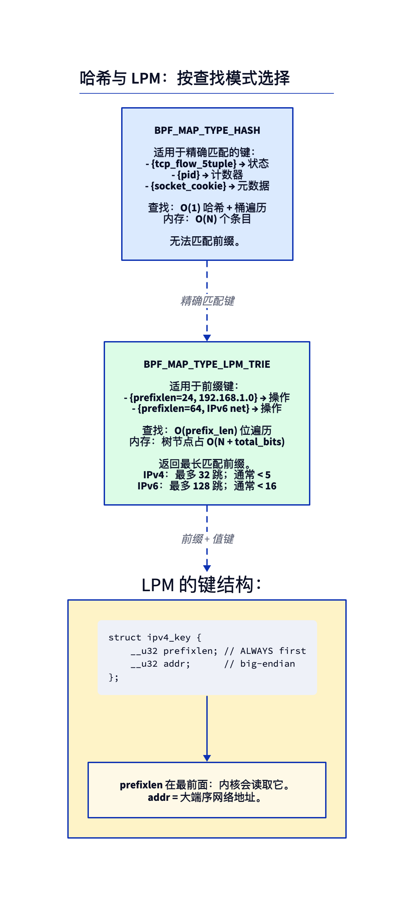
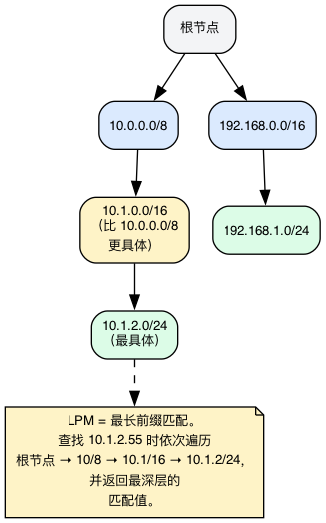
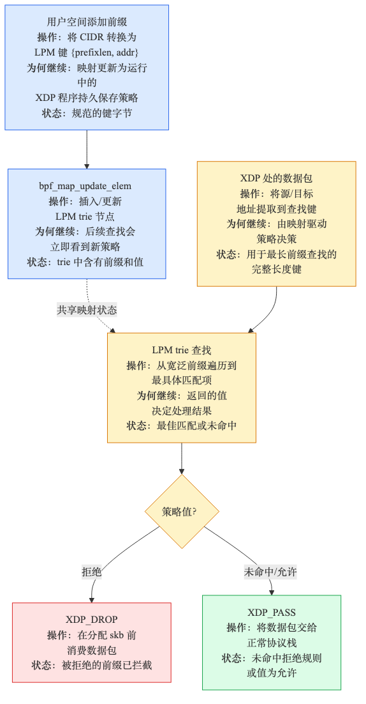
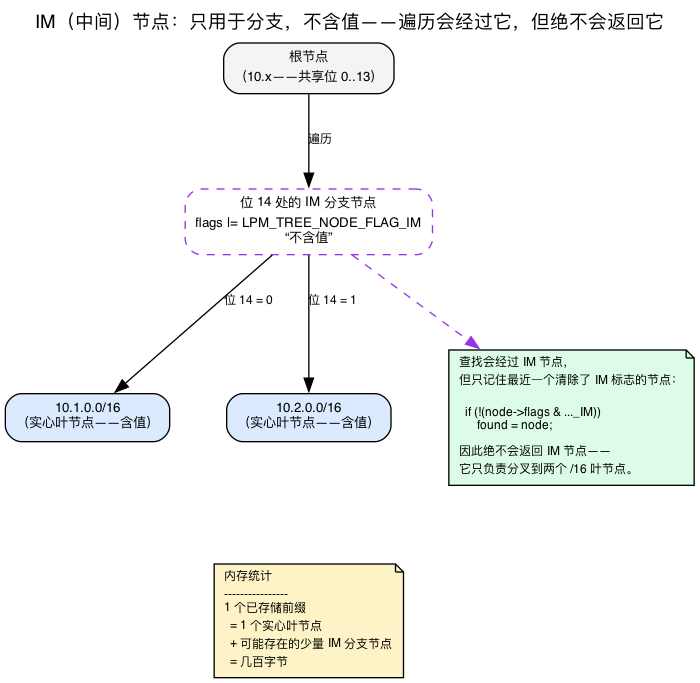
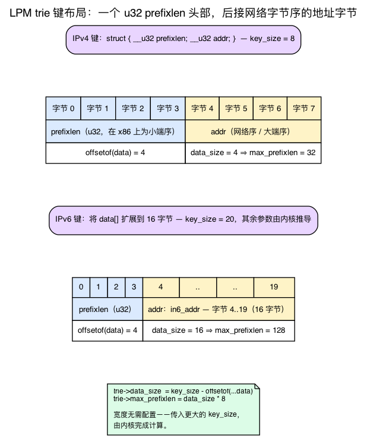
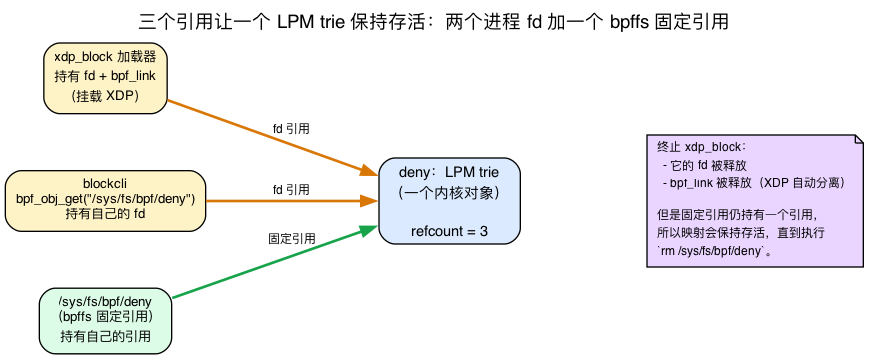

# 第15天 — XDP 防火墙：以线速丢弃 CIDR

> **今日任务：** 把昨天的计数器改造成由用户空间控制的拒绝列表（denylist），用来丢弃来自可配置 IPv4 前缀的流量。在此过程中，你还会学到本实验暗中依赖的三件事：BPF 映射如何在*创建它的进程退出后继续存在，并供其他进程共享*（通过 pinning + bpffs）、内核对 LPM 键所要求的确切字节布局及其*原因*，以及 trie 在底层究竟会分配什么，从而准确理解每个条目的内存开销（一个叶子节点*外加*自动创建的分支节点）。总用时：约 110 分钟。

## 错误的做法与正确的做法

要丢弃来自 `10.1.2.0/24` 的流量，你可以把全部 256 个 IP 塞进一个哈希映射（第2天中的 `BPF_MAP_TYPE_HASH`）。这样能工作，但扩展不到 `10.0.0.0/8`（1600 万条记录），对 IPv6 更是完全不行（……你总不能把每个 /64 前缀都枚举出来）。

你需要的是**前缀匹配**。对应的映射类型是 `BPF_MAP_TYPE_LPM_TRIE`。



## LPM trie（最长前缀匹配字典树）

一种逐位构建的前缀树。依次插入 `10.0.0.0/8`、`10.1.0.0/16`、`10.1.2.0/24`，trie 会把它们放在各自正确的深度上。



以键 `10.1.2.55` 进行一次查找，走的是：

1. 根节点。
2. 匹配前 8 位（10.x.x.x）→ `10.0.0.0/8` 节点。
3. 匹配接下来 8 位（10.1.x.x）→ `10.1.0.0/16` 节点。
4. 匹配再接下来 8 位（10.1.2.x）→ `10.1.2.0/24` 节点。
5. 没有更深的匹配 → 返回 `10.1.2.0/24` 处的值。

这就是**最长前缀匹配（Longest Prefix Match，LPM）**——与 IP 路由所用的算法相同。查找开销是 O(前缀长度)：IPv4 最多 32 跳，IPv6 约 128 跳，但实际中要少得多。



### 树里*实际*存的是什么：中间节点

前面那条干净利落的 root→/8→/16→/24 走法只是一种简化，而这个简化恰好掩盖了 trie 真正的内存开销。这里是没有哪本教程会给你展示的部分。

假设你存储两个**在字节中途分叉**的前缀——比如 `10.1.0.0/16` 和 `10.2.0.0/16`。用二进制看，`10.1` 和 `10.2` 前 14 位相同，在第 14 位分道扬镳。这个 14 位的分叉点上并没有存储任何前缀，但树在这里仍然需要一个分叉。于是内核会**自动创建一个**：在分叉点放置一个*中间（IM）*节点，并把两个真实的 /16 叶子作为其子节点。

```c
/* kernel/bpf/lpm_trie.c:22 */
#define LPM_TREE_NODE_FLAG_IM BIT(0)
```

IM 节点是一次真正的分配——它占用内核内存——但它不持有**任何用户值**。它存在的唯一目的就是给两个真实前缀提供一个共同的父节点。*这*正是 “常见疑问”专栏的答案中所说的“每个叶子对应多个内部节点”，也是为什么每个存储的前缀所付出的代价超过 `sizeof(value)`：内核为每个节点——不论叶子还是分支——都按照 `leaf_size = sizeof(struct lpm_trie_node) + data_size + value_size`（`kernel/bpf/lpm_trie.c:601-602`）分配内存。头部（`struct lpm_trie_node`）是 `child[2]`（16 字节）+ `prefixlen`（4 字节）+ `flags`（4 字节）= 24 字节，因此对于本实验的 IPv4 映射（`data_size=4`、`value_size=4`）来说，一个节点是 24+4+4 = **32 字节**。内存开销不仅包括叶子，还包括通向它的每一个分支节点——每个已存储前缀会占用几十字节，而不是几百字节。`trie_update_elem` 会在分叉点分配这个 IM 节点：

```c
/* kernel/bpf/lpm_trie.c:423-444 — insert a branch node at the divergence point */
im_node = lpm_trie_node_alloc(trie, NULL);
...
im_node->prefixlen = matchlen;
im_node->flags |= LPM_TREE_NODE_FLAG_IM;     /* no value; pure branch */
...
rcu_assign_pointer(*slot, im_node);
```

有两个推论值得了解：

- **查找会把 IM 节点排除在匹配候选之外。** 遍历过程会*穿过*一个 IM 节点，但只有当它是真实节点时才会把它“记住”作为结果。源码只在 IM 标志未设置时才记录找到的节点：

  ```c
  /* kernel/bpf/lpm_trie.c:271-275, inside trie_lookup_elem */
  /* Consider this node as return candidate unless it is an
   * artificially added intermediate one. */
  if (!(node->flags & LPM_TREE_NODE_FLAG_IM))
      found = node;
  ```

  所以“最长前缀匹配”字面上就是“遍历过程中经过的最后一个*非中间*节点”。这就是前面那段含糊说法背后的机制。

- **IM 节点会被“提升”，而不是被泄漏。** 如果你之后在某个 IM 节点的分叉点上恰好插入一个前缀，那个分叉*位置*会变成一个真实节点，而不会造成泄漏。其机制是复制并替换，而不是就地清除标志：`trie_update_elem` 总是先分配好一个全新的 `new_node`（`lpm_trie.c:341`），当更新恰好落在一个既有的、IM 标志仍然设置的节点上（`node->prefixlen == matchlen`）时，新的真实节点会继承该 IM 节点的两个子节点，通过 `rcu_assign_pointer` 被换入该槽位，随后旧的 IM 节点被释放（`lpm_trie.c:387-406`）。也就是说内核并不是保留同一个节点对象再清除其标志——而是替换该节点，同时复用它在树中的位置。源码注释用了一个 `192.168.0.0/23` 的例子，把这称为“按需变成一个'真实'节点”／IM 节点被“重用”（`lpm_trie.c:142`），这里的“重用”指的是分叉点，而不是那块分配的内存。

查找过程还有两个值得一提的提前退出点，因为它们让 O(前缀长度) 的开销变得具体：如果某个节点匹配了键的**全部**宽度，会立即返回（精确匹配）；如果匹配的位数少于该节点自身的前缀长度，则停止并返回最后一个见过的真实节点：

```c
/* kernel/bpf/lpm_trie.c:259-262 — exact match: stop now */
if (matchlen == trie->max_prefixlen) {
    found = node;
    break;
}
/* ... matchlen < node->prefixlen ⇒ bail, return last seen */
```

最后一个细节，与字节序有关：遍历过程是**按 MSB 优先**读取键的——第 0 位是字节 0 的*最高*位。

```c
/* kernel/bpf/lpm_trie.c:154 */
static inline int extract_bit(const u8 *data, size_t index)
{
    return !!(data[index / 8] & (1 << (7 - (index % 8))));
}
```

这也是为什么地址必须以网络字节序（大端）存储：trie 是从线路的最高有效位开始逐位遍历的，因此字节必须是线路顺序，“前 8 位”才真正意味着“第一个字节”。



## 键结构体：内核真正要求什么，以及为什么

LPM trie 的键*必须*以一个 `prefixlen` 字段开头，接着是地址字节：

```c
struct ipv4_lpm_key {
    __u32 prefixlen;   /* always first */
    __u32 addr;        /* network byte order */
};
```

这是每个示例都会重复的约定，但并非随意规定——你手写的结构体实际对应一个真正的 UAPI 类型，内核还会用编译期断言强制保证这种布局。规范的键是：

```c
/* include/uapi/linux/bpf.h:103-109 */
struct bpf_lpm_trie_key_u8 {
    union {
        struct bpf_lpm_trie_key_hdr hdr;
        __u32                       prefixlen;
    };
    __u8 data[];     /* Arbitrary size */
};
```

（`data[]` 就是地址字节。）一个 4 字节的 `prefixlen` 头部，后面跟一个**柔性数组**的地址字节。你写的 `{ prefixlen; addr; }` 恰好就是这个头部加一个 4 字节 `data[]` 负载。从这个结构体可以推出三个事实，每一个都为章节中原本要你死记硬背的规则提供了依据：

1. **`prefixlen` 必须位于最前面，且地址必须按 u32 对齐。** 内核通过 `BUILD_BUG_ON` 强制检查数据数组的偏移量：

   ```c
   /* kernel/bpf/lpm_trie.c:176 */
   BUILD_BUG_ON(offsetof(struct bpf_lpm_trie_key_u8, data) % sizeof(u32));
   ```

   因此地址字节必然落在偏移量 4 处。这不是一个需要你记住的巧合，而是这种布局在构建期就必须满足的不变量。

2. **地址的*宽度*是推导出来的，而非硬编码的。** 内核通过从你声明的 `key_size` 中减去头部大小来计算地址字节数，然后把这个位数设为最大前缀长度：

   ```c
   /* kernel/bpf/lpm_trie.c:594-596, in trie_alloc */
   trie->data_size = attr->key_size -
                     offsetof(struct bpf_lpm_trie_key_u8, data);
   trie->max_prefixlen = trie->data_size * 8;
   ```

   一个 4 字节的 `addr` ⇒ `data_size = 4` ⇒ `max_prefixlen = 32`。把结构体扩大到容纳一个 16 字节的 `in6_addr` ⇒ `data_size = 16` ⇒ `max_prefixlen = 128`。**这正是破坏实验 4 中的 IPv6 版本“直接就能用”的全部原因**——你什么都不用配置，只是给了内核一个更大的 `key_size`，剩下的算术都是内核自己完成的。

3. **查找所用的键使用 `prefixlen = 32`**——意思是“这是一个精确的主机地址，把它与*任意*已存储的前缀进行匹配”。内核会在一开始就拒绝一个 `prefixlen` 超过该 trie 最大值的键：

   ```c
   /* kernel/bpf/lpm_trie.c:244-245, in trie_lookup_elem */
   if (key->prefixlen > trie->max_prefixlen)
       return NULL;
   ```

所以 `{ .prefixlen = 16, .addr = 0x0a010000 }` 意味着 “10.1.0.0/16” ——只有 `addr` 的高 16 位有意义；而 `{ .prefixlen = 32, .addr = <packet saddr> }` 意味着“查找这个精确的源 IP，并给我覆盖它的、已存储的最长前缀”。



## 在两个进程间共享一棵 trie：pinning 与 bpffs

这里将引入一个全新的概念。到目前为止的每一章（第1–14天）都会加载一个骨架（skeleton），并把映射的文件描述符保留在*同一个进程内部*；进程一旦退出，一切就随之消失。第14天的计数器在加载器退出的那一刻就不复存在了。今天的实验有**两个独立的程序**——一个负责挂载 XDP 程序的加载器，以及一个负责修改拒绝列表的 CLI——它们必须操作*同一棵* trie。这就需要一种到目前为止都还用不到的机制：**固定（pinning）**。

### 映射是文件描述符背后的一个内核对象

回想第2天里讲的：用户空间从不持有指向映射的内核指针——它持有的是一个**整数文件描述符**，也就是通向内核对象的句柄。程序和链接也是一样。而且和任何由 fd 引用的内核对象一样，一个 BPF 映射是**引用计数**的：只要还有至少一个 fd 引用它，内核就让它保持存活，只有当**最后一个 fd 关闭**时才会释放它。UAPI 头文件里直接写明了这一点：

```
/* include/uapi/linux/bpf.h:951 */
* An eBPF object is deallocated only after all file descriptors referring
* to the object have been closed and no references remain pinned to the
* filesystem or attached ...
```

这一句话就解释了第14天发生的事：加载器持有唯一的 fd，加载器退出，引用计数归零，映射被释放。这在一个进程独占一切时没有问题，但当*第二个*、互不相关的进程需要访问同一个映射时就无能为力了——两个进程无法互相传递一个原始 fd。

### bpffs：一个让内核对象拥有名字的文件系统

两个进程借此共享对象的机制，是一个类型为 `bpf` 的特殊伪文件系统。它通常挂载在 **`/sys/fs/bpf`**，称为 *bpffs*。它在磁盘上不存放真实文件；每个目录项都是一个**绑定到某个内核 BPF 对象的名字**。创建这样的目录项称为**固定（pinning）**，这个固定项会持有*自己的一份引用*——这正对应上文“文件系统中不再有固定引用”（no references remain pinned to the filesystem）的条款。因此，即便**没有任何进程**打开着它，一个被固定的映射依然能存活。头文件里写明了这个契约：

```
/* include/uapi/linux/bpf.h:945-949 (paraphrased) */
* File descriptors referring to eBPF objects can be pinned to the
* filesystem using the BPF_OBJ_PIN command of bpf(2).
```

于是两个进程之间的流程就是：

- 进程 A（加载器）将映射**固定**到一个路径：这会在本次运行专属的目录下创建 `$PIN/deny`，并增加一份引用。
- 进程 B（CLI）调用 `bpf_obj_get("$PIN/deny")`，从而获得它*自己的一个 fd*，指向*同一个*底层映射。

这时，两个进程再加上固定项本身，都持有一份引用。这棵 trie 被共享，只要这三份引用中的*任意一个*还存在，它就保持存活。



### libbpf 的入口点

有两层做的是同一件事：

- **高层，从骨架出发：** `bpf_map__pin(map, path)`——加载器调用的就是它（`tools/lib/bpf/libbpf.c:9150`）。
- **低层，按 fd/路径操作：** `bpf_obj_pin(fd, path)`（`tools/lib/bpf/bpf.c:604`）以及 `bpf_obj_get(path)`（`tools/lib/bpf/bpf.c:609`）。

二者都封装了同样的两个 `bpf()` 系统调用命令，`BPF_OBJ_PIN` 和 `BPF_OBJ_GET`（`include/uapi/linux/bpf.h:962-963`）。CLI 从不打开骨架，也从不挂载任何东西——它只是调用 `bpf_obj_get` 获取一个 fd，然后照常发出第2天中的 `bpf_map_update_elem` / `bpf_map_delete_elem` 系统调用。

### 只固定映射，不固定程序——以及清理时的陷阱

注意，加载器固定的是**映射**，而不是程序。XDP 程序之所以保持挂载，是因为加载器通过 `pause()` 驻留，并始终保持它的 `bpf_link` 打开。只有*那棵 trie*需要共享，因此也只有它被固定。

这也带来了一个清理时容易忽略的问题。**杀掉加载器会丢弃它的 `bpf_link`，从而自动分离 XDP 程序**——很好，防火墙停止过滤了。但 bpffs 中那个*已固定的映射节点*持有一份独立引用；它会一直留在那里，直到你显式地把它 `rm` 掉：

```bash
sudo rm "$PIN/deny" "$PIN/stats" && sudo rmdir "$PIN"
```

如果忘了这一步，一棵陈旧的 `deny` trie 就会滞留在 bpffs 中占用内核内存，下一次 `bpf_map__pin` 到同一路径时会因为 `EEXIST` 而失败。

> ### 常见疑问
>
> **问：XDP 程序运行时，我可以更新 LPM trie 吗？**
>
> 答：可以。回想一下第2天讲过，映射读取是受 RCU 保护的——查找不加锁，元素在 RCU 意义下延迟释放，因此返回的指针不会在你手里被释放。LPM trie 是在 `rcu_dereference_check(...)` 配合 `rcu_read_lock_bh_held()`（`kernel/bpf/lpm_trie.c:249, :282`）之下遍历其节点的，所以即便 `blockcli` 正在修改它，XDP 的一次查找也能看到一棵一致的树。更新在单个键的粒度上是原子的。对热路径很友好。
>
> **问：与哈希相比，查找开销如何？**
>
> 答：对于精确匹配的键，哈希更快（O(1)）。对于前缀匹配，哈希根本做不到。LPM trie 的查找是 O(前缀长度)，但每一位的开销很低；在一棵 5 层的 trie 上，一次查找约 30 ns，而一次哈希命中约 10 ns。在线速场景下这是可以察觉的，但不至于致命。
>
> **问：这棵 trie 能容纳多少条记录？**
>
> 答：受 `max_entries` 限制。对一个 IPv4 叶子来说，每条记录大约花费 32 字节（24 字节节点头 + 4 字节地址 + 4 字节值，`lpm_trie.c:601-602`），再加上内核为把路径引向它而不得不制造的每个**中间分支节点**大约 32 字节（就是“树里实际存的是什么”一节中的 IM 节点）——现在你知道*为什么*了。所以 100 万条 IPv4 记录是几十 MB；1000 万条也只是几百 MB。（IPv6 加上较大的值时每个节点更大，但仍是几十字节，而不是几百字节。）
>
> **问：IPv6 怎么办？**
>
> 答：还是同一种映射类型，键结构体变大：`{ prefixlen, struct in6_addr addr; }`。你不需要配置任何东西——内核会从 `key_size` 推导出地址宽度（见“键结构体”一节）。把每个 32 位块都视为网络字节序。

## 端到端流程

你通过 `bpf_map_update_elem` 调用（第2天中的用户空间函数——填充一个 `union bpf_attr`，发出一次 `bpf()` 系统调用）从用户空间管理这份拒绝列表。XDP 程序对每个数据包只做一次 LPM 查找，匹配时就丢弃。

## 实验

### `block.bpf.c`

BPF 程序与 `blockcli` CLI 通过一个头文件共享 LPM 键的布局：

{{#include ../labs/day15/block.h}}

程序则是从编译好的源码中引入的：

{{#include ../labs/day15/block.bpf.c:book}}

有哪些新东西（以及它们各自的依据）：

- **`BPF_F_NO_PREALLOC`** 对 LPM 来说是必需的。哈希映射默认会预分配以获得快速更新；而 trie 是一棵动态树，内核在创建时*会因为缺少这个标志而直接拒绝*。这个标志的值是 `(1U << 0)`（`include/uapi/linux/bpf.h:1402`），`trie_alloc` 在没有设置它时会返回 `-EINVAL`——`!(attr->map_flags & BPF_F_NO_PREALLOC)` 就明明白白地写在这条合理性检查里（`kernel/bpf/lpm_trie.c:579`）。试试去掉这个标志（破坏实验 1），你就会撞上那一行代码。
- **传给查找的键使用 `prefixlen=32`**——你在问“把这个精确的 IP 与 trie 中的任意前缀做匹配”。地址直接来自 `ip->saddr`，它在线路上本来就已经是网络字节序——这恰好就是按 MSB 优先遍历的 `extract_bit` 所需要的顺序（参见“树里实际存的是什么”）。
- **分两类统计动作**：percpu 数组中的索引 0 和 1 分别保存放行与丢弃计数——这是第14天和第2天使用过的 `PERCPU_ARRAY` 加跨 CPU 求和模式。

### `blockcli.c` — 用户空间 CLI

{{#include ../labs/day15/blockcli.c:book}}

关键的一行是 `bpf_obj_get("$PIN_DIR/deny")`——没有骨架，没有挂载。这个进程会获得*自己的 fd*，指向加载器固定的同一个内核 trie；这正是 pinning 一节所述的共享机制。之后的一切都是普通的第2天用户空间映射 API。

### `block.c` — 加载器

上面两个代码文件都不负责挂载程序。完整的加载器会加载对象、创建一个此前不存在的固定目录，并为独立的 CLI 固定两个映射、挂载 XDP 程序，并在按下 Ctrl-C 之前持有全部这些资源：

{{#include ../labs/day15/block.c:book}}

正是这些固定项让两个进程得以共享一棵 trie：`block` 拥有骨架和挂载关系；`blockcli` 用 `bpf_obj_get` 打开 `$PIN_DIR/deny` 和 `$PIN_DIR/stats`。`bpf_map__pin`（`tools/lib/bpf/libbpf.c:9150`）发出 `BPF_OBJ_PIN`；`bpf_obj_get`（`tools/lib/bpf/bpf.c:609`）发出 `BPF_OBJ_GET`。加载器在每一条退出路径上都会移除这两个固定项及其目录，因此这套共享机制的存续时间恰好等于本次实验的运行时长。

### 运行

先搭建一个隔离的对端 `10.0.0.2`，这样才真的有东西可以 ping——否则不管 XDP 有没有在丢包，`ping` 都会超时，实验也就证明不了任何东西。一对 *veth* 就像一根虚拟网线：两个相连的接口，这里把其中一端（`veth1`）移到一个独立的网络命名空间（一个隔离的网络协议栈）中，让它表现得像一个远端对端。

```bash
sudo ip netns add peer
sudo ip link add veth0 type veth peer name veth1
sudo ip link set veth1 netns peer
sudo ip addr add 10.0.0.1/24 dev veth0 && sudo ip link set veth0 up
sudo ip -n peer addr add 10.0.0.2/24 dev veth1 && sudo ip -n peer link set veth1 up
```

XDP 运行在 **RX（入站）**上，因此丢弃动作必须发生在回显*应答*上——它的源地址是 `10.0.0.2`。把程序挂载到 `veth0` 上，也就是接收这些应答的主机侧：

```bash
make -C ebpf/labs day15
PIN=/sys/fs/bpf/practical-ebpf-day15-$$
sudo ebpf/labs/.output/day15/block veth0 "$PIN" &  # host RX side
LOADER=$!
trap 'sudo kill -INT "$LOADER" 2>/dev/null || true; wait "$LOADER" 2>/dev/null || true; sudo ip link del veth0 2>/dev/null || true; sudo ip netns del peer 2>/dev/null || true' EXIT
sleep 0.5

ping -c 3 10.0.0.2              # replies arrive on veth0 ingress -> PASS
sudo ebpf/labs/.output/day15/blockcli "$PIN" add 10.0.0.0/8
ping -c 3 10.0.0.2              # matching replies -> XDP_DROP -> 100% loss
sudo ebpf/labs/.output/day15/blockcli "$PIN" stats

sudo ebpf/labs/.output/day15/blockcli "$PIN" del 10.0.0.0/8
ping -c 3 10.0.0.2              # works again
```

需要观察的是**前后对比**：第一次 ping 得到应答（0% 丢包），而在 `add 10.0.0.0/8` 之后，应答在 `veth0` 的入站方向被丢弃，ping 报告 100% 丢包。`blockcli stats` 会用一个非零的丢弃计数来印证这一点：

```
pass=<some number> drop=3
```

（`drop` 应该是 3——每个被丢弃的回显应答对应一次。如果改成挂载到位于该命名空间内的 `veth1` 上，就*不会*丢弃这些应答，因为它们是从那一侧的 TX 方向离开的，而不是 RX。）

通过退出该 shell 或运行 trap 中的清理代码来完成清理。它只会向那个确切的加载器 PID 发信号（绝不使用宽泛的 `pkill`），等待加载器自动分离 XDP 并移除它所拥有的固定项和目录，然后只移除本次实验用到的那对 veth 和命名空间。如果加载器是被 `SIGKILL` 杀死的，它留下的固定项恰好演示了持久性规则；在重新运行之前，只需移除那个唯一的 `$PIN` 目录即可。

现在你有了一个由用户空间控制、以线速运行的防火墙。每一次 API 调用都会原子地更新这棵 trie；不需要重启 XDP。

---

## 依次尝试破坏

### 破坏实验 1 — 忘记 `BPF_F_NO_PREALLOC`

去掉这个标志。映射创建会失败：

```
libbpf: map 'deny': failed to create: EINVAL
```

这个 `EINVAL` 不是 libbpf 在无理取闹——它直接来自内核的 `trie_alloc`，该函数把 `!(attr->map_flags & BPF_F_NO_PREALLOC)` 列为返回 `ERR_PTR(-EINVAL)` 的条件之一（`kernel/bpf/lpm_trie.c:579`）。大多数映射类型会在创建时预分配哈希表桶以保证稳定性。而 LPM trie 是一棵按需分配节点的动态树，因此内核*坚持*要你用这个标志明确表达这一点。

### 破坏实验 2 — 插入时字节序出错

```c
out->addr = htonl(a.s_addr);   /* WRONG — already big-endian */
```

`inet_aton` 返回的本来就已经是网络字节序。再转换一次会把位翻转。你会插入“错误”的 CIDR，永远匹配不上。用下面的命令验证：

```bash
sudo bpftool map dump name deny
```

对一个没有 BTF 的 LPM 映射，`bpftool` 会把它转储成原始的小端十六进制字节数组——*而不是*解码成 `prefixlen N key 0xN` 这样的字符串。对于 `10.1.0.0/16`，你会看到：

```
key: 10 00 00 00 0a 01 00 00  value: 01 00 00 00
```

第一个 u32 是小端表示的 `prefixlen`（`10 00 00 00` = 16）；接下来的 4 个字节是网络序的地址——`0a 01 00 00` = 10.1.0.0（正确）。这正是“键结构体”一节中讲的字节布局的可视化：`prefixlen` 在偏移量 0，地址字节在偏移量 4。如果你做了双重转换，地址字节会反过来出现：`00 00 01 0a`。（加上 `-j` 可以得到同样的字节，以 JSON 十六进制数组的形式呈现。）

### 破坏实验 3 — 阻断自己的 SSH

如果你挂载在*真实*网卡上，并把 `0.0.0.0/0` 加进拒绝列表，你就切断了自己的会话。（千万别真的这么做。）`XDP_DROP` 发生在内核“放行 SSH”的逻辑之下。

在没有控制台访问权限的情况下要脱离这种情况：panic 后重启。或者更好的办法是：永远不要在没有带外应急通道的情况下在真实网卡上测试。

### 破坏实验 4 — 加上 IPv6

```c
struct ipv6_lpm_key {
    __u32 prefixlen;
    struct in6_addr addr;
};
```

更新映射定义的值类型，用 `inet_pton(AF_INET6, ...)` 解析 CIDR，在 BPF 中根据 `ETH_P_IPV6` 分支。形状相同，只是大小不同——现在你也知道了它为什么*直接*就能用：扩大结构体会增大 `key_size`，而内核会从中推导出地址宽度（见“键结构体”一节）。你从来不需要告诉内核“这是 IPv6”；对 `key_size` 的算术运算替你做了这件事。

---

## 该在内核中读什么

- **`kernel/bpf/lpm_trie.c`** ——实现所在。阅读 `trie_lookup_elem`（跳过 IM 节点的遍历在 `:271-275`，精确匹配的提前退出在 `:259-262`）以及 `trie_update_elem`（IM 节点插入在 `:423-444`）。约 800 行，很容易读懂。
- **`include/uapi/linux/bpf.h`** ——`struct bpf_lpm_trie_key_u8`（`:103-109`）、`BPF_OBJ_PIN`/`BPF_OBJ_GET` 命令（`:962-963`），以及 `BPF_F_NO_PREALLOC`（`:1402`）。
- **`tools/lib/bpf/libbpf.c` / `tools/lib/bpf/bpf.c`** ——`bpf_map__pin`（`:9150`）、`bpf_obj_pin`（`:604`）、`bpf_obj_get`（`:609`）：pinning 的入口点。
- **`tools/testing/selftests/bpf/map_tests/lpm_trie_map_basic_ops.c`** ——规范的测试，包含各种边界情形。

---

## 要点回顾

- **`BPF_MAP_TYPE_LPM_TRIE`** 用于前缀查找（CIDR、IPv6 前缀、MAC OUI）。
- 键结构体**必须以 `prefixlen` 开头**，后面跟地址字节——它照搬了 `struct bpf_lpm_trie_key_u8`，内核用 `BUILD_BUG_ON` 保证地址落在 u32 对齐的偏移量上（`lpm_trie.c:176`）。地址的**宽度**（进而 `max_prefixlen`）是从 `key_size` *推导*出来的，这也是为什么 IPv6 只需扩大结构体就“直接能用”。
- **始终设置 `BPF_F_NO_PREALLOC`**——没有它，内核在创建时就会返回 `-EINVAL`（`lpm_trie.c:579`）。
- 这棵 trie 会存储**没有值的中间（IM）分支节点**，用来分叉出不同的前缀；这才是每条记录真正的内存开销，而查找会*跳过*它们作为匹配候选（`lpm_trie.c:271-275`），返回最后一个非 IM 节点——这就是最长前缀匹配。
- 查找是 O(前缀长度)——足够快，可以做到线速；读取受 RCU 保护（第2天），可以在 XDP 运行时安全地更新。
- **固定（pinning）+ bpffs** 是让两个进程共享同一个映射的方法：BPF 对象通过 fd 进行引用计数，最后一个 fd 关闭时便会释放（这就是第14天的映射会消失的原因）；`/sys/fs/bpf` 中的固定项则会增加一份文件系统引用，即使创建进程已经退出，对象仍能存活。加载器调用 `bpf_map__pin`，CLI 则通过 `bpf_obj_get` 获得自己的 fd，指向同一棵 trie。本实验使用专属目录，并在正常退出时移除其中的固定项；一次强制的 `SIGKILL` 仍能说明为什么必须显式清除陈旧的固定项。
- 用户空间的 CIDR 解析：`inet_aton` 返回的就是网络字节序（不要再转换一次）——这是必需的，因为 trie 是按 MSB 优先遍历位的。
- 在部署到真实接口之前，先在 `veth` 对上测试。

---

## 检查问题

你把 `10.0.0.0/8` 和 `10.1.0.0/16` 都加入了拒绝列表。一个来自 `10.1.5.20` 的数据包到达。哪一条记录会匹配，查找开销是多少？

<details>
<summary>点击查看答案</summary>

**答案：** 两个前缀都匹配，但 LPM 会返回**最长**的那个——`10.1.0.0/16`。开销是 O(所匹配的前缀长度)——大约 16 次位比较，再加上树遍历的开销。trie 的节点按 root → /8 → /16 的顺序被访问，遍历过程会“记住”它经过的最后一个非中间节点（`lpm_trie.c:271-275`），返回 /16 处的值。在现代硬件上总共约 30 ns。

</details>

---

## 明天

第16天：tc-bpf——把 BPF 挂载到网络协议栈 L2/L3 的传统方式。我们会看看它为什么早于 XDP 出现、它能做到哪些 XDP 做不到的事，以及是什么样的 `tc qdisc` 生命周期之痛催生了 tcx。
