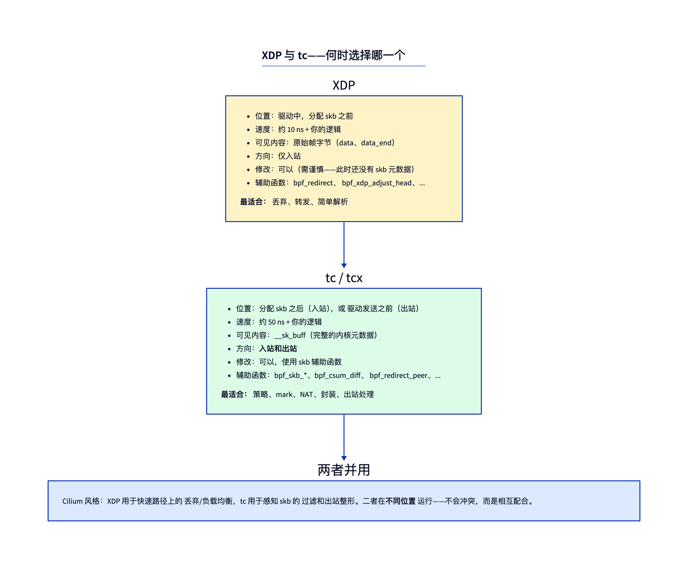
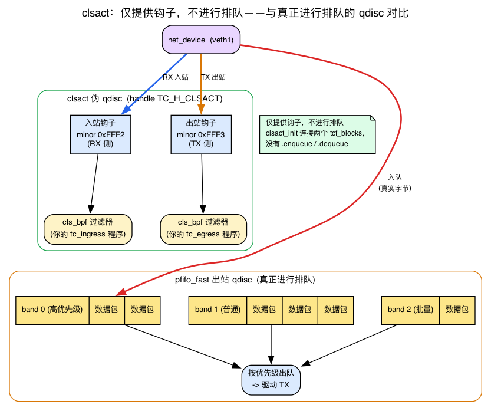
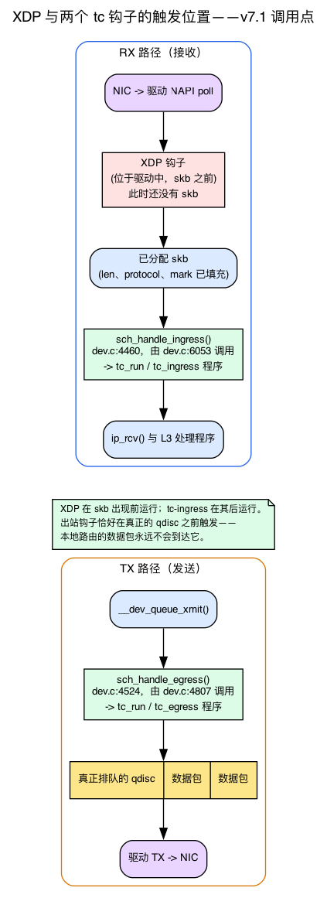

# 第16天 — tc-bpf：内核网络协议栈中的 BPF

> **今日任务：** 用经典 tc 把 BPF 挂载到一个网络接口的入站 *和* 出站方向，学习每条 `tc` 命令背后依赖的流量控制机制（qdisc / classifier / filter / clsact），理解为什么 XDP 做不到这一切，并亲身体会 `tc qdisc` 生命周期带来的痛点——这正是明天要讲的 tcx 的动机。总用时：约 110 分钟。

## 为什么已经有了 XDP，还需要 tc

在第14天和第15天，你已经通过 XDP 把 BPF 程序放进网卡驱动，让它在内核构建任何数据结构之前运行。那是最快的位置——但也正是它的局限：此时*还没有 skb*。没有连接跟踪（conntrack）元数据，没有 socket 查找，没有路由决策，也没有 skb 控制块。对于需要这些信息的程序（例如“为 conntrack 已识别的流打上标签”），XDP 就不够用了。

**tc-bpf** 运行在 skb 分配*之后*。你看到的是 `struct __sk_buff`——`struct sk_buff`（内核通用的数据包容器，你在配套网络书第1天剖析过它：带有 `head`/`data`/`tail`/`end` 指针和分页负载的描述符）的一个类型化视图。所有 XDP 无法展示给你的元数据，此刻都已经填好了。



另一个重大区别是：**tc 同时拥有入站和出站两个钩子**。XDP 只有入站。如果你想在数据包*发出的路上*丢弃或修改它（例如添加隧道封装、按 cgroup 打标记），就需要 tc。

但在写下第一行 BPF 代码之前，我们得先面对一堵陌生词汇构成的墙。今天实验里的每一条命令——`tc qdisc add dev veth1 clsact`、`tc filter add ... bpf da obj`、`tc filter show`——都来自一个比 BPF 早了十年、最初是为完全不同目的而设计的子系统。如果你只做过 XDP，那你从未接触过 *qdisc*、*classifier*、*filter*，或者一个叫 *clsact* 的东西。我们先把这些搞清楚，这样今天的实验就不会是照猫画虎。

## tc 流量控制模型：qdisc、classifier、filter

`tc` 是 **traffic control（流量控制）** 的缩写。早在 BPF 出现之前很久，Linux 就需要一种方式来做 **QoS**——对出站流量进行整形、分优先级、限速，好让你的 VoIP 数据包能够抢在一次批量文件上传前面。`tc` 配置的正是那个子系统，其核心对象就是 **qdisc**。

### qdisc 是什么

**qdisc**（队列规则，queueing discipline）是挂在某个 `net_device` 上的对象，决定数据包在发出去的路上*如何排队和调度*。当协议栈想要发送一个数据包时，它并不会直接把包交给驱动——而是把它*入队（enqueue）*到设备的 qdisc 上，qdisc 随后按照其算法规定的顺序把数据包*出队（dequeue）*。历史上这只存在于**出站（egress，TX）**路径上，因为那是你能控制的一侧：你无法让远端发送方放慢速度，但你可以选择*自己*的数据包离开的顺序。

大多数接口上的默认 qdisc 是 **`pfifo_fast`**——一个简单的三段位优先级 FIFO。它确实在排队：数据包进去，数据包出来，可能按优先级被重新排序。这才是 qdisc 的*正常*工作——对字节进行真正的缓冲和调度。

### classifier → filter → action 流水线

单纯的 FIFO 太笨了；要做真正的 QoS，你需要*分类（classify）*流量（“这是 VoIP，那是批量传输”），并对不同类别区别对待。于是 `tc` 长出了挂在 qdisc 上的三段流水线：

- **filter（过滤器）** 检查一个数据包，判断它是否匹配。`tc` 自带许多过滤器类型——`u32`（匹配原始头部字节）、`flower`（匹配已解析的字段），以及我们关心的这个，**`bpf`**（运行一个 BPF 程序）。过滤器就是*分类器（classifier）*：它的工作是判定“这个数据包属于类别 X”。
- **action（动作）** 随后决定数据包的*命运*——丢弃它、重定向它、重新打标记，或者放行。

所以概念上的流程是 **classifier → filter → action**。BPF 只是作为*另一种过滤器类型*（`cls_bpf`）被嫁接到这套老机制上的。这是今天要理解的最重要的一点，因为它解释了为什么挂载一个 tc-bpf 程序需要**两条**命令：一条安装提供挂载点的 qdisc，另一条把你的 BPF 程序作为*过滤器*添加到那个 qdisc 上。

你可以在内核里看到这个经典分类器的入口点。当一个数据包到达 `bpf` 过滤器时，内核会调用：

```c
/* net/sched/cls_bpf.c:81 */
TC_INDIRECT_SCOPE int cls_bpf_classify(struct sk_buff *skb,
                                       const struct tcf_proto *tp,
                                       struct tcf_result *res)
```

它作为 `.classify` 处理函数，被注册到 `bpf` 过滤器操作集中：

```c
/* net/sched/cls_bpf.c:685 */
.classify = cls_bpf_classify,
```

这个函数已经有十多年历史，正是 `tc filter add ... bpf` 命令所启用的传统路径。

### clsact：一个什么都不排队的 qdisc

这里有个转折。要挂载 BPF，你需要一个 qdisc 来提供挂载点——但你**不**想要真正 qdisc 带来的任何排队/整形行为。你只是想要一个地方，能同时在入站*和*出站两个方向挂上分类器。

这正是 **`clsact`** 的作用：一个特殊的**伪 qdisc**，不会对任何一个字节做排队或调度。它存在的唯一目的，就是暴露两个分类挂载点——一个用于入站，一个用于出站——让 tc-bpf 有地方可挂。这也是本章（以及内核社区）把它称为**脚手架（scaffold）**的原因：只有钩子，没有排队。

你可以在源码里印证这一说法。`clsact` 被注册为一个 qdisc，其 `.init` 是 `clsact_init`：

```c
/* net/sched/sch_ingress.c:341 */
.init = clsact_init,
/* net/sched/sch_ingress.c:337 */
.cl_ops = &clsact_class_ops,
```

而 `clsact_init`（`net/sched/sch_ingress.c:243`）做的事情仅仅是接好两个 **block（块）**——一个入站块和一个出站块——用来承载过滤器。“block”（`tcf_block`）只是内核用来装某个挂载点上过滤器链的容器。出站一侧由 `clsact_egress_block_set`（`sch_ingress.c:222`）/ `clsact_egress_block_get`（`sch_ingress.c:236`）接通；入站一侧复用了普通入站的接管逻辑 `ingress_ingress_block_set`（`sch_ingress.c:63`）。没有真正搬运数据包的 `.enqueue`/`.dequeue`——对比一下 `pfifo_fast`，它全都是 enqueue/dequeue。

**入站/出站的选择被编码在一个 handle 里。** qdisc 的 handle 是一个写作 `major:minor` 的 32 位数字。`clsact` 占用一个固定的保留 handle，而 *minor* 数字选择你的过滤器落在哪个挂载点上：

```c
/* include/uapi/linux/pkt_sched.h */
#define TC_H_CLSACT       TC_H_INGRESS   /* :77  the clsact qdisc handle itself */
#define TC_H_MIN_INGRESS  0xFFF2U        /* :80  the ingress hook */
#define TC_H_MIN_EGRESS   0xFFF3U        /* :81  the egress hook */
```

这就是 `ingress` 和 `egress` 这两个词背后的秘密——你会在 `tc filter add dev veth1 ingress ...` 里键入它们。它们**不是**设备名，也不是随意的关键字——它们是这些保留*次 handle*、用来选择方向的简写。`ingress` → `0xFFF2`，`egress` → `0xFFF3`。

这也提前解释了下面的破坏实验1：**没有安装 `clsact`，就没有 `tcf_block` 来承载你的过滤器**，所以 `tc filter add` 会失败，报错 `Parent Qdisc doesn't exists.`。qdisc 是父级，过滤器是子级；没有父级，就没有子级。



## 这两个钩子究竟在数据路径的哪里触发

你现在知道了 tc-bpf “运行在 skb 分配之后”，也知道存在两个钩子——但它们在接收和发送路径*中的哪个位置*执行？这个位置正是你据以推理调用顺序的依据——也就是检查问题所问的内容；同时也解释了为什么本地路由的数据包会跳过出站，这正是实验中命名空间技巧的由来。

RX 路径骨架（驱动 → NAPI poll → `__netif_receive_skb_core` → L3 处理函数）和 TX 路径（`__dev_queue_xmit` → qdisc → 驱动）在配套网络书的第2～3天有完整讲解。这里我们只需要这两个钩子的*位置*：

- **入站 tc** 运行在 RX 软件路径内部，发生在驱动/NAPI 已经构建好 skb **之后**，但在数据包被交给 L3 协议处理函数（`ip_rcv` 及其同类）**之前**。这就是“在 skb 分配之后”的具体含义：等到你的程序运行时，`__sk_buff` 已经带有 `len`、`protocol`、`mark` 等其余字段。
- **出站 tc** 运行在发送路径内部，**恰好在**数据包被入队到真正的（排队）qdisc 和驱动**之前**。一个被*本地投递*的数据包——例如通过环回路由到同一主机上某个地址——永远不会进入 `veth1` 上的这条发送路径，这正是今天的实验要把流量强制引到一个独立命名空间中的原因，好让这个 UDP 数据报真正穿过 `veth1` 的出站钩子。

在 v7.1 中，这两个钩子是通过 `sch_handle_ingress` 和 `sch_handle_egress` 到达的：

```c
/* net/core/dev.c:4460 — reads skb->dev->tcx_ingress; called at dev.c:6053 in the RX path */
static __always_inline struct sk_buff *
sch_handle_ingress(struct sk_buff *skb, struct packet_type **pt_prev, int *ret, ...)

/* net/core/dev.c:4524 — reads dev->tcx_egress; called at dev.c:4807 in __dev_queue_xmit */
static __always_inline struct sk_buff *
sch_handle_egress(struct sk_buff *skb, int *ret, struct net_device *dev)
```

两者都会先尝试 `tcx_run`（明天要讲的现代路径），再回退到经典的 `tc_run(tcx_entry(entry), skb, ...)`——*同一个钩子位置*被经典 tc-bpf 和 tcx 共用：

```c
/* net/core/dev.c:4485 (ingress) and dev.c:4544 (egress) */
sch_ret = tc_run(tcx_entry(entry), skb, &drop_reason);
```

`tcx_run` 本身（`net/core/dev.c:4439`）只是遍历它的程序列表，用 `bpf_prog_run` 逐个运行。要点是：因为入站 tc 固定处在 RX 路径中 skb *已经存在之后*的一个点，而 XDP 处在驱动中 skb *尚不存在之前*，所以 XDP → tc-ingress 的顺序是确定且顺序执行的——这正是今天检查问题要问的东西。



## tc 的上下文：`struct __sk_buff`

`struct sk_buff` 的一个只读为主的带类型视图（节选——`include/uapi/linux/bpf.h` 中的真实定义还接着 socket 和时间戳字段）：

```c
struct __sk_buff {
    __u32 len;
    __u32 pkt_type;        /* PACKET_HOST, PACKET_BROADCAST, ... */
    __u32 mark;            /* socket/skb mark */
    __u32 queue_mapping;
    __u32 protocol;        /* L3 protocol */
    __u32 vlan_present;
    __u32 vlan_tci;
    __u32 vlan_proto;
    __u32 priority;
    __u32 ingress_ifindex;
    __u32 ifindex;
    __u32 tc_index;        /* tc classification slot */
    __u32 cb[5];           /* skb control block — pass data between progs */
    __u32 hash;            /* skb hash */
    __u32 tc_classid;
    __u32 data;            /* same idea as xdp_md */
    __u32 data_end;
    __u32 napi_id;
    /* and more — family/remote_ip4/...; data_meta, tstamp, sk, etc. */
};
```

用 `data` 和 `data_end` 做直接数据包访问（和 XDP 一样的边界检查规则）。用 `mark`、`cb` 等字段与内核状态协调。

### `mark`：整个协议栈共享的临时标记

今天的实验在入站程序里写下了 `skb->mark = 0xCAFE`，随后从 `iptables` 匹配它。要理解这为什么讲得通，你需要知道 `mark` *是什么*，以及为什么一个 BPF 程序写入的值，对一个完全不同的子系统也是可见的。

- **`mark` 是 skb 上的一个 32 位临时字段**（内核中的 `struct sk_buff.mark`，在这里以 `__sk_buff.mark` 的形式呈现）。它**不是线路上数据包的一部分**——以太网/IP/TCP 的字节里什么都没变。它是*随 skb 在协议栈中流转的元数据*，就像描述符上贴的一张便利贴。
- 它与 netfilter 所说的数据包 *mark*（也就是 **fwmark** / **nfmark**）以及策略路由匹配所依据的字段是**同一个字段**。这种共享的身份正是 tc-bpf 写入的值随后能被 `iptables -m mark` 匹配到的原因：两者读的都是同一个 `skb->mark` 槽位。（iptables/netfilter 那一侧——`LOG` 目标、`INPUT` 链、`-m mark`——属于配套书 netfilter 章节的内容；匹配机制请参见 linux-net netfilter 一章。）
- `mark` 是 tc 程序被允许*写入*的少数几个 `__sk_buff` 字段之一（参见破坏实验3的可写字段列表），这正是这种协调方式一开始就合法的原因。我们可以直接确认这一点：在 `tc_cls_act_is_valid_access`（`net/core/filter.c:9186`）中，`BPF_WRITE` 的允许列表以 `case bpf_ctx_range(struct __sk_buff, mark):`（`filter.c:9193`）开头。
- 因为 mark 是按 skb 存放、且**不会在各钩子之间被重置**的，它是 BPF 与内核状态协调的典型方式——这正是本章全部的动机所在：在 BPF 里给数据包打标签，之后在 conntrack / 路由 / iptables 中据此采取行动。

## tc 的动作常量

```c
#define TC_ACT_OK         0   /* let the packet through */
#define TC_ACT_RECLASSIFY 1   /* reclassify */
#define TC_ACT_SHOT       2   /* drop */
#define TC_ACT_PIPE       3   /* pass to next filter */
#define TC_ACT_STOLEN     4   /* steal: don't free, prog took it */
#define TC_ACT_QUEUED     5
#define TC_ACT_REPEAT     6
#define TC_ACT_REDIRECT   7   /* paired with bpf_redirect() */
```

大多数程序返回 `TC_ACT_OK`（放行）、`TC_ACT_SHOT`（丢弃）或 `TC_ACT_REDIRECT`。

### `da` = direct-action：你的返回值*就是*裁决结果

下面的每一条挂载命令都用了 `bpf da obj tc.bpf.o`，`tc -s filter show` 也确实会打印出 `direct-action`。`da` 到底是什么？

回忆一下经典流水线：一个*分类器*返回一个 classid，而*另一个独立的* tc *动作对象*才真正执行丢弃或重定向。这种间接性——分类器在这边，动作在那边——是历史上的默认做法，而且很笨拙：你得创建一个动作对象，再把它接到分类器上。

**`da` = direct-action** 省去了这层间接机制。它告诉 `cls_bpf`：BPF 程序的**返回值本身就是 `TC_ACT_*` 裁决结果**——不需要另外的动作对象。这就是为什么实验里的程序可以直接 `return TC_ACT_SHOT` / `TC_ACT_OK` 并让它生效。

内部实现上这是 `TCA_BPF_FLAG_ACT_DIRECT` 标志位。解析路径会校验并记录它：

```c
/* net/sched/cls_bpf.c:473 */
if (bpf_flags & ~TCA_BPF_FLAG_ACT_DIRECT) { ret = -EINVAL; ... }
/* net/sched/cls_bpf.c:478 */
have_exts = bpf_flags & TCA_BPF_FLAG_ACT_DIRECT;
```

而 `tc filter show` 会把它回报出来（`cls_bpf.c:611`：`bpf_flags |= TCA_BPF_FLAG_ACT_DIRECT;`），这就是你看到的那个 `direct-action` 字符串。返回值在 `cls_bpf_classify`（`cls_bpf.c:81`）内部被当作裁决结果消费。没有 `da` 的话，你就得手动搭建分类器加 action 的管线；实际上*几乎所有*现代 tc-bpf 都在用 direct-action，而这也正是 tcx 明天要继承的概念。

> ### 常见疑问
>
> **问：tc 看到的是被 GRO 合并过的数据包，还是单个数据包？**
>
> 答：入站方向的 tc 看到的是 NAPI/GRO 产出的结果。回忆一下配套网络书里的 NAPI 接收轮询（第1～2天：驱动在软中断中排空 RX 描述符环）。**GRO（Generic Receive Offload，通用接收卸载）** 是叠加在其上的一个软件步骤：在 NAPI 接收过程中，内核会*把同一条流里连续的报文段合并成一个更大的 skb*，然后再把它交给上层协议栈。所以 tc-ingress——它处在这次合并*之后*的 RX 路径中——看到的可能是单个合并后的“超级包”，而不是线路上实际到达的一个个独立帧。GRO 提升了吞吐量，但隐藏了逐帧结构，这也是为什么需要精确逐包语义的工具（比如 Cilium）会禁用 GRO。到了**出站**方向，这个顾虑并没有消失——只是卸载的形式变了。出站钩子（`sch_handle_egress`）在 `__dev_queue_xmit` 内部触发，发生在真正的 qdisc *之前*，更是远在分段（segmentation）*之前*：`skb_gso_segment` 则运行得更晚，于 `validate_xmit_skb` 内部执行，这一步发生在通往 `dev_hard_start_xmit` 的路上（如果网卡用硬件做 TSO，这一步会被完全跳过）。所以一个 TCP 发送方的大块 GSO/TSO 缓冲区，到达出站钩子时是单个超级 skb（`gso_segs > 1`，跨越多个 MTU 大小的数据）——这是出站方向对 GRO 超级包的类比，*不是*逐帧视图。tc-egress 看到的 skb 是分段*之前*的，所以出站方向也存在和 GRO 在入站方向造成的同样的合并顾虑。
>
> **问：为什么挂载机制这么别扭（`tc qdisc add` + `tc filter add`）？**
>
> 答：正如模型那一节解释的，tc 比 BPF 出现得早。它最初是为 QoS（排队规则）设计的数据包分类系统，而 BPF 程序是作为一种*过滤器*类型被嫁接进来的。qdisc 提供挂载点；过滤器就是你的 BPF。所以需要两条命令。tcx（明天）彻底抛弃了这套东西。

## 实验：在入站和出站方向使用 tc

### `tc.bpf.c`

从实验构建和 CI 编译所用的源码中引入（今天没有用户空间加载器——目标文件是通过下面的 `tc` 命令挂载的）：

{{#include ../labs/day16/tc.bpf.c:book}}

### 准备工作：构建目标文件和一对带命名空间的 veth

先构建目标文件（第14～15天中是用 `make` 驱动的；这里给出显式的编译命令）：

```bash
clang -O2 -g -target bpf -c tc.bpf.c -o tc.bpf.o   # or: make
```

现在来看拓扑。和第14天不同，我们把 veth 对的一端放进它**自己的网络命名空间**里。这一点对出站演示至关重要：正如数据路径那一节所解释的，出站钩子只会从*发送*路径内部触发。如果两端都留在根命名空间里，发往 `veth1` 自身地址（`10.0.0.2`）的数据包会走环回路由，**永远不会穿过 `veth1` 的出站钩子**——那样，下面的出站丢包演示就根本不会触发。命名空间强迫数据包真正从 `veth1` 发出去。

```bash
sudo ip netns add ns1
sudo ip link add veth0 type veth peer name veth1
sudo ip link set veth1 netns ns1
sudo ip addr add 10.0.0.1/24 dev veth0
sudo ip link set veth0 up
sudo ip netns exec ns1 ip addr add 10.0.0.2/24 dev veth1
sudo ip netns exec ns1 ip link set veth1 up
sudo ip netns exec ns1 ip link set lo up
```

（如果上一次运行残留了 `veth0`/`ns1`，先执行文末的清理/拆除步骤。）

### 用经典方式挂载

`veth1` 活在 `ns1` 里，所以每条 `tc` 命令都要通过 `ip netns exec ns1` 在该命名空间内运行：

```bash
sudo ip netns exec ns1 tc qdisc add dev veth1 clsact

sudo ip netns exec ns1 tc filter add dev veth1 ingress \
     bpf da obj tc.bpf.o sec tc_ingress

sudo ip netns exec ns1 tc filter add dev veth1 egress \
     bpf da obj tc.bpf.o sec tc_egress

# verify:
sudo ip netns exec ns1 tc filter show dev veth1 ingress
sudo ip netns exec ns1 tc filter show dev veth1 egress
```

带着模型那一节的理解来看这三条命令：第一条安装了 `clsact` 伪 qdisc（这个脚手架——`clsact_init` 接好了入站和出站两个 block，但不排队任何东西）。接下来两条把你的 BPF 作为*过滤器*添加到各自的 block 上；`ingress`/`egress` 选择的是 `0xFFF2`/`0xFFF3` 次 handle，`da` 让程序的返回值成为裁决结果。

### 运行

从 `ns1` **内部**生成流量，好让它从 `veth1` 出站：

```bash
# ICMP passes — the egress program only drops UDP:
sudo ip netns exec ns1 ping -c 3 10.0.0.1

# UDP is dropped on veth1's egress. A `nc -u` send never reports an
# application error even when the datagram is silently dropped, so don't
# wait for nc to "fail" — instead watch the *peer* veth0 in the root ns:
# UDP never arrives, ICMP does. Start the sniffer first, then send.
sudo timeout 4 tcpdump -i veth0 -nn 'udp port 9999 or icmp' &
sudo ip netns exec ns1 ping -c 1 10.0.0.1
sudo ip netns exec ns1 nc -u -w1 10.0.0.1 9999 <<< "hi"
wait
```

你会看到 ICMP echo 请求抵达了 `veth0`，但**没有 UDP 数据包送到 9999 端口**——出站程序已经在 `veth1` 上将其丢弃，它从未离开过：

```
IP 10.0.0.2 > 10.0.0.1: ICMP echo request, ...
IP 10.0.0.1 > 10.0.0.2: ICMP echo reply, ...
```

> **为什么不用 `tc -s filter show ... egress`？** 用 `bpf da`（direct-action）时，不存在单独的 tc action 对象来累积统计，所以在这个内核上（iproute2 6.19.0，v7.1.0），`tc -s filter show` 只打印过滤器那一行——没有 `Sent ... (dropped N ...)` 计数器。丢包是真实发生的（tcpdump 已经证明了）；只是经典的按 action 统计那一行没有为 direct-action 过滤器输出。如果你想要一个计数器，给出站程序加一个 `BPF_MAP_TYPE_ARRAY`，在 `return TC_ACT_SHOT` 之前递增它，然后用 `bpftool map dump` 读取它。

### 在 iptables 里验证 mark

入站程序在传入的 IP 数据包上打上 `skb->mark = 0xCAFE`——就是我们前面讲过的那个共享 fwmark 槽位。要从用户空间观察到它，添加一条 `iptables` 规则，在 `ns1` 内部*匹配*这个 mark，然后看它的数据包计数器往上涨：

```bash
sudo ip netns exec ns1 iptables -A INPUT -m mark --mark 0xCAFE -j ACCEPT
sudo ip netns exec ns1 ping -c 3 10.0.0.1
sudo ip netns exec ns1 iptables -L INPUT -v -n
```

这条规则自己的 `pkts` 计数器，会随着每一个带有该 mark 的入站数据包而递增——这证明了 BPF 入站程序设置了它，并且 netfilter 读取的是*同一个* `skb->mark` 槽位（注意内核打印 mark 时是小写）：

```
Chain INPUT (policy ACCEPT ...)
 pkts bytes target  prot opt in   out  source     destination
    3   252 ACCEPT  all  --  *    *    0.0.0.0/0  0.0.0.0/0   mark match 0xcafe
```

> **为什么不用 `-j LOG` + `dmesg`？** 一个 netfilter 的 `LOG` 目标在*非 init* 网络命名空间内触发时，除非设置了 `net.netfilter.nf_log_all_netns=1`（默认是 `0`），否则**不会**进入内核环形缓冲区，所以这里 `sudo dmesg | tail` 什么都看不到。上面这个 `-v` 数据包计数器是非侵入式的，在 netns 内部也能工作，让实验保持自包含。（如果你一定要用 `LOG`，先执行 `sudo sysctl -w net.netfilter.nf_log_all_netns=1`，用完之后再重置回 `0`。）

### 拆除与清理

```bash
sudo ip netns exec ns1 tc filter del dev veth1 ingress
sudo ip netns exec ns1 tc filter del dev veth1 egress
sudo ip netns exec ns1 tc qdisc del dev veth1 clsact
# remove the mark-match rule we added above:
sudo ip netns exec ns1 iptables -D INPUT -m mark --mark 0xCAFE -j ACCEPT
# tear down the topology (deleting the namespace also removes veth1, and
# that removes its peer veth0):
sudo ip netns del ns1
```

三条命令才能撤销。如果你的测试进程中途崩溃了，你得记得手动清理。**没有基于 FD 的所有权。** 这正是 tcx 要解决的痛点。

---

## 按顺序破坏它

### 破坏实验1——忘记加 `clsact`

```bash
# Skip `tc qdisc add ... clsact` and jump straight to the filter:
sudo ip netns exec ns1 tc filter add dev veth1 ingress bpf da obj tc.bpf.o sec tc_ingress
# Error: Parent Qdisc doesn't exists.
```

这正是模型一节所说明的失败：没有 `clsact`，`clsact_init` 从未运行过，所以**没有 `tcf_block`** 来承载过滤器——根本不存在入站/出站的槽位。还请注意这里的 `ingress` 是父级*方向*关键字（`0xFFF2` 次 handle），不是设备名——所以内核报的是缺少*父级 qdisc*，而不是缺少设备。（具体报错文本与 iproute2 版本有关：6.x 打印 `Error: Parent Qdisc doesn't exists.`；更老的 iproute2 打印 `RTNETLINK answers: No such file or directory`。）先加上 `clsact`。

### 破坏实验2——尝试一个在 tc 里不能用的 BPF 辅助函数

在 `tc_ingress` 里加一个只有 XDP 能用的辅助函数，重新构建并重新挂载：

```c
/* inside tc_ingress() — bpf_xdp_adjust_head's real signature is
   (struct xdp_md *, int), so this is the wrong program type for it */
bpf_xdp_adjust_head(skb, 0);
```

```bash
clang -O2 -g -target bpf -c tc.bpf.c -o tc.bpf.o
sudo ip netns exec ns1 tc filter add dev veth1 ingress bpf da obj tc.bpf.o sec tc_ingress 2>&1 | tail
# program of this type cannot use helper bpf_xdp_adjust_head#44
```

注意这是一个*禁止使用该辅助函数*的拒绝，而不是“未知函数”——这个辅助函数是存在的（它是 44 号辅助函数；你可以用 `FN(xdp_adjust_head, 44, ...)` 在 `include/uapi/linux/bpf.h:5949` 确认），但每种程序类型都有自己的辅助函数许可表，而 `bpf_xdp_adjust_head` 是 XDP 专属的。

### 破坏实验3——设置 `skb->len`

```c
skb->len = 100;
```

验证器会拒绝——`__sk_buff` 的大多数字段是只读的。对于 tc 程序，可写的字段在 `tc_cls_act_is_valid_access`（`net/core/filter.c`）里被明确列出：`mark`、`tc_index`、`priority`、`tc_classid`、`cb[0..4]`、`tstamp` 以及 `queue_mapping`。`len` 不在其中。（这正是*允许*我们的入站程序写入 `skb->mark = 0xCAFE` 的同一份允许列表——`mark` 在列表里，`len` 不在。）

### 破坏实验4——在同一个优先级上放多个程序

```bash
sudo ip netns exec ns1 tc filter add dev veth1 ingress pref 100 handle 1 bpf da obj tc.bpf.o sec tc_ingress
sudo ip netns exec ns1 tc filter add dev veth1 ingress pref 100 handle 1 bpf da obj tc.bpf.o sec tc_ingress
# Error: Filter already exists.
```

冲突发生在**优先级 + handle** 这个组合上，而不是单单优先级。第二次以*没有*显式 handle 的方式添加同一个 `pref 100`，并**不会**失败——它会获得自动 handle `0x2`，两个过滤器串在一起，按 handle 顺序运行。只有重复使用同一个 `pref`+`handle` 组合才会报错。要以受控的顺序运行多个程序，应使用不同的 pref（`pref 100`、`pref 200`）；替换一个已存在的过滤器需要先删再加（或者用 `tc filter replace`）。用 `sudo ip netns exec ns1 tc -s filter show dev veth1 ingress` 来查看。**这种笨拙正是 tcx 的 mprog API 要解决的问题。**

---

## 应该去内核里读什么

- **`net/sched/cls_bpf.c`**——经典 tc-bpf 分类器（`cls_bpf_classify` 位于 `:81`）。已有约 10 年历史。搜索 `TCA_BPF_FLAG_ACT_DIRECT`（`:478`、`:611`），看看 direct-action 是如何被解析和回报的。
- **`net/sched/sch_ingress.c`**——`clsact_init`（`:243`）以及入站/出站 block 的接管逻辑（`clsact_egress_block_set` 位于 `:222`）。这就是整个“脚手架” qdisc 的全部。
- **`net/core/dev.c`**——`sch_handle_ingress`（`:4460`）和 `sch_handle_egress`（`:4524`）；RX 路径中的调用点（`:6053`）和 `__dev_queue_xmit`（`:4807`）精确展示了这两个钩子触发的位置。
- **`tools/lib/bpf/netlink.c`**——搜索 `bpf_tc_attach`。传统接口的 libbpf 封装。

---

## 要点回顾

- **qdisc** 是挂在每个设备上、为出站流量做排队/调度以实现 QoS 的对象；默认的 `pfifo_fast` 确实会排队。tc 的流水线是 **classifier → filter → action**，而 BPF 只是一种*过滤器*类型（`cls_bpf`）。
- **`clsact`** 是一个*什么都不*排队的伪 qdisc——它只是暴露入站（`0xFFF2`）和出站（`0xFFF3`）两个挂载点，好让 tc-bpf 有地方可挂。没有 clsact ⇒ 没有 `tcf_block` ⇒ `Parent Qdisc doesn't exists.`
- 这两个钩子在数据路径中的固定位置触发：**入站**发生在 skb 已构建但尚未进入 L3 之前（`sch_handle_ingress`），**出站**发生在 `__dev_queue_xmit` 中真正的 qdisc 之前（`sch_handle_egress`）。本地路由的数据包会在 `veth1` 上跳过出站——这就是为什么要用命名空间。
- **`da`（direct-action）** 让程序的返回值*直接就是* `TC_ACT_*` 裁决结果（`TCA_BPF_FLAG_ACT_DIRECT`），所以不需要单独的 action 对象。
- **tc-bpf** 运行在 skb 分配之后；能看到带有完整内核元数据的 `__sk_buff`。同时拥有**入站和出站**两个钩子（XDP 只有入站）。
- **`skb->mark`** 是一个 32 位的每 skb 临时标记（fwmark/nfmark），它*不*在线路上，并且*可以*被 tc 写入——这是 BPF 与 netfilter/路由协调的典型方式。
- 动作常量：`TC_ACT_OK`、`TC_ACT_SHOT`、`TC_ACT_REDIRECT`。
- 经典挂载方式：`tc qdisc add ... clsact` + `tc filter add ... bpf`。**搭建需要三条命令，拆除也需要三条。** 没有基于 FD 的所有权；崩溃后的清理很脆弱。
- **新代码请使用 tcx（第17天）。** 经典 tc-bpf 已是遗留技术。

---

## 检查问题

你把同一个 BPF 程序同时挂到同一张网卡的 XDP 和 tc-ingress 上。两者都会在每个入站数据包上运行。你会看到它们以确定的顺序被调用吗？

<details>
<summary>点击查看答案</summary>

**答案：** 会。**XDP 先运行**（在驱动里，在 skb 分配之前）。如果 XDP 返回 `XDP_PASS`，数据包继续往下走；内核分配 skb，并调用 tc-ingress（通过 `sch_handle_ingress`）。如果 XDP 返回 `XDP_DROP`，tc-ingress 永远不会看到这个数据包。它们是顺序执行的，而不是并发的——XDP 的决定决定了 tc 是否还会运行。

</details>

---

## 明天

第17天：tcx——与 tc-bpf 相同的钩子位置（就是我们今天读过的那个 `sch_handle_ingress`/`sch_handle_egress` 调用点，只是走 `tcx_run` 分支而不是 `tc_run`），但拥有 `bpf_link` 生命周期、通过 `mprog` 实现的多程序排序，以及零 `tc qdisc` 仪式。
