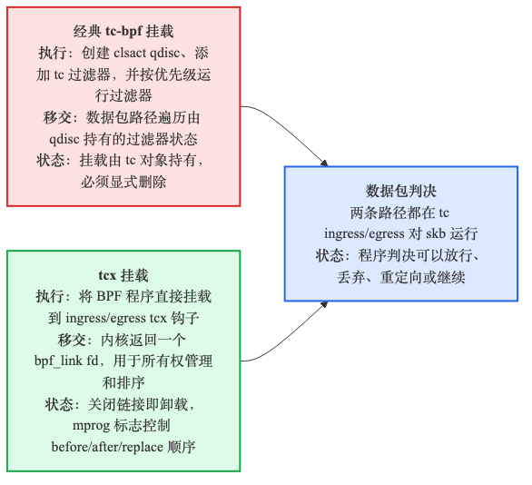
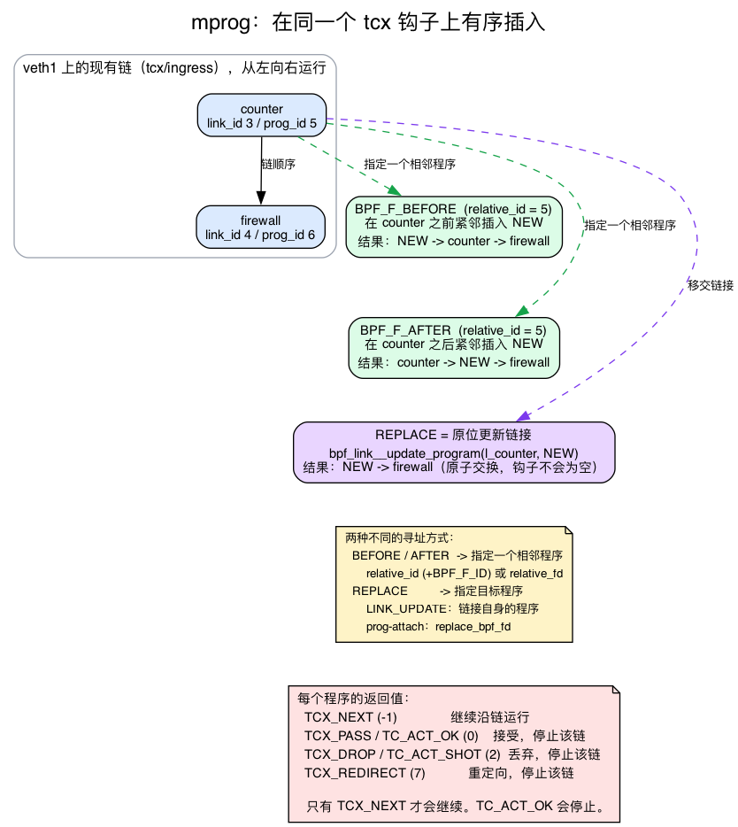
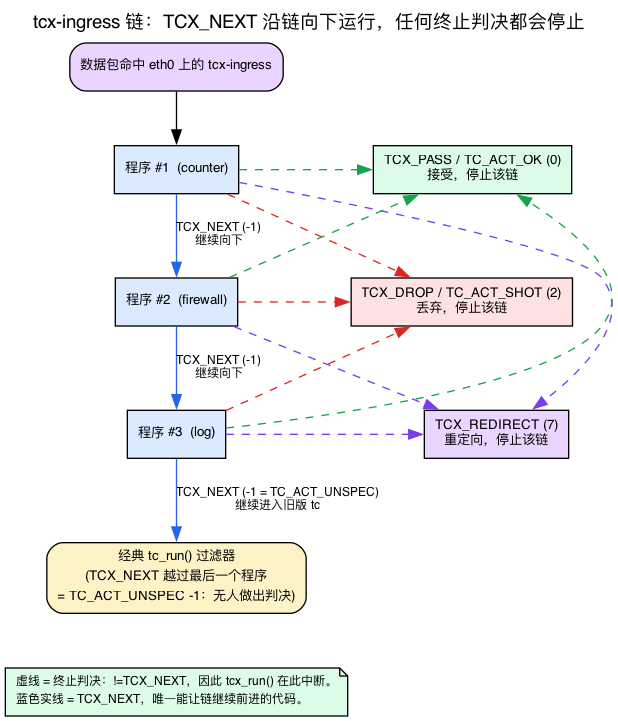

# 第17天 — tcx：基于 link 的多程序网络挂载

> **今日任务：** 用 tcx 重写昨天的程序，把两个程序按确定的顺序挂到同一个钩子上，体会为什么它在新代码中取代了经典 tc-bpf。过程中我们会澄清 tcx 教程最容易讲反的关键问题——**链式推进**返回码——并学习 mprog 如何指定“你要插到哪个程序旁边”。总用时：约 110 分钟。

## tcx 修复了什么

昨天的 tc-bpf 有三处不便：
1. **挂载要三条命令**（qdisc、filter、program），卸载也要三条。
2. **没有 `bpf_link` 所有权**——如果你的加载器进程崩溃了，BPF 仍保持挂载，你必须手动清理。
3. **在同一个钩子上挂多个程序**很别扭——你得手动折腾 filter 优先级。

tcx（Linux 6.6+，提交 `e420bed02507`）把这三个问题都解决了。



一次系统调用完成挂载。返回一个 `bpf_link` FD。关闭这个 FD 即卸载。多个程序之间的顺序则使用 **mprog**——同一套支撑 tcx 和 netkit 的多程序抽象。

### 回顾：什么是 `bpf_link`（第14天、第16天）

你在 **第14天** 通过 XDP 见过 `bpf_link`：`bpf_program__attach_xdp` 返回一个 `struct bpf_link`，关闭其 FD 会自动卸载程序（`day14.md:166,185,213`）。**第16天** 把它和经典 tc-bpf 做了对比——后者*根本没有* FD 所有权（`day16.md:210,278`）。这里只需记住一句话：

> `bpf_link` 是内核对象，代表**一次挂载**，持有对程序的**一个引用**。用户空间的 FD *拥有*这个 link——关闭 FD（或进程退出）时引用计数下降，挂载随之解除。程序本身只有在它的**最后一个**引用（link、pinned fd 或已打开的 program fd）消失时才会被卸载。

在 v7.1 中，libbpf 把这种 link 类型命名为 `"tcx"`（`tools/lib/bpf/libbpf.c:153`，`BPF_LINK_TYPE_TCX`），它所挂入的这条按设备维护的链，就是网络设备上的 `struct bpf_mprog_entry __rcu *tcx_ingress;`（`include/linux/netdevice.h:2196`）。

## mprog：BPF 程序的有序链

多个 BPF 程序可以挂到同一个钩子上（`eth0` 上的一个 tcx-ingress 可以有 N 个程序）。`mprog` 通过挂载时的标志位定义确定性的顺序：



- `BPF_F_BEFORE`——挂载到指定程序之前。
- `BPF_F_AFTER`——挂载到指定程序之后。
- `BPF_F_REPLACE`——原地替换某个指定程序。
- `BPF_F_LINK`——把相对目标解释为 *link* 的 ID/fd，而不是 program 的 ID/fd。
- `BPF_F_ID`——把相对目标解释为 *ID*，而不是 fd（与 `relative_id` 搭配使用）。

链会按顺序依次运行每个程序——但**程序如何表达“继续往下走”是你必须弄对的那件事**，而且它*不是*经典 tc-bpf 教你的那一套。

### 推进链的判定值：是 `TCX_NEXT`，不是 `TC_ACT_OK`

下面是内核里每钩子的链运行器 `tcx_run()`，位于 `net/core/dev.c`（第 4439 行）。慢慢读——它很短，每一行都要紧：

```c
/* net/core/dev.c:4439 */
static __always_inline enum tcx_action_base
tcx_run(const struct bpf_mprog_entry *entry, struct sk_buff *skb,
        const bool needs_mac)
{
    const struct bpf_mprog_fp *fp;
    const struct bpf_prog *prog;
    int ret = TCX_NEXT;                 /* :4444 — seed: "no decision yet" */

    if (needs_mac)
        __skb_push(skb, skb->mac_len);
    bpf_mprog_foreach_prog(entry, fp, prog) {   /* :4448 */
        bpf_compute_data_pointers(skb);
        ret = bpf_prog_run(prog, skb);          /* :4450 */
        if (ret != TCX_NEXT)                     /* :4451 */
            break;                               /*  ← ANY other value stops the chain */
    }
    if (needs_mac)
        __skb_pull(skb, skb->mac_len);
    return tcx_action_code(skb, ret);
}
```

盯着 `if (ret != TCX_NEXT) break;` 看。程序**只有**通过返回 `TCX_NEXT` 才能让链继续。*任何其他返回值*——包括你熟悉的 `TC_ACT_OK`——都会当场终止这条链。

这就是陷阱。你在第16天学过经典 tc-bpf 的判定值：`TC_ACT_OK`（“接受，放行”）、`TC_ACT_SHOT`（“丢弃”）、`TC_ACT_REDIRECT`（“重定向”）。很容易想当然地以为 `TC_ACT_OK` 就是一个 tcx 程序让下一个程序运行的方式。并不是。把两组数字摆在一起看：

```c
/* include/uapi/linux/bpf.h:6530 — the NEW tcx contract */
enum tcx_action_base {
    TCX_NEXT     = -1,
    TCX_PASS     = 0,
    TCX_DROP     = 2,
    TCX_REDIRECT = 7,
};

/* include/uapi/linux/pkt_cls.h:63 — the legacy tc-classic codes */
#define TC_ACT_UNSPEC   (-1)
#define TC_ACT_OK        0
#define TC_ACT_SHOT      2
#define TC_ACT_REDIRECT  7
```

*终结型*数值是刻意对齐的（uapi 的注释写着 tcx 的代码“必须与其对应的 TC_ACT_* 保持兼容”）：`TCX_PASS == TC_ACT_OK == 0`、`TCX_DROP == TC_ACT_SHOT == 2`、`TCX_REDIRECT == TC_ACT_REDIRECT == 7`。真正全新的值是 **`TCX_NEXT = -1`**，它在 tc-classic 里没有对应的判定值——数值上与它对得上的孪生兄弟是 `TC_ACT_UNSPEC`（“没人做决定”）。

所以 `return TC_ACT_OK;` 返回的是 `0`，等于 `TCX_PASS`，`!= TCX_NEXT`，于是链**以一个接受判定终止**。它做的恰恰是“让下一个程序运行”的*反面*。

### `-1` 在链之后去了哪里：`tcx_action_code()` 与回落到 tc

`tcx_run()` 如何处理初始值或程序返回的 `ret`？它会把这个值交给 `tcx_action_code()`（`include/net/tcx.h:145`）：

```c
/* include/net/tcx.h:145 */
static inline enum tcx_action_base tcx_action_code(struct sk_buff *skb, int code)
{
    switch (code) {
    case TCX_PASS:
        skb->tc_index = qdisc_skb_cb(skb)->tc_classid;
        fallthrough;
    case TCX_DROP:
    case TCX_REDIRECT:
        return code;            /* a real verdict — pass it straight through */
    case TCX_NEXT:
    default:
        return TCX_NEXT;        /* TCX_NEXT or anything unrecognized -> TCX_NEXT (-1) */
    }
}
```

`TCX_PASS`/`TCX_DROP`/`TCX_REDIRECT` 会原样返回——它们是最终判定。但 `TCX_NEXT`（以及任何未知代码）都映射到 `TCX_NEXT == -1`。而 `-1` 正好就是 `TC_ACT_UNSPEC`，ingress 分发器把它读作“没有 tcx 程序做出判定——回落到经典 tc”：

```c
/* net/core/dev.c:4481 */
sch_ret = tcx_run(entry, skb, true);
if (sch_ret != TC_ACT_UNSPEC)        /* :4482 */
    goto ingress_verdict;            /* a real verdict — act on it */
sch_ret = tc_run(tcx_entry(entry), skb, &drop_reason);   /* :4485 — else legacy tc filters */
```

所以如果链中**最后一个**程序返回 `TCX_NEXT`，控制流会回落到经典的 `tc_run()` filter——*不是*“接受”。`TCX_NEXT` 意味着“我不做决定”，一路让位，直到经典 tc 层。



### 要记住的心智模型

对每个包，一个 tcx 程序可以做两件事之一：

- **推迟决定**——“让下一个 link 来判断”——通过返回 `TCX_NEXT`。计数器、追踪器、不做策略决策的可观测性程序应该返回 `TCX_NEXT`。
- **做出决定**——给出最终判定并短路后续整条链——通过返回一个终结判定：`TCX_PASS`/`TC_ACT_OK`（接受）、`TCX_DROP`/`TC_ACT_SHOT`（丢弃）或 `TCX_REDIRECT`（重定向）。防火墙和策略程序应返回终结判定。

这是可组合的：一个计数器、一个防火墙、一个追踪器都可以各自独立安装，顺序在挂载时控制——前提是可观测性的 link 要返回 `TCX_NEXT`，这样下游的策略 link 才真的能跑起来。

> ### 常见疑问
>
> **问：如果我关闭 link 的 FD，BPF 对象会被卸载吗？**
>
> 答：只有在没有其他引用的情况下才会。link 是对程序的一个引用；关闭它会丢掉这个引用。如果用户空间还持有 `bpf_program__fd`，或者程序被 pin 在 `/sys/fs/bpf` 里，它就会保持已加载但未挂载的状态。
>
> **问：`tcx` 能和经典的 `tc filter add ... bpf` 共存吗？**
>
> 答：可以。它们共享同一个钩子点；多种挂载机制可以共存。事实上你刚才在源码里就看到了这种共存：一条以 `TCX_NEXT` 收尾的 tcx 链会回落到 `tc_run()` 的经典 filter。但通常你不会想把两者混用——针对给定系统选一种就好。
>
> **问：mprog 也存在于 XDP 吗？**
>
> 答：有一种 `xdp_multi` 挂载方式，但抽象略有不同（XDP 不是以同样的方式使用 mprog 的）。对 XDP 来说，多程序通常是通过前置一个“调度器（dispatcher）”程序加 `BPF_PROG_RUN` 尾调用来实现的。今天不涉及这部分。

## 实验

### 回顾：`__sk_buff` 直接数据包访问与 `PERCPU_ARRAY`（第14天、第16天）

下面的防火墙要读取数据包字节，计数器用了一个每 CPU 映射。这两个概念分别来自前面的章节——各用一句话回顾：

- **`struct __sk_buff` + `data`/`data_end`**（第16天，`day16.md:15-58,83-109`）：`__sk_buff` 是内核 `sk_buff` 的 BPF 类型化视图；`data`/`data_end` 界定了数据包窗口，**每一步**指针移动在解引用之前都必须重新做边界检查——和 XDP 一样的纪律。终结判定 `TC_ACT_OK`/`TC_ACT_SHOT`/`TC_ACT_REDIRECT` 从 tc-bpf 原样带过来；只有链式推进码 `TCX_NEXT` 是新的（见上文）。
- **`BPF_MAP_TYPE_PERCPU_ARRAY`**（第14天，`day14.md:108,133,142,174-179`）：每个 CPU 拥有自己的一份值槽位，所以内核里的自增操作**不需要原子操作**；用户空间必须**跨所有 CPU 求和**（`libbpf_num_possible_cpus()`）才能得到真实总数。

### `tcx.bpf.c`

从实验构建与 CI 编译所用的源码中引入。（`TCX_NEXT` 是来自
`vmlinux.h` 的 BTF 枚举；终结判定的 `TC_ACT_*` 代码是本地定义的，
因为 `<linux/pkt_cls.h>` 不能和 `vmlinux.h` 混用。）

{{#include ../labs/day17/tcx.bpf.c:book}}

两个设计要点，都是 `tcx_run()` 的直接后果：

- **`counter` 返回的是 `TCX_NEXT`，不是 `TC_ACT_OK`。** 这正是让本实验能跑起来的关键修正。如果 `counter` 返回 `TC_ACT_OK`（= `0` = `TCX_PASS`），`tcx_run()` 会看到 `ret != TCX_NEXT`，在第一个程序之后就 `break`，**`firewall` 将永远不会运行**——`udp_drop` 会永远保持 `0`。返回 `TCX_NEXT` 才能让链推进到 `firewall`。
- **`firewall` 对它不关心的流量（非 IP、非 UDP）返回 `TCX_NEXT`**，只对它实际要丢弃的 UDP 返回终结判定 `TC_ACT_SHOT`。由于 `firewall` 是链中的最后一个，它的 `TCX_NEXT` 会回落到经典 `tc`（这里什么都没配置），从而接受该数据包——这正是我们想让 ICMP 通过的效果。

### 通过 tcx 挂载，并保证顺序

加载器构建产物是 `./tcx`；下面的代码从实验构建与 CI 编译所用的源码中引入：

{{#include ../labs/day17/tcx.c:book}}

两个程序都挂在 tcx-ingress 上。`counter` 先运行；因为它返回 `TCX_NEXT`，链会推进，`firewall` 随后运行。（如果 `counter` 返回了像 `TC_ACT_SHOT` 这样的终结代码，链就会停止，`firewall` 永远看不到这个包——这正是上面判定值那一节的全部要点。）

### 搭建拓扑

实验需要一个可以挂载的接口，以及穿过它的真实流量。搭一对 `veth`，让远端处于自己的命名空间里——和第14天一样：

```bash
sudo ip netns add ns1
sudo ip link add veth0 type veth peer name veth1
sudo ip link set veth1 netns ns1
sudo ip addr add 10.0.0.1/24 dev veth0
sudo ip link set veth0 up
sudo ip netns exec ns1 ip addr add 10.0.0.2/24 dev veth1
sudo ip netns exec ns1 ip link set veth1 up
```

为什么要用命名空间？如果两端都在根命名空间里，`10.0.0.2` 就会是一个*本地*地址，内核会把 `ping 10.0.0.2` 短路经过 `lo`——数据包永远不会跨线到达 `veth1` 的 ingress，`counter` 和 `firewall` 都不会运行。把 `veth1` 放进 `ns1` 强制流量真正穿过这条链路。我们在 `ns1` 内部挂载；从宿主机 ping 会把包从 `veth0` 发出，进入 `veth1` 的 ingress，tcx 链在那里被触发。

### 检查链

挂载点都在 `veth1` 上，而它位于 `ns1` 内部，所以要在该命名空间里查询 `bpftool`：

```bash
sudo ip netns exec ns1 bpftool net show
```

你会看到：
```
xdp:
tc:
   veth1(3) tcx/ingress counter prog_id 5 link_id 3
   veth1(3) tcx/ingress firewall prog_id 6 link_id 4
```

注意 `prog_id` 和 `link_id` 这两列——它们就是 **mprog ID**。`link_id` 是你想*替换*某个程序时要用的句柄（破坏实验4会更新这个 link）；`prog_id`/`link_id` 则是你作为 `relative_id` 传入、用来把一个*新*程序定位到现有程序 `BEFORE`/`AFTER` 位置的标识符。记住这段输出。

### 运行

```bash
make
sudo ip netns exec ns1 ./tcx veth1 &
# From the host (root namespace):
ping -c 3 10.0.0.2                     # works (counter defers, firewall passes ICMP)
echo ping | nc -u -w1 10.0.0.2 9999    # blocked (firewall drops the UDP datagram)
```

加载器每 2 秒打印一次求和后的每 CPU 计数器。在 `ping` 和那一次 UDP 发送之后：
```
total: 4  udp_drop: 1
```

到达 `veth1` ingress 的 3 个 ICMP 包，加上那 1 个 UDP 数据报，凑成 `total: 4`；防火墙丢弃了那一个 UDP 数据报，所以 `udp_drop: 1`。（被丢弃的数据报没有回复，所以没有别的可计数。）这个 `total: 4 udp_drop: 1` 正好证明了链确实推进过了 `counter`：如果 `counter` 终结了链，`firewall` 就不可能对 `udp_drop` 做自增。

加载器是在 `sudo` 下后台运行的，所以 Ctrl-C（发给前台进程组）不会送达它。直接给它发信号：

```bash
sudo pkill -INT tcx                         # closing its bpf_link FDs auto-detaches both programs
sudo ip netns exec ns1 bpftool net show     # the tcx entries on veth1 are now gone
```

然后拆掉拓扑：

```bash
sudo ip link del veth0    # deletes the pair (veth1 goes with it)
sudo ip netns del ns1     # remove the namespace
```

---

## 按顺序破坏它

### 破坏实验1——忘记 `BPF_F_AFTER`

两个程序都用默认标志位。在没有 `BPF_F_BEFORE`/`BPF_F_AFTER`、也没有相对目标的情况下，mprog 默认追加到已有程序之后（`bpf_mprog_attach` 会设置 `idx = bpf_mprog_total(entry)` 和 `flags = BPF_F_AFTER`，`kernel/bpf/mprog.c`）。所以这里默认最终顺序是 `counter → firewall`——但不要隐式依赖这一点，要显式传入 `BPF_F_BEFORE`/`BPF_F_AFTER` 来明确顺序。用 `bpftool net show` 检查确认。

### 破坏实验2——固定（pin）这个 link

```c
bpf_link__pin(l1, "/sys/fs/bpf/counter_link");
```

这就是你在第15天（在进程生命周期之外共享/保持 BPF 对象存活，`day15.md:193,197,234`）和第03天（`/sys/fs/bpf` 的 pin/rm 机制，`day03.md:373`）学到的 **bpffs pinning**。这里只需记住一句话：

> Pinning 会创建一个 bpffs 引用，让 link——以及由此产生的挂载——在加载器进程退出后依然存活；移除这个 pin 会丢掉那个引用并触发卸载。

现在，即便你的加载器退出了，link 依然存活（bpffs 的 pin 持有一个引用）。这对那些加载完 BPF 就退出的守护进程很有用。验证它确实会继续存在——加载器仍在运行时，counter 既显示为已挂载，也显示为一个已 pin 的 link 对象：

```bash
sudo ip netns exec ns1 bpftool net show              # counter listed on veth1
sudo bpftool link show pinned /sys/fs/bpf/counter_link
```

现在停掉加载器（`sudo pkill -INT tcx`）。*没有被 pin* 的 `firewall` link 被卸载了，但被 pin 住的 `counter` link 存活了下来——重新运行上面两条命令，counter 依然处于挂载状态、依然被 pin 着，尽管此刻没有任何进程持有它。（`bpffs` 必须挂载在 `/sys/fs/bpf`，这就是为什么这些命令需要 `sudo`。）通过移除 pin 来真正卸载它：

```bash
sudo rm /sys/fs/bpf/counter_link
sudo ip netns exec ns1 bpftool net show              # counter now gone — hook empty
```

这组前后对比清楚展示了 pinning 的作用。

### 破坏实验3——混用 XDP 与 tcx

给同一个接口挂一个 XDP 计数器和一个 tcx 计数器。两者都会运行，顺序是：XDP 先跑（没有 skb），tcx 后跑（带 skb）。一个有用的模式：XDP 做原始丢弃，tcx 做感知 skb 的逻辑。

### 破坏实验4——替换一个 link

要换掉某个已有 tcx `bpf_link` 背后的程序，你需要**原地更新这个 link**——你*确实*要交出 link 句柄：

```c
/* l1 is the bpf_link returned by bpf_program__attach_tcx for `counter`.
   Swap its program for new_prog atomically, with no empty-hook window. */
int err = bpf_link__update_program(l1, skel->progs.new_prog);   /* LINK_UPDATE */
```

这会发出 `BPF_LINK_UPDATE`。在内核内部，`tcx_link_update()` 替你构造了 mprog 调用——它**不会**要求你去指名一个邻居。它明确以该 link *当前*的程序为目标（`kernel/bpf/tcx.c:232`）：

```c
/* kernel/bpf/tcx.c:232 — inside tcx_link_update() */
ret = bpf_mprog_attach(entry, &entry_new, nprog, link, oprog,
                       BPF_F_REPLACE | BPF_F_ID,
                       link->prog->aux->id, 0);   /* old prog named by the link itself */
if (!ret)
    oprog = xchg(&link->prog, nprog);             /* :237 — atomic swap */
```

内核在内部合成出 `BPF_F_REPLACE | BPF_F_ID`，作用于 `link->prog->aux->id`，并通过 `bpf_mprog_replace` 完成交换——不存在钩子为空的窗口期。v7.1 的 selftest 证明这是唯一的路径：`tc_links.c:718-759` 断言一次携带 `BPF_F_REPLACE` 的*全新*挂载**会失败**（`link_attach_should_fail`），然后通过 `bpf_link__update_program()`（`tc_links.c:759`）执行替换。

为什么一次全新的 `bpf_program__attach_tcx` 不能替换某个 link 的程序？看看 `struct bpf_tcx_opts`（`tools/lib/bpf/libbpf.h:900`）——它*全部*的字段：

```c
struct bpf_tcx_opts {
    size_t sz;
    __u32  flags;
    __u32  relative_fd;
    __u32  relative_id;
    __u64  expected_revision;
};
#define bpf_tcx_opts__last_field expected_revision
```

**没有**用于指定替换目标的字段。一次全新挂载发出的是 `LINK_CREATE`，其 uapi 只携带 `relative_fd` / `relative_id` / `expected_revision`（`include/uapi/linux/bpf.h:1836-1839`）——根本没地方去指名要被替换的程序。在 link-create 这条路径上，内核传入的是 `prog_old = NULL`，进入 `bpf_mprog_attach`（`kernel/bpf/mprog.c:225`），于是 `bpf_mprog_pos_exact()` 去查找一个 `NULL` 程序，返回 `-ENOENT`，挂载失败。正是这个缺失的字段，决定了 link 的替换必须走 `bpf_link__update_program` 这条路。

**把两个角色区分清楚。** `relative_id` / `relative_fd`（配合 `BPF_F_ID` / `BPF_F_LINK`）指名的是一个**邻居**——而且它们**只**在 `BPF_F_BEFORE` / `BPF_F_AFTER` 时才会被消费。`BPF_F_REPLACE` 指名的是**目标程序**，根本不经由相对元组：

- 在非 link 的 prog-attach API 中，目标是 `attr->replace_bpf_fd`（`kernel/bpf/tcx.c:25-26`）。
- 在 `LINK_UPDATE` 中，目标就是该 link 自己当前的程序（`kernel/bpf/tcx.c:232`，如上所示）。

内核通过 `bpf_mprog_tuple_relative()`（`kernel/bpf/mprog.c:53`）解析相对邻居：

```c
/* kernel/bpf/mprog.c */
bool id = flags & BPF_F_ID;          /* BPF_F_ID set? -> the u32 is an ID, not an fd */
...
if (!id && !id_or_fd)                 /* neither flag nor value -> "first/last position" */
    return 0;
```

所以那个单一的 `u32`，在设置了 `BPF_F_ID` 时被解释**为 program/link ID**（使用 `relative_id`），未设置时则被解释**为文件描述符**（使用 `relative_fd`）——但这套寻址方式只适用于 `BEFORE`/`AFTER` 的邻居，从不适用于替换目标。

**挂载时各个标志位的作用**（`kernel/bpf/mprog.c`，位于 `bpf_mprog_attach` 内部；行号是 `bpf_mprog_attach` 中的**调用点**，括号内是各辅助函数的**定义处**）：

| 标志位 | 定位辅助函数 | 效果 |
|---|---|---|
| `BPF_F_BEFORE` | `bpf_mprog_pos_before`（调用 `:261`，定义 `:193`） | 插入到指定邻居之前 |
| `BPF_F_AFTER` | `bpf_mprog_pos_after`（调用 `:269`，定义 `:209`） | 插入到指定邻居之后 |
| `BPF_F_REPLACE` | `bpf_mprog_pos_exact`（调用 `:250`，定义 `:178`） | 换掉那个*精确指定*的程序 |
| *（无，没有目标）* | 默认 | `idx = bpf_mprog_total(entry); flags = BPF_F_AFTER;`（`:281`）——追加到末尾 |

最后那一行正是破坏实验1所依赖的默认行为。

**`expected_revision`：乐观并发控制。** 每个 mprog entry 都带一个 `revision` 计数器。如果你传入一个非零的 `expected_revision`，而它和当前实际值不一致，挂载就会失败：

```c
/* kernel/bpf/mprog.c:240 */
if (revision && revision != bpf_mprog_revision(entry))
    return -ESTALE;
```

这让链的管理者能够察觉到*别人自上次查看以来已经改动了这条链*，而不是盲目地把它覆盖掉。你可以把它留成 `0` 来放弃这个检查（我们的实验就是这么做的）；也可以传入你读到的值来实现一次比较后交换。`expected_revision` 会跟随一次全新的 `LINK_CREATE` 挂载一起传递——它是 `bpf_tcx_opts` 暴露的唯一乐观并发旋钮。

所以破坏实验4干脆利落地拆成了两件事：要在某个邻居旁**插入**一个程序，用 `BPF_F_BEFORE`/`BPF_F_AFTER` 配合 `relative_id`/`relative_fd`；要**替换**某个 link 背后的程序，就调用 `bpf_link__update_program(link, new_prog)`，让内核原子地交换 `link->prog`——不存在钩子为空的窗口期。

---

## 该读内核的哪些部分

- **`kernel/bpf/tcx.c`**——全文约 350 行（v7.1 中是 346 行）。读一遍。
- **`kernel/bpf/mprog.c`**——多程序排序机制。被 tcx、netkit 等使用。读一下 `bpf_mprog_attach`（`:225`）和 `bpf_mprog_tuple_relative`（`:53`），看看破坏实验4里那套 BEFORE/AFTER/REPLACE 以及 ID-vs-fd 的逻辑。
- **`net/core/dev.c`**——`tcx_run`（`:4439`）和 `sch_handle_ingress`（`:4459`）。`TCX_NEXT` 与终结判定之间的分岔，以及回落到 `tc_run()` 的逻辑，都实际存在于这里。
- **`tools/lib/bpf/libbpf.c`**——搜索 `bpf_program__attach_tcx`。用户空间的封装。
- **`tools/testing/selftests/bpf/prog_tests/tc_opts.c`**——详尽的 tcx 测试。

---

## 要点回顾

- **tcx** 是 tc 位置上 BPF 程序的现代挂载方式。钩子位置与经典 tc-bpf 相同，生命周期管理更好。
- 返回一个 `bpf_link` FD；关闭它即卸载（第14/16天的所有权模型）。Pin 进 bpffs（第15/03天）可以在加载器退出后依然存活。
- **链只有在 `TCX_NEXT`（-1）时才会推进。** `tcx_run()` 执行 `if (ret != TCX_NEXT) break;`——任何其他值，*包括 `TC_ACT_OK`（0）*，都会终止这条链。可观测性程序返回 `TCX_NEXT` 以推迟决定；策略程序返回终结判定（`TCX_PASS`/`TC_ACT_OK`=0、`TCX_DROP`/`TC_ACT_SHOT`=2、`TCX_REDIRECT`=7）以做出决定并停止。
- 末尾的 `TCX_NEXT`（= `TC_ACT_UNSPEC` = -1）会回落到经典的 `tc_run()` filter，而不是“接受”。
- **mprog** 通过挂载时的标志位对多个程序排序：`BPF_F_BEFORE`/`BPF_F_AFTER` 把新程序相对于一个由 `relative_id`（+`BPF_F_ID`）或 `relative_fd` 指名的**邻居**来定位。`BPF_F_REPLACE` 则不同——它直接指名*目标*程序（在 prog-attach 中通过 `replace_bpf_fd`，或在 `LINK_UPDATE`/`bpf_link__update_program` 中就是那个 link 本身），而不经由相对元组。`expected_revision` 是一种受 `-ESTALE` 保护的比较后交换。没有目标时的默认行为：追加（`BPF_F_AFTER`）。
- `BPF_MAP_TYPE_PERCPU_ARRAY`（第14天）：每 CPU 槽位，内核内自增无需原子操作，在用户空间跨 CPU 求和。
- 不需要 `tc qdisc add clsact` 那套繁文缛节——内核会隐式安装钩子。
- 用 `bpftool net show` 检查（它会打印你喂给 mprog 的 `prog_id`/`link_id`）。
- 对新代码，**永远用 tcx，不要用经典 tc-bpf**。

---

## 检查问题

你把三个程序按顺序挂到 `eth0` 的 tcx-ingress 上：`count`、`firewall`、`log`。你希望每个包都被计数和记录日志，同时 `firewall` 在中间丢弃 UDP。`count` 必须返回什么才能让 `firewall` 和 `log` 都跑得起来——一个 UDP 包和一个 TCP 包各自走过这条链时会发生什么？

<details>
<summary>点击查看答案</summary>

**答案：** `count` 必须返回 **`TCX_NEXT`**（-1）。`tcx_run()` 只有在每个程序都返回 `TCX_NEXT` 时才会继续这条链；如果 `count` 返回了 `TC_ACT_OK`（0 = `TCX_PASS`），运行器的 `if (ret != TCX_NEXT) break;` 就会触发，链会在 `count` 之后停止——`firewall` 和 `log` 永远不会运行。这与经典 tc-bpf 里“`TC_ACT_OK` 意味着继续”的直觉恰恰相反。

对于一个 **TCP** 包：`count` 返回 `TCX_NEXT` → `firewall` 看到是 TCP，返回 `TCX_NEXT` → `log` 运行，返回 `TCX_NEXT` → 链回落到经典 `tc`（并被接受）。三个程序都运行了。

对于一个 **UDP** 包：`count` 返回 `TCX_NEXT` → `firewall` 返回终结判定 `TC_ACT_SHOT`（2 = `TCX_DROP`），它 `!= TCX_NEXT`，于是链**在此终止**。`log` 对这个包永远不会运行，包也被丢弃了。

针对 tcx 修正后的教训是：把可观测性排在策略**之前**，并让可观测性程序返回 `TCX_NEXT`（推迟决定）——只有做出最终决定的那个程序才返回终结判定，而这个判定会短路它之后的一切。如果你把 `log` 放在 `firewall` *之后*，被丢弃的 UDP 就永远不会被记录下来。

</details>

---

## 明天

第18天：AF_XDP——完全绕过内核网络协议栈。让原始数据包以每核 30+ Mpps 的速度进入用户空间环形缓冲区。
