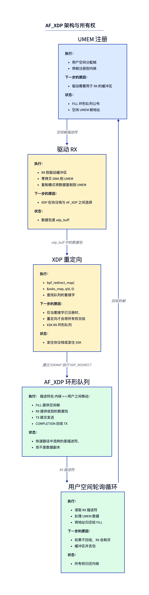
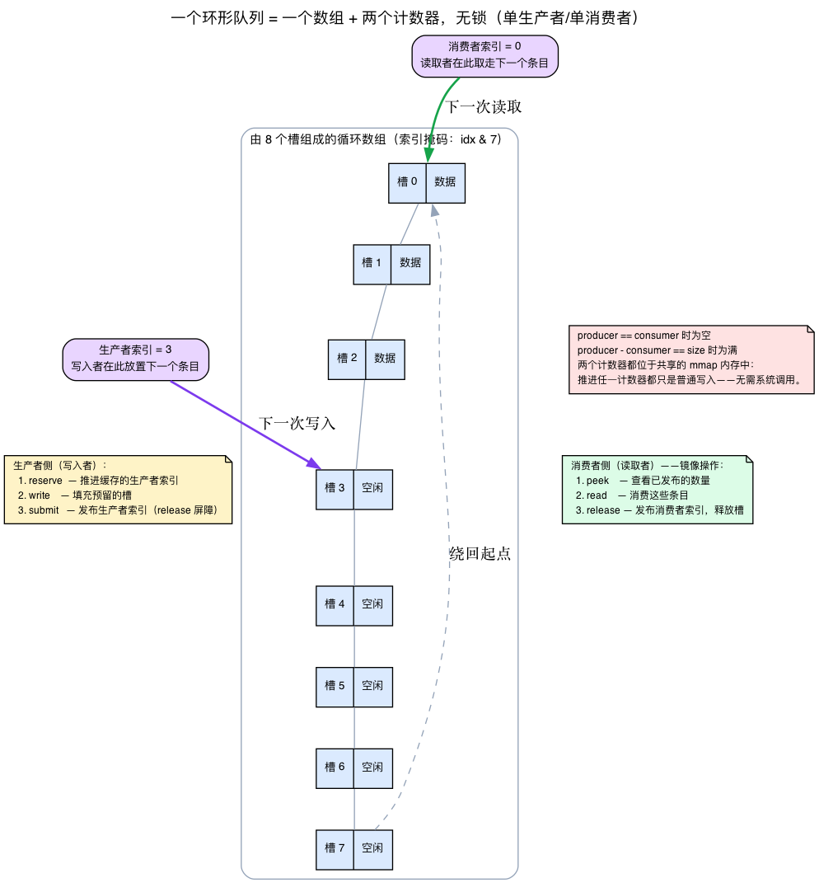
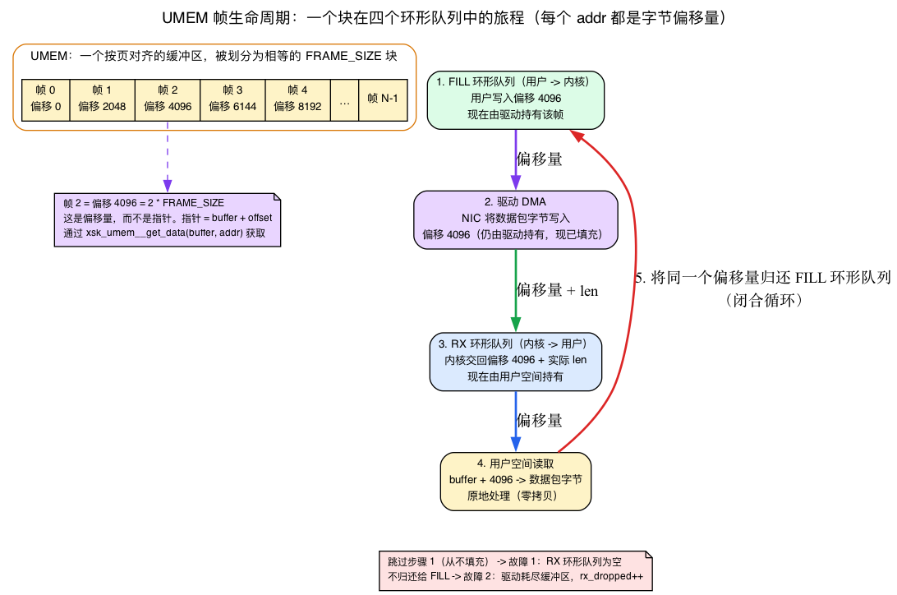
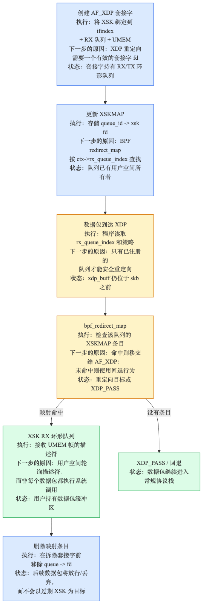
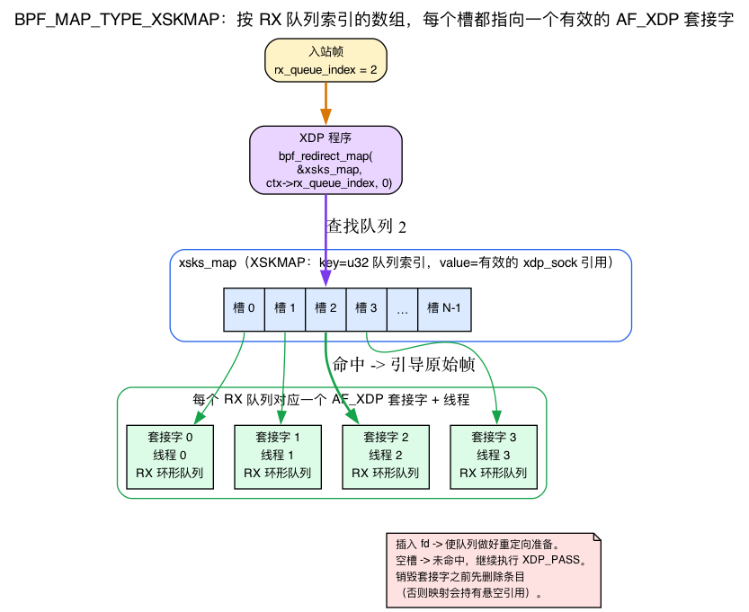
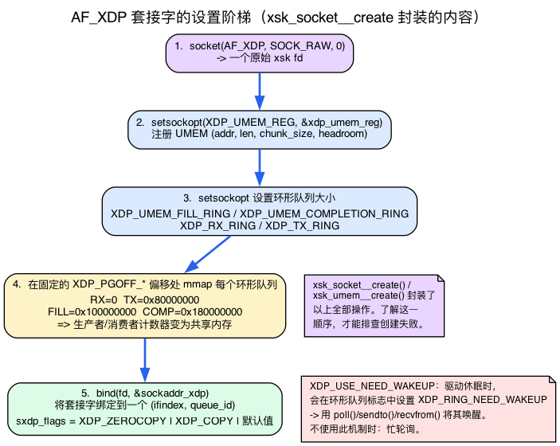

# 第18天 — AF_XDP：以线速把数据包送到用户空间

> **今日任务：** 把原始数据包从 XDP 零拷贝地重定向到用户空间的环形缓冲区，并以线速运行。构建一个小巧的零拷贝数据包接收器——并借此机会，彻底搞懂支撑这一切的那个核心机制：无锁共享环。总用时：约 120 分钟。本课直接建立在第14～17天的 XDP 重定向机制之上——如果 `bpf_redirect_map`、`ctx->rx_queue_index` 以及 XDP 返回码模型你还不熟悉，请先回顾第14天。

## 为什么要绕过协议栈

Linux 网络协议栈是通用型设计。对大多数负载来说这没问题——套接字、重传、拥塞控制，都替你做好了。但对于数据包处理类应用（DPI、自定义负载均衡器、网络测试、遥测流水线），协议栈会带来你不想要的开销：skb 分配、反正要重新做一遍的协议解析、每个包一次的系统调用。

**AF_XDP** 是内核对 DPDK 的回应：数据包直接接收进用户空间管理的环中，在稳态接收循环里没有系统调用（如果带上 `XDP_USE_NEED_WAKEUP` 标志，驱动可能会要求你调用 `poll()`/`recvfrom()` 来唤醒它——见下文）。在支持零拷贝的网卡和驱动上，数据包会直接 DMA 进 UMEM；否则 AF_XDP 仍然可以以拷贝模式工作，只是吞吐量更低。



诀窍在于：用户空间预先分配一块内存区域（UMEM）并将其注册给内核。在零拷贝模式下，网卡驱动会把收到的数据包直接 DMA 进这块内存。在拷贝模式下，内核会把数据包内容拷贝进 UMEM，但仍保持同一套环与描述符模型。一个 XDP 程序把流量重定向到绑定在该 UMEM 上的 AF_XDP 套接字，用户空间则轮询指向 UMEM 内部的描述符。

在支持零拷贝的网卡上，吞吐量每核可达 30+ Mpps。veth 实验依然有助于学习整个生命周期，但它展示的是功能性/拷贝模式的行为，而非网卡 DMA 零拷贝的性能表现。

今天的实验依赖此前章节从未讲过的四个概念。与其把 libxdp 的封装函数丢给你、指望你自己弄懂，不如我们逐一先把它们讲透，再拿来用：

1. **无锁的单生产者/单消费者环到底是什么**——生产者索引、消费者索引，以及 reserve/submit/peek/release 这套配合动作。这是*核心*抽象；其余一切都是围绕它搭建的管道。
2. **UMEM**——分块的帧池：描述符地址真正的含义是什么（也就是说，它是一个偏移量，而不是指针），以及每一时刻每个帧归谁所有。
3. **`BPF_MAP_TYPE_XSKMAP`**——一种*值是活套接字*的映射，即重定向目标。
4. **AF_XDP 套接字本身**——libxdp 所封装的真正的 `socket()`/`setsockopt()`/`bind()`/`mmap()` 调用序列。

我们会*在实验用到某个概念的那一刻*才讲解它。读完这一章，你就能读懂 `net/xdp/xsk_queue.h`，并且清楚知道每一处内存屏障究竟在对抗什么。

## 环：一个数组，两个计数器，没有锁

先停一下。在四种环各自的意义讲清楚之前，你得先弄明白*环*本身是什么——因为本章会反复说“用户和内核各自推进自己的指针，不需要系统调用”，而这句话背后的分量极大。

**直观理解。** 环是一个定长数组外加两个 32 位计数器：

- **生产者索引（producer index）**——*写入者*将放置下一个条目的位置；
- **消费者索引（consumer index）**——*读取者*将取出下一个条目的位置。

数组被当作循环使用：把索引对数组大小取模，即可得到一个槽位。当 **`producer == consumer`** 时环为空，当 **`producer - consumer == size`** 时环为满。这就是全部状态。没有锁，没有链表，没有分配——只有两个计数器在一个循环数组里互相追逐。

其中神奇的地方在于**单生产者、单消费者**：每个环*恰好*只有一个写入者和一个读取者。当每一侧只有一个，并且各自只会*推进*自己的计数器时，你不需要锁——你需要的是几个内存屏障（稍后详述）。而且关键的是，两侧分别位于**用户空间与内核空间边界的两端**。一侧是你的程序，另一侧是内核。两个计数器都位于*双方都已映射*的内存中，所以推进一个计数器只是一次内存写入——不涉及系统调用。

最后这句话正是 AF_XDP 能达到每秒数百万包的全部原因。在稳态下，接收一个包的动作是：读一个计数器，读一个描述符，写一个计数器。没有 `read()`，没有上下文切换，没有拷贝。系统调用不再出现在逐包接收路径中。



### 两步生产者协议，以及它的镜像

你绝不能一步完成“写入一个槽位并推进生产者索引”，因为读取者可能会在你的数据落地*之前*就看到新的索引。因此双方都使用两步协议。

**生产者侧（写入者）：**

1. **reserve（预留）** N 个槽位——推进*本地缓存*的生产者索引副本，预留出空间。此时尚未发布任何内容。
2. **write（写入）** 将 N 个条目写入这些槽位。
3. **submit（提交）**——*带释放屏障*地发布真正的生产者索引，使对方只有在数据写完之后才能看到它。

**消费者侧（读取者）——镜像操作：**

1. **peek（查看）** 有多少条目可用——查看生产者已经发布了多少。
2. **read（读取）** 这些条目。
3. **release（释放）**——发布消费者索引，告诉生产者这些槽位已重新空闲。

在 libxdp 中，这分别对应生产者侧的 `xsk_ring_prod__reserve` / `__submit`，以及消费者侧的 `xsk_ring_cons__peek` / `__release`——你将在实验中反复见到这些名字。当代码执行 `reserve → fill_addr → submit` 时，那是生产者协议；当它执行 `peek → rx_desc → release` 时，那是消费者协议。它们不是随意的 libxdp 仪式，而是环的契约本身。

### v7.1 中的实际样子

内核的环头文件是 `net/xdp/xsk_queue.h`——总共 508 行，这也是本章称它为“紧凑、可直接照搬模式”的代码的原因。共享状态是一个 `struct xdp_ring`：

```c
/* net/xdp/xsk_queue.h:16 */
struct xdp_ring {
	u32 producer ____cacheline_aligned_in_smp;   /* line 17 */
	/* Hinder the adjacent cache prefetcher to prefetch the consumer
	 * pointer if the producer pointer is touched and vice versa.
	 */
	u32 pad1 ____cacheline_aligned_in_smp;
	u32 consumer ____cacheline_aligned_in_smp;    /* line 22 */
	u32 pad2 ____cacheline_aligned_in_smp;
	u32 flags;
	u32 pad3 ____cacheline_aligned_in_smp;
};
```

就是它们：一个 `producer` 计数器，一个 `consumer` 计数器，再无其他。注意每个字段上的 `____cacheline_aligned_in_smp`，并读一下那段注释：生产者和消费者被刻意放在**不同的缓存行**上，以避免两侧互相“乒乓”同一条缓存行。（CPU 以 64 字节为单位移动内存，所以如果写入者的计数器和读取者的计数器共享同一条缓存行，一侧的每次更新都会使另一侧的缓存副本失效。这里的填充甚至阻止了*相邻缓存行预取器*去交叉触碰它们。姊妹篇 **linux-net** 的第1天完整讲解了缓存行。）

共享这个头文件的环有两种。RX 与 TX 环携带完整描述符；FILL 与 COMPLETION 环只携带裸的 64 位地址：

```c
/* net/xdp/xsk_queue.h:29 — RX and TX: descriptor rings */
struct xdp_rxtx_ring {
	struct xdp_ring ptrs;
	struct xdp_desc desc[] ____cacheline_aligned_in_smp;
};

/* net/xdp/xsk_queue.h:35 — FILL and COMPLETION: bare u64 addresses */
struct xdp_umem_ring {
	struct xdp_ring ptrs;
	u64 desc[] ____cacheline_aligned_in_smp;
};
```

内核自身对每个环的记账结构是 `struct xsk_queue`，它保存了**对端索引的缓存副本**，这样就不必在每一个条目上都重新去读对方的计数器：

```c
/* net/xdp/xsk_queue.h:40 */
struct xsk_queue {
	u32 ring_mask;
	u32 nentries;
	u32 cached_prod;   /* line 43 */
	u32 cached_cons;   /* line 44 */
	struct xdp_ring *ring;
	/* ... */
};
```

`cached_prod`/`cached_cons` 与 libxdp 在用户空间侧使用的手法完全一致：查看一次，处理整批，再发布一次。如果每个条目都重新读一次对端计数器，就会在每次迭代都把一条缓存行在用户/内核边界间来回弹跳。

### 屏障正是你要用封装函数的原因

头文件里有一大段注释（第 62–84 行）解释了确切的内存顺序，内容直接取自 `Documentation/core-api/circular-buffers.rst`：

```
 * producer                         consumer
 *
 * if (LOAD ->consumer) {  (A)      LOAD.acq ->producer  (C)
 *    STORE $data                   LOAD $data
 *    STORE.rel ->producer (B)      STORE.rel ->consumer (D)
 * }
```

可以这样理解：生产者必须**在发布新的生产者索引之前写完数据**（B），消费者必须**在读数据之前先读索引**（C）。一旦弄错，消费者就会加载到陈旧或垃圾帧——它看到索引移动了，却抢在字节数据之前跑到了前面。这正是为什么你要调用 libxdp 的 `reserve`/`submit`/`peek`/`release` 封装函数，而不是自己去摆弄计数器：这些封装函数里包含了正确的获取/释放屏障。手写索引算术是那种在 x86（强顺序）上能跑、却在 arm64（弱顺序）上把数据包搞坏的经典翻车方式。

## 四种环

现在这四种环就说得通了，因为每一种都只是这类单生产者/单消费者环的*一个实例*，唯一的问题只是*哪一方是生产者*：

- **FILL 环**（用户 → 内核）：用户空间生产，内核消费。“这里有 UMEM 中的空闲缓冲区，你可以往里 DMA。”
- **RX 环**（内核 → 用户）：内核生产，用户空间消费。“这里是我刚收到的数据包。”
- **TX 环**（用户 → 内核）：用户空间生产，内核消费。“帮我把这些发出去。”
- **COMPLETION 环**（内核 → 用户）：内核生产，用户空间消费。“TX 已完成，回收这些缓冲区。”

这正是内核注释所讲的方向性：*对于 RX 环和 completion 环，内核是生产者，用户空间是消费者；对于 TX 环和 fill 环，内核是消费者，用户空间是生产者。* 用户和内核都各自推进自己的计数器；稳态下不需要系统调用。（入队之后你确实要调用 `sendto()` 来踢一下 TX，但批处理由内核负责。）

## UMEM：环所指向的帧池

环携带的是*地址*。什么的地址？**UMEM** 中帧的地址——而 UMEM 的结构远不止“一块内存区域”这么简单。不理解它，你就无法弄懂破坏实验1或破坏实验2，因为这两者都关乎帧的所有权。

**直观理解。** UMEM 是一整块页对齐的用户空间缓冲区，你只分配一次（实验中用 `posix_memalign(&buffer, 4096, …)`），并通过 `XDP_UMEM_REG` 这个 setsockopt **向内核注册一次**。注册之后，网卡驱动就被允许把数据包字节直接 DMA 进*你的页面*。这就是“零拷贝”：正如第14天回顾过的，网卡的 DMA 引擎通常会把收到的帧直接写进驱动拥有的 RX 环页面——而这里 DMA 的目标变成了*你注册的 UMEM*，而不是内核的 skb 页面，于是字节在送达你的程序途中就再也不会被拷贝。（姊妹篇 **linux-net** 的第1天完整推导了 DMA/RX 环机制。）

UMEM 被切割成**等大小的块**。一个块就是一个**帧（frame）**。在本实验中，`FRAME_SIZE = 2048`，共有 `UMEM_NUM_FRAMES = 4096` 个帧。注册结构体正是这样描述的：

```c
/* include/uapi/linux/if_xdp.h:84 */
struct xdp_umem_reg {
	__u64 addr;             /* start of the UMEM region */
	__u64 len;              /* total length */
	__u32 chunk_size;       /* size of one frame, e.g. 2048 */
	__u32 headroom;         /* bytes reserved before each packet */
	__u32 flags;
	__u32 tx_metadata_len;
};
```

`headroom` 在每个块中为数据包*之前*预留字节，供你自己的元数据或封装使用（与内核 skb 的 `NET_SKB_PAD` headroom 是同一个思路——见姊妹篇 **linux-net** 的第1天——只是这里由你自己掌控）。`chunk_size` 限定了单个缓冲区所能容纳的最大数据包；更大的数据包会通过一个续传位串联多个帧（见下文）。

### 描述符地址是字节偏移量，而不是指针

这是最容易让人栽跟头的地方。实验在预填充 FILL 环时写入的是 `i * FRAME_SIZE`，而在读取 RX 描述符时用的是 `xsk_umem__get_data(buffer, addr)`。为什么要乘，为什么要有这个辅助函数？

因为**描述符地址是一个指向 UMEM 内部、类型为 `u64` 的字节*偏移量*，而不是内存指针。** 第 *i* 个帧位于偏移量 `i * FRAME_SIZE` 处。要把偏移量转换回可用指针，只需把它加到你 UMEM 映射的基址上——这正是 `xsk_umem__get_data(buffer, addr)`（即 `buffer + addr`）所做的事。环之所以能只携带普通的 `u64`，正是因为它们是偏移量而非地址；这也是为什么 FILL/COMPLETION 的一个条目就是裸的 `__u64`：

```c
/* include/uapi/linux/if_xdp.h:166 */
struct xdp_desc {
	__u64 addr;
	__u32 len;
	__u32 options;
};

/* UMEM descriptor is __u64  (the comment right below xdp_desc) */
```

RX/TX 环携带完整的 `xdp_desc`（偏移量**加上**驱动填入的真实数据包 `len`）；FILL/COMPLETION 环只携带 `__u64` 偏移量。有一处细节值得一提：在*非对齐（unaligned）*模式下，`addr` 的高位会打包进第二个偏移量，这也是为什么会有一个位移常量——`XSK_UNALIGNED_BUF_OFFSET_SHIFT 48` 与 `XSK_UNALIGNED_BUF_ADDR_MASK`（`if_xdp.h:116`）。提一句即可，不必深究；本实验使用的是对齐模式。

超过 `chunk_size` 的大数据包，会通过 `desc->options` 中的一个续传位把多个帧串联起来：

```c
/* include/uapi/linux/if_xdp.h:179 */
#define XDP_PKT_CONTD (1 << 0)
```

### 帧的所有权是一个循环——而两处“破坏”正是要打破它

以下心智模型能让破坏实验1和破坏实验2变得一目了然。**每一个帧在任意时刻都恰好有一个所有者，所有权沿着四个环组成的循环流转：**

1. 用户空间把一个空闲帧的**偏移量放上 FILL 环**→此时*驱动*拥有它。
2. 驱动**把一个数据包 DMA 进去**→仍归驱动所有，现已装满。
3. 驱动在 **RX 环**上把它交给用户空间（附带真实的数据包长度）→此时*用户空间*拥有它。
4. 用户空间**处理这些字节**，然后把**同一个偏移量归还给 FILL 环**→回到第 1 步。

跳过第 1 步（从不填充）——驱动从未拿到过任何帧→**破坏实验1**：RX 环为空。
跳过第 4 步（从不回收）——驱动的帧会用尽→**破坏实验2**：因饥饿而丢包。

这就是整个生命周期。当驱动没有帧可供 DMA 时，内核会记一次丢包——`xs->rx_dropped++`（`net/xdp/xsk.c:313` 与 `:330`）以及 `xs->rx_queue_full++`（`:199`、`:334`）——这正是你即将运行的这两处破坏在内核一侧的表现。



还有一点会让人意外：**这四个环并不在 UMEM 内部。** UMEM 存放的是数据包*字节*；环存放的是*描述符*（指向 UMEM 的偏移量）。这些环是独立的、由内核分配的缓冲区，你会在固定的页偏移处把它们 `mmap` 进自己的地址空间——这也是为什么 UAPI 为每一个环都定义了不同的偏移量：

```c
/* include/uapi/linux/if_xdp.h:110 */
#define XDP_PGOFF_RX_RING		  0
#define XDP_PGOFF_TX_RING		 0x80000000
#define XDP_UMEM_PGOFF_FILL_RING	0x100000000ULL
#define XDP_UMEM_PGOFF_COMPLETION_RING	0x180000000ULL
```

四个不同的 `mmap` 偏移量 = 四个各自独立映射的环，全部都与 UMEM 区域本身不同。

## XDP 与 AF_XDP 的协作



XDP 程序针对每个数据包做出决定：交给协议栈、丢弃，或者**重定向到一个 AF_XDP 套接字**。但一个 XDP 程序——运行在内核中、在任何 skb 存在之前——要怎么*指名道姓*地指向一个用户空间套接字？答案是通过一种你还没见过的映射类型。

### `BPF_MAP_TYPE_XSKMAP`——值是套接字的映射

在第14～15天，你的映射值都是普通数据：一个 `PERCPU_ARRAY` 的计数器、一个 `LPM_TRIE` 的前缀表。**XSKMAP** 则是一种性质完全不同的映射：它的值槽位保存的是**对一个活跃 AF_XDP 套接字的引用。** 你从用户空间把一个套接字的*文件描述符*写入映射，内核则存下一个带引用计数的、指向底层 `xdp_sock` 的指针。插入这个 fd，就是为一个队列**启用（arm）**重定向。

键始终是一个 4 字节的队列索引——内核在建立映射时就强制这一点：

```c
/* net/xdp/xskmap.c:64 */
static struct bpf_map *xsk_map_alloc(union bpf_attr *attr)
{
	/* :70 */
	if (attr->max_entries == 0 || attr->key_size != 4 ||
	    attr->value_size != 4 || ...)
		return ERR_PTR(-EINVAL);
	/* :76 — an array of socket slots, sized by max_entries */
	size = struct_size(m, xsk_map, attr->max_entries);
```

所以一个 XSKMAP 就是一个由 `u32` 队列索引作键、共 `max_entries` 个套接字槽位的数组。重定向决策就是一个函数调用：

```c
SEC("xdp")
int xdp_redirect_to_xsk(struct xdp_md *ctx) {
    return bpf_redirect_map(&xsks_map, ctx->rx_queue_index, 0);
}
```

`bpf_redirect_map(&xsks_map, queue_index, flags)` 会查找绑定在该队列上的套接字，如果存在，就把**原始帧、在任何 skb 被构建之前，直接引向该套接字的 RX 环。** 如果该槽位为空，程序就会顺流而下变成 `XDP_PASS`——这正是下方 `xsk.bpf.c` 中“先查找再重定向”的守卫逻辑。命中之后走的内核路径是 `__xsk_map_redirect(struct xdp_sock *xs, struct xdp_buff *xdp)`（`net/xdp/xsk.c:472`）。和其他重定向映射一样，XSK 重定向也是**在每次 NAPI 轮询结束时批量刷新**，而不是逐个处理的：参见 `lh_xsk` 刷新链表与 `__xsk_map_flush(lh_xsk)`，位于 `net/core/filter.c`（第 4360 行与第 4368 行）。

为什么用 `ctx->rx_queue_index` 作键？因为它是最自然的选择：RSS/RPS 已经把进来的数据包分散到了网卡的各个 RX 队列上，所以按队列索引作为映射的键，就能让每个队列的数据包各自落入自己的套接字（以及自己的线程）。每个 RX 队列对应一个套接字是标准做法，而这正是破坏实验3用来横向扩展的方式。

**生命周期的先后顺序很重要，拆卸过程依赖于它。** 你必须在套接字创建并绑定*之后*才插入 fd，并且必须在销毁套接字*之前*用 `bpf_map_delete_elem` 删除该条目——否则映射就会持有一个指向已释放套接字的悬空引用。这也是实验代码在 `xsk_socket__delete` 之前先删除映射条目的原因。（与此前的映射对比一下：`PERCPU_ARRAY` 和 `LPM_TRIE` 存的是普通字节；而 XSKMAP——像 `PROG_ARRAY` 和 `DEVMAP` 一样——存的是*内核对象引用*，其存在的目的就是充当重定向目标。）



> ### 常见疑问
>
> **问：这是 DPDK 吗？**
>
> 答：概念上相似（内核旁路、零拷贝、轮询环），但它与内核是协作关系，而不是把网卡整个接管过去。AF_XDP 让驱动仍留在内核里；DPDK 则彻底接管设备。AF_XDP 更容易安装和维护，并且支持按队列拆分（部分队列走 AF_XDP，其余走内核协议栈）。
>
> **问：我能在任意网卡上跑 AF_XDP 吗？**
>
> 答：*零拷贝*模式需要驱动的显式支持（Mellanox mlx5、Intel ice/i40e/ixgbe/igb/igc、Netronome nfp、stmmac，以及一份不断增长的清单）。对于不支持的网卡——包括常见的 Realtek r8169 桌面网卡，它没有 AF_XDP 零拷贝路径——“拷贝模式”依然可用（每个数据包一次拷贝），只是吞吐量更低。
>
> **问：这听起来很复杂。有现成工具可以用吗？**
>
> 答：XDP 项目的 `xdp-tools` 提供了示例发送/接收程序。`libxdp`（libbpf 的姊妹库）封装了 AF_XDP 的相关管道。本实验将使用 libxdp 的辅助函数。

## libxdp 到底封装了什么：AF_XDP 套接字

实验中调用了 `xsk_umem__create` 和 `xsk_socket__create`，但也坦承“libxdp 提供了帮助，但并没有把一切都隐藏起来”。当创建失败时——或者当你按要求去读 `xsk.c` 时——这些封装函数在你没见过底层原始 API 之前就是一个黑盒。所以，这里把它揭开。

**AF_XDP 是一个真正的套接字地址族。** 你通过 `socket(AF_XDP, SOCK_RAW, 0)` 得到一个套接字。`xsk_socket__create` 所做的一切，都是对这个调用加上下面几个步骤的封装；了解这套顺序，才能在创建失败时排查问题。

1. **`socket(AF_XDP, SOCK_RAW, 0)`** → 得到一个原始的 xsk fd。
2. **`setsockopt(XDP_UMEM_REG, …)`** 注册你的 UMEM（即上面的 `xdp_umem_reg` 结构体），接着 **`XDP_UMEM_FILL_RING` / `XDP_UMEM_COMPLETION_RING`** 设置它的两个环的大小，而 **`XDP_RX_RING` / `XDP_TX_RING`** 设置套接字自身两个环的大小。这些 optname 都是固定的整数：

   ```c
   /* include/uapi/linux/if_xdp.h:75 */
   #define XDP_RX_RING			2
   #define XDP_TX_RING			3
   #define XDP_UMEM_REG			4
   #define XDP_UMEM_FILL_RING		5
   #define XDP_UMEM_COMPLETION_RING	6
   #define XDP_STATISTICS			7
   ```

3. **把每个环 `mmap`** 到你的地址空间中，位于你上面见过的固定 `XDP_PGOFF_*` 偏移处。*正是*这一步让生产者/消费者计数器成为共享内存——mmap 之后，你和内核看到的是同一个 `producer`/`consumer` 字，这正是“无系统调用”这一前提的全部依据。
4. **`bind(fd, sockaddr_xdp, …)`** 把套接字绑定到一个 `(ifindex, queue_id)`：

   ```c
   /* include/uapi/linux/if_xdp.h:48 */
   struct sockaddr_xdp {
       __u16 sxdp_family;
       __u16 sxdp_flags;
       __u32 sxdp_ifindex;
       __u32 sxdp_queue_id;
       __u32 sxdp_shared_umem_fd;
   };
   ```

   `sxdp_flags` 选择模式：`XDP_ZEROCOPY`（`1<<2`，*要求*驱动 DMA 进 UMEM——如果驱动做不到就失败）、`XDP_COPY`（`1<<1`，强制走通用的一次拷贝路径），或默认（交给内核自行选择）。`sxdp_shared_umem_fd` 允许多个套接字共享同一个 UMEM——这正是多套接字的破坏实验3模式。

**引言里提到的唤醒标志。** `XDP_USE_NEED_WAKEUP`（`if_xdp.h:27`，`1<<3`）会让驱动在其休眠时设置 `XDP_RING_NEED_WAKEUP`（`if_xdp.h:57`，`1<<0`），体现在某个环的 `flags` 中。当你看到这个位被置位，就必须调用 `poll()`/`sendto()`/`recvfrom()` 来把驱动踢醒。没有这个标志，你就要忙轮询这些环；有了它，你就能高效地休眠。这也是为什么本章说，即便稳态下不需要系统调用，你有时依然要陷入内核。

**统计信息，与驱动无关的方式。** `getsockopt(fd, SOL_XDP, XDP_STATISTICS, …)` 会填充一个 `struct xdp_statistics`：

```c
/* include/uapi/linux/if_xdp.h:93 */
struct xdp_statistics {
	__u64 rx_dropped;             /* dropped for other reasons */
	__u64 rx_invalid_descs;
	__u64 tx_invalid_descs;
	__u64 rx_ring_full;
	__u64 rx_fill_ring_empty_descs;
	__u64 tx_ring_empty_descs;
};
```

这正是破坏实验2推荐使用的套接字层计数器。内核侧对应的是 `xsk_getsockopt`（`net/xdp/xsk.c:1734`）、`case XDP_STATISTICS`（`:1750`），它会将 `stats.rx_dropped` 填充为 `xs->rx_dropped`（`:1766`）的值。

**为什么 `poll()` 和 `sendto()` 在 xsk fd 上能直接生效。** 因为 AF_XDP 接入了正常的套接字机制：它的 `proto_ops` 表连接了 `.poll = xsk_poll`（`xsk.c:1226`，表位于 `:1950`）以及 `.sendmsg = xsk_sendmsg`（`:1178`，表位于 `:1956`）。一个 xsk fd 是一个真正的套接字，所以标准的 `poll`/`sendto` 路径能够直接触达 AF_XDP 的驱动唤醒逻辑。



以上就是 AF_XDP 在 BPF 侧的全部内容，现在也讲完了套接字侧的全部内容——剩下的工作发生在用户空间的接收循环里。

## 实验

这是迄今为止内容最密集的一次实验；请预留完整的时间。下面清单中的每一处，都对应你刚学到的四种机制之一：一次环操作、一个 UMEM 偏移量、一次 XSKMAP 插入，或是一次由 libxdp 封装的套接字建立调用。

### 环境搭建

```bash
# BPF + userspace build toolchain: clang/llvm compile the BPF object,
# bpftool generates vmlinux.h, libxdp/libbpf supply the AF_XDP ring + loader helpers.
sudo apt install clang llvm bpftool libxdp-dev libbpf-dev linux-headers-$(uname -r)
# On some distros bpftool ships in linux-tools-$(uname -r) / linux-tools-common instead.
# On a self-built kernel the matching linux-headers-$(uname -r) package may not exist
# in apt; use your in-tree headers (the kernel source you built from) instead.
```

与此前的网络实验不同，本实验除了 libbpf 之外，还链接了 **libxdp**（`-lxdp`）以获取 AF_XDP 的环辅助函数。仓库中该日的实验构建脚本提供了 `xdp/xsk.h` 的头文件搜索路径以及 `-lxdp` 链接选项；下面锚定引入的清单就是它实际编译的原始字节。

BPF 目标文件包含了 `vmlinux.h`，由实验构建脚本从固定版本的内置头文件生成。如果你要单独编译它，请先用 bpftool 生成这个头文件：

```bash
bpftool btf dump file /sys/kernel/btf/vmlinux format c > vmlinux.h
```

### `xsk.bpf.c`

```c
{{#include ../labs/day18/xsk.bpf.c:book}}
```

`if (bpf_map_lookup_elem(...))` 这道守卫，正是我们讨论过的“这个队列上是否已经启用了套接字？”检查：命中时把原始帧重定向进该套接字的 RX 环；未命中时顺流而下变成 `XDP_PASS`，这样内核协议栈依然能拿到这个数据包。

### `xsk.c`——用户空间接收器（完整、可编译的加载器）

不同于一份参考性的示意代码，这是实验实际编译并运行的完整程序。它通过骨架加载 XDP 目标文件，自行把程序挂载到网卡上（先尝试原生模式，再回退到 SKB/通用模式，以便在 veth 和没有原生路径的驱动上也能运行），用 libxdp 创建 UMEM 与 AF_XDP 套接字，填充 XSKMAP 槽位，预填充 FILL 环，并运行由轮询驱动的接收/回收循环，直到收到 SIGINT/SIGTERM。拆卸阶段会先移除 XSKMAP 条目，再销毁套接字，最后解除 XDP 挂载。

可以把它读作四种机制的叠加：FILL/RX 相关操作是环协议（见“环”一节），`i * FRAME_SIZE` 与 `xsk_umem__get_data` 是 UMEM 偏移量（见“UMEM”一节），`bpf_map_update_elem(map_fd, …)` 用于启用/停用 XSKMAP 槽位（见“XSKMAP”一节），而 `xsk_umem__create`/`xsk_socket__create` 是套接字搭建的阶梯（见“socket”一节）。它比此前的实验更繁忙，因为 AF_XDP 把这些环直接暴露了出来——libxdp 提供了帮助，但并没有把一切都隐藏起来。它传入了 `XSK_LIBXDP_FLAGS__INHIBIT_PROG_LOAD`，这样 libxdp 既不会加载自己的程序，也不会管理映射：加载器同时拥有这两者的所有权。

```c
{{#include ../labs/day18/xsk.c:book}}
```

### 运行

先搭建一个拓扑。`veth1` 上的 XDP/AF_XDP 只会看到进入 **`veth1`** 的帧，所以流量必须从对端发出——我们把对端放进它自己的命名空间：

```bash
# Topology: veth0 (in lab netns) <-> veth1 (host, runs the AF_XDP receiver)
sudo ip netns add lab
sudo ip link add veth0 type veth peer name veth1
sudo ip link set veth0 netns lab
sudo ip netns exec lab ip addr add 10.0.0.1/24 dev veth0
sudo ip netns exec lab ip link set veth0 up
sudo ip addr add 10.0.0.2/24 dev veth1
sudo ip link set veth1 up
```

现在构建并运行接收器，把它绑定到 `veth1`：

```bash
make xsk
sudo ./.output/day18/xsk veth1
```

在另一个终端里，从对端一侧驱动流量**进入** `veth1`：

```bash
sudo ip netns exec lab ping -c 5 10.0.0.2
```

你应该会看到接收器打印出原始帧字节/逐包统计信息。XDP 程序会在 ICMP echo 请求到达协议栈*之前*就把它们重定向到 AF_XDP 套接字，所以 `ping` 本身收不到任何回复——这是预期行为；你只需要关心接收器是否打印出了它从 RX 环上取下的帧。在 veth 上，验证到这一步就够了：它证明了重定向/环的生命周期是通的。在用数据包生成器（`pktgen`、`trafgen`）去主张零拷贝吞吐量数据之前，请先换用一块受支持的物理网卡及其驱动。

实验结束后拆除环境（这也会移除这对 veth）：

```bash
sudo ip netns del lab
```

---

## 按顺序破坏它

每一处破坏都会切断你在 UMEM 一节学到的那个帧所有权循环上的一条边。运行它们时请把那个循环记在心里。

### 破坏实验1——忘记 FILL 环

跳过预填充步骤（FILL 环的预填充步骤，`umem_prefill`）。你从未给驱动交过任何一个空闲帧，所以它没有任何东西可供 DMA——这个循环永远拿不到它的第一个帧。RX 环始终为空，接收器什么也不打印。用另一个终端里的 `sudo tcpdump -ni veth1 icmp` 确认 ping 确实到达了——当 tcpdump 能看到 echo 请求、而接收器依然什么都不打印时，你就能确定这个空 RX 环是由缺失的 FILL 预填充造成的，而不是因为没有流量。FILL 环是你与驱动之间的握手。

### 破坏实验2——不回收

跳过轮询循环中“回填 FILL 环”这一步（接收循环末尾的回收动作，`umem_recycle`）。此时你会从 RX 环上消费帧，却从不归还它们的偏移量——于是在处理完 4096 个数据包之后，FILL 环变空，驱动无处可 DMA 新帧。它会丢弃这些包，内核则会累加 `rx_dropped`/`rx_queue_full`（即我们前面见过的 `xsk.c:313`/`:330`/`:334` 处的计数器）。在另一个终端里观察逐队列的丢包计数器攀升：

```bash
watch -n1 "ethtool -S veth1 | grep -E 'rx_queue.*drops'"
```

在 **veth** 上，重定向到一个因饥饿而无法接收的 AF_XDP 套接字会导致 `xdp_do_redirect()` 调用失败，而 veth 会把这计入 `rx_drops` 计数器——通过 ethtool 表现为 `rx_queue_N_drops`（参见 `veth_xdp_rcv_one`/`veth_xdp_rcv_skb`，位于 `drivers/net/veth.c`，其中 `XDP_REDIRECT` 分支在失败时会累加 `stats->rx_drops`）。请注意，veth 另一个单独的 `xdp_drops` 字符串统计的只是*你的程序*返回的 `XDP_DROP`/`XDP_ABORTED`——它**不会**因为重定向到饥饿套接字失败而变化，所以这里 `grep xdp_drops` 什么也看不到；应改为 grep `drops`（或者你绑定的那个队列）。物理网卡驱动对这些统计项的命名和归类方式各不相同，这也是下一个更通用检查方法存在的原因。一个更直接、与驱动无关的检查方式，是用 `getsockopt(xsk_fd, SOL_XDP, XDP_STATISTICS, &stats, &len)` 轮询套接字自身的计数器，观察 `stats.rx_dropped` 上升，因为重定向到饥饿套接字造成的丢包无论驱动如何，都会被计入套接字层。（`stats.rx_dropped` 是 `struct xdp_statistics`（位于 `if_xdp.h:93`）中的字段，由 `xsk_getsockopt`（位于 `xsk.c:1766`）填充——这正是这项检查在内核侧的对应实现。）

### 破坏实验3——多队列

真实网卡有多个 RX 队列。为每个队列各自派生一个用户空间线程、各自一个 AF_XDP 套接字，全部放进 xskmap（每个槽位一个套接字，以队列索引为键——正是前面讲过的那套 XSKMAP 布局；套接字之间可以通过 `sxdp_shared_umem_fd` 共享同一个 UMEM）。RPS/RSS 把数据包分散到各个队列；`bpf_redirect_map(&xsks_map, ctx->rx_queue_index, 0)` 把每个队列的数据包送往它自己的套接字，每个线程各自独立地处理自己的队列。这就是随核心数线性扩展的方法。

---

## 该读内核的哪些部分

- **`net/xdp/xsk.c`**——AF_XDP 的实现。约 2100 行。先读开头部分以理解环结构。
- **`net/xdp/xsk_queue.h`**——无锁环的代码。紧凑、属于可直接照搬模式的水平。
- **`include/uapi/linux/if_xdp.h`**——AF_XDP 环、描述符、配置的 UAPI。
- **`tools/testing/selftests/bpf/xskxceiver.c`**——全面的 AF_XDP 测试套件。最佳范例。
- **`tools/testing/selftests/bpf/xdp_hw_metadata.c`**——紧凑的用户空间 AF_XDP 示例（UMEM + `xsk_socket__create`，把 UDP 流量导向一个 AF_XDP 套接字）。

---

## 要点回顾

- **环**是一个定长数组 + 一个**生产者索引**和一个**消费者索引**（相等时为空，相差 size 时为满）。单生产者/单消费者意味着**不需要锁**——只需要屏障。两个计数器都位于共享的 mmap 内存中，所以推进它们就是一次普通的内存写入：**不需要系统调用**，这正是线速得以实现的原因。生产者执行**reserve→write→submit**；消费者执行**peek→read→release**（`struct xdp_ring`，`xsk_queue.h:16`，生产者/消费者位于不同缓存行）。
- **AF_XDP** 是面向数据包处理的内核旁路——轮询环，稳态接收循环中没有系统调用（带上 `XDP_USE_NEED_WAKEUP` 时，在驱动设置了需要唤醒标志时才去 poll 它）；零拷贝需要驱动/网卡支持。
- 架构：**UMEM**（一块注册过的、被切成固定 `chunk_size` 帧的用户空间缓冲区）+ 4 个环（FILL、RX、TX、COMP）+ XDP 重定向。描述符的 **`addr` 是指向 UMEM 的字节*偏移量*，不是指针**（`xsk_umem__get_data(buf, addr)` 负责转换）。这些环与 UMEM 分开、在各自的 `XDP_PGOFF_*` 偏移处被 mmap。
- **帧的所有权是一个循环：** FILL → 驱动 DMA → RX → 用户空间 → 回到 FILL。跳过开头（破坏实验1）或结尾（破坏实验2），驱动就会陷入缓冲区饥饿；内核会累加 `rx_dropped`/`rx_queue_full`。
- BPF 侧只有一行：`bpf_redirect_map(&xsks_map, ctx->rx_queue_index, 0)`。**`BPF_MAP_TYPE_XSKMAP`** 很特别：它的值是**活套接字引用**（4 字节的队列索引键），插入一个 fd 就是在为队列*启用*重定向。销毁套接字之前要先删除该条目。
- **AF_XDP 套接字**是一个真正的地址族：`socket(AF_XDP)` → `setsockopt(XDP_UMEM_REG / ring sizes)` → `mmap(each ring)` → `bind(sockaddr_xdp: ifindex+queue+mode)`。`xsk_socket__create` 把这一切都封装了起来。`getsockopt(XDP_STATISTICS)` 返回 `struct xdp_statistics`，可获得与驱动无关的丢包计数。
- 吞吐量：**每核 30+ Mpps** 是受支持网卡在零拷贝模式下的结果；veth/拷贝模式用于功能性学习。
- 使用 **libxdp**（`xsk.h`）获取环相关的辅助函数——它的 `reserve`/`submit`/`peek`/`release` 携带了正确的内存屏障；直接使用原始内核 UAPI 也可行，但繁琐，并且在弱顺序 CPU 上很容易出错。
- 模式：零拷贝（最佳）、拷贝模式（通用、更慢）。与内核协作——你可以把队列在 AF_XDP 与内核协议栈之间拆分。

---

## 检查问题

如果你不回填 FILL 环，会出现什么症状？

<details>
<summary>点击查看答案</summary>

**答案：** 内核会耗尽可供 DMA 新数据包的 UMEM 缓冲区。新数据包会在驱动层被静默丢弃（某个网卡统计项会递增）。在最初的那些帧被消耗完之后，即便流量仍在持续到达网线上，RX 环也会安静下来。用所有权循环来描述：你从 RX 环上消费了帧，却从未把它们的偏移量归还给 FILL 环，于是驱动没有空闲帧可供 DMA。这个循环里“喂给我更多”的那一半，就是 FILL 环的回填——每一个被消费数据包的地址都必须被归还以供重用，否则你就会让驱动饥饿（这就是破坏实验2，在 veth 上表现为通过 ethtool 看到的 `rx_queue_N_drops`，或者——跨驱动通用地——`rx_dropped` 通过 `getsockopt(XDP_STATISTICS)` 可见）。

</details>

---

## 明天

第19天：cgroup BPF 与 sockops——按 cgroup 划分的网络策略与 TCP 调优。热路径更少，配置平面更多。
