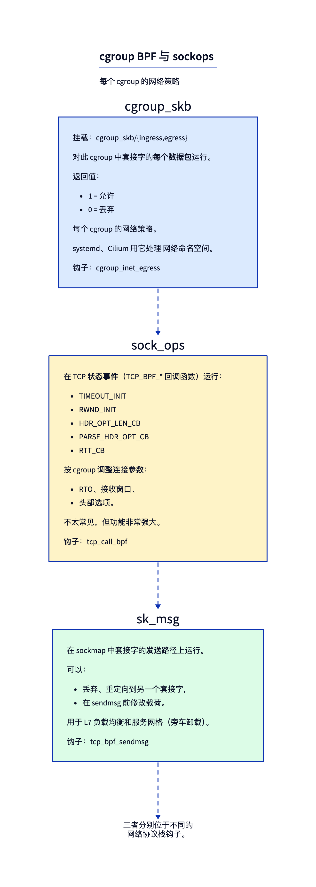
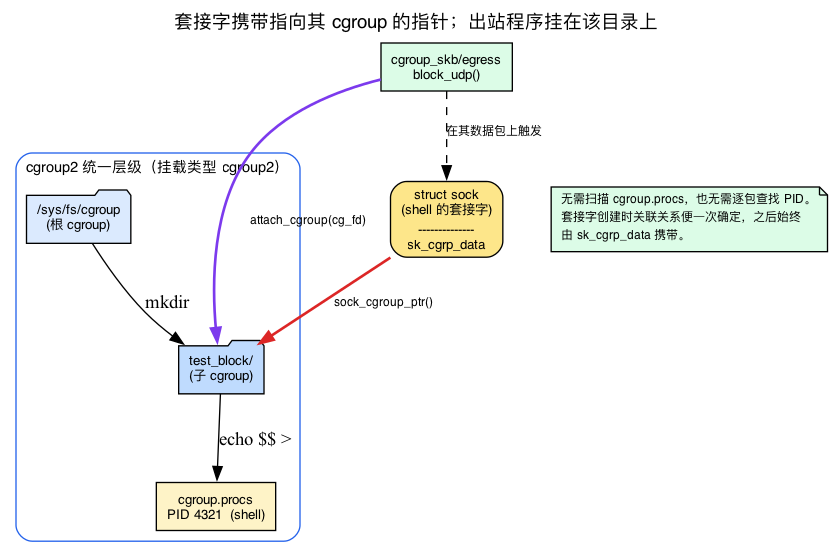
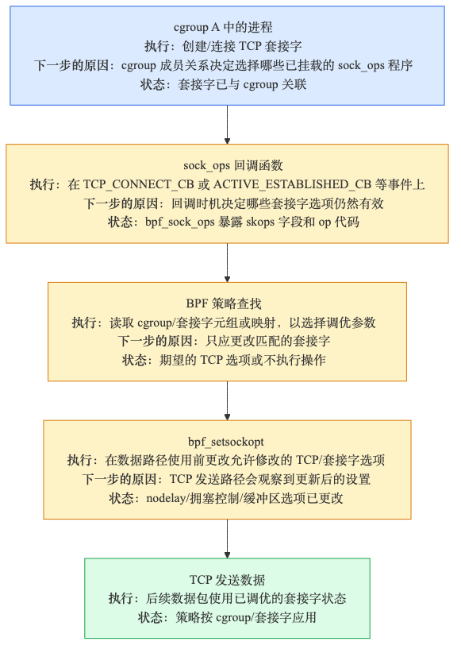
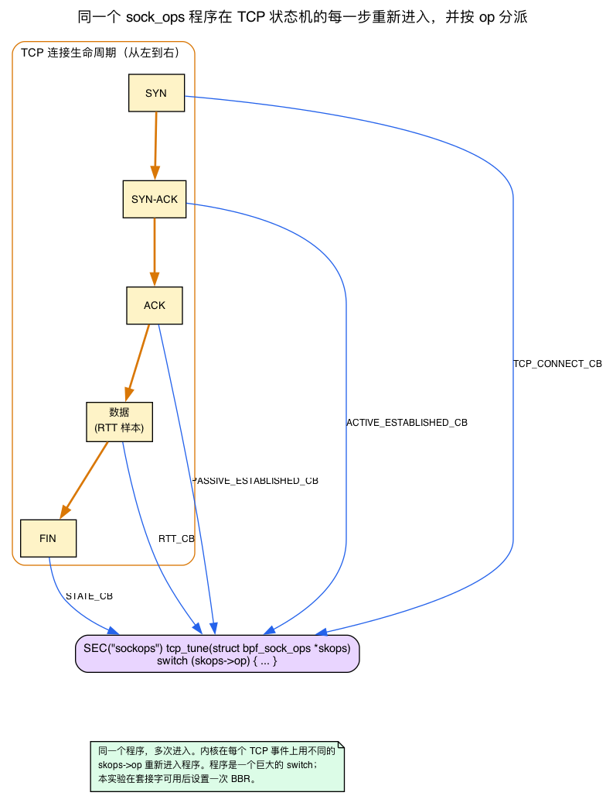
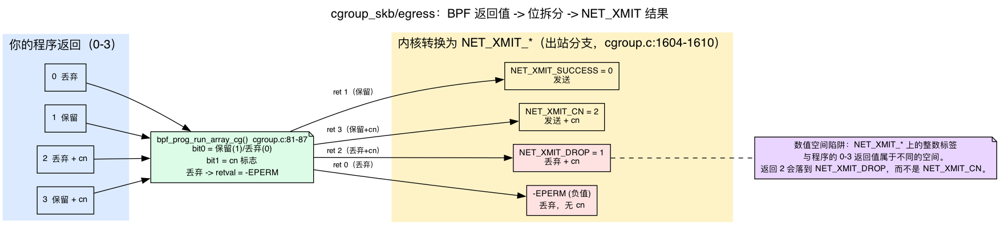

# 第19天 — cgroup BPF 与 sockops：套接字层的策略

> **今日任务：** 按 cgroup 过滤网络访问，再按 cgroup 调优 TCP 行为。理解 cgroup v2 到底*是什么*、套接字如何随身携带它所属的 cgroup、内核如何把你程序的返回值变成一次数据包判决，以及一个 `sock_ops` 程序如何在 TCP 握手的每一步都被重新调用。第 3 阶段结束。总时长：约 110 分钟。

## 数据包之上，套接字之下

第14～18天都在数据包层工作。今天要往上走一层，进入**套接字（socket）**与 **cgroup** 层。相关的程序类型包括：



- **`cgroup_skb`**——对某个 cgroup 内套接字的每个数据包都会触发。返回 0（丢弃）或 1（放行）。用于构建按 cgroup 隔离的防火墙。
- **`sock_ops`**——在 TCP 状态机事件（connect、ESTABLISHED、RTT 更新、头部选项协商）上触发。按 cgroup 调优连接参数。
- **`sk_msg`**——在 sockmap 中套接字的 `sendmsg` 上触发；用于 L7 负载均衡（Cilium 服务网格）。
- **`cgroup_sock_addr`**——在 `connect()`、`bind()`、向 UDP 的 `sendmsg()` 等调用上触发。修改 sockaddr（实现套接字层 NAT）。

这些程序运行在**进程上下文**中，拥有完整的非睡眠辅助函数集，因此可以调用像 `bpf_setsockopt` 这样的辅助函数。（它们*不是*可睡眠的——如果你想知道哪些程序类型才是可睡眠的确切清单，可以查看验证器中的 `can_be_sleepable()`。）

但上面每一种程序类型都建立在本章必须先夯实的一个概念之上：cgroup。今天的一切——*为什么*一个数据包的出站程序知道该套用哪条策略、*为什么*一个进程加入某个目录就会立刻被防火墙管辖、*为什么*你可以给一组连接选 BBR、给另一组选 CUBIC——都源自 Linux 如何把套接字与 cgroup 绑定这一个事实。所以我们从这里开始。

## cgroup v2 到底是什么

“cgroup 用来划分资源（CPU、内存、IO、网络）”这句话你大概已经听过一百遍了。这句话是对的，但没什么用。下面才是对 BPF 而言真正重要的部分。

**一个 cgroup v2 层级结构是一棵单一的目录树**，只挂载一次，挂载点是 `/sys/fs/cgroup`，文件系统类型是 `cgroup2`。“单一”这个词就是重点所在。旧的 cgroup v1 每个控制器有*各自独立*的一棵树——一个挂载点给 `cpu`，另一个给 `memory`，再一个给 `net_cls`——一个进程可以同时在每棵树里位于不同位置。v2 把这一切压缩成**一个统一的层级结构**：每个进程恰好位于一棵树上的一个节点，而所有控制器（cpu、memory、io……）只是这棵树上各节点开启的开关。当你执行 `mount | grep cgroup2` 看到 `cgroup2 on /sys/fs/cgroup type cgroup2` 时，你看到的正是这棵单一树的根。

**每个目录就是一个 cgroup，成员归属由文件记录。** 在 `/sys/fs/cgroup` 下创建一个目录，你就创建了一个子 cgroup。内核会在目录中生成一批控制文件——`cgroup.procs`、`cgroup.controllers`等等。今天要关心的是 `cgroup.procs`：**把一个 PID 写进某个 cgroup 的 `cgroup.procs` 文件，就会把该任务（及其所有线程）移动到这个 cgroup 中。** 成员归属本质上就由写入文件的这个数字决定。当一个受控子 shell 执行 `echo $$ > "$CG/cgroup.procs"` 时，`$$` 是这个子 shell 自身的 PID，这次写入只把该子 shell 迁移进这个专属的 cgroup。成员关系可以通过再次写 `cgroup.procs` 来改变，但本实验刻意不去动你的交互式 shell。



### 数据包的程序如何知道自己属于哪个 cgroup

这正是本章旧版本一带而过的问题。下面的“常见疑问”环节写道：“内核知道目标套接字属于哪个 cgroup。”*怎么知道的？* 这不是魔法，也不需要逐包查表。**这是保存在套接字上的一个指针。**

每个套接字都记录着创建它的那个任务所属的 cgroup。内核把一个小结构体直接嵌入 `struct sock` 里：

```c
/* include/linux/cgroup-defs.h:920 */
/* sock_cgroup_data is embedded at sock->sk_cgrp_data and contains
 * per-socket cgroup information except for memcg association. */
```

所以 `struct sock` 携带一个 `struct sock_cgroup_data sk_cgrp_data` 字段，而辅助函数 `sock_cgroup_ptr()` 把它解析成所属的 `struct cgroup *`。当数据包从某个套接字发出时，cgroup BPF 的分发路径正是这样做的：

```c
/* kernel/bpf/cgroup.c:1574, inside __cgroup_bpf_run_filter_skb() */
cgrp = sock_cgroup_ptr(&sk->sk_cgrp_data);
```

就这一行代码，*就是*“内核知道该套接字属于哪个 cgroup”这句话的全部含义。它解引用了一个套接字从诞生起就一直携带的指针，取得 cgroup，然后运行该 cgroup 挂载的程序。这里没有对 `cgroup.procs` 的扫描，也没有逐包的 PID 查找——这个关联在套接字创建时就已经确定，此后会一直随套接字保留。

紧挨着那行代码上方有一道守卫：cgroup_skb 只适用于 IP 套接字。

```c
/* kernel/bpf/cgroup.c:1571 */
if (sk->sk_family != AF_INET && sk->sk_family != AF_INET6)
    return 0;
```

一个 Unix 域套接字或 netlink 套接字会直接穿过你的出站防火墙——该钩子在你的程序运行之前就返回 0（放行）。最好提前知道这一点，这样你就不会疑惑，为什么“全部拦截”的规则仍允许 X 服务器与客户端通信。

### 如何挂载，以及“层级化”意味着什么

一个 cgroup BPF 程序**不会**挂载到某个网络接口或某个 PID 上。它挂载到一个**cgroup 目录的文件描述符**上。这就是为什么加载器要执行 `open(cg_path, O_RDONLY | O_DIRECTORY)`——它打开的是显式传入的那个*目录*以获取一个 fd，而 `bpf_program__attach_cgroup` 把这个 fd 交给内核。从那以后，该程序会为**每一个 `sk_cgrp_data` 指向该 cgroup（或其后代）的套接字**触发。这就是为什么即使进程在程序挂载*之后*才加入该 cgroup，也会立即受到约束：它继承了这个 cgroup，它的新套接字的 `sk_cgrp_data` 会指向这里，分发路径就能找到你的程序。不需要重新挂载任何东西。

挂载是**层级化**的：挂在父 cgroup 上的程序也覆盖它的子孙。当不止一层都想挂载程序时，v7.1 给了你挂载标志来选择它们如何组合：

```c
/* include/uapi/linux/bpf.h:1200-1219 */
/* BPF_F_ALLOW_OVERRIDE: a child's program yields to / replaces the parent's. */
/* BPF_F_ALLOW_MULTI:    programs from multiple levels all run, in FIFO order
 *                       (child programs first, then this cgroup, then parent). */
```

今天你不需要用到其中任何一个——libbpf 的 `attach_cgroup` 使用默认的单程序语义（每个 cgroup 一个程序，不设置任何标志）。但要知道多重挂载是存在的：节点级代理和 Pod 级策略正是通过这个机制在同一个套接字上共存。

## 为什么 BPF 特别需要 cgroup

现在这句概括终于站得住脚了。BPF 的 cgroup 钩子让你把策略挂在一个 cgroup 目录上，而这条策略只对该 cgroup 内进程的套接字生效——因为这些套接字携带着一个指回该 cgroup 的指针。systemd、Cilium 和 Kubernetes 边车正是利用这一点，在不引入 iptables 开销的情况下实现按 Pod 或按服务划分的网络规则：一个 Pod *就是*一个 cgroup，因此“这个 Pod 的流量”也就是“`sk_cgrp_data` 指向该 cgroup 的套接字所产生的流量”。

## sockops 示例：按 cgroup 调优 TCP



当一个 TCP 连接事件触发时（例如 `BPF_SOCK_OPS_TCP_CONNECT_CB`），你的 BPF 程序可以调用 `bpf_setsockopt(skops, ..., TCP_CONGESTION, "bbr", 3)` 来为*这个套接字*设置 BBR。结合 cgroup 挂载，你就得到了“cgroup X 的所有套接字用 BBR；cgroup Y 的所有套接字用 CUBIC”。我们会在下面、也就是 B 部分用到它们之前，展开讲讲 `bpf_setsockopt` 和 `TCP_CONGESTION` 到底是什么。

> ### 常见疑问
>
> **问：`cgroup_skb` 相对 `tc` 什么时候运行？**
>
> 答：`cgroup_skb/ingress` 在 IP 路由已经判定该数据包是发给本地某个套接字的*之后*运行；内核知道目标套接字属于哪个 cgroup。`cgroup_skb/egress` 在套接字发送*之后*运行——内核知道源套接字的 cgroup。tc 运行在更低的 L2/L3 层。当策略是“这个 cgroup 的流量”而不是“这个接口的流量”时，使用 cgroup_skb。
>
> **问：sock_ops 和设置 sysctl 有什么不同？**
>
> 答：sysctl 是全局的；sock_ops 是按套接字、有条件的。你可以把 cgroup A 的 RTO_MIN 设为 500ms、cgroup B 设为 5ms，而完全不动 sysctl。条件判断发生在 BPF 里，按每个连接单独求值。
>
> **问：这些在实践中用得多吗？**
>
> 答：是的——Cilium 大量使用 cgroup_sock_addr 做套接字级的服务转换（替代 kube-proxy）。服务网格用 sk_msg 做 L7 路由。大多数用户不会直接接触它们，因为工具已经把它们抽象掉了。

## 实验——分两部分

### A 部分：cgroup_skb 防火墙

创建一个测试 cgroup，并阻断其中所有进程发出的 UDP 流量。

> **前置条件：** cgroup v2（统一层级）挂载在 `/sys/fs/cgroup`——用 `mount | grep cgroup2` 验证（预期看到 `cgroup2 on /sys/fs/cgroup type cgroup2 ...`）——并且内核构建时启用了 `CONFIG_CGROUP_BPF=y`（用 `zgrep CGROUP_BPF /proc/config.gz` 或 `/boot/config-$(uname -r)` 检查）。在 cgroup v1 / 混合模式的主机上，路径和挂载语义都不同。

```bash
CG=/sys/fs/cgroup/practical-ebpf-day19-$$
sudo mkdir "$CG"
```

**不要**把你的交互式 shell 移进去。下面每个触发命令都会启动一个生命周期很短的子 shell，只把该子 shell 自己的 PID 写进 `$CG/cgroup.procs`，然后 `exec` 执行测试命令。那个受控子 shell 打开的每一个套接字，其 `sk_cgrp_data` 都指向这个专属 cgroup；你的终端和 SSH 连接则留在根 cgroup 中。

`fw.bpf.c`：
```c
{{#include ../labs/day19/fw.bpf.c:book}}
```

**等等——为什么这里 `data` 直接指向 IP 头？** 回忆一下第16天：`__sk_buff` 暴露了 `data`/`data_end` 用于带边界检查的直接数据包访问：每次读取都必须先*证明*位于有效范围内，验证器才会接受（这就是为什么必须先做 `if (ip + 1 > end)` 检查，然后才能触碰 `ip->protocol`）。同样的规矩在这里依然适用。但这里有一处第16天没有让你准备好面对的差异，如果没人指出来，你很可能会被绊倒。

在第16天，tc 程序先看到的是 **以太网头**——`data` 指向一个 `ethhdr`，你得先解析过它才能到达 IP 头。而这里**完全没有 `ethhdr` 解析这一步**：`fw.bpf.c` 把 `data` 直接转换成 `struct iphdr *`。这不是 bug。对 `cgroup_skb` 而言，数据指针起始于**网络（IP）层头部**，因为这个钩子运行在套接字层，而不是 L2 组帧层。内核在调用你的程序之前会显式地安排好这一点：

```c
/* kernel/bpf/cgroup.c:1561-1577, __cgroup_bpf_run_filter_skb() */
unsigned int offset = -skb_network_offset(skb);
...
__skb_push(skb, offset);                       /* move data back to the IP header */
bpf_compute_and_save_data_end(skb, &saved_data_end);
```

`__skb_push` 把 `skb->data` 倒回网络层头部，然后 `bpf_compute_and_save_data_end` 设置你的程序所看到的 `data`/`data_end` 窗口。所以对 cgroup_skb 而言，`[data, data_end)` 从 IP 头开始往后延伸——直接强转就能用。（对比第16天的 tc 代码，它必须先解析 `ethhdr`，因为 tc 运行在套接字层之下，L2 组帧此时仍然存在。）

注意：`cgroup_skb/ingress` 返回 **1 = 放行，0 = 丢弃**。`cgroup_skb/egress` 的范围更宽——验证器强制返回值范围为 **0-3**：`0`=丢弃，`1`=保留，`2`=丢弃并通知 TCP 拥塞（cn），`3`=保留并 cn。返回该范围之外的值会在加载时被拒绝。（我们会在破坏实验1里精确剖析这个范围是在哪里强制执行的、又是如何变成一次数据包判决的——这是本章的核心机制，值得在你信任它之前先弄明白。）

用户空间挂载。用当天的 Makefile 编译这个加载器（和前面几天一样，基于骨架（skeleton）的模式），并在测试期间**保持它运行**——`bpf_program__attach_cgroup` 返回一个 `struct bpf_link *`，其生命周期与该进程绑定。加载器退出时，这个 link 会被释放，UDP 出站流量重新被放行：

```c
int cg_fd = open(cg_path, O_RDONLY | O_DIRECTORY);   /* explicit DIRECTORY fd */
struct fw_bpf *skel = fw_bpf__open_and_load();
struct bpf_link *l = bpf_program__attach_cgroup(skel->progs.block_udp, cg_fd);
printf("attached, Ctrl-C to detach\n");
pause();   /* keep the process (and the link) alive */
```

注意挂载目标是 `cg_fd`，**cgroup 目录的 fd**——不是网络接口，也不是 PID。这正是前述 cgroup 挂载模型的具体体现：该程序现在会为每一个 `sk_cgrp_data` 指向 `$CG` 的套接字触发。

生产环境的策略可以把这个 link 固定（pin）到一个专属的 bpffs 路径上，但本实验刻意让它归属于进程本身：终止那个确切的加载器 PID 就一定能把它解挂载。触发命令本身就是放进 `$CG` 里的受控子进程。

完整的加载器（`fw.c`）在这段示意代码的基础上增加了信号处理和安全的 cgroup 参数处理：它要求显式传入一个 cgroup-v2 目录路径，并用 `O_DIRECTORY` 打开它，因此它不可能悄悄挂载到一个固定的或意料之外的 cgroup 上。用 `make -C ebpf/labs fw` 构建它：

```c
{{#include ../labs/day19/fw.c:book}}
```

测试。选择一个结果*清晰可辨*的 UDP 探测——`dig` 默认走 UDP/53，正是这条过滤规则丢弃的协议/端口，所以“超时”和“收到应答”的对比毫不含糊（裸 `nc -u` 在两种情况下都会同样地挂起，什么也说明不了）：

```bash
make -C ebpf/labs day19
sudo ebpf/labs/.output/day19/fw "$CG" &
FW_PID=$!
trap 'sudo kill -INT "$FW_PID" 2>/dev/null || true; wait "$FW_PID" 2>/dev/null || true; sudo rmdir "$CG" 2>/dev/null || true' EXIT
sleep 0.5

# only this controlled child enters the cgroup (UDP/53 is dropped):
sudo sh -c 'echo $$ > "$1/cgroup.procs"; exec dig +tries=1 +timeout=2 @1.1.1.1 example.com' _ "$CG"
#   -> communications error / no servers could be reached
sudo sh -c 'echo $$ > "$1/cgroup.procs"; exec ping -c 3 1.1.1.1' _ "$CG"
#   -> works: ICMP is not UDP

# this ordinary process remains outside the cgroup and receives an answer:
dig +tries=1 +timeout=2 @1.1.1.1 example.com
```

那个普通进程会看到自己的数据包畅通无阻，因为它的套接字的 `sk_cgrp_data` 指向的是根 cgroup，而不是 `$CG`——你的程序根本不在它们的分发路径上。这正好呼应了本章自己提出的检查问题：走 UDP/53 的 DNS，恰好就是 `cgroup_skb/egress` 的 UDP 丢弃规则会阻断的流量。

**清理**由上面设置的 trap 完成：它向那个确切的加载器 PID 发信号，等待骨架对象销毁并解除 link 挂载，并只删除 `$CG`。触发命令都是 `exec`，所以它们的临时 cgroup 在退出时早已是空的。你的交互式 shell 从未被移动过，也不需要任何恢复步骤。

### B 部分：sock_ops TCP 调优

A 部分的程序每个数据包触发一次；`sock_ops` 的机制则截然不同：**同一个程序，在一条连接的整个生命周期中被多次调用**，在每一个感兴趣的 TCP 事件上各触发一次。要读懂这个例子，你需要补上旧版章节略过的两方面背景——`bpf_sock_ops` 上下文是什么，以及 `bpf_setsockopt`/`TCP_CONGESTION` 究竟做了什么。

#### `bpf_sock_ops` 上下文与 `op` 状态机

一个 `sock_ops` 程序拿到的是一个 `struct bpf_sock_ops *`，而它的**第一个字段就告诉你这次为什么被调用**：

```c
/* include/uapi/linux/bpf.h:6900 */
struct bpf_sock_ops {
    __u32 op;                 /* WHICH event fired — your switch key   */
    union { __u32 args[4]; __u32 reply; ... };  /* per-op in/out values */
    __u32 family;
    __u32 remote_ip4, local_ip4;
    __u32 remote_port, local_port;
    __u32 is_fullsock;
    __u32 snd_cwnd;
    __u32 srtt_us;            /* smoothed RTT << 3, microseconds        */
    __u32 state;             /* a TCP_* state (TCP_ESTABLISHED = 1, …) */
    ...
    __u64 bytes_acked;
    ...
};
```

这个程序的核心是一个**以 `op` 为键的大型 switch 语句**。内核会在 TCP 状态机的每一步——主动 connect、被动/主动建连完成、RTT 采样、重传、状态变更、头部选项解析/写入——重新进入*同一个*程序，每次带着不同的 `op`。这些 op 值是一个 UAPI 枚举；本实验关心其中三个：

```c
/* include/uapi/linux/bpf.h:7048 */ BPF_SOCK_OPS_TCP_CONNECT_CB        /* right before an active connect    */
/* include/uapi/linux/bpf.h:7051 */ BPF_SOCK_OPS_ACTIVE_ESTABLISHED_CB /* SYN-ACK finished an outbound 3WHS */
/* include/uapi/linux/bpf.h:7055 */ BPF_SOCK_OPS_PASSIVE_ESTABLISHED_CB/* ACK finished an inbound 3WHS      */
```

下面的 `tune.bpf.c` 会检查这三个值，因为它想在套接字*可用*的那一刻就设置好拥塞控制算法，而不管这条连接是怎么建立起来的——不管是本机主动拨出去的（主动），还是接受了一个连接（被动）。

除了 `op` 之外，这个上下文还暴露了你可以读取的**实时 TCP 状态**：`family`、远端/本地 IP 和端口、`state`（一个 `TCP_*` 值——`TCP_ESTABLISHED = 1`，见 `include/net/tcp_states.h:13`）、`srtt_us`、`snd_cwnd`、`bytes_acked` 等等。所以一条真实策略可以根据连接属性来决定是否生效——比如“只对 srtt > 20ms 的长途连接使用 BBR”——而不只是“永远设置 BBR”。`args[4]`/`reply` 这个联合体让某些 op 回调可以接收参数，并通过返回值传出结果（RTO/RWND 初始值相关的 op 就是这样返回值的）；对我们这个 setsockopt 用例而言，程序只需要返回 0。



#### `bpf_setsockopt` 和 `TCP_CONGESTION` 做了什么

`bpf_setsockopt(ctx, level, optname, optval, optlen)` 是**用户空间 `setsockopt(2)` 系统调用在内核中的对应接口**。同样的 `level`/`optname` 常量（`SOL_TCP`、`TCP_CONGESTION`），同样的效果——但它是从 BPF 程序*内部*调用的，针对该钩子正在为之触发的那个套接字，不需要跨越任何系统调用边界。它只提供给套接字上下文的程序类型（sock_ops、cgroup_sock_addr……），这正是这一族钩子能够调优连接的原因所在。内核把它显式地接入 sock_ops 的辅助函数集：

```c
/* net/core/filter.c:8597, in sock_ops_func_proto() */
case BPF_FUNC_setsockopt: return &bpf_sock_ops_setsockopt_proto;
```

其背后的实现是 `__bpf_setsockopt(struct sock *sk, int level, int optname, ...)`，位于 `net/core/filter.c:5598`——它直接操作 `struct sock`，不涉及从用户空间的拷贝。

`TCP_CONGESTION`（`#define TCP_CONGESTION 13`，`include/uapi/linux/tcp.h:107`）接受一个**已注册拥塞控制模块的名称字符串**——`"bbr"`、`"cubic"`、`"reno"`、`"dctcp"`。内核会在自己的 CC 注册表里查找这个名字，所以 `"bbr"` 只有在 `tcp_bbr` 被编译进内核或被 `modprobe` 加载之后才能解析成功（见下面的前置条件）。这些模块确实是独立的文件：`net/ipv4/tcp_bbr.c`、`net/ipv4/tcp_cubic.c`。一个未知的名字会返回 `-ENOENT`（CC 注册表查找未命中）——而一个 BPF 辅助函数会把这报告为一个*返回值*，而不是一个异常，这就是为什么破坏实验3的失败是无声的。

只做简单的背景铺垫——我们**不在这里**教这个算法本身（那是第22～23天，struct_ops 拥塞控制的内容）：拥塞控制是内核里决定发送窗口能长多大的可插拔逻辑。CUBIC 是默认值；BBR 基于速率/RTT。对*第19天*而言，重点在于你可以**按套接字/按 cgroup**选用不同的算法，而完全不用碰全局的 `net.ipv4.tcp_congestion_control` sysctl。这种可按套接字选择的能力，正是这个钩子的全部价值所在。

`tune.bpf.c`（完整文件还加了通常的 `vmlinux.h`/`bpf_helpers.h` 头文件、GPL `LICENSE`，以及兜底的 `SOL_TCP`/`TCP_CONGESTION` 宏定义——这些 UAPI 常量是 `#define`，不是 BTF 类型，所以 `vmlinux.h` 不会提供它们）：
```c
{{#include ../labs/day19/tune.bpf.c:prog}}
```

挂载到一个 cgroup：
```c
struct bpf_link *l = bpf_program__attach_cgroup(skel->progs.tcp_tune, cg_fd);
```

完整的加载器（`tune.c`）沿用了 `fw.c` 的安全 cgroup 参数处理——要求显式传入 cgroup 路径，并加上 `O_DIRECTORY`——只是改成挂载 `tcp_tune`。用 `make -C ebpf/labs tune` 构建它：

```c
{{#include ../labs/day19/tune.c:book}}
```

验证。在 cgroup 内部有一条*全新的*TCP 连接触发 sockops 之前，什么都观察不到，而且 BBR 必须真的可用——否则 `bpf_setsockopt(...,"bbr",...)` 会静默失败（这就是破坏实验3）。同时把 `ss` 的范围限定到目标上，这样就不会匹配到无关的套接字（比如你的 SSH 会话本身也可能在用 BBR）：

```bash
# prerequisite: BBR must be available
sudo modprobe tcp_bbr 2>/dev/null   # no-op if built in
sysctl net.ipv4.tcp_available_congestion_control

# stop Part A's exact loader, then attach sockops to the same owned cgroup:
sudo kill -INT "$FW_PID"; wait "$FW_PID" || true
sudo ebpf/labs/.output/day19/tune "$CG" &
TUNE_PID=$!
trap 'sudo kill -INT "$TUNE_PID" 2>/dev/null || true; wait "$TUNE_PID" 2>/dev/null || true; sudo rmdir "$CG" 2>/dev/null || true' EXIT
sleep 0.5

# only this short-lived child enters the cgroup and opens the fresh TCP socket:
sudo sh -c 'echo $$ > "$1/cgroup.procs"; exec curl -s https://speed.cloudflare.com/__up -T /dev/zero --max-time 4' _ "$CG" >/dev/null &
CLIENT_PID=$!
sleep 1
ss -ti dst :443 | grep bbr
wait "$CLIENT_PID" || true
```

预期结果：cgroup 内那条连接的 `ss -i` 信息行里包含 `bbr`。从一个**不在**该 cgroup 中的 shell 打开的套接字，会显示**主机默认**的拥塞控制算法——只要默认值不是 `bbr`，它就会和你按 cgroup 选定的算法不同（在这台开发机上默认恰好就是 `bbr`，所以要看出对比，请换成一个非默认的名字，比如 `"cubic"`，写在 `tune.bpf.c` 里）。原因和 A 部分一样：一个不在 cgroup 内的套接字，其 cgroup 指针指向的不是 `$CG`，所以 `tcp_tune` 永远不会为它运行。如果 `ss` 输出为空，要么是没有从该 cgroup 内建立起新连接，要么是 BBR 没有加载（`bpf_setsockopt` 静默失败了——破坏实验3）。

---

## 按顺序进行破坏实验

### 破坏实验1——超出范围的返回值

把 `5`（或任何大于 3 的值）作为某个 `cgroup_skb/egress` 程序的返回值。验证器会在加载时拒绝它：egress 的返回值必须落在 `retval_range(0, 3)` 内（`kernel/bpf/verifier.c`）。已定义的值是 `0`=丢弃，`1`=保留，`2`=丢弃+cn，`3`=保留+cn——所以返回 `TC_ACT_SHOT`（其值恰好是 `2`）实际上*能加载并运行*，但它的含义是“丢弃并发出拥塞信号”，而不是“放行”。这是一个**egress 上已定义的值**，不是巧合式的通过。在 ingress 上，范围只是 `0`/`1`。不要在这里借用 tc 的 `TC_ACT_*` 常量——这两套约定只是碰巧重叠。

这是本章的核心机制，下面从源码中逐步确认这套机制。**有两个阶段共同强制执行这份契约。**

**阶段 1——验证器在加载时按程序类型限定返回值范围。** 任何程序默认的退出范围是 0-1；CGROUP_SKB 的 egress 挂载类型会把它*放宽*到 0-3：

```c
/* kernel/bpf/verifier.c:16747 — default */
*range = retval_range(0, 1);
...
/* kernel/bpf/verifier.c:16772-16773 — CGROUP_SKB egress only */
if (env->prog->expected_attach_type == BPF_CGROUP_INET_EGRESS)
    *range = retval_range(0, 3);
```

所以 `return 5` 在程序*还没运行之前*就被拒绝了——这正是破坏实验1。ingress 从不会走到这个 `if` 分支，所以它保持默认的 0-1：丢弃/放行，不做放宽。这种不对称是有意为之的，不是疏漏。

**阶段 2——运行时内核把你的 0-3 映射成一个 `NET_XMIT_*` 代码。** 在 egress 分支看到这个值之前，run-array 循环会先逐位拆分你的 0-3 返回值：

```c
/* kernel/bpf/cgroup.c:81-87, in bpf_prog_run_array_cg() */
func_ret = run_prog(prog, ctx);
if (ret_flags) {
    *(ret_flags) |= (func_ret >> 1);   /* bit 1 -> the cn flag   */
    func_ret &= 1;                     /* bit 0 -> keep(1)/drop(0) */
}
if (!func_ret && !IS_ERR_VALUE((long)run_ctx.retval))
    run_ctx.retval = -EPERM;           /* drop becomes a negative err */
```

这里正是拆分你 0-3 返回值的地方：bit 0 是保留/丢弃的决定，bit 1 是 cn 标志。一次丢弃（bit 0 = 0）会把 `retval` 设为 `-EPERM`——这就是下面 egress 分支接着要映射的那个负值。所以下一段代码读到的 `ret` 和 `flags`，*并不是*你的原始返回值；它们已经是这次拆分之后的结果。

`__cgroup_bpf_run_filter_skb()` 的 egress 分支接着做最后的转换，变成一个 `NET_XMIT_*` 代码。**注意——这段内核注释里的整数是*转换之后*的 `NET_XMIT_*` 结果代码，和你程序返回的 0-3 完全是两套命名空间。** 你返回的 1（保留）会转换成 `NET_XMIT_SUCCESS=0`；你返回的 2（丢弃+cn）会变成 `NET_XMIT_DROP=1`；返回 3（保留+cn）会变成 `NET_XMIT_CN=2`；返回 0（丢弃）会变成一个负的 `-err`：

```c
/* kernel/bpf/cgroup.c:1589-1610 (egress branch) */
/* left column = the post-conversion NET_XMIT result, NOT your return value:
 *   0: NET_XMIT_SUCCESS  skb should be transmitted
 *   1: NET_XMIT_DROP     skb should be dropped and cn
 *   2: NET_XMIT_CN       skb should be transmitted and cn
 *   3: -err              skb should be dropped              */
cn = flags & BPF_RET_SET_CN;
if (ret && !IS_ERR_VALUE((long)ret))
    ret = -EFAULT;
if (!ret)  ret = (cn ? NET_XMIT_CN : NET_XMIT_SUCCESS);
else       ret = (cn ? NET_XMIT_DROP : ret);
```

这些代码本身定义在 `include/linux/netdevice.h:119-121`：

```c
#define NET_XMIT_SUCCESS  0x00   /* transmit            */
#define NET_XMIT_DROP     0x01   /* drop + congestion-notify */
#define NET_XMIT_CN       0x02   /* transmit + congestion-notify */
```

“cn”这个标志位是一个*独立的通道*（`BPF_RET_SET_CN`），这就是“2 = 丢弃+cn，3 = 保留+cn”这句话背后真正的依据。不过还是要留意上面那个框里提到的命名空间陷阱：那一列（`0..3`）是**转换后得到的 `NET_XMIT_*` 代码**，*不是*你程序返回的值。这两套空间**并不是**一一对应的。`bpf_prog_run_array_cg()`（`cgroup.c:81-87`，即上面阶段 2 那段代码）会在这个分支运行之前就逐位拆分你的返回值——低位是保留（1）/丢弃（0），高位变成 cn 标志——所以程序返回 `2`（丢弃+cn）会转换成 **`NET_XMIT_DROP`**，而 `NET_XMIT_CN` 这个结果反而是由程序返回 `3`（保留+cn）产生的。这依然印证了那个微妙之处：`TC_ACT_SHOT == 2` 之所以在 egress 上“能用”，仅仅是因为 `2` 在这里是一个已定义的*程序返回值*（丢弃+cn），而不是因为 tc 和 cgroup 共享某种约定——更不是因为它等于 `NET_XMIT_CN`。它们只是碰巧重叠。相比之下，ingress 是更简单的那条分支——范围 0/1，没有 cn 通道——这与上面 egress 代码框里的说明以及下面的要点保持一致。



### 破坏实验2——忘记 IPPROTO 检查

在 cgroup_skb/egress 里丢弃*所有*数据包（始终 `return 0`）。`$CG` 里那个受控子进程会失去网络访问；你的终端不受影响。恢复的办法是向那个确切的加载器 PID 发信号，这会销毁该 link，或者直接让子进程退出，由 trap 移除这个已经为空的专属 cgroup。这正是本实验从不把你的交互式 shell 移进一条它正打算故意打坏的策略里的原因。

### 破坏实验3——TCP 拥塞控制未加载

`bpf_setsockopt(..., "bbr_invalid", ...)`。内核会在自己的 CC 注册表里查找 `"bbr_invalid"`，一无所获，返回 `-ENOENT`（`tcp_set_congestion_control()`（位于 `net/ipv4/tcp_cong.c`）会把 `err = -ENOENT`，这发生在 `tcp_ca_find*` 返回 NULL 时）——但 `bpf_setsockopt` 把这体现为一个*返回值*，而不是一次故障，所以什么都不会崩溃，什么都不会记录日志。连接依然会用系统默认值成功建立。症状是：你的 sockops“不起作用”——它其实在运行，只是这个辅助函数静默地失败了。永远要检查返回值：`if (bpf_setsockopt(...) < 0) { /* handle */ }`。

### 破坏实验4——用 `cgroup_sock_addr` 做套接字层 NAT

```c
SEC("cgroup/connect4")
int rewrite_connect(struct bpf_sock_addr *ctx)
{
    if (ctx->user_port == bpf_htons(8080)) {
        ctx->user_port = bpf_htons(80);
        return 1;
    }
    return 1;
}
```

这段代码以 `BPF_CGROUP_INET4_CONNECT`（`include/uapi/linux/bpf.h:1108`）的方式挂载，并在*SYN 被构造之前、`connect()` 系统调用内部*重写目标端口。此后，从这个 cgroup 发往端口 8080 的连接会被悄悄重定向到端口 80。`bpf_sock_addr` 上下文的字段（`user_port`、`user_ip4`……）都是真实存在的（`include/uapi/linux/bpf.h:6871`）。这正是 Cilium 的“套接字层服务转换”的工作原理——用本章学到的“套接字携带所属 cgroup”这一机制，逐个 cgroup 地实现无 iptables 的 kube-proxy。

---

## 在内核中该读什么

- **`kernel/bpf/cgroup.c`**——cgroup BPF 基础设施。约 2750 行。重点读分发路径 `__cgroup_bpf_run_filter_skb`（你刚才剖析过的 `sock_cgroup_ptr` → run-array → `NET_XMIT_*` 映射）。
- **`include/linux/bpf-cgroup.h`**——接口与程序类型。
- **`net/core/filter.c`**——搜索 `sock_ops_func_proto`（`:8588`）。sockops 可用的辅助函数，包括 `bpf_setsockopt`。
- **`tools/testing/selftests/bpf/progs/sockopt_*.c`**——sockops 示例。
- **`Documentation/bpf/prog_cgroup_sockopt.rst`**——官方文档。

---

## 要点回顾

- **cgroup v2** 是挂载在 `/sys/fs/cgroup` 的一棵统一的树（类型 `cgroup2`）；每个目录就是一个 cgroup，把 PID 写进它的 `cgroup.procs` 文件就会把该任务移进去。v1 每个控制器有各自独立的树；v2 只有唯一一棵。
- **套接字携带自己所属的 cgroup。** `struct sock` 内嵌了 `sk_cgrp_data`；`sock_cgroup_ptr(&sk->sk_cgrp_data)`（`cgroup.c:1574`）把它解析成所属的 cgroup。这个指针——在套接字创建时就已设定——正是内核“知道”一个数据包的程序属于哪个 cgroup 的方式。不需要扫描，不需要查找。
- cgroup 程序挂载在一个**cgroup 目录的 fd**上，为每一个 `sk_cgrp_data` 指向该 cgroup（或其后代）的套接字触发，并且是**层级化**的（多层级用 `BPF_F_ALLOW_OVERRIDE`/`MULTI`）。cgroup_skb 只适用于 `AF_INET`/`AF_INET6`（`cgroup.c:1571`）。
- **`cgroup_skb`** 对 cgroup 内套接字的每个数据包触发。ingress 返回 1=放行/0=丢弃；egress 允许 0-3（0=丢弃，1=保留，2=丢弃+cn，3=保留+cn），由验证器强制执行。验证器只针对 `BPF_CGROUP_INET_EGRESS` 把范围放宽到 0-3（`verifier.c:16772`）；内核把它映射到 `NET_XMIT_*`，位置在 `cgroup.c:1588`。
- 对 cgroup_skb 而言，`skb->data` 起始于**IP 头**（内核执行了 `__skb_push(skb, -skb_network_offset(skb))`），而不是以太网头——这与第16天的 tc 不同。第16天那套边界检查的规矩依然适用。
- **`sock_ops`** 是同一个程序在每个 TCP 事件上被重新调用；`skops->op` 选择具体是哪一个（`TCP_CONNECT_CB`、`ACTIVE/PASSIVE_ESTABLISHED_CB`……）。该上下文还暴露了实时状态（`state`、`srtt_us`、`snd_cwnd`、`bytes_acked`）以支持条件化的策略。
- **`bpf_setsockopt`** 是内核内部对 `setsockopt(2)` 的孪生实现，提供给套接字上下文的程序使用（`filter.c:8597`）。`TCP_CONGESTION`（`tcp.h:107`）接受一个针对内核 CC 注册表解析的算法名字符串——从而实现按套接字/按 cgroup 的拥塞控制，而不触碰全局 sysctl。未知名字 → 静默 `-ENOENT`。
- **`cgroup_sock_addr`** 让你在 `connect`/`bind` 时重写 sockaddr——套接字层 NAT（`BPF_CGROUP_INET4_CONNECT`）。
- 这些钩子运行在**进程上下文**中——完整的非睡眠辅助函数集，可以调用 `bpf_setsockopt`。
- 在生产环境中被大量使用：Cilium、systemd、Kubernetes 服务网格。

---

## 检查问题

你挂载了一个 `cgroup_skb/egress` 程序，它对每个数据包都返回 `0`（丢弃）。该 cgroup 内的一个进程执行 `wget google.com`。DNS 查询会发生吗？

<details>
<summary>点击查看答案</summary>

**答案：** 不会。DNS 使用 UDP/53；UDP 和 TCP 的出站流量都会被 `cgroup_skb` 过滤。查询过程中的 `socket()`、`connect()` 和 `sendmsg()` 都会成功（cgroup_skb 是在数据包真正发送时才触发的，发生得更晚），但离开该 cgroup 的那个真实 UDP 数据包会被你的程序丢弃。`wget` 会超时。要专门放行 DNS，可以在 BPF 里按目标端口做门控。

</details>

---

## 第 3 阶段结束

现在你已经能在网络协议栈的每一层编写 BPF 程序了：驱动层的 XDP、skb 层的 tc/tcx、内核旁路的 AF_XDP、按 cgroup 过滤的 cgroup_skb、TCP 调优的 sock_ops、L7 的 sk_msg。这就是全部的覆盖面——而现在你也知道了把这些 cgroup 钩子串联在一起的那一个事实：套接字携带一个指向其 cgroup 的指针，而每一个策略决策都挂在这个指针上。

第 4 阶段（第20～24天）转向现代原语：kfunc、kptr、struct_ops、BTF 探秘。这些基础设施让 2024–2026 年的 BPF 与 2019 年的 BPF 感觉截然不同。（其中第22～23天会专门接续我们在这里故意留了个尾巴的拥塞控制话题——到那时你会*亲手写*一个 struct_ops 形式的拥塞控制算法，而不只是按名字选一个。）
