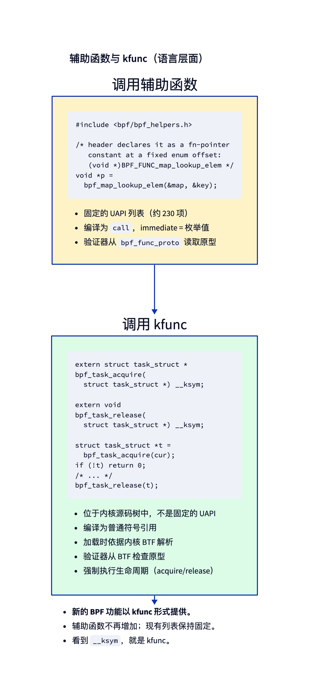
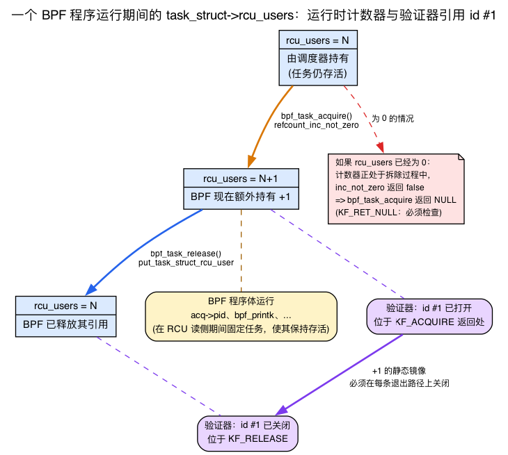
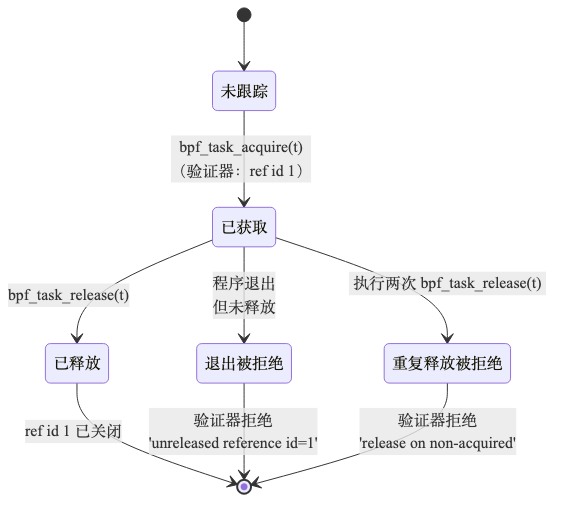

# 第20天 — kfunc：现代内核扩展机制

> **今日任务：** 从 BPF 里调用一个 kfunc，理解验证器强制执行的获取/释放引用计数语义，弄清内核里的 *refcount* 到底是什么、为什么一个任务会携带两个，并知道为什么新的 BPF 特性都以 kfunc 而不是 helper 的形式发布。总时长：约 100 分钟。

> **第 4 阶段从这里开始。** 第20～24天将介绍一组现代原语，正是它们让 2024 年以后的 BPF 与早期 BPF 有了鲜明区别：kfunc、kptr、struct_ops 和 BTF 探秘。

## kfunc 是什么

你在第7天已经接触过 helper 与 kfunc 的区别：helper 是被冻结的 UAPI（`enum bpf_func_id` 里数量与签名固定，是一份永久承诺），而 kfunc 是普通的树内内核函数，按名字与内核 BTF 匹配，并被明确允许演进。这就是为什么内核社区大约从 2022 年起停止新增 helper，转而以 kfunc 的形式发布新能力。今天我们就真正调用一个，并学习验证器围绕它强制执行的引用计数语义。



具体来说，kfunc 就是内核里一个普通的 C 函数，标注了 `__bpf_kfunc`，注册在一个 `BTF_KFUNCS_START`/`BTF_KFUNCS_END` 代码块里，并在 BPF 程序加载时按名字（对照内核 BTF）解析出来。

```c
/* In kernel/bpf/helpers.c — line 2733 */
__bpf_kfunc struct task_struct *bpf_task_acquire(struct task_struct *p)
{
    /* take a refcount on p */
    if (refcount_inc_not_zero(&p->rcu_users))
        return p;
    return NULL;
}

/* line 2744 */
__bpf_kfunc void bpf_task_release(struct task_struct *p)
{
    put_task_struct_rcu_user(p);
}

/* And later, registered: */
BTF_KFUNCS_START(generic_btf_ids)
BTF_ID_FLAGS(func, bpf_task_acquire, KF_ACQUIRE | KF_RCU | KF_RET_NULL)
BTF_ID_FLAGS(func, bpf_task_release, KF_RELEASE)
/* ... */
BTF_KFUNCS_END(generic_btf_ids)

register_btf_kfunc_id_set(BPF_PROG_TYPE_TRACING, &kfunc_set);
```

这些标志向验证器标注了函数的行为：

- **`KF_ACQUIRE`**——返回一个带引用计数的资源。验证器会跟踪它；你必须释放它。
- **`KF_RELEASE`**——释放此前获取的资源。验证器把该引用 id 标记为已关闭。
- **`KF_TRUSTED_ARGS`**——参数指针必须是 `PTR_TO_BTF_ID | PTR_TRUSTED`（不能来自任意加载）。
- **`KF_RCU`**——参数受 RCU 保护；在程序 RCU 读取段持续期间有效。
- **`KF_SLEEPABLE`**——只能从可睡眠的 BPF 程序中调用。
- **`KF_RET_NULL`**——返回值可能为 NULL；验证器要求检查。

这些标志正是验证器判断需要检查哪些安全属性的依据。

请注意，上面两个函数虽然都只有短短两行，函数体却*确实执行了实际操作*——`refcount_inc_not_zero`、`put_task_struct_rcu_user`——而这些操作，而不是那些标志，才是今天这一章真正要讲的主题。标志只是验证器叠加在一套*运行时机制*之上的*静态检查器*，而那套机制早已存在于内核之中。要理解为什么 `bpf_task_acquire` 会返回 `NULL`、为什么它携带 `KF_RET_NULL`、为什么释放函数叫 `put_task_struct_rcu_user` 而不是普通的 `put_task_struct`，我们得先看看那套运行时机制：内核引用计数。

## refcount 到底是什么（以及为什么一个任务有两个）

> *回忆一下 linux-net 第1天里 `sk_buff` 的双引用计数模型——`skb->users` 统计描述符的持有者，`dataref` 统计数据缓冲区的共享者。`task_struct` 做的正是同一件事，只不过它的两个计数器名叫 `usage` 和 `rcu_users`。如果这个划分你还记忆犹新，本节的大部分内容可以概括为：“任务也采用了双引用计数，只是 BPF 在此基础上又增加了一层约束。”*

一个 **`refcount_t`** 本质上是一个原子计数器，它只回答一个问题：*当前有多少个独立的持有者需要这个共享对象继续存活？* 这份契约极其简单，而且与第1天里 `skb->users` 遵循的契约完全一样：

- 想让对象保持存活的持有者会**递增**计数器（`refcount_inc`）——“我在用这个，别释放它。”
- 当这个持有者用完之后，会**递减**（`refcount_dec_and_test`）——“我用完了。”
- 把计数驱动到 **0** 的那次递减，才真正释放该对象。只有*最后*一个持有者离开时，对象才会被释放。

`refcount_t` 不只是一个裸的 `atomic_t`：它是**饱和的、防溢出/防下溢的**。如果某条有缺陷的代码路径把计数一路递增到接近回绕，或者递减到零以下，内核的 refcount API 会捕获这一情况并发出警告，而不是任由计数被悄悄破坏——那样会导致释放后使用（use-after-free）或者泄漏。这是*运行时*层面的契约。验证器的 `KF_ACQUIRE`/`KF_RELEASE` 跟踪，正是对这同一份契约的*静态*强制执行，只不过作用对象是 BPF 程序持有的引用。

### `refcount_inc_not_zero`：`KF_RET_NULL` 背后的细节

再看一眼 `bpf_task_acquire` 的函数体。它调用的不是 `refcount_inc`，而是 `refcount_inc_not_zero`：

```c
if (refcount_inc_not_zero(&p->rcu_users))
    return p;
return NULL;
```

`refcount_inc_not_zero` **只有在计数当前大于零时**才会递增，并返回一个 `bool` 告诉你这次递增到底有没有发生。它的签名甚至专门标注了 `__must_check`，让你无法不小心忽略返回值：

```c
/* include/linux/refcount.h:333 */
static inline __must_check bool refcount_inc_not_zero(refcount_t *r);
```

为什么要求“非零”？因为**计数为 0 意味着这个对象已经在被拆除了。** 回忆一下这份契约：把计数降到 0 的那个持有者，正是负责释放该对象的那个。如果你贸然把它从 0 递增到 1，你就是在为一块正处于销毁过程中的内存声明持有一个引用——这是典型的释放后使用。`refcount_inc_not_zero` 会拒绝这么做：它返回 `false`，递增不会发生，因此 `bpf_task_acquire` 会返回 `NULL`。

**这正是 `bpf_task_acquire` 携带 `KF_RET_NULL` 的全部原因。** 你刚刚分别看到了两件事——验证器规则“返回值可能是 NULL——你必须检查它”，以及那段真的可能返回 NULL 的函数体——而它们其实是*同一个事实*：你试图获取的那个任务可能已经开始销毁，它的 refcount 可能已经是 0，那次递增可能会失败。`KF_RET_NULL` 就是验证器强迫你在加载时处理这种确切情况。

### 一个任务上的两个 refcount：`usage` 与 `rcu_users`

这里还有一个与 BPF 相关的细节。一个 `task_struct` 携带**两个**独立的 `refcount_t` 字段，分别守护**两种不同的生命周期**：

```c
/* include/linux/sched.h:840 */
refcount_t usage;
/* include/linux/sched.h:1564 */
refcount_t rcu_users;
```

- **`usage`** 守护的是 `task_struct` *这块分配本身*。只要 `usage > 0`，承载这个结构体的内存就不会被释放。
- **`rcu_users`** 守护的是任务生命周期的一段 *RCU 宽限期延伸*——它让任务在一个 RCU 读取段内保持可达且有效。

`bpf_task_acquire` 特意递增的是 **`rcu_users`**，而不是 `usage`。而 `bpf_task_release` 调用的是 **`put_task_struct_rcu_user`**——与该计数器匹配的递减操作：

```c
/* kernel/exit.c:234 */
void put_task_struct_rcu_user(struct task_struct *task)
{
    if (refcount_dec_and_test(&task->rcu_users))
        call_rcu(&task->rcu, delayed_put_task_struct);
}
```

看看这份契约是如何落地的：`refcount_dec_and_test` 递减计数，并且恰好在计数降到 0 时返回 true；在这最后一次递减时，它安排了真正的释放（`call_rcu(...delayed_put_task_struct)`）。所以只要*任何一个*持有者让 `rcu_users > 0`，任务就会保持存活——只要这个引用还被持有，就会一直存活下去。只有当最后一个持有者把 `rcu_users` 降到 0，`refcount_dec_and_test` 才会触发，`call_rcu` 才会把真正的释放推迟到下一个 RCU 宽限期之后。“持有期间保持存活”和“最后一次递减之后一个宽限期释放”是两个不同的时间窗口。

这也是为什么释放函数是 `put_task_struct_rcu_user` 而不是普通的 `put_task_struct`：这两个函数递减的是两个不同的计数器。

那么 `KF_RCU` 标志在注册处（`helpers.c:4725`）又是怎么回事？它*并不是*在描述这个 kfunc 返回的引用，也不是在描述为什么选择 `rcu_users`。正如上面标志列表已经提到的，`KF_RCU` 约束的是*输入*参数：它告诉验证器，传入的 `p` 可能只是受 RCU 保护（`MEM_RCU`），而不是完全可信的。一个受 RCU 保护的指针可以保证不会在你手里被释放，但——根据 `kfuncs.rst` §2.5.6——“该对象的引用计数可能已经降到零。” 这才是函数体必须调用 `refcount_inc_not_zero`（这次递增可能失败）、并且该 kfunc 必须携带 `KF_RET_NULL` 的真正上游原因。文档里几乎是逐字这么说的：“一个既是 KF_ACQUIRE 又是 KF_RCU 的 kfunc，很可能也应该是 KF_RET_NULL。” 这条因果链是：`KF_RCU`（参数可能只受 RCU 保护，引用计数可能为 0）→ `refcount_inc_not_zero` → 递增可能失败 → `KF_RET_NULL`。至于选择递增 `rcu_users` 而不是 `usage`，那是函数体内部单独的生命周期决策，对验证器不可见，也与 `KF_RCU` 这个位无关。



### 为什么这让 BPF 比手写内核 C 更安全

现在，基于上面这两个函数，你可以确切地看到，就引用管理而言，验证器为什么能让 BPF 比普通内核代码更安全：

- 在普通内核 C 里，**忘记**调用一次 `put_task_struct_rcu_user` 会泄漏这个任务——计数永远达不到 0，内存永远不会被释放。这类泄漏出了名地难以发现，因为什么都不会崩溃；内存只会在不知不觉中不断流失。
- 在普通内核 C 里，**忘记对** `refcount_inc_not_zero` **的结果做 NULL 检查**，就是一次释放后使用——你继续使用一个已经在被销毁的任务。

这两类缺陷都很常见，而且难以排查。验证器把*这两者*都转成了**加载时拒绝**：忘记释放，你会得到 `Unreleased reference id=N`；使用一个未获取的引用，你会得到 `reference has not been acquired before`。把这两类缺陷转化为加载期错误，正是本章要传达的核心收益。请把这两个函数和这两个计数器记在心里——下面的一切都是验证器把你刚学到的这份契约机制化的过程。

## 从 BPF 调用 kfunc

在你的 BPF 源码里，把它声明为一个带 `__ksym` 的 extern 声明：

```c
extern struct task_struct *bpf_task_acquire(struct task_struct *p) __ksym;
extern void bpf_task_release(struct task_struct *p) __ksym;
```

`__ksym` 属性告诉 libbpf“在加载时按名字去内核 BTF 里查找它”。如果名字解析不出来，加载就会失败——不会有静默的漏查。（你在第7天已经见过 `__ksym`，这里没有新东西。）

使用方式：

```c
struct task_struct *cur = bpf_get_current_task_btf();   // Day 3
struct task_struct *acq = bpf_task_acquire(cur);
if (!acq) return 0;             // KF_RET_NULL: must check (refcount may have been 0)

/* now we hold a refcount on acq; verifier knows ref id #1 is open */

bpf_printk("acquired pid=%d", acq->pid);

bpf_task_release(acq);          // closes ref id #1
return 0;
```

那句 `if (!acq) return 0;` 并不是样板代码——它是在实际处理刚刚讨论的“`refcount_inc_not_zero` 返回 false”这一情况。省略它，验证器就会拒绝该程序。

## 验证器的引用跟踪

与 kfunc 相关、单条最重要的验证器行为，就是**获取/释放生命周期检查**。



当你调用一个 `KF_ACQUIRE` 函数时，验证器会：
1. 创建一个全新的**引用 id**（一个整数，例如 id #1）。
2. 把返回值寄存器标记为携带这个 id。
3. 在你程序的控制流中跟踪这个 id：拷贝、分支、存入 map。
4. **在每一个程序退出点**，都要求这个 id 要么已被释放，要么已被转交到内核能够释放它的地方（例如某个 kptr 类型的 map 槽位）。

这个引用 id 是验证器对运行时 `rcu_users` 递增操作的静态替身：id #1 在“打开”状态，恰好对应真实计数器处于 +1 的那段区间。关闭这个 id，对应的就是把它降回去的那次 `put_task_struct_rcu_user`。

如果你在某条路径上忘记释放：

```
Unreleased reference id=1 alloc_insn=2
```

如果你释放一个未获取的指针：

```
kfunc bpf_task_release#0 reference has not been acquired before
```

如果你释放两次：

```
kfunc bpf_task_release#0 reference has not been acquired before
```

（第二次释放会看到这个引用 id 已经是关闭状态；同样的错误。）

这些检查都发生在**加载时**，而不是运行时——运行时是安全的。

### 为什么引用跟踪是必要的

这正是引用计数那一节里“忘记则泄漏 / 误释放则损坏”这一对问题——一个获取了引用却从不释放的 BPF 程序会泄漏内核内存，而一个释放了自己并未获取的引用的程序，会过早地把计数推向 0，从而释放一个其他持有者仍在使用的对象。验证器在加载时进行的跟踪，正是把这两者都变成加载时拒绝的关键，这让 BPF 在这个维度上比手写内核 C 更安全。完整论证见上面的引用计数一节。

## 按程序类型注册

并不是每个 kfunc 在每种 BPF 程序类型里都可用。这种注册是**显式的**：

```c
register_btf_kfunc_id_set(BPF_PROG_TYPE_TRACING, &generic_kfunc_set);
register_btf_kfunc_id_set(BPF_PROG_TYPE_STRUCT_OPS, &cpumask_kfunc_set);
```

跟踪类程序（`fentry`、`fexit` 等）拿到的是通用集合。struct_ops 程序拿到的是 cpumask 集合。XDP 也拿到通用集合（它同样为 `BPF_PROG_TYPE_XDP` 注册了），所以 `bpf_task_acquire` *确实*能在一个 XDP 程序里加载——但在那里它在语义上毫无意义，因为 XDP 运行在网卡驱动的软中断上下文中，没有有意义的 `current` 任务。相比之下，cpumask 家族只为 TRACING/STRUCT_OPS/SYSCALL 注册，所以从 XDP 里调用 `bpf_cpumask_create` 会真正地在验证器那里失败，报错 `calling kernel function bpf_cpumask_create is not allowed`。

## 查找可用的 kfunc

三种办法：

1. **内核源码。** 搜索 `BTF_KFUNCS_START` 代码块，分布在 `kernel/bpf/` 及其他地方：

   ```bash
   cd ~/code/linux
   grep -rn 'BTF_KFUNCS_START' kernel/bpf net/ drivers/ | head
   ```

   每个代码块列出一个逻辑家族里的 kfunc。

2. **文档。** `Documentation/bpf/kfuncs.rst` 列出了各个类别：cpumask、dynptr、lists、refcount、task 等等。

3. **使用 bpftool 转储 BTF：**

   ```bash
   sudo bpftool btf dump file /sys/kernel/btf/vmlinux | grep "FUNC.*bpf_" | head -30
   ```

   过滤出所有 `FUNC` 条目中带 `bpf_` 前缀的。其中很多是 kfunc（也混杂着不少 helper）。

第24天会详细讲解 BTF 探秘。

## 实验

继续在仓库的 `ebpf/labs` 目录里操作。`make kfunc_demo` 会编译下面这段通过 include 锚定的代码。

`kfunc_demo.bpf.c`：

```c
{{#include ../labs/day20/kfunc_demo.bpf.c:book}}
```

用户空间加载器（`kfunc_demo.c`）采用的是和前几天一样的、基于骨架（skeleton）的 open/load/attach 模式；它挂载 fentry 之后，一边等待 Ctrl-C，一边让程序往 `trace_pipe` 里写入内容。

```c
{{#include ../labs/day20/kfunc_demo.c:book}}
```

构建、加载、挂载、观察：

```bash
make kfunc_demo
sudo ./.output/day20/kfunc_demo &                # loads + attaches the fentry
sudo cat /sys/kernel/debug/tracing/trace_pipe &  # stream events live
for i in 1 2 3; do touch /tmp/x$i && rm /tmp/x$i; done
```

你应该能看到每次删除对应一行 `acquired pid=N`：

```
            rm-12345   [001] ...1   842.713604: bpf_trace_printk: acquired pid=12345
            rm-12348   [000] ...1   842.714902: bpf_trace_printk: acquired pid=12348
            rm-12351   [001] ...1   842.716071: bpf_trace_printk: acquired pid=12351
```

`filename_unlinkat` 每次 `rm` 都会触发一次，所以这些行的数量与删除次数一致。加载器必须一直在后台运行，你才能观察到结果——杀掉它会导致 fentry 被解挂载。观察完成后，把这一切都清理掉：

```bash
sudo pkill -f trace_pipe   # stop the streaming cat
sudo pkill kfunc_demo      # detach the fentry (loader was started with sudo)
```

## 破坏实验

### 忘记释放

把 `bpf_task_release(acq)` 注释掉。验证器会拒绝：

```
Unreleased reference id=1 alloc_insn=2
```

这个数字告诉你哪一次获取被泄漏了（多次获取会得到不同的 id）。从运行时角度讲：你递增了 `rcu_users` 却从未递减——这正是静态检查要阻止的引用泄漏。

### 条件释放

```c
if (acq->pid > 1000)
    bpf_task_release(acq);
return 0;
```

验证器会拒绝——存在一条退出路径（`pid <= 1000` 时）会泄漏这个引用。这个拒绝和“忘记释放”那种情况属于同一类泄漏错误：

```
Unreleased reference id=1 alloc_insn=2
```

这里的 id 是 `1`，因为这个程序里只有一次获取。验证器要求**每一条**退出路径都完成释放。修复办法：在任何条件返回之前先释放：

```c
__u32 pid = acq->pid;
bpf_task_release(acq);
if (pid > 1000) return 0;
```

### 重复释放

```c
bpf_task_release(acq);
bpf_task_release(acq);
```

被拒绝：第二次调用发现这个 id 已经关闭了。（从静态角度看这是验证器在拒绝；从运行时角度看，如果不做检查，第二次释放会把 `rcu_users` 推低到其他持有者仍在依赖的存活集合之下，并释放一个仍被其他持有者使用的任务。）

### 调用一个程序类型不被允许使用的 kfunc

```c
extern struct bpf_cpumask *bpf_cpumask_create(void) __ksym;
extern void bpf_cpumask_release(struct bpf_cpumask *cm) __ksym;

SEC("xdp")
int xdp_prog(struct xdp_md *ctx) {
    struct bpf_cpumask *cm = bpf_cpumask_create();
    if (cm) bpf_cpumask_release(cm);
    return XDP_PASS;
}
```

和上面三个破坏不同，这一个**无法**通过编辑 fentry 实验来复现——cpumask kfunc *确实*允许跟踪类程序使用，所以这次编辑必须是一个独立的、完整的 XDP 对象，带上它自己的加载器（上面这段程序本身是可以按原样加载的）。cpumask kfunc 家族只为 TRACING、STRUCT_OPS 和 SYSCALL 这几种程序类型注册（`kernel/bpf/cpumask.c`），**不包括** XDP。验证器会在调用点就拒绝——甚至还没走到返回路径检查或引用泄漏检查那一步——报错：

```
calling kernel function bpf_cpumask_create is not allowed
```

（注意：通用集合——包括 `bpf_task_acquire`——*确实*为 XDP 注册了，所以那一个是可以加载的；只是在那里毫无意义。cpumask 家族才是真正不在 XDP 允许集合里的那一个。）

## 常见疑问

> **问：为什么 `bpf_task_acquire` 递增的是 `rcu_users` 而不是 `usage`？`usage` 不也能让这个结构体保持存活吗？**
>
> 答：两个计数器都能让这块分配保持存活，但它们表达的意图不同。`usage` 守护的是原始分配；`rcu_users` 守护的是任务在一个 RCU 宽限期内的可达性——而这正是 BPF 程序运行所依赖的生命周期模型（RCU 读取段）。递增 `rcu_users` 能让任务在 BPF 程序被允许查看它的这段时间里恰好保持有效，而与之匹配的递减操作 `put_task_struct_rcu_user`，只会在一个宽限期之后才通过 `call_rcu` 安排真正的释放。如果用 `usage`，对于这种基于 RCU 的访问模式来说，就是错误的生命周期。（不要把这个函数体内部的选择，和 `KF_RCU` 标志混为一谈——那个标志说的是*输入*参数的可信级别，而不是函数体递增的是哪个计数器。）
>
> **问：既然验证器保证我会释放每一个引用，为什么 `refcount_t` 还需要运行时的溢出/下溢保护？**
>
> 答：因为触碰那个计数器的不只是 BPF。同一个 `rcu_users` 在这个任务的整个生命周期里，也会被普通内核代码不断递增和递减。`refcount_t` 的饱和性是这个计数器*本身*的一种纵深防御属性，与谁持有它无关。验证器证明的是*你的 BPF 程序*是平衡的；而 `refcount_t` 这套 API 保护的是这个计数器，防止*内核任何地方*出现的 bug。
>
> **问：`reference has not been acquired before` 这条报错，对一次误释放和一次重复释放都会出现。它们真的是同一回事吗？**
>
> 答：对验证器而言，是的。它跟踪的是打开着的引用 id；一次释放要么关闭一个打开的 id，要么不能。重复释放会在第一次调用时就关闭这个 id，所以第二次调用释放的是一个没有匹配的打开 id 的东西——这和释放一个你从未获取过的指针没有区别。内部条件相同，报错信息也相同。

## 在内核中该读什么

- **`Documentation/bpf/kfuncs.rst`**——官方的分类与标志说明。从头读到尾；大约 10 页。它是各个 KF_* 标志含义的权威参考。

- **`kernel/bpf/helpers.c:2733`** 及其周边——`bpf_task_acquire`、`bpf_task_release` 及相关函数。真实的 kfunc 实现。注意 `__bpf_kfunc` 标注，以及这些函数有多短——kfunc 通常只是内核 API 的薄封装（这里是围绕 `refcount_inc_not_zero` 和 `put_task_struct_rcu_user` 的封装）。

- **`include/linux/refcount.h:333`**——`refcount_inc_not_zero`。读一读它上方的注释块：“非零才递增”这条规则，以及 `__must_check` 标注，正是 `bpf_task_acquire` 会返回 NULL 的运行时原因。

- **`include/linux/sched.h:840`** 和 **`:1564`**——两个任务引用计数，`usage` 和 `rcu_users`。看它们并排声明的样子；注意 `rcu_users` 紧挨着 `struct rcu_head rcu`。

- **`kernel/exit.c:234`**——`put_task_struct_rcu_user`。六行代码：先 `refcount_dec_and_test` 再 `call_rcu`。这份契约的释放那一半。

- **`kernel/bpf/helpers.c:4703`**——`BTF_KFUNCS_START(generic_btf_ids)`。这是那个大型的“通用”kfunc 集合；`bpf_task_acquire` 在 `:4725` 注册，标志是 `KF_ACQUIRE | KF_RCU | KF_RET_NULL`。浏览一下这份列表——这是一份跟踪类程序能调用的目录。

- **`kernel/bpf/cpumask.c`**——一个*完整*的 kfunc 家族，全在一个文件里（约 530 行）。从头读到尾。留意这个模式：短小的 C 函数 + 一个 `BTF_KFUNCS_START` 代码块 + 一次模块初始化时的 `register_btf_kfunc_id_set` 调用。这就是新增 kfunc 的模板。

- **`kernel/bpf/btf.c:8996`**——`register_btf_kfunc_id_set`。注册入口。短函数（约 15 行）。注意它是按 `enum bpf_prog_type` 逐一注册的。

- **`kernel/bpf/verifier.c`**——搜索 `KF_ACQUIRE`。创建新引用 id 的验证器检查。顺着往下追，看看 `acquire_reference_state` 是如何与 `release_reference_state` 交互的。

- **`tools/testing/selftests/bpf/progs/task_kfunc_*.c`**——覆盖获取/释放/存入 map 各个方面的测试程序。这些都是真实、可运行的示例。

## 要点回顾

- 一个 **`refcount_t`** 是一个饱和的、防溢出的原子计数器，内核靠它决定*何时*释放一个共享对象：持有者在获取时递增，在释放时递减，而递减到 **0** 的那一次触发释放。验证器的获取/释放跟踪静态地强制执行这份运行时契约。
- **`refcount_inc_not_zero`** 只有在计数 *> 0* 时才递增。计数为 0 意味着对象已经在消亡，所以这次递增会失败，`bpf_task_acquire` 因此返回 NULL——这正是它携带 **`KF_RET_NULL`** 的原因。“必须检查 NULL”和“引用计数可能为零”是同一个事实。
- 一个 `task_struct` 有**两个**引用计数：**`usage`**（`sched.h:840`）守护这块分配；**`rcu_users`**（`sched.h:1564`）守护 RCU 宽限期这段生命周期。`bpf_task_acquire` 递增 `rcu_users`；`bpf_task_release` 调用 **`put_task_struct_rcu_user`**。另外，注册时的 **`KF_RCU`** 约束的是*输入*参数（它可能只受 RCU 保护，其引用计数可能为 0）——这正是函数体需要 `refcount_inc_not_zero`、该 kfunc 需要 `KF_RET_NULL` 的原因。
- **kfunc** 是通过 BTF 暴露给 BPF 的树内内核函数。不是 UAPI；**可以演进**。
- 标注为 **`__bpf_kfunc`**，注册在 **`BTF_KFUNCS_START`** 代码块里。
- **`KF_ACQUIRE`** / **`KF_RELEASE`** 标志驱动验证器的引用跟踪。
- 在 BPF 代码里用 **`extern T name(args) __ksym;`** 声明。
- 验证器静态地跟踪引用生命周期——泄漏（`Unreleased reference id=N`）和误释放（`reference has not been acquired before`）都会在加载时被拒绝，把两类经典的内核 C 缺陷变成了加载期错误。
- **按程序类型注册：** 不是所有 kfunc 在所有地方都可用。
- 查找方式：内核源码里的 `BTF_KFUNCS_START`、`Documentation/bpf/kfuncs.rst`、`bpftool btf dump`。
- 新的 BPF 特性（cpumask、dynptr、lists、refcount……）都以 kfunc 而非 helper 的形式发布。

## 检查问题

为什么验证器要静态地检查释放生命周期，而不是在运行时检查？

<details>
<summary>点击查看答案</summary>

**答案：** 静态检查**快**而且**完备**。一个运行时的引用泄漏检测器要么（a）给每一个 BPF 程序的每一次调用都强加开销（在 BPF 位于数据路径的规模下就会失败），要么（b）只能在事后才发现泄漏，而那时已经太迟——`rcu_users` 的递增早已发生，内核资源已经无法挽回。

静态分析在加载时、在程序运行之前，就能捕获每一处泄漏。代价由**作者**承担（写出释放正确的代码），而不是由每一次运行该程序的内核承担。验证器本来就在跟踪每个寄存器的类型，所以增加引用 id 跟踪——每个 `KF_ACQUIRE` 返回值对应一个引用 id，由匹配的 `KF_RELEASE` 关闭——只是对现有分析的一次小扩展。取舍很明确：用加载时更多的摩擦，换取运行时有保证的安全性。

同样的原则驱动着验证器的其余部分——边界检查、指针类型、寄存器类型——全都是静态完成的。BPF 的安全原则是：先证明安全，再允许运行。而它比普通内核 C 还更进一步：那些内核开发者必须手动保持平衡的 `refcount_t` 操作（忘记一次就泄漏；多做一次就损坏），在这里变成了验证器替你证明已经平衡的东西。

</details>

---

## 明天

第21天：把一个已获取的 kptr 存入一个跨程序调用持久存在的 map。
