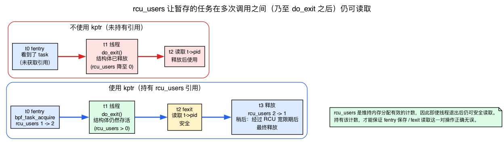
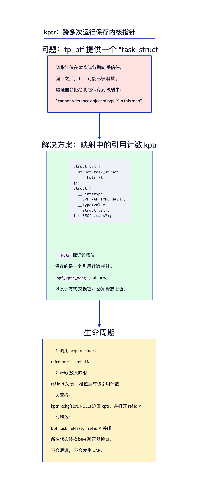
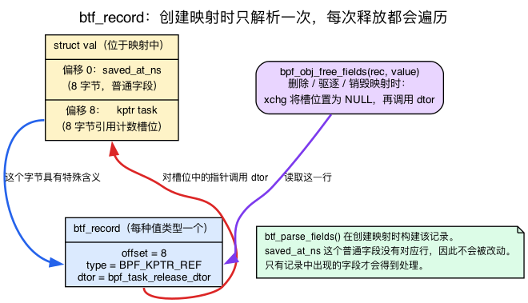
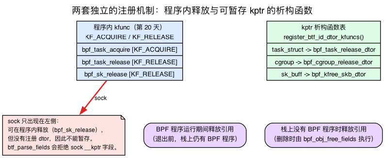
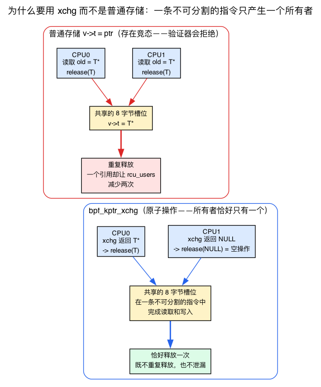
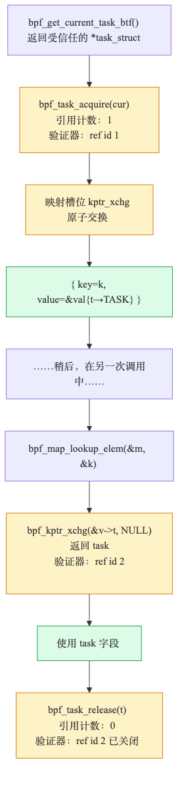

# 第21天 — 映射中的 kptr：跨调用的引用计数状态

> **今日任务：** 在一次事件中把 `task_struct *` 保存到哈希映射，等另一次事件发生时再取出并访问其字段；整个过程中的引用计数都能由验证器证明正确。你将从中学会三件事：
>
> - “删除映射条目时自动释放”背后的*唯一*机制——内核的 `btf_record`；
> - 为什么具备 release kfunc 只是保存指针的必要条件，而非充分条件；
> - 为什么对槽位的操作必须采用原子交换，不能使用普通存储。
>
> 总时间：约 110 分钟。

## 原始指针的问题

第20天的实验在一次 BPF 程序调用内获取并释放内核指针。这样做是安全的，因为资源的生命周期不会超出这次函数调用：程序运行在任务自身的上下文中，所以整个调用期间任务必然存活。

但通常你需要**跨调用保存**一个指针。示例：

- 跟踪程序为出站连接记录发起该连接的任务，并在连接完成时查找这个任务。
- sched_ext 程序在任务入队后记住其最新状态，留到分派时使用。
- 网络程序把二层套接字与父进程关联起来。

简单地将获取到的 `task_struct *` 保存到普通（非 `__kptr`）映射值字段中会失败——验证器拒绝存储被引用的指针：

```
R1 leaks addr into map
```

（这是真实的报错，见 `verifier.c:6355`。）验证器无法确信这个指针会一直有效。**从保存指针到再次读取它的这段时间里，任务可能已经被释放；此时读取就会造成释放后使用。** 这正是问题的核心。要理解今天的方案为什么安全，必须先弄清究竟是什么让 `task_struct` 保持存活。

### 复习：使退出任务可读的 `rcu_users` 引用计数

第20天已经讲过具体机制：`bpf_task_acquire` 执行 `refcount_inc_not_zero(&p->rcu_users)`，`bpf_task_release` 则调用 `put_task_struct_rcu_user(p)`。让跨调用保存变得*可靠*的关键，在于专用的 `rcu_users` 计数（`refcount_t rcu_users;`，位于 `include/linux/sched.h:1564`）提供了一项保证：即使线程已经调用 `do_exit()`，`task_struct` 所占的内存仍会保持存活，可以安全读取。因此，从 fentry 保存指针到 fexit 读取指针之间——甚至直到几分钟后——被跟踪线程虽然可能已经退出，指针指向的仍然是有效的 `task_struct`，而不是已被释放并重新利用的内存。

由此产生两个后果：

- **获取后的 NULL 检查绝非例行公事。** 如果任务的引用计数*已经*归零，也就是已经进入最终销毁阶段，那么 `refcount_inc_not_zero` 会因 `rcu_users` 为零而返回 false。这就是 `bpf_task_acquire` 带有 `KF_RET_NULL`（第20天）、下面的实验也要检查 `if (!acq) return 0;` 的原因。这里的 NULL 就表示“任务已经不存在”。
- **释放引用可能导致结构体本身被释放。** 当最后一个 `rcu_users` 引用被释放时——无论由你的 `bpf_task_release` 释放，还是由内核删除映射条目时运行的析构函数释放——`put_task_struct_rcu_user` 都会安排在一个 RCU 宽限期之后最终释放结构体。保存在映射中的引用确实会延长任务的生命周期；kptr 机制并不是绕开生命周期管理的旁路。



至此可以确认，这项生命周期保证真实有效。接下来需要一种办法，把 `rcu_users` 引用*保留*在映射槽位中，并在日后正确释放——即使释放发生时根本没有 BPF 程序正在运行。

## kptr：带引用计数的指针槽位

解决方案是 **`__kptr`**。这种结构体注解告诉验证器：“这个槽位保存的是带引用计数的内核指针；请像 kfunc 机制那样跟踪它，但允许它长期存放在映射中。”

```c
struct val {
    struct task_struct __kptr *t;
};

struct {
    __uint(type, BPF_MAP_TYPE_HASH);
    __uint(max_entries, 1024);
    __type(key, __u32);
    __type(value, struct val);
} stash SEC(".maps");
```



`__kptr` 注解修改了该字段：验证器和 BPF 运行时都把这 8 字节的槽位当作一个带引用计数的指针，它可以是 NULL，也可以指向一个有效的内核对象。运行时知道如何在映射条目被删除时释放它（通过 kptr 注册的析构函数）。

它有两种形式：

- **`__kptr`** — 槽位拥有一个引用。插入指针时必须把一个已经获取的引用转交给槽位；读取时则必须以原子方式取得其所有权。（旧代码可能使用 `__kptr_ref`，但这种写法已经移除。当前 libbpf 在 `tools/lib/bpf/bpf_helpers.h:193-196` 定义了 `__kptr`、`__kptr_untrusted`、`__percpu_kptr` 和 `__uptr`，它们都是 `btf_type_tag` 属性。）
- **`__kptr_untrusted`** — 不受信任的 kptr：既不计引用，也不保证对象存活。可以用普通赋值保存并直接加载，但加载得到的指针会被标记为 `PTR_UNTRUSTED`，所以解引用会按可能出错的访问（probe-read）处理，而不是按可信访问处理。

我们关注的是 `__kptr`（带引用计数的）。

不过，“运行时知道如何释放它”这句话背后隐藏着不少机制。面对值结构体中的所有字节，运行时如何识别出某个特殊的 8 字节字段？又如何知道应该调用哪个函数来释放它？本章后续内容都依赖这套机制，因此我们先把它讲清楚，再进入实验。

## 内核如何知道某个字段是特殊的：`btf_record`

这是本章的核心。理解它之后，“删除时自动释放”便不再神秘。

当你创建一个值类型包含 `__kptr`（或 `bpf_spin_lock`、`bpf_timer`、`bpf_list_head` 等）的映射时，内核会在**映射创建时解析该值的 BTF 一次**，并构建一个小表，称为 **`btf_record`**。该记录列出了每个“特殊”字段：其字节偏移、类型标签，以及——对于 kptrs——当字段被释放时要调用的析构函数。

`__kptr` 并非运行时内建理解的语言特性，它只是通用“此字段需要特殊处理”框架中的**一种字段类型**。这些字段类型标签定义在 `enum btf_field_type`（`include/linux/bpf.h:194`）中：

```c
/* include/linux/bpf.h:194 */
enum btf_field_type {
    BPF_SPIN_LOCK   = (1 << 0),   /* :195 */
    BPF_TIMER       = (1 << 1),   /* :196 */
    BPF_KPTR_UNREF  = (1 << 2),   /* :197  — the __kptr_untrusted slot */
    BPF_KPTR_REF    = (1 << 3),   /* :198  — refcounted; what THIS chapter uses */
    BPF_KPTR_PERCPU = (1 << 4),   /* :199 */
    BPF_KPTR        = BPF_KPTR_UNREF | BPF_KPTR_REF | BPF_KPTR_PERCPU,  /* :200 */
    BPF_LIST_HEAD   = (1 << 5),   /* :201 */
    /* ... timers, lists, rbtrees, refcount, workqueue ... */
};
```

负责构建这张表的是 **`btf_parse_fields()`**（`kernel/bpf/btf.c:4072`）。它遍历值结构体的成员，识别 `__kptr` 宏生成的 `btf_type_tag("kptr")` 标签，并为找到的字段记录 `{offset, BPF_KPTR_REF, dtor}`。这也解释了为什么普通赋值 `v->t = ptr` 对运行时没有任何特殊含义：槽位之所以“特殊”，*正是因为它被列入 `btf_record`*；只有验证器依据这条记录处理的操作（xchg 和释放遍历器）才会遵守相应语义。

接下来就能看到这张表的作用了。**每当**元素被释放时——无论是用户空间删除映射条目、整个映射被销毁，还是哈希表驱逐元素——内核都会调用 **`bpf_obj_free_fields(record, value)`**（`kernel/bpf/syscall.c:810`），遍历记录并按字段类型分别处理：

```c
/* kernel/bpf/syscall.c:810 — bpf_obj_free_fields, abridged */
for (i = 0; i < rec->cnt; i++) {
    ...
    switch (fields[i].type) {
    case BPF_SPIN_LOCK:           break;                       /* nothing to free */
    case BPF_TIMER:               bpf_timer_cancel_and_free(...); break;
    case BPF_KPTR_UNREF:          WRITE_ONCE(*(u64 *)field_ptr, 0); break;  /* just zero it */
    case BPF_KPTR_REF:
    case BPF_KPTR_PERCPU:
        xchgd_field = (void *)xchg((unsigned long *)field_ptr, 0);  /* atomic-take */
        if (xchgd_field)
            field->kptr.dtor(xchgd_field);    /* call the registered destructor */
        break;
    ...
    }
}
```

**这个循环就是所谓的“自动释放”。** 请注意三点：

1. 取消定时器、清空链表和释放 kptr 都由同一个循环完成。kptr 并不是例外，只是通用遍历器中的一个 `case`。
2. 对带引用计数的 kptr，它先通过 `xchg` 把槽位设为 NULL，再调用 `field->kptr.dtor`。这个析构函数正是 `btf_parse_fields` 在创建映射时写入记录的。
3. 只要释放元素，它就会**无条件运行**。因此，*删除操作本身不可能造成泄漏*：无论用户空间删除单个条目、整个映射被销毁，还是程序崩溃后用户空间再清空映射，所有路径都会经过 `bpf_obj_free_fields`。哈希表的调用点位于 `kernel/bpf/hashtab.c:475, 852, 1022, 1032, 1040`，逐元素释放和删除最终都会汇聚到这里。



> ### 常见疑问
>
> **问：`btf_record` 是每个映射一份，还是每个条目一份？**
>
> 答：每个映射一份（更准确地说，是每种值 *类型* 一份）。它在映射创建时构建一次，由每个条目共享。条目本身只是一段字节；记录则是模式，说明其中哪些字节很特殊，以及该如何释放它们。
>
> **问：如果我的值结构体没有特殊字段怎么办？**
>
> 答：`btf_parse_fields` 会返回 NULL 或空记录，`bpf_obj_free_fields` 则提前返回（`IS_ERR_OR_NULL(rec)`）。普通映射不会承担额外开销；只有真正声明了 kptr（或自旋锁、定时器、链表等）时，这套机制才会启用。

## 可以存储哪些内容——以及析构函数*注册表*

既然 `bpf_obj_free_fields` 会调用 `field->kptr.dtor`，这个函数指针从何而来？为什么可以保存 `task_struct`，却不能保存 `struct sock`？这正是学完第20天后最容易困惑的地方。

第20天介绍了**获取/释放 kfunc**（`KF_ACQUIRE` / `KF_RELEASE`），它们负责*单次程序运行期间*的引用计数管理：BPF 程序会在退出前自行调用 `bpf_task_release`。保存 kptr 则还需要一套**额外机制**，因为内核日后必须能在 `bpf_obj_free_fields` 中释放引用，而**此时调用栈上可能根本没有 BPF 程序**。因此还需要一张独立注册的查找表，把*类型映射到析构函数*。

这个表由 **`register_btf_id_dtor_kfuncs(dtors, count, module)`**（`kernel/bpf/btf.c:9083`, `EXPORT_SYMBOL_GPL` 在 `:9156`）安装。它接收一个 `{btf_id, kfunc_btf_id}` 对的数组，表示“对于 *这种* 结构体类型对象，调用 *这个* 函数来释放一个引用。” **只有出现在某个已注册销毁表中的类型才能作为 `__kptr`（`BPF_KPTR_REF`）映射槽位。** 如果 `btf_parse_fields` 发现 kptr 字段的类型没有注册的销毁函数，它会拒绝该映射。

这里还有一个值得注意的签名差异：析构函数入口是简单的 `void(void *)` 包装器，与带具体类型的 release kfunc *并不相同*：

```c
/* kernel/bpf/helpers.c:2744 — the typed kfunc BPF programs call */
__bpf_kfunc void bpf_task_release(struct task_struct *p)
{
    put_task_struct_rcu_user(p);
}

/* kernel/bpf/helpers.c:2749 — the void* destructor the kernel calls generically */
__bpf_kfunc void bpf_task_release_dtor(void *p)
{
    put_task_struct_rcu_user(p);
}
CFI_NOSEAL(bpf_task_release_dtor);   /* :2753 */
```

`void *` 形式让 `bpf_obj_free_fields` 无需知道具体类型也能调用它；带具体类型的 `bpf_task_release` 则供程序调用。两者释放的是**同一个 `rcu_users` 引用**。换言之，“删除映射条目时自动释放”与程序手动释放执行的是*完全相同*的操作，只是调用路径不同。

这个配对是从一个 BTF id 列表（`kernel/bpf/helpers.c`）构建的：

```c
/* helpers.c:4768 area */
BTF_ID(struct, task_struct)            /* :4769 */
BTF_ID(func,   bpf_task_release_dtor)  /* :4770 */
#ifdef CONFIG_CGROUPS
BTF_ID(struct, cgroup)                 /* :4772 */
BTF_ID(func,   bpf_cgroup_release_dtor)/* :4773 */
#endif
```

它被定义为 `generic_dtors[]`（`helpers.c:4877`），并通过 `register_btf_id_dtor_kfuncs(generic_dtors, ...)` 在 `helpers.c:4896` 完成注册。

### 支持的集合（以及 sock/nf_conn 的陷阱）

可保存的类型集合由*多个子系统*共同组成：各子系统在初始化时分别调用 `register_btf_id_dtor_kfuncs`，因此这个列表会随内核版本不断扩展。截至 7.x：

- `struct task_struct __kptr *` — 由 `bpf_task_release`（析构函数 `bpf_task_release_dtor`，注册于 `kernel/bpf/helpers.c`）释放。
- `struct cgroup __kptr *` — 由 `bpf_cgroup_release`（析构函数位于 `helpers.c:2779`）释放。
- `struct bpf_cpumask __kptr *` — 由 `bpf_cpumask_release`（注册于 `kernel/bpf/cpumask.c:529`）释放。
- `struct sk_buff __kptr *` — 由 `bpf_kfree_skb_dtor`（`net/sched/bpf_qdisc.c:205`，注册于 `bpf_qdisc.c:471`，BTF id 位于 `:458`）释放。
- `struct bpf_crypto_ctx __kptr *` — 由加密析构函数释放（注册于 `kernel/bpf/crypto.c:394`）。

注意：`struct sock` 通过传统的**辅助函数**释放，即位于 `net/core/filter.c:7199` 的 `bpf_sk_release`（`BPF_FUNC_sk_release`，一个 `BPF_CALL_1`，*不是* `KF_RELEASE` kfunc）；`struct nf_conn` 则通过 release **kfunc** 释放，即位于 `net/netfilter/nf_conntrack_bpf.c:513`、带 `KF_RELEASE` 的 `bpf_ct_release`。两者机制不同，但**这两种类型都没有通过 `register_btf_id_dtor_kfuncs` 注册 kptr 析构函数**，因此都不能保存在 `__kptr` 映射槽位中。**“具备 release 辅助函数或 kfunc”与“已经注册 kptr 析构函数”是两套不同的注册机制。** `bpf_sk_release`/`bpf_ct_release` 的确存在，也能在程序内调用；但没有任何代码注册 `struct sock → destructor` 或 `struct nf_conn → destructor` 条目，所以 `btf_parse_fields` 找不到析构函数并拒绝相应字段。单次程序调用内的 acquire/release 可用，跨调用保存到映射则不可用。



列表随着每次内核发布而增长。请查看 `Documentation/bpf/kfuncs.rst` 获取当前集合。

## 操作原理：只能使用 xchg API

对 `__kptr` 槽位的唯一合法操作是通过 **`bpf_kptr_xchg`**：

```c
struct task_struct *bpf_kptr_xchg(struct task_struct **dst, struct task_struct *new);
```

它原子性地将 `*dst` 与 `new` 交换，并返回旧值。普通存储（`v->t = ptr;`）会被拒绝。在列出具体规则之前，先理解*为什么*必须采用原子交换；章末的检查问题正是建立在这个原因之上。

### 为何是原子交换而非普通存储

回顾第2天：**映射槽位属于共享的内核内存，不同 CPU 可以并发读写**，所以递增其中的计数器必须使用原子操作 `__sync_fetch_and_add`。kptr 槽位也一样：来自不同 CPU 的两次程序调用可能同时访问同一个 8 字节字段。

kptr 还有第2天未涉及的特殊要求：**引用的所有权必须以原子方式转移。** `xchg(slot, new)` 用一条不可分割的指令读取旧指针*并*写入新指针，因此**每个旧值恰好只会被一个调用者看到。** 假如改成“读取旧值”再“写入新值”两个步骤：

- 两个 CPU 都读取了相同的非空旧指针，并且都对它调用了 `bpf_task_release` → **重复释放**（一个引用的 `rcu_users` 计数被减少两次）。
- 或者一个存储操作覆盖了一个无人释放其引用的指针 → **泄漏**（一个 `rcu_users` 引用永远被困住）。

验证器正是因此拒绝普通存储 `v->t = ptr`：它写入新指针却不返回旧值，于是原占用者持有的引用会在无声无息中丢失；此外，这个操作本身也不是不可分割的。`bpf_kptr_xchg` 是*唯一*允许的操作，因为只有它既能**转移所有权**，又能**返回旧值**供调用者释放。

“取出”方向使用的也是同样技巧：`bpf_kptr_xchg(&slot, NULL)` 原子地将指针取出并清空槽位，因此另一个 CPU 上并发的取走者会得到 `NULL` 而不是同一引用的第二个副本。这就是为什么实验中的检索路径是安全的。

实现上就是一条指令（`kernel/bpf/helpers.c:1731`）：

```c
/* kernel/bpf/helpers.c:1731 — bpf_kptr_xchg */
BPF_CALL_2(bpf_kptr_xchg, void *, dst, void *, ptr)
{
    unsigned long *kptr = dst;
    return xchg(kptr, (unsigned long)ptr);
}
```

所有的安全性都依赖于硬件原子性和验证器坚持要求你处理返回的旧值。



### 引用跟踪规则

1. 将获取到的指针存储到槽位中：`bpf_kptr_xchg(&v->t, acq)`。验证器将引用 ID 从 `acq`（你的本地变量）转移到映射槽位。该槽位现在拥有该引用计数。
2. `bpf_kptr_xchg` 的**返回值**是之前的占用者。**你必须释放它**。如果非空，调用 `bpf_task_release(old)`。
3. 取出指针：`bpf_kptr_xchg(&v->t, NULL)` — 原子取出操作，使槽位变为空。返回的指针携带一个全新的引用 ID，你稍后必须释放它。
4. **如果在槽位非空时删除了映射条目**，内核会自动对槽位中的指针调用已注册的析构函数（对于任务而言是 `bpf_task_release_dtor`）；这发生在 `bpf_obj_free_fields` 阶段，也就是我们上面剖析过的遍历器。无需手动清理；删除操作不会造成内存泄漏。



## 在一个值结构体中存放多个 kptr

你可以在同一个值中拥有多个 kptr 字段：

```c
struct val {
    struct task_struct __kptr *task;
    struct cgroup       __kptr *cg;
    __u64 saved_at_ns;
};
```

每个字段都独立交换。这个值类型的 `btf_record` 包含**两个** kptr 条目，每个偏移对应一项；普通内存字段 `saved_at_ns` 不需要记录。映射条目销毁时，`bpf_obj_free_fields` 会遍历记录，依次释放*所有* kptr 字段，并忽略非 kptr 字节。机制仍是同一套，只是表中有两行记录。

## 实验

```c
{{#include ../labs/day21/task_assoc.bpf.c:book}}
```

为什么是 `filename_unlinkat`？这是一个真实且稳定的函数——`int filename_unlinkat(int dfd, struct filename *name)` 位于 `fs/namei.c:5536` 路径上——每个 `rm`/`unlink` 的路径中都会经过它。fentry 程序在进入函数时运行并保存；fexit 程序在函数返回时运行（即退出路径）并检索。因此，保存和读取操作真正地被 `filename_unlinkat` 的函数体分隔开——这正是本章所讨论的跨调用场景。

注意查找失败分支中的手动释放路径：如果更新或插入条目之后，`bpf_map_lookup_elem` 因某种原因返回 NULL，那么 `acq` 仍持有一个从未转交给映射的 `rcu_users` 引用。此时必须手动调用 `bpf_task_release(acq)`，否则就会泄漏。kptr 机制只会自动释放真正*进入*槽位的指针。

构建并运行。加载器采用标准的 skeleton 打开、加载和挂载流程，同时挂载 fentry 与 fexit 程序：

```c
{{#include ../labs/day21/task_assoc.c:book}}
```

```bash
make task_assoc
sudo ./.output/day21/task_assoc &
touch /tmp/x && rm /tmp/x       # fentry stashes on entry, fexit retrieves on return
sudo cat /sys/kernel/debug/tracing/trace_pipe
```

每调用一次 `filename_unlinkat`，你都会看到一行输出，其中包含取回的任务和耗时。

观察完毕后停止加载器，让 fentry/fexit 程序解除挂载：

```bash
sudo pkill -f task_assoc       # or, since it's job 1: kill %1
```

## 试着破坏它

### 普通存储

```c
vp->task = acq;
```

验证器会给出一条明确的拒绝信息。它不是后面两种错误所触发的引用泄漏类 `Unreleased reference`，而是：

```
store to referenced kptr disallowed
```

kptr 字段只能通过 `bpf_kptr_xchg` 赋值。正如原子交换部分所解释的那样，普通存储会写入新指针但从未将旧指针返回——因此它会通过覆盖来泄漏引用计数，并且在竞争 CPU 下不是不可分割的。该检查位于 `check_map_kptr_access`（`kernel/bpf/verifier.c:4721`）；对任何非加载存储类目标为 `BPF_KPTR_REF`/`BPF_KPTR_PERCPU` 字段——`store to referenced kptr disallowed`，返回 `-EACCES`——的拒绝在 `verifier.c:4747` 处。

### 忘记释放前一个占用者

```c
bpf_kptr_xchg(&vp->task, acq);
/* discarded the return value */
```

验证器会以 `Unreleased reference id=N alloc_insn=M` 拒绝。xchg 返回了一个（可能非 NULL）的旧值及其自己的引用 ID；丢弃该 ID 会导致泄漏。

模式总是：

```c
struct task_struct *old = bpf_kptr_xchg(&vp->task, acq);
if (old) bpf_task_release(old);
```

### 忘记释放检索到的 kptr

```c
struct task_struct *t = bpf_kptr_xchg(&vp->task, NULL);
if (!t) return 0;
return 0;     /* leak: t still holds a refcount */
```

在退出时被拒绝：`Unreleased reference id=N alloc_insn=M`。

### 映射删除自动释放

当用户空间删除一个 kptr 槽位仍**有值**的映射条目时，内核会对槽位中的指针运行已注册的析构函数（任务对应 `bpf_task_release_dtor` → `put_task_struct_rcu_user`）；这发生在 `bpf_obj_free_fields` 阶段，正是我们之前查看的遍历器中的 `BPF_KPTR_REF` 分支。不会发生泄漏，也无需手动清理；即使程序异常终止、用户空间随后才清空映射也是如此：无论栈上是否有 BPF 程序，释放遍历器都会运行。

在实验中演示这一点的问题在于：fexit 处理程序已经在返回时 `bpf_kptr_xchg` 将槽位设回 NULL（从 `struct task_struct *t = bpf_kptr_xchg(&vp->task, NULL)` 块到 `bpf_task_release(t)` 在 `on_unlink2` 中），因此在用户空间删除运行时，槽位已经为空，删除不会释放任何内容。要真正看到析构函数被触发，**临时注释掉 `on_unlink2` 中的 fexit 检索**，使条目保持填充状态，然后从用户空间删除它们：

```c
/* userspace — fd and key are real, not placeholders */
int fd = bpf_map__fd(skel->maps.stash);

/* tid is a per-rm-process key you don't know a priori, so iterate: */
__u32 key = 0, next;
struct val v;
while (bpf_map_get_next_key(fd, &key, &next) == 0) {
    bpf_map_lookup_and_delete_elem(fd, &next, &v);   /* delete fires the kptr dtor */
    key = next;
}
```

要观察析构函数触发，请在删除条目之前先在另一个终端运行：

```bash
sudo bpftrace -e 'kprobe:bpf_task_release_dtor { @releases = count(); printf("dtor fired\n"); }'
```

探测 **`bpf_task_release_dtor`**，而不是 `bpf_task_release`——它们是上文分析过的两个不同符号（前者是内核通用调用的 `void *` 析构函数，后者是程序调用的有类型 kfunc）。删除映射条目的路径会执行 `bpf_obj_free_fields` → `field->kptr.dtor`，也就是 `bpf_task_release_dtor`；它**不会**经过有类型的 `bpf_task_release`。因此，这个探针只会在内核的自动释放路径上触发。

预期结果：每删除一个**有值**的槽位，`@releases` 就递增一次——这正是内核代你调用已注册的 kptr 析构函数。如果没有 kptr 机制，每个存储条目都会泄漏一个任务引用计数。

一个很方便的结果是：`bpf_task_release_dtor` 与 fexit 路径调用的有类型 `bpf_task_release(t)` 是两个不同的符号，因此这个探针会自然隔离删除映射条目时发生的释放——它*完全不会*统计程序内的释放，所以无需禁用 fexit 路径或比较计数。（如果你改为探测 `kprobe:bpf_task_release`，你会捕获到程序内释放，但完全错过析构函数——这与你想要的结果相反。）为了确认删除前槽位已填充，先使用 `sudo bpftool map dump pinned /sys/fs/bpf/stash` 转储活动映射（如果你对映射进行了固定）。

## 在内核中该读什么

- **`kernel/bpf/helpers.c:1731`**——`bpf_kptr_xchg`。实现部分。很小——只是 `xchg()` 加上返回语句。复杂性在于类型检查，而不是运行时。

- **`include/linux/bpf.h:194`**——`enum btf_field_type`。“特殊”字段标签的目录（`BPF_KPTR_REF` 在 `:198` 中，加上自旋锁、定时器、链表）。kptr 是这个通用框架中的一个条目。

- **`kernel/bpf/btf.c:4072`**——`btf_parse_fields`。遍历结构体字段，识别 kptr（和其他特殊类型），构建 `btf_record`——在解析时查找每个 kptr 的析构函数并存储它。阅读这部分以理解什么使结构体字段“特殊”。

- **`kernel/bpf/btf.c:9083`**——`register_btf_id_dtor_kfuncs`。`type → destructor` 注册入口点。搜索其调用者（`helpers.c:4896`、`cpumask.c:529`、`crypto.c:394`、`bpf_qdisc.c:471`）以查看跨子系统组装的可存储集合。

- **`kernel/bpf/syscall.c:810`** — `bpf_obj_free_fields`，即析构函数字段遍历器。删除映射条目时，它遍历值的 `btf_record`，按字段类型分别处理：对 `BPF_KPTR_REF`，先用 `xchg` 把槽位设为 NULL，再执行析构函数。这就是删除映射条目时释放 kptr 的方式；哈希表调用点位于 `hashtab.c:475, 852, 1022, 1032, 1040`。

- **`kernel/bpf/verifier.c`** — `check_map_kptr_access`（`:4721`）实现存储拒绝逻辑；搜索 `mark_btf_ld_reg` 可了解验证器如何在使用位置判断 kptr 字段类型，继续跟踪 `check_kfunc_call` 则可查看获取/释放引用的跟踪逻辑。

- **`tools/testing/selftests/bpf/progs/cpumask_*.c`** — 大量的 kptr 测试，包括映射中的 kptr 模式。

## 要点回顾

- **kptr** 让 BPF 程序可以把带引用计数的内核指针存入映射，并跨调用使用。
- 注解：**`__kptr`** 位于值结构体中。
- 内核知道一个字段是 kptr 是因为 **`btf_parse_fields` 在创建映射时构建一个 `btf_record`**——为每个特殊字段建立一个 `{offset, type, dtor}` 表。kptr 是 `enum btf_field_type` 中的一个条目，与自旋锁/定时器/列表并列。
- 在每次元素释放时，**`bpf_obj_free_fields` 遍历该记录** 并触发每个 kptr 的析构函数——这是 *同一个* 循环，用于取消定时器和清空列表。这就是“自动释放”；它在没有 BPF 程序在栈上的情况下运行。
- 只有当某个子系统注册了 **`type → destructor` 对，并通过 `register_btf_id_dtor_kfuncs` 完成登记**，该类型才可存储——这项注册与第20天的 acquire/release kfunc 注册 *彼此独立*。（`sock`/`nf_conn` 有 release kfunc，却没有注册析构函数，因此不能存储。）
- 析构函数（`bpf_task_release_dtor`）和程序中的释放（`bpf_task_release`）会减少 **相同的 `rcu_users` 引用计数**——这个计数使得 `task_struct` 即使在线程退出后仍可读。
- 所有访问都通过 **`bpf_kptr_xchg`**（原子交换）进行。普通存储被拒绝——只有 `xchg` 既转移所有权 *又* 将前一个所有者暴露给你以供释放；普通存储会导致泄漏或双释放竞争。
- xchg 返回旧值——**如果非空你必须释放**。
- 映射删除时 **自动释放** 存储的 kptr（调用已注册的析构函数）——你无法通过删除来泄漏。
- 每个值中的多个 kptr 是独立的——每个都是其自己的 `btf_record` 行，在释放时单独释放。
- 支持的类型（已注册的 kptr 析构函数）：task_struct、cgroup、bpf_cpumask、sk_buff、bpf_crypto_ctx；每发布一次都会增加更多类型。

## 检查问题

你通过 xchg 把一个新任务放入映射槽位，却没有捕获返回值。该槽位此前为空。为什么验证器仍会拒绝？

<details>
<summary>点击查看答案</summary>

**答：** 因为验证器无法静态地确定该槽位是空的。即使你的程序逻辑保证该槽位刚刚被初始化为 NULL，验证器也必须假设该槽位可能保存着之前存储的 kptr（例如，来自在不同 CPU 上下文中运行的另一个并发调用——先查找后 xchg 模式仅在 xchg 部分是“原子”的，而不是在整个序列中都是原子的）。

因此 `bpf_kptr_xchg(&v->t, acq)` 可能返回一个非 NULL 的引用计数指针，而验证器要求每一个可能的非 NULL 返回值都必须被释放。这个检查是保守的（在你恰好知道槽位为空的情况下会过度拒绝），但这是唯一能够保证正确性的方式——否则就是“信任程序员的分析”，而历史上这种做法对内核安全性来说一直是个灾难。

当槽位为空时，运行时成本为无操作：`bpf_task_release(NULL)` 是一个 NULL 检查然后跳过，约 1 纳秒。验证器的要求不会增加任何运行时成本；它只是要求你写一个条件判断。

</details>

---

## 明天

第22天：struct_ops。使用 BPF 程序替换内核函数指针表。
