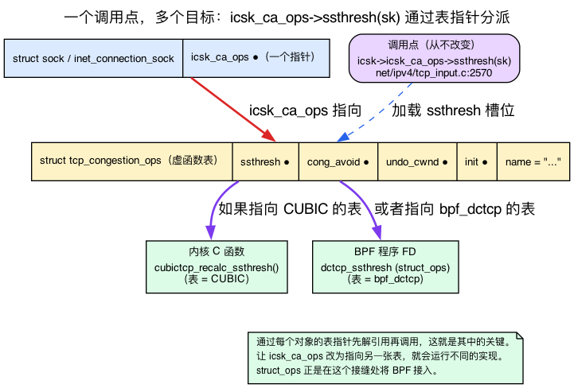
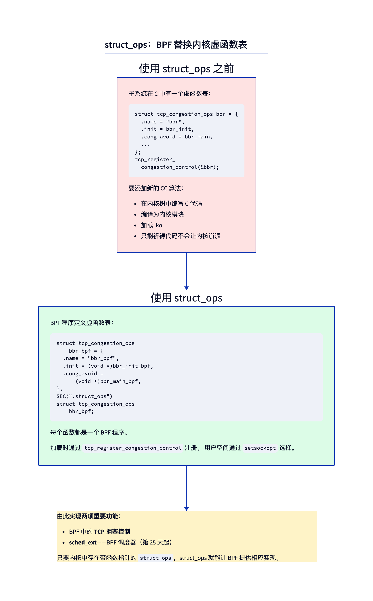
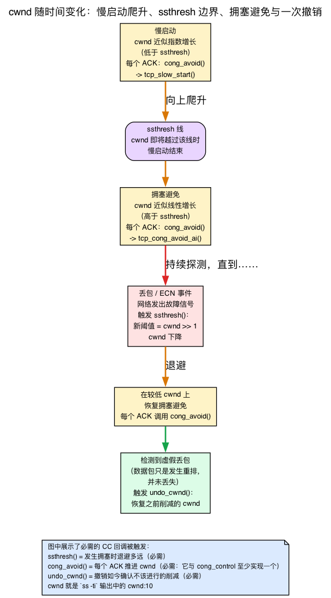
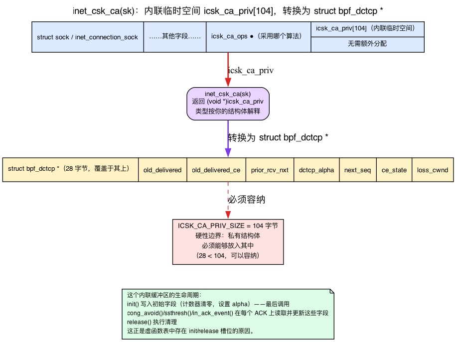
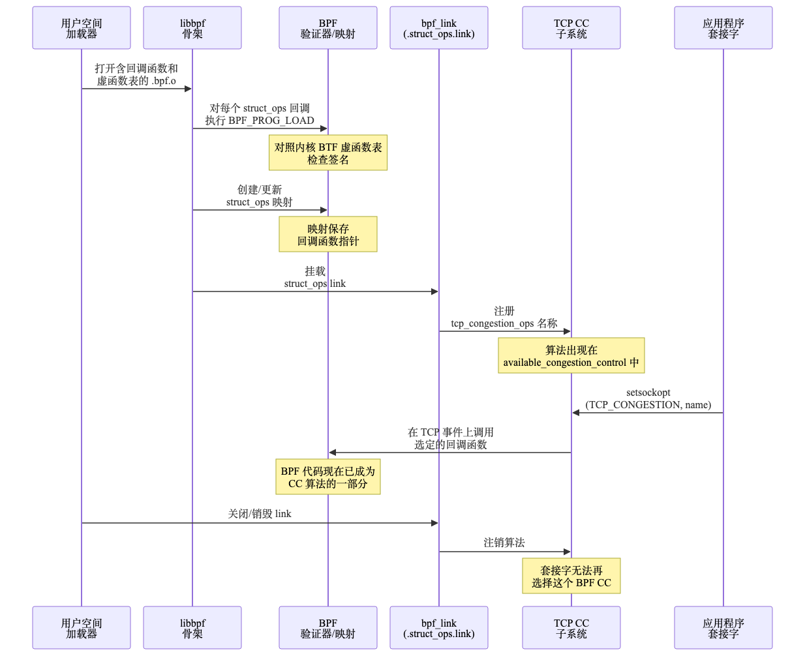

# 第22天 — struct_ops：用 BPF 替换内核 vtable

> **今日任务：** 加载一个用 BPF 实现的 TCP 拥塞控制算法，并将它用于一条真实连接。在动手之前，先理解背后的机制：什么是内核 *vtable*，内核如何通过它发起调用，TCP 拥塞控制算法究竟*负责什么*，以及连接的每套接字临时状态存放在哪里。最后看看 struct_ops 如何把 BPF 从“跟踪钩子”变成“内核扩展语言”。总时长：约 120 分钟。

过去 21 天里，你写的每个 BPF 程序都是**观察者**：kprobe 触发后读取状态并返回；XDP 程序检查数据包，再决定放行还是丢弃。即便程序确实*修改*了什么——例如重写数据包或设置 sockopt——它也只是在内核预先设置的固定调用点上执行一小段逻辑，随后便交还控制权。内核完成主体工作，你的程序只负责观察，偶尔施加一点影响。

今天，角色将彻底反转：BPF 程序*成为内核工作本身*。它不再旁观拥塞控制算法运行，而**就是**那个拥塞控制算法。要理解这是如何实现的，需要先认识内核早已用于替换算法实现的机制：**vtable**。

进入实验前，先补齐三部分背景知识。否则，内核自带并且本章要求通读的经典示例 `bpf_dctcp.c`，看起来只会是一堆含义不明的槽位名：

1. **什么是 vtable**——一个装满函数指针的结构体——以及内核如何通过它进行调用，从而在纯 C 语言里得到运行期多态。
2. **TCP 拥塞控制意味着什么**——`cwnd`、`ssthresh`、慢启动，以及每个 ACK 的回调节奏——这样 `ssthresh`/`cong_avoid`/`undo_cwnd` 这些槽位名字就不再是噪声。
3. **CC 算法把每连接状态存放在哪里**——也就是每个 `bpf_dctcp` 回调通过 `inet_csk_ca(sk)` 访问的内联暂存缓冲区 `icsk_ca_priv`。

后文会在相关 struct_ops 机制首次用到这些知识时逐一讲解。

---

## 什么是 vtable：函数指针表与 C 语言中的运行期多态

先看内核一直要解决的问题。TCP 协议栈只有**一套**，拥塞控制算法却有**很多种**——CUBIC、BBR、Reno、DCTCP——而每条连接会在运行时选用其中一种。协议栈不可能在每个 ACK 的快速路径上都执行 `if (using_cubic) … else if (using_bbr) …`，这样既难以维护，效率也很低。C 语言没有类和虚方法，那么同一个调用点如何调用多种不同的实现？

**答案是由函数指针组成的结构体，也就是 vtable。** 先声明一个结构体，让每个成员都成为某项操作对应的函数指针。各算法分别填充这个结构体的*独立实例*，把成员指向各自的实现。切换行为时无需修改调用点，只要让对象改为指向另一份填好的结构体即可。同一个调用点究竟执行哪种实现，取决于当前指向哪张表。这就是 C 语言实现 C++ 所谓运行时多态的方式。

内核的拥塞控制 vtable 是 `struct tcp_congestion_ops`。这里是它的样子，为便于初次阅读对字段做了重排和精简：

```c
/* include/net/tcp.h:1316 — fields reordered/trimmed for readability;
 * the real layout puts fast-path callbacks first and init/release LAST */
struct tcp_congestion_ops {
    u32   (*ssthresh)(struct sock *sk);
    void  (*cong_avoid)(struct sock *sk, u32 ack, u32 acked);
    void  (*set_state)(struct sock *sk, u8 new_state);
    void  (*cwnd_event)(struct sock *sk, enum tcp_ca_event ev);
    void  (*in_ack_event)(struct sock *sk, u32 flags);
    void  (*pkts_acked)(struct sock *sk, const struct ack_sample *sample);
    u32   (*undo_cwnd)(struct sock *sk);
    /* ... ~10 callbacks ... */
    char name[TCP_CA_NAME_MAX];
    /* ... */
    void  (*init)(struct sock *sk);     /* private-data setup, called last */
    void  (*release)(struct sock *sk);  /* private-data teardown */
};
```

上面的示例已经明确说明字段经过重排。真实的 `include/net/tcp.h:1316` 在结构体开头注明*“把快速路径字段放在最前，以填满一个缓存行”*：快速路径回调（`cong_avoid`、`cong_control`、`ssthresh`）位于前部，控制路径、慢速路径字段以及 `init`/`release` 则排在**最后**，整个结构体以 `____cacheline_aligned_in_smp` 结尾。这正是第1天讲解 `sk_buff` 时见过的缓存行布局原则，如今同样用于 vtable。

### 内核实际上如何通过它进行调用

vtable 在有东西通过它分发之前毫无用处。每个 TCP 套接字都携带指向它当前所用 `tcp_congestion_ops` 的**一个指针**：

```c
/* include/net/inet_connection_sock.h:97 */
const struct tcp_congestion_ops *icsk_ca_ops;   /* "Pluggable congestion control hook" */
```

为一条连接选定算法，无非就是把 `icsk_ca_ops` 指向那个算法的表。而 TCP 快速路径*间接地、通过那个指针*调用操作，从不指名某个具体算法：

```c
/* net/ipv4/tcp_input.c:2570 — on a loss/ECN event, ask the CC for the new threshold */
WRITE_ONCE(tp->snd_ssthresh, icsk->icsk_ca_ops->ssthresh(sk));

/* net/ipv4/tcp_input.c:3517 — per ACK, let the CC advance the window */
icsk->icsk_ca_ops->cong_avoid(sk, ack, acked);

/* net/ipv4/tcp_input.c:3864 — or, if the CC took full control, hand it everything */
icsk->icsk_ca_ops->cong_control(sk, ack, flag, rs);
```

仔细看 `icsk->icsk_ca_ops->ssthresh(sk)`：它表示*沿套接字的 CC 指针找到对应的表，从中取出 `ssthresh` 槽位，再调用该槽位中的函数。* 如果 `icsk_ca_ops` 指向 CUBIC 的表，就会调用 CUBIC 的 C 函数；如果指向 BBR 的表，就会调用 BBR 的实现。**调用点始终不变，改变的是调用目标。** 这种通过每对象表指针先解引用、再间接调用的方式，就是整个机制的关键，也是 struct_ops 将 BPF 接入内核的接口。

注册是一张表加入可选算法池的方式：`tcp_register_congestion_control()` 把这张表加入一个全局链表（`tcp_cong_list`），这样它日后就能按名字被查找并赋给某个套接字的 `icsk_ca_ops`。



### 为什么这是“内核扩展”，而不是“跟踪”

把两种模型放在一起比较，便能看出本章的核心区别：

- **跟踪**钩子（kprobe、tracepoint、fentry——第21天及以前使用的机制）只能在预先设定的固定调用点上*观察*。内核运行自己的逻辑，经过该位置时让你的程序查看状态。你的程序仍是一个具备写权限的旁观者。
- **struct_ops** 程序则*直接成为调用目标*。旁边不再有另一套“内核逻辑”同时运行；调用 `icsk_ca_ops->ssthresh(sk)` 时，**真正执行的函数就是你的 BPF 程序。** 你不是在旁观算法，而是成为算法本身。

正因如此，struct_ops 才称得上*内核扩展语言*，而不只是*跟踪*。这也与 BTF 紧密相关：从第1天的 `vmlinux.h` 到第3天的 CO-RE，你一直在依赖 BTF。内核通过自身 BTF 发布 `struct tcp_congestion_ops` 的布局；当你为这些槽位提供 BPF 程序时，验证器便能**逐槽位**把各回调签名与 C 结构体声明的类型匹配。vtable 的结构是契约，BTF 则让双方就这份契约达成一致。

经典范例恰恰就是这个——**TCP 拥塞控制**。CUBIC、BBR、Reno、DCTCP 全都是 `tcp_congestion_ops` 在 C 里的实现，各自通过 `tcp_register_congestion_control()` 注册。现在你可以用 **BPF** 写一个了。



---

## TCP 拥塞控制到底做什么

在理解拥塞控制算法的职责之前，`ssthresh`、`cong_avoid`、`undo_cwnd` 这些槽位名很难读懂。本书此前尚未系统介绍拥塞控制——第19天只在 `bpf_setsockopt(..., "bbr")` 中*提到*一个算法名。下面补充的知识刚好足以让你无需查阅网络教材，也能读懂 `bpf_dctcp.c`。

**CC 要解决的问题。** TCP 发送方看不到网络内部，不知道还有多少空闲带宽，也不知道队列有多深。发送过快会导致路由器丢包，使所有流的吞吐量一同下降；发送过慢又会浪费链路容量。拥塞控制就是发送方不断*估计*的过程：探测网络、响应反馈，最终收敛到合适的发送速率。

**`cwnd`——拥塞窗口。** 这是发送方为自身设定的上限，限制同时处于“在途”状态（已经发送但尚未收到 ACK）的 **MSS 大小报文段**数量。（Linux 的 `tp->snd_cwnd` 和 `tcp_snd_cwnd()` 以报文段而非字节计数；RFC 在概念上用字节定义 `cwnd`，但该字段和相关工具使用报文段。）它表示 TCP 对网络当前承载能力的动态估计。今天的实验中，`cwnd` 就是 `ss -ti` 打印的 `cwnd:10`；`cwnd:10` 表示算法当前允许 **10 个报文段**在途。

**`ssthresh`——慢启动阈值。** `cwnd` 在两种不同的机制下增长，而 `ssthresh` 是两者之间的边界：

- **低于 `ssthresh`：慢启动。** `cwnd` 大致*指数*增长——它快速爬升，以便迅速找到网络的天花板。你可以直接看到这个天花板是如何被强制的：

  ```c
  /* net/ipv4/tcp_cong.c:456 — tcp_slow_start() */
  u32 cwnd = min(tcp_snd_cwnd(tp) + acked, tp->snd_ssthresh);
  ```
  每个 ACK 把 `cwnd` 增加新被 ACK 的报文段数（`acked`），但它被钳制到 `snd_ssthresh`。`cwnd` 刚要越过阈值的那一刻，慢启动就结束了。

- **高于 `ssthresh`：拥塞避免。** `cwnd` 大致*线性*增长——谨慎探测，大约每个往返时间一个报文段，因为我们现在已接近怀疑中的上限。

网络发出拥塞信号（丢包或 ECN 拥塞标记）时，会调用 **`ssthresh` 回调**计算回退后的*新*阈值。Reno 采用教科书式的“减半”策略：

```c
/* net/ipv4/tcp_cong.c:515 — tcp_reno_ssthresh() */
return max(tcp_snd_cwnd(tp) >> 1U, 2U);   /* halve cwnd, floor at 2 */
```

这就是为什么 `ssthresh` 是**必需的**：一个 CC 算法必须能说出遇到拥塞时要回退多少。没有回退，就没有拥塞控制。

**`cong_avoid`——每个 ACK 都会触发的心跳。** 分发点 `icsk->icsk_ca_ops->cong_avoid(sk, ack, acked)` 会在每个符合条件的 ACK 到来时触发，前提是 CC 没有提供 `cong_control`。回调自身负责选择增长机制：低于 `ssthresh` 时执行慢启动，高于阈值时线性增长。Reno 的参考实现在阈值以下采用慢启动，阈值以上调用线性增长的 `tcp_cong_avoid_ai()`（`tcp_cong.c:496`）。因此，框架要求 **`cong_avoid` 与 `cong_control` 至少实现一个**：前者让核心协议栈负责驱动，`cong_avoid` 只计算 cwnd，而协议栈处理节奏控制、ECN 和空闲状态；后者 `cong_control` 则彻底接管控制，每次交付数据包时都会收到事件并承担全部职责。这项二选一要求真实存在，也是本章检查问题的主题。

**`undo_cwnd`——撤销错误判断。** TCP 有时会因为一次“丢包”而削减 `cwnd`，事后却发现数据包只是发生重排序，并未真正丢失。此时 `undo_cwnd` 会恢复 `cwnd`（`tcp_cong.c:523`）。这个回调是**必需的**，以便框架撤销后来证实不必要的窗口削减。

有了这些背景，内核对必需操作的检查便一目了然；*这个函数也正是本章检查问题的答案*：

```c
/* net/ipv4/tcp_cong.c:78 — tcp_validate_congestion_control() */
if (!ca->ssthresh || !ca->undo_cwnd ||
    !(ca->cong_avoid || ca->cong_control)) {
    pr_err("%s does not implement required ops\n", ca->name);
    return -EINVAL;
}
```

一张最小的真实 vtable 恰好填满那三个必需槽位——这里是 Reno，全部内容：

```c
/* net/ipv4/tcp_cong.c:531 */
struct tcp_congestion_ops tcp_reno = {
    .flags    = TCP_CONG_NON_RESTRICTED,
    .name     = "reno",
    .owner    = THIS_MODULE,
    .ssthresh = tcp_reno_ssthresh,    /* required */
    .cong_avoid = tcp_reno_cong_avoid, /* required: cong_avoid OR cong_control */
    .undo_cwnd  = tcp_reno_undo_cwnd,  /* required */
};
```

**执行节奏与时机。** 这些回调在数据路径处理 ACK 时触发，而该处理运行在 **softirq** 上下文中。因此，正如第12天所讲，拥塞控制 struct_ops 程序**不可睡眠**：ACK 快速路径上不能阻塞。后面的“验证了什么”还会再次涉及这一点。

**具体到 DCTCP。** 数据中心 TCP（Data Center TCP）不会等到真正丢包才作出反应，而是响应交换机在丢包*之前*设置的 **ECN CE 标记**（显式拥塞通知），并调整表示路径拥塞程度的估计值 `alpha`。因此，`bpf_dctcp.c` 实现了 `set_state`、用于纳入 ECN 反馈的 `in_ack_event`，以及复用 Reno 逻辑的 `cong_avoid`。掌握这些背景后，无需查阅教材也能读懂它。



---

## 一条连接把它的 CC 状态存放在哪里：`inet_csk_ca()`

还差最后一部分背景。`bpf_dctcp.c` 中几乎每个回调都以同一行开头，必须先弄清它访问的究竟是什么：

```c
struct bpf_dctcp *ca = inet_csk_ca(sk);   /* the first line of nearly every callback */
```

DCTCP 需要*按连接*保存 `alpha` 估计值、CE 状态标志和字节计数器等状态。这些状态并非为每个套接字单独分配，否则每条连接都要执行一次 malloc。实际上，**每个 TCP 套接字都预留了一块固定大小的内联暂存缓冲区**，供当前选用的 CC 算法使用：

```c
/* include/net/inet_connection_sock.h:141 */
u64 icsk_ca_priv[104 / sizeof(u64)];   /* 104 bytes of inline per-socket CC scratch */
#define ICSK_CA_PRIV_SIZE sizeof_field(struct inet_connection_sock, icsk_ca_priv)
```

这 104 字节直接位于每个 `inet_connection_sock` *内部*，不需要额外分配。访问器只需返回指向这块内存的指针，再将其解释为算法自己的私有结构体：

```c
/* include/net/inet_connection_sock.h:153 */
static inline void *inet_csk_ca(const struct sock *sk)
{
    return (void *)inet_csk(sk)->icsk_ca_priv;
}
```

因此，`inet_csk_ca(sk)` 的含义就是*“返回这个套接字的 CC 暂存区，并按我的结构体类型解释它。”* 这也说明了 vtable 为什么需要 `init` 和 `release` 槽位，以及 `init` 为什么被描述为“最后调用”：套接字采用某种算法时，`init` 负责**初始化暂存区**，例如清零计数器并设置初始 `alpha`；`release` 则负责清理。这两个槽位共同管理内联缓冲区的生命周期。

这里存在一项硬约束：缓冲区大小由 `ICSK_CA_PRIV_SIZE`（104 字节）**严格限定**，CC 算法的私有结构体*必须能够放入其中*。因此，BPF struct_ops CC 能为每条连接保存的内联状态也以 104 字节为上限。

它直接连到实验。`bpf_dctcp.c` 声明：

```c
/* tools/testing/selftests/bpf/progs/bpf_dctcp.c:40 */
struct bpf_dctcp {
    __u32 old_delivered;
    __u32 old_delivered_ce;
    __u32 prior_rcv_nxt;
    __u32 dctcp_alpha;
    __u32 next_seq;
    __u32 ce_state;
    __u32 loss_cwnd;
};
```

这个 28 字节结构体就存放在 `icsk_ca_priv` 中，远低于 104 字节上限。`init` 负责写入初始状态，`cong_avoid`/`ssthresh`/`in_ack_event` 会在每个 ACK 到来时读取并更新这些状态，`release` 则负责清理。



---

## struct_ops 如何工作

现在讲机制。一个 struct_ops 模块在 BPF 源码里有三个部分：

1. **每个回调是一个独立的 BPF 程序**，带 `SEC("struct_ops/<callback_name>")`。
2. **vtable 实例**声明在 `SEC(".struct_ops")` 里（对于现代的基于 link 的变体则是 `SEC(".struct_ops.link")`）——一个正确类型的结构体，其函数指针指向那些 BPF 程序。
3. **内核在加载时读取 BTF**，把每个回调的签名与 vtable 期望的类型相验证（就是我们描述过的逐槽匹配），并自动调用 `register_${subsystem}`（例如 `tcp_register_congestion_control`）。

示例骨架：

```c
SEC("struct_ops/dctcp_init")
void BPF_PROG(my_init, struct sock *sk) { /* ... */ }

SEC("struct_ops/dctcp_ssthresh")
u32 BPF_PROG(my_ssthresh, struct sock *sk) { return /* ... */; }

/* Reuse Reno's cwnd math without rewriting it: declare the kernel's
 * exported function as a kfunc, then CALL it from a one-line BPF program. */
extern void tcp_reno_cong_avoid(struct sock *sk, __u32 ack, __u32 acked) __ksym;

SEC("struct_ops")
void BPF_PROG(my_cong_avoid, struct sock *sk, __u32 ack, __u32 acked)
{
    tcp_reno_cong_avoid(sk, ack, acked);   /* tail into Reno's linear growth */
}

/* ... other callbacks ... */

SEC(".struct_ops.link")
struct tcp_congestion_ops my_dctcp = {
    .init       = (void *)my_init,
    .ssthresh   = (void *)my_ssthresh,
    .cong_avoid = (void *)my_cong_avoid,   /* a BPF program that calls Reno */
    .name       = "my_dctcp",
};
```

请注意 `.cong_avoid = (void *)my_cong_avoid`：struct_ops 槽位中**始终存放 BPF 程序**，绝不能直接放入裸内核函数。要“复用”Reno 现成的 C 计算，不能把 `tcp_reno_cong_avoid` 直接塞进槽位；应先将它声明为 **kfunc**（`extern ... __ksym;`），再从只有一行逻辑的 BPF 程序（`my_cong_avoid`）中*调用它*，最后把这个 BPF 包装器赋给槽位。槽位指向 BPF 程序，而 BPF 程序体再尾调用 Reno 的线性增长计算。（内核自身的 `bpf_dctcp.c` 在 `bpf_dctcp.c:231-236,253` 采用的正是这种方式：声明 `extern ... tcp_reno_cong_avoid(...) __ksym;`，定义仅调用 `tcp_reno_cong_avoid(sk, ack, acked);` 的 `bpf_dctcp_cong_avoid` 程序，再设置 `.cong_avoid = (void *)bpf_dctcp_cong_avoid`。）哪些槽位必需、哪些可选，由各子系统分别规定。TCP 拥塞控制必须通过前述 `tcp_validate_congestion_control` 检查；只有 TCP CC 框架明确规定为可选的回调才能留为 NULL。

> **关于 `SEC` 后缀的一点说明。** 我们写 `SEC("struct_ops/dctcp_init")` 带了个命名后缀，但这个后缀是**可选的**——内核自己的 `bpf_dctcp.c` selftest 在每个回调上用的都是裸的 `SEC("struct_ops")`，靠 `.struct_ops` vtable 里的赋值把每个程序绑定到它的槽位。两种都行；libbpf 从 vtable 结构体、而非从 section 名字来解析这个绑定。如果你对比的源码省略了后缀，不要被弄糊涂。

## 生命周期



当你通过 libbpf 加载一个 struct_ops 对象时：

1. **每个回调**作为一个独立的 BPF 程序加载（独立的 prog FD）。
2. **一个 struct_ops map 被创建**——以函数指针槽位为键，以实现每个槽位的 BPF 程序 FD 为值。（这个 map *就是*内核里那张 `tcp_congestion_ops` 表，某个套接字的 `icsk_ca_ops` 最终会指向它。）
3. **内核调用相关子系统的注册函数。** 对 TCP CC 而言：`tcp_register_congestion_control(my_dctcp)`。这个新算法名字出现在 `/proc/sys/net/ipv4/tcp_available_congestion_control` 里。
4. **用户空间选择它**——每套接字通过 `setsockopt(TCP_CONGESTION, "my_dctcp")`，或系统级通过 `sysctl tcp_congestion_control=my_dctcp`——它在底层把那个套接字的 `icsk_ca_ops` 重新指向你的表。

当这个 BPF 对象被卸载时，注册被撤销，算法随之消失。

## 验证了什么

验证器对 struct_ops 模块做大量检查：

- **每个回调的签名必须匹配**内核的 vtable 定义。不匹配在加载时被拒绝——这就是前面说的逐槽 BTF 比对。
- **每个回调的 BPF 程序遵循正常的验证器规则**（无无界循环、所有指针都经检查，等等）。
- **辅助函数许可**是按回调上下文来的。一个 `struct_ops/dctcp_init` 回调运行在 TCP 慢速路径；某些辅助函数被允许；仅 XDP 可用的辅助函数则不允许。
- **可睡眠 / 不可睡眠**是按回调来的。TCP CC 回调不可睡眠（它们运行在 ACK 路径的 softirq 里，正如 CC 那一节所解释的）；某些 struct_ops vtable（sched_ext）有可睡眠的子集。

**类型匹配**依靠 BTF 完成：内核自身的 BTF 描述 `struct tcp_congestion_ops`，BPF 对象的 BTF 描述各回调签名，`bpf_struct_ops.c` 中的框架负责逐字段比较。子系统仍拥有最终决定权：`bpf_struct_ops.c:861` 会先调用 `st_ops->validate(kdata)`，通过后才在 `:883` 调用 `st_ops->reg(kdata, ...)`。对于 TCP CC，`validate` 执行的就是前面介绍的 `tcp_validate_congestion_control` 必需回调检查。

## 为什么这很重要

**sched_ext** 采用的正是这套机制。sched_ext 暴露 `struct sched_ext_ops`，其中包含 `enqueue`、`dispatch`、`init`、`select_cpu` 等操作。sched_ext BPF 调度器就是针对这张 vtable 实现的 struct_ops 模块。它与 TCP CC 共用同一套基础机制，只是 vtable 不同：CPU 调度器的分发循环通过 `sched_ext_ops` 发起调用，就像 TCP 通过 `icsk_ca_ops` 调用拥塞控制算法一样。

**Cilium** 也计划用这种方式实现部分高级策略（相关工作仍在演进）。自定义 HMAC 或压缩算法同样可以采用这种机制。只要内核具备函数指针表，struct_ops 就可能让 BPF 为其提供实现。

内核本就大量使用 vtable（`file_operations`、`net_device_ops`、`sched_class`……）。它们都与 `tcp_congestion_ops` 一样，是内核据以分发调用的函数指针结构体。只要内核侧提供相应支持和验证器规则，struct_ops 就有可能把 BPF 接入其中。**同一套机制，可以服务多种 vtable。**

## 实验——加载 BPF DCTCP

内核自带 `tools/testing/selftests/bpf/progs/bpf_dctcp.c`，这是可以直接加载的 DCTCP BPF 重实现。刚学过的机制都能在其中找到：`struct bpf_dctcp` 存放在 `icsk_ca_priv` 中，各回调通过开头的 `inet_csk_ca(sk)` 访问它，而组装完成的 `tcp_congestion_ops` vtable 则填入了所有必需槽位。

由于该程序属于不断变化的内核源码树，本仓库**不会**复制一份。`ebpf/labs/day22/` 中提供的是一组轻量包装脚本：它们从经过验证的 `v7.1` 源码编译规范的树内对象，并完成注册。脚本从 `ebpf/labs/day22/config.env` 读取锁定的目标标识符，再通过共享脚本 `scripts/linux-source.sh` 定位内核源码；该脚本优先采用你设置的 `$LINUX_SRC`，否则使用固定版本或拉取默认源码。因此无需手动导出 `LINUX_SRC`。

### 构建并加载

构建包装器就是实验分派器为这一天所运行的东西（`make -C ebpf/labs day22`）。它从锁定的内核树生成一个窄小的 v7.1 TCP 类型头文件，然后用固定版本的 bpftool 把规范的 `bpf_dctcp.bpf.o` 构建进 `ebpf/labs/.output/day22/`：

```bash
{{#include ../labs/day22/build.sh}}
```

操作脚本负责管理该对象。默认的 `selftest` 子命令会创建以 PID 为作用域的 pin 目录，注册有效的 DCTCP vtable，确认 `bpf_dctcp` 出现后将其注销，并确保退出时移除目录。独立的 `register`/`inspect`/`unregister` 命令则用于管理 `/sys/fs/bpf/dctcp` 中显式持久化的注册：

```bash
{{#include ../labs/day22/run.sh}}
```

所以构建并加载的流程是：

```bash
make -C ebpf/labs day22            # dispatcher → day22/build.sh

EBPF_LABS_ALLOW_PRIVILEGED=1 EBPF_LABS_ALLOW_STRUCT_OPS=1 \
  sudo --preserve-env=EBPF_LABS_ALLOW_PRIVILEGED,EBPF_LABS_ALLOW_STRUCT_OPS \
  ebpf/labs/day22/run.sh selftest
```

你应该看到 `temporary registration verified and removed`。这项检查会加载指定的上游 BPF struct_ops 对象，确认其 `bpf_dctcp` 算法已加入可用列表，然后**在返回前将其卸载**。随后再次检查时，列表中将不再有 `bpf_dctcp`：

```bash
ebpf/labs/day22/run.sh available
# reno cubic bbr
```

默认情况下，该列表中没有原生 `dctcp`。这个内核把 DCTCP 构建为可加载模块（`CONFIG_TCP_CONG_DCTCP=m`），只有执行 `sudo modprobe tcp_dctcp` 才会加载。此处看不到它完全正常，并不表示实验失败。（如果你*确实*加载了该模块，随后出现的 `dctcp` 是内核位于 `net/ipv4/tcp_dctcp.c` 的**原生 C** 实现，而不是这里的 BPF 实现；不要把原生 `dctcp` 当作 BPF 实验成功的证据。）

要让 BPF 版本持续存在，以供后续步骤使用，需要自行注册这个预构建对象。`register` 会在内核中安装 struct_ops map，使算法在 `bpftool` 退出后仍然有效。该对象的 vtable 使用基于 map 的 `SEC(".struct_ops")`，所以实际上不会有任何内容被 pin 到目标目录，目录会保持为空。操作脚本不会接管已经存在的 pin 目录，并会运行 `bpftool struct_ops register ebpf/labs/.output/day22/bpf_dctcp.bpf.o /sys/fs/bpf/dctcp`：

```bash
EBPF_LABS_ALLOW_PRIVILEGED=1 EBPF_LABS_ALLOW_STRUCT_OPS=1 \
  sudo --preserve-env=EBPF_LABS_ALLOW_PRIVILEGED,EBPF_LABS_ALLOW_STRUCT_OPS \
  ebpf/labs/day22/run.sh register
```

`bpf_dctcp.bpf.o` 包含**两张** vtable：`dctcp` 的名字是 `bpf_dctcp`，`dctcp_nouse` 的名字是 `bpf_dctcp_nouse`。在 v7.1 上，只有 `bpf_dctcp` 能够成功注册。`dctcp_nouse` 被有意做成不完整实现：它只有 `init`/`set_state`，缺少必需的 `ssthresh`/`undo_cwnd`/`cong_avoid`，所以 `tcp_validate_congestion_control` 会以 `does not implement required ops` 拒绝它。`bpftool` 虽然打印一条非致命错误，仍会注册有效的 vtable；包装器允许这一非零退出码，随后再确认 `bpf_dctcp` 确实出现。这就是前述必需操作检查在实际运行中的效果：

```text
# Error: can't register struct_ops dctcp_nouse: Invalid argument
# Registered tcp_congestion_ops dctcp id <id>
# ... and `available` now prints:
# reno cubic bbr bpf_dctcp
# (registration is purely additive — the base algorithms stay; bpf_dctcp is appended)
```

完成整个实验后，需要注销该算法。`bpf_dctcp.c` 使用基于 map 的 `SEC(".struct_ops")`，而不是 `.struct_ops.link`，所以 `register` 不会把 link pin 到目录中；仅仅移除目录**无法**取消注册。操作脚本的 `unregister` 子命令会运行 `bpftool struct_ops unregister name dctcp`，随后删除这个空的 pin 目录：

```bash
EBPF_LABS_ALLOW_PRIVILEGED=1 \
  sudo --preserve-env=EBPF_LABS_ALLOW_PRIVILEGED ebpf/labs/day22/run.sh unregister
```

### 在真实连接上使用它

在一个小 C 程序里：
```c
int sock = socket(AF_INET, SOCK_STREAM, 0);
setsockopt(sock, IPPROTO_TCP, TCP_CONGESTION, "bpf_dctcp", 9);
/* now this connection's icsk_ca_ops points at our BPF table */
```

或者通过 iperf3 对着一个本地 loopback 服务器（如果没装 iperf3 就装上）。这需要上一步注册好的 `bpf_dctcp`。一个非特权的 `setsockopt(TCP_CONGESTION)` 只接受 `tcp_allowed_congestion_control` 里的算法，而它默认是*可用*列表的一个子集——所以先把 `bpf_dctcp` 加进去（保存原值以便稍后恢复）：

```bash
ORIG=$(cat /proc/sys/net/ipv4/tcp_allowed_congestion_control)
sudo sysctl -w net.ipv4.tcp_allowed_congestion_control="$ORIG bpf_dctcp"
```

在终端 1：

```bash
iperf3 -s
```

在终端 2，运行一次足够长、能在传输途中检查的传输，请求那个 BPF CC：

```bash
iperf3 -c 127.0.0.1 -C bpf_dctcp -t 30
```

在终端 3，趁传输还在进行，确认套接字确实协商用上了它。`ss -ti` 把拥塞控制名字打印在每条连接 TCP-info 行的**开头**，所以子串匹配就够了——而你在那里会看到的 `cwnd:` 字段正是 CC 那一节教过的那个拥塞窗口：

```bash
ss -ti dst 127.0.0.1 | grep bpf_dctcp
#	 bpf_dctcp wscale:7,7 rto:204 rtt:0.05/0.02 ... cwnd:10 ...
```

命中就证明这条连接正在跑 BPF 提供的 DCTCP——那个套接字的 `icsk_ca_ops` 正指向一张槽位是你的 BPF 程序的表，而内核的 `cong_avoid`/`ssthresh` 分发点在每个 ACK 上调用进它们。（别用 `grep -A1`——CC 名字是内联在 info 行上的，不是它下面那一行。）如果 `iperf3 -c` 失败并报 `unable to set TCP_CONGESTION: Supplied congestion control algorithm not supported on this host`，那说明这个算法没注册或不在*允许*列表里——回去运行 `bpftool struct_ops register` 和 `sysctl ... tcp_allowed_congestion_control` 那几步。做完后，恢复允许列表：`sudo sysctl -w net.ipv4.tcp_allowed_congestion_control="$ORIG"`。

### 检查注册结果

下面的检查要求 struct_ops 仍处于活动状态，因此只能在完成上面的持久化 `register` 步骤后运行。`selftest` 退出时已经卸载全部内容，此时 `list` 不会输出任何内容，`dump` 则返回 `[]`。注册 map 使用 `SEC(".struct_ops")` 变量名 **`dctcp`**，而不是 `.name` 中设置的算法名 `bpf_dctcp`，所以应使用 `dump name dctcp`；`dctcp_nouse` 已在注册时被拒绝。操作脚本的 `inspect` 子命令会依次运行 `bpftool struct_ops list` 和 `bpftool struct_ops dump name dctcp`：

```bash
EBPF_LABS_ALLOW_PRIVILEGED=1 \
  sudo --preserve-env=EBPF_LABS_ALLOW_PRIVILEGED ebpf/labs/day22/run.sh inspect
# <id>: dctcp            tcp_congestion_ops
# ... followed by the field-by-field vtable dump
```

`dump` 会逐字段展示 vtable，并把每个已实现的函数指针槽位（`ssthresh`、`cong_avoid`、`init`、`undo_cwnd`……）解析到负责该槽位的 BPF prog id。此时便能看到本章开头所描述的真实结构：一张条目由 BPF 程序组成的内核函数指针表，随时可供套接字的 `icsk_ca_ops` 指向。

## 常见疑问

> **问：既然 vtable 只是一个函数指针结构体，是什么阻止我往一个槽位里写垃圾、把内核搞崩溃？**
>
> 答：依靠验证器和 BTF 签名匹配。你不会直接写入裸指针，而是为每个槽位提供一个 *BPF 程序*。绑定之前，内核会通过 BTF 逐槽位核对程序签名与 vtable 字段声明的类型，类型不匹配会在加载时被拒绝。随后，子系统自己的 `validate` 回调（`bpf_struct_ops.c:861`）还可以拒绝该对象；对 TCP CC 而言，这个回调就是 `tcp_validate_congestion_control`，会拒绝缺少必需操作的实现。C 允许*内核*代码把任意函数指针写入 vtable，但 struct_ops 有意不把这种信任授予 BPF。

> **问：我想要 Reno 的 `cong_avoid` 计算又不重写它——我能不能就把 `.cong_avoid = (void *)tcp_reno_cong_avoid` 放进槽位？**
>
> 答：不能——一个 struct_ops 槽位只能装一个 *BPF 程序*，绝不是裸的内核函数。把内核符号直接写进 `.struct_ops` vtable 会针对一个未定义的 extern 发出一个重定位，对象加载失败（libbpf 要求每个槽位都解析到一个 `BPF_PROG_TYPE_STRUCT_OPS` 程序）。诀窍是加一层间接：把 `tcp_reno_cong_avoid` 声明为一个 kfunc（`extern void tcp_reno_cong_avoid(struct sock *sk, __u32 ack, __u32 acked) __ksym;`），写一个一行的 BPF 程序，其主体只是*调用*它（`tcp_reno_cong_avoid(sk, ack, acked);`），再把**那个 BPF 包装器**赋给槽位。于是槽位装的是你的 BPF 跳板；分发点调用你的 BPF 程序，它尾调用进 Reno 的 C 计算。这就是内核自己在 `bpf_dctcp.c` 里的模式。

> **问：我的每连接状态到底存放在哪里，什么限定它的大小？**
>
> 答：在套接字的内联 `icsk_ca_priv[104]` 缓冲区里，通过 `inet_csk_ca(sk)` 访问。你的私有结构体（BPF 的 `struct bpf_dctcp`）被叠加到那 104 字节上——没有单独分配。硬上限是 `ICSK_CA_PRIV_SIZE`（104 字节）。如果你的 CC 每连接需要的内存比那更多，你就得把溢出部分塞进一个以套接字为键的 BPF map，而不是塞进 `icsk_ca_priv`。

## 在内核中该读什么

- **`kernel/bpf/bpf_struct_ops.c`**——框架本体。约 1500 行。从头读到尾（它意外地好读）。关键入口点：
  - `bpf_struct_ops_map_alloc_check`（第 1021 行）——校验一个 struct_ops map 类型。
  - `bpf_struct_ops_map_alloc`（第 1043 行）——创建 map 并把 BPF prog FD 绑定到 vtable 槽位。
  - `st_ops->validate` 然后 `st_ops->reg`（第 861 / 883 行）——子系统的签名/必需操作检查，然后真正的注册。
  - `bpf_struct_ops_link_create`（第 1360 行）——对 `SEC(".struct_ops.link")` 而言，创建一个 bpf_link。
  - `bpf_struct_ops_test_run`——被 selftest 用来在受控环境里调用一个回调。

- **`include/net/tcp.h:1316`**——`struct tcp_congestion_ops`。BPF DCTCP 所实现的那张 vtable 的形状。读每个回调的文档注释；那就是你的 BPF 程序被期望去做的事。注意“快速路径字段在前 / 控制路径在后”的注释。

- **`net/ipv4/tcp_cong.c`**——CC 框架核心。阅读第 78 行的 `tcp_validate_congestion_control`（必需回调检查）、第 456 行的 `tcp_slow_start`（`ssthresh` 上限），以及 Reno 参考实现：位于 496/515/523 行的 `tcp_reno_cong_avoid`/`tcp_reno_ssthresh`/`tcp_reno_undo_cwnd`，它们在第 531 行组装为 `tcp_reno`。这是可供对照的最小真实 vtable。

- **`net/ipv4/tcp_dctcp.c`**——DCTCP 的 **C** 参考实现。逐字段跟 `tools/testing/selftests/bpf/progs/bpf_dctcp.c` 对比。BPF 版本是一次近乎机械的移植；把两者并排读能教会你转换的惯用法。

- **`tools/testing/selftests/bpf/progs/bpf_dctcp.c`**——那个规范的 struct_ops BPF 范例。从头读到尾。注意每个回调顶部那行 `inet_csk_ca(sk)`（你的 `struct bpf_dctcp` 叠加在 `icsk_ca_priv` 上）、每个回调的裸 `SEC("struct_ops")`，以及包含组装好的 vtable 的 `SEC(".struct_ops")`。

- **`kernel/sched/ext.c`**——sched_ext。约 10000 行。另一个大 struct_ops 用户。相同的模式：一张 vtable（`struct sched_ext_ops`）、每回调 BPF 程序、通过一张函数指针表分发。

- **`Documentation/bpf/struct_ops.rst`**——官方指南。简短但切中要害。（v7.1 树里没有；查看树内 `Documentation/bpf/` 索引里当前的 struct_ops 说明。）

## 要点回顾

- **vtable** 是由函数指针组成的结构体；内核通过指针*间接*分发操作（`icsk_ca_ops->ssthresh(sk)`），使同一个调用点能够调用多种实现。切换行为只需让对象指向另一张表，而这个间接调用位置正是 struct_ops 的接入点。
- **跟踪是观察；struct_ops 是成为目标。** 一个 struct_ops BPF 程序*就是*内核所调用的那个函数——这就是为什么它是“内核扩展”，而不是“跟踪”。
- **TCP 拥塞控制：** `cwnd` 是以**报文段**计的在途上限（`cwnd:10` 出现在 `ss -ti` 里 = 10 个报文段）；`ssthresh` 是慢启动→拥塞避免的边界；`cong_avoid` 每个 ACK 运行；`undo_cwnd` 撤销假的削减。CC 回调运行在 **softirq → 不可睡眠**。
- **必需操作（TCP CC）：** `ssthresh`、`undo_cwnd`，以及 **`cong_avoid` 或 `cong_control` 二者之一**——由 `tcp_validate_congestion_control`（`tcp_cong.c:78`）强制。
- **每连接状态**存放在套接字的内联 `icsk_ca_priv[104]` 缓冲区中，通过 `inet_csk_ca(sk)` 访问；`init`/`release` 负责初始化和清理，其大小受 `ICSK_CA_PRIV_SIZE` 限制。
- **struct_ops** 让 BPF 为内核函数指针表提供实现。每个回调是一个独立的 BPF 程序（`SEC("struct_ops/X")`）；vtable 结构体住在 `SEC(".struct_ops")` 或 `.struct_ops.link` 里。
- 加载该 map 会自动向内核子系统（TCP CC、sched_ext 等）注册实现。**验证器会把每个回调签名与内核 BTF** 中的 vtable 结构体定义进行核对，不匹配的对象会在加载时被拒绝。
- **部分实现是各子系统专属的**：TCP CC 要求上面那三个操作；可选槽位可以留为 NULL。要复用像 Reno 的 `cong_avoid` 这样的内核 C 例程，你不能把那个 C 函数放进槽位——把它声明为一个 kfunc，再从一个赋给该槽位的一行 BPF 程序里调用它。
- **使用者：** TCP CC、sched_ext、拥塞控制模块，struct_ops 每个发行版都在增长。用 `bpftool struct_ops list/dump` 检查。

## 检查问题

如果你加载一个只定义了部分回调的 BPF struct_ops 模块（例如有 `init` 和 `ssthresh` 但没有 `cong_avoid`），用你这个 CC 的 TCP 连接会怎么样？

<details>
<summary>点击查看答案</summary>

**答案：** 对 TCP 拥塞控制而言，缺少任何必需回调都会导致对象被拒绝。前述必需回调检查 `tcp_validate_congestion_control` 位于 `net/ipv4/tcp_cong.c:78`，具体的 `if` 在 `:81-82`；它会通过 `pr_err` 打印 `does not implement required ops`，并返回 `-EINVAL`。（实验中的 `dctcp_nouse` 只有 `init`/`set_state`，因此注册失败。）如果需要 Reno 的 `cong_avoid` 行为，不能把 C 函数直接放入槽位。应把 `tcp_reno_cong_avoid` 声明为 kfunc，在仅含一行逻辑的 BPF `cong_avoid` 程序中调用它，再把*这个*程序赋给槽位。

struct_ops 并不存在通用的“未设置槽位会自动回退”规则。每个子系统都会自行规定哪些回调必需、哪些可选，以及可选回调为 NULL 时代表什么。sched_ext、TCP CC 和未来的 struct_ops 使用者各自遵循不同的契约。

</details>

---

## 明天

第23天：真正动手修改 BPF DCTCP。加上 ringbuf 日志来发出每个 ACK 的遥测数据，并看着一次真实的 iperf3 运行产生每报文段的数据——在每个 ACK 触发时把你的 `struct bpf_dctcp` 状态从 `icsk_ca_priv` 里读出来。
