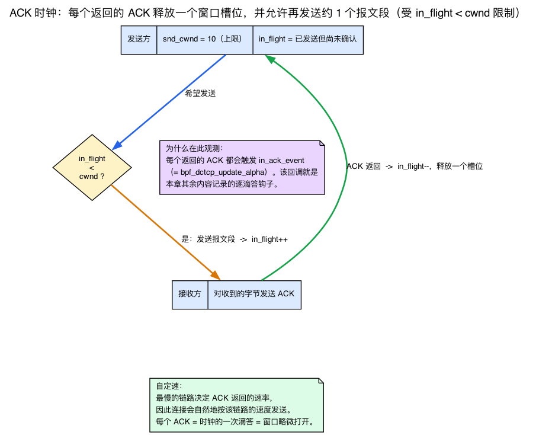
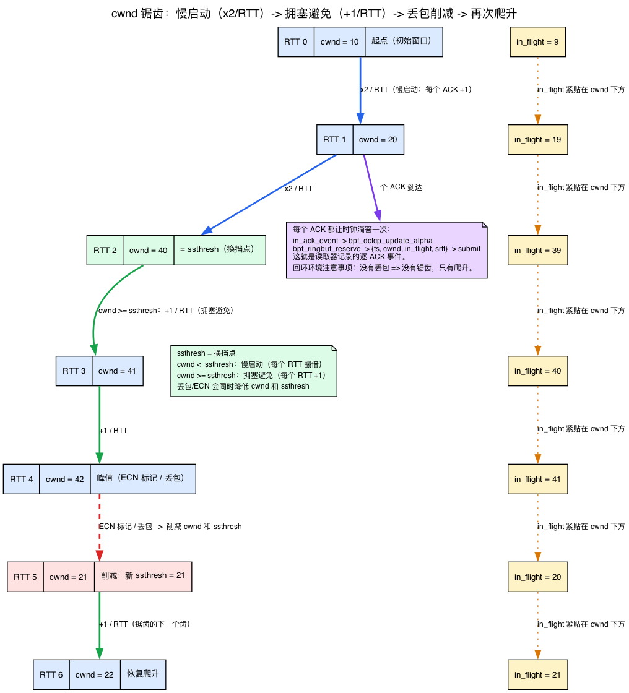
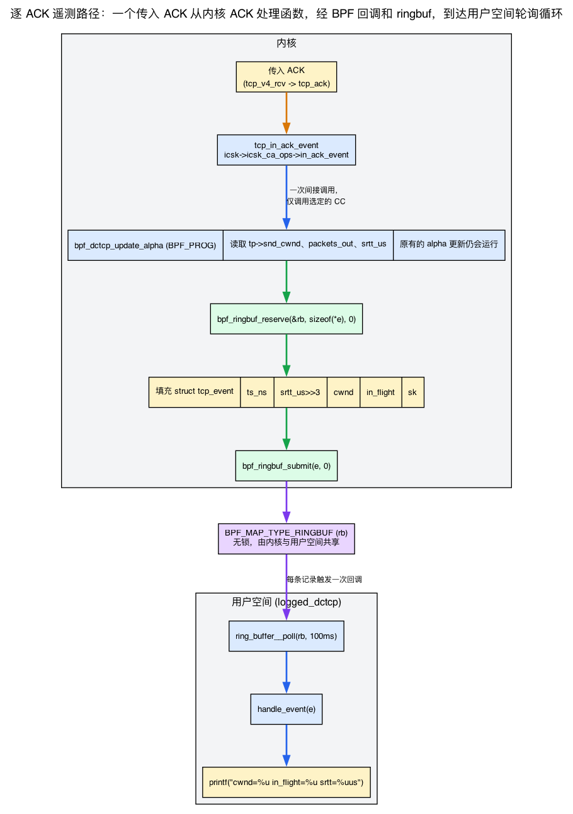

# 第23天 — 改造 BPF DCTCP 并添加观测能力

> **今日任务：** 继续改造昨天的 BPF DCTCP。先弄清 TCP 拥塞控制究竟*做了什么*，从而理解各项指标的含义；然后针对每个 ACK 向 ringbuf 写入遥测事件，运行一次真实的 `iperf3`，实时观察 TCP 的内部状态。总耗时：约 110 分钟。

## 为什么要做这个练习

昨天加载的是别人编写的 BPF DCTCP，今天则要亲自修改它并观察结果。这是最重要的 struct_ops 技能：**对正常运行的代码进行小而精准的改动**。

目标是为每个 ACK 向 ringbuf 写入一条事件，其中包含连接当前的 `cwnd`、`in_flight` 和 `srtt`。通过观察一次传输，把网络事件与 TCP 内部状态对应起来。

这种模式非常实用：在不改变策略的前提下，为现有 struct_ops 模块增加观测能力。你可以用它调试行为异常的 CC 算法，研究陌生算法的运行方式，或者把实时 TCP 状态送入自己的监控系统。

不过，要真正从本章有所收获，必须能*读懂*即将记录的四项指标——`cwnd`、`in_flight`、`srtt` 和 `ssthresh`——并理解它们各自表示什么。第22天已经介绍 `cwnd` 与 `ssthresh`，也让你在 `ss -ti` 中观察过 `cwnd:10`。今天将补充另外两项：表示链路*当前*有多少数据在途的 `in_flight`，以及平滑 RTT `srtt`；还会介绍串联这四项指标的框架——**ACK 时钟**。这里不会重新推导 `cwnd`/`ssthresh`，只会各用一句话回顾并关联到第22天。跳过本节，遥测数据只是一串噪声；理解本节后，ringbuf 才会成为观察 TCP 心跳的窗口。

## TCP 的反馈节奏：ACK 时钟

设想发送方要传输一个 1 GB 的文件，却不知道网络容量。如果一次性把全部 1 GB 数据灌入线路，就可能塞满某台路由器的队列并引发丢包，最终使所有流的吞吐量下降。因此，TCP 采用相反的做法：先发送*少量*数据，确认这些数据已经送达后，再继续发送。所谓“确认已经送达”就是 **ACK**——接收方对收到的字节作出确认。

这个反馈回路就是 **ACK 时钟**。每收到一个 ACK，发送方大致就获得了再发送一个报文段的许可。连接会自动把发送节奏调整到最慢链路的速度，因为那条链路决定了 ACK 返回的快慢。TCP 拥塞控制的核心，就是围绕一个问题进行记账：*允许有多少数据处于未确认状态，以及 ACK 到来时应当如何调整这个数量？*

这套记账恰好就是四个数字。



### `cwnd` — 拥塞窗口（速度上限）

*回顾第22天：* `snd_cwnd` 限制任一时刻最多可以有多少个尚未确认、也就是仍在*在途*的报文段。它以**数据包**（MSS 大小的报文段）而非字节为单位。新连接从内核设定的 10 个报文段初始窗口开始（即 `ss -ti` 中的 `cwnd:10`），随着路径证明自己能承载更多数据而逐步增长。今天只需再补充一点：`cwnd` 是发送上限，`in_flight` 通常紧贴其下。

```c
/* include/linux/tcp.h:225 */
u32	snd_cwnd;	/* Sending congestion window		*/
```

### `in_flight` — 当前有多少数据在途

`in_flight` 是**已发送但尚未被 ACK** 的报文段数量。ACK 时钟的根本规则是：

> 发送方只有在 `in_flight < cwnd` 时才可以继续发送。

发送一个报文段时，`in_flight` 增加；确认该报文段的 ACK 到达时，`in_flight` 减少，窗口中便空出一个槽位。这正是 *`in_ack_event` 天然适合作为观测钩子*的原因。每个传入的 ACK 都会触发该回调，对应 ACK 时钟的一次滴答，也就是窗口再次释放少量空间的时刻。观察 ringbuf，实际上就是在观察这个时钟运行。

内核并不把 `in_flight` 存成一个字段；它是从 `packets_out` 计算出来的（我们会在下面看到确切公式）：

```c
/* include/linux/tcp.h:308 */
u32	packets_out;	/* Packets which are "in flight"	*/
```

### `ssthresh` — 两种增长模式之间的换挡点

*回顾第22天：* `snd_ssthresh`（*慢启动阈值*）是 TCP 两种增长阶段的分界线。低于阈值时处于慢启动，`cwnd` 近似指数增长，每个 RTT 翻倍；达到或超过阈值后进入拥塞避免，`cwnd` 近似线性增长，每个 RTT 约增加 1。第22天已经推导过这两个阶段，而内核只需一次比较即可作出判断：

```c
/* include/linux/tcp.h:248 */
u32	snd_ssthresh;	/* Slow start size threshold		*/
```

```c
/* include/net/tcp.h:1520 */
static inline bool tcp_in_slow_start(const struct tcp_sock *tp)
{
	return tcp_snd_cwnd(tp) < tp->snd_ssthresh;
}
```

今天新增的是**阶段切换与回退**这一层理解：拥塞信号到来时，DCTCP 的 `bpf_dctcp_ssthresh` 回调会计算*新的* `ssthresh`。它决定窗口回退后以哪一点作为增长阶段的分界，从而形成下面的锯齿曲线。

### 丢包：锯齿式塌陷

拥塞（一次丢包，对 DCTCP 而言是一个 ECN 信号）发生时会怎样？TCP **削减 `cwnd`**，并把 `ssthresh` 设为削减后的值。经典的 Reno 会把它减半；这就是著名的**锯齿**：缓慢的线性爬升、突然的减半、再爬升、再减半。这种塌陷正是今天末尾异常检测用例的全部基础——*`in_flight`/`cwnd` 的骤降与 RTT 尖峰相关联，就是一次丢包事件。*（这也是为什么后面的 loopback 注意事项很重要：在 `127.0.0.1` 上没有丢包，所以你只会看到单调爬升，永远看不到锯齿的齿。）



### `srtt` — 平滑后的往返时间

最后一项指标与时间有关。`srtt_us` 是**平滑 RTT**，即对测得的往返时间样本计算指数加权移动平均（EWMA）。TCP 用它设置重传超时：如果经过约 `srtt` 再加一定余量后仍未收到响应，就认为报文段可能已经丢失。单个异常样本不应让超时值剧烈波动，因此 TCP 会对采样结果进行平滑。

```c
/* include/linux/tcp.h:307 */
u32	srtt_us;	/* smoothed round trip time << 3 in usecs */
```

注意那个 `<< 3`：该字段以**八分之一微秒**为单位存储。内核多保留三个低位精度，好让 EWMA 无需浮点就能跟踪亚微秒级的变化。要读出微秒，就把它右移 3 位——这正是你会在第 2 步写下的 `>> 3`，也是你稍后若忘了它就会故意引入的 bug。

### 把它们串起来

一个 ACK 到达后，`tcp_in_ack_event` 会调用你的 `in_ack_event` 回调。此时 `cwnd` 可能刚刚增长，`in_flight` 已按确认量减少，`srtt` 也已根据新的 RTT 样本更新。四项指标中有三项会随*每个* ACK 变化，只有 `ssthresh` 仅在阶段切换或窗口回退时改变。按 ACK 逐次记录这些值，就是在记录连接的脉搏。

> **DCTCP 在其中扮演什么角色。** 普通 Reno 只对*丢包*作出反应。DCTCP（Data Center TCP，数据中心 TCP）则更早、更平缓地响应 **ECN 标记**：路由器会在队列溢出*之前*设置 Congestion Experienced 位。DCTCP 统计近期已确认数据包中带 ECN 标记的比例，据此调整窗口削减幅度，并用名为 `alpha` 的 EWMA 跟踪该比例。已标记数据包的计数器是 `delivered_ce`：
>
> ```c
> /* include/linux/tcp.h:310-311 */
> u32	delivered;	/* Total data packets delivered incl. rexmits */
> u32	delivered_ce;	/* Like the above but only ECE marked packets */
> ```
>
> 你即将编辑的那个函数——`bpf_dctcp_update_alpha`——正是消费 `delivered_ce` 来更新 `alpha` 的那个。你要在它*最顶部*插入遥测，而把那段 alpha 数学保持原样不动。

## `bpf_dctcp.c` 里已经有什么

打开 `tools/testing/selftests/bpf/progs/bpf_dctcp.c`。花一分钟浏览一下。DCTCP 重写的关键回调有：

- **`init`**（`bpf_dctcp_init`）——建立每个套接字的 DCTCP 状态（`alpha`、EWMA 参数）。
- **`ssthresh`**（`bpf_dctcp_ssthresh`）——慢启动阈值计算（使用 ECN 比例）。这就是上面模型里的“换挡 / 回退”回调。
- **`in_ack_event`**（`bpf_dctcp_update_alpha`）——每个 ACK 触发一次；根据 `delivered_ce` 更新 ECN/alpha 的 EWMA。*我们将在这里添加遥测。*
- **`cwnd_event`**（`bpf_dctcp_cwnd_event`）——处理拥塞窗口事件。
- **`cong_avoid` / `undo_cwnd` / `set_state`**——Reno 风格的 cwnd 增长、丢包恢复，以及 CA 状态转换。

（注意：DCTCP **不**实现 `pkts_acked`。它的每 ACK 记账完全存在于 `in_ack_event` / `bpf_dctcp_update_alpha` 中。）

完整的 vtable 在靠近底部的 `SEC(".struct_ops") struct tcp_congestion_ops dctcp = { ... }` 里。

`in_ack_event` 回调正合我们的用途：它在每个到来的 ACK 上触发，这大致相当于每被确认一个外发数据报文段一次——ACK 时钟的一次滴答。它的参数是 `struct sock *sk` 加上一个 flags 位图。

## 添加观测能力

### 第 1 步：声明一个 ringbuf

本仓库中的实验位于 `ebpf/labs/day23/`，其代码**派生自**内核的 `bpf_dctcp.c`（来源见各文件头部的 SPDX 和出处注释）。它保留真正的 DCTCP 算法，移除仅用于 selftest 的故障注入框架，并加入下面的遥测逻辑。共享记录单独放在头文件 `ebpf/labs/day23/logged_dctcp.h` 中，避免 BPF 生产者与用户空间消费者使用的结构发生偏差：

```c
{{#include ../labs/day23/logged_dctcp.h}}
```

环形缓冲区声明在派生文件 `ebpf/labs/day23/logged_dctcp.bpf.c` 的开头附近：

```c
{{#include ../labs/day23/logged_dctcp.bpf.c:ringbuf}}
```

### 第 2 步：在不替换策略的前提下添加遥测

**不要**把 `.in_ack_event` 替换成只记录日志的回调，因为 DCTCP 依赖该回调更新 alpha。正确做法是在现有 `bpf_dctcp_update_alpha` 函数（绑定到 `.in_ack_event` 槽位的 BPF 程序）开头加入遥测逻辑，并保持后面的原始代码不变。实验源码正是这样组织的：先发送遥测事件，再执行未经修改的 DCTCP alpha 更新：

```c
{{#include ../labs/day23/logged_dctcp.bpf.c:telemetry}}
```

每个字段都对应前面的模型：`srtt_us >> 3` 是以微秒为单位的平滑 RTT，`snd_cwnd` 是以报文段为单位的当前发送上限，`in_flight` 表达式则表示*此刻*有多少数据在途。观察这些值不断输出，也就是在观察 ACK 时钟逐次触发。

如果更喜欢使用包装函数，可以把原函数体改成一个辅助函数，再在包装函数发送事件后调用它。无论采用哪种方式，原有的 alpha 更新逻辑都必须继续执行。

> **为什么不用 `bpf_get_socket_cookie(sk)`？** 它对 `tcp_congestion_ops` 程序**不可用**。这类程序的辅助函数集合是 `bpf_tcp_ca_get_func_proto()`（`net/ipv4/bpf_tcp_ca.c`）所暴露的那些——`tcp_send_ack`、`bpf_sk_storage_get`/`_delete`、`bpf_{set,get}sockopt`、`ktime_get_coarse_ns`——外加基础辅助函数；`get_socket_cookie` 只提供给 skb/sock_ops/sock_addr 程序类型。验证器会在加载时拒绝它（`program of this type cannot use helper bpf_get_socket_cookie`），于是程序根本挂载不上。我们改为把可信的 `struct sock *sk` 强制转换为一个标量：在 root/CAP_PERFMON 下（`allow_ptr_leaks` 处于开启状态，这是加载 struct_ops 的常态），可信的 `PTR_TO_BTF_ID` 能干净地完成转换，给出一个在连接的整个生命周期内稳定的每流 id。此时 `sk_cookie` 打印的是内核套接字地址，而不是一个 SO_COOKIE id。如果你需要一个真正的 SO_COOKIE 式身份，就把它藏在一个 `BPF_MAP_TYPE_SK_STORAGE` 里，通过 `bpf_sk_storage_get(&map, sk, &init, BPF_SK_STORAGE_GET_F_CREATE)` 来做——那个辅助函数*确实*在 tcp_ca 集合里。

#### 补充说明：`BPF_MAP_TYPE_SK_STORAGE` 是什么

上一段提到了一种新的映射类型，有必要简要说明，因为它才是创建每流状态的*正确*方式。**套接字本地存储**会把私有值附着到单个套接字上，该值与*套接字*具有相同的生命周期。若使用以 `sk` 指针为键的哈希表，不仅必须记得删除条目，新套接字复用同一地址时还可能遇到陈旧键；SK_STORAGE 则会在套接字释放时由内核自动回收，**不会产生陈旧键问题。** 只需调用一个辅助函数，就能一次完成每流状态的获取或创建：

```c
struct flow_id *fid = bpf_sk_storage_get(&sk_ids, sk, &init,
                                         BPF_SK_STORAGE_GET_F_CREATE);
```

指定 `BPF_SK_STORAGE_GET_F_CREATE` 后，首次访问时会分配并初始化数据块，后续调用则始终返回同一数据块。这是典型的*获取或创建每流状态*用法，也是内核认可的裸 `sk` 指针强制转换替代方案。（上一条注释末尾已经指出，该辅助函数位于 `tcp_ca` 白名单中。）今天不会构建完整的 SK_STORAGE 实验；当前场景使用裸指针转换已经足够，但当需求超出这种做法时，你已经知道应当选用什么工具。

### 第 3 步：保留回调槽位，只改算法名

找到 `SEC(".struct_ops") struct tcp_congestion_ops dctcp = { ... }` 代码块。让 `.in_ack_event` 槽位继续指向 DCTCP 实现，只修改名称以免与原始算法冲突。实验中组装完成的 vtable 包含全部必需和可选槽位，名称为 `bpf_dctcp_log`：

```c
{{#include ../labs/day23/logged_dctcp.bpf.c:vtable}}
```

> **名字长度很重要。** 拥塞控制算法名被限制在 `TCP_CA_NAME_MAX - 1` = **15 个可用字符**，因为该结构体字段是 `char name[16]`，需要给结尾的 NUL 留位置。由于我们把这个 CC 作为 BPF **struct_ops** 模块来加载，一个 16 字符的名字会在*加载*时失败，而不是在选择时。当内核初始化 `name` 成员时，`bpf_tcp_ca_init_member()`（`net/ipv4/bpf_tcp_ca.c:228`）会调用 `bpf_obj_name_cpy(tcp_ca->name, ..., sizeof(name)=16)`。那个辅助函数（`kernel/bpf/syscall.c:1208`）会一直复制，直到在 16 字节窗口内遇到一个 NUL；若有 16 个非 NUL 字符则没有空间放终止符，`src` 到达 `end`，于是它返回 `-EINVAL`。`init_member` 把这个负返回值向上传播，`__bpf_struct_ops_map_update_elem`（`kernel/bpf/bpf_struct_ops.c:763`）执行 `goto reset_unlock`——于是整个 struct_ops map 更新**以 EINVAL 失败**。因此像 `bpf_dctcp_logged` 这样的 16 字符名字根本不会注册：它永远不会出现在 `tcp_available_congestion_control` 里，所以既没有“注册成功”，没有后续的截断查找，也没有选择时的 `ENOENT`。（那种截断后选择再 `ENOENT` 的情形只是*传统内核模块*注册路径的行为方式，而那不是本章所做的。）把名字控制在 15 字符或更短：`bpf_dctcp_log` 是 13 个字符，安全。

> **两条字段访问注记。**（1）我们直接读 `tp->snd_cwnd`，这在 BPF 里可行（真正的 `bpf_dctcp.c` 也这么做）。不过，内核 C 的惯例是用 `tcp_snd_cwnd(tp)` 访问器（`include/net/tcp.h`）——当 C 源码用这个辅助函数而不是裸字段时，别感到意外。（2）完整的内核公式是 `tcp_packets_in_flight(tp) = packets_out - (sacked_out + lost_out) + retrans_out`；我们在上面包含了 `retrans_out`。省略它（作为一种简化）会在丢包恢复期间低估在途字节数。

## 用户空间消费程序

`logged_dctcp` 是一个**全新的树外 libbpf 程序**，并非在 `selftests/bpf` 中执行 `make` 所生成的产物；后者构建的是 `test_progs`。本仓库将它完整保存在 `ebpf/labs/day23/logged_dctcp.c`，并通过实验的 `Makefile` 构建。它相当于在第3天的 ringbuf 加载器基础上增加了 struct_ops 挂载。

其加载是一次 struct_ops 挂载（区别于普通的程序挂载），然后是一个标准的 ringbuf 轮询循环：



完整的加载器——用 `bpf_map__attach_struct_ops` 注册这个 CC、ring-buffer 轮询循环，以及一条在释放消费者和 skeleton 之前销毁 link（分离并注销该 CC）的 SIGINT/SIGTERM 路径：

```c
{{#include ../labs/day23/logged_dctcp.c:book}}
```

`handle_event` 每个事件打印一行，先校验记录大小：

```
[sk=18446612345678900 t=12345...] cwnd=10 in_flight=0 srtt=24us
```

使用实验的 `Makefile` 构建后，`make` 会生成“运行”一节所需的 `logged_dctcp` 二进制文件。

## 运行

手动加载 struct_ops CC、将它加入*允许*列表、运行 `iperf3`，再完整恢复所有状态，步骤相当繁琐；如果运行中途退出，还会留下已注册的算法和被修改的 sysctl。仓库提供了安全的运行脚本 `ebpf/labs/day23/run.sh`，它会**跟踪所有运行时状态，并在任何退出情形下（成功、出错或 Ctrl-C）完成恢复**：保存并恢复 `tcp_allowed_congestion_control`，启动加载器后向其发送 SIGTERM（从而销毁 struct_ops link 并注销 `bpf_dctcp_log`），创建并拆除 `netns` + `veth` + `netem` 路径，还会按 PID 管理 `iperf3` 服务端和客户端。与 `scripts/smoke.sh` 一样，必须显式选择启用：

```bash
make -C ebpf/labs day23          # build the loader first (see the Lab environment page)

# veth+netem path (default) — the lossy path that makes the sawtooth visible:
EBPF_LABS_ALLOW_PRIVILEGED=1 \
  sudo --preserve-env=EBPF_LABS_ALLOW_PRIVILEGED ebpf/labs/day23/run.sh veth

# or the always-available loopback path (monotonic climb only):
EBPF_LABS_ALLOW_PRIVILEGED=1 \
  sudo --preserve-env=EBPF_LABS_ALLOW_PRIVILEGED ebpf/labs/day23/run.sh loopback
```

加载器向它的 stdout 每个 ACK 打印一行（`sk=` 值是内核套接字地址——一个在连接整个生命周期内稳定的每流 id，而不是一个 SO_COOKIE id）：

```
[sk=18446612345678900 t=12345...] cwnd=10 in_flight=0  srtt=24us
[sk=18446612345678900 t=12346...] cwnd=11 in_flight=10 srtt=31us
[sk=18446612345678900 t=12348...] cwnd=14 in_flight=12 srtt=29us
...
```

此时，你正在逐个 ACK、实时观察 TCP 内部的 CC 决策，而且这条流使用的是由你自定义、以 BPF 实现的算法。可以结合前面的模型理解输出：`cwnd` 从内核初始窗口 10 开始**增长**；由于每个 ACK 使它增加约 1，呈现的正是慢启动阶段的指数上升。新的 RTT 样本到来时，`srtt` 会随每个 ACK 更新。`in_flight` 表示当前在途数据量，通常紧贴 `cwnd` 下方，也就是锯齿图中的 in_flight 曲线。在 `loopback` 上*看不到*的是锯齿的下降沿，下一段会解释原因。

> **Loopback 注意事项。** `127.0.0.1` 上不会丢包，RTT 也只有微秒量级，因此你只能看到 `cwnd` 单调增长，**看不到**下面异常检测场景所依赖的丢包驱动型 `cwnd` 骤降和 RTT 尖峰。运行脚本默认采用 `veth` 模式正是出于这个原因：它把对端放入独立的 netns，并在两个方向上都应用 `netem delay 20ms loss 1%`。注入 1% 丢包后，可以看到 `cwnd` 遇到丢包时下降，随后再次增长，真正形成锯齿。主机无法创建 netns 时，可以退而使用 `run.sh loopback`。

运行器自己处理清理——退出时它注销 `bpf_dctcp_log`、恢复它在启动时捕获的那个精确的 `tcp_allowed_congestion_control` 值，并删除它创建的 netns/veth。它的完整文本（在运行任何特权操作之前先读它）：

<details>
<summary><code>ebpf/labs/day23/run.sh</code></summary>

```bash
{{#include ../labs/day23/run.sh}}
```

</details>

## 这些数据有什么用途

几件你以前做不到的事：

- **每流性能图：** 把数据导出到 TSDB，按 `sk_cookie` 绘制 cwnd 随时间变化的曲线。
- **异常检测：** 当 `in_flight` 塌陷（丢包事件）并与 RTT 尖峰相关联时告警——那就是锯齿的齿，在一条真实的有损路径上你可以现场捕获它。
- **验证 CC 行为：** 看看你的调优是否真的在改变 TCP 的反应。
- **容量规划：** 理解你真实负载的 cwnd 分布，而不是合成的基准测试。

## 常见疑问

**问：为什么把 `sk` 指针转换为标量，而不是用套接字 cookie？**

答：`bpf_get_socket_cookie` 不在 `tcp_ca` 辅助函数集合中，因此验证器会在加载时拒绝它（见“添加观测能力”一节）。把可信的 `struct sock *sk` 转换为 `u64`，无需额外开销就能获得一个在连接生命周期内保持稳定的每流 id。这个值就是内核套接字地址，只要套接字仍然存活就不会改变。如果需要在地址复用后仍能区分连接的*真正* SO_COOKIE 式身份，应改用 `BPF_MAP_TYPE_SK_STORAGE` 创建（相应辅助函数*确实*允许使用）。

**问：为什么观测 `in_ack_event` 而不是 `pkts_acked`？**

答：DCTCP 根本不实现 `pkts_acked`——它的每 ACK 记账完全存在于 `in_ack_event` / `bpf_dctcp_update_alpha` 中。挂上算法实际运行的那个回调，意味着我们的遥测正好搭在那条已经每个 ACK 都会触发的代码路径上，无需额外接线一个槽位。（你*可以*把 `pkts_acked` 回调作为一个全新的槽位加进来——那就是下面的“再加一个回调”练习——但要记录这四个数字，`in_ack_event` 才是数据已经在流经的地方。）

**问：向 ringbuf 发送事件会改变 CC 算法的行为吗？**

答：不会。程序只*读取*字段并提交一份副本，原有的 alpha 更新计算仍在遥测代码之后原封不动地执行。纯观测是安全的；真正需要谨慎的是在回调中*修改* TCP 状态（见检查问题）。

## 试着破坏它

### 错误的字段语义

```c
e->srtt_us = tp->srtt_us;  /* without >> 3 */
```

`tp->srtt_us` 以八分之一微秒存储（无需浮点即可获得亚微秒精度——就是模型一节里的那个 `<< 3`）。直接读它会得到大 8 倍的值。症状：延迟报告看起来像 RTT 有几百毫秒，而实际上只有几十微秒。教训：**内核字段的语义很重要**——在假设之前先读该字段的文档串（或 `include/linux/tcp.h`）。

### 忘记释放

```c
struct tcp_event *e = bpf_ringbuf_reserve(&rb, sizeof(*e), 0);
if (!e) return;
e->ts_ns = ...;
/* forgot bpf_ringbuf_submit */
return;
```

验证器拒绝：`Unreleased reference id=N alloc_insn=M`。ringbuf-reserve 的返回值是一个引用计数的资源，就跟 kfunc acquire 一模一样。规则相同：每条路径都必须 submit 或 discard。

### 用高并发跑

运行 `100` 条并行 iperf3 流，通过 percpu 丢弃计数器（第13天的模式）观察 ringbuf 丢弃情况。事件速率达到约 100K 次/秒时，就会开始丢弃。可以采用以下办法：

- 过滤（只在 cwnd 变化超过 N 时才发出）。
- 把 ringbuf 加大。
- 在一个 map 里按 sk 聚合；周期性地发出摘要。

### 再加一个回调

DCTCP 本身不用 `pkts_acked`，但 `tcp_congestion_ops` 有这个槽位——所以你可以把它作为一个*新*回调加进你的模块，来捕获每 ACK 的数据包/ECN 记账：

```c
SEC("struct_ops/dctcp_pkts_acked_logged")
void BPF_PROG(my_pkts_acked, struct sock *sk, const struct ack_sample *sample)
{
    /* emit packet count, RTT sample, etc. */
}
```

把 `.pkts_acked = (void *)my_pkts_acked` 加到 vtable 里。现在你在同一个 struct_ops 模块里有了两个 BPF 程序，两者都被喂以实时数据。（这是你在填充的一个*新*槽位，不是你在重写的一个 DCTCP 回调——上游 DCTCP 把 `pkts_acked` 留为 NULL。）

## 在内核里读什么

- **`net/ipv4/tcp_input.c`**——搜索 `in_ack_event`。那是每个到来的 ACK 都会调用你的 BPF 回调的 C 调用点。从 `tcp_v4_rcv` 一路追到 `in_ack_event` 的调用处。注意内核只调用*该套接字所选*的那个 CC 的回调——一次通过 `icsk->icsk_ca_ops->in_ack_event` 的间接调用——所以你的回调只对实际使用你算法的连接运行，而不是对每一个已注册的 CC。

- **`include/uapi/linux/tcp.h`**——`struct tcp_info`。从 BTF `struct tcp_sock` 指针读取的那些每连接字段，也会在这里通过 `getsockopt(TCP_INFO)` 暴露给用户空间。想知道“还可以暴露哪些状态”时，可以把它当作目录。（注意，`bpf_get_socket_cookie` 返回的是 SO_COOKIE `u64` 而非 `tcp_info`，并且不能在此处使用；见“添加观测能力”一节。）

- **`include/linux/tcp.h`**——内核内部的 `struct tcp_sock`。约 170 个字段。读一遍。它们的关系是：`struct tcp_info`（UAPI）是 `struct tcp_sock`（内部）的一个精选子集；BPF 程序通过把 `struct sock *sk → struct tcp_sock * = (void *)sk` 强制转换即可读取任一者。你今天记录的四个数字位于第 225 行（`snd_cwnd`）、248 行（`snd_ssthresh`）、307 行（`srtt_us`）和 308 行（`packets_out`）。

- **`include/net/tcp.h`**——模型里的那些访问器和辅助函数：`tcp_snd_cwnd()`（`:1509`）、`tcp_in_slow_start()`（`:1520`）和 `tcp_packets_in_flight()`（`:1502`）= `packets_out - tcp_left_out(tp) + retrans_out`，其中 `tcp_left_out()`（`:1483`）= `sacked_out + lost_out`。这就是你敲下的那条 `in_flight` 公式的来处。

- **`tools/testing/selftests/bpf/progs/bpf_cubic.c`**——另一个 struct_ops 例子，完整的 Cubic 实现。拿它跟 `bpf_dctcp.c` 对比风格上的差异。

- **`net/ipv4/tcp_cong.c`**——CC 框架。`tcp_register_congestion_control`。你的 `bpf_dctcp_log` 是如何变得可被调用的。第16天（网络书）详细讲过这个。

## 要点回顾

- **ACK 时钟就是整个游戏。** TCP 自我调速：每个到来的 ACK 释放窗口空间，是再发约 1 个报文段的许可。`in_ack_event` 在每次滴答时触发，这就是它成为天然的每报文段钩子的原因。
- **四个数字讲完整个故事。** `cwnd`（snd_cwnd）是以*报文段*计的速度上限；`in_flight` 是有多少个在途（`cwnd` 给它封顶）；`ssthresh` 是换挡点——在它以下慢启动每个 RTT 让 `cwnd` 翻倍，在它处或以上拥塞避免每个 RTT 加约 1；`srtt_us`（存储时 `<< 3`，八分之一微秒）是用于超时的平滑 RTT。丢包/ECN 削减 `cwnd` 和 `ssthresh`——就是锯齿。
- struct_ops 模块由普通 BPF 程序组成，可以编辑、添加观测逻辑并进行测试。
- **给一个回调加一个 ringbuf**，就能在不修改内核的情况下获得每事件的遥测。
- 验证器仍然适用；标准的 ringbuf reserve/submit 和引用规则依旧生效。
- **`BPF_MAP_TYPE_SK_STORAGE`**（`bpf_sk_storage_get(..., BPF_SK_STORAGE_GET_F_CREATE)`）是内核认可的每套接字存储——随套接字自动回收，且在 `tcp_ca` 白名单里——当你需要一个真正的每流 id 时用它。
- 这个模式对**任何 struct_ops vtable** 都有效：TCP CC、sched_ext，以及未来的那些。
- 对于高速率的可观测性，BPF 里的丢弃计数器和速率限制过滤器不可或缺。

## 检查问题

你给一个每 ACK 都以线速触发的 struct_ops 回调加了 `bpf_ringbuf_reserve`。对 TCP 性能最坏情况下的影响是什么？

<details>
<summary>点击展开答案</summary>

**答案：** 每次回调增加约 50–100 ns。在 1 Mpps（一条快速链路上的高速率流）下，那就是仅仅为 BPF reserve+submit 成本多花 5–10% 的 CPU。如果 ringbuf 被填满（消费者跟不上），`bpf_ringbuf_reserve` 返回 NULL，你的代码就完全跳过这次发出；**TCP 本身不受影响**——原始的 CC 逻辑照常运行。

更大的风险是你的 BPF 逻辑以某种方式*阻塞*了。它不能——不可睡眠的 struct_ops 不能睡眠、不能取普通互斥锁、也不能做任何会引发调度的事。它也不能以算法没料到的方式*修改 TCP 状态*（你能做到——要小心）。纯观测（读字段、发到 ringbuf）在你能容忍的开销范围内都是安全的；**修改则需要显式的小心**，因为你此时已经在改变 CC 算法所做的事，而不只是观察它。

对于 99% 的遥测用例，最坏情况是：（a）负载下有些事件被丢弃（用丢弃计数器来处理）；（b）热连接上多花约 5% 的 CPU。两者都可管理。

</details>

---

## 明天

第24天：BTF 探幽。在你的内核上找一个你从没用过的 kfunc，读它的签名，写一个程序调用它。
