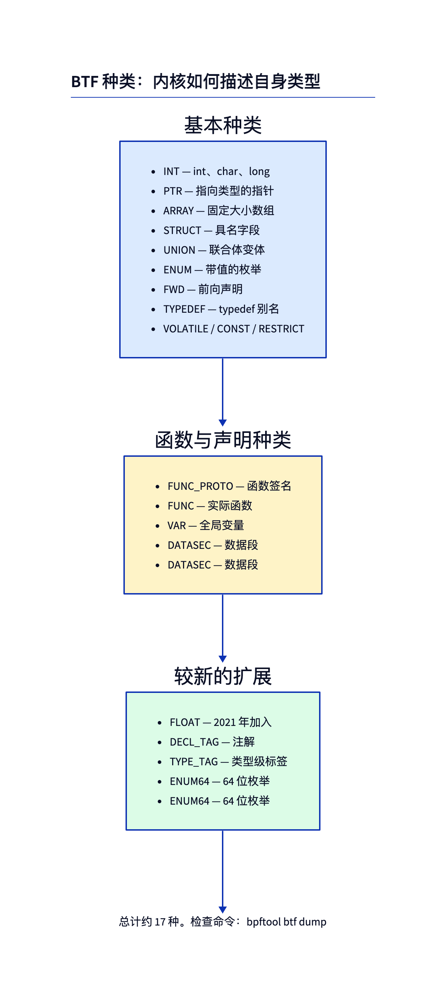
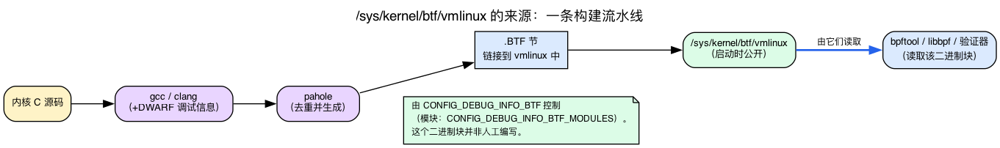
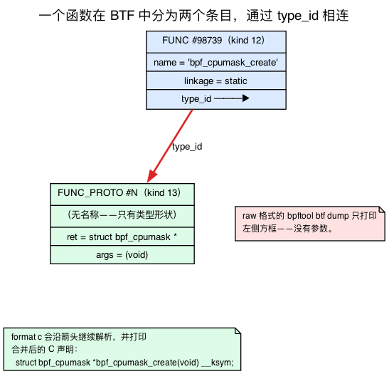
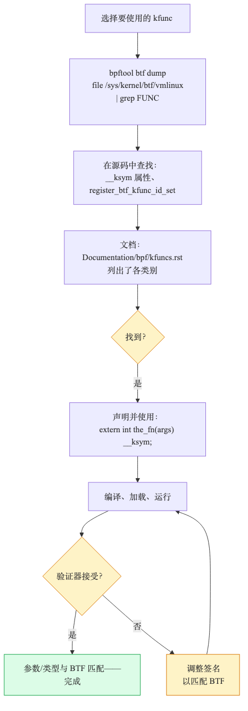
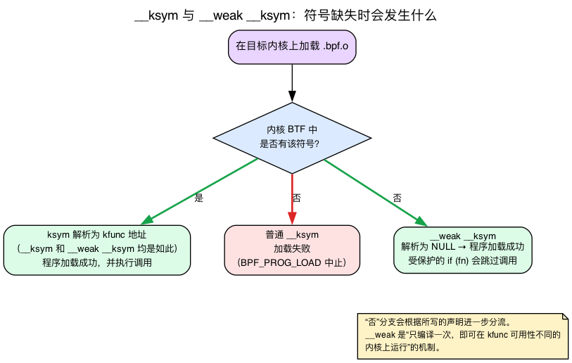

# 第24天 — BTF 探秘：发现并使用陌生的 kfunc

> **今日任务：** 在当前内核中找到一个从未使用过的 kfunc，从 BTF 读取其签名，再编写一个调用它的程序。在这个过程中，你将了解 BTF *如何*表示函数（答案出人意料：分成两个表项）、vmlinux BTF 数据究竟*如何生成*，以及*如何*让程序在目标内核缺少所需 kfunc 时优雅降级。总用时：约 95 分钟。本章也是第 4 阶段的最后一章。

## 为什么发现能力很重要

内核中有**数百个** kfunc。`Documentation/bpf/kfuncs.rst` 只记录了其中一部分，而且文档更新往往落后于内核。真正的权威来源是**当前运行内核提供的 BTF**。

今天要学习的是如何查阅这份权威数据。为此，必须先弄清此前只略微提到的两件事。第一，*BTF 数据从何而来*，从而理解为什么它可以作为事实依据。第二，*BTF 如何表示函数*；正是这种表示方式，决定了为什么今天要使用 `bpftool btf dump ... format c`。

## BTF 如何描述内核

你此前已经接触过 BTF。**回顾第3–4天：** BTF 是一张紧凑且经过去重的表，包含内核对外暴露的所有类型和部分选定函数。当前运行内核的 BTF 位于 **`/sys/kernel/btf/vmlinux`**，是一个约 5–10 MB 的二进制数据块；可加载模块的 BTF 则位于 **`/sys/kernel/btf/<module>`**。libbpf 读取这些数据以支持 CO-RE。第4天还列举了约 19 种 BTF *kind*（INT、PTR、STRUCT、FUNC、FUNC_PROTO……）：表中每个条目都是 `struct btf_type`，其 `info` 字段编码了条目所属的 kind。BPF 程序按**名称**引用这张表中的内核符号，libbpf 与验证器则在加载时把名称解析为具体的 BTF 条目。



今天最关键的是其中两种 kind：**FUNC** 和 **FUNC_PROTO**。两者之间的关系贯穿本章，稍后会详细说明。先回答第3–4天留下的问题：`vmlinux` 中的 BTF 数据究竟如何产生？

### vmlinux BTF 如何生成：pahole + DWARF

`/sys/kernel/btf/vmlinux` 并非人工编写，而是内核的构建产物。启用 **`CONFIG_DEBUG_INFO_BTF`** 编译内核时，构建系统先生成常规的 **DWARF** 调试信息，再让 **`pahole`** 处理这些 DWARF 数据，生成紧凑且经过去重的 `.BTF` 节。该节随后链接进 `vmlinux`，并在系统启动后通过 `/sys/kernel/btf/vmlinux` 暴露出来。模块 BTF（`/sys/kernel/btf/<module>`）也以同样方式生成，由 **`CONFIG_DEBUG_INFO_BTF_MODULES`** 控制。

这就是 BTF 的*生成*过程；第3–4天展示的则是 libbpf/bpftool 读取数据的*使用*过程。了解生成过程的目的，是说明为什么可以把 BTF 视为事实依据。这里还有一个稍后会用到的细节：pahole 支持的特性标志**取决于版本**。在 v7.1 中，`scripts/Makefile.btf` 会在 pahole 版本足够新时启用 `--btf_features=...,decl_tag_kfuncs`，其中 `decl_tag_kfuncs` 用于标注*哪些* FUNC 条目实际上属于 kfunc。因此，新内核的 BTF 往往比旧内核包含更多 kfunc 信息；清单是否完整，取决于构建内核时使用的 pahole。

- **`scripts/Makefile.btf:3`**——`pahole-ver := $(CONFIG_PAHOLE_VERSION)`；**`:17`** 是 `--btf_features=...,decl_tag_kfuncs` 标志（由 pahole 提供，是否启用取决于版本）。
- **`lib/Kconfig.debug:398`**——`config DEBUG_INFO_BTF`（打开 vmlinux BTF 生成的开关）；**`:428`**——`config DEBUG_INFO_BTF_MODULES`（`depends on DEBUG_INFO_BTF && MODULES`）。



### BTF 用*两个*条目表示一个函数

理解下面这个事实，才能明白今天为什么需要相应工具。BTF 描述函数时，**不会**把函数名和参数放在同一条记录中，而是使用两个通过引用关联的独立 `btf_type` 条目：

- **`BTF_KIND_FUNC`** 条目（kind = 12）只保存函数**名称**、**`linkage`** 字段，以及一个指向下述条目的 **`type_id`**；
- **`BTF_KIND_FUNC_PROTO`** 条目（kind = 13）保存**返回类型**和**按顺序排列的参数类型**。FUNC_PROTO *没有名称*，只描述签名的结构。

FUNC 的 `type_id` 是连接函数名与参数的唯一纽带。具体来说，每个 BTF 条目都是 `struct btf_type`（`include/uapi/linux/btf.h:43`）。第一个字段 `name_off`（`:44`）是字符串表偏移量，`info` 字段则编码 kind，可用 `BTF_INFO_KIND(info)` 宏（`:68`）提取。对应的 kind 常量分别是 `BTF_KIND_FUNC = 12`（`:85`）和 `BTF_KIND_FUNC_PROTO = 13`（`:86`）。对于 FUNC，`type_id` 复用 `btf_type` 联合体中的 `type` 槽位，它*就是*对 FUNC_PROTO 的引用。

因此，原始 `bpftool btf dump` 输出中的函数行**不会显示参数**：

```
[98739] FUNC 'bpf_address_lookup' type_id=59431 linkage=static
```

函数名 `bpf_address_lookup` 以单引号括起；这里**没有 `name=` 标记**，所以下面的 grep 命令会匹配带引号的名称。`linkage` 为 `static`。参数并不在这一行，而是保存在条目 `#59431` 中，也就是 `type_id` 指向的独立 FUNC_PROTO。若只查看原始 dump，就必须自行找到该条目，才能读取签名。

**`linkage`** 定义在 `enum btf_func_linkage`（`include/uapi/linux/btf.h:169-172`）中：`BTF_FUNC_STATIC = 0`、`BTF_FUNC_GLOBAL = 1`、`BTF_FUNC_EXTERN = 2`。多数内核内部函数都是 `static`。BPF 程序要调用的 kfunc，则会在**程序对象自身的** BTF 中表现为 `extern` 引用：`.bpf.o` 声明“需要一个具有这种签名的外部符号”，libbpf 再在加载时根据内核 BTF 完成解析。



### `format c` 如何补足原始 dump

要从*原始* dump 读取签名，必须手动沿 `type_id` 从 FUNC 找到 FUNC_PROTO，再解析参数列表。**`bpftool btf dump ... format c` 会自动完成这一过程**：它沿 FUNC → FUNC_PROTO 引用解析每个参数和返回类型，并重建完整的 C 声明——

```c
extern struct bpf_cpumask *bpf_cpumask_create(void) __weak __ksym;
```

——这几乎可以直接粘贴进 BPF 源码。（`format c` 会为*每个* kfunc 加上 `extern ... __weak __ksym`；下文会详细解释。现在只需知道，这一行可以原样复制。如果希望 kfunc 缺失时直接加载失败，形成硬依赖，则去掉 `__weak`。）正因为存在这一步解析，`format c` 才适合读取签名，而原始 dump 不适合。（第3天对 `parent.bpf.o` 使用的是*原始* dump，目的是查看小程序自身的 BTF；今天才引入 `format c` 的声明重建功能。）下面可以并排比较两种形式：

```bash
sudo bpftool btf dump file /sys/kernel/btf/vmlinux | head -20            # raw: FUNC one-liners, no args
sudo bpftool btf dump file /sys/kernel/btf/vmlinux format c | head -30    # resolved: full C header
```

## 寻找 kfunc 的三种方法



### 1. 在内核源码中搜索 `BTF_KFUNCS_START`

每个 kfunc 家族都在一个块里声明：

```bash
cd ~/code/linux
grep -rn 'BTF_KFUNCS_START' kernel/bpf net/ drivers/ 2>/dev/null
```

你会看到约 30 多处命中。每个块看起来像这样：

```c
BTF_KFUNCS_START(generic_kfunc_set)
BTF_ID_FLAGS(func, bpf_obj_new_impl, KF_ACQUIRE | KF_RET_NULL)
BTF_ID_FLAGS(func, bpf_obj_drop_impl, KF_RELEASE)
BTF_ID_FLAGS(func, bpf_refcount_acquire_impl, KF_ACQUIRE)
BTF_ID_FLAGS(func, bpf_list_push_front_impl)
/* ... */
BTF_KFUNCS_END(generic_kfunc_set)
```

这告诉你有哪些 kfunc 存在及其标志（`KF_ACQUIRE`、`KF_RELEASE`、`KF_RCU`、`KF_TRUSTED_ARGS` 等）。内核源码是事实基准。

### 2. 转储内核 BTF 并搜索 FUNC 条目

```bash
sudo bpftool btf dump file /sys/kernel/btf/vmlinux \
    | grep "FUNC 'bpf_" | head -20
```

**原始**（非 `format c`）dump 把每个函数打印成一行，名字用单引号括起、没有参数（回顾：参数位于 `type_id=` 所指向的 FUNC_PROTO 中）：

```
[98739] FUNC 'bpf_address_lookup' type_id=59431 linkage=static
[98740] FUNC 'bpf_adj_branches' type_id=59432 linkage=static
[98744] FUNC 'bpf_arch_text_copy' type_id=59434 linkage=static
...
```

这条命令会筛出名称以 `bpf_` 开头的所有 `FUNC` BTF kind；在当前内核上大约有 1700 个。其中既有 kfunc，也有辅助函数，还有因其他原因暴露的内核内部函数。要进一步限定为*真正的* kfunc，需要与源码中的 `BTF_KFUNCS_START` 块交叉核对；如果内核使用支持 `decl_tag_kfuncs` 的 pahole 构建，也可以通过 kfunc FUNC 携带的 decl-tag 识别。（如果偏好 JSON，可用 `bpftool btf dump -j ... | grep '"name":"bpf_'` 匹配 `name` 键；注意紧凑 JSON 的冒号后没有空格。）

### 3. 文档

`Documentation/bpf/kfuncs.rst` 按 cpumask、dynptr、lists、refcount、task 等类别介绍 kfunc。可以先从文档获取名称，再到 BTF 查询最新签名。这份文档适合作为导览，但不能视为完整清单。

## 从 BTF 中读取 kfunc 签名

获得函数名后（例如 `bpf_cpumask_create`），即可用 `format c` 查询签名；它会自动解析 FUNC → FUNC_PROTO 引用：

```bash
sudo bpftool btf dump file /sys/kernel/btf/vmlinux format c \
    | grep -B2 -A5 'bpf_cpumask_create'
```

输出：

```c
extern struct bpf_cpumask *bpf_cpumask_create(void) __weak __ksym;
```

这就是你会写进 BPF 源码的内容（如果你想要硬依赖就去掉 `__weak`——见下文）。

对于更复杂的签名（多个参数、结构体返回值），使用同样的 `format c` 方法：

```bash
sudo bpftool btf dump file /sys/kernel/btf/vmlinux format c \
    | grep 'bpf_dynptr_from_skb('
```

```c
extern int bpf_dynptr_from_skb(struct __sk_buff *s, u64 flags, struct bpf_dynptr *ptr__uninit) __weak __ksym;
```

不要尝试从*原始* dump 直接读取这些参数，因为 `FUNC` 行旁边并没有参数块。要核对权威签名，可以查看 `net/core/filter.c` 中的 `__bpf_kfunc int bpf_dynptr_from_skb(...)` 定义（`net/core/filter.c:12176`）；它与上面的 `format c` 输出逐个参数一致。

### `__weak __ksym`：kfunc 可能不在那里

可以看到，`format c` 打印的*所有*声明——包括 `bpf_cpumask_create`、`bpf_dynptr_from_skb` 等——都以 `__weak __ksym` 结尾，而不只是 `__ksym`。这并非各 kfunc 自行决定的属性；bpftool 默认把**所有** kfunc 声明为弱符号。前面提到的 pahole 特性 `decl_tag_kfuncs` 会标记哪些 FUNC 条目属于 kfunc，因此 bpftool 能统一输出较安全的弱引用形式。这种修饰是工具默认行为，不是某个 kfunc 独有的性质。下面将解释 `__weak __ksym` 的实际含义，以及何时应去掉 `__weak`、改用硬依赖 `__ksym`。

**回顾第20天：** 普通的 `__ksym` 是一个**硬依赖**。这个宏展开为 `__attribute__((section(".ksyms")))`（`tools/lib/bpf/bpf_helpers.h:192`）；它告诉 libbpf“把这个名字针对正在运行的内核的 BTF 解析”。如果名字解析不了，libbpf 就中止整个 `BPF_PROG_LOAD`。没有静默的落空——加载失败。

**`__weak __ksym` 把它降级为软依赖。** `__weak` 只是工具链的 `__attribute__((weak))`（`tools/lib/bpf/bpf_helpers.h:60-61`）。与 `__ksym` 结合后，它改变了 libbpf 的重定位行为：一个未解析的*弱* ksym 会解析为**地址 0（NULL）**，而不是让加载失败。无论如何程序都会加载——在有该 kfunc 的内核上，符号指向该 kfunc；在缺少它的内核上，符号是 NULL。

关键就在这个 NULL。既然符号在运行时可能为 NULL，就必须自行**保护调用点**；如果通过 NULL 弱 ksym 发起调用，验证器不会替你兜底：

```c
extern int bpf_some_kfunc(...) __weak __ksym;

if (bpf_some_kfunc)                 /* skip the call when the kfunc is absent */
    bpf_some_kfunc(...);
```

这就是“一次编译，适配 kfunc 可用性不同的内核”背后的机制：*同一个* `.bpf.o` 在缺少该 kfunc 的内核上仍可加载，只是跳过受保护的调用；在提供该 kfunc 的内核上，则会正常执行调用。内核自身的 `bpf_helpers.h` 给出了标准示例，`bpf_iter_num_*` 家族正是如此声明：

```c
/* tools/lib/bpf/bpf_helpers.h:345 */
extern int  bpf_iter_num_new(struct bpf_iter_num *it, int start, int end) __weak __ksym;
extern int *bpf_iter_num_next(struct bpf_iter_num *it) __weak __ksym;
extern void bpf_iter_num_destroy(struct bpf_iter_num *it) __weak __ksym;
```

若要获得比直接检查 NULL 更可靠的保护，可以把 `__weak` 与 **`bpf_core_type_exists(...)`**（`tools/lib/bpf/bpf_core_read.h:240`）结合使用；后者会在加载或运行时测试目标内核的 BTF 是否包含指定类型。本章的检查问题正会用到这种模式。



## 一个完整示例：`bpf_cpumask_*`

`bpf_cpumask_*` 是一组操作 CPU 掩码的 kfunc，其中每个 CPU 对应一个比特。它们可用于调度器提示、CPU 亲和性检查和 sched_ext。

这个家族定义在 `kernel/bpf/cpumask.c`。阅读该文件的 `BTF_KFUNCS_START` 块，看看有哪些可用：

```c
BTF_KFUNCS_START(cpumask_kfunc_btf_ids)
BTF_ID_FLAGS(func, bpf_cpumask_create, KF_ACQUIRE | KF_RET_NULL)
BTF_ID_FLAGS(func, bpf_cpumask_release, KF_RELEASE)
BTF_ID_FLAGS(func, bpf_cpumask_acquire, KF_ACQUIRE)
BTF_ID_FLAGS(func, bpf_cpumask_first, KF_RCU)
BTF_ID_FLAGS(func, bpf_cpumask_setall)
BTF_ID_FLAGS(func, bpf_cpumask_set_cpu)
BTF_ID_FLAGS(func, bpf_cpumask_clear_cpu)
BTF_ID_FLAGS(func, bpf_cpumask_test_cpu)
BTF_ID_FLAGS(func, bpf_cpumask_or, KF_RCU)
BTF_ID_FLAGS(func, bpf_cpumask_equal, KF_RCU)
/* ... */
BTF_KFUNCS_END(cpumask_kfunc_btf_ids)
```

这段代码来自真实内核源码：`kernel/bpf/cpumask.c:477` 以 `BTF_KFUNCS_START(cpumask_kfunc_btf_ids)` 开始，`:478` 将 `bpf_cpumask_create` 标记为 `KF_ACQUIRE | KF_RET_NULL`，`:479` 将 `bpf_cpumask_release` 标记为 `KF_RELEASE`。每个条目都对应同一文件中的普通 C 函数。阅读这些 `__bpf_kfunc` 定义，便能了解它们的具体行为。

### 使用它们

```c
{{#include ../labs/day24/cpumask_demo.bpf.c:book}}
```

注意那个强制转换 `(struct cpumask *)m`——`bpf_cpumask_test_cpu` 接受的是*基*类型（`struct cpumask`），而不是 BPF 专用的包装类型（`bpf_cpumask`）。验证器接受这个转换，因为 `bpf_cpumask` **把 `cpumask` 作为其第一个字段嵌入**，所以一个 `bpf_cpumask *` 和一个 `cpumask *` 指向同一个地址。你可以在结构体定义中看到这一点：

```c
/* kernel/bpf/cpumask.c:25 */
struct bpf_cpumask {
    cpumask_t cpumask;     /* first field — same address as the wrapper */
    refcount_t usage;
};
```

而且 `bpf_cpumask_test_cpu` 确实接受 `const struct cpumask *`（`kernel/bpf/cpumask.c:195`：`__bpf_kfunc bool bpf_cpumask_test_cpu(u32 cpu, const struct cpumask *cpumask)`）。因此这个转换是可靠的，而且这个惯用法在整个 kfunc 家族中反复出现。

### 运行

用户空间加载器 `cpumask_demo.c` 采用标准的 skeleton 打开、加载和挂载流程。它挂载 fentry 后等待，让 BPF 程序把结果写入 `trace_pipe`。

```c
{{#include ../labs/day24/cpumask_demo.c:book}}
```

```bash
make cpumask_demo
sudo ./.output/day24/cpumask_demo &
touch /tmp/x && rm /tmp/x
sudo cat /sys/kernel/debug/tracing/trace_pipe
```

输出：`cpu0=1 cpu1=0`。

## 试着破坏它

### 忘记释放

```c
struct bpf_cpumask *m = bpf_cpumask_create();
/* ... use ... */
return 0;   /* without bpf_cpumask_release */
```

验证器拒绝：`Unreleased reference id=1 alloc_insn=M`。`bpf_cpumask_create` 是 `KF_ACQUIRE`；第20天的规则在此适用。

### 使用一个未为你的程序类型注册的 kfunc

试着从一个 XDP 程序调用 `bpf_cpumask_create`：

```c
SEC("xdp")
int xdp_prog(struct xdp_md *ctx) {
    struct bpf_cpumask *m = bpf_cpumask_create();
    /* ... */
}
```

验证器拒绝：`calling kernel function bpf_cpumask_create is not allowed`。检查 `kernel/bpf/cpumask.c` 的注册：

```c
register_btf_kfunc_id_set(BPF_PROG_TYPE_TRACING, &cpumask_kfunc_set);
register_btf_kfunc_id_set(BPF_PROG_TYPE_STRUCT_OPS, &cpumask_kfunc_set);
register_btf_kfunc_id_set(BPF_PROG_TYPE_SYSCALL, &cpumask_kfunc_set);
```

cpumask kfunc 已为 tracing、struct_ops 和 syscall 注册，但没有为 XDP 注册；`kernel/bpf/cpumask.c:526-528` 可以确认这一点。验证器会据此拒绝调用。

### 发现一个新家族

试试 `bpf_dynptr_*`：

```bash
sudo bpftool btf dump file /sys/kernel/btf/vmlinux format c | grep 'bpf_dynptr'
```

输出中会出现 `bpf_dynptr_data`、`bpf_dynptr_read`、`bpf_dynptr_write`、`bpf_dynptr_from_skb` 等函数，它们让 BPF 程序能够安全处理可变大小的缓冲区。可以在程序中尝试其中一个；这组 kfunc 很适合用来学习 dynptr 模式，也就是由验证器跟踪的可变大小指针。每个函数的完整签名都可以直接从 BTF 读取。

## 常见疑问

> **问：原始 dump 显示 `type_id=59431`。我能不能直接 dump 表项 59431 来看参数？**
>
> 答：可以。`bpftool btf dump file /sys/kernel/btf/vmlinux | grep '^\[59431\]'` 会显示 FUNC_PROTO 及其参数条目。但 FUNC_PROTO 的参数本身仍是指向*其他*条目的 `type_id` 引用，例如指向 STRUCT 的 PTR 或 INT，因此需要手动遍历一张引用图。`format c` 会替你完成遍历并输出 C 声明。原始 dump 适合*按名称查找*函数，`format c` 适合*读取函数签名*。
>
> **问：BTF 为什么要把 FUNC 和 FUNC_PROTO 拆开？为什么不把参数存在名字旁边？**
>
> 答：为了去重。签名相同的两个函数（`void f(int)` 和 `void g(int)`）可以**共享同一个 FUNC_PROTO** 条目，只有各自的 FUNC 条目（名称 + linkage + `type_id`）不同。内核拥有数千个函数，但不同签名*结构*的数量要少得多，因此拆分存储可以缩小 BTF 数据。这与所有指向 task 的指针共享同一个 `struct task_struct` BTF 条目采用的是同一种去重原理。
>
> **问：如果 `__weak __ksym` 把一个缺失的 kfunc 解析为 NULL，验证器为什么不干脆因为可能的 NULL 调用而拒绝程序？**
>
> 答：在*具有*该 kfunc 的内核上，符号在*加载*时会解析为有效地址，受保护的 `if (bpf_some_kfunc)` 在相应路径上可以证明为真，因此没有理由拒绝。在*缺少*该 kfunc 的内核上，符号为 NULL，而保护条件会跳过调用。验证器依据*目标*内核的实际情况检查程序，这个保护使两种情况都合法。去掉保护后，程序便不再具备这种保证。

## 在内核中该读什么

- **`Documentation/bpf/kfuncs.rst`**——官方导览。从头读到尾。约 10 页。

- **`kernel/bpf/cpumask.c`**——一个文件里完整的 kfunc 家族（约 700 行）。从头读到尾。结构是：
  1. 实现——`__bpf_kfunc` 函数。
  2. ID 列表——`BTF_KFUNCS_START` 块（`:477`）。
  3. 模块初始化时的 `register_btf_kfunc_id_set` 调用（`:526-528`）。

  这就是添加 kfunc 的**模板**。如果以后需要新增 kfunc，补丁会遵循这种结构。

- **`kernel/bpf/helpers.c`**——搜索 `BTF_KFUNCS_START`。最大的一组通用 kfunc（`generic_btf_ids` 在 `:4703`，`common_btf_ids` 在 `:4776`）。浏览一下以了解目录。

- **`kernel/sched/ext.c`**——sched_ext 注册了许多调度专用 kfunc。本书第25–27天会用到它们。

- **`tools/lib/bpf/btf.c`**——用户空间 BTF 库。`btf__find_by_name_kind` 函数（`:1166`）是 libbpf 在加载时用来把 `__ksym` 引用针对 BTF 解析的东西——它就是一个像 `bpf_cpumask_create` 这样的名字如何变成一个 FUNC 表项、进而（通过 `type_id`）引出其 FUNC_PROTO 的实现。

- **`include/uapi/linux/btf.h`**——`struct btf_type`（`:43`）、`BTF_KIND_*` 常量（FUNC `:85`、FUNC_PROTO `:86`）、`BTF_INFO_KIND` 宏（`:68`），以及 `enum btf_func_linkage`（`:169-172`）。BTF 的词汇表。（`include/linux/btf.h` 是内核内部的配套，带有辅助 API。）

- **`bpftool` 源码** 位于 `tools/bpf/bpftool/btf.c`——值得一读，只为学到从 CLI 能轻松做哪些 BTF 查询，包括 `format c` 如何重建声明。

## 要点回顾

- **BTF 是构建产物：** 内核先生成 DWARF 调试信息，再由 `pahole` 生成 `.BTF` 节，链接进 `vmlinux` 并通过 `/sys/kernel/btf/vmlinux` 暴露。这个过程由 `CONFIG_DEBUG_INFO_BTF` 控制，模块则由 `CONFIG_DEBUG_INFO_BTF_MODULES` 控制，因此 BTF 可以作为当前内核的事实依据。
- **一个函数是两个 BTF 表项。** 一个 `BTF_KIND_FUNC`（kind 12）持有名字 + `linkage` + 一个 `type_id`；`type_id` 指向一个独立的 `BTF_KIND_FUNC_PROTO`（kind 13），后者持有返回类型和参数类型。原始 dump 只显示 FUNC 行（无参数）；`format c` 沿链接走并打印出完整的 C 声明。
- **发现 kfunc** 的途径有：内核源码的 `BTF_KFUNCS_START` 块、`bpftool btf dump`，或 `Documentation/bpf/kfuncs.rst`。
- **签名**来自 BTF；用 `bpftool btf dump file ... format c` 读它们，并在 BPF 代码中以 `extern T name(args) __ksym;` 声明。
- **`__ksym` 是硬依赖**（未解析则加载失败）；**`__weak __ksym` 是软依赖**（未解析 → NULL，程序仍然加载）——所以你必须**在调用点加保护**。这就是同一个 `.bpf.o` 如何在具有不同 kfunc 可用性的内核间运行。
- **获取/释放（acquire/release）**语义与第20天完全一致，每组 kfunc 都遵循同一套模型。
- **按程序类型注册**：并非所有 kfunc 到处都有；验证器会拒绝未注册的组合（cpumask：tracing/struct_ops/syscall，而非 XDP）。
- 内核的 kfunc 集合随版本发布不断扩充；用 `bpftool feature probe` 查看有哪些可用。

## 检查问题

你写下 `extern int my_fn(int x) __ksym;` 并引用 `my_fn`。内核没有一个叫这个名字的 kfunc。在编译时与加载时分别会发生什么？

<details>
<summary>点击揭晓答案</summary>

**答案：** **编译时成功。** `__ksym` 属性是给 libbpf 的一个标记，而不是编译时检查；C 编译器把 `extern` 当作“这东西存在于某处”。这个引用会顺利编译进 `.bpf.o` 文件中的一个重定位表项（表示“我需要一个名为 `my_fn` 的符号”）——在你的对象的 BTF 中记录为一个 `extern`-linkage 的 FUNC。

**在加载时，libbpf 失败：** `libbpf: cannot find kernel BTF type ID of 'my_fn'`。libbpf 遍历程序的重定位，把每个 `__ksym` 引用针对正在运行的内核的 BTF 查找（通过 `btf__find_by_name_kind`），如果名字解析不了就中止。

这是正确的设计：`__ksym` 引用是在运行时针对*目标*内核的 BTF 解析的，而不是在编译时针对*构建*内核解析的。这就是你如何一次编译、在多个可能具有不同 kfunc 可用性的内核上运行——有该 kfunc 的内核加载你的程序；没有的返回那条描述性的错误。

要在内核版本间优雅降级，把 **`__weak __ksym`** 形式与 **`bpf_core_type_exists()`** 检查结合：将 kfunc 声明为弱，使得一个缺失的符号解析为 NULL 而不是让加载失败，然后在运行时测试它（或它所需的某个类型）是否可用，若不可用则跳过调用。这就是完整的“到处都能加载、只在支持处调用”模式——与内核为它自己的 `bpf_iter_num_*` 家族所用的形状相同。

</details>

---

## 第 4 阶段结束

你现在能够使用 kfunc、在映射中存储 kptr、编写 struct_ops 模块、用 ringbuf 为其插桩，并通过阅读 BTF 来发现新的 kfunc，还能在某个 kfunc 可能缺失时用 `__weak __ksym` 优雅降级。这就是截至 2026 年的现代 BPF 面貌。

第 5 阶段（第25–30天）将进入前沿领域：sched_ext、BPF 调度器，以及一个综合项目。

## 明天

第25天：sched_ext。我们将离开单纯的跟踪，开始真正*控制*内核：通过 struct_ops 用 BPF 编写调度器，调用注册在 `kernel/sched/ext.c` 中的调度专用 kfunc。现在，你已经能够发现这些 kfunc，并直接从 BTF 读取其签名。
