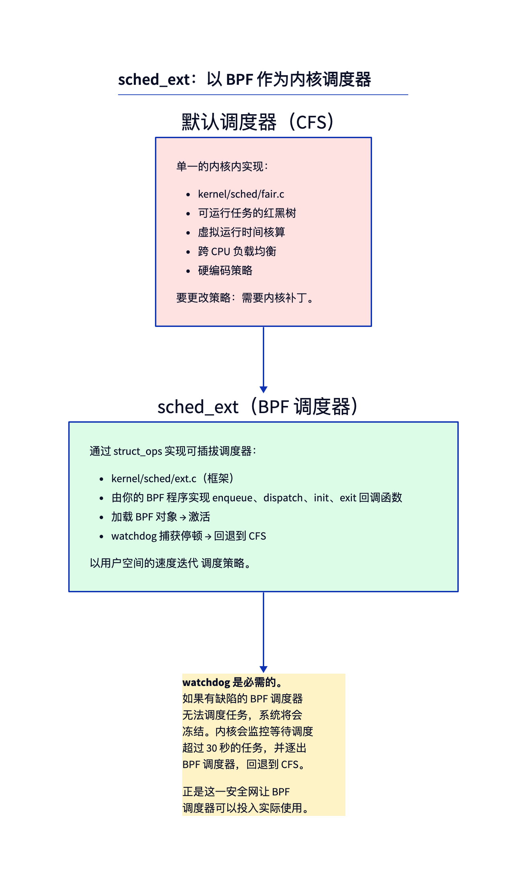
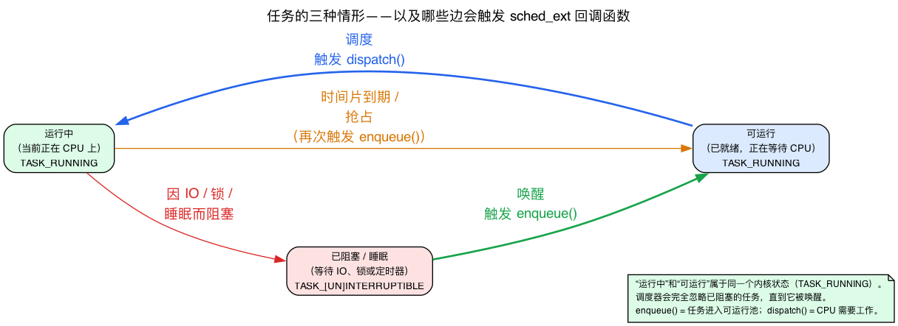
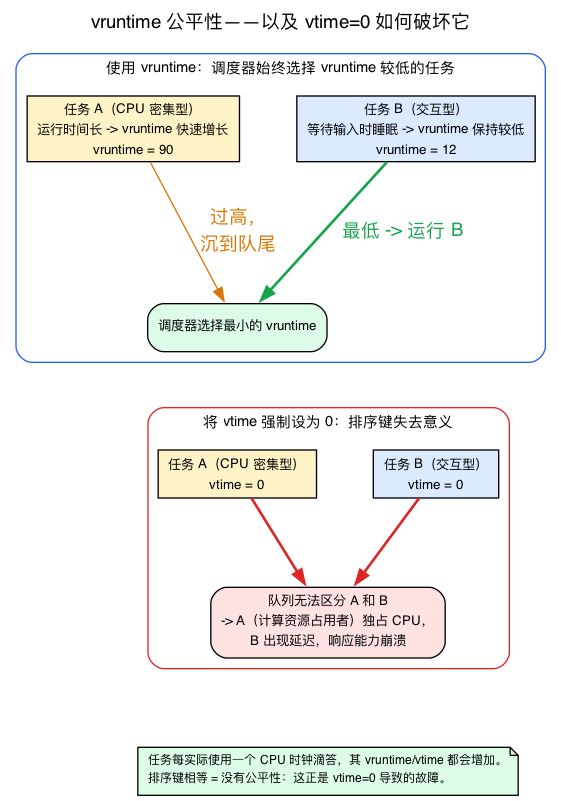
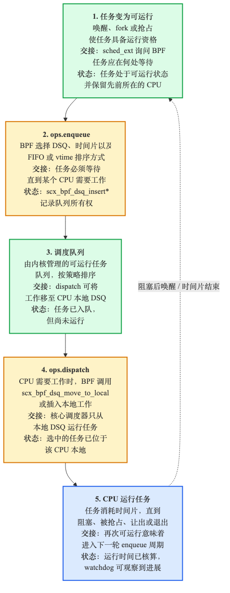

# 第25天 — sched_ext：一个 BPF 调度器

> **今日任务：** 在你的系统上加载 `scx_simple`，实际观察它调度任务的过程，理解 enqueue/dispatch（入队/派发）周期，并弄清楚为什么这是迄今为止发布过的最雄心勃勃的 BPF 特性。在此过程中，你会学到 CPU 调度器到底*是什么*——任务状态、时间片、抢占、上下文切换——以及 CFS 底层“公平性”的含义，这样整章内容就不再是你只能点头附和的术语堆砌。总用时：约 100 分钟。

> **第 5 阶段从这里开始。** 第25–30天将探索前沿领域。你会运行并修改一个 BPF 调度器，然后完成一个自选的综合项目。到第30天，你将交付一项有分量的 BPF 成果。

## sched_ext 是什么

Linux 调度器决定*哪个任务在哪个 CPU 上、在什么时间运行*。直到 2024 年之前，这套逻辑完全存在于内核内部——`kernel/sched/fair.c`（CFS 的实现），策略是硬编码的。要修改调度策略，需要打内核补丁、重新编译内核、重启，然后祈祷自己没有在细微之处把事情搞坏。

**sched_ext**（在 2024 年 10 月合入 6.12）让调度器变得**可通过 BPF 插拔**。你针对 `struct sched_ext_ops` 编写一个 struct_ops 模块。加载它就会激活你的调度器；卸载它就会恢复为 CFS。



这与之前的 BPF 特性有本质区别。跟踪程序*观察*，网络程序*过滤*，而 sched_ext 程序则**做出调度决策**——这是内核中性能最关键、最热的路径代码。

其动机在于：调度策略并非一刀切。云工作负载希望跨 cgroup 公平；高频交易（HFT）不惜一切代价追求低延迟；移动端希望最小化能耗；游戏希望帧时间稳定。这些需求各自都在学术论文中被论证过，也在研究性内核中被测试过。sched_ext 让研究者和运维人员能够**以用户空间的速度迭代调度策略**——修改 BPF 代码、几秒内重新构建、加载、测量、迭代。

> 快速回顾（来自第 4 阶段，“现代原语”）：**struct_ops** 是一种 BPF 对象，它的程序填充内核的一张**虚函数表（vtable）**——一个由内核在恰当时机调用的函数指针结构体。加载并挂载 struct_ops *链接（link）*会安装你的回调函数。sched_ext 只是恰好把这张虚函数表设为 `struct sched_ext_ops`（`kernel/sched/ext_internal.h:292`）的 struct_ops，而“挂载”意味着“成为系统调度器”（安装路径是 `scx_enable(struct sched_ext_ops *ops, struct bpf_link *link)`，位于 `kernel/sched/ext.c:7447`）。你已经了解的关于 struct_ops 的一切——虚函数表、BTF、链接挂载——在这里原封不动地适用。

## 首先，调度器到底做什么

本章接下来会不断抛出诸如*可运行（runnable）*、*阻塞（blocked）*、*时间片（time slice）*、*被抢占（preempted）*、*上下文切换（context switch）*这样的词汇。如果这些概念对你来说还很模糊，sched_ext 就会显得像魔法一样。它们并不是魔法——只是一个很小的状态机。我们先把它弄清楚，这会立刻带来回报。

### 每个任务永远处于这三种情形之一

一个任务（线程——内核调度的基本单位，每个都对应一个 `struct task_struct`）永远恰好处于以下三种情形之一：

- **运行中（Running）**——它*此刻*正在某个 CPU 上执行。
- **可运行（Runnable）**——它已准备好运行，只是在等待一个空闲的 CPU。除了可运行任务数多于 CPU 数之外，没有任何东西在阻碍它。
- **阻塞（Blocked / sleeping）**——它在等待*某件事*发生才能继续推进：一次磁盘读取完成、一把锁被释放、一个定时器触发、一个数据包到达。在那件事发生之前，它**根本不是** CPU 的候选对象。

这里有一个内核编码进去的微妙之处，你应当牢记：**“运行中”和“可运行”是*同一个*内核状态。** 两者都是 `TASK_RUNNING`：

```c
/* include/linux/sched.h:107 */
#define TASK_RUNNING            0x00000000
#define TASK_INTERRUPTIBLE      0x00000001   /* sched.h:108 — blocked, wakeable by signals */
#define TASK_UNINTERRUPTIBLE    0x00000002   /* sched.h:109 — blocked, not signal-wakeable */
```

一个 `TASK_RUNNING` 任务是“可调度的”——它属于调度器的候选池，无论此刻它是否真的占有一个 CPU。一个阻塞的任务处于 `TASK_INTERRUPTIBLE`（可以被信号唤醒——例如在管道上 `read()`）或 `TASK_UNINTERRUPTIBLE`（必须等到确切的事件发生——例如一次磁盘 I/O），调度器根本不会考虑它。它不会被再次挑选，直到它等待的条件被满足、内核把它翻回 `TASK_RUNNING`——那次翻转就是一次**唤醒（wakeup）**。

> **常见疑问**
>
> **问：如果“运行中”和“可运行”是同一个 `TASK_RUNNING` 状态，内核怎么知道哪些任务此刻*真的*在某个 CPU 上？**
>
> 答：这是单独跟踪的。每个 CPU 的运行队列会在 `rq->curr` 中记录它当前正在运行的任务。`TASK_RUNNING` 只意味着“有资格运行”——是否*正在* CPU 上是运行队列的属性，而不是任务状态字段的属性。所以这个状态机有三种任务*状态*，但只有两个任务状态*取值*，而 CPU 占用这一位信息存在别处。



### 调度器的工作，一句话概括

在**可运行**的任务集合中，调度器要挑选**哪一个在每个 CPU 上运行，运行多久。**

那个“多久”就是**时间片（time slice）**——一份 CPU 时间预算。当一个任务的时间片用完，内核会**抢占（preempt）**它：把它从 CPU 上拽下来（即便它本来还乐意继续运行），把它扔回可运行池，然后重新挑选。抢占正是阻止某个 CPU 密集型任务冻结所有其他任务的机制——没有它，一个忙循环就会永远霸占一个核心。

把任务 A 从 CPU 上拿下、换上任务 B 的动作，叫做**上下文切换（context switch）**：保存 A 的寄存器、程序计数器和栈指针；载入 B 的。这是调度器引发的物理层面的转换。它并不是免费的（你要付出缓存和 TLB 的代价），这也是为什么调度器不会每纳秒都切换一次。

### 调度器必须处理的两个事件

把以上内容浓缩一下，调度器实际上只对两个时刻做出反应：

- 一个任务**进入**可运行池（它刚被创建、刚从 I/O 中醒来，或刚被抢占）。得有东西决定它*去哪里*、给它*多少时间片*。这就是 **enqueue（入队）**。
- 一个 CPU **用完了**当前的任务（该任务阻塞了，或用完了它的时间片），需要下一个任务。得有东西*交给它一个任务*。这就是 **dispatch（派发）**。

那个 enqueue → dispatch 的循环就是调度器的整个骨架——你也猜到了——它恰好就是 sched_ext 要求你实现的两个回调函数。“从 I/O 中醒来”现在可以精确地表述为：一个被阻塞任务的等待条件被满足了，内核把它翻转为 `TASK_RUNNING`，而正是这次唤醒触发了 `select_cpu`/`enqueue` 来重新安置它。

### sched_ext 把每任务数据挂在哪里

每个任务已经在 `struct task_struct` 内部携带着自己的调度记账信息。sched_ext 通过一个内嵌成员把自己的每任务数据挂了上去：

```c
/* include/linux/sched.h:876, inside task_struct */
struct sched_ext_entity        scx;
```

所以当 `scx_simple` 读取 `p->scx.dsq_vtime` 时，它读的是内核为*每个任务*维护的一个字段，就在任务结构体里面：

```c
/* include/linux/sched/ext.h:231, inside struct sched_ext_entity */
u64                     dsq_vtime;
```

先记住 `dsq_vtime`——下一节会解释这个数字*意味着什么*。

## “公平性”意味着什么：CFS 与虚拟运行时间

sched_ext 所替换（并在卸载时恢复）的调度器是 **CFS，即完全公平调度器（Completely Fair Scheduler）**，实现于 `kernel/sched/fair.c`。本章会不断提到“回退到 CFS”、“CFS 的公平份额保证”、“按 vtime 排序”。如果不了解 CFS 那个最核心的想法，你就无法评估这些说法。

### 核心想法：为每个任务消耗的 CPU 时间记账

设想你希望 N 个可运行任务各自都能获得公平、均等的 CPU 份额。朴素的方法——固定时间片的轮转调度——一旦任务有不同优先级或在不同时刻睡眠，就会立刻失效。

CFS 的诀窍是**虚拟运行时间（virtual runtime，`vruntime`）**：每个任务累计一个运行统计量，记录它消耗了多少 CPU 时间，并按其优先级/权重缩放。

```c
/* include/linux/sched.h:594, per scheduling entity */
u64                     vruntime;
```

公平性的*直觉*很简单：一个已经运行了很多的任务，`vruntime` 会很高，于是它就沉到后面；一个几乎没运行过的任务，`vruntime` 很低，于是它就浮到前面。随着时间推移，每个任务消耗的时间会保持大致相等——这*就是*“公平”的含义。

在这个内核版本中，具体的选择算法是对这个直觉的一种精细化实现。自 6.6 版本起，公平调度类变成了 **EEVDF**（文件仍然是 `kernel/sched/fair.c`，调度类的名字仍然叫 CFS，但挑选逻辑变了）。运行队列的红黑树（`cfs_rq->tasks_timeline`，位于 `kernel/sched/sched.h:695`）是按每个实体的虚拟**截止时间（deadline）**排序的，而不是按它原始的 `vruntime`：`entity_before()`（`fair.c:589`）比较的是截止时间，`__entity_less`（`fair.c:974`）据此构建这棵树。选择函数是 `pick_eevdf()`（`fair.c:1136`），它会一路查找最左侧的**符合资格（eligible）**的实体（`entity_eligible()`，`fair.c:939`）——“符合资格”大致意味着该任务消耗的时间尚未超过它应得的公平份额。所以这其实是“在符合资格的实体中按截止时间选择”，而不是字面意义上的“`vruntime` 最小者胜出”（那是 6.6 之前 CFS 的规则）。但公平性的结果是一样的——一个 CPU 密集型任务会获得一个更靠后的截止时间并变得不再符合资格，从而沉到后面——这正是你应该记住的直觉。

### 为什么新任务和刚醒来的任务既不占便宜也不吃亏

一个全新的任务应该获得什么样的 `vruntime`？或者一个睡了一分钟刚醒来的任务呢？如果它从 0 开始，它的 `vruntime` 会比其他所有任务都小得多，于是它会一直霸占 CPU 直到追上大家。如果它继承了自己那个陈旧的旧值，那么一个睡了很久的任务就会因为睡眠而受到惩罚。

EEVDF 采取了折中方案：一个新任务或刚醒来的任务会被安置在运行队列的加权**平均**虚拟时间附近，该值由 `avg_vruntime()`（`kernel/sched/fair.c:780`）计算得出，并带有一个滞后（lag）调整（`PLACE_LAG` 路径，位于 `place_entity()` 中的 `kernel/sched/fair.c:5381`），这样任务保留的是它先前的虚拟滞后量，而不是被重置到某个下限：

```c
/* kernel/sched/sched.h:687, the runqueue's virtual-time zero-point */
u64                     zero_vruntime;
```

运行队列的虚拟时间零点是 `cfs_rq->zero_vruntime`，而放置任务时使用的是加权平均值 `avg_vruntime()`——*而非*最小值。把一个新来者放在平均值附近，意味着它很快就能*得以运行*，但**无法通过闲置来囤积 CPU**（如果放在最小值处，会让一个长期睡眠者获得不公平的领先优势，这正是 EEVDF 刻意避免的）。这一点在后文会被精确地映照出来：`scx_simple` 会限制一个空闲任务的预算，这样一个长期睡眠的任务就无法积累无限的优先级。

> 留意这些名字：每任务 `min_vruntime`（位于 `include/linux/sched.h:580`）是*另一回事*。它存在于 `struct sched_entity`（该结构体从第 575 行开始）内部，是用于截止时间树的增广红黑树子树最小值——**不是**一个全队列范围的下限。经典的每运行队列 `cfs_rq->min_vruntime` 下限在 EEVDF 重构中已被移除；`struct cfs_rq`（`kernel/sched/sched.h:678`）不再有 `min_vruntime` 成员。

### sched_ext 按 vtime 排序的 DSQ 用的是同一套技巧

sched_ext 的一个派发队列（dispatch queue）可以有两种排序方式，内核头文件对此说得很明白：

```c
/* include/linux/sched/ext.h:76 */
 * A dispatch queue (DSQ) can be either a FIFO or p->scx.dsq_vtime ordered
```

**FIFO** DSQ 就是一个普通队列——先进先出，不考虑公平性。一个**按 vtime 排序**的 DSQ 会按其 `dsq_vtime` 键把任务保持在一棵红黑树中排好序，这与 CFS 使用的数据结构相同：

```c
/* include/linux/sched/ext.h:85 */
struct rb_root          priq;   /* used to order by p->scx.dsq_vtime */
```

你用 `scx_bpf_dsq_insert_vtime(..., vtime, ...)` 插入，队列保持有序，派发时取出 `vtime` 最小的那个——在 BPF 中重新发明了 CFS 的公平性。这也是为什么一个*内建*的 FIFO DSQ（比如 `SCX_DSQ_GLOBAL`）**不能**被当作 vtime 优先队列使用（你会在下文再次看到这条提示）：FIFO 没有排序键可供排序。

### 这正是 `vtime=0` 会造成破坏的原因

后面你会故意把每个任务的 `vtime` 都设为 0，然后观察交互性的崩溃。现在你能明白*为什么*了：当所有 `vtime` 相等时，排序就失去了意义。一个 CPU 密集型计算任务和一个正在等待按键输入的编辑器，在队列看来一模一样，于是计算任务永远不会沉到后面，编辑器也永远不会浮到前面。这恰恰就是 `vruntime` 被发明出来要防止的那种不公平。



## 看门狗：是什么让这一切变得安全

一个有缺陷的 BPF 调度器如果不能派发任务，可能会冻结整个系统。内核对此有所防范：

- **派发停滞看门狗（Dispatch stall watchdog）。** 如果任何任务保持可运行但一直未被派发，超过了停滞超时时间，内核就会判定这个 BPF 调度器坏了，把它踢出去，重新启用 CFS。超时时间默认为 30 秒（`SCX_WATCHDOG_MAX_TIMEOUT = 30 * HZ`），可以通过 `ops.timeout_ms` 调得更短——但绝不能延长超过 30 秒（内核对此设了上限）。
- **回退到 CFS。** 恢复过程是自动的——最坏情况下，也就冻结 30 秒，然后恢复正常的 CFS。

正是这道安全网让 sched_ext 具备了可发布性。没有它，没人敢冒险把用户代码加载进调度器的热路径。

### “30 秒”从何而来：HZ 与 jiffies

这个常量写作 `30 * HZ`，而不是 `30`。要读懂内核的计时代码，你需要理解两个单位：

- **HZ** 是内核的定时器节拍频率——每秒发生多少次调度器/定时器节拍。
- 一个 **jiffy** 就是一次节拍。所以 N 秒的时长就是 `N * HZ` 个 jiffies。内核超时值经常这样表达。

在这个内核上：

```
/* ~/code/linux/.config:542 */
CONFIG_HZ=1000
```

所以 HZ = 1000，`30 * HZ` = 30000 jiffies = **30 秒**：

```c
/* kernel/sched/ext_internal.h:14 */
SCX_WATCHDOG_MAX_TIMEOUT        = 30 * HZ,
```

这就是看门狗所强制执行的“30 秒”背后的字面推导——没有任何黑箱。以后每当你看到一个写成 `N * HZ` 的内核常量，心算一下除以 `CONFIG_HZ` 就能得到秒数。

## 核心循环：enqueue → DSQ → dispatch

每个 BPF 调度器都要为两个主要事件实现回调——正是我们上面推导出的那对 enqueue/dispatch。



### `enqueue(task, flags)`

一个任务变为可运行（它刚从 I/O 中醒来、刚被创建，或刚被抢占——也就是它刚进入 `TASK_RUNNING` 池）。BPF 调度器要决定**把它放到哪里**——放到哪个 **DSQ**（派发队列）上、以什么顺序、给它多少时间片（时间预算）。

### `dispatch(cpu, prev)`

一个 CPU 无事可做（它当前的任务阻塞了，或用完了时间片）。BPF 调度器要决定**给它哪个任务**——通常是从某个 DSQ 中取出一个。

### `select_cpu(p, prev_cpu, wake_flags)`

当一个任务醒来时，这个回调决定**在哪个 CPU 上唤醒它**。这是可选的；默认是“它上次运行的那个 CPU，并做一些调整”。

### 其他回调

`init`、`exit`、`running`、`stopping`、`update_idle`、`cpu_release`、`set_cpumask`——都定义在 `struct sched_ext_ops`（`kernel/sched/ext_internal.h:292`）中。整张虚函数表大约有 37 个回调；大多数 BPF 调度器只实现其中的 4 到 8 个，其余的交给 CFS 等效的默认实现处理。

## DSQ（派发队列）

DSQ 是内核管理的队列，用于容纳等待被派发的可运行任务。你不需要自己实现它们；你只需要调用一套 API：

- **`scx_bpf_dsq_insert(p, dsq_id, slice, flags)`**——把任务 `p` 入队到由 `dsq_id` 标识的 FIFO DSQ 上，并为它设置时间片 `slice`（纳秒）。
- **`scx_bpf_dsq_insert_vtime(p, dsq_id, slice, vtime, flags)`**——把任务 `p` 插入一个按 vtime 排序的 DSQ（来自 CFS 那节的公平性机制：该队列始终按 `vtime` 保持有序）。
- **`scx_bpf_dsq_move_to_local(dsq_id, flags)`**——把某个 DSQ 中的下一个任务移动到当前 CPU 的本地 DSQ；在 `dispatch` 中调用，使某个任务能在本地运行。
- **`scx_bpf_create_dsq(id, node)`**——在 NUMA 节点 `node` 上，以给定的数字 id 创建一个新的 DSQ。（NUMA 节点：在多路服务器上，内存物理连接在某个特定的 CPU 插槽上——即一个“节点”；在给定节点上创建 DSQ 能让其内存对使用它的 CPU 保持本地化。`scx_simple` 传入 `-1` 表示“任意节点均可”。）

内建 DSQ：
- **`SCX_DSQ_GLOBAL`**——一个所有 CPU 共用的单一队列。（注意：像 `SCX_DSQ_GLOBAL` 这样的内建 DSQ *不能*被用作 vtime 优先队列——你无法对它调用 `scx_bpf_dsq_insert_vtime`，因为 FIFO 没有排序键。这正是为什么 `scx_simple` 要创建自己的自定义共享 DSQ，见下文。）
- **`SCX_DSQ_LOCAL`**——每 CPU 队列。每个 CPU 都有自己的一份。

自定义 DSQ（通过 `scx_bpf_create_dsq` 创建）让你能够实现更复杂的策略：每 cgroup 队列、优先队列、NUMA 本地队列等等。

## 实验 — 运行 scx_simple

`scx_simple` 是 sched_ext 的“hello world”：一个把所有任务都派发到单个共享队列的 BPF 调度器。（scx_simple 创建了自己的 DSQ，而不是用 `SCX_DSQ_GLOBAL`——原因见上面 DSQ 一节：内建 FIFO 无法按 vtime 排序。）

### 仓库实验：构建并运行完全一致的上游调度器

本书的实验不会重新实现一遍 `scx_simple`——第25天的重点是运行树内*未经修改*的示例代码。`make -C ebpf/labs day25` 会直接从锁定版本的 Linux v7.1 源码树构建它，使用内核自带的 `tools/sched_ext` Makefile，并把所有产物都送到 `.output/` 目录下，以保持锁定源码目录的干净：

{{#include ../labs/day25/build.sh:book}}

`run.sh` 是可选启用、自我清理的运行脚本：它在一台可丢弃的、支持 sched_ext 的虚拟机上，把这个二进制加载运行一段有限的时间，然后把它踢出去，让 CFS 恢复：

{{#include ../labs/day25/run.sh:book}}

本节剩余部分展示的是同一件事的手动做法，这样你可以逐步观察每一步。

### 构建

```bash
cd ~/code/linux/tools/sched_ext
make
ls build/bin
# scx_central  scx_cpu0  scx_flatcg  scx_pair  scx_qmap  scx_sdt  scx_simple  scx_userland
```

注意：编译出来的调度器二进制文件是放在 `build/bin/` 下的，而不是在源码目录里——直接执行 `ls` 查看 `tools/sched_ext`，会看到 `.c`/`.bpf.c`（以及少数几个 `.h`）源文件、`Makefile`、`Kconfig`、`README.md`、`include/` 目录，以及 `build/` 目录。

### 运行

```bash
sudo ./build/bin/scx_simple
```

输出（这一行大约每秒重新打印一次，累计计数在负载下不断攀升）：
```
local=842 global=58
local=1577 global=141
```

`local` 统计的是直接派发到某个 CPU 本地 DSQ 的任务数（因为 `select_cpu` 为它们找到了一个空闲 CPU）；`global` 统计的是经由共享的、按 vtime 排序的 DSQ、通过 `ops.enqueue` 走过的任务数。在一个繁忙的系统上，`global` 通常不为零。那个不断攀升的计数器*正是*任务正流经 scx_simple 的 enqueue/dispatch 周期的证明。

> 这两个计数器存放在每 CPU 映射中。回忆一下第 2 阶段跟踪相关几天里学到的每 CPU 映射：`scx_simple` 把它的 `stats` 映射声明为 `BPF_MAP_TYPE_PERCPU_ARRAY`，`max_entries 2 /* [local, global] */`，这样每个 CPU 都在无锁的情况下更新自己私有的槽位，用户空间打印的 `local=`/`global=` 总数就是**所有 CPU 之和**。这也是为什么一台繁忙的多核机器能在没有任何计数器争用的情况下飞快地累积计数。

就是这样。**你的系统现在由 BPF 来调度了。**

运行一些能真正触发调度的负载。`stress-ng` 并不是基础安装的一部分——先安装它（Debian/Ubuntu 上用 `sudo apt-get install -y stress-ng`，Fedora/RHEL 上用 `sudo dnf install -y stress-ng`）。如果你无法安装软件包，一个通用的替代方案是 `for i in $(seq $(nproc)); do yes >/dev/null & done`（之后用 `pkill yes` 停止它）。

```bash
# In another terminal:
stress-ng --cpu 4 --timeout 30
```

在它运行期间，确认 scx_simple 确实在掌控之中：

```bash
cat /sys/kernel/sched_ext/state
# enabled
```

（当没有加载任何 BPF 调度器时，这里会显示 `disabled`。）观察 scx_simple 每秒打印的 `local=N global=M` 那一行——随着 stress-ng 的工作线程在调度器中循环，两个计数器都应该在攀升。用 `scx_simple` 时，基本的响应性得以保留（它是一个能正常工作的调度器，只是很简单），但你并没有获得 CFS 的公平份额保证——它字面意义上就是一个共享队列，近似 FIFO。

### 阅读源码

`tools/sched_ext/scx_simple.bpf.c`。整个调度器大约只有 30 行 BPF 代码：

```c
void BPF_STRUCT_OPS(simple_enqueue, struct task_struct *p, u64 enq_flags)
{
    /* Place into the shared vtime-ordered DSQ with the default slice */
    u64 vtime = p->scx.dsq_vtime;
    /* cap idle budget at one slice (the min_vruntime trick) */
    if (time_before(vtime, vtime_now - SCX_SLICE_DFL))
        vtime = vtime_now - SCX_SLICE_DFL;
    scx_bpf_dsq_insert_vtime(p, SHARED_DSQ, SCX_SLICE_DFL, vtime, enq_flags);
}

void BPF_STRUCT_OPS(simple_dispatch, s32 cpu, struct task_struct *prev)
{
    scx_bpf_dsq_move_to_local(SHARED_DSQ, 0);
}
```

那个两行的限幅（clamp）正是 CFS 那一节中 `min_vruntime` 式下限的原样重现：它把一个长期睡眠任务能囤积的优先级上限，限制在一个时间片以内。

真实源码把这段包在一个 `if (fifo_sched)` 开关里（一种 FIFO 模式，对照默认的 vtime 模式）；我们这里只展示默认的 vtime 分支——那正是你会在下面的实验中修改的那一行。

对照上面讲的一切来读这两个函数。`simple_enqueue` 就是“一个任务变为可运行了，它该去哪里？”这个回调——它读取任务的每任务字段 `p->scx.dsq_vtime`，插入到按 vtime 排序的 `SHARED_DSQ` 中，这样更公平（vtime 更低）的任务会排到更前面。`simple_dispatch` 就是“一个 CPU 需要活干了”这个回调——它把队首任务拉进本地 DSQ。Enqueue 和 dispatch，正是这两事件骨架的原样体现。

（`BPF_STRUCT_OPS` 内部已经展开为 `SEC("struct_ops/"#name)`——你永远不需要自己写 `SEC()` 那一行，如果你写了反而会导致段冲突。）

再加上 `init`、`exit`，以及那个虚函数表实例。这就是整个调度器。

用户空间部分（`scx_simple.c`）大约 110 行，负责：
- 加载 BPF 对象。
- 挂载 struct_ops 链接。
- 周期性输出统计信息。
- Ctrl-C 时优雅退出（这会导致内核恢复到 CFS）。

### 停止它

在 `scx_simple` 所在终端按 Ctrl-C。看门狗派不上用场——scx_simple 会干净地退出，内核检测到链接被断开，CFS 接管。确认方式：`cat /sys/kernel/sched_ext/state` 现在应显示 `disabled`。重新运行 `stress-ng`，用 `pidstat -t 1` 或 `top -H` 观察每线程的 CPU 占比——在 CFS 下，各个工作线程会收敛到大致相等的 CPU%（这正是 `vruntime` 公平性在起作用），与 scx_simple 那个单一共享的、近似 FIFO 的队列形成对比。（如果你用了 `yes` 这个替代方案，记得用 `pkill yes` 停止它。）

## 破坏实验

### 不做派发

注释掉 `scx_bpf_dsq_move_to_local(SHARED_DSQ, 0)`，它位于 `simple_dispatch` 中。运行；CPU 无事可做；任务在队列里堆积。大约 30 秒后，看门狗会将其踢出：

```
sched_ext: BPF scheduler "simple" disabled (runnable task stall)
sched_ext: simple: stress-ng[12345] failed to run for 30.000s
```

查看 `dmesg`。系统会自动恢复。**不要在生产环境中破坏 dispatch。生产环境中的 sched_ext 调度器都必须带有安全路径，以便在自定义逻辑无法派发时能够回退。**

### 让 vtime 始终为 0

把 `vtime = 0` 设在 `simple_enqueue` 中。每个任务就都有了相同的优先级。正如 CFS 那节所解释的，当所有 `vtime` 都相等时，按 vtime 排序的队列就再也无法区分一个计算密集型任务和一个交互式任务了——长时间运行的任务会占据主导，交互式任务会滞后。CFS 的 vtime 记账是最简单的公平性机制；照搬它是最不容易出意外的路径。试着不这么做，观察响应性的下降。

### 添加每 CPU 的 DSQ

把 `SHARED_DSQ` 换成每 CPU 各自的 DSQ。每个 CPU 从自己的 DSQ 中取任务。没有了跨 CPU 的争用，但也失去了自动的负载均衡——你需要在 `dispatch` 中、当自己的 DSQ 为空时手动做负载再均衡。这正是 `scx_central`（第27天）所做的事情。

### 添加一个跟踪点

在 `simple_enqueue` 内部，向 ringbuf 发送事件：

```c
struct event *e = bpf_ringbuf_reserve(&rb, sizeof(*e), 0);
if (e) { e->pid = p->pid; ...; bpf_ringbuf_submit(e, 0); }
```

你现在正在实时观察每一次调度决策。吞吐量方面需要考虑：在每秒 100 万次以上的上下文切换速率下，即便每次发送只多花几纳秒，也会累积成可观的影响。要么大力过滤（每 N 次采样一次，或只针对特定任务发送），要么在 BPF 内部先做聚合。

## 该阅读内核中的哪些内容

- **`kernel/sched/ext.c`**——整个框架，约 10,000 行。**先读文件顶部的注释**了解设计概览。今天不用尝试读完全部内容；先熟悉一下方向即可。

- **`kernel/sched/ext_internal.h:292`**——`struct sched_ext_ops` 的定义。虚函数表的形状：你的 BPF 调度器能实现的每一个回调。

- **`kernel/sched/ext.c:7447`**——`scx_enable(struct sched_ext_ops *ops, struct bpf_link *link)`。当一个 struct_ops 调度器被加载时调用的函数；把它激活为系统调度器。

- **`kernel/sched/ext_idle.c`**——空闲 CPU 集成。sched_ext 调度器如何处理“没有任务可运行；CPU 应当空闲”这种情况。

- **`kernel/sched/fair.c`**——公平调度类（EEVDF）的实现：sched_ext 加载期间所替换、卸载时所恢复的那个调度器。浏览一下 `pick_eevdf()` 和 `place_entity()`，看看虚拟截止时间与 `avg_vruntime()` 是如何驱动选择与放置的——那正是你按 vtime 排序的 DSQ 所模仿的公平性模型。

- **`tools/sched_ext/scx_simple.bpf.c`**——完整读一遍。这是最简的示例。

- **`tools/sched_ext/include/scx/common.bpf.h`**——kfunc 声明，以及你的 BPF 调度器会用到的辅助函数。

- **`Documentation/scheduler/sched-ext.rst`**——官方指南。读一遍。很简明。

## 要点回顾

- **一个调度器**从**可运行**（`TASK_RUNNING`）的任务中挑选哪个在每个 CPU 上运行、运行多久（它的**时间片**）。阻塞的任务（`TASK_INTERRUPTIBLE`/`TASK_UNINTERRUPTIBLE`）在**唤醒**之前都不是候选对象。时间片耗尽会导致**抢占**；交换任务是一次**上下文切换**。两个事件：**enqueue**（任务变为可运行）和 **dispatch**（CPU 需要一个任务）。
- **CFS** 是默认调度器；它的公平性来自 **`vruntime`**（消耗的 CPU 时间，经过加权）——直觉是“运行那个运行得最少的任务”。（在这个内核版本中，公平调度类是 EEVDF：它通过 `pick_eevdf()` 按虚拟*截止时间*挑选最左侧*符合资格*的实体，公平性结果相同。）新任务/刚醒来的任务被安置在运行队列的加权平均虚拟时间（`avg_vruntime()`）附近，而不是某个最小值下限。sched_ext 的**按 vtime 排序的 DSQ** 重现了这一点；到处使用 `vtime=0` 会破坏它。
- **sched_ext** 让 BPF 程序能够通过 `struct sched_ext_ops`（struct_ops）实现 Linux 调度器。每任务的调度数据存放在 `task_struct.scx` 中（例如 `p->scx.dsq_vtime`）。
- **DSQ** 是内核管理的派发队列，要么是 FIFO，要么按 vtime 排序。内建的有：`SCX_DSQ_GLOBAL`（仅 FIFO）、`SCX_DSQ_LOCAL`。可以通过 `scx_bpf_create_dsq` 自定义。
- **派发停滞看门狗**会踢出停滞的 BPF 调度器并回退到 CFS。默认及最大超时时间为 30 秒（`SCX_WATCHDOG_MAX_TIMEOUT = 30 * HZ`；此处 HZ=1000，即 30000 jiffies），可通过 `ops.timeout_ms` 调得更短。
- `scx_simple` 是最简示例；`scx_central`、`scx_flatcg`、`scx_lavd` 依次更为丰富。
- 加载一个 BPF 调度器是一次**全系统**范围的操作——系统上的每个任务都会经由它调度。
- 源码：`kernel/sched/ext.c`（约 10，000 行）+ `kernel/sched/ext_internal.h`（结构体定义）+ `tools/sched_ext/`。

## 检查问题

是什么保证了加载一个 BPF 调度器不会永久冻结你的机器？

<details>
<summary>点击查看答案</summary>

**答案：** 派发停滞看门狗。内核会监控所有 CPU 上任务的等待时间；如果任何任务保持可运行但一直未被派发、超过了停滞超时时间，框架就会判定这个 BPF 调度器坏了，把它踢出去，重新启用 CFS。恢复过程是自动的。

看门狗超时时间默认为 30 秒（`SCX_WATCHDOG_MAX_TIMEOUT = 30 * HZ`，位于 `kernel/sched/ext_internal.h`）。调度器可以通过 `ops.timeout_ms` 请求一个*更短*的超时时间，但内核把它的上限设为 30 秒——你永远无法禁用它或把它延长超过这个值。这个默认阈值是保守的——足够长，不会误触发任何合理的调度延迟；又足够短，不会让一个彻底停滞的 BPF 调度器把系统挂起数分钟之久。

正是这样的设计让 BPF 调度成为可行之选。没有它，dispatch 中的一个死循环（或是一个未能消费任何 DSQ 的逻辑错误）就会让系统死锁，需要断电重启。有了它，最坏情况也只是暂停 30 秒，然后完全恢复，由 CFS 管理，回到正常状态。“要不要试试这个调度器”的门槛，就从“你确定吗”降低到了“当然可以，试试又何妨——大不了 30 秒。”

</details>

---

## 明天

第26天：修改 scx_simple，让它优先调度某个特定 cgroup 中的任务。亲自观察你的改动如何影响真实工作负载。
