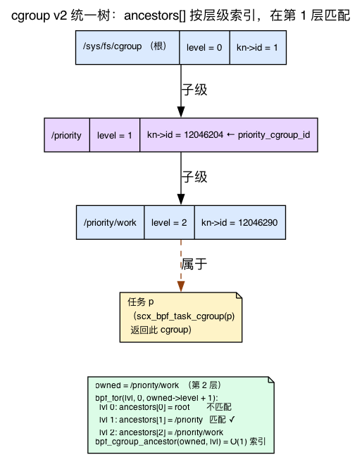
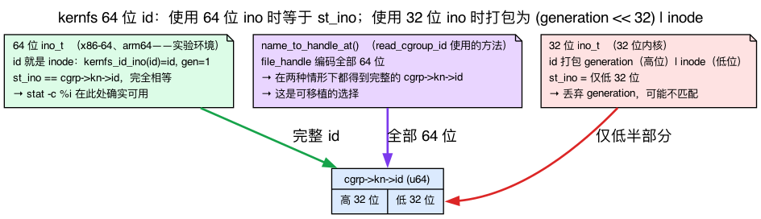
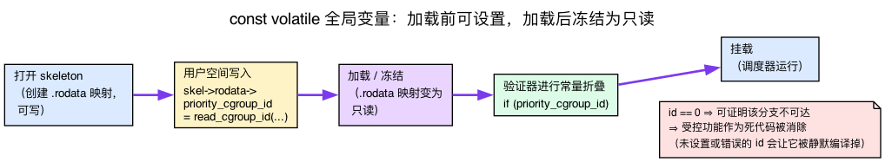
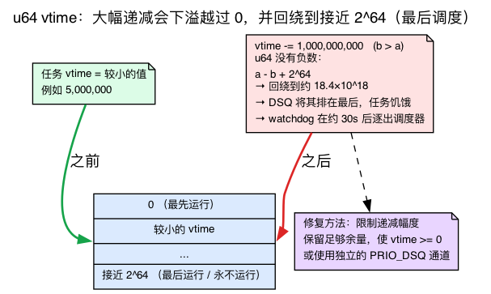
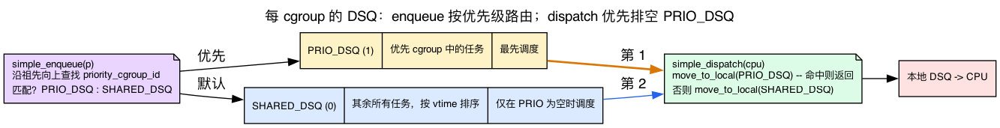

# 第26天 — 修改 scx_simple：为某个 cgroup 提供优先级

> **今日任务：** 制作 `scx_simple` 的一个定制变体，为指定 cgroup 中的任务提供调度优先级，并观察该负载在压力下获得优待。途中有三处细节会让你踩坑——v7.1 中 cgroup 到底是什么、应该匹配哪个 cgroup id，以及一个 `const volatile` 全局变量如何变成加载期配置——正文各节会在遇到时逐一引入。总耗时：约 110 分钟。

## 为什么做这个练习

昨天你运行了一个别人写的 BPF 调度器。今天你要修改一个，并观察其效果。这是 sched_ext 最重要的技能：**对一个可正常工作的调度器做小而精准的修改**。

目标是熟悉这个迭代循环：

1. 修改一个回调函数。
2. 编译、加载。
3. 生成负载。
4. 通过测量观察效果。
5. 调优；迭代。

今天的具体修改：`/sys/fs/cgroup/priority` 中的任务获得 2 倍时间片和更低的 vtime（因此运行得更早）。其他任务使用默认值。

这一句话背后藏着三件事，如果你不理解它们就会被绊倒，今天的大部分内容就是要把它们讲清楚：

1. **cgroup 到底是什么**，内核如何把它们组织成一棵树，以及为什么 BPF 代码必须用一个 kfunc *遍历*这棵树，而不是沿着 `parent` 指针走——因为根本没有这个指针。
2. **为什么你要匹配的 id 是完整的 64 位 kernfs id**——在 64 位 Linux 上它等于 `stat` 打印出的 inode，但在 32 位内核上并非如此，所以我们采用可移植的方式读取它——以及取错这个 id 会如何悄无声息地让整个功能失效。
3. **一个 `const volatile` 全局变量**如何成为用户空间在加载前设置一次的配置项，随后由验证器将其作为常量固化。

我们会在遇到相关内容时逐一讲解。有些你已经学过的内容会在这里出现，我们只做*复习*而不重新讲解：vtime 排序的 DSQ 与 `p->scx.dsq_vtime`（第25天）、kfunc 的获取/释放引用规则以及 `KF_ACQUIRE`/`KF_RELEASE`（第20天）、`bpf_cgroup` 作为一种带引用计数的类型以及 `bpf_cgroup_release`（第21天）、用 `bpf_for` 实现有界循环（第5天）、“空指针检查必须支配解引用”的规则（第4天），以及各回调可独立标记为 sleepable 的 struct_ops（第22天）。

## cgroup 是什么，以及它所在的树

在动手改动调度器之前，先具体了解一下我们要优先照顾的这个东西。

**cgroup**（控制组）是*进程树中的一个节点*。系统上的每个任务都恰好属于一个 cgroup，而一个 cgroup 可以容纳很多任务。在 cgroup **v2**（“统一层级”）中，所有控制器（cpu、memory、io 等）只有*一棵*树，挂载在 `/sys/fs/cgroup`。这个文件系统本身**就是**这棵树：每个目录就是一个 cgroup，目录嵌套就是 cgroup 嵌套。

你用普通的文件系统操作来构建这棵树：

- **`mkdir /sys/fs/cgroup/priority`** 创建根的一个*子* cgroup。
- **把 PID 写入 `/sys/fs/cgroup/priority/cgroup.procs`** 会把该任务——以及它之后 fork 出的每个子进程——移入这个 cgroup。

下面的设置小节做的正是这件事：新建一个 cgroup，并把你的 shell 放进去。

### 每个 cgroup 都知道自己的深度：`level`

这里是整个修改所依赖的字段。在 v7.1 中，`struct cgroup` 携带一个 `int level`：

```c
/* include/linux/cgroup-defs.h:474 */
struct cgroup {
	/* self css with NULL ->ss, points back to this cgroup */
	struct cgroup_subsys_state self;

	unsigned long flags;

	/*
	 * The depth this cgroup is at.  The root is at depth zero and each
	 * step down the hierarchy increments the level.  This along with
	 * ancestors[] can determine whether a given cgroup is a
	 * descendant of another without traversing the hierarchy.
	 */
	int level;          /* cgroup-defs.h:486 */
	/* ... */
	struct kernfs_node *kn;   /* cgroup kernfs entry — cgroup-defs.h:526 */
	/* ... */
	/* All ancestors including self — cgroup-defs.h:636 */
	struct cgroup *ancestors[];
};
```

请仔细读这段注释，因为它道出了内核——以及我们的 BPF 代码——所使用的技巧。根 cgroup 的 `level == 0`；每往下一层就加一。`/priority` 是 `level 1`；`/priority/work` 是 `level 2`。而关键在于，**每个 cgroup 都保存着一个按 level 索引的 `ancestors[]` 数组**——`ancestors[0]` 是根，`ancestors[1]` 是它 level 为 1 的祖先，一直到 `ancestors[level]`，也就是它自己。所以“我在第 N 层的祖先是谁”这个问题就是一次**O(1) 的数组查找**，而不是沿树向上做指针遍历。这正是使*验证器友好的有界循环*成为可能的原因：我们把 `lvl` 从 `0` 迭代到 `owned->level`，每次索引 `ancestors[lvl]`。



### 有意不存在 `cgrp->parent`

现在是本章重点依赖的微妙之处。你可能会以为可以手动遍历这棵树：`for (cg = mine; cg; cg = cg->parent)`。**你做不到——`struct cgroup` 根本没有 `parent` 字段。** 回头看看那个结构体：`level`、`kn`、`ancestors[]`，但没有 `struct cgroup *parent`。

那父指针去哪了？它藏在下面一层，位于 cgroup 内嵌的 *self css* 上。每个 cgroup 都包含一个 `struct cgroup_subsys_state self`，父链接就在*那里*：

```c
/* include/linux/cgroup-defs.h:246, inside struct cgroup_subsys_state */
struct cgroup_subsys_state *parent;
```

所以一个 cgroup 的父节点可以通过 `cgrp->self.parent` 得到——但请注意**类型**：它是一个 `struct cgroup_subsys_state *`，*不是* `struct cgroup *`。你不能写 `cg = cg->parent`，甚至写 `cg = cg->self.parent` 也得不到一个 `cgroup *`。手写遍历意味着要在 css 和 cgroup 之间反复转换，而且手动的指针遍历循环本来就很难让验证器接受。

这就是*为什么* BPF 一侧改用 `bpf_cgroup_ancestor()` kfunc 的原因。它替你走了 `ancestors[]` 这条捷径：

```c
/* kernel/bpf/helpers.c:2792 */
__bpf_kfunc struct cgroup *bpf_cgroup_ancestor(struct cgroup *cgrp, int level)
{
	struct cgroup *ancestor;

	if (level > cgrp->level || level < 0)
		return NULL;

	/* cgrp's refcnt could be 0 here, but ancestors can still be accessed */
	ancestor = cgrp->ancestors[level];
	if (!cgroup_tryget(ancestor))
		return NULL;
	return ancestor;
}
```

这就是一次带守卫的数组索引——它会返回 `NULL`（当 `level` 超出范围时），否则把 `ancestors[level]` 连同新获取的引用一起交还。“遍历层级”实际上就是“索引 ancestors 数组，每次循环走一层”。

### 每个 cgroup 都是一个 kernfs 目录：`cgrp->kn`

那个结构体里还有一个字段：`cgrp->kn`，一个 `struct kernfs_node *`。**kernfs** 是内核中用于支撑 `/sys/fs/cgroup`（以及整个 `/sys`）的伪文件系统机制。每个 cgroup 目录都是一个 kernfs 节点，而这个节点携带一个稳定的标识符——`cgrp->kn->id`——这正是 BPF 一侧用来识别“这就是那个 priority cgroup”所匹配的值。我们需要精确理解这个 id，因为它是这个实验中最容易出错的地方。

## 设置 priority cgroup

```bash
sudo mkdir /sys/fs/cgroup/priority
stat -c %i /sys/fs/cgroup/priority     # cgroup's kernfs inode — equals kn->id on 64-bit Linux

# Put a shell into it (subprocess inheritance)
echo $$ | sudo tee /sys/fs/cgroup/priority/cgroup.procs
echo $$    # this shell now lives in /priority
```

从这个 shell 派生出的任何进程都会留在 `/priority` 中，除非你把它移回去。

> **关于那条 `stat -c %i` 的提醒。** 在你这台 64 位机器上，这条命令打印的是该目录的 *inode*，它**恰好等于** BPF 一侧比较所用的 id（`kn->id`）——所以在这里它其实是可行的。我们仍然在用户空间用 `name_to_handle_at()` 来读取这个 id，因为那是更可移植的做法：它在 32 位内核上也能返回完整的 64 位 id，而 `stat` 的 inode 在那种情况下会被截断。下一节会解释这个分歧。

## 你要匹配的 id：完整的 64 位 kernfs id

BPF 一侧匹配的是 `cgrp->kn->id`，它是一个 **`u64`**：

```c
/* include/linux/kernfs.h:226 */
/*
 * 64bit unique ID.  On 64bit ino setups, id is the ino.  On 32bit,
 * the low 32bits are ino and upper generation.
 */
u64			id;
```

请仔细读这段注释，因为其行为因平台而异：

- **在 64 位 `ino_t` 系统上**——x86-64、arm64，几乎所有现代 64 位 Linux，包括这台实验机器——id *就是* inode。没有任何打包：`kernfs_id_ino(id)` 返回完整的 64 位 `id`，而 `kernfs_id_gen(id)` 固定为 `1`。inode 就是由这同一个完整 id 设置的（`iget_locked(sb, kernfs_ino(kn))`，`kernfs/inode.c:252`），而 `i_ino` 是一个 `unsigned long`（64 位），所以 `st_ino == cgrp->kn->id` **完全相等**，包括高位在内。
- **在 32 位 `ino_t` 构建**（32 位内核）中，id **打包了两样东西**——低 32 位是 inode，高 32 位是一个*世代号（generation）*计数器——因为 `ino_t` 装不下完整的 64 位。

内核给你提供的辅助函数，其两个分支正好把这种区分显式地表达了出来：

```c
/* include/linux/kernfs.h:347 */
static inline ino_t kernfs_id_ino(u64 id)   /* low bits: the inode */
{
	if (sizeof(ino_t) >= sizeof(u64))
		return id;                  /* 64-bit ino: the WHOLE id */
	else
		return (u32)id;             /* 32-bit ino: low 32 bits only */
}

/* include/linux/kernfs.h:356 */
static inline u32 kernfs_id_gen(u64 id)     /* high 32 bits: the generation */
{
	if (sizeof(ino_t) >= sizeof(u64))
		return 1;                   /* 64-bit ino: no generation, fixed 1 */
	/* else: id >> 32 */
}
```

所以在你的 x86-64 机器上，`stat -c %i` 实际上会打印出*正确*的匹配值——我用 `name_to_handle_at()` 核对了 `/sys/fs/cgroup`、`/init.scope` 和 `/system.slice`，两者在每种情况下都一致。截断只会在 32 位 `ino_t` 的构建上出问题，那里 `stat` 的 `ino_t` 只携带低 32 位，会丢掉非零的世代号。



我们仍然用 `name_to_handle_at()` 而不是 `stat` 来读取这个 id，因为它是**无歧义、可移植**的选择：它在两种情况下都返回完整的 64 位 `kn->id`，所以这个实验在 32 位内核上和在你的 64 位机器上表现一致，不需要平台上的额外说明。这正是下面用户空间驱动程序使用系统调用而非 `stat()` 的关键原因。（如果你还想确信 `kn->id` 确实是*那个*规范的 cgroup 标识符：生产环境的 sched_ext 代码就直接使用它——`scx_flatcg.bpf.c:391` 用 `scx_bpf_dsq_insert(p, cgrp->kn->id, ...)`，把整个 DSQ 用它作为键。）

> **常见疑问**
>
> **问：为什么要匹配 `kn->id` 而不是 cgroup 的路径字符串？**
> 答：路径可能会变（cgroup 可以被重命名/移动），在调度器热路径上比较路径字符串既慢又不利于验证器。`kn->id` 是内核在 `cgrp` 上已经有的一个稳定的 64 位整数，所以匹配只是一次 `u64` 比较。
>
> **问：为什么不直接把这个 id 硬编码为 BPF 源码里的字面量？**
> 答：这个 id 在你 `mkdir` 创建该 cgroup 之前根本不存在，所以编译期没有东西可以硬编码。这正是 `const volatile` 全局变量所填补的空白——用户空间读取实时的 id，并在加载前设置它（下一节详述）。
>
> **问：为什么在*不匹配*的路径上也要释放祖先引用，而不只是在匹配时？**
> 答：`bpf_cgroup_ancestor()` 是 `KF_ACQUIRE`——只要它返回非 NULL，无论是否匹配，每次都会交还一个*带引用计数*的引用。验证器会强制要求持有该引用的每条路径都调用 `bpf_cgroup_release()`，否则程序无法加载。（下文“引用规则”一节会详述。）

## 在加载期配置 BPF 程序：`const volatile` 与 `.rodata`

BPF 一侧需要*知道*哪个 cgroup id 是“那个优先 cgroup”。它不能被硬编码——这个 id 只有在运行期你 `mkdir` 出这个 cgroup 之后才知道。但也不应该为此在调度器热路径上每次都查询映射。“由用户空间选定、在程序运行前固化下来的常量”这种惯用法，就是 **`const volatile` 全局变量**。

```c
const volatile __u64 priority_cgroup_id = 0;   /* full kernfs id; set from userspace */
```

这*不是*一个普通的运行时变量。libbpf 会把每个 `const volatile` 全局变量放进程序的 **`.rodata`** ELF 节，这会变成一个单条目、只读的 BPF 数组映射（map）。这两个限定符各自承担一项职责：

- **`const`** 告诉验证器一旦程序加载，这个值就固定不变了。因为验证器随后会把 `priority_cgroup_id` 当作一个*已知常量*，它就可以做常量折叠并**消除死代码**——例如，如果值是 `0`，那么整个 `if (priority_cgroup_id) { ... }` 分支可以被证明是死代码，从而被移除。
- **`volatile`** 阻止*编译器*过早地做这种折叠。如果没有它，clang 会看到初始化式 `= 0`，就会断定这个值永远是 `0`，并在编译期——也就是用户空间还没来得及设置它之前——就把这个分支折叠掉。`volatile` 强制 clang 生成一次真正从 `.rodata` 的加载操作，让这个值在加载前保持“未知”。

用户空间**只能**在骨架（skeleton）打开和加载之间的这段窗口期写这个映射：

```
skeleton open  →  write skel->rodata->priority_cgroup_id  →  load (map frozen read-only)  →  verifier constant-folds the if()  →  attach
```

设置 `skel->rodata->priority_cgroup_id = ...` 会修改该映射的后备内存；随后 `load` 会将其冻结为只读。这就是为什么驱动程序要在 `scx_simple__attach()` 之*前*设置它，也是为什么我们把 `rodata` 描述为“加载前可设置，加载后只读”。这正是你正在编辑的文件中已经使用的同一个 `.rodata` 惯用法——`scx_simple.bpf.c:27` 用同样的方式声明了 `const volatile bool fifo_sched;`。

反过来说，这也带来一种必须显式报错的失败模式：验证器会把 `priority_cgroup_id` 视为常量，因此将其保留为 `0` 并不只是让程序在运行期“跳过”该功能——受这个条件控制的分支会在验证期被直接移除。也就是说，`0` 会把该功能彻底排除在最终程序之外。错误的 id（例如被 `stat` 截断的值）和未设置的 id 都会悄无声息地失效，因此下面必须明确检查并报告错误。



## 具体修改

需要改动两个文件：`tools/sched_ext/scx_simple.bpf.c` 和用户空间驱动程序 `tools/sched_ext/scx_simple.c`。

### BPF 一侧：读取一个配置变量，按 cgroup 分支

完整的衍生版本以 `scx_priority.bpf.c` 的形式存在于实验目录中——它是
`scx_simple.bpf.c` 的一份拷贝，只做了这一处改动。首先是新增的这个加载期全局变量：

{{#include ../labs/day26/scx_priority.bpf.c:config}}

然后是重写后的 `simple_enqueue`（那两行钳制空闲预算的代码
原样保留自原版 scx_simple）：

{{#include ../labs/day26/scx_priority.bpf.c:enqueue}}

两个效果：
- **更低的 vtime** = 在按 vtime 排序的 DSQ 中被排得更靠前；更早运行。
- **更长的时间片** = 在被抢占之前，每个调度轮次获得更多 CPU 时间。

#### 逐行解读这个循环

这里有几件你之前学过的东西在悄悄发挥作用；我们把它们点出来。

**Vtime，复习一下（第25天）。** 任务的 `p->scx.dsq_vtime` 是其累积的虚拟运行时间，而按 vtime 排序的 DSQ 会先派发 vtime *最小*的任务——它本质上就是一棵以 vtime 为键的红黑树（`struct rb_root priq; /* used to order by p->scx.dsq_vtime */`，`include/linux/sched/ext.h:85`）。所以从 vtime 中*减去*一个值，就会把该任务排得更靠前。我们要加倍的基础时间片是 `SCX_SLICE_DFL = 20 * 1000000`（20 毫秒，`sched/ext.h:30`）。

**祖先遍历用的是 `bpf_cgroup_ancestor()`，而不是 `cg->parent`。** 正如 cgroup 一节所讲，`struct cgroup` **没有 `parent` 字段**，所以我们使用 `bpf_cgroup_ancestor(cgrp, level)` 这个 kfunc——它以已获取引用的形式返回指定深度的祖先（用 `bpf_cgroup_release` 释放它）。

**`bpf_for(lvl, 0, owned->level + 1)` 是一个有界循环（第5天）。** 即使上限（`owned->level`）是从内存中读取的运行时值，验证器也需要一个可证明的迭代上界；`bpf_for()` 提供了这个上界，而用普通的 `for` 直接和 `owned->level` 比较则会被拒绝。上界之所以是 `owned->level + 1`，正是因为 `ancestors[]` 的索引范围是 `0 .. level`（含两端）——我们要检查根节点（`0`）、任务自身的 cgroup（`level`），以及两者之间的所有层级。这正是 `scx_flatcg.bpf.c:207` 所使用的那个惯用法：`bpf_for(level, 0, cgrp->level + 1)`。你不需要为此额外添加任何 include：`<scx/common.bpf.h>`（`scx_simple.bpf.c` 已经包含它）会传递性地引入 `bpf_for`——就像 `scx_flatcg.bpf.c` 那样，没有包含 `bpf_experimental.h` 也能使用它。（自己添加 `#include <bpf/bpf_experimental.h>` 反而会破坏 scx 的构建：那个头文件不在 sched_ext 的 include 路径上，clang 会报错 `'bpf/bpf_experimental.h' file not found`。）

**引用规则（第20/21天）加上一个新的细节。** `scx_bpf_task_cgroup(p)` 和 `bpf_cgroup_ancestor()` 都是 `KF_ACQUIRE` kfunc——两者各自返回一个带引用计数的 cgroup，验证器*强制*你在每条路径上都释放它，这就是为什么匹配路径、不匹配路径上都有一次 `bpf_cgroup_release()`，外层的 `owned` 也要释放。你可以在源码中确认这些标志：

```c
/* kernel/bpf/helpers.c:4738 */
BTF_ID_FLAGS(func, bpf_cgroup_ancestor, KF_ACQUIRE | KF_RCU | KF_RET_NULL)
/* kernel/bpf/helpers.c:4737 */
BTF_ID_FLAGS(func, bpf_cgroup_release, KF_RELEASE)
/* kernel/sched/ext.c:9798 */
BTF_ID_FLAGS(func, scx_bpf_task_cgroup, KF_IMPLICIT_ARGS | KF_RCU | KF_ACQUIRE)
```

新的细节在于：注意 `bpf_cgroup_ancestor` 同时还是 **`KF_RET_NULL`**（以及 `KF_RCU`）。这意味着 `anc` *可能*是 `NULL`，验证器会应用你在第4天学到的同一条空指针支配规则——你必须先加上 `if (!anc) continue;` 这道守卫，*然后*才能解引用 `anc->kn->id`。这个 `if (!anc) continue;` 不是防御性的礼节，没有它程序根本无法加载。

### 用户空间一侧：传入 cgroup ID

实验中的 `scx_priority.c` 就是原版 `scx_simple.c` 驱动程序加上一个可移植的
cgroup id 读取函数：

{{#include ../labs/day26/scx_priority.c:read_cgroup_id}}

双方必须使用*相同*的 64 位值，否则 `anc->kn->id == priority_cgroup_id` 这个相等判断永远不会成立：内核把完整的 `u64` 存在 `kn->id` 里，而 `read_cgroup_id()` 从文件句柄里拷贝出的第一个 `__u64`——正是同样的这 64 位。（`rodata->priority_cgroup_id` 就是用户空间这一侧对应 BPF 程序中 `const volatile __u64 priority_cgroup_id` 的句柄——如上面 `.rodata` 一节所说，加载前可设置，加载后只读。）

**确认打印出的 id 是非零的**——它应该看起来像这样：

```
priority cgroup id = 12046204
```

如果打印出 `0`，说明 `name_to_handle_at()` 失败了（路径不对，或者该目录不在 cgroup2 上）。确认 `/sys/fs/cgroup/priority` 存在，并且 `mount | grep cgroup2` 列出了 `/sys/fs/cgroup`。这里出现 `0` 会触发验证器的死代码消除（见前面的 `.rodata` 一节），导致该功能被彻底编译掉。因此，驱动程序必须在加载前的 `.rodata` 窗口期内设置这个 id，并在失败时明确报错：

{{#include ../labs/day26/scx_priority.c:set_id}}

### 构建与运行

仓库中的这个实验针对锁定的 v7.1 sched_ext 支持构建这个衍生版本
（`make -C ebpf/labs day26`），并附带一个安全的、能自我清理的运行脚本。`run.sh`
会创建一个它自己*拥有*的临时 priority cgroup，在其中启动一个小负载，
加载指向该 cgroup 的 `scx_priority`，运行一段有限的时间，无论在何种情况下退出
都会逐出调度器并只删除它自己创建的那个 cgroup：

{{#include ../labs/day26/run.sh:book}}

如果想手动探索这个效果——也就是本节接下来要走一遍的、以对照实验为核心的手动流程：

**前置条件。** 这一步需要三个非默认工具——先安装它们：

```bash
sudo apt-get install -y stress-ng sysbench   # load generator + CPU benchmark
```

（这也假设你已经在早前几天里，在 `~/code/linux` 构建好了启用 sched_ext 的内核。）

```bash
cd ~/code/linux/tools/sched_ext
make
sudo ./scx_simple &

# The "Setting up" section moved THIS shell into /priority. Move it back to the
# root cgroup first, so the heavy load below inherits root (NOT /priority) —
# otherwise BOTH the load and the benchmark run in /priority and there is no
# contrast to observe.
echo $$ | sudo tee /sys/fs/cgroup/cgroup.procs

# Heavy load (root cgroup, NOT /priority):
stress-ng --cpu 8 --timeout 60 &

# Prove the split before benchmarking:
cat /proc/$(pgrep -n stress-ng)/cgroup    # expect 0::/   (stress-ng in root)
cat /proc/$$/cgroup                        # expect 0::/   (shell still in root)

# NOW move this shell into the priority cgroup and run the benchmark:
echo $$ | sudo tee /sys/fs/cgroup/priority/cgroup.procs
cat /proc/$$/cgroup                        # expect 0::/priority
sysbench --threads=1 --cpu-max-prime=20000 cpu run

# Compare to running WITHOUT the priority modification (revert and re-test).
```

这两行 `cat /proc/.../cgroup` 就是对照检查：负载显示 `0::/`，而基准测试所在的 shell 显示 `0::/priority`。你在 priority cgroup 里跑的 sysbench，应该比基线情况完成得更快，尽管有 stress-ng 在竞争资源。

### 测量

直接测量吞吐量——分别在 `/priority` 内部和根 cgroup 里运行同一个基准测试，两次都在 `stress-ng` 施加负载的情况下进行，然后比较 `events per second` 那一行。（不要用 `schedtool -p N` 把它包起来：那样会设置一个实时（real-time）调度策略，会把该任务整个移出 sched_ext 类别，也就不会再走你写的 cgroup 优先级逻辑了。）

```bash
stress-ng --cpu 8 --timeout 60 &

# Run A — inside the priority cgroup:
echo $$ | sudo tee /sys/fs/cgroup/priority/cgroup.procs
sysbench --threads=8 --cpu-max-prime=20000 cpu run | grep -E 'events per second|total time'

# Run B — back in the root cgroup:
echo $$ | sudo tee /sys/fs/cgroup/cgroup.procs
sysbench --threads=8 --cpu-max-prime=20000 cpu run | grep -E 'events per second|total time'
```

在存在竞争的情况下，测试 A（位于 `/priority`）报告的 `events per second` 应该明显高于测试 B。再用各 cgroup 的 CPU 统计数据交叉验证：

```bash
cat /sys/fs/cgroup/priority/cpu.stat
cat /sys/fs/cgroup/cpu.stat
```

比较 `usage_usec` 字段——`/priority` 应该累积了更多的 CPU 时间：

```
usage_usec 20946205000
user_usec 16795163000
system_usec 4151042000
...
```

有了这个优先级修改，priority cgroup 在竞争下会获得明显更多的 CPU；没有它，两次运行应该大致相当。

## 破坏实验（按顺序进行）

### 正确地遍历 cgroup 层级

如果你的 priority cgroup 里包含*子* cgroup（例如 `/priority/work` 和 `/priority/play`），这些子 cgroup 里的任务也应该被计入。上面的 `bpf_cgroup_ancestor` 遍历已经处理了这种情况——它会检查从任务自身的 cgroup 一直到根的每一个祖先，所以在 `/priority` 这一层的匹配，对嵌套在它之下的任务同样会触发。这正是 `level`/`ancestors[]` 这种设计带来的好处：`/priority/work`（level 2）中的任务，它的 `ancestors[1] == /priority`，所以把 `lvl` 从 `0` 迭代到 `2` 就能在 `lvl == 1` 处找到匹配。

**要*验证*它确实触发了，给匹配到的分支加一个直接可观测的信号。** 光看吞吐量太嘈杂，不足以确认一次嵌套匹配。加一句 `bpf_printk`，放在 `simple_enqueue` 中匹配到祖先的分支里、`break` 之前：

```c
if (anc->kn->id == priority_cgroup_id) {
    vtime -= 1000000;
    slice *= 2;
    bpf_printk("prio match: comm=%s\n", p->comm);   /* observe the hit */
    bpf_cgroup_release(anc);
    break;
}
```

然后创建子 cgroup，在其中运行一个任务，观察跟踪输出：

```bash
sudo mkdir -p /sys/fs/cgroup/priority/work
echo $$ | sudo tee /sys/fs/cgroup/priority/work/cgroup.procs
sudo cat /sys/kernel/debug/tracing/trace_pipe &
sysbench --threads=1 --cpu-max-prime=20000 cpu run
```

你应该会看到 `trace_pipe` 打印出类似 `prio match: comm=sysbench` 的一行，确认对于在 `/priority/work` 中派生出的这个任务，祖先遍历在父级（`/priority`）层级上匹配成功。（`p->comm` 正是任务名对应的正确字段。）如果你不想在热路径上打印，可以改用一个文件作用域的计数器——`u64 prio_hits = 0;`，然后在该分支里 `prio_hits++;`——再用 `sudo bpftool map dump name scx_simp.bss` 读取它；一旦这个嵌套任务被入队，这个计数应该会上升。

### 负的 vtime

```c
vtime -= 1000000000;     /* huge decrement */
```

这正是有符号数的直觉会坑到你的地方。`dsq_vtime` 是一个 **`u64`**（`include/linux/sched/ext.h:231`——`u64 dsq_vtime;`），所以根本不存在“负的” vtime 这种东西。减去一个比任务已累积值更大的数，不会让这个值变小或变负——它会**在接近 2^64 处回绕（wrap around）**，产生一个*巨大*的数。回绕规则说得明白一点就是：对一个 u64 做 `a -= b`，如果 `b > a`，结果是 `a - b + 2^64`。所以对一个累积 vtime 很小的任务做一次中等幅度的减法，就会下溢到一个接近 `2^64` 的值，而按 vtime 排序的 DSQ 会把它当作“把这个任务排到最后，基本上永远不派发”——正好和你想要的效果相反。如果把这个减法推向*另一个*方向（让某个较小的 vtime 一直胜出），优先任务就会垄断 CPU，饿死其他所有任务。无论哪种情况，最终症状都一样：某些可运行的任务永远得不到派发，然后**看门狗（watchdog）会在约 30 秒后逐出你的调度器**。



**要确认看门狗确实触发了**（而不是机器只是变慢了），要留意两处。后台运行的 `scx_simple` 进程会自行退出，并在它的终端上打印退出原因。在内核这一侧，在另一个终端运行下面的命令来捕获禁用消息：

```bash
sudo dmesg -w | grep sched_ext
```

在停滞发生后约 30 秒内，你会看到这样一行：

```
sched_ext: BPF scheduler "simple" disabled (runnable task stall ...)
```

具体的原因文本会因内核版本而异（非停滞类故障会显示 `(runtime error)` 而不是这个），但 `BPF scheduler "..." disabled` 这个形式是不变的。如果 `scx_simple` 仍在运行，且没有出现这样的行，说明它*未被看门狗逐出*——只是机器变慢了而已。

把你的减量限制在合理范围内，或者使用单独的优先级队列。（见下面的“per-cgroup DSQ”一节。）

### 别搞坏看门狗

要确保即便是优先任务也能被及时派发。不要，比如说，拒绝把它们入队。也不要在 dispatch 里循环等待“合适的”任务。看门狗会捕获停滞，不管停滞是*为什么*发生的。

### 每 cgroup DSQ — 一种更简洁的替代方案

与其使用 vtime 调整技巧，不如给 priority cgroup 一个专属的 DSQ，并优先从中消费：



```c
#define PRIO_DSQ 1ULL

/* init creates a DSQ, and scx_bpf_create_dsq is a sleepable kfunc, so the
 * callback MUST use BPF_STRUCT_OPS_SLEEPABLE — a plain BPF_STRUCT_OPS init
 * won't load. */
s32 BPF_STRUCT_OPS_SLEEPABLE(simple_init)
{
    /* This snippet REPLACES the stock simple_init, so it must still create
     * SHARED_DSQ. SHARED_DSQ (#defined as 0 in scx_simple.bpf.c) is a
     * user-created DSQ — id 0 routes through find_user_dsq, not a built-in
     * global DSQ — so inserting into it without creating it first triggers a
     * scx_bpf_error and the scheduler is ejected on the first non-priority
     * enqueue. Create both. */
    s32 ret = scx_bpf_create_dsq(SHARED_DSQ, -1);
    if (ret)
        return ret;
    return scx_bpf_create_dsq(PRIO_DSQ, -1);
}

void BPF_STRUCT_OPS(simple_enqueue, struct task_struct *p, u64 enq_flags)
{
    u64 vtime = p->scx.dsq_vtime;
    bool priority = false;

    if (priority_cgroup_id) {
        struct cgroup *owned = scx_bpf_task_cgroup(p);
        if (owned) {
            int lvl;
            bpf_for(lvl, 0, owned->level + 1) {
                struct cgroup *anc = bpf_cgroup_ancestor(owned, lvl);
                if (!anc)
                    continue;
                if (anc->kn->id == priority_cgroup_id)
                    priority = true;
                bpf_cgroup_release(anc);
                if (priority)
                    break;
            }
            bpf_cgroup_release(owned);
        }
    }

    if (priority)
        scx_bpf_dsq_insert(p, PRIO_DSQ, SCX_SLICE_DFL, enq_flags);
    else
        scx_bpf_dsq_insert_vtime(p, SHARED_DSQ, SCX_SLICE_DFL, vtime, enq_flags);
}

void BPF_STRUCT_OPS(simple_dispatch, s32 cpu, struct task_struct *prev)
{
    /* Priority queue first */
    if (scx_bpf_dsq_move_to_local(PRIO_DSQ, 0)) return;
    /* Fall back to default queue */
    scx_bpf_dsq_move_to_local(SHARED_DSQ, 0);
}
```

为什么 `simple_init` 必须是 `BPF_STRUCT_OPS_SLEEPABLE`，而不能是普通的 `BPF_STRUCT_OPS`？回忆第22天的内容：struct_ops 是否可睡眠是**按回调**设置的，而 sched_ext 提供了一组可睡眠回调。声明为 `BPF_STRUCT_OPS_SLEEPABLE` 的回调可以调用标记为 `KF_SLEEPABLE` 的 kfunc；不可睡眠的回调则不能，否则验证器会拒绝加载。`scx_bpf_create_dsq` *正是*这样一个 kfunc——`kernel/sched/ext.c:8815` 把它注册为 `BTF_ID_FLAGS(func, scx_bpf_create_dsq, KF_IMPLICIT_ARGS | KF_SLEEPABLE)`。所以“必须是 sleepable”这个说法是可验证的，不是道听途说——原版的 `simple_init` 本身就已经是 `BPF_STRUCT_OPS_SLEEPABLE(simple_init)`（`scx_simple.bpf.c:134`），原因正在于此。

这比使用 vtime 调整技巧更加确定。也更接近生产环境调度器的做法——严格的优先级通道加一条默认通道。

## 在内核中该读些什么

- **`kernel/sched/ext.c`**——搜索 `scx_bpf_dsq_insert` 和 `scx_bpf_dsq_move_to_local`，看看 DSQ 操作如何绑定到内部实现。这些函数是为 `BPF_PROG_TYPE_STRUCT_OPS` 注册的 kfunc，带有 sched_ext 特有的属性。

- **`kernel/sched/ext.c`**——搜索 `scx_bpf_task_cgroup`。这个 kfunc 返回一个任务的 cgroup 指针。

- **`tools/sched_ext/scx_central.bpf.c`**——生产级别的多 DSQ 示例。完成今天的练习后阅读它。

- **`tools/sched_ext/scx_flatcg.bpf.c`**——面向 cgroup 的调度器。如果你对生产环境中的 sched_ext 调度器如何大规模处理 cgroup 感兴趣，可以读一读；注意第 207 行同样的 `bpf_for(level, 0, cgrp->level + 1)` 祖先遍历惯用法，以及第 391 行把 `cgrp->kn->id` 用作 DSQ 键。

- **`include/linux/cgroup-defs.h`**——`struct cgroup` 的定义。注意其中**没有 `parent` 字段**；父节点是 `cgrp->self.parent`（一个 `cgroup_subsys_state *`）。你经常从 BPF 中解引用的字段是 `cgrp->kn->id`（完整的 64 位 kernfs id）和 `cgrp->level`。

- **`include/linux/kernfs.h`**——`u64 id` 字段（第 226 行）以及 `kernfs_id_ino()` / `kernfs_id_gen()` 辅助函数（第 347/356 行）。它们的 `sizeof(ino_t) >= sizeof(u64)` 分支正是*为什么* `st_ino` 在 64 位 Linux 上等于该 id，而在 32 位内核上只携带低 32 位的原因。

- **`Documentation/scheduler/sched-ext.rst`**——特别是关于 cgroup 集成的那一节。

## 要点回顾

- 修改一个 sched_ext 示例是深入学习该 API 最快的方式。
- **cgroup v2** 是 `/sys/fs/cgroup` 这棵单一统一树中的一个节点；`mkdir` 创建一个子 cgroup，把 PID 写入 `cgroup.procs` 会移动一个任务。`struct cgroup` 携带 `int level`（根为 0）以及一个按层级索引的 `ancestors[]` 数组，所以“找到我在第 N 层的祖先”是一次 O(1) 的数组查找。
- **`scx_bpf_task_cgroup(p)`** 返回一个已获取的 cgroup 引用；用 **`bpf_cgroup_ancestor(cgrp, level)`** 遍历祖先（每次都是 `KF_ACQUIRE | KF_RET_NULL`，所以要先判空再用 `bpf_cgroup_release()` 释放每一个引用）。`struct cgroup` 没有 `parent` 字段——父链接是 `cgrp->self.parent`，一个 `cgroup_subsys_state *`——所以不要手写 `cg->parent` 遍历；而是通过 `bpf_cgroup_ancestor`，用 `bpf_for(lvl, 0, owned->level + 1)` 驱动遍历。
- **匹配完整的 64 位 `cgrp->kn->id`**——在 64 位 `ino_t` 的 Linux（x86-64、arm64）上它等于 `st_ino`，所以 `stat` 也能用；在 32 位 `ino_t` 的内核上，这个 id 打包了 `(generation << 32) | inode`，而 `st_ino` 会丢掉 generation。用 `name_to_handle_at()` 来读取它，可以在两种情况下都得到可移植的完整 id。
- 一个 **`const volatile` 全局变量**存放在 `.rodata` 中，是一个冻结的单条目映射：只能在打开和加载之间通过 `skel->rodata->...` 设置，之后就是只读的。验证器会把它当作已知常量并**消除死代码**，去掉 `if (priority_cgroup_id)` 这个分支（当它为 `0` 时）——这正是为什么一个未设置或错误的 id 会悄无声息地把该功能编译掉，因此必须加入显式报错的防护。
- **Vtime 是一个 `u64`**（`p->scx.dsq_vtime`）：更低的值意味着更早运行，但一次较大的减法会**在接近 2^64 处下溢**，而不是变成“负数”——无论哪种情况，可运行的任务都会停滞，看门狗会随之逐出调度器。
- 一个调用了像 **`scx_bpf_create_dsq`** 这样的 sleepable kfunc（注册为 `KF_SLEEPABLE`）的 init 回调，必须是 **`BPF_STRUCT_OPS_SLEEPABLE`**，而不能是普通的 `BPF_STRUCT_OPS`。
- **每 cgroup DSQ** 比 vtime 调整技巧更简洁：调度器会优先消费单独的优先级通道。
- 看门狗会捕获错误——放心大胆地开发。要在真实负载下测试（`stress-ng` 加基准测试），而不仅仅是合成的计时。

## 检查问题

如果你的 priority cgroup 获得的 CPU *太多*（导致其他任务饿死超过 30 秒），会发生什么？

<details>
<summary>点击查看答案</summary>

**答案：** **看门狗会逐出你的调度器。** 其他任务本来是可运行的，却一直没有被派发（因为你一直偏袒优先任务）。30 秒的看门狗会检测到这一点，并回退到 CFS。公平性会被自动恢复；优先级逻辑会消失，直到你重新加载调度器。

看门狗强制执行一种**最低服务保证**：不管你的优先级策略有多巧妙，系统上每一个可运行的任务都必须在 30 秒内被派发。如果你的策略做不到这一点，你的调度器就会被拒绝。

这是件好事。这意味着你可以大胆地实验——尝试激进的优先级策略，看着看门狗介入，然后加以改进。这个恢复循环很短。在生产环境的调度器（`scx_layered`、`scx_lavd`）中，老化（aging）逻辑会显式地限定任何任务最多能等待多久，确保看门狗永远不会触发；正是这段老化代码，把一个“经过测试的示例”和一个生产级调度器区分开来。

</details>

---

## 明天

第27天：阅读 `scx_central`——采用中心化派发架构的生产级 BPF 调度器。
