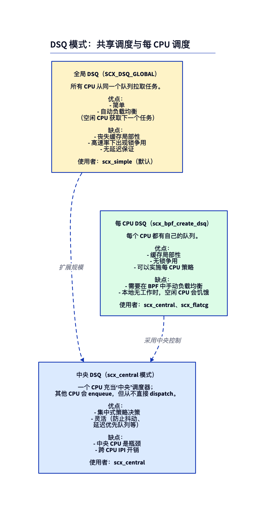
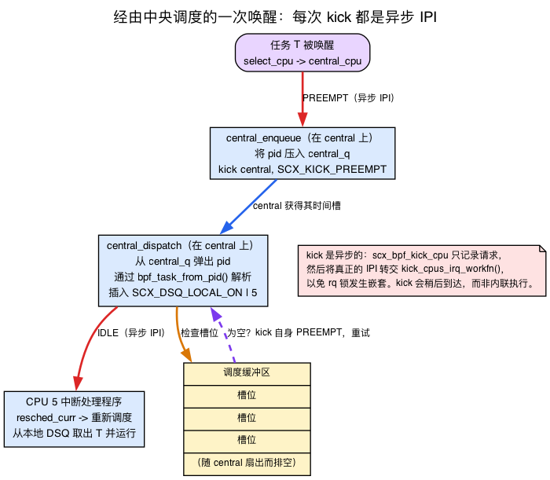
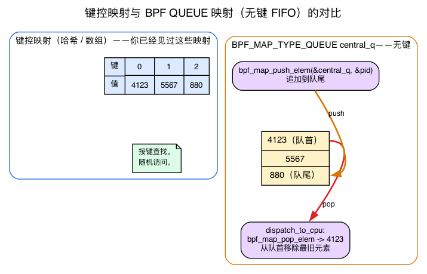
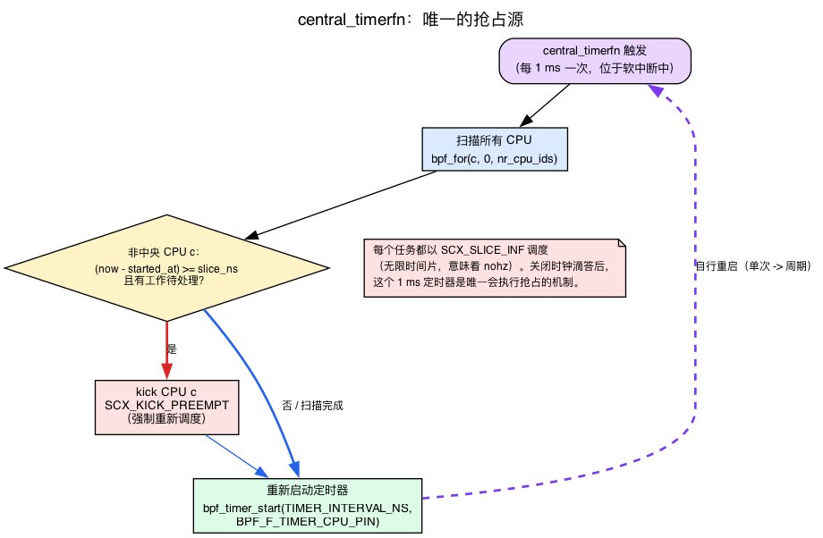
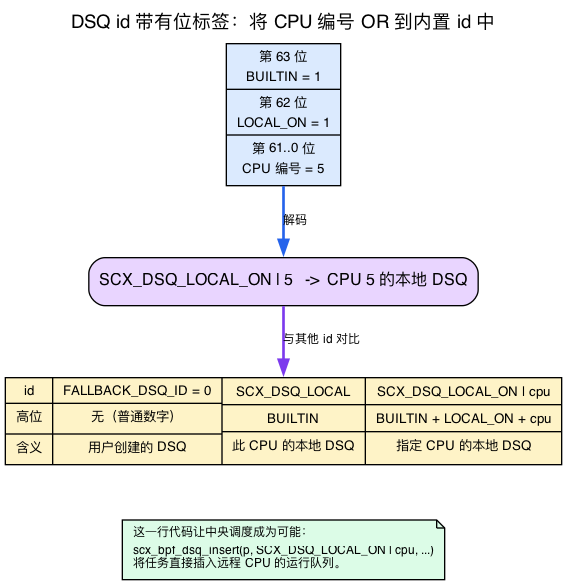
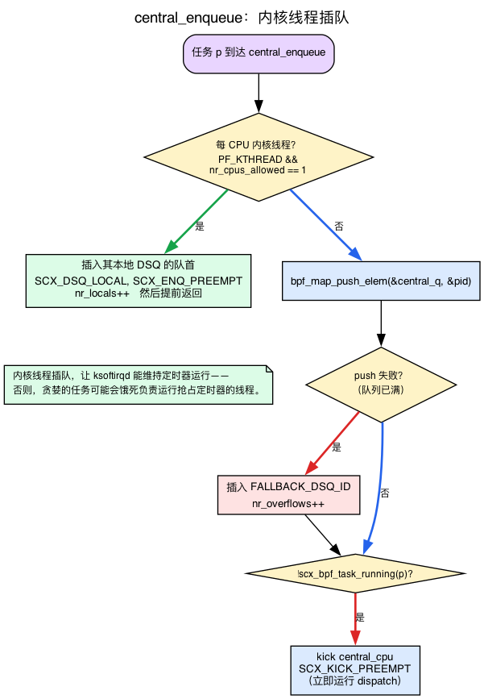

# 第27天 — scx_central：阅读一个真实的 BPF 调度器

> **今日任务：** 阅读 `scx_central.bpf.c`——一个更复杂的 sched_ext 调度器，采用中心化调度（central-dispatch）架构。学习真实调度器所依赖的跨 CPU 机制：IPI 究竟是什么、`scx_bpf_kick_cpu` 的三种变体、BPF 队列映射、BPF 定时器与无节拍（tickless）抢占、DSQ id 如何编码目标 CPU、为什么每 CPU 内核线程要插队，以及派发缓冲区的批处理上限。理解经验丰富的 sched_ext 作者所使用的模式。总用时：约 110 分钟。以阅读为主，编码较少。

## 为什么要读这个例子

`scx_simple`（第25–26天）具有示范性但很简单。它把所有任务都派发到一个共享队列，按 vtime 排序——只是 CFS 等效公平性之上的一层薄壳。`scx_central` 是更进一步的例子：更贴近现实。它处理每 CPU 派发队列、跨 CPU 协调、中心化调度决策，以及无节拍抢占等，这些都是你写一个真实调度器第一天就会遇到的细节。

阅读别人写的代码——*并理解他们为什么这样写*——是一项与自己写代码不同的技能。今天就是练这项技能的。

但有一个难点。真正的 `scx_central.bpf.c` 依赖五种此前任何一天都没有教过的机制：处理器间中断（inter-processor interrupt）、BPF 队列映射、BPF 定时器、`SCX_DSQ_LOCAL_ON | cpu` id 技巧，以及针对内核线程的一种前向进展保证（forward-progress）技巧。如果你直接打开这个文件，会遇到二十行完全没有背景知识支撑的代码。所以今天的结构是*先讲背景，再读文件*。我们先用直觉讲解每种机制，再指出它在源码中具体生效的那一行。

## DSQ 模式：三种架构



在树内示例中出现了三种架构：

### 1. 全局 DSQ（scx_simple）

一个队列，所有 CPU 都从中取任务。写起来简单。但存在缓存局部性问题（任何任务都可能在任何 CPU 上运行）以及规模化后的锁竞争。适合 CPU 数量较少的系统或调度频率较低的场景。这正是你在第25天读到的 `scx_simple`——所有任务都进入 `SHARED_DSQ`，每个 CPU 的 `dispatch` 都从中取任务。

### 2. 每 CPU DSQ

每个 CPU 拥有自己的队列。任务被直接插入到它应当运行的那个 CPU 上；各 CPU 只从自己的队列中取任务。缓存局部性极佳。跨 CPU 协调则需要显式逻辑——当一个 CPU 的队列为空、而另一个的队列已满时，空闲的那个需要“偷”工作。这正是 CFS 在 C 语言中用复杂的负载均衡逻辑所做的事情。

### 3. 中心化 DSQ（scx_central）

指定一个 CPU 为*中心（central）*。其他 CPU 只从各自的每 CPU DSQ 中消费任务。中心 CPU 代替所有 CPU 运行派发逻辑——处理入队、决定每个任务应当去往哪个 CPU，并在新任务到达时向目标 CPU 发送 IPI，促使它重新调度。

这听起来像是一个瓶颈——它确实是——但中心化架构是用吞吐量换取**简单性**。所有调度决策都集中在一处；不需要跨 CPU 协调逻辑；中心 CPU 只是一个单线程决策者。对于研究型工作负载或专门化调度（反抖动、延迟优先队列、团组调度），这往往是构建正确调度器最简单的路径。

“向目标 CPU 发送 IPI，促使它重新调度”这句话包含了大量信息，而此前还没有解释过其中的机制。整个中心化设计都建立在“由谁通知哪个 CPU、使用什么标志”之上，因此我们先从这里讲起。

## 背景知识 1 — IPI 与三种“踢”的方式

### 什么是 IPI

有一个事实很容易被忽略，因为大多数代码从不需要面对它：**在多核机器上，CPU A 不能直接在 CPU B 上运行代码。** 一个 CPU 只能执行它面前的指令流。如果 CPU 0 决定“CPU 5 应该停下手头的事情去重新调度”，CPU 0 没有办法通过写一个变量就让这件事在 CPU 5 上发生。

真正能让一个 CPU 通知另一个 CPU 的硬件机制叫做 **IPI（处理器间中断，inter-processor interrupt）。** CPU 0 向中断控制器写入指令，说“在 CPU 5 上触发一个中断”。CPU 5 的硬件陷入内核的中断处理程序，*那个处理程序*——运行在 CPU 5 上——完成实际工作——在我们的场景里，就是把当前任务标记为需要重新调度，于是 CPU 5 会选一个新任务来运行。IPI 是整个中心化设计所依赖的跨 CPU 协调原语。本章每次说“踢一个 CPU”，指的都是“给那个 CPU 发一个 IPI，让它重新进入调度器”。

### `scx_bpf_kick_cpu`——以及为什么它是异步的

你的调度器调用的 kfunc 是 `scx_bpf_kick_cpu(cpu, flags)`。v7.1 中的签名位于 `kernel/sched/ext.c:8945`：

```c
/* kernel/sched/ext.c:8945 */
__bpf_kfunc void scx_bpf_kick_cpu(s32 cpu, u64 flags, const struct bpf_prog_aux *aux)
```

（`aux` 是内核注入的隐藏隐式参数；从 BPF 侧你只需调用 `scx_bpf_kick_cpu(cpu, flags)`。）

这里有一个细节，能解释这个文件很多地方为何这样设计：**踢并不是在 kfunc 内部同步发生的。** 你是从 `enqueue` 或 `dispatch` 内部调用它的，而这两处已经持有了当前 CPU 的运行队列锁。如果发送 IPI 并立即处理它，会有嵌套持有运行队列锁并导致死锁的风险。因此，这个 kfunc 只会*记录*请求，并把实际工作交给稍后执行的本地 irq_work（也就是把 `kick_cpus_irq_workfn` 排入*调用方*所在 CPU 的队列）。注释在 `kernel/sched/ext.c:8902` 处写得很明确：

```c
/* kernel/sched/ext.c:8902 */
/* Actual kicking is bounced to kick_cpus_irq_workfn() to avoid nesting
 * rq locks ... */
```

延迟执行的处理函数 `kick_cpus_irq_workfn`（`kernel/sched/ext.c:7906`）随后遍历所有待处理的 CPU，对每个目标调用 `resched_curr`，具体通过 `kick_one_cpu()` / `kick_one_cpu_if_idle()` 完成——这才是真正发送跨 CPU 重新调度 IPI 的地方，也就是那个标记“你需要重新调度”的函数。所以整个模型是：*你发起请求；踢会在稍后异步落地。* 每次看到 `scx_bpf_kick_cpu` 调用时都要记住这一点——它是投递到队列中的一个请求，而不是一次瞬时的上下文切换。

### 三个标志——它们是不同的策略

`flags` 不是一个是/否的开关。三个 `SCX_KICK_*` 位编码了真正不同的策略。它们的定义以及内核自己的注释位于 `kernel/sched/ext_internal.h`：

```c
/* kernel/sched/ext_internal.h:1201 */
SCX_KICK_IDLE     = 1LLU << 0,   /* nudge only if the CPU is idle / going idle; noop otherwise */
/* kernel/sched/ext_internal.h:1209 */
SCX_KICK_PREEMPT  = 1LLU << 1,   /* clear the running task's slice to 0 so dispatch runs NOW */
/* kernel/sched/ext_internal.h:1217 */
SCX_KICK_WAIT     = 1LLU << 2,   /* block until the target's current SCX task switches out */
```

- **`SCX_KICK_IDLE`**——只有当 CPU 是空闲的（或即将空闲）时才唤醒它。如果目标 CPU 本来就会自行重新调度，这就是一个空操作。当你已经*给*某个 CPU 分配了工作，只是想让它注意到，而在它已经在忙于有用的事情时又不想打扰它时，使用这个标志。
- **`SCX_KICK_PREEMPT`**——强制执行。内核会把当前正在运行的 SCX 任务的 `->scx.slice` 清零，让该任务立即“到期”，派发路径*立刻*运行。当你需要派发马上发生时使用它——例如刚有新任务到达，中心 CPU 必须立即处理。
- **`SCX_KICK_WAIT`**——调用只有在目标 CPU 当前运行的 SCX 任务切出后才会返回。这是给团组/核心调度（gang/core scheduling）用的，此时你需要确认某个兄弟 CPU 确实已经让出。`scx_central` 没有使用它；你应该知道它的存在。

**PREEMPT/WAIT 与 IDLE 互斥。** 把 `SCX_KICK_IDLE` 与两者之一相或是一种误用，内核会为此触发 `scx_error`：

```c
/* kernel/sched/ext.c:8909 */
if (unlikely(flags & (SCX_KICK_PREEMPT | SCX_KICK_WAIT)))
    scx_error(sch, "PREEMPT/WAIT cannot be used with SCX_KICK_IDLE");
```

还有一个较早的要点列表说错的标志值：**`flags == 0` 并不是“仅在空闲时踢”。** 零意味着一次无条件的重新调度踢，没有任何特殊策略——既没有仅空闲限制，也没有片段清零式抢占。`scx_central` 恰好只使用了一次纯粹的 `0`，在 `init` 中（`tools/sched_ext/scx_central.bpf.c:355`），纯粹是为了引导中心 CPU 进入它的第一次派发：

```c
/* scx_central.bpf.c:355, in central_init */
scx_bpf_kick_cpu(central_cpu, 0);
```

现在你可以阅读文件中每一处踢的调用位置，并明白*它为什么选了那个标志*：

| 调用位置 | 标志 | 原因 |
|---|---|---|
| `central_enqueue` （`:131`） | `SCX_KICK_PREEMPT` | 新任务已入队——让中心尽快运行派发 |
| `dispatch_to_cpu` （`:174`） | `SCX_KICK_IDLE` | 刚给远端 CPU 喂了工作——只在它空闲时唤醒，不打扰忙碌的 CPU |
| `central_dispatch` 自我重试 （`:251`） | `SCX_KICK_PREEMPT` | 派发缓冲区在扇出过程中耗尽——踢自己，用新的缓冲区重试（见背景知识 6） |
| 非中心派发分支 （`:273`） | `SCX_KICK_PREEMPT` | 某个 CPU 已经没活干了——强制中心立即重新填充它 |
| `central_timerfn` （`:328`） | `SCX_KICK_PREEMPT` | 某个 CPU 超出了它的时间片——抢占它 |
| `central_init` （`:355`） | `0` | 一次性引导踢，启动中心循环 |



## 背景知识 2 — BPF 队列映射

从 `enqueue` 到 `dispatch` 的交接，在 `scx_central` 中并不经过 DSQ，而是经过一个名为 `central_q` 的 **BPF 队列映射**。此前没有任何一天教过队列映射——第12–13天讲的是 ringbuf 和数组，第21天讲的是 kptr——所以现在补上。

`BPF_MAP_TYPE_QUEUE`（`include/uapi/linux/bpf.h:1036`）是一个**只有值、没有键的 FIFO**。与你已经了解的哈希映射和数组映射不同，它**没有键**。你不是查找某个东西，而是把一个值推到队尾，把最旧的那个从队首弹出：

- `bpf_map_push_elem(&q, &val, flags)`——追加一个值。
- `bpf_map_pop_elem(&q, &val)`——移除并返回最旧的值。
- `bpf_map_peek_elem(&q, &val)`——查看最旧的值但不移除它。

（uapi 头文件在 `include/uapi/linux/bpf.h:589`、`:598`、`:605` 处描述了 QUEUE/STACK 的 push/pop/peek 语义。`BPF_MAP_TYPE_STACK`（`:1037`）是它的 LIFO 姊妹——同样的 API，弹出的是最新的而不是最旧的。）



在 `scx_central` 中，这个队列声明在文件顶部，用来存放原始的 `s32` pid，深度为 4096：

```c
/* scx_central.bpf.c:70 */
struct {
    __uint(type, BPF_MAP_TYPE_QUEUE);
    __uint(max_entries, 4096);
    __type(value, s32);
} central_q SEC(".maps");
```

有两个值得注意的设计选择：

- **它存储的是 pid，而不是任务指针。** 如果在 enqueue→dispatch 边界之间持有一个带引用计数的 `task_struct`，就意味着需要获取和释放引用（第21天讲过的 kptr 舞步）。存储一个裸的 `s32` pid 就完全绕开了这个问题；pid 只在弹出时才通过 `bpf_task_from_pid()`（`:145`）解析回任务。
- **为什么要用队列映射，而不是 DSQ？** 文件顶部的注释相当坦率（`scx_central.bpf.c:3`）：通过一个全局 BPF 队列来中转“并不是最直截了当的做法……本来经过每 CPU 的 BPF 队列会更容易。**目前这种设计的选择是为了最大程度地利用并验证各种 SCX 机制。**”换句话说，`scx_central` 的一部分作用就是*测试* SCX 特性。一个更实用的调度器会做得更简单一些。

推入和弹出正是这次交接的字面骨架：

```c
/* scx_central.bpf.c:122, in central_enqueue */
if (bpf_map_push_elem(&central_q, &pid, 0)) {
    __sync_fetch_and_add(&nr_overflows, 1);
    scx_bpf_dsq_insert(p, FALLBACK_DSQ_ID, SCX_SLICE_INF, enq_flags);
    return;
}
```

```c
/* scx_central.bpf.c:140, in dispatch_to_cpu */
if (bpf_map_pop_elem(&central_q, &pid))
    break;
```

**始终检查 `bpf_map_push_elem` 的返回值。** 如果队列已满（深度为 4096），push 就会失败。这时，`scx_central` 会回退到用户 DSQ `FALLBACK_DSQ_ID`，并递增 `nr_overflows`。这个回退 DSQ *只是*溢出路径——只在这里的 push 失败时（`:122`）以及另一处任务无法在目标 CPU 上运行时（`:157`，即 cpumask 不匹配）使用。正常路径始终是先入队，再从队首取出。

## 背景知识 3 — BPF 定时器与无节拍抢占

这里有一个谜题。`scx_central` 用**无限时间片**——`SCX_SLICE_INF`，字面上就是 `U64_MAX`——来派发*每一个*任务：

```c
/* include/linux/sched/ext.h:32 */
SCX_SLICE_INF = U64_MAX,   /* infinite, implies nohz */
```

一个拥有无限时间片的任务永远不会自行到期。那到底是什么在抢占它？在普通调度器中，一个周期性的**调度器时钟节拍（tick）**每秒在每个 CPU 上触发 `HZ` 次，强制正在运行的任务让出。但 `scx_central` 是为**无节拍运行**而构建的：在 `CONFIG_NO_HZ_FULL` 内核上，一个只运行单个任务的 CPU 可以完全停止其周期性时钟节拍以降低开销（你可以在 `/proc/interrupts` 中看到时钟中断数逐渐减少）。文件顶部的注释在 `scx_central.bpf.c:16` 处点明了这一点。

如果时钟节拍关闭了，且时间片是无限的，那抢占就必须来自别处。那个别处就是一个 **BPF 定时器**。

### 什么是 BPF 定时器

`bpf_timer` 是一种可由 BPF 代码启动的内核 `hrtimer`。它的生命周期分为三个步骤，记录在 `kernel/bpf/helpers.c:1148`：

```c
/* kernel/bpf/helpers.c, comment block ~1143 */
/* bpf_timer_init() allocates 'struct bpf_hrtimer', inits hrtimer ...
 * bpf_timer_set_callback() ... assign bpf callback_fn.
 * bpf_timer_start() arms the timer. */
```

写成代码就是：`bpf_timer_init(&t, &map, CLOCK_MONOTONIC)`，然后 `bpf_timer_set_callback(&t, fn)`，然后 `bpf_timer_start(&t, interval_ns, flags)`。回调函数会在*稍后*触发，处于软中断（softirq）/定时器上下文——而不是在调用点内联执行。有一条硬性规则：**`struct bpf_timer` 必须存在于一个映射值内部。** uapi 结构体只是一个占位符；内核会在其背后分配真正的 `bpf_hrtimer`，这发生在 `bpf_timer_init` 期间，由映射拥有它。这就是为什么 `scx_central` 把它的定时器包在一个单元素数组映射里：

```c
/* scx_central.bpf.c:80 */
struct central_timer {
    struct bpf_timer timer;
};
struct {
    __uint(type, BPF_MAP_TYPE_ARRAY);
    __uint(max_entries, 1);
    __type(key, u32);
    __type(value, struct central_timer);
} central_timer SEC(".maps");
```

`init` 完成 init + set_callback（`:352`–`:353`），再由 `start_central_timer()` 启动定时器。间隔为 `TIMER_INTERVAL_NS = 1 * MS_TO_NS`——**1 毫秒**。

### 回调自行重启定时器的技巧

`bpf_timer_start` 启动的是一个*一次性*定时器。要得到*周期性*的 1 毫秒节拍，回调函数必须在末尾重新启动定时器：

```c
/* scx_central.bpf.c:331, last lines of central_timerfn */
bpf_timer_start(timer, TIMER_INTERVAL_NS, BPF_F_TIMER_CPU_PIN);
__sync_fetch_and_add(&nr_timers, 1);
```

每隔 1 毫秒，`central_timerfn`（`:293`）就会被唤醒，扫描所有 CPU，对每一个非中心 CPU 检查：正在运行的任务是否已经超出了它的 `slice_ns`，以及是否有工作待处理。如果是，就用 `SCX_KICK_PREEMPT`（`:328`）踢那个 CPU，强制它重新调度。**这个定时器是这个调度器中*唯一*的抢占来源**——没有它，每个 CPU 上抢到的第一个任务就会永远运行下去。



### 一个值得借鉴的优雅降级模式

启动定时器时使用了 `BPF_F_TIMER_CPU_PIN`（`include/uapi/linux/bpf.h:7665`），它会把定时器固定在调用方所在的 CPU 上，使其留在中心 CPU：

```c
/* scx_central.bpf.c:198, in start_central_timer */
ret = bpf_timer_start(timer, TIMER_INTERVAL_NS, BPF_F_TIMER_CPU_PIN);
```

但 `BPF_F_TIMER_CPU_PIN` 是新特性（≥6.7）。在较旧的内核上，`bpf_timer_start` 会返回 `-EINVAL`。`scx_central` 没有直接失败，而是不带钉住标志重试，并记住了这一点：

```c
/* scx_central.bpf.c:206 */
if (ret == -EINVAL) {
    timer_pinned = false;
    ret = bpf_timer_start(timer, TIMER_INTERVAL_NS, 0);
}
```

而且因为一个未钉住的定时器可能会在错误的 CPU 上运行，`central_timerfn` 在运行时（`:300`）防御性地做了检查，如果发现自己不在中心 CPU 上就报错退出。这是一种 CO-RE 风格的“有新特性就用，没有就干净回退”的模式——注释里甚至感叹说这里因为枚举没有命名，所以无法使用 `bpf_core_enum_value_exists()`。

## 背景知识 4 — 把目标 CPU 编码进 DSQ id

在第25天你了解到 DSQ id 是用来命名队列的：`SCX_DSQ_GLOBAL`、`SCX_DSQ_LOCAL`，以及你用 `scx_bpf_create_dsq` 创建的自定义数字 DSQ。你还没学到的是，这个 id 空间带有**位标记**；可以把 CPU 编号与某个内建 id 按位或，从而指向*远端* CPU 的队列。这个技巧正是“中心决定每个任务在哪运行”的核心所在。

这个 id 是一个 64 位的值。第 63 位是一个标志，标记该 id 是*内建*的，而不是用户创建的数字 DSQ：

```c
/* include/linux/sched/ext.h:54 */
SCX_DSQ_FLAG_BUILTIN  = 1LLU << 63,
SCX_DSQ_FLAG_LOCAL_ON = 1LLU << 62,
/* :58 */ SCX_DSQ_GLOBAL   = SCX_DSQ_FLAG_BUILTIN | 1,
/* :59 */ SCX_DSQ_LOCAL    = SCX_DSQ_FLAG_BUILTIN | 2,
/* :61 */ SCX_DSQ_LOCAL_ON = SCX_DSQ_FLAG_BUILTIN | SCX_DSQ_FLAG_LOCAL_ON,
```

于是：

- **用户 DSQ**（比如这里的 `FALLBACK_DSQ_ID = 0`，或第25天的 `SHARED_DSQ`）是高位*清零*的普通小数字。
- **`SCX_DSQ_LOCAL`** 意味着“*我当前所在*的 CPU 的本地 DSQ”。这正是 `scx_simple` 一直使用的方式。
- **`SCX_DSQ_LOCAL_ON`** 是它的参数化版本：它置位第 62 位，你再把**目标 CPU 编号**或进低位。`SCX_DSQ_LOCAL_ON | 5` 意味着“**CPU 5** 的本地 DSQ”——一个*特定的、可能是远端的* CPU。



正是这一行代码让中心化派发成为可能。中心 CPU 把一个任务直接插入到*另一个* CPU 的本地运行队列，然后踢它：

```c
/* scx_central.bpf.c:171, in dispatch_to_cpu */
scx_bpf_dsq_insert(p, SCX_DSQ_LOCAL_ON | cpu, SCX_SLICE_INF, 0);
```

与第25/26天的 `scx_simple` 形成对比——它只会通过 `scx_bpf_dsq_move_to_local` 把任务移动到*当前* CPU 的本地 DSQ。一个每 CPU 调度器永远不需要 `LOCAL_ON | cpu`，因为它只会碰自己的队列。中心调度需要它，因为它是*为每一个* CPU 从一处做决策。（一个例外：每 CPU 内核线程，中心会把它们插入到 `SCX_DSQ_LOCAL`——即当前 CPU 的队列——在 `:117` 处；下文详述。）

## 背景知识 5 — 每 CPU 内核线程与前向进展保证陷阱

这是下面简化伪代码所隐藏的最大一件事，而且它是一个*正确性*要求，而非优化。当你打开真实的 `central_enqueue` 时，会发现它**根本不会**把每 CPU 内核线程通过 `central_q` 推送出去。要理解为什么，需要两个新概念。

**什么是 kthread。** *kthread*（内核线程）是一个没有用户空间地址空间的任务，以 `PF_KTHREAD` 标记在 `p->flags` 中：

```c
/* include/linux/sched.h:1779 */
#define PF_KTHREAD  0x00200000  /* I am a kernel thread */
```

有些 kthread 是**每 CPU**的：被钉死在唯一一个 CPU 上（`p->nr_cpus_allowed == 1`），用来做那个 CPU 的日常维护工作。`ksoftirqd/N` 就是典型例子——它处理 CPU N 的软中断积压。

**前向进展保证陷阱，中心化派发独有。** 回想背景知识 3：*唯一*抢占任务的东西就是那个 BPF 定时器。而 BPF 定时器是在**软中断上下文中触发的——它可能是从 `ksoftirqd` 运行的。** 现在设想这个死锁场景：一个贪婪的用户任务霸占着一个 CPU。本该抢占它的定时器需要 `ksoftirqd` 运行才能触发。但 `ksoftirqd` 也只是一个普通任务——如果中心调度器把它排在那个同样的贪婪用户任务后面，`ksoftirqd` 就无法运行，定时器就无法触发，于是没有任何东西能抢占那个用户任务，`ksoftirqd` 也就永远运行不了。调度器把自己卡死了。

解决办法：每 CPU 内核线程**完全跳过中心队列**，带着一个入队时抢占标志直接插到自己 CPU 本地 DSQ 的队首，保证它们总是能压过用户线程：

```c
/* scx_central.bpf.c:115 */
if ((p->flags & PF_KTHREAD) && p->nr_cpus_allowed == 1) {
    __sync_fetch_and_add(&nr_locals, 1);
    scx_bpf_dsq_insert(p, SCX_DSQ_LOCAL, SCX_SLICE_INF,
                       enq_flags | SCX_ENQ_PREEMPT);
    return;
}
```

**`SCX_ENQ_PREEMPT` 是一个*入队*标志，而不是踢的标志。** 它随着 DSQ 插入操作一起生效，意味着“抢占该本地 DSQ 所在 CPU 上正在运行的任何任务，来运行这个任务”。不要把它和背景知识 1 中的 `SCX_KICK_*` 标志混淆——那些是通过 IPI 面向一个 CPU 的；这个则是插入操作本身的一个属性：

```c
/* kernel/sched/ext_internal.h:1107 */
SCX_ENQ_PREEMPT = 1LLU << 32,
```



> **常见疑问**
>
> **问：如果中心 CPU 是瓶颈，为什么不像每 CPU 调度器那样在每个 CPU 上都运行 `dispatch`？**
> 答：可以——这正是 `scx_layered`/`scx_lavd` 所做的，也正是文件自己顶部注释中“更实用的实现”所指的意思。代价是跨 CPU 协调逻辑：工作窃取、每 CPU 加锁、决定谁给谁补充任务。中心化用一个 CPU 的吞吐量换取*所有*策略都集中在一个单线程的地方，这样更容易保证正确性。这对研究型和专门化调度来说是正确的选择，但不适合追求最大调度速率的场景。
>
> **问：为什么在 `central_q` 中存储 pid 而不是任务指针？**
> 答：`task_struct *` 是带引用计数的——在 enqueue→dispatch 边界之间持有一个，就意味着第21天讲过的 kptr 获取/释放舞步。一个裸的 `s32` pid 完全绕开了引用计数；只有从队列中取出 pid 时，才通过 `bpf_task_from_pid()`（`:145`）将其解析回任务。

**还有一个 vtable 标志由此得到了解释：`SCX_OPS_ENQ_LAST`。** 默认情况下，内核可以*跳过*对某个 CPU 上最后一个可运行任务调用你的 `enqueue`——这是一种优化，因为没什么可以选择的了。但中心调度把*所有*决策都揽了过去，所以“作为最后一个任务”并没有什么特殊意义；它仍然必须走中心的逻辑。设置 `SCX_OPS_ENQ_LAST`（`kernel/sched/ext_internal.h:130`）强制即使是最后一个任务也调用 `enqueue`。vtable 中的注释在 `scx_central.bpf.c:366` 处解释了这一点。

## 背景知识 6 — 派发缓冲区与 `scx_bpf_dispatch_nr_slots()`

最后一种机制。当你调用 `scx_bpf_dsq_insert` 时（调用发生在 `dispatch()` 回调内部），**它不会立即提交。** 插入操作被暂存在一个有界的每 CPU **派发缓冲区**中，之后由核心代码统一刷新。`scx_bpf_dispatch_nr_slots()`（`kernel/sched/ext.c:8448`）返回在这个缓冲区满之前，你还剩下多少可暂存的插入操作。

让它溢出是**致命的**——核心代码会抛出一个错误：

```c
/* kernel/sched/ext.c:8139 */
scx_error(sch, "dispatch buffer overflow");
```

对于大多数调度器来说，这从来都不是问题：它们每次调用只派发一两个任务。但 `scx_central` 在*一次*遍历中为*每个 CPU*都做派发，通过它的 `bpf_for` 循环，所以它很容易在扇出过程中耗尽缓冲区。这就是为什么循环会检查槽位并中止：

```c
/* scx_central.bpf.c:230, in central_dispatch */
if (!scx_bpf_dispatch_nr_slots())
    break;
```

也正因如此，在扇出之后，中心 CPU 可能已经跳过了一些 CPU，*而且*还没来得及为自己派发。这里的重试模式是“我没能完成；安排自己稍后用一个全新的缓冲区再试一次”——这正好回接到背景知识 1：

```c
/* scx_central.bpf.c:249 */
if (!scx_bpf_dispatch_nr_slots()) {
    __sync_fetch_and_add(&nr_retries, 1);
    scx_bpf_kick_cpu(central_cpu, SCX_KICK_PREEMPT);   /* kick self, retry */
    return;
}
```

`dispatch_to_cpu` 中不匹配的分支也检查了槽位（`:165`），原因相同：它刚刚把一个任务推到了回退 DSQ，却没能满足目标 CPU 的需求，所以它必须在下一次插入失败之前停下来。

## 阅读 `scx_central.bpf.c`

现在你已经掌握了这个文件用到的每一种机制。打开 `tools/sched_ext/scx_central.bpf.c`——约 380 行——按这个顺序通读：**全局变量 → init → select_cpu → enqueue → dispatch → vtable。**

### 仓库实验：构建并运行完全一致的上游调度器

和第25天一样，本实验运行的是*未经修改*的树内 `scx_central`。`make -C
ebpf/labs day27` 会从锁定的 Linux v7.1 源码树构建它，并使用内核自己的
`tools/sched_ext` Makefile，产物输出在 `.output/` 下：

{{#include ../labs/day27/build.sh:book}}

`run.sh` 会在一个可丢弃的、支持 sched_ext 的虚拟机上，把它加载运行有限的一段时间，
然后卸载它——因为中心化派发调度器是从一个 CPU 驱动所有其他 CPU 的，所以它
严格是可选启用的：

{{#include ../labs/day27/run.sh:book}}

> **提示：下面的代码块是*简化过的伪代码*，并非文件的字面引用。** 它们捕捉的是中心化派发的*大致形状*，方便你跟上逻辑；真实的 `scx_central.bpf.c` 使用了一个存放 pid 的 `central_q` 队列映射、每 CPU 内核线程绕行、`SCX_DSQ_LOCAL_ON | cpu` 目标定位、槽位检查以及一个 `bpf_timer`——这些都在上面的背景知识小节中教过了，每个 `### N` 小节的走读都交叉链接到了相应的背景知识。先读简化版本获得直觉，再读真实文件了解细节。

### 1. 全局变量

看文件顶部附近：

```c
const volatile s32 central_cpu;        /* which CPU is "central" — set from userspace */
const volatile u32 nr_cpu_ids = 1;     /* number of CPUs; !0 for veristat, set during init */
const volatile u64 slice_ns;           /* per-task slice the timer enforces */
```

`central_cpu` 在挂载（attach）时由用户空间设置。除了这些之外，你还会看到 `central_q` 队列映射（背景知识 2）、`central_timer` 数组映射（背景知识 3），以及一堆 `u64` 计数器（`nr_total`、`nr_queued`、`nr_overflows`、`nr_timers`、`nr_retries`……），用户空间驱动程序会把它们打印为统计信息。

### 2. `init` 回调

```c
s32 BPF_STRUCT_OPS_SLEEPABLE(central_init)
{
    scx_bpf_create_dsq(FALLBACK_DSQ_ID, -1);   /* the overflow DSQ */
    bpf_timer_init(timer, &central_timer, CLOCK_MONOTONIC);
    bpf_timer_set_callback(timer, central_timerfn);
    scx_bpf_kick_cpu(central_cpu, 0);          /* bootstrap central's first dispatch */
    return 0;
}
```

它完成三项工作：创建回退 DSQ、设置定时器（但暂不启动），以及发出一次普通的 `flags=0` 踢，促使中心 CPU 进入第一次派发。由于 `scx_bpf_create_dsq` 是可睡眠的 kfunc，这个回调必须使用 `BPF_STRUCT_OPS_SLEEPABLE`，而不能使用普通的 `BPF_STRUCT_OPS`，否则程序无法加载。定时器要等到稍后的第一次派发，才会在 `start_central_timer()` 中真正*启动*（背景知识 3）。

### 3. `select_cpu` 回调

```c
s32 BPF_STRUCT_OPS(central_select_cpu, struct task_struct *p, ...)
{
    /* Always steer to central_cpu. */
    return central_cpu;
}
```

当一个任务醒来时，把它引导到中心 CPU。**这就是关键的反转**：在 `scx_simple` 中，任务醒来时会在上次运行它的那个 CPU 上。而在 `scx_central` 中，任务醒来时会去中心 CPU，好让它完成所有派发工作。真实的注释指出这样做是安全的，因为 `select_cpu` 只是一个*提示*——如果 `p` 不能在中心 CPU 上运行，内核会自动选择一个回退方案。

### 4. `enqueue` 回调

```c
void BPF_STRUCT_OPS(central_enqueue, struct task_struct *p, u64 enq_flags)
{
    /* (real file) per-CPU kthreads jump the queue — see Background 5 */
    /* push the pid into the central queue; central CPU will pick it up */
    bpf_map_push_elem(&central_q, &pid, 0);   /* on failure: fallback DSQ + nr_overflows++ */

    /* make sure central CPU is awake to handle this */
    if (!scx_bpf_task_running(p))
        scx_bpf_kick_cpu(central_cpu, SCX_KICK_PREEMPT);
}
```

真实的 `central_enqueue`（`:103`）依次做三件事：每 CPU 内核线程绕行（背景知识 5）、把 pid 通过 `bpf_map_push_elem` 推入 `central_q`（带有回退 DSQ 溢出路径，背景知识 2），最后——仅当 `p` 尚未在运行时——在中心 CPU 上发出一次 `SCX_KICK_PREEMPT`，让派发尽快运行（背景知识 1）。它用 `!scx_bpf_task_running(p)` 作为条件，避免在任务已经在某个 CPU 上运行时进行多余的踢。

### 5. `dispatch` 回调

```c
void BPF_STRUCT_OPS(central_dispatch, s32 cpu, struct task_struct *prev)
{
    if (cpu == central_cpu) {
        start_central_timer();
        bpf_for(c, 0, nr_cpu_ids) {
            if (!scx_bpf_dispatch_nr_slots())   /* Background 6 */
                break;
            /* if CPU c asked for work, pop a pid from central_q,
             * resolve it, and insert into SCX_DSQ_LOCAL_ON | c, then
             * kick c with SCX_KICK_IDLE */
            dispatch_to_cpu(c);
        }
        /* ran out of slots? kick self with PREEMPT and retry */
        /* otherwise dispatch one task for central itself */
    } else {
        /* non-central CPU: try the fallback DSQ; if dry, set gimme=true
         * and kick central with PREEMPT to refill me */
    }
}
```

只有 `central_cpu` 上的 `dispatch` 调用会执行实质工作。它在第一次进入时启动定时器（背景知识 3），通过 `dispatch_to_cpu` 扇出给每一个请求了工作的 CPU（背景知识 4 + 6），如果派发缓冲区耗尽就通过踢自己来重试（背景知识 6 + 1），然后再为自己派发一个任务。一个已经没活干的非中心 CPU 只是设置 `gimme = true`，并用 `SCX_KICK_PREEMPT`（`:273`）踢中心 CPU 来给自己补充任务。

### 6. 虚函数表（vtable）

```c
SCX_OPS_DEFINE(central_ops,
               .flags      = SCX_OPS_ENQ_LAST,   /* Background 5 */
               .select_cpu = (void *)central_select_cpu,
               .enqueue    = (void *)central_enqueue,
               .dispatch   = (void *)central_dispatch,
               .running    = (void *)central_running,
               .stopping   = (void *)central_stopping,
               .init       = (void *)central_init,
               .exit       = (void *)central_exit,
               .name       = "central");
```

树内调度器并不手写一个 `SEC(".struct_ops.link") struct sched_ext_ops`。它们使用 `SCX_OPS_DEFINE(...)` 宏（来自 `tools/sched_ext/include/scx/compat.bpf.h`），这个宏会展开成正是那样的一个 `SEC(".struct_ops.link")` 结构体，它会创建一个生命周期绑定到用户空间进程的链接 FD（该进程退出时它就关闭）。注意真实文件设置了 `.flags = SCX_OPS_ENQ_LAST`（背景知识 5），并加入了 `.running`、`.stopping` 和 `.exit` 回调：`running`/`stopping` 记录每 CPU 的 `started_at` 时间戳（`:277`、`:285`），这样定时器就能判断一个任务是否已经超出了它的时间片；`exit` 则为用户空间记录退出信息。

## 为什么中心化架构可行

中心 CPU 是*调度决策*的瓶颈，但**不是实际任务执行的瓶颈**。任务在每个 CPU 上运行；被中心化的只是*在哪运行的决策*。对于以下这类工作负载：

- 总的调度速率是有界的（每个中心 CPU 每秒数十万到几百万次决策）。
- 调度逻辑受益于全局状态（中心 CPU 能看到所有决策，可以应用全局策略）。
- *运行中*任务的缓存局部性比*调度过程本身*的缓存局部性更重要。

……这样的设计用一个 CPU 的开销换取了更简单、更正确的调度逻辑。

如果工作负载的调度速率超出单个 CPU 的承载能力，就需要采用每 CPU 派发器（例如真正面向生产环境的 `scx_layered`、`scx_lavd`）。文件顶部的注释也指出：“更实用的实现很可能会把调度循环移到中心 CPU 的 dispatch() 路径之外，并加入某种形式的优先级机制。”

## scx_flatcg — 下一步阅读

如果你还想继续深入，可以打开 `tools/sched_ext/scx_flatcg.bpf.c`。约 950 行。与 scx_central 形状相同，但带 cgroup 感知：每个 cgroup 都有自己的 DSQ；vtime 是按 cgroup 计算的；派发时优先挑选 vtime 最低的 cgroup。

这更接近真实的“公平共享 + 隔离”调度器的样子——就像带 cgroup 感知的 CFS，只不过是用 BPF 写的。

## 在内核中该读什么

- **`tools/sched_ext/scx_central.bpf.c`**——我们刚刚走读过的文件。以图示和六个背景知识小节为向导，从头到尾读一遍。特别留意 `central_enqueue`（`:103`）、`dispatch_to_cpu`（`:134`）、`central_dispatch`（`:219`）以及 `central_timerfn`（`:293`）。

- **`tools/sched_ext/scx_central.c`**——用户空间驱动程序。约 125 行。注意它如何在挂载前设置 `central_cpu`，并运行一个打印 `nr_*` 计数器的统计循环。

- **`tools/sched_ext/scx_flatcg.bpf.c`**——带 cgroup 感知的调度器。在读完 central 之后再读。注意每个 cgroup 的 vtime 跟踪。

- **`kernel/sched/ext.c`**——搜索 `scx_bpf_kick_cpu`（`:8945`）。这个触发 IPI 的 kfunc。读一读这次踢如何被延后交给 `kick_cpus_irq_workfn`（`:7906`），最终调用 `resched_curr`。也读一读 `scx_bpf_dispatch_nr_slots`（`:8448`）以及“dispatch buffer overflow”错误（`:8139`）。

- **`kernel/sched/ext_internal.h`**——`SCX_KICK_*` 标志的定义及其注释（`:1201`、`:1209`、`:1217`）、`SCX_OPS_ENQ_LAST`（`:130`），以及 `SCX_ENQ_PREEMPT`（`:1107`）。

- **`include/linux/sched/ext.h`**——DSQ id 的位编码（`SCX_DSQ_FLAG_BUILTIN` `:54`、`SCX_DSQ_LOCAL_ON` `:61`）以及 `SCX_SLICE_INF`（`:32`）。

- **`include/scx/common.bpf.h`**（位于 `tools/sched_ext/include/scx/`）——kfunc 声明。你的 BPF 调度器可以调用的“API”。

- **`Documentation/scheduler/sched-ext.rst`**——特别是关于模式与最佳实践的章节。

## 今日实验

今天你不写调度器。你观察你刚刚读过的那个。

### 观察中心定时器的节拍

`scx_central` 启动了一个每 1 毫秒自行重启的 BPF 定时器。追踪其回调触发情况：

```bash
sudo bpftrace -e 'kfunc:bpf_timer_start { @[comm] = count(); } interval:s:5 { exit(); }'
```

（你会看到整个系统中启动定时器的活动；加载中心调度器后，它在 `:331` 处重新启动定时器的操作也会出现。）

### 观察 IPI 的传递

整个架构都建立在跨 CPU 踢之上。观察每个 CPU 的重新调度 IPI：

```bash
sudo cat /proc/interrupts | grep -i 'rescheduling\|Function call\|Local timer'
```

间隔几秒运行两次，比较计数差异。在中心化调度器下，*被踢的*那些 CPU 会累积由中心 CPU 驱动的重新调度中断。在 `NO_HZ_FULL` 内核上，也留意一下：在一个只运行单个任务的 CPU 上，*本地定时器*（`LOC`）中断计数几乎保持不变——这就是无节拍运行，正是 `SCX_SLICE_INF` 所启用的。（如果没有加载任何 scx 调度器，空闲 CPU 上的 `LOC` 那一行可能就干脆是 0。）

### 在源码中观察踢的标志

不需要工具——只需对照文件核实背景知识 1 中的表格：

```bash
grep -n 'scx_bpf_kick_cpu' ~/code/linux/tools/sched_ext/scx_central.bpf.c
```

六处命中：`:131`（PREEMPT）、`:174`（IDLE）、`:251`（PREEMPT，自我重试）、`:273`（PREEMPT）、`:328`（PREEMPT）、`:355`（0）。逐一结合上下文阅读，并说明每处调用*为什么*选择该标志。

---

## 要点回顾

- `scx_central` 展示了**中心化派发**模式：一个 CPU 做出所有调度决策；其他 CPU 从各自的每 CPU DSQ 中消费任务，一旦耗尽就踢中心 CPU。
- **IPI**（处理器间中断）是一个 CPU 强迫另一个 CPU 进入内核重新调度的方式。`scx_bpf_kick_cpu(cpu, flags)` *异步*投递一次踢（请求会延后交给 `kick_cpus_irq_workfn`，以免嵌套持有运行队列锁）。**`SCX_KICK_IDLE`** = 仅在空闲时唤醒；**`SCX_KICK_PREEMPT`** = 清零时间片，立即运行派发；**`SCX_KICK_WAIT`** = 阻塞直到目标切出。PREEMPT/WAIT 不能与 IDLE 相或。**`flags == 0`** 是一次普通的无条件重新调度踢（只用过一次，用来引导中心 CPU），*不是*仅空闲。
- **`BPF_MAP_TYPE_QUEUE`** 是一个无键的 FIFO：`bpf_map_push_elem` / `bpf_map_pop_elem`。`central_q` 存放原始 pid（而不是任务指针），用于 enqueue→dispatch 的交接；始终检查 push 的返回值，溢出时要有回退方案。
- **`bpf_timer`** 存放在映射值内部，依次经过 init → set_callback → start 启动；回调稍后在软中断上下文中运行，并且**会自行重启定时器**以形成周期性节拍。当每个任务都是 **`SCX_SLICE_INF`**（无限时间片，意味着 nohz/无节拍）时，这个 1 毫秒的定时器就是*唯一*的抢占来源。
- DSQ id 是**打了位标记的**：第 63 位标记内建 id。**`SCX_DSQ_LOCAL_ON | cpu`** 指代*某个特定* CPU 的本地 DSQ，这正是中心 CPU 得以插入远端 CPU 运行队列的方式。
- **每 CPU 内核线程**（`PF_KTHREAD && nr_cpus_allowed == 1`）绕过中心队列，带着 **`SCX_ENQ_PREEMPT`** 直接进入本地 DSQ 队首——这是一项*正确性*要求，为的是让运行定时器的 `ksoftirqd` 不会被饿死。**`SCX_OPS_ENQ_LAST`** 强制即使是最后一个可运行任务也调用 `enqueue`，因为中心决定一切。
- **`scx_bpf_dispatch_nr_slots()`** 限定了每次派发中你能暂存多少个 `scx_bpf_dsq_insert`；溢出是致命的，所以中心的扇出会检查槽位，并在缓冲区耗尽时**踢自己重试**。
- **`SEC(".struct_ops.link")`**（通过 `SCX_OPS_DEFINE` 宏）创建由链接管理的调度器实例；随用户空间进程一起关闭。
- 阅读顺序：全局变量 → init → select_cpu → enqueue → dispatch → vtable。
- **scx_flatcg** 是更进一步的例子：带 cgroup 感知的公平共享调度，采用每 cgroup 一个 DSQ。

## 检查问题

在 `scx_central` 中，每一次任务唤醒都被路由到 `central_cpu`。为什么这不会灾难性地增加唤醒延迟？

<details>
<summary>点击查看答案</summary>

**答案：** 因为 `select_cpu` 返回 `central_cpu` 并不意味着任务真的会在那里运行——它只是把*入队*和*派发*逻辑路由到那个 CPU。任务本身会（在 dispatch 回调的循环中）被派发到有余力的那个 CPU 上。中心 CPU 是**策略**瓶颈，而不是**机制**瓶颈。

流程如下：
1. 任务 `T` 醒来。`select_cpu(T)` 返回 `central_cpu` → 内核的唤醒逻辑把目标定为 central_cpu。
2. 中心 CPU 的 `enqueue(T)` 运行：把 T 的 pid 推入 `central_q`，用 `SCX_KICK_PREEMPT` 踢 central_cpu（如果 T 已经在运行，则是空操作）。
3. 中心 CPU 的 `dispatch()` 回调运行（因为内核刚把 central CPU 的时间片还给了它）：从 `central_q` 弹出 T 的 pid，用 `bpf_task_from_pid()` 解析出任务，决定“T 应该在 CPU 5 上运行”，通过 `scx_bpf_dsq_insert(T, SCX_DSQ_LOCAL_ON | 5, ...)` 把 T 放到 CPU 5 的本地 DSQ 上，并用 `SCX_KICK_IDLE` 踢 CPU 5。
4. CPU 5 的中断处理程序重新调度，CPU 5 从其本地 DSQ 中消费 T，运行 T。

所以 T 实际上是在 CPU 5 上运行的。中心 CPU 的开销只是走一趟派发逻辑加上一次 IPI；T 的唤醒延迟大约是微秒级的，主要由 IPI 的投递决定（回想一下，IPI 请求本身也会经由 irq_work 延后处理，因此是异步的，并不会瞬间完成）。

这个瓶颈只在调度决策的**速率**上起作用：一个 CPU 的决策能力把系统上限限制在每秒几十万到几百万次调度事件的范围内。超过这个速率，就需要每 CPU 派发器了。

</details>

---

## 明天

第28–30天：综合项目。选一个项目，把它做出来，发布它。
