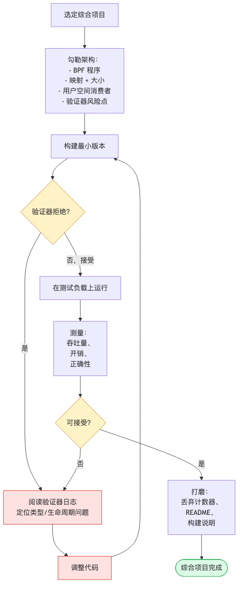
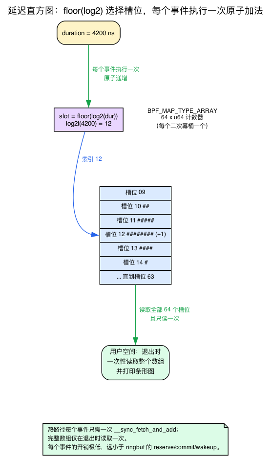
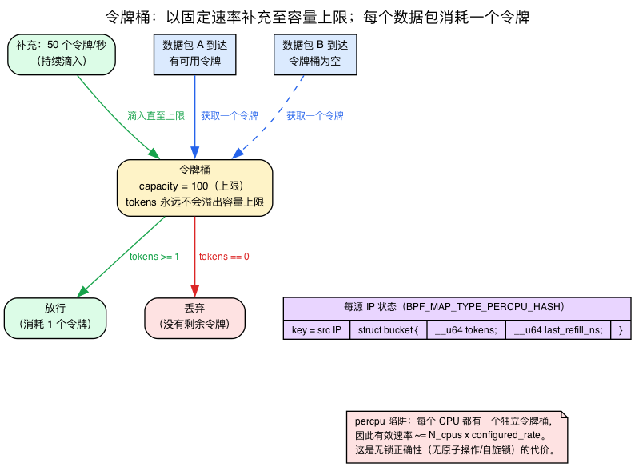
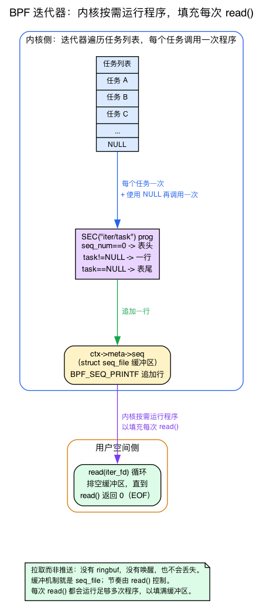

# 第28–30天 — 综合项目

> **今日任务：** 交付一个完整的 BPF 项目，把第1–27天学到的一切整合起来。与此同时，学习项目选项中依赖但此前从未直接教过的四块背景知识：如何在 BPF 中手工构建延迟**直方图**（以及关于 `lhist` 的真相）、**令牌桶**限速算法、BPF **迭代器**如何输出让用户空间像读文件一样读取的内容，以及 **EWMA** 到底是什么。三天，总共约 7–10 小时。

这不是一次按部就班的实验，而是*你的*项目。趁第1–27天积累的操作经验还清晰，你要在没有指南逐步引导的情况下，从头到尾完成一个完整项目。

但“在没有指南的情况下构建”也暗藏陷阱。下面五个选项都提到了一项前几天*用过*、却从未讲解过*如何构造*的技术。选项 A 要求“通过 `lhist` 实现直方图分桶”，容易让你去寻找并不存在的 `lhist` 辅助函数。选项 B 要求“在每 CPU 哈希中实现令牌桶”，而第23天只是提到了这个算法的名字。选项 E 要求“通过 `bpf_seq_printf` 输出，并像读文件一样读取”，涉及本书此前只略微提及的整套迭代器/seq_file 机制。选项 C 要求“跟踪 RTT EWMA”，但第23天反复使用了这个术语，却从未给出定义。

所以在你选择之前，本章会先把这四个前置知识讲清楚：先建立直觉，再给出具体的 v7.1 源码。之后，五个选项和三天计划就完全按照原设计进行。



再次回顾开发循环：
1. **构思**（1 小时）。在写任何代码之前先写一页 README。
2. **构建最小可用版本**，能编译并加载（3–4 小时）。先做到“能干净加载”，功能其次。
3. **验证器拒绝了？** 阅读日志；定位类型/生命周期问题；修复。初次尝试时每轮通常要花 30–60 分钟。
4. **在真实负载下测试**（1 小时）。合成基准测试会说谎，真实工作负载才会暴露 bug。
5. **打磨**（1–2 小时）。加上计数器、README、构建说明、一张截图。

---

## 前置知识 1：在 BPF 中构建延迟直方图——以及关于 `lhist` 的真相

选项 A 存在的全部理由就是一个带**直方图**的延迟追踪器。它的骨架要求“通过 `lhist` 实现直方图分桶”。先停在这里，因为这是整个综合项目中最常见的错误方向。

**libbpf/CO-RE BPF 中并不存在 `lhist` 这个辅助函数。** `lhist` 和 `hist` 是 **bpftrace 内置函数**——它们存在于 bpftrace 语言内部（你在*网络*那本书第1天的 headroom 实验里用过，也在 `bpftrace -e '... = lhist(...)'` 这样的单行脚本里用过）。它们*不是*你能在手写的 `.bpf.c` 程序里调用的 BPF 辅助函数。当你编写 libbpf 程序时，直方图需要**自己**构建。如果你去找 `bpf_lhist()`，并在 `bpf_helpers.h` 里搜索，你会白白浪费一个小时。不要这样做。

那到底该*怎么*构建一个直方图呢？先建立直觉。

### 直觉：一个计数器数组，每个 2 的幂对应一个槽位

直方图就是*统计有多少样本落入每个桶*。对于延迟来说，有用的分桶方式是**2 的幂次**：0–1 纳秒、1–2、2–4、4–8……一直到秒级。一个“大约 4 微秒”的延迟和一个“大约 4.1 微秒”的延迟应该落在同一个桶里；你并不关心精确到纳秒的数值，你关心的是*数量级*。

这意味着：声明一个小的**固定大小数组**——比如 64 个 `u64` 槽位，每个对应一个 2 的幂分桶。对每个事件，计算它属于哪个槽位（`slot = floor(log2(duration))`），然后给该槽位加一。最后，用户空间只需**一次性**读取整个数组并打印柱状图。

回忆第2天的内容，对映射值执行 `__sync_fetch_and_add(p, 1)` 是实现无锁计数器的基本手法——查找操作会返回一个未加锁的实时指针，因此多个 CPU 争用同一槽位时，如果不使用原子操作就会丢失计数。直方图仍是**同一种工具，只是换了形状**：不再使用按 PID 索引的单个计数器，而是使用按时长的 log2 值索引的*计数器数组*。每个事件只需执行一次原子自增。



### 为什么这种方式能扩展，而 ringbuf 不能

这是关键的性能要点，也正是*为什么*直方图是选项 A 热路径的正确工具。一个 ringbuf 事件（第13天）每个事件都要花费一次 reserve + commit + 一次用户空间唤醒。直方图每个事件只需要**一次原子加法**，而且在整个运行期间只需要**一次**数组读取——退出时读一次。直方图的成本只是零头，逐事件发送的成本却高出几个量级。这就是为什么像 `biolatency`/`funclatency`/`runqlat` 这样的真实追踪器都在内核内聚合成直方图；“逐事件 ringbuf 用于离群值”的混合方式，是选项 A 要求你在此基础上额外加的一步。

### 具体的 v7.1 代码：无分支 log2

这里有个让人意外的地方：你不能直接调用 libm 里的 `log2()`——BPF 没有 libc，而验证器又讨厌无界循环，所以一个朴素的“移位直到为零”的循环会与验证器较劲。内核源码树里的示例用了一种**无分支移位测试**手法来解决这个问题。以下是标准实现，直接来自 `~/code/linux/samples/bpf/lwt_len_hist.bpf.c:24`：

```c
/* samples/bpf/lwt_len_hist.bpf.c:24 — 32-bit branchless log2 */
static unsigned int log2(unsigned int v)
{
    unsigned int r;
    unsigned int shift;

    r = (v > 0xFFFF) << 4; v >>= r;
    shift = (v > 0xFF) << 3; v >>= shift; r |= shift;
    shift = (v > 0xF)  << 2; v >>= shift; r |= shift;
    shift = (v > 0x3)  << 1; v >>= shift; r |= shift;
    r |= (v >> 1);
    return r;
}
```

把它理解为对比特位位置的二分查找：“这个值是否大于 16 位？如果是，答案至少是 16，把这些位移走继续查。”没有循环，没有验证器无法折叠的分支——五次比较，搞定。延迟是 64 位纳秒值，所以你需要 64 位版本，它把数值拆成高/低两个 32 位半区（`~/code/linux/samples/bpf/lwt_len_hist.bpf.c:37`）：

```c
/* samples/bpf/lwt_len_hist.bpf.c:37 — 64-bit: log2 of the high half + 32, else the low half */
static unsigned int log2l(unsigned long v)
{
    unsigned int hi = v >> 32;
    if (hi)
        return log2(hi) + 32;
    else
        return log2(v);
}
```

而自增操作正是第2天那套模式——查找槽位、判空、原子加（`~/code/linux/samples/bpf/lwt_len_hist.bpf.c:46`）：

```c
/* samples/bpf/lwt_len_hist.bpf.c:46 — key = log2l(len), increment that slot */
SEC("len_hist")
int do_len_hist(struct __sk_buff *skb)
{
    __u64 *value, key, init_val = 1;

    key = log2l(skb->len);
    value = bpf_map_lookup_elem(&lwt_len_hist_map, &key);
    if (value)
        __sync_fetch_and_add(value, 1);
    else
        bpf_map_update_elem(&lwt_len_hist_map, &key, &init_val, BPF_ANY);
    return 0;
}
```

该示例使用以 log2 值为键的哈希；对于一个稠密的 0–63 直方图，`BPF_MAP_TYPE_ARRAY`（或 `PERCPU_ARRAY`）的 64 个槽位甚至更便宜——直接索引，无需哈希。

**十进制刻度分桶（可选的打磨）。** 2 的幂分桶每个数量级只给你约 3 个桶，对延迟展示来说有点粗糙。`~/code/linux/samples/bpf/tracex3.bpf.c:39` 展示了利用恒等式 `log10(x)*10 = log2(x)*3` 重新缩放到每个十进制数量级约 10 个桶的技巧：

```c
/* samples/bpf/tracex3.bpf.c:39 */
static unsigned int log2l(unsigned long long n)
{
#define S(k) if (n >= (1ull << k)) { i += k; n >>= k; }
    int i = -(n == 0);
    S(32); S(16); S(8); S(4); S(2); S(1);
    return i;
#undef S
}
```

以及 `tracex3.bpf.c:78` 处的注释块，记录了十进制刻度缩放（`index = 29 ~ 1 usec`、`index = 59 ~ 1 msec`、`index = 89 ~ 1 sec`），公式是 `index = (l * 64 + (delta - base) * 64 / base) * 3 / 64`。先用简单的 2 的幂版本；只有在打磨展示效果时才用这个。

### 按调用栈 id 分桶的直方图（选项 A 真正要求的）

选项 A 想要的是*按调用栈 id 分桶*的直方图——每个调用点一个独立的延迟分布。这在形状上只是一行改动：不再单独以 `slot` 为键给映射分桶，而是以键值对 `(stackid, slot)` 分桶。stackid 的获取方式与第9天用 `bpf_get_stackid()` 按调用栈聚合时完全一样。所以：

- 一个结构体键 `{ __u32 stackid; __u32 slot; }`，
- `slot = log2l(duration_ns)`，
- 对查找到的值执行 `__sync_fetch_and_add`。

用户空间一次性读取整个映射，按 `stackid` 对行分组，为每个调用栈打印一个直方图——把第9天的 stackid 聚合和今天的 log2 分桶连接起来。超过阈值的离群值仍然通过 ringbuf 逐事件发送，附带完整的内核+用户调用栈；直方图则以极低成本处理常见情况。

---

## 前置知识 2：令牌桶限速算法

选项 B 的骨架说“按源 IP 限速（在每 CPU 哈希中实现令牌桶）”。第23天告诉你“BPF 中的限速过滤器至关重要”，然后就一带而过——它从未展示过这个算法。这里补上，因为没有它你没法构建 B。

### 直觉：一个以固定速率补充的桶

想象一个装**令牌**的桶。它有一个**容量**（突发规模——比如 100 个令牌）和一个**补充速率**（比如 50 个令牌/秒）。令牌持续滴入，直到达到容量上限；它们永远不会超出这个上限溢出。每个到达的数据包都必须**拿走一个令牌**：如果有令牌可用，数据包通过，令牌被消耗；如果桶空了，数据包被丢弃。

这正好给了你限速器想要的行为：允许瞬间通过最多 `capacity` 个数据包的突发（桶原本是满的），但*持续*速率被限制在补充速率上，因为令牌回补的速度就是这么快。



### 数学原理：每个数据包上的惰性补充

你不需要运行一个定时器持续滴入令牌。那样太浪费。相反，你**惰性地**补充，计算从你上次查看以来*本应*累积多少令牌。每个键（源 IP）只存储两个字段：

```c
struct bucket {
    __u64 tokens;          /* tokens currently available (fixed-point or whole) */
    __u64 last_refill_ns;  /* timestamp of the last refill */
};
```

对每个数据包：

1. `now = bpf_ktime_get_ns()`
2. `elapsed = now - last_refill_ns`
3. `tokens += elapsed * rate / 1000000000`（自上次以来累积的令牌数），**上限为 capacity**
4. `last_refill_ns = now`
5. 如果 `tokens >= 1`：消耗一个（`tokens -= 1`），**PASS**；否则**DROP**

第 1 步的时钟是 `bpf_ktime_get_ns()`，单调纳秒时钟——位于 `~/code/linux/kernel/bpf/helpers.c:178`（`BPF_CALL_0(bpf_ktime_get_ns)`），它就是 `ktime_get_mono_fast_ns()`，且是 NMI 安全的。在 `~/code/linux/kernel/bpf/helpers.c:190`（`BPF_CALL_0(bpf_ktime_get_boot_ns)`）还有一个计入系统挂起时间的对应版本；两者的区别是 boot 变体在挂起（suspend）期间仍会继续计时。限速器应当使用*单调*时钟（`get_ns`）——这里测量的是短时间间隔，不应让一次系统挂起突然把桶“补充”满。只有当追踪器需要区分墙上时钟与运行时间语义时，才需要进一步考虑这种差异。

### 每 CPU 映射的陷阱（基准测试前务必阅读）

选项 B 要求使用“每 CPU 哈希”，这个选择有一处容易被忽略的细节，而且会直接影响基准测试结果：**每 CPU 映射会为每个 CPU 保留一个独立的桶。** 对应同一源 IP 键，实际上存在 *N* 个独立桶，每个逻辑 CPU 一个；数据包只会访问它所到达的 CPU 上的那个桶（回忆第2天的每 CPU 内存模型——同一个键在每个 CPU 上都有不同的物理存储）。因此，有效的*全局*速率大约是 `N_cpus × configured_rate`。在 8 核机器上配置 50 个令牌/秒时，攻击者实际可以达到约 400 个/秒。

这是 bug 吗？不是，而是一项有意为之的权衡。选择每 CPU 映射是为了保证**无锁正确性**：各 CPU 不会争用同一个桶，因此既不需要原子更新，也不需要为映射值加自旋锁。若改用*共享的*哈希，就必须通过原子 CAS 更新 `{tokens, last_refill}` 这一对值，或者在值中加入 `bpf_spin_lock`；前者更复杂，后者更慢，而且系统遭受攻击时争用最为严重。每 CPU 映射避开了这些问题，代价则是精度：它适合提供粗粒度的 DoS 防护，而不是精确的全局限速。**务必在 README 中说明这一点**，以免基准测试结果看起来像是程序出错。如果需要精确的全局限制，就应采用值中带自旋锁的共享哈希——记录这项权衡，然后继续实现。

### 它和第15天的关系

把它们联系起来：第15天的 **LPM-trie 拒绝名单**是*静态*的允许/拒绝判断（这个 CIDR 是否被禁止，是或否）。令牌桶则是叠加在其上的*动态*按源限流（这个 IP 是被允许的，但不能超过*那个*速率）。选项 B 的完整设计是：XDP 程序先做 LPM 查找（如果被拒绝就丢弃），然后做令牌桶检查（如果超速就丢弃），然后 PASS——而 tcx egress 记录丢弃事件。两种映射类型，两个职责，一条数据包路径。

---

## 前置知识 3：BPF 迭代器如何输出，以及用户空间如何像读文件一样读取它

选项 E 完全建立在本书此前只略微提及的机制之上：一个 `SEC("iter/task")` 程序遍历所有任务，“通过 `bpf_seq_printf` 输出”，再由用户空间“像读文件一样”读取。第12天只把 `iter.s/task` 作为*可睡眠*的 SEC 名称的一个例子提到过——它当时真正讲的主题是缺页错误。seq_file 的输出/读取机制是全新的，这里补上。

### 直觉：被拉取，而非被推送

到目前为止你写过的每一个追踪程序都是**推送**事件：内核中发生了某件事，你的程序被触发，把一条记录塞进 ringbuf，用户空间把它取走。迭代器则**相反**——它是被用户空间**拉取**的。用户空间通过 `read()` 说“给我下一块输出”，内核就*按需运行你的 BPF 程序*来产生这块输出。没有 ringbuf，没有唤醒，没有丢失。这正是选项 E 要展示的这项未被充分利用的能力。

### 内核端：每个对象调用一次，外加一次 NULL 收尾

一个迭代器程序接收的上下文中，`ctx->meta->seq` 是一个内核 `struct seq_file`——一个可增长的文本缓冲区。你用 `BPF_SEQ_PRINTF(seq, fmt, ...)` 宏往里面写。选项 E 的程序接收的确切上下文是 `~/code/linux/kernel/bpf/task_iter.c:170`：

```c
/* kernel/bpf/task_iter.c:170 */
struct bpf_iter__task {
    __bpf_md_ptr(struct bpf_iter_meta *, meta);
    __bpf_md_ptr(struct task_struct *, task);
};
```

内核对每个被遍历的对象**调用你的程序一次**（每个任务一次），然后**用对象指针为 NULL 再调用最后一次**，这样你就能输出一个尾注或摘要。由此产生两种惯用写法，都体现在参考程序 `~/code/linux/tools/testing/selftests/bpf/progs/bpf_iter_tasks.c:20` 中：

```c
/* tools/testing/selftests/bpf/progs/bpf_iter_tasks.c:20 */
SEC("iter/task")
int dump_task(struct bpf_iter__task *ctx)
{
    struct seq_file *seq = ctx->meta->seq;
    struct task_struct *task = ctx->task;
    static char info[] = "    === END ===";

    if (task == (void *)0) {                 /* end-of-iteration: emit footer */
        BPF_SEQ_PRINTF(seq, "%s\n", info);
        return 0;
    }
    if (ctx->meta->seq_num == 0)             /* first call: emit header row */
        BPF_SEQ_PRINTF(seq, "    tgid      gid\n");

    BPF_SEQ_PRINTF(seq, "%8d %8d\n", task->tgid, task->pid);
    return 0;
}
```

- **`task == NULL`** ⇒ 你已经过了最后一个任务；输出尾注/摘要。
- **`ctx->meta->seq_num == 0`** ⇒ 这是第一次调用；只输出一次表头行。

`BPF_SEQ_PRINTF` 宏的底层依赖是 `bpf_seq_printf` 辅助函数，位于 `~/code/linux/kernel/trace/bpf_trace.c:458`（`BPF_CALL_5(bpf_seq_printf, struct seq_file *m, ...)`），它验证格式/参数，并调用 `seq_bprintf(m, ...)` 把内容追加进缓冲区。

### 用户空间端：像读文件一样读取 iter fd

这就是“像读文件一样读取”的部分。用户空间：

1. 挂载程序以获得一个 **iter link**，
2. 调用 `bpf_iter_create(link_fd)` 获得一个 **fd**，
3. 在循环中 `read()` 这个 fd 直到 EOF。

每次 `read()` 都会让内核运行你的 BPF 程序足够多次，以填满读取缓冲区，逐个任务地取出数据。当遍历耗尽时，`read()` 返回 0（EOF）。“像读文件一样读取”字面上就是这个意思——这也是为什么迭代器不需要 ringbuf：缓冲*就是* seq_file，节奏*就是* `read()` 系统调用。



### 为什么可睡眠在这里很重要

第12天确立了 `iter.s/task` 是**可睡眠的**。这在迭代器中会有回报：在遍历任务时，你可能想读取*被遍历任务*的用户内存（例如它的 argv、一个 cgroup 路径字符串），用 `bpf_copy_from_user_task` 这个仅限可睡眠场景使用的辅助函数。要注意选用哪个辅助函数：`bpf_copy_from_user` 读取的是 `current` 的地址空间，而在迭代器遍历过程中，`current` 是发起 `read()` 的那个用户空间进程，**而不是** `ctx->task`——所以它会悄无声息地读错进程。`bpf_copy_from_user_task(dst, size, user_ptr, task, flags)`（`helpers.c:682`）接受目标 `task_struct`，用 `access_process_vm(tsk, …)` 读取*那个*任务的内存；传入 `ctx->task`。因为迭代器运行在进程上下文中（由一次 `read()` 系统调用驱动），所以它*可以*睡眠——因此它能调用那些热路径追踪器无法调用的辅助函数。这正好呼应第12天；无需再重新解释可睡眠性。

---

## 前置知识 4：EWMA 究竟是什么（一段话讲清楚——拥塞控制的语境见第23天）

选项 C 要求“修改 `bpf_dctcp` 来跟踪 RTT EWMA，并根据阈值选择分支”。第23天反复提到“alpha EWMA”，却从未定义这个术语。下面快速复习一下（拥塞控制的背景已在第23天讲过，因此这里只作简要说明）：

**EWMA**（指数加权移动平均）是一个单变量平滑器：`avg = avg + ((sample - avg) >> shift)`（括号很重要——没有括号的话，`+`/`-` 的优先级比 `>>` 高，运行平均值就被丢弃了）。它给近期样本赋予比旧样本更高的权重，而且——这对 BPF 来说至关重要——它**不需要历史数组**，每个套接字只需要一个数字。`>> shift` *就是*权重：移位越大，适应得越慢。你可以在内核自带的 dctcp 中看到完全相同的模式，位于 `~/code/linux/tools/testing/selftests/bpf/progs/bpf_dctcp.c:44`（每个套接字的状态 `__u32 dctcp_alpha;`），其更新逻辑位于 `bpf_dctcp.c:131`：`alpha -= min_not_zero(alpha, alpha >> dctcp_shift_g)`——这在定点数运算中就是 `(1-g)*alpha`，即 EWMA 的衰减步骤。对于选项 C，你要读取 `srtt_us`，它来自 `tcp_sock`，并把*它*送入你自己的 EWMA。该字段位于 `~/code/linux/include/linux/tcp.h:307`：`u32 srtt_us; /* smoothed round trip time << 3 in usecs */`。注意这个 `<< 3`：它已经是以八分之一微秒为单位，而且**本身已经是一个 EWMA**——内核已经替你平滑了 RTT。所以你的 EWMA 是叠加在一个已经被平滑过的信号之上的*更粗糙*的平滑器；在调整那个 1 毫秒阈值时要记住这一点，否则你会追逐并不存在的噪声。

---

## 挑一个

五个建议的项目，大致按“整合此前的天数”到“前沿/更难”排序。

### 选项 A：带直方图和离群值火焰图的延迟追踪器

**内容：** 针对任意内核函数（通过环境变量选择）的通用延迟追踪器。按调用栈 id 分桶的直方图。超过阈值的离群值以完整的内核 + 用户调用栈逐事件输出。

**整合内容：** 第6天（fentry/fexit）、第9天（调用栈追踪）、第13天（ringbuf 伸缩性）、第3天（用于解析入参的 CO-RE）。

**为什么这是很好的综合项目素材：** 每个 BPF 开发者最终都会写一个这样的追踪器。这是 BPF 世界的“hello, real world”。简单版本约 150 行；生产级质量约 500 行（丢包计数器、采样、fold-format 导出、实时 TUI）。

**骨架计划：**
- BPF：在一个可配置的函数名上挂 fentry；把入口时间戳存入以 TID 为键的映射；fexit 计算时长；用前置知识 1 中手工构建的 `log2l` 槽位索引对时长进行直方图分桶（**没有** `lhist` 辅助函数——需要你自己构建）；如果时长超过阈值，发送带调用栈 id 的 ringbuf 事件。
- 用户空间：解析参数（函数名、阈值），加载并挂载，轮询循环，退出时一次性读取直方图数组，停止时输出 folded format。
- 加分项：TUI 中的实时直方图（用 Rust 的 `ratatui` 或 Python 的 `rich`）；火焰图 SVG 输出。

### 选项 B：带用户空间控制平面的 XDP 防火墙

**内容：** 基于 XDP 的数据包过滤器，配有用于添加/删除规则的用户空间代理。基于 CIDR 的拒绝名单（LPM trie）+ 按源 IP 限速（每 CPU 哈希中的令牌桶）+ tcx egress 记录丢弃事件。

**整合内容：** 第14天（XDP）、第15天（LPM）、第17天（tcx）、第13天（丢弃计数器）。

**为什么这很好：** 防火墙式的应用正是 Cilium 这类项目起步的方式。具体、可衡量、立即可用。

**骨架计划：**
- BPF：带拒绝（LPM 查找）+ 限速（前置知识 2 中的令牌桶算法）逻辑的 XDP 程序；用于出站记录的 tcx egress；规则用共享映射存储。记住每 CPU 陷阱：有效速率约为 `N_cpus × configured_rate`——把它写进文档。
- 用户空间：用于规则管理的 REST 或 unix-socket CLI；状态端点；配置文件格式。
- 加分项：把规则持久化到磁盘；退出时干净地分离；在真实的基于 veth 的测试网络中部署。

### 选项 C：带自适应启发式算法的 BPF TCP 拥塞控制

**内容：** 一个基于观测到的 RTT 在两种策略之间自适应切换的 BPF 实现 TCP 拥塞控制。RTT 低于 1 毫秒时（局域网），表现得像 Reno。高于这个值时，表现得像 BBR 风格。

**整合内容：** 第22天（struct_ops）、第23天（插桩）、第7天（BPF_PROG）。

**为什么这很好：** struct_ops 是 BPF 中最强大也最少被使用的特性之一。构建一个拥塞控制算法是其经典范例。你会学到 TCP 有多么谨慎。

**骨架计划：**
- 从 `bpf_dctcp.c` 出发；读取 `srtt_us`（来自 `tcp_sock`），把它送入你自己的 EWMA（前置知识 4），基于 1 毫秒阈值分支。记住 `srtt_us` 已经被平滑过，单位是微秒 `<< 3`。
- 用户空间：加载，注册为 `bpf_adaptive`，暴露统计数据。
- 加分项：在 100 毫秒与 0.1 毫秒路径上对比 Cubic 做 A/B 基准测试；生成一张图。

### 选项 D：自定义 sched_ext 调度器

**内容：** 实现一个简单的双类别调度器——交互类（优先级 cgroup 内轮转）+ 后台类（基于 vtime 的公平共享）。任务通过 cgroup 成员关系自我分类。

**整合内容：** 第25天（sched_ext）、第26天（修改）、第27天（读取）、eBPF 第19天（来自网络那本书的 cgroup 感知能力）。

**为什么这很好：** sched_ext 是前沿领域。编写一个调度器——即使是简单的——也会让你跻身一个小圈子。

**骨架计划：**
- 从 `scx_simple.bpf.c` 出发。加入按 cgroup 分类、两个 DSQ、派发优先级。
- 用户空间：可配置的 cgroup 路径；安全检查（如果优先级 cgroup 为空则拒绝加载）。
- 加分项：负载下的延迟基准测试（交互类 vs 后台类）；生成一张图。

### 选项 E：基于迭代器的更丰富的 `ps`

**内容：** 一个遍历每个任务并把 `{pid, comm, cgroup, rss, runtime, ...}` 输出到文件描述符的 BPF 迭代器。用户空间工具替代 `/proc` 解析，实现一个类 `ps` 的工具。

**整合内容：** 第7天（BPF_PROG）、第24天（kfunc/BTF）、第12天（迭代器是可睡眠的）。

**为什么这很好：** 更偏向非热路径，更偏向“大规模内核内省”——对监控栈很有用。迭代器程序是一项被低估的 BPF 能力。

**骨架计划：**
- BPF：`SEC("iter/task")` 遍历，通过 `BPF_SEQ_PRINTF` 输出到 `ctx->meta->seq`——在 `seq_num == 0` 时输出表头，在 `task == NULL` 时输出尾注（前置知识 3）。
- 用户空间：`bpf_iter_create()` 获取一个 fd，然后在循环中像读文件一样读取它，直到 EOF。
- 加分项：比解析 `/proc/<pid>/...` 更快地丰富输出内容（cgroup 路径、命名空间成员关系、fd 数量）；利用迭代器的可睡眠性对被遍历任务调用 `bpf_copy_from_user_task(ctx->task, …)` 读取其字符串。

---

## 选项 A — 参考解答

以上五个选项是*你的*——综合项目的重点就是在没有指南的情况下设计其中一个。但为了让本书能够编译通过并附带一个完整的端到端示例，该实验在 `ebpf/labs/day28-30/` 中包含了**选项 A**——一个通用延迟追踪器——的完整参考实现。请在你尝试完自己的方案*之后*再阅读它；把它当作一种答案，而不是唯一答案。其余四个选项依然刻意保持为未实现的练习。

它是第1–13天那种独立的 libbpf 模式：一个共享头文件、一个 BPF 对象、一个用户空间加载器，通过 `make -C ebpf/labs day28-30` 构建。

共享的布局——双方共同约定的按调用栈直方图和离群值记录：

{{#include ../labs/day28-30/capstone_latency.h}}

手工构建的无分支 `log2l`（前置知识 1——没有 `lhist` 这个辅助函数）：

{{#include ../labs/day28-30/capstone_latency.bpf.c:log2}}

完整的 BPF 对象：fentry 记录入口时间戳，fexit 计算时长，并将结果分桶写入按调用栈区分的 `PERCPU_HASH` 直方图（每次只需自增，无需原子操作）；只有超过阈值的离群值才会通过环形缓冲区发送，并附带内核和用户调用栈 id：

{{#include ../labs/day28-30/capstone_latency.bpf.c:book}}

用户空间加载器通过 `-f`（默认 `vfs_read`）选定的函数，借助 `bpf_program__set_attach_target` 让两个程序都挂载到该函数上，一边从 `/proc/kallsyms` 符号化内核栈帧一边排空离群值 ring buffer，并在退出时按下面检查问题所要求的那样，一次性读取整个直方图——对每 CPU 槽位求和：

{{#include ../labs/day28-30/capstone_latency.c:book}}

---

## 第28天 — 构思与启动

挑一个。花第一个小时构思：

- 需要哪些 BPF 程序（一个还是多个）？
- 需要哪些映射及其大小（以及并发方面的考虑）？
- 用户空间的职责是什么？
- 验证器最可能在哪里发难？

在写任何代码之前，先写一页 README。**如果你无法把设计讲清楚，你就还没准备好写代码。** README 强迫你把想法具体化；模糊的设计一旦你尝试把它写下来，问题就会暴露无遗。

然后构建最小可行版本。第28天结束时的目标是：它**能编译并加载**。它可能还没做任何有用的事。没关系——一个能加载但功能不完整的程序，远比一个完美但未完成的程序要领先得多。

## 第29天 — 迭代

在真实工作负载上运行。测量。修复验证器的拒绝。加上你构思过的离群值/控制平面/调优功能。

如果可以的话写测试。`tools/testing/selftests/bpf/` 中的自测代码是 BPF 测试应有样子的好范例——正如你在上面看到的，它们同时也是这些技术本身的参考实现（`bpf_iter_tasks.c`、`bpf_dctcp.c`）。

今天大部分时间都会花在**调试**上：查看验证器日志和内核 dmesg、排查 ringbuf 丢包与字段缺失。不要气馁——每位 BPF 程序员都会遇到这些难关。

## 第30天 — 打磨与总结

加入丢弃计数器、错误信息以及干净的分离（detach）路径。在 README 中解释设计决策和一两个意外发现，再截一张项目运行时的画面。

写**一段话**，说明：

> “验证器拒绝了 X。我通过 Y 修复了它。这是原因。”

这一段话是整整 30 天里最有价值的产出。它把一条你现在从骨子里理解的验证器规则结晶下来——不只是理智上理解，而是真正掌握。

> ### 常见疑问
>
> **问：我在 `bpf_helpers.h` 和 `bpf_helper_defs.h` 里搜索 `lhist` 和 `hist`，什么都没找到。是我用的内核版本太旧了吗？**
>
> 答：不是——它们从来就不在那儿。`lhist`/`hist` 是 **bpftrace 语言的内置函数**，不是 BPF 辅助函数。在手写的 libbpf/CO-RE 程序里，直方图需要你自己构建：一个固定的数组映射加上无分支 `log2l` 槽位索引，后者来自 `samples/bpf/lwt_len_hist.bpf.c`。如果某篇教程暗示 libbpf 程序存在一个直方图辅助函数，那它是把 bpftrace 和 libbpf 搞混了。
>
> **问：我的令牌桶限速器设置成 1000 pps，但源头明显打出了好几千。是 bug 吗？**
>
> 答：几乎可以肯定是每 CPU 陷阱。`BPF_MAP_TYPE_PERCPU_HASH` 为*每个 CPU*保留一个独立的桶，所以有效的全局配额大约是 `N_cpus × configured_rate`。这是无锁正确性刻意付出的代价。如果需要精确的全局上限，你需要一个共享哈希，并加 `bpf_spin_lock`（作用于 `{tokens, last_refill}` 值）（或原子 CAS）——更慢，而且会有争用。决定你想要哪种，并写进 README。
>
> **问：我的迭代器什么都不打印。程序加载和挂载都正常。**
>
> 答：你 `read()` 那个 iter fd 了吗？迭代器是被*拉取*的，不是被*推送*的——内核只有在用户空间读取时才会运行你的程序。挂载只会给你一个 link；你仍然需要 `bpf_iter_create()` 获取一个 fd，并用一个 `read()` 循环把它排空。不读取就没有输出。另外检查一下你的结束条件：`read()` 返回 0 是正常的 EOF（遍历已耗尽），不是错误。
>
> **问：对于选项 C，即使 RTT 明显在变化，我的 EWMA 也纹丝不动。**
>
> 答：两个常见原因。第一，`srtt_us` 的单位是**微秒 `<< 3`**——如果你不做移位就直接把它和一个以纯微秒为单位的阈值比较，你的分支判断会偏差 8 倍。第二，你的移位量太大，导致 EWMA 适应速度比你的测试运行时间还慢。记住你是在平滑一个已经被平滑过的信号（`srtt_us` 本身就是一个 EWMA），所以一个温和的移位量就能起到很大作用。

---

## 内核中该读什么

- **`samples/bpf/lwt_len_hist.bpf.c`**——手工构建直方图的标准范例：无分支 `log2`（`:24`）、64 位 `log2l`（`:37`），以及查找/`__sync_fetch_and_add` 自增操作（`:46`）。这正是选项 A 需要的模式。
- **`samples/bpf/tracex3.bpf.c`**——`log2l`（`:39`）以及十进制刻度缩放技巧（`:78`，`log10(x)*10 = log2(x)*3`），用于更好看的延迟分桶。
- **`kernel/bpf/helpers.c`**——`bpf_ktime_get_ns`（`:178`）和 `bpf_ktime_get_boot_ns`（`:190`）；令牌桶补充计算所依赖的时钟（单调 vs 包含启动时间）。
- **`tools/testing/selftests/bpf/progs/bpf_iter_tasks.c`**——参考的 `SEC("iter/task")` 程序（`:20`）：`ctx->meta->seq`、`task == NULL` 尾注、`seq_num == 0` 表头、`BPF_SEQ_PRINTF`。
- **`kernel/bpf/task_iter.c`**——`struct bpf_iter__task`（`:170`），迭代器接收的确切上下文。
- **`kernel/trace/bpf_trace.c`**——`bpf_seq_printf`（`:458`），`BPF_SEQ_PRINTF` 背后的辅助函数。
- **`include/linux/tcp.h`**——`srtt_us`（`:307`），选项 C 用来分支判断的平滑 RTT 字段。
- **`tools/testing/selftests/bpf/progs/bpf_dctcp.c`**——`dctcp_alpha`（`:44`）及其 EWMA 衰减更新（`:131`）；选项 C 要在此基础上扩展的模型。
- **`kernel/bpf/verifier.c`**——当你的项目被拒绝时，报错信息就来自这里。这个月你已经零零散散读过它的一些片段；现在去读打印出*你的*错误信息的那个函数。

---

## 今日实验

在你决定选项之前，先*量出*对应前置知识所填补的差距，这样设计才能真正落到你手里，而不只是停留在脑子里。

### 证明没有 `lhist` 这个辅助函数（选项 A）

```bash
grep -rn 'lhist\|bpf_hist' ~/code/linux/tools/lib/bpf/ ~/code/linux/tools/testing/selftests/bpf/bpf_helpers.h 2>/dev/null
```

你会发现在 libbpf 里什么都没有——然后只会在 bpftrace 生态和手工编写的示例里找到真正的实现。现在 grep 一下确实构建了直方图的那个示例：

```bash
grep -n 'log2\|__sync_fetch_and_add' ~/code/linux/samples/bpf/lwt_len_hist.bpf.c
```

### 观察令牌桶使用的单调时钟（选项 B）

```bash
sudo bpftrace -e 'kprobe:do_nanosleep { printf("%llu\n", nsecs); }' | head -3
```

bpftrace 中的 `nsecs` 就是 `bpf_ktime_get_ns()` 返回的那个单调时钟。看着它推进——那就是你的补充计算中要从 `last_refill_ns` 减去的那个值。

### 看一个迭代器被拉取（选项 E）

```bash
sudo bpftool iter pin $(find ~/code/linux/tools/testing/selftests/bpf -name 'bpf_iter_tasks.bpf.o' 2>/dev/null | head -1) /sys/fs/bpf/task_iter 2>/dev/null; sudo cat /sys/fs/bpf/task_iter | head
```

参数顺序是 `bpftool iter pin OBJ PATH`——ELF 对象在前，pin 路径在后。bpftool **没有**内置的任务迭代器；你总是需要提供一个对象。如果预先构建的 `bpf_iter_tasks.bpf.o` 不存在，先构建它：

```bash
make -C ~/code/linux/tools/testing/selftests/bpf bpf_iter_tasks.bpf.o
```

`cat` 那个被 pin 住的 iter 文件，正是“像读文件一样读取”这个循环的体现——每次 `read()` 都会按需运行 BPF 程序来填充缓冲区。

---

## 第30天之后

你还没有结束；你已经**在实操上变得流利**。

根据方向不同，接下来的步骤：

### 生产级工具

把你的综合项目产品化，或者为现有项目（Cilium、bpftrace、Parca、Tetragon）做贡献。看看标着 `good-first-issue` 标签的问题。

### 上游贡献

关注 bpf 邮件列表（`vger.kernel.org/bpf`）。挑一些小的自测改进。提交你的第一个补丁。门槛比人们想象的要低——写得好的自测贡献是受欢迎的。

### 前沿

阅读接下来会出现的内容：arena、BPF 链表/红黑树、dynptr 扩展。每一个都是这 30 天计划之外的一章，因为它们还在成熟中。

### 专精方向

挑一个垂直领域：
- **网络**（XDP/Cilium）：构建数据包路径特性，为上游做贡献。
- **可观测性**（Pixie / Parca / bpftrace）：构建追踪工具，为生态做贡献。
- **安全**（Tetragon、BPF LSM）：编写安全策略执行程序。
- **调度**（sched_ext）：构建特定领域的调度器——`scx_layered`、`scx_lavd`、`scx_rusty` 都是不错的先例。

---

## 要点回顾

- **libbpf 程序中没有 `lhist`/`hist` 这样的辅助函数**——那些是 bpftrace 内置函数。在手写的 BPF 程序中，你需要自己构建直方图：一个 `u64` 槽位的固定数组映射，算出 `slot = floor(log2(duration))`，使用的是无分支 `log2l` 手法，每个事件一次 `__sync_fetch_and_add`，退出时一次性读取整个数组。按调用栈 id 分桶的直方图只需以 `(stackid, slot)` 为键（第9天）。
- **直方图能扩展，而逐事件 ringbuf 不能**——每个事件一次原子加法，相比每个事件一次 reserve/commit/唤醒；这就是为什么真实的追踪器在内核内聚合，只对离群值逐事件发送。
- **令牌桶：** 每个键存储 `{tokens, last_refill_ns}`；每个数据包上惰性补充 `tokens += elapsed * rate / 1e9`，使用 `bpf_ktime_get_ns()`（上限为 capacity），消耗一个则 PASS，空了则 DROP。
- **每 CPU 令牌桶陷阱：** 每个 CPU 一个独立的桶，意味着有效速率约为 `N_cpus × configured_rate`。这是无锁正确性（无需原子操作/自旋锁）的代价。这是粗粒度的 DoS 防护，而不是精确的全局限速——写进文档。
- **BPF 迭代器是*被拉取*的，不是*被推送*的。** 它写入 `ctx->meta->seq`（一个 `struct seq_file`），使用 `BPF_SEQ_PRINTF`；内核对每个对象调用一次，外加一次对象为 NULL 的调用（尾注）；`seq_num == 0` 表示表头。用户空间用 `bpf_iter_create()` 获取一个 fd，并像读文件一样 `read()` 它——每次读取都按需运行程序。由于是可睡眠的，它可以在遍历过程中用 `bpf_copy_from_user_task(ctx->task, …)` 读取被遍历任务的内存（第12天）。
- **一行讲清 EWMA：** `avg = avg + ((sample - avg) >> shift)`——单个变量，没有历史数组（注意括号：`>>` 的优先级比 `+`/`-` 低）。对于选项 C，`srtt_us`（`tcp.h:307`）的单位是微秒 `<< 3`，而且本身已经是一个 EWMA；你的 EWMA 是叠加在其上的更粗糙的一层，所以要相应地调整阈值。
- 整整 30 天里最有价值的产出是一段话：**“验证器拒绝了 X。我通过 Y 修复了它。这是原因。”**

---

## 检查问题

你正在构建选项 A。你写好了 BPF 直方图，在全部 8 个 CPU 上跑一个高负载的工作负载，退出时用户空间读取数组，柱状图看起来*太短*了——远远少于你知道确实发生过的事件数量。自增操作是普通的 `hist[slot]++`，作用于一个共享的 `BPF_MAP_TYPE_ARRAY`。然后你把映射换成 `BPF_MAP_TYPE_PERCPU_ARRAY`（依然是 `hist[slot]++`，在用户空间对各 CPU 求和），现在计数正确了*而且*更快了。为什么？

<details>
<summary>点击查看答案</summary>

**答案：** 对*共享*数组执行的普通 `hist[slot]++` 是一次非原子的读-改-写：八个 CPU 在同一个热门槽位上竞争，读到同一个旧值，各自加一，再写回去——所以并发的自增操作会相互覆盖，计数被真正地**丢失**了。这就是柱状图“太短”的原因。朴素的修复方式是 `__sync_fetch_and_add(&hist[slot], 1)`，这样是正确的，但会有*争用*——八个 CPU 在这个原子操作上排队串行执行，在高负载下会拖累吞吐量。`BPF_MAP_TYPE_PERCPU_ARRAY` 同时绕开了这两个问题：每个 CPU 用一次普通的存储操作自增**自己的**槽位副本——没有计数丢失，不需要原子操作，没有跨 CPU 争用（第2天介绍的每 CPU 内存模型）。然后用户空间读取这个每 CPU 数组，并**跨 CPU 求和**得到逻辑上的总数。因此，每 CPU 映射只需在用户空间多做少量求和，就能同时获得正确计数和内核侧零争用。这正是每 CPU 映射适合高速率计数器的原因，也解释了为什么选项 B 中的每 CPU 令牌桶得到的是按 CPU 计算的速率，而不是全局速率。如果切换后柱状图*仍然*太短，可能是忘记汇总各 CPU 的值——必须读取全部 `nr_cpus` 个条目，而不能只读索引 0。

</details>

---

## 30 天计划结束

你已经从“BPF 是什么？”走到了“我交付了一个东西。”具体来说：

- 第1天：第一个带 ringbuf 的 fentry 程序
- 第5天：验证器直觉（PTR_TO_MAP_VALUE_OR_NULL、有界循环）
- 第10天：通过 uprobe 做用户空间追踪
- 第15天：基于 XDP 的防火墙
- 第20天：kfunc 与获取/释放语义
- 第25天：BPF 调度器
- 第30天：你的项目

代码库在不断演进。你的流利程度是持久的；具体的 API 却不是。每隔六个月重读一遍 `kernel/bpf/verifier.c`。订阅 bpf 邮件列表。每次内核升级后运行 `tools/testing/selftests/bpf/test_progs`，并了解发生了哪些改动。

欢迎加入这个圈子。
