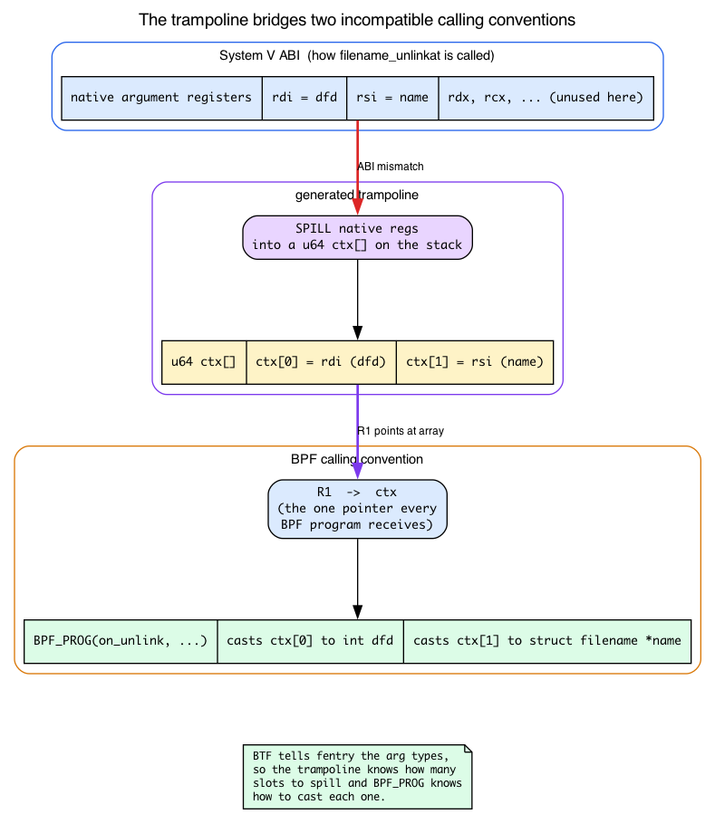
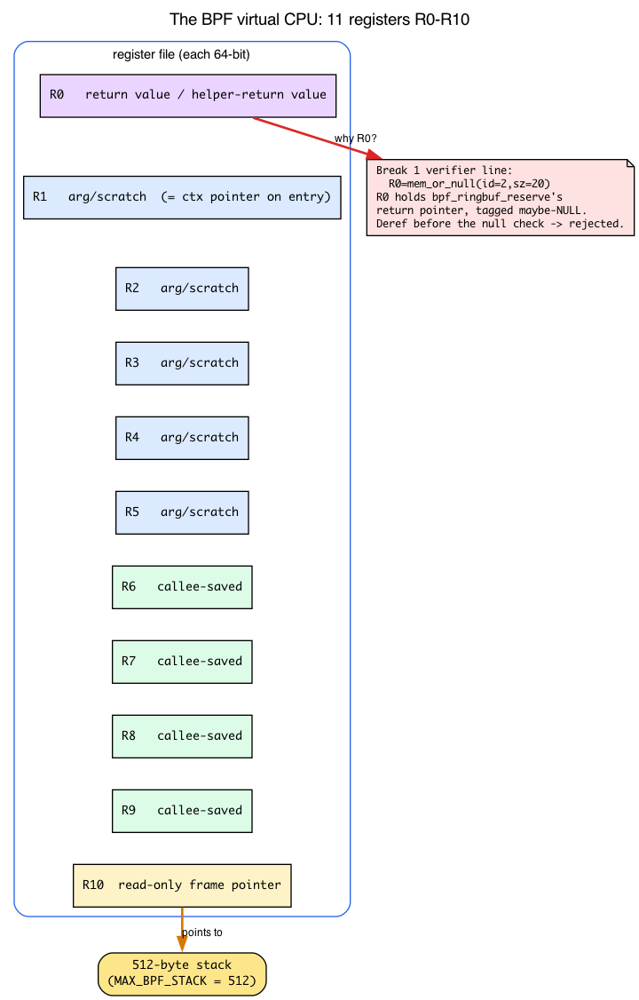
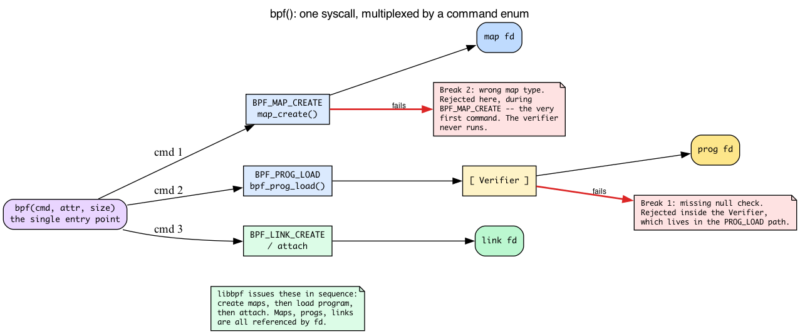

# Day 1 — First fentry program with ringbuf

> **Today's mission:** spy on every file deletion on your system, in real time, with a program that runs *inside the kernel* and can't crash it. Along the way, meet the whole machine that makes this possible — the BPF virtual CPU, the one syscall that loads everything, the just-in-time compiler, and the little code-patching trick that lets you tap a running kernel without a hiccup. Total time: ~120 minutes.

## So you want to spy on a kernel function

You'd think this would be hard. The kernel is busy. It runs thousands of functions per second across dozens of CPUs. It does not know you exist. How do you get it to tap you on the shoulder every time something calls `filename_unlinkat`?

**You install a doorbell.** That's `fentry`.

Here's the secret on x86_64 builds with function tracing enabled. Traceable kernel functions reserve an entry patch site, often shown as a 5-byte NOP slot. It sits there doing nothing until ftrace/BPF turns it into an entry call path.

```
filename_unlinkat:
    nop   nop   nop   nop   nop      ← these 5 bytes are reserved for you
    push  %rbp                       ← the actual function body starts here
    mov   %rsp, %rbp
    ...
```

### Whose 5 bytes are those, anyway?

That slot is not BPF's, and BPF didn't put it there. It exists because the kernel is built with **function-entry instrumentation** (`-pg` / `-mfentry`): the compiler emits a `call __fentry__` at the top of every traceable function (the entry stub is `SYM_FUNC_START(__fentry__)` at `arch/x86/kernel/ftrace_64.S:148`). At boot, **ftrace** — the kernel's built-in function tracer, around since 2008 — overwrites each of those call sites with a 5-byte NOP. The NOP it writes is literally `x86_nops[5]` (`ftrace_nop_replace()` returns it at `arch/x86/kernel/ftrace.c:66`; the table is at `arch/x86/kernel/alternative.c:91`).

So the patch site is *ftrace's*. fentry/BPF doesn't own it — it **borrows** it by registering an ftrace **"direct call"** that repoints the site at *your* trampoline. You don't need to learn ftrace today; just hold the one-line model: the compiler reserves the slot, ftrace owns it, fentry hangs your program off it.

When you attach an fentry program, the kernel atomically patches that reserved site into the architecture's ftrace/BPF entry path. That path reaches a generated **trampoline**. The trampoline saves arguments, calls *your* BPF program with them, restores everything, and then lets `filename_unlinkat` run as if nothing happened. The exact instruction is architecture- and config-dependent; the important model is patch site → trampoline → original function body.


### What the trampoline is actually *for*: an ABI bridge

"Saves arguments, calls your program with them" sounds like magic until you ask: *why does it need to save anything?* The answer is that the function being traced and your BPF program are called two **incompatible** ways.

`filename_unlinkat` is an ordinary C function. On x86-64, the System V ABI says its first argument arrives in register `rdi`, its second in `rsi`, and so on:

```c
int filename_unlinkat(int dfd, struct filename *name)   /* fs/namei.c:5536 */
/*                        ↑ rdi          ↑ rsi                              */
```

A BPF program, by contrast, is **not** called with arguments spread across native registers. By convention every BPF program receives exactly one pointer — a pointer to a `u64[]` **context array** — in its first BPF register, `R1` — the BPF VM's registers get their full introduction in "Meet the cast" below; for now just hold "R1 = the one pointer your program is handed." `R1 → ctx`, and that's it. The program reads `ctx[0]`, `ctx[1]`, … to get its inputs.

Those two calling conventions don't line up. Native code puts `dfd` in `rdi`; BPF code expects it as `ctx[0]`. **Bridging that gap is the trampoline's entire job:**

1. On entry it **spills** the native argument registers into a `u64 ctx[]` array on the stack: `ctx[0] = rdi (dfd)`, `ctx[1] = rsi (name)`.
2. It calls your BPF program with `R1` pointing at that array.
3. On return it **restores** the registers and falls through into the real body of `filename_unlinkat`.

That `ctx[]` array *is* the "argument array" the `BPF_PROG` macro unpacks. When you write

```c
int BPF_PROG(on_unlink, int dfd, struct filename *name)
```

the macro (at `tools/lib/bpf/bpf_tracing.h:672`) expands to read `ctx[0]` as `dfd` and `ctx[1]` as `name`, casting each to the type you declared. This is the concrete payoff of BTF (below): **BTF tells fentry the argument types, so the trampoline knows how many slots to spill and `BPF_PROG` knows how to cast them.**



The trampoline isn't per-program, either: there's **one trampoline per attach target**, reference-counted and shared across every program attached there. That's why the kernel keys them in a hash table — the "What to read" pointer about `bpf_trampoline` below. Frame it this way: the trampoline's *first* job is the argument marshalling; the hash-table bookkeeping is just how the kernel avoids building a second one for the same target.

> ### There are no Dumb Questions
>
> **Q: Patching kernel code while it's running. Isn't that lunacy?**
>
> A: It would be, except the kernel has been doing this since 2008 — it's how `ftrace` works. The 5-NOP slot is reserved by the compiler at build time *specifically* so the kernel can patch it later. The patch goes through the kernel's int3-based text-poke machinery, which is safe against concurrent instruction fetches on every CPU (the file:line specifics are in the "What to read" trampoline bullet at the end). You can install and remove fentry hooks while the kernel runs your browser, a database, and a video call without a hiccup.
>
> **Q: Why not use kprobe? I keep seeing kprobe in old tutorials.**
>
> A: kprobe predates fentry and works differently. It overwrites the function's first instruction with a software breakpoint (`int3` on x86). The CPU traps, a handler runs your code, then it emulates the original instruction and continues. Works on **any** function. The trap is expensive; fentry's direct entry path is typically several times cheaper than a kprobe trap, though exact numbers vary by CPU and kernel config. Use fentry whenever it's available; kprobe only for the rare functions that lack BTF.
>
> **Q: What does "BTF" mean, and why do you keep mentioning it?**
>
> A: Hold that thought — we'll meet BTF properly in a moment. For Day 1: trust that BTF is what tells fentry the argument types of `filename_unlinkat`, so your program can declare `int dfd, struct filename *name` and have the kernel hand them over correctly typed.

> ### Sharpen your pencil
>
> On x86_64, the compiler often reserves a **5-byte NOP slot** at the start of a traceable function. Why 5? What instruction size is that designed to fit?
>
> .\
> .\
> .
>
> **Answer:** a near relative `call` or `jmp` on x86_64 is 5 bytes — 1 opcode byte plus a 4-byte signed offset. The reservation is sized so ftrace can patch the site without moving the function body. Other architectures use their own patch-site shape.

---

## Meet the cast

Before you write code, here's the full cast of characters.

### eBPF in 90 seconds

A BPF program is C code compiled to a stripped-down virtual instruction set (BPF) and loaded into the kernel through the `bpf()` syscall. Before the kernel runs it, a static analyzer called the **Verifier** proves the program is safe — it terminates, never reads uninitialized memory, never deref's a pointer it hasn't proven valid, and stays within a bounded instruction count. If the program passes, the kernel JITs it to native instructions and runs it whenever the chosen **attach point** fires. The program cannot crash the kernel and cannot read arbitrary memory — every load is verified at load time. Programs talk to userspace through **maps** (typed shared data structures).

That paragraph hides three machines worth meeting properly: the virtual CPU your program runs on, the syscall that gets it into the kernel, and the compiler that makes it fast. Let's take them one at a time — you'll be reading their fingerprints in error messages within the hour.

### The BPF virtual machine: 11 registers and an 8-byte instruction

"A stripped-down virtual instruction set" deserves more than a hand-wave, because the very first error you'll hit today (Break 1) prints register names at you. So: BPF is a **64-bit RISC-like virtual ISA**. It has exactly **11 registers, `R0` through `R10`**, each 64 bits wide (`BPF_REG_0 = 0` … `BPF_REG_10`, `__MAX_BPF_REG` at `include/uapi/linux/bpf.h:74`). Every instruction is a fixed **8-byte encoding** — `struct bpf_insn` at `include/uapi/linux/bpf.h:80` — packing an opcode, a destination register, a source register, an offset, and an immediate.

The registers aren't interchangeable. They have a **calling convention**, and you must know it to read verifier output:

| Register | Role |
|---|---|
| `R0` | **Return value** — your program's return, *and* the return value of any helper you call |
| `R1`–`R5` | **Argument / scratch** registers passed into helpers (and `R1` = the ctx pointer on entry) |
| `R6`–`R9` | **Callee-saved** — preserved across helper calls |
| `R10` | **Read-only frame pointer** to a fixed **512-byte** stack (`MAX_BPF_STACK = 512`, `include/linux/filter.h:98`) |



Two things fall straight out of this table. First, `R0 = helper return value` is *exactly* why, in Break 1, the result of `bpf_ringbuf_reserve` lands in `R0`. Second, when the verifier prints `R0=mem_or_null`, it's telling you: `R0` holds the pointer the helper returned, and the verifier has tagged it "might be NULL." Dereferencing it (writing `*(u32 *)(r0+0)`) without first checking for NULL is the instruction it rejects.

How does the verifier *know* `R0` might be NULL? Because it walks your program one instruction at a time and tracks a **type and value-range for every register** as it goes. That bookkeeping lives in `struct bpf_reg_state` and is updated by routines like `check_reg_arg` in `kernel/bpf/verifier.c` — the same engine that prints the `R0=mem_or_null` text you'll see in Break 1. (You'll meet the Verifier as a character on Day 4; today you just need to recognize the register names when it complains.)

One more distinction that saves confusion later: there are **two different instruction streams** in play. The **BPF bytecode** is what the verifier reads and what `struct bpf_insn` encodes. The **native machine code** is what actually runs on the CPU — and a separate stage, the JIT, produces it. Don't conflate them.

### The `bpf()` syscall: one door, many commands

Everything — creating a map, loading a program, attaching it — enters the kernel through a **single syscall**: `bpf()`. There is exactly one entry point, `SYSCALL_DEFINE3(bpf, int, cmd, union bpf_attr __user *, uattr, unsigned int, size)` at `kernel/bpf/syscall.c:6385`, and it's **multiplexed by a command enum** (the first argument, `cmd`):

- **`BPF_MAP_CREATE`** — create a map and return a file descriptor. Dispatches to `map_create()` (`kernel/bpf/syscall.c:1362`).
- **`BPF_PROG_LOAD`** — submit a program's instructions + BTF, **run the Verifier**, and return a file descriptor. Dispatches to `bpf_prog_load()` (`kernel/bpf/syscall.c:2864`).
- **`BPF_LINK_CREATE`** / the various attach commands — wire a loaded program to an attach point.

libbpf issues these for you, **in sequence**: create the maps, then load the program, then attach. (The command names live in `include/uapi/linux/bpf.h`.)



That **map creation and program loading are separate commands** is the whole reason Break 2 behaves the way it does. When you give the map the wrong type, the kernel rejects it during `BPF_MAP_CREATE` — *before* `BPF_PROG_LOAD` is ever issued, so the Verifier (which lives inside the load path) never even runs. "Fails at the loader, before the verifier" is not hand-waving; it's literally a different `cmd`.

And notice the recurring noun: **file descriptor.** Maps, programs, and links are *all* referenced by fd returned from `bpf()`. That's the substrate under everything you'll touch in userspace — `skel->maps.rb` and `bpf_map__fd(skel->maps.rb)` in `hello.c` are just typed wrappers around a map fd. A **map**, in general, is a kernel-resident typed key/value object created by `BPF_MAP_CREATE` and shared between kernel and userspace by that fd. Ringbuf (below) is one map *type*; `BPF_MAP_TYPE_ARRAY` (the one Break 2 mis-uses) is another.

### JIT: BPF bytecode becomes native machine code

Once the Verifier accepts your bytecode, the kernel doesn't *interpret* it event by event — that would be slow. Instead the **BPF JIT** ("just-in-time" compiler) rewrites each BPF instruction into the equivalent **native CPU instructions** (x86-64 here). The translator is `bpf_int_jit_compile()` at `arch/x86/net/bpf_jit_comp.c:3718`; it walks the program in `do_jit()` (around `:1652`), emitting native code into a buffer described by `struct jit_context` (`:310`).

Three things to internalize:

- The JIT runs **once, at load time**, inside the `BPF_PROG_LOAD` path — *not* on every event. When the attach point fires, it jumps straight into already-compiled native code.
- On most production kernels the JIT is **on by default**, controlled by the `bpf_jit_enable` sysctl; setting it to `2` additionally dumps the JIT image for debugging (`if (bpf_jit_enable > 1)` at `arch/x86/net/bpf_jit_comp.c:3843`). An interpreter fallback exists, but it's the slow path.
- This is why fentry + JIT is cheap enough to leave attached on a busy machine — the "no hiccup" claim from the first Dumb Question. At the attach point, there's no trap and no interpreter loop: just native code calling native code.


*(In that lifecycle picture, the **JIT** stage sits between "Verifier accepts" and "runs at attach point": it turns the verified **BPF bytecode** into **native x86 instructions**, which is what actually executes when `filename_unlinkat` is called.)*

### The Verifier (a recurring character)

> **The Verifier:** *Hi. I'm the gatekeeper. Nothing runs in the kernel until I prove it's safe. I read your program one instruction at a time. I track every register's type. I track every memory region's bounds. I track every reference you take. If you do something I can't prove safe — touch a pointer that might be NULL, run a loop I can't bound, leak a refcount — I reject your program. My error messages aren't always pretty, but every one tells you the exact instruction where I lost faith. Read carefully. We'll be working together a lot.*

You'll meet the Verifier on Day 4. For now, write code that pleases it without trying. (And now you know what "track every register's type" means literally — `R0` through `R10`, one type each, updated instruction by instruction.)

### `SEC()` — the section-name convention

Every BPF program belongs to a section in the compiled object. The section name tells **libbpf** how to load and attach the program. The prefix is the program type; the suffix is the attach target:

```c
SEC("fentry/filename_unlinkat")    // type=fentry, attach to kernel symbol filename_unlinkat
SEC("xdp")                    // type=xdp, attach point provided by userspace
SEC("tp/sched/sched_switch")  // type=tracepoint, on the sched_switch tracepoint
```

The full table lives in `tools/lib/bpf/libbpf.c` — search `static const struct bpf_sec_def section_defs[]` (`:9987`). Bookmark it. Whenever a `SEC()` "doesn't work", that's the file you check.

### BTF (BPF Type Format)

BTF is a compact debug-info-like format the kernel exposes about itself. The running kernel ships its complete type information at `/sys/kernel/btf/vmlinux`. BPF objects ship BTF about their own types. BTF powers four things you'll use constantly:

1. **Verifier type-checking** of typed pointers (`PTR_TO_BTF_ID`).
2. **CO-RE** field-offset relocation at load time.
3. **Typed argument unpacking** for fentry/fexit/tp_btf programs — the ABI bridge from earlier, made concrete: it's what lets `BPF_PROG(on_unlink, int dfd, struct filename *name)` resolve to the right slots and casts.
4. **Kfunc signature matching** (Day 20).

Source: `kernel/bpf/btf.c`.

### vmlinux.h

A C header generated from kernel BTF, containing the kernel types a BPF program can name. You can generate one from a running host with `bpftool btf dump file /sys/kernel/btf/vmlinux format c`.

The repo-owned labs compile against the architecture header pinned with libbpf-bootstrap, not a file regenerated on every reader's machine. That gives CI and local builds one stable type universe; at load time CO-RE still resolves the accessed fields against the **running** kernel's `/sys/kernel/btf/vmlinux`. If you are developing outside this scaffold, generating `vmlinux.h` from a known reference kernel is the equivalent workflow.

### CO-RE — Compile Once, Run Everywhere

The whole reason BPF programs aren't fragile across kernel versions. You compile once against `vmlinux.h` from one kernel; libbpf relocates field offsets at load time using the *target* kernel's BTF. The same `.bpf.o` runs on kernel 6.6 and kernel 7.1 even if struct layouts changed.


### libbpf

The userspace library at `tools/lib/bpf/`. Opens your `.bpf.o`, applies CO-RE relocations using the running kernel's BTF (`bpf_object__relocate_core` at `tools/lib/bpf/libbpf.c:6082`), calls the `bpf()` syscall to load programs and create maps — issuing `BPF_MAP_CREATE` then `BPF_PROG_LOAD` then the attach commands, in that order — attaches them, and returns handles. It is the canonical loader. Do not write your own.

### Skeleton (`*.skel.h`)

An auto-generated header produced by `bpftool gen skeleton hello.bpf.o > hello.skel.h`. It gives userspace typed accessors for every map and program in your BPF object: `skel->maps.rb`, `skel->progs.on_unlink`. Under the hood each of those is a wrapper around the fd that `bpf()` returned. The generated file is ~200 lines of straightforward code — open it once, it stops feeling magic.

### ringbuf — the event channel you'll use today

A kernel→userspace event channel, and one **map type** among many. **Multi-producer (any CPU), single-consumer (one userspace reader), preserves cross-CPU ordering.** Producers don't run fully lock-free: inside `__bpf_ringbuf_reserve` they serialize briefly via an internal per-ringbuf spinlock (`raw_res_spin_lock_irqsave` on `rb->spinlock`, `kernel/bpf/ringbuf.c:478`) while advancing the producer position, then each caller writes into its own disjoint slice.


Two APIs:

- `bpf_ringbuf_output(&rb, data, sz, 0)` — copy-style. Easy.
- `bpf_ringbuf_reserve(&rb, sz, 0)` → write directly → `bpf_ringbuf_submit(ev, 0)` — zero-copy. Preferred.

Replaced **perfbuf** (`BPF_MAP_TYPE_PERF_EVENT_ARRAY`) for most uses. Perfbuf is per-CPU, requires N userspace consumers, loses ordering across CPUs. Use perfbuf only if peak per-CPU write rate matters more than ordering. Source: `kernel/bpf/ringbuf.c`.

---

## The lab

### Setup (one time)

Start with the [Lab environment](lab-environment.md) page, then run these commands from the books repository on your Linux lab host:

```bash
git submodule update --init --recursive
cd ebpf/labs
./scripts/preflight.sh
make hello
```

The repository pins libbpf-bootstrap and all of its nested dependencies. The shared Makefile builds that exact libbpf and bpftool, selects the pinned `vmlinux.h` for your architecture, compiles `day01/hello.bpf.c`, generates `.output/day01/hello.skel.h`, and links `.output/day01/hello`. Nothing is installed system-wide.

You still need Clang 17 or newer with `-target bpf`, a C compiler and Make, plus libelf and zlib development headers. `preflight.sh` checks those inputs but never installs packages or invokes `sudo`.

### `hello.h` — the shared event record

The producer and consumer include one header, so a layout change cannot silently desynchronize the two sides:

```c
{{#include ../labs/day01/hello.h}}
```

### `hello.bpf.c` — the kernel side

This listing is included from the file the lab build and CI compile:

```c
{{#include ../labs/day01/hello.bpf.c:book}}
```

Walkthrough of every line that's new:

- `#include "vmlinux.h"` — pulls in every kernel type, including `struct filename` used in the prototype.
- `char LICENSE[] SEC("license") = "GPL";` — a load-time gate, not legal advice. The kernel rejects a non-GPL program *only* if it calls a GPL-only helper. Many of the most useful helpers are GPL-only (`bpf_probe_read_kernel`, `bpf_get_current_task`, `bpf_get_stackid`, …), but the four simple helpers this lab uses are *not* — so this line has no teeth yet today (see Break 3).
- `#include "hello.h"` — the shared `struct hello_event` sent through ringbuf. Ringbuf transports raw bytes, so both sides must agree on this layout.
- The `SEC(".maps")` block — modern map declaration syntax. The `__uint(...)` macros from `bpf_helpers.h` produce BTF the loader uses to know it's a 256-KiB ringbuf. (This is the BTF that drives the `BPF_MAP_CREATE` command libbpf issues for `rb`.)
- `SEC("fentry/filename_unlinkat")` — attach point. `filename_unlinkat` is in `fs/namei.c`, called on every `unlink()` and `unlinkat()` syscall.
- `BPF_PROG(on_unlink, int dfd, struct filename *name)` — macro from `bpf_tracing.h` that unpacks the trampoline's argument array into the typed parameters `dfd` and `name` (the ABI bridge from earlier, made concrete).
- `bpf_ringbuf_reserve` returns either a valid pointer or NULL (when the ringbuf is full). The return value lands in `R0`, the Verifier tags it `mem_or_null`, and it requires the null check before you write through it.
- `bpf_get_current_pid_tgid()` — reads the currently-running task (more on "the task" just below). The result is packed `(tgid << 32) | pid`; Linux's userspace "PID" is the kernel's TGID. `>> 32` extracts the user-visible PID.
- `bpf_get_current_comm` — copies up to 16 bytes of the task's `comm` field. Always 16, always null-padded.
- `bpf_ringbuf_submit` makes the reserved entry visible to the consumer.

#### A one-paragraph refresher: "the task" and where 16 comes from

Two of those helpers read "the current task," and the magic number `16` shows up with no explanation — so, briefly: every schedulable thread in the kernel is represented by a `struct task_struct`. What BPF calls **`current`** is simply the `task_struct` of the thread running on this CPU right now, and `bpf_get_current_pid_tgid` / `bpf_get_current_comm` both read fields out of it. The `comm` field is a fixed-size, NUL-padded **short thread name** — the `rm` you'll see in the lab output — declared as `char comm[TASK_COMM_LEN]` in `struct task_struct` (`include/linux/sched.h:1173`). And `TASK_COMM_LEN` is **16** (`include/linux/sched.h:325`). So the `16` in `sizeof(event->comm)` isn't arbitrary; it's the kernel's compile-time size of that field. That's the whole refresher — we'll do a proper `task_struct` tour another day; today you just need "always 16" and "the task's comm" to stop being unexplained constants. (The pid-vs-tgid split above already covered why we shift by 32.)

### `hello.c` — the userspace side

The loader checks each libbpf step, validates the ringbuf record size, handles SIGINT/SIGTERM, and releases both the consumer and skeleton on every exit path:

```c
{{#include ../labs/day01/hello.c:book}}
```

`bpf_map__fd(skel->maps.rb)` is exactly the map fd that `BPF_MAP_CREATE` returned during load — the userspace side polls it; the kernel side writes into it.

### Run it

```bash
make hello
sudo ./.output/day01/hello
# in another terminal:
scratch=$(mktemp -d /tmp/ebpf-day01.XXXXXX)
touch "$scratch/one" "$scratch/two"
rm "$scratch/one" "$scratch/two"
rmdir "$scratch"
```

Expected output:

```
PID 13421 rm deleted a file
PID 13421 rm deleted a file
```

On a busy machine you'll also see lines whose `comm` is something other than `rm` — package managers, editors saving over temp files, `/tmp` churn. That's not a bug; it's the whole point. Your doorbell fires on *every* `unlink`/`unlinkat` in the system, not just yours. Pick out the two lines whose `comm` is `rm`.

Congratulations. You just installed a doorbell on a kernel function.

---

## What to break, in order

This is the part you don't skip. Every break teaches one concept.

### Break 1 — Drop the null check

Remove the `if (!event) return 0;`. Rebuild. The verifier rejects with something like:

```
0: (85) call bpf_ringbuf_reserve#131
1: R0=mem_or_null(id=2,sz=20)
2: (7b) *(u32 *)(r0 +0) = r1
R0 invalid mem access 'mem_or_null'
```

That's the Verifier saying: *your register R0 is a pointer that might be NULL; you can't dereference it without proving it isn't.* You now know exactly why it's `R0` and not some other register — `R0` is where a helper's return value lives by calling convention, so `bpf_ringbuf_reserve`'s maybe-NULL pointer is sitting in `R0` when instruction 2 tries to write through it.

To see this with full detail, set `kernel_log_level = 1` in your loader options:

```c
LIBBPF_OPTS(bpf_object_open_opts, opts, .kernel_log_level = 1);
skel = hello_bpf__open_opts(&opts);
```

Or use `bpftool prog load file.o /sys/fs/bpf/x` and read stderr.

### Break 2 — Wrong map type

Change `BPF_MAP_TYPE_RINGBUF` to `BPF_MAP_TYPE_ARRAY`. Now the loader fails *before* the Verifier even runs:

```
libbpf: map 'rb': failed to create: Invalid argument
```

This is the `BPF_MAP_CREATE`-vs-`BPF_PROG_LOAD` split from the syscall section, made visible. An ARRAY map needs a key size and value size that a bare `SEC(".maps")` ringbuf-style declaration doesn't supply, so the kernel rejects it during `BPF_MAP_CREATE` — the very first command libbpf issues. `BPF_PROG_LOAD`, where the Verifier lives, never runs. That's the difference between **loader-time** errors (map config wrong) and **verifier-time** errors (program logic unsafe). Different layers, different commands, different failure modes. Get used to noticing which one bit you.

### Break 3 — Remove the LICENSE

Try the obvious thing first: delete the `char LICENSE[] SEC("license") = "GPL";` line and rebuild. The program **loads and runs exactly as before**. Surprised? The GPL gate fires only when your program *calls a GPL-only helper*, and none of the four helpers in `hello.bpf.c` (`bpf_ringbuf_reserve`, `bpf_ringbuf_submit`, `bpf_get_current_pid_tgid`, `bpf_get_current_comm`) are GPL-only.

To make the gate bite, first give it something to gate on. Add a GPL-only helper call inside `on_unlink`:

```c
(void)bpf_get_current_task();   // bpf_get_current_task is a GPL-only helper
```

Now delete the LICENSE line again and rebuild. *This* time the load fails:

```
cannot call GPL-restricted function from non-GPL compatible program
```

The lesson: the license string is a load-time gate with teeth **only** for GPL-only helpers. Put the LICENSE line back (and you can drop the `bpf_get_current_task` call again) before moving on.

### Break 4 — Reserve more than you write

> ### Sharpen your pencil
>
> Before you run anything: what is `sizeof(struct hello_event)`? The struct is a 4-byte `__u32 pid` followed by a 16-byte `char comm[16]`. Add them up — you'll see this number printed as `size=` in a moment.
>
> .
> .
> .
>
> **Answer:** 20. There's no padding to worry about here — a `__u32` needs 4-byte alignment and `char[16]` needs only 1, so the 4 + 16 layout packs with no gaps. Hold "20" in mind; the `20 → 21` shift is the whole point of this break.

The lesson here is that **ringbuf records are sized at reserve time, not at submit time**. The checked-in `handle_event()` deliberately rejects any size other than `sizeof(*event)`, so replace that equality check with a lower-bound check and print the delivered `size`:

```c
if (size < sizeof(*event)) {
    fprintf(stderr, "short ringbuf record: %zu\n", size);
    return 0;
}
printf("PID %u %.*s deleted a file (size=%zu)\n", event->pid,
       (int)sizeof(event->comm), event->comm, size);
```

Rebuild and run the **unmodified** program. Each line now ends with the record size:

```
PID 13421 rm deleted a file (size=20)
```

`sizeof(struct hello_event)` is 20 — a 4-byte `pid` plus a 16-byte `comm`. Now over-allocate the reservation while still writing only `sizeof(*event)` bytes:

```c
event = bpf_ringbuf_reserve(&rb, sizeof(*event) + 1, 0);
```

The Verifier accepts it (you reserved enough). Rebuild, run, delete a file again:

```
PID 13421 rm deleted a file (size=21)
```

The record is one byte larger even though you wrote the same bytes — the length is fixed when you **reserve**, not when you **submit**. (That trailing byte is uninitialized; we don't print it, the `20 → 21` size delta is the observable signal.) Restore the original `sizeof(*event)` reservation and exact-size consumer check before moving on.

---

## What to read in the kernel

Open these files in your `~/code/linux` checkout. Skim, don't memorize.

- **`kernel/bpf/trampoline.c`** — top of the file. Find `arch_prepare_bpf_trampoline` and `bpf_trampoline_get`. The trampoline is per-(target, prog-list), reference-counted, and rebuilt when programs attach or detach (`bpf_trampoline_update`, `kernel/bpf/trampoline.c:607`). Notice `bpf_trampoline` is not just one stub — it's a hash table keyed by attach target. (The arg-spill/restore code itself is emitted by `arch_prepare_bpf_trampoline` at `arch/x86/net/bpf_jit_comp.c:3536`, with the real work in `__arch_prepare_bpf_trampoline` at `:3213` — this is the ABI bridge from the trampoline section, in the flesh.) The patch that repoints the site is installed by the int3-based text-poke machinery, `smp_text_poke_*` (`smp_text_poke_int3_handler` at `arch/x86/kernel/alternative.c:2838`, driving the batched `struct smp_text_poke_loc` array at `:2781`) — safe against concurrent instruction fetch on every CPU.
- **`kernel/bpf/ringbuf.c`** — `bpf_ringbuf_reserve` is short. Note the per-record header (`struct bpf_ringbuf_hdr`, `:88`) and the `BUSY` bit (`BPF_RINGBUF_BUSY_BIT`, set at `:529`) that lets `submit` and `discard` finalize race-free.
- **`tools/lib/bpf/libbpf.c`** — search `find_sec_def` (`:10212`). Scroll the `section_defs[]` table (`:9987`). You now know every prefix that exists. This file is also where CO-RE relocation gets kicked off (`bpf_object__relocate_core`, `:6082`).

### Optional: read the generated skeleton

```bash
./.output/bpftool/bootstrap/bpftool gen skeleton .output/day01/hello.bpf.o
```

It prints the same skeleton stored at `.output/day01/hello.skel.h`. Read it once. You'll see it's just stamped-out boilerplate calling `bpf_object__find_map_by_name` and friends. Demystified.

---

## Bullet Points

- BPF is a **64-bit virtual ISA**: 11 registers `R0`–`R10`, fixed 8-byte `struct bpf_insn`. `R0` = return/helper-return value, `R1`–`R5` = args, `R6`–`R9` = callee-saved, `R10` = read-only frame pointer to a 512-byte stack. The Verifier tracks a type per register — that's where `R0=mem_or_null` comes from.
- **`bpf()` is one syscall, multiplexed by a command enum:** `BPF_MAP_CREATE` (→ map fd), `BPF_PROG_LOAD` (runs the Verifier → prog fd), attach commands. Maps, progs, and links are all **fds**. libbpf issues them in sequence — which is why a bad map fails *before* the Verifier (Break 2).
- After the Verifier accepts bytecode, the **JIT** translates it to native machine code once at load time; the attach point then runs native code at native speed.
- BPF programs are C compiled to a verified-then-JITed instruction set; they cannot crash the kernel.
- **fentry** patches the 5-byte NOP slot — reserved by the compiler's `-mfentry` instrumentation and *owned by ftrace*, borrowed by BPF via an ftrace "direct call" — with a jump to a generated trampoline. The **trampoline bridges the ABI**: it spills native arg registers (`rdi`, `rsi`, …) into a `u64 ctx[]` array, calls your program with `R1 → ctx`, and `BPF_PROG` casts the slots back to typed args. Typically several times cheaper than a kprobe trap.
- The patch is installed by the kernel's int3-based text-poke machinery, `smp_text_poke_*`, safe against concurrent instruction fetch on every CPU.
- Use **fentry** wherever possible. Use **kprobe** only for functions without BTF.
- **`SEC()`** is the section-name convention libbpf uses to load and attach. The prefix names the program type and tells libbpf where to attach.
- **vmlinux.h** is generated from kernel BTF and gives you every kernel type by name; **BTF** also tells fentry the argument types so the trampoline and `BPF_PROG` agree on the slots.
- **CO-RE** lets you compile once and run on any kernel; libbpf relocates field offsets at load time.
- **ringbuf** is one map type — multi-producer single-consumer with cross-CPU ordering — your default kernel→userspace channel.
- **`current`** is the running thread's `struct task_struct`; `comm` is its 16-byte (`TASK_COMM_LEN`) NUL-padded name — that's where "always 16" comes from.
- Two failure layers exist: **loader-time** (map/object misconfigured) and **verifier-time** (program logic unsafe).
- Always check the return of `bpf_ringbuf_reserve` and `bpf_map_lookup_elem` — both can return NULL (in `R0`) and the Verifier knows it.

---

## Check question

If two CPUs concurrently call `bpf_ringbuf_reserve(&rb, 64, 0)`, can the records overlap?

<details>
<summary>Click to reveal answer</summary>

**Answer:** No. Inside `__bpf_ringbuf_reserve` the producers serialize briefly via an internal per-ringbuf spinlock while advancing the producer position, so each caller gets a disjoint slice. Submit/discard order may differ from reserve order, which the consumer handles via the `BUSY` bit on each record header. The consumer does not see a record until `BUSY` is cleared by `submit`/`discard`.

</details>

---

## Tomorrow

Day 2: add a hash map. Per-PID counters. The first lesson on **map element lifecycle** (and how a tracer that doesn't clean up its maps becomes a slow ENOSPC poison-pill).
