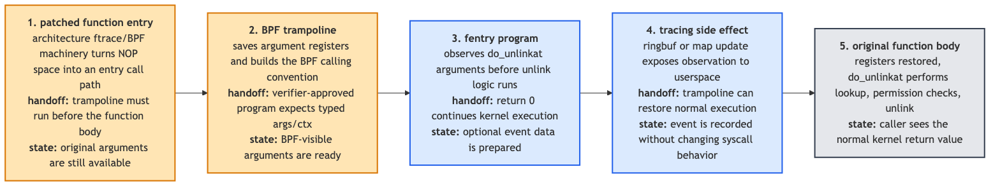
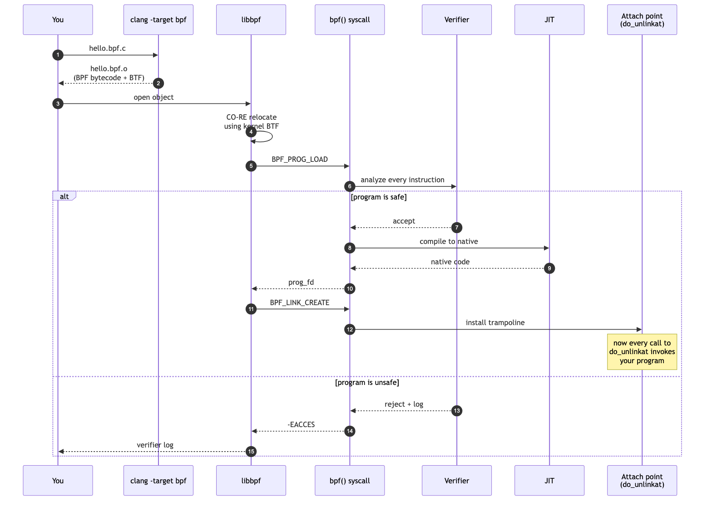
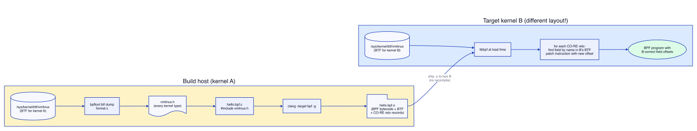
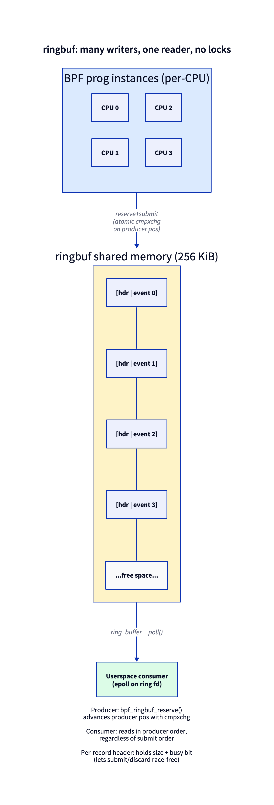

# Day 1 — First fentry program with ringbuf

> **Today's mission:** spy on every file deletion on your system, in real time, with a program that runs *inside the kernel* and can't crash it. Total time: ~90 minutes.

## So you want to spy on a kernel function

You'd think this would be hard. The kernel is busy. It runs thousands of functions per second across dozens of CPUs. It does not know you exist. How do you get it to tap you on the shoulder every time something calls `filename_unlinkat`?

**You install a doorbell.** That's `fentry`.

Here's the secret on x86_64 builds with function tracing enabled. Traceable kernel functions reserve an entry patch site, often shown as a 5-byte NOP slot. It sits there doing nothing until ftrace/BPF turns it into an entry call path.

```
filename_unlinkat:
    nop   nop   nop   nop   nop      ← these 5 bytes are reserved for you
    push  %rbp                       ← the actual function body starts here
    mov   %rsp, %rbp
    ...
```

When you attach an fentry program, the kernel atomically patches that reserved site into the architecture's ftrace/BPF entry path. That path reaches a generated **trampoline**. The trampoline saves arguments, calls *your* BPF program with them, restores everything, and then lets `filename_unlinkat` run as if nothing happened. The exact instruction is architecture- and config-dependent; the important model is patch site → trampoline → original function body.



> ### There are no Dumb Questions
>
> **Q: Patching kernel code while it's running. Isn't that lunacy?**
>
> A: It would be, except the kernel has been doing this since 2008 — it's how `ftrace` works. The 5-NOP slot is reserved by the compiler at build time *specifically* so the kernel can patch it later. The patch goes through `text_poke_bp`, which is safe against concurrent instruction fetches on every CPU. You can install and remove fentry hooks while the kernel runs your browser, a database, and a video call without a hiccup.
>
> **Q: Why not use kprobe? I keep seeing kprobe in old tutorials.**
>
> A: kprobe predates fentry and works differently. It overwrites the function's first instruction with a software breakpoint (`int3` on x86). The CPU traps, a handler runs your code, then it emulates the original instruction and continues. Works on **any** function. The trap is expensive; fentry's direct entry path is typically several times cheaper than a kprobe trap, though exact numbers vary by CPU and kernel config. Use fentry whenever it's available; kprobe only for the rare functions that lack BTF.
>
> **Q: What does "BTF" mean, and why do you keep mentioning it?**
>
> A: Hold that thought — we'll meet BTF properly in a moment. For Day 1: trust that BTF is what tells fentry the argument types of `filename_unlinkat`, so your program can declare `int dfd, struct filename *name` and have the kernel hand them over correctly typed.

> ### Sharpen your pencil
>
> On x86_64, the compiler often reserves a **5-byte NOP slot** at the start of a traceable function. Why 5? What instruction size is that designed to fit?
>
> .  
> .  
> .
>
> **Answer:** a near relative `call` or `jmp` on x86_64 is 5 bytes — 1 opcode byte plus a 4-byte signed offset. The reservation is sized so ftrace can patch the site without moving the function body. Other architectures use their own patch-site shape.

---

## Meet the cast

Before you write code, here's the full cast of characters.

### eBPF in 90 seconds

A BPF program is C code compiled to a stripped-down virtual instruction set (BPF) and loaded into the kernel through the `bpf()` syscall. Before the kernel runs it, a static analyzer called the **Verifier** proves the program is safe — it terminates, never reads uninitialized memory, never deref's a pointer it hasn't proven valid, and stays within a bounded instruction count. If the program passes, the kernel JITs it to native instructions and runs it whenever the chosen **attach point** fires. The program cannot crash the kernel and cannot read arbitrary memory — every load is verified at load time. Programs talk to userspace through **maps** (typed shared data structures).



### The Verifier (a recurring character)

> **The Verifier:** *Hi. I'm the gatekeeper. Nothing runs in the kernel until I prove it's safe. I read your program one instruction at a time. I track every register's type. I track every memory region's bounds. I track every reference you take. If you do something I can't prove safe — touch a pointer that might be NULL, run a loop I can't bound, leak a refcount — I reject your program. My error messages aren't always pretty, but every one tells you the exact instruction where I lost faith. Read carefully. We'll be working together a lot.*

You'll meet the Verifier on Day 4. For now, write code that pleases it without trying.

### `SEC()` — the section-name convention

Every BPF program belongs to a section in the compiled object. The section name tells **libbpf** how to load and attach the program. The prefix is the program type; the suffix is the attach target:

```c
SEC("fentry/filename_unlinkat")    // type=fentry, attach to kernel symbol filename_unlinkat
SEC("xdp")                    // type=xdp, attach point provided by userspace
SEC("tp/sched/sched_switch")  // type=tracepoint, on the sched_switch tracepoint
```

The full table lives in `tools/lib/bpf/libbpf.c` — search `static const struct bpf_sec_def section_defs[]`. Bookmark it. Whenever a `SEC()` "doesn't work", that's the file you check.

### BTF (BPF Type Format)

BTF is a compact debug-info-like format the kernel exposes about itself. The running kernel ships its complete type information at `/sys/kernel/btf/vmlinux`. BPF objects ship BTF about their own types. BTF powers four things you'll use constantly:

1. **Verifier type-checking** of typed pointers (`PTR_TO_BTF_ID`).
2. **CO-RE** field-offset relocation at load time.
3. **Typed argument unpacking** for fentry/fexit/tp_btf programs.
4. **Kfunc signature matching** (Day 20).

Source: `kernel/bpf/btf.c`.

### vmlinux.h

A C header containing every type definition the running kernel exposes via BTF. You generate it once:

```bash
sudo bpftool btf dump file /sys/kernel/btf/vmlinux format c > vmlinux.h
```

Including it in your `.bpf.c` gives access to `struct task_struct`, `struct file`, `struct sk_buff`, etc. — with the **exact layout** of the kernel that produced it.

### CO-RE — Compile Once, Run Everywhere

The whole reason BPF programs aren't fragile across kernel versions. You compile once against `vmlinux.h` from one kernel; libbpf relocates field offsets at load time using the *target* kernel's BTF. The same `.bpf.o` runs on kernel 6.6 and kernel 7.1 even if struct layouts changed.



### libbpf

The userspace library at `tools/lib/bpf/`. Opens your `.bpf.o`, applies CO-RE relocations using the running kernel's BTF, calls the `bpf()` syscall to load programs and create maps, attaches them, returns handles. It is the canonical loader. Do not write your own.

### Skeleton (`*.skel.h`)

An auto-generated header produced by `bpftool gen skeleton hello.bpf.o > hello.skel.h`. It gives userspace typed accessors for every map and program in your BPF object: `skel->maps.rb`, `skel->progs.on_unlink`. The generated file is ~200 lines of straightforward code — open it once, it stops feeling magic.

### ringbuf — the event channel you'll use today

A kernel→userspace event channel. **Multi-producer (any CPU), single-consumer (one userspace reader), preserves cross-CPU ordering.** Producers don't run fully lock-free: inside `__bpf_ringbuf_reserve` they serialize briefly via an internal per-ringbuf spinlock (`raw_res_spin_lock_irqsave`) while advancing the producer position, then each caller writes into its own disjoint slice.



Two APIs:

- `bpf_ringbuf_output(&rb, data, sz, 0)` — copy-style. Easy.
- `bpf_ringbuf_reserve(&rb, sz, 0)` → write directly → `bpf_ringbuf_submit(ev, 0)` — zero-copy. Preferred.

Replaced **perfbuf** (`BPF_MAP_TYPE_PERF_EVENT_ARRAY`) for most uses. Perfbuf is per-CPU, requires N userspace consumers, loses ordering across CPUs. Use perfbuf only if peak per-CPU write rate matters more than ordering. Source: `kernel/bpf/ringbuf.c`.

---

## The lab

### Setup (one time)

```bash
# On your Linux 7.1 box
mkdir -p ~/ebpf-labs/day01 && cd ~/ebpf-labs/day01

# Clone libbpf-bootstrap — it provides the Makefile and the vendored
# libbpf + bpftool submodules the build needs. --recurse-submodules is
# required; without it the Makefile build fails for lack of libbpf/bpftool.
git clone --recurse-submodules https://github.com/libbpf/libbpf-bootstrap ~/libbpf-bootstrap

# Generate vmlinux.h (regenerate after kernel upgrades)
sudo bpftool btf dump file /sys/kernel/btf/vmlinux format c > vmlinux.h
```

Copy `~/libbpf-bootstrap/examples/c/Makefile` into this directory and change its `APPS = bootstrap` line to `APPS = hello`. With `APPS = hello`, the Makefile expects your two source files to be named *exactly* `hello.bpf.c` (kernel side) and `hello.c` (userspace side), and it generates `hello.skel.h` for you. You also need:

- `clang` ≥ 17 with `-target bpf`
- `bpftool gen skeleton`
- libbpf headers and `-lbpf` for userspace

The vendored `libbpf` and `bpftool` under `~/libbpf-bootstrap/` (pulled in by `--recurse-submodules` above) satisfy the last two; the Makefile builds them for you on first `make`.

### `hello.bpf.c` — the kernel side

```c
#include "vmlinux.h"
#include <bpf/bpf_helpers.h>
#include <bpf/bpf_tracing.h>

char LICENSE[] SEC("license") = "GPL";

struct event {
    __u32 pid;
    char comm[16];
};

struct {
    __uint(type, BPF_MAP_TYPE_RINGBUF);
    __uint(max_entries, 256 * 1024);
} rb SEC(".maps");

SEC("fentry/filename_unlinkat")
int BPF_PROG(on_unlink, int dfd, struct filename *name)
{
    struct event *e = bpf_ringbuf_reserve(&rb, sizeof(*e), 0);
    if (!e)
        return 0;
    e->pid = bpf_get_current_pid_tgid() >> 32;
    bpf_get_current_comm(&e->comm, sizeof(e->comm));
    bpf_ringbuf_submit(e, 0);
    return 0;
}
```

Walkthrough of every line that's new:

- `#include "vmlinux.h"` — pulls in every kernel type, including `struct filename` used in the prototype.
- `char LICENSE[] SEC("license") = "GPL";` — a load-time gate, not legal advice. The kernel rejects a non-GPL program *only* if it calls a GPL-only helper. Many of the most useful helpers are GPL-only (`bpf_probe_read_kernel`, `bpf_get_current_task`, `bpf_get_stackid`, …), but the four simple helpers this lab uses are *not* — so this line has no teeth yet today (see Break 3).
- `struct event` — the type we'll send through ringbuf. Both kernel and userspace include this same definition; ringbuf transports raw bytes.
- The `SEC(".maps")` block — modern map declaration syntax. The `__uint(...)` macros from `bpf_helpers.h` produce BTF the loader uses to know it's a 256-KiB ringbuf.
- `SEC("fentry/filename_unlinkat")` — attach point. `filename_unlinkat` is in `fs/namei.c`, called on every `unlink()` and `unlinkat()` syscall.
- `BPF_PROG(on_unlink, int dfd, struct filename *name)` — macro from `bpf_tracing.h` that unpacks the trampoline's argument array into typed parameters.
- `bpf_ringbuf_reserve` returns either a valid pointer or NULL (when the ringbuf is full). The Verifier requires the null check.
- `bpf_get_current_pid_tgid()` — packed `(tgid << 32) | pid`; Linux's userspace "PID" is the kernel's TGID. `>> 32` extracts the user-visible PID.
- `bpf_get_current_comm` — copies up to 16 bytes of the task's `comm` field. Always 16, always null-padded.
- `bpf_ringbuf_submit` makes the reserved entry visible to the consumer.

### `hello.c` — the userspace side

Copy `libbpf-bootstrap/examples/c/bootstrap.c`, then strip it down. The essence:

```c
#include <stdio.h>
#include <signal.h>
#include <bpf/libbpf.h>
#include "hello.skel.h"

struct event {
    __u32 pid;
    char comm[16];
};

static volatile sig_atomic_t exiting;
static void sigh(int s) { exiting = 1; }

static int handle(void *ctx, void *data, size_t sz) {
    struct event *e = data;
    printf("PID %d %s deleted a file\n", e->pid, e->comm);
    return 0;
}

int main(void)
{
    struct hello_bpf *skel;
    struct ring_buffer *rb;

    skel = hello_bpf__open_and_load();
    if (!skel) return 1;
    if (hello_bpf__attach(skel)) return 1;

    rb = ring_buffer__new(bpf_map__fd(skel->maps.rb), handle, NULL, NULL);

    signal(SIGINT, sigh);
    while (!exiting)
        ring_buffer__poll(rb, 100);

    ring_buffer__free(rb);
    hello_bpf__destroy(skel);
    return 0;
}
```

### Run it

```bash
make
sudo ./hello
# in another terminal:
scratch=$(mktemp -d /tmp/ebpf-day01.XXXXXX)
touch "$scratch/one" "$scratch/two"
rm "$scratch/one" "$scratch/two"
rmdir "$scratch"
```

Expected output:

```
PID 13421 rm deleted a file
PID 13421 rm deleted a file
```

On a busy machine you'll also see lines whose `comm` is something other than `rm` — package managers, editors saving over temp files, `/tmp` churn. That's not a bug; it's the whole point. Your doorbell fires on *every* `unlink`/`unlinkat` in the system, not just yours. Pick out the two lines whose `comm` is `rm`.

Congratulations. You just installed a doorbell on a kernel function.

---

## What to break, in order

This is the part you don't skip. Every break teaches one concept.

### Break 1 — Drop the null check

Remove the `if (!e) return 0;`. Rebuild. The verifier rejects with something like:

```
0: (85) call bpf_ringbuf_reserve#131
1: R0=mem_or_null(id=2,sz=20)
2: (7b) *(u32 *)(r0 +0) = r1
R0 invalid mem access 'mem_or_null'
```

That's the Verifier saying: *your register R0 is a pointer that might be NULL; you can't dereference it without proving it isn't.*

To see this with full detail, set `kernel_log_level = 1` in your loader options:

```c
LIBBPF_OPTS(bpf_object_open_opts, opts, .kernel_log_level = 1);
skel = hello_bpf__open_opts(&opts);
```

Or use `bpftool prog load file.o /sys/fs/bpf/x` and read stderr.

### Break 2 — Wrong map type

Change `BPF_MAP_TYPE_RINGBUF` to `BPF_MAP_TYPE_ARRAY`. Now the loader fails *before* the Verifier even runs:

```
libbpf: map 'rb': failed to create: Invalid argument
```

This shows the difference between **loader-time** errors (map config wrong) and **verifier-time** errors (program logic unsafe). Different layers, different failure modes. Get used to noticing which one bit you.

### Break 3 — Remove the LICENSE

Try the obvious thing first: delete the `char LICENSE[] SEC("license") = "GPL";` line and rebuild. The program **loads and runs exactly as before**. Surprised? The GPL gate fires only when your program *calls a GPL-only helper*, and none of the four helpers in `hello.bpf.c` (`bpf_ringbuf_reserve`, `bpf_ringbuf_submit`, `bpf_get_current_pid_tgid`, `bpf_get_current_comm`) are GPL-only.

To make the gate bite, first give it something to gate on. Add a GPL-only helper call inside `on_unlink`:

```c
(void)bpf_get_current_task();   // bpf_get_current_task is a GPL-only helper
```

Now delete the LICENSE line again and rebuild. *This* time the load fails:

```
cannot call GPL-restricted function from non-GPL compatible program
```

The lesson: the license string is a load-time gate with teeth **only** for GPL-only helpers. Put the LICENSE line back (and you can drop the `bpf_get_current_task` call again) before moving on.

### Break 4 — Reserve more than you write

The lesson here is that **ringbuf records are sized at reserve time, not at submit time** — but the consumer in `hello.c` never looks at the record length, so right now you can't see it. First make the size visible. Change `handle()` to print the delivered length `sz`:

```c
printf("PID %d %s deleted a file (sz=%zu)\n", e->pid, e->comm, sz);
```

Rebuild and run the **unmodified** program. Each line now ends with the record size:

```
PID 13421 rm deleted a file (sz=20)
```

`sizeof(struct event)` is 20 — a 4-byte `pid` plus a 16-byte `comm`. Now over-allocate the reservation while still writing only `sizeof(*e)` bytes:

```c
struct event *e = bpf_ringbuf_reserve(&rb, sizeof(*e) + 1, 0);
```

The Verifier accepts it (you reserved enough). Rebuild, run, delete a file again:

```
PID 13421 rm deleted a file (sz=21)
```

The record is one byte larger even though you wrote the same bytes — the length is fixed when you **reserve**, not when you **submit**. (That trailing byte is uninitialized; we don't print it, the `20 → 21` size delta is the observable signal.) Restore the original `sizeof(*e)` reservation before moving on.

---

## What to read in the kernel

Open these files in your `~/code/linux` checkout. Skim, don't memorize.

- **`kernel/bpf/trampoline.c`** — top of the file. Find `arch_prepare_bpf_trampoline` and `bpf_trampoline_get`. The trampoline is per-(target, prog-list), reference-counted, and rebuilt when programs attach or detach. Notice `bpf_trampoline` is not just one stub — it's a hash table keyed by attach target.
- **`kernel/bpf/ringbuf.c`** — `bpf_ringbuf_reserve` is short. Note the per-record header (`struct bpf_ringbuf_hdr`) and the `BUSY` bit that lets `submit` and `discard` finalize race-free.
- **`tools/lib/bpf/libbpf.c`** — search `find_sec_def`. Scroll the `section_defs[]` table. You now know every prefix that exists. This file is also where CO-RE relocation gets kicked off (`bpf_object__relocate_core`).

### Optional: read the generated skeleton

```bash
bpftool gen skeleton hello.bpf.o
```

It prints the same `hello.skel.h` your Makefile generated. Read it once. You'll see it's just stamped-out boilerplate calling `bpf_object__find_map_by_name` and friends. Demystified.

---

## Bullet Points

- BPF programs are C compiled to a verified-then-JITed instruction set; they cannot crash the kernel.
- **fentry** patches the 5-byte NOP slot at the start of a kernel function with a `jmp` to a generated trampoline that calls your program. Typically several times cheaper than a kprobe trap.
- Use **fentry** wherever possible. Use **kprobe** only for functions without BTF.
- **`SEC()`** is the section-name convention libbpf uses to load and attach. The prefix names the program type and tells libbpf where to attach.
- **vmlinux.h** is generated from kernel BTF and gives you every kernel type by name.
- **CO-RE** lets you compile once and run on any kernel; libbpf relocates field offsets at load time.
- **ringbuf** is multi-producer single-consumer with cross-CPU ordering — your default kernel→userspace channel.
- Two failure layers exist: **loader-time** (map/object misconfigured) and **verifier-time** (program logic unsafe).
- Always check the return of `bpf_ringbuf_reserve` and `bpf_map_lookup_elem` — both can return NULL and the Verifier knows it.

---

## Check question

If two CPUs concurrently call `bpf_ringbuf_reserve(&rb, 64, 0)`, can the records overlap?

<details>
<summary>Click to reveal answer</summary>

**Answer:** No. Inside `__bpf_ringbuf_reserve` the producers serialize briefly via an internal per-ringbuf spinlock while advancing the producer position, so each caller gets a disjoint slice. Submit/discard order may differ from reserve order, which the consumer handles via the `BUSY` bit on each record header. The consumer does not see a record until `BUSY` is cleared by `submit`/`discard`.

</details>

---

## Tomorrow

Day 2: add a hash map. Per-PID counters. The first lesson on **map element lifecycle** (and how a tracer that doesn't clean up its maps becomes a slow ENOSPC poison-pill).
