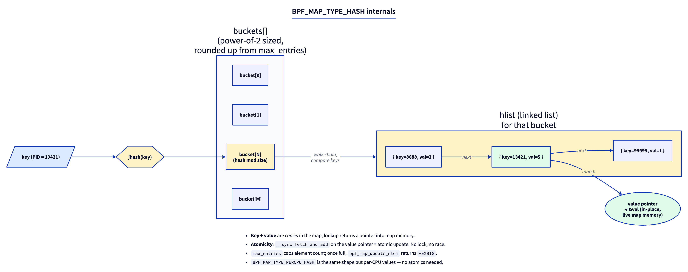
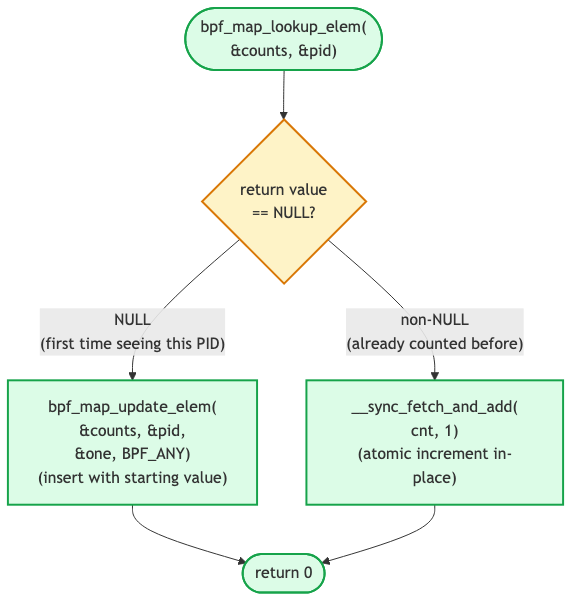

# Day 2 — Hash maps and per-PID counters

> **Today's mission:** count `unlink()` calls per PID, dump the running totals on demand. Learn what a hash map is, what the Verifier knows about lookups, and why your tracer must clean up after itself or it dies. Total time: ~75 minutes.

## The shared notebook

Yesterday you sent events to userspace one at a time. That works for streaming, but doesn't help when you want a *summary* — "how many times did each PID call `unlink`?"

You want a **shared notebook** between kernel and userspace. The BPF program writes counts. Userspace reads them when it wants. The notebook lives in kernel memory, persists across program invocations, and survives until you tear it down.

That's a **map**. Today's flavor: `BPF_MAP_TYPE_HASH`.

---

## Meet the cast

### `BPF_MAP_TYPE_HASH` — the bread-and-butter map

A kernel-resident hash table. Fixed-capacity (`max_entries`), key/value sizes declared at creation, accessible from both BPF and userspace through map FDs. Internally it's a power-of-two-sized array of buckets, each holding an `hlist` (singly linked list) of `{key, value}` pairs. Lookup hashes the key, finds the bucket, walks the chain.



The bits worth remembering today:

- **Lookup returns a pointer into map memory** — not a copy. You can read it. You can atomically update it. Two things you cannot do: hold it across helper calls that might reallocate, or assume it's non-NULL.
- **`max_entries` is a hard cap.** Once full, inserts fail with `-E2BIG`. There is no automatic eviction. (LRU and LRU-percpu variants exist if you want eviction; see Day 11.)
- **No locks for you.** The kernel handles bucket-level synchronization internally. For atomic value updates, you use `__sync_fetch_and_add` and friends on the value pointer.
- **Per-CPU variant** (`BPF_MAP_TYPE_PERCPU_HASH`): same shape, but each CPU has its own value slot. No atomics needed; userspace must sum across CPUs to get a total. Use it when contention matters (high-rate counters, e.g. XDP).

Source: `kernel/bpf/hashtab.c`. The constructor is `htab_map_alloc`, the lookup is `htab_map_lookup_elem`. Look at the file once. It's not magic.

### `PTR_TO_MAP_VALUE_OR_NULL` — your first taste of the Verifier's type system

When you call `bpf_map_lookup_elem`, the Verifier marks the returned register with type `PTR_TO_MAP_VALUE_OR_NULL`. That type means: *might be a valid pointer to a map value, might be NULL — I don't know yet*.

You cannot dereference a pointer of that type. Until you prove it's non-NULL, the Verifier rejects every load through it.

How do you prove it? With a null check:

```c
__u64 *cnt = bpf_map_lookup_elem(&counts, &pid);
if (!cnt)
    return 0;
*cnt += 1;   // ← now legal: cnt is PTR_TO_MAP_VALUE
```

Inside the `if (!cnt)` branch, the Verifier knows `cnt == NULL` and pushes that branch into "this code is unreachable past this return." Outside the branch, it knows `cnt != NULL` — it transitions the register's type from `PTR_TO_MAP_VALUE_OR_NULL` to `PTR_TO_MAP_VALUE`. The deref becomes legal.

You'll deepen this on Day 4. For today: **always check the lookup result against NULL.**

> ### There are no Dumb Questions
>
> **Q: Why does the kernel make me check for NULL? Why not just return a sentinel value or pre-allocate?**
>
> A: Pre-allocation would mean the map *guarantees* every key has a value, which is exactly what `BPF_MAP_TYPE_ARRAY` does (with integer keys). For hash maps, the answer "this key isn't in the map" is meaningful — you need to know whether to insert or update. Sentinels would require the kernel to runtime-check every dereference. The Verifier's static check pushes that cost to compile time, where it costs nothing at runtime.
>
> **Q: I'm tempted to use a global variable instead of a map. Why not?**
>
> A: Global variables in BPF programs *do* exist (.bss/.data sections backed by `BPF_MAP_TYPE_ARRAY` of size 1 under the hood — see Day 7). They're great for config and singletons. But for *per-key* state (counts per PID, latencies per syscall, denylist of IPs), you need a hash. Globals can't be looked up by key.
>
> **Q: How does the kernel pick a hash function?**
>
> A: For arbitrary key sizes the hash map computes the bucket index in `htab_map_hash` (`kernel/bpf/hashtab.c`), which calls `jhash2` for 4-byte-aligned keys and `jhash` (Jenkins hash) otherwise. The hash is fixed; you don't get to choose. For very large keys this matters; for the 4-byte PIDs we're using today it doesn't.

### `BPF_ANY` / `BPF_NOEXIST` / `BPF_EXIST` — update flags

`bpf_map_update_elem` takes a flag:

- `BPF_ANY` — insert if absent, update if present.
- `BPF_NOEXIST` — insert if absent, **fail with -EEXIST** if present.
- `BPF_EXIST` — update if present, **fail with -ENOENT** if absent.

Use `BPF_NOEXIST` defensively when you want to be sure you're not stomping someone else's entry. Use `BPF_ANY` when you don't care.

### `__sync_fetch_and_add` — atomics in BPF

BPF programs don't have access to most C library facilities, but they *do* have GCC-style sync builtins. `__sync_fetch_and_add(p, n)` atomically adds `n` to `*p` and returns the old value. Compiles to `BPF_XADD` (atomic add) or `BPF_ATOMIC` (general atomic) instructions. The JIT lowers these to native LL/SC or `lock xadd` depending on architecture.

Why use it? Because the same map slot can be written from concurrent BPF instances on different CPUs. Without atomics, increments race and you lose counts.

---

## The lab

### `count.bpf.c` — extend yesterday's program

```c
#include "vmlinux.h"
#include <bpf/bpf_helpers.h>
#include <bpf/bpf_tracing.h>

char LICENSE[] SEC("license") = "GPL";

struct {
    __uint(type, BPF_MAP_TYPE_HASH);
    __uint(max_entries, 8192);
    __type(key, __u32);
    __type(value, __u64);
} counts SEC(".maps");

SEC("fentry/filename_unlinkat")
int BPF_PROG(on_unlink)
{
    __u32 pid = bpf_get_current_pid_tgid() >> 32;
    __u64 *cnt = bpf_map_lookup_elem(&counts, &pid);
    if (cnt) {
        __sync_fetch_and_add(cnt, 1);
    } else {
        __u64 one = 1;
        bpf_map_update_elem(&counts, &pid, &one, BPF_NOEXIST);
    }
    return 0;
}
```



What's new:

- The map is declared just like ringbuf: a struct in `SEC(".maps")` whose macros set type/size/key/value through BTF.
- `bpf_map_lookup_elem(&counts, &pid)` — note we pass the address of `pid`, not the value. The kernel reads `key_size` bytes starting from that address. If you accidentally passed `pid` (a value), you'd be telling the kernel to interpret an integer as a pointer. The Verifier catches this.
- The `else` branch uses `BPF_NOEXIST` instead of `BPF_ANY`. Why? Because we know `cnt == NULL` here, so we expect insert. If two CPUs race and both see NULL, only one's `BPF_NOEXIST` succeeds; the other gets `-EEXIST` and we silently miss one increment. With `BPF_ANY`, the loser would silently overwrite the winner's count to 1. Neither is perfect; for production-grade you'd either use percpu hash (no race) or retry on `-EEXIST`. For today the cosmetic miss is fine.

### `count.c` — userspace dumper

Same skeleton structure as Day 1, but instead of polling a ringbuf, periodically iterate the map:

```c
#include <stdio.h>
#include <unistd.h>
#include <bpf/libbpf.h>
#include "count.skel.h"

int main(void)
{
    struct count_bpf *skel = count_bpf__open_and_load();
    if (!skel) return 1;
    if (count_bpf__attach(skel)) return 1;

    int fd = bpf_map__fd(skel->maps.counts);
    while (1) {
        sleep(2);
        printf("--- snapshot ---\n");
        __u32 key = 0, next;
        __u64 val;
        while (bpf_map_get_next_key(fd, &key, &next) == 0) {
            if (bpf_map_lookup_elem(fd, &next, &val) == 0)
                printf("PID %u: %llu unlinks\n", next, val);
            key = next;
        }
    }
}
```

`bpf_map_get_next_key` walks the map. Calling it with `key=NULL` returns the first key. Calling it with the previous key returns the next. Returns `-ENOENT` when the iteration is exhausted.

### Run it

```bash
make
sudo ./count &
# in another terminal, generate work:
for i in $(seq 1 100); do touch /tmp/x$i && rm /tmp/x$i; done
# wait 2s for the next snapshot
```

Expected:

```
--- snapshot ---
PID 14392: 100 unlinks
```

You can also dump from `bpftool` without writing the userspace iterator:

```bash
sudo bpftool map dump name counts
```

---

## What to break, in order

### Break 1 — Drop the null check (rerun of Day 1, in a real context)

Change to:

```c
__u64 *cnt = bpf_map_lookup_elem(&counts, &pid);
*cnt += 1;
```

Verifier rejects:

```
R1 type=map_value_or_null expected=map_value
```

Same lesson as Day 1, now with a hash map. The Verifier's type system does not distinguish between "ringbuf reserve might fail" and "hash lookup might miss" — both produce `PTR_TO_MAP_VALUE_OR_NULL` (or `PTR_TO_MEM_OR_NULL`), both must be checked.

### Break 2 — `max_entries = 0`

Change `max_entries` to 0 and rebuild. The loader fails:

```
libbpf: map 'counts': failed to create: Invalid argument
```

Map config errors fail before the Verifier runs. Read `kernel/bpf/hashtab.c:htab_map_alloc_check` to see the validation rules.

### Break 3 — Wrong key size

Change `__type(key, __u32)` to `__type(key, __u64)` but keep passing `__u32 pid` (4 bytes) as the lookup key. The lookup will use 8 bytes starting at `&pid`, reading 4 bytes of stack garbage. You'll see weird behavior: many keys, each one off by random bytes from the actual PID.

The Verifier *might* catch this (depending on how `pid` is laid out on the stack); it might not. Lesson: **map key/value types must exactly match how you call into them.** Mismatches don't reliably fail at load time.

### Break 4 — The "tracer that won't clean up" pattern (preview of Day 9)

This break uses the Day 1 fentry+ringbuf program but with a twist:

```c
SEC("fentry/vfs_read")
int BPF_PROG(on_read)
{
    __u64 tid = bpf_get_current_pid_tgid();
    __u64 ts = bpf_ktime_get_ns();
    bpf_map_update_elem(&counts, &tid, &ts, BPF_ANY);
    return 0;
}
```

Run for a minute. Watch the map fill:

```bash
sudo bpftool map dump name counts | wc -l
```

Without `bpf_map_delete_elem` somewhere, every TID that ever called `vfs_read` gets a permanent entry. Once you hit `max_entries`, new TIDs silently fail to insert. This is the bug Day 9 is about — but the lesson is here too: **map entries don't expire on their own. If you insert, plan to delete.**

---

## What to read in the kernel

- **`kernel/bpf/hashtab.c`** — open it, read `htab_map_lookup_elem` (small) and `htab_map_update_elem` (longer). Note the bucket-level lock and the per-CPU variant. The file is ~1500 lines but you only need to read the lookup/update path today.
- **`kernel/bpf/verifier.c`** — search `mark_ptr_or_null_regs`. This is the function that flips a register's type from `PTR_TO_MAP_VALUE_OR_NULL` to `PTR_TO_MAP_VALUE` after a null check. Don't try to read the whole verifier — just this function and its callers. Maybe 50 lines.
- **`include/uapi/linux/bpf.h`** — search `BPF_MAP_TYPE_`. Skim every entry. You don't need to know each one yet; just know they exist. We'll use about half of them across these 30 days.

---

## Bullet Points

- A **map** is the kernel-resident shared notebook between BPF and userspace. `BPF_MAP_TYPE_HASH` is the workhorse.
- **Lookup returns a pointer into live map memory**, not a copy. The Verifier marks it `PTR_TO_MAP_VALUE_OR_NULL` until you check.
- **Always check `bpf_map_lookup_elem` for NULL** before dereferencing.
- **`max_entries` is a hard cap** with no automatic eviction. Inserting into a full hash map returns `-E2BIG`.
- **Atomic updates use `__sync_fetch_and_add`** and friends — without them, concurrent updates race and lose counts.
- **`BPF_MAP_TYPE_PERCPU_HASH`** trades cross-CPU summing in userspace for race-free updates in the kernel — use it when the hot path is contended.
- **Don't insert without a plan to delete.** Maps don't expire entries; tracers that don't clean up degrade silently into oblivion.

---

## Check question

Two CPUs simultaneously execute the program for the same PID, both observe `cnt == NULL`, and both try `bpf_map_update_elem(..., BPF_NOEXIST)`. What happens?

<details>
<summary>Click to reveal answer</summary>

**Answer:** The first to acquire the bucket lock (in `htab_map_update_elem`) succeeds and inserts. The second observes the entry now exists and returns `-EEXIST`. The losing CPU's increment is lost — value is 1 instead of 2. To avoid this entirely, use `BPF_MAP_TYPE_PERCPU_HASH` (no cross-CPU contention) or detect `-EEXIST` and retry with `__sync_fetch_and_add` on the now-existing entry.

</details>

---

## Tomorrow

Day 3: CO-RE in anger. Read `task->real_parent->tgid` from BPF in a way that survives kernel upgrades. The first time `vmlinux.h` and CO-RE relocations earn their keep.
