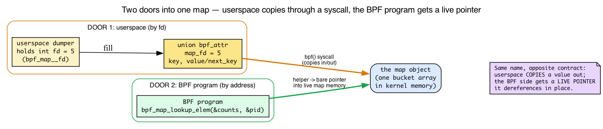
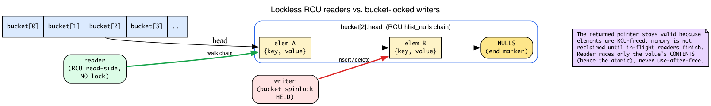
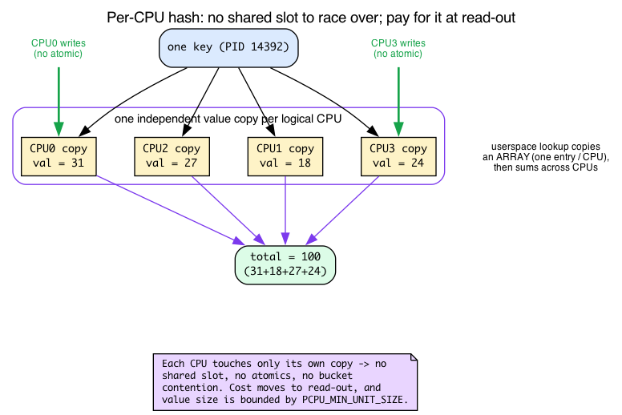

# Day 2 — Hash maps and per-PID counters

> **Today's mission:** count `unlink()` calls per PID, dump the running totals on demand. Learn what a hash map *is* — the bucket array, the lockless lookup, the per-CPU variant — what the Verifier knows about lookups, how userspace reaches into kernel map memory through a file descriptor, and why your tracer must clean up after itself or it dies. Total time: ~110 minutes.

## The shared notebook

Yesterday you sent events to userspace one at a time. That works for streaming, but doesn't help when you want a *summary* — "how many times did each PID call `unlink`?"

You want a **shared notebook** between kernel and userspace. The BPF program writes counts. Userspace reads them when it wants. The notebook lives in kernel memory, persists across program invocations, and survives until you tear it down.

That's a **map**. Today's flavor: `BPF_MAP_TYPE_HASH`.

But "shared notebook" hides three things that will bite you if you don't understand them, and the rest of today is about making them obvious:

1. **How userspace even touches a kernel map.** The BPF side and the userspace side talk to the *same* map through two completely different doors — and, confusingly, through two functions with the *same name*.
2. **Why the kernel can hand your BPF program a raw pointer into map memory and trust you to dereference it** without ever taking a lock. (Spoiler: RCU.)
3. **Why a per-CPU map dodges races entirely** — which means knowing what "per-CPU memory" actually is.

We'll teach each as we hit the part of the lab that depends on it.

---

## Meet the cast

### `BPF_MAP_TYPE_HASH` — the bread-and-butter map

A kernel-resident hash table. Fixed-capacity (`max_entries`), key/value sizes declared at creation, accessible from both BPF and userspace. Internally it's a **power-of-two-sized array of buckets**, each holding a chained list of `{key, value}` pairs. Lookup hashes the key, masks it down to a bucket index, and walks the chain.


You can see every one of those words in the source. In `kernel/bpf/hashtab.c`:

```c
/* kernel/bpf/hashtab.c:80 */
struct bucket {
    struct hlist_nulls_head head;   /* the chain of elements */
    rqspinlock_t            raw_lock;
};
```

The bucket index is just the hash masked to the array size — and because the array is a power of two, that mask is a single `&`:

```c
/* kernel/bpf/hashtab.c:686 — select_bucket() */
return &__select_bucket(htab, hash)->head;   /* index = hash & (n_buckets - 1) */
```

The bits worth remembering today:

- **Lookup returns a pointer into map memory** — not a copy. You can read it. You can atomically update it. What you cannot do is assume it's non-NULL. And while the *element* won't be freed under you (RCU guarantees that — see below), its *contents* can change concurrently, so bumping a counter needs an atomic.
- **`max_entries` is a hard cap.** Once full, inserts fail with `-E2BIG` (`is_map_full` → `ERR_PTR(-E2BIG)` at `hashtab.c:1108`). There is no automatic eviction. (LRU and LRU-percpu variants exist if you want eviction; see Day 11.)
- **No locks for you.** The kernel handles bucket-level synchronization internally — we'll see exactly *how* in a moment, because it's the reason the returned pointer is safe to dereference. For atomic value updates, you use `__sync_fetch_and_add` and friends on the value pointer.
- **Per-CPU variant** (`BPF_MAP_TYPE_PERCPU_HASH`): same shape, but each CPU has its own value slot. No atomics needed; userspace must sum across CPUs to get a total. Use it when contention matters (high-rate counters, e.g. XDP).

Source: `kernel/bpf/hashtab.c`. The lookup is `htab_map_lookup_elem` (`:752`); the update is `htab_map_update_elem` (`:1171`). Look at the file once. It's not magic — and by the end of today you'll have read the parts that matter.

### Two doors into one map: the map fd, and the two functions both called `bpf_map_lookup_elem`

Here is a thing the tutorials never tell you, and it will confuse you the *first time* you put the BPF side and the userspace side on one screen: **`bpf_map_lookup_elem` is the name of two completely different functions with opposite contracts.** You will write both today, in two different files. Let's separate them now so you never trip on it.

**First: what is a map, from each side?** A loaded map is a single in-kernel object — that bucket array we just looked at. Neither the BPF program nor your userspace dumper holds a pointer to it directly. They reach it two different ways:

- **The BPF program** refers to the map *by address of its declaration* (`&counts`). At load time the kernel rewrites that into a direct reference to the kernel object. The program runs *inside* the kernel, so when it asks for an element it gets a **bare pointer straight into live map memory.**
- **Userspace** cannot hold a kernel pointer. It refers to the map through an **integer file descriptor** — the same kind of small int as an open file. `bpf_map__fd(skel->maps.counts)` pulls that fd out of the skeleton. (You used the exact same `bpf_map__fd` for the ringbuf yesterday and I never told you what the int *was* — now you know: it's a handle to a kernel object, nothing more.)



**Now the two functions.** They have the same name and do almost-opposite things:

| | BPF-side `bpf_map_lookup_elem(&counts, &pid)` | Userspace `bpf_map_lookup_elem(fd, &key, &val)` |
|---|---|---|
| What it is | a **BPF helper**, runs inside the kernel | a **libbpf wrapper** around the `bpf()` syscall |
| Takes the map by | **address** (`&counts`) | **file descriptor** (an int) |
| What you get back | a **live pointer** into map memory (`PTR_TO_MAP_VALUE`) | nothing — it **copies the value out** into your buffer |
| You read the result via | dereferencing the returned pointer | reading the `&val` you passed in |

The userspace side is a *thin wrapper*. Open `tools/lib/bpf/bpf.c` and you'll find it does nothing but fill a struct and issue a syscall:

```c
/* tools/lib/bpf/bpf.c:407 */
int bpf_map_lookup_elem(int fd, const void *key, void *value)
{
    union bpf_attr attr;
    memset(&attr, 0, attr_sz);
    attr.map_fd = fd;
    attr.key    = ptr_to_u64(key);
    attr.value  = ptr_to_u64(value);          /* a buffer to copy INTO */
    ret = sys_bpf(BPF_MAP_LOOKUP_ELEM, &attr, attr_sz);
    return libbpf_err_errno(ret);
}
```

Every userspace map call follows this exact pattern — fill a `union bpf_attr`, call `sys_bpf(...)`:

- `bpf_map_update_elem(fd, …)` → `sys_bpf(BPF_MAP_UPDATE_ELEM, …)` (`bpf.c:390`)
- `bpf_map_delete_elem(fd, …)` → `sys_bpf(BPF_MAP_DELETE_ELEM, …)` (`bpf.c:469`)
- `bpf_map_get_next_key(fd, …)` → `sys_bpf(BPF_MAP_GET_NEXT_KEY, …)` (`bpf.c:498`, syscall issued at `:509`)

That last one, `bpf_map_get_next_key`, is how userspace *iterates* a map: call it with one key, it hands you the next. There's no single syscall behind `bpf_map_get_next_key` that walks the whole map for you — it hands back one key per call, so the `get_next_key` loop lives in userspace. (A separate batch API, `BPF_MAP_LOOKUP_BATCH`, can pull many entries per syscall — that's what `bpftool map dump` uses — but it's not what `get_next_key` does.) **This is why the dump loop in `count.c` below is an ordinary userspace `while` loop, not BPF code.**

So when you see `bpf_map_lookup_elem` on the BPF side returning a pointer you dereference, and `bpf_map_lookup_elem` on the userspace side copying into a buffer you read — same name, opposite contract. Keep them straight and the rest of today is easy.

### Why the kernel trusts you with a raw pointer: RCU lookups and a per-bucket lock

Back to a claim I made above and then walked past: *lookup returns a pointer into live map memory, no lock required, and you may dereference it.* Stop and feel how scary that should be. Another CPU could be inserting or deleting in that same bucket at the same instant. How is it safe for your program to walk the chain and dereference an element with **no lock at all**?

The answer is two different synchronization mechanisms for two different jobs — and knowing which is which explains every "do I need an atomic here?" question you'll ever ask about hash maps.

**Job 1 — reads (lookup): RCU, no lock.** RCU (Read-Copy-Update) is a kernel synchronization scheme where readers never take a lock and never block, and freeing is deferred until every in-flight reader has finished — those two guarantees are all we need here. Each bucket's chain isn't a plain linked list; it's an **RCU-protected `hlist_nulls`** (`struct hlist_nulls_head head;` in that `struct bucket`). Two properties make a lockless walk safe:

- **Readers run in an RCU read-side critical section and take *no* lock.** That is literally why the helper can hand your program a raw pointer — there's no lock to hold or drop. The source even labels the two walkers by whether they need the lock:

  ```c
  /* hashtab.c:691 — needs the bucket lock */
  /* this lookup function can only be called with bucket lock taken */
  static struct htab_elem *lookup_elem_raw(...)

  /* hashtab.c:705 — the RCU read-side walk, used by the lookup helper */
  /* can be called without bucket lock. it will repeat the loop in
   * the unlikely event when elements moved from one bucket into another
   * while link list is being walked */
  static struct htab_elem *lookup_nulls_elem_raw(...)
  ```

- **Elements are RCU-freed.** When a writer removes an element, the memory isn't reclaimed until all in-flight readers have finished. So the element your program is looking at *cannot be deallocated out from under you while your program runs.* Your null-check-then-dereference is racing only against the *contents* of the value (which is why you still need an atomic to bump a counter), never against use-after-free. That `_nulls` flavor of the list exists precisely so a lockless reader can detect "this element hopped to another bucket mid-walk" and restart the loop (the `goto again` in `lookup_nulls_elem_raw`).

**Job 2 — writes (insert / replace / delete): the per-bucket spinlock.** That second field in the bucket, `rqspinlock_t raw_lock`, is taken only by writers. `htab_map_update_elem` grabs it before touching the chain:

```c
/* hashtab.c:1217, inside htab_map_update_elem */
ret = htab_lock_bucket(b, &flags);
```

This is the "bucket-level synchronization" I mentioned, and the "bucket lock" the Check question at the bottom names. Three things to notice:

- It's **one lock per bucket**, so two writes to *different* keys that land in *different* buckets never contend. Contention is only between keys that collide into the same bucket.
- It serializes writers against each other *and* against `sys_bpf()` calls from userspace — the file's big block comment above `struct bucket` (`hashtab.c:35`) spells out both scopes ("Serializing concurrent operations from BPF programs on different CPUs" and "between BPF programs and sys_bpf()").
- It's a **raw, resilient queued spinlock** (`rqspinlock_t`) on purpose: BPF programs run in atomic contexts (perf, kprobes, tracing), where you cannot take a sleeping lock. A raw spinlock is safe to grab from there. The comment block walks through exactly why that choice is forced.

**The punchline you'll use constantly:** lookup gives you an *unlocked* live pointer; the bucket lock protects *insert/delete*, not *your* writes to the value. So two CPUs that both looked up the same slot and both want to `+= 1` are not protected by anything — which is exactly why the counter increment must be an atomic `__sync_fetch_and_add`. Different paths, different synchronization.



### `BPF_MAP_TYPE_PERCPU_HASH` — and what "per-CPU" actually means

The check-question answer at the bottom recommends a per-CPU hash to dodge the increment race entirely. To understand *why* it dodges the race, you need to know what "per-CPU memory" means — nothing earlier in this book has taught it, so here it is.

**The intuition.** A per-CPU value is not one slot shared by everyone. The kernel allocates **one independent copy of the value for every logical CPU.** When a BPF program reads or writes that value, it transparently touches **only the copy belonging to the CPU it is currently running on.** Two CPUs working on "the same key" are physically touching *different memory*. There is no sharing to race over.

That single fact has three consequences:

- **No atomics, no bucket contention on the value.** Each CPU bumps its private copy with an ordinary load/store. You've traded *kernel-side contention* for *userspace work*.
- **Read-out costs more.** When userspace calls `bpf_map_lookup_elem(fd, &key, …)` on a per-CPU map, the value it copies out is an **array — one entry per CPU.** To get the logical total you must sum across all CPUs. The single-`__u64` dumper in `count.c` below would have to change to read an array and add it up.
- **Values are size-bounded.** A per-CPU value is allocated from a special per-CPU allocator (the `pcpu_ma` in `struct bpf_htab`), and the rounded-up value size must fit `PCPU_MIN_UNIT_SIZE`:

  ```c
  /* hashtab.c:458, in htab_map_alloc_check */
  /* percpu map value size is bound by PCPU_MIN_UNIT_SIZE */
  if (percpu && round_up(attr->value_size, 8) > PCPU_MIN_UNIT_SIZE)
      return -E2BIG;
  ```

  A regular hash value isn't bounded this way — so if your values get large, per-CPU has a real ceiling.

**When to use which.** Reach for `BPF_MAP_TYPE_PERCPU_HASH` (`include/uapi/linux/bpf.h:1005`) when the hot path is *contended* — high-rate counters, XDP per-packet stats. Reach for a plain `BPF_MAP_TYPE_HASH` (`:1001`) plus `__sync_fetch_and_add` when contention is low and you want **one authoritative slot** you can read without summing. (`BPF_MAP_TYPE_LRU_HASH` at `:1009` is a third option when you also want eviction; Day 11.)



### `PTR_TO_MAP_VALUE_OR_NULL` — your first taste of the Verifier's type system

When you call `bpf_map_lookup_elem`, the Verifier marks the returned register with type `PTR_TO_MAP_VALUE_OR_NULL`. That type means: *might be a valid pointer to a map value, might be NULL — I don't know yet*.

You cannot dereference a pointer of that type. Until you prove it's non-NULL, the Verifier rejects every load through it.

How do you prove it? With a null check:

```c
__u64 *cnt = bpf_map_lookup_elem(&counts, &pid);
if (!cnt)
    return 0;
*cnt += 1;   // ← now legal: cnt is PTR_TO_MAP_VALUE
```

Inside the `if (!cnt)` branch, the Verifier knows `cnt == NULL` and pushes that branch into "this code is unreachable past this return." Outside the branch, it knows `cnt != NULL` — it transitions the register's type from `PTR_TO_MAP_VALUE_OR_NULL` to `PTR_TO_MAP_VALUE`. The deref becomes legal.

You'll deepen this on Day 4. For today: **always check the lookup result against NULL.** (And note the connection back to RCU: the reason a *non-NULL* `PTR_TO_MAP_VALUE` is safe to dereference at all is that the element is RCU-freed — the Verifier guarantees you checked for NULL; RCU guarantees the memory won't vanish mid-program.)

> ### There are no Dumb Questions
>
> **Q: Why does the kernel make me check for NULL? Why not just return a sentinel value or pre-allocate?**
>
> A: Pre-allocation would mean the map *guarantees* every key has a value, which is exactly what `BPF_MAP_TYPE_ARRAY` does (with integer keys). For hash maps, the answer "this key isn't in the map" is meaningful — you need to know whether to insert or update. Sentinels would require the kernel to runtime-check every dereference. The Verifier's static check pushes that cost to compile time, where it costs nothing at runtime.
>
> **Q: I'm tempted to use a global variable instead of a map. Why not?**
>
> A: Global variables in BPF programs *do* exist (.bss/.data sections backed by `BPF_MAP_TYPE_ARRAY` of size 1 under the hood — see Day 7). They're great for config and singletons. But for *per-key* state (counts per PID, latencies per syscall, denylist of IPs), you need a hash. Globals can't be looked up by key.
>
> **Q: How does the kernel pick a hash function?**
>
> A: `htab_map_hash` (`kernel/bpf/hashtab.c:674`) computes the *hash* — it calls `jhash2` when the key size is a multiple of 4 bytes (`key_len % 4 == 0`) and `jhash` otherwise (both are Jenkins-hash variants). The *bucket index* is then `hash & (n_buckets - 1)`, done in `__select_bucket`. The hash is fixed; you don't get to choose. For very large keys this matters; for the 4-byte PIDs we're using today it doesn't.

### `BPF_ANY` / `BPF_NOEXIST` / `BPF_EXIST` — update flags

`bpf_map_update_elem` takes a flag:

- `BPF_ANY` — insert if absent, update if present.
- `BPF_NOEXIST` — insert if absent, **fail with -EEXIST** if present.
- `BPF_EXIST` — update if present, **fail with -ENOENT** if absent.

Use `BPF_NOEXIST` defensively when you want to be sure you're not stomping someone else's entry. Use `BPF_ANY` when you don't care. The semantics live in `check_flags` (`hashtab.c:1156`), which returns `-EEXIST` for the `BPF_NOEXIST`-but-present case and `-ENOENT` for the `BPF_EXIST`-but-absent case — and the flag values themselves are in `include/uapi/linux/bpf.h:1392` (`BPF_ANY=0, BPF_NOEXIST=1, BPF_EXIST=2`).

### `__sync_fetch_and_add` — atomics in BPF

BPF programs don't have access to most C library facilities, but they *do* have GCC-style sync builtins. `__sync_fetch_and_add(p, n)` atomically adds `n` to `*p` and returns the old value. Compiles to `BPF_XADD` (atomic add) or `BPF_ATOMIC` (general atomic) instructions — both are opcode `0xc0`, with `BPF_XADD` being the legacy name (`include/uapi/linux/bpf.h:23-24`). The JIT lowers these to native LL/SC or `lock xadd` depending on architecture.

Why use it? Because (as the RCU section just showed) the lookup pointer is unlocked and concurrent CPUs can write the same slot — without an atomic you lose counts.

---

## The lab

### `count.bpf.c` — swap yesterday's ringbuf for a hash map

```c
#include "vmlinux.h"
#include <bpf/bpf_helpers.h>
#include <bpf/bpf_tracing.h>

char LICENSE[] SEC("license") = "GPL";

struct {
    __uint(type, BPF_MAP_TYPE_HASH);
    __uint(max_entries, 8192);
    __type(key, __u32);
    __type(value, __u64);
} counts SEC(".maps");

SEC("fentry/filename_unlinkat")
int BPF_PROG(on_unlink)
{
    __u32 pid = bpf_get_current_pid_tgid() >> 32;
    __u64 *cnt = bpf_map_lookup_elem(&counts, &pid);
    if (cnt) {
        __sync_fetch_and_add(cnt, 1);
    } else {
        __u64 one = 1;
        bpf_map_update_elem(&counts, &pid, &one, BPF_NOEXIST);
    }
    return 0;
}
```


What's new:

- The map is declared just like ringbuf: a struct in `SEC(".maps")` whose macros set type/size/key/value through BTF.
- `bpf_map_lookup_elem(&counts, &pid)` — the **BPF-side** function from the table above. It takes the map *by address* and returns a *live pointer*. Note we pass the address of `pid`, not the value. The kernel reads `key_size` bytes starting from that address. If you accidentally passed `pid` (a value), you'd be telling the kernel to interpret an integer as a pointer. The Verifier catches this.
- The `else` branch uses `BPF_NOEXIST` instead of `BPF_ANY`. Why? Because we know `cnt == NULL` here, so we expect insert. If two CPUs race and both see NULL, only one's `BPF_NOEXIST` succeeds; the other gets `-EEXIST` and we silently miss one increment. With `BPF_ANY`, the loser would silently overwrite the winner's count to 1. Neither is perfect; for production-grade you'd either use percpu hash (no race) or retry on `-EEXIST`. For today the cosmetic miss is fine.

### `count.c` — userspace dumper

Same `fentry` hook as Day 1, but the output channel changes from a ringbuf to a map: instead of polling a ringbuf, periodically iterate the map — and now you know the iteration is driven entirely from userspace, one syscall per call:

```c
#include <stdio.h>
#include <unistd.h>
#include <bpf/libbpf.h>
#include "count.skel.h"

int main(void)
{
    struct count_bpf *skel = count_bpf__open_and_load();
    if (!skel) return 1;
    if (count_bpf__attach(skel)) return 1;

    int fd = bpf_map__fd(skel->maps.counts);
    while (1) {
        sleep(2);
        printf("--- snapshot ---\n");
        __u32 key, next;
        __u32 *prev = NULL;          /* NULL on the first call → first key */
        __u64 val;
        while (bpf_map_get_next_key(fd, prev, &next) == 0) {
            if (bpf_map_lookup_elem(fd, &next, &val) == 0)
                printf("PID %u: %llu unlinks\n", next, val);
            key = next;
            prev = &key;
        }
    }
}
```

Three things to connect back to the "two doors" section:

- `bpf_map__fd(skel->maps.counts)` pulls the **integer fd** out of the skeleton — that's userspace's only handle on the kernel map.
- `bpf_map_get_next_key(fd, prev, &next)` walks the map. Calling it with a NULL previous-key pointer returns the first key; calling it with the previous key returns the next; it returns `-ENOENT` when iteration is exhausted. Each call is one `sys_bpf(BPF_MAP_GET_NEXT_KEY, …)`. *This* is why the loop lives in userspace.
- `bpf_map_lookup_elem(fd, &next, &val)` here is the **userspace** function — it copies the value into `val`, which we then read. (Contrast with the BPF side, which got a live pointer.)

### Run it

```bash
make
sudo ./count &
# in another terminal, generate work — let ONE rm process do all 100 unlinks
# so the count aggregates under a single PID:
for i in $(seq 1 100); do touch /tmp/x$i; done
rm /tmp/x*
# wait 2s for the next snapshot
```

Note the two-step workload: if you `rm` *inside* the loop (`touch ... && rm ...`), the shell forks a brand-new `rm` process every iteration, so each `unlink` comes from a different PID and the map fills with ~100 entries of value 1 — the exact opposite of what we're demonstrating. Batching the deletes into a single `rm /tmp/x*` makes one process issue all 100 `unlinkat` calls, so they aggregate under one PID.

Expected — the snapshot also lists other PIDs from unrelated background `unlink` activity (systemd, systemd-logind, etc.), so look for the line showing `100`:

```
--- snapshot ---
PID 14392: 100 unlinks
```

You can also dump from `bpftool` without writing the userspace iterator:

```bash
sudo bpftool map dump name counts
```

When you're done, stop the backgrounded dumper — it runs an infinite `while(1)` snapshot loop and won't exit on its own:

```bash
sudo kill %1   # or: sudo pkill -f ./count
```

(The scratch files are already gone — `rm /tmp/x*` above removed them.)

---

## What to break, in order

### Break 1 — Drop the null check (rerun of Day 1, in a real context)

Change to:

```c
__u64 *cnt = bpf_map_lookup_elem(&counts, &pid);
*cnt += 1;
```

Verifier rejects:

```
; *cnt += 1;
R1 invalid mem access 'map_value_or_null'
```

The `*cnt += 1` is a *direct* store through a `PTR_TO_MAP_VALUE_OR_NULL` register, so the verifier's `check_mem_access` falls through to its catch-all and prints `invalid mem access 'map_value_or_null'` (`kernel/bpf/verifier.c`). The `type=... expected=...` format is a different message — it comes from the helper-argument type checker when you hand a possibly-NULL pointer to a *helper*, not when you dereference it yourself. The exact register number depends on how clang allocates the lookup result, so yours may read `R0` instead of `R1`.

Same lesson as Day 1, now with a hash map. The Verifier's type system does not distinguish between "ringbuf reserve might fail" and "hash lookup might miss" — both produce `PTR_TO_MAP_VALUE_OR_NULL` (or `PTR_TO_MEM_OR_NULL`), both must be checked.

### Break 2 — `max_entries = 0`

Change `max_entries` to 0 and rebuild. The loader fails:

```
libbpf: map 'counts': failed to create: Invalid argument
```

Map config errors fail before the Verifier runs. Read `kernel/bpf/hashtab.c:htab_map_alloc_check` (`:407`) to see the validation rules — including the explicit `attr->max_entries == 0 || attr->key_size == 0 || attr->value_size == 0` → `-EINVAL` check at `hashtab.c:446`, which is the `Invalid argument` you just hit.

### Break 3 — Wrong key size

Change `__type(key, __u32)` to `__type(key, __u64)` but keep passing `__u32 pid` (4 bytes) as the lookup key. The lookup will use 8 bytes starting at `&pid`, reading 4 bytes of stack garbage. You'll see weird behavior: many keys, each one off by random bytes from the actual PID.

The Verifier *might* catch this (depending on how `pid` is laid out on the stack); it might not. Lesson: **map key/value types must exactly match how you call into them.** Mismatches don't reliably fail at load time.

### Break 4 — The "tracer that won't clean up" pattern (preview of Day 9)

This break uses the Day 1 fentry+ringbuf program but with a twist:

```c
SEC("fentry/vfs_read")
int BPF_PROG(on_read)
{
    __u64 tid = bpf_get_current_pid_tgid();
    __u64 ts = bpf_ktime_get_ns();
    bpf_map_update_elem(&counts, &tid, &ts, BPF_ANY);
    return 0;
}
```

Run for a minute. Watch the map fill:

```bash
sudo bpftool map dump name counts | wc -l
```

Without `bpf_map_delete_elem` somewhere, every TID that ever called `vfs_read` gets a permanent entry. Once you hit `max_entries`, new TIDs silently fail to insert. This is the bug Day 9 is about — but the lesson is here too: **map entries don't expire on their own. If you insert, plan to delete.**

---

## What to read in the kernel

- **`kernel/bpf/hashtab.c`** — open it, read `htab_map_lookup_elem` (small) and `htab_map_update_elem` (longer). Note the per-bucket lock (`htab_lock_bucket`, `:149`; taken in update at `:1217`) and the two chain walkers — `lookup_elem_raw` ("can only be called with bucket lock taken", `:691`) vs the lockless RCU `lookup_nulls_elem_raw` (`:705`). The file is ~2700 lines but you only need the lookup/update path today.
- **`kernel/bpf/verifier.c`** — search `mark_ptr_or_null_regs` (`:16060`; the per-register worker `mark_ptr_or_null_reg` is at `:16015`). This is the function that flips a register's type from `PTR_TO_MAP_VALUE_OR_NULL` to `PTR_TO_MAP_VALUE` after a null check. Don't try to read the whole verifier — just this function and its callers. Maybe 50 lines.
- **`include/uapi/linux/bpf.h`** — search `BPF_MAP_TYPE_`. Skim every entry. You don't need to know each one yet; just know they exist. We'll use about half of them across these 30 days.

---

## Bullet Points

- A **map** is the kernel-resident shared notebook between BPF and userspace. `BPF_MAP_TYPE_HASH` is the workhorse — a power-of-two array of buckets, index = `hash & (n_buckets-1)`.
- **Two doors into one map.** The BPF program names the map by address and gets a **live pointer**; userspace names it by **integer fd** (`bpf_map__fd`) and the libbpf `bpf_map_*` calls are **thin wrappers** around `sys_bpf()` that **copy** values in/out. `bpf_map_lookup_elem` is the name of *both* functions, with opposite contracts.
- **Lookup returns a pointer into live map memory**, not a copy. The Verifier marks it `PTR_TO_MAP_VALUE_OR_NULL` until you check.
- **Lockless reads, locked writes.** Lookups walk an RCU `hlist_nulls` with **no lock** (elements are RCU-freed, so the returned pointer can't be freed under you); inserts/deletes take a **per-bucket raw spinlock**. That split is why you still need an atomic for the value.
- **Always check `bpf_map_lookup_elem` for NULL** before dereferencing.
- **`max_entries` is a hard cap** with no automatic eviction. Inserting into a full hash map returns `-E2BIG`.
- **Atomic updates use `__sync_fetch_and_add`** — the lookup gave you an *unlocked* pointer, so concurrent increments race and lose counts without it.
- **`BPF_MAP_TYPE_PERCPU_HASH`** gives every CPU its own value copy: no atomics, no contention, but userspace must **sum across CPUs** to read a total, and per-CPU value size is bounded by `PCPU_MIN_UNIT_SIZE`. Use it when the hot path is contended.
- **Don't insert without a plan to delete.** Maps don't expire entries; tracers that don't clean up degrade silently into oblivion.

---

## Check question

Two CPUs simultaneously execute the program for the same PID, both observe `cnt == NULL`, and both try `bpf_map_update_elem(..., BPF_NOEXIST)`. What happens?

<details>
<summary>Click to reveal answer</summary>

**Answer:** The first to acquire the bucket lock (in `htab_map_update_elem`) succeeds and inserts. The second observes the entry now exists and returns `-EEXIST`. The losing CPU's increment is lost — value is 1 instead of 2. To avoid this entirely, use `BPF_MAP_TYPE_PERCPU_HASH` (no cross-CPU contention) or detect `-EEXIST` and retry with `__sync_fetch_and_add` on the now-existing entry.

</details>

---

## Tomorrow

Day 3: CO-RE in anger. Read `task->real_parent->tgid` from BPF in a way that survives kernel upgrades. The first time `vmlinux.h` and CO-RE relocations earn their keep.
