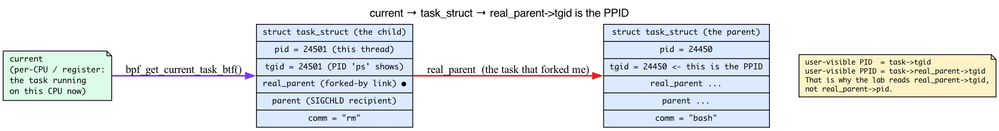
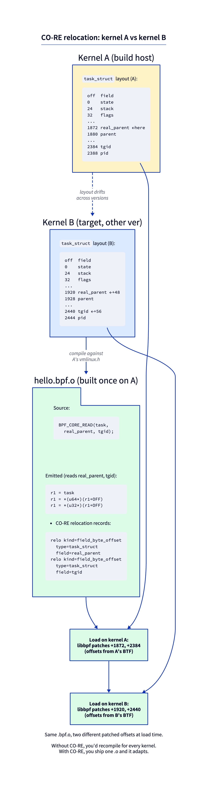
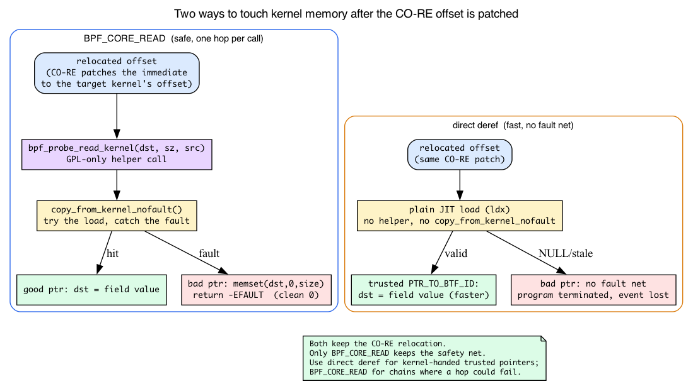
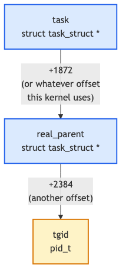

# Day 3 — CO-RE: read `task->real_parent->tgid` and survive a kernel upgrade

> **Today's mission:** read the parent PID of every process that calls `unlink`. Do it in a way that runs unchanged on the kernel you compiled against *and* on next year's kernel after the layout drifts. Total time: ~95 minutes.

## The fragile pre-CO-RE world

Before CO-RE existed, BPF tracing programs had two ugly choices:

1. **bcc-style runtime compilation.** Ship the BPF source as a string. The userspace tool detects the running kernel, calls Clang at runtime against the *current* kernel's headers, compiles the program then and there, loads it. Slow startup (Clang takes ~seconds), needs Clang+headers on every target machine, and breaks subtly when headers don't match a running kernel built from a slightly different config.

2. **Hardcoded offsets.** Read kernel struct fields with `bpf_probe_read_kernel(&out, sizeof(out), (char *)task + 1872)`. Works on exactly the kernel you derived `1872` from. Breaks the moment that struct grows a field.

Both options are why pre-2020 BPF tooling felt brittle. CO-RE killed both.

And the structure that breaks hardcoded-offset tools *worst* is the one we're going to read today: `struct task_struct`. So before we touch CO-RE, let's meet it — because half of why CO-RE exists is to read this one struct safely.

## The structure that motivates everything: `task_struct`

Every runnable thread in the kernel — every process, every thread inside a process, every kernel worker — is described by exactly one **`struct task_struct`**. It is the kernel's process/thread *descriptor*: the big bag of state the scheduler, the signal code, the VFS, and the credential machinery all hang off of. It is genuinely large — hundreds of fields, well over a kilobyte — holding scheduling state, the open-file table, credentials, parent/child links, and a short human-readable name.

A few fields are all we need today. In v7.1 (`include/linux/sched.h`):

```c
pid_t pid;                              /* sched.h:1063 — per-thread ID      */
pid_t tgid;                             /* sched.h:1064 — thread-group ID    */
struct task_struct __rcu *real_parent;  /* sched.h:1077 — the (original) parent */
struct task_struct __rcu *parent;       /* sched.h:1080 — recipient of SIGCHLD  */
char comm[TASK_COMM_LEN];               /* sched.h:1173 — 16-byte thread name   */
```

### `current`: the task that's running right now

You never get a `task_struct` out of thin air — you ask "who is running on this CPU at this instant?" The kernel's answer is the macro **`current`**. It's a per-CPU/arch construct that yields the `task_struct *` of whatever thread is executing right now (on x86_64 it's read from a per-CPU variable; other arches stash it in a register). Whenever kernel code says `current->pid`, it means "the PID of the thread that triggered this code path."

BPF gets at it through a helper. `bpf_get_current_task_btf()` *literally returns `current`* — its kernel implementation is one line:

```c
/* kernel/trace/bpf_trace.c:766 */
BPF_CALL_0(bpf_get_current_task_btf)
{
	return (unsigned long) current;   /* :768 */
}
```

So when your program calls `bpf_get_current_task_btf()` inside the `unlink` hook, you get the `task_struct` of the process that called `unlink`. That's the anchor for everything else today.



### `pid` vs `tgid`: the kernel's PID is not userspace's PID

Here's the trap that bites everyone once. In the kernel, **`pid` is the per-*thread* ID** and **`tgid` (thread-group ID) is the leader thread's `pid`**. A single-threaded process has `pid == tgid`. A process with four threads has four distinct `pid`s but one shared `tgid`.

Userspace `getpid()` returns the `tgid`. So:

- The user-visible **PID** of a task is its **`tgid`**.
- The user-visible **PPID** is the parent's **`tgid`** — i.e. `real_parent->tgid`.

(Day 1 already noted "userspace PID = kernel TGID" in passing when we used `bpf_get_current_pid_tgid`; this is why. That helper packs `tgid` in the high 32 bits and `pid` in the low 32 — `>> 32` gives you the user-visible PID.)

That single fact is why the lab reads `real_parent->tgid` and not `real_parent->pid`: we want the PPID a human would recognize from `ps`, which is the parent's thread-group ID.

### `real_parent` vs `parent`

There are *two* parent pointers, and the kernel comment block at `sched.h:1071` explains why:

- **`real_parent`** (`sched.h:1077`) — the original/biological parent. Used for reparenting and ptrace bookkeeping. This is the "who actually forked me" link.
- **`parent`** (`sched.h:1080`) — the task that receives `SIGCHLD` and `wait4()` reports. Usually identical to `real_parent`, but under `ptrace` (a debugger, `strace`) the `parent` becomes the tracer while `real_parent` stays the true parent.

The lab deliberately uses `real_parent` so the *true* parent shows up even if something is tracing the process.

### `comm[16]`: the thread name

`comm` is a fixed **16-byte** (`TASK_COMM_LEN`, `sched.h:325`) NUL-padded thread name — `"bash"`, `"rm"`, `"sshd"`. It's the *same buffer* Day 1's `bpf_get_current_comm` helper copied out for you. Today we read it directly via CO-RE instead, which is the whole point: we're going to walk into `task_struct` by hand.

And **this is why CO-RE matters.** `task_struct` grows and reshuffles constantly between kernel versions — a new scheduler field here, a reordered block there. Every one of those changes shifts the byte offset of `comm`, `tgid`, `real_parent`. A tool that hardcoded `(char *)task + 1872` is broken by the next `-rc`. CO-RE is the fix.

## What CO-RE actually does

You write field accesses by *name*:

```c
__u32 ppid = BPF_CORE_READ(task, real_parent, tgid);
```

The compiler emits an instruction that loads a value at offset `0xC0RE0001` (a placeholder — Clang fills the actual relocation index there). Alongside the instruction, it emits a **CO-RE relocation record** that says: *"the offset I just used is bogus; at load time, look up the byte offset of `task_struct.real_parent` in the target kernel's BTF and patch this instruction with the real value."*

When libbpf loads the program, it walks every CO-RE relocation, looks up the field by name in `/sys/kernel/btf/vmlinux`, computes the offset, and patches the instruction. Same `.o` file, different patched offsets per kernel.



This is why your Day 1 program's `BPF_PROG(on_unlink, int dfd, struct filename *name)` worked without you knowing the byte offset of *anything* — every kernel-type access went through this name-based relocation.

> ### There are no Dumb Questions
>
> **Q: Why doesn't C just do this normally? My userspace programs include kernel headers and read fields by name.**
>
> A: Userspace `#include <linux/sched.h>` reads the *headers from when you compiled*. If the running kernel has a different layout, you crash or read wrong bytes — that's why people warn against using kernel headers from outside `/proc`. CO-RE inverts the model: you build BPF programs as if struct layouts are *unknown* until load time, then libbpf resolves them against ground truth.
>
> **Q: What if a field doesn't exist on the target kernel?**
>
> A: There are CO-RE primitives for that:
> - `bpf_core_field_exists(task->real_parent)` — returns 1 if the field exists, 0 otherwise.
> - `bpf_core_type_exists(struct foo)` — same for whole types.
> - `bpf_core_enum_value_exists(...)` — same for enum members.
>
> If you check existence and skip access, libbpf will *also* patch the access instruction to a no-op when the field is missing. You can ship one program that gracefully degrades across kernel versions.
>
> **Q: Are direct typed-pointer derefs the same as `BPF_CORE_READ`?**
>
> A: Almost. With BTF and the right program type, the Verifier accepts `task->real_parent->tgid` and the compiler emits CO-RE-relocated instructions. Both are memory-safe: `BPF_CORE_READ` expands to `bpf_probe_read_kernel` (a helper call that zero-fills on a bad pointer), while a direct deref of a walked `PTR_TO_BTF_ID` is rewritten by the verifier to a fault-protected `BPF_PROBE_MEM` load that *also* zero-fills. The real difference is speed and applicability: direct deref is an inline load (no call) but needs a verifier-typed pointer, while `BPF_CORE_READ` is slower but works even when the verifier can't type the pointer (kprobe `pt_regs` casts, non-BTF program types). For arguments handed to you by the kernel (fentry params, `bpf_get_current_task_btf()`), direct deref is ideal. (We unpack *exactly why* one is faster two sections down.)

> ### Sharpen your pencil
>
> Your Day 1 and Day 2 programs read `bpf_get_current_pid_tgid() >> 32` to get the PID. That doesn't go through CO-RE — there's no struct field involved. But the BPF program still has to know it's running on Linux x86_64 vs ARM64. What handles that abstraction?
>
> .\
> .\
> .
>
> **Answer:** the helper itself. `bpf_get_current_pid_tgid` is implemented in `kernel/bpf/helpers.c` and is called the same way regardless of arch. Architecture-specific work happens *inside* the kernel implementation. CO-RE is for accessing kernel data structures whose *layout* differs across kernel versions, not for arch-portable helper calls.

---

## Why BPF can't just dereference a pointer: `bpf_probe_read_kernel`

We keep saying "`BPF_CORE_READ` fault-handles each hop" and "direct deref is faster but assumes the pointer is valid." To make that concrete you need to know what's underneath — and the answer is a helper called `bpf_probe_read_kernel`.

Here's the problem. A BPF program runs in kernel context. If it blindly dereferenced an arbitrary kernel pointer and that pointer were NULL, stale, or just wrong, it would **fault in kernel context** — and a fault in the kernel is not a friendly segfault, it's an oops. BPF is supposed to be *safe to load on a production box*. So the kernel does **not** let a BPF program follow just any pointer. It offers exactly two sanctioned ways to touch kernel memory.

**Way 1 — the `bpf_probe_read_kernel(dst, size, src)` helper.** It copies `size` bytes from `src` into `dst`, but it does the copy through `copy_from_kernel_nofault`, the kernel's "try this load, but catch the fault instead of crashing" primitive. If the read faults, the helper doesn't crash — it **zero-fills `dst` and returns `-EFAULT`**:

```c
/* include/linux/bpf.h:3387 — bpf_probe_read_kernel_common, the plain kernel read path */
ret = copy_from_kernel_nofault(dst, unsafe_ptr, size);  /* :3392 */
if (unlikely(ret < 0))
	memset(dst, 0, size);     /* :3394 — the zero-fill-on-fault path */
return ret;
```

(The string and user variants live in `kernel/trace/bpf_trace.c` and use a different primitive: `bpf_probe_read_user_common` memsets at :179, `bpf_probe_read_user_str_common` at :216, `bpf_probe_read_kernel_str_common` at :266. Only the non-string kernel read shown above is in `bpf.h`.)

```c
/* kernel/trace/bpf_trace.c:235 */
BPF_CALL_3(bpf_probe_read_kernel, void *, dst, u32, size,
	   const void *, unsafe_ptr)
{
	return bpf_probe_read_kernel_common(dst, size, unsafe_ptr);   /* :238 */
}
```

**That `memset(dst, 0, size)` is the source of the chapter's "`BPF_CORE_READ` returns a default 0 on bad pointers" behavior.** The zero doesn't come from CO-RE — it comes from this helper's error path. A bad hop gives you a clean `0`, not a crash.

**Way 2 — verifier-trusted typed pointers.** When the Verifier can *prove* a pointer's type and trustworthiness, it lets the JIT emit a plain hardware load with no helper call at all. No `copy_from_kernel_nofault`, no fault net — just a `ldx`. This is the fast path, and it's why direct deref (`task->real_parent->tgid`) beats the macro. We meet the register type that unlocks it in the next section.

So now the two forms decompose cleanly:

- **`BPF_CORE_READ`** = (CO-RE relocation to patch the offset) **+** (`bpf_probe_read_kernel` to fault-protect the load), chained once per pointer hop.
- **Direct deref** = (CO-RE relocation to patch the offset) **+** (plain trusted load, no fault net).

Both keep the relocation. Only `BPF_CORE_READ` keeps the safety net. You can see the marriage of relocation-and-probe-read right in the header:

```c
/* tools/lib/bpf/bpf_core_read.h:312 */
bpf_probe_read_kernel(dst, sz, (const void *)__builtin_preserve_access_index(src))
```

The `__builtin_preserve_access_index(src)` is the CO-RE relocation (it records "this offset must be patched against target BTF"); the `bpf_probe_read_kernel(...)` wrapped around it is the fault protection. One macro, both jobs.



> **One licensing consequence.** `bpf_probe_read_kernel`'s proto is **GPL-only**:
>
> ```c
> /* kernel/trace/bpf_trace.c:241 */
> const struct bpf_func_proto bpf_probe_read_kernel_proto = {
> 	.func		= bpf_probe_read_kernel,
> 	.gpl_only	= true,        /* :243 */
> 	...
> };
> ```
>
> This ties straight back to Day 1's LICENSE gate (Day 1, Break 3): the instant your program uses `BPF_CORE_READ`, it routes through this GPL-only helper, so it genuinely needs `char LICENSE[] SEC("license") = "GPL";`. Drop the GPL string and the loader rejects the program with "helper call is not allowed in non-GPL program." That's not bureaucracy — it's this proto's `.gpl_only` flag.

---

## `PTR_TO_BTF_ID`: the trusted, typed pointer that lets you skip the safety net

The fast path above hinges on one Verifier concept, so let's name it.

**Refresher (Day 2):** the Verifier tags *every register* with a type and tracks what you may legally do with it. Recall `PTR_TO_MAP_VALUE_OR_NULL` from yesterday — the type a `bpf_map_lookup_elem` result carries until you NULL-check it. You couldn't dereference it until you proved it non-NULL.

**New today:** **`PTR_TO_BTF_ID`** is a register type that says "this pointer points at a *specific kernel type*, identified by a BTF type id." Because the register carries the type, the Verifier can type-check field accesses against the real struct layout and permit a **direct load** of a field at the relocated offset. No helper call needed — that's the plain `ldx` from the previous section.

The **`_TRUSTED`** variant adds one more guarantee: the pointer is **non-NULL and not stale**. So no NULL check is required before deref — unlike a map-value pointer, which always might be NULL.

This is exactly why `bpf_get_current_task_btf()` is special. Look at its proto:

```c
/* kernel/trace/bpf_trace.c:771 */
const struct bpf_func_proto bpf_get_current_task_btf_proto = {
	.func		= bpf_get_current_task_btf,
	.gpl_only	= true,
	.ret_type	= RET_PTR_TO_BTF_ID_TRUSTED,                  /* :774 */
	.ret_btf_id	= &btf_tracing_ids[BTF_TRACING_TYPE_TASK],    /* :775 */
};
```

`RET_PTR_TO_BTF_ID_TRUSTED` + a `ret_btf_id` pointing at the `task_struct` BTF id means: the Verifier marks the returned register a **trusted, non-NULL `PTR_TO_BTF_ID` of type `task_struct`**. That's why the lab can write `task->real_parent->tgid` with **zero NULL checks on `task`** — the Verifier already knows it's a valid task pointer.

Contrast the *older* helper, `bpf_get_current_task` (`bpf_trace.c:755`), whose proto has `.ret_type = RET_INTEGER` — it hands back an **opaque u64** you have to cast yourself, with no type information for the Verifier. That's the "older variant that returned an opaque u64 you had to cast" the cast notes mention. The `_btf` version exists precisely to give the Verifier the type.

This is the first of Day 1's "four things BTF powers" (Day 1: *"Verifier type-checking of typed pointers (PTR_TO_BTF_ID)"*) finally made concrete. **Forward pointer:** Day 4 formalizes the Verifier's full type lattice. For today, hold one sentence: *`PTR_TO_BTF_ID` = a typed, trusted kernel pointer the Verifier lets you dereference directly.*

---

## Meet the cast

### `bpf_get_current_task_btf` — typed access to `current`

Returns a `struct task_struct *` with the BTF type tag attached (`RET_PTR_TO_BTF_ID_TRUSTED`, as we just saw). The Verifier knows it's a valid, non-NULL kernel pointer. You can deref fields directly. Cheaper than `bpf_get_current_task` (the older variant that returned an opaque `u64` you had to cast).

### `BPF_CORE_READ(task, a, b, c)` — chained CO-RE-aware reads

Expands to a series of `bpf_probe_read_kernel` calls walking each pointer hop, with CO-RE relocations on each field access. Equivalent to:

```c
struct task_struct *p1 = task;
struct task_struct *p2;
__u32 result;
bpf_probe_read_kernel(&p2, sizeof(p2), &p1->real_parent);  // CO-RE: real_parent offset
bpf_probe_read_kernel(&result, sizeof(result), &p2->tgid); // CO-RE: tgid offset
```

The macro saves you that boilerplate and fault-handles each hop, as the `bpf_probe_read_kernel` section showed — a bad pointer anywhere in the chain yields a clean `0` instead of a crash.



### `BPF_CORE_READ_INTO(dst, src, a, b, c)`

Same thing but writes the final value into `*dst` instead of returning it. Use when the field is larger than 8 bytes (e.g., reading `task->comm[16]` into a buffer).

### `BPF_CORE_READ_STR_INTO(dst, src, a, b, c)`

Reads a NUL-terminated string. Bounds the read at `sizeof(dst)`. Returns the actual length copied.

---

## The lab

Continue in the repository's `ebpf/labs` directory. `make parent` compiles the exact anchored listings shown below.

### `parent.h` — the shared event record

```c
{{#include ../labs/day03/parent.h}}
```

### `parent.bpf.c`

```c
{{#include ../labs/day03/parent.bpf.c:book}}
```

What's new:

- `bpf_get_current_task_btf()` returns a typed `struct task_struct *`. Its proto's return type is `RET_PTR_TO_BTF_ID_TRUSTED`, so the Verifier marks the register a trusted, non-NULL `PTR_TO_BTF_ID` — you can deref its fields directly with no NULL check.
- `__builtin_memset(event, 0, sizeof(*event))` initializes the whole reserved record before helper reads. If a fault-tolerant string read fails, userspace receives an empty string instead of stale ringbuf bytes.
- `BPF_CORE_READ(task, real_parent, tgid)` walks `task → real_parent → tgid` (recall: `tgid` is the user-visible PID, so the parent's `tgid` is the PPID). Each hop is a CO-RE-relocated `bpf_probe_read_kernel`.
- `BPF_CORE_READ_STR_INTO(&event->comm, task, comm)` reads `task->comm` (a 16-byte char array, not a pointer). Note `comm` is the last arg; for non-pointer fields you don't need a final `*` deref hop.
- Unlike Day 1, `BPF_PROG(on_unlink)` takes no extra params — we don't need the unlink arguments (`dfd`/`name`) today, because `bpf_get_current_task_btf()` hands us the task directly.

### Userspace `parent.c`

The loader mirrors Day 1's checked error and signal paths, validates the shared `struct parent_event`, and releases both ringbuf and skeleton on exit:

```c
{{#include ../labs/day03/parent.c:book}}
```

### Run it

In terminal 1:

```bash
make parent
sudo ./.output/day03/parent
```

In terminal 2:

```bash
scratch=$(mktemp -d /tmp/ebpf-day03.XXXXXX)
touch "$scratch/x"
rm "$scratch/x"
rmdir "$scratch"
```

Expected:

```
PID 24501 (rm) ppid 24450 (bash) deleted a file
```

That parent is `real_parent->tgid` and `real_parent->comm` working exactly as the `task_struct` section promised: `rm`'s real parent is the shell that forked it, and its `tgid` is the PPID `ps` would show.

Press Ctrl-C in terminal 1 when the event appears. The loader frees the ringbuf and destroys the skeleton, detaching its fentry link without a broad `pkill`.

---

## Inspect what CO-RE actually emitted

This is the most important step today. You need to *see* the relocations to believe they exist.

Disassemble the object with relocations interleaved (the `-r` flag is what makes the CO-RE records appear — `-d` alone never prints them):

```bash
llvm-objdump -dr .output/day03/parent.bpf.o | grep CO-RE
```

(If `llvm-objdump` isn't found, your distro may only ship versioned binaries — try `llvm-objdump-21` or `llvm-objdump-18`. Either works; the `-dr` flags and output are identical.)

Recent LLVM annotates the BPF disassembly with the CO-RE relocation records read from the object's `.BTF.ext` section. You'll see one line per kernel-field access:

```
0000000000000060:  CO-RE <byte_off> [13] struct task_struct::real_parent
00000000000000a0:  CO-RE <byte_off> [13] struct task_struct::tgid
00000000000000e8:  CO-RE <byte_off> [13] struct task_struct::comm
```

(addresses and the type index `[13]` vary by build). Drop the `| grep CO-RE` to see the full disassembly: the load instruction just above each relocation carries the **compile-time** byte offset Clang baked in — e.g. `r1 = 0xae0` for `real_parent` — *not* a placeholder like `0x0`. libbpf rewrites that immediate at load time if the running kernel's layout differs. CO-RE relocation records live in the ELF section `.BTF.ext` (the object also has `.BTF`, `.rel.BTF`, and `.rel.BTF.ext`); there is no `.relo.btf` section.

To inspect the embedded types instead:

```bash
./.output/bpftool/bootstrap/bpftool btf dump file .output/day03/parent.bpf.o
```

You'll see your maps (`VAR 'rb'` and the `.maps` DATASEC), your `on_unlink` program function, and references to kernel types like `task_struct.real_parent`. (`struct parent_event` is used only inside function code and is not reachable from a map, global, or function prototype, so the compiler does not emit it into the object's BTF.)

> **Aside — shipping minimal BTF.** `./.output/bpftool/bootstrap/bpftool gen min_core_btf /sys/kernel/btf/vmlinux min.btf .output/day03/parent.bpf.o` writes a minimal BTF file containing only the types your program references (it prints nothing to stdout). That's for *portability* — shipping a tiny BTF alongside your `.o` for kernels without `/sys/kernel/btf/vmlinux` — not for inspecting relocations.

To watch the relocations get applied at load time, you need **libbpf's own debug log**, not the kernel verifier log. The two are different: `.kernel_log_level` feeds `bpf_attr.log_level`, which controls the in-kernel *verifier* log (a disassembled, post-relocation instruction dump plus verifier state). CO-RE patching happens in libbpf userspace *before* the `BPF_PROG_LOAD` syscall, so the verifier log contains no `CO-RE` string and no relocation provenance — grepping it for `CO-RE` finds nothing.

The patching messages come out of libbpf's print callback at the `LIBBPF_DEBUG` level. Easiest from the shell — load with bpftool's `-d` flag (which sets libbpf to `LIBBPF_DEBUG`) and grep for the relocation lines:

```bash
sudo ./.output/bpftool/bootstrap/bpftool -d prog load .output/day03/parent.bpf.o /sys/fs/bpf/parent 2>&1 | grep relo
sudo rm -f /sys/fs/bpf/parent   # clean up the pin
```

You'll see lines like `prog 'on_unlink': relo #N: ... patched insn ...`. From C, register a print callback and raise the level before open/load:

```c
static int dbg(enum libbpf_print_level lvl, const char *fmt, va_list ap)
{
    return vfprintf(stderr, fmt, ap);
}
// in main(), before parent_bpf__open():
libbpf_set_print(dbg);
```

Note libbpf's *default* print callback only emits `WARN` to stderr; the `INFO`/`DEBUG` relocation lines are suppressed unless you install your own callback or use a debug-enabled loader.

---

## What to break, in order

### Break 1 — Use a non-existent field

Add this line:

```c
__u32 fake = BPF_CORE_READ(task, this_field_does_not_exist);
```

You might expect this to compile and only blow up at load time. It doesn't — the build fails immediately:

```
error: no member named 'this_field_does_not_exist' in 'struct task_struct'
```

Here's why: `BPF_CORE_READ` doesn't reference fields by an opaque name string. It expands to the *real* C member-access expression (`task->this_field_does_not_exist`) wrapped in `__builtin_preserve_access_index`, and Clang type-checks that member against the `struct task_struct` in your `vmlinux.h`. A name that exists in no BTF at all is a plain C error. (`bpf_core_field_exists(task->this_field_does_not_exist)` fails the same way — it also emits the member-access expression.)

So to exercise the genuine load-time **relocation-failure** path — the one that prints

```
libbpf: prog 'on_unlink': relo #N: failed to relocate ...
```

you need a field that *exists in your build's BTF/`vmlinux.h` but is absent on the **target** kernel*. The realistic way to trigger it is to compile against a newer `vmlinux.h` and load on an older kernel that lacks the field.

For the graceful-degradation demo, use a field that actually exists so the program compiles, and gate it on `bpf_core_field_exists`:

```c
__u32 fake = 0;
if (bpf_core_field_exists(task->pid))
    fake = BPF_CORE_READ(task, pid);
```

The point of `bpf_core_field_exists` is fields that *appear or disappear across kernel versions*: libbpf evaluates the check at load time against the target kernel's BTF and patches the branch to a no-op when the field is absent, so a single `.o` runs on kernels that have or lack the field. It is **not** a way to reference a name that exists in no BTF at all.

### Break 2 — Direct deref vs `BPF_CORE_READ`

Replace the macro form with direct deref:

```c
event->ppid = task->real_parent->tgid;
```

Compiles. Verifier accepts. Runs. **Faster** than `BPF_CORE_READ` because no `bpf_probe_read_kernel` call — this is the trusted-`PTR_TO_BTF_ID` plain-load fast path we dissected earlier. The Verifier already knows `task` is a non-NULL `task_struct`, so it lets the JIT emit a bare load with no fault net.

But this is **not** a safety downgrade, and that's the subtle part. When the verifier accepts `task->real_parent->tgid`, it doesn't emit a bare load for the *walked* hop. `real_parent` is reached by following a pointer, so the resulting register is an untrusted `PTR_TO_BTF_ID`, and the verifier rewrites that `tgid` load into a `BPF_LDX | BPF_PROBE_MEM` with an exception-table entry (`kernel/bpf/fixups.c`). On a fault the load is skipped and the destination register is zero-filled — the same `0` you'd get from `BPF_CORE_READ`. So if `real_parent` were ever NULL, `ppid` comes back `0` and the event **still fires**; it does not crash, terminate, or lose the event. Only loads through genuinely *trusted* pointers (like `task` itself) stay bare — and those are exactly the pointers the verifier has proven non-NULL, so the NULL-deref scenario can't arise for them.

So both forms are memory-safe and both zero-fill on a bad pointer. The real reasons to choose between them:

- **`BPF_CORE_READ`** emits a `bpf_probe_read_kernel` helper **call** (slower), but works even when the verifier can't hand you a typed pointer — e.g. a kprobe's `pt_regs` cast, or a non-BTF program type. It also keeps the whole chained `a, b, c` expression portable.
- **Direct deref** of a verifier-typed `PTR_TO_BTF_ID` emits an **inline load** (faster, no call). The verifier auto-rewrites the walked/untrusted hops to `BPF_PROBE_MEM` so they fault-protect and zero-fill too; only the proven-non-NULL trusted hop stays bare.

### Break 3 — Forget `#include <bpf/bpf_core_read.h>`

`BPF_CORE_READ` is undefined; compile fails. Trivial, but worth noting: BPF helper headers are split across `bpf_helpers.h` (general), `bpf_tracing.h` (BPF_PROG, ctx unpacking, PT_REGS_*), `bpf_core_read.h` (CO-RE macros). Forget any of them and the failure mode is "macro X not defined."

---

## What to read in the kernel

- **`tools/lib/bpf/relo_core.c`** — the CO-RE engine in userspace. `bpf_core_calc_relo_insn` (relo_core.c:1297) computes the relocation value from target-kernel BTF, and `bpf_core_patch_insn` (relo_core.c:1041) writes it into the instruction's offset/immediate. ~300 lines, accessible if you know what to look for.
- **`tools/lib/bpf/btf.c`** — read `btf__find_by_name_kind` (btf.c:1166). This is how libbpf finds types in BTF by name. CO-RE is built on top of it.
- **`tools/lib/bpf/bpf_core_read.h`** — search `BPF_CORE_READ`. The macros expand to a chain of `bpf_core_read` (kernel-side) calls; `bpf_core_field_exists` is at bpf_core_read.h:187-188. Reading them once eliminates magic.
- **`include/uapi/linux/btf.h`** — the `BTF_KIND_*` enums. BTF has ~19 kinds (int, ptr, array, struct, union, enum, fwd, typedef, volatile, const, restrict, func, func_proto, var, datasec, float, decl_tag, type_tag, enum64). `BTF_KIND_ENUM64 = 19` at uapi/btf.h:92, with `NR_BTF_KINDS` at :94 and `BTF_KIND_MAX` at :95. `struct btf_type` is also defined here (at :43); `include/linux/btf.h` only forward-declares it (at :113). Skim.
- **`include/linux/sched.h`** — the `struct task_struct` we read today: `pid` (1063), `tgid` (1064), `real_parent` (1077), `parent` (1080), `comm` (1173). Skim the field comments to feel how much state hangs off one task.

---

## Bullet Points

- **CO-RE = Compile Once, Run Everywhere.** Field offsets are resolved at load time using target-kernel BTF.
- **`task_struct` is the per-thread descriptor**; `current` is the running one; `bpf_get_current_task_btf()` returns it. User-visible **PID = `tgid`**, user-visible **PPID = `real_parent->tgid`**; `comm[16]` is the thread name.
- **BPF can't blindly deref kernel pointers.** `bpf_probe_read_kernel` copies via `copy_from_kernel_nofault` and **zero-fills on fault** (the source of "default 0"); it's **GPL-only**, which is why CO-RE programs need `SEC("license")="GPL"`.
- **`PTR_TO_BTF_ID` (_TRUSTED)** = a typed, non-NULL kernel pointer the Verifier lets you deref directly with no NULL check and no helper — the fast path behind direct deref.
- **Use `BPF_CORE_READ(a, b, c, d)`** to chain field accesses through pointer hops with fault-handling on each hop.
- **Use direct deref** (`task->real_parent->tgid`) when the pointer chain is trusted and you want speed.
- **Handle missing fields with `bpf_core_field_exists`** — libbpf will patch the access to a no-op when the field is absent.
- BTF kinds you'll meet: `STRUCT`, `UNION`, `ENUM`, `INT`, `PTR`, `ARRAY`, `FUNC`, `TYPEDEF`. About 19 total.

---

## Check question

You compile your program against kernel A. Field `task_struct.real_parent` is at offset 1872. You ship the `.o` to a machine running kernel B where the same field is at offset 1920. Your program does `BPF_CORE_READ(task, real_parent, tgid)`. Walk through what happens at load time.

<details>
<summary>Click to reveal answer</summary>

**Answer:** libbpf opens `/sys/kernel/btf/vmlinux` on kernel B, parses it, finds the type `task_struct` and its field `real_parent`, computes byte offset 1920. It walks every CO-RE relocation in your `.o`. For the `real_parent` access, it overwrites the placeholder offset (the `0xC0RE...` immediate the compiler emitted) with `1920`. Same for `tgid`. Then `BPF_PROG_LOAD` is called with the patched instructions. The Verifier accepts. The program runs, reading the correct fields on kernel B. At runtime each hop goes through `bpf_probe_read_kernel`, so even if a pointer were bad the program gets a `0` rather than crashing.

</details>

---

## Tomorrow

Day 4: meet the Verifier properly. We'll spend a whole day deliberately tripping over `PTR_TO_MAP_VALUE_OR_NULL` rejections in five different shapes — because every BPF programmer, no matter how senior, hits this error monthly. The goal: stop being surprised by the rejection and start reading the log fluently. (Today's `PTR_TO_BTF_ID` was a preview of the type lattice we formalize there.)
