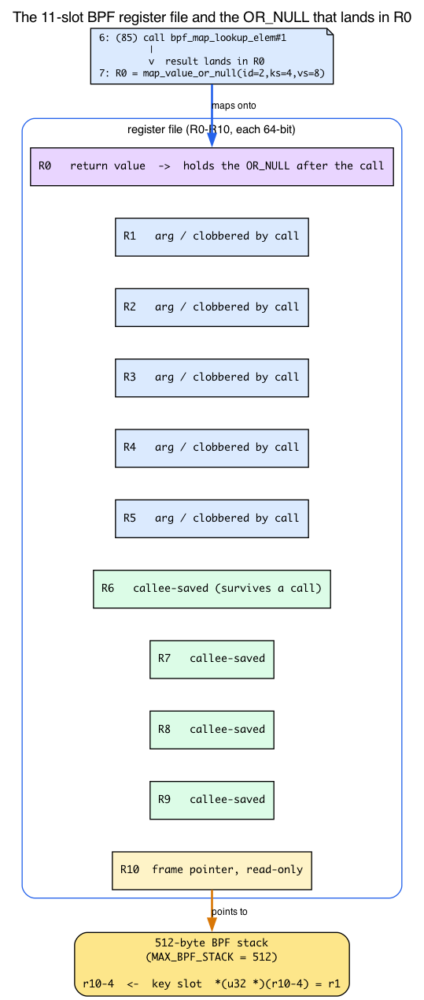
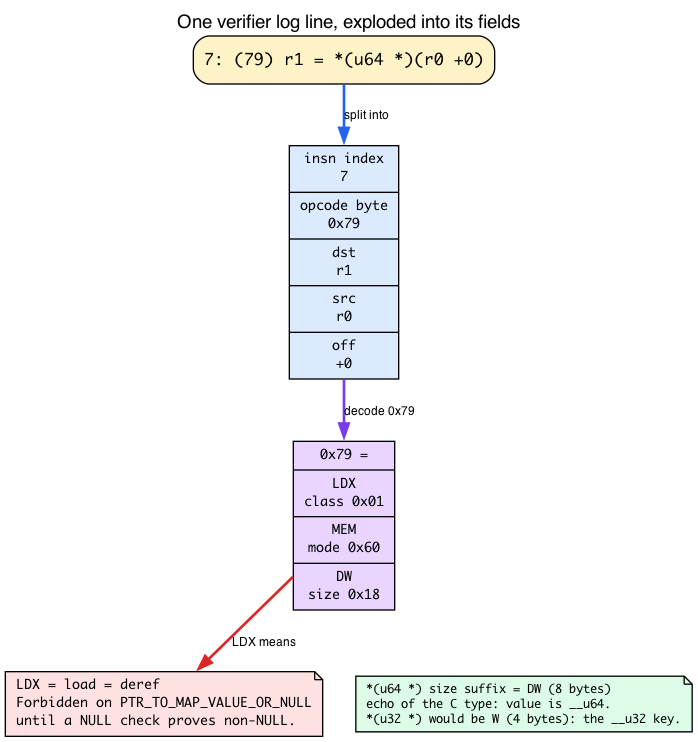
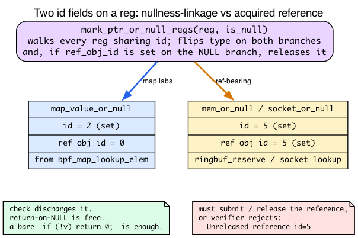

# Day 4 — Meet the Verifier (PTR_TO_MAP_VALUE_OR_NULL boot camp)

> **Today's mission:** stop being surprised by the most common BPF rejection. Trip over `PTR_TO_MAP_VALUE_OR_NULL` in five different shapes; read the log on each; learn what "register state" means — down to the individual registers and opcode bytes the log is built from. Total time: ~120 minutes. **No new functionality today — this is pure verifier intuition.**

## Why a whole day on one error

Because you'll see this rejection more than any other. Days 1–3 dodged it by always writing `if (!cnt) return 0;` immediately after lookups. That's the trained-monkey response. Today is when that response becomes *understanding*.

The Verifier is not arbitrary. It runs an abstract interpreter over your program — for every instruction it tracks each register's *type*, *bounds*, *reference state*, and which branch you're on. When it can't prove a memory access safe, it rejects. The error log tells you exactly which register and which instruction; if you can read register state, you can fix any rejection in under a minute.

But there's a catch. Every line of that log is dense with notation the BPF tutorials never explain: `R0`, `R10`, `(79)`, `*(u64 *)(r0 +0)`, `id=2`, `fp0`. Today is titled a "register state boot camp," so before we break anything we're going to actually learn the alphabet: **the eleven registers**, **the opcode bytes**, and **the two kinds of id**. Then the five rejections read themselves.

## The eleven registers: BPF's whole register file

Every line in a verifier log mentions registers named `R0` through `R10`. That is not a sampling — that is the *entire* register file. BPF has exactly **eleven** 64-bit registers, no more: **ten general-purpose** registers (R0–R9) plus **one read-only frame pointer** (R10):

```c
/* include/uapi/linux/bpf.h:62-74 */
enum {
    BPF_REG_0 = 0,
    BPF_REG_1,
    ...
    BPF_REG_10,
    __MAX_BPF_REG,
};
/* include/uapi/linux/bpf.h:77-78 */
/* BPF has 10 general purpose 64-bit registers and stack frame. */
#define MAX_BPF_REG  __MAX_BPF_REG   /* == 11 slots: R0-R9 + R10 */
```

The Verifier keeps a `struct bpf_reg_state` for each of these eleven slots, at every instruction, on every path. When the log prints `R0=map_value_or_null(...) R10=fp0`, it's dumping that per-register state table.

What makes the eleven registers *legible* is that they aren't interchangeable — they follow a fixed **calling convention**, and the Verifier enforces it. This convention is the single most useful thing to memorize today, because it explains nearly every register name you'll read:

| Register | Role | What the Verifier enforces |
|---|---|---|
| **R0** | return value | A helper's result *always* lands here. This is why `bpf_map_lookup_elem`'s OR_NULL pointer is always in R0. |
| **R1–R5** | arguments / scratch | Caller passes args here. **Clobbered across every helper call** — reset to unreadable. |
| **R6–R9** | callee-saved | State **preserved across calls**. Stash anything you need to survive a helper call here. |
| **R10** | frame pointer | **Read-only.** Points at the top of the 512-byte BPF stack. You can't reassign it. |

The kernel documentation states the call rule directly:

> After kernel function call, R1-R5 are reset to unreadable and R0 has a return type of the function. Since R6-R9 are callee saved, their state is preserved across the call.
> — `Documentation/bpf/verifier.rst:32-35`

And R10:

> Though R10 is correct read-only register and has type PTR_TO_STACK...
> — `Documentation/bpf/verifier.rst:81-85`

R10's type is `PTR_TO_STACK` — "reg == frame_pointer + offset" (`include/linux/bpf.h:996`). You can read and write *stack slots* through it (`*(u32 *)(r10-4)`), but you can never reassign R10 itself — the Verifier rejects writes to it. The stack it points at is capped:

```c
/* include/linux/filter.h:98 */
#define MAX_BPF_STACK 512
```

512 bytes. That's your entire automatic-storage budget per program frame.

Why does R0 *have* to be the return register? Because the ABI says so, full stop:

> BPF allows only register R0 to be used as return value.
> — `Documentation/bpf/bpf_design_QA.rst:41`



Hold onto one consequence, because it bites later today: a lookup result you copy with `r0 → r6` **survives** a later helper call (R6 is callee-saved), but `r0 → r1` **does not** (R1 is clobbered by the next call). That's also *why* the Verifier's id tracking — covered in "Two different `id`s" below — has to follow a value as it hops between registers.

## Reading the pseudo-assembly: the `(hex)` opcode and the instruction format

Every trace line looks like `7: (79) r1 = *(u64 *)(r0 +0)`. Three parts: the **instruction index** (`7:`), the **raw opcode byte** in parentheses (`(79)`), and a human-readable spelling of what it does. The opcode byte is the part nobody explains — let's decode it, because the whole rejection hinges on recognizing one opcode.

A BPF opcode is one byte, built by OR-ing three fields: **instruction class** | **mode/op** | **source/size**. You don't need the full table; you need the handful that appear in these labs:

| Byte | Means | Spelled in the log as |
|---|---|---|
| `(b7)` | ALU64 MOV immediate | `r1 = 0` |
| `(bf)` | ALU64 MOV register | `r2 = r10` |
| `(07)` | ALU64 ADD immediate | `r2 += -4` |
| `(63)` | STX MEM word store | `*(u32 *)(r10-4) = r1` |
| `(18)` | LD IMM double-word (16-byte insn) | `r1 = 0xffff...` (loads a map address) |
| `(85)` | JMP CALL | `call bpf_map_lookup_elem#1` |
| `(15)` | JMP JEQ immediate (`if r0 == 0 goto`) | `if r0 == 0 goto +N` — the **NULL check** |
| `(55)` | JMP JNE immediate (`if r0 != 0 goto`) | `if r0 != 0 goto +N` — the **NULL check**, other form |
| `(79)` | **LDX MEM double-word load** | `r1 = *(u64 *)(r0 +0)` — **the deref** |

The `(15)`/`(55)` jumps are the comparison-against-zero that `mark_ptr_or_null_regs` keys off: spotting one of them between the `(85)` call and a `(79)` load is how you tell, by eye, whether the `OR_NULL → MAP_VALUE` transition had a chance to fire.

These bytes are just the header constants OR'd together. From `include/uapi/linux/bpf_common.h` (classes `BPF_LD 0x00`, `BPF_LDX 0x01`, `BPF_ST 0x02`, `BPF_STX 0x03`, `BPF_ALU 0x04`, `BPF_JMP 0x05`; modes `BPF_IMM 0x00`, `BPF_MEM 0x60`; sizes `BPF_W 0x00`, `BPF_DW 0x18`) and `include/uapi/linux/bpf.h` (`BPF_ALU64 0x07`, `BPF_MOV 0xb0`, `BPF_DW 0x18`, `BPF_CALL 0x80`):

- `(79)` = `BPF_LDX(0x01) | BPF_MEM(0x60) | BPF_DW(0x18)` — a load.
- `(85)` = `BPF_JMP(0x05) | BPF_CALL(0x80)` — a call.
- `(b7)` = `BPF_ALU64(0x07) | BPF_MOV(0xb0)` with the K (immediate) source.

You do not have to memorize the table. You need exactly one reflex: **any LDX opcode (`0x61`/`0x69`/`0x71`/`0x79`) is a load — a dereference.** And a dereference is precisely what the OR_NULL rule forbids until you've checked for NULL.

The size suffix in `*(u64 *)` vs `*(u32 *)` is the size field: `BPF_W` = word/4 bytes, `BPF_DW` = double-word/8 bytes. That's not noise — it echoes your C types directly. The key store is `*(u32 *)` because the map key is `__u32` (4 bytes); the value deref is `*(u64 *)` because the value is `__u64` (8 bytes). The widths in the log are your struct, reflected back.



**Practical reading rule:** when a rejection names a register, scan the opcode column for the LDX/STX (`0x6x`/`0x7x`) instruction that touches it. In all five rejections today that instruction is the same: `(79) r1 = *(u64 *)(r0 +0)` — the single load through R0 that the missing check failed to protect.

## How the Verifier walks your program


The Verifier starts at instruction 0 with default register state. For each instruction:

1. It updates register types based on the operation (add, load, call, etc.).
2. On conditional jumps, it forks: explores both branches with appropriate state (e.g., on `if (!r0)`, the false branch knows `r0 != 0`; the true branch knows `r0 == 0`).
3. When two branches reconverge, it merges register states (intersection).
4. **State pruning.** If the current state is "compatible with" a previously-explored state at the same instruction, it stops — it already knows this leads to acceptance. (This is the verifier's key efficiency trick — without it, branchy programs explode exponentially.)
5. If it hits the complexity budget (1M instructions explored across all paths), it gives up: `BPF program is too large`.
6. Every path must reach a `return`/exit instruction safely.

Source: `kernel/bpf/verifier.c`. The function `do_check` is the main loop; `bpf_is_state_visited` (in `kernel/bpf/states.c:1202`, split out of verifier.c in the 2025 refactor) is the pruning check; `mark_ptr_or_null_regs` is what we'll focus on today. The 1M budget is `BPF_COMPLEXITY_LIMIT_INSNS` (`include/linux/bpf.h:2261` — `#define BPF_COMPLEXITY_LIMIT_INSNS 1000000 /* yes. 1M insns */`), checked against `env->insn_processed` in `do_check` (`verifier.c:17705`).

## The state machine for `bpf_map_lookup_elem`'s return value


When you call `bpf_map_lookup_elem`, R0 is marked **`PTR_TO_MAP_VALUE_OR_NULL`** with an *id* attached. That id links the not-yet-resolved-NULL nature of this pointer across all flow paths (more on what *kind* of id, next). The Verifier treats:

- `PTR_TO_MAP_VALUE_OR_NULL` — deref forbidden.
- `PTR_TO_MAP_VALUE` — deref OK, with bounds equal to the map's value size.
- `SCALAR_VALUE = 0` — what the register becomes inside the `r == 0` branch.

The transition `PTR_TO_MAP_VALUE_OR_NULL → PTR_TO_MAP_VALUE` happens via `mark_ptr_or_null_regs` after a comparison against zero — but **only on the branch where the comparison would prove non-NULL**.

In v7.1 these types are just a base type OR'd with a "maybe NULL" flag (`include/linux/bpf.h:1026-1034`):

```c
PTR_TO_MAP_VALUE_OR_NULL = PTR_MAYBE_NULL | PTR_TO_MAP_VALUE,
PTR_TO_SOCKET_OR_NULL    = PTR_MAYBE_NULL | PTR_TO_SOCKET,
PTR_TO_BTF_ID_OR_NULL    = PTR_MAYBE_NULL | PTR_TO_BTF_ID,
```

The helper that produces our OR_NULL says so in its prototype (`kernel/bpf/helpers.c:54`): `bpf_map_lookup_elem_proto` has `.ret_type = RET_PTR_TO_MAP_VALUE_OR_NULL`. That's where R0's type comes from — `check_helper_call` reads it off the proto.

### Two different `id`s: nullness-linkage vs acquired reference

Here's a subtlety that the logs blur together. A `struct bpf_reg_state` carries **two** distinct u32 fields (`include/linux/bpf_verifier.h:155` and `:195`):

- **`id`** — general linkage. Links registers that share a not-yet-resolved property, e.g. the same maybe-NULL-ness.
- **`ref_obj_id`** — a handle on an **acquired reference** that must be explicitly *released* before the program exits.

For `bpf_map_lookup_elem`, the OR_NULL pointer carries an **`id` only**. It is free — no release required — so a bare `if (!v) return 0;` fully discharges it. That's why all of today's labs need nothing but a NULL check. The number you read as `id=2` in the log is this general linkage id.

**That is the whole intuition you need for today.** The rest of this section — how the release machinery works for the *reference-bearing* OR_NULL types — is an optional going-deeper aside. Today's map-value labs never trigger it; you can skip to "The Lab" and come back when a later chapter rejects a socket or ringbuf program with an "Unreleased reference" error.

> ### Going deeper (optional): how releases actually fire
>
> Now look at what `mark_ptr_or_null_regs` actually does (`kernel/bpf/verifier.c:16060-16078`):
>
> ```c
> static void mark_ptr_or_null_regs(struct bpf_verifier_state *vstate, u32 regno,
>                                   bool is_null)
> {
>     struct bpf_func_state *state = vstate->frame[vstate->curframe];
>     struct bpf_reg_state *regs = state->regs, *reg;
>     u32 ref_obj_id = regs[regno].ref_obj_id;
>     u32 id = regs[regno].id;
>
>     if (ref_obj_id && ref_obj_id == id && is_null)
>         /* regs[regno] is in the " == NULL" branch. */
>         WARN_ON_ONCE(release_reference_nomark(vstate, id));
>
>     bpf_for_each_reg_in_vstate(vstate, state, reg, ({
>         mark_ptr_or_null_reg(state, reg, id, is_null);
>     }));
> }
> ```
>
> It consults **both** fields. The `bpf_for_each_reg_in_vstate` loop walks *every* register sharing the comparison's `id` and flips its type on each branch — that's the universal part. But the `if` above it checks `ref_obj_id`: if the OR_NULL register held a real acquired reference and we just proved it NULL, it *releases* that reference. Map-value-or-null never minted a `ref_obj_id` (its proto doesn't acquire), so that branch is skipped.
>
> This sharpens the chapter's later "all OR_NULL types follow the same pattern" claim. The NULL-check *transition* is universal. But only the reference-bearing OR_NULL types carry a `ref_obj_id` you must additionally resolve:
>
> | Type | `id` | `ref_obj_id` | Obligation |
> |---|---|---|---|
> | `PTR_TO_MAP_VALUE_OR_NULL` | set | **0** | check discharges it; return-on-NULL is free |
> | `PTR_TO_SOCKET_OR_NULL` | set | **set** | must release, or "Unreleased reference" |
> | `PTR_TO_MEM \| PTR_MAYBE_NULL` (ringbuf reserve) | set | **set** | must submit/discard, or "Unreleased reference" |
>
> So if a future chapter shows you a `bpf_ringbuf_reserve` or socket lookup that *loads clean but still gets rejected* with an unreleased-reference error, that's the `ref_obj_id` talking — same number space in the log, completely different obligation. Today's map-value labs never hit it.



> ### There are no Dumb Questions
>
> **Q: Why does the verifier need an "id" on the pointer? Isn't the type enough?**
>
> A: The id links multiple registers that share the same not-yet-resolved-NULL state. If you copy `r0` to `r6` before checking, then check `r0`, the Verifier needs to know `r6`'s NULL-ness was resolved too. The id is how `bpf_for_each_reg_in_vstate` finds every register to flip. (For map values this is the linkage `id`; reference-bearing types additionally carry a `ref_obj_id` — see above.)
>
> **Q: What if I check `r0 != NULL` instead of `!r0`?**
>
> A: Same effect. The Verifier tracks the comparison and applies the `OR_NULL → not-OR-NULL` transition on the branch that proves non-NULL, regardless of which boolean form you used.
>
> **Q: Is `PTR_TO_MAP_VALUE_OR_NULL` the only "OR_NULL" type?**
>
> A: No — there are several. `PTR_TO_SOCKET_OR_NULL`, `PTR_TO_SOCK_COMMON_OR_NULL`, `PTR_TO_TCP_SOCK_OR_NULL`, and `PTR_TO_BTF_ID_OR_NULL` (some kfuncs) are all explicit register types in `enum bpf_reg_type` (`include/linux/bpf.h:1026-1034`). Ringbuf-reserve memory is OR_NULL too, but at the *helper-prototype* level (`RET_PTR_TO_RINGBUF_MEM_OR_NULL`, `include/linux/bpf.h:908`) — there is no `PTR_TO_MEM_OR_NULL` register type, just `PTR_TO_MEM | PTR_MAYBE_NULL`. They all follow the same NULL-check pattern: deref forbidden until proven non-NULL via a check. The reference-bearing ones (socket, ringbuf mem) *also* require you to release the reference — the deref rule is shared, the release obligation is not. (Packet pointers are *not* in this family: `skb->data` is never `OR_NULL`; its bounds are proven by comparing against `PTR_TO_PACKET_END` via `find_good_pkt_pointers`, a different mechanism — there is no `PTR_TO_PACKET_OR_NULL` type.)

---

## The Lab: five rejections in five shapes

You don't need a working program today. You need a single source file you mutate and reload.

### Setup

Use any of yesterday's programs as the base. We'll mutate it in place.

`reject.bpf.c` — the base that loads clean, straight from the lab tree:
```c
{{#include ../labs/day04/reject.bpf.c:book}}
```

Build it once. It loads. Now break it five ways and read the log each time.

Set verbose loading in your `reject.c`:

```c
LIBBPF_OPTS(bpf_object_open_opts, opts, .kernel_log_level = 1);
struct reject_bpf *skel = reject_bpf__open_opts(&opts);
if (reject_bpf__load(skel)) {
    fprintf(stderr, "load failed (this is expected)\n");
    return 1;
}
```

Or load with `bpftool prog load reject.bpf.o /sys/fs/bpf/x` and the log goes to stderr.

> A successful load **pins** the program at `/sys/fs/bpf/x`. Rejected loads don't pin, but the ones that load clean (the base program, Rejection 5's first snippet, Rejection 3 with a compile-time-constant key) do — so the next successful load to the same path fails with `Error: failed to pin program: File exists`, which is *not* a verifier problem. Remove the pin before re-loading: `sudo rm -f /sys/fs/bpf/x`.

---

### Rejection 1 — The bare deref

```c
__u64 *v = bpf_map_lookup_elem(&m, &key);
*v += 1;       // no null check
return 0;
```

Expected log (essence):

```
0: (b7) r1 = 0           ; key = 0
1: (63) *(u32 *)(r10-4) = r1
2: (bf) r2 = r10
3: (07) r2 += -4
4: (18) r1 = 0xffff...   ; map fd
6: (85) call bpf_map_lookup_elem#1
7: R0=map_value_or_null(id=2,off=0,ks=4,vs=8) R10=fp0
7: (79) r1 = *(u64 *)(r0 +0)
R0 invalid mem access 'map_value_or_null'

processed 8 insns ...
```

**How to read this** — and now you can read *every* token:
- Lines 0–6 are the instruction trace, and you can decode each opcode: `(b7)` MOV-imm sets `key = 0`; `(63)` STX-word stores it to the stack slot `r10-4` (that's the `&key` you'll pass); `(bf)` MOV-reg copies the frame pointer `r2 = r10`; `(07)` ADD-imm does `r2 += -4` so R2 now holds `&key`; `(18)` LD-imm-dw loads the map address into R1; `(85)` CALL invokes `bpf_map_lookup_elem`. The calling convention is right there: key in R2, map in R1, result in R0.
- Line 7 shows register state right after the call: `R0` is `map_value_or_null` with `id=2` (the linkage id — `ref_obj_id` is 0, unprinted), offset 0, key size 4 (`ks=4`, from `verbose_a("ks=%d,vs=%d", ...)` at `kernel/bpf/log.c:675`), value size 8 (`vs=8`). `R10=fp0` just means R10 is the frame pointer at offset 0 — read-only, as always.
- The next line is `(79)` — LDX-dw, a **load through R0**. That's the dereference. R0 is still `map_value_or_null`. Forbidden.
- The violation line: `R0 invalid mem access 'map_value_or_null'`, emitted by `verbose(env, "R%d invalid mem access '%s'\n", ...)` at `kernel/bpf/verifier.c:6408` (and a twin at `:6565`). It names the register (`R0`) and the type that failed (`map_value_or_null`).

The Verifier did exactly what the diagram showed. You skipped the `mark_ptr_or_null_regs` transition. Fix: add `if (!v) return 0;`.

---

### Rejection 2 — Deref before check

```c
__u64 *v = bpf_map_lookup_elem(&m, &key);
*v += 1;       // deref before check
if (!v) return 0;
```

Same log as Rejection 1. The Verifier walks instructions in order; the late check doesn't help the early deref. The `(79)` load still executes while R0 is `map_value_or_null`. Lesson: **the null check must be *before* the deref.** Compiler-style "this branch makes the early line unreachable" doesn't apply — the Verifier evaluates instructions in program order.

---

### Rejection 3 — Conditional null check (verifier path tracking)

```c
__u64 *v = bpf_map_lookup_elem(&m, &key);
if (key == 0) {
    if (!v) return 0;
}
*v += 1;       // is v guaranteed non-NULL here?
```

(For this to demonstrate anything, `key` must be runtime-unknown — change the base to `__u32 key = bpf_get_current_pid_tgid();`. If `key` were the compile-time `0` from the setup, Clang would constant-fold `if (key == 0)` to always-true and the program could actually load.)

Verifier rejects. Why? Inside `if (key == 0)`, you proved `v` non-NULL. But the Verifier explores both branches:
- `key == 0` branch: `v` is checked, then `*v += 1` runs with `v` proven non-NULL. OK.
- `key != 0` branch: skips the inner `if`, falls through to `*v += 1`. `v` is still `map_value_or_null`. **Reject.**

The error message points at the deref instruction, with state showing R0 is still or-null:

```
N: R0=map_value_or_null(id=2,off=0,ks=4,vs=8) ...
N: (79) r1 = *(u64 *)(r0 +0)
R0 invalid mem access 'map_value_or_null'
```

The failing instruction number `N` is higher than Rejection 1 (the extra `if (key == 0)` branch adds instructions), but the violation line is identical: on the `key != 0` fall-through path R0 never made the `OR_NULL → MAP_VALUE` transition. (Exact instruction numbers and the `id=` value vary by kernel version and path.) The Verifier is right — your code is buggy. Fix:

```c
if (!v) return 0;
*v += 1;
```

Or check unconditionally before deref. **Always make the check dominate the use.**

---

### Rejection 4 — Reset id by reassignment

```c
__u64 *v = bpf_map_lookup_elem(&m, &key);
if (!v) return 0;
v = bpf_map_lookup_elem(&m, &key);  // re-lookup
*v += 1;                             // does the second result need a new check?
```

Yes. Each call to `bpf_map_lookup_elem` returns a fresh `PTR_TO_MAP_VALUE_OR_NULL` with a *new* id. The first check resolved the *first* lookup. The second lookup is unrelated. Verifier rejects the deref of the second result:

```
N: R0=map_value_or_null(id=3,off=0,ks=4,vs=8) ...   ; note id=3 — a NEW id
N: (79) r1 = *(u64 *)(r0 +0)
R0 invalid mem access 'map_value_or_null'
```

Compare the `id=` to Rejection 1's `id=2`: the second `bpf_map_lookup_elem` minted a brand-new linkage id the first `if (!v)` never resolved, and it fails at a higher instruction number than Rejection 1's deref. That fresh id is the concrete signal of "new check needed per call." Remember from the register-file section: the first check flipped every register sharing `id=2`; nothing was sharing the new `id=3`. (Exact id values and instruction numbers vary by kernel version.)

Lesson: **null state is per-call, not per-variable name.** Re-check after every lookup, even if you wrote the same code.

---

### Rejection 5 — Loop and lose track

```c
__u64 *v;
for (int i = 0; i < 3; i++) {
    v = bpf_map_lookup_elem(&m, &key);
    if (!v) continue;
    *v += 1;
}
return 0;
```

This loads on a modern verifier: `v` is assigned once per iteration, and every iteration `continue`s past the deref when `v` is NULL, so the single check dominates the loop body. Now move the guard so each iteration mints a fresh `OR_NULL` that a once-only check can't cover:

```c
__u64 *v;
for (int i = 0; i < 3; i++) {
    v = bpf_map_lookup_elem(&m, &key);  // fresh OR_NULL each iteration
    if (i == 0 && !v) return 0;         // only checked on iteration 0
    *v += 1;                            // iterations 1, 2: v unchecked
}
return 0;
```

This is rejected. The `if (i == 0 && !v)` guard only covers the first iteration; on iterations 1 and 2 the re-lookup hands back a fresh `PTR_TO_MAP_VALUE_OR_NULL` that nothing checked before `*v += 1`:

```
N: R0=map_value_or_null(id=N,off=0,ks=4,vs=8) ...
N: (79) r1 = *(u64 *)(r0 +0)
R0 invalid mem access 'map_value_or_null'
```

Contrast the two snippets: the first loads because `v` is checked-then-used with no skipped check, so the check dominates every unrolled iteration; the second rejects because the per-iteration re-lookup creates an unchecked `OR_NULL` on the `i > 0` paths. (Exact instruction numbers and `id=` values vary by kernel version.)

Lesson: **the check must dominate the use on *every* execution path.** Loops, branches, retries — all paths.

---

## How to read a verifier log fast

Verbose logs look intimidating. They're really three things stacked:

1. **Instruction trace.** Each line shows one BPF instruction in pseudo-assembly: `index: (opcode) spelling`. You now know the opcode bytes — scan the `(xx)` column for an LDX/STX (`0x6x`/`0x7x`) to find the loads and stores.
2. **Register state.** After interesting instructions (calls, jumps, exits) the Verifier prints the per-register table: `R0`, `R1`, ... `R10`. Recall the calling convention from "The eleven registers" above — R0 returns, R1–R5 are clobbered scratch, R6–R9 survive calls, R10 is the read-only frame pointer.
3. **Final error.** A one-line rejection naming the offending register, type, and offending instruction.

Tactics:
- Search the log for "R0 invalid" or "R0 type=". That's where the violation is.
- Walk *backward* from there a few instructions to see what the Verifier knew — find the `(85) call` that produced the OR_NULL, and check whether a NULL-comparison jump appears between it and the failing `(79)` load.
- The instruction numbers match `llvm-objdump-21 -d` output of your `.bpf.o` — you can correlate to source if you compile with `-g`.

The full log goes to `kern_log` if your loader doesn't capture it; `sudo dmesg | tail -200` after a load failure usually has it (reading the kernel buffer needs root when `kernel.dmesg_restrict=1`, which is the default on this box).

---

## What to read in the kernel

- **`include/uapi/linux/bpf.h`** — the register enum (`BPF_REG_0 .. BPF_REG_10`, lines 62-78) and the opcode constants (`BPF_ALU64`, `BPF_MOV`, `BPF_DW`, `BPF_CALL`). The instruction *classes* and modes live in `include/uapi/linux/bpf_common.h`. Skim both once so the `(79)`/`(85)` notation stops being opaque.
- **`kernel/bpf/verifier.c`**:
  - `do_check` — the main loop. Don't read it all; just see the structure and the `BPF_COMPLEXITY_LIMIT_INSNS` check (`:17705`).
  - `mark_ptr_or_null_regs` (`:16060`) — ~20 lines. The function that flips `OR_NULL` types after a comparison, and (for reference-bearing types) releases the `ref_obj_id`.
  - `check_helper_call` — how the Verifier knows what type a helper returns. The metadata comes from each helper's `bpf_func_proto` (e.g. `bpf_map_lookup_elem_proto` in `kernel/bpf/helpers.c:50`).
- **`include/linux/bpf.h`** — see `enum bpf_reg_type` near `PTR_TO_MAP_VALUE_OR_NULL` (`:1026`). Read the comment. This is the canonical list of register types — bookmark it. `MAX_BPF_STACK = 512` is in `include/linux/filter.h:98`.
- **`include/linux/bpf_verifier.h`** — `struct bpf_reg_state`, in particular `u32 id` (`:155`) and `u32 ref_obj_id` (`:195`). The two-id distinction lives here.
- **`tools/testing/selftests/bpf/progs/verifier_map_ret_val.c`** — each test is a 3-line program *intended* to be rejected, with the expected error embedded. Line 39 has `__failure __msg("R0 invalid mem access 'map_value_or_null'")` — the exact rejection you produced today.

---

## Today's experiment

Beyond mutating `reject.bpf.c` five times, watch the real opcodes:

```bash
# Disassemble your compiled object and find the (79) load:
# (the binary is versioned — use the one matching your clang toolchain)
llvm-objdump-21 -d reject.bpf.o
```

The byte columns there match the `(xx)` in the verifier log one-to-one. Find the LDX double-word load and confirm it's the instruction the rejection names. Then add `if (!v) return 0;`, recompile, and watch that the load now appears *after* a `(15)`/`(55)` JEQ/JNE-against-zero jump — the comparison that lets `mark_ptr_or_null_regs` flip R0 before the deref.

---

## Bullet Points

- BPF has exactly **eleven registers**, R0–R10, and the Verifier tracks a `bpf_reg_state` for each. **R0** = return value, **R1–R5** = args/scratch (clobbered by calls), **R6–R9** = callee-saved, **R10** = read-only frame pointer over a 512-byte stack.
- A verifier log line is `index: (opcode) spelling`. The `(xx)` is the raw opcode byte; **LDX opcodes (`0x6x`/`0x7x`) are loads = dereferences**, exactly what OR_NULL forbids. The `*(u64*)`/`*(u32*)` width echoes your C types.
- The Verifier walks every path of your program with abstract interpretation.
- Every register has a **type** (e.g., `SCALAR_VALUE`, `PTR_TO_MAP_VALUE_OR_NULL`, `PTR_TO_BTF_ID`).
- **`PTR_TO_MAP_VALUE_OR_NULL`** cannot be dereferenced until a NULL check transitions it to `PTR_TO_MAP_VALUE` via `mark_ptr_or_null_regs`.
- A reg carries **two** ids: **`id`** (nullness linkage, what map-value uses — free to discharge) and **`ref_obj_id`** (an acquired reference you must release, used by socket/mem-or-null). A bare `if (!v) return 0;` fully discharges a map value.
- Each `bpf_map_lookup_elem` call returns a fresh OR_NULL with a new `id` — re-check every time.
- Null check must **dominate** every dereference path — branches, loops, retries.
- Verifier log = instruction trace + register state + final error. Search the log for "invalid mem access" to land on the violation.
- All these rules apply to **every** OR_NULL type: socket-or-null, sock-common-or-null, tcp-sock-or-null, ringbuf-mem-or-null, btf-id-or-null, etc. The deref rule is shared; reference-bearing types additionally demand a release. (Packet pointers are not OR_NULL — they're range-checked against `PTR_TO_PACKET_END` instead.)
- The Verifier's complexity budget is 1M instructions explored (`BPF_COMPLEXITY_LIMIT_INSNS`). Hit it and you get "BPF program is too large." (Day 5 covers this.)

---

## Check question

The Verifier's `mark_ptr_or_null_regs` runs after each conditional jump that compares an OR_NULL register against zero. Why does it have to run on *both* branches, not just the "non-NULL" one?

<details>
<summary>Click to reveal answer</summary>

**Answer:** Because the "NULL branch" needs the register marked as scalar zero — otherwise the Verifier wouldn't know that subsequent code on that branch dealing with the register knows it's NULL. Concretely, on the NULL branch, the Verifier wants to allow you to e.g. do `return 0` (which doesn't touch the pointer), or even further conditional logic that depends on having proved NULLness. And for reference-bearing OR_NULL types, the NULL branch is exactly where the acquired `ref_obj_id` gets released (the `if (ref_obj_id && ref_obj_id == id && is_null)` arm). Both transitions matter; the function name says "regs" plural because `bpf_for_each_reg_in_vstate` marks every register sharing the `id`, on both branches.

</details>

---

## Tomorrow

Day 5: bounded loops. The verifier's other big "I can't prove this terminates" rejection. We meet `bpf_loop`, `#pragma unroll`, and the path-explosion problem (where the 1M `BPF_COMPLEXITY_LIMIT_INSNS` budget bites and you get "BPF program is too large"). End of phase 1: workflow + verifier intuition. Phase 2 (tracing specialization) starts Day 6.
