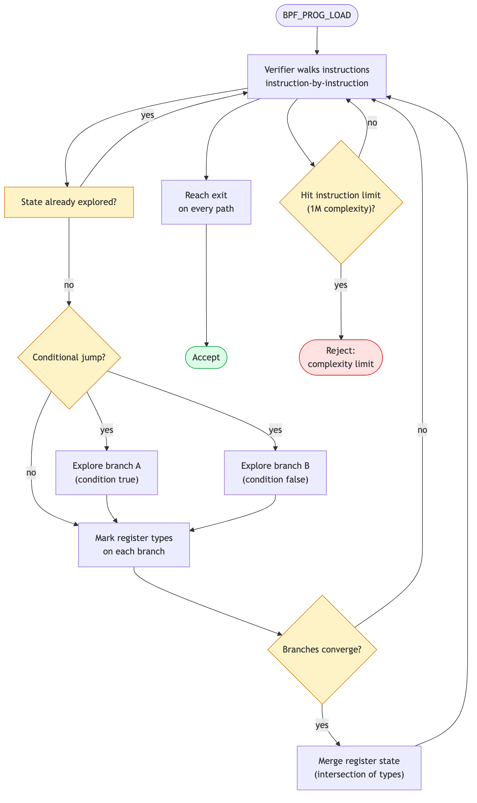
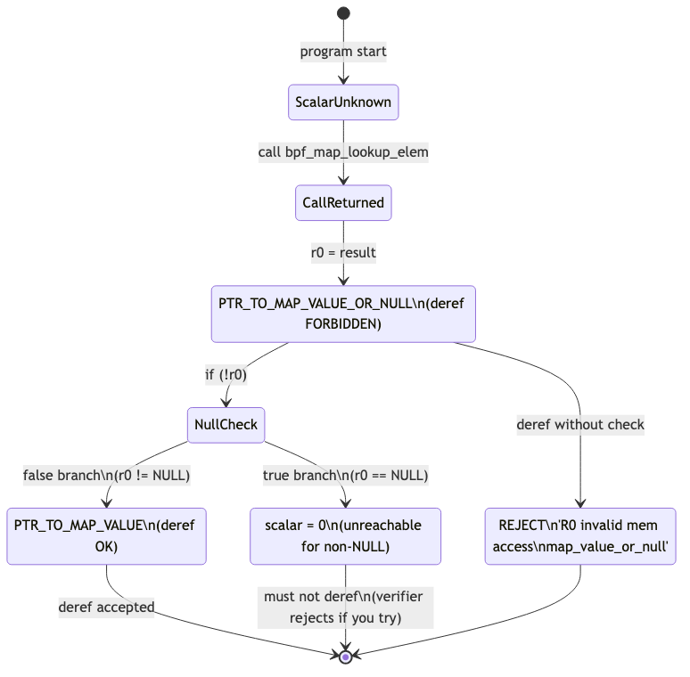

# Day 4 — Meet the Verifier (PTR_TO_MAP_VALUE_OR_NULL boot camp)

> **Today's mission:** stop being surprised by the most common BPF rejection. Trip over `PTR_TO_MAP_VALUE_OR_NULL` in five different shapes; read the log on each; learn what "register state" means. Total time: ~90 minutes. **No new functionality today — this is pure verifier intuition.**

## Why a whole day on one error

Because you'll see this rejection more than any other. Days 1–3 dodged it by always writing `if (!cnt) return 0;` immediately after lookups. That's the trained-monkey response. Today is when that response becomes *understanding*.

The Verifier is not arbitrary. It runs an abstract interpreter over your program — for every instruction it tracks each register's *type*, *bounds*, *reference state*, and which branch you're on. When it can't prove a memory access safe, it rejects. The error log tells you exactly which register and which instruction; if you can read register state, you can fix any rejection in under a minute.

Today we build that fluency.

## How the Verifier walks your program



The Verifier starts at instruction 0 with default register state. For each instruction:

1. It updates register types based on the operation (add, load, call, etc.).
2. On conditional jumps, it forks: explores both branches with appropriate state (e.g., on `if (!r0)`, the false branch knows `r0 != 0`; the true branch knows `r0 == 0`).
3. When two branches reconverge, it merges register states (intersection).
4. **State pruning.** If the current state is "compatible with" a previously-explored state at the same instruction, it stops — it already knows this leads to acceptance. (This is the verifier's key efficiency trick — without it, branchy programs explode exponentially.)
5. If it hits the complexity budget (1M instructions explored across all paths), it gives up: `BPF program is too large`.
6. Every path must reach a `return`/exit instruction safely.

Source: `kernel/bpf/verifier.c`. The function `do_check` is the main loop; `bpf_is_state_visited` (in `kernel/bpf/states.c`, split out of verifier.c in the 2025 refactor) is the pruning check; `mark_ptr_or_null_regs` is what we'll focus on today.

## The state machine for `bpf_map_lookup_elem`'s return value



When you call `bpf_map_lookup_elem`, R0 is marked **`PTR_TO_MAP_VALUE_OR_NULL`** with a *reference id* attached. That id links the not-yet-resolved-NULL nature of this pointer across all flow paths. The Verifier treats:

- `PTR_TO_MAP_VALUE_OR_NULL` — deref forbidden.
- `PTR_TO_MAP_VALUE` — deref OK, with bounds equal to the map's value size.
- `SCALAR_VALUE = 0` — what the register becomes inside the `r == 0` branch.

The transition `PTR_TO_MAP_VALUE_OR_NULL → PTR_TO_MAP_VALUE` happens via `mark_ptr_or_null_regs` after a comparison against zero — but **only on the branch where the comparison would prove non-NULL**.

> ### There are no Dumb Questions
>
> **Q: Why does the verifier need a "reference id"? Isn't the type enough?**
>
> A: The id links multiple registers that share the same not-yet-resolved-NULL state. If you copy `r0` to `r1` before checking, then check `r0`, the Verifier needs to know `r1`'s NULL-ness was resolved too. The id is how it tracks that.
>
> **Q: What if I check `r0 != NULL` instead of `!r0`?**
>
> A: Same effect. The Verifier tracks the comparison and applies the `OR_NULL → not-OR-NULL` transition on the branch that proves non-NULL, regardless of which boolean form you used.
>
> **Q: Is `PTR_TO_MAP_VALUE_OR_NULL` the only "OR_NULL" type?**
>
> A: No — there are many. `PTR_TO_SOCKET_OR_NULL`, `PTR_TO_MEM_OR_NULL` (ringbuf reserve), `PTR_TO_BTF_ID_OR_NULL` (some kfuncs), `PTR_TO_PACKET_OR_NULL`. They all follow the same pattern: deref forbidden until proven non-NULL via a check. The error messages just substitute the type name.

---

## The Lab: five rejections in five shapes

You don't need a working program today. You need a single source file you mutate and reload.

### Setup

Use any of yesterday's programs as the base. We'll mutate it in place.

`reject.bpf.c`:
```c
#include "vmlinux.h"
#include <bpf/bpf_helpers.h>
#include <bpf/bpf_tracing.h>

char LICENSE[] SEC("license") = "GPL";

struct {
    __uint(type, BPF_MAP_TYPE_HASH);
    __uint(max_entries, 1024);
    __type(key, __u32);
    __type(value, __u64);
} m SEC(".maps");

SEC("fentry/filename_unlinkat")
int BPF_PROG(rej)
{
    __u32 key = 0;
    /* WE WILL EDIT THE BODY BELOW FIVE TIMES */
    __u64 *v = bpf_map_lookup_elem(&m, &key);
    if (!v) return 0;
    *v += 1;
    return 0;
}
```

Build it once. It loads. Now break it five ways and read the log each time.

Set verbose loading in your `reject.c`:

```c
LIBBPF_OPTS(bpf_object_open_opts, opts, .kernel_log_level = 1);
struct reject_bpf *skel = reject_bpf__open_opts(&opts);
if (reject_bpf__load(skel)) {
    fprintf(stderr, "load failed (this is expected)\n");
    return 1;
}
```

Or load with `bpftool prog load reject.bpf.o /sys/fs/bpf/x` and the log goes to stderr.

> A successful load **pins** the program at `/sys/fs/bpf/x`. Rejected loads don't pin, but the ones that load clean (the base program, Rejection 5's first snippet, Rejection 3 with a compile-time-constant key) do — so the next successful load to the same path fails with `Error: failed to pin program: File exists`, which is *not* a verifier problem. Remove the pin before re-loading: `sudo rm -f /sys/fs/bpf/x`.

---

### Rejection 1 — The bare deref

```c
__u64 *v = bpf_map_lookup_elem(&m, &key);
*v += 1;       // no null check
return 0;
```

Expected log (essence):

```
0: (b7) r1 = 0           ; key = 0
1: (63) *(u32 *)(r10-4) = r1
2: (bf) r2 = r10
3: (07) r2 += -4
4: (18) r1 = 0xffff...   ; map fd
6: (85) call bpf_map_lookup_elem#1
7: R0=map_value_or_null(id=2,off=0,ks=4,vs=8) R10=fp0
7: (79) r1 = *(u64 *)(r0 +0)
R0 invalid mem access 'map_value_or_null'

processed 8 insns ...
```

**How to read this:**
- Lines 0–6 are the instruction trace.
- Line 7 shows register state right after the call: `R0` is `map_value_or_null` with id=2, offset 0, key size 4, value size 8.
- Line 7 attempts `r1 = *(u64 *)(r0 + 0)` — deref of `r0`.
- The line below states the violation: `R0 invalid mem access 'map_value_or_null'`.

The Verifier did exactly what the diagram showed. You skipped the `mark_ptr_or_null_regs` transition. Fix: add `if (!v) return 0;`.

---

### Rejection 2 — Deref before check

```c
__u64 *v = bpf_map_lookup_elem(&m, &key);
*v += 1;       // deref before check
if (!v) return 0;
```

Same log as Rejection 1. The Verifier walks instructions in order; the late check doesn't help the early deref. Lesson: **the null check must be *before* the deref.** Compiler-style "this branch makes the early line unreachable" doesn't apply — the Verifier evaluates instructions in program order.

---

### Rejection 3 — Conditional null check (verifier path tracking)

```c
__u64 *v = bpf_map_lookup_elem(&m, &key);
if (key == 0) {
    if (!v) return 0;
}
*v += 1;       // is v guaranteed non-NULL here?
```

(For this to demonstrate anything, `key` must be runtime-unknown — change the base to `__u32 key = bpf_get_current_pid_tgid();`. If `key` were the compile-time `0` from the setup, Clang would constant-fold `if (key == 0)` to always-true and the program could actually load.)

Verifier rejects. Why? Inside `if (key == 0)`, you proved `v` non-NULL. But the Verifier explores both branches:
- `key == 0` branch: `v` is checked, then `*v += 1` runs with `v` proven non-NULL. OK.
- `key != 0` branch: skips the inner `if`, falls through to `*v += 1`. `v` is still `map_value_or_null`. **Reject.**

The error message points at the deref instruction, with state showing R0 is still or-null:

```
N: R0=map_value_or_null(id=2,off=0,ks=4,vs=8) ...
N: (79) r1 = *(u64 *)(r0 +0)
R0 invalid mem access 'map_value_or_null'
```

The failing instruction number `N` is higher than Rejection 1 (the extra `if (key == 0)` branch adds instructions), but the violation line is identical: on the `key != 0` fall-through path R0 never made the `OR_NULL → MAP_VALUE` transition. (Exact instruction numbers and the `id=` value vary by kernel version and path.) The Verifier is right — your code is buggy. Fix:

```c
if (!v) return 0;
*v += 1;
```

Or check unconditionally before deref. **Always make the check dominate the use.**

---

### Rejection 4 — Reset id by reassignment

```c
__u64 *v = bpf_map_lookup_elem(&m, &key);
if (!v) return 0;
v = bpf_map_lookup_elem(&m, &key);  // re-lookup
*v += 1;                             // does the second result need a new check?
```

Yes. Each call to `bpf_map_lookup_elem` returns a fresh `PTR_TO_MAP_VALUE_OR_NULL` with a *new* reference id. The first check resolved the *first* lookup. The second lookup is unrelated. Verifier rejects the deref of the second result:

```
N: R0=map_value_or_null(id=3,off=0,ks=4,vs=8) ...   ; note id=3 — a NEW id
N: (79) r1 = *(u64 *)(r0 +0)
R0 invalid mem access 'map_value_or_null'
```

Compare the `id=` to Rejection 1's `id=2`: the second `bpf_map_lookup_elem` minted a brand-new reference the first `if (!v)` never resolved, and it fails at a higher instruction number than Rejection 1's deref. That fresh id is the concrete signal of "new check needed per call." (Exact id values and instruction numbers vary by kernel version.)

Lesson: **null state is per-call, not per-variable name.** Re-check after every lookup, even if you wrote the same code.

---

### Rejection 5 — Loop and lose track

```c
__u64 *v;
for (int i = 0; i < 3; i++) {
    v = bpf_map_lookup_elem(&m, &key);
    if (!v) continue;
    *v += 1;
}
return 0;
```

This loads on a modern verifier: `v` is assigned once, and every iteration `continue`s past the deref when `v` is NULL, so the single check dominates the loop body. Now move the lookup *inside* the loop so each iteration mints a fresh `OR_NULL` that a once-only check can't cover:

```c
__u64 *v;
for (int i = 0; i < 3; i++) {
    v = bpf_map_lookup_elem(&m, &key);  // fresh OR_NULL each iteration
    if (i == 0 && !v) return 0;         // only checked on iteration 0
    *v += 1;                            // iterations 1, 2: v unchecked
}
return 0;
```

This is rejected. The `if (i == 0 && !v)` guard only covers the first iteration; on iterations 1 and 2 the re-lookup hands back a fresh `PTR_TO_MAP_VALUE_OR_NULL` that nothing checked before `*v += 1`:

```
N: R0=map_value_or_null(id=N,off=0,ks=4,vs=8) ...
N: (79) r1 = *(u64 *)(r0 +0)
R0 invalid mem access 'map_value_or_null'
```

Contrast the two snippets: the first loads because `v` is checked-then-used with no reassignment, so the check dominates every unrolled iteration; the second rejects because the per-iteration re-lookup creates an unchecked `OR_NULL` on the `i > 0` paths. (Exact instruction numbers and `id=` values vary by kernel version.)

Lesson: **the check must dominate the use on *every* execution path.** Loops, branches, retries — all paths.

---

## How to read a verifier log fast

Verbose logs look intimidating. They're really three things stacked:

1. **Instruction trace.** Each line shows one BPF instruction in pseudo-assembly.
2. **Register state.** After interesting instructions (calls, jumps, exits) the Verifier prints register types: `R0`, `R1`, ... `R10` (R10 is always the stack frame pointer).
3. **Final error.** A one-line rejection naming the offending register, type, and offending instruction.

Tactics:
- Search the log for "R0 invalid" or "R0 type=". That's where the violation is.
- Walk *backward* from there a few instructions to see what the Verifier knew.
- The instruction numbers match `llvm-objdump -d` output of your `.bpf.o` — you can correlate to source if you compile with `-g`.

The full log goes to `kern_log` if your loader doesn't capture it; `dmesg | tail -200` after a load failure usually has it.

---

## What to read in the kernel

- **`kernel/bpf/verifier.c`**:
  - `do_check` — the main loop. Don't read it all; just see the structure.
  - `mark_ptr_or_null_regs` — search for this. ~50 lines. This is the function that flips `OR_NULL` types after a comparison.
  - `check_helper_call` — how the Verifier knows what type a helper returns. The metadata comes from each helper's `bpf_func_proto`.
- **`include/linux/bpf_verifier.h`** — see `enum bpf_reg_type`. Read the comment near `PTR_TO_MAP_VALUE_OR_NULL`. This is the canonical list of register types — bookmark it.
- **`tools/testing/selftests/bpf/progs/verifier_*.c`** — there are dozens of files here, each focused on a different verifier behavior. `verifier_map_ret_val.c` covers exactly today's topic. Read it: each test is a 3-line program that's *intended* to be rejected, with the expected error message embedded.

---

## Bullet Points

- The Verifier walks every path of your program with abstract interpretation.
- Every register has a **type** (e.g., `SCALAR_VALUE`, `PTR_TO_MAP_VALUE_OR_NULL`, `PTR_TO_BTF_ID`).
- **`PTR_TO_MAP_VALUE_OR_NULL`** cannot be dereferenced until a NULL check transitions it to `PTR_TO_MAP_VALUE`.
- Each `bpf_map_lookup_elem` call returns a fresh OR_NULL with a new reference id — re-check every time.
- Null check must **dominate** every dereference path — branches, loops, retries.
- Verifier log = instruction trace + register state + final error. Search the log for "invalid mem access" to land on the violation.
- All these rules apply to **every** OR_NULL type: socket-or-null, mem-or-null, btf-id-or-null, packet-or-null, etc.
- The Verifier's complexity budget is 1M instructions explored. Hit it and you get "BPF program is too large." (Day 5 covers this.)

---

## Check question

The Verifier's `mark_ptr_or_null_regs` runs after each conditional jump that compares an OR_NULL register against zero. Why does it have to run on *both* branches, not just the "non-NULL" one?

<details>
<summary>Click to reveal answer</summary>

**Answer:** Because the "NULL branch" needs the register marked as scalar zero — otherwise the Verifier wouldn't know that subsequent code on that branch dealing with the register knows it's NULL. Concretely, on the NULL branch, the Verifier wants to allow you to e.g. do `return 0` (which doesn't touch the pointer), or even further conditional logic that depends on having proved NULLness. Both transitions matter; the function name says "regs" plural because both branches' register states get marked.

</details>

---

## Tomorrow

Day 5: bounded loops. The verifier's other big "I can't prove this terminates" rejection. We meet `bpf_loop`, `#pragma unroll`, and the path-explosion problem. End of phase 1: workflow + verifier intuition. Phase 2 (tracing specialization) starts Day 6.
