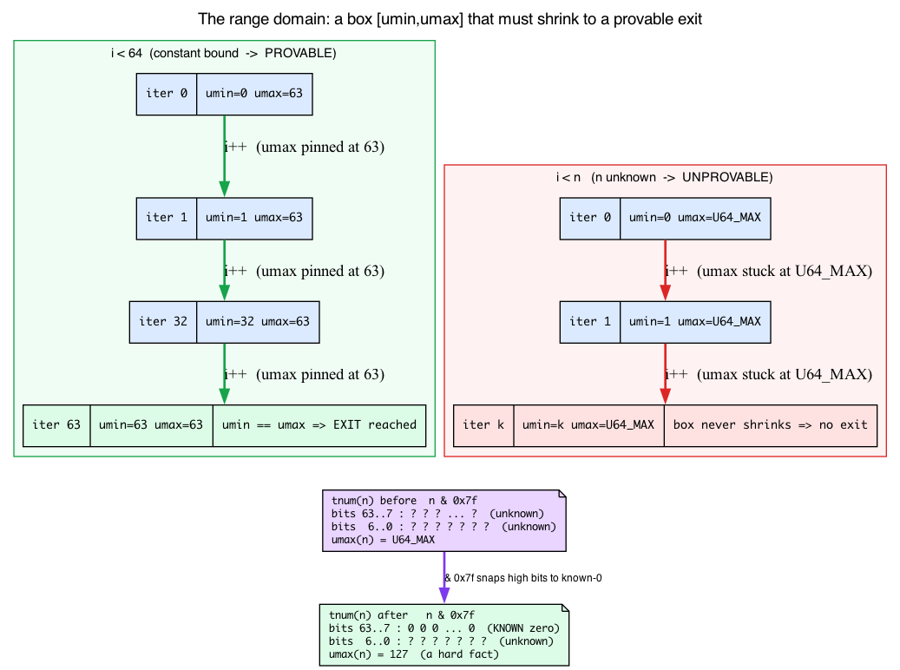
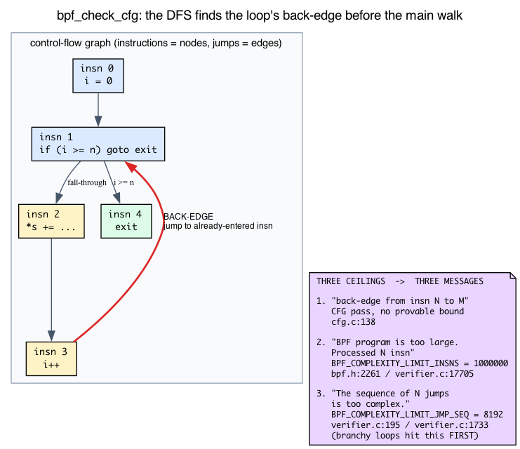
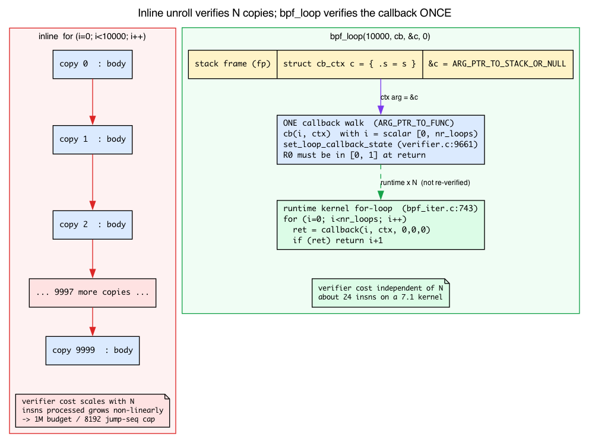

# Day 5 — Bounded loops, `bpf_loop`, and the path-explosion problem

> **Today's mission:** understand why "infinite loop" rejection is really "I can't prove this terminates," learn what the Verifier actually *tracks* about a loop counter, and learn the four ways to write loops it accepts (plus iterators, a loop-shaped bonus). End of phase 1. Total time: ~110 minutes.

## "I'm just doing a for loop, why is it complaining?"

The Verifier's contract is *every BPF program must terminate within a bounded number of instructions*. The reason is operational, not philosophical: BPF runs in kernel contexts where preemption may be disabled, IRQs may be off, scheduling may not happen. A loop that runs forever in such a context wedges the kernel — there is no watchdog that can yank you out. So the Verifier statically refuses any program where it can't prove termination.

That's the *why*. The *how* has three moving parts that the rest of this chapter leans on constantly, so we build all three before we touch a single loop:

1. **A numeric range for every register** — the abstract domain the Verifier uses to *prove* a counter reaches its exit. (New today.)
2. **The control-flow-graph pass** — a separate stage that finds the back-edge (the loop) before the main walk even starts. (New today.)
3. **More than one complexity ceiling** — Day 4 taught you the 1M instruction budget; there is a second, smaller cap that branchy loops hit first. (New today.)

Day 4 introduced the Verifier as *abstract interpretation*: it walks the program symbolically, and every register carries a *type* and a *reference id*. Today is about the part Day 4 only named in passing as "bounds" — the **numeric** part of that same register state. Loops are where it earns its keep.

## What the Verifier knows about a number

Here is the single idea the whole chapter hinges on, and most tutorials never state it:

> For every register holding a `SCALAR_VALUE`, the Verifier does not track *the* value. It tracks a **range of possible values** — a little box the true value is guaranteed to live inside. Loop termination is proved by watching that box shrink toward the exit condition, **not** by reading your C source.

Concretely, each scalar register carries five things at once (`include/linux/bpf_verifier.h`):

```c
struct tnum var_off;        /* line 117 — known-bits mask */
s64 smin_value;             /* line 123 — minimum possible (s64)value */
s64 smax_value;             /* line 124 — maximum possible (s64)value */
u64 umin_value;             /* line 125 — minimum possible (u64)value */
u64 umax_value;             /* line 126 — maximum possible (u64)value */
s32 s32_min_value;          /* line 127 — 32-bit sub-register bounds, too */
```

Two complementary representations of "what could this number be":

- **The interval** — four bounds, signed and unsigned: `smin/smax` and `umin/umax`. "This register is somewhere in `[umin_value, umax_value]`." A brand-new unknown scalar (say, the return of `bpf_get_prandom_u32()`) starts at the widest possible box: `umin=0, umax=U64_MAX`. The Verifier knows *nothing*, so the box is everything.
- **The tnum (`var_off`)** — a *known-bits* mask. For each bit position it records "this bit is definitely 0," "definitely 1," or "unknown." It captures facts the interval can't, like "the low 7 bits are unknown but every higher bit is zero" — which is exactly what a bitmask operation produces.

Every operation on a register updates both. Add a constant, the interval slides. Mask with `& 0x7f`, the tnum's high bits snap to known-zero. Compare in a branch, each side of the branch narrows the box. The Verifier propagates these forward instruction by instruction — this *is* the "abstract interpretation" from Day 4, made numeric.



### Why this is the whole game for loops

A loop is a back-edge: a jump to an earlier instruction. To accept it, the Verifier must prove the back-edge **eventually stops being taken**. It does this with the range domain:

- **`for (i = 0; i < 64; i++)`** — the comparison `i < 64` is a hard fact the Verifier folds straight into `i`'s box: on the loop-body side, `umax_value(i)` becomes `63`. Every iteration adds 1, the box marches upward, and because `umax` is pinned at 63 the Verifier can prove the exit is reached. Termination provable. The bound `64` is independent of anything else in the program.

- **`for (i = 0; i < n; i++)`** where `n` is an unknown scalar — `n`'s box is `[0, U64_MAX]`, so `i < n` tells the Verifier only that `i < U64_MAX`. That leaves `umax_value(i)` at `U64_MAX`. The box never shrinks to a provable exit. Termination **unprovable** — and that is *the* reason this is rejected, not some surface-level "n looks variable" heuristic.

This is why answer 3 of the quiz below works: `i < n && i < 64` keeps the unbounded `n` *and* adds the static `i < 64`. The `64` caps `umax_value(i)` regardless of `n`, so the box shrinks and the loop is provable. The "min trick" is literally "give the range tracker a constant ceiling it can use."

## How the Verifier handles loops: the CFG pass and back-edges

Before the main per-instruction walk even begins, the Verifier runs a *separate* pass that builds a **control-flow graph** (CFG) of your program and classifies every jump. This is `bpf_check_cfg`, invoked as its own stage:

```c
/* kernel/bpf/verifier.c:20033 */
ret = bpf_check_cfg(env);
```

A CFG is just instructions as nodes and jumps as edges. The pass does a depth-first walk and labels each edge. The one that matters today is the **back-edge**: a jump to an instruction the DFS has already *entered but not yet finished* — which is precisely the definition of a loop. When the pass finds one it can't allow, it says so by line and instruction number:

```c
/* kernel/bpf/cfg.c:138 */
verbose(env, "back-edge from insn %d to %d\n", t, w);
```

On old or unprivileged paths, a back-edge here is a hard rejection — the Verifier predates bounded-loop support and simply refuses any loop. On modern bounded-loop kernels (5.3+) the back-edge is *allowed* at this stage, and the question "does it terminate?" is deferred to the range tracking we just built. So the CFG pass is where the Verifier *discovers* the loop; the range domain is where it *judges* the loop.



### Three ceilings, three different rejection messages

Day 4 taught you the 1-million-instruction budget. That is **not** the only ceiling, and that is *why the failures in this chapter don't all say the same thing.* There are three, and learning to map a message to its cause is half of reading verifier logs:

| Rejection message | Triggered by | Kernel constant |
|---|---|---|
| `back-edge from insn N to M` | CFG pass: a loop with no provable bound (or an unprivileged/old path) | `cfg.c:138` |
| `BPF program is too large. Processed N insn` | the *insns-processed* budget: a genuinely unbounded loop explored to exhaustion | `BPF_COMPLEXITY_LIMIT_INSNS = 1000000` (`include/linux/bpf.h:2261`) |
| `The sequence of N jumps is too complex.` | the *explore-stack depth* cap: a branchy-but-bounded loop whose path count overflows the DFS stack | `BPF_COMPLEXITY_LIMIT_JMP_SEQ = 8192` (`verifier.c:195`) |

The third one is the surprise. The insns budget counts how many instructions the Verifier has *processed* across all paths:

```c
/* kernel/bpf/verifier.c:17705 */
if (++env->insn_processed > BPF_COMPLEXITY_LIMIT_INSNS) {
        verbose(env, ...
                "BPF program is too large. Processed %d insn\n", ...
```

Separately, the *depth* of the explore stack — how many pending branch-points the DFS is juggling — is capped much lower:

```c
/* kernel/bpf/verifier.c:1733 */
if (env->stack_size > BPF_COMPLEXITY_LIMIT_JMP_SEQ) {
        verbose(env, "The sequence of %d jumps is too complex.\n", ...
```

A branchy loop overflows the 8192 jump-sequence stack **first**, long before it ever processes a million instructions — which is exactly the stress-test result you'll see later at ~114K insns, well under 1M. When the chapter says "not the message you might expect," *this table is the answer.*


So the loop story end-to-end: the CFG pass (1) finds the back-edge, range tracking (2) tries to prove the counter's box reaches the exit, and the two budgets (3) cap how much exploring that proof is allowed to cost.

> ### There are no Dumb Questions
>
> **Q: 1M instructions sounds like a lot. How do programs actually hit it?**
>
> A: The 1M is *paths explored across all branches*, not instructions executed at runtime. A 100-iteration loop with 5 branches in the body explodes to ≈100×2⁵ = 3200 paths, each with maybe 50 instructions, that's 160K — a lot already. Add nested loops or longer bodies and you breach 1M. The Verifier prunes aggressively but path-explosion is real.
>
> **Q: Why does state pruning sometimes work and sometimes not?**
>
> A: State pruning compares register states between two visits to the same instruction. If state A is "weaker than or equal to" state B (every register in A has a wider type than B), B can be pruned: anything safe in A is safe in B. The trick is that scalar values often *narrow* (the loop counter goes up by 1), making each iteration's state strictly different from the prior one. Modern verifiers use scalar widening tricks to coerce many iterations into one merged state. See the `liveness.c` and `states.c` files added in 2025–2026. ("Narrows" here means exactly the range domain above: each iteration's `[umin,umax]` for the counter is a different box, so the states don't match unless the Verifier deliberately widens them back together.)
>
> **Q: I see `#pragma unroll` in old tutorials. Should I use it?**
>
> A: Sometimes. `#pragma unroll` tells Clang to expand a loop at *compile* time. The Verifier then sees a straight-line program with no back-edge — definitely terminates. Works for small fixed counts. Doesn't scale: unrolling 1000 iterations produces 1000× the code, blowing past instruction limits. **Use `bpf_loop` for non-trivial counts.**

> ### Sharpen your pencil
>
> Predict which of these the Verifier accepts.
>
> 1. `for (int i = 0; i < 10; i++) sum += i;`
> 2. `for (int i = 0; i < n; i++) sum += i;` (where `n` is from `bpf_get_prandom_u32()`)
> 3. `for (int i = 0; i < n && i < 100; i++) sum += i;` (same `n`)
> 4. `int i = 0; while (1) { if (i >= 10) break; sum += i; i++; }`
>
> .\
> .\
> .
>
> **Answers:** 1 ✓ (constant bound — `umax(i)` pinned at 9, box shrinks, easy unroll). 2 ✗ ("infinite loop" — `n`'s box is `[0,U64_MAX]`, so `umax(i)` stays `U64_MAX` and termination is unprovable). 3 ✓ (the `i < 100` is the static-cap trick from the range section — it caps `umax(i)` at 99 regardless of `n`). 4 ✓ (functionally identical to 1 — the `if (i >= 10) break` gives the range tracker the same `umax(i) <= 9` fact).

---

## Meet the four ways to loop

### 1. Constant-bound `for` (default first choice)

```c
for (int i = 0; i < 16; i++)
    process(i);
```

The Verifier unrolls; works for small bounds. The constant `16` caps `umax_value(i)` immediately, so the back-edge is provable. Default first choice when the count is small (≤ ~64).

### 2. Variable-bound with a static cap (the "min" trick)

```c
for (int i = 0; i < n && i < 64; i++)
    process(i);
```

Even when `n` is dynamic, the `i < 64` clause pins `umax_value(i)` at 63 — a hard fact independent of `n`. The Verifier's range box shrinks each iteration, so it accepts. Useful when n is "the smaller of: a parsed length, or our buffer size."

### 3. `#pragma unroll` (deprecated for non-trivial counts)

```c
#pragma unroll
for (int i = 0; i < 8; i++)
    out[i] = in[i] ^ 0xff;
```

Compiles to a straight-line sequence — no back-edge, so the CFG pass never even sees a loop, and the range tracker has nothing to prove. Fine for tiny counts. Bad for anything ≥ ~64 because it bloats program size.

### 4. `bpf_loop` (the modern answer for any non-trivial count)

```c
static int my_cb(__u32 i, void *ctx) {
    /* ... */
    return 0;   /* return 1 to break early */
}

bpf_loop(1000000, my_cb, &ctx_struct, 0);
```

The Verifier verifies the callback **once** as a single iteration. Then it treats `bpf_loop` as a black-box helper that runs your verified callback up to N times. Complexity is independent of N.

This is the breakthrough that came in kernel 5.17 (commit `e6f2dd0f8067` — "bpf: Add bpf_loop helper"). Before it, you were stuck unrolling. After, loops in BPF feel like loops in real C. But it has its own model, and it's worth understanding *why* it works — that's the next section.

### What a BPF callback actually is

> The exact line numbers below track the 7.1 tree; the symbol names (`bpf_loop_proto`, `set_loop_callback_state`, the `ARG_*` type tags) are the stable anchors to grep for on any kernel.

`bpf_loop` does something almost no other BPF program does: it takes a **function pointer** as an argument. To handle that, the Verifier has a dedicated argument type, and you can see it right in the helper's prototype (`kernel/bpf/bpf_iter.c:753-761`; the two arg-types quoted below are at `:758-759`):

```c
const struct bpf_func_proto bpf_loop_proto = {
    ...
    .arg2_type  = ARG_PTR_TO_FUNC,            /* the callback function */
    .arg3_type  = ARG_PTR_TO_STACK_OR_NULL,   /* the ctx — must be stack */
    ...
};
```

Two things to unpack here, and they explain the entire lab.

**`ARG_PTR_TO_FUNC` — verify the callee once, as one generic iteration.** When the Verifier sees the function-pointer argument, it treats your callback as a separate *subprogram* and walks it symbolically **one time**, with the index `i` modeled as a fully *unknown* scalar — `set_loop_callback_state` (`verifier.c:9661`) just marks R1 as a bare `SCALAR_VALUE`, leaving its range at the widest `[0, U64_MAX]` box. It is **not** narrowed to `[0, nr_loops)`; the Verifier deliberately treats the index as completely opaque so that one symbolic walk covers every iteration regardless of `nr_loops`. It does **not** stamp out N copies of the body. That single symbolic walk is the whole reason cost is independent of N. The machinery that sets this up has a name:

```c
/* kernel/bpf/verifier.c:9661 */
static int set_loop_callback_state(struct bpf_verifier_env *env, ...
```

invoked at `verifier.c:10447` when the Verifier processes the `bpf_loop` call.

**The callback contract is enforced, not advisory.** Your callback must return 0 (continue) or 1 (stop). At the callback's return point the Verifier applies the *same range machinery* from the start of this chapter, demanding `R0` (the return register) lie in `[0, 1]`:

```c
/* kernel/bpf/verifier.c:9896 */
"At callback return", "R0"
```

and the out-of-range complaint itself is the generic range message:

```c
/* kernel/bpf/verifier.c:303 */
verbose(env, " should have been in [%d, %d]\n", range.minval, range.maxval);
```

This is the bridge that ties the chapter together: the scalar range domain you learned for proving loop termination is the *exact same* mechanism that checks a callback's return value. "Bounded" and "in the allowed range" are different questions, and Break 4 below trips precisely on this.

**Why the ctx must be stack memory.** The 3rd argument is `ARG_PTR_TO_STACK_OR_NULL` — it must point at *stack* memory (`fp` = frame pointer). Hand it a raw `PTR_TO_MAP_VALUE` (a pointer into a map, like the one `bpf_map_lookup_elem` returns) and the Verifier rejects it:

```
R3 type=map_value expected=fp
```

That's why the lab wraps its map pointer in a tiny stack struct and passes *that* struct's address — it launders the map pointer through a stack slot to satisfy `ARG_PTR_TO_STACK_OR_NULL`. The wrapper isn't a style choice; it's the contract.

**The runtime side is mundane.** All the cleverness is on the verification side. At runtime, `bpf_loop` is an ordinary C `for` loop in the kernel (`kernel/bpf/bpf_iter.c:743-751`):

```c
for (i = 0; i < nr_loops; i++) {
        ret = callback((u64)i, (u64)(long)callback_ctx, 0, 0, 0);
        /* return value: 0 - continue, 1 - stop and return */
        if (ret)
                return i + 1;
}
```

It calls your callback up to `nr_loops` times and stops early on a non-zero return. There is a runtime ceiling, too: `nr_loops > BPF_MAX_LOOPS` returns `-E2BIG` (`bpf_iter.c:740-741`), where `BPF_MAX_LOOPS = 8 * 1024 * 1024` (`include/linux/bpf.h:2268`). So the "magic" is verify-once on the Verifier side; execution is a plain loop.




The catch: the callback can't directly access local variables of the calling function. You pass state through the `ctx` pointer (last argument) — which, as we just saw, must live on the stack.

### Bonus: Iterators (a fifth, loop-shaped tool)

For walking kernel data structures (tasks, sockets, cgroups, BTF), there are dedicated **BPF iterators** — `task_iter`, `sock_iter`, etc. These are *programs*, not loops, so they sit outside the four-way framing above. We meet them on Day 17. For now: just know they exist as a loop-shaped tool.

---

## The lab

### `loops.bpf.c` — try every shape

```c
{{#include ../labs/day05/loops.bpf.c:book}}
```

The two programs share a 1-element array map (a "global counter" pattern — recall the array-map singleton trick from Day 2). Build and load both. Note `cb_ctx`: it exists for exactly one reason — to give `bpf_loop` a *stack* address (`&c`) instead of the raw map pointer `s`, satisfying `ARG_PTR_TO_STACK_OR_NULL`.

### Inspect the verifier's effort

Both programs above *load* successfully — and that changes how you measure them. `bpftool prog load` only prints a verifier log when a program is **rejected**, so on a clean load it shows you nothing useful. To see the effort on a *successful* load, use one of these two paths.

**Path 1 — `veristat` (the purpose-built tool).** It load-tests every program in an object file and prints a per-program stats table:

```
sudo veristat loops.bpf.o
```

The `Insns` and `States` columns are exactly the comparison we want — no attach needed. (`veristat` ships in the kernel tree under `tools/testing/selftests/bpf` and may need building/installing; it is not in `$PATH` by default.)

**Path 2 — your own loader.** Set the verifier log level before load and read the bottom line of the printed log:

```c
LIBBPF_OPTS(bpf_object_open_opts, opts, .kernel_log_level = 1);
```

The last line of `loop_helper`'s log looks like:

```
processed 24 insns (limit 1000000) ...
```

`processed N insns` is the path-exploration cost. The exact counts are **kernel- and compiler-version dependent**, so capture your own rather than trusting any number printed here — but the *relationship* is the lesson:

- `loop_const` (16-iter inline) verifies every unrolled iteration, so its insn count scales with the iteration count.
- `loop_helper` (10K `bpf_loop`) verifies the callback **once** — that's the `set_loop_callback_state` single-walk in action — so its cost is tiny and independent of N — about 24 insns on this 7.1 kernel.

`bpf_loop` is *cheaper* for the Verifier even though it does *more* work at runtime, because the callback verifies once.

### Stress test: when does inline break?

Try replacing `loop_const` with a branchy, bounded inline loop:

```c
for (int i = 0; i < N; i++) {
    __u64 v = bpf_get_prandom_u32();
    if (v & 1) *s += v;
    else       *s -= v;
}
```

Each `N` needs a fresh build, so: edit `N`, rebuild (`make`, or rerun your `clang` command), reload, repeat. Walk `N` up: 16, 64, 256, 1024, 10000, and watch `processed insns` grow non-linearly. `N=1024` still loads; around `N=10000` on a 7.x kernel it is rejected — but **not** with the "too large" message you might expect. A branchy body overflows the jump-sequence stack (`BPF_COMPLEXITY_LIMIT_JMP_SEQ` = 8192, the second of the three ceilings) long before the 1,000,000-instruction budget:

```
The sequence of 8193 jumps is too complex.
processed 114705 insns (limit 1000000)
```

Note it failed at ~114K insns — far below the 1M limit. That's the table from earlier doing its work: this is the *jump-sequence depth* cap (`verifier.c:1733`), not the *insns-processed* budget (`verifier.c:17705`). The flat `BPF program is too large. Processed 1000001 insn` message comes from a genuinely *unbounded* loop instead; see Break 1.

Replace the `for` with `bpf_loop`. Loads in milliseconds. **The branch in the body × 10000 iterations was 2¹⁰⁰⁰⁰ paths if the Verifier didn't prune — `bpf_loop` makes it just paths(callback), because the callback verifies once with `i` modeled as a fully unknown (unbounded) scalar.**

---

## What to break, in order

### Break 1 — Unbounded loop

```c
__u32 n = bpf_get_prandom_u32();
for (__u32 i = 0; i < n; i++)
    *s += bpf_get_prandom_u32();   /* per-iteration helper call: cannot be folded */
```

> Note the body. If you write `*s += i;`, clang -O2 recognises the closed form
> `n*(n-1)/2` and compiles it to straight-line arithmetic with **no back-edge** —
> the program then loads fine and this break never fires. The per-iteration
> `bpf_get_prandom_u32()` defeats that folding so a real unbounded loop survives
> to the Verifier.

Reject — `n` is an unknown scalar, so its range box is `[0, U64_MAX]`, which leaves `umax_value(i)` at `U64_MAX`: the Verifier can never prove the counter reaches the exit, so it explores until it exhausts the complexity budget:

```
BPF program is too large. Processed 1000001 insn
```

This is the *insns-processed* ceiling (`BPF_COMPLEXITY_LIMIT_INSNS`, `verifier.c:17705`). On older kernels — pre-5.3, before bounded-loop support — the CFG pass rejected this earlier as `back-edge from insn N to M` from the `check_cfg` DAG check (`cfg.c:138`); that wording no longer fires for this case on modern kernels, which allow the back-edge and defer the verdict to range tracking. Add `&& i < 1024` — the static-cap trick from the range section gives `umax_value(i)` a hard ceiling of 1023.

### Break 2 — Bound that isn't visible

```c
__u32 n = bpf_get_prandom_u32() % 100;
for (__u32 i = 0; i < n; i++)
    *s += bpf_get_prandom_u32();   /* non-foldable body — keeps a real loop */
```

(As in Break 1, the body must be something clang can't fold: with `*s += i;` the whole loop collapses to `n*(n-1)/2` and no loop reaches the Verifier, so there is no range to track and the lesson is lost.)

The Verifier *might* accept this on modern kernels (it can track `n`'s range as `[0, 99]` and thus `umax_value(i) <= 98`). On older kernels it rejects, because modulo arithmetic doesn't always propagate a tight `umax` through the scalar tracker — the range can stay wide even though `% 100` logically bounds it. Compare that to a bitwise AND, which the tnum captures *immediately*:

```c
n = n & 0x7f;        // 0..127, verifier definitely sees the bound
```

`& 0x7f` sets every bit above bit 6 to known-zero in `n`'s tnum (`var_off`), which forces `umax_value(n)` to 127 on the spot. The high bits become a hard fact, so `i < n` now caps `umax_value(i)` at 126 and the loop is provable. Lesson: **a bitmask updates the known-bits domain directly; modulo may not — be explicit when you can be.**

### Break 3 — Hit the complexity budget

A pattern that *looks* pathological:

```c
char buf[256];
bpf_get_current_comm(buf, sizeof(buf));
for (int i = 0; i < 256; i++) {
    if (buf[i] == '/') { /* do A */ }
    else if (buf[i] == ' ') { /* do B */ }
    else { /* do C */ }
}
```

Surprise: on a modern (7.x) Verifier this **loads cleanly**. The branch bodies are empty, so every path leaves register/scalar state unchanged and state pruning collapses them all — the 256 iterations never explode. To actually breach the budget you need *both* a high iteration count (well past `N=10000` on 6.6+, as in the stress test above) **and** branch bodies that diverge register state so the paths can't be pruned. Give each branch a state-changing side effect and raise the count:

```c
for (int i = 0; i < N; i++) {
    if      (buf[i] == '/') *s += i;
    else if (buf[i] == ' ') *s -= i;
    else                    *s ^= i;
}
```

Now the paths diverge (each branch leaves a different register-state box, so pruning can't merge them) and, at a large enough `N`, you overflow the jump-sequence stack: `The sequence of NNNN jumps is too complex.` — the same `BPF_COMPLEXITY_LIMIT_JMP_SEQ` cap from the stress test, *not* the 1M insns budget. Fix: refactor with `bpf_loop`, or reduce the iteration count to the longest sensible string length.

### Break 4 — Callback returning the wrong thing

Wire a callback that returns something other than 0 or 1 into the (now-loadable) `loop_helper` from the lab:

```c
static int cb(__u32 i, void *ctx) {
    return 2;     // valid returns: 0 (continue) or 1 (break)
}
```

Verifier rejects:

```
At callback return the register R0 has smin=2 smax=2 should have been in [0, 1]
```

Read that message through the range domain. `smin=2 smax=2` means R0 is the **exact constant 2** — a perfectly *bounded* value; its box is the single point `{2}`. It is rejected anyway, because the callback-return *range check* (`verifier.c:9896`, "At callback return", "R0") demands R0 lie in `[0, 1]`, and `should have been in [0, 1]` is the generic range complaint at `verifier.c:303`. "Bounded" and "in the allowed range" are different questions: the value is bounded, just bounded to the *wrong* range. This is the same scalar-range machinery that proves loop termination, now applied at the subprogram's exit. (Exact register fields vary by kernel version. You can only reach this check once `loop_helper`'s ctx is fixed, otherwise the `R3 type=map_value expected=fp` error fires first.)

---

## What to read in the kernel

- **`kernel/bpf/bpf_iter.c`** — search `BPF_CALL_4(bpf_loop` (line 727). The runtime implementation is the tight `for` loop at lines 743–751 calling the verified callback; the proto at 753–761 declares `ARG_PTR_TO_FUNC` (`:758`) and `ARG_PTR_TO_STACK_OR_NULL` (`:759`). The Verifier knows about this helper specifically and verifies the callback once via `set_loop_callback_state` (`verifier.c:9661`).
- **`include/linux/bpf_verifier.h`** — read `struct bpf_reg_state` around lines 117–127: `var_off` (the tnum) plus the `smin/smax/umin/umax` interval and the 32-bit sub-register bounds. This *is* the abstract domain. Spend five minutes here; it pays off for every future verifier log.
- **`kernel/bpf/verifier.c`**:
  - search `bpf_is_state_visited` (defined in `kernel/bpf/states.c`) — the heart of state pruning.
  - search `process_bpf_exit_full` — how state propagates across paths at exit. For the liveness machinery it leans on, see `kernel/bpf/liveness.c`.
  - line 20033 `bpf_check_cfg(env)` — the CFG pass that finds back-edges.
- **`kernel/bpf/cfg.c`** — line 138, the `back-edge from insn %d to %d` message, so you can see where the loop is actually *discovered*.
- **`tools/testing/selftests/bpf/progs/bpf_loop.c`** — official examples of every loop shape.
- **`Documentation/bpf/verifier.rst`** — the kernel's own doc on how the Verifier handles loops and value tracking. Worth one read.

---

## Bullet Points

- **The Verifier rejects unbounded loops** because it must prove termination statically — there's no kernel watchdog to recover from infinite BPF.
- **Every scalar register carries a numeric range**, not just a type: signed/unsigned `min/max` plus a tnum (`var_off`) known-bits mask. Loop bounds are proved by watching this box shrink toward the exit, *not* by reading C source.
- A **back-edge** (loop) is found by the separate **CFG pass** (`bpf_check_cfg`); termination is then judged by the range domain. `i < 64` pins `umax(i)=63`; an unbounded `i < n` leaves it at `U64_MAX` and is unprovable.
- **Three ceilings, three messages:** `back-edge from insn N to M` (CFG pass), `BPF program is too large` (1M insns-processed budget), `The sequence of N jumps is too complex` (8192 jump-sequence stack — branchy loops hit this first).
- **Constant-bound `for`** is fine for small counts (≤ ~64); **variable bound with static cap** (`i < n && i < CAP`) hands the range tracker a constant ceiling; **`#pragma unroll`** removes the back-edge entirely (tiny counts only).
- **`bpf_loop(N, cb, ctx, 0)`** is the modern answer: the callback (a subprogram passed via `ARG_PTR_TO_FUNC`) is verified **once** as a single generic iteration, so cost is independent of N. At runtime it's a plain kernel `for` loop. The `ctx` must be **stack** memory (`ARG_PTR_TO_STACK_OR_NULL`) — hence the stack wrapper.
- The **callback contract** (return 0 or 1) is enforced by the *same* range machinery: R0 must be in `[0,1]` at return — "bounded" ≠ "in the allowed range" (see Break 4).
- A bitwise **`& 0x7f`** sets known-zero bits in the tnum and snaps `umax` to 127 immediately; **modulo** may not propagate a tight max — be explicit.

---

## Check question

A loop iterates 100 times. Inside, you have an `if/else` with 4 conditions (so 4 branches at one point). Roughly how many paths does the Verifier explore *without* state pruning? And with `bpf_loop` instead of an inline loop?

<details>
<summary>Click to reveal answer</summary>

**Answer:** Without pruning: 4¹⁰⁰ ≈ 10⁶⁰ — astronomical. With state pruning the Verifier collapses iterations whose register states (the numeric range boxes for every scalar) are equivalent, often bringing it back to manageable. With `bpf_loop`, the callback (one iteration of the body) is verified once with its 4 branches = 4 paths total, with the index `i` modeled as a fully unknown (unbounded) scalar. The 100-iteration aspect is opaque to the Verifier — `bpf_loop` is just a helper call with a bounded execution contract.

</details>

---

## End of Phase 1

You now have:
- A working libbpf+CO-RE+ringbuf+hashmap workflow.
- The instinct to null-check after every lookup or reserve.
- The vocabulary to read verifier logs — including the three distinct rejection messages and what each one means.
- An understanding of what the Verifier *does* — abstract interpretation over a numeric range domain, with state pruning, under (more than one) complexity budget.

That's enough foundation to do real BPF work. Phase 2 (Days 6–13) specializes you into tracing: typed function tracing with fentry/fexit at scale, tracepoints, stack traces, uprobes, and sleepable programs.

## Tomorrow

**Day 6: typed function tracing with fentry/fexit at scale.** We attach to kernel functions by name and read their arguments with full type information — no more `PT_REGS_PARM` guesswork. You'll see how BTF lets `fentry` know the real signature of the function you hook, and why that makes argument access both safer and faster than the kprobe path.
