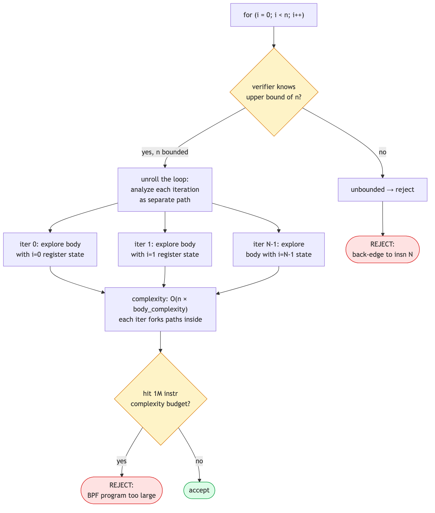
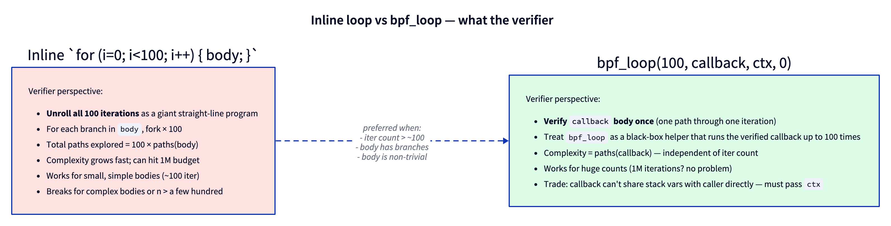

# Day 5 — Bounded loops, `bpf_loop`, and the path-explosion problem

> **Today's mission:** understand why "infinite loop" rejection is really "I can't prove this terminates," and learn the four ways to write loops the Verifier accepts. End of phase 1. Total time: ~75 minutes.

## "I'm just doing a for loop, why is it complaining?"

The Verifier's contract is *every BPF program must terminate within a bounded number of instructions*. The reason is operational, not philosophical: BPF runs in kernel contexts where preemption may be disabled, IRQs may be off, scheduling may not happen. A loop that runs forever in such a context wedges the kernel — there is no watchdog that can yank you out. So the Verifier statically refuses any program where it can't prove termination.

That's the *why*. The *how* is path exploration plus a hard complexity budget.

## How the Verifier handles loops

When the Verifier sees a back-edge (a jump to an earlier instruction), it has to do one of:

1. **Prove the loop terminates** by symbolically executing each iteration.
2. **Use state pruning** to detect that subsequent iterations don't add new behavior.
3. **Refuse the program** if neither works.

For small, well-structured loops with a known upper bound, the Verifier unrolls the iterations as a straight-line program. For each iteration, it propagates register state forward. State pruning catches the common case where iteration N's register state is "compatible with" iteration N-1's, which short-circuits the analysis.



Two failure modes you'll hit:

- **"back-edge from insn N to M"** — the Verifier saw a jump backward and could not prove an upper bound on iterations. The induction variable wasn't tracked, or the loop body did something that prevented bound inference.
- **"BPF program is too large"** — the Verifier accepted the loop bound but path-explored too much. Each branch in the loop body gets multiplied by the iteration count. With branches and a 1M complexity cap, modest loops can blow the budget.

> ### There are no Dumb Questions
>
> **Q: 1M instructions sounds like a lot. How do programs actually hit it?**
>
> A: The 1M is *paths explored across all branches*, not instructions executed at runtime. A 100-iteration loop with 5 branches in the body explodes to ≈100×2⁵ = 3200 paths, each with maybe 50 instructions, that's 160K — a lot already. Add nested loops or longer bodies and you breach 1M. The Verifier prunes aggressively but path-explosion is real.
>
> **Q: Why does state pruning sometimes work and sometimes not?**
>
> A: State pruning compares register states between two visits to the same instruction. If state A is "weaker than or equal to" state B (every register in A has a wider type than B), B can be pruned: anything safe in A is safe in B. The trick is that scalar values often *narrow* (the loop counter goes up by 1), making each iteration's state strictly different from the prior one. Modern verifiers use scalar widening tricks to coerce many iterations into one merged state. See the `liveness.c` and `states.c` files added in 2025–2026.
>
> **Q: I see `#pragma unroll` in old tutorials. Should I use it?**
>
> A: Sometimes. `#pragma unroll` tells Clang to expand a loop at *compile* time. The Verifier then sees a straight-line program with no back-edge — definitely terminates. Works for small fixed counts. Doesn't scale: unrolling 1000 iterations produces 1000× the code, blowing past instruction limits. **Use `bpf_loop` for non-trivial counts.**

> ### Sharpen your pencil
>
> Predict which of these the Verifier accepts.
>
> 1. `for (int i = 0; i < 10; i++) sum += i;`
> 2. `for (int i = 0; i < n; i++) sum += i;` (where `n` is from `bpf_get_prandom_u32()`)
> 3. `for (int i = 0; i < n && i < 100; i++) sum += i;` (same `n`)
> 4. `int i = 0; while (1) { if (i >= 10) break; sum += i; i++; }`
>
> .  
> .  
> .
>
> **Answers:** 1 ✓ (constant bound, easy unroll). 2 ✗ ("infinite loop" — `n` is unbounded). 3 ✓ (the `i < 100` is a static cap, regardless of `n`). 4 ✓ (functionally identical to 1 — the verifier is smart enough to see the `break` as the bound).

---

## Meet the four ways to loop

### 1. Constant-bound `for` (default first choice)

```c
for (int i = 0; i < 16; i++)
    process(i);
```

The Verifier unrolls; works for small bounds. Default first choice when the count is small (≤ ~64).

### 2. Variable-bound with a static cap (the "min" trick)

```c
for (int i = 0; i < n && i < 64; i++)
    process(i);
```

Even when `n` is dynamic, the `i < 64` clause guarantees an upper bound. Verifier accepts. Useful when n is "the smaller of: a parsed length, or our buffer size."

### 3. `#pragma unroll` (deprecated for non-trivial counts)

```c
#pragma unroll
for (int i = 0; i < 8; i++)
    out[i] = in[i] ^ 0xff;
```

Compiles to a straight-line sequence — no back-edge, no Verifier loop logic at all. Fine for tiny counts. Bad for anything ≥ ~64 because it bloats program size.

### 4. `bpf_loop` (the modern answer for any non-trivial count)

```c
static int my_cb(__u32 i, void *ctx) {
    /* ... */
    return 0;   /* return 1 to break early */
}

bpf_loop(1000000, my_cb, &ctx_struct, 0);
```

The Verifier verifies the callback **once** as a single iteration. Then it treats `bpf_loop` as a black-box helper that runs your verified callback up to N times. Complexity is independent of N.

This is the breakthrough that came in kernel 5.17 (commit `e6f2dd0f8067` — "bpf: Add bpf_loop helper"). Before it, you were stuck unrolling. After, loops in BPF feel like loops in real C.



The catch: the callback can't directly access local variables of the calling function. You pass state through the `ctx` pointer (last argument).

### 5. (Bonus) Iterators

For walking kernel data structures (tasks, sockets, cgroups, BTF), there are dedicated **BPF iterators** — `task_iter`, `sock_iter`, etc. These are *programs*, not loops. We meet them on Day 17. For now: just know they exist as a third loop-shaped tool.

---

## The lab

### `loops.bpf.c` — try every shape

```c
#include "vmlinux.h"
#include <bpf/bpf_helpers.h>
#include <bpf/bpf_tracing.h>

char LICENSE[] SEC("license") = "GPL";

struct {
    __uint(type, BPF_MAP_TYPE_ARRAY);
    __uint(max_entries, 1);
    __type(key, __u32);
    __type(value, __u64);
} sum SEC(".maps");

/* helper to get the singleton sum slot */
static __u64 *get_sum(void) {
    __u32 z = 0;
    return bpf_map_lookup_elem(&sum, &z);
}

/* shape 1: constant bound */
SEC("fentry/do_unlinkat")
int BPF_PROG(loop_const)
{
    __u64 *s = get_sum();
    if (!s) return 0;
    for (int i = 0; i < 16; i++)
        *s += i;
    return 0;
}

/* shape 4: bpf_loop callback */
static int cb(__u32 i, void *ctx)
{
    __u64 *s = ctx;
    *s += i;
    return 0;
}

SEC("fentry/do_unlinkat")
int BPF_PROG(loop_helper)
{
    __u64 *s = get_sum();
    if (!s) return 0;
    bpf_loop(10000, cb, s, 0);
    return 0;
}
```

The two programs share a 1-element array map (a "global counter" pattern). Build and load both.

### Inspect the verifier's effort

```c
LIBBPF_OPTS(bpf_object_open_opts, opts, .kernel_log_level = 1);
```

Look at the bottom of the verifier log for each program:

```
processed 154 insns (limit 1000000) max_states_per_insn 1 total_states 9 peak_states 9 mark_read 5
```

`processed N insns` is the path-exploration cost. Compare:

| Program        | processed insns |
|----------------|-----------------|
| `loop_const` (16-iter inline) | ~150 |
| `loop_helper` (10K bpf_loop)  | ~80 |

`bpf_loop` is *cheaper* for the Verifier even though it does *more* work at runtime, because the callback verifies once.

### Stress test: when does inline break?

Try replacing `loop_const` with:

```c
for (int i = 0; i < N; i++) {
    __u64 v = bpf_get_prandom_u32();
    if (v & 1) *s += v;
    else       *s -= v;
}
```

Increase `N`: 16, 64, 256, 1024. Watch `processed insns` grow non-linearly. At some point — depends on kernel version, around `N=1024` on older verifiers, well past `N=10000` on 6.6+ — you'll hit:

```
BPF program is too large. Processed 1000001 insn
```

Replace the `for` with `bpf_loop`. Loads in milliseconds. **The branch in the body × 10000 iterations was 2¹⁰⁰⁰⁰ paths if the Verifier didn't prune — `bpf_loop` makes it just paths(callback).**

---

## What to break, in order

### Break 1 — Unbounded loop

```c
__u32 n = bpf_get_prandom_u32();
for (__u32 i = 0; i < n; i++)
    *s += i;
```

Reject:

```
back-edge from insn N to M
```

`n` has no static upper bound. Add `&& i < 1024` to make it bounded.

### Break 2 — Bound that isn't visible

```c
__u32 n = bpf_get_prandom_u32() % 100;
for (__u32 i = 0; i < n; i++)
    *s += i;
```

The Verifier *might* accept this on modern kernels (it tracks `n` as having range [0, 99]). On older kernels it rejects because the modulo doesn't propagate the upper bound through scalar tracking. Lesson: even when modulo bounds something logically, the Verifier may not infer it. Be explicit:

```c
n = n & 0x7f;        // 0..127, verifier definitely sees the bound
```

### Break 3 — Hit the complexity budget

A pathological pattern from real life:

```c
char buf[256];
bpf_get_current_comm(buf, sizeof(buf));
for (int i = 0; i < 256; i++) {
    if (buf[i] == '/') { /* do A */ }
    else if (buf[i] == ' ') { /* do B */ }
    else { /* do C */ }
}
```

Three branches, 256 iterations, fanout grows fast. Modern Verifiers prune aggressively but you can still hit "too large." Fix: refactor with `bpf_loop`, or reduce iteration count to the longest sensible string length.

### Break 4 — Callback returning the wrong thing

```c
static int cb(__u32 i, void *ctx) {
    return 2;     // valid returns: 0 (continue) or 1 (break)
}
```

Verifier rejects:

```
At callback return the register R0 has unbounded ranges
```

(Or similar wording.) The callback contract specifies 0 or 1 only.

---

## What to read in the kernel

- **`kernel/bpf/helpers.c`** — search `bpf_loop`. The implementation is a tight C loop calling the verified callback. The Verifier knows about this helper specifically and verifies the callback once.
- **`kernel/bpf/verifier.c`**:
  - search `is_state_visited` — the heart of state pruning.
  - search `process_bpf_exit_full` and `propagate_liveness` — how state propagates across paths.
- **`tools/testing/selftests/bpf/progs/bpf_loop.c`** — official examples of every loop shape.
- **`Documentation/bpf/verifier.rst`** — the kernel's own doc on how the Verifier handles loops. Worth one read.

---

## Bullet Points

- **The Verifier rejects unbounded loops** because it must prove termination statically — there's no kernel watchdog to recover from infinite BPF.
- **Constant-bound `for`** is fine for small counts (≤ ~64).
- **Variable bound with static cap** (`i < n && i < CAP`) makes the bound visible to the Verifier.
- **`#pragma unroll`** turns a loop into straight-line code — works for tiny counts only.
- **`bpf_loop(N, cb, ctx, 0)`** is the modern answer for any non-trivial count: callback verifies once, runs N times.
- The Verifier's complexity budget is **1M instructions explored**; loops with branchy bodies blow it fastest.
- Two failure messages: **"back-edge from insn N to M"** (unbounded) and **"BPF program is too large"** (path explosion).

---

## Check question

A loop iterates 100 times. Inside, you have an `if/else` with 4 conditions (so 4 branches at one point). Roughly how many paths does the Verifier explore *without* state pruning? And with `bpf_loop` instead of an inline loop?

.  
.  
.

**Answer:** Without pruning: 4¹⁰⁰ ≈ 10⁶⁰ — astronomical. With state pruning the Verifier collapses iterations whose register states are equivalent, often bringing it back to manageable. With `bpf_loop`, the callback (one iteration of the body) is verified once with its 4 branches = 4 paths total. The 100-iteration aspect is opaque to the Verifier — `bpf_loop` is just a helper call with a bounded execution contract.

---

## End of Phase 1

You now have:
- A working libbpf+CO-RE+ringbuf+hashmap workflow.
- The instinct to null-check after every lookup or reserve.
- The vocabulary to read verifier logs.
- An understanding of what the Verifier *does* — abstract interpretation with state pruning under a complexity budget.

That's enough foundation to do real BPF work. Phase 2 (Days 6–13) specializes you into tracing: typed function tracing with fentry/fexit at scale, tracepoints, stack traces, uprobes, and sleepable programs.

When you're ready, send me the word and I'll continue with Days 6–10 in this same format.
