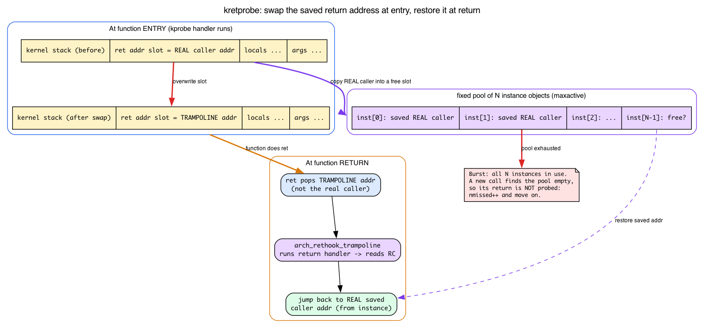

# Day 6 — fentry/fexit and the latency-measurement pattern

> **Today's mission:** measure the latency of every `vfs_read` on your system. Build a map keyed by thread, store the entry timestamp on call-in, retrieve it on call-out, emit duration to userspace. Along the way: meet `fexit` and understand *exactly* how it differs from the older `kretprobe` (the return-address swap, the instance pool, why bursts get missed), learn what `vfs_read` actually is and what its return value means, and pick the right per-thread key. Total time: ~110 minutes.

> **Phase 2 starts here.** Days 1–5 made you fluent with libbpf, CO-RE, maps, and the Verifier. Days 6–13 turn that fluency into tracing: typed kernel-function tracing at scale, tracepoints, stack traces, uprobes, and sleepable programs. By Day 13 you'll be able to write the kind of tracer that ships in production observability tools.

## The pattern that powers every tracer

Most tracing problems reduce to one shape:

> *"When event A happens, remember something. When the matching event B happens, retrieve and act on it."*

For latency: A = function entry, B = function exit. Remember the timestamp on A; on B compute `now - remembered`.

Yesterday you saw `fentry`. Today you meet its other half — `fexit` — and use them as a pair to do the most common BPF tracing pattern in the world.


The fentry program runs *before* the function body. The fexit program runs *after* it. Both are connected to the same trampoline; the kernel installs them as a coordinated pair when you load the BPF object. Between entry and exit, the function does its work — could be 100 ns, could be 100 ms.

## What is `vfs_read`, and what does its return value mean?

Before we hook anything, know your target. Today we trace `vfs_read`, and the lab only makes sense if you know two facts about it.

**First: `vfs_read` is the kernel's single central entry point for the `read(2)`/`pread(2)` family of syscalls.** Every file-descriptor read — whether the fd is a regular file, a socket, a pipe, `/dev/zero`, or a procfs node — funnels through `vfs_read` before the kernel dispatches to that particular filesystem's own read handler. That makes it a perfect chokepoint: hook `vfs_read` once and you see *all* reads on the box. (You actually used `fentry/vfs_read` back in a Day 2 break without explanation — now you know why it's such a popular target.)

**Second: its signature is exactly the four typed arguments our fentry program will declare, and its return type is exactly what fexit captures.** In v7.1:

```c
/* fs/read_write.c:554 */
ssize_t vfs_read(struct file *file, char __user *buf, size_t count, loff_t *pos)
```

- `struct file *file` — the open file the fd refers to (Day 1 noted `struct file` lives in `vmlinux.h`; that's all we need).
- `char __user *buf` — the userspace destination buffer.
- `size_t count` — how many bytes the caller asked for.
- `loff_t *pos` — pointer to the file offset.

The return type `ssize_t` is the contract our fexit program reads. On success it's the **number of bytes actually read** — which can be *less* than `count` (a short read, or EOF returning 0). On failure it's a **negative errno**. You can see all three failure returns right at the top of the function:

```c
/* fs/read_write.c:558-563 */
if (!(file->f_mode & FMODE_READ))
    return -EBADF;
if (!(file->f_mode & FMODE_CAN_READ))
    return -EINVAL;
if (unlikely(!access_ok(buf, count)))
    return -EFAULT;
```

and the success value comes straight from the filesystem's own read op:

```c
/* fs/read_write.c:571-573 */
if (file->f_op->read)
    ret = file->f_op->read(file, buf, count, pos);
else if (file->f_op->read_iter)
    ret = new_sync_read(file, buf, count, pos);
```

That's why today's lab prints the return value as a *signed* number labelled "bytes": `vfs_read → 2543 bytes` is a successful 2543-byte read; a negative number would be an errno. We don't need the full VFS read path (`->read` vs `->read_iter` dispatch) — just "central read chokepoint" and "return = bytes-or-negative-errno," so the output isn't magic.

## Meet `fexit`

`fexit` is the counterpart to `fentry`: it attaches at function *return*. But unlike `fentry`, you also get the return value handed to you as a typed argument. That last argument matters — it's what makes fexit strictly more powerful than the older `kretprobe`.

To appreciate *why* fexit is the better tool, you have to understand how the old return-probe machinery works — because the chapter is about to contrast against it repeatedly, and a kretprobe hooks a function's return in a fundamentally trickier way than the entry kprobe you already know.

### Refresher: the entry kprobe (Day 1)

Day 1 already explained the **entry** kprobe: it overwrites the probed function's first instruction with an `int3` breakpoint byte. When the CPU executes that byte it traps, the kprobe handler runs, then the original instruction is single-stepped or emulated and execution continues. On x86 the emulation helpers are right there — `int3_emulate_call`, `int3_emulate_ret`, `int3_emulate_jmp` (`arch/x86/kernel/kprobes/core.c:507-525`). We do **not** re-teach that here. The *entry* hook is solved.

The new question is: how do you run code at the **return**? There's no single instruction to breakpoint — a function can `ret` from many places, and the same code runs for every caller.

### How a kretprobe hijacks the return address

A kretprobe is layered *on top of* an entry kprobe, and it plays a stack trick:

1. At function **entry**, the kprobe handler reads the function's real return address off the kernel stack and **saves it** in a per-call object. Then it **overwrites** that saved return address on the stack with the address of a kernel trampoline.
2. The function runs normally and eventually does `ret`. But `ret` now pops the *trampoline* address, not the real caller — so control lands in the trampoline.
3. The trampoline runs your return handler (which can read the return value), then **jumps to the real saved caller address** so the program continues as if nothing happened.

On x86 that trampoline is hand-written assembly whose address is what gets stuffed onto the stack:

```asm
/* arch/x86/kernel/rethook.c:26-38 */
"arch_rethook_trampoline:\n"
    ...
    "   pushq $arch_rethook_trampoline\n"   /* fake return addr for the unwinder */
    ...
    "   call arch_rethook_trampoline_callback\n"
```



**The instance pool.** To save that real return address you need *one object per in-flight call*. Recursion, preemption, and many CPUs all mean several calls to the same function can be "in flight" at once, each needing its own saved address. So the kernel pre-allocates a **fixed pool** of these objects, sized by `maxactive`. The fields live right in `struct kretprobe`:

```c
/* include/linux/kprobes.h:150-154 */
int maxactive;
int nmissed;
...
struct rethook *rh;
```

and the per-call save object is:

```c
/* include/linux/kprobes.h:162-164 */
struct kretprobe_instance {
    ...
    struct rethook_node node;
    ...
};
```

The in-tree comment spells out the sizing contract: *"maxactive - The maximum number of instances of the probed function that can be active concurrently"* and *"nmissed - tracks the number of times the probed function's return was ignored, due to maxactive being too low"* (`include/linux/kprobes.h:135-138`). **If more calls are in flight simultaneously than the pool size, the extra returns simply aren't probed** — the kernel bumps `nmissed` and moves on. That's what "bursts can exhaust the instances pool" means, made concrete: a sudden flood of concurrent calls silently loses return events.

**The unwinder problem.** Because the kretprobe rewrote the saved return address, anything that *walks the kernel stack* to reconstruct caller frames sees the trampoline address where the true caller should be. In the kernel this means the in-kernel stack unwinders (ORC on x86_64, frame-pointer unwinding) that back `dump_stack()`, `/proc/<pid>/stack`, perf/ftrace backtraces, and `bpf_get_stack` — there is no C++ exception machinery in the kernel; it's all C. (The x86 trampoline even pushes a fake `$arch_rethook_trampoline` frame to *tell* the unwinder "this is a rethook," precisely because the real return address is hidden.) This is the "stack-modifying tricks break unwinding" remark, made concrete.

### Why fexit avoids all of that

`fexit` is part of the same *trampoline* fentry uses. The trampoline saves arguments on entry, calls fentry programs, calls the original function, gets the return value, **appends it to the context array**, then calls fexit programs.


Compare the two mechanisms point for point:

- **kretprobe** rewrites the saved return address, needs a finite per-probe instance pool, drops returns (`nmissed++`) on bursts, and confuses stack unwinders. Effective, but invasive.
- **fexit** never touches the return address. The original function returns normally to its real caller; the trampoline captured the return value alongside, so there's no stack rewrite, no finite pool, and no missed-on-burst failure mode.

That's the whole argument: **prefer fexit** wherever it's available — any function with BTF info (essentially every non-`__attribute__((always_inline))` kernel function on a modern build). Use `kretprobe` only when fexit isn't available.

> ### There are no Dumb Questions
>
> **Q: Are fentry and fexit two separate hooks, or one?**
>
> A: One hook with two callbacks, conceptually. The kernel builds a single trampoline per attach target that invokes all attached fentry programs *and* all attached fexit programs in sequence. You can attach an fentry without an fexit, or vice versa. They share the trampoline infrastructure (`kernel/bpf/trampoline.c`) but are independent BPF programs from your perspective.
>
> **Q: What if the function never returns (panic, BUG_ON)?**
>
> A: Then fexit doesn't run. Your map entry stays in the hash table indefinitely. We'll see this exact failure mode in today's "what to break" — it's the source of slow leaks in tracers that run for weeks.
>
> **Q: Can a function be called recursively?**
>
> A: Yes, and it's the case where TID-as-key breaks down. Today's check question at the end walks through exactly why. For most kernel functions you trace, recursion isn't an issue.

## Meet `bpf_ktime_get_ns`

```c
__u64 ts = bpf_ktime_get_ns();
```

Returns nanoseconds on the **monotonic** clock (`CLOCK_MONOTONIC`): time advances steadily and never goes backward, but it *excludes* any interval the machine spent suspended, so it isn't literally "elapsed since boot." That's exactly what you want for measuring a latency *delta* — both reads use the same clock and the difference is meaningful. Cheap — implemented as `ktime_get_mono_fast_ns` under the hood, no locking, single read of a kernel timekeeping cache. ~10ns to invoke. It is **not** calendar/wall-clock time and you can't correlate it with userspace `clock_gettime(CLOCK_REALTIME)` timestamps. If you need elapsed real time that also counts suspend, use `bpf_ktime_get_boot_ns` (`CLOCK_BOOTTIME` — still a monotonic count from boot, just inclusive of suspend, *not* wall-clock). The closest thing to wall-clock here is `bpf_ktime_get_tai_ns` (`CLOCK_TAI`, which tracks UTC up to a fixed leap-second offset).

## TID vs TGID — pick the right key

This is the bug that bites everyone the first time they write a per-thread tracer. Read this carefully before writing code today.

`bpf_get_current_pid_tgid()` returns a packed `u64`:

```
+------------------+------------------+
| TGID (upper 32)  | TID (lower 32)   |
+------------------+------------------+
```

Linux kernel terminology and userspace terminology don't match:

- What userspace calls "PID" is the kernel's **TGID** (thread group ID — the leader thread's TID).
- What the kernel calls **TID** is the per-thread identifier.

A multi-threaded process has many TIDs sharing one TGID. Inside `bpf_get_current_pid_tgid`:

```c
__u32 tgid = bpf_get_current_pid_tgid() >> 32;       // userspace "PID"
__u32 tid  = bpf_get_current_pid_tgid() & 0xffffffff; // unique per thread
```

For tracking concurrent in-flight calls, you need per-thread granularity:


If you key by TGID, four threads of the same process all hit the same map slot, overwriting each other's timestamps. The latency reading is garbage. Use **TID**.

> ### Sharpen your pencil
>
> Why doesn't the kernel just give you a single "thread identifier" without ambiguity? Why does `bpf_get_current_pid_tgid` pack two fields into one return value?
>
> .  
> .  
> .
>
> **Answer:** because one helper call is cheaper than two. The kernel only ever exposed the combined helper `bpf_get_current_pid_tgid` (helper id 14) — there was never a separate `bpf_get_current_pid` or `bpf_get_current_tgid` in the UAPI. The single call returns both fields packed together, mirroring what `task_struct` itself carries: both `pid` (kernel meaning) and `tgid`. The body is literally `return (u64) task->tgid << 32 | task->pid;` (`kernel/bpf/helpers.c:225-233`). The naming confusion is historical — userspace called processes "PIDs" before threads existed.

## The lifecycle, explicitly

Walk through what the map looks like over time when two threads concurrently read:


Each thread enters → its TID gets a slot. Each thread exits → its TID's slot is read and deleted. The map is empty when nothing is in flight. **The delete is critical** — without it, the map fills as threads come and go.

---

## The lab

### `latency.h` — the shared event record

The producer and consumer share one struct through a header, exactly as Days 1
and 3 did:

```c
{{#include ../labs/day06/latency.h}}
```

### `latency.bpf.c`

```c
{{#include ../labs/day06/latency.bpf.c:book}}
```

The fentry signature `(struct file *f, char *buf, size_t n, loff_t *pos)` is exactly the four `vfs_read` arguments we read off `fs/read_write.c:554` above. The fexit signature is those same four args plus the captured `ssize_t ret` — the byte-count-or-negative-errno we discussed, which is what `e->ret` carries to userspace.

### What's new since Day 1–5

- **Two programs in one object**, sharing maps. The skeleton exposes both as `skel->progs.on_enter` and `skel->progs.on_exit`. Both auto-attach when you call `latency_bpf__attach(skel)`.
- **`BPF_PROG(on_exit, ..., loff_t *pos, ssize_t ret)`** — fexit receives all function arguments first, then the return value as the *last* parameter. The `BPF_PROG` macro knows fexit programs receive one extra ctx slot. We meet `BPF_PROG`'s mechanics in detail on Day 7.
- **`bpf_map_update_elem(..., BPF_ANY)`** — insert-or-update. Note we use `BPF_ANY` here, not `BPF_NOEXIST`, because we don't care if the same TID had a stale entry from a missed `fexit` (e.g., the previous call panicked). Overwriting is correct.
- **`bpf_map_lookup_elem` returns a pointer into live map memory.** You can read it directly. The Verifier requires the null check.
- **`bpf_map_delete_elem`** — *do not skip this.* It's the line that prevents the map from filling forever.

### `latency.c`

Standard ringbuf consumer. Print:

```c
printf("PID %u TID %u vfs_read → %lld bytes in %llu µs (%s)\n",
       e->pid, e->tid, (long long)e->ret,
       e->dur_ns / 1000, e->comm);
```

(We don't capture the request size in this minimal version. Add it as an exercise.)

### Run it

Use two terminals so the tracer and the workload don't fight over one shell.

**Terminal A** — build and run the tracer in the foreground, and wait until it has attached before generating work (a `vfs_read` issued before `latency_bpf__attach()` returns is silently missed):

```bash
make
sudo ./latency
```

**Terminal B** — once the tracer is live, generate some reads:

```bash
cat /etc/passwd > /dev/null
dd if=/dev/zero of=/dev/null bs=1k count=100
```

Expected (in Terminal A):

```
PID 14001 TID 14001 vfs_read → 2543 bytes in 12 µs (cat)
PID 14002 TID 14002 vfs_read → 1024 bytes in 8 µs (dd)
PID 14002 TID 14002 vfs_read → 1024 bytes in 6 µs (dd)
...
```

The `→ N bytes` column is `vfs_read`'s return value: 2543 bytes read by `cat`, 1024 per `dd` block. A negative value there would be an errno (e.g. `-9` for `-EBADF`) — that's the contract we read off `fs/read_write.c:558-573`.

This traces *every* `vfs_read` on the box, not just `cat`/`dd` — sshd, systemd, journald, and the shell itself all read constantly, so those two lines are buried in a flood of unrelated events. To isolate them, pipe Terminal A through `grep -E 'cat|dd'` (or filter by `comm` in the consumer). **Stop the tracer with Ctrl-C in Terminal A when done.** (If you prefer to background it with `sudo ./latency &`, remember to `sleep 1` before generating work so attach completes, and `sudo pkill latency` to stop it.)

You just measured every kernel-side `vfs_read` on your system in real time, with typed argument access and a few hundred nanoseconds of overhead per call. **This is what eBPF is for.**

---

## What to break, in order

### Break 1 — Forget the `bpf_map_delete_elem`

You saw a preview of this back in Day 2 (Break 4, flagged as a Day 9 teaser); here it's the actual failure mode of today's tracer, so it earns a full walk-through. Day 2 used the quick-and-dirty `wc -l` counter — below we teach the dependable `-j | jq length` form instead, which is the count you should trust.

Comment it out, then `make` and relaunch a fresh tracer (`sudo pkill latency; make && sudo ./latency &`) — the `starts` map only exists while the loaded program is running, so `bpftool map ... name starts` finds nothing if the tracer isn't up. Drive load from another terminal with `find /usr -type f -exec cat {} + >/dev/null`, then periodically read the live entry count. The reliable, version-independent way is the JSON dump piped to `jq length`:

```bash
sudo bpftool map dump -j name starts | jq length
```

```
21
```

(Plain `bpftool map dump name starts` prints the entries themselves — on the v7.x bpftool here as `key: … value: …` lines with a trailing `Found N elements` footer; only the `-j` flag emits a JSON array. The format varies across builds, which is exactly why the `-j | jq length` form above is the dependable counter. Don't use `bpftool map show name starts` for this — it reports only the static `max_entries 10240` ceiling and key/value sizes, never the live count. And don't pipe `map dump` through `wc -l`: it counts formatting/footer lines, not elements.)

Watch *N* climb. Slowly at first, then steady. As it plateaus toward `max_entries=10240`, `bpf_map_update_elem` silently fails on every new TID. Your tracer's coverage degrades to "only TIDs that were already in flight when the map filled."

This is the slow-poison failure mode. **Always delete on exit.**

### Break 2 — Use TGID instead of TID

In both programs, key the map on the TGID — `bpf_get_current_pid_tgid() >> 32` — instead of the TID. (Note the entry program computes `tid` directly and has no `id` variable, so you're changing the masked expression in each, not reusing an `id`.) The collision only shows up when several *threads of one process* (one shared TGID, many TIDs) read concurrently — separate processes each have a distinct TGID, so they never clash. Drive that with a single multi-threaded reader:

```bash
python3 - <<'EOF'
import threading, time
def r():
    while True:
        with open('/etc/passwd') as f:
            f.read()
for _ in range(8):
    threading.Thread(target=r, daemon=True).start()
time.sleep(10)
EOF
```

All 8 threads share one TGID and all call `vfs_read`, so a TGID-keyed map collides on every concurrent read: when thread B's `fentry` overwrites thread A's start timestamp with B's own (*later*) timestamp, A's `fexit` then reads B's timestamp and computes a bogus delta. Watch your output. Two symptoms dominate. First, **understated durations**: `bpf_ktime_get_ns` is monotonic, so the timestamp sitting in the slot is essentially always *earlier* than the `now` a later `fexit` reads — the subtraction stays positive but tiny (`now - ts_B` instead of the true `now - ts_A`), so latencies come out implausibly low. Second, the **event count drops**: whichever thread's `fexit` runs first deletes the shared slot, so the other thread's `fexit` finds no entry (`bpf_map_lookup_elem` returns NULL) and silently bails. (A giant `~10^18` "underflowed" duration is *not* the expected symptom with a monotonic clock — that would require the stored timestamp to be greater than `now`, which only happens in a narrow race where another CPU's `fentry` rewrites the slot value between this `fexit`'s clock read and its dereference; it's a rare artifact, not the headline.) Contrast with TID keying: one entry per thread, so deltas stay correct and no events are lost.

Lesson stays: **TID for synchronous per-thread tracking.**

### Break 3 — Drop the null check in fexit

```c
__u64 *ts = bpf_map_lookup_elem(&starts, &tid);
__u64 dur = bpf_ktime_get_ns() - *ts;   // no null check
```

Verifier rejects with the same `R0 type=map_value_or_null` error from Day 4. Re-read the log; the rejection should now feel completely unsurprising.

### Break 4 — Convert to kretprobe

Change `SEC("fexit/vfs_read")` to `SEC("kretprobe/vfs_read")`. Rebuild. Things break:

1. `BPF_PROG` macro doesn't know about kretprobe — use `BPF_KRETPROBE` instead.
2. The argument list is wrong. kretprobe's ctx is `struct pt_regs *`, not the typed args + return. You can only get the return value via `PT_REGS_RC(ctx)`.
3. You can't access `f`, `buf`, `n`, or `pos` — they were the *entry* arguments and are gone by now.

This is the operational reason fexit is strictly better. With fexit you have entry args + return value; with kretprobe you have only return value (`PT_REGS_RC` reads it out of the trampoline's saved registers) — and, as the mechanism section showed, you also inherit the instance pool, the `nmissed` burst drops, and the unwinder confusion.

The full equivalent kretprobe version:

```c
SEC("kretprobe/vfs_read")
int BPF_KRETPROBE(on_exit_kretprobe, ssize_t ret)
{
    /* same body, but only `ret` is available */
}
```

### Break 5 — A function that doesn't always return

Try `kernel_clone` (the function that implements `fork`). Most calls return; a few may not (`do_exit` paths, exotic flags). Run for a long time. Check that the map stays bounded — `kernel_clone` is well-behaved here. Now try to attach fexit to `do_exit` itself:

```c
SEC("fentry/do_exit")
int BPF_PROG(on_exit_enter) {
    /* ... store ... */
}

SEC("fexit/do_exit")
int BPF_PROG(on_exit_exit) {
    /* do_exit never returns */
}
```

On 7.1 this **doesn't even load.** The Verifier knows `do_exit` is marked `__noreturn`, and it refuses to attach fexit to a function that can never return:

```
Attaching fexit/fsession/fmod_ret to __noreturn function 'do_exit' is rejected.
```

The kernel keeps a `noreturn_deny` BTF set (`kernel/bpf/verifier.c`) — `do_exit`, `do_group_exit`, `make_task_dead`, `__module_put_and_kthread_exit`, and friends — and rejects fexit/fmod_ret on any of them at load time. So the leak you might expect here never happens: the Verifier protects you up front.

The leak lesson still stands, though — it just applies to functions the denylist *can't* catch. A function that returns on most paths but conditionally doesn't (a goto into a `do_exit` call, an unwound error path that calls `panic`) isn't `__noreturn`, so fexit attaches happily — and then silently never fires on the non-returning path, leaking that thread's map entry. **Not every function has a sensible fexit pair.** For those, you need a different cleanup strategy (a periodic sweep from userspace, or a tracepoint at task termination such as `sched_process_exit`).

---

## What to read in the kernel

- **`kernel/bpf/trampoline.c`** — open it. Search `arch_prepare_bpf_trampoline`. The trampoline is *generated assembly* that saves arguments, calls fentry programs, calls the original function, captures the return value into the ctx array, and calls fexit programs. The ASM is per-arch (x86_64, arm64, etc.) but the structure is consistent.
- **`tools/lib/bpf/bpf_tracing.h`** — search `BPF_PROG`. The macro is ~30 lines of variadic-template-style C macros. Read it once. You'll see how the `u64 *ctx` array gets unpacked into typed parameters via `((__u64 *)ctx)[N]` casts. After this, the macro stops feeling magic.
- **`kernel/trace/bpf_trace.c`** — search `bpf_get_func_arg` and `bpf_get_func_ret` (`bpf_get_func_ret_proto` is at `bpf_trace.c:1223`). These are helper-based access patterns for the same data, used when `BPF_PROG`'s positional args don't fit (e.g., variadic kernel functions).
- **`arch/x86/kernel/rethook.c`** — the hand-written `arch_rethook_trampoline` (`:26`) whose address a kretprobe swaps onto the stack. Read it once *after* today and the return-address trick stops being abstract.
- **`Documentation/bpf/libbpf/program_types.rst`** — the official doc listing tracing program types (`fentry`, `fexit`, `fsession`). One read, optional.

---

## Bullet Points

- **`vfs_read`** is the kernel's central read chokepoint (`fs/read_write.c:554`); its `ssize_t` return is bytes-read on success or a negative errno on failure — that's the "→ N bytes" you print.
- **`fexit`** attaches at function return; receives original arguments **and** the return value as typed parameters.
- A **kretprobe** hooks the return by *swapping the saved return address* on the stack for a trampoline at entry, using a finite **instance pool** (`maxactive`); bursts beyond the pool are dropped and counted in **`nmissed`**, and the swap confuses stack unwinders.
- Use **fexit > kretprobe** wherever fexit is available (any function with BTF): same trampoline as fentry, no return-address rewrite, no pool, no missed-on-burst. kretprobe is legacy.
- `bpf_ktime_get_ns()` returns `CLOCK_MONOTONIC` nanoseconds (excludes suspend, *not* wall-clock); cheap, ~10ns to call. Perfect for a latency delta, useless for calendar time.
- **Key per-thread tracers by TID, not TGID.** Multi-threaded processes will collide on TGID-keyed maps.
- The latency pattern: `fentry` stores entry timestamp keyed by TID; `fexit` retrieves it, computes duration, **deletes** the entry, emits the event.
- **Don't forget `bpf_map_delete_elem`.** Tracers that don't clean up degrade silently as their map fills.
- Some kernel functions don't return (e.g., `do_exit`); fexit-based tracking can't handle them. The Verifier even rejects fexit on `__noreturn` functions up front. Use a different mechanism (tracepoints, periodic sweeps).
- `BPF_PROG` macro unpacks typed arguments from the trampoline's `u64 *ctx` array — same macro for fentry and fexit; fexit just has one extra arg (the return value) at the end.

---

## Check question

You attach an fentry+fexit pair to a function that, on some paths, calls itself recursively. The latency map is keyed by TID. Does the measurement still work?

<details>
<summary>Click to reveal answer</summary>

**Answer:** No. On the recursive call, the second `fentry` overwrites the first's timestamp (same TID). When the inner call's `fexit` runs, it reads *its own* timestamp and deletes the entry. The outer `fexit` then can't find any entry — `bpf_map_lookup_elem` returns NULL, the duration computation is skipped, and the event is silently dropped. To handle this, you need a recursion-aware key like `(tid, depth)` where depth is tracked in a percpu map, or you switch to `bpf_get_func_ip(ctx)` plus stack-allocated counters. Most kernel functions don't recurse meaningfully, so this rarely matters in practice — but when it does, you've found a real subtlety.

</details>

---

## Tomorrow

Day 7: the `BPF_PROG` macro demystified. The `ctx` array, `PT_REGS_*` for kprobes, function argument access patterns, and the helper-vs-kfunc distinction. Less hands-on building, more "now you understand what the macros are doing."
