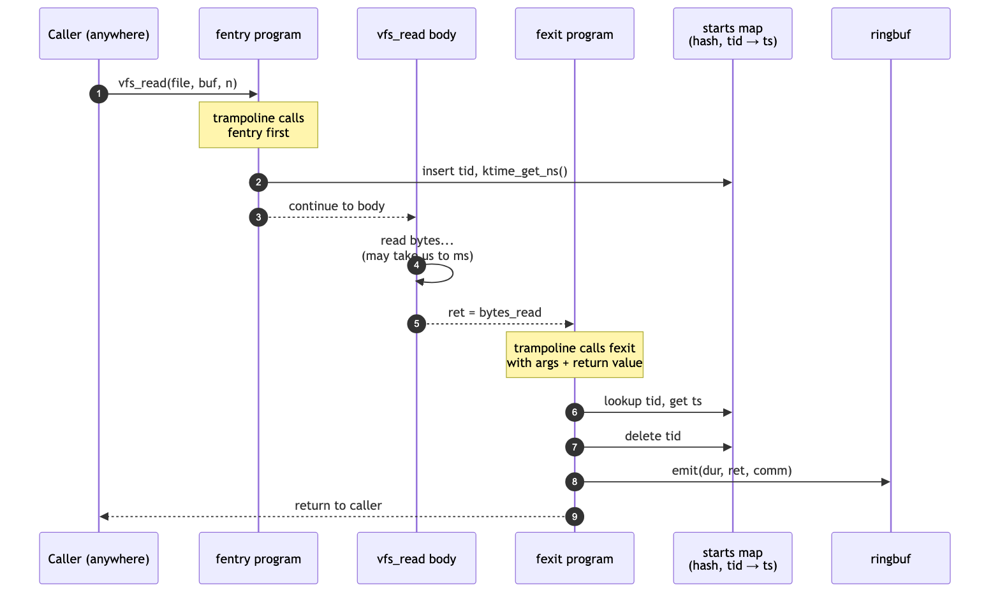
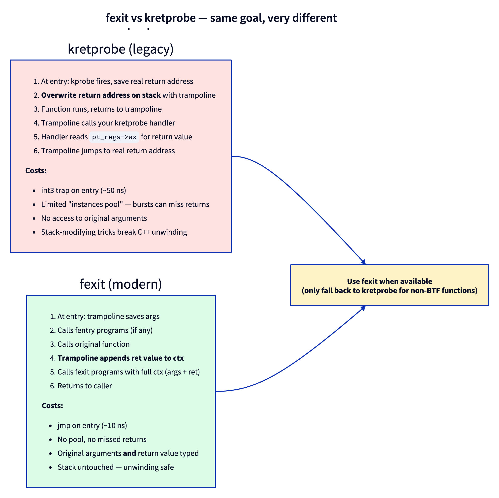
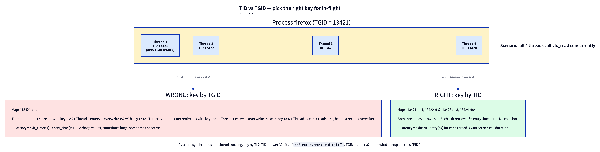
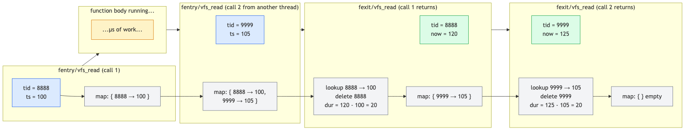

# Day 6 — fentry/fexit and the latency-measurement pattern

> **Today's mission:** measure the latency of every `vfs_read` on your system. Build a map keyed by thread, store the entry timestamp on call-in, retrieve it on call-out, emit duration to userspace. Total time: ~90 minutes.

> **Phase 2 starts here.** Days 1–5 made you fluent with libbpf, CO-RE, maps, and the Verifier. Days 6–13 turn that fluency into tracing: typed kernel-function tracing at scale, tracepoints, stack traces, uprobes, and sleepable programs. By Day 13 you'll be able to write the kind of tracer that ships in production observability tools.

## The pattern that powers every tracer

Most tracing problems reduce to one shape:

> *"When event A happens, remember something. When the matching event B happens, retrieve and act on it."*

For latency: A = function entry, B = function exit. Remember the timestamp on A; on B compute `now - remembered`.

Yesterday you saw `fentry`. Today you meet its other half — `fexit` — and use them as a pair to do the most common BPF tracing pattern in the world.



The fentry program runs *before* the function body. The fexit program runs *after* it. Both are connected to the same trampoline; the kernel installs them as a coordinated pair when you load the BPF object. Between entry and exit, the function does its work — could be 100 ns, could be 100 ms.

## Meet `fexit`

`fexit` is the counterpart to `fentry`: it attaches at function *return*. But unlike `fentry`, you also get the return value handed to you as a typed argument. That last argument matters — it's what makes fexit strictly more powerful than the older `kretprobe`.



The mechanics differ:

- **kretprobe** patches the *return address* on the kernel stack at function entry. The function returns to a kernel trampoline that calls your handler. Effective but invasive — bursts can exhaust the limited "instances pool," and stack-modifying tricks break C++ exception unwinding.

- **fexit** is part of the same *trampoline* fentry uses. The trampoline saves arguments on entry, calls fentry programs, calls the original function, gets the return value, **appends it to the context array**, then calls fexit programs. Stack untouched. No pool. Fewer ways to fail.

In modern code, **prefer fexit** wherever it's available — that means: any function with BTF info (essentially every non-`__attribute__((always_inline))` kernel function on a modern build). Use `kretprobe` only when fexit isn't available.

> ### There are no Dumb Questions
>
> **Q: Are fentry and fexit two separate hooks, or one?**
>
> A: One hook with two callbacks, conceptually. The kernel builds a single trampoline per attach target that invokes all attached fentry programs *and* all attached fexit programs in sequence. You can attach an fentry without an fexit, or vice versa. They share the trampoline infrastructure (`kernel/bpf/trampoline.c`) but are independent BPF programs from your perspective.
>
> **Q: What if the function never returns (panic, BUG_ON)?**
>
> A: Then fexit doesn't run. Your map entry stays in the hash table indefinitely. We'll see this exact failure mode in today's "what to break" — it's the source of slow leaks in tracers that run for weeks.
>
> **Q: Can a function be called recursively?**
>
> A: Yes, and it's the case where TID-as-key breaks down. Today's check question at the end walks through exactly why. For most kernel functions you trace, recursion isn't an issue.

## Meet `bpf_ktime_get_ns`

```c
__u64 ts = bpf_ktime_get_ns();
```

Returns nanoseconds since system boot, monotonic. Cheap — implemented as `ktime_get_mono_fast_ns` under the hood, no locking, single read of a kernel timekeeping cache. ~10ns to invoke. Don't use it for wall-clock time; use `bpf_ktime_get_boot_ns` (includes suspend) or `bpf_ktime_get_tai_ns` (TAI clock) instead.

## TID vs TGID — pick the right key

This is the bug that bites everyone the first time they write a per-thread tracer. Read this carefully before writing code today.

`bpf_get_current_pid_tgid()` returns a packed `u64`:

```
+------------------+------------------+
| TGID (upper 32)  | TID (lower 32)   |
+------------------+------------------+
```

Linux kernel terminology and userspace terminology don't match:

- What userspace calls "PID" is the kernel's **TGID** (thread group ID — the leader thread's TID).
- What the kernel calls **TID** is the per-thread identifier.

A multi-threaded process has many TIDs sharing one TGID. Inside `bpf_get_current_pid_tgid`:

```c
__u32 tgid = bpf_get_current_pid_tgid() >> 32;       // userspace "PID"
__u32 tid  = bpf_get_current_pid_tgid() & 0xffffffff; // unique per thread
```

For tracking concurrent in-flight calls, you need per-thread granularity:



If you key by TGID, four threads of the same process all hit the same map slot, overwriting each other's timestamps. The latency reading is garbage. Use **TID**.

> ### Sharpen your pencil
>
> Why doesn't the kernel just give you a single "thread identifier" without ambiguity? Why does `bpf_get_current_pid_tgid` pack two fields into one return value?
>
> .  
> .  
> .
>
> **Answer:** because one helper call is cheaper than two. The kernel only ever exposed the combined helper `bpf_get_current_pid_tgid` (helper id 14) — there was never a separate `bpf_get_current_pid` or `bpf_get_current_tgid` in the UAPI. The single call returns both fields packed together, mirroring what `task_struct` itself carries: both `pid` (kernel meaning) and `tgid`. The naming confusion is historical — userspace called processes "PIDs" before threads existed.

## The lifecycle, explicitly

Walk through what the map looks like over time when two threads concurrently read:



Each thread enters → its TID gets a slot. Each thread exits → its TID's slot is read and deleted. The map is empty when nothing is in flight. **The delete is critical** — without it, the map fills as threads come and go.

---

## The lab

### `latency.bpf.c`

```c
#include "vmlinux.h"
#include <bpf/bpf_helpers.h>
#include <bpf/bpf_tracing.h>

char LICENSE[] SEC("license") = "GPL";

struct {
    __uint(type, BPF_MAP_TYPE_HASH);
    __uint(max_entries, 10240);
    __type(key, __u64);    /* tid */
    __type(value, __u64);  /* ns timestamp */
} starts SEC(".maps");

struct event {
    __u32 pid;
    __u32 tid;
    __u64 dur_ns;
    __s64 ret;
    char comm[16];
};

struct {
    __uint(type, BPF_MAP_TYPE_RINGBUF);
    __uint(max_entries, 256 * 1024);
} rb SEC(".maps");

SEC("fentry/vfs_read")
int BPF_PROG(on_enter, struct file *f, char *buf, size_t n, loff_t *pos)
{
    __u64 tid = bpf_get_current_pid_tgid() & 0xffffffff;
    __u64 ts = bpf_ktime_get_ns();
    bpf_map_update_elem(&starts, &tid, &ts, BPF_ANY);
    return 0;
}

SEC("fexit/vfs_read")
int BPF_PROG(on_exit, struct file *f, char *buf, size_t n, loff_t *pos, ssize_t ret)
{
    __u64 id = bpf_get_current_pid_tgid();
    __u64 tid = id & 0xffffffff;
    __u64 *ts = bpf_map_lookup_elem(&starts, &tid);
    if (!ts)
        return 0;
    __u64 dur = bpf_ktime_get_ns() - *ts;
    bpf_map_delete_elem(&starts, &tid);

    struct event *e = bpf_ringbuf_reserve(&rb, sizeof(*e), 0);
    if (!e) return 0;
    e->pid = id >> 32;
    e->tid = tid;
    e->dur_ns = dur;
    e->ret = ret;
    bpf_get_current_comm(&e->comm, sizeof(e->comm));
    bpf_ringbuf_submit(e, 0);
    return 0;
}
```

### What's new since Day 1–5

- **Two programs in one object**, sharing maps. The skeleton exposes both as `skel->progs.on_enter` and `skel->progs.on_exit`. Both auto-attach when you call `latency_bpf__attach(skel)`.
- **`BPF_PROG(on_exit, ..., loff_t *pos, ssize_t ret)`** — fexit receives all function arguments first, then the return value as the *last* parameter. The `BPF_PROG` macro knows fexit programs receive one extra ctx slot. We meet `BPF_PROG`'s mechanics in detail on Day 7.
- **`bpf_map_update_elem(..., BPF_ANY)`** — insert-or-update. Note we use `BPF_ANY` here, not `BPF_NOEXIST`, because we don't care if the same TID had a stale entry from a missed `fexit` (e.g., the previous call panicked). Overwriting is correct.
- **`bpf_map_lookup_elem` returns a pointer into live map memory.** You can read it directly. The Verifier requires the null check.
- **`bpf_map_delete_elem`** — *do not skip this.* It's the line that prevents the map from filling forever.

### `latency.c`

Standard ringbuf consumer. Print:

```c
printf("PID %u TID %u vfs_read → %lld bytes in %llu µs (%s)\n",
       e->pid, e->tid, (long long)e->ret,
       e->dur_ns / 1000, e->comm);
```

(We don't capture the request size in this minimal version. Add it as an exercise.)

### Run it

```bash
make
sudo ./latency &
# Generate work:
cat /etc/passwd > /dev/null
dd if=/dev/zero of=/dev/null bs=1k count=100
```

Expected:

```
PID 14001 TID 14001 vfs_read → 2543 bytes in 12 µs (cat)
PID 14002 TID 14002 vfs_read → 1024 bytes in 8 µs (dd)
PID 14002 TID 14002 vfs_read → 1024 bytes in 6 µs (dd)
...
```

You just measured every kernel-side `vfs_read` on your system in real time, with typed argument access and a few hundred nanoseconds of overhead per call. **This is what eBPF is for.**

---

## What to break, in order

### Break 1 — Forget the `bpf_map_delete_elem`

Comment it out. Run for a few minutes against any read-heavy workload (e.g., `find /usr` or `cat /var/log/*`). Periodically check map size:

```bash
sudo bpftool map show name starts
sudo bpftool map dump name starts | wc -l
```

The number grows. Slowly at first, then steady. At `max_entries=10240` it stops growing — but now `bpf_map_update_elem` silently fails on every new TID. Your tracer's coverage degrades to "only TIDs that were already in flight when the map filled."

This is the slow-poison failure mode. **Always delete on exit.**

### Break 2 — Use TGID instead of TID

Change both lookups/updates to use `id >> 32` as key. Run on a multi-threaded program:

```bash
stress-ng --io 4 --timeout 10
```

Watch your output. You'll see latency values that are obviously wrong: many in the negative-ish range (millions of ns), occasional huge ones (seconds), and the count of events drops because some threads' fexit can't find their fentry entry.

Lesson stays: **TID for synchronous per-thread tracking.**

### Break 3 — Drop the null check in fexit

```c
__u64 *ts = bpf_map_lookup_elem(&starts, &tid);
__u64 dur = bpf_ktime_get_ns() - *ts;   // no null check
```

Verifier rejects with the same `R0 type=map_value_or_null` error from Day 4. Re-read the log; the rejection should now feel completely unsurprising.

### Break 4 — Convert to kretprobe

Change `SEC("fexit/vfs_read")` to `SEC("kretprobe/vfs_read")`. Rebuild. Things break:

1. `BPF_PROG` macro doesn't know about kretprobe — use `BPF_KRETPROBE` instead.
2. The argument list is wrong. kretprobe's ctx is `struct pt_regs *`, not the typed args + return. You can only get the return value via `PT_REGS_RC(ctx)`.
3. You can't access `f`, `buf`, `n`, or `pos` — they were the *entry* arguments and are gone by now.

This is the operational reason fexit is strictly better. With fexit you have entry args + return value; with kretprobe you have only return value.

The full equivalent kretprobe version:

```c
SEC("kretprobe/vfs_read")
int BPF_KRETPROBE(on_exit_kretprobe, ssize_t ret)
{
    /* same body, but only `ret` is available */
}
```

### Break 5 — A function that doesn't always return

Try `kernel_clone` (the function that implements `fork`). Most calls return; a few may not (`do_exit` paths, exotic flags). Run for a long time. Check that the map stays bounded — `kernel_clone` is well-behaved here. Now try to attach fexit to `do_exit` itself:

```c
SEC("fentry/do_exit")
int BPF_PROG(on_exit_enter) {
    /* ... store ... */
}

SEC("fexit/do_exit")
int BPF_PROG(on_exit_exit) {
    /* do_exit never returns */
}
```

On 7.1 this **doesn't even load.** The Verifier knows `do_exit` is marked `__noreturn`, and it refuses to attach fexit to a function that can never return:

```
Attaching fexit/fsession/fmod_ret to __noreturn function 'do_exit' is rejected.
```

The kernel keeps a `noreturn_deny` BTF set (`kernel/bpf/verifier.c`) — `do_exit`, `do_group_exit`, `make_task_dead`, `__module_put_and_kthread_exit`, and friends — and rejects fexit/fmod_ret on any of them at load time. So the leak you might expect here never happens: the Verifier protects you up front.

The leak lesson still stands, though — it just applies to functions the denylist *can't* catch. A function that returns on most paths but conditionally doesn't (a goto into a `do_exit` call, an unwound error path that calls `panic`) isn't `__noreturn`, so fexit attaches happily — and then silently never fires on the non-returning path, leaking that thread's map entry. **Not every function has a sensible fexit pair.** For those, you need a different cleanup strategy (a periodic sweep from userspace, or a tracepoint at task termination such as `sched_process_exit`).

---

## What to read in the kernel

- **`kernel/bpf/trampoline.c`** — open it. Search `arch_prepare_bpf_trampoline`. The trampoline is *generated assembly* that saves arguments, calls fentry programs, calls the original function, captures the return value into the ctx array, and calls fexit programs. The ASM is per-arch (x86_64, arm64, etc.) but the structure is consistent.
- **`tools/lib/bpf/bpf_tracing.h`** — search `BPF_PROG`. The macro is ~30 lines of variadic-template-style C macros. Read it once. You'll see how the `u64 *ctx` array gets unpacked into typed parameters via `((__u64 *)ctx)[N]` casts. After this, the macro stops feeling magic.
- **`kernel/trace/bpf_trace.c`** — search `bpf_get_func_arg` and `bpf_get_func_ret`. These are helper-based access patterns for the same data, used when `BPF_PROG`'s positional args don't fit (e.g., variadic kernel functions).
- **`Documentation/bpf/prog_trace.rst`** — the official doc on tracing programs. One read, optional.

---

## Bullet Points

- **`fexit`** attaches at function return; receives original arguments **and** the return value as typed parameters.
- Use **fexit > kretprobe** wherever fexit is available (any function with BTF). kretprobe is legacy.
- `bpf_ktime_get_ns()` returns monotonic boot-time nanoseconds; cheap, ~10ns to call.
- **Key per-thread tracers by TID, not TGID.** Multi-threaded processes will collide on TGID-keyed maps.
- The latency pattern: `fentry` stores entry timestamp keyed by TID; `fexit` retrieves it, computes duration, **deletes** the entry, emits the event.
- **Don't forget `bpf_map_delete_elem`.** Tracers that don't clean up degrade silently as their map fills.
- Some kernel functions don't return (e.g., `do_exit`); fexit-based tracking can't handle them. Use a different mechanism (tracepoints, periodic sweeps).
- `BPF_PROG` macro unpacks typed arguments from the trampoline's `u64 *ctx` array — same macro for fentry and fexit; fexit just has one extra arg (the return value) at the end.

---

## Check question

You attach an fentry+fexit pair to a function that, on some paths, calls itself recursively. The latency map is keyed by TID. Does the measurement still work?

<details>
<summary>Click to reveal answer</summary>

**Answer:** No. On the recursive call, the second `fentry` overwrites the first's timestamp (same TID). When the inner call's `fexit` runs, it reads the *its own* timestamp and deletes the entry. The outer `fexit` then can't find any entry — `bpf_map_lookup_elem` returns NULL, the duration computation is skipped, and the event is silently dropped. To handle this, you need a recursion-aware key like `(tid, depth)` where depth is tracked in a percpu map, or you switch to `bpf_get_func_ip(ctx)` plus stack-allocated counters. Most kernel functions don't recurse meaningfully, so this rarely matters in practice — but when it does, you've found a real subtlety.

</details>

---

## Tomorrow

Day 7: the `BPF_PROG` macro demystified. The `ctx` array, `PT_REGS_*` for kprobes, function argument access patterns, and the helper-vs-kfunc distinction. Less hands-on building, more "now you understand what the macros are doing."
