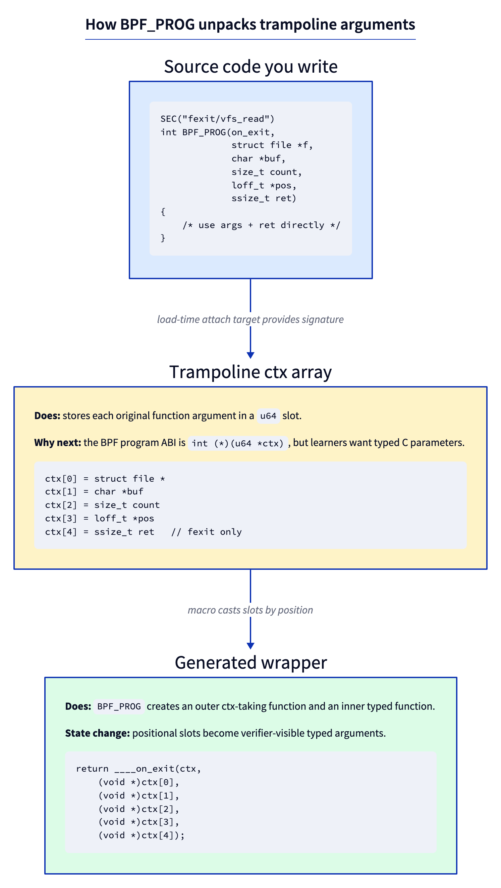
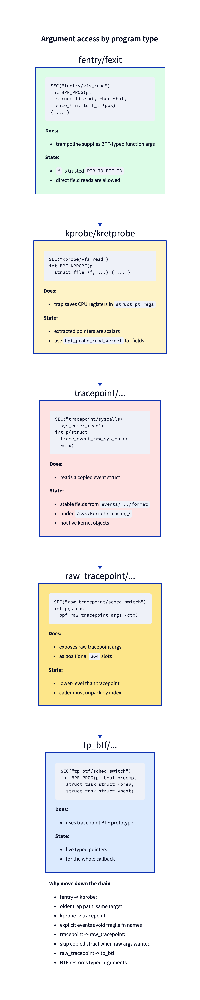
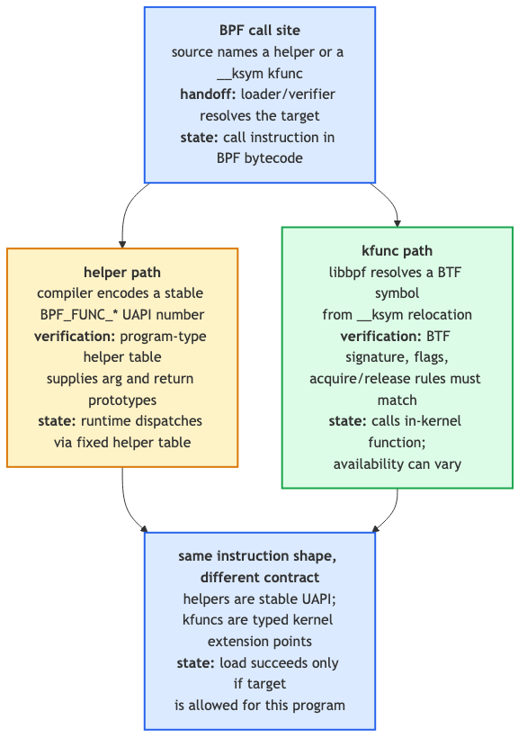

# Day 7 — `BPF_PROG` demystified, ctx layouts, helpers vs kfuncs

> **Today's mission:** stop thinking of `BPF_PROG`/`BPF_KPROBE`/`BPF_KRETPROBE` as magic. See what they expand to. Understand why each program type accesses arguments differently. Total time: ~75 minutes. Light on coding, heavy on understanding.

## Why this day exists

Yesterday you wrote `BPF_PROG(on_exit, struct file *f, char *buf, size_t n, loff_t *pos, ssize_t ret)` and it just worked. Today we open the hood.

This matters because:
- When you start using non-trivial program types (kprobe, raw tracepoint, sk_msg, sock_ops), the macro and ctx access differ.
- When the macro doesn't fit your case (variadic functions, exotic signatures), you need to access ctx by hand.
- When the Verifier complains about a register's type, knowing where that type *came from* in the proto is the difference between minutes and hours of debugging.

## What `BPF_PROG` actually does

The trampoline calls your BPF program with a single argument — `unsigned long long *ctx` — pointing at an array of `u64` values, one per kernel-function argument (plus, for fexit, the return value at the end).

You don't want to write `(struct file *)ctx[0]` everywhere. So `BPF_PROG` exists.



The macro is variadic-template-style C — it generates an outer function that the BPF program calls (taking only `ctx`), and an inner `__always_inline` function that takes your typed parameters. The outer function casts each `ctx[N]` slot to the right type and forwards into the inner.

You can read the actual macro at `tools/lib/bpf/bpf_tracing.h`. It's about 30 lines of variadic macros. Worth opening once. After you do, there's no more magic — `BPF_PROG` is a code generator that saves you from writing position-based casts.

> ### There are no Dumb Questions
>
> **Q: How does the macro know how many arguments my function has?**
>
> A: C variadic macros (`__VA_ARGS__`) plus a counting trick (`COUNT_ARGS`) that uses preprocessor recursion to figure out the arity. `bpf_tracing.h` provides `BPF_PROG_0`, `BPF_PROG_1`, ..., `BPF_PROG_12` and dispatches to the right one. The actual implementation is gnarly C macro magic but the concept is simple.
>
> **Q: What if my function has more than 12 arguments?**
>
> A: You're using the wrong tool. Most kernel functions have ≤ 6 args (matching the System V calling convention). For variadic kernel functions, use `bpf_get_func_arg(ctx, N, &out)` — a helper that reads the Nth argument by index and writes it to `out`. We won't use it today.
>
> **Q: Why does `BPF_PROG`'s syntax look weird? Why isn't it just a normal function?**
>
> A: Because the BPF program's *real* signature must be `int (*)(unsigned long long *)` — that's what the trampoline calls. Without the macro, you'd write that signature and unpack `ctx[]` manually. The macro pretends you wrote a normal C function but generates the unpacking glue.

## Argument access by program type — five flavors

Different program types access arguments five different ways. This is the chart you'll come back to whenever you're confused about a "wrong type" verifier rejection.



### 1. `fentry`/`fexit` — typed args from BTF

```c
SEC("fentry/vfs_read")
int BPF_PROG(p, struct file *f, char *buf, size_t n, loff_t *pos) {
    loff_t cur = f->f_pos;   // direct deref allowed
}
```

The trampoline gives you a `u64 *ctx`. `BPF_PROG` casts each slot to your declared type. Because BTF has the original function's signature, the cast is meaningful — `f` really is a `struct file *` pointing at a live kernel object. The Verifier marks `f` as `PTR_TO_BTF_ID` (typed kernel pointer), allowing direct dereference of fields.

Pros: typed, fast, direct deref. Cons: requires BTF (essentially always present in modern kernels).

### 2. `kprobe`/`kretprobe` — `pt_regs` from a trap

```c
SEC("kprobe/vfs_read")
int BPF_KPROBE(p, struct file *f, char *buf, size_t n, loff_t *pos) {
    /* f is pt_regs->di on x86_64 */
}
```

`BPF_KPROBE` is a different macro that knows ctx is `struct pt_regs *` (a saved register snapshot from the entry trap). It expands to `((struct file *)PT_REGS_PARM1(ctx))` for the first argument, etc. The values are correct — they're whatever was in `RDI`, `RSI`, etc. when the int3 fired — but the pointers are *not* marked as `PTR_TO_BTF_ID` because the Verifier can't trust them in a kprobe context (the function's BTF signature isn't bound to the regs).

You access fields via `bpf_probe_read_kernel`:

```c
loff_t pos;
bpf_probe_read_kernel(&pos, sizeof(pos), &f->f_pos);
```

This is why kprobes feel clunkier than fentry. Same data, more friction.

### 3. `tracepoint/...` — copied event context

```c
SEC("tracepoint/syscalls/sys_enter_read")
int p(struct trace_event_raw_sys_enter *ctx) {
    long fd = ctx->args[0];
}
```

The regular tracepoint program sees a stable kernel-defined event struct. The kernel copies the relevant fields into that per-tracepoint struct, and `ctx` points at the copied bytes. You don't get live pointers. Useful when you want the stable event format in `/sys/kernel/tracing/events/.../format`.

### 4. `raw_tracepoint/...` — raw tracepoint argument array

```c
SEC("raw_tracepoint/sched_switch")
int p(struct bpf_raw_tracepoint_args *ctx) {
    bool preempt = (bool)ctx->args[0];
    struct task_struct *prev = (void *)ctx->args[1];
    struct task_struct *next = (void *)ctx->args[2];
}
```

Raw tracepoints skip the copied event struct and expose the tracepoint arguments as raw `u64` slots. You unpack by position. The verifier does not give you the same typed-argument ergonomics as `tp_btf`, so new code usually prefers `tp_btf` when BTF is available.

### 5. `tp_btf` — typed kernel pointers from a tracepoint

```c
SEC("tp_btf/sched_switch")
int BPF_PROG(p, bool preempt, struct task_struct *prev, struct task_struct *next) {
    bpf_printk("%s -> %s", prev->comm, next->comm);  // direct deref
}
```

This is the modern typed interface to the same tracepoint event. The kernel hands you typed pointers (BTF-tagged) rather than copied bytes or raw positional slots. Direct deref works. **Use `tp_btf` instead of raw tracepoint for new code** when BTF is available — we'll see this in detail tomorrow.

> ### Sharpen your pencil
>
> A function `int foo(struct file *f, void *data, size_t len)` is in the kernel. You attach an fentry. You want to read `f->f_inode->i_ino`. Three ways to do it:
>
> 1. `__u64 ino = f->f_inode->i_ino;`
> 2. `__u64 ino = BPF_CORE_READ(f, f_inode, i_ino);`
> 3. `__u64 ino; bpf_probe_read_kernel(&ino, sizeof(ino), &f->f_inode->i_ino);`
>
> Which works? Which is preferred?
>
> .  
> .  
> .
>
> **Answers:** All three load. (1) and (2) work cleanly because `f` is `PTR_TO_BTF_ID` and the Verifier proves the chain. (1) is fastest (no helper call); (2) is safe-by-default (returns 0 on bad pointer); (3) is the explicit form (1) and (2) compile down to. **Prefer (1) for trusted chains, (2) for chains where any hop could be NULL.** (3) is rarely written by hand anymore.

## Helpers vs kfuncs — the two extension mechanisms

Yesterday you used `bpf_get_current_pid_tgid`, `bpf_ktime_get_ns`, `bpf_map_lookup_elem`. Those are **helpers** — a frozen UAPI list of functions BPF programs can call. You declared them via `bpf_helpers.h`, the linker resolves them to enum values (`BPF_FUNC_get_current_pid_tgid` = 14, etc.), and at load time the verifier/JIT resolves the call against a per-program-type proto table.

But there's a second, newer mechanism: **kfuncs**. Functions declared in any kernel C file, registered via `BTF_KFUNCS_START`, that BPF programs can call by name (matched against kernel BTF at load time).



Why both exist:

- **Helpers are frozen UAPI.** Adding a helper is a forever commitment; removing or changing one breaks user programs. Process to add a helper is heavyweight.
- **kfuncs are not UAPI.** They can evolve, be added, removed, renamed. The maintainers can change a kfunc's signature in the next release; user programs that use the old name fail to load on the new kernel. Lower commitment.

Around 2022, the kernel community decided to **stop adding new helpers** and add functionality as kfuncs instead. This is why your "use this BPF feature" docs from 2024+ talk about kfuncs more than helpers.

You'll meet kfuncs properly on Day 20. For now, just know: when you see `extern struct task_struct *bpf_task_acquire(struct task_struct *) __ksym;`, that's a kfunc. The `__ksym` attribute tells libbpf "match this name to a kfunc in kernel BTF at load time."

> ### There are no Dumb Questions
>
> **Q: How do I know if `bpf_xxx` is a helper or a kfunc?**
>
> A: Helpers are listed in `include/uapi/linux/bpf.h` (the `enum bpf_func_id` table starting with `BPF_FUNC_unspec`). Kfuncs aren't UAPI; their list lives in source files via `BTF_KFUNCS_START` blocks. `bpftool feature probe` shows what's available on your kernel. Or just check: does it appear in `<bpf/bpf_helpers.h>`? If yes, helper. If no but you see `__ksym`, kfunc.
>
> **Q: Are helpers going away?**
>
> A: No. Existing helpers are stable forever (UAPI). New functionality comes as kfuncs. So the helper list will keep working but won't grow.

## Today's lab — small, focused

We're not building a new tracer today. We're poking at what the macros emit.

### `inspect.bpf.c`

```c
#include "vmlinux.h"
#include <bpf/bpf_helpers.h>
#include <bpf/bpf_tracing.h>

char LICENSE[] SEC("license") = "GPL";

/* Same logic, three different program types */

SEC("fentry/vfs_read")
int BPF_PROG(via_fentry, struct file *f, char *buf, size_t n, loff_t *pos)
{
    bpf_printk("fentry: f=%p n=%zu", f, n);
    return 0;
}

SEC("kprobe/vfs_read")
int BPF_KPROBE(via_kprobe, struct file *f, char *buf, size_t n, loff_t *pos)
{
    bpf_printk("kprobe: f=%p n=%zu", f, n);
    return 0;
}

SEC("tracepoint/syscalls/sys_enter_read")
int via_tp(struct trace_event_raw_sys_enter *ctx)
{
    int fd = (int)ctx->args[0];
    bpf_printk("tp: fd=%d", fd);
    return 0;
}
```

First generate the type header if you don't already have it from Day 1, then build the object. The `-D__TARGET_ARCH_x86` is required: `BPF_KPROBE` expands to the arch-specific `PT_REGS_PARM*` macros, and without it the compile fails.

```bash
# once per kernel, if you don't already have vmlinux.h from Day 1:
sudo bpftool btf dump file /sys/kernel/btf/vmlinux format c > vmlinux.h

clang -g -O2 -D__TARGET_ARCH_x86 -target bpf -c inspect.bpf.c -o inspect.bpf.o
```

The verifier only runs when a program is *loaded*, and the detailed per-instruction register state only prints at **log level 2**. Copy Day 6's loader to `inspect.c`, point it at `inspect.bpf.o`, and raise the log level in the open options — the `LIBBPF_OPTS` line below is wired into the object-open call, which is what makes it take effect:

```c
LIBBPF_OPTS(bpf_object_open_opts, opts, .kernel_log_level = 2);
struct bpf_object *obj = bpf_object__open_file("inspect.bpf.o", &opts);
bpf_object__load(obj);   /* verifier runs here; its log prints to stderr */
```

```bash
make
sudo ./inspect 2>&1 | less
```

If you have `veristat` (it ships in the kernel tree under `tools/bpf/`, so you may need to build it), you can skip the loader entirely and dump the same per-instruction log: `sudo veristat -v -l 2 inspect.bpf.o 2>&1 | less` — `-v` is what emits the log and `-l 2` is the log level that prints the `R1_w=...` register-state lines.

### Inspect the verifier log for each program

For `via_fentry`, you'll see early register state lines like:

```
0: R1=ctx() R10=fp0
1: (79) r1 = *(u64 *)(r1 +0)
2: R1_w=trusted_ptr_file(off=0,...)
```

`R1_w=trusted_ptr_file` — the Verifier sees R1 as a trusted (BTF-validated) pointer to `struct file`. That's why `f->f_pos` works.

For `via_kprobe`:

```
0: R1=ctx()
1: (79) r1 = *(u64 *)(r1 +112)   /* PT_REGS_PARM1: di on x86_64 */
2: R1_w=scalar()
```

`R1_w=scalar()` — kprobe ctx access produces an untrusted scalar, not a typed pointer. That's why direct deref `f->f_pos` is forbidden.

For `via_tp`:

```
0: R1=ctx()
1: (61) r2 = *(u32 *)(r1 +16)
2: R2_w=scalar(...)
```

The tp ctx is a typed struct (provided by `vmlinux.h`); reads are scalar values from the copied event buffer.

### Inspect what `BPF_PROG` actually generated

Disassemble the same `inspect.bpf.o` you built above:

```bash
llvm-objdump -dr inspect.bpf.o | head -40
```

```
0000000000000000 <via_fentry>:
       0:	r4 = *(u64 *)(r1 + 0x10)
       1:	r3 = *(u64 *)(r1 + 0x0)
       2:	r1 = 0xa ll
       4:	w2 = 0x13
       5:	call 0x6
       6:	w0 = 0x0
       7:	exit
```

Because the inner `____via_fentry` is `static __always_inline` and we compile at `-O2`, it is inlined into the single emitted function `via_fentry` — there is **no** separate inner function and **no** `call` to it. The only `call` is the `bpf_trace_printk` helper (`call 0x6`). You'll see `via_fentry` load `f` from `*(u64 *)(r1 + 0x0)` (ctx[0]) into r3 and `n` from `*(u64 *)(r1 + 0x10)` (ctx[2]) into r4 — the `buf`/ctx[1] slot at +0x8 is dead and elided. Run the same for `via_kprobe` and you'll see it load from `pt_regs` offsets instead: `*(u64 *)(r1 + 0x70)` is `di` = `PT_REGS_PARM1` = `f` (and +0x60 is `dx`). The two-function shape the macro creates collapses into one function in the object — the macro is purely a source-level code generator.

### Observe all three reach the same read

The three programs each print via `bpf_printk`. Attach them and watch one `vfs_read` flow through all three paths. Auto-attach the object, then read the trace buffer while you trigger a read:

```bash
sudo bpftool prog loadall inspect.bpf.o /sys/fs/bpf/insp autoattach
sudo cat /sys/kernel/tracing/trace_pipe &
dd if=/etc/hostname of=/dev/null bs=64 count=1
```

You'll see three lines for the same call (addresses differ on your box; the point is the two `f=` values **match**):

```
             dd-20461   [001] ...21  9183.441: bpf_trace_printk: tp: fd=3
             dd-20461   [001] ...21  9183.441: bpf_trace_printk: fentry: f=ffff8e0c1a3b4500 n=64
             dd-20461   [001] ...21  9183.441: bpf_trace_printk: kprobe: f=ffff8e0c1a3b4500 n=64
```

`fentry` and `kprobe` both hook `vfs_read`, so the `f=` pointer for the same call is identical — even though `fentry` got it from BTF (ctx[0]) and `kprobe` from `pt_regs->di`. Same data, two paths. The tracepoint sits one layer up (the `read()` syscall entry, which later calls `vfs_read`), which is why it prints `fd` rather than `f`. Clean up:

```bash
sudo kill %1 2>/dev/null
sudo rm -rf /sys/fs/bpf/insp
```

---

## What to break, in order

### Break 1 — Try to direct-deref in a kprobe

```c
SEC("kprobe/vfs_read")
int BPF_KPROBE(p, struct file *f) {
    loff_t pos = f->f_pos;          /* direct deref */
    bpf_printk("pos=%lld", pos);
    return 0;
}
```

Drop this into `inspect.bpf.c`, rebuild, and try to load it — `bpftool prog loadall` runs the verifier and prints its log to stderr on failure:

```bash
clang -g -O2 -D__TARGET_ARCH_x86 -target bpf -c inspect.bpf.c -o inspect.bpf.o
sudo bpftool prog loadall inspect.bpf.o /sys/fs/bpf/x
```

The verifier rejects it (no pin is created on failure, so there's nothing to clean up):

```
R1 invalid mem access 'scalar'
```

Because in kprobe context, R1 (the cast from `pt_regs->di`) is a scalar, not a `PTR_TO_BTF_ID`. Fix:

```c
loff_t pos;
bpf_probe_read_kernel(&pos, sizeof(pos), &f->f_pos);
```

### Break 2 — Use BPF_PROG with kprobe

```c
SEC("kprobe/vfs_read")
int BPF_PROG(p, struct file *f) { ... }
```

This one loads (verify with `sudo bpftool prog loadall inspect.bpf.o /sys/fs/bpf/x` — no verifier error — then `sudo rm -rf /sys/fs/bpf/x`), but the argument access is wrong. `BPF_PROG` reads `ctx[0]` — but kprobe's ctx is `pt_regs *`, not the trampoline ctx array. You'll get whatever sits at offset 0 of `struct pt_regs` (on x86_64 that's the saved `r15`, not the first function argument) cast as `struct file *`. Garbage. Use `BPF_KPROBE` for kprobes.

### Break 3 — Direct deref in a regular tracepoint

```c
SEC("tracepoint/sched/sched_switch")
int p(struct trace_event_raw_sched_switch *ctx) {
    bpf_printk("%s", ctx->prev_comm);   /* direct read of copied bytes */
}
```

Works — `sudo bpftool prog loadall inspect.bpf.o /sys/fs/bpf/x` reports the program loaded with no verifier error (clean up with `sudo rm -rf /sys/fs/bpf/x`). The `ctx->prev_comm` is a copied char array embedded in the event struct, not a pointer. No deref needed.

But:

```c
SEC("tracepoint/sched/sched_switch")
int p(struct trace_event_raw_sched_switch *ctx) {
    /* try to read the parent task's comm */
    /* you can't! ctx doesn't have a task pointer, just the values */
}
```

Regular `tracepoint/...` programs give you what the kernel chose to copy. For more, switch to `tp_btf` (Day 8) where you get live typed pointers; use `raw_tracepoint/...` only when you explicitly want raw positional tracepoint args.

---

## What to read in the kernel

- **`tools/lib/bpf/bpf_tracing.h`** — the canonical reference for `BPF_PROG`, `BPF_KPROBE`, `BPF_KRETPROBE`, `BPF_KSYSCALL`, and the `PT_REGS_*` family. Read all of it. It's ~930 lines but most is per-arch macros for register names.
- **`include/uapi/linux/bpf.h`** — search `enum bpf_func_id`. The complete helper list. ~200 entries. Skim — recognize the categories (skb manipulation, map ops, networking, tracing, time, random, etc.).
- **`kernel/bpf/helpers.c`** — search `bpf_get_current_pid_tgid_proto`. Each helper has a `bpf_func_proto` struct that declares its argument types, return type, and which program types can call it. This is what the Verifier consults when type-checking a helper call.
- **`net/core/filter.c`** — search `bpf_helper_changes_pkt_data` or `xdp_func_proto`. Per-program-type proto tables that gate which helpers a given program can call.
- **`Documentation/bpf/btf.rst`** and **`Documentation/bpf/kfuncs.rst`** — official docs, one read each.

---

## Bullet Points

- `BPF_PROG` is a code generator that unpacks a `u64 *ctx` array into typed parameters via casts.
- `BPF_KPROBE`/`BPF_KRETPROBE` are similar but unpack from `pt_regs *` instead.
- **fentry/fexit** give you BTF-typed pointers — direct deref OK.
- **kprobe** gives you scalars from registers — must use `bpf_probe_read_kernel`.
- **Regular tracepoint** gives you copied event bytes — read fields, no live kernel pointers.
- **Raw tracepoint** gives you positional raw args in `ctx->args[N]` — lower-level than `tp_btf`.
- **tp_btf** gives you BTF-typed pointers like fentry, with tracepoint stability — modern preference.
- **Helpers** are a frozen UAPI list in `include/uapi/linux/bpf.h`.
- **Kfuncs** are non-UAPI in-tree functions exposed via BTF; they can evolve. New BPF features are added as kfuncs, not helpers.
- Helper allowance is **per program type** — a helper that works in fentry may not work in XDP.

---

## Check question

Why can your `fentry` program directly deref `f->f_pos`, but your `kprobe` program cannot?

<details>
<summary>Click to reveal answer</summary>

**Answer:** In `fentry`, the trampoline saves arguments and `BPF_PROG` casts them to your declared types. The Verifier matches your declared types against the function's BTF signature, marking each parameter as `PTR_TO_BTF_ID` — a trusted, typed kernel pointer the Verifier knows it can deref safely. In `kprobe`, the ctx is `struct pt_regs *` — a saved register snapshot. The Verifier doesn't bind those register values to the function's BTF signature (kprobe is generic; it doesn't know which function it's tracing at load time the way fentry does). So the cast `(struct file *)PT_REGS_PARM1(ctx)` produces a *scalar* (`SCALAR_VALUE`) from the Verifier's perspective, not a typed pointer. Scalars can't be derefed; you have to round-trip through `bpf_probe_read_kernel`, which fault-handles.

</details>

---

## Tomorrow

Day 8: tp_btf vs raw tracepoint in depth. We trace `sched_switch`, get typed `task_struct *` pointers for both prev and next, and observe scheduling latency without writing any kprobe glue.
