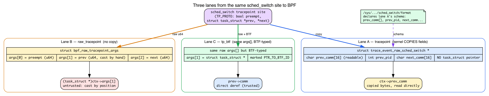
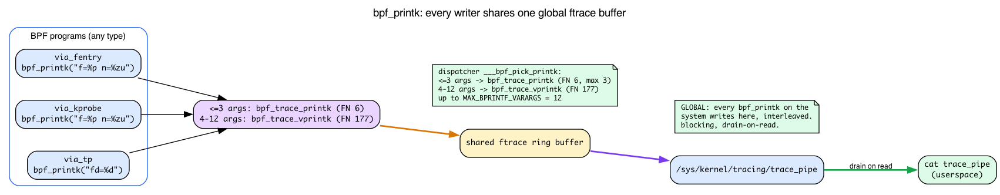

# Day 7 — `BPF_PROG` demystified, ctx layouts, helpers vs kfuncs

> **Today's mission:** stop thinking of `BPF_PROG`/`BPF_KPROBE`/`BPF_KRETPROBE` as magic. See what they expand to. Understand why each program type hands you arguments in a *different shape* — a typed trampoline array, a saved-register snapshot, or a copied event struct — and why the Verifier trusts some of those shapes and not others. Total time: ~120 minutes. Light on coding, heavy on understanding.

## Why this day exists

Yesterday you wrote `BPF_PROG(on_exit, struct file *f, char *buf, size_t n, loff_t *pos, ssize_t ret)` and it just worked. Today we open the hood.

This matters because:
- When you start using non-trivial program types (kprobe, raw tracepoint, sk_msg, sock_ops), the macro and ctx access differ.
- When the macro doesn't fit your case (variadic functions, exotic signatures), you need to access ctx by hand.
- When the Verifier complains about a register's type, knowing where that type *came from* in the proto is the difference between minutes and hours of debugging.

There are three pieces of background you've never been shown that every example today leans on:

1. **`struct pt_regs`** — the saved-register snapshot a kprobe hands you, and why offset 0 of it is *not* the first argument.
2. **`bpf_printk` and `trace_pipe`** — the debug-output channel today's lab reads. Days 1–6 sent data out through ringbuf and maps; today is the first time you'll print straight to the kernel's shared trace buffer.
3. **What a tracepoint actually is** — the `TRACE_EVENT` macro, the generated `trace_event_raw_*` struct, the `format` file, and the raw-args array. Three of today's five program flavors hang on this.

We'll teach each as we hit the part that depends on it.

## What `BPF_PROG` actually does

The trampoline calls your BPF program with a single argument — `unsigned long long *ctx` — pointing at an array of `u64` values, one per kernel-function argument (plus, for fexit, the return value at the end).

You don't want to write `(struct file *)ctx[0]` everywhere. So `BPF_PROG` exists.


The macro is variadic-template-style C — it generates an outer function that the BPF program calls (taking only `ctx`), and an inner `__always_inline` function that takes your typed parameters. The outer function casts each `ctx[N]` slot to the right type and forwards into the inner.

You can read the actual macro at `tools/lib/bpf/bpf_tracing.h:672` (the `#define BPF_PROG(name, args...)` line). It's about 30 lines of variadic macros. Worth opening once. After you do, there's no more magic — `BPF_PROG` is a code generator that saves you from writing position-based casts. The line that does the real work is its forwarding through `___bpf_ctx_cast`, which expands to `ctx[0]`, `ctx[1]`, `ctx[2]`… — literal indices into that `u64` array.

> ### There are no Dumb Questions
>
> **Q: How does the macro know how many arguments my function has?**
>
> A: C variadic macros (`__VA_ARGS__`) plus a counting trick (`___bpf_narg`) that uses preprocessor recursion to figure out the arity. `bpf_tracing.h` then dispatches through `___bpf_ctx_cast` to the right `___bpf_ctx_cast0`..`___bpf_ctx_cast12` slot-caster (supporting up to 12 args). The actual implementation is gnarly C macro magic but the concept is simple.
>
> **Q: What if my function has more than 12 arguments?**
>
> A: You're using the wrong tool. Most kernel functions have ≤ 6 args (matching the System V calling convention). For variadic kernel functions, use `bpf_get_func_arg(ctx, N, &out)` — a helper that reads the Nth argument by index and writes it to `out` (`BPF_FUNC_get_func_arg` = 183, `include/uapi/linux/bpf.h:6088`; implemented at `kernel/trace/bpf_trace.c:1194`). We won't use it today.
>
> **Q: Why does `BPF_PROG`'s syntax look weird? Why isn't it just a normal function?**
>
> A: Because the BPF program's *real* signature must be `int (*)(unsigned long long *)` — that's what the trampoline calls. Without the macro, you'd write that signature and unpack `ctx[]` manually. The macro pretends you wrote a normal C function but generates the unpacking glue.

## Two shapes of ctx: the trampoline array vs. the register snapshot

Before the five-flavor chart, you need to see clearly that the word "ctx" means two physically different things depending on program type. Get this and half of today's surprises evaporate.

**Shape A — the trampoline `u64 ctx[]` (fentry/fexit/tp_btf).** This is the array you met on Day 1: the trampoline saves the traced function's arguments into a small `u64[]` and hands you a pointer to it. `ctx[0]` *is* the first typed argument, `ctx[1]` the second, and so on. `BPF_PROG` indexes straight into it (`___bpf_ctx_cast` → `ctx[0]`, `ctx[1]`…), which is why `BPF_PROG`'s forwarding lives at `bpf_tracing.h:672`.

**Shape B — the `struct pt_regs *` snapshot (kprobe/kretprobe).** A kprobe doesn't get a tidy array. Recall from Day 1: a kprobe fires via the **int3 trap** — the kernel overwrites the first byte of the traced instruction with a breakpoint, and when the CPU hits it the trap handler runs. At that moment the handler captures **every general-purpose register** into a `struct pt_regs` and hands your program a pointer to *that*. So a kprobe's ctx is a frozen photograph of the CPU registers, not a per-argument array.

That difference is the whole reason `BPF_KPROBE` is a *separate* macro from `BPF_PROG`. `BPF_KPROBE` (`tools/lib/bpf/bpf_tracing.h:816`) declares ctx as `struct pt_regs *` and, instead of indexing an array, forwards each argument through `PT_REGS_PARM1`, `PT_REGS_PARM2`, … — macros that read a **named register slot** out of the snapshot.

### Why offset 0 of `pt_regs` is the saved `r15`, not your first argument

Here is the layout that makes every "+112", "+0x70", "+0x60" you'll see today legible. The x86-64 `struct pt_regs` is at `arch/x86/include/asm/ptrace.h:103`, and its fields are laid out in this exact order:

```c
/* arch/x86/include/asm/ptrace.h:103 — x86-64 struct pt_regs */
unsigned long r15;   /* offset 0x00  ← FIRST member */
unsigned long r14;   /* 0x08 */
unsigned long r13;   /* 0x10 */
unsigned long r12;   /* 0x18 */
unsigned long bp;    /* 0x20 */
unsigned long bx;    /* 0x28 */
unsigned long r11;   /* 0x30 */
unsigned long r10;   /* 0x38 */
unsigned long r9;    /* 0x40 */
unsigned long r8;    /* 0x48 */
unsigned long ax;    /* 0x50 */
unsigned long cx;    /* 0x58 */
unsigned long dx;    /* 0x60  ← arg3 */
unsigned long si;    /* 0x68  ← arg2 */
unsigned long di;    /* 0x70  ← arg1 */
/* ... orig_ax, ip, cs, flags, sp, ss ... */
```

Two facts fall straight out of this picture:

- **Byte offset 0 is `r15`** — a callee-saved register that has *nothing* to do with your function's arguments. This is exactly why Break 2 below produces garbage: when you (wrongly) put `BPF_PROG` on a kprobe, the macro reads "`ctx[0]`" = the 8 bytes at offset 0 = the saved `r15`, casts it to `struct file *`, and you're off into the weeds.
- **`di` sits 15th in the struct → offset 14 × 8 = 112 = `0x70`.** That's the number you'll see the kprobe program load from in both the verifier log (`r1 +112`) and the disassembly (`r1 + 0x70`). `dx` is 13th → offset 96 = `0x60` (`arg3`).

The layout is deliberately arch-specific. There's a *separate* 32-bit `struct pt_regs` at `arch/x86/include/asm/ptrace.h:12` that starts `bx, cx, dx, si, di, …` — a completely different order. The offsets only make sense once you've pinned down the architecture, which is why the build needs `-D__TARGET_ARCH_x86` (more on that at the lab).

### Mapping System V arguments onto register slots

Recall from Day 1: the System V x86-64 calling convention passes the first integer/pointer argument in **`rdi`**, the second in **`rsi`**, the third in **`rdx`**. The `PT_REGS_PARM*` macros are just that convention written down. In `tools/lib/bpf/bpf_tracing.h`:

```c
/* tools/lib/bpf/bpf_tracing.h:87 */
#define __PT_PARM1_REG di
#define __PT_PARM2_REG si
#define __PT_PARM3_REG dx
...
/* tools/lib/bpf/bpf_tracing.h:492 */
#define PT_REGS_PARM1(x) (__PT_REGS_CAST(x)->__PT_PARM1_REG)
```

So `PT_REGS_PARM1(ctx)` reads `ctx->di`, `PT_REGS_PARM2(ctx)` reads `ctx->si`, `PT_REGS_PARM3(ctx)` reads `ctx->dx`. This is the bridge that makes the disassembly's "`+0x70 = di = PT_REGS_PARM1 = f`" and "`+0x60 = dx`" lines readable: argument 1 of `vfs_read` is `struct file *f`, it was passed in `rdi`, the trap saved `rdi` at offset `0x70`, and the kprobe program loads `f` from there.

**Contrast the two shapes one more time:** fentry hands you the trampoline's `u64 ctx[]` where `ctx[0]` genuinely *is* the typed first argument; kprobe hands you `pt_regs` where you must dig the argument out of a named register slot. That is why `BPF_PROG` indexes `ctx[]` and `BPF_KPROBE` wraps `PT_REGS_PARM*`. Same data, two different containers.

![Side-by-side fentry trampoline ctx[] vs struct pt_regs register snapshot](diagrams/day07_ctx_vs_ptregs.png)

## What a tracepoint actually is

Three of today's five flavors (regular tracepoint, raw tracepoint, tp_btf) hook a **tracepoint**, and you've only ever seen the word in passing. Let's make it concrete, because the structs those flavors declare come from a specific macro and live in a specific file.

A **tracepoint** is a *named, static instrumentation site* compiled into the kernel — `sched_switch`, `sys_enter`, `kfree_skb`, and hundreds more. Unlike fentry or kprobe, which hook an *arbitrary* function you name, a tracepoint is a **deliberately placed, stable hook with a declared field schema.** Kernel developers put it where it's useful and promise to keep its fields meaningful across releases.

Every tracepoint is declared with the `TRACE_EVENT()` macro:

```c
/* include/linux/tracepoint.h:671 */
#define TRACE_EVENT(name, proto, args, struct, assign, print) ...
```

That one macro generates a *lot* of code. The piece you care about today is a C struct describing the event's copied payload:

```c
/* include/trace/trace_events.h:62 — generated for every tracepoint */
struct trace_event_raw_##name {
    ...
};
```

So `sched_switch` gets a `struct trace_event_raw_sched_switch`, `sys_enter` gets a `struct trace_event_raw_sys_enter`, and so on. These structs are compiled into the kernel and end up in its **BTF**, which is why they appear in your `vmlinux.h` and why the flavor-3 program below can just declare `struct trace_event_raw_sys_enter *ctx` without defining it.

**The crucial property: the kernel *copies* the chosen fields into that struct.** When the tracepoint fires, it fills a `trace_event_raw_*` instance with the selected values and hands your program a pointer to those **copied bytes** — not to live kernel objects. That single fact explains Break 3 at the bottom: you *can* read `ctx->prev_comm` directly (it's an embedded `char` array, copied in for you), but you *cannot* reach the parent task, because no pointer to it was ever copied.

### The `format` file: a tracepoint's public schema

Because a tracepoint has a declared schema, the kernel exposes it in human-readable form under tracefs:

```bash
sudo cat /sys/kernel/tracing/events/raw_syscalls/sys_enter/format
```

For `sys_enter` you'll see fields including `long id` and `unsigned long args[6]`. (Note the path is `raw_syscalls/`, not `syscalls/`: the `syscalls/` directory holds only the per-syscall nodes like `sys_enter_read`, whose `format` lists *typed* fields `fd`/`buf`/`count`. The generic `id` + `args[6]` schema that the flavor-3 program reads is the `raw_syscalls:sys_enter` tracepoint.) That's not a coincidence — it comes straight from the declaration in `include/trace/events/syscalls.h:18`:

```c
/* include/trace/events/syscalls.h:18 */
TRACE_EVENT_SYSCALL(sys_enter,
    TP_PROTO(struct pt_regs *regs, long id),
    ...
    TP_STRUCT__entry(
        __field( long,          id        )
        __array( unsigned long, args, 6   )
    ),
    ...
```

The `__array(unsigned long, args, 6)` is *why* the flavor-3 program reads `ctx->args[0]` to get the syscall's first argument (the fd for `read()`): the kernel copied all six syscall arguments into that `args[6]` array for you. The `format` file is the contract; `ctx->args[0]` is you reading it.

### Raw tracepoints: skip the copy, get positional u64s

A **raw tracepoint** (flavor 4) is the same instrumentation site without the copy step. Instead of a typed `trace_event_raw_*` struct, the kernel hands you:

```c
/* include/uapi/linux/bpf.h:7286 */
struct bpf_raw_tracepoint_args {
    __u64 args[0];
};
```

That's it — a bare array of `__u64`, one slot per **`TP_PROTO` argument**, unmodified. For `sched_switch` the `TP_PROTO` is `(bool preempt, struct task_struct *prev, struct task_struct *next, …)`, so `ctx->args[0]` is the `preempt` bool, `ctx->args[1]` is a `task_struct *` you cast by hand, `ctx->args[2]` the next one. No fields are copied, no schema is applied; you unpack by position and you're responsible for the casts.

**tp_btf** (flavor 5, detailed tomorrow) is the *same* raw argument array, but BTF-typed: the Verifier knows `args[1]` is a `struct task_struct *` and marks it `PTR_TO_BTF_ID` (recall from Day 1: a trusted, typed kernel pointer the Verifier will let you dereference), so you can dereference it directly. Raw args, but trusted.



## Argument access by program type — five flavors

Different program types access arguments five different ways. This is the chart you'll come back to whenever you're confused about a "wrong type" verifier rejection — and now you have the background to read every row of it.


### 1. `fentry`/`fexit` — typed args from BTF

```c
SEC("fentry/vfs_read")
int BPF_PROG(p, struct file *f, char *buf, size_t n, loff_t *pos) {
    loff_t cur = f->f_pos;   // direct deref allowed
}
```

The trampoline gives you a `u64 *ctx`. `BPF_PROG` casts each slot to your declared type. Because BTF has the original function's signature, the cast is meaningful — `f` really is a `struct file *` pointing at a live kernel object. The Verifier marks `f` as `PTR_TO_BTF_ID` (typed kernel pointer), allowing direct dereference of fields.

Pros: typed, fast, direct deref. Cons: requires BTF (essentially always present in modern kernels).

### 2. `kprobe`/`kretprobe` — `pt_regs` from a trap

```c
SEC("kprobe/vfs_read")
int BPF_KPROBE(p, struct file *f, char *buf, size_t n, loff_t *pos) {
    /* f is pt_regs->di on x86_64 */
}
```

`BPF_KPROBE` is a different macro that knows ctx is `struct pt_regs *` (a saved register snapshot from the entry trap). It expands to `((struct file *)PT_REGS_PARM1(ctx))` for the first argument, etc. The values are correct — they're whatever was in `RDI`, `RSI`, etc. when the int3 fired — but the pointers are *not* marked as `PTR_TO_BTF_ID` because the Verifier can't trust them in a kprobe context (the function's BTF signature isn't bound to the regs).

You access fields via `bpf_probe_read_kernel`:

```c
loff_t pos;
bpf_probe_read_kernel(&pos, sizeof(pos), &f->f_pos);
```

This is why kprobes feel clunkier than fentry. Same data, more friction.

### 3. `tracepoint/...` — copied event context

```c
SEC("tracepoint/syscalls/sys_enter_read")
int p(struct trace_event_raw_sys_enter *ctx) {
    int fd = (int)ctx->args[0];
}
```

The regular tracepoint program sees a stable kernel-defined event struct. The kernel copies the relevant fields into that per-tracepoint struct, and `ctx` points at the copied bytes. You don't get live pointers. Useful when you want the stable event format in `/sys/kernel/tracing/events/.../format`.

### 4. `raw_tracepoint/...` — raw tracepoint argument array

```c
SEC("raw_tracepoint/sched_switch")
int p(struct bpf_raw_tracepoint_args *ctx) {
    bool preempt = (bool)ctx->args[0];
    struct task_struct *prev = (void *)ctx->args[1];
    struct task_struct *next = (void *)ctx->args[2];
}
```

Raw tracepoints skip the copied event struct and expose the tracepoint arguments as raw `u64` slots. You unpack by position. The verifier does not give you the same typed-argument ergonomics as `tp_btf`, so new code usually prefers `tp_btf` when BTF is available.

### 5. `tp_btf` — typed kernel pointers from a tracepoint

```c
SEC("tp_btf/sched_switch")
int BPF_PROG(p, bool preempt, struct task_struct *prev, struct task_struct *next) {
    bpf_printk("%s -> %s", prev->comm, next->comm);  // direct deref
}
```

This is the modern typed interface to the same tracepoint event. The kernel hands you typed pointers (BTF-tagged) rather than copied bytes or raw positional slots. Direct deref works. **Use `tp_btf` instead of raw tracepoint for new code** when BTF is available — we'll see this in detail tomorrow.

> ### Sharpen your pencil
>
> A function `int foo(struct file *f, void *data, size_t len)` is in the kernel. You attach an fentry. You want to read `f->f_inode->i_ino`. Three ways to do it:
>
> 1. `__u64 ino = f->f_inode->i_ino;`
> 2. `__u64 ino = BPF_CORE_READ(f, f_inode, i_ino);`  *(CO-RE, from Day 3 — walks the pointer chain with relocations, each hop via `bpf_probe_read_kernel`)*
> 3. `__u64 ino; bpf_probe_read_kernel(&ino, sizeof(ino), &f->f_inode->i_ino);`
>
> Which works? Which is preferred?
>
> .  
> .  
> .
>
> **Answers:** All three load. (1) and (2) work cleanly because `f` is `PTR_TO_BTF_ID` and the Verifier proves the chain. (1) is fastest: it's a *direct verified load* — the Verifier permits the deref as a plain BPF load (LDX) and records it in the kernel exception table for fault handling, so there's no helper call and nothing lowers to `bpf_probe_read_kernel`. (2) is safe-by-default (returns 0 on bad pointer) and is what (3) is the explicit form of — `BPF_CORE_READ` lowers to `bpf_probe_read_kernel`. **Prefer (1) for trusted chains, (2) for chains where any hop could be NULL.** (3) is rarely written by hand anymore.

## Helpers vs kfuncs — the two extension mechanisms

Yesterday you used `bpf_get_current_pid_tgid`, `bpf_ktime_get_ns`, `bpf_map_lookup_elem`. Those are **helpers** — a frozen UAPI list of functions BPF programs can call. You declared them via `bpf_helpers.h`, the linker resolves them to enum values (`BPF_FUNC_get_current_pid_tgid` = 14, etc.), and at load time the verifier/JIT resolves the call against a per-program-type proto table.

But there's a second, newer mechanism: **kfuncs**. Functions declared in any kernel C file, registered via `BTF_KFUNCS_START`, that BPF programs can call by name (matched against kernel BTF at load time).


Why both exist:

- **Helpers are frozen UAPI.** Adding a helper is a forever commitment; removing or changing one breaks user programs. Process to add a helper is heavyweight.
- **kfuncs are not UAPI.** They can evolve, be added, removed, renamed. The maintainers can change a kfunc's signature in the next release; user programs that use the old name fail to load on the new kernel. Lower commitment.

Around 2022, the kernel community decided to **stop adding new helpers** and add functionality as kfuncs instead. This is why your "use this BPF feature" docs from 2024+ talk about kfuncs more than helpers.

You'll meet kfuncs properly on Day 20. For now, just know: when you see `extern struct task_struct *bpf_task_acquire(struct task_struct *) __ksym;`, that's a kfunc. The `__ksym` attribute tells libbpf "match this name to a kfunc in kernel BTF at load time."

> ### There are no Dumb Questions
>
> **Q: How do I know if `bpf_xxx` is a helper or a kfunc?**
>
> A: Helpers are listed in `include/uapi/linux/bpf.h` (the `enum bpf_func_id` table starting with `BPF_FUNC_unspec`). Kfuncs aren't UAPI; their list lives in source files via `BTF_KFUNCS_START` blocks. `bpftool feature probe` shows what's available on your kernel. Or just check: does it appear in `<bpf/bpf_helpers.h>`? If yes, helper. If no but you see `__ksym`, kfunc.
>
> **Q: Are helpers going away?**
>
> A: No. Existing helpers are stable forever (UAPI). New functionality comes as kfuncs. So the helper list will keep working but won't grow.

## `bpf_printk` and the `trace_pipe` debug channel

Today's lab is the first in this book to use `bpf_printk`, so let's be precise about what it is — because it does *not* go through the ringbuf or maps you've used on Days 1–6.

**`bpf_printk` is not a function — it's a libbpf macro.** It builds a format string and dispatches to a helper:

```c
/* tools/lib/bpf/bpf_helpers.h:341 */
#define bpf_printk(fmt, args...) ___bpf_pick_printk(args)(fmt, ##args)
```

The dispatcher `___bpf_pick_printk` (`bpf_helpers.h:334`) picks the lowering by argument count. For **≤3 args** it selects the `__bpf_printk` path (`bpf_helpers.h:293`), whose underlying helper is `bpf_trace_printk` — `BPF_FUNC_trace_printk` = 6 in the UAPI enum:

```c
/* include/uapi/linux/bpf.h:5911 */
FN(trace_printk, 6, ##ctx) \
```

For **4 or more args** it selects a *different* path — `__bpf_vprintk` (`bpf_helpers.h:304`) — which calls a *separate* helper, `bpf_trace_vprintk` (`BPF_FUNC_trace_vprintk` = 177, `include/uapi/linux/bpf.h:6082`). So the underlying helper is not the same either way: FN 6 for the short form, FN 177 for the wide form.

**Where does the output go?** Not into your own ringbuf or map — into the kernel's **shared ftrace ring buffer**, a single system-wide buffer that *every* `bpf_printk` user writes to. You read it from userspace through a tracefs file:

```bash
sudo cat /sys/kernel/tracing/trace_pipe
```

`trace_pipe` is a **blocking, drain-on-read** pipe: `cat` it and it blocks until a line appears, and reading a line consumes it. Because the buffer is global, you'll see lines from *every* BPF program on the system that calls `bpf_printk`, interleaved. That's exactly why today's "observe all three" experiment can simply `cat trace_pipe` and watch three different programs' output land in one stream.

**How many format arguments? Up to 12.** Each path has its own ceiling. The `bpf_trace_printk` helper (the ≤3 path) builds a fixed three-slot array:

```c
/* kernel/trace/bpf_trace.c:359 */
#define MAX_TRACE_PRINTK_VARARGS 3
/* kernel/trace/bpf_trace.c:362 */
BPF_CALL_5(bpf_trace_printk, char *, fmt, u32, fmt_size, u64, arg1,
           u64, arg2, u64, arg3)
{
    u64 args[MAX_TRACE_PRINTK_VARARGS] = { arg1, arg2, arg3 };
    ...
}
```

But that `MAX_TRACE_PRINTK_VARARGS = 3` is the limit of the *legacy* `bpf_trace_printk` helper only — **not** of the `bpf_printk` macro. Pass a fourth value and the dispatcher transparently switches you to `bpf_trace_vprintk` (FN 177), which packs the args into a `u64[]` and allows up to `MAX_BPRINTF_VARARGS` = 12 (`include/linux/bpf.h:3875`; the bound is enforced in `bpf_trace.c:424` as `data_len > MAX_BPRINTF_VARARGS * 8`). So `bpf_printk("%d %d %d %d", a, b, c, d)` compiles and loads fine — only a 13th argument is rejected. Today's lab passes only two values per call because that's all each line needs, not because of a ceiling.

**Framing:** `bpf_printk` is a *debugging and teaching* tool. It's global, low-throughput, and serializes all writers — fine for "did my program fire and what did it see?", wrong for production. Real tracers stream through the ringbuf and maps you already learned. That's exactly why the book waited until a "poke at the macros" day to introduce it.



## Today's lab — small, focused

We're not building a new tracer today. We're poking at what the macros emit.

### `inspect.bpf.c`

```c
#include "vmlinux.h"
#include <bpf/bpf_helpers.h>
#include <bpf/bpf_tracing.h>

char LICENSE[] SEC("license") = "GPL";

/* Same logic, three different program types */

SEC("fentry/vfs_read")
int BPF_PROG(via_fentry, struct file *f, char *buf, size_t n, loff_t *pos)
{
    bpf_printk("fentry: f=%p n=%zu", f, n);
    return 0;
}

SEC("kprobe/vfs_read")
int BPF_KPROBE(via_kprobe, struct file *f, char *buf, size_t n, loff_t *pos)
{
    bpf_printk("kprobe: f=%p n=%zu", f, n);
    return 0;
}

SEC("tracepoint/syscalls/sys_enter_read")
int via_tp(struct trace_event_raw_sys_enter *ctx)
{
    int fd = (int)ctx->args[0];
    bpf_printk("tp: fd=%d", fd);
    return 0;
}
```

Notice each `bpf_printk` passes at most two values (`f` and `n`, or just `fd`) — not because of any ceiling (the macro supports up to 12), but simply because that's all each line needs. And `via_tp` reaches the fd through `ctx->args[0]`, exactly the `args[6]` slot the `sys_enter` `format` file declares.

First generate the type header if you don't already have it from Day 1, then build the object. The `-D__TARGET_ARCH_x86` is required: `BPF_KPROBE` expands to the arch-specific `PT_REGS_PARM*` macros (which select `di`/`si`/`dx` for x86-64), and without it the compile fails — there'd be no way to know which register order to use.

```bash
# once per kernel, if you don't already have vmlinux.h from Day 1:
sudo bpftool btf dump file /sys/kernel/btf/vmlinux format c > vmlinux.h

clang -g -O2 -D__TARGET_ARCH_x86 -target bpf -c inspect.bpf.c -o inspect.bpf.o
```

The verifier only runs when a program is *loaded*, and the detailed per-instruction register state only prints at **log level 2**. Copy Day 6's loader to `inspect.c`, point it at `inspect.bpf.o`, and raise the log level in the open options — the `LIBBPF_OPTS` line below is wired into the object-open call, which is what makes it take effect:

```c
LIBBPF_OPTS(bpf_object_open_opts, opts, .kernel_log_level = 2);
struct bpf_object *obj = bpf_object__open_file("inspect.bpf.o", &opts);
bpf_object__load(obj);   /* verifier runs here; its log prints to stderr */
```

```bash
make
sudo ./inspect 2>&1 | less
```

If you have `veristat` (it ships in the kernel tree under `tools/testing/selftests/bpf/`, so you may need to build it), you can skip the loader entirely and dump the same per-instruction log: `sudo veristat -v -l 2 inspect.bpf.o 2>&1 | less` — `-v` is what emits the log and `-l 2` is the log level that prints the `R1_w=...` register-state lines.

### Inspect the verifier log for each program

For `via_fentry`, you'll see early register state lines like:

```
0: R1=ctx() R10=fp0
1: (79) r1 = *(u64 *)(r1 +0)
2: R1_w=trusted_ptr_file(off=0,...)
```

`R1_w=trusted_ptr_file` — the Verifier sees R1 as a trusted (BTF-validated) pointer to `struct file`. That's why `f->f_pos` works. Note the load is from `+0` — `ctx[0]`, the first slot of the trampoline array.

For `via_kprobe`:

```
0: R1=ctx()
1: (79) r1 = *(u64 *)(r1 +112)   /* PT_REGS_PARM1: di on x86_64 */
2: R1_w=scalar()
```

`R1_w=scalar()` — kprobe ctx access produces an untrusted scalar, not a typed pointer. That's why direct deref `f->f_pos` is forbidden. And there's the `+112` from the `pt_regs` layout: offset 112 is `di`, the saved `rdi`, which held `f`.

For `via_tp`:

```
0: R1=ctx()
1: (61) r2 = *(u32 *)(r1 +16)
2: R2_w=scalar(...)
```

The tp ctx is a typed struct (provided by `vmlinux.h`); reads are scalar values from the copied event buffer — exactly the "kernel copied the fields in" model from the tracepoint section.

### Inspect what `BPF_PROG` actually generated

Disassemble the same `inspect.bpf.o` you built above:

```bash
llvm-objdump -dr inspect.bpf.o | head -40
```

```
0000000000000000 <via_fentry>:
       0:	r4 = *(u64 *)(r1 + 0x10)
       1:	r3 = *(u64 *)(r1 + 0x0)
       2:	r1 = 0xa ll
       4:	w2 = 0x13
       5:	call 0x6
       6:	w0 = 0x0
       7:	exit
```

Because the inner `____via_fentry` is `static __always_inline` and we compile at `-O2`, it is inlined into the single emitted function `via_fentry` — there is **no** separate inner function and **no** `call` to it. The only `call` is the `bpf_trace_printk` helper (`call 0x6` — and yes, that `0x6` is `BPF_FUNC_trace_printk` = 6 from the UAPI enum). You'll see `via_fentry` load `f` from `*(u64 *)(r1 + 0x0)` (ctx[0]) into r3 and `n` from `*(u64 *)(r1 + 0x10)` (ctx[2]) into r4 — the `buf`/ctx[1] slot at +0x8 is dead and elided. Run the same for `via_kprobe` and you'll see it load from `pt_regs` offsets instead: `*(u64 *)(r1 + 0x70)` is `di` = `PT_REGS_PARM1` = `f` (and +0x60 is `dx`). The two-function shape the macro creates collapses into one function in the object — the macro is purely a source-level code generator.

### Observe all three reach the same read

The three programs each print via `bpf_printk`. Attach them and watch one `vfs_read` flow through all three paths. Auto-attach the object, then read the trace buffer while you trigger a read — `trace_pipe` is the shared ftrace buffer from the section above, so all three programs' lines surface in the one stream:

```bash
sudo bpftool prog loadall inspect.bpf.o /sys/fs/bpf/insp autoattach
sudo cat /sys/kernel/tracing/trace_pipe &
dd if=/etc/hostname of=/dev/null bs=64 count=1
```

You'll see three lines for the same call (addresses differ on your box; the point is the two `f=` values **match**):

```
             dd-20461   [001] ...21  9183.441: bpf_trace_printk: tp: fd=3
             dd-20461   [001] ...21  9183.441: bpf_trace_printk: fentry: f=ffff8e0c1a3b4500 n=64
             dd-20461   [001] ...21  9183.441: bpf_trace_printk: kprobe: f=ffff8e0c1a3b4500 n=64
```

`fentry` and `kprobe` both hook `vfs_read`, so the `f=` pointer for the same call is identical — even though `fentry` got it from BTF (ctx[0]) and `kprobe` from `pt_regs->di`. Same data, two paths. The tracepoint sits one layer up (the `read()` syscall entry, which later calls `vfs_read`), which is why it prints `fd` rather than `f`. Clean up:

```bash
sudo kill %1 2>/dev/null
sudo rm -rf /sys/fs/bpf/insp
```

---

## What to break, in order

### Break 1 — Try to direct-deref in a kprobe

```c
SEC("kprobe/vfs_read")
int BPF_KPROBE(p, struct file *f) {
    loff_t pos = f->f_pos;          /* direct deref */
    bpf_printk("pos=%lld", pos);
    return 0;
}
```

Drop this into `inspect.bpf.c`, rebuild, and try to load it — `bpftool prog loadall` runs the verifier and prints its log to stderr on failure:

```bash
clang -g -O2 -D__TARGET_ARCH_x86 -target bpf -c inspect.bpf.c -o inspect.bpf.o
sudo bpftool prog loadall inspect.bpf.o /sys/fs/bpf/x
```

The verifier rejects it (no pin is created on failure, so there's nothing to clean up):

```
R1 invalid mem access 'scalar'
```

Because in kprobe context, R1 (the cast from `pt_regs->di`) is a scalar, not a `PTR_TO_BTF_ID`. Fix:

```c
loff_t pos;
bpf_probe_read_kernel(&pos, sizeof(pos), &f->f_pos);
```

### Break 2 — Use BPF_PROG with kprobe

```c
SEC("kprobe/vfs_read")
int BPF_PROG(p, struct file *f) { ... }
```

This one loads (verify with `sudo bpftool prog loadall inspect.bpf.o /sys/fs/bpf/x` — no verifier error — then `sudo rm -rf /sys/fs/bpf/x`), but the argument access is wrong. `BPF_PROG` reads `ctx[0]` — but kprobe's ctx is `pt_regs *`, not the trampoline ctx array. As the `pt_regs` layout showed, offset 0 of `struct pt_regs` on x86-64 is the saved **`r15`**, a callee-saved register that has nothing to do with the first function argument. So `BPF_PROG` casts the leftover `r15` to `struct file *`: pure garbage. Use `BPF_KPROBE` for kprobes — it reads `PT_REGS_PARM1` = `di` = offset 112, where `f` actually lives.

### Break 3 — Direct deref in a regular tracepoint

```c
SEC("tracepoint/sched/sched_switch")
int p(struct trace_event_raw_sched_switch *ctx) {
    bpf_printk("%s", ctx->prev_comm);   /* direct read of copied bytes */
}
```

Works — `sudo bpftool prog loadall inspect.bpf.o /sys/fs/bpf/x` reports the program loaded with no verifier error (clean up with `sudo rm -rf /sys/fs/bpf/x`). The `ctx->prev_comm` is a copied char array embedded in the event struct (the kernel copied it in via `TRACE_EVENT`), not a pointer. No deref needed.

But:

```c
SEC("tracepoint/sched/sched_switch")
int p(struct trace_event_raw_sched_switch *ctx) {
    /* try to read the parent task's comm */
    /* you can't! ctx doesn't have a task pointer, just the values */
}
```

Regular `tracepoint/...` programs give you what the kernel chose to copy. The `format` file for `sched_switch` lists `prev_comm`, `prev_pid`, `next_comm`, … — copied scalars and char arrays, **no `task_struct` pointer.** Since no pointer was copied, there's nothing to follow to the parent. For more, switch to `tp_btf` (Day 8) where you get live typed pointers; use `raw_tracepoint/...` only when you explicitly want raw positional tracepoint args.

---

## What to read in the kernel

- **`tools/lib/bpf/bpf_tracing.h`** — the canonical reference for `BPF_PROG` (`:672`), `BPF_KPROBE` (`:816`), `BPF_KRETPROBE`, `BPF_KSYSCALL`, and the `PT_REGS_*` family (`PT_REGS_PARM1` at `:492`, the `__PT_PARM1_REG di` definitions from `:87`). Read all of it. It's ~930 lines but most is per-arch macros for register names.
- **`arch/x86/include/asm/ptrace.h`** — the 64-bit `struct pt_regs` (`:103`) whose field order (`r15` first, `di` at offset 112) is what makes the `+0x70`/`+0x60` loads legible, plus the *separate* 32-bit struct at `:12` proving the layout is arch-specific.
- **`include/uapi/linux/bpf.h`** — search `enum bpf_func_id`. The complete helper list. ~200 entries. Skim — recognize the categories (skb manipulation, map ops, networking, tracing, time, random, etc.). Note `trace_printk` = 6 (`:5911`) and `get_func_arg` = 183 (`:6088`), and the `struct bpf_raw_tracepoint_args` at `:7286`.
- **`include/linux/tracepoint.h`** and **`include/trace/trace_events.h`** — `TRACE_EVENT()` (`tracepoint.h:671`) and the `struct trace_event_raw_##name { … }` generation site (`trace_events.h:62`) that produces the structs your tracepoint programs declare.
- **`include/trace/events/syscalls.h`** — the `sys_enter` declaration (`:18`) with `__array(unsigned long, args, 6)`, proving why `ctx->args[0..5]` works.
- **`kernel/bpf/helpers.c`** — search `bpf_get_current_pid_tgid_proto`. Each helper has a `bpf_func_proto` struct that declares its argument types, return type, and which program types can call it. This is what the Verifier consults when type-checking a helper call.
- **`kernel/trace/bpf_trace.c`** — `MAX_TRACE_PRINTK_VARARGS` (`:359`) and `bpf_trace_printk_proto` (`:386`), the helper `bpf_printk` lowers to; plus `get_func_arg` (`:1194`).
- **`net/core/filter.c`** — search `bpf_helper_changes_pkt_data` or `xdp_func_proto`. Per-program-type proto tables that gate which helpers a given program can call.
- **`Documentation/bpf/btf.rst`** and **`Documentation/bpf/kfuncs.rst`** — official docs, one read each.

---

## Bullet Points

- `BPF_PROG` is a code generator that unpacks a `u64 *ctx` array into typed parameters via casts (`ctx[0]`, `ctx[1]`…).
- `BPF_KPROBE`/`BPF_KRETPROBE` are a *different* macro: ctx is `struct pt_regs *`, a saved-register snapshot from the int3 trap, unpacked via `PT_REGS_PARM*` (= named register slots).
- On x86-64 `struct pt_regs` starts with `r15` at **offset 0**, with `dx`/`si`/`di` at `0x60`/`0x68`/`0x70` — so `PT_REGS_PARM1` reads `di` at offset 112, and a stray `BPF_PROG` on a kprobe reads `r15` = garbage.
- **fentry/fexit** give you BTF-typed pointers — direct deref OK.
- **kprobe** gives you scalars from registers — must use `bpf_probe_read_kernel`.
- **A tracepoint** is a static `TRACE_EVENT`-declared hook; it generates a `struct trace_event_raw_<name>` and a `/sys/.../format` schema. The kernel **copies** fields in, so you read values but get no live kernel pointers.
- **Regular tracepoint** gives you copied event bytes (`ctx->args[N]`, embedded char arrays).
- **Raw tracepoint** gives you positional raw args in `struct bpf_raw_tracepoint_args { __u64 args[]; }` — the unmodified `TP_PROTO` arguments, cast by hand.
- **tp_btf** gives you those same raw args but BTF-typed (`PTR_TO_BTF_ID`) — direct deref, tracepoint stability — modern preference.
- **`bpf_printk`** is a macro that dispatches by arg count: ≤3 args lower to the `bpf_trace_printk` helper (FN 6, max 3), 4–12 args to a separate `bpf_trace_vprintk` helper (FN 177, max `MAX_BPRINTF_VARARGS` = 12). Output lands in the shared ftrace buffer read via `/sys/kernel/tracing/trace_pipe`. Debug-only, global, serialized — production uses ringbuf/maps.
- **Helpers** are a frozen UAPI list in `include/uapi/linux/bpf.h`. **Kfuncs** are non-UAPI in-tree functions exposed via BTF; they can evolve. New BPF features are added as kfuncs, not helpers. Helper allowance is **per program type**.

---

## Check question

Why can your `fentry` program directly deref `f->f_pos`, but your `kprobe` program cannot?

<details>
<summary>Click to reveal answer</summary>

**Answer:** In `fentry`, the trampoline saves arguments into a `u64 ctx[]` and `BPF_PROG` casts them to your declared types. The Verifier matches your declared types against the function's BTF signature, marking each parameter as `PTR_TO_BTF_ID` — a trusted, typed kernel pointer the Verifier knows it can deref safely. In `kprobe`, the ctx is `struct pt_regs *` — a saved register snapshot from the int3 trap. The Verifier doesn't bind those register values to the function's BTF signature (kprobe is generic; it doesn't know which function it's tracing at load time the way fentry does). So the cast `(struct file *)PT_REGS_PARM1(ctx)` — which is really `ctx->di`, the saved `rdi` at offset 112 — produces a *scalar* (`SCALAR_VALUE`) from the Verifier's perspective, not a typed pointer. Scalars can't be derefed; you have to round-trip through `bpf_probe_read_kernel`, which fault-handles.

</details>

---

## Tomorrow

Day 8: tp_btf vs raw tracepoint in depth. We trace `sched_switch`, get typed `task_struct *` pointers for both prev and next, and observe scheduling latency without writing any kprobe glue.
