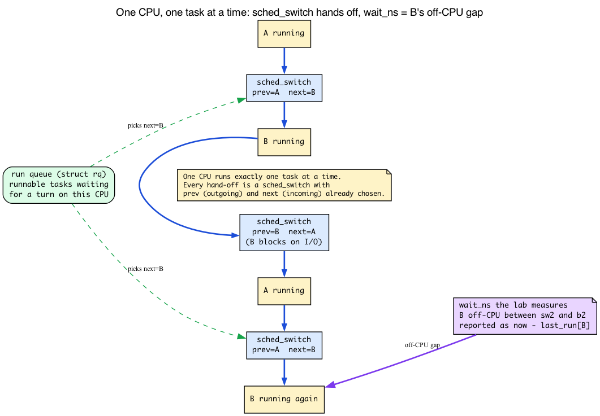
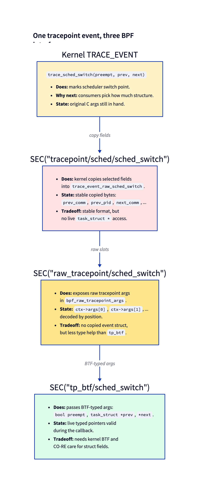
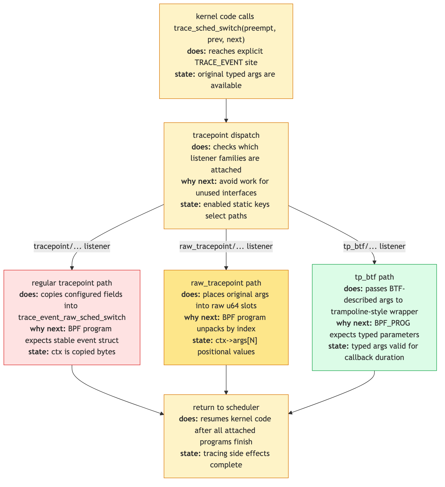
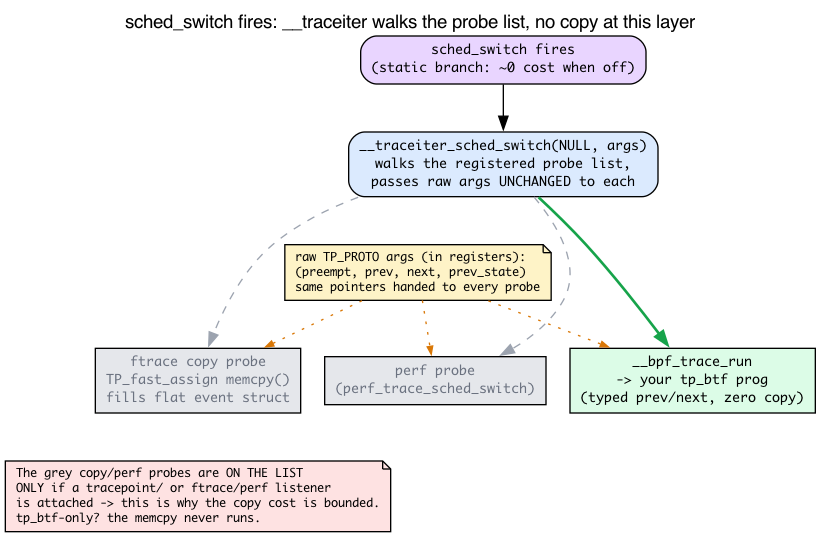
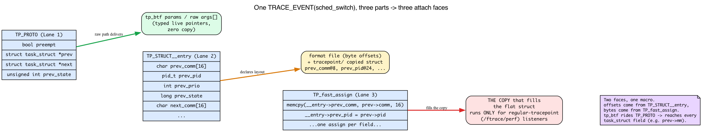
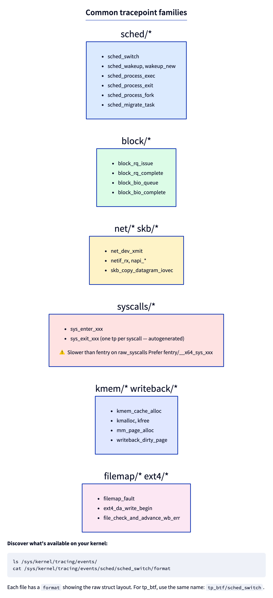

# Day 8 — Tracepoints, raw vs tp_btf, and how to find them

> **Today's mission:** measure scheduler latency by hooking `sched_switch`. But first understand what that even means — what a context switch *is*, why a task "waits," and exactly what number the lab computes. Then learn the anatomy of the `TRACE_EVENT` macro that makes a tracepoint exist, how the kernel dispatches a firing tracepoint to its listeners, and why tp_btf is the cheap, powerful way in. Compare raw tracepoint and tp_btf attach modes. Learn how to discover every tracepoint on your kernel and read its format. Total time: ~110 minutes.

## Why tracepoints when fentry exists?

Fentry attaches to *function entries*. That's perfect when there's a function whose name describes the event you care about (`vfs_read`, `filename_unlinkat`). But many interesting events don't map to a single function — or they're emitted from inside a function that does many things.

**Tracepoints are explicit instrumentation points** added by kernel developers via `TRACE_EVENT(...)` macros. They name the event, specify the data fields, and live forever as part of the kernel's API contract.

When you write a tracer for "every context switch," you don't want to attach to `__schedule` and figure out *which* paths inside it correspond to actual switches. You want `sched_switch` — the tracepoint that fires once per actual switch with `prev` and `next` already determined.

Tracepoints exist for: scheduler events, block I/O, networking, memory allocation, filesystem operations, syscalls, and many more.

## First: what is a context switch, and what does "scheduling latency" mean?

The whole lab today computes a number it calls `wait_ns` and prints lines like `firefox [4001] waited 152 µs`. Before we hook anything, you need to know what that number *is* — otherwise it's just a digit with a unit. So let's build the scheduler model from scratch. You met `task_struct` on Day 3 (the kernel's per-process descriptor); nothing earlier taught you how the scheduler *runs* those tasks. Here it is.

**One CPU runs exactly one task at a time.** That's the whole problem the scheduler solves. You have hundreds of runnable threads and (say) 8 logical CPUs, so at any instant at most 8 threads are physically executing. Everyone else is waiting for a turn.

**A run queue is the waiting room.** Each CPU has its own *run queue* (`struct rq`) — the set of tasks that are *runnable* (ready to execute, not blocked on I/O or a lock) but aren't the one currently on the CPU. The scheduler's job is to repeatedly pick the next task to run from that queue.

**A context switch is the hand-off.** When the scheduler decides task B should run instead of task A, it performs a *context switch*: save A's CPU register state and stack pointer, load B's, and resume B where it last left off. To the running code, nothing happened — A simply "froze" mid-instruction-stream and will thaw later exactly where it stopped. The function that performs the actual register/stack swap is `context_switch()`:

```c
/* kernel/sched/core.c:5329 */
context_switch(struct rq *rq, struct task_struct *prev,
               struct task_struct *next, struct rq_flags *rf)
```

Note the two arguments already named `prev` and `next` — the outgoing and incoming `task_struct`. By the time the switch happens, the scheduler has *already chosen* who runs next.

**`sched_switch` fires once per switch, after the choice is made.** A single function drives every voluntary switch (a task blocks on I/O) and every preemptive switch (a task's time slice expires, or a higher-priority task woke up): `__schedule()`.

```c
/* kernel/sched/core.c:7017 */
static void __sched notrace __schedule(int sched_mode)
```

Inside it, just before handing off to `context_switch`, the kernel emits the tracepoint with the already-decided `prev` and `next`:

```c
/* kernel/sched/core.c:7186 */
trace_sched_switch(preempt, prev, next, prev_state);
```

That `trace_sched_switch(...)` call is the tracepoint firing. Those four arguments — `preempt`, `prev`, `next`, `prev_state` — are *exactly* the arguments your tp_btf program will receive. Hold that thought; we'll cash it in below.

**So what is "scheduling latency"?** Informally: the gap between the moment a task became *runnable* (it was put on the run queue) and the moment the CPU actually *picked it* and started running it. During that gap the task sits in the run queue while other tasks use the CPU. A long gap means the task was ready but couldn't get a turn — that's scheduling delay, and it's what makes an interactive app feel laggy under load.

**Be precise about what THIS lab measures.** We are not going to install two probes. We record one timestamp per task on every switch-*out* (when a task becomes `prev`), and when that same tid later shows up as `next` (switched back *in*), we report `now - last_run`. That is the wall-clock time the task spent **off-CPU between two of its own on-CPU stints** — the time it was *not running*. That's an excellent, cheap *proxy* for scheduling delay, but it is not the textbook *wakeup-to-run* latency. The textbook version would also need `sched_wakeup` to mark the exact instant the task became runnable (it might have been blocked on disk for much of that off-CPU gap, which isn't the scheduler's fault). State this to yourself every time you read the output: **`wait_ns` = elapsed off-CPU time between two runs of the same task.** Trust the number for what it is.



There's one more payoff from knowing `prev` and `next` are full `struct task_struct *` (Day 3's descriptor): tp_btf hands you those *live typed pointers*, so you can read `prev->mm`, `prev->cgroup`, `prev->real_parent`, and anything else in the task. A regular tracepoint, as we'll see, only hands you a handful of *copied* fields. That difference is the spine of today's chapter.

## The three BPF-facing ways to attach to a tracepoint

For tracepoint events, BPF has three related section families:



**Regular tracepoint** (`SEC("tracepoint/group/event")`) gives you a struct of *copied bytes* — whatever fields the tracepoint definition chose to copy out. Stable across kernel versions because the tracepoint format is part of the kernel's API.

**Raw tracepoint** (`SEC("raw_tracepoint/event")`) gives you raw positional arguments in `struct bpf_raw_tracepoint_args`. It avoids the copied event struct, but you unpack by index and lose typed-argument ergonomics.

**tp_btf** (`SEC("tp_btf/event")`) gives you the original *typed kernel pointers* the tracepoint received as arguments. You can dereference fields directly when the pointer is valid for the callback. Same hook, more power.

Same event, three BPF-facing interfaces. The kernel dispatches whichever listener types are attached:



When a tracepoint fires, regular `tracepoint/...` listeners get the copied event struct, `raw_tracepoint/...` listeners get raw argument slots, and `tp_btf/...` listeners get typed arguments. Cost is bounded: the event-struct copy only happens for regular tracepoint listeners.

That "cost is bounded" claim is load-bearing for the whole "use tp_btf, it's cheaper" thesis — so let's ground it, because right now it's just an assertion.

### How a firing tracepoint actually reaches its listeners

A tracepoint is not an `if` in the hot path. It's a **registered list of probe callbacks sitting behind a near-zero-cost static branch.** When the tracepoint is *off* (no listeners), a static-key patch turns it into a fall-through — the CPU pays essentially nothing. When at least one listener attaches, the branch is patched live to call into the dispatch machinery.

That dispatch machinery is a generated per-event function, `__traceiter_<event>`. Every `TRACE_EVENT` expands through a chain of macros (`TRACE_EVENT` → `DECLARE_TRACE_EVENT` → `__DECLARE_TRACE` → `__DECLARE_TRACE_COMMON`), and it is `__DECLARE_TRACE_COMMON` that generates it:

```c
/* include/linux/tracepoint.h:267 */
extern int __traceiter_##name(data_proto);
```

and the firing site reaches it through a static call (on a `CONFIG_HAVE_STATIC_CALL` kernel — the common case today):

```c
/* include/linux/tracepoint.h:227 */
static_call(tp_func_##name)(__data, args);
```

(On kernels without `CONFIG_HAVE_STATIC_CALL`, the `#else` branch at line 231 reaches the same iterator with a plain indirect call: `__traceiter_##name(NULL, args)`.)

When `sched_switch` fires, `__traceiter_sched_switch` **walks the list of attached probe callbacks and calls each one with the raw `TP_PROTO` arguments** — `(preempt, prev, next, prev_state)`. Crucially: **nothing is copied at this layer.** The iterator just passes the pointers the kernel already had in registers to each registered function.

So where does the "copied event struct" come from? It's *itself just one probe callback* on that list. The probe that performs the `TP_fast_assign` memcpy (the flat `prev_comm@8, prev_pid@24, …` struct) is registered **only when a regular `tracepoint/...` (or ftrace/perf) listener attaches.** If the only listener is a tp_btf or raw program, that copy probe is **never on the list**, so the memcpy **never runs.** *That* is precisely why the cost is "bounded": you pay the copy if and only if someone asked for the copied form.



**Where BPF plugs in.** BPF raw and tp_btf programs attach through the *same* raw-tracepoint path. libbpf opens a `BPF_TRACE_RAW_TP` link:

```c
/* kernel/bpf/syscall.c:4388 */
case BPF_TRACE_RAW_TP:
```

The attach resolves the event name to its raw event map:

```c
/* kernel/trace/bpf_trace.c:2051 */
struct bpf_raw_event_map *bpf_get_raw_tracepoint(const char *name)
```

and when the tracepoint fires, the BPF dispatch probe on the iterator's list is `__bpf_trace_run`, which invokes your program with the raw argument slots:

```c
/* kernel/trace/bpf_trace.c:2073 */
void __bpf_trace_run(struct bpf_raw_tp_link *link, u64 *args)
```

**tp_btf differs from raw in exactly one way:** the verifier tags those raw argument slots with their BTF types, so instead of opaque `u64`s you get a typed `struct task_struct *prev`. Same path, same `__bpf_trace_run`, same zero-copy delivery — just type information layered on top. Because tp_btf rides this raw path, it pays **neither the per-event struct copy nor a tracefs `format` lookup**: it just receives the pointers the kernel already had in registers. This is the concrete grounding under the chapter's "tp_btf goes through the same raw-tracepoint path" sentence.

> ### There are no Dumb Questions
>
> **Q: If tp_btf is strictly better, why does raw tracepoint still exist?**
>
> A: Three reasons. First, history — raw tracepoints predate BTF. Second, raw tracepoints work on kernels without BTF (rare today, but possible). Third, raw tracepoint structs are explicitly *stable* — `prev_comm` will always be a 16-byte char array; the kernel maintainers commit to that. tp_btf gives you live `task_struct *`, but `task_struct` itself isn't stable across versions (you'd need CO-RE for any field access).
>
> **Q: How do tracepoints differ from kprobe?**
>
> A: Tracepoints are *explicitly placed* by kernel developers as part of the kernel's API. Their format is stable. Kprobes are *dynamic* — you can attach to any function, but the function isn't part of any contract; it can be renamed, removed, or have its signature change in the next release.
>
> **Q: What about `raw_tracepoint` (with the underscore)?**
>
> A: That's the raw positional-argument mode: `ctx->args[0]`, `ctx->args[1]`, and so on. It is distinct from `SEC("tracepoint/...")`, which receives a copied event struct. `tp_btf` supersedes raw tracepoints for most new code on BTF-enabled kernels because it gives typed arguments instead of positional slots.

## How to find tracepoints on your kernel

```bash
# All tracepoints, grouped by subsystem:
sudo ls /sys/kernel/tracing/events/

# All sched events:
sudo ls /sys/kernel/tracing/events/sched/

# Format of a specific tracepoint (the struct you'd get from raw):
sudo cat /sys/kernel/tracing/events/sched/sched_switch/format
```

These all need `sudo`: the tracefs root `/sys/kernel/tracing` is mounted mode `0700 root:root`, so unprivileged users can't even traverse into `events/`. (The event subdirectories below it are `0755`, and each `format` file is `0440 root:root`, but the root directory gates access to everything underneath.) You'll see the struct layout, e.g.:

```
name: sched_switch
ID: 310
format:
	field:char prev_comm[16];	offset:8;	size:16;	signed:0;
	field:pid_t prev_pid;	offset:24;	size:4;	signed:1;
	field:int prev_prio;	offset:28;	size:4;	signed:1;
	field:long prev_state;	offset:32;	size:8;	signed:1;
	field:char next_comm[16];	offset:40;	size:16;	signed:0;
	field:pid_t next_pid;	offset:56;	size:4;	signed:1;
	field:int next_prio;	offset:60;	size:4;	signed:1;
...
```

Those `prev_*`/`next_*` fields are exactly the *copied* struct a regular `tracepoint/...` program receives.

### Where the format file and the copied bytes actually come from

You just saw two seemingly-unrelated descriptions of the same event: a flat `format` file with byte offsets, and (earlier) a `TP_PROTO(...)` C argument list. How does one tracepoint yield *both*? The answer is the anatomy of the `TRACE_EVENT()` macro, and once you see it, every "where did that field come from" question dissolves.

Open `include/trace/events/sched.h` and look at the macro for `sched_switch`. It has three parts that map **directly** onto the three attach modes:

```c
/* include/trace/events/sched.h:220 */
TRACE_EVENT(sched_switch,

	/* include/trace/events/sched.h:222 — the C argument list */
	TP_PROTO(bool preempt,
		 struct task_struct *prev,
		 struct task_struct *next,
		 unsigned int prev_state),

	/* include/trace/events/sched.h:229 — the flat per-event struct layout */
	TP_STRUCT__entry(
		__array( char, prev_comm, TASK_COMM_LEN )
		__field( pid_t, prev_pid )
		__field( int, prev_prio )
		__field( long, prev_state )
		__array( char, next_comm, TASK_COMM_LEN )
		__field( pid_t, next_pid )
		__field( int, next_prio )
	),

	/* include/trace/events/sched.h:239 — code that fills the flat struct */
	TP_fast_assign(
		memcpy(__entry->prev_comm, prev->comm, TASK_COMM_LEN); /* :240 */
		__entry->prev_pid = prev->pid;
		/* ...one assignment per field... */
	),
	...
);
```

Read the three parts as three answers:

- **`TP_PROTO`** is the C argument list. These become your **tp_btf `BPF_PROG` parameters** and the **raw `args[]` slots**. This is the contract the raw path delivers.
- **`TP_STRUCT__entry`** declares the layout of the **flat per-event struct.** This is *exactly* what the `format` file describes — `prev_comm` first (offset 8 after an 8-byte common header), then `prev_pid`, and so on. A regular `tracepoint/...` program receives a pointer to a struct shaped like this.
- **`TP_fast_assign`** is the **code that copies live data into that flat struct** when the event fires. The `memcpy(__entry->prev_comm, prev->comm, TASK_COMM_LEN)` at line 240 is the literal copy — the "copy cost" we said only happens for regular-tracepoint listeners. It's the body of that one copy-probe on the iterator's list.

So the offsets you `cat` out of the `format` file (`prev_comm@8, prev_pid@24, prev_state@32, …`) are *generated from* `TP_STRUCT__entry`, and the bytes that fill them at runtime are *generated from* `TP_fast_assign`. Two faces, one macro.

This is also the airtight reason **a regular tracepoint can never reach `prev->mm`:** `TP_fast_assign` only copied the handful of fields the kernel author chose to put in `TP_STRUCT__entry`. There's no `mm` in there, so there's nothing to read. tp_btf instead receives the *un-copied* `TP_PROTO` pointer `prev`, so every field of `task_struct` is reachable.

One small consistency you'll lean on: `TASK_COMM_LEN` is 16:

```c
/* include/linux/sched.h:325 */
TASK_COMM_LEN = 16,
```

That's why both the kernel's `__array(char, prev_comm, TASK_COMM_LEN)` and your own `struct event { char comm[16]; }` agree, and why `__builtin_memcpy(dst, src, sizeof(dst))` of 16 bytes is exactly right.



For a BPF-aware view of what your kernel exposes, `perf` lists every registered tracepoint by name:

```bash
sudo perf list 'sched:*'   # all sched tracepoints
```

```
  sched:sched_migrate_task                           [Tracepoint event]
  sched:sched_process_exec                           [Tracepoint event]
  sched:sched_process_fork                           [Tracepoint event]
  sched:sched_switch                                 [Tracepoint event]
  sched:sched_wakeup                                 [Tracepoint event]
  ...
```

(Note: `sudo bpftool perf list` is *not* a way to discover tracepoints — it lists BPF programs currently attached to perf events, so on an idle box with nothing loaded it prints nothing at all.)

Common families you should know about:



> ### Sharpen your pencil
>
> A workload runs slowly. You want to see *which tasks* the scheduler is preempting. You could:
>
> 1. fentry on `__schedule()`.
> 2. Raw tracepoint on `sched_switch`.
> 3. tp_btf on `sched_switch`.
>
> Which gives you the cleanest data with least friction?
>
> .\
> .\
> .
>
> **Answer:** (3). `__schedule` runs for many reasons; you'd have to figure out which calls are switches (and as we saw, `__schedule` is the *single* function behind every voluntary and preemptive switch — one function, many reasons). Raw `sched_switch` gives you the right event but only copied fields (no access to e.g. `prev->mm`). tp_btf gives you live `task_struct *prev, *next` — read whatever you want.

## tp_btf signature — how to know the arguments

For an fentry program, the function's signature is in BTF — straightforward. For a tp_btf program, the *tracepoint's* signature is what matters. Tracepoints are defined via `TRACE_EVENT()` macros, and the args are the parameters declared in `TP_PROTO` (which, you now know, is the same list `__traceiter_sched_switch` passes unchanged to every listener).

Look in `include/trace/events/sched.h`:

```c
TRACE_EVENT(sched_switch,
    TP_PROTO(bool preempt,
             struct task_struct *prev,
             struct task_struct *next,
             unsigned int prev_state),
    ...
);
```

So your tp_btf program is:

```c
SEC("tp_btf/sched_switch")
int BPF_PROG(on_switch, bool preempt, struct task_struct *prev, struct task_struct *next, unsigned int prev_state)
```

Four args matching the `TP_PROTO` (the trailing `prev_state` was added in 5.18 — commit 9c2136be0878, "sched/tracing: Append prev_state to tp args instead").

For tracepoints whose `TP_PROTO` you don't know offhand, `bpftool btf dump file /sys/kernel/btf/vmlinux | grep btf_trace_sched_switch` will show you the typedef.

---

## The lab

### `schedlat.h` — the shared event record

```c
{{#include ../labs/day08/schedlat.h}}
```

### `schedlat.bpf.c` — measure scheduling latency per task

```c
{{#include ../labs/day08/schedlat.bpf.c:book}}
```

### What's new

- **`SEC("tp_btf/sched_switch")`** — tp_btf attach. Args match `TP_PROTO` of `sched_switch`. (`prev` and `next` are the same `task_struct *` the kernel passed to `trace_sched_switch` at `core.c:7186`.)
- **Direct deref of `prev->pid`, `next->pid`, `prev->comm`** — works because `prev` and `next` are `PTR_TO_BTF_ID` (live, typed kernel pointers). `prev->pid` reads the field at `include/linux/sched.h:1063`; `prev->comm` reads the 16-byte array at `include/linux/sched.h:1173`. A regular tracepoint could read these too (they're in the copied struct) — but only these. The win is that you *could* also read `prev->mm`, `prev->cgroup`, etc., none of which `TP_fast_assign` copied.
- **The pattern is more interesting than a single function tracer.** We're tracking *every* task. The map fills up to one entry per active TID and naturally bounds itself (active TIDs ≪ max_entries on most systems).
- **`if (wait < 1000) return 0;`** — filter sub-µs noise. The kernel switches frequently enough that without filtering, you'd flood the ringbuf.
- **Remember what `wait_ns` is.** It's `now - last_run[next_tid]`: the off-CPU gap between this task's two consecutive on-CPU stints. A proxy for scheduling delay, not strict wakeup-to-run latency.

### `schedlat.c` — userspace consumer

Same pattern. Print:

```c
printf("%s [%u] waited %llu µs after %s [%u]\n",
       e->next_comm, e->next_pid, e->wait_ns / 1000,
       e->prev_comm, e->prev_pid);
```

### Run

```bash
make
sudo ./schedlat 2>&1 | head -50
```

Expected: a stream of switches with wait times, e.g.:

```
firefox [4001] waited 152 µs after kworker/u8:2 [42]
chromium [5002] waited 89 µs after firefox [4001]
...
```

Spikes (> 1ms) often correlate with workload, lock contention, scheduler decisions worth investigating.

---

## What to break, in order

### Break 1 — Convert to regular tracepoint

```c
SEC("tracepoint/sched/sched_switch")
int on_switch(struct trace_event_raw_sched_switch *ctx)
{
    __u32 prev_tid = ctx->prev_pid;
    __u32 next_tid = ctx->next_pid;
    /* ... no struct task_struct * available ... */
}
```

This compiles and works for `prev_pid`, `next_pid`, `prev_comm`, `next_comm` (all in the copied struct — the exact fields `TP_STRUCT__entry` declared and `TP_fast_assign` filled). But there's no way to reach `prev->real_parent`, `prev->cgroup`, `prev->mm`, etc. — those live in the `task_struct`, and a regular tracepoint only hands you the copied event fields, not the live pointer. (And note: attaching this regular `tracepoint/...` program is what puts the `TP_fast_assign` copy probe on the iterator's list — so now the per-event memcpy actually runs.)

For most tracers, tp_btf is more ergonomic. Reach for regular `tracepoint/...` only when:
- You explicitly want stability (the raw struct format won't change).
- The kernel doesn't have BTF (rare; pre-5.4).
- You want to be portable across BPF runtimes that lack BTF awareness.

### Break 2 — Attach to a non-existent tracepoint

```c
SEC("tp_btf/this_tracepoint_is_not_real")
```

Load fails:

```
libbpf: prog 'on_switch': failed to find kernel BTF type ID of 'this_tracepoint_is_not_real'
```

The tracepoint name is verified against kernel BTF. Typo-proof.

### Break 3 — Wrong signature

```c
SEC("tp_btf/sched_switch")
int BPF_PROG(p, struct task_struct *prev, struct task_struct *next)
{ /* missing 'bool preempt' first arg */ }
```

Loads, runs, but `prev` is actually `bool preempt` cast to a pointer — garbage. Direct deref segfaults the BPF program (Verifier kills the run).

The Verifier *should* catch this if you compile against the right BTF — but if it doesn't, the symptom is "program loads but data is wrong." Always check `TP_PROTO`.

### Break 4 — Use BPF_CORE_READ when direct deref would do

```c
__u32 next_tid = BPF_CORE_READ(next, pid);   /* helper-call-based */
```

Works. Slower than direct deref (~50ns extra for the helper call). For trusted, well-typed pointers like `next` here, direct deref is preferred.

But: if `next` could be NULL or invalid, `BPF_CORE_READ` returns 0 instead of crashing. So for edges where you're chasing a chain (`next->mm->start_brk`), prefer `BPF_CORE_READ` so any NULL hop is silently zero-handled.

---

## What to read in the kernel

- **`include/trace/events/sched.h`** — definitions of all sched/* tracepoints. Search `TRACE_EVENT(sched_switch` (line 220). The macro expands into a *lot* of code, but the three parts that matter are `TP_PROTO` (line 222, your tp_btf args), `TP_STRUCT__entry` (line 229, the `format`/copied-struct layout), and `TP_fast_assign` (line 239, the copy code — note the `memcpy` at line 240).
- **`include/linux/tracepoint.h`** — the macro machinery. Skim. Note `__DECLARE_TRACE` and `__DECLARE_TRACE_COMMON` (the helper `TRACE_EVENT` expands through), the generated `__traceiter_##name` (line 267), and how the firing site reaches it via `__DO_TRACE_CALL` (lines 227/231: a `static_call` when `CONFIG_HAVE_STATIC_CALL`, else a plain indirect call).
- **`kernel/tracepoint.c`** — what happens when a tracepoint fires. The generated `__traceiter_<event>` iterator walks the registered probe list.
- **`kernel/trace/bpf_trace.c`** — search `bpf_get_raw_tracepoint` (line 2051). This is how BPF programs attach to raw tracepoints; the per-event dispatch into your program is `__bpf_trace_run` (line 2073). `tp_btf` goes through the same raw-tracepoint path (`BPF_TRACE_RAW_TP`, `kernel/bpf/syscall.c:4388`): the link is set up via `bpf_raw_tracepoint_open` / `bpf_get_raw_tracepoint`, just with BTF-typed arguments.
- **`kernel/sched/core.c`** — the scheduler core. See `__schedule` (line 7017), `context_switch` (line 5329), and the tracepoint firing site `trace_sched_switch(preempt, prev, next, prev_state)` (line 7186) — the source of everything today's lab measures.
- **`tools/testing/selftests/bpf/progs/cgrp_ls_tp_btf.c`** — official examples using tp_btf.

---

## Bullet Points

- A CPU runs **one task at a time**; runnable-but-waiting tasks sit on a per-CPU **run queue**. A **context switch** (`context_switch`, `core.c:5329`) saves `prev` and loads `next`; `__schedule` (`core.c:7017`) drives every switch and fires `sched_switch` (`core.c:7186`) with `prev`/`next` already chosen.
- Today's `wait_ns` is **off-CPU time between a task's two runs** (`now - last_run[next_tid]`) — a proxy for scheduling delay, not strict wakeup-to-run latency (that needs `sched_wakeup`).
- A **`TRACE_EVENT`** has three parts: `TP_PROTO` (your tp_btf/raw args), `TP_STRUCT__entry` (the `format` file + copied struct), and `TP_fast_assign` (the memcpy that fills the copy). A regular tracepoint can only see what `TP_fast_assign` copied — which is why it can't reach `prev->mm`.
- A firing tracepoint runs `__traceiter_<event>`, which **walks a probe list** and calls each listener with the raw `TP_PROTO` args — no copy at this layer. The struct copy is *one optional probe*, present only when a `tracepoint/`/ftrace/perf listener attaches — that's why the cost is **bounded**.
- **Tracepoints** are explicit instrumentation hooks placed by kernel devs; their format is stable across versions.
- Tracepoint events have three BPF section families: `tracepoint/...` (copied struct), `raw_tracepoint/...` (raw positional args), and `tp_btf/...` (typed BTF args). BPF raw and tp_btf share the path through `bpf_get_raw_tracepoint`/`__bpf_trace_run` (`BPF_TRACE_RAW_TP`); tp_btf just adds BTF types.
- **Use tp_btf for new code.** Same hook, lower overhead (no copy, no tracefs lookup), full field access via direct deref.
- The `TP_PROTO(...)` of a tracepoint defines your tp_btf BPF program's argument list.
- Discover tracepoints in `/sys/kernel/tracing/events/`.
- Common families: `sched/*`, `block/*`, `net/*`, `syscalls/*`, `kmem/*`, `filemap/*`.
- Prefer fentry over `tracepoint/syscalls/sys_enter_xxx` (faster on the syscall path).
- Direct deref works on tp_btf args; `BPF_CORE_READ` for chains where any hop could be NULL.

---

## Check question

You attach a tp_btf to `sched_switch`. Inside your program, you save `prev` (a `task_struct *`) into a hash map for use later. Will dereferencing it later still work?

<details>
<summary>Click to reveal answer</summary>

**Answer:** No. The pointer was *trusted* during the tracepoint callback because the kernel handed it to you with a guarantee that the task is alive for the duration of the callback. Once the callback returns, that guarantee is gone — the task may be freed. Storing the raw pointer for later use is a use-after-free risk and the Verifier rejects it. To save a reference safely, you'd use `bpf_task_acquire` (a kfunc — Day 20) which atomically takes a refcount, then `bpf_task_release` later. Or, simpler: store *fields* (pid, comm) rather than the pointer.

</details>

---

## Tomorrow

Day 9: stack traces. `BPF_MAP_TYPE_STACK_TRACE`, `bpf_get_stackid`, kernel vs user stacks, and how to fold output for flame graphs.
