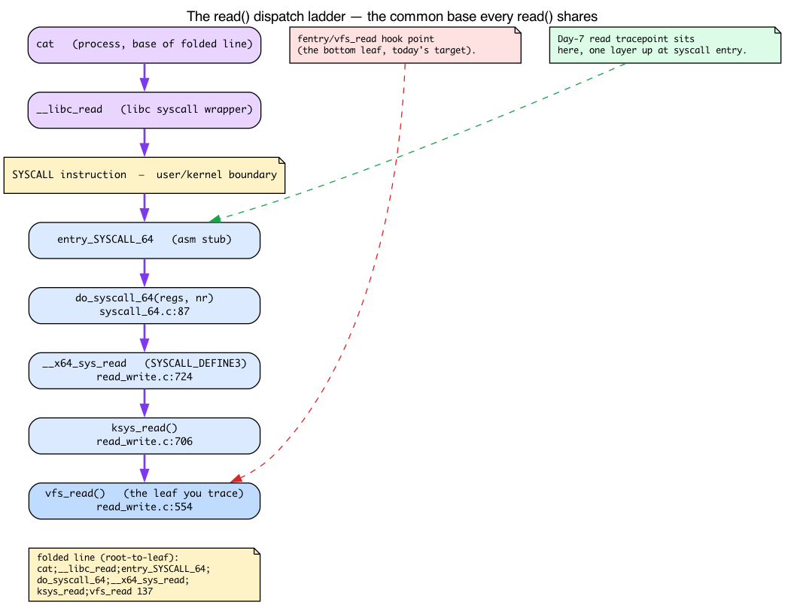
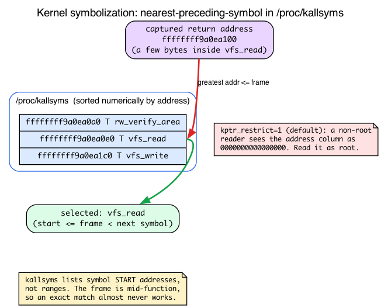
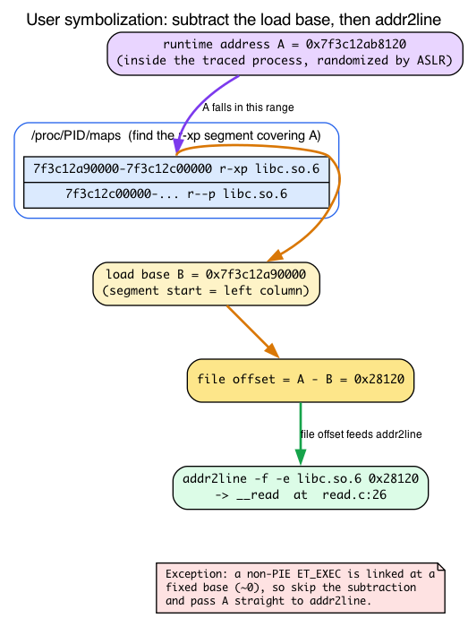

# Day 9 — Stack traces and the path to flame graphs

> **Today's mission:** capture the kernel call stack at every `vfs_read`, aggregate by unique stack, and produce data ready for a flame graph. Along the way you'll learn what a native call stack actually *is*, how the kernel unwinds it without frame pointers, and why turning a raw return address back into a function name is a userspace job split across `/proc/kallsyms`, `/proc/PID/maps`, and a pile of base arithmetic. Total time: ~120 minutes.

## Why stack traces matter

Counters tell you "this happened 1000 times." Stack traces tell you *who caused it*. Combined with rate aggregation, they reveal hotspots — which user code, through which kernel paths, accounts for the bulk of an event's occurrences.

This is how `perf top`, `bpftrace`, and most profiling tools work under the hood. By Day's end you'll know how to write your own.

But "capture the stack" hides four things that will bite you the moment you look at the raw output, and most of today is about making them obvious:

1. **What a native call stack even is** — and how the kernel walks it backwards (the thing `bpf_get_stackid` does for you).
2. **What the syscall-entry frames are** — why every `read()` shares an identical base of kernel frames.
3. **How a raw kernel return address becomes a function name** — `/proc/kallsyms`, and why an exact match almost never works.
4. **How a raw user return address becomes a function name** — ASLR, load bases, and `addr2line`.

We'll teach each as we hit the part of the lab that needs it.

## First: what *is* a call stack, and how do you walk it backwards?

Before we touch any BPF, we have to be precise about the thing we're capturing. When one function calls another on x86_64, the `CALL` instruction does one concrete thing: it **pushes the return address** — the address of the instruction right *after* the call — onto the stack, then jumps. When the callee runs `RET`, it pops that address and resumes there. So at any instant, the stack contains a chain of return addresses: one per function currently in flight, innermost (the leaf, where the CPU is right now) at the top.

**Unwinding** = recovering that ordered list of return addresses, leaf-first. That list *is* the stack trace. Unwinding produces exactly this — an array of return addresses (the internal `trace->ip[]`), innermost first; `bpf_get_stackid` hashes that array, stores it, and returns a `stackid` (see below).

> **Don't confuse this with the BPF stack from Day 1/4.** Day 1 taught the BPF program's *own* 512-byte stack addressed through register `R10` — that's scratch space the verifier polices for your eBPF code. Today's call stack is the **CPU's native kernel/user stack**: the real x86 stack of return addresses laid down by `CALL` instructions in compiled kernel and userspace code. Different stack, different purpose. `bpf_get_stackid` walks the *native* one.

So how do you walk it backwards? You have a stack pointer and you know the top frame's instruction pointer — but the stack is just bytes. Where does one frame end and the next begin? There are two answers.

### Frame-pointer unwinding (the simple way)

With `-fno-omit-frame-pointer`, the compiler dedicates register `%rbp` to point at a known spot in the current frame: the saved-`%rbp`/return-address pair. Each function's prologue pushes the caller's `%rbp` and sets `%rbp` to the new frame. The result is a **linked list**: `%rbp` points at `[saved %rbp | return addr]`, and the saved `%rbp` points at the *previous* frame's pair, and so on. A walker just follows the chain, reading a return address out of each node.

Cheap and simple — but it costs a general-purpose register (`%rbp` can't be used for anything else), so for years amd64 distros compiled everything with `-fomit-frame-pointer` to claw that register back. That single decision is why **user-stack walks fail** on older binaries: there's no `%rbp` chain to follow.

### ORC unwinding (how the x86_64 kernel does it)

The kernel can't afford to lose `%rbp`, yet it still needs reliable stacks. The fix: an **out-of-band table** built at compile time. The kernel image ships two arrays — `__start_orc_unwind_ip[]` / `__start_orc_unwind[]` (declared `extern` at `arch/x86/kernel/unwind_orc.c:30`) — that, keyed by *any* instruction pointer, describe how to find the previous frame *without* a frame pointer: "at this IP, the stack pointer is at such-and-such offset, the return address lives there." `orc_find()` (`unwind_orc.c:209`) does the per-IP lookup, and `unwind_get_return_address()` (`unwind_orc.c:380`) produces each frame. The common frame type it resolves is `ORC_TYPE_CALL` (the `case ORC_TYPE_CALL` in the unwind step, `unwind_orc.c:611`).

This is why kernel stacks "always work" while user stacks need frame pointers: the kernel carries its own unwind table; userspace binaries don't (their equivalent, DWARF `.eh_frame`, is too expensive for the kernel to parse from a BPF context — more on that below).

Both methods produce the **same** result: the ordered `trace->ip[]` array of return addresses, which `bpf_get_stackid` hashes. The captured array lands in a `struct perf_callchain_entry { u64 nr; u64 ip[]; }` (`include/linux/perf_event.h:59`) — `nr` frames, then the IPs.

![Frame-pointer and ORC unwinding both produce the same trace->ip[] array](diagrams/day09_callstack_unwind.png)

### One subtlety that haunts symbolization

Look again at what `CALL` pushes: the address of the instruction *after* the call. So every captured frame (except the leaf) is a return address that points **into the middle of a function**, one instruction past a call site — *never* at the function's start. Hold that thought; it's the root cause of the kallsyms "nearest-preceding-symbol" trick we hit later.

## Meet `BPF_MAP_TYPE_STACK_TRACE`

A purpose-built map type. You don't store key/value pairs in it directly — you call `bpf_get_stackid(ctx, &stacks, flags)` and the kernel:
1. Walks the current stack (frame pointers or ORC, per the section above).
2. Hashes the frame array into a 32-bit `stackid`.
3. Stores the frames keyed by `stackid` (deduplicated — same stack → same id).
4. Returns `stackid` to your program.

You then use `stackid` as a **key in a normal map** (e.g., a hash map of `stackid → count`) to aggregate. The helper itself is `BPF_CALL_3(bpf_get_stackid, ...)` at `kernel/bpf/stackmap.c:323`; it deliberately returns *unsymbolized* frames — turning addresses into names is a userspace concern (we'll see exactly why below).


The dedup matters: if 10 million events all happen with the same stack, you store the frame array *once* and count it 10 million times against one `stackid`. Memory is bounded by the number of *unique* stacks, not events.

## Kernel stack vs user stack

The flag argument to `bpf_get_stackid` (and its sibling `bpf_get_stack`) decides which stack you walk:


- **Default (flag=0):** kernel stack. Walked via the **ORC unwinder** on x86_64 (default since 4.14) or frame pointers — the two mechanisms from the section above. Always works in any tracing context, because the kernel ships its own ORC table.
- **`BPF_F_USER_STACK`:** userspace stack of the *current task*. Works only if the user binary was compiled with frame pointers. The DWARF unwind info (`.eh_frame`) that would otherwise rescue a frame-pointer-omitted binary is too expensive for the kernel to parse from BPF context, so **the kernel can't unwind userspace from DWARF** — no frame pointers, no user stack. Modern Linux distributions started building `-fno-omit-frame-pointer` by default starting with Fedora 38 in 2023, and Ubuntu 24.04 in 2024, to make this useful again.
- **`BPF_F_FAST_STACK_CMP`:** hash-only comparison (faster, no full frame walk for dedup).
- **`BPF_F_REUSE_STACKID`:** allow stackid reuse across capture sessions.

To get a *combined* kernel+user stack, you call **`bpf_get_stack` twice** (not `bpf_get_stackid`) — once with each flag — and combine in userspace before symbolizing.

> ### There are no Dumb Questions
>
> **Q: How accurate are kernel stacks?**
>
> A: Very, in 99% of cases. The ORC unwinder is precise. Edge cases: in-flight kprobes that occur *during* function prologue/epilogue may produce off-by-one frames. Highly optimized leaf functions can be tail-called and not appear in the stack at all. For most tracing this is fine.
>
> **Q: Why doesn't user stack walking "just work" like the kernel side?**
>
> A: Userspace binaries on amd64 have been compiled with `-fomit-frame-pointer` for years (default in distros until Fedora 38 in 2023 and Ubuntu 24.04 in 2024 reversed it). Without frame pointers, walking back through stack frames requires DWARF unwind info (`.eh_frame`) — which is expensive and the kernel can't process. Modern distros are reversing course (Fedora, Ubuntu now ship frame-pointer-enabled libc and friends), but legacy binaries lack the metadata.
>
> **Q: How do I symbolize JIT'd languages (Java, Node.js)?**
>
> A: They expose runtime symbol files. `perf-PID.map` is a text file in `/tmp` mapping JIT addresses to function names. JIT runtimes (HotSpot, V8) generate these. Your userspace symbolizer reads them alongside ELF tables.

## What the syscall-entry frames actually are

The exercise below leans on a specific 5-frame kernel chain for `cat /etc/passwd`, and the flame graph later calls the wide base "the common syscall-entry frames." On **Day 7** you saw that the `read` tracepoint sits one layer up at syscall entry while `fentry/vfs_read` hooks the bottom — but not the rungs *between* those two points. Here's the full ladder — you don't need to re-derive the syscall mechanism, just see the rungs.

A `read()` does **not** jump straight into `vfs_read`. On x86_64 it traverses a fixed dispatch ladder:

1. The hardware `SYSCALL` instruction lands at the assembly stub **`entry_SYSCALL_64`**.
2. That calls the C dispatcher **`do_syscall_64(regs, nr)`** (`arch/x86/entry/syscall_64.c:87`).
3. Which dispatches through the syscall table to **`__x64_sys_read`** — the arch wrapper that `SYSCALL_DEFINE3(read, ...)` (`fs/read_write.c:724`) expands to.
4. Which calls the thin **`ksys_read()`** (`fs/read_write.c:706`).
5. Which finally calls **`vfs_read()`** (`fs/read_write.c:554`) — the leaf you're tracing.

This is why every sample shares a wide common base in the flame graph: *every* `read()` on the box enters through the identical `entry_SYSCALL_64` → `do_syscall_64` prefix; only the leaf paths diverge. It also fixes the leaf ordering in a folded line: process (`cat`) at the base, then the entry frames, with `vfs_read` — the function you traced — on top.



> ### Sharpen your pencil
>
> You write a tracer that captures kernel + user stacks for every `vfs_read`. Your test workload is `cat /etc/passwd` from bash. Roughly how many unique `stackid` values do you expect?
>
> .\
> .\
> .
>
> **Answer:** A small handful. `cat`'s call to `read()` always traverses roughly the same userspace path (libc `read` wrapper → syscall instruction). Bash's `cat` invocation similarly goes through the same path. The kernel side is also stable: `entry_SYSCALL_64` → `do_syscall_64` → `__x64_sys_read` → `ksys_read` → `vfs_read`. Maybe 1–3 unique stacks total. Now run on a complex workload (Firefox loading a page) and you'll see hundreds — that's the dedup paying off.

## How deep can a stack go? The hard 127-frame cap

Before you size the map, know the ceiling. When you create a `BPF_MAP_TYPE_STACK_TRACE` map, the kernel requires `value_size / 8` (8 bytes per `u64` frame) to be `<=` `sysctl_perf_event_max_stack` *up front*. So asking for 256 frames does not silently clamp — map creation is rejected with `-EINVAL` (`stack_map_alloc`, `stackmap.c:113`). `value_size / 8` must be `<=` `sysctl_perf_event_max_stack` at creation time.

- `PERF_MAX_STACK_DEPTH` is **127** by default (`include/uapi/linux/perf_event.h:1285`), and `int sysctl_perf_event_max_stack = PERF_MAX_STACK_DEPTH;` (`kernel/events/callchain.c:23`). The runtime knob is `/proc/sys/kernel/perf_event_max_stack` (registered at `callchain.c:306`). It's shared with the perf subsystem because `bpf_get_stackid` reuses perf's callchain machinery.
- `stack_map_calculate_max_depth()` (`kernel/bpf/stackmap.c:53`) computes the *runtime* depth from `value_size / elem_size` and reconciles it with the sysctl: `if (max_depth > curr_sysctl_max_stack) return curr_sysctl_max_stack;`. This runtime clamp only matters when the sysctl is lowered *after* the map was created (or for the `BPF_F_SKIP_FIELD` adjustment) — not as a creation-time ceiling. The creation-time gate is separate: `stack_map_alloc` outright **rejects** a map whose `value_size / 8 > sysctl_perf_event_max_stack` with `-EINVAL` (`stackmap.c:113–114`).

Practical consequence: the lab's `MAX_STACK_DEPTH = 64` is comfortably under the cap. Choosing 64 vs 127 trades memory-per-unique-stack against truncation risk on deep stacks. Going above 127 buys nothing unless you also raise the sysctl.

## The end-to-end flame graph pipeline


Capture in BPF, aggregate by stackid, read in userspace, symbolize each frame, fold into the textual format flamegraph.pl expects:

```
thread_or_pid;fn1;fn2;fn3;fn4 1234
```

Then pipe through `flamegraph.pl` (Brendan Gregg's tool) or upload to `speedscope.app`.

---

## The lab

### `stacks.bpf.c`

```c
{{#include ../labs/day09/stacks.bpf.c:book}}
```

### What's new (and what's recycled)

- **The attach is old news.** `SEC("fentry/vfs_read")` is the same BTF-typed entry trampoline on `vfs_read` you used on **Day 6**, and `BPF_PROG(on_read)` is the argument-unpacking macro demystified on **Day 7**. Nothing new in *how* we attach — `vfs_read` (`fs/read_write.c:554`) is the identical target from the Day 6 lab. Today's novelty is entirely *inside* the handler.
- **Two `bpf_get_stackid` calls** — one kernel (flag 0), one user (`BPF_F_USER_STACK`).
- **Negative return checks.** The helpers return a negative errno (-EFAULT/-EEXIST/-ENOMEM) on failure (e.g., user-stack walk hit a missing frame pointer, or the stack map slot was already taken by a different stack).
- **Composite key**: pack both stackids into one `u64` so identical (kernel, user) pairs share a counter. This `(kid << 32) | uid` packing is the only genuinely new twist here — two stackids collapsed into one hash-map key.
- **The counter logic is pure Day 2.** Recall from Day 2: a hash-map lookup hands back an *unlocked* live pointer, so the concurrent increment must be `__sync_fetch_and_add`; and the `BPF_NOEXIST` insert can lose a racing increment (a cosmetic miss). Same `count.c` pattern, same check question — no need to re-derive it.

### `stacks.c` — userspace dumper + symbolizer

Outline (you can use `blazesym` or write a minimal kallsyms parser). The iteration loop is the same userspace `bpf_map_get_next_key` walk from Day 2 — one key per call, the loop lives in userspace:

```c
/* every 5s, dump top stacks by count: */
while (!exiting) {
    sleep(5);

    /* iterate counts map */
    __u64 key = 0, next;
    __u64 val;
    int cnt_fd = bpf_map__fd(skel->maps.counts);
    int stk_fd = bpf_map__fd(skel->maps.stacks);

    while (bpf_map_get_next_key(cnt_fd, &key, &next) == 0) {
        bpf_map_lookup_elem(cnt_fd, &next, &val);
        __u32 kid = next >> 32, uid = next & 0xffffffff;

        __u64 kframes[64] = {0}, uframes[64] = {0};
        bpf_map_lookup_elem(stk_fd, &kid, kframes);
        bpf_map_lookup_elem(stk_fd, &uid, uframes);

        /* Print folded: stack;...; count */
        printf("[count=%llu]\n", val);
        for (int i = 0; i < 64 && kframes[i]; i++)
            printf("  K %llx\n", kframes[i]);
        for (int i = 0; i < 64 && uframes[i]; i++)
            printf("  U %llx\n", uframes[i]);
        printf("\n");

        key = next;
    }
}
```

For real symbolization, link against `libblazesym` (modern, fast) or write a `kallsyms` parser. We won't write one today — Day 9 is about *capturing* the data; symbolization is plumbing. But you should understand *what that plumbing does*, because the next two sections walk it by hand.

### Run it

```bash
make
sudo ./stacks &        # job %1; prints a dump every 5s
# Generate work, then wait for the next 5-second dump to see it:
find /usr -name "*.so" > /dev/null
cat /etc/passwd > /dev/null
sleep 5
```

Output is interval-driven — nothing prints until the next 5-second tick. When you're done, stop the background dumper (otherwise it keeps printing as root forever):

```bash
kill %1        # or: sudo pkill stacks
```

You'll see frames printed as raw hex (`K <addr>` / `U <addr>`). Those are the raw return addresses from `trace->ip[]` — exactly the values the section on call stacks promised. Resolving them by hand is fiddly, and the two halves (kernel vs user) work completely differently. Let's do each by hand once; that's the whole reason `bpftool`/`libblazesym` exist.

### Symbolizing kernel frames: `/proc/kallsyms`

A running kernel has no ELF symbol table the way a binary on disk does — the image is loaded and relocated. Instead the kernel exposes its **runtime symbol table** at `/proc/kallsyms`: one line per symbol, `address type name`, e.g. `ffffffff... T vfs_read`. A userspace symbolizer turns a kernel return address into a name by looking it up here. Two gotchas:

- **`kptr_restrict` zeros the addresses for non-root.** This sysctl governs visibility; at the default value `1`, an unprivileged reader sees every address as `0000000000000000`. Grep as a normal user and you find zeros. You must read it as **root**. (It's a hardening measure: leaking kernel addresses defeats KASLR.)
- **kallsyms lists symbol *start* addresses, not ranges — and isn't address-sorted on disk.** Recall the subtlety from the call-stack section: a captured frame is a return address *in the middle* of a function, never at its start. So an exact match almost never succeeds. The fix is **nearest-preceding-symbol**: sort lexicographically (which equals numeric order for the fixed-width 16-hex-digit kernel addresses), then take the greatest symbol address `<=` your frame address.

```bash
# ADDR is one of the K <addr> values, e.g. ffffffff9a0ea100
sudo sort /proc/kallsyms | awk -v a=ADDR '$1 <= a {s=$0} END {print s}'
# ffffffff9a0ea0e0 T vfs_read
```

The frame address (`ffffffff9a0ea100`) is greater than `vfs_read`'s start (`ffffffff9a0ea0e0`) and less than the next symbol's start, so it resolves to `vfs_read` — a return address a few bytes inside it. This is precisely the lookup `bpftool`/`libblazesym` automate.



### Symbolizing user frames: load bases and ASLR

Kernel frames live in one address space; user frames are runtime virtual addresses **inside the traced process**, and that's where it gets harder. `addr2line` and a binary's ELF symbol table speak in **file offsets** — the link-time addresses baked into the `.so`/executable. The captured frame is a **runtime address**. The two differ by the **load base**:

```
file_offset = runtime_addr - load_base
```

Why isn't `load_base` just zero? Because **Position-Independent Executables (PIE)** and *all* shared libraries (libc, etc.) are mapped at a **randomized base each run** — that's ASLR. To recover the file offset you must subtract the base, and the base is the lowest mapped address of that object's executable segment, found in the left column of the matching line of `/proc/PID/maps`.

```bash
# A is a U <addr> runtime value; PID is the traced process.
# Find B = the base of the object that contains A:
sudo grep -i 'r-xp' /proc/PID/maps      # locate the segment whose range covers A; B is its start
addr2line -f -e /path/to/object $((A - B))
```

The base subtraction is **mandatory** for PIE executables and shared libraries. The one exception: a classic non-PIE `ET_EXEC` is linked at a *fixed* address (its main text base is effectively 0), so you pass the runtime address straight to `addr2line` — which is the carve-out you'll see in tools. Two beginner traps produce `??:0`: forgetting `-e <object>` (wrong object) and forgetting the subtraction (wrong base). This per-object bookkeeping across many mapped libraries is the bulk of what `libblazesym`/`bpftool` do for you.

(There's a robustness escape hatch: `BPF_F_USER_BUILD_ID` (`include/uapi/linux/bpf.h:6174`) captures a build-id + offset instead of a bare address, so offline symbolization survives ASLR and even a different machine. We won't use it today, but it's why that mode exists.)



This hand-resolution — kallsyms nearest-preceding for kernel, base-subtract-then-addr2line for user — is exactly the plumbing `libblazesym` / `bpftool` automate, which is why we deferred symbolization in the lab.

### Pipe to a flame graph

Get `flamegraph.pl` once (it isn't packaged on any distro — grab it from Brendan Gregg's repo):

```bash
git clone https://github.com/brendangregg/FlameGraph
export PATH="$PATH:$PWD/FlameGraph"
```

Then:

```bash
sudo ./stacks --folded > out.folded
flamegraph.pl < out.folded > out.svg
# Open out.svg in any browser. On a headless box, copy it to your laptop,
# or just drag out.folded onto https://speedscope.app (no local browser needed).
# firefox out.svg   # only if you actually have a desktop browser
```

`--folded` is **required reader work** — the lab's `stacks.c` only prints the `%llx` debug dump above. You need to parse `argv`, symbolize each frame (using the kallsyms and `addr2line` mechanics you just learned), and emit one line per unique stack in *root-to-leaf* order (process at the base, leaf on top), with the count last. Building on the loop above, that's roughly:

```c
printf("%s", comm);                       /* process name at the base */
for (int i = u_n - 1; i >= 0; i--)        /* user frames, outermost first */
    printf(";%s", sym_user(uframes[i]));
for (int i = k_n - 1; i >= 0; i--)        /* then kernel frames */
    printf(";%s", sym_kernel(kframes[i]));
printf(" %llu\n", val);                   /* count */
```

A correct folded line for the `cat /etc/passwd` workload looks like this — the same kernel ladder from the Sharpen-your-pencil answer, leaf (`vfs_read`) on top:

```
cat;__libc_read;entry_SYSCALL_64;do_syscall_64;__x64_sys_read;ksys_read;vfs_read 137
```

In the resulting SVG: the wide base is the common process / syscall-entry frames shared by every sample, narrow towers are the divergent call paths, each frame's width is proportional to its count, and `vfs_read` sits near the top of every tower (it's the function you traced).

---

## What to break, in order

### Break 1 — Stack walk failure on `BPF_F_USER_STACK`

If your binary has frame-pointer-omitted libraries (most older distros), you'll see `uid < 0` for many calls — there's no `%rbp` chain to follow and no DWARF the kernel can use, exactly as the unwinding section predicted. Workaround: trace `fentry` of a userspace-heavy function in a frame-pointer-enabled binary. Or, on Fedora/Ubuntu 24+, modern libc *has* frame pointers and user stacks resolve.

To debug, check `bpf_get_stackid`'s return value directly: the program already guards on `uid < 0` (lines `__s64 uid = ...; if (kid < 0 && uid < 0)`), and that negative value is the errno explaining the failed user-stack walk. `bpftool prog tracelog` is empty by default here — this lab emits nothing to the trace pipe — so to use it you must add a printk on the failure path, e.g. in `on_read`:

```c
if (uid < 0)
    bpf_printk("user-stack walk failed: uid=%lld\n", uid);
```

Then watch `sudo bpftool prog tracelog` (or `sudo cat /sys/kernel/debug/tracing/trace_pipe`) to see the negative errno fire when a frame-pointer-omitted library breaks the walk.

### Break 2 — Forgetting `MAX_STACK_DEPTH`

Set `value_size` too small (`16 * sizeof(__u64)`). Stacks deeper than 16 frames get truncated. You'll see plausible-looking but incomplete stacks. Default to 64 unless you have a reason to be smaller — and remember from the cap section that going *above* 127 buys nothing without raising `perf_event_max_stack`.

### Break 3 — Use `bpf_get_stack` instead of `bpf_get_stackid`

```c
__u64 frames[64];
int n = bpf_get_stack(ctx, frames, sizeof(frames), 0);
```

This copies frames *directly into* a buffer you provide (`BPF_CALL_4(bpf_get_stack, ...)` at `kernel/bpf/stackmap.c:514`) instead of going through the dedup map. Useful when you're emitting one stack per event (e.g., to a ringbuf) rather than aggregating. Trade: more memory traffic, no dedup; but you have the frames immediately without a second map lookup.

### Break 4 — Increase stack rate, fill the map

Trace a high-rate event like `tcp_recvmsg` on a busy server. With many unique stacks, you'll fill `max_entries=16384`. When a new stack hashes to a slot already holding a *different* stack, `bpf_get_stackid` returns `-EEXIST` and the new stack is dropped — that's the `if (bucket && !(flags & BPF_F_REUSE_STACKID)) return -EEXIST;` branch at `stackmap.c:298` (build-id path) / `:305` (normal path). So genuinely new stacks are silently lost. Pass `BPF_F_REUSE_STACKID` and the behavior flips: the occupied slot is **overwritten** instead (the `xchg(&smap->buckets[id], new_bucket)` at `stackmap.c:317`), so you keep the newest stack but lose the old one (and any counts keyed on the old stackid now point at the wrong frames).

Lesson: size `stacks` and `counts` to expected unique-stack cardinality. For most production servers, 16K–64K is fine. Profilers often go to 1M.

---

## What to read in the kernel

- **`kernel/bpf/stackmap.c`** — the implementation. `stack_map_alloc` builds the map's own structure (a `buckets[]` array plus a per-CPU `pcpu_freelist` of stack buffers — *not* the generic `htab_map_alloc`; see `struct bpf_stack_map` at `:26`), and `bpf_get_stackid` (`:323`) is the helper. Note `stack_map_calculate_max_depth` (`:53`) where the 127-cap clamp lives. Read the file once; ~800 lines.
- **`arch/x86/kernel/unwind_orc.c`** — the ORC unwinder x86_64 uses. `orc_find` (`:209`) and `unwind_get_return_address` (`:380`) are the heart of it. Don't read deeply; just know it exists and is faster/more reliable than frame pointers.
- **`kernel/bpf/stackmap.c`** — search `bpf_get_stack` (`:514`). The non-stackid version that copies frames directly.
- **`tools/lib/bpf/btf.c` and `tools/perf/util/symbol.c`** — for inspiration on symbolization. The selftests don't have a clean example.
- **`tools/testing/selftests/bpf/progs/stacktrace_map.c`** — minimal example of the pattern.

External reference (skim once): https://www.brendangregg.com/flamegraphs.html

---

## Bullet Points

- A **native call stack** is a chain of return addresses pushed by `CALL` instructions. **Unwinding** recovers them leaf-first; that ordered list *is* the trace. (Distinct from the BPF program's own R10 stack from Day 1/4.)
- **Two ways to unwind:** frame pointers (`%rbp` linked list, cheap but costs a register — why user stacks fail) and **ORC** (an out-of-band `.orc_unwind` table the x86_64 kernel ships — why kernel stacks always work).
- **`BPF_MAP_TYPE_STACK_TRACE`** stores frame arrays keyed by hash; same stack → same `stackid`. Memory bounded by unique stacks.
- **`bpf_get_stackid(ctx, &stacks, flags)`** captures the current stack and returns a stackid. Use it as a key in another map for aggregation. **`BPF_F_USER_STACK`** walks userspace — only works with frame pointers.
- **The syscall ladder** `entry_SYSCALL_64 → do_syscall_64 → __x64_sys_read → ksys_read → vfs_read` is the common base every `read()` shares — the wide base of the flame graph.
- **127-frame cap:** the kernel clamps captured depth to `sysctl_perf_event_max_stack` (default `PERF_MAX_STACK_DEPTH = 127`) regardless of `value_size`.
- **Symbolization happens in userspace.** Kernel frames: `/proc/kallsyms`, root-only (kptr_restrict=1 zeros it), nearest-preceding-symbol (return addr is mid-function). User frames: subtract the load base from `/proc/PID/maps` (ASLR/PIE), then `addr2line` — except non-PIE `ET_EXEC`.
- **`bpf_get_stack`** (no -id) copies frames directly to a buffer — preferred for per-event emission, not aggregation.
- **Flame graph format**: `thread;fn1;fn2;fn3 count` per line; `flamegraph.pl` produces interactive SVG.

---

## Check question

Two CPUs simultaneously call `bpf_get_stackid` with identical stacks. Do they get the same stackid? Same map slot? Race?

<details>
<summary>Click to reveal answer</summary>

**Answer:** They get the same stackid (the hash of the frames is the same). They both target the same map slot. The kernel uses bucket-level locking inside the stack map — it compares the bucket with `READ_ONCE(smap->buckets[id])` and installs with `xchg(&smap->buckets[id], ...)`; one CPU's insert wins and the other sees the existing entry and returns the same stackid without re-inserting. No race observable from BPF. The dedup is the whole point of this map type.

</details>

---

## Tomorrow

Day 10: uprobes. Tracing functions in userspace binaries from BPF. We'll attach to `bash`'s `readline()` and see every command typed.
