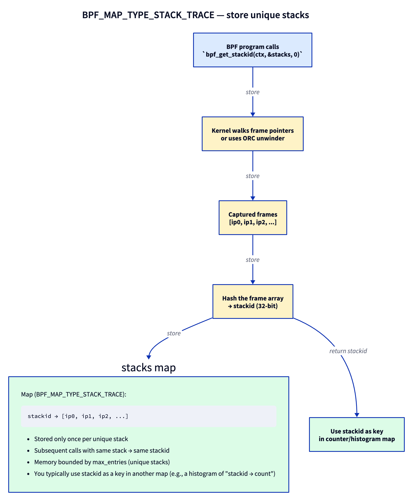
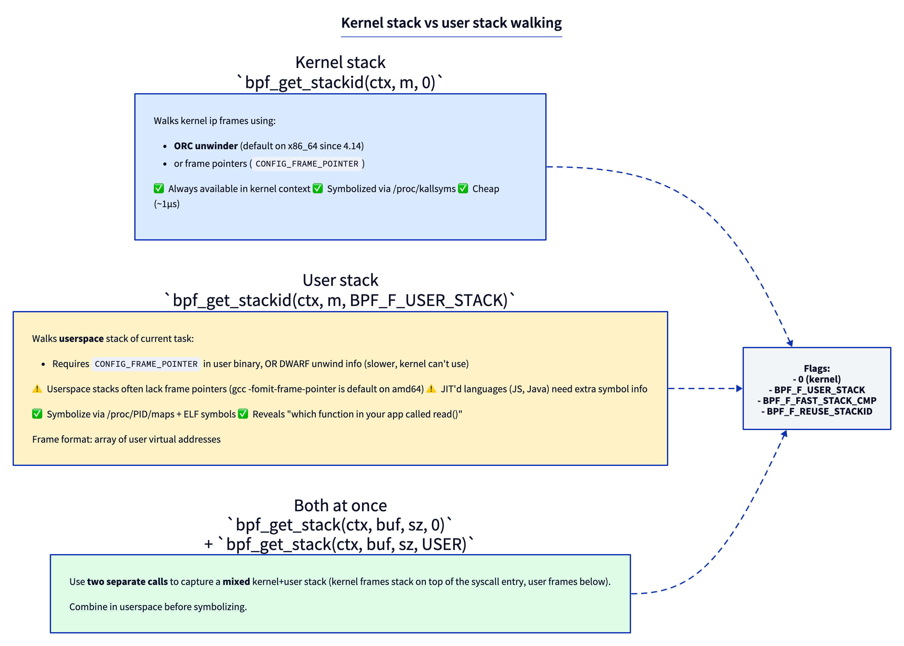
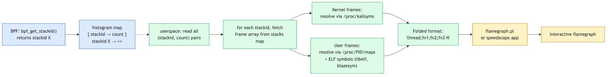

# Day 9 — Stack traces and the path to flame graphs

> **Today's mission:** capture the kernel call stack at every `vfs_read`, aggregate by unique stack, and produce data ready for a flame graph. Total time: ~90 minutes.

## Why stack traces matter

Counters tell you "this happened 1000 times." Stack traces tell you *who caused it*. Combined with rate aggregation, they reveal hotspots — which user code, through which kernel paths, accounts for the bulk of an event's occurrences.

This is how `perf top`, `bpftrace`, and most profiling tools work under the hood. By Day's end you'll know how to write your own.

## Meet `BPF_MAP_TYPE_STACK_TRACE`

A purpose-built map type. You don't store key/value pairs in it directly — you call `bpf_get_stackid(ctx, &stacks, flags)` and the kernel:
1. Walks the current stack.
2. Hashes the frame array into a 32-bit `stackid`.
3. Stores the frames keyed by `stackid` (deduplicated — same stack → same id).
4. Returns `stackid` to your program.

You then use `stackid` as a **key in a normal map** (e.g., a hash map of `stackid → count`) to aggregate.



The dedup matters: if 10 million events all happen with the same stack, you store the frame array *once* and count it 10 million times against one `stackid`. Memory is bounded by the number of *unique* stacks, not events.

## Kernel stack vs user stack

The flag argument to `bpf_get_stackid` (and its sibling `bpf_get_stack`) decides which stack you walk:



- **Default (flag=0):** kernel stack. Walked via the **ORC unwinder** on x86_64 (default since 4.14) or frame pointers. Always works in any tracing context.
- **`BPF_F_USER_STACK`:** userspace stack of the *current task*. Works only if the user binary was compiled with frame pointers, or if you have DWARF info (which the kernel can't unwind from BPF). Modern Linux distributions started building `-fno-omit-frame-pointer` by default around 2024 to make this useful again.
- **`BPF_F_FAST_STACK_CMP`:** hash-only comparison (faster, no full frame walk for dedup).
- **`BPF_F_REUSE_STACKID`:** allow stackid reuse across capture sessions.

To get a *combined* kernel+user stack, you call **`bpf_get_stack` twice** (not `bpf_get_stackid`) — once with each flag — and combine in userspace before symbolizing.

> ### There are no Dumb Questions
>
> **Q: How accurate are kernel stacks?**
>
> A: Very, in 99% of cases. The ORC unwinder is precise. Edge cases: in-flight kprobes that occur *during* function prologue/epilogue may produce off-by-one frames. Highly optimized leaf functions can be tail-called and not appear in the stack at all. For most tracing this is fine.
>
> **Q: Why doesn't user stack walking "just work" like the kernel side?**
>
> A: Userspace binaries on amd64 have been compiled with `-fomit-frame-pointer` for years (default in distros until ~2024). Without frame pointers, walking back through stack frames requires DWARF unwind info (`.eh_frame`) — which is expensive and the kernel can't process. Modern distros are reversing course (Fedora, Ubuntu now ship frame-pointer-enabled libc and friends), but legacy binaries lack the metadata.
>
> **Q: How do I symbolize JIT'd languages (Java, Node.js)?**
>
> A: They expose runtime symbol files. `perf-PID.map` is a text file in `/tmp` mapping JIT addresses to function names. JIT runtimes (HotSpot, V8) generate these. Your userspace symbolizer reads them alongside ELF tables.

> ### Sharpen your pencil
>
> You write a tracer that captures kernel + user stacks for every `vfs_read`. Your test workload is `cat /etc/passwd` from bash. Roughly how many unique `stackid` values do you expect?
>
> .  
> .  
> .
>
> **Answer:** A small handful. `cat`'s call to `read()` always traverses roughly the same userspace path (libc `read` wrapper → syscall instruction). Bash's `cat` invocation similarly goes through the same path. The kernel side is also stable: `entry_SYSCALL_64` → `do_syscall_64` → `__x64_sys_read` → `ksys_read` → `vfs_read`. Maybe 1–3 unique stacks total. Now run on a complex workload (Firefox loading a page) and you'll see hundreds — that's the dedup paying off.

## The end-to-end flame graph pipeline



Capture in BPF, aggregate by stackid, read in userspace, symbolize each frame, fold into the textual format flamegraph.pl expects:

```
thread_or_pid;fn1;fn2;fn3;fn4 1234
```

Then pipe through `flamegraph.pl` (Brendan Gregg's tool) or upload to `speedscope.app`.

---

## The lab

### `stacks.bpf.c`

```c
#include "vmlinux.h"
#include <bpf/bpf_helpers.h>
#include <bpf/bpf_tracing.h>

char LICENSE[] SEC("license") = "GPL";

#define MAX_STACK_DEPTH 64

struct {
    __uint(type, BPF_MAP_TYPE_STACK_TRACE);
    __uint(max_entries, 16384);
    __uint(key_size, sizeof(__u32));
    __uint(value_size, MAX_STACK_DEPTH * sizeof(__u64));
} stacks SEC(".maps");

struct {
    __uint(type, BPF_MAP_TYPE_HASH);
    __uint(max_entries, 16384);
    __type(key, __u64);     /* (kstack_id << 32) | ustack_id */
    __type(value, __u64);   /* count */
} counts SEC(".maps");

SEC("fentry/vfs_read")
int BPF_PROG(on_read)
{
    __s64 kid = bpf_get_stackid(ctx, &stacks, 0);
    __s64 uid = bpf_get_stackid(ctx, &stacks, BPF_F_USER_STACK);

    /* Negative return = failure to capture (returns a negative errno:
       -EFAULT/-EEXIST/-ENOMEM, e.g., user stack with no frame ptrs). */
    if (kid < 0 && uid < 0)
        return 0;

    __u64 key = ((__u64)(kid & 0xffffffff) << 32) | (uid & 0xffffffff);
    __u64 *c = bpf_map_lookup_elem(&counts, &key);
    if (c) {
        __sync_fetch_and_add(c, 1);
    } else {
        __u64 one = 1;
        bpf_map_update_elem(&counts, &key, &one, BPF_NOEXIST);
    }
    return 0;
}
```

### What's new

- **Two `bpf_get_stackid` calls** — one kernel, one user.
- **Negative return checks.** The helpers return a negative errno (-EFAULT/-EEXIST/-ENOMEM) on failure (e.g., user-stack walk hit a missing frame pointer, or the stack map slot was already taken).
- **Composite key**: pack both stackids into a u64 so identical (kernel, user) pairs share a counter.
- **Stack map sizing**: `MAX_STACK_DEPTH * sizeof(__u64)` is the per-stack value size; max_entries caps unique stacks.

### `stacks.c` — userspace dumper + symbolizer

Outline (you can use `blazesym` or write a minimal kallsyms parser):

```c
/* every 5s, dump top stacks by count: */
while (!exiting) {
    sleep(5);

    /* iterate counts map */
    __u64 key = 0, next;
    __u64 val;
    int cnt_fd = bpf_map__fd(skel->maps.counts);
    int stk_fd = bpf_map__fd(skel->maps.stacks);

    while (bpf_map_get_next_key(cnt_fd, &key, &next) == 0) {
        bpf_map_lookup_elem(cnt_fd, &next, &val);
        __u32 kid = next >> 32, uid = next & 0xffffffff;

        __u64 kframes[64] = {0}, uframes[64] = {0};
        bpf_map_lookup_elem(stk_fd, &kid, kframes);
        bpf_map_lookup_elem(stk_fd, &uid, uframes);

        /* Print folded: stack;...; count */
        printf("[count=%llu]\n", val);
        for (int i = 0; i < 64 && kframes[i]; i++)
            printf("  K %llx\n", kframes[i]);
        for (int i = 0; i < 64 && uframes[i]; i++)
            printf("  U %llx\n", uframes[i]);
        printf("\n");

        key = next;
    }
}
```

For real symbolization, link against `libblazesym` (modern, fast) or write a `kallsyms` parser. We won't write one today — Day 9 is about *capturing* the data; symbolization is plumbing.

### Run it

```bash
make
sudo ./stacks &        # job %1; prints a dump every 5s
# Generate work, then wait for the next 5-second dump to see it:
find /usr -name "*.so" > /dev/null
cat /etc/passwd > /dev/null
sleep 5
```

Output is interval-driven — nothing prints until the next 5-second tick. When you're done, stop the background dumper (otherwise it keeps printing as root forever):

```bash
kill %1        # or: sudo pkill stacks
```

You'll see frames printed as raw hex (`K <addr>` / `U <addr>`). Resolving them by hand is fiddly — two real pitfalls:

- **Kernel frames.** Don't `cat /proc/kallsyms | grep <addr>` as a normal user: with the default `kptr_restrict=1` every address reads back as `0000000000000000`, so you'd grep zeros and find nothing. You must read it as root. Worse, the captured value is a *return address inside* a function, but kallsyms lists only symbol *start* addresses, so an exact grep almost never matches. Find the nearest preceding symbol instead (note kallsyms is **not** address-sorted, so sort it first):

  ```bash
  # ADDR is one of the K <addr> values, e.g. ffffffff9a0ea100
  sudo sort /proc/kallsyms | awk -v a=ADDR '$1 <= a {s=$0} END {print s}'
  # ffffffff9a0ea0e0 T vfs_read
  ```

- **User frames.** `addr2line` needs the target object *and a file offset*, not the runtime virtual address. For a frame at runtime address `A` in object `/path/bin` loaded at base `B` (the left column of the matching line in `/proc/PID/maps`), run `addr2line -f -e /path/bin $((A-B))`. The base subtraction is **mandatory** for PIE executables and all shared libraries (e.g. libc); only for a non-PIE `ET_EXEC` can you pass `A` directly. A bare `addr2line <addr>` just prints `??:0`.

This hand-resolution is exactly the plumbing `libblazesym` / `bpftool` automate for you — which is why we deferred symbolization above.

### Pipe to a flame graph

Get `flamegraph.pl` once (it isn't packaged on any distro — grab it from Brendan Gregg's repo):

```bash
git clone https://github.com/brendangregg/FlameGraph
export PATH="$PATH:$PWD/FlameGraph"
```

Then:

```bash
sudo ./stacks --folded > out.folded
flamegraph.pl < out.folded > out.svg
# Open out.svg in any browser. On a headless box, copy it to your laptop,
# or just drag out.folded onto https://speedscope.app (no local browser needed).
# firefox out.svg   # only if you actually have a desktop browser
```

`--folded` is **required reader work** — the lab's `stacks.c` only prints the `%llx` debug dump above. You need to parse `argv`, symbolize each frame, and emit one line per unique stack in *root-to-leaf* order (process at the base, leaf on top), with the count last. Building on the loop at lines 158–161, that's roughly:

```c
printf("%s", comm);                       /* process name at the base */
for (int i = u_n - 1; i >= 0; i--)        /* user frames, outermost first */
    printf(";%s", sym_user(uframes[i]));
for (int i = k_n - 1; i >= 0; i--)        /* then kernel frames */
    printf(";%s", sym_kernel(kframes[i]));
printf(" %llu\n", val);                   /* count */
```

A correct folded line for the `cat /etc/passwd` workload looks like this — the same kernel path from the Sharpen-your-pencil answer, leaf (`vfs_read`) on top:

```
cat;__libc_read;entry_SYSCALL_64;do_syscall_64;__x64_sys_read;ksys_read;vfs_read 137
```

In the resulting SVG: the wide base is the common process / syscall-entry frames shared by every sample, narrow towers are the divergent call paths, each frame's width is proportional to its count, and `vfs_read` sits near the top of every tower (it's the function you traced).

---

## What to break, in order

### Break 1 — Stack walk failure on `BPF_F_USER_STACK`

If your binary has frame-pointer-omitted libraries (most older distros), you'll see `uid < 0` for many calls. Workaround: trace `fentry` of a userspace-heavy function in a frame-pointer-enabled binary. Or, on Fedora/Ubuntu 24+, modern libc *has* frame pointers and user stacks resolve.

To debug, check `bpf_get_stackid`'s return value directly: the program already guards on `uid < 0` (lines 106–112), and that negative value is the errno explaining the failed user-stack walk. `bpftool prog tracelog` is empty by default here — this lab emits nothing to the trace pipe — so to use it you must add a printk on the failure path, e.g. in `on_read`:

```c
if (uid < 0)
    bpf_printk("user-stack walk failed: uid=%lld\n", uid);
```

Then watch `sudo bpftool prog tracelog` (or `sudo cat /sys/kernel/debug/tracing/trace_pipe`) to see the negative errno fire when a frame-pointer-omitted library breaks the walk.

### Break 2 — Forgetting `MAX_STACK_DEPTH`

Set `value_size` too small (`16 * sizeof(__u64)`). Stacks deeper than 16 frames get truncated. You'll see plausible-looking but incomplete stacks. Default to 64 unless you have a reason to be smaller.

### Break 3 — Use `bpf_get_stack` instead of `bpf_get_stackid`

```c
__u64 frames[64];
int n = bpf_get_stack(ctx, frames, sizeof(frames), 0);
```

This copies frames *directly into* a buffer you provide instead of going through the dedup map. Useful when you're emitting one stack per event (e.g., to a ringbuf) rather than aggregating. Trade: more memory traffic, no dedup; but you have the frames immediately without a second map lookup.

### Break 4 — Increase stack rate, fill the map

Trace a high-rate event like `tcp_recvmsg` on a busy server. With many unique stacks, you'll fill `max_entries=16384`. When a new stack hashes to a slot already holding a *different* stack, `bpf_get_stackid` returns `-EEXIST` and the new stack is dropped — so genuinely new stacks are silently lost. Pass `BPF_F_REUSE_STACKID` and the behavior flips: the occupied slot is overwritten instead, so you keep the newest stack but lose the old one (and any counts keyed on the old stackid now point at the wrong frames).

Lesson: size `stacks` and `counts` to expected unique-stack cardinality. For most production servers, 16K–64K is fine. Profilers often go to 1M.

---

## What to read in the kernel

- **`kernel/bpf/stackmap.c`** — the implementation. `stack_map_alloc` builds the map's own structure (a `buckets[]` array plus a per-CPU freelist of stack buffers — *not* the generic `htab_map_alloc`), and `bpf_get_stackid` is the helper. Read the file once; ~500 lines.
- **`arch/x86/kernel/unwind_orc.c`** — the ORC unwinder x86_64 uses. Don't read deeply; just know it exists and is faster/more reliable than frame pointers.
- **`kernel/bpf/helpers.c`** — search `bpf_get_stack`. The non-stackid version that copies frames directly.
- **`tools/lib/bpf/btf.c` and `tools/perf/util/symbol.c`** — for inspiration on symbolization. The selftests don't have a clean example.
- **`tools/testing/selftests/bpf/progs/test_stacktrace_map.c`** — minimal example of the pattern.

External reference (skim once): https://www.brendangregg.com/flamegraphs.html

---

## Bullet Points

- **`BPF_MAP_TYPE_STACK_TRACE`** stores frame arrays keyed by hash; same stack → same `stackid`. Memory bounded by unique stacks.
- **`bpf_get_stackid(ctx, &stacks, flags)`** captures the current stack and returns a stackid. Use it as a key in another map for aggregation.
- **`BPF_F_USER_STACK`** flag walks the userspace stack — only works if frame pointers exist (modern distros increasingly ship them).
- **Two calls** for combined kernel+user stack, then combine in userspace.
- **`bpf_get_stack`** (no -id) copies frames directly to a buffer — preferred for per-event emission, not aggregation.
- Symbolization happens in **userspace**, not BPF. Read `/proc/kallsyms` for kernel, ELF + `/proc/PID/maps` for user, JIT-runtime files for managed languages.
- **Flame graph format**: `thread;fn1;fn2;fn3 count` per line; `flamegraph.pl` produces interactive SVG.

---

## Check question

Two CPUs simultaneously call `bpf_get_stackid` with identical stacks. Do they get the same stackid? Same map slot? Race?

<details>
<summary>Click to reveal answer</summary>

**Answer:** They get the same stackid (the hash of the frames is the same). They both target the same map slot. The kernel uses bucket-level locking inside the stack map — one CPU's insert wins; the other sees the existing entry and returns the same stackid without re-inserting. No race observable from BPF. The dedup is the whole point of this map type.

</details>

---

## Tomorrow

Day 10: uprobes. Tracing functions in userspace binaries from BPF. We'll attach to `bash`'s `readline()` and see every command typed.
