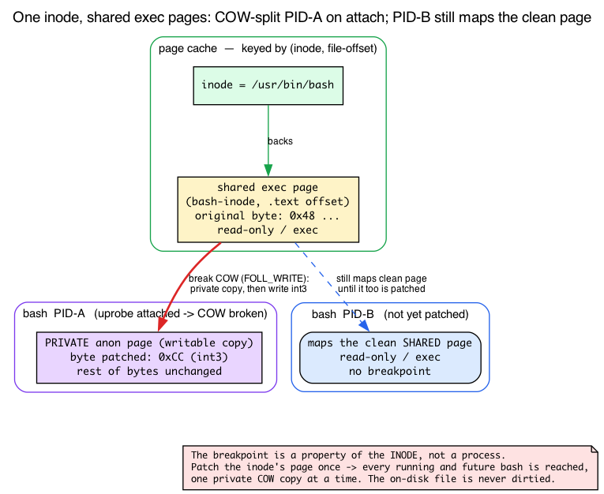
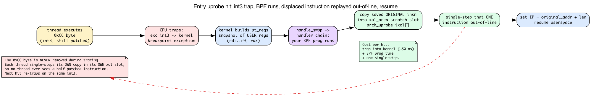
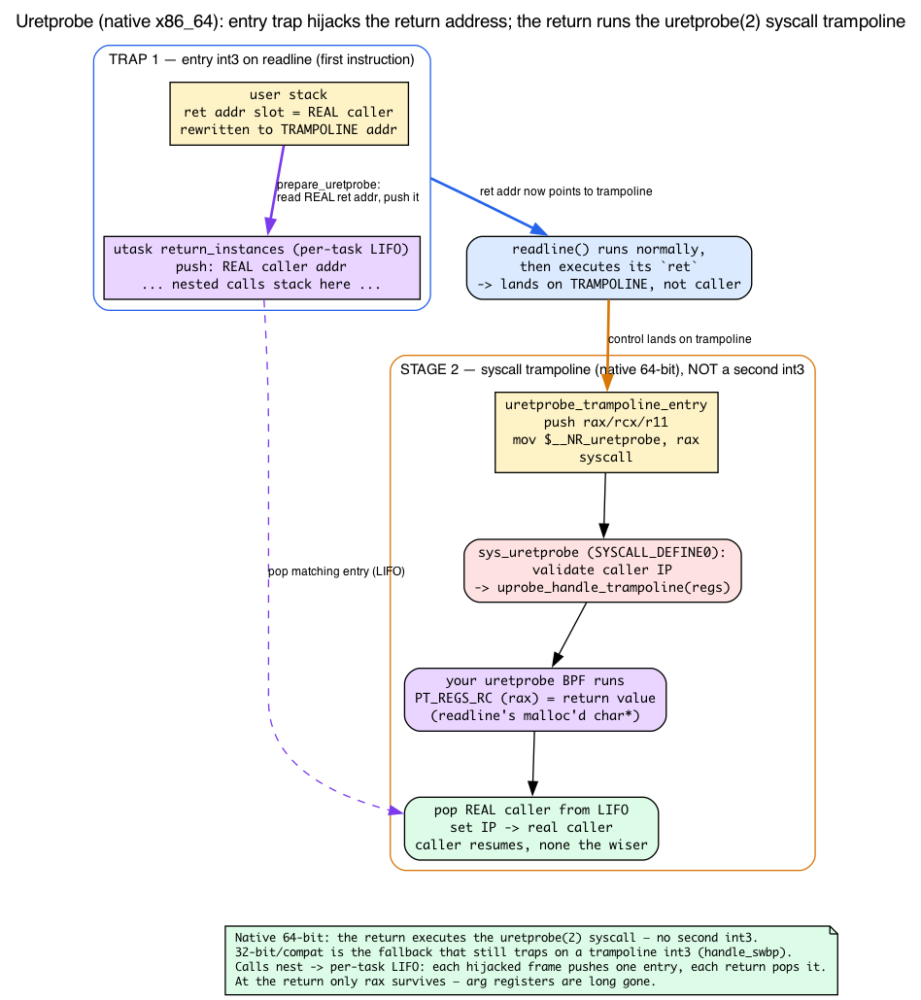

# Day 10 — Uprobes: tracing userspace from BPF

> **Today's mission:** trace a function in a userspace binary. Watch every command typed into bash by hooking `readline()`. But first, understand the genuinely new machinery underneath: how an executable actually lives in memory, how the kernel patches a *userspace* instruction without corrupting it, and how it regains control when a function *returns*. Total time: ~110 minutes.

## The other half of "what's running on this machine"

Days 6–9 traced *kernel* functions. But your applications are mostly userspace — and many interesting events happen entirely in user code without touching syscalls (think: `malloc`, `g_object_unref`, `PQexec`, JIT compilation events).

**Uprobes** let BPF programs attach to userspace functions. The kernel patches the target binary's executable pages with breakpoints; when any process executing that binary reaches the patched instruction, the trap fires and your BPF program runs.

It's like kprobe — but the target is a function in `/usr/bin/bash`, `/usr/lib/libssl.so.3`, or your own `myapp` rather than `vfs_read`.

Here's the thing the tutorials skip, though: tracing *userspace* code from the kernel is a genuinely different mechanism than the kernel-function patching you met earlier in the series. The closest kernel sibling is **Day 7's kprobe** — the `int3`-trap path, *not* Day 1's `fentry` (which patches a NOP→trampoline slot with no runtime trap). Three pieces of background make the difference, and the rest of today only makes sense once you have them:

1. **How an executable lives in memory** — it isn't copied into RAM; it's `mmap`'d from a file, and its pages are *shared* across every process running it. This is why one uprobe registration covers every bash on the system.
2. **How the kernel patches a *userspace* instruction safely** — it can't just overwrite a shared, read-only, on-disk-backed page. It uses copy-on-write to get a private copy, writes a 1-byte `int3` trap, and replays the displaced instruction out-of-line.
3. **How the kernel regains control when a function *returns*** — there's no fixed instruction at a return site to patch, so it hijacks the return address. This is the whole trick behind uretprobes, which today's lab depends on.

We'll teach each *as we hit the part of the lab that depends on it.* Day 7's kprobe used the same `int3`-trap primitive on *kernel* text in one shared address space; everything below is the userspace counterpart, and it is meaningfully different.

## How an executable lives in memory: file-backed mmap, the page cache, and COW

Before we can patch a userspace instruction, we have to know where that instruction physically *is*. The intuition most people carry — "the program got loaded into RAM" — is wrong in a way that matters today.

**A binary is not copied into RAM wholesale.** When you run `/usr/bin/bash`, the loader does not slurp the file into memory. It `mmap()`s the file: it creates a *file-backed mapping* that says "this range of virtual addresses corresponds to these byte-offsets of this file." The actual bytes are pulled in lazily, one page at a time, the first time the CPU touches them.

Where do those pages live? In the **page cache** — the kernel's single, shared cache of file contents. A page of file data is keyed by **(inode, file-offset)**: the inode identifies *which file*, the offset identifies *which 4 KB chunk of it*. (Recall the page from Day 1: physical RAM is handed out in `PAGE_SIZE` = 4 KB frames.) The crucial property:

**Every process running the same binary maps the *same* physical pages.** Two `bash` processes don't each get their own copy of bash's executable code. They both map the page-cache pages for `(bash's inode, offset of .text)`, read-only and executable. One copy of the code in RAM, shared by all of them, plus the on-disk file backing it.

That shared page cache is *exactly* why a uprobe is system-wide. The breakpoint isn't a property of a process — it's a property of the **inode**. Because the probe is keyed to `(bash-inode, readline's offset)`, the kernel walks every process (and every future `mmap`) that maps this inode and patches each one. It does *not* write once into the shared page-cache page to reach everybody — that would dirty a shared, file-backed page (exactly what the COW section below says it must avoid). The system-wide reach comes from the inode key plus the walk over all mappings, not from one shared write.



You can see the inode-identity in the kernel's own data structure. A uprobe is identified by an inode pointer and a file offset — not a virtual address:

```c
/* kernel/events/uprobes.c:62 — struct uprobe */
struct inode *inode;   /* the file the probe lives in (line ~69) */
loff_t        offset;  /* file-offset of the patched instruction (line ~74) */
```

And `uprobe_register` *refuses* a target that isn't file-backed — there'd be no page cache to read the original instruction from:

```c
/* kernel/events/uprobes.c:1402 */
/* copy_insn() uses read_mapping_page() or shmem_read_mapping_page() */
if (!inode->i_mapping->a_ops->read_folio &&
    !shmem_mapping(inode->i_mapping))
    return ERR_PTR(-EIO);
```

To remember the instruction it's about to overwrite (so it can restore it on detach), the kernel reads the *original* byte straight out of the page cache, by offset:

```c
/* kernel/events/uprobes.c:1058, inside __copy_insn() */
page = read_mapping_page(mapping, offset >> PAGE_SHIFT, filp);
```

`offset >> PAGE_SHIFT` is "which page of the file"; `read_mapping_page` pulls that page-cache page (`__copy_insn` at `:1048`, `copy_insn` at `:1070`).

### Patching a shared page without corrupting it: copy-on-write

Now the problem. The page we want to patch is **shared read-only across every process *and* backed by the on-disk file.** If the kernel just wrote `0xCC` into it, it would (a) hit every process at once with no control, and (b) risk dirtying a file-backed page. That's not what we want — we want to patch *one* process's view at a time.

The fix is **copy-on-write (COW)**. COW is the trick that lets many mappings share one physical page until someone writes: at the moment of a write, the writer gets its *own private writable copy* of just that page, and everyone else keeps the original. The kernel forces that break deliberately before patching:

```c
/* kernel/events/uprobes.c:518 — in uprobe_write() */
/*
 * When registering, we have to break COW to get an exclusive anonymous
 * page that we can safely modify. Use FOLL_WRITE to trigger a write
 * fault if required. ...
 */
if (is_register)
    gup_flags |= FOLL_WRITE | FOLL_SPLIT_PMD;   /* :526 */
```

It then verifies the page it got is a private anonymous folio before writing into it (the `folio_test_anon` check at `:552`). So the sequence per process is: break COW → the target process now has a *private, writable, anonymous copy* of that one page → write the `int3` there. Other processes keep faulting on the clean shared page until they're patched too.

**This is what "COW protects other mappings" means, concretely.** Day 7's kprobe `int3`-poked *kernel* code: one address space, one copy, patched in place. Here the target is per-process *userspace* memory reached through a file-backed mapping, so the kernel must privately fork the page first. Genuinely different machinery.

## The int3 trap and replaying the clobbered instruction

We've patched a byte. Two questions remain, and the second is the one every tutorial glosses over.

**What byte, and what does it do?** On x86_64 the breakpoint is a 1-byte instruction, `0xCC` (`int3`), which raises the breakpoint exception:

```c
/* arch/x86/include/asm/uprobes.h:20 */
#define UPROBE_SWBP_INSN      0xcc
#define UPROBE_SWBP_INSN_SIZE 1
```

`set_swbp` writes it; `set_orig_insn` restores it on detach — both go through the same `uprobe_write_opcode` / COW path above:

```c
/* kernel/events/uprobes.c:612 */
int set_swbp(...)      { return uprobe_write_opcode(..., UPROBE_SWBP_INSN, true); }
/* kernel/events/uprobes.c:627 */
int set_orig_insn(...) { return uprobe_write_opcode(..., *(uprobe_opcode_t *)&auprobe->insn, false); }
```

When a thread executes that byte, the CPU traps into the kernel's `int3` exception entry (`DEFINE_IDTENTRY_RAW(exc_int3)` at `arch/x86/kernel/traps.c:1004`), which notifies the uprobe layer (`uprobe_pre_sstep_notifier` at `kernel/events/uprobes.c:2871`). The dispatcher `handle_swbp` (`uprobes.c:2712`) looks up the active uprobe by faulting address (`find_active_uprobe_rcu`, `:2724`) and runs your BPF program via `handler_chain` (`:2549`, the consumer's handler is invoked at `:2549–2566`). The trap builds a `pt_regs` snapshot of the user registers — **the same `pt_regs` you read with `PT_REGS_PARM*` on Day 7** — and hands it to your program.

**Now the puzzle nobody explains.** The original instruction is *gone* — you overwrote its first byte with `0xCC`. After your BPF program runs, how does the thread execute the instruction it was supposed to, and continue?

The answer is **execute-out-of-line (XOL)**. The kernel never removes the `int3` during tracing; instead it keeps the saved original instruction and replays it elsewhere:

1. At first hit, the kernel allocates a per-process executable scratch page — the **`xol_area`** (`struct xol_area` at `kernel/events/uprobes.c:109`).
2. It copies the saved original instruction (arch-fixed-up if needed) into a slot there (`xol_get_insn_slot` at `:1871`; the bytes live in `arch_uprobe.ixol[]`, `arch/x86/include/asm/uprobes.h:33`).
3. It points the user instruction pointer at that slot, **single-steps that one instruction**, then the arch post-XOL handler relocates the IP back into the original code stream — `default_post_xol_op` applies `regs->ip += utask->vaddr - utask->xol_vaddr` (`arch/x86/kernel/uprobes.c:1240`), landing right *after* the original instruction.

The `0xCC` byte stays patched in the shared/COW page the whole time. So one uprobe hit costs: **trap into the kernel (~50 ns)** + your BPF program's time + **a single-step of the displaced instruction.** Detach reverses everything — `set_orig_insn` writes the saved original byte back over the `int3`.

Why doesn't this corrupt other threads? Because the `int3` is never removed while tracing. Threads serialize through the trap; each one single-steps *its own copy* of the instruction in *its own* xol slot. No thread ever sees a half-patched instruction.



Tie it back to **Day 7's kprobe**: same `int3`-trap primitive — overwrite the first byte, trap into the kernel, run your program. The difference is recovery: a kprobe single-steps the original instruction in place; a uprobe replays it out-of-line in a *per-process* XOL slot because the target is shared, file-backed userspace memory. (Day 1's `fentry` is a different mechanism — a NOP→trampoline patch with no runtime trap.)

> ### There are no Dumb Questions
>
> **Q: Does my uprobe affect other processes running the same binary?**
>
> A: Yes — by design. The breakpoint is per-binary-inode, not per-process (that's the whole point of the page-cache section above: the patch is keyed to the inode, and every process maps the same inode's pages). If you uprobe `/usr/bin/bash:readline`, every running bash and every future bash gets the breakpoint until you detach. This is what lets you do system-wide observability without restarting workloads.
>
> **Q: What if the target process exits while I'm attached?**
>
> A: Nothing breaks. The uprobe remains registered against the inode. New invocations get hooked. Old processes that exited just disappear. The uprobe lives until you detach (close the link FD).
>
> **Q: Can I uprobe a function in a JIT-compiled language (e.g., Java methods, V8 functions)?**
>
> A: Not with regular uprobes — those addresses don't exist at attach time; they're generated at runtime. The runtime would need to expose USDT probes (we'll see those below) or generate `perf-PID.map` files for symbolization. For Java, the JVM can be configured to emit USDT events; tools like async-profiler use this.

## Catching a *return*: return-address hijack and the trampoline

Everything above describes an **entry** uprobe: trap on a fixed instruction. But today's lab hooks the *return* of `readline()` — because the line the user typed is `readline`'s *return value*, not an argument. And a return is a problem: there is no single fixed instruction at the return site to patch. A function can be called from a hundred places and `ret` to a hundred different addresses.

The kernel solves this with **return-address hijacking.** When the *entry* breakpoint fires for a function you've uretprobed, the kernel:

1. Reads the real return address off the user stack.
2. Saves it on a per-task stack of pending returns.
3. Overwrites the stack's return-address slot with the address of a kernel-installed userspace **trampoline** (`prepare_uretprobe` at `kernel/events/uprobes.c:2252`; trampoline address from `uprobe_get_trampoline_vaddr` at `:2223`).

When the function later runs its normal `ret`, control lands on the trampoline. On the pinned v7.1 kernel, for a **native 64-bit process** (the lab traces native x86_64 bash) the trampoline is *not* a breakpoint — `arch_uretprobe_trampoline()` (`arch/x86/kernel/uprobes.c:349`) hands back a short **syscall sequence** for `user_64bit_mode(regs)`:

```asm
/* arch/x86/kernel/uprobes.c:320–343 — uretprobe_trampoline_entry */
push %rax
push %rcx
push %r11
mov  $__NR_uretprobe, %rax
syscall
/* uretprobe_syscall_check: pop %r11; pop %rcx; ret; int3 */
```

So when `readline` returns into the trampoline, it executes the `uretprobe(2)` syscall rather than trapping on an `int3`. `SYSCALL_DEFINE0(uretprobe)` (`uprobes.c:372`) validates the caller IP, then calls `uprobe_handle_trampoline(regs)` (`uprobes.c:401`; generic side at `kernel/events/uprobes.c:2635`) — that's where your uretprobe consumers run and the real return address is restored.

The older **int3 trampoline** is still in the tree, but it's now the *fallback* for 32-bit/compat processes (the asm even notes "the compat process still uses standard breakpoint"; the trailing `int3` after `ret` is just a guard). On that path, `handle_swbp` recognizes the trampoline address specially:

```c
/* kernel/events/uprobes.c:2718, in handle_swbp() — compat/fallback path */
if (bp_vaddr == uprobe_get_trampoline_vaddr())
    return uprobe_handle_trampoline(regs);
```

At that point your uretprobe BPF program runs, **`PT_REGS_RC` holds the return value** (for `readline`, the malloc'd `char *` the user typed), and the kernel restores the saved real return address so the caller resumes none the wiser.

Because calls nest, the kernel keeps a **per-task LIFO stack** of pending returns — `utask->return_instances` (walked at `uprobes.c:2019`, `:2062`; pushed at `:2307`). Each hijacked frame pushes one entry; each return pops the matching one in last-in-first-out order. That's why a uretprobe fires correctly through deep recursion and many stack frames.



This is also *why* the lab declares the return value as the "first parameter" (more below): at the return trap there are no argument registers left to read — the arguments are long gone — only the return register survives. It's the exact analogue of the kretprobe `PT_REGS_RC` you met on Days 6–7.

## Where to attach: ELF anatomy

Your target binary is an ELF file. To attach by *name*, libbpf has to turn `binary:symbol` into the **file offset** the kernel registers against the inode. That resolution runs through the binary's symbol tables — and you need to know there are *two* of them, because today's Break 2 depends on the difference.


An ELF file can carry two symbol tables:

- **`.symtab`** — the *full* symbol table: every function, including local/static helpers. This is what `strip` deletes to shrink a binary. A stripped `/bin/bash` has an empty `.symtab`.
- **`.dynsym`** — the *dynamic* symbol table: only the symbols needed for dynamic linking (a shared library's exported functions, a binary's imported symbols). It **survives stripping**, because the dynamic loader needs it at runtime to wire up shared libraries.

libbpf searches `.dynsym` first, then `.symtab` — and the source spells out exactly why that order, and why a missing section is normal rather than an error:

```c
/* tools/lib/bpf/elf.c:278 */
int i, sh_types[2] = { SHT_DYNSYM, SHT_SYMTAB };
/* ...:306 — comment:
 * Search SHT_DYNSYM, SHT_SYMTAB for symbol. This search order is used because
 * if a binary is stripped, it may only have SHT_DYNSYM, and a fully-statically
 * linked binary may not have SHT_DYNSYM, so absence of a section should not be
 * reported as a warning/error.
 */
```

So the common path is just: write `SEC("uprobe//path/to/binary:symbol_name")`. libbpf opens the ELF (`bpf_program__attach_uprobe` at `tools/lib/bpf/libbpf.c:12966` → `elf_find_func_offset_from_file` at `:12817` → `elf_find_func_offset` at `elf.c:277`), finds the symbol, and computes its **file offset** from the symbol's value and the ELF program-header layout. What the kernel ultimately registers is `(inode, offset)` — the offset must be page-alignable and within the file size (`uprobe_register` checks at `kernel/events/uprobes.c:1407–1413`).


A subtlety worth holding onto for Break 2: the symbol's *recorded value* is a virtual address, and the *file offset* libbpf needs are not always identical. For the common executable code segment they usually coincide, which is why the `nm -D` value can be handed to the kernel directly below. When a symbol exists in *neither* table (a private static in a stripped binary), you fall back to supplying the file offset yourself:

```c
SEC("uprobe//usr/bin/stripped_app:0x1234")
```

Tools map onto the tables directly: `nm -D` / `objdump -T` read `.dynsym`; `objdump -t` reads `.symtab` (empty on a stripped `/bin/bash`); `objdump -d` disassembles so you can eyeball an offset when no symbol exists at all.

## Argument access in uprobes

This is prerequisite knowledge you already have. Recall from **Day 7**: for a trap-based probe the ctx is a `struct pt_regs *` register snapshot, and `BPF_KPROBE`/`BPF_KRETPROBE` expand `PT_REGS_PARM1..6` to the System V AMD64 argument registers (`rdi, rsi, rdx, rcx, r8, r9`), with `PT_REGS_RC` = `rax` for the return value (the macros live in `tools/lib/bpf/bpf_tracing.h`; Day 7 verified `PT_REGS_PARM1` maps to `di`).

The only uprobe-specific twist: **these macros work unchanged for userspace targets**, because the `int3` trap snapshots the *user* registers into the very same `pt_regs` shape. So: same as kprobes — args in `rdi…r9`, return in `rax`.

For string arguments, you need `bpf_probe_read_user_str` (not `_kernel`):

```c
char buf[64];
bpf_probe_read_user_str(buf, sizeof(buf), (void *)PT_REGS_PARM1(ctx));
```

The "_user" variant tells the kernel "this address is in *userspace*; use `copy_from_user` semantics, not direct deref." Misusing `_kernel` on a user pointer doesn't crash: the kernel-nofault helper checks the address *range* first and rejects a userspace pointer up front (on x86, `copy_from_kernel_nofault_allowed` returns false for `addr < TASK_SIZE_MAX`, so `strncpy_from_kernel_nofault` returns `-ERANGE` — an address-range rejection, not an actual page fault), and `bpf_probe_read_kernel_str` then zeroes the destination buffer on the negative return.

## USDT: probes built into binaries

What if your application *wants* to be observable? Some major libraries (libc, libpthread, postgres, mysql, openssh) ship with **USDT probes** — *user-space statically defined tracing*. These are nop instructions placed by the developer at points of interest, accompanied by ELF metadata describing the arguments.


You attach with `SEC("usdt//path:provider:probe")`. libbpf reads the `.note.stapsdt` ELF section, finds the matching provider+probe, locates the nop offset, and installs a regular uprobe there.

Discover USDTs with:

```bash
sudo bpftrace -l 'usdt:/usr/lib/x86_64-linux-gnu/libc.so.6:*'
```

libc's USDTs include `lll_lock_wait`, `lll_lock_wait_private`, `setjmp`, `longjmp`. Postgres has `query__start`, `query__done`. They're a stable contract from the application.

> ### Sharpen your pencil
>
> Bash is a single-process per terminal session. You uprobe `readline` and observe nothing — but you're definitely typing in another terminal. What's wrong?
>
> .  
> .  
> .
>
> **Answer:** likely one of: (a) bash version mismatch — the bash on disk and the bash running might differ if you're inside a shell started before a system upgrade. Restart your shell. (b) bash's `readline` may be statically linked or in `libreadline.so.8` rather than the bash binary itself — `nm /usr/bin/bash | grep readline` to confirm. If empty, attach to libreadline instead. (c) PATH issue — `which bash` gives one path; the running shell may have started from a different one (e.g., `/bin/bash` symlink resolution).

---

## The lab

### `bashspy.bpf.c`

The output channel is a **ringbuf** — recall it from Day 1: a kernel→userspace MPSC channel where you `reserve` a slot, fill it, and `submit` (zero-copy), and a single userspace consumer drains it via a callback. Nothing uprobe-specific; just the same pattern.

```c
#include "vmlinux.h"
#include <bpf/bpf_helpers.h>
#include <bpf/bpf_tracing.h>

char LICENSE[] SEC("license") = "GPL";

#define MAX_LINE 256

struct event {
    __u32 pid;
    char comm[16];
    char line[MAX_LINE];
};

struct {
    __uint(type, BPF_MAP_TYPE_RINGBUF);
    __uint(max_entries, 256 * 1024);
} rb SEC(".maps");

/* Track the prompt arg per TID so we can read the result on return.
 * For readline, the *return value* is what the user typed —
 * a malloc'd char* the caller frees.
 */

SEC("uretprobe//bin/bash:readline")
int BPF_KRETPROBE(on_readline_ret, const char *line)
{
    if (!line) return 0;

    struct event *e = bpf_ringbuf_reserve(&rb, sizeof(*e), 0);
    if (!e) return 0;

    e->pid = bpf_get_current_pid_tgid() >> 32;
    bpf_get_current_comm(&e->comm, sizeof(e->comm));
    bpf_probe_read_user_str(&e->line, sizeof(e->line), line);

    bpf_ringbuf_submit(e, 0);
    return 0;
}
```

### What's new

- **`SEC("uretprobe//bin/bash:readline")`** — uretprobe (return) on bash's readline. The kernel will hijack `readline`'s return address on entry and regain control at the trampoline, as the return section described. Adjust the path to your bash (`which bash`).
- **`BPF_KRETPROBE(on_readline_ret, const char *line)`** — for uretprobe, the first declared parameter after the function name is the **return value**, not an argument. (This is exactly why: at the return trap only `PT_REGS_RC`/`rax` survives — the argument registers are long gone.) Same as kretprobe.
- **`bpf_probe_read_user_str`** — *_user_*, not *_kernel_*. The pointer is in user memory.
- **`(const char *)` cast** in the parameter declaration — the macro will treat the return value as that type for size determination.

### `bashspy.c` — userspace consumer

```c
static int handle(void *ctx, void *data, size_t sz) {
    struct event *e = data;
    printf("[bash %u (%s)] %s\n", e->pid, e->comm, e->line);
    return 0;
}
```

### Run

```bash
make
sudo ./bashspy &

# In another terminal, start a bash and type:
bash
echo hello
ls /tmp
```

Expected:

```
[bash 4001 (bash)] echo hello
[bash 4001 (bash)] ls /tmp
```

Don't worry if your run doesn't match this block line-for-line. The probe is **system-wide**, so you'll also see the `bash` line you typed to launch the inner shell (the outer shell's readline fired under a different PID), plus anything typed in any other interactive bash on the box. The PID will differ from `4001` — it's arbitrary. And only *interactive, readline-edited* lines appear: commands fed via a script or a pipe never touch readline, so they won't show up. Extra or missing lines here are normal, not a sign of a broken attach.

When you're done, stop the spy and leave the test shell: run `sudo kill %1` (or `sudo pkill -f bashspy`) in the first terminal to detach the uprobe, and `exit` the bash you spawned in the second terminal. Leaving `bashspy` running keeps the `int3` breakpoint patched into every bash on the system — and an orphaned root daemon hanging around.

You're now spying on every command typed into every bash on the system. **For your own systems, treat this as a powerful debugging tool. For other people's systems, this is the kind of thing that requires authorization.**

---

## What to break, in order

### Break 1 — Path mismatch

```c
SEC("uprobe//bin/bash:readline")
```

If your bash is at `/usr/bin/bash` (not `/bin/bash`), libbpf fails to attach:

```
libbpf: prog 'on_readline_ret': failed to attach: -ENOENT
```

The path has to resolve to the *right inode* — remember, the uprobe is registered against `(inode, offset)`, so a wrong path means a wrong (or nonexistent) inode and the registration never happens. Fix: `which bash` and use the full path.

### Break 2 — Stripped binary, missing symbol

Try a symbol that doesn't exist in the table:

```c
SEC("uprobe//bin/bash:internal_static_helper")
```

Resolution fails — libbpf can't find `internal_static_helper` in `.dynsym` *or* `.symtab`. The job libbpf normally does for you is: search both symbol tables (dynsym first), look up the name, compute the file offset. When the name is gone (the binary is stripped, or the symbol is a private static that was never in `.dynsym`), you supply the offset yourself.

To see the fallback work, pick a symbol that *does* exist and grab its offset. `/bin/bash` is usually stripped of its `.symtab`, so `objdump -t` is empty — use the **dynamic** symbol table (`.dynsym`, which survives stripping) instead:

```bash
nm -D /bin/bash | grep -w readline
# 0000000000105e20 T readline
```

(`objdump -T /bin/bash | grep -w readline` shows the same thing — both read `.dynsym`.) That recorded value is a virtual address; for bash's code segment it coincides with the file offset, so you can hand it to the kernel directly:

```c
SEC("uprobe//bin/bash:0x105e20")
```

libbpf could have resolved `readline` by name — the offset form is exactly what you fall back to when the name *isn't* available. (This `0x105e20` is bash-version-specific; always re-read it with `nm -D` for *your* binary rather than copying it verbatim.)

### Break 3 — Use kernel-side `_kernel_str` on a user pointer

```c
bpf_probe_read_kernel_str(&e->line, sizeof(e->line), line);  /* WRONG */
```

The helper returns negative and the destination is zeroed. On x86 the kernel-nofault path doesn't even fault: `copy_from_kernel_nofault_allowed` rejects a userspace address by range (`addr < TASK_SIZE_MAX`), so `strncpy_from_kernel_nofault` returns `-ERANGE` and `bpf_probe_read_kernel_str` zeroes the buffer. Always `_user` for uprobe-derived pointers.

### Break 4 — Convert uretprobe to uprobe

```c
SEC("uprobe//bin/bash:readline")
int BPF_KPROBE(on_call, const char *prompt)
{
    /* prompt is the *argument* — what bash is asking */
}
```

Now you're at *entry*, not return — a single `int3` on `readline`'s first instruction, no return-address hijack. So you see prompt strings (`"$ "`, `"PS1"`, etc.) read from `rdi`/`PT_REGS_PARM1` instead of typed lines. To get the typed line, you need to be at *return*, where the function gives back its result in `rax`. That's what uretprobe is for.

### Break 5 — Multi-args with mixed types

```c
SEC("uprobe//usr/lib/libssl.so.3:SSL_write")
int BPF_KPROBE(on_ssl_write, void *ssl, const void *buf, int num)
{
    char preview[32] = {0};
    bpf_probe_read_user(preview, sizeof(preview) - 1, buf);
    bpf_printk("SSL_write %d bytes: %s", num, preview);
    return 0;
}
```

You're now reading plaintext that's about to be encrypted — `ssl` from `rdi`, `buf` from `rsi`, `num` from `rdx`, exactly the System V ordering from Day 7. (Don't deploy this on someone else's system.) Note: the libssl path varies by distro and even by process. Find the library actually loaded by your target with `cat /proc/<pid>/maps | grep -i ssl` — commonly `/usr/lib/x86_64-linux-gnu/libssl.so.3` on Debian/Ubuntu, `/usr/lib/libssl.so.3` on Arch, `/usr/lib64/libssl.so.3` on Fedora/RHEL — since a process may also bundle its own OpenSSL. Update the SEC string to match the path you find. (Because `libssl.so.3` is a shared library, its `.dynsym` exports `SSL_write` even when stripped — no offset fallback needed.)

---

## What to read in the kernel

- **`kernel/events/uprobes.c`** — overview. The function `uprobe_register` is the entry point. Note `find_uprobe_rcu` and `set_swbp`/`set_orig_insn` for the breakpoint patching mechanics.
- **`tools/lib/bpf/libbpf.c`** — search `bpf_program__attach_uprobe`. This is where libbpf opens the ELF, resolves symbols, and registers the uprobe via the kernel's `perf_event_open`.
- **`tools/testing/selftests/bpf/progs/uprobe_multi.c`** — multi-uprobe (next day's topic) examples.
- **`Documentation/trace/uprobetracer.rst`** — the kernel's doc on uprobes from a tracing perspective.
- **`tools/lib/bpf/usdt.c`** — USDT support in libbpf. The `.note.stapsdt` parser is here.

External: **Brendan Gregg's USE method** posts and `bpftrace` examples for uprobe usage patterns.

---

## Bullet Points

- **An executable isn't copied into RAM** — it's `mmap`'d from a file, and its pages live once in the **page cache**, keyed by **(inode, file-offset)** and shared read-only/exec across every process running it.
- **A uprobe is identified by `(inode, offset)`, not a virtual address.** That's why it's system-wide: the kernel walks every running and future process that maps the inode and patches each — no app changes, no restarts.
- **Patching a userspace instruction uses copy-on-write.** The kernel breaks COW to get a private writable page, then writes a 1-byte `int3` (`0xCC`) — it never dirties the shared/on-disk page.
- **The clobbered instruction is replayed out-of-line (XOL).** The `int3` stays patched; each thread single-steps its own saved copy in its own xol slot, then resumes after the original.
- **Uretprobes hijack the return address.** On entry the kernel saves the real return address on a per-task LIFO stack and redirects the return to a trampoline `int3`; at the return trap `PT_REGS_RC` holds the result.
- `SEC("uprobe//path:symbol")` for entry; `SEC("uretprobe//...")` for return.
- **`BPF_KPROBE`/`BPF_KRETPROBE`** macros work for uprobes too — same `pt_regs` ctx, args in `rdi…r9`, return in `rax` (Day 7).
- **String args use `bpf_probe_read_user_str`** (not `_kernel`).
- **Two ELF symbol tables:** `.symtab` (full, removed by `strip`) and `.dynsym` (dynamic, survives stripping). libbpf searches dynsym→symtab; when a symbol's in neither, fall back to a literal **file offset** (`nm -D` / `objdump -d`).
- **USDT** probes are nops + ELF metadata, intentionally placed by app authors. Attached via `SEC("usdt//path:provider:probe")`.

---

## Check question

Why is `bpf_probe_read_user_str` necessary instead of just dereferencing the userspace string pointer directly?

<details>
<summary>Click to reveal answer</summary>

**Answer:** Two reasons. **(1) Memory safety:** the user pointer might be invalid (NULL, freed, mid-tearing of the calling process); direct deref would oops the BPF program. `bpf_probe_read_user_str` uses `copy_from_user` semantics that fault-handle gracefully, returning `-EFAULT` if the memory isn't accessible. **(2) Address-space awareness:** uprobes fire in process context with the user's mm active, but the BPF runtime treats userspace memory as "untrusted" and requires the explicit helper that knows it's reading from the user page tables. The Verifier rejects raw deref of pointers from `pt_regs` for the same reason.

</details>

---

## Tomorrow

Day 11: multi-{u,k}probe — efficient attach to many functions at once. The newer batch-attach mechanism that scales to thousands of probes without thousands of `perf_event_open` syscalls.
