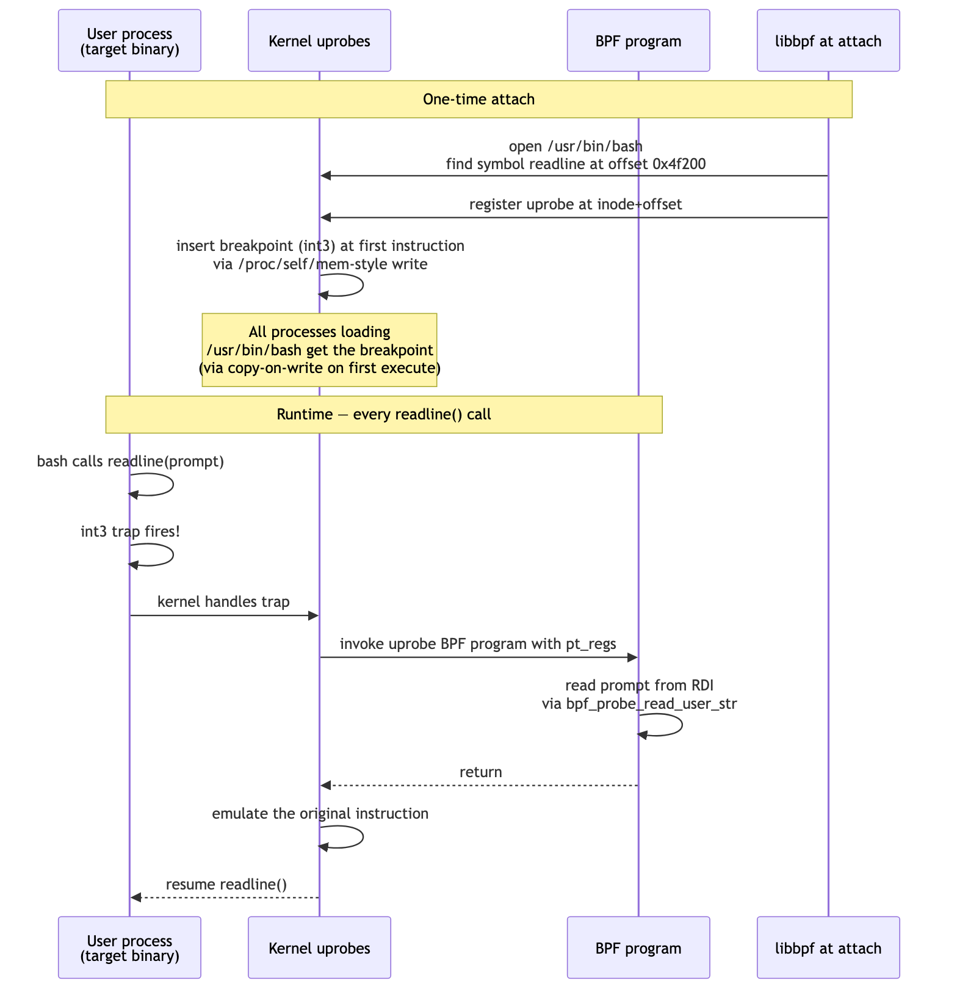
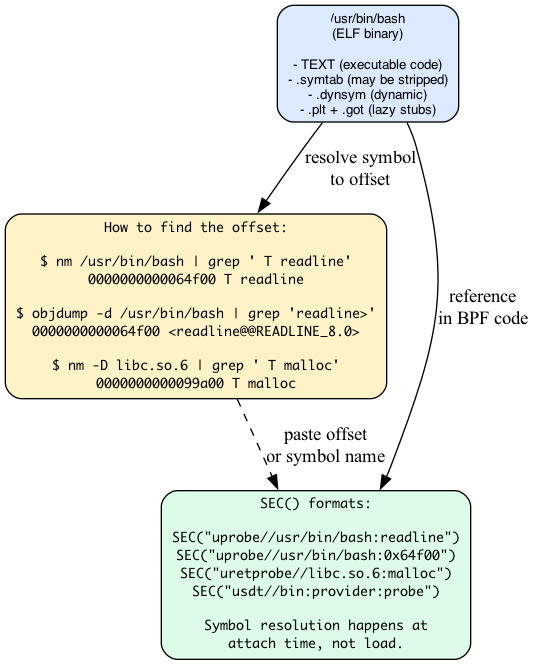
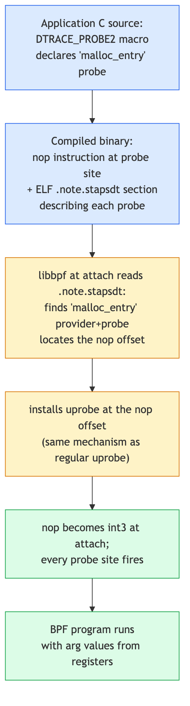

# Day 10 — Uprobes: tracing userspace from BPF

> **Today's mission:** trace a function in a userspace binary. Watch every command typed into bash by hooking `readline()`. Total time: ~75 minutes.

## The other half of "what's running on this machine"

Days 6–9 traced *kernel* functions. But your applications are mostly userspace — and many interesting events happen entirely in user code without touching syscalls (think: `malloc`, `g_object_unref`, `pq_exec`, JIT compilation events).

**Uprobes** let BPF programs attach to userspace functions. The kernel patches the target binary's executable pages with breakpoints; when any process executing that binary reaches the patched instruction, the trap fires and your BPF program runs.

It's like kprobe — but the target is a function in `/usr/bin/bash`, `/usr/lib/libssl.so.3`, or your own `myapp` rather than `vfs_read`.

## How an uprobe attach actually works



The mechanics:

1. **You specify** a target binary and an offset (or symbol that libbpf resolves to an offset).
2. **The kernel** registers the uprobe against the binary's *inode* + offset. This means: any process that maps that file with that offset executable gets the breakpoint.
3. **The kernel modifies** the executable page (write side of the page; copy-on-write semantics protect other shared mappings) to insert an `int3` (or equivalent trap) at the target instruction.
4. **At runtime**, when any thread reaches that instruction, it traps. The kernel handles the trap, calls your BPF program with `pt_regs`, then emulates the original instruction (single-step or out-of-line) so execution continues.

Cost is real: an `int3` trap is ~50 ns on x86_64, plus the BPF program time. But uprobes scale to millions of events per second on modern hardware.

> ### There are no Dumb Questions
>
> **Q: Does my uprobe affect other processes running the same binary?**
>
> A: Yes — by design. The breakpoint is per-binary-inode, not per-process. If you uprobe `/usr/bin/bash:readline`, every running bash and every future bash gets the breakpoint until you detach. This is what lets you do system-wide observability without restarting workloads.
>
> **Q: What if the target process exits while I'm attached?**
>
> A: Nothing breaks. The uprobe remains registered against the inode. New invocations get hooked. Old processes that exited just disappear. The uprobe lives until you detach (close the link FD).
>
> **Q: Can I uprobe a function in a JIT-compiled language (e.g., Java methods, V8 functions)?**
>
> A: Not with regular uprobes — those addresses don't exist at attach time; they're generated at runtime. The runtime would need to expose USDT probes (we'll see those below) or generate `perf-PID.map` files for symbolization. For Java, the JVM can be configured to emit USDT events; tools like async-profiler use this.

## Where to attach: ELF anatomy

Your target binary is an ELF file. Symbols and offsets live there.



The most common path: write `SEC("uprobe//path/to/binary:symbol_name")`. libbpf reads the binary's `.symtab` and `.dynsym`, finds the symbol, computes the file offset, and tells the kernel.

If the binary is **stripped** (no `.symtab`), `.dynsym` may still have it (for exported symbols of shared libs), or you fall back to a literal offset:

```c
SEC("uprobe//usr/bin/stripped_app:0x1234")
```

Use `objdump -d` to find offsets.

## Argument access in uprobes

Same as kprobes: `BPF_KPROBE`/`BPF_KRETPROBE` (yes, these macros work for uprobes too — the ctx shape is the same `struct pt_regs *`). On x86_64, args follow the System V ABI:

| Arg | Register   | `BPF_KPROBE` macro |
|-----|------------|---------------------|
| 1   | rdi        | `PT_REGS_PARM1(ctx)` |
| 2   | rsi        | `PT_REGS_PARM2(ctx)` |
| 3   | rdx        | `PT_REGS_PARM3(ctx)` |
| 4   | rcx        | `PT_REGS_PARM4(ctx)` |
| 5   | r8         | `PT_REGS_PARM5(ctx)` |
| Ret | rax (uretprobe) | `PT_REGS_RC(ctx)`  |

For string arguments, you need `bpf_probe_read_user_str` (not `_kernel`):

```c
char buf[64];
bpf_probe_read_user_str(buf, sizeof(buf), (void *)PT_REGS_PARM1(ctx));
```

The "_user" variant tells the kernel "this address is in *userspace*; use `copy_from_user` semantics, not direct deref." Misusing `_kernel` on a user pointer doesn't crash: the kernel-side read faults, the helper returns `-EFAULT`, and the destination buffer is zeroed.

## USDT: probes built into binaries

What if your application *wants* to be observable? Some major libraries (libc, libpthread, postgres, mysql, openssh) ship with **USDT probes** — *user-space statically defined tracing*. These are nop instructions placed by the developer at points of interest, accompanied by ELF metadata describing the arguments.



You attach with `SEC("usdt//path:provider:probe")`. libbpf reads the `.note.stapsdt` ELF section, finds the matching provider+probe, locates the nop offset, and installs a regular uprobe there.

Discover USDTs with:

```bash
sudo bpftrace -l 'usdt:/usr/lib/x86_64-linux-gnu/libc.so.6:*'
```

libc's USDTs include `lll_lock_wait`, `lll_lock_wait_private`, `setjmp`, `longjmp`. Postgres has `query__start`, `query__done`. They're a stable contract from the application.

> ### Sharpen your pencil
>
> Bash is a single-process per terminal session. You uprobe `readline` and observe nothing — but you're definitely typing in another terminal. What's wrong?
>
> .  
> .  
> .
>
> **Answer:** likely one of: (a) bash version mismatch — the bash on disk and the bash running might differ if you're inside a shell started before a system upgrade. Restart your shell. (b) bash's `readline` may be statically linked or in `libreadline.so.8` rather than the bash binary itself — `nm /usr/bin/bash | grep readline` to confirm. If empty, attach to libreadline instead. (c) PATH issue — `which bash` gives one path; the running shell may have started from a different one (e.g., `/bin/bash` symlink resolution).

---

## The lab

### `bashspy.bpf.c`

```c
#include "vmlinux.h"
#include <bpf/bpf_helpers.h>
#include <bpf/bpf_tracing.h>

char LICENSE[] SEC("license") = "GPL";

#define MAX_LINE 256

struct event {
    __u32 pid;
    char comm[16];
    char line[MAX_LINE];
};

struct {
    __uint(type, BPF_MAP_TYPE_RINGBUF);
    __uint(max_entries, 256 * 1024);
} rb SEC(".maps");

/* Track the prompt arg per TID so we can read the result on return.
 * For readline, the *return value* is what the user typed —
 * a malloc'd char* the caller frees.
 */

SEC("uretprobe//bin/bash:readline")
int BPF_KRETPROBE(on_readline_ret, const char *line)
{
    if (!line) return 0;

    struct event *e = bpf_ringbuf_reserve(&rb, sizeof(*e), 0);
    if (!e) return 0;

    e->pid = bpf_get_current_pid_tgid() >> 32;
    bpf_get_current_comm(&e->comm, sizeof(e->comm));
    bpf_probe_read_user_str(&e->line, sizeof(e->line), line);

    bpf_ringbuf_submit(e, 0);
    return 0;
}
```

### What's new

- **`SEC("uretprobe//bin/bash:readline")`** — uretprobe (return) on bash's readline. Adjust the path to your bash (`which bash`).
- **`BPF_KRETPROBE(on_readline_ret, const char *line)`** — for uretprobe, the first declared parameter after the function name is the **return value**, not an argument. (Same as kretprobe.)
- **`bpf_probe_read_user_str`** — *_user_*, not *_kernel_*. The pointer is in user memory.
- **`(const char *)` cast** in the parameter declaration — the macro will treat the return value as that type for size determination.

### `bashspy.c` — userspace consumer

```c
static int handle(void *ctx, void *data, size_t sz) {
    struct event *e = data;
    printf("[bash %u (%s)] %s\n", e->pid, e->comm, e->line);
    return 0;
}
```

### Run

```bash
make
sudo ./bashspy &

# In another terminal, start a bash and type:
bash
echo hello
ls /tmp
```

Expected:

```
[bash 4001 (bash)] echo hello
[bash 4001 (bash)] ls /tmp
```

Don't worry if your run doesn't match this block line-for-line. The probe is **system-wide**, so you'll also see the `bash` line you typed to launch the inner shell (the outer shell's readline fired under a different PID), plus anything typed in any other interactive bash on the box. The PID will differ from `4001` — it's arbitrary. And only *interactive, readline-edited* lines appear: commands fed via a script or a pipe never touch readline, so they won't show up. Extra or missing lines here are normal, not a sign of a broken attach.

When you're done, stop the spy and leave the test shell: run `sudo kill %1` (or `sudo pkill -f bashspy`) in the first terminal to detach the uprobe, and `exit` the bash you spawned in the second terminal. Leaving `bashspy` running keeps the `int3` breakpoint patched into every bash on the system — and an orphaned root daemon hanging around.

You're now spying on every command typed into every bash on the system. **For your own systems, treat this as a powerful debugging tool. For other people's systems, this is the kind of thing that requires authorization.**

---

## What to break, in order

### Break 1 — Path mismatch

```c
SEC("uprobe//bin/bash:readline")
```

If your bash is at `/usr/bin/bash` (not `/bin/bash`), libbpf fails to attach:

```
libbpf: prog 'on_readline_ret': failed to attach: -ENOENT
```

Fix: `which bash` and use the full path.

### Break 2 — Stripped binary, missing symbol

Try a symbol that doesn't exist in the table:

```c
SEC("uprobe//bin/bash:internal_static_helper")
```

Resolution fails — libbpf can't find `internal_static_helper` anywhere. The point libbpf normally does for you is: read the symbol table, look up the name, compute the file offset. When the name is gone (the binary is stripped, or the symbol is a private static), you supply the offset yourself.

To see the fallback work, pick a symbol that *does* exist and grab its offset. `/bin/bash` is usually stripped of its `.symtab`, so `objdump -t` is empty — use the **dynamic** symbol table instead:

```bash
nm -D /bin/bash | grep -w readline
# 0000000000105c30 T readline
```

(`objdump -T /bin/bash | grep -w readline` shows the same thing.) Now attach by literal offset:

```c
SEC("uprobe//bin/bash:0x105c30")
```

libbpf could have resolved `readline` by name — the offset form is exactly what you fall back to when the name *isn't* available.

### Break 3 — Use kernel-side `_kernel_str` on a user pointer

```c
bpf_probe_read_kernel_str(&e->line, sizeof(e->line), line);  /* WRONG */
```

The helper returns `-EFAULT` and the destination is zeroed. The kernel address space doesn't have user pages mapped at the same address, so the kernel-side read faults. Always `_user` for uprobe-derived pointers.

### Break 4 — Convert uretprobe to uprobe

```c
SEC("uprobe//bin/bash:readline")
int BPF_KPROBE(on_call, const char *prompt)
{
    /* prompt is the *argument* — what bash is asking */
}
```

Now you see prompt strings (`"$ "`, `"PS1"`, etc.) instead of typed lines. To get the typed line, you need to be at *return*, where the function gives back its result. That's what uretprobe is for.

### Break 5 — Multi-args with mixed types

```c
SEC("uprobe//usr/lib/libssl.so.3:SSL_write")
int BPF_KPROBE(on_ssl_write, void *ssl, const void *buf, int num)
{
    char preview[32] = {0};
    bpf_probe_read_user(preview, sizeof(preview) - 1, buf);
    bpf_printk("SSL_write %d bytes: %s", num, preview);
    return 0;
}
```

You're now reading plaintext that's about to be encrypted. (Don't deploy this on someone else's system.) Note: the libssl path varies by distro and even by process. Find the library actually loaded by your target with `cat /proc/<pid>/maps | grep -i ssl` — commonly `/usr/lib/x86_64-linux-gnu/libssl.so.3` on Debian/Ubuntu, `/usr/lib/libssl.so.3` on Arch, `/usr/lib64/libssl.so.3` on Fedora/RHEL — since a process may also bundle its own OpenSSL. Update the SEC string to match the path you find.

---

## What to read in the kernel

- **`kernel/events/uprobes.c`** — overview. The function `uprobe_register` is the entry point. Note `find_uprobe_rcu` and `set_swbp`/`set_orig_insn` for the breakpoint patching mechanics.
- **`tools/lib/bpf/libbpf.c`** — search `bpf_program__attach_uprobe`. This is where libbpf opens the ELF, resolves symbols, and registers the uprobe via the kernel's `perf_event_open`.
- **`tools/testing/selftests/bpf/progs/uprobe_multi.c`** — multi-uprobe (next day's topic) examples.
- **`Documentation/trace/uprobetracer.rst`** — the kernel's doc on uprobes from a tracing perspective.
- **`tools/lib/bpf/usdt.c`** — USDT support in libbpf. The `.note.stapsdt` parser is here.

External: **Brendan Gregg's USE method** posts and `bpftrace` examples for uprobe usage patterns.

---

## Bullet Points

- **Uprobes** attach to userspace functions in any binary. Mechanism: `int3` patched into executable pages, per-binary-inode (system-wide).
- `SEC("uprobe//path:symbol")` for entry; `SEC("uretprobe//...")` for return.
- **`BPF_KPROBE`/`BPF_KRETPROBE`** macros work for uprobes too — same `pt_regs` ctx.
- **String args use `bpf_probe_read_user_str`** (not `_kernel`).
- **Stripped binaries**: fall back to literal offsets via `objdump -d`.
- **USDT** probes are nops + ELF metadata, intentionally placed by app authors. Attached via `SEC("usdt//path:provider:probe")`.
- Uprobes affect *every* process running the binary while attached. System-wide observability without app changes.

---

## Check question

Why is `bpf_probe_read_user_str` necessary instead of just dereferencing the userspace string pointer directly?

<details>
<summary>Click to reveal answer</summary>

**Answer:** Two reasons. **(1) Memory safety:** the user pointer might be invalid (NULL, freed, mid-tearing of the calling process); direct deref would oops the BPF program. `bpf_probe_read_user_str` uses `copy_from_user` semantics that fault-handle gracefully, returning `-EFAULT` if the memory isn't accessible. **(2) Address-space awareness:** uprobes fire in process context with the user's mm active, but the BPF runtime treats userspace memory as "untrusted" and requires the explicit helper that knows it's reading from the user page tables. The Verifier rejects raw deref of pointers from `pt_regs` for the same reason.

</details>

---

## Tomorrow

Day 11: multi-{u,k}probe — efficient attach to many functions at once. The newer batch-attach mechanism that scales to thousands of probes without thousands of `perf_event_open` syscalls.
