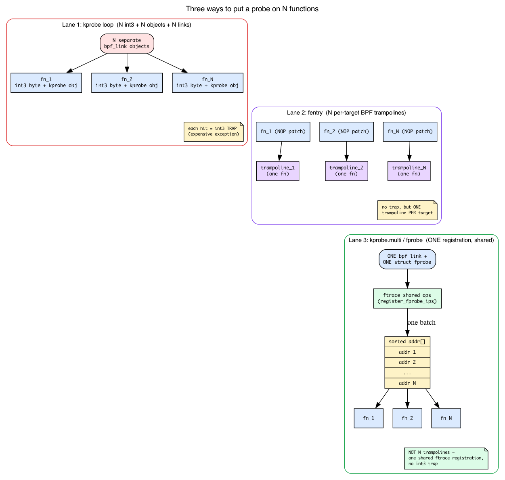
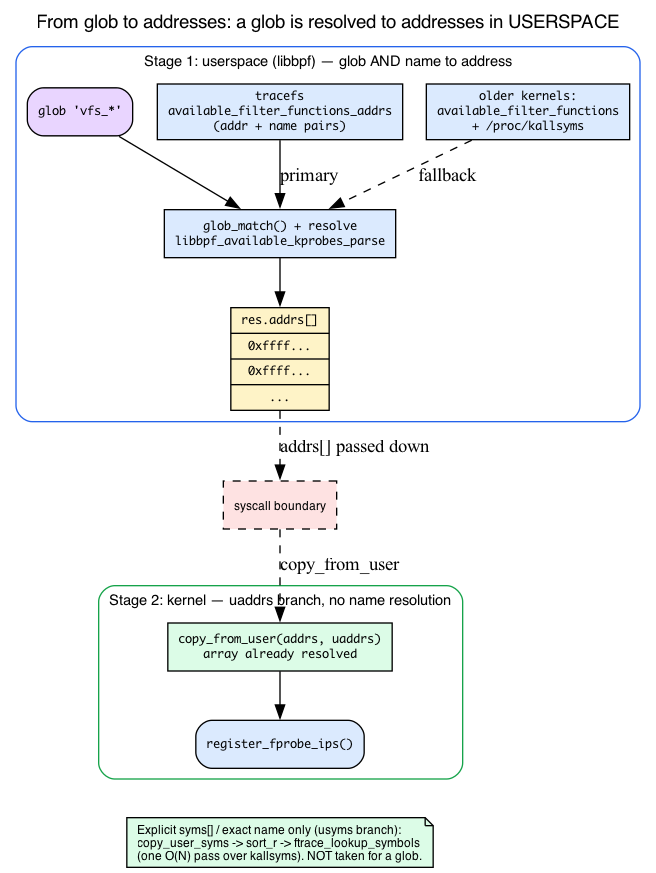
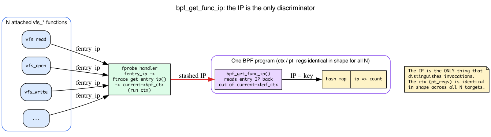
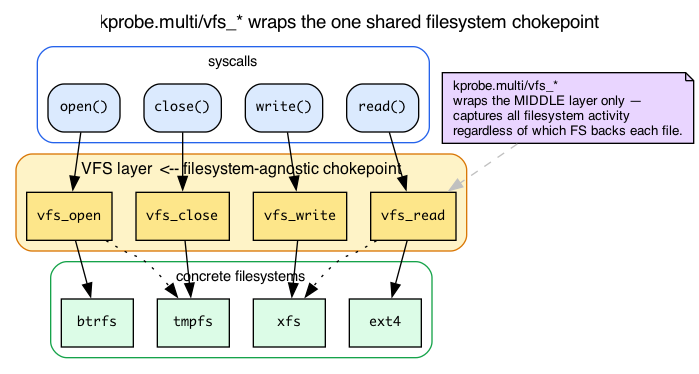

# Day 11 — Multi-probe: attach to many functions in one syscall

> **Today's mission:** trace **every** filesystem syscall (read, write, open, close, fsync, ...) with one BPF program attached to all of them at once. Along the way, learn the third attach mechanism the kernel has — *fprobe* — that makes batch-attaching a thousand functions cheap, how a glob like `vfs_*` becomes a sorted array of addresses, and how one program tells its N probes apart. Total time: ~95 minutes.

## The problem with one-by-one

Yesterday's uprobes attach one function at a time. That works for a handful of probes. But what if you want to trace *every* syscall? Every function in the VFS layer? Every TCP entry point?

In the old model, you'd loop in userspace:

```c
for (int i = 0; i < N; i++) {
    bpf_program__attach_kprobe(prog, false, names[i]);  /* one syscall each */
}
```

For N=200, that's 200 `perf_event_open` syscalls, 200 kernel kprobe objects, 200 BPF links. Startup takes seconds. Memory grows linearly. Detach is similarly slow.

**Multi-probe** (added in kernel 5.18, commit `0dcac272540` for kprobe.multi) is the modern fix.


One syscall, one BPF link, N probes installed in one kernel-side batch.

But "one kernel-side batch" is doing a lot of work in that sentence, and the whole performance story of this chapter rests on *how* the batch is installed and run. Day 1 introduced fentry's trampoline path and contrasted it with the older kprobe `int3` trap; Day 6 added fexit. Today there's a third attach mechanism, and it's the one kprobe.multi rides on. Let's name it before we lean on it.

## What "fprobe-backed" actually means

Recall the two attach mechanisms Day 1 introduced (with fexit added in Day 6):

- **kprobe** patches the target instruction with an `int3` software breakpoint. When the CPU hits it, it *traps* — a relatively expensive exception that vectors into the kprobe handler, which eventually calls your BPF program. One breakpoint per function.
- **fentry/fexit** (Days 1 and 6) use ftrace's 5-byte NOP patch-site that every function carries at its entry, and route through a **per-target BPF trampoline** — a small chunk of generated code wired to *one* function. No trap; execution flows straight through. Cheaper per call, but one trampoline per attach target.

kprobe.multi is built on a **third** thing, also ftrace-based, called an **fprobe**.

**The intuition first.** Imagine you want a breakpoint on a thousand functions. The kprobe way is a thousand independent text-pokes — a thousand `int3` bytes written into a thousand call sites, a thousand kernel objects to track. The fprobe way is one client that says to ftrace: *"here is a sorted array of a thousand addresses; call me when execution reaches any of them."* ftrace already maintains the machinery to multiplex many call sites onto shared handler code (it's how `ftrace` function tracing itself works). An fprobe is one customer of that machinery registered against a whole array at once.

Concretely, an fprobe is a single small struct:

```c
/* include/linux/fprobe.h:62 */
struct fprobe {
    unsigned long       nmissed;          /* counter for missed events */
    unsigned int        flags;
    size_t              entry_data_size;
    fprobe_entry_cb     entry_handler;    /* called on function entry */
    fprobe_exit_cb      exit_handler;     /* called on function return */
    struct fprobe_hlist *hlist_array;     /* hash of the IPs this fprobe covers */
};
```

One `struct fprobe`, one `entry_handler`, an `hlist_array` of the addresses it covers. That's why N functions install in *one* batch instead of N separate `int3` patches.



### fprobe is not fentry's trampoline

It is tempting to assume fprobe reuses the per-target BPF trampoline Day 1 described. It does not, and the distinction matters. fprobe hangs off ftrace's *shared* graph/ops machinery. You can see the fork in the source:

```c
/* kernel/trace/fprobe.c:982 — register_fprobe_ips() */
if (fprobe_is_ftrace(fp))
    ret = fprobe_ftrace_add_ips(addrs, num);
else
    ret = fprobe_graph_add_ips(addrs, num);
```

Depending on whether the probe needs a return/exit handler, registration routes to ftrace's `ftrace_ops` path or its function-graph (`fgraph`) path. Neither is a per-function BPF trampoline. The honest one-sentence statement is:

> **fprobe is ftrace-based like fentry — so it avoids the `int3` trap — but it is `ftrace_ops`/`fgraph`, not a per-function BPF trampoline.**

That distinction doesn't weaken the performance argument; it sharpens it. Here is the *real* reason kprobe.multi beats a one-by-one kprobe loop, on both axes:

- **Install is one ftrace operation over a sorted address array**, not N separate `int3` text-pokes. The kernel registers a single fprobe covering the whole `addrs[]` array (`register_fprobe_ips(&link->fp, addrs, cnt)`).
- **At runtime there is no `int3` trap.** Execution reaches the shared ftrace handler directly — the exact same reason fentry beats kprobe in Day 1.

### The ceiling, and the hard requirement

A single multi-attach is capped. The kernel defines:

```c
/* kernel/trace/bpf_trace.c:44 */
#define MAX_KPROBE_MULTI_CNT (1U << 20)   /* ~1,048,576 */
```

and rejects anything larger up front in `bpf_kprobe_multi_link_attach`:

```c
/* kernel/trace/bpf_trace.c — inside bpf_kprobe_multi_link_attach */
if (!cnt)
    return -EINVAL;
if (cnt > MAX_KPROBE_MULTI_CNT)
    return -E2BIG;
```

So the "1000 functions" number in this chapter has a real ceiling of ~1M addresses; over that you get `-E2BIG`. (And zero matches gets `-EINVAL` — hold that thought for Break 4.)

Finally, the whole mechanism is gated on a config option. kprobe.multi requires `CONFIG_FPROBE=y`. Without it, the entire attach entry point compiles down to a stub:

```c
/* kernel/trace/bpf_trace.c:2890 — the #else /* !CONFIG_FPROBE */ branch */
int bpf_kprobe_multi_link_attach(const union bpf_attr *attr, struct bpf_prog *prog)
{
    return -EOPNOTSUPP;
}
```

That's why, without `CONFIG_FPROBE`, attach fails outright with `-EOPNOTSUPP` rather than silently degrading to a slow loop. (The full prerequisite check is in the Run section below.)

## From glob to addresses: who does what

`SEC("kprobe.multi/vfs_*")` hides a two-stage pipeline that is easy to blur into one step. The honest split is the *opposite* of the tempting guess: for a glob, **userspace (libbpf) does both the glob expansion *and* the name→address resolution; the kernel just receives a ready-made array of addresses and registers it.** Let's walk both sides.



**Userspace side (libbpf).** Day 9 already taught you `/proc/kallsyms`: `kptr_restrict` zeroes the addresses for non-root, the file is *not* address-sorted, and you find a symbol by scanning for the nearest preceding entry. (We use exactly that fact for the `lookup_ksym` sketch later.) But for a `SEC("kprobe.multi/glob")` attach, libbpf may not need `/proc/kallsyms` at all — it depends on what tracefs exposes. The precedence is:

```c
/* tools/lib/bpf/libbpf.c — inside bpf_program__attach_kprobe_multi_opts */
if (has_available_filter_functions_addrs())
    err = libbpf_available_kprobes_parse(&res);   /* modern: addr+name pairs */
else
    err = libbpf_available_kallsyms_parse(&res);   /* fallback: names + kallsyms */
```

On a modern kernel, tracefs exposes `available_filter_functions_addrs` — a file listing each instrumentable function as an *address + name* pair. `libbpf_available_kprobes_parse` reads addresses straight out of it, globs the names, and never opens `/proc/kallsyms` (this devbox has that file). On older kernels lacking it, libbpf falls back to `libbpf_available_kallsyms_parse`, which globs the names from `available_filter_functions` and then calls `libbpf_kallsyms_parse` (which `fopen`s `/proc/kallsyms`) to turn those names into addresses. Either way the result is the same: **libbpf produces a resolved `res.addrs` array in userspace.** Using `available_filter_functions` (rather than raw kallsyms) for the name set matters: it already excludes `notrace` and inlined functions you could never attach to, so the glob can't hand back a name that's doomed to fail.

**Kernel side.** libbpf sets `lopts.kprobe_multi.addrs = addrs` and `syms = NULL`, so the kernel takes the *address* branch. It validates that exactly one of the two is set, then just copies the array in and moves on:

```c
/* kernel/trace/bpf_trace.c — inside bpf_kprobe_multi_link_attach */
if (!!uaddrs == !!usyms)
    return -EINVAL;            /* exactly one of addrs[] or syms[] */
...
if (uaddrs) {                  /* glob path: addresses already resolved */
    if (copy_from_user(addrs, uaddrs, size))
        return -EFAULT;
} else {                       /* explicit names path: resolve in-kernel */
    err = copy_user_syms(&us, usyms, cnt);
    sort_r(us.syms, cnt, ...);
    err = ftrace_lookup_symbols(us.syms, cnt, addrs);
}
```

For a glob the kernel never sees names: it `copy_from_user`s the address array and goes straight to `register_fprobe_ips`. The in-kernel name→address resolution (`copy_user_syms` → `sort_r` → `ftrace_lookup_symbols`) is the *other* branch — taken only when the caller passes an explicit `opts.syms[]` list or a single exact (wildcard-free) name. That path is where the chapter's single-O(N)-pass-over-kallsyms story actually lives; see Break 1.

**The single-pass detail (the `usyms` branch only).** It is easy to assume `ftrace_lookup_symbols` is N independent log-N lookups into kallsyms. It is actually a **single O(N) pass**:

```c
/* kernel/trace/ftrace.c:9262 — ftrace_lookup_symbols doc block */
/* ... kallsyms_on_each_symbol() with binary search into the sorted input
 * array.
 * Returns: 0 if all provided symbols are found, -ESRCH otherwise.
 */
```

The kernel walks kallsyms *once* (`kallsyms_on_each_symbol`), and for each symbol it sees, does a `bsearch` into your already-sorted name array. That's why the names get sorted first: so the single pass can binary-search them. One sweep over kallsyms, not N sweeps. And if even one name doesn't resolve, the whole attach fails with `-ESRCH`. Again, this only runs for the explicit-names path, not for a glob.

So the failure modes split by path:

- **Glob, zero matches** (`vfs_xyz_nope*` expands to nothing): caught in **userspace** — `libbpf_available_kprobes_parse`/`libbpf_available_kallsyms_parse` return `-ENOENT` when `res.cnt == 0`, before any syscall. The kernel's `if (!cnt) return -EINVAL` never runs (it only fires if a caller explicitly passes `cnt == 0` through the opts API). This is Break 4.
- **Explicit names, one doesn't resolve**: the kernel's `ftrace_lookup_symbols` returns `-ESRCH`. Only the `usyms` branch can hit this.

## How to know which probe fired

When 50 functions all run the same BPF program, you need a way to tell them apart. The `ctx` (the saved registers) has the *same shape* for every target, so it can't distinguish them — the only thing that differs is *which function's entry you're sitting at*. That's what `bpf_get_func_ip(ctx)` gives you, and it's worth understanding where that IP actually comes from, because it's the load-bearing dispatch primitive for the whole chapter.


**Where the IP comes from.** When a target fires, fprobe calls the entry handler with the `fentry_ip` — the instrumented call site. The kprobe.multi handler converts that to the actual function *entry* address and stashes it in the per-invocation run context:

```c
/* kernel/trace/bpf_trace.c:2592 — kprobe_multi_link_handler */
err = kprobe_multi_link_prog_run(link, ftrace_get_entry_ip(fentry_ip),
                                 fregs, false, data);
```

```c
/* kernel/trace/bpf_trace.c:2319 — ftrace_get_entry_ip() */
unsigned long ip = ftrace_get_symaddr(fentry_ip);
return ip ? : fentry_ip;       /* resolved symbol address, or the call site */
```

So by the time your program runs, the resolved function entry address is already sitting in the run context.

**`bpf_get_func_ip` is not one helper.** The verifier swaps in a program-type-specific implementation depending on what kind of probe you are. For kprobe.multi it resolves to `bpf_get_func_ip_kprobe_multi`:

```c
/* kernel/trace/bpf_trace.c:1080 */
BPF_CALL_1(bpf_get_func_ip_kprobe_multi, struct pt_regs *, regs)
{
    return bpf_kprobe_multi_entry_ip(current->bpf_ctx);
}
```

It just reads the entry IP that the handler already stashed in `current->bpf_ctx`. The selection happens in the verifier when it sees `is_kprobe_multi(prog)`:

```c
/* kernel/trace/bpf_trace.c:1327 */
case BPF_FUNC_get_func_ip:
    if (is_kprobe_multi(prog))
        return &bpf_get_func_ip_proto_kprobe_multi;
```

That's why the helper is *cheap*: it's a context read, not a symbol lookup at runtime. The expensive part (resolving the address) happened once, in the handler.



You typically use the returned IP as a key in a hash map: IP → count, or IP → behavior. Strip out `bpf_get_func_ip` (Break 3) and every one of the N probes increments the *same* counter, because nothing else in the program distinguishes them — attribution is gone.

## One link owns all N attachments

Day 1 introduced `bpf_link` (`BPF_LINK_CREATE` wires a program to an attach point); Day 10 showed that a probe lives until you close the link's FD. Nothing new to teach there — just one new point worth a sentence.

The *same single link object* covers all N functions:

```c
/* kernel/trace/bpf_trace.c:2291 */
struct bpf_kprobe_multi_link {
    struct bpf_link link;
    struct fprobe   fp;          /* the one fprobe covering all N */
    unsigned long  *addrs;       /* the N resolved addresses */
    u64            *cookies;
    u32             cnt;         /* N */
    ...
};
```

```c
/* kernel/trace/bpf_trace.c:2828 */
bpf_link_init(&link->link, BPF_LINK_TYPE_KPROBE_MULTI, ...);
```

One `struct bpf_kprobe_multi_link`, holding one `struct fprobe`, the `addrs`/`cookies` arrays, and the count. **Closing its one FD detaches all N** — versus the N separate links the one-by-one loop creates. That's the whole "detach is one operation" claim, made concrete.

## What the VFS layer is (and why `vfs_*` is the right glob)

The lab globs `vfs_*`. Day 6 first used `vfs_read` as an example target and Day 7 reused it, but no chapter has said what the VFS *is* — and you shouldn't have to take "glob `vfs_*` to catch all filesystem activity" on faith.

**The Virtual File System is the kernel's filesystem-agnostic layer.** Every `read()`, `write()`, `open()`, `close()` syscall funnels through a `vfs_*` entry point — `vfs_read` (`fs/read_write.c:554`), `vfs_write` (`fs/read_write.c:668`), `vfs_open` (`fs/open.c:1074`), and friends — *before* the kernel dispatches to the concrete filesystem driver (ext4, xfs, btrfs, ...) that actually backs the file. The VFS is the common chokepoint; the concrete FS is what sits below it.



That single fact is *why* hooking `vfs_*` with one glob is the right aggregation point: it captures all filesystem activity in one place, no matter which filesystem each file lives on. You don't need VFS internals beyond this — the companion *linux-net* book and general kernel background go deeper; here you only need to know `vfs_*` are the shared filesystem entry points.

> ### There are no Dumb Questions
>
> **Q: Is multi-kprobe just syntactic sugar over a loop?**
>
> A: Functionally similar; operationally very different. The kernel-side install path is shared (one fprobe registered via ftrace against a list of addresses), the BPF link is a single object, and there's no `int3` trap at runtime. For 1000 functions, multi-kprobe attaches in ~10 ms; the loop version takes seconds.
>
> **Q: Can I use multi-probe with a wildcard pattern?**
>
> A: Yes. libbpf supports glob patterns in `attach_kprobe_multi_opts.syms`. `tcp_*` matches every TCP function. Internally libbpf reads tracefs `available_filter_functions_addrs` (or `available_filter_functions` plus `/proc/kallsyms` on older kernels) and resolves the glob to *addresses in userspace*, then hands the kernel a ready-made address array — the kernel just `copy_from_user`s it and registers the fprobe. (The in-kernel name→address resolution only runs when you pass an explicit `syms[]` list instead of a glob.)
>
> **Q: Does multi-probe exist for fentry?**
>
> A: No — there's no `fentry.multi`/`fexit.multi`. fentry/fexit build one trampoline per attach target, with no batched multi-attach variant in libbpf or the kernel. If you need to hook many functions at once with low per-call overhead, use `kprobe.multi` (which is fprobe-backed and very cheap) and read the return value via the kprobe ctx.
>
> **Q: Multi-uprobe?**
>
> A: Yes — added in 6.6. `SEC("uprobe.multi/...")`. Same idea for userspace targets.

## The lab

### `multi.bpf.c`

This listing is included from the file the lab build and CI compile:

{{#include ../labs/day11/multi.bpf.c:book}}

`SEC("kprobe.multi/vfs_*")` — the suffix after `kprobe.multi/` is a **glob**. libbpf expands it (via tracefs `available_filter_functions`, as we saw) into maybe 50 function names starting with `vfs_`, the kernel resolves those to addresses, and `bpf_get_func_ip(ctx)` returns the entry IP of whichever one fired — the key the hash map aggregates on.

### `multi.c` — userspace

```c
struct multi_bpf *skel = multi_bpf__open_and_load();
multi_bpf__attach(skel);

while (!exiting) {
    sleep(2);
    /* iterate hits map; resolve ip via /proc/kallsyms */
    int fd = bpf_map__fd(skel->maps.hits);
    __u64 key = 0, next, val;
    while (bpf_map_get_next_key(fd, &key, &next) == 0) {
        bpf_map_lookup_elem(fd, &next, &val);
        printf("%-30s %llu\n", lookup_ksym(next), val);
        key = next;
    }
}
```

`lookup_ksym(addr)` is a **sketch, not supplied code** — it's a few-line function you write that scans `/proc/kallsyms` for the closest symbol at or below `addr`: parse each `addr type name` line, keep the entry with the largest address `<= addr`. (This is exactly the nearest-preceding-symbol scan Day 9 taught — and note it reads `/proc/kallsyms`, the *symbolization* file, not the `available_filter_functions` file the glob used.) Without it the program won't link. To skip writing a symbolizer, print the raw IP with `%llx` instead and pipe each value through `grep <hex> /proc/kallsyms` by hand. Note `/proc/kallsyms` only exposes real addresses to root (`kptr_restrict` zeroes them otherwise), so run the binary with `sudo`.

### Run

> **Prerequisite:** `kprobe.multi` is fprobe-backed, so the kernel must be built with `CONFIG_FPROBE=y` (kernel >= 5.18), plus `CONFIG_DEBUG_INFO_BTF=y` for the `vmlinux.h` include. Check with `grep -E 'CONFIG_FPROBE|CONFIG_DEBUG_INFO_BTF' /boot/config-$(uname -r)` (or `zgrep` on `/proc/config.gz`). Without `CONFIG_FPROBE` the attach fails outright — `bpf_kprobe_multi_link_attach` is the `-EOPNOTSUPP` stub we saw above.

```bash
make
sudo ./multi &
# Generate work in another terminal:
find /etc -type f | xargs cat > /dev/null
```

Expected (assuming you wrote the `lookup_ksym` sketch above — otherwise the left column is raw hex IPs):

```
vfs_read       12453
vfs_open        2914
vfs_statx       1822
vfs_getattr_nosec  2914
...
```

Row order is **arbitrary**: the userspace loop walks the map with `bpf_map_get_next_key`, which returns keys in hash order, not ranked by count — so your rows may appear shuffled (the counts above aren't sorted either). Only the per-function counts matter; pipe through `sort -k2 -rn` if you want them ranked.

You attached to ~50 functions in one syscall, watched all of them, and aggregated by function — without writing 50 separate handlers.

#### Same lesson as a one-liner

If you'd rather not assemble the C glue (in particular the `lookup_ksym` symbolizer), `bpftrace` gives you the whole lesson in one copy-pasteable program. The `vfs_*` glob is expanded and attached via `kprobe.multi` — the same path as `SEC("kprobe.multi/vfs_*")` in `multi.bpf.c` — and the `func` builtin plays the role of `bpf_get_func_ip`, telling you which of the `vfs_*` functions fired:

```bash
# Terminal 1 — one program, many functions, attributed by func():
sudo bpftrace -e 'kprobe:vfs_* { @[func] = count(); } interval:s:5 { exit(); }'
# Terminal 2 — generate VFS load:
find /etc -type f | xargs cat > /dev/null
```

Expected (counts vary run to run; the highest-traffic VFS paths dominate, and `bpftrace` prints `@`-maps sorted ascending by value):

```
Attached 78 probes

@[vfs_write]: 524
@[vfs_fstatat]: 1744
@[vfs_statx]: 2823
@[vfs_open]: 4719
@[vfs_fstat]: 4897
@[vfs_getattr_nosec]: 7742
@[vfs_read]: 20960
```

`bpftrace` resolves the names directly via `func`, so this version sidesteps the `lookup_ksym` glue entirely.

---

## What to break, in order

### Break 1 — Specific list instead of glob

```c
SEC("kprobe.multi")
int BPF_KPROBE(p) { ... }
```

In userspace:

```c
LIBBPF_OPTS(bpf_kprobe_multi_opts, opts);
const char *syms[] = {"vfs_read", "vfs_write", "vfs_open"};
opts.syms = syms;
opts.cnt = 3;
bpf_program__attach_kprobe_multi_opts(skel->progs.p, NULL, &opts);
```

This gives you precise control over which functions to attach. Use when a glob would over-match. (libbpf still feeds these names through `copy_user_syms` → `sort_r` → `ftrace_lookup_symbols` on the kernel side — the same resolution path, you've just skipped the glob expansion.)

### Break 2 — Mixing offsets

```c
const __u64 addrs[] = {0xffffffff812a4000, ...};
opts.addrs = addrs;     /* numeric addresses */
opts.cnt = N;
```

You can pass raw kernel addresses too. Useful when symbols are aliased or you have addresses from another source (perf, kallsyms parsed yourself). With `opts.addrs` the kernel skips name resolution entirely — it just `copy_from_user(addrs, uaddrs)` into the link's array and goes straight to `register_fprobe_ips`. No `ftrace_lookup_symbols` step.

### Break 3 — Forget `bpf_get_func_ip`

Without it, every probe just increments the same counter — you lose per-function attribution. Run, then realize you can't tell which `vfs_*` was called. The reason is exactly what the dispatch section showed: the `ctx` (pt_regs) is identical in shape across all N targets, so the entry IP is the *only* thing distinguishing one invocation from another. Lesson: **always identify the source** when one program serves many probes.

### Break 4 — Multi-probe on a function that doesn't exist

```c
SEC("kprobe.multi/this_function_does_not_exist*")
```

Glob expands to zero matches. libbpf fails attach with `-ENOENT` (the kernel side would reject `cnt == 0` with `-EINVAL`; libbpf surfaces the empty resolution as `-ENOENT`). Friendly: silent acceptance with zero matches would mask bugs.

---

## What to read in the kernel

- **`kernel/trace/bpf_trace.c`** — search `bpf_kprobe_multi_link_attach`. The function that handles the new link type.
- **`kernel/bpf/syscall.c`** — search `BPF_TRACE_KPROBE_MULTI`. The syscall dispatch.
- **`tools/lib/bpf/libbpf.c`** — search `bpf_program__attach_kprobe_multi_opts`. The userspace API.
- **`tools/testing/selftests/bpf/progs/kprobe_multi.c`** — official test/examples.

---

## Bullet Points

- **Multi-probe** attaches one BPF program to many functions in a single syscall (~10ms for 1000 vs seconds for one-by-one).
- It's **fprobe-backed**: one `struct fprobe` registered via ftrace against a sorted `addr[]` array (`register_fprobe_ips`). fprobe is ftrace-based like fentry — so no `int3` trap — but it's `ftrace_ops`/`fgraph`, **not** a per-function BPF trampoline. Cheap to install (one ftrace op, not N text-pokes) and cheap at runtime (no trap). Capped at `MAX_KPROBE_MULTI_CNT = 1<<20`; `CONFIG_FPROBE=y` required or attach returns `-EOPNOTSUPP`.
- **Glob → addresses, resolved in userspace.** For a glob, libbpf does *both* the expansion and the name→address resolution: it reads tracefs `available_filter_functions_addrs` (or `available_filter_functions` + `/proc/kallsyms` on older kernels), produces an address array, and the kernel just `copy_from_user`s it and registers the fprobe — no in-kernel name resolution. The `sort_r` names + `ftrace_lookup_symbols` **single O(N) pass** over kallsyms (bsearch into the sorted input) runs only for an explicit `syms[]` list or an exact wildcard-free name.
- `SEC("kprobe.multi/glob")` for glob attach; or pass an explicit list via `bpf_kprobe_multi_opts.syms`, or raw addresses via `.addrs` (which skips name resolution).
- **`bpf_get_func_ip(ctx)`** lets the program know which function fired. It's a per-program-type helper (`bpf_get_func_ip_kprobe_multi`) that just reads the entry IP the handler stashed in `current->bpf_ctx` — cheap, no runtime symbol lookup. The IP is the *only* discriminator; without it, all N probes increment one counter.
- **One `bpf_link`** (`struct bpf_kprobe_multi_link`, holding one `fp` and the `addrs`/`cookies`/`cnt`) owns all N attachments; closing its FD detaches all N.
- The **VFS** is the kernel's filesystem-agnostic layer; every read/write/open/close syscall funnels through a `vfs_*` entry before dispatching to the concrete FS — which is why `vfs_*` is the right one-glob aggregation point.
- Variants: `kprobe.multi`, `kretprobe.multi`, `uprobe.multi` (6.6+). There is **no** `fentry.multi`/`fexit.multi`.

---

## Check question

You attach `kprobe.multi/tcp_*` and observe `bpf_get_func_ip` returning some IPs that don't match what `cat /proc/kallsyms | grep tcp_` shows. What might cause this?

<details>
<summary>Click to reveal answer</summary>

**Answer:** `bpf_get_func_ip` returns the resolved function **entry** address — the handler ran `ftrace_get_entry_ip(fentry_ip)` (which is `ftrace_get_symaddr(fentry_ip) ?: fentry_ip`) and stashed it in `current->bpf_ctx`, and the helper just reads it back. That entry address is exactly what you'd compare against a symbol start in `/proc/kallsyms` — but: (a) KASLR can shift symbols across boots, so resolve at the *same* boot you traced in. (b) Some functions have aliases — multiple symbols at the same IP — so the IP may match a different name than you grepped for. (c) On older kernels `bpf_get_func_ip` returned the trampoline call site, off by a few bytes from the symbol. Use `bpf_get_func_ip` consistently for all comparisons rather than mixing it with kallsyms-derived addresses.

</details>

---

## Tomorrow

Day 12: sleepable BPF programs. The constraint that's been quietly limiting you (no helpers that fault) and how to relax it.
