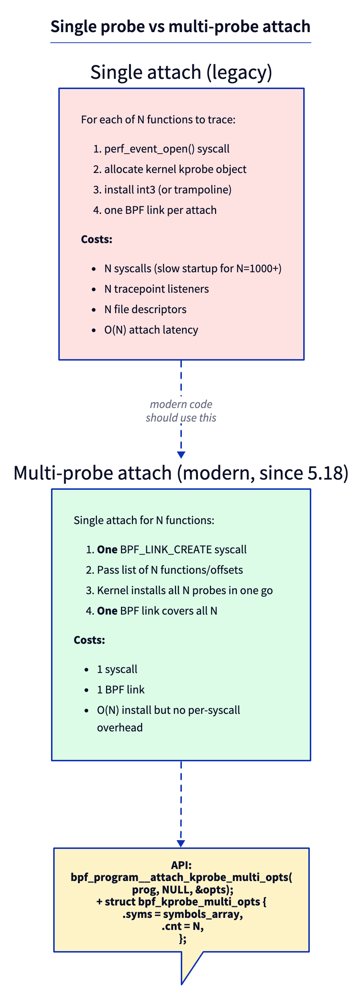
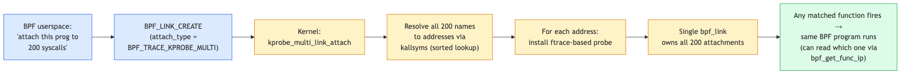
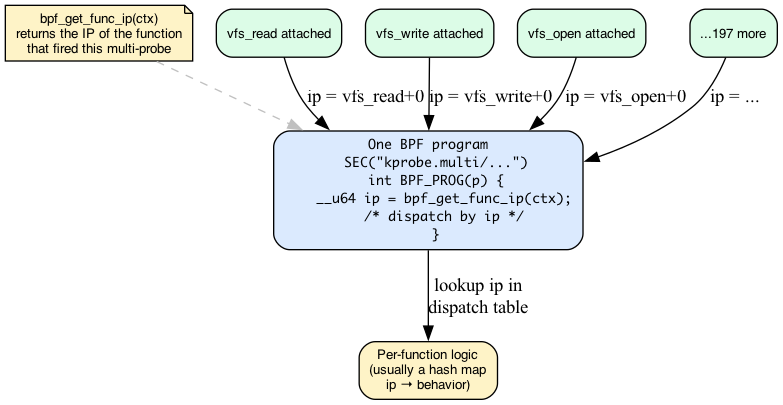

# Day 11 — Multi-probe: attach to many functions in one syscall

> **Today's mission:** trace **every** filesystem syscall (read, write, open, close, fsync, ...) with one BPF program attached to all of them at once. Total time: ~75 minutes.

## The problem with one-by-one

Yesterday's uprobes attach one function at a time. That works for a handful of probes. But what if you want to trace *every* syscall? Every function in the VFS layer? Every TCP entry point?

In the old model, you'd loop in userspace:

```c
for (int i = 0; i < N; i++) {
    bpf_program__attach_kprobe(prog, false, names[i]);  /* one syscall each */
}
```

For N=200, that's 200 `perf_event_open` syscalls, 200 kernel kprobe objects, 200 BPF links. Startup takes seconds. Memory grows linearly. Detach is similarly slow.

**Multi-probe** (added in kernel 5.18, commit `0dcac272540` for kprobe.multi) is the modern fix.



One syscall, one BPF link, N probes installed in one kernel-side batch.

## How it works under the hood



The kernel resolves all N symbol names to addresses (sorted lookup against `kallsyms` makes this fast even for thousands of names). It installs ftrace-based probes for each — these reuse the same trampoline machinery as fentry, so per-probe runtime cost is also lower than kprobe's int3 traps.

A single `bpf_link` owns all N attachments. Detach is one operation that removes them all.

## How to know which probe fired

When 200 functions all run the same BPF program, you need a way to tell them apart. That's what `bpf_get_func_ip(ctx)` is for:



Returns the IP of the function the trampoline jumped from. You typically use it as a key in a hash map that maps IP → behavior or IP → name.

> ### There are no Dumb Questions
>
> **Q: Is multi-kprobe just syntactic sugar over a loop?**
>
> A: Functionally similar; operationally very different. The kernel-side install path is shared (one ftrace operation against a list of addresses), the BPF link is a single object, and the trampolines are reused across probes pointing at the same program. For 1000 functions, multi-kprobe attaches in ~10 ms; the loop version takes seconds.
>
> **Q: Can I use multi-probe with a wildcard pattern?**
>
> A: Yes. libbpf supports glob patterns in `attach_kprobe_multi_opts.syms`. `tcp_*` matches every TCP function. Internally libbpf reads `/proc/kallsyms`, filters by glob, and passes the resulting list to the kernel.
>
> **Q: Does multi-probe exist for fentry?**
>
> A: No — there's no `fentry.multi`/`fexit.multi`. fentry/fexit build one trampoline per attach target, with no batched multi-attach variant in libbpf or the kernel. If you need to hook many functions at once with low per-call overhead, use `kprobe.multi` (which is fprobe-backed and very cheap) and read the return value via the kprobe ctx.
>
> **Q: Multi-uprobe?**
>
> A: Yes — added in 6.6. `SEC("uprobe.multi/...")`. Same idea for userspace targets.

## The lab

### `multi.bpf.c`

```c
#include "vmlinux.h"
#include <bpf/bpf_helpers.h>
#include <bpf/bpf_tracing.h>

char LICENSE[] SEC("license") = "GPL";

struct {
    __uint(type, BPF_MAP_TYPE_HASH);
    __uint(max_entries, 4096);
    __type(key, __u64);     /* function ip */
    __type(value, __u64);   /* count */
} hits SEC(".maps");

SEC("kprobe.multi/vfs_*")
int BPF_KPROBE(on_any_vfs)
{
    __u64 ip = bpf_get_func_ip(ctx);
    __u64 *c = bpf_map_lookup_elem(&hits, &ip);
    if (c) {
        __sync_fetch_and_add(c, 1);
    } else {
        __u64 one = 1;
        bpf_map_update_elem(&hits, &ip, &one, BPF_NOEXIST);
    }
    return 0;
}
```

`SEC("kprobe.multi/vfs_*")` — the suffix after `kprobe.multi/` is a **glob**. libbpf expands it via `kallsyms` at attach time, ending up with maybe 50 functions starting with `vfs_`.

### `multi.c` — userspace

```c
struct multi_bpf *skel = multi_bpf__open_and_load();
multi_bpf__attach(skel);

while (!exiting) {
    sleep(2);
    /* iterate hits map; resolve ip via /proc/kallsyms */
    int fd = bpf_map__fd(skel->maps.hits);
    __u64 key = 0, next, val;
    while (bpf_map_get_next_key(fd, &key, &next) == 0) {
        bpf_map_lookup_elem(fd, &next, &val);
        printf("%-30s %llu\n", lookup_ksym(next), val);
        key = next;
    }
}
```

`lookup_ksym(addr)` is a few-line function that scans `/proc/kallsyms` for the closest symbol below `addr`.

### Run

```bash
sudo ./multi
# Generate work in another terminal:
find /etc -type f | xargs cat > /dev/null
```

Expected:

```
vfs_read       12453
vfs_open        2914
vfs_statx       1822
vfs_close       2914
...
```

You attached to ~50 functions in one syscall, watched all of them for 2 seconds, and aggregated by function — without writing 50 separate handlers.

---

## What to break, in order

### Break 1 — Specific list instead of glob

```c
SEC("kprobe.multi")
int BPF_KPROBE(p) { ... }
```

In userspace:

```c
LIBBPF_OPTS(bpf_kprobe_multi_opts, opts);
const char *syms[] = {"vfs_read", "vfs_write", "vfs_open"};
opts.syms = syms;
opts.cnt = 3;
bpf_program__attach_kprobe_multi_opts(skel->progs.p, NULL, &opts);
```

This gives you precise control over which functions to attach. Use when a glob would over-match.

### Break 2 — Mixing offsets

```c
const __u64 addrs[] = {0xffffffff812a4000, ...};
opts.addrs = addrs;     /* numeric addresses */
opts.cnt = N;
```

You can pass raw kernel addresses too. Useful when symbols are aliased or you have addresses from another source (perf, kallsyms parsed yourself).

### Break 3 — Forget `bpf_get_func_ip`

Without it, every probe just increments the same counter — you lose per-function attribution. Run, then realize you can't tell which `vfs_*` was called. Lesson: **always identify the source** when one program serves many probes.

### Break 4 — Multi-probe on a function that doesn't exist

```c
SEC("kprobe.multi/this_function_does_not_exist*")
```

Glob expands to zero matches. libbpf fails attach with `-ENOENT`. Friendly: silent acceptance with zero matches would mask bugs.

---

## What to read in the kernel

- **`kernel/trace/bpf_trace.c`** — search `bpf_kprobe_multi_link_attach`. The function that handles the new link type.
- **`kernel/bpf/syscall.c`** — search `BPF_TRACE_KPROBE_MULTI`. The syscall dispatch.
- **`tools/lib/bpf/libbpf.c`** — search `bpf_program__attach_kprobe_multi_opts`. The userspace API.
- **`tools/testing/selftests/bpf/progs/kprobe_multi.c`** — official test/examples.

---

## Bullet Points

- **Multi-probe** attaches one BPF program to many functions in a single syscall (~10ms for 1000 vs seconds for one-by-one).
- `SEC("kprobe.multi/glob")` for glob attach; or pass an explicit list via `bpf_kprobe_multi_opts`.
- **`bpf_get_func_ip(ctx)`** lets the program know which function fired this invocation.
- Variants: `kprobe.multi`, `kretprobe.multi`, `uprobe.multi` (6.6+). There is **no** `fentry.multi`/`fexit.multi` — fentry/fexit have no batched multi-attach variant.
- **`kprobe.multi`** is fprobe-backed, so its batch install and per-call overhead are both very low — it's the tool to reach for when hooking many functions at once.
- The kernel-side install batches via ftrace; per-probe overhead at runtime is comparable to single-probe.

---

## Check question

You attach `kprobe.multi/tcp_*` and observe `bpf_get_func_ip` returning some IPs that don't match what `cat /proc/kallsyms | grep tcp_` shows. What might cause this?

<details>
<summary>Click to reveal answer</summary>

**Answer:** `bpf_get_func_ip` returns the IP **after** the kprobe trampoline's adjustment — typically the address of the patched instruction (function entry). `/proc/kallsyms` shows the symbol's actual entry. They should match, but: (a) KASLR can shift symbols across boots; resolve at the same boot. (b) Some functions have `_start` aliases — multiple symbols at the same IP. (c) On older kernels `bpf_get_func_ip` returned the trampoline call site, off by a few bytes from the symbol. Use `bpf_get_func_ip` consistently for all comparisons rather than mixing it with kallsyms-derived addresses.

</details>

---

## Tomorrow

Day 12: sleepable BPF programs. The constraint that's been quietly limiting you (no helpers that fault) and how to relax it.
