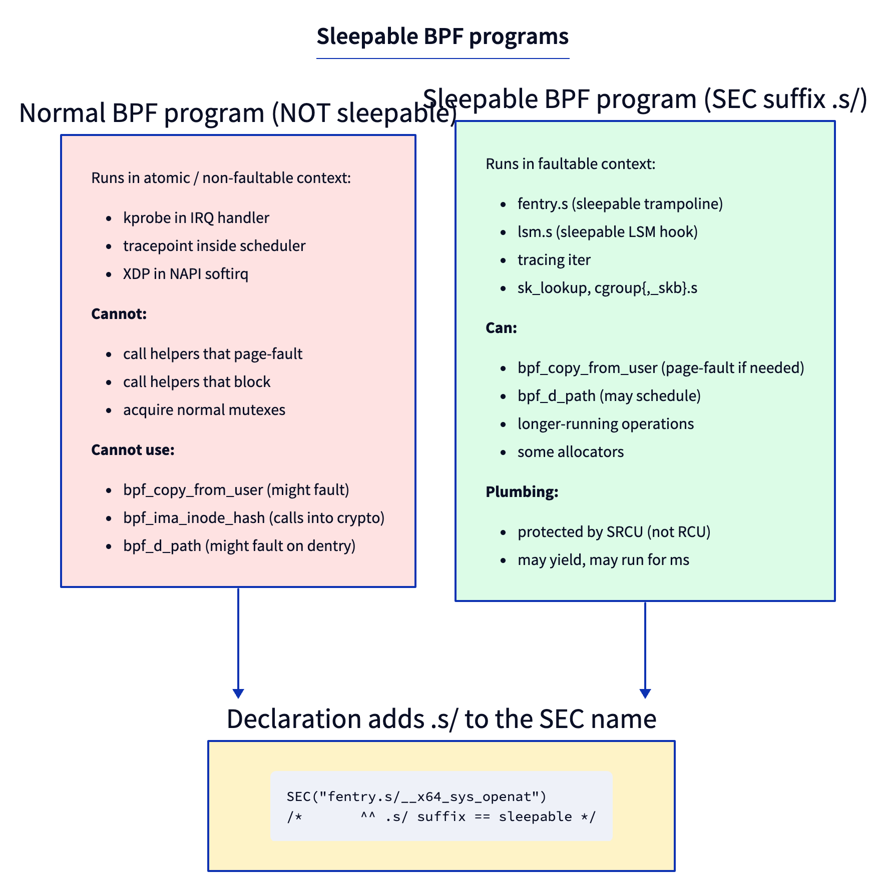
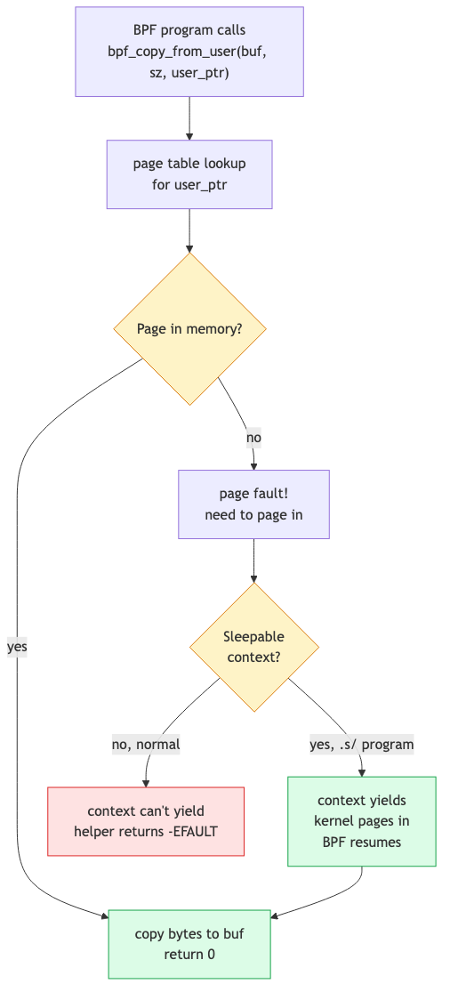
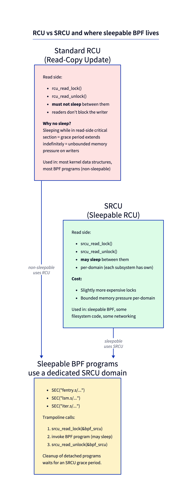

# Day 12 — Sleepable BPF: programs that can fault

> **Today's mission:** trace `openat` and read the path string *from userspace memory* — something a normal BPF program literally cannot do. Total time: ~75 minutes.

## The constraint you've been living under

Every BPF program you've written so far runs in **atomic context**. The kernel can't schedule the CPU away mid-execution; the BPF program must run start-to-finish without yielding. This is what makes BPF so cheap (no context switches, no scheduling) and what gates all the other guarantees.

A consequence: any helper that *might page-fault* is forbidden. Hitting an unmapped userspace page would require resolving the fault — which requires scheduling, which the context can't do.

Helpers in the forbidden list: `bpf_copy_from_user`, several crypto helpers. Until 5.10, the answer was "you can't do that from BPF."

**Sleepable BPF programs** lift the restriction.



## What "sleepable" actually means

The program is allowed to be in contexts where the kernel can schedule the current thread away. That means:
- It runs from a faultable code path (typically a syscall entry, an LSM hook, or an iterator).
- It can call helpers that may page-fault.
- It can take longer (microseconds rather than nanoseconds) without breaking timing assumptions.
- It's protected by a different RCU variant — **SRCU** — that allows readers to sleep.

You opt in with the `.s/` suffix on the SEC name:

```c
SEC("fentry.s/__x64_sys_openat")    /* sleepable fentry */
SEC("lsm.s/file_open")               /* sleepable LSM hook */
SEC("iter.s/task")                   /* sleepable iterator */
```

The Verifier tracks per-program sleepability. A sleepable program gets access to the wider helper set; a non-sleepable program calling a sleepable-only helper is rejected.

## Why page faults aren't free



When you call `bpf_copy_from_user(dst, sz, user_ptr)`:
1. Kernel translates `user_ptr` through the current task's page tables.
2. If the page is in memory, copy and return. ~100 ns.
3. If the page is *not* in memory, a fault is required. The kernel must:
   - Schedule the current thread off-CPU.
   - Page in from disk/swap.
   - Resume the thread.
   - Then the copy completes.

Steps 1–2 don't require sleep. Step 3 does. A non-sleepable BPF program that takes path 3 would deadlock or panic. The sleepable variant simply gets put to sleep and resumed when the page is ready.

## SRCU vs RCU



Standard RCU prohibits sleeping in the read-side critical section because grace-period progress depends on read sections completing. A sleeping reader pins the grace period indefinitely → unbounded memory pressure on writers.

**SRCU** (Sleepable RCU) is a per-domain variant where readers can sleep. Each domain pays a slightly higher cost per lock/unlock but doesn't block other domains' grace periods.

Sleepable BPF programs are wrapped in `srcu_read_lock(&bpf_srcu_struct)` / `srcu_read_unlock(...)`. When a sleepable program is detached, the kernel waits for an SRCU grace period before freeing the program — guaranteeing no in-flight invocation is mid-execution.

> ### There are no Dumb Questions
>
> **Q: Why isn't every BPF program sleepable by default?**
>
> A: Cost and reach. Non-sleepable programs use cheap RCU (~ns to enter/exit) and can attach to *any* context including IRQ handlers and softirqs. Sleepable programs use SRCU (more cost) and can only attach to faultable contexts (essentially syscall entries, LSM hooks, certain trampolines). Most tracers don't need to fault, so non-sleepable is the right default.
>
> **Q: Can I make my XDP program sleepable?**
>
> A: No. XDP runs in NAPI softirq — a non-faultable context by design. There's no `SEC("xdp.s/...")`. If you need to do something faulting in response to a packet, send the metadata to userspace and do the work there.
>
> **Q: My fentry program needs to read a userspace string. Without sleepable, what are my options?**
>
> A: Use `bpf_probe_read_user_str` instead — it doesn't fault on missing pages, it just returns `-EFAULT`. You get the data when the page happens to be in memory, and silently miss when not. For most observability use cases that's acceptable. For correctness-critical reads, use sleepable.

## The lab

### `openat_path.bpf.c`

```c
#include "vmlinux.h"
#include <bpf/bpf_helpers.h>
#include <bpf/bpf_tracing.h>

char LICENSE[] SEC("license") = "GPL";

struct event {
    __u32 pid;
    char comm[16];
    char path[256];
};

struct {
    __uint(type, BPF_MAP_TYPE_RINGBUF);
    __uint(max_entries, 256 * 1024);
} rb SEC(".maps");

/* Sleepable fentry — '.s/' suffix gives access to bpf_copy_from_user */
SEC("fentry.s/__x64_sys_openat")
int BPF_PROG(on_openat, struct pt_regs *regs)
{
    /* The syscall wrapper passes pt_regs; PARM2 is the path string */
    const char __user *upath = (const char *)PT_REGS_PARM2_CORE_SYSCALL(regs);
    if (!upath) return 0;

    struct event *e = bpf_ringbuf_reserve(&rb, sizeof(*e), 0);
    if (!e) return 0;

    e->pid = bpf_get_current_pid_tgid() >> 32;
    bpf_get_current_comm(&e->comm, sizeof(e->comm));

    /* This is the magic — only allowed in sleepable: */
    long ret = bpf_copy_from_user(e->path, sizeof(e->path) - 1, upath);
    if (ret < 0) {
        e->path[0] = 0;   /* couldn't read; emit empty */
    }

    bpf_ringbuf_submit(e, 0);
    return 0;
}
```

What's new:

- **`SEC("fentry.s/__x64_sys_openat")`** — the `.s/` makes it sleepable.
- **`__x64_sys_openat`** is the kernel's system call entry on x86_64. It receives `struct pt_regs *` (the wrapper unpacks args from the trap frame). On other arches the prefix differs (`__arm64_sys_openat`).
- **`PT_REGS_PARM2_CORE_SYSCALL(regs)`** — a CO-RE-aware macro that reads the second syscall argument across architectures. The path string is the second argument to `openat(dirfd, path, flags, mode)` (after dirfd).
- **`bpf_copy_from_user`** — the helper that may fault. Returns 0 on success, negative errno on failure. **Only callable from sleepable programs** — try it from a non-sleepable program and the Verifier rejects with `sleepable helper bpf_copy_from_user#148 in <context>`, where `<context>` names the non-sleepable context it found.

### `openat_path.c` — userspace

Reuses the exact ringbuf consumer skeleton from Day 01 (the `handle` callback plus the `ring_buffer__poll` loop in `main`). Only the print line changes — it pulls `pid`, `comm`, and `path` off the event so the output matches the Run section below:

```c
static int handle(void *ctx, void *data, size_t sz) {
    struct event *e = data;
    printf("PID %u (%s) opened %s\n", e->pid, e->comm, e->path);
    return 0;
}
```

### Run

```bash
make
sudo ./openat_path &
# In another terminal:
ls /etc
cat /etc/passwd
```

Expected:

```
PID 4001 (ls) opened /etc
PID 4002 (cat) opened /etc/passwd
```

You read userspace memory from the kernel, possibly faulting if the page wasn't resident, all without crashing.

One honest caveat: on a normal box the path string the caller just constructed is already page-resident, so every `bpf_copy_from_user` returns 0 and **no sleep is actually taken here**. What sleepability buys you is the guarantee that *if* the page were missing, the helper would safely sleep and page it in — whereas a non-sleepable program could not call the helper at all. To actually witness the fault path you would have to evict the page (e.g. `madvise(MADV_DONTNEED)` on the buffer) before the syscall. Printing `ret` from the consumer makes success-vs-`-EFAULT` visible if you want to confirm.

---

## What to break, in order

### Break 1 — Drop the `.s/` suffix

```c
SEC("fentry/__x64_sys_openat")
```

Verifier rejects:

```
sleepable helper bpf_copy_from_user#148 in <context>
```

(`<context>` is filled in with the non-sleepable context the Verifier found — e.g., the program type or attach point.) Lesson: `.s/` is what unlocks the sleepable helpers. Without it, the call is forbidden at verification time.

### Break 2 — Try `bpf_copy_from_user` in an XDP program

```c
SEC("xdp")
int xdp_prog(struct xdp_md *ctx) {
    char buf[16];
    bpf_copy_from_user(buf, sizeof(buf), (void *)0x12345678);
    return XDP_PASS;
}
```

Same rejection — helper not allowed. XDP can't be made sleepable; the design is fundamentally non-faultable.

### Break 3 — Emit large amounts to ringbuf

A sleepable fentry on `__x64_sys_openat` fires on every `open()`. On a busy system that's thousands per second. Run on a heavy workload (`find /usr | xargs cat > /dev/null`) and the consumer can't keep up — some records get dropped.

But you can't *see* those drops with the obvious command. A ringbuf is a stream, not a key/value store — it has no iteration and no built-in per-map drop counter — so `bpftool map dump` simply can't dump it:

```bash
sudo bpftool map dump name rb
```

It produces **no output and exits non-zero** (exit 255 on bpftool v7.7.0; some builds instead print a useless `Found 0 elements` line — either way you learn nothing about drops). Real drop visibility needs an explicit counter you add yourself: a `__u64` in a separate `BPF_MAP_TYPE_ARRAY`, incremented whenever `bpf_ringbuf_reserve()` returns NULL, then read with `bpftool map dump name <counter_map>`. You build exactly that in Day 13.

### Break 4 — Use `bpf_probe_read_user_str` instead

```c
bpf_probe_read_user_str(e->path, sizeof(e->path), upath);
```

This works in *non-sleepable* programs too. It doesn't fault — it returns `-EFAULT` if the page isn't resident. For tracing, the silent miss is usually acceptable; you trade a few dropped events for not needing sleepable.

When do you actually need sleepable? When dropping the event isn't acceptable (security policy, audit logs), or when you need a helper that *only* exists in sleepable form (`bpf_copy_from_user` and the crypto helpers).

A helper worth distinguishing from these: `bpf_d_path` (resolves a `struct path` to a string). It is *not* sleepable-only — its proto carries no `.might_sleep` flag. Instead it's gated by a **BTF allowlist**: the `.allowed` callback (`bpf_d_path_allowed` in `kernel/trace/bpf_trace.c`) only permits it when you're attached to one of a fixed set of functions (`security_file_open`, `vfs_getattr`, `filp_close`, `dentry_open`, …), or from a BPF iterator. `bpf_ima_inode_hash` is gated the same way (`bpf_ima_inode_hash_allowed`). So if `bpf_d_path` is rejected, the fix isn't `.s/` — it's attaching to an allowlisted function.

---

## What to read in the kernel

- **`kernel/bpf/trampoline.c`** — search `__bpf_prog_enter_sleepable`. The wrapper that takes the SRCU read-side lock around sleepable program invocation.
- **`kernel/bpf/verifier.c`** — search `in_sleepable_context`. How the Verifier decides which helpers a program may call.
- **`Documentation/RCU/Design/Requirements/Requirements.rst`** — the RCU/SRCU design doc. Skim the SRCU section.
- **`tools/testing/selftests/bpf/progs/lsm.c`** — sleepable LSM example (see `SEC("lsm.s/bprm_committed_creds")`).
- **`include/linux/bpf.h`** — search `enum bpf_prog_type` and look at flags like `sleepable` in `struct bpf_prog`.

---

## Bullet Points

- **Sleepable BPF programs** can run in faultable contexts and call helpers that page-fault or schedule.
- Opt in via the **`.s/` suffix** on the SEC name (`SEC("fentry.s/...")`, `SEC("lsm.s/...")`).
- Sleepable programs can use: `bpf_copy_from_user`, the crypto helpers, and other helpers marked sleepable-only. (`bpf_d_path` and `bpf_ima_inode_hash` are *not* sleepable-only — they're gated by a BTF allowlist of attach targets instead.)
- **Cost:** SRCU read-side instead of RCU, slightly more expensive but bounded.
- **Limit:** only attach types that run in faultable contexts can be sleepable — fentry on syscalls, LSM hooks, iterators. **Not** XDP, NAPI softirq, or IRQ handlers.
- For tracing reads where occasional misses are OK, prefer **`bpf_probe_read_user_str`** in a non-sleepable program — cheaper and doesn't require sleepable plumbing.

---

## Check question

You write a sleepable fentry program that calls `bpf_copy_from_user` to read a 4 KB buffer. The user pointer is valid but the page isn't currently in memory. What happens to the BPF program's execution timeline?

<details>
<summary>Click to reveal answer</summary>

**Answer:** The helper detects the missing page, the kernel takes a fault, the current thread is descheduled while the page is paged in. The BPF program is *suspended* at the helper call (still inside `srcu_read_lock`). When the page becomes available, the thread resumes, the copy completes, the helper returns. From the BPF program's perspective, the helper call took ~ms (instead of ~ns) but otherwise behaved normally. From the kernel's perspective, the sleepable program correctly held its SRCU read-side lock across the schedule and the grace-period machinery handled it.

</details>

---

## Tomorrow

Day 13: ringbuf at scale. What happens when your tracer is faster than its consumer. Drop counters, force-wakeup, and `bpf_dynptr` for variable-size events. Last day of Phase 2.
