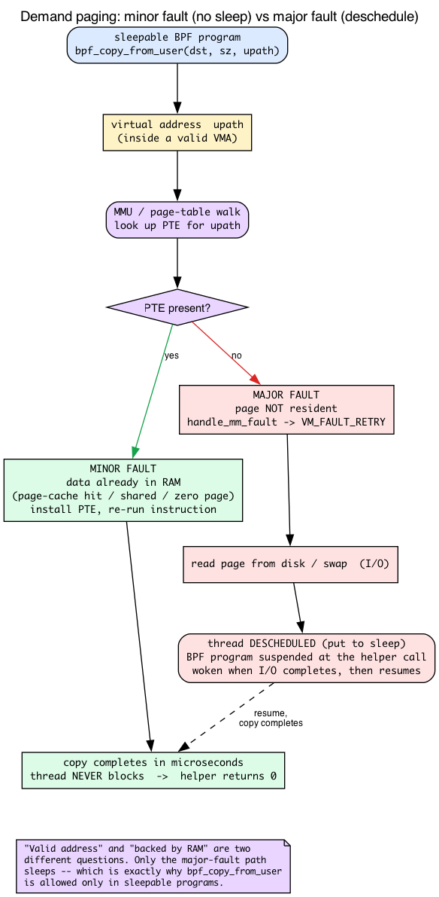
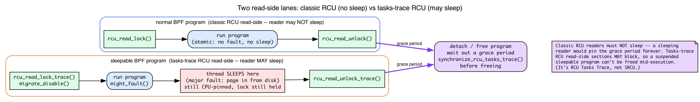

# Day 12 — Sleepable BPF: programs that can fault

> **Today's mission:** trace `openat` and read the path string *from userspace memory* — something a normal BPF program literally cannot do. Along the way, learn what a page fault actually *is* (demand paging, minor vs major faults), what it means for kernel code to "sleep," which contexts forbid sleeping and which allow it, and the real synchronization mechanism that protects sleepable programs (it is **not** SRCU — the kernel changed, and a lot of docs are stale). Total time: ~100 minutes.

## The constraint you've been living under

Every BPF program you've written so far runs in **atomic context**. The kernel can't schedule the CPU away mid-execution; the BPF program must run start-to-finish without yielding. This is what makes BPF so cheap (no context switches, no scheduling) and what gates all the other guarantees.

You met the *consequences* of that on earlier days without us naming the cause. On Day 2 the hash map's bucket lock had to be a **raw** spinlock specifically "because BPF programs run in atomic contexts where you cannot take a sleeping lock." On Day 5 the Verifier insisted your program **terminate** in bounded time because it runs where preemption and IRQs may be off. Today we finally turn that constraint over and look underneath it — and then we lift it.

A direct consequence of atomic context: any helper that *might page-fault* is forbidden. Hitting an unmapped userspace page would require resolving the fault — which can require scheduling the thread away, which atomic context can't do.

Helpers in the forbidden list: `bpf_copy_from_user` (and its task variant `bpf_copy_from_user_task`). Before sleepable BPF existed, the answer was "you can't do that from BPF."

**Sleepable BPF programs** lift the restriction.


## First, what does "sleep" even mean in the kernel?

The word "sleep" is doing a lot of load-bearing work today, and it does *not* mean "wait for a timer" or "delay." In kernel terms, **to sleep is to voluntarily block**: the current thread is put on a wait queue, the scheduler picks some other runnable task and switches to it, and the original thread resumes later when whatever it was waiting for is ready. The CPU is *not* spinning — it goes and does useful work for someone else in the meantime.

The kernel even has a built-in annotation for "this function may block":

```c
/* include/linux/kernel.h:79 — might_sleep() is an annotation, not an action */
/* might_sleep - annotation for functions that can sleep */
# define might_sleep() \
    do { __might_sleep(__FILE__, __LINE__); might_resched(); } while (0)
```

`might_sleep()` (`include/linux/kernel.h:90`, with `__might_sleep` declared at `:74`) is a debugging tripwire: drop it into a function, and if that function is ever called from a context where sleeping is illegal, the kernel screams. Hold that thought — we'll see the sleepable BPF trampoline call its faulting cousin `might_fault()` in a minute.

### Faultable vs non-faultable contexts

So why can't *every* kernel code path sleep? Because in some contexts there is **no task to safely block**, and blocking would deadlock or stall the CPU:

- **Interrupt handlers and softirqs.** A softirq — the deferred-interrupt context where packet-processing program types like XDP run — is **not a schedulable entity**. There's no "thread" the scheduler can park and resume — so it cannot sleep. This is exactly why XDP can never be made sleepable.
- **Code holding a spinlock**, or with **preemption explicitly disabled.** Sleeping here would either deadlock (another CPU spinning forever on the lock you're holding) or strand the CPU.

These are **non-faultable / atomic** contexts. Everything you've attached to so far — kprobes, XDP, tc, raw tracepoints — lives here.

- **Ordinary process/thread context with preemption allowed** is **faultable.** Syscall entry, most LSM hooks (Linux Security Module callbacks), BPF iterators. Here the *current thread* is a real schedulable task: it can be descheduled and resumed. So a major fault — or any helper that might sleep — is safe.

That last set is precisely the set of attach points that can be made sleepable. Keep the picture simple: **sleepable-eligible = faultable = "there's a real thread here we can safely put to sleep and wake up later."**

> One subtlety worth a single sentence: even a *sleepable* BPF program runs under `migrate_disable()`, not full preemption — so it may sleep, but it stays pinned to the CPU it started on (so per-CPU map access stays correct). You'll see that in the trampoline code below.

## What "sleepable" actually means

The program is allowed to be in contexts where the kernel can schedule the current thread away. That means:
- It runs from a faultable code path (typically a syscall entry, an LSM hook, or an iterator).
- It can call helpers that may page-fault.
- It can take longer (microseconds — or, on a real fault, milliseconds — rather than nanoseconds) without breaking timing assumptions.
- It's protected by a different RCU variant — **RCU Tasks Trace** — that allows readers to sleep. (Older write-ups call it SRCU. That's wrong for modern kernels; we fix it properly below.)

You opt in with the `.s/` suffix on the SEC name:

```c
SEC("fentry.s/__x64_sys_openat")    /* sleepable fentry */
SEC("lsm.s/file_open")               /* sleepable LSM hook */
SEC("iter.s/task")                   /* sleepable iterator */
```

The Verifier tracks per-program sleepability. A sleepable program gets access to the wider helper set; a non-sleepable program calling a sleepable-only helper is rejected.

## What a page fault actually IS

Before we can talk about *why* `bpf_copy_from_user` might sleep, you need to know what a page fault is and why a perfectly valid pointer can point at memory that isn't there. This is the concept the whole chapter rests on, so we'll build it from the ground up.

### Demand paging: a valid pointer with no physical page behind it

When a process allocates memory — `malloc`, a growing stack, a freshly `mmap`'d region — the kernel records a **VMA** (virtual memory area): "addresses `X` through `Y` are legally yours." But it does **not** immediately go find physical RAM to back every one of those addresses. That would be wasteful — most programs touch only a fraction of what they reserve. Instead the kernel waits until the program *actually touches* an address, and only then finds a physical page for it. This laziness is called **demand paging**.

The consequence is the thing that surprises everyone the first time: a pointer can be **valid** — it lands inside a mapped VMA, the kernel agrees you're allowed to read it — and yet have **no resident physical page** behind it right now. "Valid address" and "address backed by RAM" are two different questions.

How does the hardware tell the difference? Through the **page table**. The CPU's MMU translates every virtual address to a physical one by walking page-table entries (PTEs). If the PTE for an address says **"not present,"** the MMU can't complete the translation and raises a **page fault** — a CPU trap into the kernel's fault handler.

### The handler's decision, and minor vs major faults

The fault handler's first job is to decide: is this a *legal* access into a real VMA, or a bug?

- **Illegal** (the address isn't in any VMA — a wild pointer): deliver **SIGSEGV**. This is the segfault you know.
- **Legal** (inside a VMA, just not yet backed): **fix it up** — allocate a page, zero-fill it, copy-on-write it, or read it back from disk/swap — then install the PTE and let the faulting instruction re-run as if nothing happened.

When the access is legal, there are two very different costs, and the distinction is the entire reason sleepable BPF exists:

- **Minor fault** — the data is *already in RAM*; the kernel just needs to install a PTE pointing at it. This happens for a shared page, the shared zero page, or a page-cache hit (the file's bytes are already cached). **Fast, and the thread never blocks.**
- **Major fault** — the page must be **fetched from disk or swap**. That's I/O, which takes essentially forever in CPU terms. The faulting thread is **descheduled (put to sleep)** until the I/O completes, then woken and resumed. **This is the case that requires a sleepable context.**



On x86, the userspace fault entry is `do_user_addr_fault` (`arch/x86/mm/fault.c:1207`). Read two lines in it and the minor/major split jumps out: `if (fault & VM_FAULT_MAJOR)` (`fault.c:1343`) is the disk/swap branch, and `if (unlikely(fault & VM_FAULT_RETRY))` (`fault.c:1408`) is the "we had to drop the mmap lock and may block" branch. Both route through the core resolver `handle_mm_fault` (`mm/memory.c:6699`). `VM_FAULT_RETRY` — the "we had to drop the lock and may block" signal — is returned by deeper fault helpers such as `vmf_can_call_fault` (`mm/memory.c:3800`) and `__vmf_anon_prepare` (`mm/memory.c:3827`) and propagated out through `handle_mm_fault`.

### Tying it to the helper

Here's why this matters for us. `bpf_copy_from_user` is, underneath, an ordinary `copy_from_user`:

```c
/* kernel/bpf/helpers.c:659 — bpf_copy_from_user body */
int ret = copy_from_user(dst, user_ptr, size);
if (unlikely(ret)) {
    memset(dst, 0, size);   /* on failure, zero the dst... */
    ret = -EFAULT;          /* ...and report EFAULT */
}
```

`copy_from_user` touches the user address — and if the page isn't present, it goes through the *exact* `do_user_addr_fault → handle_mm_fault` machinery above. If that's a minor fault, the copy completes in microseconds and nobody sleeps. If it's a major fault, the thread blocks until the page is read in. A non-sleepable program **cannot be allowed anywhere near that second path**, which is why the helper is gated. The helper even advertises the risk to the Verifier:

```c
/* kernel/bpf/helpers.c:675 — the per-helper flag the Verifier checks */
.might_sleep = true,
```

## Why a sleepable program is safe to detach: RCU Tasks Trace (not SRCU)

There's one more piece. If a sleepable BPF program can sit suspended in the middle of a major fault for milliseconds, how does the kernel safely **free** that program when you detach it? It must guarantee no invocation is still in flight before it reclaims the program's memory — otherwise it'd be freeing code that's mid-execution.

You already know the shape of this answer from **Day 2's RCU section**: readers run inside a *read-side critical section*, writers wait for a *grace period* (until all in-flight readers finish), and freeing is *deferred* so memory can't vanish under a reader. That's the same idea here — only the *flavor* of RCU is different, because classic RCU readers are **not allowed to sleep** (a sleeping reader would pin the grace period forever and starve writers). A sleepable BPF program obviously *can* sleep, so classic RCU won't do.

The variant designed for exactly this is **RCU Tasks Trace** (a.k.a. tasks-trace RCU). Its read-side critical sections *may block*, and its writer-side grace period waits until every CPU has passed through a point where no tasks-trace reader is active.



You can see it in the trampoline. The wrapper that runs a sleepable program does **not** take an SRCU lock — it takes the tasks-trace read lock and disables migration (so it stays CPU-pinned even while it can fault):

```c
/* kernel/bpf/trampoline.c:1250 — __bpf_prog_enter_sleepable() */
rcu_read_lock_trace();
migrate_disable();
might_fault();          /* "I might take a fault / sleep here" */
```

The recursion-aware pair `__bpf_prog_enter_sleepable_recur` / `__bpf_prog_exit_sleepable_recur` (`trampoline.c:1221`–`:1247`) bracket the program with `rcu_read_lock_trace()` / `rcu_read_unlock_trace()` the same way. And the kernel spells out the contrast in a comment — sleepable uses trace RCU, normal uses classic RCU:

```c
/* kernel/bpf/trampoline.c:518 */
/* rcu_read_lock_trace to protect sleepable bpf progs
 * rcu_read_lock to protect normal bpf progs
 */
```

On detach, the kernel waits out a tasks-trace grace period before freeing — `synchronize_rcu_tasks_trace()` is the call, named explicitly in the syscall-side comment (`kernel/bpf/syscall.c:157`: "For sleepable BPF programs, `synchronize_rcu_tasks_trace()` should be used to wait for the completions of these programs"), with the fentry trampoline image freed after a tasks-trace grace period via `call_rcu_tasks_trace` (`kernel/bpf/trampoline.c:562`), which then chains `call_rcu_tasks` to drain the trampoline asm and normal progs. So the intuition you'd expect — "wait for a grace period before freeing so no in-flight invocation is mid-execution" — is exactly right. Only the RCU *flavor name* matters: it's **RCU Tasks Trace**, not SRCU.

> ### There are no Dumb Questions
>
> **Q: Why isn't every BPF program sleepable by default?**
>
> A: Cost and reach. Non-sleepable programs use cheap classic RCU (~ns to enter/exit) and can attach to *any* context including IRQ handlers and softirqs. Sleepable programs use RCU Tasks Trace (more cost) and can only attach to faultable contexts (essentially syscall entries, LSM hooks, certain trampolines). Most tracers don't need to fault, so non-sleepable is the right default.
>
> **Q: Can I make my XDP program sleepable?**
>
> A: No. XDP runs in softirq context — a non-faultable context by design (a softirq isn't a schedulable thread, so there's nothing to put to sleep). There's no `SEC("xdp.s/...")`. If you need to do something faulting in response to a packet, send the metadata to userspace and do the work there.
>
> **Q: My fentry program needs to read a userspace string. Without sleepable, what are my options?**
>
> A: Use `bpf_probe_read_user_str` instead — it doesn't fault on missing pages, it just returns `-EFAULT`. You get the data when the page happens to be in memory, and silently miss when not. For most observability use cases that's acceptable. For correctness-critical reads, use sleepable.

## The lab

### `openat_path.bpf.c`

```c
#include "vmlinux.h"
#include <bpf/bpf_helpers.h>
#include <bpf/bpf_tracing.h>

char LICENSE[] SEC("license") = "GPL";

struct event {
    __u32 pid;
    char comm[16];
    char path[256];
};

struct {
    __uint(type, BPF_MAP_TYPE_RINGBUF);
    __uint(max_entries, 256 * 1024);
} rb SEC(".maps");

/* Sleepable fentry — '.s/' suffix gives access to bpf_copy_from_user */
SEC("fentry.s/__x64_sys_openat")
int BPF_PROG(on_openat, struct pt_regs *regs)
{
    /* The syscall wrapper passes pt_regs; PARM2 is the path string */
    const char __user *upath = (const char *)PT_REGS_PARM2_CORE_SYSCALL(regs);
    if (!upath) return 0;

    struct event *e = bpf_ringbuf_reserve(&rb, sizeof(*e), 0);
    if (!e) return 0;

    e->pid = bpf_get_current_pid_tgid() >> 32;
    bpf_get_current_comm(&e->comm, sizeof(e->comm));

    /* This is the magic — only allowed in sleepable: */
    long ret = bpf_copy_from_user(e->path, sizeof(e->path) - 1, upath);
    if (ret < 0) {
        e->path[0] = 0;   /* couldn't read; emit empty */
    }

    bpf_ringbuf_submit(e, 0);
    return 0;
}
```

### Why the syscall hook takes a single `struct pt_regs *`

There's a snag worth pausing on. On **Day 7** you learned that an `fentry` program on an ordinary kernel function gets the function's arguments as **typed kernel objects** — `BPF_PROG(on_x, struct file *f, int flags)` just works, because the BTF signature says so. You also met `pt_regs` there as a *saved register snapshot* (for kprobes), and saw that each program type has its own ctx layout. So why, for `__x64_sys_openat`, are we suddenly back to a raw `struct pt_regs *` and a `PARM2` macro instead of typed args?

Because a modern x86-64 syscall doesn't have the signature you'd expect. `SYSCALL_DEFINE4(openat, ...)` (confirmed at `fs/open.c:1381`, where the 2nd logical arg `filename` is indeed `const char __user *`) expands into a thin wrapper:

```c
long __x64_sys_openat(const struct pt_regs *regs);
```

The wrapper's job is to pull the individual syscall arguments out of the saved register frame and hand them to the real worker (`__do_sys_openat`). So at the `fentry` attach point, `__x64_sys_openat`'s BTF signature genuinely has **exactly one argument: a `struct pt_regs *`** — *not* the four logical `openat` args. You can't write `BPF_PROG(on_openat, int dfd, const char *path, ...)`; the type information simply isn't there. You take `regs` and decode it yourself.

`PT_REGS_PARM2_CORE_SYSCALL(regs)` is the accessor for "the 2nd syscall argument" under this wrapper convention. The `_CORE_` variant is CO-RE-aware — it reads the right register field through `BPF_CORE_READ`, so it relocates correctly across kernels and arches (`tools/lib/bpf/bpf_tracing.h:545`; the plain `PT_REGS_PARM2_SYSCALL` at `:544` is a direct field read). `openat(dfd, path, flags, mode)` → `PARM2` is `path`. On other arches the wrapper prefix changes (`__arm64_sys_openat`), which is exactly why you want the CO-RE form.

### Back to the program — what's new

- **`SEC("fentry.s/__x64_sys_openat")`** — the `.s/` makes it sleepable.
- **`__x64_sys_openat`** is the kernel's system-call entry on x86-64. As just explained, it receives a single `struct pt_regs *` (the wrapper unpacks the logical args from the trap frame). On other arches the prefix differs (`__arm64_sys_openat`).
- **`PT_REGS_PARM2_CORE_SYSCALL(regs)`** — the CO-RE-aware macro that reads the second syscall argument across architectures. The path string is the second argument to `openat(dirfd, path, flags, mode)` (after dirfd).
- **`bpf_copy_from_user`** — the helper that may fault. Returns 0 on success, negative errno on failure. **Only callable from sleepable programs** — try it from a non-sleepable program and the Verifier rejects with `sleepable helper bpf_copy_from_user#148 in <context>`, where `<context>` names the non-sleepable context it found. (Func id 148 is fixed in the UAPI: `FN(copy_from_user, 148, ...)` at `include/uapi/linux/bpf.h:6053`.)

### `openat_path.c` — userspace

Reuses the exact ringbuf consumer skeleton from Day 01 (the `handle` callback plus the `ring_buffer__poll` loop in `main`). Only the print line changes — it pulls `pid`, `comm`, and `path` off the event so the output matches the Run section below:

```c
static int handle(void *ctx, void *data, size_t sz) {
    struct event *e = data;
    printf("PID %u (%s) opened %s\n", e->pid, e->comm, e->path);
    return 0;
}
```

### Run

```bash
make
sudo ./openat_path &
# In another terminal:
ls /etc
cat /etc/passwd
```

Expected:

```
PID 4001 (ls) opened /etc
PID 4002 (cat) opened /etc/passwd
```

You read userspace memory from the kernel, possibly faulting if the page wasn't resident, all without crashing.

One honest caveat: on a normal box the path string the caller just constructed is already page-resident (the syscall's caller literally just wrote those bytes — a guaranteed minor fault at worst, usually no fault), so every `bpf_copy_from_user` returns 0 and **no sleep is actually taken here**. What sleepability buys you is the guarantee that *if* the page were missing — the major-fault case from the demand-paging section — the helper would safely sleep and page it in, whereas a non-sleepable program could not call the helper at all. To actually witness the fault path you would have to evict the page (e.g. `madvise(MADV_DONTNEED)` on the buffer) before the syscall. Printing `ret` from the consumer makes success-vs-`-EFAULT` visible if you want to confirm.

---

## What to break, in order

### Break 1 — Drop the `.s/` suffix

```c
SEC("fentry/__x64_sys_openat")
```

Verifier rejects:

```
sleepable helper bpf_copy_from_user#148 in <context>
```

(`<context>` is filled in with the non-sleepable context the Verifier found — e.g., the program type or attach point.) This is the exact `verbose(env, "sleepable helper %s#%d in %s\n", ...)` string at `kernel/bpf/verifier.c:10331`, emitted from the `if (fn->might_sleep && !in_sleepable_context(env))` check at `:10330`. Lesson: `.s/` is what unlocks the sleepable helpers. Without it, the call is forbidden at verification time.

### Break 2 — Try `bpf_copy_from_user` in an XDP program

```c
SEC("xdp")
int xdp_prog(struct xdp_md *ctx) {
    char buf[16];
    bpf_copy_from_user(buf, sizeof(buf), (void *)0x12345678);
    return XDP_PASS;
}
```

Same rejection — helper not allowed. XDP can't be made sleepable; it runs in softirq context, which (as we established) isn't a schedulable thread and so is fundamentally non-faultable.

### Break 3 — Emit large amounts to ringbuf

A sleepable fentry on `__x64_sys_openat` fires on every `open()`. On a busy system that's thousands per second. Run on a heavy workload (`find /usr | xargs cat > /dev/null`) and the consumer can't keep up — some records get dropped.

But you can't *see* those drops with the obvious command. A ringbuf is a stream, not a key/value store — it has no iteration and no built-in per-map drop counter — so `bpftool map dump` simply can't dump it:

```bash
sudo bpftool map dump name rb
```

It prints a useless `Found 0 elements` line and **exits non-zero** (exit 244 on bpftool v7.7.0; some builds instead produce no output at all — either way you learn nothing about drops). Real drop visibility needs an explicit counter you add yourself: a `__u64` in a separate `BPF_MAP_TYPE_ARRAY`, incremented whenever `bpf_ringbuf_reserve()` returns NULL, then read with `bpftool map dump name <counter_map>`. You build exactly that in Day 13.

### Break 4 — Use `bpf_probe_read_user_str` instead

```c
bpf_probe_read_user_str(e->path, sizeof(e->path), upath);
```

This works in *non-sleepable* programs too. It doesn't fault — it returns `-EFAULT` if the page isn't resident. For tracing, the silent miss is usually acceptable; you trade a few dropped events for not needing sleepable.

When do you actually need sleepable? When dropping the event isn't acceptable (security policy, audit logs), or when you need a helper that *only* exists in sleepable form (`bpf_copy_from_user`, `bpf_copy_from_user_task`).

A helper worth distinguishing from these: `bpf_d_path` (resolves a `struct path` to a string). It is *not* sleepable-only — its proto carries no `.might_sleep` flag. Instead it's gated *purely* by a **BTF allowlist**: the `.allowed` callback (`bpf_d_path_allowed` in `kernel/trace/bpf_trace.c:947`, wired at `bpf_d_path_proto`'s `.allowed` field, `:970`) only permits it when you're attached to one of a fixed set of functions (`security_file_open`, `vfs_getattr`, `filp_close`, `dentry_open`, …, in the `btf_allowlist_d_path` set), or from a BPF iterator. So if `bpf_d_path` is rejected, the fix isn't `.s/` — it's attaching to an allowlisted function.

Contrast this with `bpf_ima_inode_hash` / `bpf_ima_file_hash`, which are gated by **both** mechanisms at once: their protos carry `.might_sleep = true` (`kernel/bpf/bpf_lsm.c:181` and `:200`) **and** a `.allowed` allowlist callback (`bpf_ima_inode_hash_allowed`, `:187`). So they require a *sleepable* program (rejected by the same `.might_sleep` gate that rejects `bpf_copy_from_user`) *and* an allowlisted attach target. Only `bpf_d_path` is the clean "allowlist-but-not-sleepable" example.

---

## What to read in the kernel

- **`kernel/bpf/trampoline.c`** — search `__bpf_prog_enter_sleepable` (`:1250`). The wrapper that takes the **tasks-trace RCU** read-side lock (`rcu_read_lock_trace()`), `migrate_disable()`s, and calls `might_fault()` around a sleepable program invocation. The comment at `:518` lays out trace-RCU-vs-classic-RCU explicitly.
- **`kernel/bpf/verifier.c`** — search `in_sleepable_context` (`:10253`). How the Verifier decides which helpers a program may call; the `.might_sleep` gate is at `:10330`.
- **`kernel/bpf/helpers.c`** — `bpf_copy_from_user` body (`:659`) and its `.might_sleep = true` proto flag (`:675`).
- **`Documentation/RCU/Design/Requirements/Requirements.rst`** plus the **Tasks RCU** material — the relevant design notes are the **Tasks-Trace RCU** sections (the load-bearing code is `__bpf_prog_enter_sleepable` in `trampoline.c`). Ignore older "SRCU protects sleepable BPF" claims; that's stale.
- **`tools/testing/selftests/bpf/progs/lsm.c`** — sleepable LSM example (see `SEC("lsm.s/bprm_committed_creds")` at `:111`).
- **`include/linux/bpf.h`** — search `struct bpf_prog` and find the `sleepable:1` flag bit (`:1794`).

---

## Bullet Points

- **A page fault** is a CPU trap taken when the MMU finds a "not present" PTE. Userspace memory is **demand-paged**: a pointer can be *valid* (inside a VMA) yet have no resident page. The handler does **minor faults** (page already in RAM → install PTE, no sleep) and **major faults** (read from disk/swap → thread descheduled). Major faults are the reason sleepable BPF exists.
- **"Sleep" in the kernel = block/deschedule**, not delay. Forbidden in **non-faultable/atomic** contexts (IRQ, softirq/XDP, spinlock held, preemption off); allowed in **faultable** contexts (syscall entry, most LSM hooks, iterators).
- **Sleepable BPF programs** can run in faultable contexts and call helpers that page-fault or schedule. Opt in via the **`.s/` suffix** (`SEC("fentry.s/...")`, `SEC("lsm.s/...")`).
- Sleepable programs can use helpers marked `.might_sleep`: `bpf_copy_from_user` / `bpf_copy_from_user_task` (and the IMA hashers `bpf_ima_inode_hash` / `bpf_ima_file_hash`, which *additionally* require an attach-target allowlist). (`bpf_d_path` is *not* sleepable-only — it's gated purely by a BTF allowlist of attach targets, with no `.might_sleep` flag.)
- **Cost & protection:** sleepable progs run under an **RCU Tasks Trace** read-side (`rcu_read_lock_trace`) plus `migrate_disable()` — slightly more expensive than classic RCU, but it permits sleeping. Detach waits a **tasks-trace grace period** (`synchronize_rcu_tasks_trace`) before freeing. (Not SRCU — that's an outdated name.)
- **Limit:** only attach types that run in faultable contexts can be sleepable — fentry on syscalls, LSM hooks, iterators. **Not** XDP, softirq, or IRQ handlers.
- Modern x86-64 **syscall hooks take a single `struct pt_regs *`** (the `SYSCALL_DEFINEn` wrapper convention), so you decode args with `PT_REGS_PARM*_CORE_SYSCALL`, not typed `BPF_PROG` params.
- For tracing reads where occasional misses are OK, prefer **`bpf_probe_read_user_str`** in a non-sleepable program — cheaper and doesn't require sleepable plumbing.

---

## Check question

You write a sleepable fentry program that calls `bpf_copy_from_user` to read a 4 KB buffer. The user pointer is valid but the page isn't currently in memory. What happens to the BPF program's execution timeline?

<details>
<summary>Click to reveal answer</summary>

**Answer:** The helper's `copy_from_user` touches the user address, the MMU finds the PTE not present, and the kernel takes a fault. Because the page must be fetched (a **major fault**), the current thread is **descheduled** while the page is paged in from disk/swap. The BPF program is *suspended* at the helper call — still inside its **tasks-trace RCU read-side critical section** (`rcu_read_lock_trace`), still `migrate_disable()`d to its CPU. When the page becomes available, the thread resumes, the copy completes, the helper returns. From the BPF program's perspective, the helper call took ~ms (instead of ~ns) but otherwise behaved normally. From the kernel's perspective, the sleepable program correctly held its tasks-trace read-side lock across the schedule, and the grace-period machinery (`synchronize_rcu_tasks_trace` on detach) guarantees the program can't be freed while it's parked here.

</details>

---

## Tomorrow

Day 13: ringbuf at scale. What happens when your tracer is faster than its consumer. Drop counters, force-wakeup, and `bpf_dynptr` for variable-size events. Last day of Phase 2.
